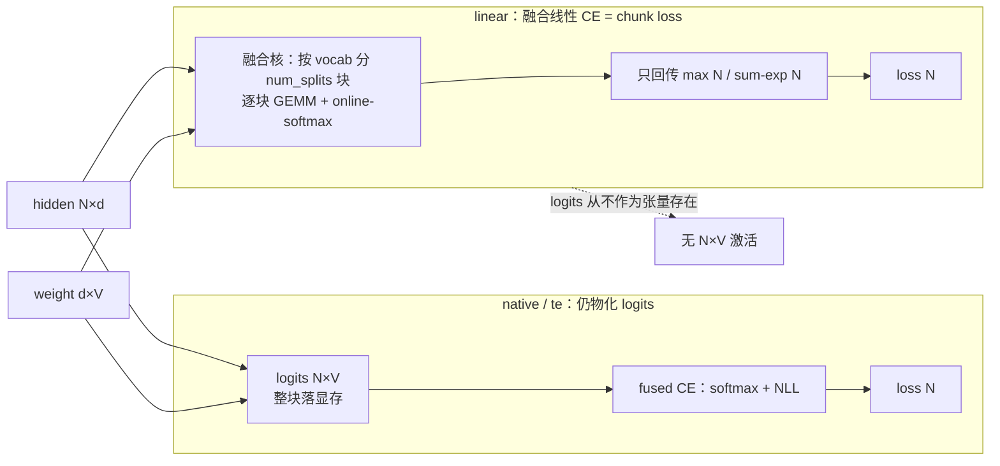

# Megatron-LM 融合线性交叉熵(Fused Linear Cross-Entropy / "chunk loss")源码级分析

> **代码基线**: Megatron-LM `dev` @ `232c478d4`(2026-06-16)
> **维度**: 深挖(机制级 + 具体源码实现)
> 本页回答:Megatron 里"chunk loss"(不物化全量词表 logits 的省显存损失)到底怎么实现?它对应配置 `cross_entropy_fusion_impl='linear'` 的**融合线性交叉熵**——把 LM-head 矩阵乘**融进**交叉熵核、logits 从不作为张量存在。对照另两档 `native`/`te`(仍物化 logits)与 MindSpeed 的 `chunk_loss`(见文末)。每条非平凡结论带 `file:line`,行号均经实际打开核对。

---

## 1. 总览:logits 显存墙与三档融合

语言模型的最后一步是 LM head:`hidden[N, d] @ Wᵀ[d, V] → logits[N, V]`,再对 `logits` 求交叉熵。问题在 **V(词表,常 ~15 万)远大于 d(hidden,~6–8K)**,`logits[N, V]` 这块张量是整个前向里最大的激活之一,且默认要为反向保留。

> 例:`N=8192`(一个 micro-batch 的 token 数)、`V=152064`、bf16 → `logits` ≈ **2.49 GB**;加上 softmax 中间量,LM-head 一处就能吃掉数 GB,还得为反向常驻。

Megatron 用一个**总开关 + 三档实现**来融合这步(`megatron/core/model_parallel_config.py`):

```python
# model_parallel_config.py:257,262
cross_entropy_loss_fusion: bool = False                               # 总开关
cross_entropy_fusion_impl: Literal['native', 'te', 'linear'] = 'native'
```

| impl | 入口 | 融合范围 | 是否物化 `logits[N,V]` |
|---|---|---|---|
| `native`(默认) | `fused_vocab_parallel_cross_entropy(logits,…)` | 只融 softmax+NLL | **是** |
| `te` | `te_parallel_cross_entropy(logits,…)` | 只融 softmax+NLL(TE 核) | **是** |
| **`linear`** | **`LinearCrossEntropyModule` → 融合核** | **matmul + softmax + NLL 全融** | **否** ← 这才是 "chunk loss" |

**一条主线**:`native`/`te` 接收的是**已经算好的 `logits`**,只是把"softmax→取标签项→求和"融成一个核;省的是几个逐元素 kernel,不省 logits 显存。`linear` 不同——它把 **LM-head 的矩阵乘也吸进 CE 核**,在核内**按词表分块(chunk)**地算 `hidden@Wᵀ` 并做 online-softmax,**完整 `logits[N,V]` 从不落显存**;反向再按块重算。这就是 Megatron 版"chunk loss"。



---

## 2. 配置选路:GPT 模型如何挑到 `linear`

`GPTModel.__init__` 把"是否用融合线性 CE"算成一个布尔位(`megatron/core/models/gpt/gpt_model.py`):

```python
# gpt_model.py:157-160
self.fuse_linear_cross_entropy = (
    self.config.cross_entropy_loss_fusion
    and self.config.cross_entropy_fusion_impl == "linear"
)
```

命中时,**输出层的类被换掉**——不再是普通 `ColumnParallelLinear`,而是 `LinearCrossEntropyModule`(`gpt_model.py:263`,`from ...linear_cross_entropy import LinearCrossEntropyModule` @ `:31`)。前向算 loss 时走专门分支:

```python
# gpt_model.py:799-805
output_layer_kwargs = dict(input_=hidden_states, weight=output_weight, ...)
if self.fuse_linear_cross_entropy:
    loss = self.output_layer(
        output_cross_entropy_loss=self.fuse_linear_cross_entropy,   # ← 让输出层直接吐 loss
        labels=labels,
        **output_layer_kwargs,
    )
else:
    ...                                                              # 普通路径:先出 logits
```

而 `native`/`te` 两档不换输出层类——它们在 `LanguageModule.compute_language_model_loss` 里**拿到 `logits` 之后**才融合(`megatron/core/models/common/language_module/language_module.py`):

```python
# language_module.py:157,180  —— 注意两者的入参都是 logits
if self.config.cross_entropy_fusion_impl == 'te':
    loss = te_parallel_cross_entropy(logits, labels, self.pg_collection.tp, is_cg_capturable)  # :166
elif self.config.cross_entropy_fusion_impl == 'native':
    loss = fused_vocab_parallel_cross_entropy(logits, labels, self.pg_collection.tp)            # :180
```

> 选路里还有约束:`cross_entropy_loss_fusion + impl=='te'` 与某些配置不兼容,在 `model_parallel_config.py:488-492` 与 `arguments.py:1780` 处断言拦截。MTP 也支持 `linear`(`multi_token_prediction.py:963`)。

---

## 3. `LinearCrossEntropyModule`:短路掉 logits

它是 `ColumnParallelLinear` 的子类(LM head 本身),`output_cross_entropy_loss=True` 时**不返回 logits、直接返回 loss**(`megatron/core/transformer/linear_cross_entropy.py`):

```python
# linear_cross_entropy.py:11,28-41
class LinearCrossEntropyModule(tensor_parallel.ColumnParallelLinear):
    def forward(self, input_, weight=None, ..., output_cross_entropy_loss=False, labels=None, ...):
        if output_cross_entropy_loss:
            assert labels is not None
            return self._compute_linear_and_cross_entropy_loss(           # ← 短路:不出 logits
                hidden=input_, weight=weight if weight is not None else self.weight,
                labels=labels, reduction=reduction, ignore_index=ignore_index)
        return super().forward(input_, weight, runtime_gather_output)     # 否则退回普通线性层
```

```python
# linear_cross_entropy.py:52-70  —— 校验开关 + 调融合核
def _compute_linear_and_cross_entropy_loss(self, hidden, weight, labels, ...):
    assert self.config.cross_entropy_loss_fusion
    assert self.config.cross_entropy_fusion_impl == "linear"
    labels = labels.transpose(0, 1).contiguous()                          # [b s] → [s b]
    loss = linear_cross_entropy(                                          # ← 进 autograd Function
        hidden, weight, labels,
        sequence_parallel=self.sequence_parallel, reduction=reduction,
        ignore_index=ignore_index, tp_group=self.tp_group)
    ...
```

---

## 4. autograd 核心:省显存的本质在 `save_for_backward`

省显存的关键**不在前向算法,而在反向要存什么**。自定义 autograd `LinearCrossEntropy`(`megatron/core/fusions/fused_linear_cross_entropy.py:53`)前向**只保存逐 token 的 softmax 统计量,不保存 logits**:

```python
# fused_linear_cross_entropy.py:161-181  前向
with torch.cuda.nvtx.range("LinearCrossEntropy-forward"):
    (logprobs, _maximum, _acc, _num_valid_tokens,
     tp_rank, tp_world_size, global_hidden) = _get_platform().forward_func(
        hidden, weight, labels, tp_group, reduction, ignore_index, sequence_parallel)
    ctx.save_for_backward(global_hidden, weight, labels, _maximum, _acc, _num_valid_tokens)
    #                     └ hidden/weight  └ 每 token 的 max 与 sum-exp(各 O(N))
    #                     ✗ 完整 logits[N,V] 从不进入 ctx
```

反向**从 hidden/weight + (max, sum-exp) 逐块重算 logits 求梯度**:

```python
# fused_linear_cross_entropy.py:197-223  反向
(global_hidden, weight, labels, _maximum, _accu, _num_valid_tokens) = ctx.saved_tensors
d_hidden, d_weight = _get_platform().backward_func(
    dlogprobs, global_hidden, weight, labels, _maximum, _accu, _num_valid_tokens,
    reduction, ignore_index, tp_group, tp_rank, tp_world_size, sequence_parallel)
return d_hidden, d_weight, None, None, None, None, None
```

**为什么只存 max + sum-exp 就够**:交叉熵 `loss = logsumexp(z) − z_label`,其中 `z = hidden@Wᵀ`。`logsumexp` 完全由**逐 token 的最大值 `max` 与 `Σexp(z−max)`(即 `sum-exp`)** 决定;反向 `∂loss/∂z = softmax(z) − onehot(label)`,而 `softmax(z) = exp(z−max)/sum-exp` 同样只需 `(max, sum-exp)` + 重算一遍 `z`。于是把 `O(N·V)` 的 logits 换成 `O(N)` 的两个统计量 + 反向重算——这是 **online-softmax + 重计算**的经典组合(同 Flash-Attention 不物化 `S×S` 一脉)。

**显存账**:

$$M_{\text{loss-act}}:\quad \underbrace{O(N\cdot V)}_{\text{native/te 存 logits}} \;\longrightarrow\; \underbrace{O(N\cdot d)}_{\text{存 hidden}} + \underbrace{O(N)}_{\max,\ \text{sum-exp}}$$

因 `V(~15万) ≫ d(~6–8K)`,上面那块 GB 级的 logits 激活直接消失(`global_hidden` 本就是上游激活,统计量仅几十 KB)。

---

## 5. Blackwell 融合核:按词表分块的具体实现(含硬件门控)

`forward_func`/`backward_func` 由 `Platform` 单例按 GPU 架构惰性绑定——**当前只实现了 Blackwell(算力 10.x)**:

```python
# fused_linear_cross_entropy.py:34-40
if cc[0] == 10:
    from .linear_cross_entropy.blackwell import entry as gpu_entry
    self.forward_func = gpu_entry.forward
    self.backward_func = gpu_entry.backward
else:
    raise ValueError(f"Unsupported architecture: {cc[0]}")     # 非 Blackwell 直接报错
```

> [!warning] 重要前提:`linear` 路径**目前绑定 Blackwell**。在非 Blackwell GPU 上构造该核会 `raise ValueError`,只能退回 `native`/`te`(都物化 logits)。所以"Megatron 的 chunk loss"现状 = **仅 Blackwell 可用**的融合线性 CE。

核内**按词表分块**(`megatron/core/fusions/linear_cross_entropy/blackwell/entry.py`):

```python
# blackwell/entry.py:147-151  —— 把【本地】词表切成 num_splits 块
num_splits = (vocab_size + _vocab_per_split - 1) // _vocab_per_split      # ceil(V_local / 512)
_max  = torch.empty((num_tokens, num_splits), device=hidden.device, dtype=torch.float32)
_accu = torch.empty((num_tokens, num_splits), device=hidden.device, dtype=torch.float32)
maximum    = torch.empty((num_tokens,), ..., dtype=torch.float32)         # 跨块归约后的最终 max
accumulate = torch.empty_like(maximum)                                    # 最终 sum-exp
```

CuTe DSL 写的 GEMM 主循环(`fwd_mainloop.py`)以 `vocab_per_split=512` 为列块大小,逐块算 `hidden@Wᵀ` 的一段并做 online-softmax,产出每块的偏 `_max`/`_accu`:

```python
# fwd_mainloop.py:40-53
mma_tiler_mn=(128, 256); vocab_per_split=512
self.mma_tiler = (*mma_tiler_mn, 1)
self.cta_tiler = (self.mma_tiler[0], vocab_per_split, self.mma_tiler[2])  # 列维 = vocab_per_split → 分块
```

随后一个 Triton 归约核把 `num_splits` 个偏统计量合成逐 token 的 `maximum`/`accumulate`(`entry.py:224-238`)。**张量并行(词表切在 TP 上)** 只需两次集合通信,不需要 gather logits:

```python
# blackwell/entry.py:246,253  —— 词表分片跨 TP 的归约
dist.all_reduce(_max,      op=dist.ReduceOp.MAX, group=tp_group)   # 跨分片取全局 max
...
dist.all_reduce(_logprobs, op=dist.ReduceOp.SUM, group=tp_group)   # 跨分片求和本地 NLL 贡献
```

反向 `bwd_partial_dlogits.py` 同样**按 vocab tile 重算偏 dlogits**(`vocab_per_split` + `cute.ceil_div(self.vocab_per_split, cta_tiler[1])`,`:77-78`),再算 `d_hidden`/`d_weight`——全程不重建完整 `logits[N,V]`。序列并行(SP)下 `hidden` 按序列维分片,前向/反向各 rank 处理本地 token 块(`fused_linear_cross_entropy.py:111-159` 的 DP/TP/SP 三态文档)。

---

## 6. 与 `native`/`te` 的对照:为什么只有 `linear` 是真·chunk loss

| | `native` | `te` | **`linear`** |
|---|---|---|---|
| 融合范围 | softmax+NLL | softmax+NLL(TE 核) | **matmul+softmax+NLL** |
| 入参 | `logits`(已物化) | `logits`(已物化) | **`hidden, weight`** |
| logits 显存 | `O(N·V)` | `O(N·V)` | **0** |
| 反向存什么 | 取决于实现(通常含 logits/softmax) | TE 内部 | **只存 hidden + max + sum-exp** |
| 硬件 | 通用 | 需 TransformerEngine | **仅 Blackwell(算力 10.x)** |
| 源 | `language_module.py:180` | `language_module.py:157-166` | `gpt_model.py:263` + 融合核 |

`native`/`te` 的价值在**减少 logits 上的逐元素 kernel + 不 gather 跨 TP 的 logits**(vocab-parallel CE),但 `logits[N,V]` 这块大激活仍在;`linear` 把矩阵乘吸进核、靠 online-softmax + 重算彻底消掉它。

---

## 7. 对照 MindSpeed `chunk_loss`(跨框架)

两者都为"不物化全量词表 logits",但机制与适用面不同:

| | MindSpeed `chunk_loss`(见 [[12_mindspeed_memory_optimization_analysis]] §8) | Megatron `linear` |
|---|---|---|
| 切分维 | **序列维**(沿 `dim=1` 分 chunk) | **词表维**(`vocab_per_split=512`) |
| 实现层 | 框架层 `torch.func.grad_and_value`,**前向即出梯度** | **kernel 层** CuTe/CUTLASS 融合核 + online-softmax + 反向重算 |
| 反向存 | 预分配的 `grad_inputs`/`grad_weight` | `hidden` + `max` + `sum-exp` |
| 硬件 | 纯 PyTorch,**任意硬件(含 NPU)** | **仅 Blackwell** |
| 取舍 | 可移植、串行分块 | 效率高、绑硬件 |

一句话:MindSpeed 走"**框架层序列分块 autograd**"求可移植;Megatron `linear` 走"**kernel 层词表分块融合**"求极致效率但绑 Blackwell。两者与 Flash-Attention 同属"online-softmax + 不物化大矩阵 + 反向重算"的家族。

---

## Related Pages

- [[21_megatron_fusion_operators_analysis]] —— Megatron 融合算子总览(本页是其 Linear+CrossEntropy 一项的深挖)
- [[22_megatron_memory_optimization_analysis]] —— Megatron 省显存手段(重计算/卸载等),本页是损失侧的一块
- [[12_mindspeed_memory_optimization_analysis]] —— MindSpeed `chunk_loss`(序列分块版),§7 对照
- [[megatron-lm/index]] —— Megatron-LM 知识地图
