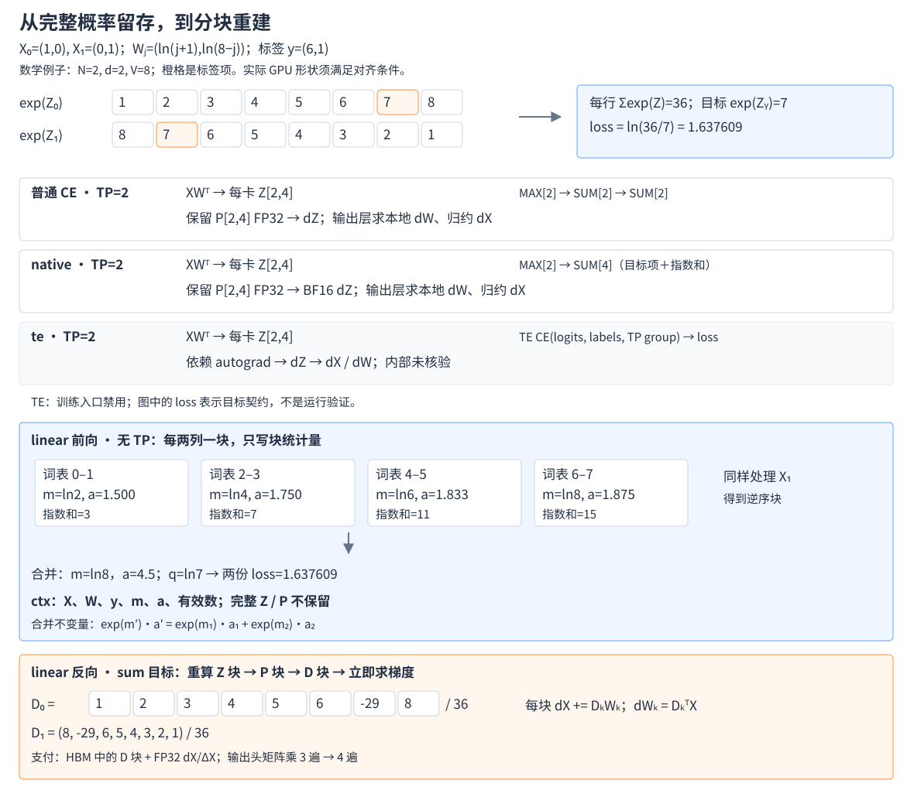
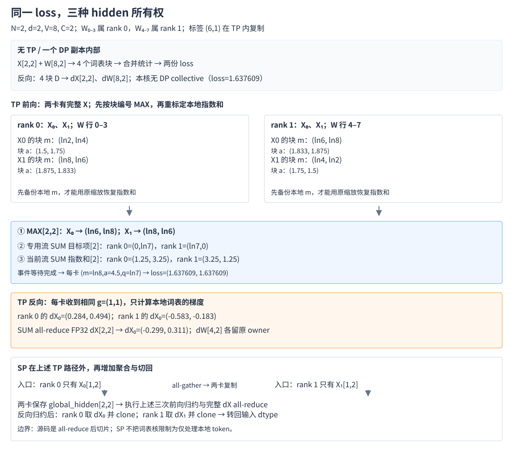

# Megatron-LM 融合线性交叉熵：从词表交叉熵到分块重计算

> **源码基线**：`NVIDIA/Megatron-LM@85902ef599ea4eb06ada7567a479c524b605767a`（`dev`，2026-09-01），本页路径默认相对该仓库。
> **核心源码**：`megatron/core/tensor_parallel/cross_entropy.py`、`megatron/core/fusions/fused_cross_entropy.py`、`megatron/core/transformer/linear_cross_entropy.py`、`megatron/core/fusions/linear_cross_entropy/blackwell/entry.py`。
> **核心结论**：以下以有标签且未启用配置日志的训练路径为主。只融合交叉熵可以减少逐元素操作和归约启动，却仍需完整的本地词表 logits；linear 将输出投影也纳入融合，前向保存统计量，反向按词表块重算，以额外矩阵乘和缓冲换掉大矩阵的留存。
> **范围与关联**：本文负责 LM head 到 loss、再到 hidden/weight 梯度的完整路径；融合算子全景见 [[21_megatron_fusion_operators_analysis]]，重计算设计见 [[18_megatron_recompute_analysis]]，其他显存手段见 [[22_megatron_memory_optimization_analysis]]，低精度与图捕获边界见 [[23_megatron_precision_cudagraph_fusion_analysis]]。属 [[megatron-lm/index]] 系列。
> **最近更新**：2026-09-05。按普通 CE → CE 内部融合 → 线性与 CE 联合分块重组，重新核算前反向显存与 TP/SP 通信。

## 1. 为什么最后一个线性层需要单独优化

语言模型把每个 token 的 hidden 投影到整个词表，再用目标 token 计算交叉熵。词表远大于 hidden 维度时，输出 logits 会成为很大的激活：$N=8192,V=152064$ 的 BF16 logits 为 **2376 MiB，约 2.49 GB**，而交叉熵最终每个 token 只输出一个数。只压缩 loss 本身没有意义，设计必须追问：能否在得到这一个数、并正确计算梯度的同时，避免保存整张词表矩阵？Megatron 的 linear 路径将这一边界前移到 LM head，先按词表块计算归一化统计量，再在反向重算局部概率。收益是移除完整 logits/softmax 的长期留存，代价是额外计算、分块缓冲和并行通信；冻结基线只实现了算力主版本为 10 的 Blackwell 后端。

这里有两个不同问题：**已有 logits 后如何更快地算 CE，以及能否一开始就不生成完整 logits**。`ModelParallelConfig.cross_entropy_loss_fusion` 和 `cross_entropy_fusion_impl` 明确给出关闭融合、native、te、linear 四条选路。前两种融合实现解决第一个问题，linear 解决第二个；te 是依赖实现的替代分支，不是 native 之后必然更优的一代，且当前训练入口因稳定性问题禁止它。另一条输出层选择轴是 MXFP8 LM head，本文在 §3.1 交代其交界，精度机制由 23 号页负责。

| 符号 | 含义 |
|---|---|
| $N,d,V$ | 本次 loss 覆盖的 token 数、hidden 维度、完整词表大小；$N$ 不包括其他 DP 副本的样本 |
| $p,V_p$ | TP 度数和每个 rank 的等长词表分片，$V_p=V/p$ |
| $C_f,C_b,K_f$ | 前向词表块宽、反向块宽、前向块数 $K_f=\lceil V_p/C_f\rceil$ |
| $X,W,Z,y$ | hidden、按词表行排列的权重、logits、全局词表编号的标签 |
| $m,a,q,g$ | 每 token 的归一化参考值、缩放后的指数和、目标 logit、上游 loss 梯度 |

## 2. 从完整词表到只保留可重建的信息

### 2.1 最小例子：输出是一个数，反向却需要整行概率

取两个 token，$X_0=(1,0)$、$X_1=(0,1)$，八个词表项。令权重第 $j$ 行为 $W_j=(\ln(j+1),\ln(8-j))$，$j=0,\ldots,7$；标签分别为 $y_0=6$、$y_1=1$。因此两行 logits 分别是 $\ln(1,2,3,4,5,6,7,8)$ 和它的逆序。两行指数和都是 36，目标项都是 7，逐 token loss 都是 **1.637609**。这是便于手算的数学例子，形状不满足后文 GPU 核的对齐要求，不是可直接发射的配置。

普通方案先做 $Z=XW^\top$，再为每行计算：

$$
\begin{aligned}
m_i&=\max_j Z_{ij}, & a_i&=\sum_j\exp(Z_{ij}-m_i),\\
\ell_i&=m_i+\ln a_i-Z_{i,y_i}, & P_{ij}&=\exp(Z_{ij}-m_i)/a_i.
\end{aligned}
$$

本例 $m=\ln8$、$a=4.5$，第一行概率为 $(1,2,3,4,5,6,7,8)/36$。反向收到逐 token 梯度 $g_i$ 后，先求 $D_{ij}=g_i(P_{ij}-\mathbf1_{j=y_i})$，再求 $dX=DW$、$dW=D^\top X$。所以前向虽然只输出两个 loss，反向却要用到全部 16 个概率。保存 softmax 最直接，但也把大词表的容量压力一直带到了反向。



图中 sum 目标取 $g_0=g_1=1$；mean 时两行梯度各乘 $1/2$。蓝色标可重建的统计量，橙色标需要支付的存储或重算；TE 框只表示 Megatron 可见的调用边界。

### 2.2 普通词表并行 CE：先避免聚合完整词表

最朴素的分布式做法是先把 logits 聚合成完整词表，再调用普通 CE，但归一化实际只需要最大值、指数和、目标项。Megatron 关闭融合时已经使用 `tensor_parallel.cross_entropy._VocabParallelCrossEntropy`：每个 TP rank 只处理自己的连续词表区间，通过标量统计量归约恢复全局 loss，无需聚合 logits。**词表并行本身已经消除了 logits 的跨卡聚合，不能再将这一收益归给 linear。**

沿用两 token 例子，TP=2，rank 0 保存词表 0–3，rank 1 保存 4–7，每卡得到 $[2,4]$ logits。先各求两行局部最大值，做一次长度 2 的 MAX all-reduce；所有卡减去相同参考值。标签落在本卡时提取目标项，否则贡献零，再对目标项和指数和分别做长度 2 的 SUM all-reduce。第一行两个 rank 的指数和贡献为 $10/8=1.25$、$26/8=3.25$，合成 4.5；第二行贡献互换。两卡重建相同的两个 loss，反向各自产出本地 $[2,4]$ 的 $D$。CE 反向本身无需通信，输出线性层随后把各词表分片对 $dX$ 的贡献合并，$dW$ 留在对应词表 owner。

源码会将本地 logits 转为 FP32，再原地减最大值、求指数、归一化，最后将该 FP32 softmax 保存到 autograd；并非额外保存互相独立的 logits、exp 和 softmax 三份 FP32 矩阵。主要留存量是 $4NV_p$ 字节，进入 CE 时已有的低精度 logits 还可能与它短时共存。前向三次归约的逻辑 payload 分别为 $N,N,N$ 个 FP32 元素。这样解决了跨卡大矩阵搬运，却没有解决每卡的大矩阵留存，下一步才是 CE 内部融合。

### 2.3 native 与 te：优化已有 logits 的处理过程

native 接收同样的两卡 $[2,4]$ logits，用 `fused_cross_entropy.py` 中经 `jit_fuser` 包装的计算段复用普通 CE 的数学步骤。关键通信变化是把目标项和指数和拼接成一个张量：一次 MAX 归约 2 个元素，一次 SUM 归约 4 个元素，合并后拆开，两卡仍恢复相同的 **1.637609**。推广到 $N$，通信启动从三次降到两次，逻辑元素总量仍是 $3N$，不能据此声称传输字节减半。

前向减少逐元素算子边界并保留 FP32 softmax，反向在该 softmax 上减去标签项、乘上游梯度，返回本地 $D$；本基线 `calculate_gradients` 还显式将返回值转成 BF16。因而不能把 native 写成任意 dtype 都等价的优化，也不能把 `jit_fuser` 包装等同于跨通信的一个 GPU 核。它仍做完整 LM-head 投影并留存 $O(NV_p)$ 概率矩阵；当瓶颈主要是大矩阵容量时，仅合并 CE 步骤不足以改变数量级。

te 也从同一个 $[2,4]$ logits、两个全局标签和 TP group 出发，经 `LanguageModule.compute_language_model_loss` 调用 `te_parallel_cross_entropy`，由依赖返回 loss 并通过 autograd 回传 logits 梯度，然后交给输出层求 $dX,dW$。这说明它仍支付完整 logits 的物化成本。**本页未展开 Transformer Engine 的独立源码基线，因此不承诺其内部保留哪些张量、发出几次 collective 或具体融合成几个核。** 预期目标仍是本例两份 loss；数值是否满足容差必须由依赖版本与运行验证决定。

这个替代方案的使用边界就在选择处：`megatron/training/arguments.py::validate_args` 拒绝总开关与 te 同开，直接构造 MCore 配置只发 `UserWarning`，之后还需 TE CE 符号存在。`full_iteration` 图捕获会传入 `is_cg_capturable`=True，该入口额外要求 TE ≥2.7.0。它不是当前训练 CLI 可正常启用的后备方案。对容量问题，两个 CE 内部融合分支都把边界放得太晚：接到 logits 时，矩阵已经生成。

### 2.4 linear 前向：让投影直接产出归一化统计量

要移除完整 logits，输出层就必须直接接收 hidden、权重和标签，产出 loss。`blackwell.entry.forward` 把每个 rank 的词表切成 $K_f$ 块，CuTe `FwdMainLoop` 在矩阵乘主循环中计算块内统计量；HBM 接收每块的最大值与指数和，以及每 token 的目标 logit 贡献。它不输出 $[N,V_p]$ 的完整 logits 张量。

设块 $k$ 的统计量为 $(m_k,a_k)$。任意两个块可以这样合并：

$$
m'=\max(m_1,m_2),\qquad
a'=a_1e^{m_1-m'}+a_2e^{m_2-m'}.
$$

因为 $e^{m'}a'=e^{m_1}a_1+e^{m_2}a_2$，合并保留了完整指数和，只改变了它的缩放表示。第一行按两个词表项一块，四块的 $m_k$ 分别为 $\ln2,\ln4,\ln6,\ln8$，$a_k$ 为 $3/2,7/4,11/6,15/8$；依次合并仍得到 $m=\ln8,a=4.5$。标签 6 的 logit $\ln7$ 只由包含该项的块贡献，loss 因而不变。第二行把相同步骤用于逆序 logits，仍得到同一结果。

这也说明“online softmax”不意味着 Python 只持有一对标量串行遍历全词表。当前实现先生成 $[N,K_f]$ 的 `_max`、`_accu`，再由 Triton epilogue 合并；其前向临时统计存储为 $8NK_f$ 字节，最终保存的 maximum、accumulate 才是 $8N$ 字节。epilogue 的参考最大值从零开始，负 logits 情形得到的参考值可能为零而非严格行最大值；只要指数和与参考值一致，重建关系仍成立。这里证明的是实数运算恒等式，极端值下的有限精度稳定性仍要测试。

实际默认块宽是 **$C_f=3072$**：`FwdConfig` 从 `LCE_FWD_VOCAB_SPLIT_SIZE` 读取，默认 512*6，并传给主循环。类构造器内的 512 不是实际入口默认值。减小块宽会增加统计量、块调度和合并成本；增大块宽受核布局与片上资源约束，不能任取一个正整数就假定可用。前向避开了完整概率的保存，留下的关键问题是：没有它，反向怎么得到全部梯度？

### 2.5 linear 反向：重建一块概率，立即消费一块梯度

`LinearCrossEntropy.forward` 保存的是 `global_hidden`、weight、labels、maximum、accumulate、`num_valid_tokens`。保存引用通常不复制 hidden 和 weight，但会延长其生命周期；SP 下的 `global_hidden` 是本路径新聚合的完整 hidden，不能视为免费。反向恢复这些对象，对词表块重新计算 $Z_k=XW_k^\top$，用已保存的 $m,a$ 恢复 $P_k$，生成 $D_k$ 后立即用于：

$$
dX\mathrel{+}=D_kW_k,\qquad dW_k=D_k^\top X.
$$

本例 sum 目标的第一行 $D=(1,2,3,4,5,6,-29,8)/36$，第二行 $D=(8,-29,6,5,4,3,2,1)/36$。一次只生成其中两个词表列，再分别累计 $dX$、写入对应 $dW$ 行；累积全部块后与完整矩阵求导一致。反向无需保存整行 $D$，但当前实现**确实分配 HBM 张量 `_d_logits[N,C_b]`**，不是“logits 相关显存为零”，也不是全套反向都留在一个融合核内。

`BwdPartialDlogits` 负责重算 logits 和生成块梯度，随后 Python 循环调用 `torch.mm` 求本块 `_delta_hidden`、调用 `torch.matmul` 写入 `d_weight` 的词表切片。`d_hidden` 和 `_delta_hidden` 都是 FP32，最终才把 `d_hidden` 转回输入 dtype；权重梯度按权重 dtype 分配。源码明确将 FP32 累加用于数值稳定性，代价是两类 $4Nd$ 缓冲，而不是仅多两个逐 token 标量。反向块宽由独立的 `LCE_BWD_VOCAB_SPLIT_SIZE` 控制，默认也为 **3072**，不必与前向相同。

若一次矩阵乘按 $2NV_pd$ FLOPs 计，普通输出头前向、$dX$、$dW$ 合计约 $6NV_pd$；分块重算多付一次投影，约 $8NV_pd$，即**输出头矩阵乘量增加约 1/3**。这不是整个训练步变慢 1/3：更少的 HBM 流量可能抵消部分成本，而小块 GEMM 效率、启动开销与其他层所占比例都会影响结果。本页给出计算账，不报告未经测量的速度收益。

忽略标签和 loss 归约也在同一个梯度契约内：`ignore_index` 对应的逐 token loss 为零，并屏蔽其 $D$；none 接收每 token 的 $g_i$，sum 使用同一个上游标量，mean 再除以有效 token 数。将本例第二个标签改成 -100，有效数变成 1，mean 的 loss 仍是 **1.637609**，第二个 token 的梯度归零，第一行无需再除以 2。**全被忽略时，mean 路径没有零分母保护**；不能承诺返回零 loss/零梯度，调用方应保证有效数非零或明确处理这一情形。

### 2.6 把分块放回 TP/SP：统计量小，hidden 通信仍然存在

词表分块与 TP 沿相同维度划分权重，使每卡只需自己的 $W_p$；这是选择该切分方向的结构性理由，属于根据实现的解释，不是与序列分块全面比较后的性能结论。需要补齐的是，各卡如何得到同一归一化结果，以及每卡只算一部分词表后如何恢复 hidden 梯度。



**无 TP（包括某个 DP 副本内部）。** 两行 hidden 与完整权重在本卡，四个教学词表块由 `forward_dp_epilogue` 合并；反向累计全部块，直接返回完整 $dX,dW$。这里的“DP”不表示 loss 核会通信所有 DP 副本，参数梯度的 DP 同步在外层完成。

**TP=2、不开 SP。** 两卡持有相同两行 hidden 和标签、各四行权重，各自产生两个块。实际前向不是先各自压成一对最终标量再归约，而是先备份本地 `_max[2,2]`，对它做 MAX all-reduce：第一行按相同块编号合成参考值 $(\ln6,\ln8)$。这两块在不同 rank 代表不同词表区间，但按块编号分组后再取全局参考值，不影响最终指数和。各卡用**原始本地最大值**重标定自己的 `_accu`，第一行合并出的本地贡献仍为 1.25、3.25。

然后有两次 SUM：一份是 `_logprobs[N]` 的目标 logit 贡献，另一份是 accumulate[N] 的指数和。前者在专用流执行，后者在当前流执行；事件让专用流等输入就绪，再让最终 loss 更新等待目标项归约结束。因此**总共三次前向 all-reduce**，逻辑 payload 是 $NK_f,N,N$ 个 FP32 元素；MAX 归约作用于块统计表，不能当成只有 $N$ 个元素。本例 loss 在两卡复制，上游 $g$ 也必须一致。反向各 rank 累加自己的词表块后，对完整 FP32 $dX[2,2]$ 做 SUM all-reduce，$dW_p[4,2]$ 则留在本卡。

**TP=2、开启 SP。** 入口 rank 0 只有 $X_0$，rank 1 只有 $X_1$，标签仍是完整两项。前向 `all_gather_into_tensor` 先让两卡各有完整 $[2,2]$ hidden，再执行上述 TP 路径并保存这个 `global_hidden`。反向同样对完整 $dX$ 做 all-reduce，然后 rank 0 取第一行、rank 1 取第二行并 clone，转回输入 dtype。源码使用的是 **all-reduce 后切片，不是 reduce-scatter**。SP 节省了周边层的本地 token 存储，并不让这个 loss 核全程只计算本地 token；其额外聚合、完整 hidden 留存、完整 FP32 梯度通信都必须进入容量与带宽预算。

## 3. 如何成为 GPT 模型真正使用的 loss

### 3.1 同一输出层对象，按需求返回 logits 或 loss

机制需要同时拥有投影权重和标签，所以入口放在输出层。`GPTModel.__init__` 通常构造 `LinearCrossEntropyModule`，它继承 `ColumnParallelLinear`，并不因关闭融合而换回另一个类。`forward(output_cross_entropy_loss=False)` 调用父类，返回普通 logits；请求直接 loss 时，使用外部传入的 weight，否则使用 self.weight。这样 tied/untied 权重都经过同一个明确的取值边界。

| 对象 | 持有或负责什么 | 为什么在这里划界 |
|---|---|---|
| GPTModel / MTP loss 路径 | 选择 loss 形式、提供 hidden/标签/共享输出权重 | 有标签才能绕过 logits；需要 logits 的推理与观测仍走普通输出 |
| `LinearCrossEntropyModule` | 输出权重、TP/SP 配置；将 [b,s] 标签转为连续 [s,b] | 让融合与普通输出共用权重语义，同时适配模型布局 |
| `LinearCrossEntropy` autograd | 保存 hidden/weight/标签/统计量，配对前向和反向 | 输出 loss 后仍能恢复梯度，保存对象直到反向消费 |
| `Platform` 与 Blackwell entry | 惰性架构选择、缓存编译核、临时缓冲与通信流/事件 | GPU 相关依赖推迟到实际调用，并集中管理执行资源 |
| CuTe 主循环、Triton epilogue、PyTorch GEMM | 块内投影、统计合并、块梯度及最终矩阵梯度 | 每层只承担对应计算，不能把它们合称一个全融合核 |

GPT 仅在总开关开启且 impl='linear' 时直接向输出层要 loss。若没有标签，模型返回 logits；因此该特性不是推理时获取完整词表分布的替代品。普通非 linear 训练分支则先获取 logits，再交给 `LanguageModule.compute_language_model_loss` 选择普通、native 或 TE CE。 **这里不生成完整 logits 的前提是有标签且未启用配置日志。** `GPTModel._postprocess` 在 `has_config_logger_enabled(self.config)` 为真时，会先调用普通输出层生成 logits、交给日志 payload，再执行 linear 的直接 loss 路径。因此开启 `config_logger_dir` 会重新支付完整 logits 和额外一次投影，不能沿用下文默认路径的容量结论。

还要区分 `fp8_output_proj` 激活时的兄弟分支：`is_mxfp8_output_proj_active` 会选择 `TELMHeadColumnParallelLinear`，其 forward 没有 `output_cross_entropy_loss` 和 labels 形参；现有配置检查只限制 FP8 模式与 MXFP8 recipe，未检查它与 linear 的组合。**静态调用推导**是两者同开会在直接 loss 调用处出现不支持关键字参数的错误，本页未在 GPU 上运行该组合。不能因两者都优化输出头就假定可叠加。

### 3.2 一次训练调用如何走到梯度就绪

```text
GPTModel.forward → _postprocess（有 labels，fusion=True，impl=linear）
└─ output_layer.forward(output_cross_entropy_loss=True, weight=output_weight)
   └─ LinearCrossEntropyModule._compute_linear_and_cross_entropy_loss
      ├─ labels [b,s] → contiguous [s,b]；采用模块默认 reduction=none
      └─ linear_cross_entropy → LinearCrossEntropy.apply
         ├─ forward → _get_platform → blackwell.entry.forward
         │  ├─ SP: all-gather hidden → global_hidden
         │  ├─ FwdMainLoop → 块统计与目标项
         │  └─ DP/TP epilogue → loss；ctx 保存反向所需对象
         └─ backward → blackwell.entry.backward
            ├─ 每块 BwdPartialDlogits → d_logits → d_hidden / d_weight
            ├─ TP: all-reduce d_hidden；SP: 切回本地并 clone
            └─ 转回 hidden dtype → 上游层梯度 / 权重梯度累积
```

模块把 none 的 loss 恢复为 [b,s]，外层训练逻辑应用 loss mask、归一化和相应缩放，再触发 autograd；不能把直接函数的默认 mean 和模块的默认 none 混为一谈。loss 核完成时，模型权重还没有更新：hidden 梯度继续回传 Transformer，输出权重梯度进入外层梯度累积与同步，之后才由优化器消费。DP 同步、共享 embedding 梯度同步及优化器状态不是本核的通信工作，具体生命周期见 [[16_megatron_distributed_optimizer_analysis]]、[[26_megatron_optimizer_step_internals_deepdive]]。

MTP 的 `process_mtp_loss` 对移位后的每层标签复用同一输出层和权重，得到逐 token loss 后应用该层 mask 与缩放。因 linear 不返回 logits，该分支将 `mtp_logits`=None，不能据此计算 MTP acceptance counts；这项可观测性成本与主模型的显存收益同时存在，MTP 模型装配见 [[10_megatron_model_structure_analysis]]。

### 3.3 为什么保留这些实现边界

历史能解释两项当前设计，但不应打断算法主线。`1f08cebac` 最初加入辅助方法 `LanguageModule.compute_output_layer_and_language_model_loss`；`13ad65379` 的差异把调用收进 `LinearCrossEntropyModule`，统一从传入权重或模块权重取值，并把反向低精度 addmm 累加改为 FP32 `_delta_hidden` 加 FP32 `d_hidden`。后者的数值稳定性意图有源码注释支持；“前者有助于融合与普通路径使用相同权重”是由调用变化得出的解释，不能直接认定它就是收敛故障的唯一根因。

相关历史还包含 `b8b866227` 的 revert 与 `8a29fd575` 的 reapply。提交展示日期并不构成这组修复的可靠线性时间轴，本页以冻结树中的最终实现为准。`168cb15d7` 则引入了 TE CE 的训练入口禁用。原稿据构造器常量推测“块宽未来可能参数化”，在本基线已经不成立：前后向环境变量均已存在。`BackwardMethodEnum` 虽列出 `kTwoKernels`、`kDlogitsSplitN`、`kFused`，entry 只实现 `kDlogitsSplitN`，其余分支抛 `NotImplementedError`；这些名字和 kernel 内 FIXME 是待实现点，不能写成已支持算法或已承诺路线图。

## 4. 把收益、成本和可用范围放到一张账上

### 4.1 同一个模型尺寸下，显存究竟省在哪里

沿用开头的 $N=8192,V=152064$，再取 $d=8192,p=8$、BF16 hidden/weight、$C_f=C_b=3072$。每卡词表 **19008** 项、前向 **7** 块。以下针对有标签、未启用配置日志的直接 loss 训练路径。下面按实际张量形状计算，$1\ \mathrm{MiB}=2^{20}$ 字节；它是**对象账，不是同时存活对象全部相加的精确 allocator 峰值**。

| 对象 | 每 rank 字节模型 | 本例 | 对应生命周期或收益 |
|---|---|---|---|
| 普通输出头完整本地 BF16 logits | $2NV_p$ | **297 MiB** | linear 不物化；未 TP 的同一项是开头的 2376 MiB |
| 普通/native 留存的 FP32 softmax | $4NV_p$ | **594 MiB** | linear 的 ctx 不保存该完整矩阵；不能推定 TE 内部同样保存 |
| 完整 BF16 hidden | $2Nd$ | **128 MiB** | 保存引用直到反向；SP 原始每卡仅 16 MiB，本路径聚合后保存完整量 |
| 最终最大值与指数和 | $8N$ | **0.0625 MiB** | 前向到反向留存，另有标签及有效 token 数 |
| 前向两张块统计表 | $8NK_f$ | **0.4375 MiB** | 临时；TP 另有 `_max_backup` **0.21875 MiB**，并有逐 token 临时向量 |
| 反向 `_d_logits` 块 | $2NC_b$ | **48 MiB** | 在全部词表块间复用；尾块只消费有效列 |
| FP32 `d_hidden` | $4Nd$ | **256 MiB** | 累加后做 TP 归约，SP 再切片，末尾转 dtype |
| FP32 `_delta_hidden` | $4Nd$ | **256 MiB** | 每块矩阵乘结果；Python 赋值时旧结果与新分配可能短时共存 |
| BF16 `d_weight` | $2V_pd$ | **297 MiB** | 完整本地权重梯度，由各词表块写入，后续交给梯度累积 |

因此，“两个统计量只有 64 KiB”不是完整的省显存论证。linear 减掉长期的 $NV_p$ 级概率留存，却仍有 $Nd$ 级 hidden/FP32 梯度、$NC_b$ 块和 $V_pd$ 权重梯度；SP 还把 hidden 从局部份额重新扩展为完整量。实际峰值必须考虑与上游激活、梯度返回时的 cast/clone、临时对象和 CUDA allocator 的重叠。尤其当 TP 已把 $V_p$ 降得接近或小于 $d$，不能用全局 $V\gg d$ 直接推出每卡显存一定大幅下降。

| 路径 | 主要支付项 | 可以据源码确定的收益/边界 |
|---|---|---|
| 普通词表并行 CE | 完整本地 logits/FP32 softmax，三个统计量归约 | 已避免 gather 完整词表；实现直接，容量仍随 $NV_p$ 增长 |
| native | 相同量级的矩阵留存、FP32 计算，返回 BF16 logits 梯度 | 目标项与指数和合并归约，三次启动减至两次；不等于字节减半 |
| te | 已生成的 logits，以及 TE 依赖内部成本 | Megatron 可见边界不消除 logits；训练入口禁用，内部细节未在此验证 |
| linear | 额外一次投影、分块调度、表中缓冲、JIT 首次编译 | 默认直接 loss 路径不物化完整本地 logits/softmax；配置日志会另生成 logits，速度与峰值需实测 |
| linear 加 TP/SP | 前向 $4N(K_f+2)$ 字节逻辑归约 payload；反向 $4Nd$ 字节 all-reduce payload；SP 另聚合 hidden | 无 logits 聚合，但复制 loss/hidden 的一致性与梯度完成边界不可省略 |

表中的 collective payload 是 API 输入张量大小，**不是每 rank 实际上网字节或时延**；后者还依赖 collective 算法、拓扑和并发。前向专用流可能重叠目标项 SUM 与当前流上的工作，但最终 epilogue 必须等待依赖完成，不能将三次通信从关键路径预算中全部删去。

### 4.2 配置、输入契约与失败位置

| 配置/接口 | 默认或取值 | 如何生效及约束 |
|---|---|---|
| `ModelParallelConfig.cross_entropy_loss_fusion` | False | CLI --cross-entropy-loss-fusion；开启才读取融合实现 |
| `ModelParallelConfig.cross_entropy_fusion_impl` | native；native/te/linear | CLI --cross-entropy-fusion-impl；linear 在 GPT 输出层选路，另外两档在已有 logits 后选路 |
| `LCE_FWD_VOCAB_SPLIT_SIZE` | 3072 | `FwdConfig` 读取并缓存，影响块统计规模与 CuTe 布局；在导入 Blackwell entry 前设置（类体定义时读取） |
| `LCE_BWD_VOCAB_SPLIT_SIZE` | 3072 | `BwdConfig` 在导入 Blackwell entry 时独立读取默认值，实例随后缓存，控制 `_d_logits` 和循环次数；不保证任意整数满足 kernel 条件 |
| reduction | 函数默认 mean，模块默认 none；另有 sum | none 返回逐 token loss，另两种返回标量；非法字符串抛 `ValueError` |
| `ignore_index` | -100 | 跳过相应标签，mean 使用有效数；全忽略没有零分母保护 |
| `tp_group`、`sequence_parallel` | 函数默认 None、False | 模块传入自己的 TP group/SP 设置；TP 权重等长连续分片，标签保持全局编号 |
| `output_cross_entropy_loss`、labels、weight | 模块默认 False、None、None | 请求 loss 必须有标签和可用权重；外部 weight 优先，否则 self.weight；普通路径仍可返回 logits |

入口要求 hidden/weight/labels 是同一 CUDA 设备上的连续张量，hidden 为二维或三维、weight 为二维，标签维数与 hidden 匹配，hidden 末维等于权重末维。SP 需满足本地 token 数乘 TP 度数等于标签总数；非 SP 则 token 数相等。TP 各 rank 的非 SP hidden、完整标签和上游 loss 梯度必须一致。标签除忽略值外应落在完整词表范围内；不能依赖 kernel 替调用方完成所有语义校验。

CuTe 主循环还检查 hidden/weight dtype 一致以及矩阵乘维度的字节对齐；现有单元测试覆盖 BF16、FP16，而不是任意 torch dtype。`Platform` 在首次实际调用时检查 CUDA 和 `get_device_capability`()，只有 cc[0]==10 才绑定 Blackwell entry；其他主版本报错。该 entry 依赖 CUDA bindings、CUTLASS/CuTe、Triton 等导入，缺依赖时只记录入口不可用，并没有自动改走 native 的执行路径。选型时应显式选择受支持实现，不能把惰性导入理解为自动兼容或静默回退。

数学上具有同一目标不等于工程接口完全相同。普通词表 CE 暴露 `label_smoothing`，本 linear 函数没有该形参；需要完整 logits 的额外目标或诊断也不能仅靠两个统计量恢复。新目标应先推导它额外需要保存或重算什么，再扩充接口与测试，而不是仅把 loss 函数名替换为 `linear_cross_entropy`。

### 4.3 换一个分块方向，会得到另一套梯度生命周期

作为有边界的跨框架对照，`MindSpeed-LLM@0c16322d0c5182d58aa602a0cba991e08f14ab12` 的 `mindspeed_llm/core/models/common/chunk_loss.py::ChunkLoss` 沿 [b,s,d] 的序列维切块，前向对每个序列块执行 `torch.func.grad_and_value`(`loss_forward`, ...)，立即计算并保存 `grad_inputs`、累计 `grad_weight`，最终返回标量 loss；反向只按上游标量缩放这些已存梯度。它不会像本文的 linear 那样等到反向再重算词表块。

在两 token 例子中，以单 token 为序列块，先算 $X_0$ 的完整词表 CE 和梯度并丢弃该块 logits，再算 $X_1$，累计得到同一 sum loss；反向缩放已算梯度。它的 logits 临时量由序列块宽控制，代价是前向提前算梯度、保存完整 hidden/weight 梯度并串行处理块；具体设备与并行能力还取决于传入的 `loss_forward` 和运行栈，不能由 Python 写法推出“任意硬件可用”。这条方案完整机制归 [[12_mindspeed_memory_optimization_analysis]] §8，本页只用于辨认两种“chunk loss”的接口差异：**共同点是缩短大矩阵生命周期，不能统一称为 online softmax 加反向重算。**

### 4.4 继续使用与迭代时，按什么顺序核验

先判断瓶颈是 CE 小算子/通信启动，还是完整词表激活容量：前者可从 native 与普通路径比较，后者才需要评估 linear 的整张对象账。在受支持设备上，先固定相同 hidden、weight、labels，比较 loss、$dX$、$dW$，再打开 TP 和 SP 核对复制/分片契约，最后观察完整训练步的峰值与吞吐；把首次 JIT 和稳态分开。改变块宽、累加精度或 collective 形式时，这几层验证都直接对应前文的代价与不变量。

| 源码阅读锚点 | 对应要验证的问题 |
|---|---|
| `megatron/core/model_parallel_config.py::ModelParallelConfig`；`megatron/training/arguments.py::validate_args` | 配置集合、默认值、TE 警告与训练拦截 |
| `megatron/core/models/gpt/gpt_model.py::GPTModel.__init__ / _postprocess`；`megatron/core/models/common/language_module/language_module.py::LanguageModule.compute_language_model_loss` | 输出层类型、直接 loss 与已有 logits 两处选路 |
| `megatron/core/config_logger.py::has_config_logger_enabled` | 配置日志是否触发额外 logits 投影 |
| `megatron/core/transformer/linear_cross_entropy.py::LinearCrossEntropyModule` | 权重来源、标签转置、reduction 默认值与输出形状 |
| `megatron/core/tensor_parallel/cross_entropy.py::_VocabParallelCrossEntropy`；`megatron/core/fusions/fused_cross_entropy.py::_VocabParallelCrossEntropy` | 普通/native 的保存对象、归约次数、返回梯度 dtype |
| `megatron/core/fusions/fused_linear_cross_entropy.py::Platform / LinearCrossEntropy` | 架构门控、autograd 保存对象和前反向契约 |
| `megatron/core/fusions/linear_cross_entropy/blackwell/entry.py::FwdConfig / BwdConfig / forward / backward` | 真正块宽、内存对象、三次 TP 前向归约、SP 聚合及梯度切片 |
| `megatron/core/fusions/linear_cross_entropy/blackwell/fwd_mainloop.py::FwdMainLoop`；`megatron/core/fusions/linear_cross_entropy/blackwell/bwd_partial_dlogits.py::BwdPartialDlogits` | 块内计算、dtype/对齐条件、忽略标签与梯度缩放 |
| `megatron/core/fusions/linear_cross_entropy/blackwell/triton.py::forward_dp_epilogue / forward_tp_epilogue / forward_tp_epilogue_update_logprobs` | 统计合并、参考值初始化、有效 token 数与 mean 的零分母边界 |
| `megatron/core/transformer/multi_token_prediction.py::process_mtp_loss`；`megatron/core/extensions/transformer_engine.py::TELMHeadColumnParallelLinear.forward` | MTP loss/观测边界、MXFP8 输出头不接收直接 loss 参数 |
| `tests/unit_tests/fusions/test_fused_linear_cross_entropy.py` 的 DP/TP/SP `test_correctness`、`test_performance`、`test_storage` | 上游提供的核级验证入口；GPT 集成测试类在本基线带无条件 skip，不能当成已验证的组合矩阵 |

本文两张图由 `tools/figs/svg/megatron_lce_figures.mjs` 从同一数学例子生成；配套测试读取正文，检查块统计合并、TP/SP 所有权、有限差分梯度和上述字节数。它们验证解释与算式一致，不替代 Blackwell/多卡的数值与性能测试。若继续开发 reduce-scatter 反向、其他架构或新的反向算法，首先要守住本文已经明确的 loss 一致性、梯度 owner 和内存完成边界，再比较新增实现的收益。

## Related Pages

- [[21_megatron_fusion_operators_analysis]] —— 将输出头融合放回 Megatron 的融合算子选择体系。
- [[18_megatron_recompute_analysis]] —— 从反向所需信息理解其他激活重计算方案的存储与计算取舍。
- [[23_megatron_precision_cudagraph_fusion_analysis]] —— 核对低精度输出投影和图捕获的组合边界。
- [[12_mindspeed_memory_optimization_analysis]] —— 对照序列分块、前向预计算梯度的另一种 chunk loss。
