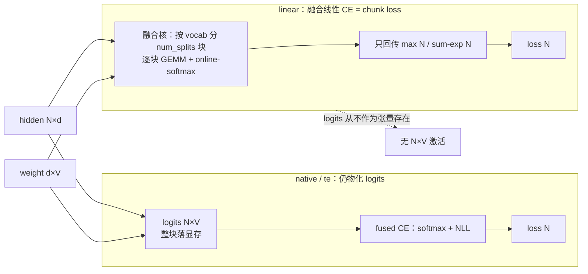

# Megatron-LM 融合线性交叉熵(Fused Linear Cross-Entropy / "chunk loss")源码级分析

> **源码基线**：`NVIDIA/Megatron-LM@71092579522a12522d9f323ae180c9825d01928a`（`dev`，2026-08-27）
> **重定基线**：2026-08-28 由 `232c478d43ce2f8b4c8db3507d3623fa82f55823`（2026-06-16）推进，跨 280 个提交；本页全部 `path:line` 已在新基线下逐条重核。
> **维度**: 深挖(机制级 + 具体源码实现)
> **叙事顺序**：本页按五拍组织——背景 → 为什么这么设计（含被否掉的替代）→ 实现思路与细节 → 约束 → 发展趋势。
> **最近更新**：2026-08-28。按五拍重排章节顺序；机制正文与既有引用未改。
> 本页回答:Megatron 里"chunk loss"(不物化全量词表 logits 的省显存损失)到底怎么实现?它对应配置 `cross_entropy_fusion_impl='linear'` 的**融合线性交叉熵**——把 LM-head 矩阵乘**融进**交叉熵核、logits 从不作为张量存在。对照另两档 `native`/`te`(仍物化 logits)与 MindSpeed 的 `chunk_loss`(见文末)。每条非平凡结论带 `file:line`,行号均经实际打开核对。

---

## 1. 背景:logits 显存墙与三档融合

语言模型的最后一步是 LM head:`hidden[N, d] @ Wᵀ[d, V] → logits[N, V]`,再对 `logits` 求交叉熵。问题在 **V(词表,常 ~15 万)远大于 d(hidden,~6–8K)**,`logits[N, V]` 这块张量是整个前向里最大的激活之一,且默认要为反向保留。

> 例:`N=8192`(一个 micro-batch 的 token 数)、`V=152064`、bf16 → `logits` ≈ **2.49 GB**;加上 softmax 中间量,LM-head 一处就能吃掉数 GB,还得为反向常驻。

Megatron 用一个**总开关 + 三档实现**来融合这步(`megatron/core/model_parallel_config.py`):

```python
# megatron/core/model_parallel_config.py:310,315
cross_entropy_loss_fusion: bool = False                               # 总开关
cross_entropy_fusion_impl: Literal['native', 'te', 'linear'] = 'native'
```

| impl | 入口 | 融合范围 | 是否物化 `logits[N,V]` |
|---|---|---|---|
| `native`(默认) | `fused_vocab_parallel_cross_entropy(logits,…)` | 只融 softmax+NLL | **是** |
| `te` | `te_parallel_cross_entropy(logits,…)` | 只融 softmax+NLL(TE 核) | **是** |
| **`linear`** | **`LinearCrossEntropyModule` → 融合核** | **matmul + softmax + NLL 全融** | **否** ← 这才是 "chunk loss" |

**一条主线**:`native`/`te` 接收的是**已经算好的 `logits`**,只是把"softmax→取标签项→求和"融成一个核;省的是几个逐元素 kernel,不省 logits 显存。`linear` 不同——它把 **LM-head 的矩阵乘也吸进 CE 核**,在核内**按词表分块(chunk)**地算 `hidden@Wᵀ` 并做 online-softmax,**完整 `logits[N,V]` 从不落显存**;反向再按块重算。这就是 Megatron 版"chunk loss"。



---

## 2. 为什么这么设计:把融合塞进输出层这个类,而不是塞进一个 loss 辅助函数

要做到"logits 从不落显存",可插手的地方只有两个:**在算 loss 的地方拦一手**,或者**让输出层自己不吐 logits**。Megatron 一开始选了前者,后来整段推翻改成后者。下面四条,前两条有源码/提交自陈,后两条其中一条源码沉默、已单独标注。

**① 被否掉的替代直接写在历史里:曾经是 `LanguageModule` 上的一个辅助方法,被整段删除。**
`1f08cebac`(2025-12-05,「[Dev] Feature: linear cross entropy fusion (#2256)」)最初把融合线性 CE 做成 `LanguageModule.compute_output_layer_and_language_model_loss(hidden, labels, weight, column_parallel_linear=…, col_linear_kwargs=…)` —— 一个**把输出层模块当参数传进来**的辅助方法,内部按 `cross_entropy_fusion_impl == 'linear'` 分流。`13ad65379`(2026-02-03,commit message 即「[Dev] Fix Linear-Cross-Entropy Convergence Issue (#2739)」)把这个方法**从 `megatron/core/models/common/language_module/language_module.py` 里整段删掉**(-65 行),同时新建 `megatron/core/transformer/linear_cross_entropy.py`(+134 行)并把 `GPTModel.output_layer` 的类从 `tensor_parallel.ColumnParallelLinear` 换成 `LinearCrossEntropyModule`。这次改动还经历了一轮反复:`b8b866227`(2026-02-02,#3218)先 revert,`8a29fd575`(2026-02-04,#3226,「Reapply fix Linear CE Fusion」)再重新落地。
→ 判据可以从两版调用点的差异读出来:旧版辅助方法在融合分支里用的权重是 `self.shared_embedding_or_output_weight()`,而非融合分支用的是 `col_linear_kwargs['weight'] = output_weight`(见 `13ad65379` 对 `megatron/core/models/gpt/gpt_model.py` 的 diff);新版把两条路径收进同一个模块的 `forward`,权重统一取 `weight if weight is not None else self.weight`(`megatron/core/transformer/linear_cross_entropy.py:28-41`,即本页 §4 引的那段)。

> [!note] 推断
> commit message 只说"修 Linear-Cross-Entropy 收敛问题",**没有**写明收敛问题的根因是权重取法不一致。"把融合做成输出层的子类,是为了让融合路径与普通路径共用同一份权重与同一套 `ColumnParallelLinear` 语义"这条解释由本页承担。要引用这条判断,请回到 `megatron/core/transformer/linear_cross_entropy.py:28-41` 与 `megatron/core/models/gpt/gpt_model.py:269-274` 这两个 locator,以及 `13ad65379` 的实际 diff,不要引用本段推断。

**② 第二条被否掉的替代:反向的 `d_hidden` 曾用 bf16 就地 `addmm` 跨块累加,被改成 fp32 累加。**
`linear` 反向要把 `num_splits` 个词表块的偏梯度累加成一个 `d_hidden`。同一个提交 `13ad65379` 把原先的
`torch.addmm(input=d_hidden.view(-1, dim), mat1=valid_d_logits, mat2=weight[...], beta=(split_idx != 0), out=d_hidden.view(-1, dim))`
删掉,换成"每块先 `torch.mm(..., out_dtype=torch.float32)`,再 `copy_`/`add_` 进一个 fp32 的 `d_hidden`",并在函数末尾转回原 dtype。当前基线里这三处清清楚楚:`# Allocate d_hidden in float32 for better numerical stability`(`megatron/core/fusions/linear_cross_entropy/blackwell/entry.py:348`)、`out_dtype=torch.float32` 与 `d_hidden.copy_/add_`(`:442`、`:445`、`:447`)、`# convert d_hidden to the original dtype`(`:471`)。
→ 判据:词表被切成 `num_splits`(§6 的 `ceil(V_local / 512)`,大词表下是几百块)块,低精度的**跨块串行累加**会把舍入误差放大数百次。这正是"按块重算"这套省显存做法必须自付的代价——用一份 fp32 的 `d_hidden` 换回数值稳定。

**③ 为什么切词表维而不是切序列维。**
输出层是 `ColumnParallelLinear`,TP 本来就沿**输出维(词表)**切权重(§4 的类继承关系)。于是"按词表分块"与 TP 的分片方向一致:每个 rank 只在**本地词表**上分 `num_splits` 块(`megatron/core/fusions/linear_cross_entropy/blackwell/entry.py:147-151` 的 `ceil(V_local / _vocab_per_split)`),跨 rank 只需对 `max` 做一次 `ReduceOp.MAX`、对本地 NLL 贡献做一次 `ReduceOp.SUM`(`:246`、`:253`),**不需要 gather logits**。GEMM 主循环的 `cta_tiler` 列维直接就是 `vocab_per_split=512`(`megatron/core/fusions/linear_cross_entropy/blackwell/fwd_mainloop.py:40-53`)。
→ 判据:切词表让"分块"与"TP 分片"和"GEMM 的 N 维 tile"三者对齐,一次切分同时服务三个目的;切序列维则要另外处理跨 rank 的词表归约。对照 MindSpeed 选了序列维(§8),取舍差异也正在这里。

**④ 为什么架构门控做成一个惰性绑定的 `Platform` 单例。**
`forward_func` / `backward_func` 不是模块级函数,而是在 `Platform.__init__` 里按 `torch.cuda.get_device_capability()` 惰性绑定,非 Blackwell 直接 `raise ValueError(f"Unsupported architecture: {cc[0]}")`(`megatron/core/fusions/fused_linear_cross_entropy.py:26-42`,`@lru_cache(maxsize=1)` 的 `_get_platform` 在 `:45-46`)。
→ 判据:CuTe DSL 写的核只能在 Blackwell 上编译/运行,把绑定推迟到第一次真正用到时,才不至于让"导入这个模块"在其它卡上就失败;而 `else: raise` 而非静默回退,保证使用者不会以为自己在跑 chunk loss、实际却在物化 logits。

---

## 3. 配置选路:GPT 模型如何挑到 `linear`

`GPTModel.__init__` 把"是否用融合线性 CE"算成一个布尔位(`megatron/core/models/gpt/gpt_model.py`):

```python
# megatron/core/models/gpt/gpt_model.py:159-162
self.fuse_linear_cross_entropy = (
    self.config.cross_entropy_loss_fusion
    and self.config.cross_entropy_fusion_impl == "linear"
)
```

命中时,**输出层的类被换掉**——不再是普通 `ColumnParallelLinear`,而是 `LinearCrossEntropyModule`(`megatron/core/models/gpt/gpt_model.py:272`,`from ...linear_cross_entropy import LinearCrossEntropyModule` @ `:31`)。前向算 loss 时走专门分支:

```python
# megatron/core/models/gpt/gpt_model.py:864-872
output_layer_kwargs = dict(input_=hidden_states, weight=output_weight, ...)
if self.fuse_linear_cross_entropy:
    loss = self.output_layer(
        output_cross_entropy_loss=self.fuse_linear_cross_entropy,   # ← 让输出层直接吐 loss
        labels=labels,
        **output_layer_kwargs,
    )
else:
    ...                                                              # 普通路径:先出 logits
```

而 `native`/`te` 两档不换输出层类——它们在 `LanguageModule.compute_language_model_loss` 里**拿到 `logits` 之后**才融合(`megatron/core/models/common/language_module/language_module.py`):

```python
# megatron/core/models/common/language_module/language_module.py:157,180  —— 注意两者的入参都是 logits（总开关判定在 `:156`）
if self.config.cross_entropy_fusion_impl == 'te':
    loss = te_parallel_cross_entropy(logits, labels, self.pg_collection.tp, is_cg_capturable)  # :175-177
elif self.config.cross_entropy_fusion_impl == 'native':
    loss = fused_vocab_parallel_cross_entropy(logits, labels, self.pg_collection.tp)            # :181
```

> 选路里还有约束:`cross_entropy_loss_fusion + impl=='te'` 与某些配置不兼容,在 `megatron/core/model_parallel_config.py:569-573` 与 `megatron/training/arguments.py:1828` 处断言拦截。MTP 也支持 `linear`(`megatron/core/transformer/multi_token_prediction.py:1784`)。

---

## 4. `LinearCrossEntropyModule`:短路掉 logits

它是 `ColumnParallelLinear` 的子类(LM head 本身),`output_cross_entropy_loss=True` 时**不返回 logits、直接返回 loss**(`megatron/core/transformer/linear_cross_entropy.py`):

```python
# megatron/core/transformer/linear_cross_entropy.py:11,28-41
class LinearCrossEntropyModule(tensor_parallel.ColumnParallelLinear):
    def forward(self, input_, weight=None, ..., output_cross_entropy_loss=False, labels=None, ...):
        if output_cross_entropy_loss:
            assert labels is not None
            return self._compute_linear_and_cross_entropy_loss(           # ← 短路:不出 logits
                hidden=input_, weight=weight if weight is not None else self.weight,
                labels=labels, reduction=reduction, ignore_index=ignore_index)
        return super().forward(input_, weight, runtime_gather_output)     # 否则退回普通线性层
```

```python
# megatron/core/transformer/linear_cross_entropy.py:43-70  —— 校验开关 + 调融合核
def _compute_linear_and_cross_entropy_loss(self, hidden, weight, labels, ...):
    assert self.config.cross_entropy_loss_fusion
    assert self.config.cross_entropy_fusion_impl == "linear"
    labels = labels.transpose(0, 1).contiguous()                          # [b s] → [s b]
    loss = linear_cross_entropy(                                          # ← 进 autograd Function
        hidden, weight, labels,
        sequence_parallel=self.sequence_parallel, reduction=reduction,
        ignore_index=ignore_index, tp_group=self.tp_group)
    ...
```

---

## 5. autograd 核心:省显存的本质在 `save_for_backward`

省显存的关键**不在前向算法,而在反向要存什么**。自定义 autograd `LinearCrossEntropy`(`megatron/core/fusions/fused_linear_cross_entropy.py:53`)前向**只保存逐 token 的 softmax 统计量,不保存 logits**:

```python
# megatron/core/fusions/fused_linear_cross_entropy.py:161-181  前向
with torch.cuda.nvtx.range("LinearCrossEntropy-forward"):
    (logprobs, _maximum, _acc, _num_valid_tokens,
     tp_rank, tp_world_size, global_hidden) = _get_platform().forward_func(
        hidden, weight, labels, tp_group, reduction, ignore_index, sequence_parallel)
    ctx.save_for_backward(global_hidden, weight, labels, _maximum, _acc, _num_valid_tokens)
    #                     └ hidden/weight  └ 每 token 的 max 与 sum-exp(各 O(N))
    #                     ✗ 完整 logits[N,V] 从不进入 ctx
```

反向**从 hidden/weight + (max, sum-exp) 逐块重算 logits 求梯度**:

```python
# megatron/core/fusions/fused_linear_cross_entropy.py:197-223  反向
(global_hidden, weight, labels, _maximum, _accu, _num_valid_tokens) = ctx.saved_tensors
d_hidden, d_weight = _get_platform().backward_func(
    dlogprobs, global_hidden, weight, labels, _maximum, _accu, _num_valid_tokens,
    reduction, ignore_index, tp_group, tp_rank, tp_world_size, sequence_parallel)
return d_hidden, d_weight, None, None, None, None, None
```

**为什么只存 max + sum-exp 就够**:交叉熵 `loss = logsumexp(z) − z_label`,其中 `z = hidden@Wᵀ`。`logsumexp` 完全由**逐 token 的最大值 `max` 与 `Σexp(z−max)`(即 `sum-exp`)** 决定;反向 `∂loss/∂z = softmax(z) − onehot(label)`,而 `softmax(z) = exp(z−max)/sum-exp` 同样只需 `(max, sum-exp)` + 重算一遍 `z`。于是把 `O(N·V)` 的 logits 换成 `O(N)` 的两个统计量 + 反向重算——这是 **online-softmax + 重计算**的经典组合(同 Flash-Attention 不物化 `S×S` 一脉)。

**显存账**:

$$
\begin{aligned}
M_{\text{loss-act}}:\quad \underbrace{O(N\cdot V)}_{\text{native/te 存 logits}} \;
&\longrightarrow\; \underbrace{O(N\cdot d)}_{\text{存 hidden}} + \underbrace{O(N)}_{\max,\ \text{sum-exp}}
\end{aligned}
$$

因 `V(~15万) ≫ d(~6–8K)`,上面那块 GB 级的 logits 激活直接消失(`global_hidden` 本就是上游激活,统计量仅几十 KB)。

---

## 6. Blackwell 融合核:按词表分块的具体实现(含硬件门控)

`forward_func`/`backward_func` 由 `Platform` 单例按 GPU 架构惰性绑定——**当前只实现了 Blackwell(算力 10.x)**:

```python
# megatron/core/fusions/fused_linear_cross_entropy.py:34-40
if cc[0] == 10:
    from .linear_cross_entropy.blackwell import entry as gpu_entry
    self.forward_func = gpu_entry.forward
    self.backward_func = gpu_entry.backward
else:
    raise ValueError(f"Unsupported architecture: {cc[0]}")     # 非 Blackwell 直接报错
```

> [!warning] 重要前提:`linear` 路径**目前绑定 Blackwell**。在非 Blackwell GPU 上构造该核会 `raise ValueError`,只能退回 `native`/`te`(都物化 logits)。所以"Megatron 的 chunk loss"现状 = **仅 Blackwell 可用**的融合线性 CE。

核内**按词表分块**(`megatron/core/fusions/linear_cross_entropy/blackwell/entry.py`):

```python
# megatron/core/fusions/linear_cross_entropy/blackwell/entry.py:147-151  —— 把【本地】词表切成 num_splits 块（`maximum`/`accumulate` 的分配在同文件 `:137-138`；`_vocab_per_split` 现经 `_get_fwd_config()` 取，见 `:35`/`:46`）
num_splits = (vocab_size + _vocab_per_split - 1) // _vocab_per_split      # ceil(V_local / 512)
_max  = torch.empty((num_tokens, num_splits), device=hidden.device, dtype=torch.float32)
_accu = torch.empty((num_tokens, num_splits), device=hidden.device, dtype=torch.float32)
maximum    = torch.empty((num_tokens,), ..., dtype=torch.float32)         # 跨块归约后的最终 max
accumulate = torch.empty_like(maximum)                                    # 最终 sum-exp
```

CuTe DSL 写的 GEMM 主循环(`megatron/core/fusions/linear_cross_entropy/blackwell/fwd_mainloop.py`)以 `vocab_per_split=512` 为列块大小,逐块算 `hidden@Wᵀ` 的一段并做 online-softmax,产出每块的偏 `_max`/`_accu`:

```python
# megatron/core/fusions/linear_cross_entropy/blackwell/fwd_mainloop.py:40-53
mma_tiler_mn=(128, 256); vocab_per_split=512
self.mma_tiler = (*mma_tiler_mn, 1)
self.cta_tiler = (self.mma_tiler[0], vocab_per_split, self.mma_tiler[2])  # 列维 = vocab_per_split → 分块
```

随后一个 Triton 归约核把 `num_splits` 个偏统计量合成逐 token 的 `maximum`/`accumulate`(`megatron/core/fusions/linear_cross_entropy/blackwell/entry.py:222-243` 的 `triton_kernels.forward_dp_epilogue`；TP 分片路径另有 `:263-279`)。**张量并行(词表切在 TP 上)** 只需两次集合通信,不需要 gather logits:

```python
# megatron/core/fusions/linear_cross_entropy/blackwell/entry.py:246,253  —— 词表分片跨 TP 的归约
dist.all_reduce(_max,      op=dist.ReduceOp.MAX, group=tp_group)   # 跨分片取全局 max
...
dist.all_reduce(_logprobs, op=dist.ReduceOp.SUM, group=tp_group)   # 跨分片求和本地 NLL 贡献
```

反向 `megatron/core/fusions/linear_cross_entropy/blackwell/bwd_partial_dlogits.py` 同样**按 vocab tile 重算偏 dlogits**(`vocab_per_split` + `cute.ceil_div(self.vocab_per_split, cta_tiler[1])`,`:77-78`),再算 `d_hidden`/`d_weight`——全程不重建完整 `logits[N,V]`。序列并行(SP)下 `hidden` 按序列维分片,前向/反向各 rank 处理本地 token 块(`megatron/core/fusions/fused_linear_cross_entropy.py:111-159` 的 DP/TP/SP 三态文档)。

---

## 7. 与 `native`/`te` 的对照:为什么只有 `linear` 是真·chunk loss

| | `native` | `te` | **`linear`** |
|---|---|---|---|
| 融合范围 | softmax+NLL | softmax+NLL(TE 核) | **matmul+softmax+NLL** |
| 入参 | `logits`(已物化) | `logits`(已物化) | **`hidden, weight`** |
| logits 显存 | `O(N·V)` | `O(N·V)` | **0** |
| 反向存什么 | 取决于实现(通常含 logits/softmax) | TE 内部 | **只存 hidden + max + sum-exp** |
| 硬件 | 通用 | 需 TransformerEngine | **仅 Blackwell(算力 10.x)** |
| 源 | `megatron/core/models/common/language_module/language_module.py:181` | `megatron/core/models/common/language_module/language_module.py:157-177` | `megatron/core/models/gpt/gpt_model.py:272` + 融合核 |

`native`/`te` 的价值在**减少 logits 上的逐元素 kernel + 不 gather 跨 TP 的 logits**(vocab-parallel CE),但 `logits[N,V]` 这块大激活仍在;`linear` 把矩阵乘吸进核、靠 online-softmax + 重算彻底消掉它。

---

## 8. 对照 MindSpeed `chunk_loss`(跨框架)

两者都为"不物化全量词表 logits",但机制与适用面不同:

| | MindSpeed `chunk_loss`(见 [[12_mindspeed_memory_optimization_analysis]] §8) | Megatron `linear` |
|---|---|---|
| 切分维 | **序列维**(沿 `dim=1` 分 chunk) | **词表维**(`vocab_per_split=512`) |
| 实现层 | 框架层 `torch.func.grad_and_value`,**前向即出梯度** | **kernel 层** CuTe/CUTLASS 融合核 + online-softmax + 反向重算 |
| 反向存 | 预分配的 `grad_inputs`/`grad_weight` | `hidden` + `max` + `sum-exp` |
| 硬件 | 纯 PyTorch,**任意硬件(含 NPU)** | **仅 Blackwell** |
| 取舍 | 可移植、串行分块 | 效率高、绑硬件 |

一句话:MindSpeed 走"**框架层序列分块 autograd**"求可移植;Megatron `linear` 走"**kernel 层词表分块融合**"求极致效率但绑 Blackwell。两者与 Flash-Attention 同属"online-softmax + 不物化大矩阵 + 反向重算"的家族。

---

## 9. 约束

§6 的 `[!warning]` 已经点出最硬的一条(仅 Blackwell)。本节把前提、代价、不变量与失效条件补齐,每条带 locator。

### 9.1 前提

- **硬件**:`linear` 只在算力 `10.x`(Blackwell)上可用,其它架构在 `Platform` 构造期即 `raise ValueError(f"Unsupported architecture: {cc[0]}")`(`megatron/core/fusions/fused_linear_cross_entropy.py:26-42`)。
- **双开关同时成立**:`_compute_linear_and_cross_entropy_loss` 入口连着两个 assert —— `self.config.cross_entropy_loss_fusion` 与 `self.config.cross_entropy_fusion_impl == "linear"`(`megatron/core/transformer/linear_cross_entropy.py:43-70`)。
- **必须有 labels**:`output_cross_entropy_loss=True` 时 `assert labels is not None`(`megatron/core/transformer/linear_cross_entropy.py:28-41`)。
- **`te` 一档在训练入口已被硬关**:`megatron/training/arguments.py:1828-1831` 的 `assert not (args.cross_entropy_loss_fusion and args.cross_entropy_fusion_impl == 'te')`,文案是「Transformer Engine cross entropy loss fusion is disabled due to stability issues. Use --cross-entropy-fusion-impl native, or omit --cross-entropy-loss-fusion.」;MCore 侧对应位置降级为 `UserWarning`(「…has known stability issues. Megatron-LM training args validation rejects this combination by default.」,`megatron/core/model_parallel_config.py:569-576`)。**即 §7 对照表里的 `te` 一列在当前基线的 `megatron/training` 训练路径上不可达**,只有直接用 MCore 才能强行走到并吃一条警告。该拦截由 `168cb15d7`(2026-06-03,「Disable TE cross entropy loss fusion (#5115)」)引入。

### 9.2 代价

- **反向的 `d_hidden` 以 fp32 分配**:形状与 `global_hidden` 相同、dtype 强制 fp32(`megatron/core/fusions/linear_cross_entropy/blackwell/entry.py:348`),函数末尾才转回原 dtype(`:471`)。对 bf16 训练这意味着反向期间多一份 `2 × O(N·d)` 的临时显存 —— 它是 §2② 那条数值稳定性决定的直接账单。
- **反向要重算一遍 `hidden@Wᵀ`**:§5 的省显存本质就是"用重算换存储",FLOPs 上多付一遍 LM-head GEMM。
- **labels 需要转置并 `contiguous()`**:`labels.transpose(0, 1).contiguous()`(`megatron/core/transformer/linear_cross_entropy.py:43-70`),多一次 `[b s] → [s b]` 的拷贝。
- **两次集合通信仍在关键路径上**:跨 TP 的 `all_reduce(MAX)` 与 `all_reduce(SUM)`(`megatron/core/fusions/linear_cross_entropy/blackwell/entry.py:246`、`:253`)。省掉的是 gather logits,不是全部通信。

### 9.3 不变量

- **输出层的类与是否开融合无关**:`GPTModel` 里 `output_layer_cls` 只在 `is_mxfp8_output_proj_active(config)` 与否之间二选一,默认分支恒为 `LinearCrossEntropyModule`(`megatron/core/models/gpt/gpt_model.py:269-274`)。不开融合时它走 `super().forward(...)` 退回普通 `ColumnParallelLinear` 语义(`megatron/core/transformer/linear_cross_entropy.py:28-41`)——所以"换类"是无条件的,"短路 logits"才是有条件的。
- **只保存 `O(N)` 统计量**:`ctx.save_for_backward(global_hidden, weight, labels, _maximum, _acc, _num_valid_tokens)`(`megatron/core/fusions/fused_linear_cross_entropy.py:161-181`),完整 `logits[N,V]` 永不进 `ctx`——这是本页所有省显存论断的唯一依据。

### 9.4 失效条件

- **非 Blackwell**:构造期报错,只能退回 `native`(见 §9.1)。
- **MTP 路径**:MTP 也走 `linear`(`megatron/core/transformer/multi_token_prediction.py:1784`,§3 已注),因此上述所有约束对 MTP 同样成立。

> [!note] 推断
> **`linear` 与 MXFP8 LM-head(`fp8_output_proj`)看起来互斥,但源码没有为此加校验。**可核验的事实是:`fp8_output_proj` 激活时 `output_layer_cls` 会变成 `TELMHeadColumnParallelLinear` 而非 `LinearCrossEntropyModule`(`megatron/core/models/gpt/gpt_model.py:269-274`),而 `fp8_output_proj` 的校验只检查 fp8 与 recipe(`megatron/core/transformer/transformer_config.py:1989-1996`),没有检查 `cross_entropy_fusion_impl`。"二者同开会走到一个没有 `output_cross_entropy_loss` 形参的输出层"这层推论由本页承担,未经实际运行验证。要引用请回到上面两个 locator,不要引用本段推断。

---

## 10. 发展趋势

> [!note] 推断
> 本节锚定于当前基线里的 `FIXME` 注释、架构门控的 `else: raise` 分支,以及 §2 引用的提交历史;方向判断属本页推断,不是源码自陈的路线图。

- **Blackwell 核本身仍在施工**。`megatron/core/fusions/linear_cross_entropy/blackwell/` 下留着成组的 `FIXME`:`entry.py:353`(「implement different backward methods」)、`fwd_mainloop.py:168`/`:227`/`:252` 与 `bwd_partial_dlogits.py:157`/`:160`/`:219`(block swizzling、2-CTA 分支),`triton.py:50` 还标着 `num_splits` 「maybe this could be a constexpr」。→ §6 描述的分块与归约实现尚未定型,`vocab_per_split=512` 这类常量有被参数化的余地。
- **架构分发框架已就位,只差别的架构**。`Platform` 用 `cc[0] == 10` 单分支绑定、`else: raise`(`megatron/core/fusions/fused_linear_cross_entropy.py:34-42`),这是一个**为多架构预留的形状**而当前只填了一格。→ 一旦 Hopper 或后续架构补上对应 kernel,§7 表里"仅 Blackwell"这一行就会改写;在此之前 chunk loss 在 Megatron 里始终是单硬件特性。
- **三档实际只剩两档**。`te` 因稳定性被 `168cb15d7`(#5115)在训练入口关停(§9.1),`native` 仍物化 logits。→ 中短期内"要省 logits 显存"在 Megatron 里没有第二条路,这反过来会加大给 `linear` 补其它架构的压力。
- **这条路径的数值稳定性刚经历过一轮反复**:#2739 落地 → #3218 revert → #3226 reapply(§2①),而修复内容正是 fp32 累加与权重取法(§2②)。→ 涉及 `linear` 的收敛性改动值得持续关注对应 commit,而不是只看配置文档。

---

## Related Pages

- [[21_megatron_fusion_operators_analysis]] —— Megatron 融合算子总览(本页是其 Linear+CrossEntropy 一项的深挖)
- [[22_megatron_memory_optimization_analysis]] —— Megatron 省显存手段(重计算/卸载等),本页是损失侧的一块
- [[12_mindspeed_memory_optimization_analysis]] —— MindSpeed `chunk_loss`(序列分块版),§8 对照
- [[megatron-lm/index]] —— Megatron-LM 知识地图
