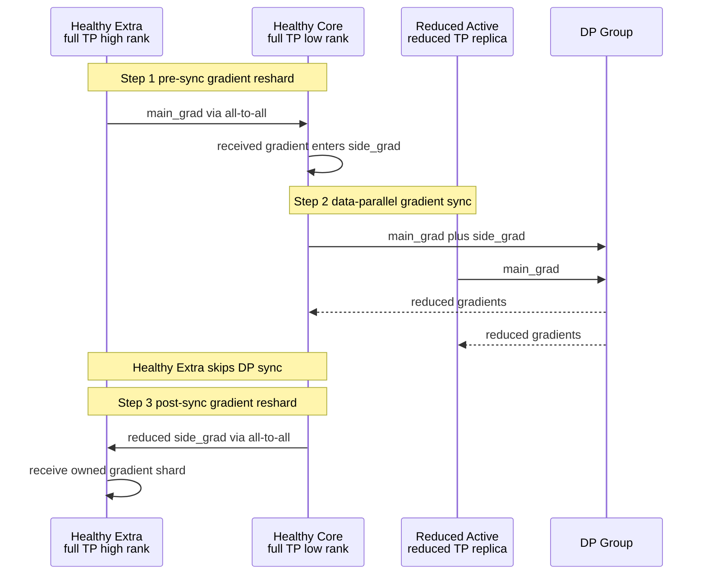

# Megatron Nonuniform Tensor Parallelism (NTP) 深度分析

> **源码基线**：`NVIDIA/Megatron-LM@85902ef599ea4eb06ada7567a479c524b605767a`（`dev`，2026-09-01）
> **重定基线**：2026-09-01 由 `71092579`（2026-08-27）推进，跨 7 个提交；该增量只触及 20 个 `megatron/` 文件，本页 `path:line` 引用所涉源文件均不在其中，故无行号漂移，无需逐条重核。
> **重定基线**：2026-08-28 由 `ee3f1ffa…`（2026-05-19）推进，跨 578 个提交；本页全部 `path:line` 形式的引用已在新基线下逐条重核;**代码块内被点名的符号与不带行号的裸路径不在该次扫描口径内**,已知漏网处已于 2026-08-28 单独更正。NTP 是本轮最稳定的一页——`megatron/core/distributed/nonuniform_tp.py` 在这 578 个提交里几乎未动：`git diff ee3f1ffa..71092579` 只有一处 3 删 1 增（`:946-952`，`get_data_and_context_parallel_group(with_context_parallel=True)` 收敛为 `get_data_parallel_group(with_context_parallel=True)`），文件长度 1463 → 1461 行。因此 `:946` 之前的引用行号**全部原样命中**，只有其后的反向 hook 整体上移 2 行。
> **基线沿革**：本页原仅声明分支/未声明基线；2026-08-27 经核对 9 处引用行号在 `ee3f1ffa…` 命中后补钉（该文件在 `232c478d4` 处内容亦完全一致，两基线均命中）；2026-08-28 统一推进到 `71092579`。
> **叙事顺序**：本页按五拍组织——背景 → 为什么这么设计（含被否掉的替代）→ 实现思路与细节 → 约束 → 发展趋势。
> **最近更新**：2026-09-03。接管旧补遗页的 NTP owner 职责；机制边界不变，并改写跨配置权重搬运与作业恢复接缝。

**Date**: 2026-05-20
**Status**: Complete
**Source**: `megatron/core/distributed/nonuniform_tp.py`, `megatron/core/extensions/nonuniform_tp_transformer_engine.py`, `megatron/core/distributed/README_NONUNIFORM_TP.md`

## 1. 背景：GPU 坏掉几张，全停重启和全量降级都要整个集群陪绑

### 1.1 NTP 是什么

NTP 是一种 **TP 组级别的 GPU 故障容错机制**，允许同一训练任务中不同 DP 副本使用**不同大小的 TP group**：

- **Healthy DP 副本**：使用完整 `tp_base` 个 GPU（如 TP=8），参数 shard 正常大小
- **Reduced DP 副本**：因 GPU 故障，仅使用 `tp_base - tp_spares` 个 GPU（如 TP=6），参数 shard 更大

核心设计原则：**用户不做任何模型修改**，NTP 在梯度层面透明弥合不同 TP size 的差异。

### 1.2 故障场景的备选方案对比

GPU 故障时只有三条路：

| 方案 | 做法 | 代价 |
|------|------|------|
| **全停重启** | 杀 job，修 GPU，从 checkpoint 恢复 | 训练中断几小时~几天 |
| **全量降级** | 所有 DP 副本统一降到 reduced TP | 所有 GPU 参数 shard 变大，整个集群 MFU 受损 |
| **NTP** | 仅故障副本降级，健康副本照常 | 故障副本 GPU 计算量/显存变大，拖慢 DP sync |

NTP 的选择：**用少数几张卡的性能下降，换其余几十上百张卡不受影响**。假设 100 个 DP 副本，1 个故障——全量降级影响全部 100 个副本，NTP 仅影响 1 个。

### 1.3 适用场景

1. **GPU 硬件故障后的应急容错**（冷重启）：部分节点 GPU 故障，降级继续训练
2. **异构 GPU 拓扑部署**：不同节点挂载不同数量 GPU（2-GPU NVL domain + 4-GPU NVL domain），从零开始按 non-uniform 配置训练
3. **节省 downtime**：GPU 故障后不等替换，降级跑，减少训练中断时间

NTP **不是性能优化特性**，而是**容错特性**。目标不是"跑得跟正常一样快"，而是"GPU 坏了还能继续跑，比全量降级快得多"。

## 2. 为什么这么设计：在梯度层加一层 DDP shim，既不改主干、也不搬参数

要让 TP=6 的副本和 TP=8 的副本一起做 DP 梯度规约，最直觉的两条路是：① 把 healthy 副本的参数也重新切成 6 份，让全场 TP 一致（即 §1.2 里"全量降级"的实现版）；② 直接在 `DistributedDataParallel` / `_ParamAndGradBuffer` 里加分支，按 rank 是否降级走不同代码。NTP 两条都没走。源码陈述了其中四条理由；第五条源码沉默，由本页重建并标为推断。

**① 一切做成子类，不动主干——这条写在模块 docstring 第一行。**
`megatron/core/distributed/nonuniform_tp.py` 文件头自称「Nonuniform Tensor Parallelism (NTP) - **Non-intrusive implementation**」，并写明「All NTP logic is contained in this module as **subclasses of core components**, making it non-intrusive to the main codebase」（`:2-15`，关键两行在 `:8-9`）。落地就是三个子类：`NonuniformTPParamAndGradBucketGroup(_ParamAndGradBucketGroup)`（`:752`）、`NonuniformTPParamAndGradBuffer(_ParamAndGradBuffer)`（`:891`）、`NonuniformTPDistributedDataParallel(DistributedDataParallel)`（`:1263`）；`README_NONUNIFORM_TP.md:8-9` 同口径重申「NTP does not change the default Megatron training path. A training script must explicitly opt in.」
→ 决定取舍的判据是**容错特性不该向默认路径收税**。§4 那张"零引用"表因此不是遗漏，而是设计结果。

**② 弥合发生在梯度上，参数与优化器状态一律不动。**
`README_NONUNIFORM_TP.md:205-208` 把整条链路写成一句：「Healthy full-TP replicas contain extra TP ranks that have no peer in a reduced TP replica. During gradient sync, NTP **gathers those extra gradients onto healthy core ranks**, runs the data-parallel gradient reduction on peerable ranks, then **post-sync reshards gradients back to the extra ranks before optimizer step**.」代码侧对应的是 `ntp_map` **只写元数据**——`param.send_splits` / `param.recv_splits`（`megatron/core/distributed/nonuniform_tp.py:662-663`），全程没有参数数据搬运。
→ 判据：reduced 副本的参数分片是"通信组变小后自然得到的"（§5.1），优化器只看当前 rank 的 TP/DP 组（§5.2）。把差异全部压进梯度这一层，NTP 就只需要做一个 DDP shim，不必进入 checkpoint / optimizer 的世界。

**③ post-sync reshard 被刻意推迟到最后一个 bucket——源码把"否则会怎样"也写出来了。**
`README_NONUNIFORM_TP.md:210-213`：「For overlapped gradient reduction, post-sync reshards are **delayed until all bucket reductions have been launched**. This allows earlier post-sync reshards to overlap with the final bucket reduction **instead of running fully exposed after all gradient sync work has completed**.」句中 "instead of" 后面那半句就是**被否掉的替代**：每个 bucket 同步完就地 `wait` 自己的 reshard，等于把 reshard 整段暴露在关键路径上。实现是所有 bucket group 共享一个 `post_sync_state` 字典，只有 `last_bucket_group` 才统一 `wait`（`megatron/core/distributed/nonuniform_tp.py:779-794`，状态在 `:1373-1377` 建好）；`finish_grad_sync` 也是先发 reshard、再登记 handle（`:803-814`）。
→ 代价同样写在 README 里：「Bucket size matters. Prefer a small number of large DDP buckets for NTP runs when memory allows, since each bucket can trigger post-sync reshard work.」（`:215-216`）——这与普通 DDP"桶要形成可重叠的 readiness 波次"的直觉（见 [[16_megatron_distributed_optimizer_analysis|buffer/bucket 与 gradient-ready 闭环]]）方向相反。

**④ spare rank 直接退出进程，而不是留着空转。**
`initialize_nonuniform_tp_process_groups(ntp_config, exit_spares=True)`（`megatron/core/distributed/nonuniform_tp.py:450-451`）的默认行为是：一旦判定自己是 spare，打一条 `"[NTP] Rank %s is a spare rank, exiting"` 日志后 `sys.exit(0)`（`:556-558`）。被保留下来的替代路径是 `exit_spares=False`——此时函数只 `return False`，由调用方自行处置（`:559`）。也就是说"spare 留下来空转"并没有被实现成一条完整通路，只留了一个让调用方接管的出口。

**⑤ 为什么"只弥合梯度"这条路在数学上成立。**

> [!note] 推断
> 源码陈述的是**做法**：两次 all-to-all 的时机（`README_NONUNIFORM_TP.md:205-208`）、`ntp_map` 只写元数据（`megatron/core/distributed/nonuniform_tp.py:662-663`）、reduced active / healthy core / healthy extra 三类活跃 rank 谁参与 DP sync（`:149-164`）；reduced 副本里被排除的 non-active spare 已在建组时退出（`:554-559`）。**它从没解释"为什么梯度层弥合就够了"**——即"同一份逻辑权重在 TP=6 与 TP=8 两种切法下，只要梯度按 shard 对齐规约就等价"这一步，源码与 README 里都没有任何注释陈述；§3.2 的 `sync_partitions` / `comp_2_sync` 算法（`megatron/core/distributed/nonuniform_tp.py:624-640`）只是把这条等价性**实现**了出来。要引用这层判断，请回到 `megatron/core/distributed/nonuniform_tp.py:624-663` 与 `README_NONUNIFORM_TP.md:205-208`，不要引用本段推断。

## 3. 怎么做的？

NTP 的实现分为三个层面，完全自包含在两个文件内（`megatron/core/distributed/nonuniform_tp.py` + `megatron/core/extensions/nonuniform_tp_transformer_engine.py`），不侵入 Megatron 主流程。

### 3.1 通信组重配置（冷重启时）

触发时机：**作业启动时**，在 `initialize_model_parallel(tp_size=tp_base)` 之后、模型构建之前。

```python
# megatron/core/distributed/nonuniform_tp.py:450-561
initialize_nonuniform_tp_process_groups(ntp_config, exit_spares=True)
```

流程：
1. 所有 rank 先按 `tp_base` 初始化正常的 TP/CP/DP 通信组
2. Reduced DP 副本的 TP group 被**重新创建**，仅包含 active ranks
3. Spare rank 收到 `non_active_ranks_per_dp` 中标记自己 → `sys.exit(0)` 退出
4. Healthy 副本的通信组保持不变

关键配置结构 `non_active_ranks_per_dp`（`megatron/core/distributed/nonuniform_tp.py:349-357`）：
```python
non_active_ranks_per_dp={(0, 0, 0): [2, 3]}
# DP=0, CP=0, PP=0 的副本中，local TP rank 2、3 是 spare
```

支持 tuple key `(dp_rank, cp_rank, pp_rank)` 精确指定任意并行维度组合中的 spare ranks，以及 legacy 的纯 `dp_rank` key。

### 3.2 参数 Split 元数据（ntp_map）

在 **healthy（full TP）rank** 上，对每个 TP 切分参数计算通信映射元数据（`megatron/core/distributed/nonuniform_tp.py:569-667`）：

```python
ntp_map(module, ntp_config, num_shards)  # num_shards = num_attention_heads 或 ffn_hidden_size
```

核心算法（`megatron/core/distributed/nonuniform_tp.py:626-663`）：
1. 将 `num_shards` 均匀分给 `reduced_tp_size` 个 rank（`sync_partitions`）
2. healthy full-TP 副本中多出的 extra shards 被逐个映射到可与 reduced 副本配对的 core ranks（`comp_2_sync` 映射）
3. 计算 `send_splits[i][j]`（rank i → rank j 的梯度元素数）和 `recv_splits`（转置）

`ntp_map` **只设置元数据，不动参数数据**：
```python
param.send_splits = send_splits   # megatron/core/distributed/nonuniform_tp.py:662
param.recv_splits = recv_splits   # megatron/core/distributed/nonuniform_tp.py:663
```

Reduced（unhealthy）rank 跳过 ntp_map——它们直接按新的 reduced TP size 同步，不需要 resharding。

### 3.3 梯度同步流程（两次 all-to-all）

这是 NTP 最核心的机制。完整的梯度同步包含三步：



**Step 1** 在 backward hook 中触发（`megatron/core/distributed/nonuniform_tp.py:1384-1459`，即 `def ntp_hook` 整体；较旧基线上移 2 行）：
- Healthy core rank：接收 healthy extra rank 的梯度 → 写入 `side_grad`
- Healthy extra rank：将 `main_grad` 按 `send_splits` 发给对应 healthy core rank
- 使用 `_ntp_all_to_all`（封装 `dist.all_to_all`，处理非连续 tensor）

**Step 2** DP 梯度同步（`NonuniformTPParamAndGradBucketGroup`）：
- `_ntp_current_rank_should_dp_sync`（`megatron/core/distributed/nonuniform_tp.py:149-164`）控制谁参与 DP sync
- Reduced 副本：所有 active ranks 正常参与
- Healthy 副本：只有 core ranks（`tp_rank < reduced_tp_size`）参与 DP sync；extra ranks 不参与
- Reduced 副本的 non-active spare 已在建组时退出，不出现在这条同步链；实现局部注释把 healthy full-TP 的 high-rank 发送者简称为“Spare GPU”（`:1428-1432`），语义上应读作 healthy extra rank

**Step 3** Post-sync reshard（`megatron/core/distributed/nonuniform_tp.py:694-744`）：
- `_ntp_start_post_sync_grad_reshard` 将 DP 同步后的 side_grad 发回 healthy extra ranks
- 设计为与下一个 bucket 的 DP all-reduce **重叠执行**（`_record_ntp_post_sync_handles`）

### 3.4 Buffer 与 Bucket 适配

`NonuniformTPParamAndGradBuffer`（`megatron/core/distributed/nonuniform_tp.py:891-936`）：
- Healthy core rank 额外分配 `side_grad` 空间（大小 ≈ `recv_splits` 中 healthy extra 贡献的总和）
- `_ntp_side_grad_index_map` 追踪 side_grad 在 buffer 中的偏移
- 主 grad（`main_grad`）对优化器保持连续可见，side_grad 是附加的

`NonuniformTPParamAndGradBucketGroup`（`megatron/core/distributed/nonuniform_tp.py:752-823`）：
- `start_grad_sync`：等待 NTP reshard handle 完成后启动 DP sync
- `finish_grad_sync`：DP sync 完成后启动 post-sync reshard
- `register_grad_ready`：被折叠的 rank 跳过 DP 就绪登记

### 3.5 Transformer Engine 适配

`megatron/core/extensions/nonuniform_tp_transformer_engine.py`：处理 TE userbuffer 初始化需要统一 TP domain 的问题。通过 monkey-patch `dist.new_group` 和 `dist.new_subgroups_by_enumeration`，使 TE 在 NTP 的混合 size TP domains 上正确创建 userbuffer 通信组。

## 4. 与 Megatron 主流程的关系

NTP 是**完全 opt-in、non-intrusive** 的设计：

| 模块 | NTP 引用？ | 说明 |
|------|-----------|------|
| `megatron/core/distributed/nonuniform_tp.py` | ✅ | 核心实现（1461 lines） |
| `megatron/core/extensions/nonuniform_tp_transformer_engine.py` | ✅ | TE 适配（157 lines） |
| `pretrain_gpt.py` | ❌ | 无引用 |
| `megatron/training/checkpointing.py` | ❌ | 无引用 |
| `megatron/core/optimizer/distrib_optimizer.py` | ❌ | 无引用 |
| `megatron/core/transformer/transformer_config.py` | ❌ | 无引用 |
| `tools/checkpoint/` | ❌ | 无引用 |

训练脚本必须显式使用 `NonuniformTPConfig` + `NonuniformTPDistributedDataParallel` + 手动调用 `ntp_init`/`ntp_map`。NTP 不改变 Megatron 的默认训练路径。

## 5. 约束：关键前提与局限

### 5.1 不做参数 resharding

NTP 走的是"先改通信组，再建模型"的路径。Reduced 副本的 rank 在通信组重配置后 TP world size 变小，构建模型时**自然得到更大的参数 shard**。没有任何代码做参数数据的跨 rank 移动。

### 5.2 不做优化器状态转换

`megatron/core/optimizer/distrib_optimizer.py` 中完全没有 NTP 引用。分布式优化器按当前 rank 的 TP/DP group 分片状态。从 checkpoint 恢复时，如果原本是 uniform TP，转换到 non-uniform TP 需要外部工具合并 spare rank 的优化器状态。

### 5.3 不做 checkpoint 转换

`megatron/training/checkpointing.py` 和 `tools/checkpoint/` 中均无 NTP 相关代码。这意味着：

| 场景 | 参数加载 | 优化器状态加载 |
|------|---------|-------------|
| 从零训练 | ✅ 天然支持 | ✅ 天然支持 |
| 从 uniform TP checkpoint 恢复 | ❌ 需要外部工具合并 spare shard | ❌ 需要外部工具合并 spare shard |

因此 NTP 当前更适用的场景是**从零开始的异构部署**，而非意外的在线故障恢复。完整的故障恢复闭环还需要 checkpoint 转换工具链。

### 5.4 Reduced 副本的显存压力

Reduced 副本每 GPU 的参数 shard 更大（TP=6 比 TP=8 大约 33%）。如果故障前 GPU 显存利用率高，可能 OOM。需要相应降低 micro batch size。

### 5.5 计算不均衡

Reduced 副本 GPU 计算量更大，会成为 DP all-reduce 的尾延迟。缓解手段：
- Bucket 级粒度：先算完的 bucket 可以先同步
- Post-sync reshard 与梯度同步重叠

但根本上，NTP 接受这种不均衡——用少数卡的性能下降换取集群其余部分的正常运转。

### 5.6 前提、代价与失效条件

§5.1–§5.5 说的是 NTP **不做**什么。这一节补的是它**要求**什么——越出下列前提，NTP 要么直接抛错，要么静默退化。

| # | 前提 / 不变量 | 源码落点 | 破坏后的表现 |
|---|---|---|---|
| 1 | spare rank 默认必须真的退出进程 | `megatron/core/distributed/nonuniform_tp.py:450-451`（`exit_spares: bool = True`）、`:556-558`（`sys.exit(0)`） | 传 `exit_spares=False` 时函数只 `return False`（`:559`），spare 进程仍在但已被排除出通信组，后续行为由调用方负责 |
| 2 | 同一 DP rank 下各 CP 副本的 spare 数必须一致 | `:349-357` docstring：「The number of non-active ranks must be consistent across CP replicas within each DP rank.」 | 这是**约定而非校验**——该处没有对应的 assert，配错了不会在此处报错 |
| 3 | `non_active_ranks_per_dp` 的值是 **local TP slot**，不是 global rank | `README_NONUNIFORM_TP.md:83-87`：「Global ranks are the process ranks assigned by the launcher. `non_active_ranks_per_dp` values are local TP slot IDs inside a nominal `tp_base` replica. They are not global rank IDs.」 | 按 global rank 填会静默选错卡 |
| 4 | helper 假设 global rank 按**连续的 nominal DP 副本**排布 | `README_NONUNIFORM_TP.md:89-96`（`dp_rank = global_rank // dp_replica_size`、`local_tp_rank = global_rank % tp_base`） | 真正"打包"的异构布局（TP2 + TP4 共 6 张卡）不能用这个 helper，README 明说要在训练脚本里显式建组（`:113-115`），并给出该布局应有的 TP / DP 组（`:118-119`） |
| 5 | NTP 不负责 rank → 物理 GPU 的映射 | `README_NONUNIFORM_TP.md:135-137`：「NTP does not assign global ranks to physical GPUs. It only observes the global rank after `torch.distributed.init_process_group()`. The launcher must create the desired mapping from global rank to node and GPU.」 | 拓扑摆错 NTP 不会报错，只会慢；README 因此要求先打印 rank/host/GPU 表核对（`:180-196`），并写明「Check this printed table before trusting an NTP run.」（`:198`） |
| 6 | 传入的 `pg_collection` 必须同时带 `tp` 与 `dp_cp` | `megatron/core/distributed/nonuniform_tp.py:952`（`assert hasattr(pg_collection, 'tp') and hasattr(pg_collection, 'dp_cp')`） | assert 失败 |
| 7 | NTP buffer 仍沿用 DDP 那对相反的长度约束 | `:993`（用 distopt 时 `numel % data_parallel_world_size == 0`）、`:997`（不用 distopt 时 `numel == numel_unpadded`） | 与 [[16_megatron_distributed_optimizer_analysis|flat buffer 的 shard 对齐不变量]]同款，NTP 的 buffer 子类没有放宽它 |
| 8 | TE userbuffer 的 TP domains 必须非空、无重复、互不重叠 | `megatron/core/extensions/nonuniform_tp_transformer_engine.py:23`、`:25`、`:28`、`:33`，四处均抛 `ValueError` | 直接抛错。domains 还会按首 rank 排序，理由写在 docstring 里——「Every rank must create those groups in the same order, so callers may pass domains in any order and this helper normalizes them by first rank」（`:11-16`）；若某 rank 落不进任何 domain 则 `RuntimeError`（`:116`） |
| 9 | `tp_spares=0` 时整套 helper 退化为 no-op | `README_NONUNIFORM_TP.md:79`：「Set `tp_spares=0` to make the NTP helpers a no-op.」 | 不报错，只是什么都不做——配错了会静默跑成普通 uniform TP |

**代价**

- **调参方向与普通 DDP 相反。** README 要求"少而大"的 bucket（`README_NONUNIFORM_TP.md:215-216`），因为每个 bucket 都会触发一次 post-sync reshard；而普通 DDP 依赖多个 bucket 形成 gradient-ready 与通信重叠波次（[[16_megatron_distributed_optimizer_analysis]]）。两条建议在 NTP 场景下会打架，需要按显存实测取舍。
- **重叠依赖 `overlap_grad_reduce=True`。** `README_NONUNIFORM_TP.md:227`：「Keep `overlap_grad_reduce=True` when measuring the optimized path.」关掉之后 §3.3 Step 3 的重叠设计失效，reshard 全部暴露。
- **正确性靠对拍而不是断言。** `README_NONUNIFORM_TP.md:228-229` 要求「Validate topology, loss, and gradient parity against a uniform TP baseline before using a new NTP layout for performance measurements.」——即两次 all-to-all 的 split 是否算对，源码不做运行时校验，只能靠与 uniform TP 基线比 loss/梯度。
- **TE 适配是运行期 monkey-patch。** `transformer_engine_userbuffer_tp_domains` 在上下文管理器里临时替换 `dist.new_group` / `dist.new_subgroups_by_enumeration`（`megatron/core/extensions/nonuniform_tp_transformer_engine.py:119-120`），退出时还原（`:124-125`）。这层耦合依赖 TE 内部仍然经由这两个 API 建 userbuffer 组。

## 6. 发展趋势

> [!note] 推断：锚点是基线 `71092579` 下的源码事实（引入/修复提交、README 自陈的使用限制、§5 已列的缺口），方向判断由本页承担，不是源码的自陈计划。

**一、NTP 目前是"复制 + 子类化"式的旁路，会随主干 API 漂移。**
这一路径的代价在基线区间里已经兑现过一次：`43e45e130`（commit message「Fix undefined get_data_and_context_parallel_group references (#6072)」，2026-08-04）把 `parallel_state.get_data_and_context_parallel_group(with_context_parallel=True)` 改成 `get_data_parallel_group(with_context_parallel=True)`——这是本页页头记录的、`ee3f1ffa…→71092579` 之间该文件**唯一**的一处改动。NTP 从引入（`e3ef5d186`，「Add opt-in nonuniform tensor parallelism (#4585)」，2026-05-18，一次性加入 5 个文件 2817 行）到现在只有这两次提交。**由此可推断**：§2① 那条"不侵入主干"的收益，对应的成本是**主干改名不会自动传导过来**；读 NTP 代码时应当假设它对齐的是引入时刻的 core，而不是当前的 core。

**二、进程组构造会从"自己重建"转向"外部显式传入"。**
README 已经给出了这条分叉：`initialize_nonuniform_tp_process_groups()` 的 helper 只支持"连续 nominal DP 副本"这一种排布（`README_NONUNIFORM_TP.md:89-96`），真正打包的异构布局（TP2 + TP4）「should be built with explicit process groups in the opt-in training script rather than with the contiguous nominal-replica helper」（`:113-115`），并要求把结果 `ProcessGroupCollection` 同时传给模型与 NTP DDP（`:128-131`）。**由此可推断**：NTP 的方向与编排层的整体演进一致——见 [[17_megatron_parallelism_orchestration_analysis|进程组显式注入与 HyperCommGrid named views]]；异构 TP domain 在 grid 一侧已有对象化表达，NTP 那套自建组的 helper 更像过渡形态。源码没有给出迁移计划。

**三、闭环缺的那一段是 checkpoint 工具链，而不是 NTP 本身。**
§5.3 的表格已经把缺口写死：从 uniform TP checkpoint 恢复时，参数与优化器状态都需要外部工具合并 spare shard；`megatron/training/checkpointing.py`、`tools/checkpoint/`、`megatron/core/optimizer/distrib_optimizer.py` 三处对 NTP 均为零引用（§4）。**由此可推断**：NTP 想从"异构部署"扩到"在线故障恢复"，下一步必然落在 checkpoint 侧的 resharding 能力上（落盘恢复现状见 [[19_megatron_dist_checkpointing_analysis]]，RL 训推间的在线跨配置权重搬运见 [[30_megatron_rl_posttraining_consistency_analysis]]）——而不是继续加厚梯度层的 shim。后者是可借鉴的能力边界，不等于当前已经支持 NTP checkpoint 转换。

**四、TE 适配层的存在本身是一条待消化的欠账。**
`megatron/core/extensions/nonuniform_tp_transformer_engine.py` 用上下文管理器临时替换 `dist.new_group` / `dist.new_subgroups_by_enumeration`（`:119-120`，退出还原 `:124-125`），只为让 TE 在混合 size 的 TP domain 上建出正确的 userbuffer 组；`normalize_tp_domains` 的 docstring 说明了这层的硬要求——「Transformer Engine userbuffer initialization creates one process group per TP domain. Every rank must create those groups in the same order」（`:11-16`）。**由此可推断**：一旦 TE 自身支持按显式 domain 列表初始化 userbuffer，这 157 行适配层就会整体消失；在此之前它是 NTP 与 TE 版本耦合最紧的一处。

## 7. 总结

NTP 是一个**梯度级 DDP shim**，在 DDP 梯度同步的前后插入两次 all-to-all 来弥合不同 TP size 的差异。它只做三件事：

1. **重建通信组**：spare rank 退出，reduced 副本用更小的 TP group
2. **梯度收集（Healthy Extra→Healthy Core）**：backward hook 中将 healthy full-TP 副本 extra rank 的梯度收集到同一副本 core rank 的 side_grad
3. **梯度归还（Core→Extra）**：DP sync 后将 reduced 梯度归还给 healthy extra ranks

不做的事情同样重要：不碰参数数据、不碰优化器状态、不碰 checkpoint、不做在线故障检测。

## Related Pages

- [[20_megatron_comm_overlap_analysis]] — 多维通算重叠分析（NTP post-sync reshard 利用了相同的 overlap 机制）
- [[16_megatron_distributed_optimizer_analysis]] — 分布式优化器分析（NTP 对其无感知）
- [[22_megatron_memory_optimization_analysis]] — 显存优化全景（NTP side_grad 的额外显存开销）
- [[27_megatron_job_resilience_analysis]] — 进程内重启、NVRx 与作业级故障恢复；本页的 NTP 只负责预先定义的混合 TP 布局和梯度重共享。
- [[30_megatron_rl_posttraining_consistency_analysis]] — 现有 Resharding/Refit 的 owner，用于辨清“在线权重搬运”与“NTP checkpoint 转换”之间仍缺的能力。
- [[34_deepseek_v4_tensor_parallel_analysis]] — DSv4 当前 TP=1 硬边界/运行时 guard，与 NTP 对预定义混合 TP 布局的容错能力形成边界对照
- [[15_megatron_pp_schedulers_analysis]] — LLM 并行计算依赖分析
