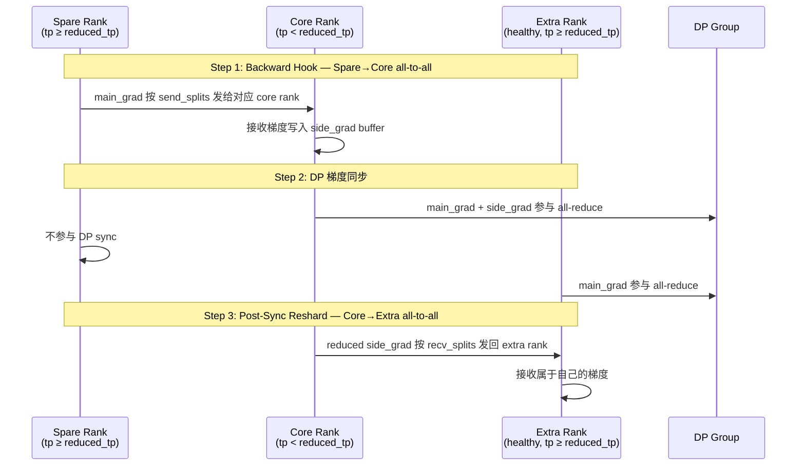

# Megatron Nonuniform Tensor Parallelism (NTP) 深度分析

**Date**: 2026-05-20
**Status**: Complete
**Source**: `megatron/core/distributed/nonuniform_tp.py`, `nonuniform_tp_transformer_engine.py`, `README_NONUNIFORM_TP.md`

## 1. 是什么？

NTP 是一种 **TP 组级别的 GPU 故障容错机制**，允许同一训练任务中不同 DP 副本使用**不同大小的 TP group**：

- **Healthy DP 副本**：使用完整 `tp_base` 个 GPU（如 TP=8），参数 shard 正常大小
- **Reduced DP 副本**：因 GPU 故障，仅使用 `tp_base - tp_spares` 个 GPU（如 TP=6），参数 shard 更大

核心设计原则：**用户不做任何模型修改**，NTP 在梯度层面透明弥合不同 TP size 的差异。

## 2. 为什么做？

### 2.1 故障场景的备选方案对比

GPU 故障时只有三条路：

| 方案 | 做法 | 代价 |
|------|------|------|
| **全停重启** | 杀 job，修 GPU，从 checkpoint 恢复 | 训练中断几小时~几天 |
| **全量降级** | 所有 DP 副本统一降到 reduced TP | 所有 GPU 参数 shard 变大，整个集群 MFU 受损 |
| **NTP** | 仅故障副本降级，健康副本照常 | 故障副本 GPU 计算量/显存变大，拖慢 DP sync |

NTP 的选择：**用少数几张卡的性能下降，换其余几十上百张卡不受影响**。假设 100 个 DP 副本，1 个故障——全量降级影响全部 100 个副本，NTP 仅影响 1 个。

### 2.2 适用场景

1. **GPU 硬件故障后的应急容错**（冷重启）：部分节点 GPU 故障，降级继续训练
2. **异构 GPU 拓扑部署**：不同节点挂载不同数量 GPU（2-GPU NVL domain + 4-GPU NVL domain），从零开始按 non-uniform 配置训练
3. **节省 downtime**：GPU 故障后不等替换，降级跑，减少训练中断时间

NTP **不是性能优化特性**，而是**容错特性**。目标不是"跑得跟正常一样快"，而是"GPU 坏了还能继续跑，比全量降级快得多"。

## 3. 怎么做的？

NTP 的实现分为三个层面，完全自包含在两个文件内（`nonuniform_tp.py` + `nonuniform_tp_transformer_engine.py`），不侵入 Megatron 主流程。

### 3.1 通信组重配置（冷重启时）

触发时机：**作业启动时**，在 `initialize_model_parallel(tp_size=tp_base)` 之后、模型构建之前。

```python
# nonuniform_tp.py:450-561
initialize_nonuniform_tp_process_groups(ntp_config, exit_spares=True)
```

流程：
1. 所有 rank 先按 `tp_base` 初始化正常的 TP/CP/DP 通信组
2. Reduced DP 副本的 TP group 被**重新创建**，仅包含 active ranks
3. Spare rank 收到 `non_active_ranks_per_dp` 中标记自己 → `sys.exit(0)` 退出
4. Healthy 副本的通信组保持不变

关键配置结构 `non_active_ranks_per_dp`（`nonuniform_tp.py:349-357`）：
```python
non_active_ranks_per_dp={(0, 0, 0): [2, 3]}
# DP=0, CP=0, PP=0 的副本中，local TP rank 2、3 是 spare
```

支持 tuple key `(dp_rank, cp_rank, pp_rank)` 精确指定任意并行维度组合中的 spare ranks，以及 legacy 的纯 `dp_rank` key。

### 3.2 参数 Split 元数据（ntp_map）

在 **healthy（full TP）rank** 上，对每个 TP 切分参数计算通信映射元数据（`nonuniform_tp.py:569-667`）：

```python
ntp_map(module, ntp_config, num_shards)  # num_shards = num_attention_heads 或 ffn_hidden_size
```

核心算法（`nonuniform_tp.py:626-663`）：
1. 将 `num_shards` 均匀分给 `reduced_tp_size` 个 rank（`sync_partitions`）
2. Spare rank 的 shards 被逐个从 reduced TP ranks 的尾部"借"走（`comp_2_sync` 映射）
3. 计算 `send_splits[i][j]`（rank i → rank j 的梯度元素数）和 `recv_splits`（转置）

`ntp_map` **只设置元数据，不动参数数据**：
```python
param.send_splits = send_splits   # line 662
param.recv_splits = recv_splits   # line 663
```

Reduced（unhealthy）rank 跳过 ntp_map——它们直接按新的 reduced TP size 同步，不需要 resharding。

### 3.3 梯度同步流程（两次 all-to-all）

这是 NTP 最核心的机制。完整的梯度同步包含三步：



**Step 1** 在 backward hook 中触发（`nonuniform_tp.py:1386-1458`）：
- Core rank：接收 spare rank 的梯度 → 写入 `side_grad`
- Spare rank：将 `main_grad` 按 `send_splits` 发给对应 core rank
- 使用 `_ntp_all_to_all`（封装 `dist.all_to_all`，处理非连续 tensor）

**Step 2** DP 梯度同步（`NonuniformTPParamAndGradBucketGroup`）：
- `_ntp_current_rank_should_dp_sync`（`nonuniform_tp.py:149-164`）控制谁参与 DP sync
- Reduced 副本：所有 active ranks 正常参与
- Healthy 副本：只有 core ranks（`tp_rank < reduced_tp_size`）参与 DP sync；extra ranks 不参与
- Spare rank 已经被折叠，不存在

**Step 3** Post-sync reshard（`nonuniform_tp.py:694-744`）：
- `_ntp_start_post_sync_grad_reshard` 将 DP 同步后的 side_grad 发回 healthy extra ranks
- 设计为与下一个 bucket 的 DP all-reduce **重叠执行**（`_record_ntp_post_sync_handles`）

### 3.4 Buffer 与 Bucket 适配

`NonuniformTPParamAndGradBuffer`（`nonuniform_tp.py:891-936`）：
- Core rank 额外分配 `side_grad` 空间（大小 ≈ `recv_splits` 中 spare 贡献的总和）
- `_ntp_side_grad_index_map` 追踪 side_grad 在 buffer 中的偏移
- 主 grad（`main_grad`）对优化器保持连续可见，side_grad 是附加的

`NonuniformTPParamAndGradBucketGroup`（`nonuniform_tp.py:752-823`）：
- `start_grad_sync`：等待 NTP reshard handle 完成后启动 DP sync
- `finish_grad_sync`：DP sync 完成后启动 post-sync reshard
- `register_grad_ready`：被折叠的 rank 跳过 DP 就绪登记

### 3.5 Transformer Engine 适配

`nonuniform_tp_transformer_engine.py`：处理 TE userbuffer 初始化需要统一 TP domain 的问题。通过 monkey-patch `dist.new_group` 和 `dist.new_subgroups_by_enumeration`，使 TE 在 NTP 的混合 size TP domains 上正确创建 userbuffer 通信组。

## 4. 关键约束与局限

### 4.1 不做参数 resharding

NTP 走的是"先改通信组，再建模型"的路径。Reduced 副本的 rank 在通信组重配置后 TP world size 变小，构建模型时**自然得到更大的参数 shard**。没有任何代码做参数数据的跨 rank 移动。

### 4.2 不做优化器状态转换

`distrib_optimizer.py` 中完全没有 NTP 引用。分布式优化器按当前 rank 的 TP/DP group 分片状态。从 checkpoint 恢复时，如果原本是 uniform TP，转换到 non-uniform TP 需要外部工具合并 spare rank 的优化器状态。

### 4.3 不做 checkpoint 转换

`checkpointing.py` 和 `tools/checkpoint/` 中均无 NTP 相关代码。这意味着：

| 场景 | 参数加载 | 优化器状态加载 |
|------|---------|-------------|
| 从零训练 | ✅ 天然支持 | ✅ 天然支持 |
| 从 uniform TP checkpoint 恢复 | ❌ 需要外部工具合并 spare shard | ❌ 需要外部工具合并 spare shard |

因此 NTP 当前更适用的场景是**从零开始的异构部署**，而非意外的在线故障恢复。完整的故障恢复闭环还需要 checkpoint 转换工具链。

### 4.4 Reduced 副本的显存压力

Reduced 副本每 GPU 的参数 shard 更大（TP=6 比 TP=8 大约 33%）。如果故障前 GPU 显存利用率高，可能 OOM。需要相应降低 micro batch size。

### 4.5 计算不均衡

Reduced 副本 GPU 计算量更大，会成为 DP all-reduce 的尾延迟。缓解手段：
- Bucket 级粒度：先算完的 bucket 可以先同步
- Post-sync reshard 与梯度同步重叠

但根本上，NTP 接受这种不均衡——用少数卡的性能下降换取集群其余部分的正常运转。

## 5. 与 Megatron 主流程的关系

NTP 是**完全 opt-in、non-intrusive** 的设计：

| 模块 | NTP 引用？ | 说明 |
|------|-----------|------|
| `nonuniform_tp.py` | ✅ | 核心实现（~1460 lines） |
| `nonuniform_tp_transformer_engine.py` | ✅ | TE 适配（~158 lines） |
| `pretrain_gpt.py` | ❌ | 无引用 |
| `checkpointing.py` | ❌ | 无引用 |
| `distrib_optimizer.py` | ❌ | 无引用 |
| `transformer_config.py` | ❌ | 无引用 |
| `tools/checkpoint/` | ❌ | 无引用 |

训练脚本必须显式使用 `NonuniformTPConfig` + `NonuniformTPDistributedDataParallel` + 手动调用 `ntp_init`/`ntp_map`。NTP 不改变 Megatron 的默认训练路径。

## 6. 总结

NTP 是一个**梯度级 DDP shim**，在 DDP 梯度同步的前后插入两次 all-to-all 来弥合不同 TP size 的差异。它只做三件事：

1. **重建通信组**：spare rank 退出，reduced 副本用更小的 TP group
2. **梯度收集（Spare→Core）**：backward hook 中将 spare rank 的梯度收集到 core rank 的 side_grad
3. **梯度归还（Core→Extra）**：DP sync 后将 reduced 梯度归还给 healthy extra ranks

不做的事情同样重要：不碰参数数据、不碰优化器状态、不碰 checkpoint、不做在线故障检测。

## Related Pages

- [[20_megatron_comm_overlap_analysis]] — 多维通算重叠分析（NTP post-sync reshard 利用了相同的 overlap 机制）
- [[16_megatron_distributed_optimizer_analysis]] — 分布式优化器分析（NTP 对其无感知）
- [[22_megatron_memory_optimization_analysis]] — 显存优化全景（NTP side_grad 的额外显存开销）
- [[34_deepseek_v4_tensor_parallel_analysis]] — DSv4 TP 分析（TP=1 的架构选择 vs NTP 的 TP 容错）
- [[15_megatron_pp_schedulers_analysis]] — LLM 并行计算依赖分析
