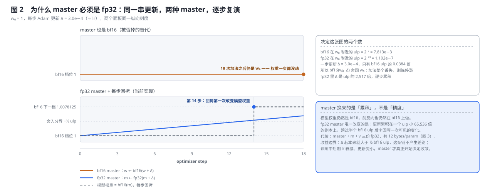
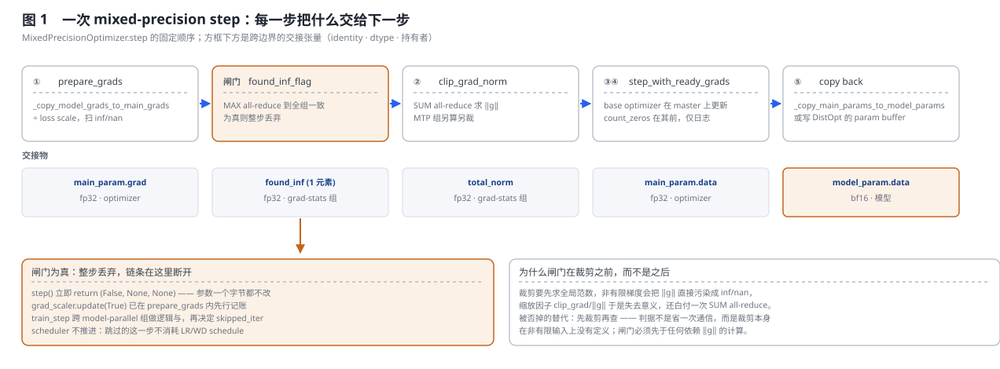
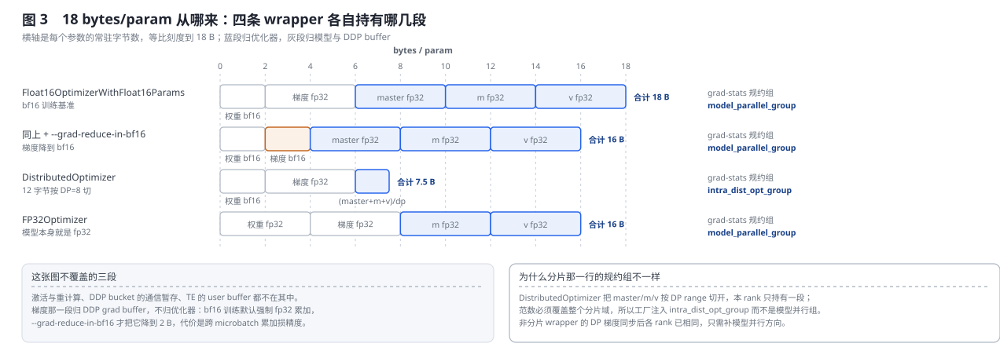
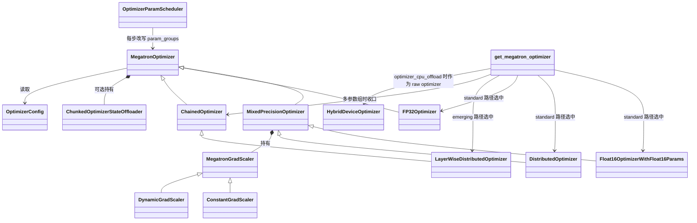
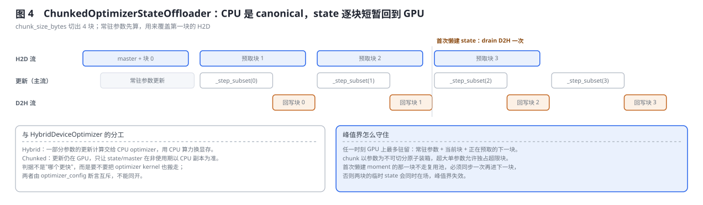

# Megatron-LM Optimizer Step 内部机制深度解析

> **源码基线**：`NVIDIA/Megatron-LM@85902ef599ea4eb06ada7567a479c524b605767a`（`dev`，2026-09-01）
> **核心源码**：`megatron/core/optimizer/{optimizer.py,__init__.py,clip_grads.py,grad_scaler.py,optimizer_config.py,layer_wise_optimizer.py,param_layout.py,emerging_optimizers.py}`；`megatron/core/optimizer/cpu_offloading/{hybrid_optimizer.py,chunked_optimizer_state_offload.py}`；`megatron/core/optimizer_param_scheduler.py`；`megatron/core/transformer/transformer_config.py`；`megatron/training/training.py`
> **中心结论**：一次参数更新真正要解决的是「更新量比权重的最低有效位还小」。Megatron 的答案是一份 fp32 master 副本：模型仍是 bf16，累积换到一个 ulp 小 65536 倍的副本上，跨过半个 bf16 ulp 才回写一次可见变化。围绕这份副本长出五个固定顺序的步骤——搬梯度并 unscale、溢出闸门、全局裁剪、base optimizer 更新、回拷；顺序不是风格问题，闸门必须先于任何依赖梯度范数的计算。四条 wrapper（Float16 / Distributed / FP32 / Chained）复用同一顺序，差别只在 master 放在哪、范数在哪个组上规约。
> **适用范围**：本页拥有 optimizer factory 的两段式分流、mixed-precision step 的五步内部、loss scaling、全局梯度裁剪与独立范数组、LR/WD 调度的完成链、μP 的 param-group 落点、两条 CPU offload 与 LayerWise/Muon 集成。参数、梯度与优化器状态沿 DP 的分片与通信归 [[16_megatron_distributed_optimizer_analysis]]，参数精度 recipe 与 CUDA Graph 归 [[23_megatron_precision_cudagraph_fusion_analysis]]，Muon 本身的 Newton–Schulz 数学归 [[11_muon_analysis]]，Megatron-FSDP 支持矩阵归 [[36_megatron_fsdp_analysis]]。
> **最近更新**：2026-09-06。按「问题 → 方案 → 变体 → 源码 → 配套 → 边界」重写，用同一个 bf16 权重贯穿五步与四条 wrapper；新增 fp32 master 的数值复演图、字节账本图与 offload 时序图；补齐 `SEPARATE_GRAD_NORM_GROUPS` 独立范数组，修正 `DynamicGradScaler` 的 hysteresis 语义与「梯度拷贝」的实际开销。

---

## 1. 特性概览

### 1.1 问题背景

反向结束、`finalize_model_grads` 把梯度收齐之后，训练迭代还剩最后一段没有闭合：梯度此刻散在 DDP 的通信缓冲里，量纲上还带着 loss scale，可能含有 inf/nan，也还没有受任何范数约束；而模型权重是 bf16 或 fp16，它在 1.0 附近的最低有效位是 $2^{-7}\approx 7.8\times10^{-3}$，比一次 Adam 更新的典型幅度（$\approx\eta=3\times10^{-4}$）大一个数量级——直接把更新加到模型权重上，加法会被舍入整个吃掉，训练在数值上原地不动。[[16_megatron_distributed_optimizer_analysis]] 回答「这些状态放在哪张卡上」，本页回答「它们在一次 step 里怎样变，以及为什么必须按这个顺序变」。

### 1.2 解决方法

优化器为每个低精度参数额外持有一份 fp32 **master 副本**，所有更新都发生在 master 上，每步结束再把 master 回拷成模型的 bf16 权重。围绕这份副本，`MixedPrecisionOptimizer.step` 固定五步：把模型梯度接成 fp32 main grad 并除回 loss scale、用一次 MAX all-reduce 让全组对「有没有非有限值」取得一致、按全局范数裁剪、让 base optimizer（FusedAdam、SGD、Muon…）在 master 上更新、把 master 写回模型参数或参数缓冲。工厂 `get_megatron_optimizer` 先决定参数分组与各组的 LR/WD/eps 语义，再选择 wrapper；scheduler 在 step **之外**，由训练循环在跨 model-parallel 组确认更新成功之后才推进。

### 1.3 收益、开销和约束

| 维度 | 直接收益 | 必付成本或边界 |
|---|---|---|
| 数值 | 更新累积在 ulp 小 $2^{16}$ 倍的副本上，小更新不再被舍掉 | master + `m` + `v` 三份 fp32，非分片路径共 12 bytes/param |
| 稳定性 | 溢出闸门把整步丢弃，fp16 才能靠 loss scaling 训下去 | 丢弃的那一步白算了整个前反向；`skipped_iter` 计入日志 |
| 梯度尺度 | 全局范数裁剪抑制尖峰，MTP 参数可独立成组 | 每步至少一次 SUM all-reduce；启用独立组再加一次 |
| 显存 | `DistributedOptimizer` 把 12 字节按 DP 切；chunked offload 把 state 常驻 CPU | 前者改变范数规约组，后者引入 H2D/D2H 与峰值界 |
| 调度 | 只有全体成功才推进 LR/WD，跳步不消耗 schedule | 需要一次跨 model-parallel 组的逻辑与，位置固定在 step 之后 |
| 扩展 | 同一 step 接口容纳 Adam/SGD/Muon/CPU offload/LayerWise | 组合受一组构造期断言约束（§5.1），多数是直接失败而非降级 |

### 1.4 符号约定

| 符号 | 含义 |
|---|---|
| $\Psi$ | 本 rank 负责的参数元素数 |
| $\eta$ | 学习率，即 `config.lr` |
| $\Delta$ | 一步更新量 $\eta\,\hat m/(\sqrt{\hat v}+\epsilon)$，Adam 稳态下量级 $\approx\eta$ |
| $S$ | loss scale |
| $\operatorname{ulp}_{\mathrm{bf16}}(x)$、$\operatorname{ulp}_{\mathrm{fp32}}(x)$ | $x$ 处相邻两个可表示数之间的距离 |
| $d$ | `DistributedOptimizer` 的分片域大小（DP range 数） |
| AR | all-reduce |

---

## 2. optimizer step 详细方案

### 2.1 共用算例：一个 bf16 权重走完一次 step

全节固定同一个最小算例：模型里某个 bf16 权重元素，初值 $w_0=1.0$，学习率 $\eta=3\times10^{-4}$，Adam 稳态下每步更新量 $\lvert\Delta\rvert\approx\eta$。这个算例足以暴露本特性的决定性变换，因为它同时踩中两条边界：$\Delta$ 小于半个 bf16 ulp（所以直接更新会消失），又远大于 fp32 ulp（所以换个副本就能累积）。后面四条 wrapper、两条 offload 路径都复演这同一个元素。

### 2.2 为什么要有 fp32 master：同一串更新的两种走法



把更新直接加在 bf16 权重上，每一步都要经过一次 `bf16(w+\Delta)` 的舍入。bf16 只有 7 位显式尾数，$\operatorname{ulp}_{\mathrm{bf16}}(1.0)=2^{-7}=7.8125\times10^{-3}$，舍入分界在 $+\tfrac12\operatorname{ulp}=3.90625\times10^{-3}$ 处；而 $\Delta=3\times10^{-4}$ 只有 ulp 的 0.0384 倍，于是

$$
\mathrm{bf16}(w_0+\Delta)=w_0 .
$$

图 2 上面板就是这条路径跑 18 步的结果：18 次加法，值一次都没变。**这是本页要否掉的替代方案**，判据不是「精度不够好」这种模糊说法，而是这条路径下参数根本不会移动。

fp32 的 $\operatorname{ulp}_{\mathrm{fp32}}(1.0)=2^{-23}\approx1.19\times10^{-7}$，$\Delta$ 是它的约 2517 倍，因此每一步都完整落进 master：

$$
m_{k}=\mathrm{fp32}(m_{k-1}+\Delta),\qquad
w_{k}=\mathrm{bf16}(m_{k}) .
$$

模型权重仍然是 bf16，只是不再由自己累加，而是每步从 master 重新舍入。第 14 步 master 跨过 $w_0+\tfrac12\operatorname{ulp}_{\mathrm{bf16}}$，回拷第一次把模型权重推到下一档 $1.0078125$。图 2 下面板的跳变位置不是手写的，由生成脚本用真实 IEEE 舍入算出。

这解释了 master 到底换来什么：**不是前反向更精确，而是让小于一个 ulp 的更新可以跨步累积**。前向、反向、通信全都仍在 bf16 上进行，`Float16OptimizerWithFloat16Params.__init__` 只是在构造时把每个 float16/bfloat16 参数 `detach().clone().float()` 成 master，并用 `param.main_param` 建立反向引用；fp8 参数则走 `get_high_precision_init_val()`，用量化前的高精度初值播种 master，而不是用有损的 fp8 反量化值，从而让 `fp8_param_gather` 开与关在第 0 步持有同一份 master。

收益边界同样明确：当 $\Delta$ 本来就大于半个 bf16 ulp（训练早期、大 lr、或权重量级很小时），这条链不产生差别；master 真正开始决定收敛，是在 lr 衰减、更新变小之后。

### 2.3 五步的固定顺序，以及闸门为什么在裁剪之前



`MixedPrecisionOptimizer.step` 的骨架只有十几行，但每个边界都在换持有者：

```python
def step(self):
    found_inf_flag = self.prepare_grads()          # ① 接梯度 + unscale + 查 inf/nan
    if found_inf_flag:
        return False, None, None                   #    闸门：整步丢弃
    grad_norm = 0.0
    if self.config.clip_grad > 0.0:
        grad_norm = self.clip_grad_norm(self.config.clip_grad)   # ② 全局裁剪
    num_zeros_in_grad = self.count_zeros() if self.config.log_num_zeros_in_grad else 0   # ③ 仅日志
    success = self.step_with_ready_grads()          # ④⑤ base step + 回拷
    return success, grad_norm, num_zeros_in_grad
```

**① `prepare_grads`：模型梯度接成 main grad。** `Float16OptimizerWithFloat16Params._copy_model_grads_to_main_grads` 逐参数执行 `main_param.grad = model_param.main_grad.float()`，随后把 `model_param.grad` 置 `None`。这里有一处容易被名字误导：bf16 训练默认 `accumulate_allreduce_grads_in_fp32=True`（`megatron/training/arguments.py::validate_args` 在 `args.bf16` 分支里设置），DDP 的 `main_grad` **本来就是 fp32**，`.float()` 是恒等操作、不产生拷贝，所以「拷贝梯度」在默认路径上其实只是把 optimizer 侧的 `grad` 指向同一块 DDP 缓冲——源码注释「If using contiguous buffers, main_grad's memory should persist and therefore should not be deallocated」正是这个意思（张量别名是由 `.float()` 语义与缓冲 dtype 推出的分析结论，源码没有直说）。只有开了 `--grad-reduce-in-bf16` 才真的发生一次 bf16→fp32 转换与分配。随后 `_unscale_main_grads_and_check_for_nan` 用一次 `torch._amp_foreach_non_finite_check_and_unscale_` 同时完成除以 $S$ 与非有限扫描，把结果写进单元素张量 `found_inf`。

**闸门：一次 MAX AR，然后全组一致地放弃这一步。** `found_inf` 在 `get_grad_stats_parallel_group()` 上做 MAX all-reduce，因此所有 rank 得到同一个布尔值——这一点是必需的，否则部分 rank 更新、部分 rank 不更新会立刻让副本发散。为真时 `step` 直接返回 `(False, None, None)`，参数一个字节都不改；`grad_scaler.update(True)` 已经在 `prepare_grads` 内先行记账。

**被否掉的替代：先裁剪再查非有限值。** 判据不是省一次通信，而是裁剪在非有限输入上没有定义：$\lVert g\rVert$ 一旦被 inf/nan 污染，缩放因子 $\text{clip\_grad}/\lVert g\rVert$ 失去意义，还白付一次 SUM all-reduce。闸门必须先于任何依赖梯度范数的计算，这就是它在五步中位置固定的原因。

**② `clip_grad_norm`、③ `count_zeros`。** 见 §2.5；`count_zeros` 只在 `log_num_zeros_in_grad` 打开时执行，它不改梯度，纯粹是可观测性，放在裁剪之后意味着统计的是**裁剪后**的梯度。

**④⑤ `step_with_ready_grads`。** 先调 base optimizer（或 chunked offloader）的 `step()`，再把 master 写回。回写有两条出口：`reuse_grad_buf_for_mxfp8_param_ag` 且不是 LayerWise 的非 DistOpt 子优化器时写 `_copy_main_params_to_param_buffer`（由 `DistributedOptimizer` 提供字节分片缓冲；普通 wrapper 上调用它直接 `NotImplementedError`），否则走 `_copy_main_params_to_model_params` 的 multi-tensor 拷贝。这一步之后模型参数才对下一次 forward 可见——真正的完成信号是回拷完成，不是 base optimizer 返回。

### 2.4 loss scaling：把梯度抬进可表示区间，再原样除回去

fp16 的最小正规数约 $6\times10^{-5}$，反向里大量梯度落在它之下会直接下溢成 0。做法是前向后把 loss 乘上 $S$（`MegatronOptimizer.scale_loss`），链式法则让所有梯度同乘 $S$，`prepare_grads` 再乘 `inv_scale` 还原。bf16 的动态范围与 fp32 几乎相同，因此工厂只在 `config.fp16` 且未显式给定 `loss_scale` 时才建 `DynamicGradScaler`；`config.loss_scale` 非空则建 `ConstantGradScaler`；bf16 且未给 loss scale 时 `grad_scaler` 为 `None`，`prepare_grads` 于是连闸门都不走，直接返回 `False`。

`DynamicGradScaler.update` 的语义比「连续 N 步」更细，这里按冻结实现更正本页旧版说法：

- 检测到非有限值：`_growth_tracker` 清零，`_hysteresis_tracker -= 1`；**只有当 `_hysteresis_tracker <= 0` 时**才执行 $S\leftarrow\max(S\cdot\text{backoff},\ S_{\min})$。
- 未检测到：`_growth_tracker += 1`；只有累计到 `growth_interval` 时才同时重置 `_growth_tracker`、把 `_hysteresis_tracker` 复位为 `hysteresis`，并执行 $S\leftarrow S\cdot\text{growth}$。

关键在于 **hysteresis 计数器不会因为一个干净步就回满**：它只在攒够一整个 `growth_interval` 干净步时复位。所以真实行为是「前 `hysteresis` 次溢出只丢步不降档；此后每一次溢出都降档，直到一整段干净期把计数器补回来」，而不是「连续 hysteresis 次溢出才降档」。工厂固定 `growth_factor=2.0`、`backoff_factor=0.5`，`growth_interval` 取 `loss_scale_window`。

**被否掉的替代：固定 scale。** 它仍然可用（`ConstantGradScaler`），判据是 $S$ 的最优值随训练阶段漂移：太小则小梯度继续下溢，太大则大梯度上溢成 inf、每步都被闸门丢掉。dynamic scaler 用「不断试着调大、溢出就回退」在两条边界之间自动定位，代价是引入一个跨步状态机，且它的状态必须进 checkpoint 才能正确续训。

### 2.5 梯度裁剪：范数在哪个组上规约，谁被单独裁

裁剪本身是一句话：算出全局 $\lVert g\rVert_2$，若超过 `clip_grad`（默认 1.0）就把所有梯度按 $\text{clip\_grad}/\lVert g\rVert$ 等比缩小。难点全在「全局」二字——哪些 rank 的梯度应当被求和，取决于这份梯度在并行布局里是分片还是副本。

`MegatronOptimizer.clip_grad_norm` 把这件事拆成三层。第一层 `_filter_grads_for_norm` 先剔除不该计入的张量：`param_is_not_shared` 挡掉跨 stage 共享的 embedding 副本，`param_is_not_tensor_parallel_duplicate` 挡掉 TP 复制的参数；同时按 `use_precision_aware_optimizer` 与 `__fsdp_param__` 决定从 `.grad`、`.decoupled_grad` 还是 DTensor 的 `._local_tensor` 取值。第二层 `clip_grads.get_grad_norm_fp32` 做规约：若梯度是 DTensor，先在探测到的 data-parallel shard 组上 all-reduce，再在传入的 `grad_stats_parallel_group` 上 all-reduce。第三层 `clip_grad_by_total_norm_fp32` 才在本 rank 的梯度上等比缩放。

统计组不是写死的，而是由工厂在构造 wrapper 时 `setattr` 注入：

| 参数表示 | 注入的统计组 | 为什么不会重复计算 |
|---|---|---|
| 非分片 Float16 / FP32 wrapper | `model_parallel_group` | DP 梯度同步后各 DP rank 已持有相同值，只需补模型并行方向的分片 |
| `DistributedOptimizer` | `intra_dist_opt_group` | 梯度与状态按 distributed-optimizer 域分片，统计必须覆盖该实例域 |
| Megatron-FSDP | `no_shard` 注入 `mp_group`，其余策略注入 `intra_dist_opt_group` | `get_grad_norm_fp32` 先在 DTensor 自带的 shard 组上补齐，再沿注入组规约 |

**被否掉的替代：把统计组固定成「TP × PP × DP 全域」。** 判据是重复计数：DP 梯度同步之后每个 DP rank 已经持有完全相同的梯度，把它们再求和会让 $\lVert g\rVert^2$ 放大 $d$ 倍，裁剪阈值随之失真。反过来，分片路径下每个 rank 只有一段，不覆盖分片域又会漏算。所以组的选择必须跟随「这份梯度是副本还是分片」，而这只有构造 wrapper 的工厂知道。

**独立范数组：MTP 参数可以不参与主范数。** 基线新增了一条注册表 `SEPARATE_GRAD_NORM_GROUPS = (MTP_GRAD_NORM_GROUP,)`。`MultiTokenPredictionBlock.__init__` 在 `config.mtp_detach_heads=True` 时给自己所有参数打上 `param.grad_norm_group = 'mtp'`；此后 `get_grads_for_grad_norm()` 默认**排除**带标签的参数，`clip_grad_norm` 另用 `_compute_grad_norms_by_group` 求出该组自己的范数，并只用这个范数裁剪该组。未注册的标签由 `_validate_grad_norm_group` 直接 `ValueError`，防止拼写错误静默生效。

这里有一处值得单独记一笔的工程细节：`has_grad_norm_group` 用**一次全局 MAX all-reduce 并永久缓存**来判断「这个组在本 optimizer 的统计域里到底存不存在」。原因是某个 rank 本地可能一个 MTP 分片都没有，而同组的另一个 rank 有；如果各 rank 各自按本地情况决定要不要发起该组的范数规约，集合通信就会失配。用一个全局一致的标志来开关，才能既保持每步规约次数对齐，又不给常见路径（没有 MTP）平白加一次空 all-reduce。

**依赖边界。** $\lVert g\rVert_2$ 的实际计算走 `multi_tensor_applier(l2_norm_impl, …)`，缩放走 `multi_tensor_scale_tensor_impl`，二者来自 Apex / Transformer Engine 的多张量扩展。Megatron 侧能证明的是：传进去的张量清单、norm_type、规约组，以及在扩展缺失时 `total_norm.item() ** (1/norm_type)` 的回退分支。kernel 内部如何分块、用什么累加顺序，属于依赖内部，本页不作陈述。

### 2.6 四条 wrapper 走同一个算例



变体集合的枚举依据是**工厂自己的选择点**：`_get_megatron_optimizer_based_on_param_groups` 末尾那段 `if config.fp16 or config.bf16 or config.use_distributed_optimizer:` 分支，只可能产出三种 concrete wrapper（`DistributedOptimizer` / `Float16OptimizerWithFloat16Params` / `FP32Optimizer`）；第四种 `ChainedOptimizer` 不由这里产生，而是由上层 `get_megatron_optimizer` 在存在多组参数（dense 与 expert、多个 distributed-optimizer 实例、Muon 与 Adam 并存）时收口。

还要注意一条**同源的兄弟选择轴**：同一个 `get_megatron_optimizer` 入口在 `config.optimizer` 不是 `adam`/`sgd` 时转入 `_get_megatron_emerging_optimizer`，那条路径产出的是 `LayerWiseDistributedOptimizer` 加一个普通 `DistributedOptimizer`，再由 `ChainedOptimizer` 串起。也就是说 wrapper 的选择由两个字段共同决定：`use_distributed_optimizer`/`fp16`/`bf16` 决定 standard 路径选谁，`optimizer` 的取值决定走不走 emerging 路径。只看前者会漏掉整条 LayerWise 数据面，它在 §4.4 展开。

把 §2.1 的那个权重放进四条 wrapper：

| wrapper | master 在哪 | 闸门 | 范数规约组 | 回写路径 | 本 rank 常驻字节 |
|---|---|---|---|---|---|
| `Float16OptimizerWithFloat16Params` | 本 rank 持有整份 fp32 master | 有 scaler 时走；bf16 无 scaler 时恒假 | `model_parallel_group` | `_copy_main_params_to_model_params` | 18 |
| `DistributedOptimizer` | master/`m`/`v` 按 DP range 切，本 rank 只有一段 | 同上 | `intra_dist_opt_group` | 写字节分片 param buffer，再由 DDP all-gather | $6+12/d$ |
| `FP32Optimizer` | 无 master，模型本身即 fp32 | `prepare_grads` 恒返回 `False` | `model_parallel_group` | 无回写，base optimizer 直接改模型参数 | 16 |
| `ChainedOptimizer` | 由各子 optimizer 分别持有 | 各子 `prepare_grads` 结果按位或 | 组相同时合并求范数，否则各自求后取平方和开方 | 逐子 `step_with_ready_grads` | 取各子之和 |

同一个权重在四条路上的差别可以逐项对上：

- **本地计算。** 四条都由 base optimizer 在 fp32 上完成同一个 Adam 更新，$\Delta$ 相同。`FP32Optimizer` 少一次舍入（没有回拷），因此模型权重每步都动——它不需要 §2.2 的累积机制，代价是权重、激活、通信全按 fp32 计。
- **数据与所有权移动。** `Float16` 路径上 master 与模型参数一一对应、都在本 rank；`DistributedOptimizer` 把 master 的所有权切成 $d$ 段，本 rank 只更新自己那段，其余段由同 DP 组的其他 rank 负责，因此回写之后必须补一次参数 all-gather 才能让下一次 forward 看到完整权重（该 all-gather 的调度与重叠归 [[16_megatron_distributed_optimizer_analysis]]）。
- **同步点。** 前三条各有一次闸门 MAX AR 与至少一次范数 SUM AR。`ChainedOptimizer` 的关键差异在于范数：`grads_states_parallel_group_is_shared()` 为真时它把所有子 optimizer 的梯度拼成一个清单只做一次规约；不共享时退化为各自求范数再 $\sqrt{\sum\lVert g_i\rVert^2}$——两种走法在数学上等价，但后者的 all-reduce 次数等于子 optimizer 个数。
- **重建。** 只有分片路径需要重建：DP all-gather 把 $d$ 段参数拼回完整张量。其余三条回拷即完成。
- **增量代价。** 见上表最后一列；$d=8$ 时分片路径为 7.5 bytes/param，相对 18 省下约 58%，换来的是每步一次参数 all-gather 与更复杂的 checkpoint 分片语义。

### 2.7 ChainedOptimizer：多个 wrapper 串成一个

需要多个 optimizer 实例的场合有三类：MoE 的专家参数走 EP 组、稠密参数走普通 DP 组，两者分片域不同；`num_distributed_optimizer_instances > 1`（HSDP）；Muon 管矩阵权重、Adam 管其余（§4.4）。`ChainedOptimizer` 对外仍是一个 `MegatronOptimizer`：`prepare_grads` 把各子结果按位或（任一子发现非有限值就整体丢步），`step_with_ready_grads` 逐个驱动子 `step_with_ready_grads`。

它有一处与 DDP 层的隐蔽耦合值得单独记：当 `reuse_grad_buf_for_mxfp8_param_ag=True`（MXFP8 参数 all-gather 复用梯度缓冲）而 DDP 层**没有**开 `overlap_param_gather` 时，链式 step 之间会出现参数缓冲复用竞态，必须把 MXFP8 参数同步延迟到所有子 step 完成之后。判据写在 `_should_defer_mxfp8_param_sync` 的 docstring 里：`OptimizerConfig.overlap_param_gather` 与 DDP config 的同名字段**可能不一致**，所以不能拿前者当代理，必须逐个探测子 `DistributedOptimizer.ddp_config.overlap_param_gather`，任一为 `False` 即触发延迟同步。

### 2.8 开销结算

以本 rank 的 $\Psi$ 个参数元素为单位，一次 step 的账目如下。

**常驻显存。** 图 3 的四行即结论：bf16 基准 18 bytes/param，其中 6 字节（权重 2 + 梯度 4）归模型与 DDP grad buffer，12 字节（master + `m` + `v`）归优化器。`--grad-reduce-in-bf16` 把梯度段降到 2 字节、合计 16，代价是跨 microbatch 的梯度累加改在 7 位尾数上做。`DistributedOptimizer` 把那 12 字节按 $d$ 切，得 $6+12/d$。`FP32Optimizer` 没有 master，但权重本身翻倍，合计 16。这张账不含激活与重计算（[[18_megatron_recompute_analysis]]）、DDP bucket 的通信暂存与 TE user buffer（[[22_megatron_memory_optimization_analysis]]）。

**通信。** 每步固定 1 次 MAX AR（`found_inf`，单元素）；`clip_grad > 0` 时再加 1 次 SUM AR（`total_norm`，单标量）；启用独立范数组再加 1 次；`log_num_zeros_in_grad` 再加 1 次。这些都是标量级 payload，代价主要是延迟与同步点，不是带宽。真正的大额通信（梯度 reduce-scatter、参数 all-gather）不在 `optimizer.step()` 边界内，归 [[16_megatron_distributed_optimizer_analysis]]。

**计算与拷贝。** base optimizer 的 Adam 更新是 $O(\Psi)$ 的逐元素运算；回拷是一次 multi-tensor copy，$O(\Psi)$ 但访存受限。§2.3 已说明默认路径上「模型梯度 → main grad」不产生拷贝。

**这条链在什么条件下失效。** 三处：闸门为真时全部步骤作废，付出的是整个前反向；`clip_grad<=0` 时不做裁剪，`grad_norm` 在 `MixedPrecisionOptimizer` 返回 `0.0`、在 `FP32Optimizer` 返回 `None`（下游日志需要容忍两种）；参数被冻结、`param_groups` 为空时 wrapper 进入 `is_stub_optimizer` 模式——它依然参与所有集合通信，只是不更新任何参数，这样才能保证同组各 rank 的规约次数对齐。

---

## 3. 代码实现分析

### 3.1 类与所有权

空心三角为真实 Python 继承，其余连线表示构造、持有或调用。



| 层次 | 责任 | 不负责什么 |
|---|---|---|
| `get_megatron_optimizer` | 补齐 param-group overrides、一致性检查、standard/emerging 分流、组织参数组与进程组 | 不构造 concrete wrapper（那是 `_get_megatron_optimizer_based_on_param_groups` 的事），也不构造进程组本身 |
| `MegatronOptimizer` | 定义 `prepare_grads`/`step_with_ready_grads`/`step` 契约，实现范数过滤、裁剪、零计数、offload 代理 | 不决定 master 的存在与布局 |
| `MixedPrecisionOptimizer` | 拥有 fp32 master 与 grad scaler 的生命周期、五步顺序与闸门 | 不决定 master 是整份还是按 DP 分片 |
| `Float16OptimizerWithFloat16Params` | 建立 `float16_groups`/`fp32_from_float16_groups` 的一一映射与两个方向的拷贝 | 不做任何 DP 通信 |
| `DistributedOptimizer` | 把 master/state 按 range 切分，覆写 `get_grad_stats_parallel_group` 与参数同步 | 更新数学仍归 base optimizer |
| `ChainedOptimizer` | 合并多个子 optimizer 的闸门、范数与 step，处理 MXFP8 延迟同步 | 不改子 optimizer 内部顺序 |
| `MegatronGradScaler` 家族 | 维护 $S$ 与它的跨步状态机 | 不判断哪些张量非有限（那是 ATen 的 `_amp_foreach_…`） |
| `clip_grads.py` | 范数计算、等比缩放、零计数三个纯函数 | 不知道统计组从哪来，由调用方传入 |
| `OptimizerParamScheduler` | 按 `num_steps` 改写各 param group 的 `lr`/`weight_decay` | 不判断这一步是否成功（由训练循环判断） |

### 3.2 调用流程

方括号表示条件分支，缩进表示 caller/callee。本页边界从 `optimizer.step()` 起，到 scheduler 推进止。

```text
train_step                                            megatron/training/training.py
|
+-- optimizer.step()
|   |
|   +-- MixedPrecisionOptimizer.step
|   |   +-- prepare_grads
|   |   |   +-- [chunked offload] ChunkedOptimizerStateOffloader.prefetch_for_step
|   |   |   +-- Float16OptimizerWithFloat16Params._copy_model_grads_to_main_grads
|   |   |   `-- [grad_scaler] _unscale_main_grads_and_check_for_nan
|   |   |       +-- _collect_main_grad_data_for_unscaling
|   |   |       +-- torch._amp_foreach_non_finite_check_and_unscale_     <- 依赖边界（ATen）
|   |   |       +-- all_reduce(found_inf, MAX, get_grad_stats_parallel_group())
|   |   |       `-- MegatronGradScaler.update(found_inf)
|   |   |
|   |   +-- [found_inf] return (False, None, None)                       <- 整步终止
|   |   |
|   |   +-- MegatronOptimizer.clip_grad_norm
|   |   |   +-- get_grads_for_grad_norm() -> _filter_grads_for_norm
|   |   |   +-- clip_grads.get_grad_norm_fp32                            <- multi_tensor_applier 依赖边界
|   |   |   +-- [有独立组] _compute_grad_norms_by_group
|   |   |   |   `-- has_grad_norm_group -> all_reduce(MAX) 一次并缓存
|   |   |   `-- clip_grads.clip_grad_by_total_norm_fp32                  （主组与各独立组分别调用）
|   |   |
|   |   +-- [log_num_zeros_in_grad] count_zeros -> clip_grads.count_zeros_fp32
|   |   |
|   |   `-- step_with_ready_grads
|   |       +-- optimizer.step()  |  ChunkedOptimizerStateOffloader.step()
|   |       `-- _copy_main_params_to_model_params
|   |           |  [reuse_grad_buf_for_mxfp8_param_ag] _copy_main_params_to_param_buffer
|   |
|   +-- FP32Optimizer.step            （无 master、无 scaler，prepare_grads 恒返回 False）
|   `-- ChainedOptimizer.step
|       +-- prepare_grads             （各子结果按位或）
|       +-- get_grad_norm             （组相同则合并规约，否则各自求后平方和开方）
|       +-- clip_grad_by_total_norm_fp32  逐子、逐范数组
|       `-- step_with_ready_grads
|           `-- [MXFP8 复用缓冲且 DDP 未 overlap] _step_with_deferred_mxfp8_param_sync
|
+-- logical_and_across_model_parallel_group(update_successful, mp_group)
+-- reduce_max_stat_across_model_parallel_group(grad_norm, mp_group)
`-- [update_successful] OptimizerParamScheduler.step(increment)
    `-- 逐 param group 写回 get_lr / get_wd
```

### 3.3 源码阅读路线

1. 入口与选择：`megatron/core/optimizer/__init__.py::get_megatron_optimizer` → `::_get_megatron_optimizer_based_on_param_groups` → `::_get_megatron_emerging_optimizer`。
2. 五步与 master：`megatron/core/optimizer/optimizer.py::MixedPrecisionOptimizer.step` / `.prepare_grads` / `.step_with_ready_grads` / `._unscale_main_grads_and_check_for_nan`；`::Float16OptimizerWithFloat16Params.__init__` / `._copy_model_grads_to_main_grads` / `._copy_main_params_to_model_params`。
3. 裁剪与独立范数组：`megatron/core/optimizer/optimizer.py::MegatronOptimizer.clip_grad_norm` / `._filter_grads_for_norm` / `.get_grads_for_grad_norm` / `.has_grad_norm_group` / `._compute_grad_norms_by_group`；纯函数在 `megatron/core/optimizer/clip_grads.py::get_grad_norm_fp32` / `::clip_grad_by_total_norm_fp32` / `::count_zeros_fp32`；打标签处 `megatron/core/transformer/multi_token_prediction.py::MultiTokenPredictionBlock.__init__`。
4. loss scaling：`megatron/core/optimizer/grad_scaler.py::ConstantGradScaler` / `::DynamicGradScaler.update`。
5. 链式与 MXFP8：`megatron/core/optimizer/optimizer.py::ChainedOptimizer.step` / `._should_defer_mxfp8_param_sync` / `._step_with_deferred_mxfp8_param_sync`。
6. 调度完成链：`megatron/training/training.py::train_step`（`optimizer.step()` → `logical_and_across_model_parallel_group` → `opt_param_scheduler.step`）；`megatron/core/optimizer_param_scheduler.py::OptimizerParamScheduler.get_lr` / `.get_wd` / `.step` / `._restore_param_group_scheduler_overrides`。
7. offload 与 emerging：`megatron/core/optimizer/cpu_offloading/chunked_optimizer_state_offload.py::ChunkedOptimizerStateOffloader.step` / `.prefetch_for_step` / `.offload_for_forward`；`megatron/core/optimizer/cpu_offloading/hybrid_optimizer.py::HybridDeviceOptimizer`；`megatron/core/optimizer/layer_wise_optimizer.py::is_managed_by_layer_wise_optimizer`；`megatron/core/optimizer/param_layout.py::BufferKey`；`megatron/core/optimizer/emerging_optimizers.py::TensorParallelMuon` / `::TensorParallelAdaptiveMuon` / `::_EMERGING_OPTIMIZERS`。
8. μP：`megatron/core/transformer/transformer_config.py::TransformerConfig.__post_init__`；`megatron/core/optimizer/__init__.py::get_mup_config_overrides` / `::get_standard_config_overrides` / `::check_config_overrides_consistency`；运行时缩放在 `megatron/core/models/common/embeddings/language_model_embedding.py` 与 `megatron/core/models/common/language_module/language_module.py::LanguageModule._scale_logits`。
9. 边界断言：`megatron/core/optimizer/optimizer_config.py::OptimizerConfig.__post_init__`；`megatron/training/arguments.py::validate_args`（bf16 梯度累加、emerging 优化器触发与 FSDP 互斥）。

---

## 4. 配套机制

### 4.1 μP：宽度变化怎样落到初始化与 param group

μP（Maximal Update Parameterization）不是一种新的 optimizer 类，而是一组在**模型配置**与**optimizer param group** 两端同时生效的缩放规则，目标是让在小模型上调好的学习率可以直接迁移到大模型。它落在本页而不是模型结构页，是因为它改变的不是网络结构，而是各参数组的 LR/eps 与初始化标准差——作用点正是 §2 的 param group 组织。

`TransformerConfig.__post_init__` 在 `use_mup=True` 时先算出 `mup_width_mult = hidden_size / mup_base_hidden_size`，据此设置 attention 的 `softmax_scale` 与默认 `mup_output_mult`；隐藏层初始化标准差除以 $\sqrt{\text{width\_mult}}$，output layer 再按 depth 与 width 同时缩放。embedding 初始化刻意建立在这两段之间，保留未缩放的基准标准差。自定义 `init_method` / `output_layer_init_method` 不会被静默覆盖，而是发 warning——因为它可能破坏上述假设。

训练入口把两组规则合并：`setup_model_and_optimizer` 先调 `get_standard_config_overrides()` 建 weight-decay 与 decoupled-LR 规则，再调 `get_mup_config_overrides(config, width_mult, optimizer_type)`，合并后交给工厂，工厂在构造 wrapper 前用 `check_config_overrides_consistency` 校验。这条链闭合为 `TransformerConfig → width_mult → MuP overrides → param groups → optimizer`。

| 参数 / optimizer 类别 | 当前实现的缩放 | 边界 |
|---|---|---|
| Adam/AdamW hidden matrix | `max_lr`、`min_lr` 与 `eps` 均除以 `width_mult` | vector-like 参数保留基准 LR/eps |
| SGD vector-like | LR 乘 `width_mult` | hidden matrix 在当前 uniform-width 实现中保持基准 LR |
| 其他非 Adam optimizer | hidden matrix LR 除以 `width_mult` | 不覆盖 eps |
| Muon 管理的 matrix | 不套 Adam 风格 μP override | 继续由 Muon 自身 scale mode 管理；spectral 模式会告警 |
| decoupled embedding/output | 保留显式 decoupled LR | μP 不覆盖这些绝对值 |

分类判据、predicate、decoupled 分支与最终的 `ParamGroupOverride` 都在 `get_mup_config_overrides()` 内；`width_mult == 1` 时直接返回空字典。运行期还有两处乘子：embedding 输出乘 `mup_embedding_mult`，logits 由 `_scale_logits` 应用 `mup_output_mult`。

**μP 必须两端同时启用。** 只改初始化不改 LR/eps，或只改 optimizer 不改 attention/output scale，都会破坏它试图保持的跨宽度尺度关系；`width_mult=1` 只会让 optimizer override 为空，不构成配置合法性检查。

### 4.2 LR / WD 调度：为什么在 step 之外

`OptimizerParamScheduler` 每次 `step(increment)` 把 `num_steps` 累加，再逐 param group 写回 `get_lr()` 与 `get_wd()`。典型曲线是 warmup 加 decay：前 `lr_warmup_steps` 步从 `lr_warmup_init` 线性升到峰值，之后按 `lr_decay_style` 衰减到 `min_lr`，可选 `cosine` / `linear` / `constant` / `WSD`。WSD（Warmup-Stable-Decay）先 warmup、再长时间恒定、最后 `wsd_decay_steps` 步快速衰减，好处是可以在 stable 段任意点取 checkpoint 续训。weight decay 亦可独立调度。

它不在 `optimizer.step()` 内部，而由训练循环在**全局一致的更新结果**之后驱动：`train_step` 先拿到 `update_successful`，用 `logical_and_across_model_parallel_group` 跨 MP 组做逻辑与，只有全体成功才按 `get_num_microbatches() × micro_batch_size × data_parallel_size` 算出本轮消费样本数并调用 `opt_param_scheduler.step(increment=increment)`；否则只记 `skipped_iter=1`。

**被否掉的替代：把 scheduler 调用塞进 `optimizer.step()`。** 判据是更新原子性，不是代码风格。某个 rank 检出 overflow 时 wrapper 返回 `False`，训练循环还必须先跨 MP 汇总成功状态；若各 optimizer 自己先推进 scheduler，失败 rank 与成功 rank 的 LR 会失配，而且「跳过一次参数更新」仍然消耗了 schedule。因此 scheduler 的位置必须在全局 success 判定之后。

per-param-group 覆盖是这一节的另一个坑：某个 param group 可以带自己的 `max_lr`/`min_lr`/`start_wd`/`end_wd`（`_OPT_PARAM_SCHEDULER_OVERRIDE_KEYS`），它们在 `get_lr()`/`get_wd()` 中**优先于**类级值。恢复训练时的正确顺序由 `load_state_dict` 保证：先还原全部字段（含 `_restore_param_group_scheduler_overrides()` 重放本次 run 的覆盖值快照），再执行 `step(increment=num_steps)` 重放 schedule——反过来会让 resume 后的第一步用到旧的 WD 状态。

### 4.3 CPU offload 的两条路



两条路解决同一个压力（optimizer state 占满显存），但搬走的东西不同，因此不能同开，`OptimizerConfig.__post_init__` 用断言把它们隔离。

**`HybridDeviceOptimizer`：把一部分参数的更新计算也搬去 CPU。** `optimizer_cpu_offload` 打开时，工厂直接把它当作 raw optimizer 交给 wrapper；`offload_fraction`（默认 0.5）决定多少参数放 CPU，`_d2h_stream` 送梯度、`_h2d_stream` 取参数，支持 `param_update_in_fp32`，并用 step hooks 自动化回拷。名字里的 Hybrid 指的正是「一部分参数的状态与更新在 GPU、一部分在 CPU」。它要求 `decoupled_weight_decay`（AdamW 语义），否则构造期断言失败。

**`ChunkedOptimizerStateOffloader`：更新仍在 GPU，只让 state 在非使用期常驻 CPU。** 它以 CPU 副本为 canonical，把参数当作不可切分原子装进受 `chunk_size_bytes` 约束的 chunk（超大单参数允许独占超限 chunk），master weights 在 step 前整窗恢复。当前的生命周期是三段：

1. `prefetch_for_step()` 异步恢复全部所选 master 与第一个 state chunk；只需要 master 的延迟路径调 `prefetch_master_for_step()`。训练入口把预取挂在 final-gradient 阶段以覆盖 H2D，`MixedPrecisionOptimizer.prepare_grads()` 对直接调用 `optimizer.step()` 的场景另留一个幂等 fallback。
2. `step()` 先等 master H2D，然后**让常驻参数先更新**——这段计算正好覆盖第一块的预取；之后逐块执行「等当前 H2D → 预取下一块 → `_step_subset` → 当前块 D2H」。首次懒建 moment 的那一块额外 `self._d2h_stream.synchronize()` 一次，因为那份存储还没进复用池，不 drain 就会让两块的临时 state 同时在场、峰值界失效。
3. 到 optimizer→forward 的生命周期边界，`offload_for_forward()` 把仍驻留的 state 与可选 master 排队 D2H 并释放 staging slot；训练循环在 zero-grad / 下一次 forward 前触发它，并为 MXFP8 参数缓冲保留延迟 master-offload 分支。

**选择判据。** 前者适合明确要把部分**计算**移到 CPU 的场景（GPU 算力有余、PCIe 有余、显存极紧）；后者适合主要目标是压住 optimizer-state 峰值、仍希望沿用 GPU optimizer kernel 的场景。旧版本的整块 `resize_(0)` / 整块 reload 生命周期在当前基线已不存在，`offload_optimizer_states` 只是 `chunked_optimizer_state_offload` 的 deprecated alias，`__post_init__` 会发 `FutureWarning` 并改写成新开关。

### 4.4 LayerWise 分布式优化器与 Muon 集成

Muon 对矩阵参数用 Newton–Schulz 正交化产生更新方向，因此它需要**整块矩阵**，不能像 Adam 那样按字节任意切——这正是早期「Muon 与 ZeRO 分片冲突」说法的来源。当前基线的解法是 layer-wise 分布式优化器，它让每个矩阵整体落在某个 shard 内，从而既能正交化又能分片。

**触发方式。** 不存在 `--layer-wise-distributed-optimizer` 这个 flag（本页旧版曾这样写，此处更正）。真正的触发是 `--optimizer muon`（或其它非 `sgd`/`adam` 的 emerging 优化器）**加上** `--use-distributed-optimizer`：`validate_args` 在这个组合下把 `use_layer_wise_distributed_optimizer` 置 `True` 并关掉普通 `use_distributed_optimizer`。`--optimizer dist_muon` 是旧写法，已弃用。

**布局。** LayerWise 不再走独立的 ping-pong 路径，而是建在 DDP 的 grad/param buffer 之上：它预计算一个 shard-aligned 的 `FullParamLayout`/`PerBufferParamLayout`（`megatron/core/optimizer/param_layout.py`），把参数按 backprop 顺序装进**对齐到 shard 边界**的 bucket，使任何参数都不跨 shard 边界，于是可以直接复用 DDP 的 reduce-scatter / all-gather 与 `overlap_grad_reduce` / `overlap_param_gather` 语义。装箱算法是 **LPT 贪心**（按 numel 降序塞进当前负载最小的 shard），在保证 bucket 连续 backprop 区间的同时让各 shard 尽量均衡。

**被否掉的替代：同尺寸配对（size-matching）装箱。** 判据是负载均衡——配对法在参数尺寸分布不均时会让某些 shard 明显更重，而 shard 的负载直接决定该 rank 的 optimizer step 时间。

**路由。** `is_managed_by_layer_wise_optimizer(param)` 决定归属：2D 矩阵权重且非 embedding/output → Muon/LayerWise 接管；embedding、bias、LayerNorm 等 → 路由到一个独立的 `DistributedOptimizer`。`BufferKey` 因此新增 `is_managed_by_layer_wise_optimizer` 维度，让两类参数落进不同 buffer；`DistributedOptimizer.start_param_sync_for_bucket_group_subset()` 只同步自己那批 bucket group，避免与 sibling LayerWise 重复 all-gather。最终 `LayerWiseDistributedOptimizer`（Muon）与 `DistributedOptimizer`（Adam）由 `ChainedOptimizer` 串成一个。

**一个由标签错误引发的显存放大。** `is_embedding_or_output_parameter` 标签决定参数被 Muon/LayerWise 接管还是路由给 Adam。MTP 阶段的 `word_embeddings.weight` 是 pre_process embedding 的副本（靠跨 stage all-reduce 同步），曾漏打此标签 → 被 LayerWise 当作普通 2D 矩阵接管，又因 `shared_embedding=True` 在 `_emit_bucket` 里把整个 $(V\times H)$ 张量复制到全部 `dp_size` 个 shard，使该 chunk 的 buffer 膨胀约 8 倍。修复是让 `pre_process` 或 `mtp_process` 任一为真就打标签。

**限制。** 该 split 路径要求 `use_layer_wise_param_layout=True`（默认开；`--no-use-layer-wise-param-layout` 回退到 legacy ping-pong）、`num_distributed_optimizer_instances == 1`，且不支持 expert-parallel 的非-Muon 参数组与 `overlap_param_gather_with_optimizer_step`。

**依赖边界。** Muon / AdaptiveMuon 的实际实现是 `megatron/core/optimizer/emerging_optimizers.py` 里的 `TensorParallelMuon` / `TensorParallelAdaptiveMuon`，经 `_EMERGING_OPTIMIZERS` 注册表接入，并依赖**外部包 `emerging-optimizers`**（基线要求 v0.3.0）。`megatron/core/optimizer/muon.py` 现在只是一个 28 行的向后兼容 shim（`get_megatron_muon_optimizer` 转调 `get_megatron_optimizer`），本页旧版把实现归给它是错的。Megatron 侧能证明的是注册表内容、默认 override 规则（`_is_nonlinear_or_embedding` 把非线性/embedding/output 路由给 Adam）、QKV 切分形状（`_get_qkv_split_shapes`：`attention_output_gate=True` 时由 3 段变 4 段 `[q, q_gate, k, v]`，并对 `shape[0] % sum(splits) != 0` 的参数跳过 QKV 标记），以及注册表自动收编上游包注册的其它优化器（如 SOAP）；Newton–Schulz 迭代本身在外部包内，其数学见 [[11_muon_analysis]]。配套的 `megatron/core/optimizer/qk_clip.py::clip_qk` 由训练循环在 `optimizer.step()` 之后调用，用来稳住注意力 logits。

### 4.5 仅是相邻、不由本页展开的机制

| 机制 | 与本页的接口 | owner |
|---|---|---|
| DDP grad buffer、bucket、reduce-scatter | 提供 `main_grad`；决定它的 dtype 与就绪时刻 | [[16_megatron_distributed_optimizer_analysis]] |
| 参数 all-gather 与可见性 | 回拷之后才发起，决定下一次 forward 看到什么 | [[16_megatron_distributed_optimizer_analysis]] |
| `use_precision_aware_optimizer` 的 dtype recipe | 令梯度落在 `.decoupled_grad`，改变 §2.5 的取值分支 | [[23_megatron_precision_cudagraph_fusion_analysis]] |
| optimizer state 的持久化与恢复 | `sharded_state_dict` / `load_state_dict` 的分片语义 | [[19_megatron_dist_checkpointing_analysis]] |
| grad norm / loss scale 的日志与异常归因 | 消费本页返回的 `grad_norm`、`skipped_iter` | [[28_megatron_training_stability_observability_analysis]] |
| TP/DP/expert 进程组的构造 | 工厂只消费 `pg_collection`，不构造组 | [[17_megatron_parallelism_orchestration_analysis]] |

---

## 5. 约束、适用场景与趋势

### 5.1 硬约束与失败边界

本节只列 optimizer-step、offload、precision-aware 与 emerging-optimizer 的边界；DDP/ZeRO/HSDP 的通用 guards 见 [[16_megatron_distributed_optimizer_analysis]]，Megatron-FSDP 的完整支持矩阵见 [[36_megatron_fsdp_analysis]]。

| 前提 / 不变量 | 源码落点 | 破坏后的行为 |
|---|---|---|
| `overlap_param_gather_with_optimizer_step` 与 `reuse_grad_buf_for_mxfp8_param_ag` 互斥 | `megatron/core/optimizer/optimizer_config.py::OptimizerConfig.__post_init__` | 构造期 `ValueError`——共享 buffer 一旦复用，参数 AG 就不能再提前塞进 step |
| 精度感知优化器只支持 `adam`，且必须同时开 distributed optimizer | 同上 | `assert` 失败 |
| chunked offload 限 Adam/Muon、与 `optimizer_cpu_offload` 互斥、不支持 optimizer CUDA graph | 同上 | `assert` 失败——§4.3 两条路不能同开 |
| `optimizer_cpu_offload` 要求 `decoupled_weight_decay` | `megatron/core/optimizer/__init__.py::_get_megatron_optimizer_based_on_param_groups` | `assert` 失败 |
| `skip_megatron_wrapping` 与 precision-aware / CPU offload 互斥 | 同上 | `ValueError` |
| emerging 优化器不能配 `overlap_param_gather_with_optimizer_step`，也不支持 fp16 | `megatron/core/optimizer/__init__.py::_get_megatron_emerging_optimizer` | 前者 `assert`，断言文本自带理由——emerging 路径不把 model_chunks 拆成 (first, rest) 两组，逐 chunk 的 param-gather 派发因此永远不触发；后者 `ValueError` |
| emerging 优化器不支持 Torch-FSDP2 / Megatron-FSDP | `megatron/training/arguments.py::validate_args` | `assert` 失败 |
| `grad_norm_group` 必须在 `SEPARATE_GRAD_NORM_GROUPS` 中注册 | `megatron/core/optimizer/optimizer.py::_validate_grad_norm_group` | `ValueError`，防止拼错标签静默失效 |
| bf16 且开 `accumulate_allreduce_grads_in_fp32` 时 `main_grads_dtype` 只能是 fp32 | `megatron/training/arguments.py::validate_args` | `assert` 失败 |
| `FP32Optimizer` 不支持 chunked offload | `megatron/core/optimizer/optimizer.py::FP32Optimizer.step_with_ready_grads` | 运行期 `RuntimeError` |

两条不是断言、但同样是边界的事实：

- **optimizer 不构造进程组。** `get_megatron_optimizer` 只在 `pg_collection` 缺 `tp` 时回落到全局 getter，并用 `setattr` 挂到实例；源码 TODO 要求以后把 `tp_group` 直接贯穿 constructor。组的构造归 [[17_megatron_parallelism_orchestration_analysis]]。
- **冻结参数不等于不参与通信。** `param_groups` 为空时 wrapper 进入 `is_stub_optimizer`，跳过所有拷贝与更新，但仍然参加 `found_inf` 与范数规约——这是保持同组 rank 集合通信对齐的必要条件，而不是冗余开销。

### 5.2 何时选哪条路

| 场景 | 建议 | 原因 |
|---|---|---|
| bf16/fp16 训练，显存不紧 | `Float16OptimizerWithFloat16Params` | 18 bytes/param 但没有分片带来的额外 all-gather |
| bf16 训练，优化器状态放不下 | 打开 `use_distributed_optimizer` | 12 字节按 $d$ 切，是本页范围内最有效的一步 |
| 纯 fp32 小模型或数值敏感实验 | `FP32Optimizer` | 无 master、无 scaler、无闸门，行为最容易复现 |
| fp16 且训练早期常见溢出 | 保留 `DynamicGradScaler`，调大 `loss_scale_window` | 让 hysteresis 计数器有机会补回（§2.4） |
| MoE，或 Muon 与 Adam 并存 | 让工厂产出 `ChainedOptimizer` | 分片域不同的参数组必须各自持有 wrapper |
| 分片之后仍放不下 optimizer state | chunked offload | 更新仍在 GPU，只付 H2D/D2H 与峰值界 |
| GPU 算力有余、PCIe 有余、显存极紧 | `HybridDeviceOptimizer` | 把一部分更新计算也移出 GPU |
| 想让小模型调好的 lr 迁移到大模型 | 打开 μP，并确认两端都生效 | 单端启用会破坏尺度关系（§4.1） |
| 出现 loss 尖峰但梯度有限 | 先看 `grad_norm` 日志再调 `clip_grad` | 闸门只挡非有限值，尖峰要靠裁剪 |

### 5.3 当前演进方向

> [!note] 推断：以下判断基于冻结基线中的弃用标记与 TODO，不是源码给出的时间表。

**一、CPU state offload 已完成从整块接口到分块执行器的迁移。** `megatron/core/optimizer/cpu_offloading/` 在基线下只剩 `__init__.py`、`README.md`、`hybrid_optimizer.py` 与 `chunked_optimizer_state_offload.py`，后者被 `MegatronOptimizer` 直接持有，配置侧 `offload_optimizer_states` 已降为 deprecated alias。**由此可推断**：后续调优的有效旋钮是 chunk 大小、offload fraction 与预取重叠，而不是已经不存在的旧类或整块 reload 生命周期。

**二、参数 layout 正在从 DDP buffer 里独立出去，成为多个优化器共享的第三方描述。** `BufferKey` 不再定义在 `param_and_grad_buffer.py`，而是搬去 `megatron/core/optimizer/param_layout.py`，再由 `group_params_for_buffers` 反向导入；bucket 末端对齐的 divisor 同样集中到了那里。**由此可推断**：「谁决定参数怎么装桶」正在从 DDP 侧移到优化器侧——因为 LayerWise（Muon）与 `DistributedOptimizer` 必须对同一份 layout 达成一致；后续读分桶代码应先看 `param_layout.py` 再看 `param_and_grad_buffer.py`。

**三、进程组正在从全局单例改成显式传入，而优化器这一层还没走完。** 工厂仍在 `pg_collection` 缺 `tp` 时回落到 `parallel_state.get_tensor_model_parallel_group()` 并 `setattr`，旁边写着「TODO(M4): plumb tp_group through optimizer constructors so this setattr disappears」；入口另有一条「TODO: the standard and emerging optimizer paths handle pg_collection differently; unify them」。**由此可推断**：§3.1 的类层次短期内不会变，但「优化器从哪里拿 DP/TP 组」会变，跨版本对照时这是最容易漂移的一处。

**四、范数不再必然是一个全局标量。** `SEPARATE_GRAD_NORM_GROUPS` 目前只注册了 MTP 一项，但它是一张可扩展的注册表，`param.grad_norm_group` 是逐参数标签。**由此可推断**：「一个模型一个 clip 阈值」正在松动，后续可能出现更多按子模块独立裁剪的组；读日志时要注意 `grad_norms_by_group` 与主 `grad_norm` 是两套数。

---

## 6. 配置契约

### `SchedulerConfig`

本页 §4.2 讲 LR/WD 调度的**机制**；本节给它的**配置面**。`SchedulerConfig` 经 [[41_megatron_config_surface_analysis]] §2 的工厂转成 CLI，且带一个 `exclude=["no_weight_decay_cond_type"]`——那个字段被刻意排除在 CLI 之外，因为它需要传一个条件函数而非标量。下表直接取自 `megatron/training/config/training_config.py` 的类体。

| 字段 | 类型 | 默认 | 契约 | 行 |
|---|---|---|---|---|
| `lr_wsd_decay_style` | `Literal['exponential', 'linear', 'cosine', 'minus_sqrt']` | `'exponential'` | Decay style for the annealing phase of WSD | `:173` |
| `lr_decay_iters` | `int \| None` | `None` | number of iterations to decay learning rate over, If None defaults to train iters | `:176` |
| `lr_decay_samples` | `int \| None` | `None` | number of samples to decay learning rate over, If None defaults to train samples | `:179` |
| `lr_wsd_decay_iters` | `int \| None` | `None` | number of iterations for the annealing phase in the wsd schedule | `:182` |
| `lr_wsd_decay_samples` | `int \| None` | `None` | number of samples for the annealing phase in the wsd schedule | `:185` |
| `lr_warmup_fraction` | `float \| None` | `None` | fraction of lr-warmup-(iters/samples) to use for warmup (as a float) | `:188` |
| `lr_warmup_iters` | `int` | `0` | number of iterations to linearly warmup learning rate over. | `:191` |
| `lr_warmup_samples` | `int` | `0` | number of samples to linearly warmup learning rate over. | `:194` |
| `lr_decay_steps` | `int \| None` | `field(init=False, default=None)` | number of samples to decay learning rate over. Calculated at runtime from lr_decay_iters or lr_decay_samples. | `:200` |
| `use_checkpoint_opt_param_scheduler` | `bool` | `field(default=False, metadata={'argpa…` | Use checkpoint to set the values of the scheduler (learning rate, warmup iterations, minimum learning rate, maximum number of iterations, and decay style) fr… | `:222` |
| `start_weight_decay` | `float \| None` | `None` | Initial weight decay coefficient for L2 regularization. | `:239` |
| `end_weight_decay` | `float \| None` | `None` | End of run weight decay coefficient for L2 regularization. | `:242` |
| `weight_decay_incr_style` | `Literal['constant', 'linear', 'cosine']` | `'constant'` | Weight decay increment function. | `:245` |
| `wd_incr_steps` | `int \| None` | `field(init=False, default=None)` | Number of samples to increment weight decay over. Calculated at runtime. | `:254` |

> 该类共 20 个字段，本表收 14 项；其余 6 项已在别处归属：`lr_decay_style`、`lr_warmup_init`、`lr_warmup_steps`、`override_opt_param_scheduler`、`no_weight_decay_cond_type`、`wsd_decay_steps` → 本页 §4.2。

### `TransformerConfig`（μP）

`mup_base_hidden_size` / `mup_base_head_dim` 是「调参时那个小模型」的尺寸，`mup_width_mult` 由当前尺寸与基准尺寸之比推出，其余三项是各处的缩放指数与乘子。下表直接取自 `megatron/core/transformer/transformer_config.py` 的类体。

| 字段 | 类型 | 默认 | 契约 | 行 |
|---|---|---|---|---|
| `use_mup` | `bool` | `False` | Enable Maximal Update Parameterization (MuP) for hyperparameter transfer across model widths. When enabled, learning rates and initialization are scaled acco… | `:499` |
| `mup_width_mult` | `float` | `1.0` | Width multiplier for MuP scaling, computed as hidden_size / mup_base_hidden_size. This value is automatically computed in __post_init__ when use_mup is enabled. | `:506` |
| `mup_base_hidden_size` | `Optional[int]` | `None` | Base hidden size for MuP width scaling. This is the reference width from which scaling factors are computed. Defaults to hidden_size if not specified (base m… | `:512` |
| `mup_embedding_mult` | `float` | `1.0` | Multiplier for embedding layer output. Applied after the embedding lookup. Default: 1.0 (no scaling). | `:520` |
| `mup_output_mult` | `float` | `1.0` | Multiplier for output logits before softmax. When MuP is enabled and this is left at 1.0, it is auto-set to 1/mup_width_mult to keep output variance stable a… | `:526` |
| `mup_base_head_dim` | `Optional[float]` | `None` | Base head dimension for MuP attention scaling. When set, softmax_scale = sqrt(mup_base_head_dim) / (kv_channels ** mup_attn_scale_power). Set to base model's… | `:534` |
| `mup_attn_scale_power` | `float` | `1.0` | Power for attention scaling: softmax_scale = 1 / (kv_channels ** mup_attn_scale_power). 0.5 = standard attention (1/sqrt(d_head)), 1.0 = MuP attention (1/d_h… | `:542` |

> 该类共 266 个字段，本表收 7 项；其余 259 项已在别处归属：主要归 [[10_megatron_model_structure_analysis]] 92 项、[[14_megatron_ep_analysis]] 38 项、[[23_megatron_precision_cudagraph_fusion_analysis]] 38 项、[[21_megatron_fusion_operators_analysis]] 26 项，另散见 20 页（完整归属见 `docs/coverage/megatron-lm.yaml`）。

其余配置字段的唯一 owner 见 `docs/coverage/megatron-lm.yaml`。四张 SVG 均由 `tools/figs/svg/megatron_optimizer_step_figures.mjs` 从同一组算例参数生成，其数值与尺寸契约由 `tools/figs/svg/lib/megatron_optimizer_step_figures.test.mjs` 锁定。

## Related Pages

- [[16_megatron_distributed_optimizer_analysis]] —— 解释本页 optimizer state / gradient / parameter 在 DP 上怎样分片与同步。
- [[23_megatron_precision_cudagraph_fusion_analysis]] —— 拥有 bf16/fp16/FP8 参数精度、recipe 与 CUDA Graph 配置。
- [[28_megatron_training_stability_observability_analysis]] —— 从稳定性与可观测性解释 overflow、grad norm 与异常定位。
- [[11_muon_analysis]] —— 解释 Muon 的 Newton–Schulz 数学；本页只拥有 Megatron 集成。
- [[19_megatron_dist_checkpointing_analysis]] —— 解释 optimizer/scheduler state 的持久化与恢复。
- [[22_megatron_memory_optimization_analysis]] —— 把 CPU offload 放进全域显存搬运的取舍里。
- [[17_megatron_parallelism_orchestration_analysis]] —— 提供 optimizer 消费的 TP/DP/expert 进程组。
- [[02_engineering/02_train_frameworks/megatron-lm/index|Megatron-LM 知识地图]] —— 返回本域索引。
