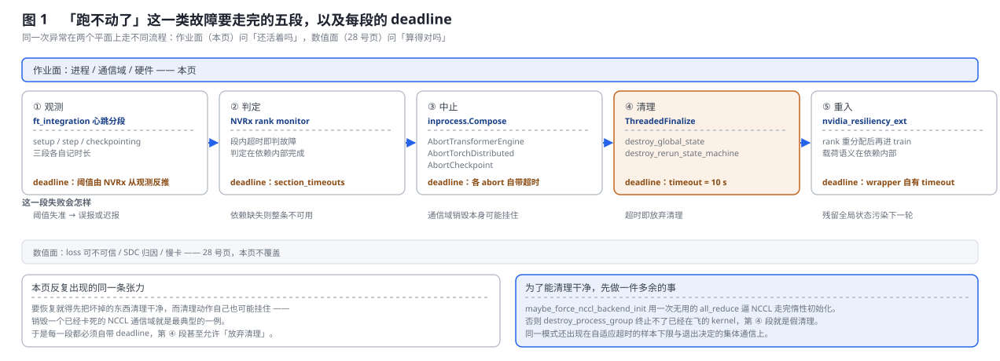
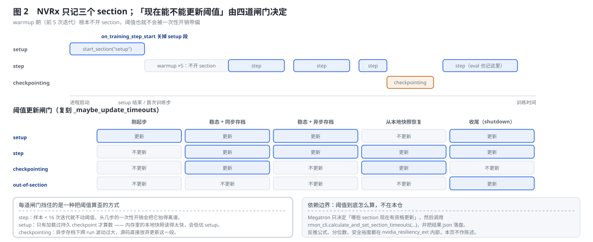
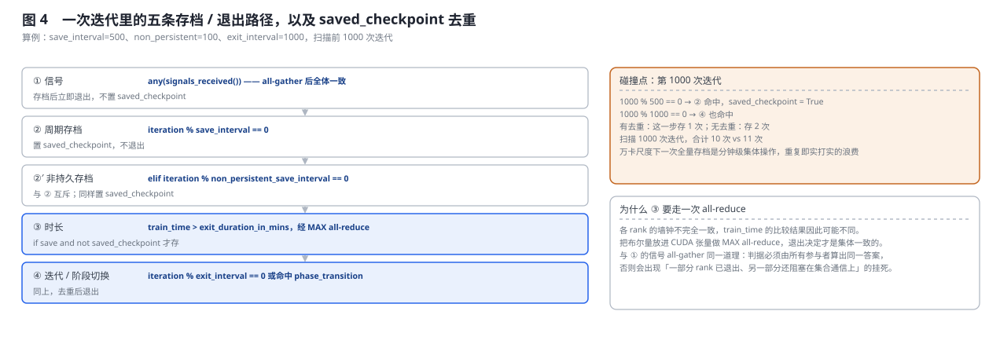
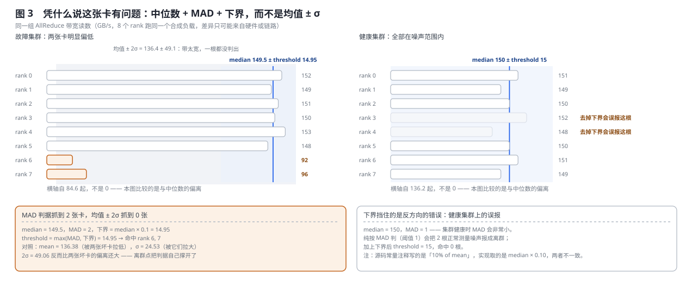
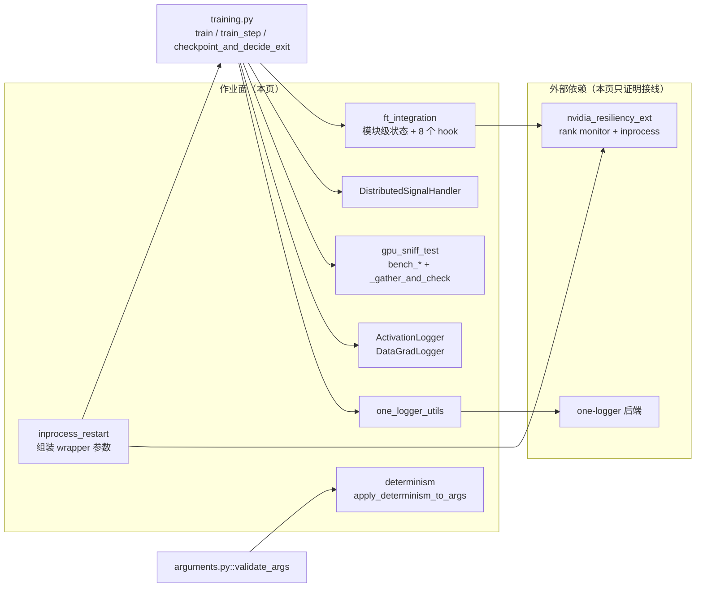

# Megatron-LM 作业韧性：进程还在不在、通信域还通不通

> **源码基线**：`NVIDIA/Megatron-LM@85902ef599ea4eb06ada7567a479c524b605767a`（`dev`，2026-09-01）
> **主题**：作业层面的韧性——进程还在不在、通信域还通不通。按观测、判定、中止、清理、重入五段讲 NVRx 心跳与自适应超时、进程内重启的清理契约、信号与时长的一致退出、确定性模式的时机窗口、GPU sniff test 的主动探测与三类张量转储。核心代码在 `megatron/training/`。
> **适用范围**：作业侧韧性与 `TrainingConfig`/`ValidationConfig` 配置契约；数值层面的稳定性归 [[28_megatron_training_stability_observability_analysis]]，checkpoint 存取机制归 [[19_megatron_dist_checkpointing_analysis]]，跨框架快恢对照归 [[02_engineering/02_train_frameworks/33_fault_recovery_relink_comparison]]。
> **最近更新**：2026-09-06。按房子形状重写，新增四张生成图与判据回归测试。

---

## 1. 特性概览

### 1.1 问题背景

万卡训练会以两种完全不同的方式出问题。一种是**算错了但还在跑**——某张卡的一次矩阵乘翻了一位，loss 曲线上看不出来，几千步后模型悄悄坏掉；对付它要的是数值校验与归因，那是 [[28_megatron_training_stability_observability_analysis]] 的领域。另一种是**跑不动了**——某个进程段错误退出、某张卡掉了、某条 NCCL 通信超时挂住；这时候没有「结果对不对」的问题，只有「作业还活着吗、能不能不从头开始」的问题。八千卡的作业排队重启一次可能等几小时，而故障率随卡数线性上升，所以这一类的成本不在算力，在**排队**。本页讲第二种。

### 1.2 解决方法

把「跑不动了」拆成五段各自可观测、可超时的工作：**观测**（把训练时间切成 setup / step / checkpointing 三个 section 上报心跳）、**判定**（段内超时即判故障）、**中止**（按顺序 abort TE、torch.distributed 与异步 checkpoint worker）、**清理**（销毁全局单例与重跑状态机，带 10 秒 deadline）、**重入**（由外部包重新分配 rank 并再次进入 `train`）。每一段都不假设下一段一定能开始，因此每一段都有自己的放弃条件。围绕这条主线还有三件独立的事：让退出决定在所有 rank 上一致（信号 all-gather、时长 all-reduce）、主动探测慢卡（合成负载 + 稳健离群判据）、以及在参数解析阶段就把确定性环境变量钉死。

### 1.3 收益、开销和约束

| 维度 | 直接收益 | 必付成本或边界 |
|---|---|---|
| 恢复时间 | 进程内重启避免整份作业重新排队 | 清理必须彻底；任何残留全局状态都会污染下一轮 |
| 故障检测 | 分段心跳 + 从观测反推的超时，跨集群不需重调常数 | 阈值计算在 NVRx 内部；样本不足时源码宁可不更新 |
| 退出一致性 | 任一 rank 收到信号即全体退出，不会半退半挂 | 每次判定要走一次集体通信；失联 rank 仍可能拖住它 |
| 慢卡定位 | 合成负载让差异只可能来自硬件或链路 | 占用训练时间，只能周期性抽查 |
| 可复现性 | 确定性模式收窄 NCCL/cuBLAS/TE 的算法选择 | 必须早于三者首次使用，晚一步**静默失效** |
| 深度诊断 | 三类张量转储可逐层比对 | hook 覆盖面依赖类型发现列表与模块名解析器 |
| 依赖 | NVRx、one-logger 都是可选外部包 | 未安装时对应功能整体不可用，且不报错、只告警 |

---

## 2. 作业韧性详细方案

### 2.1 共用算例：一次 NCCL 挂死走完五段

全节固定同一个最小算例：稳态训练中，某个 rank 的一次 all-reduce 因为链路故障永不返回。这个例子足以暴露本特性的全部决定性动作，因为它同时踩中三条边界——故障没有异常栈（进程还活着、只是不返回），清理路径本身要销毁的正是那个卡死的通信域，而恢复必须让**所有** rank 达成一致，不能只有察觉方动作。



五段的接力关系是：`ft_integration` 的 `step` section 在超时后由 NVRx 判定故障 → `inprocess.Compose` 依次 abort TE、torch.distributed 与异步 checkpoint worker → `ThreadedFinalize` 在 10 秒内销毁 Megatron 侧全局状态 → wrapper 重新分配 rank 并再次进入 `train`。每一段的失败表现都不同：观测段失准只是误报或迟报，清理段超时则直接放弃清理、把风险推给下一轮。

**被否掉的替代：让训练循环自己 try/except 然后重建通信域。** 判据在源码注释里写得很直白——`destroy_process_group` 在 NCCL 后端未完全初始化时**终止不了已经在飞的 NCCL kernel**。也就是说「在原进程里自己收拾干净」这条路要求对 NCCL 生命周期有精确控制，而这不是 Megatron 能提供的；把中止与重入交给 NVRx wrapper、Megatron 只负责提供清理回调，才是当前实现的分工。

### 2.2 观测：三个 section 与四道阈值闸门



`megatron/training/ft_integration.py` 是 Megatron 接 NVIDIA Resiliency Extension（NVRx）的适配层，由 `--enable-ft-package` 打开。它在训练循环的八个位置打点：`on_training_step_start` / `on_training_step_end`、`on_eval_step_start` / `on_eval_step_end`、`on_checkpointing_start` / `on_checkpointing_end`、`on_checkpoint_loaded` 与 `shutdown`。

**只有三个 section 名。** `setup` 从 `setup()` 开到第一次训练步（或第一次评估步）；`step` 覆盖训练步**与**评估步——两者共用同一个 section 名；`checkpointing` 覆盖每一次存档相关操作。此外还有一个「out-of-section」超时，覆盖不属于任何段的时间。

**warmup 期根本不开 section。** `on_training_step_start` 只在 `_seen_tr_iters_cnt >= _NUM_WARMUP_ITERS`（`--ft-num-warmup-iters`，默认 5）时才 `start_section("step")`，评估侧用独立的 `_curr_eval_iter_idx` 走同一条判断。头几步包含各种一次性开销（首次 kernel 编译、CUDA graph 捕获、内存池扩张），把它们计进 `step` 会让阈值偏大得离谱。

**`--calc-ft-timeouts` 打开后，阈值从实际观测反推。** 被否掉的替代就是那个写死的常数：一个固定超时值在跨集群、跨模型规模时必然选错——给大了真挂住也要等很久才发现，给小了一次正常的慢存档就被误判成故障、触发不必要的重启，而这两个方向的代价都很高。

但「反推」不是随时可做。`_maybe_update_timeouts` 有四道闸门，图 2 下半的判定表就是把它们逐场景跑出来的结果：

| 闸门 | 条件 | 挡住的是哪一种算歪 |
|---|---|---|
| `step` | `_seen_tr_iters_cnt >= 16` | 样本太少，一次性开销主导 |
| `setup` | 加载过**持久** checkpoint（`on_checkpoint_loaded(is_local_chkpt=False)`） | 本地内存快照读得太快，会低估 setup |
| `checkpointing` | 至少存过一次档，且**未开异步存档** | 异步存档下跨 run 波动过大，源码直接放弃更新这一段 |
| out-of-section | 仅在 `shutdown` 时，且 setup 与 step 都够格、且存过档 | 没跑完整一轮就没有代表性的段外时间 |

其中 `setup` 那条最不直觉：从本地快照恢复的作业**永远不会**更新 setup 超时，源码注释给的理由是 in-memory checkpoint 读取可能非常快，据此算出的 setup 阈值会偏小、后续一次正常的持久加载就会被误判。

**依赖边界。** Megatron 只决定「哪些 section 现在有资格更新」，随后调用 `rmon_cli.calculate_and_set_section_timeouts(selected_sections=…, calc_out_of_section=…)`，并由 rank 0 把 `rmon_cli.state_dict()` 写进 `ft_state.json`。反推用的分位数、安全裕度、乃至心跳的判定逻辑都在 `nvidia_resiliency_ext` 内部；本页只能证明分段、闸门与落盘，不能陈述阈值公式。

### 2.3 中止与清理：为什么每一步都要 deadline

`megatron/training/inprocess_restart.py` 由 `--inprocess-restart` 打开，`maybe_wrap_for_inprocess_restart` 包装整个 `pretrain`。Megatron 仓内可完整追到的调用链只有三步：解析最小参数并建立独立 `TCPStore`；动态导入 `nvidia_resiliency_ext.inprocess`（缺失就告警并原样返回 `train`）；组装 rank-assignment layers、initialize/abort/finalize callbacks、CUDA health check 与各类 timeout，再执行 `inprocess.Wrapper(...)(train)`。

**Megatron 提供的是清理端，不是恢复端。** 中止链按 `AbortTransformerEngine`、`AbortTorchDistributed`、自定义 `AbortCheckpoint` 的顺序传给 `inprocess.Compose`；清理端 `destroy_state()` 做两件事——`training.destroy_global_state()` 与 `rerun_state_machine.destroy_rerun_state_machine()`。本仓只证明了**构造参数的排列**，`Compose` 的执行语义在外部包中，因此不能凭冻结的 Megatron 源码断言「必须先 TE 后 torch.distributed」，也不能把「TE 资源建立在后者之上」写成已证实的因果；把它读成从上层扩展向底层通信清理是合理推断，使用前仍需对照实际安装的 NVRx 版本。同理，故障如何被监测、reserve rank 如何重新分配、包装器何时重新进入 `train`，都不能据本仓声称。

**清理自己带超时。** `destroy_state` 被包在 `inprocess.finalize.ThreadedFinalize(timeout=timedelta(seconds=10), fn=destroy_state)` 里。这正是 §1.1 那条张力的直接体现：清理动作可能挂住，所以清理也要有 deadline——超时之后系统选择带着脏状态继续，而不是把整个恢复路径一起赔进去。

**一处非直觉的前置：强制初始化 NCCL。** `maybe_force_nccl_backend_init(device_id)` 在 `--inprocess-restart` 打开时做一次 `all_reduce` 加 `cuda.synchronize()`。注释把理由写死了：「Inprocess uses destroy_process_group to terminate NCCL backend, which does not terminate NCCL kernels if NCCL backend wasn't fully initialized before additional distributed subgroups are created.」翻译过来是——**NCCL 后端惰性初始化**；若在它完全初始化之前就创建了额外子通信域，`destroy_process_group` 无法终止已经在飞的 kernel，于是「清理」变成假清理，重启后的通信域与残留 kernel 打架。用一次哪怕毫无用处的 `all_reduce` 强制走完初始化，是拿一次极小的开销换清理路径的确定性。

**这类「为了能清理干净而提前做一件多余的事」是本页的典型模式**，§2.2 的样本下限与 §2.4 的信号聚合都是同一思路的不同表现。

### 2.4 退出：从「某个 rank 收到」到「全体一致退出」



问题在于**信号是发给单个进程的，退出必须是集体的**。调度器抢占时可能只给 rank 0 发信号；即使广播，各 rank 收到的时刻也不同。如果每个 rank 各自决定何时退出，就会出现一部分 rank 已经退出、另一部分还阻塞在集合通信上——直接挂死。

`megatron/training/dist_signal_handler.py` 由 `--exit-signal-handler` 打开，`--exit-signal` 指定要捕获的信号（默认 `SIGTERM`）。`DistributedSignalHandler` 的解法是把「我收到信号了」这个布尔量**做一次 all-gather**：`signals_received()` 调用 `all_gather_item(self._signal_received, dtype=torch.int32)`，内部走 `torch.distributed.all_gather`。信号处理器本身只做一件事——把标志位置 True，不做任何清理。于是「是否退出」变成一个所有 rank 都能算出相同答案的集体判断，`checkpoint_and_decide_exit` 里用的是 `any(signal_handler.signals_received())`。

**与 rank 0 广播的区别。** 当前 all-gather 是对称协议——没有特权决策 rank，每个参与者都拿到同一份 signal 向量并自行计算 `any(...)`。这不等于容忍 dead rank：all-gather 与 broadcast 都要求通信组成员参与，任意 rank（包括 rank 0）失联时都可能无法完成。源码能证明的是「无特权决策者」，不能证明「没有存活性单点」。

`checkpoint_and_decide_exit` 把五条路径与去重逻辑收在一处，判定顺序即图 4 自上而下的顺序：

| 路径 | 触发 | 存档语义 |
|---|---|---|
| ① 信号 | `--exit-signal-handler` 且 `any(signals_received())` | 存档后立即 `return True`，**不置** `saved_checkpoint` |
| ② 周期存档 | `iteration % save_interval == 0` | 置 `saved_checkpoint`，不退出 |
| ②′ 非持久存档 | `elif iteration % non_persistent_save_interval == 0` | 与 ② 互斥（`elif`），同样置 `saved_checkpoint` |
| ③ 时长 | `train_time > exit_duration_in_mins`，经 MAX all-reduce | `if args.save and not saved_checkpoint` 才存 |
| ④ 迭代 / 阶段切换 | `iteration % exit_interval == 0`，或 `iteration in phase_transition_iterations` | 同上，去重后退出 |

**去重是这段代码真正的复杂度所在。** 一个 `saved_checkpoint` 标志在路径之间传递；③④ 两路都写成 `if args.save and not saved_checkpoint`。图 4 右上把碰撞点算了出来：在 `save_interval=500`、`exit_interval=1000` 的算例下，第 1000 次迭代同时命中 ② 与 ④，有去重存 1 次、无去重存 2 次；扫描前 1000 次迭代合计 10 次对 11 次。万卡尺度下一次全量存档是分钟级的集体操作，重复一次是实打实的浪费。

③ 的时长判断值得单看：它把 `train_time > args.exit_duration_in_mins` 的布尔结果放进 CUDA 张量再做 MAX all-reduce。**各 rank 的墙钟不完全一致**，让每个 rank 各自比较会得到不同答案；走一次集体通信才能保证退出决定一致——与信号聚合同一道理。

### 2.5 主动探测：sniff test 的离群判据



[[28_megatron_training_stability_observability_analysis]] 覆盖的 StragglerDetector 是**被动观测**：它测真实训练步里各 rank 的耗时，谁慢就报谁。`megatron/training/gpu_sniff_test.py` 是**主动探测**：它跑一组固定的合成负载——`bench_gemms`、`bench_all_reduce`、`bench_reduce_scatter`、`bench_all_to_all`、`bench_sendrecv`——各 rank 做同样的事，然后比。

**两者给出的证据不同。** StragglerDetector 说「rank 37 这一步慢了」，但慢的原因可能是它分到的数据更长，或者它在 PP 的某个位置上本来就该等。sniff test 说「rank 37 的 AllReduce 带宽比中位数低 40%」——因为所有 rank 跑的是同一个合成负载，**差异只可能来自硬件或链路**。前者发现问题，后者定位到层。代价是 sniff test 要占用训练时间，所以由 `--gpu-sniff-test-interval` 控制成周期性抽查，另外在训练开始前跑一次。

判据本身是这一节的核心。`_gather_and_check` 把各 rank 的标量指标 all-gather 到 rank 0，然后：先用 `~np.isnan` 滤掉未参与的 rank（未配对的 send/recv 会填 NaN），再算

$$
\mathrm{med}=\operatorname{median}(v),\quad
\mathrm{MAD}=\operatorname{median}\bigl(\lvert v-\mathrm{med}\rvert\bigr),\quad
\tau=\max\bigl(\mathrm{MAD},\ \mathrm{med}\cdot f\bigr),
$$

$f$ 即 `OUTLIER_MIN_DEVIATION_FRAC = 0.10`；$\lvert v_i-\mathrm{med}\rvert>\tau$ 即判离群。

图 3 用一组 8 个 rank 的 AllReduce 带宽读数把两个设计点各证一次。

**左面板——为什么不用均值与标准差。** 读数 `[152, 149, 151, 150, 153, 148, 92, 96]`（GB/s），其中两张卡明显偏低。中位数 149.5，MAD 2，下界 $149.5\times0.10=14.95$，$\tau=\max(2,14.95)=14.95$，命中 rank 6 与 rank 7。换成均值 ± 2σ：均值被两张坏卡拉低到 136.38，标准差被它们拉大到 24.53，$2\sigma=49.06$；而两张坏卡相对**均值**的偏离只有 44.38 与 40.38，都没到这个阈值——**一张都判不出来**。离群点把判据自己撑开了，这就是稳健统计要解决的问题。

**右面板——为什么阈值要有下界。** 健康集群读数 `[151, 149, 150, 152, 148, 150, 151, 149]`，中位数 150，MAD 只有 1。纯按 MAD 判（阈值就是 1）会把 2 根正常的测量噪声报成离群；加上下界后 $\tau=15$，命中 0 根。下界保证「偏离必须同时超过一个绝对比例」才算数。

报告里除了 rank 号还带主机名（`_gather_hostnames`），并打印相对中位数的百分比偏差，直接指向要下架的那台机器。分组不是「按 TP/EP/DP 各跑对应通信」这么整齐：`run_gpu_sniff_test` 把 all-reduce 挂在 `dist.group.WORLD`、reduce-scatter 挂 TP 组、all-to-all 挂 EP 组、send/recv 挂 DP 组，GEMM 形状则由 `_get_ffn_gemm_shapes` 从当前模型配置推出。同一文件还带一个独立 CLI（`main`），可脱离训练单独排查。

> [!note] 源码内部的一处不一致
> `OUTLIER_MIN_DEVIATION_FRAC` 的注释写的是「Only flag if deviation from mean exceeds 10% of mean」，而实现取的是 `median * OUTLIER_MIN_DEVIATION_FRAC`。以实现为准：下界基于中位数，不是均值。这条只是注释与代码不同步，不影响上面的推导。

### 2.6 确定性模式：一个只在 argparse 阶段有效的窗口

`megatron/training/determinism.py` 由 `--deterministic-mode` 触发，在 `megatron/training/arguments.py::validate_args` 阶段被调用。`apply_determinism_to_args` 按固定顺序做三件事：校验 `ARG_VALUES_REQUIRED_FOR_DETERMINISM`（当前是 `cross_entropy_loss_fusion=False` 与 `tp_comm_overlap=False`）、对 `os.environ` 调用 `apply_determinism_env`、最后 `torch.use_deterministic_algorithms(True)`。

**时机是硬约束。** docstring 把原因写死了：「These env vars are captured by their respective libraries at first use (NCCL at communicator init, cuBLAS at handle creation, TE at first attention forward), so the call must happen BEFORE any of those events.」这些库只在第一次使用时读一遍环境变量，之后再改无效；而 NCCL 通信域初始化发生在 `initialize_megatron` 里，cuBLAS handle 在第一次 GEMM 时创建——都远早于训练循环。所以这件事必须在参数解析阶段做完，晚一步就**静默失效**：程序照跑，只是不确定。是静默失效而非报错，正是它值得单独一节的原因。

**校验策略：允许收窄，不允许放宽。** `NCCL_ALGO` 走子集校验——用户给的逗号分隔列表里每个 token 都必须在 `ACCEPTED_NCCL_ALGO_TOKENS = {Ring, CollnetDirect, CollnetChain, ^NVLS}` 内；`NVTE_ALLOW_NONDETERMINISTIC_ALGO` 与 `CUBLAS_WORKSPACE_CONFIG` 走精确匹配（前者只接受 `"0"`，后者只接受 `:4096:8` 与 `:16:8`）；`MAMBA_DETERMINISTIC` 未设时自动跟随 torch，显式设置则必须以 `1` 开头。校验通过后才 `setdefault`——**调用方已设的值优先**。

白名单的注释把每个 token 的证据等级也写了出来：`Ring` 是「bit-exact by construction, fully verified」；`CollnetDirect`/`CollnetChain` 是「verified bit-exact at smaller scale with SHARP」；`^NVLS` 是排除 NVLS 而非选择算法，「some risk remains because determinism then depends on that fallback algo」。`Tree` 被**刻意排除**，理由是它的 intra-node chain 归约顺序不可控、multi-node inter-tree 拓扑在没有 pinned topology file 时会跨 run 变化。

**被否掉的替代：直接覆盖用户的不兼容选项。** `apply_determinism_to_args` 的注释把判据写了出来——「Incompatible options are rejected with an explicit error rather than silently overridden: the user must turn them off themselves so the deterministic run matches the config they asked for.」参数校验因此是**只读**的：读到不合要求的值就断言失败，绝不翻转，「so a default that drifts to a bad value breaks the run instead of silently running non-deterministically」。

> [!warning] 模块 docstring 与实现不一致
> `determinism.py` 顶部的模块 docstring 说 `apply_determinism_to_args` 会「call `apply_determinism_env` on `os.environ`, and flip …」，而函数自己的注释明确写着「Verification only — read each option's effective value and never flip it」。以函数实现为准：它不会修改 `args`。

### 2.7 张量转储：当上面全部说「作业健康」时

当数值出问题而 §2.2–§2.6 的手段都说作业是健康的，剩下的办法是把中间张量落盘逐层比对。三个开关各管一类：

| 开关 | 转储什么 | 实现 |
|---|---|---|
| `--save-activations-interval` | 逐层激活 | `activation_logging.py::enable_activation_logging` / `::save_activations` |
| `--save-tokens-per-expert-interval` | MoE 逐专家 token 数 | `activation_logging.py::enable_tokens_per_expert_logging` / `::save_tokens_per_expert` |
| `--save-dgrads-interval` | 逐层数据梯度 | `dgrad_logging.py::enable_dgrad_logging` / `::save_dgrads` |

三者共用同一套 hook 安装机制（`activation_logging.py::_register_hooks`，按模块类型过滤）。

**取舍一：运行时发现 TE 类型，而不是把 TE 变成日志模块的强制导入依赖。** `_discover_te_types()` 与 dgrad 的 `_get_linear_types()` 都把 TE import 放在 `try/except ImportError` 内，缺失时保留原生 PyTorch/Megatron 类型集合。源码事实是「可缺省」；判据由本页重建：**诊断功能不应让未安装 TE 的基础训练连模块导入都失败**。代价是新增 TE layer 类型时必须同步维护发现列表。

**取舍二：TPE 记录使用规范化语义键，而不是把原始模块名直接当结果格式。** `_parse_tpe_module_name` 只接受 decoder 与 MTP 两种明确模式，归一成 `(block, mtp_idx, layer)`；无法解析就告警并跳过 hook。保存侧按 rank 写 JSONL，每条显式带 `iter`/`block`/`layer`，MTP 再带 `mtp_idx`。判据是**跨运行比对必须有稳定、无歧义的层身份**；代价是新模块命名不会被「猜着记」，必须先扩 parser。

> [!note] 待展开
> 三个 logger 的**落盘格式与文件布局**（张量以什么形式写、怎么分片、跨 rank 如何区分）本页未展开，只覆盖了触发面与 hook 机制。逐格式走查需要单独一轮。

### 2.8 开销结算

| 项 | 常开成本 | 触发时成本 |
|---|---|---|
| NVRx 心跳 | 每个 section 边界一次客户端调用；无集合通信 | 阈值更新时 rank 0 写一次 `ft_state.json` |
| 进程内重启接线 | 一次强制 `all_reduce` + `cuda.synchronize()`（仅启动时） | 中止链各自的 timeout + 10 秒清理窗口 |
| 信号退出 | 每次 `checkpoint_and_decide_exit` 一次 all-gather（world size 个 int32） | 触发时最多一次全量存档 |
| 时长退出 | 每次判定一次单元素 MAX all-reduce | 同上，且受 `saved_checkpoint` 去重保护 |
| sniff test | 0（不到间隔不跑） | 一轮五类微基准 + 每个指标一次 all-gather；`--gpu-sniff-test-interval` 决定频率 |
| 确定性模式 | `NCCL_ALGO=Ring` 等收窄算法选择，通信可能变慢 | 无额外触发成本 |
| 张量转储 | hook 常驻（未到间隔时只判断不落盘） | 落盘量随层数与张量尺寸线性增长 |
| one_logger | 每个事件一次可选上报 | 无 |

**这套机制在什么条件下整体失效。** 三处：NVRx 或 one-logger 未安装时对应功能整体不可用，且只告警不报错；确定性模式若晚于三个库的首次使用则静默失效；退出决定依赖集合通信，因此在「通信域已经不可用」的场景下，`checkpoint_and_decide_exit` 自己也会挂住——它保证的是**一致性**，不是**存活性**。

---

## 3. 代码实现分析

### 3.1 类与所有权

本页的模块大多是函数式的模块级单例，只有三个真正的类；连线表示调用或持有。



| 模块 | 责任 | 不负责什么 |
|---|---|---|
| `ft_integration` | 分段打点、维护四道闸门所需的计数、把阈值结果落盘 | 不计算阈值，不判定故障 |
| `inprocess_restart` | 组装 rank-assignment、abort/finalize callback、timeout 并交给 wrapper | 不实现监测、rank 重分配与重入语义 |
| `DistributedSignalHandler` | 把「收到信号」变成一个集体可见的布尔向量 | 不做任何清理，也不决定退出后做什么 |
| `determinism` | 校验 args 与环境变量、setdefault 规范值、开 torch 确定性 | 不改 args；不保证库在此之后仍然确定 |
| `gpu_sniff_test` | 跑合成负载、收集标量、按稳健判据报离群与主机名 | 不下线节点，也不改变训练行为 |
| `activation_logging` / `dgrad_logging` | 安装 hook、规范化层身份、按间隔落盘 | 不比对，不判断对错 |
| `one_logger_utils` | 维护并上报 E2E 指标 | 不参与恢复决策 |

### 3.2 调用流程

```text
pretrain 入口
|
+-- maybe_wrap_for_inprocess_restart(pretrain)              inprocess_restart.py
|   +-- [依赖缺失] 告警并原样返回 train
|   `-- inprocess.Wrapper(rank_assignment, abort, finalize, health_check, timeouts)(train)
|       +-- abort  = inprocess.Compose(AbortTransformerEngine, AbortTorchDistributed, AbortCheckpoint)
|       `-- finalize = ThreadedFinalize(timeout=10s, fn=destroy_state)
|           `-- destroy_global_state + destroy_rerun_state_machine
|
+-- validate_args                                            arguments.py
|   `-- [--deterministic-mode] apply_determinism_to_args     determinism.py
|       +-- 断言 cross_entropy_loss_fusion / tp_comm_overlap 均为 False
|       +-- apply_determinism_env(os.environ)                （校验 → setdefault）
|       `-- torch.use_deterministic_algorithms(True)
|
+-- initialize_megatron
|   +-- [--inprocess-restart] maybe_force_nccl_backend_init  <- 一次无用 all_reduce
|   `-- [--enable-ft-package] ft_integration.setup           -> start_section("setup")
|
`-- train                                                    training.py
    |
    +-- 每次迭代
    |   +-- ft_integration.on_training_step_start            [warmup 后才开 step 段]
    |   +-- train_step
    |   +-- ft_integration.on_training_step_end
    |   +-- [gpu_sniff_test_interval 到点] _run_gpu_sniff_test
    |   |   `-- run_sniff_tests -> bench_* -> _gather_and_check   <- 中位数/MAD/下界
    |   `-- checkpoint_and_decide_exit
    |       +-- [①] any(DistributedSignalHandler.signals_received())   <- all_gather
    |       +-- [②/②′] save_checkpoint_and_time，置 saved_checkpoint
    |       +-- [③] all_reduce(train_time > limit, MAX) 后按去重存档
    |       `-- [④] exit_interval / phase_transition 后按去重存档
    |
    +-- 存档时  ft_integration.on_checkpointing_start / _end
    |           `-- on_checkpointing_end -> _maybe_update_timeouts()
    `-- 收尾    ft_integration.shutdown -> _maybe_update_timeouts(is_closing_ft=True)
                `-- _update_timeouts -> rmon_cli.calculate_and_set_section_timeouts  <- 依赖边界
```

### 3.3 源码阅读路线

1. 分段与闸门：`megatron/training/ft_integration.py::setup` / `::on_training_step_start` / `::on_checkpointing_end` / `::on_checkpoint_loaded` / `::_maybe_update_timeouts` / `::_update_timeouts`；常量 `_MIN_ITERS_FOR_STEP_TIMEOUT_UPDATE`、`_NUM_WARMUP_ITERS`。
2. 重启接线：`megatron/training/inprocess_restart.py::maybe_wrap_for_inprocess_restart` / `::inprocess_restart` / `::destroy_state` / `::maybe_force_nccl_backend_init`。
3. 一致退出：`megatron/training/dist_signal_handler.py::DistributedSignalHandler.signals_received` / `::all_gather_item`；`megatron/training/training.py::checkpoint_and_decide_exit`。
4. 确定性：`megatron/training/determinism.py::apply_determinism_to_args` / `::apply_determinism_env`；常量 `ARG_VALUES_REQUIRED_FOR_DETERMINISM`、`ACCEPTED_NCCL_ALGO_TOKENS`、`ACCEPTED_ENV_VAR_VALUES`；调用点 `megatron/training/arguments.py::validate_args`。
5. 主动探测：`megatron/training/gpu_sniff_test.py::_gather_and_check`（判据本体）、`::run_sniff_tests`、`::run_gpu_sniff_test`、`::main`；常量 `OUTLIER_MIN_DEVIATION_FRAC`、`BENCH_ITERS`；训练侧入口 `megatron/training/training.py::_run_gpu_sniff_test`。
6. 张量转储：`megatron/training/activation_logging.py::_discover_te_types` / `::_parse_tpe_module_name` / `::_register_hooks` / `::ActivationLogger`；`megatron/training/dgrad_logging.py::_get_linear_types` / `::DataGradLogger`。
7. 遥测：`megatron/training/one_logger_utils.py::on_train_start` / `::on_save_checkpoint_start` / `::track_e2e_metrics`。

---

## 4. 配套机制

### 4.1 模拟故障注入：容错路径自身的测试手段

`maybe_setup_simulated_fault()` 按 `FT_SIM_FAULT_DESC` 环境变量（格式 `rank_hung|rank_killed;rank_to_fail|"";base_delay`）起一个 daemon 后台线程，在指定时刻制造故障。容错代码的特点是平时不执行、真出事时才第一次跑——如果那时才发现它有 bug，损失是双份的。

注意它与 `megatron/core/fault_injector.py` 分属两层：那个是 core 侧的通用注入器（归 [[28_megatron_training_stability_observability_analysis]]），这个是训练侧针对 NVRx 心跳链路的注入。

**取舍：故障延迟与 `SIGSTOP`/`SIGKILL` 在 daemon 后台线程里执行，而不是在训练主路径里 `sleep` 后直接注入。** 源码只写「for FT testing only」；把它读成「测试夹具不改写正常训练控制流，让故障在训练继续运行时异步到达」是本页的分析重建。判据是**被测路径应尽量保持真实控制流**，而不是先把主线程变成人工等待程序。

### 4.2 one_logger E2E 指标：遥测不兼任恢复控制器

`megatron/training/one_logger_utils.py` 由 `--enable-one-logger` 打开，把作业级事件（训练开始、存档开始/成功/结束、应用标签、配置 flag）上报到 NVIDIA 内部的 one-logger 后端，并维护训练起点、累计耗时、样本数、checkpoint 次数等 E2E 指标。

它与 §2.2 的 NVRx 是**互补的两层**：NVRx 的 heartbeat/timeout 进入作业存活控制，one-logger 只做指标；当前代码没有把这些指标反馈成重启决策。每个入口先取 `get_one_logger()`，对象不存在就不记录，而 NVRx 走独立适配层。源码证明的是两条路径分离且 logger 可缺省；「避免遥测后端的缺失或延迟污染作业恢复」是本页重建的判据。**被否掉的不是事后分析，而是拿一个可选 logger 的送达状态直接决定进程生死。**

> [!note] 待展开
> 本页只给了 one_logger 的定位与触发面。它的指标语义（`_produce_e2e_metrics` 具体产出哪些量、如何跨重启累计）未展开。

### 4.3 仅是相邻、不由本页展开的机制

| 机制 | 与本页的接口 | owner |
|---|---|---|
| RerunStateMachine / SDC 归因 | `destroy_state` 要销毁它；判据在数值面 | [[28_megatron_training_stability_observability_analysis]] |
| StragglerDetector | 与 sniff test 分工见 §2.5 | 同上 |
| `megatron/core/fault_injector.py` | 与 §4.1 的训练侧注入分属两层 | 同上 |
| checkpoint 存取与异步 finalize | §2.4 每条退出路径都要落一次档；异步存档还关掉了 §2.2 的一道闸门 | [[19_megatron_dist_checkpointing_analysis]] |
| 全局单例（args / tokenizer / writer / timers） | `destroy_global_state` 销毁的正是这一套 | [[41_megatron_config_surface_analysis]] |
| 跨框架快恢与「重新建链」 | 把本页的 Megatron+NVRx 路线放进横向坐标 | [[02_engineering/02_train_frameworks/33_fault_recovery_relink_comparison]] |

---

## 5. 约束、适用场景与趋势

### 5.1 硬约束与失败边界

| 边界 | 表现 | 证据 |
|---|---|---|
| 确定性模式的时机不可协商 | 晚于 NCCL/cuBLAS/TE 首次使用即**静默失效**，程序照跑但不确定 | `determinism.py::apply_determinism_env` docstring |
| 确定性模式拒绝不兼容选项，而不是改写它们 | `cross_entropy_loss_fusion` 或 `tp_comm_overlap` 为真时直接断言失败 | `determinism.py::apply_determinism_to_args`、`ARG_VALUES_REQUIRED_FOR_DETERMINISM` |
| `NCCL_ALGO` 只允许收窄 | 出现白名单外的 token（含 `Tree`）即断言失败 | `ACCEPTED_NCCL_ALGO_TOKENS` 及其注释 |
| 进程内重启要求 NCCL 先完全初始化 | 否则 `destroy_process_group` 终止不了在飞的 kernel，清理是假清理 | `inprocess_restart.py::maybe_force_nccl_backend_init` 注释 |
| 清理动作本身带超时 | `ThreadedFinalize(timeout=10s)`——清理挂住时放弃清理 | `inprocess_restart.py::inprocess_restart` |
| step 超时更新需要 ≥16 次迭代样本 | 样本不足时不更新阈值，且打印说明 | `ft_integration.py::_maybe_update_timeouts`、`_MIN_ITERS_FOR_STEP_TIMEOUT_UPDATE` |
| 从本地快照恢复的作业不会更新 setup 超时 | `on_checkpoint_loaded(is_local_chkpt=True)` 不置 `_is_persistent_chkpt_loaded` | 同文件 `::on_checkpoint_loaded` |
| 异步存档下 checkpointing 段超时不更新 | 跨 run 波动过大，源码直接跳过 | `ft_integration.py::_maybe_update_timeouts` |
| 退出决定必须走集体通信 | 各 rank 墙钟不一致、信号送达不一致；保证一致性不保证存活性 | `training.py::checkpoint_and_decide_exit`、`dist_signal_handler.py::all_gather_item` |
| sniff test 占用训练时间 | 只能周期性抽查，不能常开 | `--gpu-sniff-test-interval` 与 `training.py::_run_gpu_sniff_test` |
| NVRx 与 one-logger 都是可选外部依赖 | 未安装时对应功能整体不可用，且只告警不报错 | `ft_integration.py::get_rank_monitor_client`、`inprocess_restart.py::_get_inprocess_module` |
| TPE 记录只认 decoder 与 MTP 两种模块名 | 解析失败即告警并跳过该 hook，不会「猜着记」 | `activation_logging.py::_parse_tpe_module_name` |

### 5.2 何时打开哪一项

| 场景 | 建议 | 原因 |
|---|---|---|
| 千卡以上、排队代价高 | `--enable-ft-package` + `--inprocess-restart` | 这两项才是「不重排队」的组合，缺一不可 |
| 跨集群复用同一份脚本 | 再加 `--calc-ft-timeouts` | 固定超时常数在换集群后必然选错（§2.2） |
| 用调度器抢占式队列 | `--exit-signal-handler` | 否则抢占会变成半退半挂 |
| 怀疑有慢卡但 StragglerDetector 指不明 | `--gpu-sniff-test-interval` | 合成负载让差异只可能来自硬件或链路 |
| 复现一次数值 bug | `--deterministic-mode`，并确认它在 argparse 阶段生效 | 时机晚一步就静默失效 |
| 数值坏了但作业健康 | 三个转储开关按层类型选 | 先定位到层，再谈归因（归因归 28 号页） |
| 只想要 E2E 指标 | `--enable-one-logger`，不要指望它参与恢复 | 遥测与恢复控制刻意分离（§4.2） |

### 5.3 当前演进方向

> [!note] 推断：以下判断基于冻结基线中的注释、TODO 与模块规模，不是源码给出的时间表。

**一、Megatron 侧只保留接线，恢复语义整体下沉到外部包。** `inprocess_restart.py` 全文 163 行，没有一行实现监测、rank 重分配或重入；`ft_integration.py` 也把阈值计算完全交给 `rmon_cli`。**由此可推断**：跨版本对照这条链时，Megatron 侧的 diff 会很小，真正变化的是 NVRx 版本——所以任何「恢复从哪继续」的结论都必须另钉 NVRx 版本，本页刻意不作陈述。

**二、确定性模式的策略从「静默覆盖」转向「显式拒绝」。** `apply_determinism_to_args` 的注释明确写着 verification-only、never flip，理由是「a default that drifts to a bad value breaks the run instead of silently running non-deterministically」；而模块顶部的 docstring 还留着旧的「flip」说法。**由此可推断**：这是一次尚未清理干净的语义变更，后续新增的确定性要求也会走断言而不是改写，读这个模块时应以函数注释为准。

**三、主动探测正在从训练内附属功能长成独立工具。** `gpu_sniff_test.py` 已有 579 行、五类微基准与一个可脱离训练运行的 `main` CLI，GEMM 形状还会从当前模型配置推出。**由此可推断**：它的定位在从「训练循环里的一个抽查」向「集群体检工具」移动；新增基准项时优先看 `bench_*` 与 `_gather_and_check` 的接口，而不是训练循环的调用点。

**四、张量转储的层身份正在被规范化。** TPE 侧已经用 `_parse_tpe_module_name` 把模块名归一成 `(block, mtp_idx, layer)`，解析失败宁可跳过；激活与 dgrad 侧仍直接用模块名。**由此可推断**：稳定层身份会继续向另外两个 logger 扩散，落盘格式（本页 §2.7 标记为待展开的那一块）大概率会跟着一起收敛。

---

## 6. 配置契约

本页正文讲作业**出事之后**怎么办。本节补的是决定作业**怎么跑、跑多久、何时停**的两个 config 类——它们与 §2.4 的退出路径直接咬合：`exit_*` 一组是那张表的输入，`save_*_interval` 一组决定退出前要不要落档。两个类都经 [[41_megatron_config_surface_analysis]] §2 的工厂转成 CLI。`ValidationConfig` 单列的理由是评估循环有自己的批大小与频率——而 §2.2 说的三个 section 里，评估步与训练步共用同一个 `step` 段。

### `TrainingConfig`（`megatron/training/config/training_config.py`，12 项）

| 字段 | 类型 | 默认 | 契约 | 行 |
|---|---|---|---|---|
| `rampup_batch_size` | `list[int] \| None` | `field(default=None, metadata={'argpar…` | Batch size ramp up with the following values: <start batch size>, <batch size increment>, <ramp-up samples> For example: rampup-batch-size = [16, 8, 300000] … | `:20` |
| `step_batch_size_schedule` | `str \| None` | `None` | Step-wise batch size schedule in format "THRESHOLD:BS THRESHOLD:BS ...". Thresholds support suffixes: K (1e3), M (1e6), B (1e9), T (1e12). If sequence length… | `:34` |
| `decrease_batch_size_if_needed` | `bool` | `False` | If set, decrease batch size if microbatch_size * dp_size does not divide batch_size. Old batch_size will be restored if training is re-started with dp_size t… | `:43` |
| `empty_unused_memory_level` | `Literal[0, 1, 2]` | `0` | Call torch.cuda.empty_cache() each iteration (training and eval), to reduce fragmentation. 0=off, 1=moderate, 2=aggressive. | `:49` |
| `train_sync_interval` | `int \| None` | `None` | Training CPU-GPU synchronization interval, to ensure that CPU is not running too far ahead of GPU. | `:62` |
| `train_iters` | `int \| None` | `None` | Total number of iterations to train over all training runs. Note that either train_iters or train_samples should be provided. | `:65` |
| `train_samples` | `int \| None` | `None` | Total number of samples to train over all training runs. Note that either train_iters or train_samples should be provided. | `:70` |
| `exit_signal_handler_for_dataloader` | `bool` | `False` | Use signal handler for dataloader workers | `:86` |
| `exit_signal_handler_for_training` | `bool` | `False` | Shutdown the training when SIGINT or SIGTERM received to avoid unclear traceback | `:89` |
| `manual_gc_interval` | `int` | `0` | Training step interval to trigger manual garbage collection. Values > 0 will trigger garbage collections between training steps. | `:98` |
| `manual_gc_eval` | `bool` | `True` | When using manual garbage collection, this controls garbage collection at the start and the end of each evaluation run. | `:103` |
| `iterations_to_skip` | `list[int]` | `field(default_factory=list)` | List of 1-indexed iterations to skip during training, empty by default. | `:108` |

> 该类共 21 个字段，本表收 12 项；其余 9 项已在别处归属：主要归 本页他处 7 项、[[36_megatron_fsdp_analysis]] 1 项、[[23_megatron_precision_cudagraph_fusion_analysis]] 1 项（完整归属见 `docs/coverage/megatron-lm.yaml`）。

### `ValidationConfig`（`megatron/training/config/training_config.py`，10 项）

| 字段 | 类型 | 默认 | 契约 | 行 |
|---|---|---|---|---|
| `eval_iters` | `int \| None` | `100` | Number of iterations to run for evaluation. Used for both validation and test. If not set, evaluation will not run. | `:116` |
| `eval_interval` | `int \| None` | `None` | Interval between running evaluation on validation set. If not set, evaluation will not run during training. | `:120` |
| `start_eval_at_iter` | `int \| None` | `None` | If set, evaluation will only start after this iteration number. Useful for skipping evaluation during early training iterations when the model is not yet mea… | `:125` |
| `eval_global_batch_size` | `int \| None` | `None` | Global batch size to use during evaluation. If not set, defaults to global_batch_size. Must be divisible by (eval_micro_batch_size * data_parallel_size). | `:131` |
| `eval_micro_batch_size` | `int \| None` | `None` | Micro batch size to use during evaluation. If not set, defaults to micro_batch_size. Changing this affects per-device memory usage during eval and the number… | `:136` |
| `skip_train` | `bool` | `False` | If set, bypass the training loop, perform evaluation for validation/test, and exit. | `:142` |
| `test_mode` | `bool` | `False` | Run all real-time test alongside the experiment. | `:145` |
| `full_validation` | `bool` | `False` | If set, each time validation occurs it uses the full validation dataset(s). This currently only works for GPT datasets! | `:148` |
| `multiple_validation_sets` | `bool` | `False` | If set, multiple datasets listed in the validation split are evaluated independently with a separate loss for each dataset in the list. This argument require… | `:151` |
| `validation_set_names` | `Optional[List[str]]` | `None` | Optional list of names for multiple validation sets. When provided with --multiple-validation-sets, these names are used instead of numeric indices (e.g. 'va… | `:157` |

其余配置字段的唯一 owner 见 `docs/coverage/megatron-lm.yaml`。四张 SVG 均由 `tools/figs/svg/megatron_job_resilience_figures.mjs` 从同一组算例参数与复刻的判据代码生成，其数值与尺寸契约由 `tools/figs/svg/lib/megatron_job_resilience_figures.test.mjs` 锁定。

## Related Pages

- [[28_megatron_training_stability_observability_analysis]] — 数值层面的稳定性（RerunStateMachine、SDC 归因、StragglerDetector）；与本页的作业层面互补，§2.5 专门辨析了两者的分工。
- [[19_megatron_dist_checkpointing_analysis]] — §2.4 每条退出路径都要落一次档，存档机制本身在那里；异步存档还关掉了 §2.2 的一道阈值闸门。
- [[40_megatron_feature_tree_analysis]] — 功能树总览；本页覆盖的是它 §4 仪表盘里「作业韧性与张量转储」那一行的七个文件。
- [[41_megatron_config_surface_analysis]] — 解释 config dataclass 如何生成 CLI；本页拥有 `TrainingConfig`/`ValidationConfig`，28 拥有 Rerun/Straggler 配置契约与 FaultInjector 机制。
- [[02_engineering/02_train_frameworks/33_fault_recovery_relink_comparison]] — 跨框架的快恢与「重新建链」对比，把本页的 Megatron+NVRx 路线放进横向坐标。
- [[02_engineering/02_train_frameworks/megatron-lm/index|Megatron-LM 知识地图]] — 返回本域索引。
