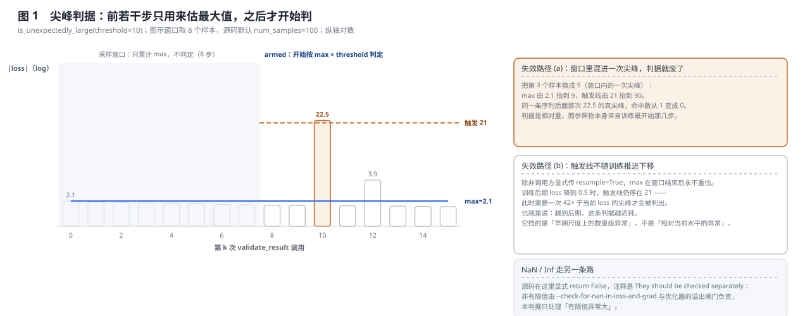
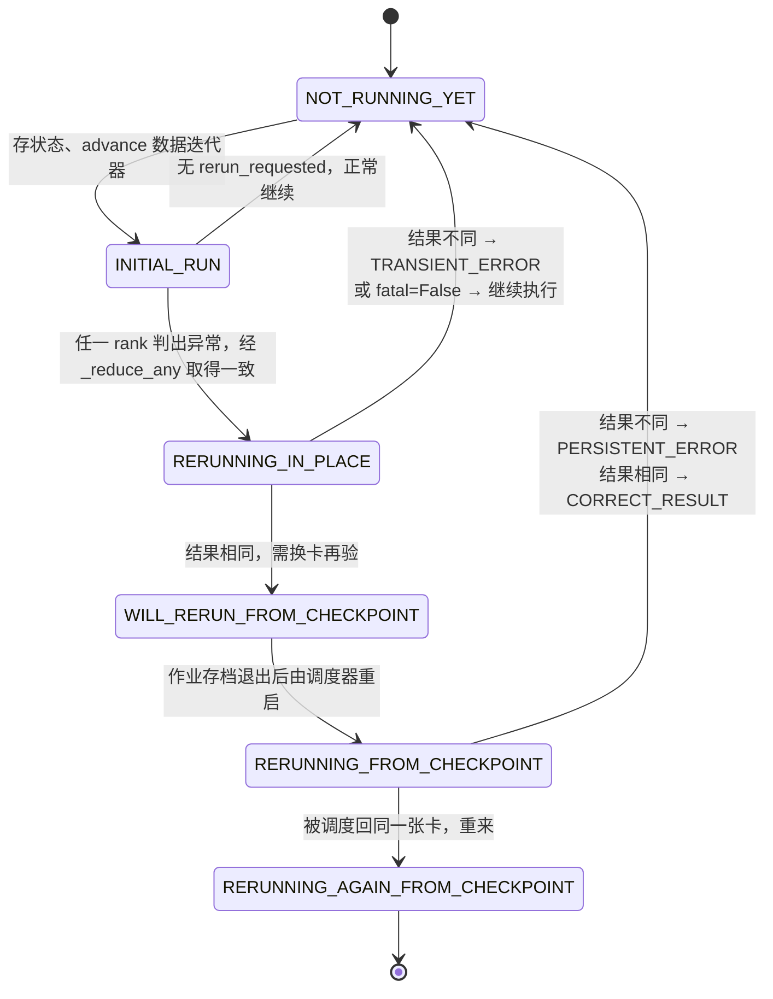
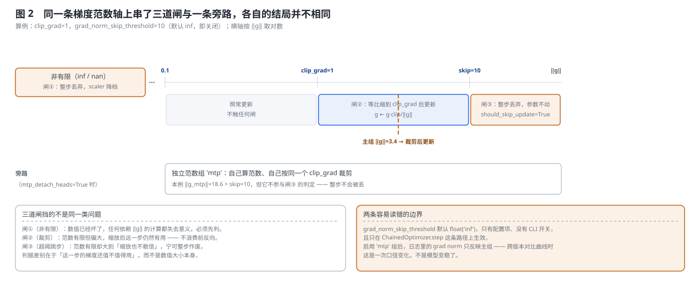
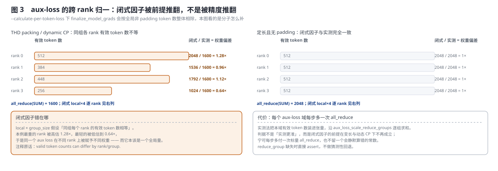
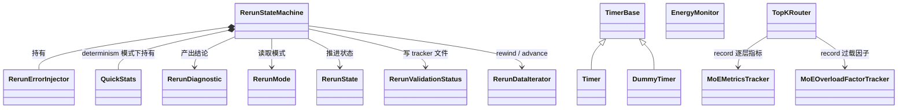

# Megatron-LM 训练稳定性与可观测性深度解析

> **源码基线**：`NVIDIA/Megatron-LM@85902ef599ea4eb06ada7567a479c524b605767a`（`dev`，2026-09-01）
> **核心源码**：`megatron/core/rerun_state_machine.py`、`megatron/core/{fault_injector.py,energy_monitor.py,timers.py}`、`megatron/core/optimizer/{qk_clip.py,optimizer.py,clip_grads.py,grad_scaler.py}`、`megatron/core/transformer/moe/{router.py,moe_logging.py,router_replay.py}`、`megatron/core/transformer/multi_token_prediction.py`、`megatron/core/distributed/param_and_grad_buffer.py`；训练循环日志在 `megatron/training/training.py`
> **中心结论**：数值稳定性做的全是同一件事——**给「这一步还值不值得用」定一个判据，并接受判据本身会出错**。三道梯度闸按「坏了 / 偏大 / 大到不敢信」分层处理同一个范数；尖峰判据用早期若干步估出的最大值当参照物，因此窗口被污染或训练推进后都会失灵；SDC 归因用「重跑三次、带容差比对」而不是逐位比对，因为源码明确不要求计算确定、只要求控制流确定。可观测性同理：Timer 的 barrier 让跨 rank 可比，也引入真实同步点与挂死风险。每条判据都带一个明写的失效条件，本页的主线就是把它们逐条摆出来。
> **适用范围**：本页拥有**数值层面**的稳定性与可观测性——梯度三闸与独立范数组、loss scaling 的稳定性视角、`RerunStateMachine` 的 SDC 归因与错误注入、QK-clip、MoE 路由稳定性与辅助损失的跨 rank 归一、MTP 解耦套件、Timer / MoE 逐层指标 / 能耗监控、指标目录与判读，以及 `LoggerConfig` / `ProfilingConfig` / `RerunStateMachineConfig` / `StragglerDetectionConfig` 配置契约。**作业层面**的韧性（进程存活、通信域清理、NVRx、进程内重启、GPU sniff test、张量转储、one_logger 机制）归 [[27_megatron_job_resilience_analysis]]；optimizer step 内部归 [[26_megatron_optimizer_step_internals_deepdive]]；NTP 布局归 [[25_megatron_nonuniform_tp_analysis]]。
> **最近更新**：2026-09-06。按「问题 → 判据 → 归因 → 源码 → 观测 → 边界」重写，用一次 loss 尖峰贯穿全链；新增尖峰判据原理图、梯度三闸图与 aux-loss 归一图，并把 RerunStateMachine 的六个状态画成状态图。补齐此前完全未覆盖的 `is_unexpectedly_large` 判据及其两条失效路径、`RerunErrorInjector`、`RerunValidationStatus` 追踪文件、首个迭代不校验的边界，以及 `--check-for-spiky-loss` 只在 elastification 入口接线这一事实；把旧版按历史基线组织的 `[!update]` 全部改写为当前基线的正文。

---

## 1. 特性概览

### 1.1 问题背景

几千卡、跑数月的训练面对三类系统性风险：**数值不稳定**（梯度或激活溢出、loss 尖峰、attention logit 爆炸）、**静默数据损坏**（GPU 算错却不报错，loss 曲线上看不出来，几千步后模型悄悄坏掉）、以及**不可观测**（训练跑着但不知道健不健康、慢在哪、为什么发散）。三类风险的共同难点不是「发现异常」，而是**判定**：一次 loss 尖峰可能是真实的数据驱动尖峰（无害）、某张卡的偶发位翻转、或者某张卡已经坏了，光看数值分不清；一次梯度范数偏大可能该裁剪，也可能该整步丢弃。本页覆盖的是这一层判定，[[27_megatron_job_resilience_analysis]] 覆盖的是「进程还在不在」的作业层面。

### 1.2 解决方法

对每一类异常都给出一个**可执行的判据 + 一个明写的失效条件**。梯度侧按范数分三段处理：非有限值整步丢弃、有限但偏大等比裁剪、大到某个阈值之上整步丢弃，MTP 参数另开一个独立范数组走旁路。尖峰侧用 `is_unexpectedly_large`：先用若干步估出最大值，之后按 `max × threshold` 判定。归因侧用 `RerunStateMachine`：把可疑结果在同一张卡上原地重跑、再从 checkpoint 在另一张卡上重跑，用「不可复现 / 可复现但换卡不一致 / 三次一致」区分 transient、persistent 与 correct。观测侧则是分级 Timer、MoE 逐层 tracker 与能耗监控，统一写 TensorBoard / wandb / one-logger。

### 1.3 收益、开销和约束

| 维度 | 直接收益 | 必付成本或边界 |
|---|---|---|
| 数值 | 三道梯度闸把「坏步」挡在参数之外 | 每步至少一次范数 all-reduce；被丢的步整个前反向白算 |
| 尖峰判定 | 一个只需一个标量的判据，几乎零开销 | 参照物来自训练最早的若干步，窗口被污染或训练推进后都会失灵 |
| SDC 归因 | 能把 transient 与 persistent 分开，指到具体 GPU | alpha 级实验特性，默认关闭；重跑要求控制流可复现；只能重跑当前这一步 |
| MoE 稳定 | 逐层指标 + 过载因子直接指向出问题的那一层 | 逐层日志要求全 PP rank 参与集合通信，漏一个就挂死 |
| 辅助损失 | 跨 rank 归一改用实测 token 数，变长与动态 CP 下仍正确 | 每个 aux-loss 域每步多一次标量 all_reduce |
| MTP | 三层解耦让辅助支路不干扰主干 | 主 `grad norm` 口径随之变化，跨版本曲线不可直接对比 |
| 观测 | 分级 Timer 可关到零开销，barrier 后可跨 rank 比 | 带 barrier 的 Timer 引入真实同步点，漏调即挂死 |

---

## 2. 稳定性与可观测性详细方案

### 2.1 共用算例：一次 loss 尖峰要回答三个问题

全节固定同一个最小算例：稳态训练中某一步的 loss 从 1.8 跳到 22.5。它足以贯穿本页的全部机制，因为要处理它必须依次回答三个不同性质的问题——**这算不算异常**（判据，§2.2）、**异常从哪来**（归因，§2.3）、**这一步的梯度还要不要用**（闸门，§2.4）。三个问题各有各的判据，也各有各的失效条件。

### 2.2 判它异不异常：尖峰判据与它的两条失效路径



`RerunStateMachine.is_unexpectedly_large(result, threshold, context, num_samples=100, resample=False)` 是 Megatron 给「有限但异常大」准备的拒绝函数。它的算法只有三步：

1. 取 $v=\lvert\text{result}\rvert$；**NaN 与 Inf 直接返回 False**，源码注释写明「They should be checked separately」——非有限值由别的检查负责。
2. 前 `num_samples` 次调用只累计 $\max$，不判定；攒满时打一条 warning 报出这个最大值。
3. 之后每次判 $v\ \ge\ \max\times\text{threshold}$。

图 1 用一条 loss 序列复演（图示窗口取 8 个样本，源码默认 100）：窗口内最大值 2.1，`threshold=10` 得到触发线 21，第 10 步的 22.5 被判出，第 12 步的 3.9 不被判出。

这条判据的两条失效路径都能算出来，也都值得在开启前就知道：

- **(a) 窗口里混进一次尖峰，判据就废了。** 把窗口内第 3 个样本换成 9.0，$\max$ 从 2.1 抬到 9，触发线从 21 抬到 90；同一条序列后面那次 22.5 的真尖峰，命中数从 1 变成 0。参照物取自训练最开始那几步，而那几步恰恰最不稳定。
- **(b) 触发线不随训练推进下移。** 除非调用方显式传 `resample=True`，$\max$ 在窗口结束后永不重估。训练后期 loss 降到 0.5 时，触发线仍停在 21——此时需要一次 42× 于当前 loss 的尖峰才会被判出。它挡的是「早期尺度上的数量级异常」，不是「相对当前水平的异常」。

**被否掉的替代：把阈值内建到引擎里。** `validate_result(result, rejection_func, message, comparison_func=None, tolerance=0.0, fatal=True)` 把「算不算异常」整个交给调用方给的函数与描述串。判据是同一个引擎要服务性质完全不同的检查：梯度侧的 NaN 检查 `fatal=True`（一发现就该停），尖峰检查 `fatal=False`（判错了不该停训练）。基线里两个真实调用点正好体现这一点：

| 调用点 | 拒绝函数 | tolerance | fatal | 备注 |
|---|---|---|---|---|
| `param_and_grad_buffer.py`，DP 通信前的 bucket 局部梯度范数 | `torch.isnan` / `torch.isinf` | 0.001 | `True` | 注释：0.1% 容差用于容纳非确定的 FlashAttention 反向 |
| 同上，`check_for_large` 打开时 | `is_unexpectedly_large(threshold=10, context="grads")` | 0.001 | `False` | 判错不该停训练 |
| `megatron/elastification/pretrain_hybrid_flex.py`，前向 loss | `is_unexpectedly_large(threshold=SPIKY_LOSS_FACTOR, context="loss")` | 0.0 | `False` | 注释：前向计算是确定的，故零容差 |

> [!warning] `--check-for-spiky-loss` 的接线范围比名字窄
> `check_for_spiky_loss` 这个配置字段在基线下**只有 `megatron/elastification/pretrain_hybrid_flex.py` 一个消费者**（全仓 `grep` 仅此一处加配置定义本身）。标准的 GPT 预训练入口并不接这条 loss 侧的尖峰检查；梯度侧的 `is_unexpectedly_large` 走的是 `param_and_grad_buffer.py` 里另一条 `check_for_large` 路径。打开这个开关而没换入口，不会有任何 loss 尖峰被判出。

**`DISABLED` 模式仍然执行 `rejection_func`。** 默认模式下 `should_run_forward_backward` 直接返回 True 并推进迭代计数，但 `validate_result` 这条路径**照常跑拒绝函数**，`fatal=True` 时照常抛 `RuntimeError`——注释写明动机是「backward-compatible behavior for infs and NaNs」。因此 `--check-for-nan-in-loss-and-grad` 与多级归因共用同一入口：**关掉归因不等于关掉检查**。

### 2.3 归因：六个状态、三种结论，跨两次作业运行

判出异常之后才轮到归因。根因可能是真实的数据驱动尖峰（无害）、某 GPU 偶发位翻转（transient）、或某 GPU 硬件坏了（persistent），三者的数值表现完全一样，只能靠重跑区分：



三层结论由 `RerunDiagnostic` 定义：`TRANSIENT_ERROR`（同卡重跑结果不同 → 不可复现，偶发位翻转）、`PERSISTENT_ERROR`（同卡可复现、换卡不一致 → 原卡故障）、`CORRECT_RESULT`（三次一致 → 真实尖峰，放行）。识别出故障卡后 `should_checkpoint_and_exit()` 让作业存档退出，由调度器换节点重启。

**被否掉的替代：重算一遍比位。** `validate_result` 的 docstring 把整个判据写成三段重跑比对，而**不要求逐位相同**：`tolerance` 参数的说明是「tolerance used in combination with `comparison_func` to determine reproducibility of results」，示例直接给 `tolerance=0.001` 并注释「max 0.1% difference in results due to non-determinism」。类级 Caveats 更把这条抬成前提——「computations are **NOT** required to be deterministic」，真正被要求确定的只有**控制流**。判据是：在开着 FlashAttention、TF32、非确定归约顺序的真实训练里，逐位比对会把每一步都判成异常，等于没有判据。

三种运行模式由 `RerunMode` 定义：`DISABLED`（默认）、`VALIDATE_RESULTS`（上述归因）、`REPORT_DETERMINISM_STATS`（只重跑一次比结果、统计计算的确定性，由 `QuickStats` 汇总后 `_maybe_report_stats` 打印，不做归因）。

**追踪文件与错误注入是这套机制的两个配套件。** 每次校验的结局写进 tracker 文件，状态取自 `RerunValidationStatus` 六值枚举：`rerun_disabled` / `initial_run` / `first_rerun_{not_,}reproducible` / `second_rerun_{not_,}reproducible`；`get_skipped_iterations_from_tracker_file` 让外部工具把「哪些迭代被跳过」读回来。`RerunErrorInjector` 则按 `error_injection_rate`（例如 1000 表示每 1000 次校验注入一次）与 `error_injection_type` 主动伪造结果：`maybe_inject` 决定这次是否注入，`maybe_miscompare` 在重跑时按注入类型返回匹配或不匹配——transient 在第一次重跑处失配，persistent 在第二次重跑处失配，correct 两次都匹配。这样三条归因路径都能在没有真实坏卡时被测到。注意它与 `megatron/core/fault_injector.py` 分属两层：后者是通用故障注入器，前者只在 rerun 引擎内部伪造比对结果。

### 2.4 梯度这条轴上的三道闸与一条旁路



同一个梯度范数会依次经过三道判据，它们挡的不是同一类问题：

| 闸 | 触发条件 | 结局 | 挡的是什么 |
|---|---|---|---|
| ① 非有限 | `prepare_grads` 扫出 inf/nan，MAX all-reduce 后全组一致 | 整步丢弃，`DynamicGradScaler` 按 `backoff_factor` 降档 | 数值已经坏了，任何依赖 $\lVert g\rVert$ 的计算都失去意义 |
| ② 裁剪 | $\lVert g\rVert>$ `clip_grad`（默认 1.0） | 等比缩到阈值后照常更新 | 范数偏大但这一步仍然有用，不浪费前反向 |
| ③ 超阈跳步 | $\lVert g\rVert>$ `grad_norm_skip_threshold`（默认 `inf`，即关闭） | `should_skip_update=True`，`update_successful=False`，整步丢弃 | 大到「缩放也不敢信」，疑似该步本身被污染 |

闸①与闸②的实现细节归 [[26_megatron_optimizer_step_internals_deepdive]]；本页只负责它们作为**稳定性判据**的分层关系。闸③位于 `ChainedOptimizer.step`：算完主梯度范数并完成裁剪后，若 `main_params` 非空、阈值有限且 `grad_norm > threshold`，打一条 INFO 日志并置 `should_skip_update`，于是 `step_with_ready_grads()` 根本不被调用。

**旁路：独立范数组。** `mtp_detach_heads=True` 时 MTP 参数被打上 `param.grad_norm_group = 'mtp'`，此后主范数**排除**它们、该组自己算范数自己裁剪（详见 §2.7）。图 2 下半标出了后果：本例 $\lVert g_{\mathrm{mtp}}\rVert=18.6$ 已超过 `skip=10`，但它不参与闸③ 的判定，整步不会被丢。

两条容易读错的边界：`grad_norm_skip_threshold` 只有配置项、**没有 CLI 开关**（基线下 `megatron/training/` 内零命中），必须经 `OptimizerConfig` 注入，且只在 `ChainedOptimizer.step` 这条路径上生效——Megatron 主训练栈走的正是这条路径。启用 `'mtp'` 组后，日志里的 `grad norm` 只反映主组，跨版本对比曲线时这是一次口径变化，不是模型变稳了。

被丢的步统一计入 `skipped iters`，所以这个指标现在有两种来源：数值溢出与主范数超阈。二者都指向「该降学习率 / 查数据 / 调阈值」。

### 2.5 QK-clip：另一类专用的数值闸

已知的一类训练不稳是 attention 的 $QK^{\mathsf T}$ logit 越训越大，softmax 进饱和区、梯度异常。`clip_qk(model, log_max_only=False)` 由训练循环在 `optimizer.step()` **之后**调用：遍历各 attention 模块，读前向时记录的 `core_attention.current_max_attn_logits`，跨 DP（含 CP）组 `all_reduce(MAX)` 得全局最大值，再按 `log_max_only` 决定是真裁剪还是只监控。返回的 `log_max_attention_logit` 既是稳定手段也是一个可观测指标。

模块发现有两条路：`HybridModel` 可能拥有嵌套的 MTP 栈，因此对它递归遍历所有带 `clip_qk` 的 `Attention`；其余模型沿用逐层 `decoder.layers[i].self_attention` 的传统遍历。

三条边界值得单独记：代价按「层数 × 每步」计——每个 attention 模块各一次 `all_reduce(MAX)` 加一次 `.item()`（设备→主机同步）；前向没记录 `current_max_attn_logits` 的层被 `continue` **直接跳过**，不报错；`log_max_only=True` 时源码必须手工把它置 `None`，注释写明原因是「When qk-clip is disabled, `clip_qk()` is not called and would otherwise never reset `current_max_attn_logits`」——否则日志值会是陈旧值。

### 2.6 MoE 的稳定性：路由精度与辅助损失的跨 rank 归一



MoE 有独有的不稳定源——路由。三件事各管一段：`--moe-router-dtype fp32` 让路由 logit 保持 fp32（高专家数下 bf16 路由精度不足，而专家输出按路由分加权累加会放大误差）；`aux_loss` 等负载均衡损失防止专家路由坍塌（成本与容量账见 [[14_megatron_ep_analysis]]）；`megatron/core/transformer/moe/router_replay.py` 记录与重放路由决策，用于复现路由相关的不确定性。

本节要展开的是第二件事里一个被改过两轮的细节：**`--calculate-per-token-loss` 下 aux-loss 的跨 rank 归一**。这个模式会让 `finalize_model_grads` 把每个参数梯度统一除以全局非 padding token 数，因此 aux-loss 必须先乘上一个分子把这次除法补回来。

**被否掉的替代：闭式因子 `local_num_tokens × group_size`。** 它在同组各 rank 有效 token 数相等时完全正确——图 3 右面板即是这种情形，闭式与实测逐 rank 都是 1.00×。但 THD packing 与动态 CP 让各 rank 的有效 token 数不再相等：图 3 左面板取 `[512, 384, 448, 256]`，实测 `all_reduce(SUM) = 1600`，而闭式给出 `2048 / 1536 / 1792 / 1024`——最重的 rank 被高估 1.28×，最轻的被低估到 0.64×。同一个 aux loss 在不同 rank 上被赋予不同权重，而它本该是一个全局量。

源码给的理由就写在注释里：「Use the reduced count directly: with THD padding or dynamic CP, valid token counts can differ by rank/group, so `local_num_tokens * group_size` is **not generally correct**」。**判据是前提失效，而不是精度不够**：闭式因子的代数没错，错的是它假设的均匀性。当前实现把本域的有效 token 数装进张量，沿 `aux_loss_scale_reduce_groups` 逐组 `all_reduce` 求和后直接相乘；`reduce_group` 缺失时直接 `assert`，不做猜测性回退。代价是每个 aux-loss 域每步多一次标量 `all_reduce`——宁可付这一次，也不留一个在新特性下**静默**算错的常数。

`z_loss` 侧的处理与之呼应但不相同：`calculate_per_token_loss` 分支直接挂 `z_loss_sum`（分子已是求和形式，不需要再乘 token 数）；只有 `!calculate_per_token_loss` 分支保留 `moe_z_loss_coeff / tp_cp_group.size()` 这一**前向**修正——z-loss 在每个 TP+CP rank 的本地 logits 上独立计算，需要按 TP+CP 求平均而非求和。记录进 tracker 的始终是 `z_loss_mean`，与用于反传的 `z_loss` 不是同一个量。

MTP 重复层还会再乘一个 `mtp_loss_scale = mtp_num_layers`（`mtp_use_repeated_layer` 打开时），同一份 router 被复用多次，损失需要按复用次数摊回。

> [!note] 这是一处跨版本的指标口径断点
> aux/z-loss 的缩放在历史上被改过两轮：先是引入闭式 `×|tp_cp|` 因子，再换成沿 `aux_loss_scale_reduce_groups` 逐组 `all_reduce` 的实测计数，最后补上 `valid_token_count` 把 padding token 排除在外。因此**跨这几个版本直接对比 aux/z-loss 曲线是无效的**——数值本身的口径变了。当前基线的语义即本节所述。

同类的辅助损失归一还有一处：实验性的 DSA（Dynamic Sparse Attention，`experimental_attention_variant='dsa'`）带一个 indexer 辅助损失，经 `DSAIndexerLossAutoScaler` 注入梯度，在 `forward_step_calc_loss` 里按与 MTP loss 相同的方式设缩放——`calculate_per_token_loss` 时设 `loss_scale`，否则设 `loss_scale / num_microbatches`，否则它相对主损失的尺度会随梯度累积步数漂移。

### 2.7 MTP：把辅助支路从主图上逐级解耦

MTP（Multi-Token Prediction）在主模型之外挂若干 head，用一个辅助损失让模型一次预测多个未来 token。问题在于：MTP loss 的梯度默认会**回流主模型与共享权重**（embedding、output projection），与主 LM loss 抢梯度；且 MTP head 的梯度尺度常与主干不同，统一裁剪会失真。当前基线用三层可叠加的开关解决，核心是把这条支路在**前向图、损失缩放、梯度裁剪**三个层面与主模型分开。

**(a) `mtp_detach_heads`：切断 MTP → 主模型的梯度回流。** `TransformerConfig.mtp_detach_heads`（默认 `False`）开启后在三处 `detach()`：
- `MultiTokenPredictionBlock.forward` 取出本 stage 的 `hidden_states` 后 `detach()`；
- `MultiTokenPredictionLayer._get_embeddings` 里 `decoder_input = embedding(...).detach()`，切断对**共享 embedding** 的梯度。紧接着对 `hidden_states` 做 `make_viewless_tensor` 后，若它已不 `requires_grad` 会显式 `requires_grad_(True)`——因为 `detach()` 后张量 `_base` 为 `None`、`make_viewless_tensor` 退化为 no-op，而激活重计算的 `CheckpointFunction` 要求至少一个输入可导，这里补回以保住到 MTP 层参数的梯度通路；
- `process_mtp_loss` 里 `output_weight.detach()`，切断对**共享 output projection** 的梯度。

同一个开关还带一条在线 RL 支持：`process_mtp_loss` 允许 `labels=None`（RL 时主 LM head 输出 logits 供外部 RL loss 用），此时从 `input_ids` 左移一位自行派生 MTP 标签（`label[i] = input_id[i+1]`），让辅助损失在不触碰主模型的前提下照常训练。

**被否掉的替代：把 output layer 整体 functional 化隔离。** 曾有一个独立开关用 `torch.func.functional_call` 配 `{name: param.detach()}` 把 output layer 的**全部参数与 buffer** 都隔离，随后被整体删除，只保留「`detach()` 共享的 `output_weight` 张量」这一最小手术，并把能力并进 `mtp_detach_heads`。判据是最小手术足以达成同一目标：真正被共享、会产生跨支路梯度耦合的只有 `output_weight` 一个张量，把整层参数都 functional 化既没有额外收益，又给 output layer 的其它路径引入了一套并行的参数视图。基线下全仓已无该开关的任何痕迹。

**(c) `mtp_grad_scale_func`：MTP loss 独立的损失缩放。** `ModelParallelConfig.mtp_grad_scale_func`（默认 `None`）。此前 MTP loss 与主 loss 共用 `grad_scale_func`；现在可单独指定。落地在 `schedules.py::_get_mtp_loss_scale(config, device)`：优先用 `mtp_grad_scale_func()`，否则回退 `grad_scale_func(torch.ones(1))`，再否则取 1；结果会校验必须是标量或 size-1 张量，搬到 output 张量所在 device 后经 `MTPLossAutoScaler.set_loss_scale` 注入。意义是 fp16/bf16 下 MTP 支路可用与主 loss 不同的 loss scale，避免辅助损失把主 loss 的动态缩放带偏。

**(d) `mtp` 独立梯度裁剪组。** 见 §2.4 的旁路。实现要点：建块时 `for param in self.parameters(): param.grad_norm_group = 'mtp'`；优化器侧有 `MTP_GRAD_NORM_GROUP` / `SEPARATE_GRAD_NORM_GROUPS` / `GRAD_NORM_GROUP_ATTR` 三个常量与 `_get_param_grad_norm_group` / `_is_separate_grad_norm_group` / `_validate_grad_norm_group` 三个辅助函数；`copy_optimizer_param_metadata` 在建 fp32 master 副本时把标签一并复制（否则副本丢标签）；`get_grads_for_grad_norm(grad_norm_group=None)` 传 `None` 取主组（已排除 `mtp`）、传 `'mtp'` 只取该组。跨 rank 一致性由 `has_grad_norm_group()` 的一次全局 `all_reduce(MAX)` 加缓存保证——某 rank 本地无 mtp 分片而对端有时，按组归约的集合通信才不会失配。

**叠加关系。** `mtp_detach_heads` 是主开关（切回流 + 共享 `output_weight` 隔离 + 在线 RL 的 `labels=None` 派生）；在此之上可叠加 `mtp_grad_scale_func`；`mtp_detach_heads=True` 时自动启用 `mtp` 独立裁剪组。

### 2.8 开销结算

| 机制 | 常开成本 | 触发时成本 |
|---|---|---|
| 三道梯度闸 | 闸① 一次单元素 MAX AR；闸② 一次标量 SUM AR | 闸①③ 触发即整步作废，代价是整个前反向 |
| 独立范数组 | 首次一次 MAX AR 判存在性并缓存；此后每步多一次标量 AR | 无 |
| 尖峰判据 | 一次 `.item()`，窗口期内只做 max 比较 | 判出后进入重跑，代价见下 |
| `RerunStateMachine` 归因 | `DISABLED` 下只跑 `rejection_func`；开启后每步存/恢复状态 | 一次同卡重跑（+1 次前反向）；必要时存档退出并由调度器重启，再跑一次 |
| QK-clip | 每层每步一次 MAX AR + 一次 `.item()` | 裁剪本身是逐元素运算 |
| aux-loss 归一 | 每个 aux-loss 域每步一次标量 AR | 无 |
| MoE 逐层指标 | 每层每步一次 `record` 累加；步末一次跨 rank 聚合 | 无 |
| Timer | `log_level` 低于阈值的用 `DummyTimer`，零开销 | `barrier=True` 引入真实同步点 |
| 能耗监控 | 每次 `lap()` 一次 NVML 读 + 一次 all-reduce | 无 |

**这套判据在什么条件下整体失效。** 三处：`RerunStateMachine` 只能重跑当前这一步，「上一步埋雷、这一步炸」查不出；尖峰判据的参照物来自训练最早的若干步，之后不再重估；`validate_result` **在第一个迭代上不做校验**，源码理由是「we cannot guarantee a checkpoint can be taken before the optimizer has been stepped at least once」——归因链依赖存档能力，而第一步之前还没有可用的 checkpoint。

---

## 3. 代码实现分析

### 3.1 类与所有权



| 层次 | 责任 | 不负责什么 |
|---|---|---|
| `RerunStateMachine` | 状态推进、状态存取、比对与容差、tracker 落盘、错误注入协调 | 不定义「什么算异常」（由调用方的 `rejection_func` 定），不修复错误 |
| `RerunErrorInjector` | 按速率伪造异常结果，并在重跑处按类型返回匹配/失配 | 不制造真实硬件故障（那是 `fault_injector.py`） |
| `RerunDataIterator` | 让数据迭代器可 `rewind` / `advance`，使重跑吃到同一批数据 | 不保证模型侧随机状态可复现 |
| `QuickStats` | `REPORT_DETERMINISM_STATS` 下的差异分布统计 | 不做归因 |
| `MegatronOptimizer` 的范数与闸门 | 三道梯度闸与独立范数组的判定 | 具体更新语义归 [[26_megatron_optimizer_step_internals_deepdive]] |
| `clip_qk` | 收集并规约各层最大 attention logit，按开关裁剪或只记录 | 不决定 logit 为何增长 |
| `TopKRouter` 的 aux/z-loss | 计算辅助损失、做跨 rank 归一、把指标交给 tracker | 不决定专家如何分发（归 [[14_megatron_ep_analysis]]） |
| `MoEMetricsTracker` / `MoEOverloadFactorTracker` | 逐层累加、步末同步聚合、写日志后端并清零 | 不判断指标好坏 |
| `Timer` / `DummyTimer` | 分级计时与可选 barrier | 不保证 barrier 的调用对齐（由调用方负责） |
| `EnergyMonitor` | NVML 读数与跨 rank 聚合 | 缺 NVML 时静默降级，不报错 |

### 3.2 调用流程

```text
train_step                                              megatron/training/training.py
|
+-- while rerun_state_machine.should_run_forward_backward(data_iterator)
|   |                                                   megatron/core/rerun_state_machine.py
|   +-- [NOT_RUNNING_YET] _save_state() + 数据迭代器 advance -> INITIAL_RUN
|   +-- [INITIAL_RUN] _reduce_any(rerun_requested) -> 无异常则退出循环
|   |                                              有异常则 _restore_state() + rewind -> RERUNNING_IN_PLACE
|   +-- [RERUNNING_IN_PLACE] 比对初次与重跑结果
|   |   +-- [REPORT_DETERMINISM_STATS] QuickStats -> _maybe_report_stats
|   |   +-- 不同 -> TRANSIENT_ERROR
|   |   `-- 相同 -> WILL_RERUN_FROM_CHECKPOINT（存档退出，退出码 16）
|   `-- [RERUNNING_FROM_CHECKPOINT] 换卡后再比
|       +-- 不同 -> PERSISTENT_ERROR（退出码 17）
|       `-- 相同 -> CORRECT_RESULT
|   |
|   +-- forward_backward_func
|       +-- forward_step_calc_loss                      pipeline_parallel/schedules.py
|       |   +-- MTPLossAutoScaler.set_loss_scale(_get_mtp_loss_scale(...))
|       |   `-- DSAIndexerLossAutoScaler（experimental_attention_variant='dsa'）
|       +-- TopKRouter.apply_load_balancing_loss / apply_z_loss   transformer/moe/router.py
|       |   +-- get_moe_metrics_tracker().record(...)
|       |   `-- [calculate_per_token_loss] all_reduce(有效 token 数) -> MoEAuxLossAutoScaler
|       `-- 反向结束，DP 通信前
|           `-- validate_result(bucket 局部梯度范数)     distributed/param_and_grad_buffer.py
|               +-- torch.isnan / torch.isinf           fatal=True, tolerance=0.001
|               `-- [check_for_large] is_unexpectedly_large(threshold=10, context="grads")
|
+-- optimizer.step()                                    <- 闸①②③，见 26 号页
|   +-- prepare_grads -> found_inf -> 整步丢弃
|   +-- clip_grad_norm -> 主组与 'mtp' 组分别裁剪
|   `-- [ChainedOptimizer] grad_norm > grad_norm_skip_threshold -> should_skip_update
|
+-- [args.qk_clip or args.log_max_attention_logit] clip_qk(model, log_max_only=...)
|                                                       megatron/core/optimizer/qk_clip.py
+-- opt_param_scheduler.step / skipped_iter 统计
`-- training_log
    +-- get_moe_metrics_tracker().report(loss_scale=1/num_microbatches, ...)
    +-- EnergyMonitor.lap / get_total
    `-- writer(TensorBoard) / wandb_writer / one_logger
```

### 3.3 源码阅读路线

1. 判据本体：`megatron/core/rerun_state_machine.py::RerunStateMachine.validate_result` / `::is_unexpectedly_large`；枚举 `::RerunDiagnostic` / `::RerunMode` / `::RerunState` / `::RerunValidationStatus`；常量 `EXIT_CODE_RESUME_TO_DISAMBIGUATE` / `EXIT_CODE_FAILED_ON_RESULT_VALIDATION` / `COMPARISON_MATCH` / `COMPARISON_MISMATCH`。
2. 状态推进与配套：同文件 `::should_run_forward_backward`、`::should_checkpoint_and_exit`、`::_save_state` / `::_restore_state`、`::_maybe_report_stats`、`::_log_validation_error_to_file`、`::get_skipped_iterations_from_tracker_file`；`::RerunDataIterator`、`::QuickStats`、`::RerunErrorInjector.maybe_inject` / `.maybe_miscompare`。
3. 真实调用点：`megatron/core/distributed/param_and_grad_buffer.py`（DP 通信前的 bucket 梯度范数检查）、`megatron/elastification/pretrain_hybrid_flex.py`（loss 侧尖峰检查）。
4. 梯度三闸：`megatron/core/optimizer/optimizer.py::MixedPrecisionOptimizer.prepare_grads`（闸①）、`::MegatronOptimizer.clip_grad_norm`（闸②与独立范数组）、`::ChainedOptimizer.step`（闸③）；`megatron/core/optimizer/optimizer_config.py::OptimizerConfig.grad_norm_skip_threshold`；`megatron/core/optimizer/grad_scaler.py::DynamicGradScaler.update`。
5. QK-clip：`megatron/core/optimizer/qk_clip.py::clip_qk` / `::_iter_qk_clip_modules`。
6. MoE：`megatron/core/transformer/moe/router.py::TopKRouter.apply_load_balancing_loss` / `::TopKRouter.apply_z_loss`；`megatron/core/transformer/moe/moe_logging.py::MoEMetricsTracker.record` / `.report`、`::MoEOverloadFactorTracker`、`::get_moe_metrics_tracker`；`megatron/core/transformer/moe/router_replay.py`。
7. MTP：`megatron/core/transformer/multi_token_prediction.py::MultiTokenPredictionBlock.__init__` / `.forward`、`::MultiTokenPredictionLayer._get_embeddings`、`::process_mtp_loss`；`megatron/core/pipeline_parallel/schedules.py::_get_mtp_loss_scale`、`::forward_step_calc_loss`。
8. 观测：`megatron/core/timers.py::TimerBase` / `::Timer` / `::DummyTimer`；`megatron/core/energy_monitor.py::EnergyMonitor`；训练循环 `megatron/training/training.py::training_log`。
9. 注入器对照：`megatron/core/fault_injector.py`（通用故障注入，与 §2.3 的 `RerunErrorInjector` 分属两层）。

---

## 4. 配套机制：观测基础设施

### 4.1 Timer：分级与 barrier 的双刃剑

`TimerBase` 派生出 `Timer` 与 `DummyTimer`，给训练各阶段计时：`forward-compute`、`backward-compute`、`optimizer`、`batch-generator`、`forward-backward`、`optimizer-clip-main-grad`、`optimizer-count-zeros` 等。两个要点：

- **`log_level` 分级。** 每个 timer 有自己的 log level，低于阈值的返回 `DummyTimer`（零开销空实现），因此细粒度计时不污染生产性能。
- **`barrier` 选项。** 计时前可选一次 `torch.distributed.barrier()`，得到对齐的、可跨 rank 比较的耗时（用于发现 straggler）；不加 barrier 则是本 rank 的异步耗时。

第二点是一把双刃剑，源码把风险写在类注释里：「It is up to the user to make sure all the ranks in `barrier_group` call it otherwise, it will result in a **hang**」；而 `barrier_group` 默认 `None`，在 torch 分布式里等于**全局通信域**。所以「对齐后可跨 rank 比较」要按这个语义理解——它引入真实同步点，既改变被测对象，又有挂死风险。

### 4.2 MoE 逐层指标与过载因子

`megatron/core/transformer/moe/moe_logging.py` 有两个全局 tracker：

- **`MoEMetricsTracker`**：逐层收集 MoE 指标（各层 aux loss、z-loss 等），`--moe-per-layer-logging` 开启。能看出**哪一层**路由出问题，而不只是全局平均。
- **`MoEOverloadFactorTracker`**：跟踪专家过载因子 $f=\max_{\text{expert}}\text{load}/\overline{\text{load}}$，`--log-moe-overload-factor` 开启；跨 `tp_ep` 与 `expt_dp` 组做 MAX 规约，反映最坏专家的过载程度，对应 [[14_megatron_ep_analysis]] 成本账里的 expert straggler 维度。

标准用法是一条 record/report 生命周期：每步在 router 前向时 `record(name, value, layer_number, num_layers, reduce_group=...)` **按层累加**到 `MetricEntry`，步末一次 `report(loss_scale=1/num_microbatches, iteration, writer=..., per_layer_logging=...)` 统一跨 rank 同步、聚合、写 TensorBoard/W&B 并清零；全局单例经 `get_moe_metrics_tracker()` 取得。

两条实现约束：**PP 对齐**——无 MoE 层的 PP rank 需 `force_initialize=True` 预建大小为 `num_layers (+ mtp_num_layers)` 的零张量，否则跨 PP 的 `all_reduce` 会因张量尺寸不一致而挂死；**归约语义**——`MetricEntry` 带 `reduce_group`（求和，如 `tp_cp`）、`avg_group`（求平均）、`needs_dp_avg`（再跨 DP 平均）三档，以 `"loss"` 结尾的指标会并入训练循环的 `total_loss_dict` 而不重复打进控制台串。

### 4.3 能耗监控与日志后端

`megatron/core/energy_monitor.py` 采集 GPU 能耗，算每步、每 token 的能量——大规模训练的成本与碳足迹指标。两条边界：`pynvml` 导入失败时只是把 `has_nvml` 置 `False`，**不报错**；类文档要求「**All ranks** in the process group are expected to call functions `lap()` and `get_total()`. Energy is monitored across all ranks and aggregated with an **all-reduce**」——漏调即失配。

`megatron/training/training.py::training_log` 把指标同时写三处：`writer`（TensorBoard）、`wandb_writer`、`one_logger`，各指标有独立开关（`--log-loss-scale-to-tensorboard`、`--log-throughput` 等），控制台另拼一行 `log_string`。one_logger 的作业级事件与 E2E 指标机制归 [[27_megatron_job_resilience_analysis]]，本页只拥有它的配置契约。

吞吐日志有一处依赖数据侧的保真要求：`train_step` 返回的 `seqlen_sum_this_global_batch` / `seqlen_squared_sum_this_global_batch` 用于变长序列感知的吞吐与 FLOP 估算，非变长路径必须显式回填闭式值 `seq_length × global_batch_size` 与 `seq_length² × global_batch_size`，否则 `--log-throughput` 的 TFLOP/s 会失真。混合（Mamba/attention 混排）模型的分阶段布局日志则要求把 `tp` / `dp_cp` 组**显式透传**给 `select_pipeline_segment`，而不是从全局 `parallel_state` 取——自定义进程组拓扑下取错组会让日志失真，源码另校验两个组「要么都给、要么都不给」。

### 4.4 指标目录

下面是训练循环实际产出、可用于分析的指标。

**损失与收敛**

| 指标 | 含义 | 健康信号 |
|---|---|---|
| `lm loss`（及各 loss key） | 语言模型损失，跨 DP 平均 | 平滑下降、无持续尖峰 |
| MoE `aux loss` / `z-loss` | 负载均衡 / logit 正则损失（可逐层） | 稳定在小值；跨版本不可直接对比（§2.6） |
| MTP loss | 多 token 预测损失 | 与主 loss 尺度可不同（§2.7c） |
| 验证 loss | eval 集损失 | 与训练 loss 不剧烈背离 |

**数值健康**

| 指标 | 含义 | 健康信号 |
|---|---|---|
| `grad norm` | 主组全局梯度范数（启用 `'mtp'` 组后**不含** MTP head） | 稳定区间；偶发尖峰被裁剪正常，持续上升危险 |
| `loss scale` | 当前 loss 缩放（fp16） | 稳定在某高值；频繁腰斩 = 频繁溢出 |
| `num zeros in grad` | 梯度中零元素数（`--log-num-zeros-in-grad`） | 突增 → 可能下溢 / dead neuron |
| `nan iters` | 出现 NaN 的迭代计数 | 应 ≈ 0 |
| `skipped iters` | 被丢弃的迭代数，**两种来源**：inf/nan 与主范数超阈 | 应 ≈ 0；偏多说明数值不稳或阈值过紧 |
| `max attention logit` | QK-clip 监控的最大注意力 logit | 不应无界增长 |

**吞吐与效率**

| 指标 | 含义 |
|---|---|
| `throughput per GPU (TFLOP/s/GPU)` | 单卡算力利用（`--log-throughput`） |
| `tokens/s`、迭代耗时 | 端到端吞吐 |
| Timer 分解 | `forward-compute` / `backward-compute` / `optimizer` / `batch-generator` 各占多少 → 定位瓶颈 |
| `advanced iters` | 真正推进了的迭代数 |

**MoE 专属**

| 指标 | 含义 | 健康信号 |
|---|---|---|
| 逐层 aux loss | 哪一层路由不均（`--moe-per-layer-logging`） | 各层都小 |
| expert overload factor $f$ | 最忙专家 / 均值（`--log-moe-overload-factor`） | 接近 1 = 均衡；远大于 1 = 路由坍塌 |

**系统**

| 指标 | 含义 |
|---|---|
| GPU 显存（allocated / reserved） | 距 OOM 的余量 |
| 能耗 / 每 token 能量 | `energy_monitor` |
| `consumed samples` / `consumed tokens` | 训练进度 |
| `RerunStateMachine` 归因记录与 tracker 文件 | transient / persistent 计数 → 硬件健康 |

### 4.5 仅是相邻、不由本页展开的机制

| 机制 | 与本页的接口 | owner |
|---|---|---|
| optimizer step 的五步与 loss scaling 实现 | 闸①② 的具体执行者 | [[26_megatron_optimizer_step_internals_deepdive]] |
| NVRx、进程内重启、GPU sniff test、张量转储 | 同一次异常的作业面处理 | [[27_megatron_job_resilience_analysis]] |
| `megatron/core/fault_injector.py` | 通用故障注入，与 `RerunErrorInjector` 分属两层 | 本页只作对照，机制归 [[40_megatron_feature_tree_analysis]] 的功能树条目 |
| NTP（Nonuniform TP） | 不做在线故障检测或原地续训；spare rank 在预定义布局中退出，剩余 rank 以 reduced TP 构模 | [[25_megatron_nonuniform_tp_analysis]] |
| MoE 分发器、容量与专家并行 | 提供 aux-loss 的语义与 overload factor 的成本含义 | [[14_megatron_ep_analysis]] |
| checkpoint 存取 | 归因链的第二次重跑依赖它 | [[19_megatron_dist_checkpointing_analysis]] |

---

## 5. 约束、适用场景与趋势

### 5.1 硬约束与失败边界

| 边界 | 表现 | 证据 |
|---|---|---|
| `RerunStateMachine` 是 alpha 级实验特性，默认关闭 | 文件顶部 DISCLAIMER：「has not been tested at scale」「may break existing APIs」，被标记的故障节点应再用标准诊断套件确认 | `megatron/core/rerun_state_machine.py` 模块 DISCLAIMER；`RerunMode.DISABLED` 为默认 |
| 重跑要求**控制流**可复现 | Caveats(1)：重跑必须产生「the same calls to `validate_result()`」；计算本身不要求确定 | 同文件类级 Caveats |
| 自定义状态需自行提供存取函数 | 未提供 `state_save_func` / `state_restore_func` 的状态不会被重跑还原 | 同文件类级 Caveats 与示例 |
| 只能重跑当前这一步 | Caveats(2)：「will not catch such issues」——上一步埋雷、这一步炸查不出 | 同文件类级 Caveats |
| 第一个迭代不做校验 | 「we cannot guarantee a checkpoint can be taken before the optimizer has been stepped at least once」 | `::validate_result` 内 `first_iteration_complete` 判断 |
| 归因不是在线修复 | 靠「存档 + 特定退出码 + 调度器重启」闭环；外层作业管理器必须认识 16 与 17 两个退出码 | `EXIT_CODE_RESUME_TO_DISAMBIGUATE` / `EXIT_CODE_FAILED_ON_RESULT_VALIDATION` |
| 尖峰判据的参照物永不重估 | `resample=False` 时窗口结束后 `max` 固定；窗口被污染或训练推进都会让它失灵 | `::is_unexpectedly_large`（§2.2 已量化） |
| `--check-for-spiky-loss` 只在 elastification 入口接线 | 标准 GPT 预训练入口不消费该字段，打开也不会有 loss 尖峰被判出 | 全仓仅 `megatron/elastification/pretrain_hybrid_flex.py` 一处消费 |
| QK-clip 的代价按「层数 × 每步」计 | 每个 attention 模块各一次 `all_reduce(MAX)` 与一次 `.item()` | `qk_clip.py::clip_qk` |
| QK-clip 有两条静默边界 | 前向未记录 `current_max_attn_logits` 的层被 `continue` 跳过；`log_max_only=True` 必须手工置 `None`，否则日志是陈旧值 | 同文件注释 |
| 带 barrier 的 Timer 可能挂死 | 「It is up to the user to make sure all the ranks in `barrier_group` call it otherwise, it will result in a hang」；`barrier_group` 默认为全局域 | `megatron/core/timers.py::Timer` |
| 能耗监控依赖 NVML，缺库静默降级 | `pynvml` 导入失败只置 `has_nvml=False`；且要求**全 rank** 调用 `lap()` / `get_total()` | `megatron/core/energy_monitor.py` |
| MoE 逐层日志要求全 PP rank 参与 | 无 MoE 层的 PP rank 必须 `force_initialize=True` 预建等长零张量，否则跨 PP `all_reduce` 挂死 | `moe_logging.py`（§4.2） |
| aux-loss 归一要求 `reduce_group` 存在 | `assert reduce_group is not None, "reduce_group is required for aux-loss scaling"`，随后逐组 `all_reduce` | `moe/router.py::TopKRouter.apply_load_balancing_loss` |
| 超阈跳步只有配置项、只在一条路径生效 | `grad_norm_skip_threshold` 默认 `inf`，`megatron/training/` 内零命中，只在 `ChainedOptimizer.step` 生效 | `optimizer_config.py` 与 `optimizer.py::ChainedOptimizer.step` |
| 指标口径存在版本断点 | aux/z-loss 的缩放改过两轮；启用 `'mtp'` 组后主 `grad norm` 不再涵盖 MTP head | §2.6 的 note 与 §2.4 |

### 5.2 用指标判断训练健康

| 问题 | 先看什么 | 怎么读 |
|---|---|---|
| 收敛健康吗 | `lm loss` | 平滑下降、无持续尖峰即健康；偶发单点尖峰且能自行恢复多半无害（归因上对应 `CORRECT_RESULT`） |
| 数值健康吗 | `grad norm` + `loss scale` + `skipped/nan iters` | `loss scale` 反复腰斩 → fp16 频繁溢出，考虑 bf16 或调初始 scale；`grad norm` 持续走高 → 学习率过大或数据问题 |
| 裁剪救不回来 | `skipped iters` 与 `grad_norm_skip_threshold` | 设一个有限阈值，让主范数超阈的「坏步」被整步丢弃而非缩放后照常更新；被丢的步计入 `skipped iters` |
| 性能健康吗 | throughput + Timer 分解 | 掉速时看是计算、通信还是数据加载；带 barrier 的 timer 跨 rank 比较可找 straggler（注意 §4.1 的挂死风险） |
| MoE 健康吗 | overload factor 与逐层 aux loss | $f$ 接近 1 为均衡；远大于 1 → 调大 aux_loss 系数或换均衡策略 |
| MTP 干扰主干吗 | `lm loss` 抖动与 MTP loss | 按 §2.7 逐级解耦：`mtp_detach_heads` → 视需要 `mtp_grad_scale_func`；前者为真时自动启用独立裁剪组 |
| 硬件健康吗 | `RerunStateMachine`（`VALIDATE_RESULTS`）与 tracker 文件 | transient 偶发、关注但未必换卡；persistent 则该 GPU 故障，走 checkpoint-and-exit 换节点 |
| 想先验证机制本身 | `error_injection_rate` / `error_injection_type` | 三条归因路径都能在没有真实坏卡时被注入测到（§2.3） |

### 5.3 当前演进方向

> [!note] 推断：以下判断基于冻结基线中的 DISCLAIMER、Caveats 与代码结构，不是源码给出的时间表。

**一、重跑归因将从「单步」扩到「多步」——这是源码自己写的 future work。** Caveats(2) 结尾原话：「We're planning to add the capability to re-run multiple steps in a future implementation.」它正对着 §5.1 那条约束：当前查不出「上一步埋雷」。**由此可推断**：§2.3 的状态机会增加状态，而不是替换判据；跨版本对照时先看 `RerunState` 的取值集合。

**二、`RerunStateMachine` 仍在 alpha，API 可能破坏性变更。** DISCLAIMER 明说「experimental features may break existing APIs」，并要求把结论交给标准诊断套件复核。**由此可推断**：本页 §2.3 的流程描述应按「会变」来读，不要把 `RerunDiagnostic` 的三值当成稳定接口。

**三、辅助损失的跨 rank 归一正在从「闭式因子」整体转向「实测计数」。** 同一段代码被改了三轮，驱动力写在注释里：THD packing 与动态 CP 让「各 rank token 数相等」这个隐含前提不再成立。**由此可推断**：只要变长、打包、动态 CP 继续铺开，其余仍依赖闭式并行因子的归一化——例如 z-loss 的 `!calculate_per_token_loss` 分支仍保留的 `moe_z_loss_coeff / tp_cp_group.size()`——迟早会走同一条路。

**四、MTP 的稳定性开关在收敛而不是扩张。** 独立的 output-layer 全隔离开关被删除并并入 `mtp_detach_heads`，基线下全仓已无痕迹。**由此可推断**：MTP 的控制面倾向「一个主开关 + 自动派生行为」，而不是继续增加正交开关；读配置时先确认 `mtp_detach_heads` 的值，再看它派生了什么。

**五、判据正在从「全局标量」走向「按组分开」。** `SEPARATE_GRAD_NORM_GROUPS` 目前只注册了 `'mtp'` 一项，但它是一张可扩展的注册表，`param.grad_norm_group` 是逐参数标签。**由此可推断**：「一个模型一个 clip 阈值」正在松动，读日志时要注意 `grad_norms_by_group` 与主 `grad norm` 是两套数。

**六、这批模块的演进线索只存在于提交历史里。** 对 `rerun_state_machine.py`、`fault_injector.py`、`energy_monitor.py`、`timers.py`、`optimizer/qk_clip.py`、`transformer/moe/moe_logging.py`、`transformer/moe/router_replay.py` 七个文件做 `git grep -n -E "TODO|FIXME|deprecat|WIP"`，基线下只命中 `rerun_state_machine.py` 的两条 DISCLAIMER。**由此可推断**：这里没有「某某待办」型趋势可读，跨版本对照必须走 PR 历史，而不是代码注释。

---

## 6. 配置契约

本页正文按**机制**组织。本节给这些机制的**配置面**——四个训练侧 config 类，全部经 [[41_megatron_config_surface_analysis]] §2 的 `ArgumentGroupFactory` 自动转成 CLI。**下表的类型、默认值与说明直接取自各 config 类的类体**，行号为对应文件内行号。四个类的分工：`LoggerConfig` 最大，管指标往哪儿写、写多细；`ProfilingConfig` 管性能剖析的窗口与后端；`RerunStateMachineConfig` 与 `StragglerDetectionConfig` 分别是 §2.3 与慢卡检测两套机制的旋钮。

### `LoggerConfig`（`megatron/training/config/training_config.py`，34 项）

| 字段 | 类型 | 默认 | 契约 | 行 |
|---|---|---|---|---|
| `log_params_norm` | `bool` | `False` | If set, calculate and log parameters norm. | `:268` |
| `log_throughput_to_tensorboard` | `bool` | `False` | Enable throughput logging to tensorboard. | `:274` |
| `throughput_window_size` | `int` | `100` | Number of batches to use for a rolling average of throughput. | `:277` |
| `log_progress` | `bool` | `False` | If set, log progress (in terms of number of processed tokens and number of floating-point operations) to progress.txt file in checkpoint directory. | `:280` |
| `timing_log_level` | `Literal[0, 1, 2]` | `0` | Granularity level to measure and report timing. 0: report only iteration time and make sure timing does not introduce extra overhead. 1: report timing for op… | `:285` |
| `timing_log_option` | `Literal['max', 'minmax', 'all']` | `'minmax'` | Options for logging timing: max: report the max timing across all ranks minmax: report min and max timings across all ranks all: report timings of all ranks. | `:294` |
| `tensorboard_dir` | `str \| None` | `None` | Write TensorBoard logs to this directory. | `:301` |
| `tensorboard_log_interval` | `int` | `1` | Report to tensorboard interval. | `:304` |
| `tensorboard_queue_size` | `int` | `1000` | Size of the tensorboard queue for pending events and summaries before one of the 'add' calls forces a flush to disk. | `:307` |
| `log_timers_to_tensorboard` | `bool` | `False` | If set, write timers to tensorboard. | `:312` |
| `log_validation_ppl_to_tensorboard` | `bool` | `False` | If set, write validation perplexity to tensorboard. | `:318` |
| `log_memory_to_tensorboard` | `bool` | `False` | Enable memory logging to tensorboard. | `:321` |
| `memory_keys` | `dict[str, str] \| None` | `None` | Names of memory statistics to log from `torch.cuda.memory_stats()` | `:324` |
| `log_memory_interval` | `int \| None` | `None` | Report memory interval. | `:327` |
| `log_device_memory_used` | `bool` | `False` | Log device memory used (as reported by nvidia-smi). | `:330` |
| `log_l2_norm_grad_to_tensorboard` | `bool` | `False` | Enable gradients logging to tensorboard. | `:333` |
| `log_runtime_to_tensorboard` | `bool` | `False` | Enable runtime metrics logging to tensorboard. | `:342` |
| `runtime_time_unit` | `str` | `'hours'` | Time unit to use for time logging. | `:345` |
| `log_world_size_to_tensorboard` | `bool` | `False` | Enable world size logging to tensorboard. | `:357` |
| `wandb_project` | `str \| None` | `None` | The wandb project name. Ignore wandb by default. | `:360` |
| `wandb_exp_name` | `str \| None` | `None` | The wandb experiment name. | `:363` |
| `wandb_save_dir` | `str \| None` | `None` | Path to save the wandb results locally. | `:366` |
| `wandb_entity` | `str \| None` | `None` | The wandb entity name. It is useful when there are multiple sub-projects in a project. | `:369` |
| `logging_level` | `int \| None` | `None` | Set default logging level | `:372` |
| `filter_warnings` | `bool` | `True` | Filter out warning messages | `:375` |
| `modules_to_filter` | `list[str] \| None` | `None` | List of modules to filter out from the logs | `:378` |
| `set_level_for_all_loggers` | `bool` | `False` | Set the logging level for all loggers. If False, only level for NeMo loggers will be set. | `:381` |
| `log_energy` | `bool` | `False` | If set, log energy consumption (in Joules). | `:384` |
| `save_config_filepath` | `str \| None` | `None` | If set, save the task configuration (ConfigContainer) to this file. | `:387` |
| `moe_routing_trace_path` | `str \| None` | `None` | Directory for MoE router decision traces (JSONL). When set, a RouterTracer is initialized at training start and hooks are registered on all TopKRouter module… | `:390` |
| `moe_routing_trace_max_training_iters` | `int \| None` | `None` | Maximum number of training iterations to trace. Tracing stops automatically after this many calls to advance_step(). Defaults to tracing all iterations when … | `:396` |
| `moe_routing_trace_capture_logits` | `bool` | `False` | Capture pre-topk routing logits for each router call. | `:402` |
| `moe_routing_trace_capture_hidden_states` | `bool` | `False` | Capture input hidden-state tensors for each router call. | `:405` |
| `moe_routing_trace_dump_weights` | `bool` | `False` | Save router weight tensors to a .pt sidecar file. | `:408` |

> 该类共 40 个字段，本表收 34 项；其余 6 项已在别处归属：`log_interval` → [[32_megatron_tflops_analysis]]；`log_throughput`、`log_loss_scale_to_tensorboard`、`log_num_zeros_in_grad`、`log_max_attention_logit`、`barrier_with_L1_time` → 本页他处。

### `ProfilingConfig`（`megatron/training/config/common_config.py`，12 项）

| 字段 | 类型 | 默认 | 契约 | 行 |
|---|---|---|---|---|
| `use_nsys_profiler` | `bool` | `field(default=False, metadata={'argpa…` | Enable nsys profiling. When using this option, nsys options should be specified in commandline. An example nsys commandline is `nsys profile -s none -t nvtx,… | `:29` |
| `profile_step_start` | `int` | `10` | Global step to start profiling. | `:38` |
| `profile_step_end` | `int` | `12` | Global step to stop profiling. | `:41` |
| `use_pytorch_profiler` | `bool` | `False` | Use the built-in pytorch profiler. Useful if you wish to view profiles in tensorboard. | `:44` |
| `pytorch_profiler_collect_shapes` | `bool` | `False` | Collect tensor shape in pytorch profiler. | `:47` |
| `pytorch_profiler_collect_callstack` | `bool` | `False` | Collect callstack in pytorch profiler. | `:50` |
| `pytorch_profiler_collect_chakra` | `bool` | `False` | Collect chakra trace in pytorch profiler. | `:53` |
| `profile_ranks` | `list[int]` | `field(default_factory=lambda: [])` | Global ranks to profile. | `:56` |
| `record_memory_history` | `bool` | `False` | Record memory history in last rank. | `:59` |
| `memory_snapshot_path` | `str` | `'snapshot.pickle'` | Specifies where to dump the memory history pickle. | `:62` |
| `record_shapes` | `bool` | `False` | Record shapes of tensors in `torch.autograd.profiler.emit_nvtx` for the Nsys profiler. | `:65` |
| `nvtx_ranges` | `bool` | `False` | Enable NVTX range annotations for profiling. When enabled, inserts NVTX markers to categorize execution in profiler output. | `:68` |

### `RerunStateMachineConfig`（`megatron/training/config/resilience_config.py`，4 项）

| 字段 | 类型 | 默认 | 契约 | 行 |
|---|---|---|---|---|
| `error_injection_rate` | `int` | `0` | Rate at which to inject unexpected results, e.g. 1000 means once every 1000 result validations | `:12` |
| `error_injection_type` | `Literal['correct_result', 'transient_error', 'persistent_error']` | `'transient_error'` | Type of error to inject. | `:16` |
| `rerun_mode` | `Literal['disabled', 'validate_results', 'report_stats']` | `'validate_results'` | Use re-run engine to validate results (default) or to emit stats on variability of computations due to non-deterministic algorithms. | `:21` |
| `check_for_spiky_loss` | `bool` | `False` | Check for spiky loss. | `:28` |

> 该类共 5 个字段，本表收 4 项；其余 1 项已在别处归属：`check_for_nan_in_loss` →（显式排除）。

> **第五个字段 `check_for_nan_in_loss` 不在表内，因为它被刻意排除在 CLI 自动生成之外**：那处调用写的是 `ArgumentGroupFactory(RerunStateMachineConfig, exclude=["check_for_nan_in_loss"])`。它默认为真且历史上的 flag 名是 `--check-for-nan-in-loss-and-grad` 一族，与字段名推出的 `--no-check-for-nan-in-loss` 对不上，故走手写 argparse 而非自动生成。这属于 [[41_megatron_config_surface_analysis]] §2.4 说的「dataclass 字段 ≠ 用户可配 flag」那类人工划线——看 config 类推 CLI 时要留意这几处 `exclude`。

### `StragglerDetectionConfig`（`megatron/training/config/resilience_config.py`，4 项）

| 字段 | 类型 | 默认 | 契约 | 行 |
|---|---|---|---|---|
| `log_straggler` | `bool` | `False` | If set, tracks and logs straggler per GPU. | `:36` |
| `straggler_ctrlr_port` | `int` | `65535` | Port number to toggle StragglerDetector on/off at runtime | `:39` |
| `straggler_minmax_count` | `int` | `1` | Number of ranks to report with high/low estimated throughput | `:42` |
| `disable_straggler_on_startup` | `bool` | `False` | If set, StragglerDetector is disabled on startup. | `:45` |

> **跨页接缝**：`LoggerConfig` 里指向 one-logger 的字段、以及张量转储那几个 `--save-*-interval`，其实现属**作业侧**，见 [[27_megatron_job_resilience_analysis]] §2.7、§4.2。本页拥有它们的配置契约，那页解释机制。

### core 侧的观测字段

前面四个是训练侧 config 类，下面两项补 `megatron/core` 侧的观测字段。**下表直接取自各自类体。**

`ModelParallelConfig`（`megatron/core/model_parallel_config.py`，1 项）

| 字段 | 类型 | 默认 | 契约 | 行 |
|---|---|---|---|---|
| `barrier_with_L1_time` | `bool` | `field(default=True, metadata={'argpar…` | Controls barrier with level 1 time measurements. It is up to the user to make sure calling barrier with their timers will not result in hangs. This can happe… | `:483` |

> 该类共 74 个字段，本表收 1 项；其余字段的唯一机制 owner 见 `docs/coverage/megatron-lm.yaml`。

`TransformerConfig`（`megatron/core/transformer/transformer_config.py`，2 项）

| 字段 | 类型 | 默认 | 契约 | 行 |
|---|---|---|---|---|
| `config_logger_dir` | `str` | `''` | When non-empty, dumps entry-point configs to config_logger_dir | `:1327` |
| `batch_invariant_mode` | `bool` | `False` | If true, uses batch-invariant kernels that provide deterministic forward execution regardless of batch size. This ensures bitwise identical results when the … | `:1333` |

> 该类共 266 个字段，本表收 2 项；其余 264 项已在别处归属：主要归 [[10_megatron_model_structure_analysis]] 92 项、[[14_megatron_ep_analysis]] 38 项、[[23_megatron_precision_cudagraph_fusion_analysis]] 38 项、[[21_megatron_fusion_operators_analysis]] 26 项，另散见 20 页（完整归属见 `docs/coverage/megatron-lm.yaml`）。

三张 SVG 均由 `tools/figs/svg/megatron_stability_figures.mjs` 从同一组算例参数与复刻的判据代码生成，其数值与尺寸契约由 `tools/figs/svg/lib/megatron_stability_figures.test.mjs` 锁定。

## Related Pages

- [[26_megatron_optimizer_step_internals_deepdive]] — 三道梯度闸中前两道的执行者：fp32 master、五步顺序、loss scaling 与裁剪实现。
- [[27_megatron_job_resilience_analysis]] — 进程存活、通信域清理、NVRx 与进程内重启、GPU sniff test 与张量转储；与本页的数值面互补。
- [[16_megatron_distributed_optimizer_analysis]] — 梯度归约与数值检查进入优化器的边界。
- [[25_megatron_nonuniform_tp_analysis]] — 混合 TP 布局及梯度重共享；不承担在线故障检测与原地恢复。
- [[14_megatron_ep_analysis]] — MoE 分发器、容量与专家并行；本页只拥有路由的稳定性视角。
- [[19_megatron_dist_checkpointing_analysis]] — 归因链第二次重跑所依赖的存档与恢复。
- [[02_engineering/02_train_frameworks/megatron-lm/index|Megatron-LM 知识地图]] — 返回本域索引。
