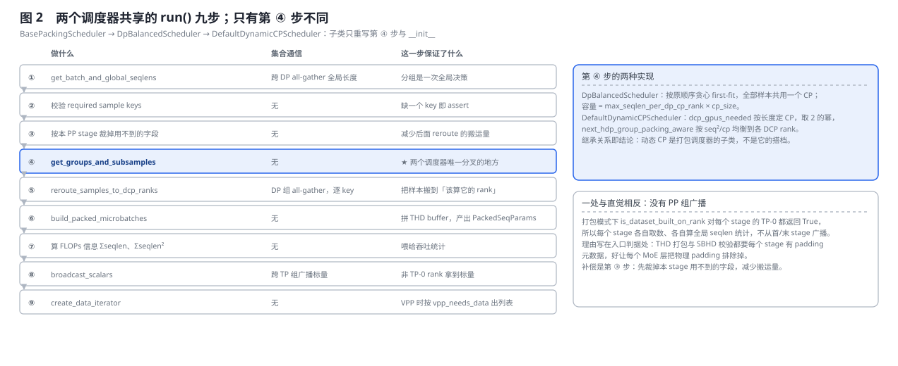
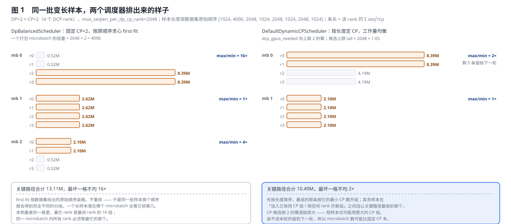
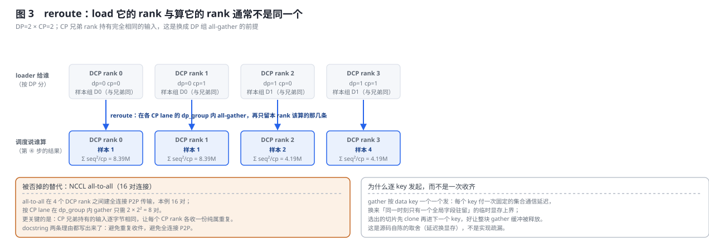
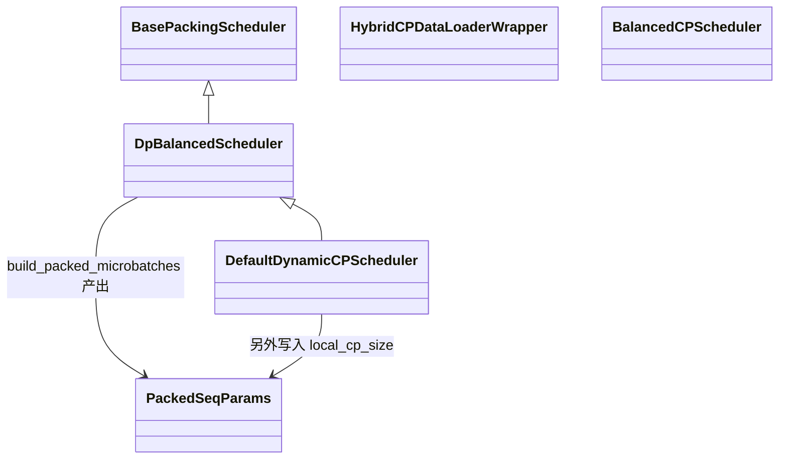

# Megatron-LM 序列打包与动态 CP 的统一流水线深度解析

> **源码基线**：`NVIDIA/Megatron-LM@85902ef599ea4eb06ada7567a479c524b605767a`（`dev`，2026-09-01）
> **核心源码**：`megatron/core/datasets/data_schedule.py`、`megatron/core/datasets/data_schedule_utils.py`、`megatron/core/packed_seq_params.py`、`megatron/core/utils.py`（`get_batch_on_this_tp_rank` / `get_thd_batch_on_this_cp_rank`）、`megatron/core/pipeline_parallel/hybrid_cp_schedule.py`
> **中心结论**：打包与动态 CP 在代码里不是两个协作的特性，而是**一条继承链**——`BasePackingScheduler → DpBalancedScheduler → DefaultDynamicCPScheduler`，子类只重写九步 `run()` 里的**第 ④ 步**。所以正确的心智模型是「序列打包是框架，动态 CP 是这个框架的 `is_dynamic_cp=True` 档」。这一步要解的问题是：样本变长、而每个 DP×CP rank 的算力等量；固定 CP 走按原顺序的贪心 first-fit，动态 CP 按 `seq²/cp` 把工作量摊到每个 rank 并让 CP 度随长度变化。本页的算例里，同一批 8 条样本在两条路上分别得到 16× 与 2× 的最坏 rank 不均。
> **适用范围**：本页拥有打包/动态 CP 的**统一调度流水线**——九步 `run()`、两种分组算法、reroute 的通信形态、`PackedSeqParams` 汇合点与 CP 切片，以及这条链的约束与失效条件。packed sample 的数据入口归 [[11_megatron_dataset_analysis]]，attention 侧对 CP 的消费归 [[13_megatron_cp_analysis]]，microbatch 进入 PP 之后的调度边界归 [[15_megatron_pp_schedulers_analysis]]。
> **最近更新**：2026-09-06。按「问题 → 一条流水线 → 两种分组 → 源码 → 上下游 → 边界」重写；新增两个调度器的同批复演原理图、九步流水线图与 reroute 通信图；把旧版按历史基线组织的 `[!update]` / `[!contradiction]` 改写为当前基线的正文，并补齐 `next_hdp_group_packing_aware` 的完整选择规则、`_DYNAMIC_CP_WORKLOAD_CAP_DELTA` 上限与整组 CP 兜底路径。

---

## 1. 特性概览

### 1.1 问题背景

SFT 与长上下文训练的样本是**变长**的，而每个 DP×CP rank 的算力是**等量**的。把变长样本按定长切片喂进去要么浪费（短样本 padding 到定长）、要么放不下（长样本超过单 rank 容量）；attention 的代价又随序列长度平方增长，所以「每 rank 拿到的 token 数相等」并不等于「每 rank 的工作量相等」。这条流水线要同时解决三件事：把多条短样本拼进一个 THD buffer 以消掉 padding、让超长样本跨多张卡按 CP 切开、并让每个 DCP rank 的工作量尽可能接近——因为同一个 microbatch 里所有 rank 都要等最忙的那一个。

### 1.2 解决方法

用**一条流水线加一个可换的分组步**。`DpBalancedScheduler.run()` 定义九步：取 microbatch 并跨 DP all-gather 全局序列长度、校验必需 key、按本 PP stage 裁字段、**分组**、reroute、拼 THD buffer、算 FLOPs 统计、跨 TP 广播标量、产出 data iterator。`DefaultDynamicCPScheduler` **继承整条 `run()`**，只重写第 ④ 步的 `get_groups_and_subsamples` 与 `__init__`。两种分组算法：固定 CP 度下按原顺序贪心 first-fit；动态 CP 下按长度降序、用 `dcp_gpus_needed` 给每条样本定一个 2 的幂的 CP 度，再用 `next_hdp_group_packing_aware` 按 `seq²/cp` 均衡到每个 DCP rank。

### 1.3 收益、开销和约束

| 维度 | 直接收益 | 必付成本或边界 |
|---|---|---|
| 显存与算力 | 打包消掉定长 padding；长样本按 CP 切开后才放得下 | 打包实长不得超过全局 padding 目标；zigzag 要求该目标被 $2\lvert\mathrm{CP}\rvert$ 整除 |
| 负载均衡 | 动态 CP 按 `seq²/cp` 摊平，本页算例最坏不均从 16× 降到 2× | 装不进本轮的样本留到下一轮，microbatch 数可能变化 |
| 调度 | 分组是一次**全局**决策，每个 rank 看到同一份长度分布 | 第 ① 步必须跨 DP all-gather 长度；不能只看本地 |
| 数据搬运 | reroute 在各 CP lane 的 `dp_group` 内 all-gather | 逐 key 发起：每个 key 一次固定集合延迟，换峰值显存只驻留一个字段 |
| 前提 | CP 兄弟 rank 持有逐字节相同的输入，因此不必各收一份 | 自定义 sampler 破坏这条前提，整条流水线就不再正确 |
| PP | 不做 PP 组广播，每个 stage 的 TP-0 各自取数 | 代价是每个 stage 都重跑一遍取数与全局 seqlen 统计 |
| 布局 | 动态 CP 支持非 2 的幂的 DP×CP | 扩不满时退化成整组 CP，均衡收益随之消失 |

---

## 2. 打包与动态 CP 详细方案

### 2.1 共用算例：8 条变长样本

全节固定同一个最小算例：DP=2、CP=2（共 4 个 DCP rank），`--max-seqlen-per-dp-cp-rank 2048`，一个 global batch 的 8 条样本按数据集给出的**原始顺序**长度为 `[1024, 4096, 2048, 1024, 2048, 1024, 2048, 1024]`。它足以暴露本特性的全部决定性动作：有一条超过单 rank 容量、必须跨卡（4096 > 2048），有多条可以拼进同一个 buffer，而且长样本排在第二位——这会让对顺序敏感的贪心装箱立刻露出问题。

### 2.2 一个继承链，不是两个特性

`megatron/core/datasets/data_schedule.py` 里的类层次只有三层：

```text
BasePackingScheduler                    抽象基类：get_groups_and_subsamples() + run()
`-- DpBalancedScheduler                 打包 + DP 均衡；is_dynamic_cp = False
    |                                   max_seq_len_all_ranks = max_seqlen_per_dp_cp_rank × cp_size
    `-- DefaultDynamicCPScheduler       is_dynamic_cp = True
                                        只重写 __init__ 与 get_groups_and_subsamples
```

`config.sequence_packing_scheduler` 通过 `scheduler_map`（`"dp_balanced"` / `"default_dynamic_cp"`）选中其一。关键事实是：**`DefaultDynamicCPScheduler` 是 `DpBalancedScheduler` 的子类，而 `DpBalancedScheduler` 是打包调度器**。「动态 CP」本身就是一个序列打包调度器，它把整条 `run()` 流水线原样继承，只改了「怎么给样本分组、每条样本分几张 CP 卡」。

> [!note] 分析重建
> 源码只用类继承与一张名字表表达这件事，**从未说明为什么选继承而不是组合**。「一个继承链，不是两个特性」是本页对这个代码形状的读法，不是源码自陈。要引用这条结论，请回到 `data_schedule.py::DefaultDynamicCPScheduler`（它只重写 `__init__` 与 `get_groups_and_subsamples`）与 `::scheduler_map` 自行核对。

> [!note] 对相邻两页的勘误
> [[11_megatron_dataset_analysis]] 曾把这层关系写成「packed dataset **配** `BalancedCPScheduler`」——不是「配」，动态 CP 调度器本身就是打包调度器的子类。旧版 [[15_megatron_pp_schedulers_analysis]]（2026-09-04 前）曾把 `megatron/core/pipeline_parallel/hybrid_cp_schedule.py::BalancedCPScheduler` 当作动态 CP 的主体——那只是同一套均衡逻辑的类形态兄弟（§4.3），集成入口在 `data_schedule.py::DefaultDynamicCPScheduler`。15 号页已回到 PP 边界。

### 2.3 共享的九步 `run()` 与唯一的分叉点



九步里有八步对两种调度器完全相同，唯一不同的是第 ④ 步 `get_groups_and_subsamples`。三处值得单独说明。

**第 ① 步为什么必须跨 DP all-gather。** `get_batch_and_global_seqlens` 的 docstring 自陈：「Each DP rank loads the same number of sequences, so we need to gather the sequence lengths from all ranks then we can schedule the sequences into groups.」实现是先 all-gather 各 rank 的子样本个数、按最大值 padding 后再 gather 长度。**分组是一次全局决策**——每个 rank 都必须看到整个 global batch 的长度分布，否则算不出均衡分桶。

**第 ③ 步为什么存在。** 它按本 PP stage 裁掉用不到的数据字段，注释自陈目的是「to avoid unnecessary rerouting communication」。它是下一条设计的补偿。

**被否掉的替代：PP 组广播。** `run` 的 docstring 明写「There is no PP-group broadcast. In packed-sequence mode `is_dataset_built_on_rank` returns True for every PP stage on TP rank 0」，函数体再解释一遍「every stage independently fetches data and computes the global seqlen stats」。理由写在入口判据处——`pretrain_gpt.py` 的 `is_dataset_built_on_rank` 对打包与 SBHD 校验路径直接返回 True，注释给出原因：「Packed THD and SBHD validation both need padding metadata on every pipeline stage so each MoE layer excludes physical padding」。判据因此不是「省一次广播」，而是**每个 stage 都需要 padding 元数据**；代价是每个 stage 的 TP-0 rank 都要各自跑一遍取数与全局 seqlen 统计，第 ③ 步的裁字段就是用来压住这份重复搬运的。

### 2.4 分叉 A：`DpBalancedScheduler` —— 固定 CP + 贪心 first-fit

所有样本用**同一个固定 `cp_size`**，一个打包 microbatch（横跨该 DP 组的所有 CP rank）的容量是 $\text{max\_seq\_len\_all\_ranks}=\text{max\_seqlen\_per\_dp\_cp\_rank}\times\text{cp\_size}$，本例为 $2048\times2=4096$。分组算法就是按原顺序装箱：

```python
for i in range(len(sample_id_seqlens)):
    if sum_seqlen + seqlen[i] <= self.max_seq_len_all_ranks and (
        self.max_num_seqs is None or len(single_microbatch) < self.max_num_seqs
    ):
        single_microbatch.append(i); sum_seqlen += seqlen[i]     # 还塞得下
    else:
        packed_id_groups.append(single_microbatch)               # 塞不下就封箱
        single_microbatch = [i]; sum_seqlen = seqlen[i]
```

装完之后再把箱子数补齐成 `dp_size × microbatch_group_size_per_vp_stage` 的整数倍——办法是从后面的箱子里往外拆单个样本另开一箱；拆不出来就 `assert i >= 0, "Not enough samples to move"`。最后按 `seq_id = i * dp_size + floor(j / cp_size)` 把箱子摊到 `cp_size × dp_size` 个 rank 上，同一 CP 组的 rank 拿到同一个箱子。

把 §2.1 的算例放进去：first-fit 依次得到 `[1024] / [4096] / [2048,1024] / [2048,1024] / [2048,1024]` 五箱，因为 5 不是 2 的倍数，从最后一箱拆出 `[1024]` 补成六箱，最终排成 3 个 microbatch。

### 2.5 分叉 B：`DefaultDynamicCPScheduler` —— 按长度定 CP + 工作量均衡



动态 CP 让**每条样本分到的 CP 卡数随它的长度变化**。两个公式源码给得很直白：

$$
\text{cp}(S)=\max\Bigl(\text{min\_cp},\ 2^{\lceil\log_2(S/\text{max\_seq\_len\_per\_rank})\rceil}\Bigr),
\qquad
w(S,\text{cp})=\frac{S^2}{\text{cp}} .
$$

`dcp_gpus_needed` 自陈是「Number of GPUs needed, rounded up to the next power of 2, lower-bounded by `min_cp_size`」。

> [!note] 分析重建
> 源码只写了 $S^2/\text{cp}$ 这个表达式，**没有解释它为什么是合理的工作量代理**。把它读成「attention 的 $O(S^2)$ 复杂度被 CP 摊分」是本页的解释，不是源码陈述。

`next_hdp_group_packing_aware` 的完整规则是：

1. 按长度**降序**排序，取最高的一条 $S_{\max}$，用它的**最小** CP 数开第一个组（这一条不参与后面的搜索）。同时算出本轮的工作量上限 $\text{cap}=S_{\max}\times\text{max\_seq\_len\_per\_rank}\times(1+0.05)$。
2. 其余每条样本，CP 候选从 `cp_min` 开始**按 2 的幂逐级放大**，直到 `total_gpus`。每一级考虑两种落位：加入一个 CP 度相同、且加进去之后打包长度不超过 `max_seq_len_per_rank` 的已有组；或者用足够多的空闲 rank 开一个新组（挑当前最闲的那几个）。两种落位都算出「加进去之后全域最忙 rank 的工作量」，取**不超过 cap 且最小**的那个。
3. 都放不下就进 `leftovers`，留给下一轮 `next_hdp_group`。
4. 收尾时若还有空 rank，先试 `fill_empty_gpus_once`——把某个最小 CP 组扩到下一个 2 的幂并把后面的工作整体后移；扩不满就 `fill_with_full_dpxcp_group`，用**整个 DP×CP 组**收一批样本，此时均衡收益消失。

docstring 自陈它与旧版 DCP 调度器的两点差异：「Short sequences may use a larger CP group than their minimum required CP size **when that lowers the critical-path rank workload**」，以及候选被 `tall × max_seq_len_per_rank` 上界约束。**被否掉的替代就是它自己的上一版**（legacy DCP scheduler），判据由 docstring 点名：压低关键路径 rank 的工作量。

**同一算例的复演。** 图 1 把两条路径逐 microbatch、逐 rank 算了出来：

| | `DpBalancedScheduler` | `DefaultDynamicCPScheduler` |
|---|---|---|
| `is_dynamic_cp` | `False` | `True` |
| CP 度 | 所有样本固定 `cp_size` | 每条样本按长度自适应 |
| 分组算法 | 按原顺序贪心 first-fit | 长度降序 + `seq²/cp` 均衡 |
| 容量基准 | `max_seqlen_per_dp_cp_rank × cp_size` | `max_seqlen_per_dp_cp_rank`（每 rank） |
| 本例 microbatch 数 | 3 | 2 |
| 本例最坏一格不均 | **16×** | **2×** |
| 本例关键路径合计 | 13.11M | 10.49M |

16× 那一格来自 first-fit 的**顺序敏感**：4096 这条排在第二位，于是它自己独占一箱，与它同 microbatch 的另一箱只有 1024——同一个 microbatch 里，rank 0/1 做 0.52M 的工作、rank 2/3 做 8.39M，前者只能干等。动态 CP 先按长度降序，长样本与次长样本被摊到不同的 rank 上，最坏一格降到 2×。

**这不是无代价的。** 动态 CP 的 leftovers 会让本轮少收几条样本，因此 microbatch 的构成与固定 CP 完全不同；上表的「关键路径合计」是把每个 microbatch 的最忙 rank 加起来——它才是 DP/PP 真正要等的量，而不是单看某一格。

**两条容易被这个算例带偏的结论，必须限定住。** 上表的两个指标在本例里同向变好，但它们并不总是同向：

- **它优化的是关键路径，不是每格的不均比。** docstring 给的判据就是 "lowers the critical-path rank workload"。换一批分布——`[8192, 1024, 1024, 2048, 1024, 2048, 1024, 1024]`、每 rank 容量 4096——关键路径从 34.08M 降到 33.82M（仍不更差），但最坏一格的不均比从 5.82× **升到** 8×。也就是说，"动态 CP 更均衡" 这句话只在关键路径这个口径上成立。
- **「最高那条按它的最小 CP 数开组」不是全局最优。** 这条规则写死在算法开头，最高的样本不参与后面的搜索。把 `--min-dynamic-context-parallel-size` 顶到整组（本例 4），最长的那条 4096 被摊到全部 4 个 rank，关键路径反而从 10.49M 降到 8.39M。默认的最小 CP 只保证「装得下」，不保证「最快」。

### 2.6 reroute：把样本搬到该算它的 rank



这一步是打包/动态 CP 流水线**必须有**的：数据集 loader 按 **DP** 把样本分给各 rank（谁 load 了哪条），而第 ④ 步的结果是「样本 X 应该由 DCP rank $d$ 计算」——load 它的 rank 和算它的 rank 通常不是同一个。

`reroute_samples_to_dcp_ranks` 的做法是：对 batch 里每个 key，在**各 CP lane 的 `dp_group` 内 all-gather**，再只保留分给本 DP×CP rank 的那些样本。`is_dynamic_cp` 在这里透传，因为动态 CP 下一个样本可能要发给多个 CP rank。

**被否掉的替代：NCCL all-to-all。** 这条路径的上一版实现就是 `torch.distributed.all_to_all_single`，docstring 当时写的是「For each key in the batch dict, we perform an all-to-all communication to transfer the data to the correct ranks.」换掉它的两条判据现在写在新 docstring 里：「Gathering within `dp_group` **avoids collecting the identical input held by every CP sibling** and **avoids the fully connected P2P transport created by NCCL all-to-all**.」前者是语义上的重复消除——CP 兄弟 rank 持有逐字节相同的输入，让每个 CP rank 各收一份纯属浪费；后者是拓扑代价——本例 4 个 DCP rank 的 all-to-all 要建 16 对全连接 P2P，而按 CP lane 在 `dp_group` 内 gather 只需 $2\times2^2=8$ 对。**语义没变，变的是用哪种集合通信实现。**

同一段 docstring 还交代第三条取舍——gather **按 key 逐个发起**：「This pays the fixed collective latency once per key, but bounds temporary memory to one global field at a time. Selected slices are cloned before advancing to the next key so the full gather buffer can be freed.」这是明确的「延迟换显存」，不是实现疏漏。

### 2.7 汇合点：`PackedSeqParams` 与 CP 切片

`build_packed_microbatches` 在本 rank 把分到的子样本拼成 **THD 打包 buffer**，产出 `PackedSeqParams`：`cu_seqlens` 标出每条子序列边界，`qkv_format='thd'`。动态 CP 的衔接点有三个：

- `PackedSeqParams` 带 **`local_cp_size` / `cp_group`**——每个打包 buffer 可以有自己的 CP 度，因为不同 microbatch 的样本长度不同、动态 CP 给的 `cp_size` 就不同。
- `get_cp_slice_for_thd`：一个打包 THD buffer 若 `cp_size > 1`，要再沿序列切给各 CP rank，且按 zigzag 均衡（因果掩码下前半段比后半段轻，见 [[13_megatron_cp_analysis]]）。
- `get_batch_on_this_rank_for_sequence_packing(..., dynamic_cp=True)` 取数时读 `batch['local_cp_size']`，据此决定本 buffer 的 CP 切分。

所以：**打包决定「buffer 里装哪几条序列」，动态 CP 决定「这个 buffer 用几张卡的 CP、怎么切」——二者在同一个 `PackedSeqParams` 对象上汇合。**

### 2.8 开销结算

| 步 | 通信 | 计算 / 显存 |
|---|---|---|
| ① 全局长度 | 跨 DP 两次 all-gather（子样本数、长度），payload 为 $O(\text{global batch})$ 个整数 | 每个 PP stage 的 TP-0 各做一遍（没有 PP 广播） |
| ④ 分组 | 无 | first-fit 为 $O(n)$；动态 CP 的每条样本要枚举 $\log_2(\text{DPxCP})$ 个 CP 级 × 已有组数 |
| ⑤ reroute | 每个 data key 一次 `dp_group` all-gather；连接数 $\lvert\mathrm{CP}\rvert\cdot\lvert\mathrm{DP}\rvert^2$ | 峰值临时显存被限制在一个全局字段 |
| ⑥ 打包 | 无 | 本 rank 拼 THD buffer，长度受 `max_seqlen_per_dp_cp_rank` 约束 |
| ⑧ 广播标量 | 跨 TP 组一次标量广播 | —— |

**这条链在什么条件下失效。** 三处：DP×CP 不是 2 的幂且 2 的幂扩张填不满所有 rank 时，动态 CP 退化成整组 CP，均衡收益消失；`DpBalancedScheduler` 补齐箱数时若没有可拆的样本，直接 assert 失败；VPP 对齐时若尾部没有可拆的 microbatch，`align_sample_id_groups` 同样直接 assert。三条都是**硬失败**而非降级。

---

## 3. 代码实现分析

### 3.1 类与所有权



| 层次 | 责任 | 不负责什么 |
|---|---|---|
| `wrap_data_iterator` | 从 config 取 CP/DP 尺寸、按名字实例化调度器、调 `run()` | 不实现任何分组或通信 |
| `BasePackingScheduler` | 定义 `get_groups_and_subsamples` 与 `run` 两个契约 | 不给默认分组实现 |
| `DpBalancedScheduler` | 拥有整条九步 `run()`、必需 key 清单、first-fit 分组 | 不决定 CP 度是否随样本变化 |
| `DefaultDynamicCPScheduler` | 只重写第 ④ 步与 `__init__`（多一个 `min_cp_size`） | 其余八步一行都不改 |
| `data_schedule_utils` 的函数族 | 全局长度收集、reroute、打包、CP 切片、均衡分桶 | 不知道自己被哪个调度器调用 |
| `PackedSeqParams` | 承载 `cu_seqlens`、`qkv_format`、可选 `local_cp_size` / `cp_group` | 不做切片，只描述布局 |
| `get_batch_on_this_*`（`megatron/core/utils.py`） | 下游取数：跨 TP 广播变长元数据、按 CP 切 THD | 不参与调度决策 |

### 3.2 调用流程

```text
train_step / forward_backward_func 之前
|
`-- wrap_data_iterator(data_iterator, config, num_microbatches, pg_collection)
    |                                              megatron/core/datasets/data_schedule.py
    +-- scheduler_map[config.sequence_packing_scheduler](...)
    |   +-- "dp_balanced"        -> DpBalancedScheduler
    |   `-- "default_dynamic_cp" -> DefaultDynamicCPScheduler(min_cp_size=...)
    |
    `-- scheduler.run(data_iterator, num_microbatches, dp_group, tp_group, pp_group, dp_cp_group, dev, config)
        +-- assert tp_group.rank() == 0                        <- 只有 TP-0 参与调度
        +-- ① get_batch_and_global_seqlens                     data_schedule_utils.py
        |   `-- _unpack_batch -> _get_global_seqlens_and_ids -> all_gather(dp_group)
        +-- ② 校验 required sample keys
        +-- ③ 按本 PP stage 裁 keys_to_keep
        +-- ④ get_groups_and_subsamples                        ★ 唯一分叉
        |   +-- [DpBalanced] 贪心 first-fit + 补齐箱数 + 摊到 cp*dp 个 rank
        |   `-- [DynamicCP] while pending: next_hdp_group_packing_aware
        |       +-- dcp_gpus_needed（2 的幂）
        |       +-- 逐级放大 CP，选让全域最忙 rank 最小的落位
        |       +-- fill_empty_gpus_once（扩到下一个 2 的幂）
        |       +-- fill_with_full_dpxcp_group（兜底，均衡收益消失）
        |       `-- align_sample_id_groups（VPP 对齐）
        +-- ⑤ reroute_samples_to_dcp_ranks                     <- 各 CP lane 在 dp_group 内 all-gather，逐 key
        +-- ⑥ build_packed_microbatches -> PackedSeqParams
        +-- ⑦ Σseqlen / Σseqlen²
        +-- ⑧ broadcast_scalars(tp_group)
        `-- ⑨ create_data_iterator（VPP 时按 vpp_needs_data 产出列表）
|
`-- 下游取数                                                   megatron/core/utils.py
    +-- get_batch_on_this_tp_rank        <- 长度前缀协议广播变长 cu_seqlens；
    |                                       动态 CP 下另广播 local_cp_size / hybrid_cp_seq_length
    `-- get_thd_batch_on_this_cp_rank    <- 对应第 ⑥ 步在本 rank 的 THD zigzag 切片
```

### 3.3 源码阅读路线

1. 入口与选择：`megatron/core/datasets/data_schedule.py::wrap_data_iterator`、`::scheduler_map`、`::_get_scheduler_max_real_num_seqs`。
2. 流水线：`::BasePackingScheduler.run`（抽象签名）、`::DpBalancedScheduler.run`（九步 docstring 与实现）、`::DpBalancedScheduler.get_required_sample_keys`。
3. 分组：`::DpBalancedScheduler.get_groups_and_subsamples`（first-fit）、`::DefaultDynamicCPScheduler.get_groups_and_subsamples`（外层 while 循环）；`megatron/core/datasets/data_schedule_utils.py::next_hdp_group_packing_aware`、`::dcp_gpus_needed`、`::align_sample_id_groups`；常量 `_DYNAMIC_CP_WORKLOAD_CAP_DELTA`。
4. 通信与打包：`data_schedule_utils.py::get_batch_and_global_seqlens`、`::_get_global_seqlens_and_ids`、`::reroute_samples_to_dcp_ranks`（含 `_REROUTE_KEY_ORDER` 白名单）、`::build_packed_microbatches`、`::_pack_sequences`、`::broadcast_scalars`、`::create_data_iterator`。
5. CP 切片与汇合：`data_schedule_utils.py::get_cp_slice_for_thd`；`megatron/core/packed_seq_params.py`；`data_schedule.py::get_batch_on_this_rank_for_sequence_packing`、`::_build_thd_padding_mask`、`::_sanitize_thd_padding_values`。
6. 下游取数：`megatron/core/utils.py::get_batch_on_this_tp_rank`、`::get_thd_batch_on_this_cp_rank`。
7. 入口判据：`pretrain_gpt.py::is_dataset_built_on_rank`、`pretrain_hybrid.py::is_dataset_built_on_rank`、`megatron/elastification/pretrain_hybrid_flex.py::is_dataset_built_on_rank`（三者不一致，见 §5.3）。
8. 兄弟实现：`megatron/core/pipeline_parallel/hybrid_cp_schedule.py::BalancedCPScheduler` 与其中的 `next_hdp_group`。

---

## 4. 配套机制

### 4.1 上游：两种 varlen 数据源

第 ① 步的 `_unpack_batch` 支持两种输入形态，走同一条 ②→⑨：

- **预打包形态**：`SFTDataset` 那种「一条样本里 `cu_seqlens` 拼了多条子序列、需要切开」的批。
- **已拆开形态**：`VarlenDataset`（`--use-varlen-dataset`）那种「每个 index 已经是单条子样本、自带 `padded_seq_len`」的批。这一路只需丢掉 collate_fn 多加的 batch 维、缺 `original_seq_len` 时从 `padded_seq_len` 补。

两种数据源的细节归 [[11_megatron_dataset_analysis]]。

### 4.2 下游：`get_batch` 的统一取数

取数函数收敛在 `megatron/core/utils.py`：`get_batch_on_this_tp_rank` 用**长度前缀协议**广播变长的 `cu_seqlens`，并在动态 CP 下额外广播 `local_cp_size` / `hybrid_cp_seq_length`；`get_thd_batch_on_this_cp_rank` 对应第 ⑥ 步在本 rank 的 THD 切片。SFT 的 THD 打包因此可以与 PP 共用——这件事原先由 PP 组广播承担，现在改由「每个 PP stage 的 TP-0 rank 各自建数据集」实现（§2.3）。

吞吐统计侧还有两条配套：`train_step` 保留 seqlen 统计，且 `sequence_packing_scheduler` 非空时的 TFLOPs 计算按第 ⑦ 步的 $\Sigma\text{seqlen}$ / $\Sigma\text{seqlen}^2$ 修正（观测口径归 [[28_megatron_training_stability_observability_analysis]]）。

### 4.3 兄弟实现与不活的入口

两处同源但不在主路径上的代码值得单独点名，免得读源码时误认：

- **`megatron/core/pipeline_parallel/hybrid_cp_schedule.py::BalancedCPScheduler`** 是同一套均衡逻辑的**类形态兄弟**；而 `DefaultDynamicCPScheduler` 用的是 `data_schedule_utils.py` 里的**函数形态**。两者当前已经不再等价：函数形态已换成 packing-aware 版本，类形态仍停在旧的 `next_hdp_group`。**真正把打包与动态 CP 缝在一起的集成点是 `DefaultDynamicCPScheduler`。**
- **`data_schedule.py::HybridCPDataLoaderWrapper`**（带自己的 `reroute_samples_to_hdp_ranks`）在基线下**全仓零外部引用**——它不在 `scheduler_map` 里，也没有任何调用点。读代码时容易把它当成第三条数据面，实际不是。

### 4.4 仅是相邻、不由本页展开的机制

| 机制 | 与本页的接口 | owner |
|---|---|---|
| packed sample 的数据入口与 `VarlenDataset` | 提供第 ① 步消费的批 | [[11_megatron_dataset_analysis]] |
| attention 侧对 CP group 的消费与 zigzag 语义 | `get_cp_slice_for_thd` 之后的事 | [[13_megatron_cp_analysis]] |
| microbatch 进入 PP 之后的调度 | 第 ⑨ 步产出的 iterator 由它消费 | [[15_megatron_pp_schedulers_analysis]] |
| MoE 层排除物理 padding | 第 ③ 步保留 padding 元数据的原因 | [[14_megatron_ep_analysis]] |
| DSv4 如何消费动态 CP group 并恢复原 group | 下游的一个具体消费者 | [[35_deepseek_v4_context_parallel_analysis]] |

---

## 5. 约束、适用场景与趋势

### 5.1 硬约束与失败边界

| 前提 / 不变量 | 源码落点 | 破坏后的行为 |
|---|---|---|
| 只有 TP-0 参与调度 | `data_schedule.py::DpBalancedScheduler.run` 开头的断言；取数侧对称断言非 TP-0 不得持有 iterator | `assert` 失败 |
| 必需 sample key 一个都不能少 | 同文件 `::get_required_sample_keys`（六个 key）与 `run` 内的校验 | `assert` 失败 |
| `dp_group` 内所有 rank 提供同一组 data key | `reroute_samples_to_dcp_ranks` docstring | 未知 key 直接 assert，并提示必须同时扩 `_REROUTE_KEY_ORDER` 与元素布局分类 |
| **CP 兄弟必须提供逐字节相同的样本内容** | 同上 docstring：「CP siblings that share a non-CP DP rank must additionally provide byte-identical sample contents」 | 自定义 sampler 破坏这条，整条流水线不再正确（且**不会报错**） |
| 各样本的 key 集合必须完全一致 | 同函数内的校验 | `assert` 失败 |
| 补齐箱数时必须有可拆的样本 | `get_groups_and_subsamples` 的 `assert i >= 0, "Not enough samples to move"` | `assert` 失败 |
| VPP 对齐时尾部必须有可拆 microbatch | `align_sample_id_groups` 的 `assert False, 'no tail microbatch has enough ids to split'` | `assert` 失败 |
| DP×CP 不是 2 的幂时会退化 | `next_hdp_group_packing_aware` docstring：「it falls back to the full DPxCP group if power-of-two expansion cannot fill every rank」 | 退化为整组 CP，均衡收益消失（不报错） |
| 至少一条样本要能装进整组 CP | `fill_with_full_dpxcp_group` 的断言，提示「try to increase 'max-seqlen-per-dp-cp-rank'」 | `assert` 失败 |
| `thd_max_packed_sequences ≥ 1`，追加 dummy 序列时 `≥ 2` | `data_schedule.py` 的两处断言 | `assert` 失败——该上限把 dummy 序列也算在内 |
| 打包实长不得超过全局 padding 目标；zigzag 要求它被 $2\lvert\mathrm{CP}\rvert$ 整除 | `megatron/core/packed_seq_params.py` 的两处断言 | `assert` 失败 |
| CP 切片前每个被切张量是 1-D 且与 `padding_mask` 等长 | `data_schedule.py::get_cp_slice_for_thd` 的调用侧校验 | `assert` 失败 |
| `cu_seqlens` / `cu_seqlens_padded` 是等长 1-D `int32` | 同文件的形状校验 | `assert` 失败 |
| 分组步不切分单条样本 | 两个调度器都以整条样本为最小单位 | 要再切只能交给 CP（§2.7） |
| 逐 key gather 是刻意的 | `reroute_samples_to_dcp_ranks` docstring：「The gather is **intentionally** issued one data key at a time」 | 延迟换显存，不是疏漏 |
| VPP 中间 stage 不给全量数据 | `vpp_needs_data` 只对首 PP 的第一个 VPP、末 PP 的最后一个 VPP 与 MTP stage 置 True | 中间 stage 只拿元数据 |

### 5.2 何时用哪个调度器

| 场景 | 建议 | 原因 |
|---|---|---|
| 定长或长度分布很窄的语料 | 不开打包，或用 `dp_balanced` | 长度接近时 first-fit 就够均衡，动态 CP 的搜索是白付 |
| SFT，长度分布宽但最长样本仍放得下单 rank | `dp_balanced` | 打包消掉 padding 已是主要收益；固定 CP 更简单 |
| 有样本超过 `max_seqlen_per_dp_cp_rank` | 必须 `default_dynamic_cp` | 固定 CP 下那条样本根本装不进任何箱 |
| 长度分布长尾、rank 等待明显 | `default_dynamic_cp` | §2.5 的算例即这种情形，最坏一格从 16× 降到 2× |
| DP×CP 不是 2 的幂 | 谨慎评估 | 扩不满时退化成整组 CP，均衡收益消失 |
| 想调最小 CP 度 | `--min-dynamic-context-parallel-size` | 它是 `dcp_gpus_needed` 的下界，可避免过小的 CP 组 |
| 排查负载不均 | 先看第 ⑦ 步的 $\Sigma\text{seqlen}^2$ 与逐 rank 耗时 | 工作量代理是 $S^2/\text{cp}$，token 数相等不代表工作量相等 |

### 5.3 当前演进方向

> [!note] 推断：以下判断基于冻结基线中的 docstring 自陈差异与代码形状，不是源码给出的时间表。基线下对 `data_schedule.py`、`data_schedule_utils.py`、`packed_seq_params.py` 三个文件做 `git grep -n -E "TODO|FIXME|deprecat|WIP"` 为零命中，所以本节不锚 TODO。

**一、分桶算法刚换过一代，两套实现正在分叉。** `data_schedule_utils.py` 侧已是 packing-aware 版，docstring 里两次以 "the legacy DCP scheduler" / "the legacy invariant" 指称旧版；而 `hybrid_cp_schedule.py` 仍停在 `next_hdp_group`，没有跟进那两条改进。**由此可推断**：两套并行实现已经不再算法一致；后续要么类形态跟进，要么它被函数形态取代。读源码时以 `DefaultDynamicCPScheduler` 实际调用的那条为准。

**二、reroute 的通信形态仍在调整期。** 它在半年内被改了两次——先删掉 PP 组广播，再把 all-to-all 换成 DP 组 all-gather，新版 docstring 还专门解释「为什么逐 key 发起」。**由此可推断**：这一步的通信形态不宜当成稳定接口引用；引用 §2.6 时请连同基线一起标注。

**三、打包路径的入口判据尚未在所有 pretrain 脚本上统一。** `pretrain_gpt.py` 与 `pretrain_hybrid.py` 的 `is_dataset_built_on_rank` 都带 `is_packed_sequence` 形参并对打包路径返回 True；而 `megatron/elastification/pretrain_hybrid_flex.py` 的同名函数**没有这个形参**，仍是「首/末 PP stage 且 TP-0」的旧判据。**由此可推断**：elastification 路径还没接上「每个 PP stage 自建数据集」的新形态。源码没有说明这是有意为之还是待补——引用前请回到这三处自行核对。

**四、类形态的 `HybridCPDataLoaderWrapper` 目前是死代码。** 它带一整套 `reroute_samples_to_hdp_ranks` / `unpack_batch` / `get_global_seqlens`，却没有任何调用点。**由此可推断**：它要么是尚未接线的下一代入口，要么是上一代残留；无论哪种，当前都不能据它推断运行时行为。

---

## Related Pages

- [[11_megatron_dataset_analysis]] — 本页调度器接收的 packed samples 与 metadata 从该数据入口产生；`VarlenDataset` 与 `PackedSeqParams` 的字段定义在那里。
- [[13_megatron_cp_analysis]] — 动态 CP 选出的 local group 在 attention 侧由该页解释，含 zigzag 切分的原因。
- [[15_megatron_pp_schedulers_analysis]] — 第 ⑨ 步产出的 iterator 进入 PP microbatch 调度后的责任边界。
- [[14_megatron_ep_analysis]] — MoE 层排除物理 padding，是第 ③ 步保留 padding 元数据的原因。
- [[28_megatron_training_stability_observability_analysis]] — 第 ⑦ 步的 seqlen 统计进入吞吐与 TFLOPs 指标。
- [[35_deepseek_v4_context_parallel_analysis]] — 查看 DSv4 如何消费 Dynamic CP group 并恢复原 group。
- [[02_engineering/02_train_frameworks/megatron-lm/index|Megatron-LM 知识地图]] — 返回本域索引。

三张 SVG 均由 `tools/figs/svg/megatron_packing_figures.mjs` 从同一组算例参数与复刻的两套分组算法生成，其数值与尺寸契约由 `tools/figs/svg/lib/megatron_packing_figures.test.mjs` 锁定。
