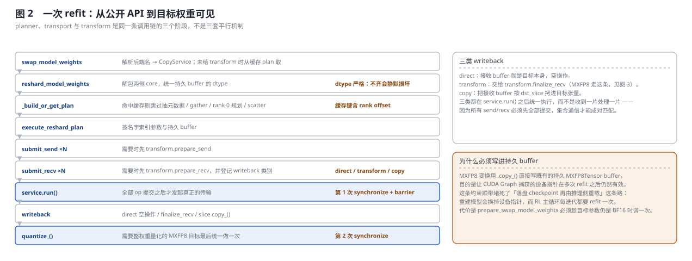
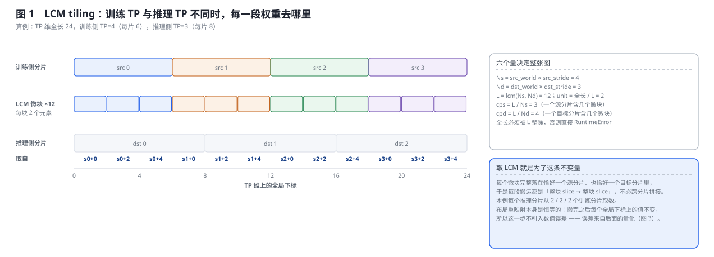
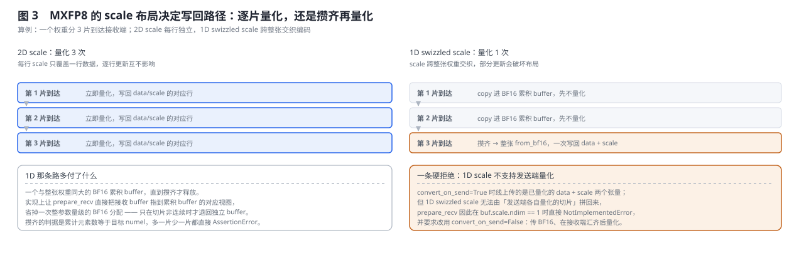
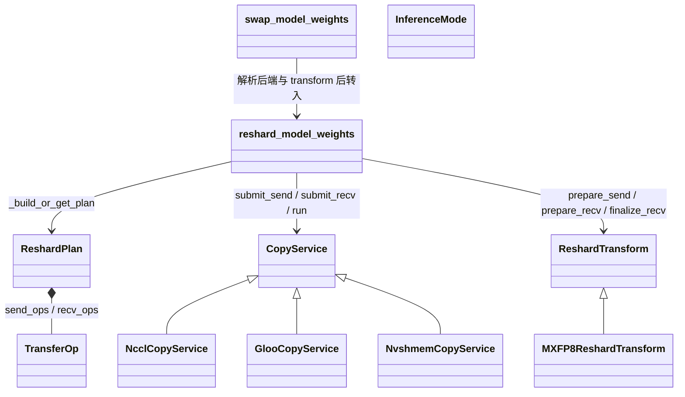

# Megatron-LM RL 后训练适配与训推一致性深度解析

> **源码基线**：`NVIDIA/Megatron-LM@85902ef599ea4eb06ada7567a479c524b605767a`（`dev`，2026-09-01）
> **核心源码**：`megatron/core/resharding/`（`refit.py`、`planner.py`、`execution.py`、`transforms.py`、`copy_services/`、`README.md`）；`megatron/core/transformer/transformer_config.py`（`transformer_impl='inference_optimized'`）；`megatron/core/inference/utils.py`（`InferenceMode`）；`megatron/core/inference/`（引擎与量化）；`megatron/rl/`；`megatron/core/post_training/modelopt/`
> **中心结论**：RL 后训练的头号系统难题是**训推一致性**——同一个 (prompt, token)，rollout 引擎与训练引擎算出的 logprob 不相等，于是 PPO/GRPO 的 importance ratio $r=\pi_{\text{train}}/\mu_{\text{rollout}}$ 在策略没变时也偏离 1。Megatron 的做法不是消灭全部差异（做不到），而是**把差异逐项收敛到可控、可量化，残差交给上层 RL 框架的 importance sampling**。收敛链有五环：每迭代 refit 消除权重陈旧、LCM tiling 让布局重映射恒等、MXFP8 变换遵守 scale 与持久 buffer 契约、`inference_optimized` 把推理路径做成显式独立可审计的实现、训练相重算 logprob 让策略梯度自洽。剩下的 gap 被 Megatron 自己算成一组 $\pi/\mu$ 比值指标上报——**做小但不为零的差异，只有在可观测时才是工程上可接受的**。
> **适用范围**：本页拥有 Megatron 训练侧的 **refit / resharding 机制**（plan 构建、执行链、传输后端、MXFP8 变换）、`inference_optimized` 的边界、`InferenceMode` 分流点、训推一致性各环的收敛与残差指标，以及 RL 部署形态。落盘 checkpoint 的存取与恢复归 [[19_megatron_dist_checkpointing_analysis]]；推理引擎本体与 CUDA Graph 归 [[31_megatron_inference_engine_analysis]]；EP/expert-TP 布局归 [[14_megatron_ep_analysis]]；进程组构造归 [[17_megatron_parallelism_orchestration_analysis]]。**完整的 RL 训练环（GRPO/PPO 的 advantage、loss、KL）不在 `megatron/core` 里**——三平面机制视角见 [[01_posttraining_infra_mechanism_analysis]] §6，verl 的权重发布对照见 [[21_verl_weight_publication_analysis]]。
> **最近更新**：2026-09-06。按「问题 → 五环收敛 → 源码 → 部署 → 边界」重写；新增 LCM tiling 原理图、refit 执行链图与 MXFP8 scale 写回图；把旧版按历史基线组织的 `[!update]` / `[!deprecated]` 改写为当前基线的正文，并补齐 `_emit_lcm_block_ops` 的完整推导与整除守卫、1D scale 的累积 buffer 与 `NotImplementedError` 边界。

---

## 1. 特性概览

### 1.1 问题背景

一个 RL 后训练迭代（以 GRPO/PPO 为例）分两相：**rollout** 相由推理引擎用当前 policy 生成一批 (prompt → response) 并顺带产出每个 token 在 rollout 策略 $\mu$ 下的 logprob；**train** 相由训练引擎对这批样本算训练策略 $\pi$ 下的 logprob、advantage 与 importance ratio，做 policy 梯度更新；然后把更新后的权重搬回推理模型，进入下一迭代。

两相用的是**两套引擎**——rollout 要快（KV cache、连续批处理、低精度），训练要能反向（标准 kernel、BF16、可微）。于是出现头号难题：同一个 (prompt, token)，两边算出的 logprob 不相等。这个不一致直接污染 $r=\pi_{\text{train}}(a\mid s)/\mu_{\text{rollout}}(a\mid s)$——策略没变时 $r$ 本应恒为 1，引擎差异让它偏离 1，逐 token、逐步累积后梯度有偏，RL 训练发散或塌缩。不一致有五个来源：

| 来源 | 说明 | 被哪一环收敛 |
|---|---|---|
| 权重陈旧 | 推理模型的权重落后于训练模型 | §2.2 refit |
| 并行布局不同 | 训练 TP8×PP4，推理 TP2×PP1，参数切分方式完全不同 | §2.3 LCM tiling |
| 精度不同 | 推理 MXFP8，训练 BF16 | §2.4（**只能做小，不能归零**） |
| kernel 不同 | `inference_optimized` 的融合与 KV-cache attention vs 训练 kernel | §2.5（做成可审计的单一路径） |
| 批处理数值路径 | 连续批处理改变了 softmax / matmul 的规约顺序 | §2.6（策略梯度改用训练路径重算） |

### 1.2 解决方法

先划清边界：**完整的 RL 训练环不在 `megatron/core` 里**——那是 NeMo-RL 等上层框架的事。Megatron Core 提供的是底层积木：标准训练模型跑 policy 梯度、`inference/` 的引擎跑 rollout、`transformer_impl='inference_optimized'` 提供推理专用前向、`inference/quantization/` 做 MXFP8、以及本页的主角 `resharding/`——每个 RL 迭代把训练模型权重搬进推理模型。

围绕这些积木，一致性做法是**逐项收敛**：refit 每迭代跑一次，把权重陈旧这一条直接消掉；plan 用 LCM tiling 保证目标分片拿到的就是训练权重对应位置的精确切片，布局这一步是恒等变换；MXFP8 变换按 scale 布局分两条写回路径并直接写进持久 buffer；推理路径被收敛成一个显式命名的实现，"现在是不是在推理" 由一个进程级全局标志决定；策略梯度用的 logprob 一律在训练相重算。剩下的差交给上层的 importance sampling，而 Megatron 自己把这个比值算出来上报。

### 1.3 收益、开销和约束

| 维度 | 直接收益 | 必付成本或边界 |
|---|---|---|
| 权重新鲜度 | rollout 用的永远是刚更新过的 policy | refit 是一次集合通信，**连不参与的 rank 都必须进来** |
| 布局 | LCM tiling 让重映射恒等，不引入数值误差 | 全长必须被 LCM 整除，否则直接 `RuntimeError` |
| 格式 | MXFP8 写回遵守 scale 与持久 buffer 契约 | BF16→MXFP8 本身有损；1D swizzled scale 还要一份全量 BF16 累积 buffer |
| CUDA Graph | 就地写持久 buffer，设备指针跨 refit 保持有效 | `prepare_swap_model_weights` 必须趁目标参数仍是 BF16 时调一次 |
| 可审计 | 推理路径显式命名、由单一全局标志分流 | `inference_optimized` 的 MoE 路径有六条构造期硬拒绝 |
| 可观测 | $\pi/\mu$ 比值与绝对概率差被算成一组 group 统计量 | 这只是量表，修正仍在上层框架 |
| 缓存 | plan 与 service 缓存后反复 refit 不重建 | 必须在销毁进程组之前 `clear_all_caches()` |

---

## 2. 训推一致性详细方案

### 2.1 共用算例：一次 RL 迭代要闭合什么

全节固定同一个最小算例：一个训练侧 TP=4 的权重要搬进推理侧 TP=3 的同名参数，该参数在 TP 维上的全局长度为 24。它足以暴露本特性的决定性动作，因为它同时踩中三条边界——两侧 TP 互不整除（所以不能按 rank 一一对应搬）、搬完之后推理引擎要立刻用它做 rollout（所以不能重建模型）、而目标可能是 MXFP8（所以搬运不只是拷贝）。

### 2.2 收敛①：refit 消除权重陈旧



`resharding/` 的 README 开篇即定位：「Transfer model weights between different parallelism configurations (TP, PP, EP, DP) with optional format conversion (e.g. BF16 to MXFP8). **Used primarily in RL loops** to move weights from a training model to an inference model that may use a **different parallelism layout**」。公开用法只有两个函数：

```python
from megatron.core.resharding import prepare_swap_model_weights, swap_model_weights
prepare_swap_model_weights(src_model=train_model, target_model=infer_model)  # 初始化时一次
# RL 循环里反复：
swap_model_weights(train_model, infer_model, refit_method="nccl")
```

一次 refit 不是「生成计划后权重自然就到了」。完整的执行跳是：`swap_model_weights` 先把后端名解析成 `CopyService`（也接受已构造的实例，判定用 `isinstance`），未显式传 transform 时从缓存 plan 取；`reshard_model_weights` 解包两侧 core、取/建 plan、统一持久 buffer 的 dtype，再进 `execute_reshard_plan`；执行器把模型参数与持久 buffer 建成名字索引，遍历 `plan.send_ops` 与 `plan.recv_ops` 逐个 `submit_send` / `submit_recv`，并把后续动作登记为 **direct / transform / copy** 三类 writeback；**全部 op 提交之后**才调 `service.run()`，随后 CUDA synchronize 与 group barrier；通信完成后依次执行 writeback，需要整权重量化的 MXFP8 目标最后统一 `quantize_()`，再做第二次 synchronize 才返回。

三类 writeback 之所以要等到 `service.run()` 之后统一执行，是因为所有 send/recv 必须先全部提交，集合通信才能成对匹配——收到一片处理一片会让不同 rank 的提交顺序错开。

**被否掉的替代：落盘 checkpoint 再由推理侧加载。** 把这条路堵死的是一条硬约束：MXFP8 变换必须**直接写进持久 buffer**——README 原话「The transform writes directly into persistent MXFP8Tensor buffers (via `.copy_()`) **so that CUDA-graph device-pointer captures remain valid across refits**」，对应的调用契约是「Call `prepare_swap_model_weights` **once during initialization while the target model's parameters are still in BF16**」。

> [!note] 分析重建
> 源码陈述的是**事实**：持久 buffer 与 CUDA Graph 指针的这条约束。把它读成「因此排除了重载推理模型」是本页的判据重建——任何重建/重载推理模型的方案都会换掉设备指针，让 [[31_megatron_inference_engine_analysis]] 里为 decode 捕获的 CUDA Graph 全部失效，而 RL 主循环每迭代都要做一次 refit。要引用这条判断，请回到 `megatron/core/resharding/README.md` 的上述两段自行核对。

**plan 在 rank 0 集中构建一次并缓存。** README 把流程写成五步：各 rank 抽元数据 → `dist.gather_object()` 汇到 rank 0 → rank 0 **按名字**为每个目标参数找到匹配的源参数并路由到维度特定的 planner → 产出带全局唯一 `task_id` 的 `TransferOp` 对并 scatter 回去 →「The plan is **cached** so repeated refits **skip steps 1-4**」。集中式 plan 这条路本身没被推翻，被推翻的是**缓存键选窄了**：`_PlanCacheKey` 原先只用 `(rank, src_config, dst_config, num_experts)`，注释现在写明为什么要补 rank offset——「Rank offsets **distinguish non-collocated configurations that would otherwise share the same (rank, sizes, num_experts) tuple** but route to different global ranks」。两套非 collocated 配置本会静默命中同一份 plan。

### 2.3 收敛②：LCM tiling 让布局重映射恒等



训练和推理的并行度通常不同（训练求吞吐、推理求延迟），所以搬运不能按 rank 一一对应。`_plan_tp` 的做法是 **LCM tiling**：把 TP 维切成 $L=\operatorname{lcm}(N_s,N_d)$ 个等长微块，其中

$$
N_s=\text{src\_world}\times\text{src\_stride},\qquad
N_d=\text{dst\_world}\times\text{dst\_stride},\qquad
\text{unit}=\frac{\text{full\_len}}{L} .
$$

把 §2.1 的算例代进去：$N_s=4$、$N_d=3$、$L=12$、`unit`$=2$；一个源分片含 $\text{cps}=L/N_s=3$ 个微块（共 6 个元素），一个目标分片含 $\text{cpd}=L/N_d=4$ 个微块（共 8 个元素）。图 1 逐块标出了每个目标分片从哪个源 rank 的哪个本地偏移取数——本例每个推理分片各自从 2 个训练分片取数。

取 LCM 就是为了这条不变量：**每个微块完整落在恰好一个源分片、也恰好一个目标分片里**，于是每段搬运都是「整块 slice → 整块 slice」，不必跨分片拼接。全长必须被 $L$ 整除，否则 `_emit_lcm_block_ops` 直接 `RuntimeError`，不做静默 padding。

Mamba `in_proj` 这类**分区参数**（一个张量里并排放着几段语义不同的子权重）走同一段代码的多块版本：`_tp_block_layout` 先按 `partition_sizes` 把张量切成若干块并逐块校验 `src_sizes[i]*src_world == dst_sizes[i]*dst_world`，然后对每一块跑同一套 LCM 微块math。也就是说 block-interleaved 不是另一套算法，plain TP 是它的单块特例。

**这一步不引入数值误差。** 搬完之后每个全局下标上的值不变——布局重映射是恒等的。误差来自下一环的量化。

### 2.4 收敛③：MXFP8 的两条写回路径与那条硬拒绝



推理模型常用 MXFP8（`fp8_recipe='mxfp8'` 配 `inference_optimized`）。把 BF16 训练权重转成 MXFP8 时，难点全在 **scale 布局**，而它决定了两条完全不同的写回路径：

- **2D scale**：每行 scale 只覆盖一行数据，逐行更新互不影响 → 收到一片就立刻 `MXFP8Tensor.from_bf16` 量化，写回 `data[dst_slice]` 与对应的 scale 切片。本例 3 片到达即量化 3 次。
- **1D swizzled scale**（FlashInfer 布局）：scale 跨整张权重交织编码，**部分更新会破坏布局** → 必须把所有 BF16 切片累积进一个与权重同大的 BF16 buffer，攒齐之后整张量化一次。本例 3 片到达但只量化 1 次。

1D 那条路的实现细节值得记一笔：`prepare_recv` 直接把接收 buffer 指到累积 buffer 的对应视图，省掉一次整参数量级的 BF16 分配——只在该切片非连续时才退回独立 buffer。攒齐的判据是累计元素数等于目标 `numel`，多一片少一片都直接 `AssertionError`（源码提示「duplicate or missing slices?」）。

**一条硬拒绝。** `convert_on_send=True` 时线上传的是已量化的 `data + scale` 两个张量；但 1D swizzled scale 无法由「发送端各自量化的切片」拼回来，`prepare_recv` 因此在 `buf.scale.ndim == 1` 时直接 `NotImplementedError`，并要求改用 `convert_on_send=False`。这是**边界**，不是性能建议。

**要精确说清这一环保证了什么。** 它保证切片按正确的 scale 布局汇合、写进既有的持久 buffer；目标表示由 `MXFP8Tensor.from_bf16(...)` 产生，所以**仍存在预期的 BF16→MXFP8 量化误差**。保证的是布局与写回契约正确，不是格式转换数值无损——剩余差异正是后面要测量、要修正的精度 gap。

### 2.5 收敛④：`inference_optimized` —— 显式、独立、受控的推理路径

`transformer_impl` 三选：`local` / `transformer_engine` / **`inference_optimized`**。第三条是 RL rollout 用的专用路径，它带一组推理专用组件：`use_inference_optimized_layers`（推理优化的线性层，如推理专用 all-gather）、`inference_grouped_gemm_backend`（`flashinfer` / `torch` / `vllm`）、`inference_moe_token_dispatcher_type`（`nccl` / `nvls`）。

**被否掉的替代：用 `eval()`/`train()` 模式判断「现在是不是在推理」。** 旧实现在 `MoELayer` 上重写 `train()`，靠 `nn.Module` 的 mode 切换 dispatcher；它已被整段删除，改由一个**进程级全局开关** `InferenceMode`（`megatron/core/inference/utils.py`）决定：`MoELayer.forward` 在入口处读 `InferenceMode.is_active()`，active 走推理 dispatcher、否则走训练 dispatcher；引擎进入推理时 `InferenceMode.set_active()`、退出时 `unset_active()`。**根本原因**是 `self.training` / `torch.is_grad_enabled()` / `inference_context is not None` 三者都无法可靠区分「引擎正在用模型做 rollout」与「训练相正在用同一模型重算 RL logprob」——二者都可能处于 `eval()` 加 `no_grad`，而后者恰恰是本页 §2.6 的核心场景。改用单一进程级标志后，attention、router、experts、mamba、`gpt_model` 等全代码库统一据此分流。

这正是本节取向的延续：**把「是否走推理路径」收敛成一个可审计的全局真值**，而不是散落各处的隐式 `self.training` 判断。设计上的好处是训推差异集中在这一条路径里、可被审计——你清楚知道每个数值差异来自哪。

> [!warning] 一处容易读歪的动机
> `inference_optimized` 强制 `--moe-router-dtype=fp32`，报错原话是「requires `--moe-router-dtype=fp32` **to avoid costly dtype conversions during decode**」。源码给的动机是 **decode 期的转换开销**，不是精度。训推两侧 router dtype 因此一致，是**副作用**。引用这条时请以报错信息为准。

### 2.6 收敛⑤：训练相重算 logprob

推理引擎能直接产出 logprob（`sampling_params` 的 `return_log_probs` / `skip_prompt_log_probs` / `top_n_logprobs`），快，但走的是**推理 kernel**。RL 训练里的标准做法是**不信任 rollout 的 logprob，在训练相用训练前向重新算一遍**：Megatron 的训练前向配 `fused_linear_cross_entropy` 能高效产出每 token 的 logprob，与 policy 梯度**完全同一条 kernel 路径**（融合细节归 [[24_megatron_linear_cross_entropy_analysis]]）。

于是分工清楚了：策略梯度用的 $\pi_{\text{train}}$ logprob 由训练路径重算、自洽；rollout 用的 $\mu_{\text{rollout}}$ logprob 由推理路径产出。二者之差就是纯粹的「推理 kernel/精度 vs 训练 kernel/精度」之差——已经被前四环收敛到最小且定义清晰。

这条链对 rollout 侧 logprob 的**完整性**有要求。一个已修的越界 bug 说明了这一点：当请求 `num_tokens_to_generate == 0`（典型是 `echo + logprobs`，只要 prompt 的 logprob、不生成）时，prefill 步产出的 `request_log_probs` 布局是「整段 prompt 的 logprob，加上采样出的那个 token 的 logprob」；旧代码用 `request_log_probs[:keep]`（此时 `keep == 0`）**从头部裁**，把整段 prompt 的 logprob 全丢了。修复是改成只裁尾部多余的 `request_log_probs[:-num_dropped]`（decode 步里全是生成 token，尾裁与头裁等价）。同时给 `is_first_token` 事件与 TPOT 统计加了 `and tokens` 守卫，0 token 步不再污染指标。意义是：IS 比值 $\pi/\mu$ 的分母对 echo 类请求也不再缺失 prompt 段。

### 2.7 残差：把 gap 变成被测量的量

即便做完五环，$\mu_{\text{rollout}}$（MXFP8 推理路径）与 $\pi_{\text{train}}$（BF16 训练路径）仍有不可消除的小差异。Megatron 不假装它为零：真正的数学修正交给上层 RL 框架——把 rollout 策略 $\mu$ 与训练策略 $\pi$ 当作**确实不同**的两个分布。满足支持集等条件、使用精确 $\pi/\mu$ 时可构造无偏估计；截断或裁剪 IS（TIS 等）则通常以引入偏差为代价压低方差，**不能与 exact IS 一并称为「无偏」**。

但基线里 Megatron 自己已经把这个比值算出来并上报：`update_inference_logprobs_group_stats` 用 `ratios = (old_logprobs - inference_logprobs).exp()` 直接算训练侧与推理侧的概率比，产出 `min/max/mean_piold_to_inf_prob` 与 `min/max/mean_inf_train_prob_abs_diff` 一组 group 统计量。

> [!note] 分析重建
> 源码陈述的是**事实**：这组指标存在。把它读成「一个做小但不为零的差异只有在可观测时才是工程上可接受的」是本页的判据重建；这组指标就是 §1.1 那张「不一致来源」表在运行期的量表。要引用这条判断，请回到 `megatron/rl/rl_utils.py::update_inference_logprobs_group_stats` 自行核对。

也就是说，Megatron 的职责是「**把不一致做小、做白盒**」，让 RL 框架的 IS 修正能在一个良性的小 gap 上工作——而不是在一个失控的大 gap 上硬修。

### 2.8 开销结算

| 项 | 每次 refit 的成本 | 一次性 / 常驻成本 |
|---|---|---|
| plan | 命中缓存则跳过抽元数据、gather、rank 0 规划与 scatter | 首次一次 `gather_object` + 一次 scatter |
| dtype 对齐 | 本地 dtype 替换（`buffer_dtypes` 缓存在 plan 上） | 首次一次 `all_gather_object` |
| 传输 | 每个 `TransferOp` 一次 send/recv；collocated 同 rank 按 `task_id` 配对短路成本地 `copy_()` | NVSHMEM 后端常驻 GPU buffer |
| 同步 | 两次 CUDA synchronize + 一次 group barrier | —— |
| MXFP8 | 2D scale 逐片量化 $N$ 次；1D scale 整张量化 1 次 | 1D 路径需一份与权重同大的 BF16 累积 buffer |
| 参与面 | **所有 rank** 都要调 `swap_model_weights`，包括既不持训练也不持推理模型的 idle rank | —— |

**这条链在什么条件下失效。** 三处：漏掉一个 idle rank 直接挂死；`prepare_swap_model_weights` 错过「目标参数仍是 BF16」这个窗口，持久 buffer 与 CUDA Graph 指针契约就建立不起来；两侧持久 buffer 的 dtype 不一致会**静默损坏数据**（传输路径 dtype 严格，fp32 字节收进 bf16 buffer 不报错）。

---

## 3. 代码实现分析

### 3.1 类与所有权



| 层次 | 责任 | 不负责什么 |
|---|---|---|
| `swap_model_weights` / `prepare_swap_model_weights` | 唯一的公开入口；解析后端名、取缓存 transform | 不实现规划、传输或格式转换 |
| `planner.py` | 抽元数据、rank 0 集中规划、LCM 微块与分区块布局、DP 回退选源 | 不做任何数据搬运 |
| `execution.py` | 建名字索引、提交 send/recv、登记 writeback、跑 service 并做两次同步 | 不决定谁发给谁（那是 plan 的事） |
| `CopyService` 家族 | `submit_send` / `submit_recv` / `run` / `close` 四个接口；collocated 按 `task_id` 本地配对 | 不理解张量语义 |
| `ReshardTransform` / `MXFP8ReshardTransform` | 三段 hook：`prepare_send` 产线上张量、`prepare_recv` 分配接收 buffer、`finalize_recv` 写回目的地 | 不参与规划与调度 |
| `InferenceMode` | 一个进程级布尔，决定全代码库走推理还是训练分支 | 不切换权重，也不管精度 |
| `megatron/rl/` | GRPO 侧实现与 $\pi/\mu$ 指标 | 自陈尚不可外部使用 |

### 3.2 调用流程

```text
RL 训练循环（上层框架，如 NeMo-RL）
|
+-- 初始化一次
|   `-- prepare_swap_model_weights(src_model, target_model)   <- 必须趁目标参数仍是 BF16
|
+-- 每迭代
    +-- rollout 相
    |   +-- InferenceMode.set_active()                        inference/engines/*.py
    |   +-- 引擎生成，顺带产出 μ 的 per-token logprob
    |   `-- InferenceMode.unset_active()
    |
    +-- train 相
    |   +-- 训练前向重算 π 的 logprob（fused_linear_cross_entropy）
    |   +-- 上层算 advantage / importance ratio / loss，反向 + optimizer.step()
    |   `-- update_inference_logprobs_group_stats            megatron/rl/rl_utils.py
    |       `-- ratios = (old_logprobs - inference_logprobs).exp() → group 统计量
    |
    `-- refit                                                megatron/core/resharding/
        `-- swap_model_weights(train_model, infer_model, refit_method="nccl")
            `-- reshard_model_weights
                +-- _build_or_get_plan                        <- 缓存键含 src/dst rank offset
                |   `-- [miss] 抽元数据 → gather_object → rank 0 规划 → scatter
                |       `-- _plan_tp -> _tp_block_layout -> _emit_lcm_block_ops
                +-- _harmonize_buffer_dtypes                  <- dtype 严格；首次一次 all_gather_object
                `-- execute_reshard_plan
                    +-- 遍历 send_ops：[transform] prepare_send → submit_send
                    +-- 遍历 recv_ops：[transform] prepare_recv → submit_recv，登记 writeback
                    +-- service.run() → CUDA synchronize → group barrier
                    +-- writeback：direct 空操作 / finalize_recv / slice copy_()
                    `-- [需要整权重量化] quantize_() → 第二次 synchronize
```

### 3.3 源码阅读路线

1. 公开入口与缓存：`megatron/core/resharding/refit.py::swap_model_weights` / `::prepare_swap_model_weights` / `::reshard_model_weights` / `::_build_or_get_plan` / `::_PlanCacheKey` / `::_get_config_tuple` / `::_harmonize_buffer_dtypes` / `::clear_plan_cache` / `::clear_service_cache` / `::clear_all_caches`。
2. 规划：`megatron/core/resharding/planner.py::build_centralized_reshard_plan` / `::_plan_tp` / `::_tp_block_layout` / `::_emit_lcm_block_ops` / `::_finalize_dp_transfers` / `::_determine_source_ranks_for_dst_param`。
3. 执行：`megatron/core/resharding/execution.py::execute_reshard_plan`（提交、writeback 三分类、两次同步）。
4. 传输：`megatron/core/resharding/copy_services/base.py::CopyService` / `::match_local_ops_by_task_id`；三个后端实现。
5. 格式转换：`megatron/core/resharding/transforms.py::ReshardTransform`（三段 hook）/ `::MXFP8ReshardTransform.prepare_send` / `.prepare_recv` / `.finalize_recv` / `::_ensure_sendable`。
6. 契约与约束：`megatron/core/resharding/README.md`（初始化时序、`pg_collection` 要求、缓存清理、部署形态）。
7. 推理路径分流：`megatron/core/inference/utils.py::InferenceMode`；`megatron/core/transformer/moe/moe_layer.py::MoELayer.forward` 的 `is_active()` 分支；`megatron/core/transformer/transformer_config.py` 的 `transformer_impl` 枚举与 `inference_optimized` 校验块。
8. 一致性指标与 RL 侧：`megatron/rl/rl_utils.py::update_inference_logprobs_group_stats` / `::calculate_grpo_advantages`；`megatron/rl/README.md`；`megatron/rl/inference/megatron.py::MegatronLocal`。

---

## 4. 配套机制

### 4.1 部署形态：collocated 与非 collocated

`resharding/` 支持两种 RL 部署：

```text
collocated（同卡同时持训练 + 推理模型）：
  swap_model_weights(train_model, infer_model, "nccl")
      同 rank 的 send/recv 按全局唯一 task_id 配对，直接 copy_()

非 collocated（训练、推理在不相交的 rank 上）：
  源 rank：  swap_model_weights(train_model, None, "nccl", src_rank_offset=0, dst_rank_offset=src_world)
  目标 rank：swap_model_weights(None, infer_model, "nccl", ...)
  空闲 rank：swap_model_weights(None, None, "nccl", ...)      <- 仍须参与集合通信
```

传输后端三选：`nccl`（GPU P2P，机内首选）、`gloo`（CPU 中转，跨集群）、`nvshmem`（流水线式 GPU↔GPU，高吞吐）。三者共享 `CopyService` 抽象基类的四个接口，`swap_model_weights(refit_method=...)` 既收字符串后端名、也收 `CopyService` 实例（判定用 `isinstance`，取代早期的 duck-typing）。collocated 的同 rank 短路由 `match_local_ops_by_task_id` 实现，并显式校验 send/recv 数量与 `task_id` 不重复。

`_plan_cache` / `_service_cache` 让反复 refit 不重建计划与传输器；`clear_service_cache()` 统一调 `service.close()` 释放 NVSHMEM GPU buffer，另有 `clear_plan_cache()` / `clear_all_caches()`。

### 4.2 rollout 输出解析与 policy epoch 元数据

两处与一致性直接相关的 rollout 侧接线：

- **`--rl-inference-parsers`**（`nargs='*'`，默认 `[]`，如 `deepseek-r1-reasoning`、`qwen3-coder-tool`）用于在 rollout 时解析模型输出里的结构化片段（R1 思维链、Qwen3-Coder 工具调用）。`MegatronLocal` 起动态文本生成服务时曾把 `parsers` 硬编码成空列表，让这个参数形同虚设；现在改为透传 `args.rl_inference_parsers`。
- **`policy_epoch` / `kv_cache_epoch` / `num_evictions`** 现在写进每条 `message` 而非外层 `choice`，`MegatronLocal` 相应从 `choice.message.policy_epoch` 读取。`policy_epoch` 标记「这条样本是由第几代 policy 权重生成的」——配合 §2.2 的每迭代 refit，上层框架据此判定 rollout 样本的**权重陈旧程度**，对跨 epoch 的 off-policy 样本施加或拒绝 IS 修正；`kv_cache_epoch` 用于 prefix cache 跨 refit 失效的追踪。

### 4.3 其他 RL 后训练适配

- **`megatron/core/post_training/modelopt/`**：NVIDIA ModelOpt 集成——后训练量化与剪枝的 model spec 与 state-dict hook（GPT / Mamba / hybrid）。
- **推理引擎**（`megatron/core/inference/engines/`）：`static_engine`（定长批）、`dynamic_engine`（连续/动态批处理，RL rollout 主力）、`mcore_engine`，配 KV cache、`dynamic_context` 与调度器。
- **推理量化**（`megatron/core/inference/quantization/`）：把推理模型权重量化到 MXFP8。

### 4.4 仅是相邻、不由本页展开的机制

| 机制 | 与本页的接口 | owner |
|---|---|---|
| 落盘 checkpoint 的存取与恢复 | 与本页的在线跨布局搬运是两条路，见 §2.2 的被否替代 | [[19_megatron_dist_checkpointing_analysis]] |
| 推理引擎本体、CUDA Graph、未来的 weight-update API | refit 的目标；设备指针稳定性是 §2.2 的约束来源 | [[31_megatron_inference_engine_analysis]] |
| expert / expert-TP 布局与 EP 进程组 | refit 必须携带的组；`inference_optimized` 的硬拒绝之一 | [[14_megatron_ep_analysis]] |
| TP/PP/EP/DP 进程组的构造与生命周期 | 两侧模型的 `pg_collection` 从哪来 | [[17_megatron_parallelism_orchestration_analysis]] |
| fused linear cross entropy | §2.6 重算 logprob 用的那条 kernel | [[24_megatron_linear_cross_entropy_analysis]] |
| 三平面的 weight publish 协议与跨框架不变量 | 把本页放进框架无关的坐标 | [[01_posttraining_infra_mechanism_analysis]] §6 |
| verl 的 full / `delta_sharded` 权重发布 | 同一问题的另一种解法 | [[21_verl_weight_publication_analysis]] |

---

## 5. 约束、适用场景与趋势

### 5.1 硬约束与失败边界

| 前提 / 不变量 | 源码落点 | 破坏后的行为 |
|---|---|---|
| refit 是一次集合通信，idle rank 也必须参与 | `README.md` 示例注释「Idle ranks (must still participate in collectives)」 | 漏掉一个即挂死 |
| 两侧模型都必须带 `pg_collection` | `README.md`：`tp` 必需、`dp` 必需（源侧缺失可从 `parallel_state` 补）、`pp` 在 PP>1 时必需、`ep` 在 MoE 时必需、`expt_tp` 在 expert TP 时必需 | 缺组即失败 |
| MXFP8 路径必须在初始化期、目标参数仍是 BF16 时先跑一次 `prepare_swap_model_weights` | `README.md` 时序要求 | 持久 buffer 与 CUDA Graph 指针契约建立不起来 |
| 传输路径 dtype 严格 | `_harmonize_buffer_dtypes` docstring：「sending fp32 bytes into a bf16 receive buffer **corrupts the data**」 | **静默损坏数据**；持久 buffer 的 dtype 是 refit 契约的一部分，不能两侧各自改 |
| 缓存必须在销毁进程组之前清理 | `README.md`：「Call `clear_all_caches()` before destroying distributed process groups」 | 悬垂引用；NVSHMEM 资源不释放 |
| TP planner 只接受一个名为 `tp` 的 descriptor | `_plan_tp`：descriptor 为空返回空计划，否则数量非 1 或名字非 `tp` 即 `NotImplementedError` | 不能理解成任意多维 descriptor 的通用笛卡尔积规划器 |
| 块长必须被 LCM 整除 | `_emit_lcm_block_ops` 的 `RuntimeError` | 直接失败，不做静默 padding |
| 分区参数的每一块两侧尺寸必须匹配 | `_tp_block_layout` 逐块校验 `src_sizes[i]*src_world == dst_sizes[i]*dst_world` | `RuntimeError` |
| 1D swizzled scale 不支持 sender-side MXFP8 转换 | `MXFP8ReshardTransform.prepare_recv` 的 `NotImplementedError` | 必须改用 `convert_on_send=False` |
| 1D scale 的切片必须不重不漏 | `finalize_recv` 的 `AssertionError`（提示 duplicate or missing slices） | 直接失败 |
| `inference_optimized` 的 MoE 路径有**六条**构造期 `ValueError` | `transformer_config.py` 的校验块 | expert TP > 1；设了 `moe_expert_capacity_factor`（只支持 dropless）；`moe_router_padding_for_quantization`；router dtype ≠ fp32；**`gated_linear_unit`（SwiGLU/GeGLU）不支持**；`fp8 == "mxfp8"` 但未开 `fp8_param`（要求 `--fp8-param-gather`） |
| RL 环的边界要说准 | `megatron/rl/README.md` | `megatron/core` 里确实没有 RL 环；但同仓 `megatron/rl/` 已带 GRPO 侧实现（如 `calculate_grpo_advantages`），且自陈「**not yet usable by external users**」「**not** intended as an enterprise framework」，企业级能力仍指向 NeMo-RL |
| Megatron-RL 反向依赖 core 的推理改动 | `megatron/rl/README.md`：「**Significant modifications have been made to the Megatron Core inference code**」 | 不能只升一侧 |

其中 SwiGLU 那条限制面很大——主流 MoE 模型基本都用 SwiGLU，所以 `inference_optimized` 的 MoE 路径当前覆盖面比名字听上去窄。

### 5.2 何时用哪条路

| 场景 | 建议 | 原因 |
|---|---|---|
| collocated RL（同卡训推） | `refit_method="nccl"` | 同 rank 按 `task_id` 短路成本地 `copy_()`，几乎无通信 |
| 跨机但同集群 | `nccl` 或 `nvshmem` | 后者是流水线式 GPU↔GPU，吞吐更高但常驻 GPU buffer |
| 跨集群、无 GPU 直连 | `gloo` | CPU 中转，慢但可达 |
| 推理侧用 MXFP8 且 scale 是 2D | 可考虑 `convert_on_send=True` | 线上传已量化数据，省带宽 |
| 推理侧 scale 是 1D swizzled | 必须 `convert_on_send=False` | `prepare_recv` 直接拒绝（§2.4） |
| 模型用 SwiGLU 且要 MoE | 暂不能用 `inference_optimized` | 构造期 `ValueError`（§5.1） |
| 想判断 gap 是否良性 | 看 `mean_piold_to_inf_prob` 与 `mean_inf_train_prob_abs_diff` | 比值应贴近 1；持续偏离说明某一环没收敛住 |
| 想判断样本有多 off-policy | 看 `policy_epoch` | 它标记这条样本由第几代权重生成（§4.2） |
| 排查 refit 挂死 | 先确认所有 rank（含 idle）都调了 `swap_model_weights` | 这是最常见的一种挂法（§5.1 第一条） |

### 5.3 当前演进方向

> [!note] 推断：以下判断基于冻结基线中的 roadmap、README 自陈与提交历史，不是源码给出的时间表。基线下对 `resharding/` 三个主文件做 TODO/FIXME 扫描为零命中。

**一、一致性 gap 正在从「交给上层修正」变成「在仓内被量化上报」。** `megatron/rl/rl_utils.py` 已经把 $\pi_{\text{old}}/\mu_{\text{inference}}$ 的比值与绝对概率差算成一组 group 统计量。**由此可推断**：§2.7 的分工没变，但**判定 gap 是否良性的量表**已经进了 Megatron 自己；后续这组指标很可能进一步进入训练日志与告警面。

**二、refit 正在往「一份权重发给多个推理池」走，但这一步在当前 `dev` 基线上不存在。** `main` 侧有一个提交给 `swap_model_weights` 加了 `num_dst_pools` / `dst_pool_index`，docstring 写明用途是「refit into `num_dst_pools` **disjoint destination pools**（例如 disaggregated prefill/decode instances on separate rank windows），one collective pass per pool」，并给 `_PlanCacheKey` 加了 `pool_index` 以免 source-only rank 缓存命中后跳过集合通信而**死锁**。**但基线 `85902ef5` 下 `git grep num_dst_pools` 为 0 命中**——那个提交进了 `origin/main`，而随后的 `main → dev` 合并把 `refit.py` 解成了 dev 侧。源码没有说明这是有意回退还是合并丢失；**本页只陈述「基线下不存在」，不判断意图**。读 `dev` 的人不要按那个接口写代码。

**三、推理侧计划把 refit 包成一等公民 API。** `megatron/core/inference/README.md` 的 roadmap 明列「**Weight update APIs.** `suspend_for_refit()`, `update_weights_from_collective()`, `resume_after_refit()` **wrapping the existing resharding/refit primitives** for RL workflows where weights swap between rollout steps.」**由此可推断**：§2.2 的 `swap_model_weights` 与 §4.1 的 suspend/resume 会被收进引擎门面（详见 [[31_megatron_inference_engine_analysis]]）。当前可确认的扩展接缝只有 `ReshardTransform` 的三段 hook，`MXFP8ReshardTransform` 是唯一实现；源码没有承诺下一种格式。

**四、rollout 输出解析还没接完。** `--rl-inference-parsers` 已接通，但消费侧仍挂着「TODO: Handle **tool calls and reasoning** in `LLMChatMessage`」。**由此可推断**：结构化 rollout（思维链、工具调用）目前只解析到端点层，还没进 RL 侧的消息对象。

**五、Megatron-RL 自陈仍在开发中，并给出了公开 roadmap。** 「Megatron-RL is **actively under development** … For a current roadmap of planned Megatron-RL features please see #1776」。**由此可推断**：§4.2 与 §4.3 的接线还会继续变，引用时请连同基线一起标注。

---

## Related Pages

- [[19_megatron_dist_checkpointing_analysis]] — 落盘 checkpoint、加载与恢复；本页负责不落盘的在线跨布局权重搬运。
- [[31_megatron_inference_engine_analysis]] — refit 的目标引擎、CUDA Graph 指针稳定性与未来的 weight-update API。
- [[14_megatron_ep_analysis]] — expert / expert-TP 布局，以及 refit 必须携带的 EP 进程组。
- [[17_megatron_parallelism_orchestration_analysis]] — TP/PP/EP/DP 进程组的构造与生命周期。
- [[24_megatron_linear_cross_entropy_analysis]] — §2.6 重算 logprob 所用的融合 kernel。
- [[21_verl_weight_publication_analysis]] — verl 当前的 full / `delta_sharded` 权重发布 owner，并保留已退役 SPMD 直连链的演进对照。
- [[01_posttraining_infra_mechanism_analysis]] — 第 6 节「Weight publish 协议」，三平面机制视角（框架无关）。
- [[02_engineering/02_train_frameworks/megatron-lm/index|Megatron-LM 知识地图]] — 返回本域索引。

三张 SVG 均由 `tools/figs/svg/megatron_refit_figures.mjs` 从同一组算例参数与复刻的 `_emit_lcm_block_ops` 生成，其数值与尺寸契约由 `tools/figs/svg/lib/megatron_refit_figures.test.mjs` 锁定。
