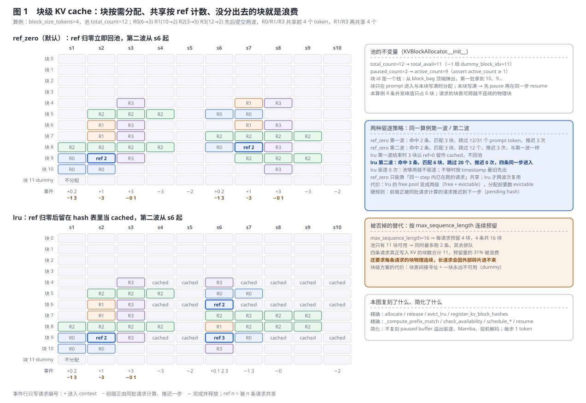
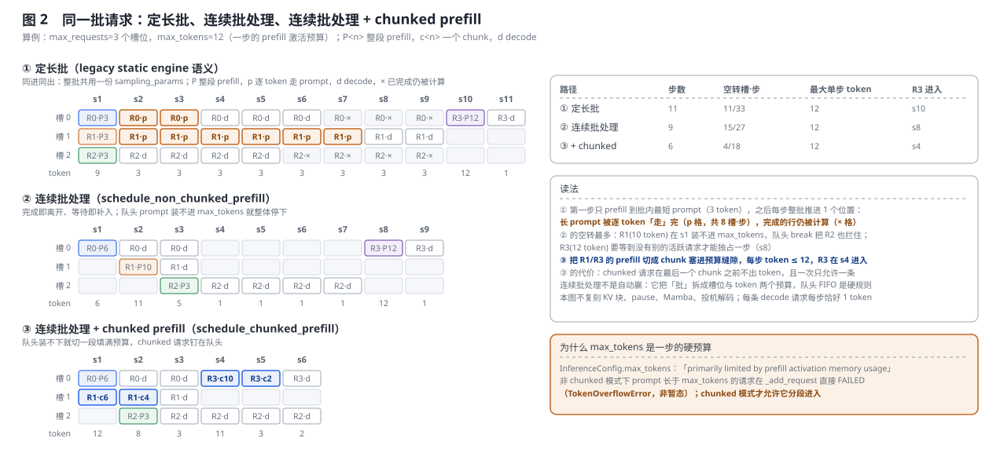
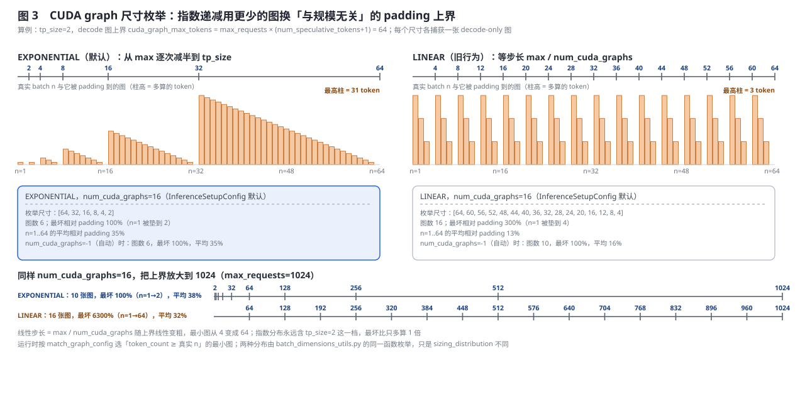
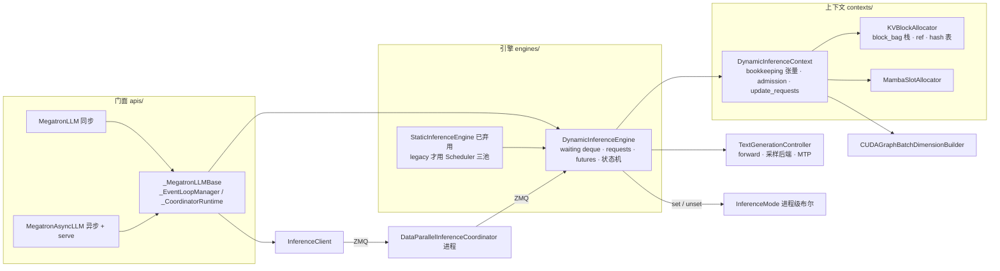

# Megatron-LM 推理引擎：连续批处理、块级 KV cache 与一个进程级开关

> **源码基线**：`NVIDIA/Megatron-LM@85902ef599ea4eb06ada7567a479c524b605767a`（`dev`，2026-09-01）
> **主题**：自回归生成为什么需要一台与训练前向不同的引擎，以及 Megatron 树内这台引擎的决定性设计——块级 KV cache 上的连续批处理与背压、`InferenceMode` 这一个进程级"正在推理"开关；再展开 chunked prefill、prefix caching、推理侧 CUDA graph 尺寸枚举、请求池与三个 step 入口、suspend/resume、coordinator 路由和两个 vLLM 风格门面。核心代码在 `megatron/core/inference/`。
> **适用范围**：推理引擎内部实现与 `InferenceSetupConfig`/推理侧 `TransformerConfig` 字段的配置契约；把引擎当作 rollout 积木的训推一致性归 [[30_megatron_rl_posttraining_consistency_analysis]]，`megatron/rl` 运行时归 [[33_megatron_rl_runtime_analysis]]，图捕获机制本体归 [[23_megatron_precision_cudagraph_fusion_analysis]]，推理 MoE 分发归 [[14_megatron_ep_analysis]]，TRT-LLM 导出归 [[37_megatron_trtllm_export_analysis]]。
> **最近更新**：2026-09-06。按房子形状重写，新增三张生成图与块级 KV cache / 调度 / 图枚举的复刻回归。

---

## 1. 特性概览

### 1.1 问题背景

训练是一次大前向加反向、batch 固定、必须可微；自回归生成是逐 token 前向、请求随时来去、不需要反向，却同时要低延迟和高吞吐。KV cache 把"每步重算整条序列"换成"每个 token 只算自己的 Key/Value 并缓存"，但它带来三个训练前向从不面对的问题：处理 prompt 的 **prefill** 一次喂进成百上千个 token、是计算受限的大 GEMM，逐 token 的 **decode** 每步只有一个 token、GEMM 小到喂不饱 GPU，瓶颈变成把权重和整个 KV cache 从 HBM 搬进来——两相的最优批策略完全不同；每条序列的 KV 长度不同且持续增长，按最大长度预分配连续显存既浪费又碎片化；请求长度不一、到达和结束时间不一，"同进同出"的定长批让短请求空等最长的那条。Megatron 在树内维护自己的推理引擎，就是为了把这三件事一起解决，同时让同一份模型代码既能被训练相调用、也能被 rollout 相调用。

### 1.2 解决方法

引擎围绕两个决定性设计组织。第一，**块级 KV cache 上的连续批处理与背压**：`DynamicInferenceContext` 上来就吃掉一整块显存（`buffer_size_gb`），切成定长块交给 `KVBlockAllocator` 按需发放，请求以"块表"的形式持有物理上不连续的块；`DynamicInferenceEngine` 每一步先从 FIFO 等待队列往 context 里补请求，再做一次前向，再把完成的请求移出、把末块写满的请求先暂停再恢复。装不下就留在队列里，而不是 OOM——一组 `ContextOverflowError` 把"装不下"分成暂态与永久两类。第二，**一个进程级布尔 `InferenceMode`** 是"现在是不是在推理"的唯一真相：引擎进入推理时置位、`suspend()` 时清位，模型各模块（attention、MoE dispatcher、Mamba、`flash_decode`、融合 TP 通信）据此分流，`self.training`/`no_grad`/`inference_context is not None` 三个旧信号被明文否定。围绕这两条挂着 chunked prefill（把大 prefill 切进每步的 token 预算）、prefix caching（跨请求共享块，`ref_zero`/`lru` 两种驱逐）、推理侧 CUDA graph 的尺寸枚举（`EXPONENTIAL`/`LINEAR`）、suspend/resume（给 RL 训练相让显存）、跨 DP 副本的 coordinator，以及两个 vLLM 风格门面 `MegatronLLM`/`MegatronAsyncLLM`。

### 1.3 收益、开销和约束

| 维度 | 直接收益 | 必付成本或边界 |
|---|---|---|
| 显存 | 块按需分配、块表可跨不连续物理块，四条并发请求峰值只占 6 块（§2.3） | 一整块显存开机即被占；一块永远留给 `dummy_block_idx`；块表间接寻址 |
| 吞吐 | 完成即离开、等待即补入，decode 的权重读取被整批摊薄 | 每步多了 schedule + bookkeeping 的 CPU 工作；FIFO 队头装不下则整队停下 |
| 延迟 | chunked prefill 把长 prompt 切进 `max_tokens` 预算，decode 请求不被整段 prefill 卡住 | chunked 请求在最后一个 chunk 之前不出 token，且同时只允许一条 |
| 前缀复用 | 共享 system prompt 的块只算一次，`lru` 还能跨波次复用 | 同一步内前缀正在计算的请求要推迟一步；`lru` 让 free pool 变成两级 |
| CUDA graph | 指数枚举用 `log2` 张图覆盖全部 batch 尺寸，最坏 padding 有界 | 每张图各捕获一次；EP 下任一 rank 在 prefill 则全体回退 eager |
| 可审计 | 单一进程级标志决定推理/训练分流，RL 训练相重算 logprob 时不会被误判为推理 | 标志是进程级的：同进程里不能一边推理一边训练 |
| 部署 | direct 模式零依赖；coordinator 模式跨 DP 副本路由并支撑 HTTP 服务 | coordinator 需要 pyzmq/msgpack；`MegatronAsyncLLM` 拒绝 direct；`engine.reset()` 在 coordinator 模式不安全 |
| 让位 | suspend 真正释放 KV/状态张量，训练相拿回显存 | 这是"拆掉再重建"不是换页：suspend 后再碰 context 直接 `TensorStateDeallocatedError` |

---

## 2. 推理引擎详细方案

### 2.1 共用算例：四条请求、一个 12 块的池

全节固定同一个最小算例：`block_size_tokens=4`；四条请求 R0(6→3)、R1(10→2)、R2(3→5)、R3(12→2)，写法是 prompt 长度 → 生成长度；R0/R1/R3 共享前 4 个 token（一个 system prompt 块），R1/R3 再共享接下来的 4 个。KV 池 `total_count=12`、`paused_count=2`；调度面板用 `max_requests=3` 个槽位与 `max_tokens=12` 的单步 token 预算；CUDA graph 面板用 `tp_size=2`、`cuda_graph_max_tokens=64`。它同时踩中本特性的四条边界——请求长度互不相同、有人共享前缀、最长的 prompt 塞不进一步的 token 预算、真实 batch 尺寸落在图尺寸之间。三张图的每个数字都由 `tools/figs/svg/megatron_inference_engine_figures.mjs` 里复刻自冻结基线的算法算出。

### 2.2 一个进程级开关：`InferenceMode`

**责任。** `megatron/core/inference/utils.py::InferenceMode` 是一个类级布尔加四个类方法：`is_active` / `set_active` / `unset_active` / `active()` 上下文管理器。docstring 把契约说死：需要区分推理与非推理（「e.g. training, RL logprobs」）路径的模块「should read `InferenceMode.is_active()` rather than relying on `self.training`, `torch.is_grad_enabled()`, or `inference_context is not None`」。注意它把 **RL logprob 重算**与训练并列为非推理路径。

**置位与清位只在引擎手里。** `DynamicInferenceEngine.__init__` 末尾 `set_active()`，`suspend()` 第一件事 `unset_active()`，`resume()` 再 `set_active()`；`StaticInferenceEngine.__init__` 也置位。读方遍布模型：`MoELayer.forward` 入口据此在训练 dispatcher 与推理 dispatcher 之间切换，`router`/`experts` 只在非推理路径做训练侧的辅助 loss 与统计，`attention`、`transformer_layer`（`inference_fuse_tp_communication` 的融合 reduce-scatter-norm-allgather 只在推理下启用）、`transformer_block`、`gpt_model`（`flash_decode` 只在推理下生效）、`mamba_mixer`/`mamba_layer`、`hybrid_model`/`hybrid_block` 都读同一个标志。

**被否掉的替代写在提交历史里。** 提交 `925422cd8`（2026-05-13，#4617，标题即「One single flag that determines if we are in inference」）之前，`MoELayer` 重写了 `nn.Module.train(mode)`：`mode` 为真换回训练 dispatcher、为假换成推理 dispatcher，`forward` 里判 `not self.training`。该提交把这段 `train()` 重写整段删除，改为在 `forward` 入口读 `InferenceMode.is_active()`，同批改动 `gpt_model`、`attention`、`transformer_layer`、`mamba_*`、`router`、`experts` 等共 29 个文件。**判据是让"模式"有唯一真相源**：RL 训练相恰恰是在 `eval()` 加 `no_grad` 下重算 logprob，三个旧信号在那里全部指向"推理"，模块各自猜就会静默走错 kernel；改成引擎持有的单一标志后，`suspend()` 清位就把整个训练相划出推理，判错也会同时错在所有模块、更容易被发现。

> [!note] 推断
> 源码陈述的是事实：docstring 否定三个旧信号、历史提交删除了 `train()` 重写、置位/清位只在引擎里。"唯一真相源"这条判据是本页重建，不是作者自陈。

### 2.3 块级 KV cache：按需分配、共享按 ref 计数、装不下就背压



**为什么整块预留、再在内部切块。** `DynamicInferenceContext` 的 docstring 明写：块级 KV cache 的「memory buffer is allocated up front（size `buffer_size_gb` if `unified_memory_level == 0`, or `buffer_size_gb + paused_buffer_size_gb` if `unified_memory_level == 1`）, that is divided into blocks and dynamically assigned to requests. At any given step, any unassigned blocks equate to unused space」。它同时把代价说了出来：没分出去的块就是纯浪费。块数由 `buffer_size_gb` 除以每块字节数（`params_dtype` × 2 × 本 rank 注意力层数 × `block_size_tokens` × 每分区头数 × 头维；MLA latent 模式只存一个 `kv_lora_rank + qk_pos_emb_head_dim` 向量）得到，PP>1 时各 stage 的块数取 MIN 同步，否则不同 stage 会在不同时刻暂停请求、调度发散。

**被否掉的替代：按 `max_sequence_length` 连续预留。** 图 1 右栏算了出来：`max_sequence_length=16` 时每请求预留 4 块，四条共要预留 16 块，而池只有 11 块可用，于是同时最多 2 条在跑、其余排队；四条请求真正写入 KV 的块数合计 11，预留量的 31% 被浪费；还要求每条请求的块物理连续，长请求会因外部碎片进不来。块级方案让四条同时在跑、峰值只占 6 块。

**`KVBlockAllocator` 的不变量。** 池里有一块永远不可用：可用块 = 11 = `total_count − 1`，那一块是 `dummy_block_idx = 11`，给 warmup 与 padding 的 token 指向；活跃预算 `active_count = 9` = `total_count − paused_count − 1`，构造时 `assert self.active_count >= 1`，即 `paused_count` 必须严格小于 `total_count − 1`。块 id 是一个栈（`block_bag`），从顶端弹出——所以第一批请求拿到的是 10、9、8，`reset()` 必须重建这个栈，否则 suspend 后引擎再启动时块 id 会重复、请求互相踩对方的 KV（源码注释原话是 faulty generations）。块只在两个时刻分配：prompt 进入时按 `ceil(len / block_size)` 一次拿够，以及生成把末块写满时——后者不在 `add_request` 里，而在 `update_requests` 里先把请求**暂停**、再在同一步 LIFO **恢复**并给一块（下文 §2.4）。

**prefix caching：共享凭什么安全。** 打开 `enable_prefix_caching` 后，请求构造时对每个**完整**块算一个父链 SHA-256（`compute_block_hashes_batched`：`digest = sha256(parent_digest || block_bytes)`，映射到正整数、避开 −1/0 两个哨兵），所以同前缀同 hash、前缀一旦不同后面全部不同；尾部不满一块没有 hash。`_find_kv_match_count` 从后往前找第一个命中的 hash——父链保证"位置 N 命中则 0..N 全部命中"——然后 `_compute_prefix_match` 决定跳过多少 prompt token：`min(匹配块数 × block_size, chunk − 1)`，再钳到至少留 2 个 token（单 token 的 prefill chunk 会让 `max_seqlen_q == 1`，把 batch 送进 flash-attention 的 decode kernel 崩掉）。命中的块 `ref_count += 1`，新块 `ref_count = 1`；完成时 `release_memory_blocks` 只做 `ref −= 1`。两种驱逐策略在 `ref` 归零那一刻分道：`ref_zero` 立即 `_deregister_blocks` 回池；`lru` 把登记过 hash 的块留在 hash 表里当 cached（没登记 hash 的尾块直接回池，避免泄漏），`is_memory_available` 把 free + evictable 一起算，不够时 `evict_lru_blocks` 按 `prefix_cache_lru_clock` 打的 timestamp 最旧先出。

图 1 把算例跑了两波（GRPO 式：同一批 prompt 再提交一遍）。第一波两种策略一样：R1 命中 R0 的块 A、R3 命中 R1 的 A+B，共命中 2 条、匹配 3 块、跳过 12/31 个 prompt token；但推迟 3 次——**同一步里前缀正由同批请求计算的请求必须推迟到下一步**（`schedule_*` 里的 pending hash 规则：R0 的块 A 这一步才写 KV，R1 不能同一步就跳过它）。第二波 `ref_zero` 重演第一波，因为第一波结束时所有块都回了池；`lru` 第一波结束时留下 3 个 cached 块，第二波命中 3 条、匹配 6 块、跳过 20 个 token、推迟 0 次，四条请求同一步进入。代价在图上也看得见：`lru` 面板里大片 `cached` 格子是"没分出去但也不能算空闲"的两级池。

**背压：一组异常把"装不下"分成两类。** `ContextOverflowError` 带 `is_transient` 标志。`RequestOverflowError`（超 `max_requests`）、`TokenOverflowError`（超 `max_tokens`）、`BlockOverflowError`（块用尽）默认暂态——请求留在等待队列，下一步再试；`MaxSequenceLengthOverflowError` 非暂态。引擎侧 `_add_request` 先做三道永久性判定：prompt 加生成长度超过 `max_sequence_length` 时**不再拒绝而是钳制**（#5181，对齐 vLLM）——只有 `num_tokens_to_generate < 0` 或 prompt 本身已超长才 FAILED，否则钳到剩余预算并在 rank 0 `warnings.warn`；非 chunked 模式下 prompt 长于 `max_tokens` 直接 FAILED（`TokenOverflowError`，此时非暂态）；整条请求需要的块数超过 `total_count − 1` 直接 FAILED（`BlockOverflowError`）。FAILED 的请求由 `_handle_failed_request` 立即 `warnings.warn`、置 `Status.FAILED`、把 future 结果设为记录（coordinator 模式下立刻发 `ENGINE_REPLY`），不进队列。另外两个成员不属于 admission：`ActiveRequestCountOverflowError` 只在 warmup 请求数超过 `max_requests` 时由 `initialize_attention_state` 抛出；`TensorStateDeallocatedError` 是 suspend 之后再 `add_request` 的下场（§4.2）。

**三处正确性修补决定了块表能不能对上。** 纯 Transformer 模型本 rank 的注意力层数原按 `num_layers // pp_size` 估，在 `account_for_embedding/loss_in_pipeline_split`、首尾 stage 不等分或自定义 `pipeline_model_parallel_layout` 下会算错、`append_key_value_cache` 抛 `KeyError`；#4775 改调与 `TransformerBlock` 同源的 `get_num_layers_to_build(model_config, vp_stage=None, pp_rank=...)`。#4855 把 `token_to_block_idx` 等按 token 计数的索引从 int32 改成 int64，`gpu_view.py` 的 CPU bookkeeping buffer 按 8 字节对齐重排。#4101 让 prefix cache 命中统计不再只反映最后一步：context 的 `prefix_cache_hits` / `prefix_cache_blocks_matched` 每步被引擎累加进 `_prefix_cache_hits` / `_prefix_cache_blocks_matched` 后清零，`get_metrics` 上报的是引擎生命周期累计值（`inference/prefix_cache_hits`）。

### 2.4 连续批处理、chunked prefill 与一步的完整生命周期



**一步 = schedule → forward → bookkeep。** `async_step` 是 `async_forward` 加 `async_bookkeep`。`async_forward` 先 `schedule_waiting_requests()`（按 `enable_chunked_prefill` 二选一走 `schedule_non_chunked_prefill` 或 `schedule_chunked_prefill`），再 `await controller.async_generate_output_tokens_dynamic_batch()`，`step_count` 与 `prefix_cache_lru_clock` 各加一。`async_bookkeep` 拿到 `active_request_ids` / `finished_request_ids` / 采样结果，交给 `post_process_requests`：完成的请求在这里 `future.set_result(record)`——**这是 direct 模式的完成信号**；coordinator 模式下 mp coordinator 把合并后的记录序列化成 `ENGINE_REPLY` 发回。detokenize 在 direct 模式由引擎做，coordinator 模式交给 coordinator 与前向重叠。

**变体集合的枚举依据。** 三个 step 入口都定义在 `DynamicInferenceEngine` 上：`async_step`（协程本体）、`step_modern`（同步包装，`_run_coroutine_sync` 在已有 event loop 时把协程丢进单线程 executor 跑）、`step_legacy`（同样的同步包装，但把返回值拆成旧的三元组，且每次调用 `warnings.warn` 宣布 0.16 移除）；`step = step_legacy` 是向后兼容别名。`generate(prompts)` 就是 `add_request` 循环加 `while has_unfinished_requests(): step_modern()`，最后按 `request_id` 排序返回。两条调度分支的选择字段是 `InferenceConfig.enable_chunked_prefill`（CLI `enable_chunked_prefill`）。

**连续批处理的三道闸。** `check_availability` 返回三个布尔：请求数未满**且当前没有暂停请求**、`active_token_count + 有效 prefill 长度 ≤ max_tokens`、块池够用（`is_memory_available`）。`schedule_non_chunked_prefill` 从 FIFO 队头取请求，三条全真才 `context.add_request`，任一为假就 `break`——**队头装不下则整队停下**，这是硬规则。图 2 中间面板：R1 的 10 个 token 在 s1 装不进 `max_tokens=12`（R0 已占 6），R2 只有 3 个 token 也被队头拦住；R3 的 12 个 token 要等到 s8 没有别的活跃请求才独占一步。结算：9 步、空转 15/27 槽·步、R3 在 s8 进入。

**被否掉的替代：定长批。** 图 2 上面板复刻 legacy static engine 的真实语义（`generate_all_output_tokens_static_batch`）：整批共用一份 `sampling_params`，第一步只 prefill 到批内**最短** prompt（3 个 token），之后每步整批推进 1 个位置——更长的 prompt 在这些步里被逐 token「走」完（图上 `p` 格，共 8 个槽·步），已经生成完的请求那一行仍然被计算（`×` 格），直到全部完成或到达 `max_prompt + num_tokens_to_generate`。结算：11 步、空转 11/33、R3 在 s10 进入。它不需要 `max_tokens` 预算——所以在这个小算例上单步 token 载荷反而不高——但长 prompt 被当 decode 走、完成的行白算，且第二批要等第一批全完。

**chunked prefill 补上连续批处理留下的洞。** `schedule_chunked_prefill` 维护四条不变量：等待队列最多一条 chunked 请求且在队头；context 里最多一条且是最后一个活跃请求；`chunked_prefill_request_id == -1` 表示没有；`finished_chunk_token_count` 与 `remaining_prompt_tokens` 记录进度。队头装不下时（`token_partially_can_be_added`）切一段 `max_tokens − active_token_count` 塞进去，但**不让最后一个 chunk 只剩 1 个 token**（flash-attention issue 1537）：能减就减 1，只剩 1 个位置时干脆推迟。chunked 请求在两个 chunk 之间被"藏"在 `total_request_count` 之外，不计入 `active_token_count`，也不出 token；最后一个 chunk 走整段加入分支、`chunked_prefill_request_id` 归 −1。图 2 下面板：R1 切成 6+4、R3 切成 10+2（12 减到 10 正是那条"不留 1 个 token"规则），每步 token ≤ 12，结算 6 步、空转 4/18、R3 在 s4 进入。代价：一次只允许一条 chunked 请求，且它在最后一个 chunk 之前不出 token。

**`max_tokens` 为什么是一步的硬预算。** `InferenceConfig.max_tokens` 的注释：「primarily limited by prefill activation memory usage」；`max_requests` 则「primarily limited by the combination of `buffer_size_gb` and `max_sequence_length`」。连续批处理把"批"拆成了槽位与 token 两个预算，chunked prefill 只是让长 prompt 能分段进入第二个预算。

**bookkeeping 的布局决定了暂停/恢复的形状。** `update_requests` 把所有 `request_*` 张量按 `[paused | active | finished]` 连续排布，用 `paused_request_count` 与 `total_request_count` 划界——连续张量既省分配又是 flash-attention 的输入要求。八个步骤里三个改变块归属：完成的请求释放全部块并被换到右侧；末块写满的活跃请求（`last_kv_block_offset >= block_size − 1 − num_speculative_tokens`）被换到左侧暂停；`resume_paused_requests` 从右往左 LIFO 恢复（源码 todo 自陈想改成 FIFO），能恢复几条由三条上限决定——累加"已持有块数 + 是否需要新块"不超过 `active_avail`、新块不超过 `total_avail`、恢复后活跃数不超过 `min(max_requests, max_tokens // (spec+1))`——恢复的请求才拿到新块。仍然暂停且占用超过 `paused_count` 的请求由 `evict_overflow_paused_requests` 驱逐（本页图示不复刻这条路，见图 1 右下）。`paused_count` 由 `paused_buffer_size_gb` 决定：`unified_memory_level=0` 时含在 `buffer_size_gb` 里，为 1 时额外来自 CPU 内存。

### 2.5 推理侧 CUDA graph：为哪些 batch 尺寸各捕一张图



decode 步 kernel 小而多、CPU 启动开销占比极高，是 CUDA graph 的主场；但 graph 要求形状固定，而连续批处理里"当前有几个请求"每步都变。解法是预先枚举一组 batch 维度、各捕一张图，运行时按 `match_graph_config` 选「`token_count ≥` 真实 n」的最小图、把不足部分 padding 到 `dummy_block_idx`。**枚举住在 `batch_dimensions_utils.py::CUDAGraphBatchDimensionBuilder`**，不在引擎里：`_calculate_cuda_graph_token_counts` 按 `sizing_distribution` 分派——`EXPONENTIAL`（默认）从 `cuda_graph_max_tokens` 逐次减半到 `tp_size`，强制加入两个端点，超过 `num_cuda_graphs` 时从中间往外裁；`LINEAR` 在 `num_cuda_graphs=-1` 时枚举 `[1,2,4] + range(8,256,8) + range(256,max+1,16)`，给定 N 时等步长 `max / N`。decode-only 图的上界固定为 `max_requests × (num_speculative_tokens + 1)`，prefill/mixed 图默认同一上界、`cuda_graph_all_prefills` 才扩到 `max_tokens`；mixed 图的 prefill 个数在 `EXPONENTIAL` 下走几何网格 `{1,2,4,…,max_requests}`、在 `LINEAR` 下沿用固定的 `cuda_graph_mixed_prefill_count`。

图 3 用 `tp_size=2`、`cuda_graph_max_tokens=64`、默认 `num_cuda_graphs=16` 算了两遍：`EXPONENTIAL` 枚举 [64, 32, 16, 8, 4, 2]，共 6 张图，最坏相对 padding 100%（n=1 被垫到 2——TP 对齐决定了下限，两种分布都躲不开），n=1..64 平均 35%；`LINEAR` 步长 4，16 张图，平均只有 13%，但最坏 300%（n=1 被垫到 4，因为等步长枚举里没有 1、2 这两档）。**为什么默认改成指数**（#3509 把线性改为指数递减 + mixed 网格）：把上界放大到 1024 再算，`EXPONENTIAL` 用 10 张图仍然把最坏 padding 钉在 100%，`LINEAR` 的步长变成 64、最小图从 4 变成 64、最坏 padding 涨到 6300%。指数分布买的是**与规模无关的 padding 上界**，代价是中段的平均 padding 更高。

图捕获本身在 `DynamicInferenceEngine.create_cuda_graphs`：`inference_cuda_graph_scope` 为 `none` 或 `cuda_graph_impl != "local"` 直接返回；否则遍历 context 的 `cuda_graph_batch_dimensions_list`，每个维度构造 dummy 请求、跑一次前向（flashinfer 采样一起录）、`context.reset()`，MTP 的图在同一循环里按 `req_count` 去重后捕获；开了 sequence parallel 时先把全局 all-gather buffer 预开到 `max_tokens × hidden_size`，否则更大的前向会重分配被图捕获的地址。`decode_only_cuda_graphs` 把 `use_cuda_graphs_for_non_decode_steps` 置假；NCCL EP dispatcher 或训练侧 a2a dispatcher 会强制关掉非 decode 图。EP>1 时 `match_graph_config` 先把 `token_count` 与"是否有 prefill"在 EP 组内 all-reduce MAX（有 ZMQ 通信器就走 CPU，否则 NCCL），任一 rank 在 prefill 则全体回退 eager。图捕获机制本体（`CudaGraphManager`、TE 图）归 [[23_megatron_precision_cudagraph_fusion_analysis]]。

### 2.6 引擎、模式与门面：变体集合从哪里来

**引擎：`{StaticInferenceEngine, DynamicInferenceEngine}`**，枚举依据是 `megatron/core/inference/engines/` 目录本身——`abstract_engine.py` 之下只剩这两个实现，`mcore_engine.py` 是兼容别名。第三个槽位曾经存在：早期 `engines/` 并列着 `trt_llm_engine_wrapper.py`，`TRTLLMEngineWrapper(AbstractEngine)` 从头到尾是个桩——`generate()` 直接 `return prompts`、`is_model_trt_llm_exportable()` 恒 `return False`，两个方法都挂着 TODO；提交 `ca9edbef9`（2024-06-07，标题「Refactor ammo」）把该文件整体删除。今天源码走的是**接口对齐 vLLM、实现留在树内**：README 说门面提供「a vLLM-style `generate(prompts, sampling_params)` API」，roadmap 里的 `megatron serve` 「mirrors `vllm serve`」，HTTP 前端的放置也「mirroring how vLLM's `--headless` is invoked today」。`StaticInferenceEngine` 已不是独立实现：构造时无条件发 `DeprecationWarning`（「currently uses `DynamicInferenceEngine` under the hood」），内部用 `num_cuda_graphs=1`、`block_size_tokens=256`、`buffer_size_gb=40` 建一个 `DynamicInferenceContext`；只有 `legacy=True`（CLI `use_legacy_static_engine`）或动态引擎构造抛异常时才退回老路径——老路径才用 `scheduler.py::Scheduler` 的 `active/waiting/completed` 三个请求池与 `AsyncStream` 流式输出，动态引擎自己用 `waiting_request_ids` deque、`requests` 字典与 asyncio future。

> [!note] 推断
> "Megatron 因此选择自研引擎而非外部推理栈"这层因果由本页承担——源码从未写过一句"我们决定不用 TensorRT-LLM"。可核对的事实只有：桩被删除、README 反复对标 vLLM 接口、导出路径另有归属（[[37_megatron_trtllm_export_analysis]]）。

**模式：`{direct, coordinator}`**，选择字段是门面构造参数 `use_coordinator`，在引擎侧对应两个循环 `run_engine`（置 `use_coordinator=False`）与 `run_engine_with_coordinator`（置 `True`）。direct 模式调用方自己管数据分片、`generate` 同步跑引擎；coordinator 模式由全局 rank 0 spawn 一个 `DataParallelInferenceCoordinator` 进程，引擎跨 DP 副本收请求（§4.3）。**门面：`{MegatronLLM, MegatronAsyncLLM}`**，共享 `_MegatronLLMBase`：构造时装配 `DynamicInferenceContext → GPTInferenceWrapper → TextGenerationController → DynamicInferenceEngine`，coordinator 模式再起一个守护线程 event loop（`_EventLoopManager`）承载 `_CoordinatorRuntime`。`MegatronLLM.generate` **总是返回 `list`**（单 prompt 也是一元素列表，注释明说是与 async 的刻意不对称）；`MegatronAsyncLLM.generate` 单进单出，并多一个 `serve(ServeConfig)`。`MegatronAsyncLLM` 在 `__init__` 拒绝 `use_coordinator=False`（`ValueError`）：direct 模式会在调用方的 asyncio loop 里调同步的 `engine.generate()`，与引擎构造时绑定的 `_cond` / `_state_events` 冲突；README 说这是暂时的，等上游 `engine.async_generate(...)`。调用方三条责任（README「Caller responsibilities」）：构造前自己 `initialize_megatron(...)`；构造前自己 `model.eval()`——「The class does not toggle model state」；`pause`/`unpause`/`suspend`/`resume` 要求 `use_coordinator=True`，direct 模式 `_assert_coordinator` 抛 `RuntimeError`；coordinator 模式 `generate` 只在 primary rank 有效（`_assert_primary`）；EP>1 必须用 coordinator（`_MegatronLLMBase.__init__` 的 `ValueError`）。

**其它选择轴。** 采样后端 `{torch, flashinfer}`：`TextGenerationController.__init__` 读 `context.config.sampling_backend` 构造 `FlashInferSampling` 或 `TorchSampling`；异步调度 `{legacy, serial}`：`AsyncScheduleMode` 枚举，`serial` 在 `_validate_async_sched_support_for_config` 上有七条 `ValueError`（投机解码、Mamba、prefix caching、必须只物化末 token logits、EP、MoE、routing replay）加每请求两条（logprobs、stop words）；logprobs `{raw_logprobs, processed_logprobs}`：`DynamicInferenceContext._processed_log_probs` 分派，后者用采样后端的 `log_probs_kernel` 套 temperature/top-k/top-p，与投机解码互斥（`InferenceConfig.__post_init__` 的 `ValueError`）；prefix 驱逐 `{ref_zero, lru}` 与 coordinator 路由 `{longest_prefix, first_prefix_block, round_robin}` 见 §2.3 与 §4.3；图尺寸 `{EXPONENTIAL, LINEAR}` 见 §2.5；分配器 `{KVBlockAllocator, MambaSlotAllocator}` 见 §4.6。推理 MoE dispatcher 轴 `inference_moe_token_dispatcher_type ∈ {nccl, nvls}` 存在但归 [[14_megatron_ep_analysis]]。

### 2.7 开销结算

| 项 | 每步成本 | 一次性 / 常驻成本 |
|---|---|---|
| KV 池 | 分配/释放是 CPU 上的栈操作与 ref 计数；`lru` 分配前要数 evictable | `buffer_size_gb`（默认 CLI 40 GB、`InferenceConfig` 20 GB）开机即占；1 块 dummy |
| 调度 | 队头扫描 + `check_availability`；prefix caching 下每请求一次 hash 查表 | 请求构造时每完整块一次 SHA-256 |
| bookkeeping | `update_requests` 的张量搬移与 pause/resume；`transfer_bookkeeping_to_gpu` | 连续 bookkeeping 张量按 `max_requests` / `max_tokens` 预开 |
| CUDA graph | 运行时一次 `match_graph_config`（EP>1 多一次 MAX all-reduce） | 每个枚举维度捕获一次；MTP 按 `req_count` 去重再捕 |
| chunked prefill | 长 prompt 多走几步、末 chunk 前不出 token | —— |
| coordinator | 每步一次 `schedule_requests` 集合排空；EP 组按 `ep_consensus_interval`（默认 20）做共识 all-reduce，闲置 rank 跑 `dummy_forward` | 一个协调进程 + ZMQ 套接字；pyzmq/msgpack 依赖 |
| suspend/resume | —— | 释放/重建 KV 与 bookkeeping 张量、重新捕图、重新 `_add_request` |

**这条链在什么条件下失效。** 三处：块池小到一条请求需要的块数超过 `total_count − 1`，请求永久 FAILED 而不是排队；非 chunked 模式下 prompt 长于 `max_tokens` 同样永久 FAILED；coordinator 模式下调 `engine.reset()`——它重绑 `_cond`/`_state_events` 让挂起的协程再也等不到通知（死锁），还把 `use_coordinator` 置回 `False`（静默改走 direct 分支）。

---

## 3. 代码实现分析

### 3.1 类与所有权



| 层次 | 责任 | 不负责什么 |
|---|---|---|
| `MegatronLLM` / `MegatronAsyncLLM` / `_MegatronLLMBase` | 装配四件套；direct 模式直接跑 `engine.generate`，coordinator 模式把协程丢到守护线程 loop；生命周期信号经 `InferenceClient` 发出 | 不初始化分布式、不切换 `model.eval()` |
| `DynamicInferenceEngine` | 请求登记与 future、FIFO 等待队列、两条调度分支、一步的 forward/bookkeep、状态机、CUDA graph 捕获、suspend/resume | 不持有 KV，不做 admission 的块级判定 |
| `DynamicInferenceContext` | 预开 KV buffer 与 bookkeeping 张量；`check_availability` / `add_request` / `update_requests`；prefix 匹配；logprobs | 不决定请求顺序（那是引擎的队列） |
| `KVBlockAllocator` / `MambaSlotAllocator` | 块栈与 ref/hash/timestamp；Mamba 状态槽与块边界缓存 | 不理解请求语义 |
| `TextGenerationController` | 把 context 的张量喂进模型、采样、MTP 验证、detokenize；`dummy_forward` | 不调度 |
| `CUDAGraphBatchDimensionBuilder` | 枚举与匹配 batch 维度 | 不捕获图 |
| `InferenceMode` | 一个进程级布尔 | 不切换权重，不管精度 |
| `DataParallelInferenceCoordinator` / `InferenceClient` | 跨 DP 副本路由、生命周期信号广播、回包 | 不参与任何一步的前向 |

### 3.2 调用流程

```text
MegatronLLM.generate(prompts, sampling_params)                     apis/llm.py
|   [direct]      同步：直接 engine.generate(...) 然后 record.merge()
|   [coordinator] _loop_manager.run_sync(_generate_impl) → client.add_request ×N → gather futures
|                 (InferenceClient.add_request 发 SUBMIT_REQUEST 给 coordinator 进程；
|                  coordinator 按 get_best_data_parallel_rank 选 DP 副本，DEALER→mp coordinator→PUB 广播到 MP 组)
`-- DynamicInferenceEngine.generate                                engines/dynamic_engine.py
    +-- add_request(request_id, prompt, sampling_params)            同步，本地
    |   `-- _add_request：钳制 num_tokens_to_generate / 三道永久性判定 / 入 waiting_request_ids
    |       `-- [FAILED] _handle_failed_request → future.set_result 立即完成
    `-- while has_unfinished_requests(): step_modern()               同步包装
        `-- _run_coroutine_sync(async_step())                         已有 loop 则丢进单线程 executor
            +-- async_forward
            |   +-- [SUSPENDED] raise EngineSuspendedError
            |   +-- schedule_waiting_requests
            |   |   +-- [enable_chunked_prefill] schedule_chunked_prefill
            |   |   `-- 否则 schedule_non_chunked_prefill
            |   |       `-- context.check_availability → context.add_request     <- 三道闸；pending hash 推迟
            |   |           `-- KVBlockAllocator.allocate_memory_blocks / block_ref_counts += 1
            |   `-- controller.async_generate_output_tokens_dynamic_batch        GPU 前向 + 采样
            |       `-- context.update_requests：释放完成块 → 末块写满者 pause → LIFO resume → 驱逐溢出
            `-- async_bookkeep
                +-- post_process_requests：完成的请求 future.set_result(record)   <- direct 模式完成信号
                +-- [coordinator 且 mp coordinator] ENGINE_REPLY(record.merge())  <- 发回 coordinator → client future
                `-- failed_request_ids 并入 finished_request_records
```

执行语义：`add_request` 与两条调度分支都是本地同步；前向是 GPU 上的异步 kernel，`step_time` 只在要打日志的步才 `synchronize`；coordinator 模式下 `schedule_requests` 是 MP 组内的**集合操作**（mp coordinator 排空 socket 后把消息数广播给同组其它 rank，所有 rank 在锁步里处理同一批消息和至多一个控制信号），状态迁移（PAUSING→PAUSED 等）都要过一次 ZMQ 世界屏障。完成信号有三层：`add_request` 返回的 future（direct）、`InferenceClient` 的 future（coordinator）、`generate()` 排序后的记录列表——`DynamicInferenceRequestRecord` 在 suspend 时 `checkpoint()`，`merge()` 把多段拼成一条对外的 `DynamicInferenceRequest`。

### 3.3 源码阅读路线

1. 单一开关：`megatron/core/inference/utils.py::InferenceMode`；读方 `megatron/core/transformer/moe/moe_layer.py::MoELayer.forward`、`megatron/core/models/gpt/gpt_model.py`（`flash_decode` 分支）、`megatron/core/transformer/transformer_layer.py`（`inference_fuse_tp_communication` 分支）；历史 `git show 925422cd8`。
2. 引擎：`megatron/core/inference/engines/dynamic_engine.py::DynamicInferenceEngine.__init__` / `::reset` / `::_add_request` / `::add_request` / `::schedule_non_chunked_prefill` / `::schedule_chunked_prefill` / `::async_forward` / `::async_bookkeep` / `::post_process_requests` / `::async_step` / `::step_modern` / `::step_legacy` / `::generate` / `::create_cuda_graphs` / `::suspend` / `::resume` / `::start_listening_to_data_parallel_coordinator` / `::schedule_requests` / `::run_engine` / `::run_engine_with_coordinator` / `::_ep_establish_consensus` / `::_validate_async_sched_support_for_config`。
3. 上下文与分配器：`megatron/core/inference/contexts/dynamic_context.py::ContextOverflowError` 家族 / `::DynamicInferenceContext.__init__`（块数、`max_requests`、图维度、MLA 与 MTP 断言）/ `::_compute_prefix_match` / `::check_availability` / `::_find_kv_match_count` / `::add_request` / `::update_requests` / `::resume_paused_requests` / `::evict_overflow_paused_requests` / `::deallocate_inference_state_buffers` / `::reinitialize_inference_state_buffers` / `::_processed_log_probs`；`megatron/core/inference/contexts/kv_block_allocator.py::KVBlockAllocator`（`allocate_memory_blocks` / `release_memory_blocks` / `evict_lru_blocks` / `is_memory_available` / `reset`）；`megatron/core/inference/contexts/mamba_slot_allocator.py::MambaSlotAllocator`；`megatron/core/inference/inference_request.py::compute_block_hashes_batched` / `::DynamicInferenceRequestRecord.merge`。
4. 图枚举：`megatron/core/inference/batch_dimensions_utils.py::CUDAGraphBatchDimensionBuilder._calculate_cuda_graph_token_counts` / `::_calculate_token_counts_linear` / `::generate_cuda_graph_batch_dimensions_list` / `::match_graph_config`；`megatron/core/inference/config.py::CudaGraphSizingDistribution` / `::PrefixCachingEvictionPolicy` / `::PrefixCachingCoordinatorPolicy` / `::KVCacheManagementMode` / `::AsyncScheduleMode` / `::InferenceConfig.__post_init__`。
5. 门面与服务：`megatron/core/inference/apis/_llm_base.py::_MegatronLLMBase` / `::_EventLoopManager` / `::_CoordinatorRuntime`；`apis/llm.py::MegatronLLM.generate`；`apis/async_llm.py::MegatronAsyncLLM.__init__` / `::serve`；`apis/serve_config.py::ServeConfig`；`megatron/core/inference/README.md`；`megatron/core/inference/inference_client.py::InferenceClient.add_request`；`megatron/core/inference/data_parallel_inference_coordinator.py::DataParallelInferenceCoordinator.get_best_data_parallel_rank`；`megatron/core/inference/headers.py::Headers`。
6. 静态引擎与旧池：`megatron/core/inference/engines/static_engine.py::StaticInferenceEngine.__init__`；`megatron/core/inference/scheduler.py::Scheduler`；`megatron/core/inference/text_generation_controllers/text_generation_controller.py::TextGenerationController.generate_all_output_tokens_static_batch` / `::__init__`（采样后端、`num_mtp_depths`）。
7. 配置桥接：`megatron/training/config/inference_config.py::InferenceSetupConfig.to_inference_config`；`megatron/training/arguments.py::validate_args`（flashinfer 依赖检查、`inference_batch_times_seqlen_threshold` 的 PP 前提）；`megatron/inference/utils.py`（`inference_wandb_logging` 与 metrics writer 的接线）。
8. 历史：`git log --oneline --grep` 命中 `53d9ba0e4`（#5181 钳制）、`53b5e6eff`（#4101 累计指标）、`16b71941e`（#3509 指数分布）、`e513ec409`（#4855 int64）、`3c39d98b5`（#4697 门面）、`43fb2f5d5`（#4775 layer_map）、`9b4074b51`（#4764 Nemotron prefill）、`925422cd8`（#4617 单一开关）、`ca9edbef9`（删除 TRT-LLM 桩）。
9. 测试：`tests/unit_tests/inference/contexts/test_kv_block_allocator.py::test_allocate_release_reset_round_trip_no_prefix_caching` / `::test_prefix_caching_allocate_and_hash_registration`；`tests/unit_tests/inference/contexts/test_dynamic_prefix_caching.py::test_ref_count_lru` / `::test_ref_count_refzero` / `::test_scheduling_deferral_and_resolution` / `::test_chunked_prefill_deferral`；`tests/unit_tests/inference/engines/test_dynamic_engine.py::test_token_overflow_transient` / `::test_token_overflow_nontransient` / `::test_block_overflow_insufficient_kv_cache` / `::test_max_sequence_length_clamp` / `::test_chunked_prefill_avoid_single_token_chunk` / `::test_chunked_prefill_delay_scheduling_for_unavoidable_single_token_chunk` / `::test_cuda_graph_token_counts` / `::test_suspend_resume_cycle`；`tests/unit_tests/inference/test_batch_dimension_utils.py::test_any_prefill_rank_forces_eager` / `::test_generate_graphs_with_speculative_tokens`；`tests/unit_tests/inference/high_level_api/test_apis.py::test_async_llm_requires_use_coordinator` / `::test_sync_lifecycle_raises_in_direct_mode` / `::test_ep_gt_1_requires_use_coordinator`；`tests/unit_tests/inference/engines/test_dynamic_engine_async_sched.py::test_validate_async_sched_support_for_config`；`tests/unit_tests/inference/engines/test_static_engine.py::test_generate_legacy_static` / `::test_generate_dynamic`。

---

## 4. 配套机制

### 4.1 CUDA graph 捕获、warmup 与 MTP

§2.5 讲的是枚举哪些尺寸；捕获发生在 `create_cuda_graphs`，`DynamicInferenceEngine.__init__` 末尾与 `resume()` 里各调一次（后者仅当 `kv_cache_management_mode != PERSIST` 且未开 `static_kv_memory_pointers`，因为 KV 地址变了图就失效）。每个维度的 warmup 走 `controller._dynamic_step_context_init(construct_graph_dimensions=…)` 造 dummy 请求——warmup 请求数超过 `max_requests` 时抛 `ActiveRequestCountOverflowError`。捕获耗时与 mempool 增量被记进 `capture_stats`，按 CUDA-graph mempool 单独统计以免被 KV cache、NCCL workspace 的分配污染。`inference_cuda_graph_scope` 未设时由 `cuda_graph_impl` 推出：`local → layer`，其它 → `none`；`block` 把图的所有权上提到 `TransformerBlock`/`HybridBlock`。

MTP 投机解码挂在同一循环上：`num_speculative_tokens > 0` 时 `TextGenerationController` 把 `num_mtp_depths` 设为 `num_speculative_tokens`（`mtp_use_repeated_layer`）或 `min(num_speculative_tokens, mtp_num_layers)`（#4101 把 `num_mtp_heads` 全面更名为 `num_mtp_depths`），warmup 时对每个去重后的 `req_count` 各捕一张 MTP 图。接受统计是按位置的张量 `_spec_tokens_proposed_per_pos` / `_spec_tokens_accepted_per_pos`（索引 i 对应第 i 个 draft token），`get_metrics` 既报聚合 `inference/spec_decode_acceptance_rate` 也报逐位 `..._pos{i}`，prefill 请求不进分母。投机解码改变了块的预分配时机：末块 offset `>= block_size − 1 − num_speculative_tokens` 就要新块，`max_kv_block_count` 多留一块。

### 4.2 suspend/resume 与统一内存：让出的是真删掉的状态

`suspend()` 先 `InferenceMode.unset_active()`，再进 `suspend_resume_ctx`（记时间与显存增量）调 `context.deallocate_inference_state_buffers()`，随后按 `kv_cache_management_mode` 决定要不要 `delete_cuda_graphs()`；等待队列与（`RECOMPUTE` 模式下）活跃请求被记进 `resume_request_ids`，部分 prefill 过的请求被重置到从头算，记录做 `checkpoint()`。`resume()` 反向：`set_active()`、重建张量、重新捕图、逐条 `_add_request`，chunked 请求放回队头。三种 `KVCacheManagementMode`：`persist`（不释放）、`offload`（张量 storage 缩到 0、内容备份到 CPU）、`recompute`（删掉所有张量属性、恢复时从头 `initialize_all_tensors`）；有 `torch_memory_saver` 时改用它的 pause/resume。**这不是换页**：deallocate 之后 `is_tensor_state_allocated` 为假，`add_request` 直接抛 `TensorStateDeallocatedError`——它被明确归为 `ContextOverflowError` 的一种。`unified_memory_level=1` 时 KV buffer 从 `create_unified_mempool()` 分配：`unified_memory.py` 用 `load_inline` 编译一个 CUDA managed-memory 分配器（带超时，失败提示清理 `/tmp/torch_extensions`），与 `expandable_segments` 不兼容；编译失败只 `warnings.warn` 并退回 level 0。`static_kv_memory_pointers`（RL 侧 `rl_persist_cuda_graphs`）要求 UVM 或 `torch_memory_saver` 之一，否则构造期 assert。这些参数由 `InferenceSetupConfig.to_inference_config` 从 RL 参数带入，RL 侧的运行时归 [[33_megatron_rl_runtime_analysis]]，refit 与 CUDA graph 设备指针的契约归 [[30_megatron_rl_posttraining_consistency_analysis]]。

### 4.3 coordinator：跨 DP 副本的路由、锁步与 EP 共识

`start_listening_to_data_parallel_coordinator` 在所有 rank 上调用：全局 rank 0（`is_dp_coordinator`）用 `multiprocessing` spawn 一个 `DataParallelInferenceCoordinator` 进程并把它的 ZMQ ROUTER 地址广播出去；每个 DP 副本里 `tp_rank == 0 and pp_rank == 0` 的 rank 是 mp coordinator，用 DEALER 连 coordinator、用 PUB 把收到的消息广播给同 MP 组的 SUB 订阅者；EP>1 时再建一个 `AsyncZMQCommunicator`，让 `match_graph_config` 的 MAX 归约走 CPU。之后 `run_engine_with_coordinator` 作为后台任务跑：RUNNING 态每轮先 `schedule_requests`，再按 `_ep_establish_consensus` 的结果决定 `async_step`、`dummy_forward`（本 rank 没活但 EP 同伴有活，必须参加 all-to-all 否则死锁）或 `sleep(0.02)`；共识只在"全局没活"或每 `ep_consensus_interval` 步做一次，`disable_ep_consensus` 跳过共识但仍无条件跑 `dummy_forward`；`use_synchronous_zmq_collectives` 让这次归约同步执行以压 MoE 的抖动。PAUSE/UNPAUSE/SUSPEND/RESUME/STOP 都是先在 `schedule_requests` 里改状态、再过 `_world_barrier`（STOP 只在 PAUSED/SUSPENDED 下被接受，所以门面 `_shutdown_impl` 会先 pause）。请求路由在 coordinator 进程里：`round_robin` 忽略前缀；`first_prefix_block` 只看第一个块的 hash；`longest_prefix` 看最长连续匹配深度；后两者的分值 `score = alpha × match + (1 − alpha) × free_slots / max_requests`（`prefix_caching_routing_alpha`，须在 [0, 1]），平手按最近分配时间再按最小 rank 序号。`SET_GENERATION_EPOCH` 让引擎给每条请求打 `policy_epoch` / `kv_cache_epoch` 边界（RL 用，见 [[30_megatron_rl_posttraining_consistency_analysis]]）。

### 4.4 门面之上：HTTP 服务与 README 的三条已知限制

`MegatronAsyncLLM.serve(ServeConfig)` 只在 primary rank（全局 rank 0）起 `start_text_gen_server`（Quart/Hypercorn 后端，`frontend_replicas` 默认 4 个前端进程），其它 rank 只是陪着 `blocking`；`ServeConfig.host/port` 是对外 HTTP 地址，与构造参数里的 `coordinator_host/port`（ZMQ 内部地址）不是一回事。README 记了三条限制：**HTTP 前端固定在 rank 0**，`ServeConfig` 没有 per-rank `role`，放置只能靠 launcher；**响应里 `"model"` 恒为 `"EMPTY"`**（`completions.py` 与 `chat_completions.py` 各写死一处），不回显也不校验请求里的 `model`，没有 `GET /v1/models`；**coordinator 模式下 `engine.reset()` 不安全**——两种坏法（死锁与静默改走 direct 分支）见 §2.7，`examples/inference/offline_inference.py` 因此拒绝 `--use-coordinator` 与 `--inference-repeat-n > 1` 同开。`tools/run_dynamic_text_generation_server.py` 把 `inference_text_gen_server_logging` 传给前端的 `verbose`。

### 4.5 Nemotron / Mamba：状态槽与 prefill 元数据

混合模型的"KV"是每请求定长的 conv/SSM 状态。`DynamicInferenceContext` 把 Mamba 状态按请求槽位分配（`mamba_metadata.allocate_slot`，没槽即 `ContextOverflowError("No Mamba slots available")`），显存要么按 `mamba_memory_ratio` 从池里切一份，要么在给定 `max_requests` 时精确算出所需再把余量给 KV 块。`MambaSlotAllocator` 只在 prefix caching 且设了 `prefix_caching_mamba_gb` 时出现：它在块边界缓存 Mamba 状态（每个槽存全部 Mamba 层在一个块边界处的 SSM+conv 状态），`_find_mamba_match_count` 从后往前找最远有缓存状态的块，`_compute_prefix_match` 据此决定能跳多少、跳过头了就退回上一个有状态的块。#4764 的优化把中间状态提取的元数据上界定为 `padded_prefill_count × MAX_INTERMEDIATE_OFFSETS_PER_REQUEST`（常量 3：KV 分叉边界、最后对齐边界、倒数第二块边界），fill 只做到 `[:max_count]`。`mamba_inference_conv_states_dtype` / `mamba_inference_ssm_states_dtype` 在 `validate_args` 里从字符串映射成 torch dtype 后进 `MambaInferenceStateConfig`。GDN/KDA 层在基线下直接 `NotImplementedError`。

### 4.6 仅是相邻、不由本页展开的机制

| 机制 | 与本页的接口 | owner |
|---|---|---|
| 训推一致性：refit、`inference_optimized`、训练相重算 logprob、π/μ 指标 | §2.2 的开关是它的第四环；suspend/resume 是 refit 的前后动作 | [[30_megatron_rl_posttraining_consistency_analysis]] |
| `megatron/rl` 运行时（`MegatronLocal`、`rl_kv_cache_management_mode`、`rl_persist_cuda_graphs`） | §4.2 三种 KV 管理模式的调用方 | [[33_megatron_rl_runtime_analysis]] |
| CUDA graph 捕获机制本体、TE 图、低精度 kernel | §2.5 只讲"枚举哪些尺寸" | [[23_megatron_precision_cudagraph_fusion_analysis]] |
| 推理 MoE dispatcher（`nccl` / `nvls`）、专家并行的 all-to-all | §4.3 的 EP 共识与 `dummy_forward` 是为它服务的 | [[14_megatron_ep_analysis]] |
| 被装载模型的结构、attention 变体、MLA latent | 决定每块字节数与 `layer_map` | [[10_megatron_model_structure_analysis]] |
| TensorRT-LLM 导出路径 | §2.6 说明树内引擎不转发给 TRT-LLM；导出是另一条路 | [[37_megatron_trtllm_export_analysis]] |
| config dataclass → CLI 的工厂 | §6 两张表的字段怎么变成 `--inference-*` | [[41_megatron_config_surface_analysis]] |

---

## 5. 约束、适用场景与趋势

### 5.1 硬约束与失败边界

| 前提 / 不变量 | 源码边界 | 破坏后的行为 |
|---|---|---|
| 调用方先 `initialize_megatron` 与 `model.eval()` | README「Caller responsibilities」；`_MegatronLLMBase` 不切换模型状态 | 源码不替你切换、也不检查；后果由调用方承担 |
| 生命周期方法只在 coordinator 模式可用 | `_llm_base.py::_MegatronLLMBase._assert_coordinator` 的 `RuntimeError`；`generate` 只在 primary rank：`::_assert_primary` | 直接抛错 |
| `MegatronAsyncLLM` 不支持 direct 模式 | `async_llm.py::MegatronAsyncLLM.__init__` 的 `ValueError`；`serve()` 处再校验一次 | 构造期失败，而不是运行期 `RuntimeError: This event loop is already running` |
| EP>1 必须走 coordinator | `_MegatronLLMBase.__init__` 的 `ValueError` | 直接抛错 |
| coordinator 模式下 `engine.reset()` 不安全 | `README.md`「Known limitations」；`offline_inference.py::_validate_high_level_api_args` 的 `ValueError` | 死锁或静默改走 direct 分支 |
| 池里一块永远不可用，`paused_count < total_count − 1` | `kv_block_allocator.py::KVBlockAllocator.__init__` 的 `assert self.active_count >= 1` | 构造期断言 |
| `max_requests` 可被 `tp_size` 整除，且 `max_tokens ≥ max_requests` | `dynamic_context.py::DynamicInferenceContext.__init__` 的两条 `assert` | 构造期断言 |
| `cuda_graph_max_tokens ≥ max_requests × (spec+1)` | `batch_dimensions_utils.py::CUDAGraphBatchDimensionBuilder.generate_cuda_graph_batch_dimensions_list` 的 `assert` | 构造期断言 |
| 投机 token 数非负、不超过 MTP 层数、严格小于块大小 | `dynamic_engine.py::DynamicInferenceEngine.__init__` 两条 `assert`；`dynamic_context.py::DynamicInferenceContext.__init__` 的 `assert num_speculative_tokens < block_size_tokens` | 构造期断言——一次投机不能跨出一个块 |
| Flash MLA 把块大小钉死在 64 | `DynamicInferenceContext.__init__`：`cache_mla_latents` 时 `assert block_size_tokens == 64`，报错信息直接给出 CLI 开关 | 与默认 256 冲突，MLA 模型必须显式改 |
| 超长请求钳制而非拒绝；prompt 本身超长或生成数为负才失败 | `dynamic_engine.py::DynamicInferenceEngine._add_request` 的 `warnings.warn` 与 `MaxSequenceLengthOverflowError` | 请求照常受理，生成长度被钳 |
| 非 chunked 模式 prompt 不得长于 `max_tokens`；整条请求块数不得超过 `total_count − 1` | `_add_request` 的 `TokenOverflowError` / `BlockOverflowError`（永久 FAILED） | 请求立刻失败并返回，不排队 |
| 背压不是无限排队 | `dynamic_context.py::ContextOverflowError.is_transient`；warmup 溢出 `ActiveRequestCountOverflowError` | 暂态错误留队重试，非暂态直接失败 |
| suspend 后不能再加请求 | `dynamic_context.py::DynamicInferenceContext.add_request` 的 `TensorStateDeallocatedError`；`async_forward` 的 `EngineSuspendedError` | 抛错，不是排队 |
| `static_kv_memory_pointers` 需要 UVM 或 `torch_memory_saver` | `DynamicInferenceContext.__init__` 的 `assert HAVE_TORCH_MEMORY_SAVER or unified_memory_level != 0` | 构造期断言 |
| UVM 不可用时静默降级 | `DynamicInferenceContext.__init__` 捕获 `UnifiedMemoryUnsupportedError` 后 `warnings.warn` 并置 `unified_memory_level = 0` | 只告警，`paused_buffer_size_gb` 的语义随之改变 |
| flashinfer 采样后端要求已安装 | `arguments.py::validate_args` 与 `config.py::InferenceConfig.__post_init__` 的 `ImportError` | 直接失败——与 `InferenceSetupConfig` docstring 说的「falls back to torch with a warning」**不一致**，以代码为准 |
| `serial` 异步调度的七条配置限制与两条请求限制 | `dynamic_engine.py::DynamicInferenceEngine._validate_async_sched_support_for_config` / `::_validate_async_sched_support_for_request` 的 `ValueError` | 构造期或 `add_request` 期失败 |
| `processed_logprobs` 与投机解码互斥；`routing_alpha ∈ [0,1]` | `config.py::InferenceConfig.__post_init__` 的 `ValueError` | 构造期失败 |
| chunk 不能给最后一段只留 1 个 token；有效 prefill 至少 2 个 token | `schedule_chunked_prefill` 的减一/推迟；`_compute_prefix_match` 的钳制 | 否则 flash-attention 的 decode kernel 路径崩溃（issue 1537） |
| 同一步内前缀正在计算的请求必须推迟 | `schedule_*` 的 pending hash 集合 | 否则会去读尚未写入的 KV 块 |
| `inference_batch_times_seqlen_threshold > -1` 需要 PP>1 | `arguments.py::validate_args` 的 `assert` | 构造期断言 |
| `StaticInferenceEngine` 已弃用 | `static_engine.py::StaticInferenceEngine.__init__` 的 `DeprecationWarning`（legacy 路径另发一条 `warnings.warn`） | 仍可用，但每次构造告警 |
| GDN/KDA 层、无注意力层的模型 | `DynamicInferenceContext.__init__` 的 `NotImplementedError` | 构造期失败 |

### 5.2 何时用哪条路

| 场景 | 建议 | 原因 |
|---|---|---|
| 离线批量、自己管分片 | `MegatronLLM(use_coordinator=False)` | 零依赖，`generate` 同步返回 |
| 在线服务、跨 DP 副本 | `MegatronAsyncLLM(use_coordinator=True).serve(...)` | HTTP 前端与路由都要 coordinator |
| RL rollout（collocated） | 直接用 `DynamicInferenceEngine` + `suspend`/`resume` | 训练相要拿回显存，需要三种 KV 管理模式与 refit 契约 |
| 长 prompt 与 decode 混跑 | 开 `enable_chunked_prefill` | 否则队头 prompt 装不进 `max_tokens` 会拦住整队（§2.4） |
| 同 prompt 多采样（GRPO）或共享 system prompt | 开 prefix caching，跨波次复用选 `lru` | `ref_zero` 只在同一步内共享（§2.3） |
| 大 `max_requests` | 保持 `EXPONENTIAL` | `LINEAR` 的最坏 padding 随上界线性恶化（§2.5） |
| MLA 模型 | `block_size` 显式设 64 | 否则构造期 assert |
| 追求 decode 极限延迟且模型是稠密 GPT | `serial` 异步调度 + `flashinfer` 采样 | 但要接受 §5.1 的九条限制 |
| 想看 prefix cache 是否真的命中 | 看 `inference/prefix_cache_hits`（生命周期累计）与 `get_prefix_coordination_metrics()["waits"]` | 命中低而 waits 高说明同批请求互相等（§2.3） |

### 5.3 当前演进方向

> [!note] 推断：以下判断基于冻结基线里的 `DeprecationWarning`、TODO 与 README roadmap，不是源码给出的时间表。

**一、静态引擎正在下线，三个 step 入口会收敛回一个。** `StaticInferenceEngine` 构造即 `DeprecationWarning`；`step_legacy()` 自陈「will be removed in `megatron-core` 0.16. Please use `step_modern()` going forward, which will eventually be renamed to `step()`」。**由此可推断**：§2.6 的引擎变体集合会收缩成一个，`scheduler.py` 的三池与 `AsyncStream` 只剩 legacy 路径在用。

**二、README 的四条 roadmap 都落在本页的接缝上。** Dynamic streaming（离线已可用 `engine.async_step()`，HTTP 流式还缺协议携带部分输出）；Weight update APIs（`suspend_for_refit()` / `update_weights_from_collective()` / `resume_after_refit()` 包住 resharding 原语）；`megatron serve` CLI（复用 `MegatronAsyncLLM.serve`，含 headless 模式）；config-based model construction（把"自己建模型"从调用方责任里拿掉）。**由此可推断**：§4.2 的 suspend/resume 与 [[30_megatron_rl_posttraining_consistency_analysis]] 的 refit 会被收进同一个门面。

**三、direct 模式的异步 generate 已有指定修法。** `_llm_base.py` 挂着「TODO: replace with an upstream `engine.async_generate` so direct-mode async generate doesn't block the caller's event loop」，正对着 §5.1 里 `MegatronAsyncLLM` 拒绝 direct 那一条。

**四、采样与 logprob 侧的已知缺口。** `dynamic_context.py::DynamicInferenceContext.calculate_log_probs` 的「TODO: @wdykas support top-n log probs」；`text_generation_controller.py` 两处同文「TODO(ksanthanam): Evaluate whether it makes more sense to sample on 1 rank and then broadcast the sampled tokens rather than broadcasting the raw logits」——采样是否收拢到单 rank 仍未定。`resume_paused_requests` 的「un-pause requests using FIFO, rather than LIFO」也还在。

**五、`serial` 异步调度是最年轻的一条路。** 它在配置层就拒绝投机解码、Mamba、prefix caching、EP、MoE、routing replay 与 logprobs。**由此可推断**：这条路当前只覆盖稠密 GPT 的纯 decode，限制列表会随实现推进逐条缩短，引用时要连基线一起标。

---

## 6. 配置契约

本页正文讲引擎的机制；本节给它的配置面。`InferenceSetupConfig` 是**声明式、可序列化**的一层（原语与字符串，在模型和进程组存在之前就能从 args 建出来），`to_inference_config` 把它连同模型派生量（`max_sequence_length` 按位置编码类型取 min、Mamba 状态形状、`pg_collection`）翻译成引擎消费的运行期 `InferenceConfig`；两者的分界正是 [[41_megatron_config_surface_analysis]] 说的「args → 配置对象桥接」。散在 `TransformerConfig` 里的推理字段单列，因为它们影响 kernel 选择与通信路径，必须与模型配置同生命周期。

### `InferenceSetupConfig`（41 项）

| 字段 | 类型 | 默认 | 契约 |
|---|---|---|---|
| `inference_batch_times_seqlen_threshold` | `int` | `-1` | batch×seqlen 小于该阈值时不为流水线拆 batch；`-1` 关闭。`validate_args` 要求开启时 PP>1 |
| `max_tokens_to_oom` | `int` | `12000` | prompt+生成的 token 上限，意在 OOM 前报错；基线下仓内没有消费它的代码 |
| `output_bert_embeddings` | `bool` | `False` | 输出 BERT 的 mean-pooling embedding 而非二分类头输出（`tools/bert_embedding` 断言它为真） |
| `bert_embedder_type` | `Literal['megatron', 'huggingface']` | `'megatron'` | 选 Megatron 或 HuggingFace 作为 BERT embedder |
| `use_legacy_static_engine` | `bool` | `False` | 用旧的静态引擎路径；当前静态引擎默认在动态引擎之上包一层 |
| `inference_max_requests` | `int` | `8` | 推理的最大请求数 |
| `inference_max_seq_length` | `int` | `2560` | 期望的最大序列长度（prefill + decode）；`learned_absolute` 位置编码下与模型上限取 min |
| `inference_dynamic_batching` | `bool` | `False` | 启用动态批处理模式 |
| `inference_dynamic_batching_buffer_size_gb` | `float` | `40.0` | 给 KV cache 的 GPU 显存量；CPU+GPU 总量取决于 UVM level |
| `inference_dynamic_batching_paused_buffer_size_gb` | `float \| None` | `None` | 给暂停请求预留的显存；活跃块不够继续生成时请求被暂停 |
| `inference_dynamic_batching_mamba_memory_ratio` | `float \| None` | `None` | 从 buffer 里切给 Mamba 状态的比例；不设则按每个 KV 块配一份状态。仅混合模型 |
| `inference_dynamic_batching_block_size` | `int` | `256` | KV 块大小，「should be a multiple of 256」；MLA latent 模式必须为 64 |
| `inference_dynamic_batching_max_requests` | `int \| None` | `None` | 覆盖 context 的 `max_requests`；默认等于 buffer 里的块数（再按 tp 与 4 向下取整） |
| `inference_dynamic_batching_max_tokens` | `int \| None` | `None` | 覆盖 context 的默认 `max_tokens`（16384） |
| `inference_dynamic_batching_num_cuda_graphs` | `int` | `16` | 最多捕获多少张图，尺寸从 1 到 `max_requests`；`-1` 自动按 `max_requests` 决定 |
| `inference_dynamic_batching_track_paused_request_events` | `bool` | `False` | 在请求事件史里记 paused 事件；对延迟影响很小 |
| `inference_dynamic_batching_track_generated_token_events` | `bool` | `False` | 每个生成 token 记一个带时间戳的 GENERATED_TOKEN 事件，用于逐 token 延迟分析 |
| `inference_dynamic_batching_unified_memory_level` | `Literal[0, 1]` | `0` | 0 不用统一内存；1 把 `memory_buffer` 分配在统一内存里 |
| `inference_dynamic_batching_cuda_graph_mixed_prefill_count` | `int` | `16` | mixed prefill 图捕获的 prefill 请求数（`LINEAR` 下固定使用；`EXPONENTIAL` 下改走几何网格） |
| `inference_dynamic_batching_cuda_graph_sizing_distribution` | `Literal['exponential', 'linear']` | `'exponential'` | 图 token 数的间距：指数从 `cuda_graph_max_tokens` 减半到 `tp_size`，线性用变步长 |
| `inference_dynamic_batching_sampling_backend` | `Literal['torch', 'flashinfer']` | `'torch'` | 采样 kernel 后端。docstring 称缺包时回退 torch 并告警，代码实际抛 `ImportError`（§5.1） |
| `inference_dynamic_batching_async_sched_mode` | `Literal['legacy', 'serial']` | `'legacy'` | `legacy` 先 resolve 再 prepare；`serial` 在 resolve 完成前先投机 prepare+forward decode-only 步 |
| `inference_dynamic_batching_logprobs_mode` | `Literal['raw_logprobs', 'processed_logprobs']` | `'raw_logprobs'` | 引擎级：原始 logits 的 log-prob，或经 temperature/top-k/top-p 处理后的 |
| `decode_only_cuda_graphs` | `bool` | `False` | 只给 decode-only 步用图，不给 prefill 与 mixed 步 |
| `enable_chunked_prefill` | `bool` | `False` | 启用 chunked prefill；选择 `schedule_chunked_prefill` 分支 |
| `num_speculative_tokens` | `int` | `0` | decode 时的投机 token 数；须 ≤ MTP 层数、< 块大小 |
| `inference_dynamic_batching_enable_prefix_caching` | `bool` | `False` | 启用前缀缓存；关闭时相同前缀的请求不共享块 |
| `inference_dynamic_batching_prefix_caching_eviction_policy` | `Literal['ref_zero', 'lru']` | `'ref_zero'` | `ref_zero` ref 归零立即回池；`lru` 留作 cached、缺空间时按 LRU 驱逐 |
| `inference_dynamic_batching_prefix_caching_coordinator_policy` | `Literal['longest_prefix', 'first_prefix_block', 'round_robin']` | `'first_prefix_block'` | coordinator 路由：只看首块 hash / 最长匹配前缀 / 轮询忽略前缀 |
| `inference_dynamic_batching_prefix_caching_routing_alpha` | `float` | `0.5` | 路由分值权重 `alpha × match + (1 − alpha) × normalized_load`；越高越偏向命中 |
| `inference_dynamic_batching_prefix_caching_mamba_gb` | `float \| None` | `None` | 混合模型前缀缓存的 Mamba 状态缓存显存预算；设了才缓存块边界状态 |
| `inference_logging_step_interval` | `int` | `0` | 推理指标的记录步间隔；0 关闭 |
| `inference_text_gen_server_logging` | `bool` | `False` | 文本生成服务的逐请求日志（传给前端 `verbose`） |
| `inference_wandb_logging` | `bool` | `False` | 推理 wandb 日志；与 `inference_logging_step_interval > 0` 同时满足才在最后一个 rank 取 metrics writer |
| `inference_coordinator_port` | `int \| None` | `None` | node-0 上 coordinator 的端口；被占用时会改绑其它端口并告警 |
| `inference_use_synchronous_zmq_collectives` | `bool` | `False` | 用同步 ZMQ 集合通信；有助于压低 MoE 的性能抖动 |
| `inference_disable_ep_consensus` | `bool` | `False` | 跳过引擎控制循环里的 EP 共识 all-reduce、只看本地状态；仅 EP 不需协调时安全 |
| `mamba_inference_conv_states_dtype` | `Literal['bf16', 'fp16', 'fp32']` | `'bf16'` | Mamba 推理 conv 状态张量的 dtype（`validate_args` 映射成 torch dtype） |
| `mamba_inference_ssm_states_dtype` | `Literal['bf16', 'fp16', 'fp32']` | `'bf16'` | Mamba 推理 SSM 状态张量的 dtype |
| `return_log_probs` | `bool` | `False` | 返回输出 token 的 log-prob；决定 `materialize_only_last_token_logits`（除非同时 `skip_prompt_log_probs`） |
| `use_flashinfer_fused_rope` | `bool` | `False` | 用 flashinfer 的融合 RoPE；为真时 context 断言 flashinfer 已安装 |

该类共 44 个字段，本表收 41 项；其余字段的 owner 见 `docs/coverage/megatron-lm.yaml`。

### `TransformerConfig`（10 项）

| 字段 | 类型 | 默认 | 契约 |
|---|---|---|---|
| `pipeline_model_parallel_layout` | `Optional[Union[str, list, PipelineParallelLayerLayout]]` | `None` | 自定义流水线切分（如 `'Et*3\|(tt\|)*29,m\|L'`）；推理侧 KV `layer_map` 经 `get_num_layers_to_build` 与它对齐（#4775） |
| `inference_cuda_graph_scope` | `Optional[InferenceCudaGraphScope]` | `None` | 推理图的所有权边界：`none` 纯 eager，`layer` 在 TransformerLayer/MambaLayer，`block` 在整个 block；未设时 `local → layer`、其它 impl → `none` |
| `flash_decode` | `bool` | `False` | 推理时用优化的 flash decoding kernel；只在 `InferenceMode.is_active()` 下生效 |
| `inference_sampling_seed` | `int` | `42` | 推理采样的随机种子（`TextGenerationController` 的 `sampling_rng`） |
| `symmetric_ar_type` | `Optional[Literal['two_shot', 'one_shot', 'multimem_all_reduce']]` | `None` | 对称内存 all-reduce 的类型；`None` 不用对称内存 |
| `nccl_all_reduce_for_prefill` | `bool` | `False` | 开了对称 all-reduce 时，prefill 阶段仍用 NCCL all-reduce kernel（静态控制器在 prefill 段临时关掉对称 AR） |
| `inference_fuse_tp_communication` | `bool` | `False` | 推理时用融合的 reduce-scatter-residual-norm-allgather kernel；`transformer_layer` 只在 `InferenceMode.is_active()` 下启用 |
| `inference_disable_triton_nvls_kernels` | `bool` | `False` | 推理时禁用 Triton NVLS kernel（`tensor_parallel/inference_layers.py` 读它） |
| `inference_moe_disable_fused_quant_kernels` | `bool` | `False` | 默认把 permute/activation 与 MXFP8 量化+swizzle 融合成一次 kernel；置真则拆开（调试用）。仅 `fp8_recipe='mxfp8'` |
| `mlp_chunks_for_prefill` | `int` | `1` | prefill 时 MLP 沿序列维分块计算的块数 |

该类共 277 个字段，本表收 10 项；其余字段的 owner 见 `docs/coverage/megatron-lm.yaml`。三张 SVG 均由 `tools/figs/svg/megatron_inference_engine_figures.mjs` 从同一组算例参数与复刻的分配器 / 调度 / 图枚举代码生成，其数值与尺寸契约由 `tools/figs/svg/lib/megatron_inference_engine_figures.test.mjs` 锁定。

## Related Pages

- [[30_megatron_rl_posttraining_consistency_analysis]] — 把本页的引擎当 rollout 积木：refit 与 CUDA graph 设备指针契约、`InferenceMode` 作为训推分流的第四环、训练相重算 logprob。
- [[33_megatron_rl_runtime_analysis]] — `megatron/rl` 里 suspend/resume 与三种 KV 管理模式的调用方。
- [[23_megatron_precision_cudagraph_fusion_analysis]] — CUDA graph 捕获机制本体与低精度 kernel；本页只讲推理侧枚举哪些尺寸。
- [[14_megatron_ep_analysis]] — 推理 MoE dispatcher（`nccl` / `nvls`）与 EP 组 all-to-all；本页 §4.3 的 EP 共识为它服务。
- [[10_megatron_model_structure_analysis]] — 被装载模型的结构与 attention 变体，决定每个 KV 块的字节数。
- [[37_megatron_trtllm_export_analysis]] — TRT-LLM 导出路径；本页证明树内引擎从未转发给 TRT-LLM。
- [[02_engineering/02_train_frameworks/megatron-lm/index|Megatron-LM 知识地图]] — 返回本域索引。
