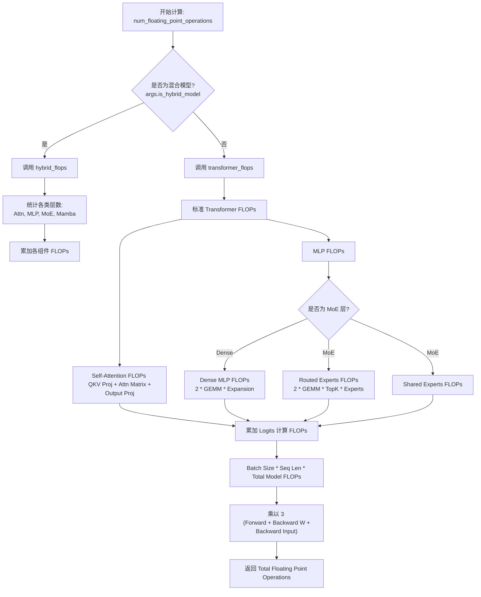
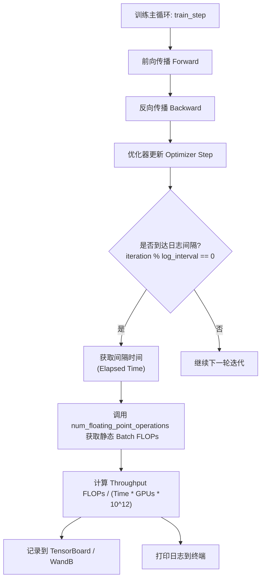

# Megatron-LM TFLOPS 计算实现分析：原理与 MoE 场景准确性探讨

> **源码基线**：`NVIDIA/Megatron-LM@85902ef599ea4eb06ada7567a479c524b605767a`（`dev`，2026-09-01）
> **重定基线**：2026-09-01 由 `71092579` 推进，跨 7 个提交（#6753 / #6847 / #6022 / #6704 / #6583 / #6397 / #6946）。`megatron/training/training.py` 本轮净增 184 行、且改动正落在 FLOPs 计算区，因此本页落在该文件上的引用已逐条打开新基线核对并重定行号——**全部为行号漂移，无一条断言在新基线下失效**；标注为历史基线 `ee3f1ffa` 的旧行号按原样保留。本轮的实质增量是 DSA top-k 稀疏与 indexer 成本被正式计入公式（#6753），见新增的 §3.2；§7.7、§8 同步更新。
> **重定基线**：2026-08-28 由 `ee3f1ffa…`（2026-05-19）推进，跨 578 个提交；本页全部 `path:line` 形式的引用已在新基线下逐条重核;**代码块内被点名的符号与不带行号的裸路径不在该次扫描口径内**,已知漏网处已于 2026-08-28 单独更正。原文钉的 3 处引用在新基线下均已移位、且函数签名同时改变（下列「现基线」行号随 2026-09-01 重定基线刷新）：① `num_floating_point_operations` 由双参 `(args, batch_size)`（旧 `megatron/training/training.py:299`）改为四参 `(args, batch_size, seqlen_squared_sum_in_batch=None, total_real_tokens_in_batch=None)`（现基线 `megatron/training/training.py:609-611`）；② `routed_flops` 的 token 因子由 `batch_size * seq_len`（旧 `megatron/training/training.py:316-326`）改为单一 `total_tokens`（现基线 `megatron/training/training.py:661-668`）；③ `hybrid_flops` 形参由 `batch_size, seq_len`（旧 `megatron/training/training.py:412-414`）改为 `total_tokens, seqlen_squared_sum`（现基线 `megatron/training/training.py:858-860`）。
> **叙事顺序**：本页按五拍组织——背景 → 为什么这么设计（含被否掉的替代）→ 实现思路与细节 → 约束 → 发展趋势。
> **最近更新**：2026-09-01。重定基线至 `85902ef59`；新增 §3.2「DSA 稀疏注意力如何进入闭式估算」。

在大规模模型训练中，**TFLOPS（每秒万亿次浮点运算）**是衡量硬件利用率和训练效率的关键指标。本文分析 Megatron-LM 计算 TFLOPS 的方法，通过流程图展示计算逻辑，并重点讨论混合专家模型（MoE）在无丢弃（Dropless）和有丢弃（Dropout）模式下的估算准确性。

## 1. 背景：训练循环需要一个每步都能算、还能跨作业相加的 FLOPs 数

Profiler（如 NVIDIA Nsight Compute）通过硬件计数器测量实际执行的指令数，而 Megatron-LM 使用**理论估算模型（Theoretical Estimation Model）**计算 TFLOPS。

### 计算公式

吞吐量的计算公式如下：

$$
\begin{aligned}
\text{Throughput (TFLOPS)}
&= \frac{\text{Forward FLOPs per Batch} \times 3}{\text{Elapsed Time (s)} \times \text{World Size} \times 10^{12}}
\end{aligned}
$$

*   **Forward FLOPs per Batch（每个 Batch 的前向理论 FLOPs）**：根据隐藏层维度、层数、序列长度、词表大小等模型超参数，静态估算单次前向传播的计算量。
*   **Multiplier (倍率 3)**：公式中的 **3** 代表包含反向传播的计算量（1倍前向传播 + 1倍权重梯度计算 + 1倍输入梯度计算）。

### 核心代码位置
核心逻辑位于 `megatron/training/training.py` 文件中，具体在 `num_floating_point_operations` 函数内（`megatron/training/training.py:609`）；函数体内按模型形态分派到 `transformer_flops()`（`megatron/training/training.py:1021`）或 `hybrid_flops(...)`（`megatron/training/training.py:858`），分派判定为 `if is_hybrid_model(args):`（`megatron/training/training.py:1443`）。

---

## 2. 为什么这么设计：把 FLOPs 当成模型超参的闭式函数，而不是硬件的测量值

§1 给出了"理论估算而非硬件计数器"这个结论本身。这一节回到源码，看它是被什么约束逼出来的，以及被放弃的那条路长什么样。

### 2.1 这个数字的三个使用点，决定了它必须便宜且可加

| 使用点 | 位置 | 施加的要求 |
|---|---|---|
| 每个 iteration 都算一次并累加 | `megatron/training/training.py:4827-4834`（`num_floating_point_operations_in_batch` → `..._so_far` / `..._since_last_log_event`） | 不能带任何 GPU 侧开销 |
| 日志间隔算瞬时吞吐 | `megatron/training/training.py:3692-3697`，分母是 `elapsed_time_per_iteration * 10**12 * args.world_size` | 只需要一个标量 |
| 跨 checkpoint / 跨作业累计 | 累计值随 checkpoint 持久化（`megatron/training/checkpointing.py:794`，恢复见 `:2323`），`compute_throughputs_and_append_to_progress_log` 用它算 job 级与累计吞吐（`megatron/training/training.py:3826-3846`） | 必须**可相加**，且与当时用的是哪张卡无关 |

三处共同指向同一个性质：这必须是一个**纯 CPU 上的闭式算术量**——算一次几乎不花钱，且两段训练的结果可以直接相加。

### 2.2 三个倍率不是拍脑袋——源码逐条注明了来历

§1 里的"倍率 3"在源码里是有出处的，三个展开因子各自带注释（`megatron/training/training.py:1075-1082`）：

```python
# megatron/training/training.py:1075-1082
# - 3x: Each GEMM in the model needs to be performed 3 times (forward pass,
#       backward wgrad [weight gradient], backward dgrad [data gradient]).
forward_backward_expansion_factor = 3
# - 2x: A GEMM of a m*n tensor with a n*k tensor requires 2mnk floating-point operations.
fma_expansion_factor = 2
# - 3x (SwiGLU enabled): h->2*ffn_h GEMM and ffn_h->h GEMM are stacked.
# - 2x (SwiGLU disabled): h->ffn_h GEMM and ffn_h->h GEMM are stacked.
ffn_expansion_factor = 3 if args.swiglu else 2
```

也就是说，整套公式的语义被钉死为"**模型里所有 GEMM 的理论 FMA 次数 × 3**"，而不是"这一步真的执行了多少浮点指令"。

### 2.3 THD 改造：为什么是两个标量统计量，而不是按样本循环

新基线把自注意力拆成两段，各自乘不同的 token 因子（源码注释见 `megatron/training/training.py:1084-1090`）：

| 分段 | 乘的量 | 位置 |
|---|---|---|
| token-linear（QKV/输出投影、MLP、MoE、MTP、logits） | `total_real_tokens_in_batch` = `sum_i(L_i)` | `megatron/training/training.py:1386-1387` |
| core-attention（`QK^T`、`softmax(QK^T)V`） | `seqlen_squared_sum_in_batch` = `sum_i(L_i^2)` | `megatron/training/training.py:1438` |

为什么必须**同时**跟踪两个量，源码写得很直白：

> `sum(L_i)` and `sum(L_i ** 2)` are mathematically independent (you cannot derive one from the other), so both must be tracked.
> —— `megatron/training/training.py:353-354`

而代价被刻意压到最低：per-micro-batch 的更新累加在同一个 device tensor 上，`consume` 时只发**一次 2 元素 `float64` all-reduce + 一次 host sync**（`megatron/training/training.py:355-360`）；BSHD 路径压根不分配这个 tensor，直接返回 `(None, None)`，注释原话是让调用方 "take its closed-form defaults **without paying for a collective**"（`:346-350`、`:367-370`），默认值回落在 `:639-642`。

### 2.4 源码沉默的部分

> [!note] 推断
> 以下两条是从 §2.1–§2.3 的代码事实反推出来的，源码里**没有**任何一句话说明作者的取舍理由，不要当成作者自陈：
> - **为什么不用 profiler 的硬件计数器。** 仓库里从未提及 Nsight/CUPTI 之类的替代方案。上表三个使用点（每步必算、只要一个标量、要能跨作业相加并写进 checkpoint）合起来使得计数器路线难以成立——这是本页的重建，不是源码的论证。
> - **为什么不"事后按 padding 比例折算"。** 代码选择的是让调用方把真实统计量传进来（`megatron/training/training.py:4811-4832`），并在 docstring 里承诺 "neither kind of padding shows up in the reported FLOPs"（`:627-634`）。"折算"这条替代路径在仓库里找不到任何痕迹，是本页为了对照而构造的。

---

## 3. 计算逻辑与流程

Megatron-LM 将模型分解为各个组件（Attention, MLP, MoE, Mamba）并分别累加其理论运算量。

### 3.1 逻辑流程图



### 3.2 DSA 稀疏注意力如何进入闭式估算

> [!update] 2026-09-01
> 本节为本轮基线推进（`71092579` → `85902ef59`，#6753）新增。在此之前 `experimental_attention_variant="dsa"` 的模型会落进普通 MLA 分支：core attention 按稠密因果 `L^2/2` 计费，indexer 完全不计。这是一个**双向的错**——长上下文下 core attention 被高估，indexer 被漏算，而且两个偏差不同阶，不会互相抵消。

DSA（DeepSeek Sparse Attention，如 GLM-5.2）的 attention 只在 indexer 选出的 top-k 个 key 上执行，但 indexer 自己要给**每个 query 对所有历史位置**打分。同一层里因此同时住着一个被 top-k 截断的近线性项和一个仍然稠密的二次项。§2.3 建立的框架只允许用 `sum_i(L_i)` 与 `sum_i(L_i^2)` 两个批级标量表达代价，DSA 的难点全部出在"如何把这两项塞进这两个标量"。

新基线在 `transformer_flops()` 的注意力分派里加了一条 `elif args.experimental_attention_variant == "dsa":` 分支（`megatron/training/training.py:1316-1360`），并配了三个模块级私有函数：

| 部件 | 位置 | 职责 |
|---|---|---|
| `_dsa_sparse_core_scale` | `megatron/training/training.py:391-420` | 稠密因果 core 系数要乘的稀疏缩放因子 |
| `_dsa_indexer_flops` | `megatron/training/training.py:423-480` | indexer 自身的 `(token_linear, core)` 两个系数 |
| `_num_dsa_indexer_layers` | `megatron/training/training.py:483-496` | 数出真正自己算索引、因而要付钱的层数 |

**token-linear 部分原样不动。** 分支注释给出的理由是：absorption 只是把同样的 `W_UK`/`W_UV` GEMM 换了位置——逐 token 的 K/V 上投影变成 q 侧与输出侧的等价吸收，总量不变——所以 §2.3 那套 MLA token-linear 系数继续适用（`megatron/training/training.py:1317-1321`）。

#### 稀疏 core：在长度加权均值处求值的一个受控近似

DSA 一层 core attention 的代价不是稠密因果的 $L^2/2$ 对，而是 $\sum_i \min(i,k)$ 对（$k$ 即 `dsa_indexer_topk`）。`_dsa_sparse_core_scale` 返回的正是这两者之比。

真正的难点是调用方手里**只有批级聚合量**，没有逐序列长度。函数的解法是在**长度加权均值**处求值：

$$
\bar L=\frac{\sum_i L_i^2}{\sum_i L_i},\qquad
e=\min\bigl(k,\lfloor\bar L\rfloor\bigr),\qquad
\text{scale}=\frac{e\left(1-\dfrac{e}{2\bar L}\right)}{\bar L/2}.
$$

分子是"每个 query 平均真正参与 attention 的 KV 条目数"，分母是稠密因果下的同一个量（约 $\bar L/2$）。源码把这个近似的边界写得很完整（`megatron/training/training.py:400-407`、`:412-416`）：

- **等长批下精确。** 所有 $L_i$ 相等时 $\bar L$ 就是真实长度——这正是打包 THD 基准测试的常见情形。
- **ragged 批下偏向长序列。** $\bar L$ 是**长度加权**均值（分子是平方和），权重自然落在支配 attention 代价的长序列上。这是刻意选的偏，不是遗漏。
- **序列不长于 top-k 时坍缩为 `1.0`。** 此时 top-k 选中全部 key，attention 退回稠密。`dsa_indexer_topk` 未设、或统计量为 0 时同样直接短路返回 `1.0`（`:409-410`）。

注释还主动标注了自己丢掉的那一项：离散精确均值的修正项应是 $e-1$ 而非 $e$，差异为 $O(1/L)$，"below the precision of this estimate"（`:414-416`）。

被缩放的不是普通 MLA 的 core 系数，而是**吸收形式**的那一个：DSA 恒走 `AbsorbedMLASelfAttention`，$QK^\top$ 在压缩 KV latent 上形成、每头跨度为 `kv_lora_rank + qk_pos_emb_head_dim`，$AV$ 跨度为 `kv_lora_rank`，都不是上投影之后的 `qk_head_dim` / `v_head_dim`（`megatron/training/training.py:1340-1350`，理由注释见 `:1322-1328`）。这一点决定了"每个分支只数它自己那条路径真正执行的形态"。

#### indexer：稀疏 attention 之上，一次仍然稠密的打分

`_dsa_indexer_flops` 计入三条投影，加一次稠密打分：

| 项 | 每层系数 | 乘的量 | 模块位置 |
|---|---|---|---|
| `wq_b`：挂在共享 q_lora 残差上的 Q 投影 | `q_lora_rank × n_heads × head_dim` | `sum_i(L_i)` | `megatron/core/transformer/experimental_attention_variant/dsa.py:1471-1481` |
| `linear_wk`：key 路径 | `hidden_size × head_dim` | `sum_i(L_i)` | `megatron/core/transformer/experimental_attention_variant/dsa.py:1483-1493` |
| `weights_proj`：逐头权重 | `hidden_size × n_heads` | `sum_i(L_i)` | `megatron/core/transformer/experimental_attention_variant/dsa.py:1512-1522` |
| 打分（因果掩码 `/2`） | `n_heads × head_dim / 2` | `sum_i(L_i^2)` | `megatron/training/training.py:473-474` |

（三条投影的系数汇总在 `megatron/training/training.py:468-472`；模块路径为 `megatron/core/transformer/experimental_attention_variant/dsa.py`。模型没有 q_lora_rank 时函数回落到 `hidden_size`，与 `DSAIndexer` 自己的 fallback 对齐，`:464-466`。）

**最值得记住的一条结论：打分是 $O(L^2)$ 的，哪怕消费它的 attention 是稀疏的。** 稀疏化砍掉的是 attention，不是"选择该 attend 谁"的那次全量比较。所以长上下文下 DSA 的二次项并未消失，只是把大系数（`n_heads × (kv_lora_rank + qk_pos_emb_head_dim)` 量级）换成了小系数（`n_heads × head_dim / 2`）——量级降下来，阶数没有降。

不计入的东西与本文件其余部分口径一致：indexer 的 KL loss 与 top-k 选择本身都不算，只有"模型定义性 GEMM"进入估算，辅助 loss 与排序不进（`megatron/training/training.py:432-435`）。这与 §7.1 "只数 GEMM" 是同一条原则的延伸。

#### 谁付钱：跨层索引共享

只有 `num_indexer_layers` 层付 indexer 的钱。开启跨层索引共享（`dsa_indexer_topk_freq`）后，中间层复用最近一次算出的 top-k，判定谓词是 `is_dsa_skip_topk_layer`：层号 1-indexed，`(max(layer_number - offset, 0) % topk_freq) != 0` 即为复用层（`megatron/core/transformer/experimental_attention_variant/dsa.py:57-67`）。`_num_dsa_indexer_layers` 就是拿同一个谓词在 `1..num_layers` 上数出计算层（`megatron/training/training.py:492-496`）——刻意复用 `megatron.core` 里那份实现，而不是在 `training.py` 里重写一遍取模逻辑。

该区间覆盖 MTP 层：`DSAttention.__init__` 把 MTP 层编号为 `layer_number + config.num_layers`，恰好与调用方扩展 `num_layers` 的方式一致（注释见 `megatron/training/training.py:486-490`）。

#### indexer 不吃全局 3 倍因子

这是本次改动里最容易写错的一条。§2.2 的 `forward_backward_expansion_factor = 3` 是对**参与主干反向传播**的 GEMM 说的；indexer 不在其列。

事实链（逐条可验）：

- indexer 只由自己的 KL loss 训练。`DSAttention.forward` 在进入 indexer 前把输入 `x` 与 `qr` 双双 `detach()`，注释写明目的是 "prevent gradients of indexer from flowing back to the main model"（`megatron/core/transformer/experimental_attention_variant/dsa.py:2290-2292`）。
- 是否启用 KL loss 由 `use_indexer_loss` 决定，它要求 `dsa_indexer_loss_coeff > 0`，而该字段默认 `None`（`megatron/core/transformer/transformer_config.py:356`；判定见 `megatron/core/transformer/experimental_attention_variant/dsa.py:2294-2298`）。
- 整段 indexer 前向被包在 `with torch.enable_grad() if use_indexer_loss else torch.no_grad():` 里（`megatron/core/transformer/experimental_attention_variant/dsa.py:2383`）。

于是 `_dsa_indexer_flops` 给出三档倍率（`megatron/training/training.py:476-480`，推导写在 docstring `:441-456`）：

| 情形 | 三条投影 | 打分 GEMM |
|---|---|---|
| KL loss 关（默认） | 1×：只有前向 | 1× |
| KL loss 开 | **2×** = fwd + wgrad | **3×** = fwd + dq + dk |

两档不同的根源是**操作数里有几个需要梯度**：投影读的是已被 detach 的输入，autograd 直接跳过它们的 dgrad，只剩前向与权重梯度；而打分 GEMM 的两个操作数都是激活、且都要把梯度送回那些权重，三份一份都省不掉。

> [!note] 推断
> 上表把"是否训练 indexer"当成模型口径的一部分（而非 kernel 调度细节）来处理，因而写进模型 FLOPs——这一点 docstring 明确表态（`megatron/training/training.py:453-454`），不是本页推断。属于本页推断的是它的后果：**同一个模型定义，只要 `dsa_indexer_loss_coeff` 从 `None` 改成正数，上报 FLOPs 就会跳变**，因此 DSA 模型的跨作业累计（§7.6）多了一条口径必须对齐的超参。
> 源码同时承认一个未建模的缺口：开启 `dsa_indexer_use_sparse_loss` 后打分的反向只覆盖 top-k 条目，3× 会高估；该开关默认 `False`（`megatron/core/transformer/transformer_config.py:359`，说明见 `megatron/training/training.py:454-456`）。

#### 测试锚点

`tests/unit_tests/test_num_floating_point_operations.py` 用一个**独立重写的** golden 计算器复算整套公式（`_dsa_golden_flops`，`:1214-1279`，docstring 明说"so that the test does not just call the same code twice"）。`TestDSA`（`:1282-1379`）覆盖 BSHD/THD 一致性、KL loss 关时 indexer 降为 1×、`freq=4 / offset=1` 下 8 层里只有 2 层付费、以及"长上下文不再按稠密 `L^2/2` 计费"这条修复本身（`test_topk_caps_long_context_growth`，把 `seq_length` 拉到 8192 后与旧的稠密 MLA 读法对拍）。`TestDSAHelperEdgeCases`（`:1384-1436`）覆盖两个 helper 的退化输入，以及下面 §7.7 那条 hybrid 路径硬拒绝。

---

## 4. 运行时调用逻辑

这套计算逻辑嵌入训练主循环，并在每个日志记录间隔（Log Interval）触发。

### 执行调用图



---

## 5. MoE 场景分析：Dropless vs Dropout

对于现代 MoE 架构，一个关键问题是：**这种静态理论估算是否准确？**

答案取决于是否发生了 Token 丢弃（Token Dropping）。

Megatron-LM 中 MoE 路由专家的 FLOPs 计算代码大致如下（`moe_layer_flops` 内，`megatron/training/training.py:550-557`）：
```python
routed_flops = (
    4
    * total_tokens
    * hidden_size
    * moe_ffn_hidden_size
    * num_experts_routed_to
    * scale_factor
)
```
*注意：这里的 `num_experts_routed_to` 直接取自静态配置的 Top-K 参数，且假设所有 Token 都参与了计算。*

> [!contradiction] 相对旧基线 `ee3f1ffa…`：该式的 token 因子由 `batch_size * seq_len`（旧 `megatron/training/training.py:318-321`）改为单一的 `total_tokens`（新 `megatron/training/training.py:550-557`）。BSHD 布局下二者等价——`total_real_tokens_in_batch` 缺省即取 `batch_size * args.seq_length`（`megatron/training/training.py:530-531`），故下文的估算分析不受影响；但 THD（packed sequence）布局下调用方会显式传入真实 token 数，函数 docstring 明写 padding token 不出现在上报的 FLOPs 里（`megatron/training/training.py:516-523`）。也就是说「padding 造成的高估」这一路已在新基线下被修掉，本节讨论的高估仅剩 MoE 容量丢弃这一个来源。

### 场景 A：MoE Dropless (无 Token 丢弃)
*   **状态**：✅ **准确**
*   **分析**：在无丢弃模式下（或专家容量充足时），每个 Token 都会送往 `Top-K` 个专家执行计算。
*   **理由**：理论公式假设的计算量是 `seq_len * Top-K`。由于硬件实际上也完整执行了这些运算，因此计算出的 TFLOPS 反映了真实的有效吞吐量。

### 场景 B：MoE with Token Drop (存在丢弃/Dropout)
*   **状态**：⚠️ **不准确 (数值虚高/高估)**
*   **分析**：当专家缓冲区溢出（达到 Capacity Limit）时，部分 Token 会被丢弃，跳过专家网络的计算（或者仅通过残差连接）。
*   **理论依据**：
    1.  **分子 (FLOPs)**：代码**依然按照所有 Token 都被处理**来计算 FLOPs (`Batch * Seq_Len * TopK`)。它没有减去被丢弃 Token原本应该产生的计算量。
    2.  **分母 (Time)**：实际的硬件执行时间**变短了**，因为实际执行的矩阵乘法次数减少了。
    3.  **结果**：
        $$
        \text{TFLOPS} = \frac{\text{不变的（高）FLOPs}}{\text{减小的 Time}} \rightarrow \text{虚高的数值}
        $$
*   **结论**：在高丢弃率场景下，报告的 TFLOPS 会显著高于真实值。此时它表示一种“等效吞吐量”，即假设未丢弃的 Token 也能按当前速度处理所得到的折算值，而不再代表真实的硬件算力利用率。

## 6. 总结

Megatron-LM 的 TFLOPS 报告器是一个**静态估算器**，而非动态分析器。

1.  它非常适合追踪相对性能提升和执行回归测试。
2.  对于 Dense 模型和 Dropless MoE 模型，其结果是准确的。
3.  **注意**：在解读存在大量 Token 丢弃的 MoE 模型训练日志时，需意识到 TFLOPS 数值是**被高估**的，它不能代表 GPU 的实际 FP 运算负载。

## 7. 约束

这套估算器不是"免费的真值"。以下每条都是它的前提、代价或失效条件。

### 7.1 只数 GEMM，别的一概不数

公式里出现的项**只有矩阵乘**：MLP（`megatron/training/training.py:533-536`）、MoE 路由/共享专家（`:538-571`）、attention 的投影与 core-attention（`:573` 起的 `attn_layer_flops`）、logits 与 MTP（`:1265-1270`）。LayerNorm/RMSNorm、softmax、激活函数、dropout、router 的 top-k、以及**所有集合通信**都没有对应项。

> [!note] 推断
> 由此可知上报值系统性低于真机的实际浮点操作数；对 GEMM 主导的大模型这个缺口很小，对小 hidden size / 长序列 / 通信密集的配置会被放大。源码没有对这个缺口做任何量化说明。

### 7.2 重计算完全不进公式

`forward_backward_expansion_factor = 3` 是常量（`megatron/training/training.py:964-966`），而 `num_floating_point_operations` 函数体（`:498`–`:1330`）里**没有出现过任何 `recompute` 相关的项**。开启 full activation checkpointing 后前向被整段重跑一次，真机的 GEMM 次数接近 4 份，而上报仍按 3 份计——即重计算越激进，TFLOPS 越被**低估**。这与 §5 场景 B 的高估方向相反，两者在同一份日志里会互相抵消一部分。

### 7.3 分母是 `world_size`，不是"在干活的 GPU 数"

`megatron/training/training.py:3515` 的除数是 `elapsed_time_per_iteration * 10**12 * args.world_size`；日志文案写作 `throughput per GPU (TFLOP/s/GPU)`（`:3538`）。PP bubble、EP 负载不均、任何空转的 rank，都被平摊进这个 per-GPU 数字里——它衡量的是**整个作业的平均**，不是某张卡的峰值。

### 7.4 THD 统计量成立的三个前提

- **只有 packed 路径才更新累加器。** 从未调用 `update_seqlen_stats_from_cu_seqlens` 时，`consume_seqlen_stats_in_iteration` 返回 `(None, None)`（`megatron/training/training.py:364-367`），函数回落到闭式默认 `batch_size * seq_length` / `batch_size * seq_length^2`（`:528-531`）。
- **依赖"`cu_seqlens` 在 TP/CP/PP 内完全复制"这个不变量。** 世界级 all-reduce 会把同一份统计量多算 `TP * CP * PP` 次，代码显式把这个因子除掉（`:359-361`、`:371-374`）。该不变量一旦被打破，FLOPs 会按比例算错，而且不会报错。
- **有 `sequence_packing_scheduler` 时走另一条路。** 此时直接采用调度器在 CP padding 与 rerouting **之前**算好的真实长度（`:4627-4633`，两个 `assert ... is not None` 把这条路钉死）。

### 7.5 §5「高估」论证的适用范围已经收窄

这是本轮重定基线带来的最实质变化，也是 §4 那条 `[!contradiction]` 的完整结论：

| 高估来源 | 旧基线 | 新基线 `71092579` |
|---|---|---|
| THD/CP padding token 被当成真 token | 存在 | **已修掉**：token-linear 改乘 `total_real_tokens_in_batch`，docstring 承诺 "neither kind of padding shows up in the reported FLOPs"（`megatron/training/training.py:516-523`）；core-attention 改乘真实 `sum(L_i^2)`（`:1272-1276`） |
| MoE 专家容量丢弃 | 存在 | **仍然存在**：`moe_layer_flops` 的 `num_experts_routed_to` 是静态 top-k，公式里没有任何 capacity / drop 项（`:538-557`） |

所以 §5 场景 B 的结论现在只对**容量丢弃**这一个来源成立。BSHD 下两条路径数值等价（`:528-531`），因此 §4/§5 针对 BSHD 的论述不受影响。

### 7.6 跨作业累计的口径必须一致

`Job throughput` / `Cumulative throughput` 直接对 checkpoint 里持久化的 `num_floating_point_operations_so_far` 做差（`megatron/training/training.py:3653-3664`；写入 `megatron/training/checkpointing.py:794`，读回 `:2323`）。中途改模型超参、或换到公式口径不同的版本，两段数字会被无条件相加，且没有任何一致性校验。

### 7.7 公式硬性拒绝的组合

`dsv4_hybrid` 要求所有 attention 层都属于 Window/CSA/HCA，否则 `assert` 直接失败（`megatron/training/training.py:1310-1314`），并且不允许再有 dense + MLA 层（`:1309`）。

---

## 8. 发展趋势

> [!note] 推断
> 本节每条都锚在当前基线的一处真实代码或本页已核过的 callout 上，但"往哪走"是本页的推断，不是源码的承诺。

- **从"闭式超参函数"走向"按真实 batch 统计量 + 按层型分派"。** 锚点：函数签名新增两个可选统计量（`megatron/training/training.py:498-500`）；自注意力被拆成 token-linear 与 core-attention 两段（`:973-979`）；hybrid 路径按层型逐类累加（`:1320-1330`）。本页页头「重定基线」记录的三处签名变化，正是这条线留下的三个脚印。
- **两条计算路径迟早要合并。** 锚点：`transformer_flops()` 头上挂着 `# TODO(helenn/dnarayanan): Refactor this to reuse the helper methods.`（`:912`）——`hybrid_flops` 已经在复用 `mlp_layer_flops` / `moe_layer_flops` / `attn_layer_flops` 这组 helper（`:1320-1330`），而标准 Transformer 路径仍然自己把公式展开一遍。
- **稀疏注意力已经拿到独立的 FLOPs 模型。** 锚点：`_dsv4_hybrid_self_attention_flops`（定义在 `:388`）被注释称为 "the single source of truth shared with ``hybrid_flops``"（`:996-999`），并返回 `(token_linear, core)` 两段（`:495`）。"按层型给出各自的 FLOPs 模型"这个做法正在从 MoE 扩散到注意力变体。
- **下一个待收窄的高估来源是容量丢弃。** 锚点：§4 的 `[!contradiction]` 已确认 padding 那一路被修掉，而 `num_experts_routed_to` 仍是静态 top-k（`:550-557`）。源码里**没有**与之对应的 TODO，所以这条纯粹是由 §7.5 的约束推出的方向，不是在途工作。

---

## Related Pages

- [[02_engineering/02_train_frameworks/megatron-lm/index]]
- [[17_megatron_parallelism_orchestration_analysis]]
