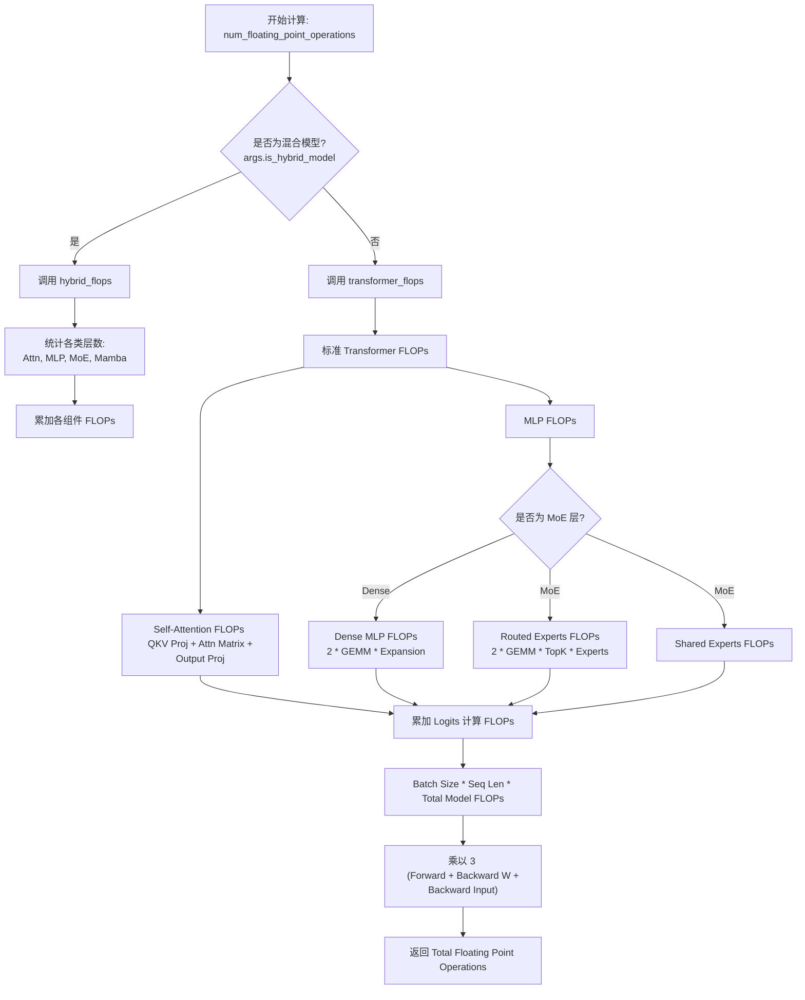
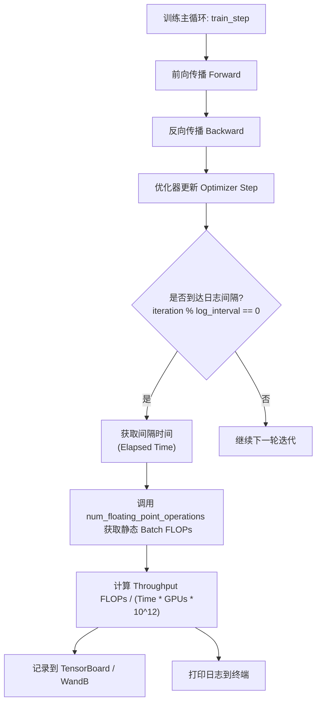

# Megatron-LM TFLOPS 计算实现分析：原理与 MoE 场景准确性探讨

> **源码基线**：`NVIDIA/Megatron-LM@71092579522a12522d9f323ae180c9825d01928a`（`dev`，2026-08-27）
> **重定基线**：2026-08-28 由 `ee3f1ffa…`（2026-05-19）推进，跨 578 个提交；本页全部 `path:line` 已在新基线下逐条重核。原文钉的 3 处引用在新基线下均已移位、且函数签名同时改变：① `num_floating_point_operations` 由双参 `(args, batch_size)`（旧 `megatron/training/training.py:299`）改为四参 `(args, batch_size, seqlen_squared_sum_in_batch=None, total_real_tokens_in_batch=None)`（新 `megatron/training/training.py:498-500`）；② `routed_flops` 的 token 因子由 `batch_size * seq_len`（旧 `megatron/training/training.py:316-326`）改为单一 `total_tokens`（新 `megatron/training/training.py:550-557`）；③ `hybrid_flops` 形参由 `batch_size, seq_len`（旧 `megatron/training/training.py:412-414`）改为 `total_tokens, seqlen_squared_sum`（新 `megatron/training/training.py:747-749`）。

在大规模模型训练中，**TFLOPS（每秒万亿次浮点运算）**是衡量硬件利用率和训练效率的关键指标。本文分析 Megatron-LM 计算 TFLOPS 的方法，通过流程图展示计算逻辑，并重点讨论混合专家模型（MoE）在无丢弃（Dropless）和有丢弃（Dropout）模式下的估算准确性。

## 1. 核心原理：基于静态理论的估算

Profiler（如 NVIDIA Nsight Compute）通过硬件计数器测量实际执行的指令数，而 Megatron-LM 使用**理论估算模型（Theoretical Estimation Model）**计算 TFLOPS。

### 计算公式

吞吐量的计算公式如下：

$$
\begin{aligned}
\text{Throughput (TFLOPS)}
&= \frac{\text{Forward FLOPs per Batch} \times 3}{\text{Elapsed Time (s)} \times \text{World Size} \times 10^{12}}
\end{aligned}
$$

*   **Forward FLOPs per Batch（每个 Batch 的前向理论 FLOPs）**：根据隐藏层维度、层数、序列长度、词表大小等模型超参数，静态估算单次前向传播的计算量。
*   **Multiplier (倍率 3)**：公式中的 **3** 代表包含反向传播的计算量（1倍前向传播 + 1倍权重梯度计算 + 1倍输入梯度计算）。

### 核心代码位置
核心逻辑位于 `megatron/training/training.py` 文件中，具体在 `num_floating_point_operations` 函数内（`megatron/training/training.py:498`）；函数体内按模型形态分派到 `transformer_flops()`（`megatron/training/training.py:910`）或 `hybrid_flops(...)`（`megatron/training/training.py:747`），分派判定为 `if is_hybrid_model(args):`（`megatron/training/training.py:1281`）。

---

## 2. 计算逻辑与流程

Megatron-LM 将模型分解为各个组件（Attention, MLP, MoE, Mamba）并分别累加其理论运算量。

### 逻辑流程图



---

## 3. 运行时调用逻辑

这套计算逻辑嵌入训练主循环，并在每个日志记录间隔（Log Interval）触发。

### 执行调用图



---

## 4. MoE 场景分析：Dropless vs Dropout

对于现代 MoE 架构，一个关键问题是：**这种静态理论估算是否准确？**

答案取决于是否发生了 Token 丢弃（Token Dropping）。

Megatron-LM 中 MoE 路由专家的 FLOPs 计算代码大致如下（`moe_layer_flops` 内，`megatron/training/training.py:550-557`）：
```python
routed_flops = (
    4
    * total_tokens
    * hidden_size
    * moe_ffn_hidden_size
    * num_experts_routed_to
    * scale_factor
)
```
*注意：这里的 `num_experts_routed_to` 直接取自静态配置的 Top-K 参数，且假设所有 Token 都参与了计算。*

> [!contradiction] 相对旧基线 `ee3f1ffa…`：该式的 token 因子由 `batch_size * seq_len`（旧 `megatron/training/training.py:318-321`）改为单一的 `total_tokens`（新 `megatron/training/training.py:550-557`）。BSHD 布局下二者等价——`total_real_tokens_in_batch` 缺省即取 `batch_size * args.seq_length`（`megatron/training/training.py:530-531`），故下文的估算分析不受影响；但 THD（packed sequence）布局下调用方会显式传入真实 token 数，函数 docstring 明写 padding token 不出现在上报的 FLOPs 里（`megatron/training/training.py:516-523`）。也就是说「padding 造成的高估」这一路已在新基线下被修掉，本节讨论的高估仅剩 MoE 容量丢弃这一个来源。

### 场景 A：MoE Dropless (无 Token 丢弃)
*   **状态**：✅ **准确**
*   **分析**：在无丢弃模式下（或专家容量充足时），每个 Token 都会送往 `Top-K` 个专家执行计算。
*   **理由**：理论公式假设的计算量是 `seq_len * Top-K`。由于硬件实际上也完整执行了这些运算，因此计算出的 TFLOPS 反映了真实的有效吞吐量。

### 场景 B：MoE with Token Drop (存在丢弃/Dropout)
*   **状态**：⚠️ **不准确 (数值虚高/高估)**
*   **分析**：当专家缓冲区溢出（达到 Capacity Limit）时，部分 Token 会被丢弃，跳过专家网络的计算（或者仅通过残差连接）。
*   **理论依据**：
    1.  **分子 (FLOPs)**：代码**依然按照所有 Token 都被处理**来计算 FLOPs (`Batch * Seq_Len * TopK`)。它没有减去被丢弃 Token原本应该产生的计算量。
    2.  **分母 (Time)**：实际的硬件执行时间**变短了**，因为实际执行的矩阵乘法次数减少了。
    3.  **结果**：
        $$
        \text{TFLOPS} = \frac{\text{不变的（高）FLOPs}}{\text{减小的 Time}} \rightarrow \text{虚高的数值}
        $$
*   **结论**：在高丢弃率场景下，报告的 TFLOPS 会显著高于真实值。此时它表示一种“等效吞吐量”，即假设未丢弃的 Token 也能按当前速度处理所得到的折算值，而不再代表真实的硬件算力利用率。

## 5. 总结

Megatron-LM 的 TFLOPS 报告器是一个**静态估算器**，而非动态分析器。

1.  它非常适合追踪相对性能提升和执行回归测试。
2.  对于 Dense 模型和 Dropless MoE 模型，其结果是准确的。
3.  **注意**：在解读存在大量 Token 丢弃的 MoE 模型训练日志时，需意识到 TFLOPS 数值是**被高估**的，它不能代表 GPU 的实际 FP 运算负载。

## Related Pages

- [[02_engineering/02_train_frameworks/megatron-lm/index]]
- [[17_megatron_parallelism_orchestration_analysis]]
