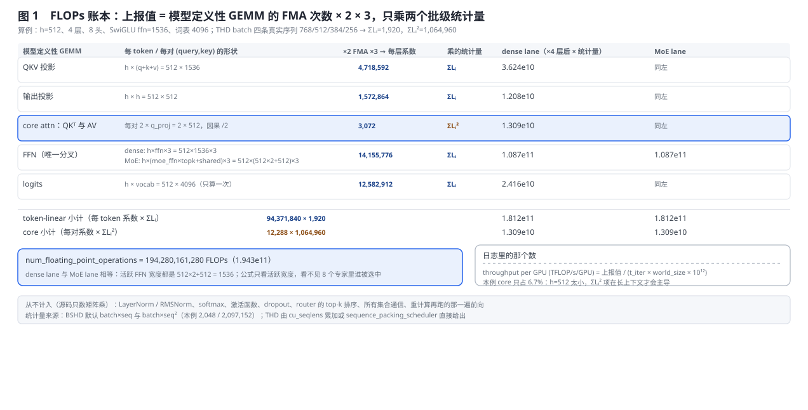
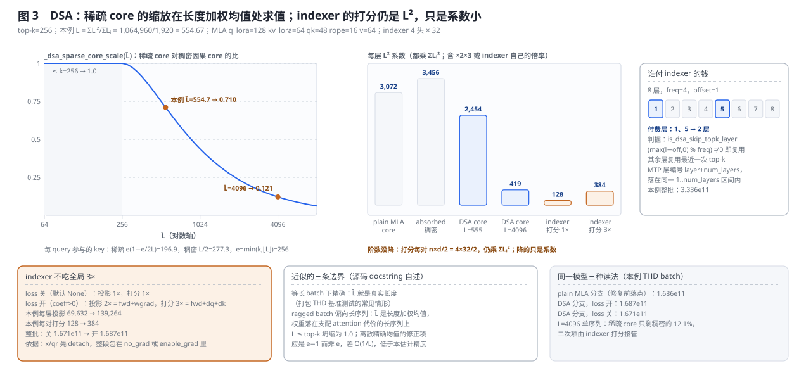
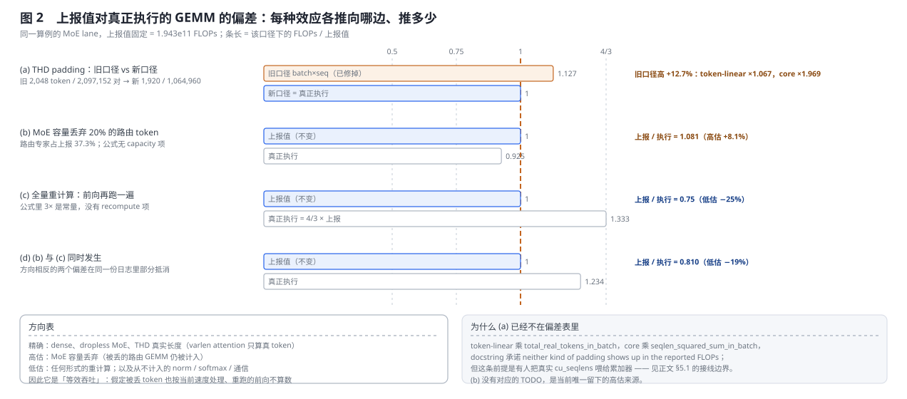
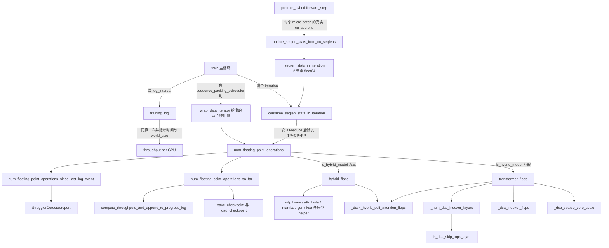

# Megatron-LM 的 FLOPs / TFLOPS / MFU 统计口径

> **源码基线**：`NVIDIA/Megatron-LM@85902ef599ea4eb06ada7567a479c524b605767a`（`dev`，2026-09-01）
> **主题**：日志里 `throughput per GPU (TFLOP/s/GPU)` 那个数是怎么来的——它不是测量值，而是把模型定义性 GEMM 的 FMA 次数 ×2×3 之后，只乘两个批级统计量 $\sum_i L_i$ 与 $\sum_i L_i^2$ 的闭式计数。本页用同一个小算例依次走过 dense、THD 变长、MoE、DSA 稀疏注意力与 hybrid 五条口径，给出每种口径相对真正执行的 GEMM 偏向哪边、偏多少，再走一遍训练循环里的三处使用点与 checkpoint 持久化。核心代码在 `megatron/training/training.py`。
> **适用范围**：FLOPs 闭式公式、吞吐与 MFU 口径、两个统计量的产生与累计；各机制自身的实现归专题页——模型结构与 DSA 归 [[10_megatron_model_structure_analysis]]，MoE 分发与容量归 [[14_megatron_ep_analysis]]，重计算归 [[18_megatron_recompute_analysis]]，通信重叠归 [[20_megatron_comm_overlap_analysis]]，指标怎样写进日志后端归 [[28_megatron_training_stability_observability_analysis]]。
> **最近更新**：2026-09-06。按房子形状重写，新增三张生成图与数值回归测试；THD 累加器的接线边界按基线更正。

---

## 1. 特性概览

### 1.1 问题背景

训练循环里有一个数在三处被消费：**每个 iteration** 结束都要算一次并累加进 `num_floating_point_operations_so_far`；**每 `log_interval` 步**要除以平均迭代时间与 `world_size` 打成一行 `throughput per GPU (TFLOP/s/GPU)`；**每次存 checkpoint** 要把累计值写进 `state_dict`，恢复后继续加，再由 progress log 算出作业级与跨作业的累计吞吐。三处使用点合起来对这个数提出了三条要求：每步都算、所以不能带任何 GPU 侧开销；只需要一个标量、所以不能是一份 profile；要跨 checkpoint 和作业相加、所以它的定义不能依赖当时用的是哪张卡、开了什么 kernel。硬件计数器（Nsight / CUPTI 一类 profiler）三条都不满足——它按 kernel 计数、结果随 kernel 选择与重计算变化、且不可能每步免费得到——这是本页要否掉的替代方案；仓库里没有任何一处提到它，取舍理由是本页从三处使用点反推的，源码对此沉默。

### 1.2 解决方法

把 FLOPs 写成**模型超参的闭式函数**：`num_floating_point_operations(args, batch_size, seqlen_squared_sum_in_batch, total_real_tokens_in_batch)` 只数模型定义性 GEMM，每个 GEMM 按 $2mnk$ 计 FMA、再乘 3 覆盖 forward / wgrad / dgrad，所有 token-linear 项（投影、MLP、MoE、MTP、logits）乘 $\sum_i L_i$，core-attention 项乘 $\sum_i L_i^2$。两个统计量在 BSHD 下就是 `batch_size * seq_length` 与 `batch_size * seq_length ** 2`，在 THD 打包下由一个每迭代累加、只做一次 2 元素 all-reduce 的设备端累加器提供。模型形态由三个分派点决定：`is_hybrid_model(args)` 选 `hybrid_flops` 还是 `transformer_flops`；`transformer_flops` 内按 `multi_latent_attention` 与 `experimental_attention_variant` 选 MHA/GQA、MLA、DSA、dsv4_hybrid 或线性注意力的注意力项；按 `num_experts` 与 `moe_layer_freq` 选 dense 还是 MoE 的 MLP 项。每种精度性质——dense 与 dropless MoE 精确、THD 不再计 padding、容量丢弃高估、重计算低估、非 GEMM 工作与通信从不计入、DSA 稀疏 core 按长度加权均值缩放而 indexer 仍是二次项且不吃全局 3×——都是这一个定义的直接推论。

### 1.3 收益、开销和约束

| 维度 | 直接收益 | 必付成本或边界 |
|---|---|---|
| 计算成本 | 纯 CPU 闭式算术，每步几乎免费 | 只数 GEMM：norm、softmax、激活、dropout、router 排序、集合通信一律不计 |
| 可加性 | 跨 iteration、checkpoint、作业直接相加，与硬件无关 | 改超参或换公式版本后两段数字仍被无条件相加，没有一致性校验 |
| THD 精度 | padding 不再出现在上报值里；core 按真实 $\sum_i L_i^2$ 计 | 每迭代一次 2 元素 `float64` all-reduce；依赖 `cu_seqlens` 在 TP×CP×PP 内完全复制；累加器只在部分入口脚本接线 |
| MoE | dropless 下精确，`total_tokens` 与 dense 同源 | 容量丢弃不进公式：`num_experts_routed_to` 是静态 top-k，被丢 token 的路由 GEMM 仍被计入 |
| DSA | 长上下文不再按稠密 $L^2/2$ 计费，indexer 成本被正式计入 | 稀疏缩放在长度加权均值处求值，ragged batch 下偏向长序列；indexer 倍率随 `dsa_indexer_loss_coeff` 跳变 |
| 可观测 | 一个标量，进 stdout / TensorBoard / wandb / one-logger / progress log | 分母是 `world_size`，PP 气泡、EP 不均、空转 rank 都被平摊进 per-GPU 数字 |

### 1.4 符号约定

| 符号 | 含义 |
|---|---|
| $L_i$ | 第 $i$ 条真实子序列长度；$\sum_i L_i$ 即 `total_real_tokens_in_batch`，$\sum_i L_i^2$ 即 `seqlen_squared_sum_in_batch` |
| $h$、$N$、$n_h$、$V$ | `hidden_size`、层数（含 MTP 层）、`num_attention_heads`、`padded_vocab_size` |
| $f$、$\phi$ | `ffn_hidden_size`；SwiGLU 时 $\phi=3$，否则 $\phi=2$（`ffn_expansion_factor`） |
| $c_{\mathrm{tok}}$、$c_{\mathrm{core}}$ | 每 token 的 token-linear 系数、每对 (query, key) 的 core 系数，都已含 ×2×3 |
| $\bar L$、$k$、$e$ | 长度加权均值 $\sum_i L_i^2/\sum_i L_i$、`dsa_indexer_topk`、$\min(k,\lfloor\bar L\rfloor)$ |
| $W$、$t_{\mathrm{iter}}$ | `args.world_size`、日志窗口内的平均迭代时间 |

---

## 2. FLOPs 估算详细方案

### 2.1 共用算例

全节固定同一个最小配置：$h=512$、4 层、8 头（`kv_channels=64`）、SwiGLU `ffn_hidden_size=1536`、`padded_vocab_size=4096`；一个 THD batch 由两个容量 1024 的打包缓冲区组成，里面装着四条真实长度 768/512/384/256 的序列。于是 $\sum_i L_i$ = 1,920，$\sum_i L_i^2$ = 1,064,960；而旧口径（也是 BSHD 默认）会取 `batch_size * seq_length` = 2,048 与 `batch_size * seq_length ** 2` = 2,097,152。MoE lane 用 8 专家 top-2、`moe_ffn_hidden_size=512`、共享专家 512，活跃 FFN 宽度 $512\times2+512=1536$ 与 dense 相同——这是故意的，它让「公式只看活跃宽度」这一点在数字上直接可见。DSA lane 在同一骨架上加 MLA 尺寸 `q_lora_rank=128`、`kv_lora_rank=64`、`qk_head_dim=48`、`qk_pos_emb_head_dim=16`、`v_head_dim=64`，indexer 4 头 × 32、top-k=256。这一个算例足以暴露本特性的决定性变换：每一项 GEMM 都被折成「每 token 或每对的系数」，然后整批只乘两个数。

### 2.2 因子栈：GEMM 形状 → ×2×3 → 乘哪个统计量



`transformer_flops` 头上的八行注释是整个口径的定义，本页只引这一处源码：

```python
# - 3x: Each GEMM in the model needs to be performed 3 times (forward pass,
#       backward wgrad [weight gradient], backward dgrad [data gradient]).
forward_backward_expansion_factor = 3
# - 2x: A GEMM of a m*n tensor with a n*k tensor requires 2mnk floating-point operations.
fma_expansion_factor = 2
# - 3x (SwiGLU enabled): h->2*ffn_h GEMM and ffn_h->h GEMM are stacked.
# - 2x (SwiGLU disabled): h->ffn_h GEMM and ffn_h->h GEMM are stacked.
ffn_expansion_factor = 3 if args.swiglu else 2
```

于是上报值的骨架是

$$
F_{\mathrm{batch}}
=\Bigl(\sum_i L_i\Bigr)\,c_{\mathrm{tok}}
+\Bigl(\sum_i L_i^2\Bigr)\,c_{\mathrm{core}} .
$$

对 MHA/GQA，令 $q=d_{kv}n_h$、$g$ 为 query group 数（非 GQA 时 `num_query_groups` 被置为 $n_h$），每层的 token-linear 系数是 $6\,[\,h(q+2d_{kv}g)+qh\,]$，每层的 core 系数是 $6q$——因果掩码的 $/2$ 与 $QK^{\mathsf T}$、$AV$ 两次 GEMM 的 $\times2$ 恰好抵消，源码注释写明这一点。把算例代入，图 1 的每层系数分别是：QKV 投影 4,718,592、输出投影 1,572,864、core 3,072、SwiGLU FFN 14,155,776；logits 只算一次，$6hV$ = 12,582,912。四层叠起来 $c_{\mathrm{tok}}$ = 94,371,840、$c_{\mathrm{core}}$ = 12,288，乘以两个统计量得到

$$
F_{\mathrm{batch}}
=94{,}371{,}840\times1{,}920+12{,}288\times1{,}064{,}960
=194{,}280{,}161{,}280\approx1.943\times10^{11}.
$$

即上报值 194,280,161,280；同一模型按旧口径（或 BSHD 默认）算是 219,043,332,096。core 在本例只占 6.7%——$h=512$ 太小；$\sum_i L_i^2$ 项要到长上下文才会主导，这也是 DSA 一节存在的理由。日志里的数是

$$
\text{TFLOP/s/GPU}=\frac{F_{\mathrm{batch}}}{t_{\mathrm{iter}}\cdot W\cdot10^{12}} ,
$$

`training_log` 在 `iteration % log_interval == 0` 时用当前迭代的两个统计量重新调用一次 `num_floating_point_operations`，除以 `timers('interval-time')` 给出的窗口平均迭代时间与 `args.world_size`。要注意这个除法拿的是**当前迭代**的 $F_{\mathrm{batch}}$ 配窗口平均时间，而不是窗口内累计的 FLOPs——后者 `num_floating_point_operations_since_last_log_event` 只喂给 straggler 检测器。

**被否掉的替代：把 padding 事后按比例折算。** 代码选择的是让调用方把真实统计量传进来，docstring 承诺「neither kind of padding shows up in the reported FLOPs」。折算在 core 项上根本做不到——$\sum_i L_i^2$ 与 $\sum_i L_i$ 数学上独立，知道了真 token 占比也推不出平方和（§2.3）。仓库里没有折算路径的痕迹，这条替代是本页为对照构造的。

### 2.3 THD：为什么恰好是两个统计量，以及它们从哪来

变长打包下每个 token 仍然过一遍所有投影与 MLP，所以 token-linear 项只依赖真实 token 总数；但每条子序列的 core attention 只在自己内部做因果计算，代价是 $\sum_i L_i^2/2$ 而非 $(\sum_i L_i)^2/2$。这两个量「mathematically independent (you cannot derive one from the other), so both must be tracked」——`consume_seqlen_stats_in_iteration` 的 docstring 原话。**被否掉的替代是按样本循环**：每个 micro-batch 把 `cu_seqlens` 拉回 host 逐条求和。判据不是代码长短，而是同步点：那会在每个 micro-batch 引入一次 `.item()`。当前实现把两个统计量放在一个 2 元素 `float64` 设备张量 `_seqlen_stats_in_iteration` 里，`update_seqlen_stats_from_cu_seqlens` 用 `cu_seqlens[1:] - cu_seqlens[:-1]` 在设备上算出长度、累加 $\sum L$ 与 $\sum L^2$，不做 host sync；一个 iteration 结束时 `consume_seqlen_stats_in_iteration` 只发**一次** 2 元素 all-reduce 加**一次** `tolist()`，然后 `zero_()` 复用张量。

两条边界决定了这个累加器什么时候可信：

- **`(None, None)` 是 BSHD 的正常返回，不发集合通信。** `_seqlen_stats_active` 只在本迭代有过 `update_*` 时为真；否则 `consume_*` 直接返回 `(None, None)`，`num_floating_point_operations` 回落到 `batch_size * seq_length` / `batch_size * seq_length ** 2` 的闭式默认，注释原话是让调用方「take its closed-form defaults without paying for a collective」。`TestAccumulatorDistributed.test_bshd_path_skips_collective` 用 spy 锁住「无 update 则无 all_reduce」；它的 docstring 同时承认当前契约假设所有 rank 一致——一个 rank 走 THD、另一个走 BSHD 会在生产中挂死。
- **世界级 all-reduce 会多算 `TP * CP * PP` 倍。** 同一 DP 组内每个 rank 看到相同的 `cu_seqlens`（它沿 TP/CP/PP 广播），所以 `consume_*` 把结果除以 `tp_size * cp_size * pp_size`。这个除法建立在「统计量在模型并行维度上完全复制」这个不变量上，被 `TestAccumulatorTopology` 在 8 卡的 8 种 (tp, cp, pp) 组合上锁定；不变量一旦被打破，数字按比例错，**不会报错**。

统计量有两条产生路径，`train` 里按 `config.sequence_packing_scheduler` 是否存在二选一。有调度器时，`train_step` 经 `wrap_data_iterator` 从**CP padding 与 rerouting 之前**的真实长度算出 `seqlen_sum_this_global_batch` 与 `seqlen_squared_sum_this_global_batch`（`data_schedule.py` 第 7 步 `float(sum(seqlens_gathered))` 与平方和），`train` 用两个 `assert ... is not None` 钉死后直接采用；没有调度器时走 `consume_seqlen_stats_in_iteration()`。而累加器的**喂入方**在基线下只有一处：`pretrain_hybrid.py::forward_step` 在拿到 batch 后调用 `update_seqlen_stats_from_cu_seqlens`（有 `packed_seq_params` 时喂 `cu_seqlens_q`，否则喂 squeeze 后的未 padding `cu_seqlens`，注释写明「Use real (unpadded) cu_seqlens to feed the FLOPs accounting」）。`pretrain_gpt.py` 在这个基线上**不调用**它——标准 GPT 入口下的 THD 打包若不配 `sequence_packing_scheduler`，上报值仍然是 BSHD 闭式默认，padding 与 per-chunk 因果都没有被扣掉。这条接线边界在 §5.1 单列。

### 2.4 MoE：dropless 精确，容量丢弃高估

`transformer_flops` 用 `moe_layer_freq` 展开层型：整数 $n$ 展成 `i % n == 0` 的 0/1 列表，列表则原样用；非法类型 `RuntimeError`，长度不等于 `num_layers` 直接 `assert`。MoE 层的每 token 系数是 $6h\,(f_{\mathrm{moe}}\,k_{\mathrm{r}}+f_{\mathrm{sh}})\,\phi$——$f_{\mathrm{moe}}$ 取 `moe_ffn_hidden_size`（为 `None` 时回落到 `ffn_hidden_size`，`TransformerConfig.__post_init__` 也会做同一回落并 warning），$k_{\mathrm{r}}$ 是 `moe_router_topk`，$f_{\mathrm{sh}}$ 是 `moe_shared_expert_intermediate_size`（`None` 记 0）。设了 `moe_latent_size` 时路由专家改在 latent 宽度上算，再加上下投影 $2\cdot\text{latent}$；`hybrid_flops` 的 `moe_layer_flops` 是同一套式子的函数版。MTP 层继承最后一层的层型：`last_layer_is_moe` 决定 `mtp_num_layers` 加进 MoE 还是 dense 计数，同时 $N$ 扩成 `num_layers + mtp_num_layers`，logits 项乘 $(m+1)$。

把算例代入，MoE lane 与 dense lane 上报值**完全相等**——活跃 FFN 宽度都是 1536。公式看得见 top-k 与专家宽度，看不见 8 个专家里谁被选中，也看不见负载是否均衡。由此两条精度结论直接跟着来：

- **dropless（或容量充足）下精确。** 每个 token 真的过了 $k_{\mathrm{r}}$ 个专家，`total_tokens * moe_ffn_hidden_size * num_experts_routed_to` 就是真正执行的 GEMM 行数。
- **容量丢弃下高估。** `num_experts_routed_to` 是静态 `moe_router_topk`，`moe_layer_flops` 里没有任何 capacity / drop 项；被丢 token 跳过了专家 GEMM，分子不变而分母（时间）变小。图 2(b) 取 20% 的路由 token 被丢：本例路由专家占上报的 37.3%，上报 / 执行 $=1.081$，高估 +8.1%。此时它是「等效吞吐」——假定被丢 token 也按当前速度处理后的折算值，不再代表硬件负载。容量与丢弃策略本身归 [[14_megatron_ep_analysis]]。

相对旧基线 `ee3f1ffa` 的一处更正在这里保留：`routed_flops` 的 token 因子从 `batch_size * seq_len` 改成了单一的 `total_tokens`。BSHD 下二者等价（默认值就是 `batch_size * seq_length`），THD 下则是真实 token 数——所以「THD padding 造成的高估」在当前基线已经修掉，MoE 的高估只剩容量丢弃这一个来源，前提是 §2.3 的接线成立。

### 2.5 DSA：稀疏 core 按 $\bar L$ 缩放，indexer 仍是二次项且不吃 3×



DSA（`experimental_attention_variant="dsa"`，如 GLM-5.2）的 attention 只在 indexer 选出的 top-k 个 key 上执行，但 indexer 自己要给每个 query 对所有历史位置打分。同一层里因此同时住着一个被 top-k 截断的近线性项与一个仍然稠密的二次项，而 §2.2 的框架只允许用两个批级标量表达代价——DSA 一节的全部难点都在「如何把这两项塞进 $\sum_i L_i$ 与 $\sum_i L_i^2$」。基线在 `transformer_flops` 的注意力分派里加了 `elif args.experimental_attention_variant == "dsa":` 分支，配三个模块级 helper。在此之前 DSA 模型会落进普通 MLA 分支：core 按稠密 $L^2/2$ 计、indexer 完全不计——两个偏差不同阶、方向相反、不会抵消。

**token-linear 部分原样不动。** 分支注释的理由：absorption 只是把同样的 $W_{UK}$/$W_{UV}$ GEMM 换了位置，逐 token 的 K/V 上投影变成 q 侧与输出侧的等价吸收，总量不变，所以 MLA 的 token-linear 系数继续适用。

**稀疏 core：在长度加权均值处求值的受控近似。** DSA 一层 core 的代价是 $\sum_i\min(i,k)$ 对而非 $L^2/2$ 对，`_dsa_sparse_core_scale` 返回二者之比。调用方手里只有批级聚合量，函数于是在长度加权均值处求值：

$$
\bar L=\frac{\sum_i L_i^2}{\sum_i L_i},\qquad
e=\min\bigl(k,\lfloor\bar L\rfloor\bigr),\qquad
s(\bar L)=\frac{e\left(1-\dfrac{e}{2\bar L}\right)}{\bar L/2}.
$$

分子是每个 query 平均真正参与 attention 的 KV 条目数，分母是稠密因果下的同一个量。本例 $\bar L=1{,}064{,}960/1{,}920=554.67$，$e=256$，每 query 参与 196.9 个 key 而稠密是 277.3 个，$s=0.710$；单条 $L=4096$ 时 $s=0.121$。docstring 自述了三条边界：等长 batch 下精确（$\bar L$ 就是真实长度，打包 THD 基准的常见情形）；ragged batch 下偏向长序列（分子是平方和，权重自然落在支配 attention 代价的长序列上，这是刻意选的偏）；$\bar L\le k$ 时坍缩为 1.0（top-k 选中全部 key，attention 退回稠密），`dsa_indexer_topk` 未设或统计量为 0 时同样短路返回 1.0。注释还标出自己丢掉的一项：离散精确均值的修正项应是 $e-1$ 而非 $e$，差 $O(1/L)$，「below the precision of this estimate」。被缩放的不是 plain MLA 的 core 系数，而是**吸收形式**的那一个：DSA 恒走 `AbsorbedMLASelfAttention`，$QK^{\mathsf T}$ 在压缩 KV latent 上形成、每头跨度 `kv_lora_rank + qk_pos_emb_head_dim`，$AV$ 跨度 `kv_lora_rank`。图 3 中间面板把这几个每层 $L^2$ 系数并排：plain MLA 3,072、absorbed 稠密 3,456、DSA 本例 $\bar L$ 下 2,454、$L=4096$ 下 419。

**indexer：稀疏 attention 之上一次仍然稠密的打分。** `_dsa_indexer_flops` 计入三条投影（`linear_wq_b` 挂在共享 q_lora 残差上：$r_q\,n_{\mathrm{idx}}d_{\mathrm{idx}}$；`linear_wk`：$h\,d_{\mathrm{idx}}$；`linear_weights_proj`：$h\,n_{\mathrm{idx}}$，三者在 `DSAIndexer.__init__` 里以 `parallel_mode="duplicated"` 构造）与一次因果打分（每对 $n_{\mathrm{idx}}d_{\mathrm{idx}}/2$）。没有 `q_lora_rank` 时回落到 $h$，与 `DSAIndexer` 自己的 fallback 对齐。本例每层投影 69,632、每对打分 128（loss 关）。**打分是 $O(L^2)$ 的，哪怕消费它的 attention 是稀疏的**：稀疏化砍掉的是 attention，不是「选择该 attend 谁」的那次全量比较。长上下文下 DSA 的二次项没有消失，只是把 3,456 量级的系数换成 128 量级——阶数没降，降的是系数。docstring 与全文件口径一致：indexer 的 KL loss 与 top-k 选择本身都不算，只有模型定义性 GEMM 进估算。

**谁付钱。** 只有 `_num_dsa_indexer_layers` 数出的层付 indexer 的钱：它拿 `megatron.core` 里的 `is_dsa_skip_topk_layer` 在 `1..num_layers` 上逐层判定，谓词是 1-indexed 的 `(max(layer_number - offset, 0) % topk_freq) != 0` 即复用（`offset` 为 0 时先抬到 1）。刻意复用那份实现而不在 `training.py` 重写取模，是为了让计数与真实 skip 行为永远同步——`TestDSA.test_cross_layer_index_sharing` 的 docstring 说的正是「has to stay in lockstep with the predicate in megatron.core」。图 3 右栏：8 层、freq=4、offset=1 时付费层是 1 与 5，共 2 层。该区间覆盖 MTP 层：`DSAttention.__init__` 把 MTP 层编号为 `layer_number + config.num_layers`，恰好与调用方扩展 `num_layers` 的方式一致。

**indexer 不吃全局 3×。** `forward_backward_expansion_factor = 3` 是对参与主干反向传播的 GEMM 说的；indexer 不在其列，证据链三步：`DSAttention.forward` 进 indexer 前把 `x` 与 `qr` 双双 `detach()`，注释写明是「prevent gradients of indexer from flowing back to the main model」；是否训练 indexer 由 `use_indexer_loss` 决定，它要求 `dsa_indexer_loss_coeff > 0`，而该字段默认 `None`；整段 indexer 前向包在 `with torch.enable_grad() if use_indexer_loss else torch.no_grad():` 里。于是倍率分三档：loss 关时投影 1×、打分 1×；loss 开时投影 2×（读的是已 detach 的输入，autograd 跳过 dgrad，只剩 fwd + wgrad），打分 3×（两个操作数都是激活且都要把梯度送回那些权重，fwd + dq + dk 一份都省不掉）。本例每层投影 69,632 → 139,264，每对打分 128 → 384；整批 loss 关 1.671e11、开 1.687e11；同一模型按修复前的 plain MLA 读法是 1.686e11。docstring 明确把「是否训练 indexer」当成训练过程的一部分而非 kernel 调度细节，所以写进模型 FLOPs；由此推断的后果是，**同一模型只要 `dsa_indexer_loss_coeff` 从 `None` 改成正数，上报值就跳变**，DSA 模型的跨作业累计多了一条必须对齐的超参。源码同时承认一个未建模的缺口：`dsa_indexer_use_sparse_loss=True` 时打分的反向只覆盖 top-k 条目，3× 会高估；该开关默认 `False`。

`tests/unit_tests/test_num_floating_point_operations.py` 用一个独立重写的 golden 计算器 `_dsa_golden_flops` 复算整套公式（docstring：「so that the test does not just call the same code twice」）。`TestDSA` 覆盖 BSHD/THD 一致、loss 关时 indexer 降为 1×、`freq=4, offset=1` 下 8 层只有 2 层付费、以及 `test_topk_caps_long_context_growth`（把 `seq_length` 拉到 8192 后必须小于稠密 MLA 读法）；`TestDSAHelperEdgeCases` 覆盖两个 helper 的退化输入与 §5.1 的 hybrid 硬拒绝。

### 2.6 hybrid 路径与 dsv4_hybrid 的单一真值源

变体集合的枚举依据是源码自己的分派点。第一层是 `is_hybrid_model(args)`（`common_utils.py`，即 `hybrid_layer_pattern is not None`）：为真走 `hybrid_flops`，用 `get_hybrid_layer_counts(args.hybrid_layer_pattern)` 按 `Symbols` 数出 Mamba / GDN / KDA / MLP / MoE / attention / MLA / Window / CSA / HCA 各多少层，再逐层型调用 `mamba_layer_flops`、`gdn_layer_flops`、`kda_layer_flops`、`mlp_layer_flops`、`moe_layer_flops`、`attn_layer_flops` / `mla_attn_layer_flops`，最后整体 `* 3`；为假走 `transformer_flops`。第二层在 `transformer_flops` 内：`multi_latent_attention` 选 MLA 还是 MHA/GQA；`experimental_attention_variant` 再分 `is_linear_attention_variant`（GDN/KDA，按 `linear_attention_freq` 展开 LA/SDPA 层型，无 $L^2$ 项）、`dsv4_hybrid`、`dsa`、`None`。第三层是 MLP：`num_experts` 与 `moe_layer_freq`。两条路径的 helper 是同一套公式的两种写法，`transformer_flops` 头上挂着 `TODO(helenn/dnarayanan): Refactor this to reuse the helper methods.`。

`dsv4_hybrid` 是唯一被两条路径共享的注意力模型：`_dsv4_hybrid_self_attention_flops` 自称「the SINGLE SOURCE OF TRUTH shared by the standard-model path and the hybrid-model path」，两条路径只差怎样得到 r=0 / r=4 / r=128 三类层数（`csa_compress_ratios` 列表 vs Window/CSA/HCA 符号）。它返回不含 ×2×3 的 `(token_linear, core)`：窗口 attention 是 token-linear，压缩 KV attention 与 r=4 层的 indexer 打分是 $L^2$ 项。标准路径上它把普通 MLA 项清零以免重复计数。**hybrid 路径不接受 DSA**：`'D'` 层或 `experimental_attention_variant="dsa"` 直接 `assert` 失败，注释解释是为了不让它静默落进稠密 full-MLA 估算，并且判据要看 layer pattern 本身而非仅看 `args` 上的属性——hybrid 路径下 `'D'` 只把变体写进 config kwargs、不回写 `args`。Mamba / 线性注意力各层型的 FLOPs 表达式本页不展开，模型结构归 [[10_megatron_model_structure_analysis]]。

### 2.7 开销结算：机制本身的代价与口径的偏差账



**机制本身的代价。** 每迭代一次纯 CPU 闭式算术；THD 下再加每 micro-batch 一次设备端 fused 累加、每迭代一次 2 元素 `float64` all-reduce 与一次 `tolist()` host sync；BSHD 下零集合通信。日志窗口再多一次同样的闭式计算。相对一次训练迭代这些都可以忽略——这正是 §1.1 三条要求换来的。

**口径的偏差账**（图 2，同一算例的 MoE lane，上报值固定为 1.943e11）：

| 效应 | 上报 / 真正执行 | 方向 | 公式里的落点 |
|---|---|---|---|
| (a) THD padding 按旧口径 `batch×seq` 计 | 1.127（+12.7%；token-linear ×1.067，core ×1.969） | 曾高估，当前基线已修掉 | token-linear 乘 `total_real_tokens_in_batch`，core 乘 `seqlen_squared_sum_in_batch` |
| (b) MoE 容量丢弃 20% 的路由 token | 1.081（+8.1%） | 高估 | `moe_layer_flops` 无 capacity 项 |
| (c) 全量重计算 | 0.75（−25%） | 低估 | `forward_backward_expansion_factor = 3` 是常量，`num_floating_point_operations` 内无 `recompute` 项 |
| (d) (b) 与 (c) 同时发生 | 0.810（−19%） | 部分抵消 | 两个方向相反的偏差落在同一份日志里 |

(c) 的 4/3 是分析上界：full activation checkpointing 把前向整段重跑一次，真机 GEMM 接近 4 份而上报仍按 3 份；selective recompute 只重跑部分算子，低估更小。重计算的粒度与真实开销归 [[18_megatron_recompute_analysis]]。此外从不计入的还有 norm、softmax、激活、dropout、router 排序与全部集合通信——上报值系统性低于真机浮点操作数，GEMM 主导的大模型缺口很小，小 hidden、长序列、通信密集的配置缺口被放大；源码对这个缺口没有量化说明。

综合起来，这条链在什么条件下整体失效：统计量没有被喂入（§2.3 接线边界）、TP×CP×PP 复制不变量被破坏、以及跨作业改了公式口径——三者都不报错。

---

## 3. 代码实现分析

### 3.1 函数所有权



| 单元 | 责任 | 不负责什么 |
|---|---|---|
| `num_floating_point_operations` | 补默认统计量，按 `is_hybrid_model` 分派，返回一个标量 | 不测量任何东西，不知道 kernel、重计算、通信 |
| `transformer_flops`（闭包） | 标准 Transformer 的完整展开：层型计数、注意力变体分派、MoE/MTP/logits 项 | 不复用 helper（TODO 待办） |
| `hybrid_flops` 及各层型 helper | 按 `Symbols` 层数逐类累加，`* 3` 收口 | 不支持 DSA |
| `_dsa_sparse_core_scale` / `_dsa_indexer_flops` / `_num_dsa_indexer_layers` | DSA 的稀疏缩放、indexer 系数与倍率、付费层数 | 不定义 skip 谓词（复用 `megatron.core`） |
| `_dsv4_hybrid_self_attention_flops` | dsv4 三类层的 `(token_linear, core)`，两条路径共用 | 不含 ×2×3 |
| `update_seqlen_stats_from_cu_seqlens` / `consume_seqlen_stats_in_iteration` | 设备端累加、一次 all-reduce、TP×CP×PP 去重、复位 | 不判断各 rank 是否一致；不被 `pretrain_gpt.py` 调用 |
| `train` | 选统计量来源、累加两个计数器、把累计值交给 checkpoint | 不打日志 |
| `training_log` | 算吞吐、写 stdout / TensorBoard / wandb / one-logger | 不累加 |
| `save_checkpoint` / `load_checkpoint` | 持久化与恢复 `num_floating_point_operations_so_far` | 不校验两段口径是否一致 |
| `compute_throughputs_and_append_to_progress_log` / `get_start_time_from_progress_log` | 作业级与跨作业累计吞吐，写 `progress.txt` | 只在 `log_progress` 且非 non-persistent ckpt 时触发 |

### 3.2 调用流程

方括号表示条件分支，缩进表示 caller/callee。边界从数据进入 forward_step 起，到累计值落进 checkpoint 与 progress log 止。

```text
train                                                    megatron/training/training.py
|
+-- [每个 iteration] train_step
|   +-- [config.sequence_packing_scheduler] wrap_data_iterator   megatron/core/datasets/data_schedule.py
|   |   `-- 从 CP padding / rerouting 之前的真实长度算 seqlen_sum / seqlen_squared_sum
|   `-- forward_backward_func -> forward_step
|       `-- [pretrain_hybrid.py] update_seqlen_stats_from_cu_seqlens(真实 cu_seqlens)
|           `-- _seqlen_stats_in_iteration[0] += sum(L) ; [1] += sum(L^2)   （设备端，无 host sync）
|
+-- [有调度器] assert seqlen_sum / seqlen_squared_sum is not None -> 直接采用
+-- [无调度器] consume_seqlen_stats_in_iteration
|   +-- [_seqlen_stats_active 为假] return (None, None)               （BSHD：零集合通信）
|   `-- all_reduce(2 元素 float64) -> tolist() -> / (TP*CP*PP) -> zero_()
|
+-- num_floating_point_operations(args, batch_size, seqlen_squared_sum_in_batch, total_real_tokens_in_batch)
|   +-- [None] 回落 batch_size*seq_length / batch_size*seq_length**2
|   +-- [is_hybrid_model(args)] get_hybrid_layer_counts -> 断言 -> hybrid_flops(...) * 3
|   |   `-- [dsv4_hybrid] _dsv4_hybrid_self_attention_flops
|   `-- [否则] transformer_flops()
|       +-- 层型计数（moe_layer_freq / mtp_num_layers）
|       +-- [multi_latent_attention] MLA 项 | [否则] MHA/GQA 项
|       +-- [linear attention] GDN/KDA 项 | [dsv4_hybrid] _dsv4_hybrid_self_attention_flops
|       |   | [dsa] _dsa_sparse_core_scale + _dsa_indexer_flops(_num_dsa_indexer_layers -> is_dsa_skip_topk_layer)
|       `-- total_real_tokens * c_tok + seqlen_squared_sum * c_core
|
+-- num_floating_point_operations_so_far += ... ; ..._since_last_log_event += ...
+-- training_log(..., seqlen_squared_sum_in_batch, total_real_tokens_in_batch)
|   `-- [iteration % log_interval == 0] throughput = num_floating_point_operations(...) / (t_iter * 1e12 * world_size)
|       +-- one_logger_utils.track_e2e_metrics(log_throughput, throughput)
|       `-- [log_throughput] stdout 'throughput per GPU (TFLOP/s/GPU)' ; [log_timers_to_tensorboard] writer / wandb
+-- post_training_step_callbacks
|   `-- [iteration % log_interval == 0 and log_straggler] stimer.report(since_last_log_event, log_interval) -> 清零
`-- save_checkpoint_and_time(iteration, ..., num_floating_point_operations_so_far, ...)
    +-- save_checkpoint -> state_dict['num_floating_point_operations_so_far']      megatron/training/checkpointing.py
    `-- [log_progress and not non_persistent] compute_throughputs_and_append_to_progress_log
        +-- job_throughput = (so_far - args.num_floating_point_operations_so_far) / ((now - _TRAIN_START_TIME) * 1e12 * world_size)
        `-- get_start_time_from_progress_log -> cumulative_throughput -> append_to_progress_log(progress.txt)

恢复：setup_model_and_optimizer -> load_checkpoint 返回 (iteration, num_floating_point_operations_so_far)
      -> args.num_floating_point_operations_so_far -> train 从它开始累加
```

### 3.3 源码阅读路线

1. 公式本体：`megatron/training/training.py::num_floating_point_operations` → 闭包 `::transformer_flops`（八行因子注释、层型计数、注意力分派、MoE/MTP/logits 项）与 `::hybrid_flops`；helper `::mlp_layer_flops` / `::moe_layer_flops` / `::attn_layer_flops` / `::mla_attn_layer_flops` / `::mamba_layer_flops` / `::gdn_layer_flops` / `::kda_layer_flops`。
2. DSA 与 dsv4：同文件 `::_dsa_sparse_core_scale` / `::_dsa_indexer_flops` / `::_num_dsa_indexer_layers` / `::_dsv4_hybrid_self_attention_flops`；谓词 `megatron/core/transformer/experimental_attention_variant/dsa.py::is_dsa_skip_topk_layer`；倍率证据 `::DSAttention.forward`（`detach()`、`use_indexer_loss`、`enable_grad`/`no_grad`）、`::DSAttention.__init__`（MTP 层编号）、`::DSAIndexer.__init__`（`linear_wq_b` / `linear_wk` / `linear_weights_proj`）。
3. 分派谓词：`megatron/training/utils/common_utils.py::is_hybrid_model`；`megatron/core/models/gpt/experimental_attention_variant_module_specs.py::is_linear_attention_variant` / `::is_gated_delta_net_variant`；`megatron/core/models/hybrid/hybrid_layer_allocation.py::Symbols` / `::get_hybrid_layer_counts`。
4. THD 统计量：`megatron/training/training.py::update_seqlen_stats_from_cu_seqlens` / `::consume_seqlen_stats_in_iteration`（模块级 `_seqlen_stats_in_iteration` / `_seqlen_stats_active`）；喂入方 `pretrain_hybrid.py::forward_step`；调度器路径 `megatron/core/datasets/data_schedule.py::wrap_data_iterator` 与 `megatron/training/training.py::train_step`。
5. 三处使用点：`megatron/training/training.py::train`（统计量二选一、两个计数器）、`::training_log`（吞吐公式与日志串）、`::post_training_step_callbacks`（straggler）、`::save_checkpoint_and_time` / `::compute_throughputs_and_append_to_progress_log` / `::get_start_time_from_progress_log`；`megatron/training/checkpointing.py::save_checkpoint` / `::load_checkpoint`；`megatron/training/utils/log_utils.py::append_to_progress_log`；`megatron/training/one_logger_utils.py::track_e2e_metrics`；`megatron/core/utils.py::StragglerDetector.report`。
6. 测试：`tests/unit_tests/test_num_floating_point_operations.py::TestBSHDBackwardCompat` / `::TestTHDScaling` / `::TestPaddingRemoval` / `::TestHybridMatchesStandard` / `::TestAccumulator` / `::TestAccumulatorDistributed` / `::TestAccumulatorTopology` / `::TestDSv4Hybrid` / `::TestDSv4HybridMatchesStandard` / `::TestDSA` / `::TestDSAHelperEdgeCases`，独立 golden `::_dsa_golden_flops` / `::_dsv4_golden_flops`。
7. 配置：`megatron/core/transformer/transformer_config.py::TransformerConfig`（`dsa_indexer_*`、`moe_*`、`is_hybrid_model`；`__post_init__` 对 `dsa_indexer_topk_freq` / `dsa_indexer_skip_topk_offset` 的 `ValueError` 与 `moe_ffn_hidden_size` 回落）；`megatron/training/config/training_config.py::LoggerConfig`；`megatron/training/arguments.py::_add_logging_args`（`throughput_window_size` / `log_throughput_to_tensorboard` 被 `exclude` 出 CLI）。

---

## 4. 配套机制

### 4.1 谁还在读这个数

除了 stdout 那一行，同一个标量还流向四处。`training_log` 在算出 `throughput` 后先无条件调用 `one_logger_utils.track_e2e_metrics(args.log_throughput, throughput)`，再在 `log_throughput` 为真时拼进日志串，并在同时开了 `log_timers_to_tensorboard` 时写 `writer.add_scalar('throughput', ...)` 与 `wandb_writer.log`。one-logger 另外通过 `train` 里注册的 `get_e2e_base_metrics` 读到 `num_floating_point_operations_so_far` 与 `total_flops_since_current_train_start`。straggler 检测器读的是 `num_floating_point_operations_since_last_log_event`：`post_training_step_callbacks` 在 `log_straggler` 打开时每 `log_interval` 步调 `stimer.report(total_flops, log_interval)`，它把窗口内累计 FLOPs 摊到每次迭代、按本 rank 的时间算出 per-rank 吞吐来找最慢与最快的 rank——这是同一份计数唯一一次被拿来做 **rank 间**比较。progress log 则在 `log_progress` 打开、且存的是持久 checkpoint 时追加一行 `Saved checkpoint ... Job throughput ... Cumulative throughput ... Floating-point operations ...`；`get_start_time_from_progress_log` 反向解析这个文件，找出「自上次 world size 变化以来第一条 `Starting job`」的时间与当时的累计 FLOPs，所以 `Cumulative throughput` 的定义是「自同一 world size 的作业启动以来」。

### 4.2 MFU 与 HFU：源码不算，本页只给读法

> [!note] 源码沉默
> 基线里没有任何一处计算 MFU 或 HFU，也没有峰值算力表；`throughput per GPU` 就是 Megatron 输出的全部。下面是本页给出的读法，不是源码的定义。

MFU（model FLOPs utilization）$=\text{TFLOP/s/GPU}\,/\,P_{\mathrm{peak}}$，其中分子正是本页的上报值——它只数模型定义性 GEMM 的 3 份，不含重计算，所以按定义就是 **model** FLOPs 而非 hardware FLOPs。HFU 要把重计算真正跑过的那份前向加回去，按 §2.7(c) 全量重计算下约为 MFU 的 $4/3$。两点后果：Megatron 的数在开重计算时会低于用 profiler 得到的硬件利用率，这不是 bug 而是口径；跨框架比较 MFU 前先确认对方是否也只数 3 份、是否也不含通信。

### 4.3 仅是相邻、不由本页展开的机制

| 机制 | 与本页的接口 | owner |
|---|---|---|
| dense attention、MLP、输出层与 DSA 模块的结构 | 提供每个 GEMM 的形状与 DSA 的 `detach()` / `no_grad` 语义 | [[10_megatron_model_structure_analysis]] |
| MoE router、容量因子与 token 丢弃 | 决定 §2.4 的高估何时发生、幅度多大 | [[14_megatron_ep_analysis]] |
| 激活重计算的粒度与真实开销 | 决定 §2.7(c) 低估的实际幅度 | [[18_megatron_recompute_analysis]] |
| 通信与计算的重叠、暴露通信 | 解释同一上报值下真实利用率为何不同 | [[20_megatron_comm_overlap_analysis]] |
| TP / CP / PP / DP 进程组 | §2.3 去重因子 `TP*CP*PP` 所依赖的组布局 | [[17_megatron_parallelism_orchestration_analysis]] |
| Timer、TensorBoard / wandb / one-logger 后端、指标判读 | 消费本页产出的 `throughput` | [[28_megatron_training_stability_observability_analysis]] |

---

## 5. 约束、适用场景与趋势

### 5.1 硬约束与失败边界

| 前提 / 不变量 | 源码边界 | 破坏后的行为 |
|---|---|---|
| hybrid 路径不接受 DSA（`'D'` 层或 `experimental_attention_variant="dsa"`） | `training.py::num_floating_point_operations` 的 `assert args.experimental_attention_variant != "dsa" and layer_counts[Symbols.DS_ATTENTION] == 0` | `AssertionError`「does not support DSA ... on the hybrid-model path」；`TestDSAHelperEdgeCases.test_hybrid_dsa_rejected*` 锁定 |
| `dsv4_hybrid` 在 hybrid 路径上要求没有 dense + MLA 层，且所有 attention 层都是 Window/CSA/HCA | 同函数的 `assert num_mla_layers == 0` 与 `assert num_attn_layers == (r0 + r4 + r128)` | `AssertionError` |
| `dsv4_hybrid` 在标准路径上必须给出与层数等长的 `csa_compress_ratios` | `::transformer_flops` 的 `assert compress_ratios is not None` 与 `assert len(compress_ratios) == num_layers` | `AssertionError` |
| 有 r=4 层时 indexer 三个尺寸必须设置 | `::_dsv4_hybrid_self_attention_flops` 的三个 `assert dsa_indexer_* is not None` | `AssertionError` |
| MLA 不与 GQA 同开 | `::transformer_flops` 的 `assert not args.group_query_attention` | `AssertionError` |
| `moe_layer_freq` 必须是 int 或与 `num_layers` 等长的 list | `::transformer_flops` 的 `raise RuntimeError("Illegal --moe-layer-freq argument provided!")` 与 `assert len(moe_layer_pattern) == args.num_layers` | `RuntimeError` / `AssertionError` |
| 线性注意力必须给出合法 `linear_attention_freq`；未知变体、非法 gate 粒度、KDA 头布局不等 | `::transformer_flops` 与 `::kda_layer_flops` / `::attn_layer_flops` / `::mla_attn_layer_flops` 的 `raise ValueError` | `ValueError` |
| `sequence_packing_scheduler` 路径必须拿到两个统计量 | `::train` 的 `assert seqlen_sum_this_global_batch is not None` 与 `assert seqlen_squared_sum_this_global_batch is not None` | `AssertionError` |
| DSA 的 `dsa_indexer_topk_freq ≥ 1`、`dsa_indexer_skip_topk_offset ≥ 0`、层号 1-indexed | `TransformerConfig.__post_init__` 与 `dsa.py::is_dsa_skip_topk_layer` 的 `raise ValueError` | `ValueError` |
| DSA helper 的退化输入 | `::_dsa_sparse_core_scale` 在 `topk` 为假或统计量 ≤ 0 时 `return 1.0`；`::_dsa_indexer_flops` 在 `num_indexer_layers <= 0` 时 `return 0, 0` | 静默回落到稠密 / 零，不报错；`TestDSAHelperEdgeCases` 锁定 |
| progress log 需要 `args.save` 且至少一条同 world size 的 `Starting job` | `::get_start_time_from_progress_log` 的 `assert args.save is not None` 与 `assert start_time is not None and ...`；`::compute_throughputs_and_append_to_progress_log` 在 `args.save is None` 时直接 `return` | `AssertionError` / 静默不写 |
| THD 统计量在 TP×CP×PP 内完全复制 | `::consume_seqlen_stats_in_iteration` 只做除法，**没有 guard**；仅 `TestAccumulatorTopology` 在 8 卡 8 种拓扑上验证 | 数字按比例错，**不报错** |
| 同一迭代内所有 rank 同为 THD 或同为 BSHD | 唯一开关是模块级 `_seqlen_stats_active`；`test_bshd_path_skips_collective` 的 docstring 写明「the current contract assumes all ranks agree」 | 部分 rank 发 all-reduce、部分不发，**挂死** |
| 累加器必须有人喂 | 基线下只有 `pretrain_hybrid.py::forward_step` 调用 `update_seqlen_stats_from_cu_seqlens`；`pretrain_gpt.py` 不调用；**没有 guard** | 标准 GPT 入口的 THD 训练若无 `sequence_packing_scheduler`，静默退回 BSHD 闭式默认，padding 与 per-chunk 因果都未扣除 |
| 跨 checkpoint / 作业的两段 FLOPs 口径一致 | `::compute_throughputs_and_append_to_progress_log` 只做减法；`load_checkpoint` 用 `state_dict.get(..., 0)` 读回，**没有校验** | 改超参、换公式版本、或 DSA 模型切换 `dsa_indexer_loss_coeff` 后两段被无条件相加 |
| 分母是 `world_size` | `::training_log` 的 `/ (elapsed_time_per_iteration * 10**12 * args.world_size)`；日志文案 `throughput per GPU (TFLOP/s/GPU)` | 不是失败，是口径：PP 气泡、EP 不均、空转 rank 全被平摊 |
| `throughput_window_size` / `log_throughput_to_tensorboard` 不是 CLI 开关 | `arguments.py::_add_logging_args` 把二者 `exclude` 出自动生成 | 基线下 `megatron/` 内无消费者；设了也不改变任何行为 |

### 5.2 怎么读这个数

| 问题 | 怎么读 |
|---|---|
| dense 或 dropless MoE，BSHD | 上报值就是模型 GEMM 的 3 份；乘 `world_size` 与时间即总 FLOPs，可直接跨作业相加 |
| THD 打包 | 先确认入口是否喂了累加器或配了 `sequence_packing_scheduler`；否则数字仍是 `batch×seq` 口径，比真实执行高（本例 +12.7%） |
| MoE 有容量丢弃 | 读作等效吞吐，真实执行更少；丢弃率越高越虚高（本例丢 20% 路由 token 高估 +8.1%） |
| 开了重计算 | 读作 MFU 而非 HFU；全量重计算下真机 GEMM 约为上报的 $4/3$ |
| DSA 模型 | 长上下文下 core 项被 $s(\bar L)$ 压低、indexer 二次项接管；对比两次训练前先对齐 `dsa_indexer_loss_coeff` |
| 想比较 rank 之间的差异 | 看 `log_straggler` 的报告，不是这一行；`throughput per GPU` 是整个作业的平均 |
| 想比较跨版本 | 先确认公式版本：`71092579` 之前 DSA 走 MLA 分支，`ee3f1ffa` 之前 THD 无真实统计量 |

### 5.3 当前演进方向

> [!note] 推断：以下判断锚在冻结基线里的 TODO、签名与测试结构上，「往哪走」是本页的推断，不是源码的时间表。

**一、两条计算路径迟早合并。** `transformer_flops` 头上挂着 `TODO(helenn/dnarayanan): Refactor this to reuse the helper methods.`，而 `hybrid_flops` 已经完全由 helper 拼装；`_dsv4_hybrid_self_attention_flops` 是第一个被两条路径共用的注意力项。**由此可推断**：后续新的注意力变体会先以「返回 `(token_linear, core)` 的模块级 helper」形式出现，再被两条路径各自调用；读新版本时先找 helper，再找分派。

**二、签名沿着「按真实 batch 统计量 + 按层型分派」演进。** 函数签名从 `(args, batch_size)` 扩成四参，自注意力被拆成 token-linear 与 core 两段，DSA 又在 core 上加了一个由统计量决定的缩放。**由此可推断**：下一个可能进入签名的是逐层型的统计量（例如 dsv4 每类层各自的有效上下文），而不是更多的超参。

**三、累加器的接线会从 `pretrain_hybrid.py` 扩到其它入口。** 累加器、`(None, None)` 契约与 8 种拓扑的去重测试都已就位，缺的只是 `pretrain_gpt.py` 那一处调用。**由此可推断**：这是当前最容易补的缺口，也是 §5.1 里最先会消失的一行；补上之后本页 §2.3 的接线边界要改写。

**四、容量丢弃是下一个待收窄的高估来源。** padding 那一路已修掉，`num_experts_routed_to` 仍是静态 top-k；源码里**没有**对应的 TODO，所以这条纯粹由 §2.7 的偏差账推出，不是在途工作。

---

## 6. 配置契约

本页正文按口径组织，本节给它读取的配置面。覆盖清单指派给本页的字段共四项，下表按 config 类分小节；类型、默认值与说明直接取自各类体。

### `TransformerConfig`

| 字段 | 类型 | 默认 | 契约 |
|---|---|---|---|
| `dsa_indexer_topk_freq` | `int` | `1` | Frequency of DSA indexer top-k computation across layers. A value greater than 1 enables cross-layer top-k sharing. 本页用法：`_num_dsa_indexer_layers` 经 `is_dsa_skip_topk_layer` 数出付费层；`__post_init__` 对 `< 1` 抛 `ValueError` |
| `moe_ffn_hidden_size` | `Optional[int]` | `None` | MoE Feed-Forward Network hidden size. If not specified, defaults to the ffn_hidden_size. 本页用法：路由专家每 token 系数 $6h\,f_{\mathrm{moe}}k_{\mathrm{r}}\phi$ 的 $f_{\mathrm{moe}}$；`transformer_flops` 与 `__post_init__` 都在 `None` 时回落到 `ffn_hidden_size` |
| `is_hybrid_model` | `bool` | `False` | Indicates whether this is a hybrid model. 由 `arguments.py` / `argument_utils.py` 在有 `hybrid_layer_pattern` 时写进 config kwargs；FLOPs 分派用的是同名函数 `common_utils.is_hybrid_model(args)`，判据同为 `hybrid_layer_pattern is not None` |

> 该类共 266 个字段，本表收 3 项；其余字段的 owner 见 `docs/coverage/megatron-lm.yaml`。本页读取、owner 在别处的字段：`experimental_attention_variant`、`multi_latent_attention`、`dsa_indexer_topk`、`dsa_indexer_skip_topk_offset`、`dsa_indexer_loss_coeff`、`dsa_indexer_use_sparse_loss`、`csa_compress_ratios`、`moe_layer_freq`、`mtp_num_layers` → [[10_megatron_model_structure_analysis]]；`num_moe_experts`、`moe_router_topk`、`moe_shared_expert_intermediate_size`、`moe_latent_size`、`moe_expert_capacity_factor` → [[14_megatron_ep_analysis]]；`recompute_granularity` → [[18_megatron_recompute_analysis]]。

### `LoggerConfig`

| 字段 | 类型 | 默认 | 契约 |
|---|---|---|---|
| `log_interval` | `int` | `100` | Report loss and timing interval. 本页用法：`training_log` 在 `iteration % log_interval == 0` 时算一次吞吐；`post_training_step_callbacks` 同周期把 `..._since_last_log_event` 交给 straggler 检测器后清零；`timers.log` 的 `normalizer` |

> 该类共 40 个字段，本表收 1 项；其余字段的 owner 见 `docs/coverage/megatron-lm.yaml`（`log_throughput`、`log_progress` 等 → [[28_megatron_training_stability_observability_analysis]]）。`throughput_window_size` 与 `log_throughput_to_tensorboard` 虽在类内，但被 `_add_logging_args` 排除出 CLI，基线下也无消费者。

三张 SVG 均由 `tools/figs/svg/megatron_tflops_figures.mjs` 从 §2.1 的算例与 `num_floating_point_operations` 的 JS 复刻生成；复刻覆盖 MHA/GQA、plain MLA、DSA、dense MLP、MoE（路由 + 共享，无 `moe_latent_size`）、MTP 与 logits，对 hybrid、线性注意力、dsv4_hybrid、`attention_output_gate`、`moe_latent_size` 直接抛错而不静默算错。`tools/figs/svg/lib/megatron_tflops_figures.test.mjs` 把复刻输出锁定到冻结基线上用 `ast` 抽出、脱离 torch 执行的 Python 原函数（14 个用例逐位一致），并逐个断言本页引用的数值。

## Related Pages

- [[10_megatron_model_structure_analysis]] — dense attention、MLP、输出层与 DSA 模块的结构口径；本页每个 GEMM 的形状来自它。
- [[14_megatron_ep_analysis]] — MoE router、容量因子与 token 丢弃；决定 §2.4 高估何时发生。
- [[17_megatron_parallelism_orchestration_analysis]] — TP/CP/PP/DP 进程组布局；§2.3 的去重因子依赖它。
- [[18_megatron_recompute_analysis]] — 激活重计算的粒度与真实开销；决定 §2.7(c) 低估的幅度。
- [[20_megatron_comm_overlap_analysis]] — 通信与计算重叠；解释同一上报值下真实利用率为何不同。
- [[28_megatron_training_stability_observability_analysis]] — Timer 与日志后端；消费本页产出的 `throughput`。
- [[02_engineering/02_train_frameworks/megatron-lm/index|Megatron-LM 知识地图]] — 返回本域索引。
