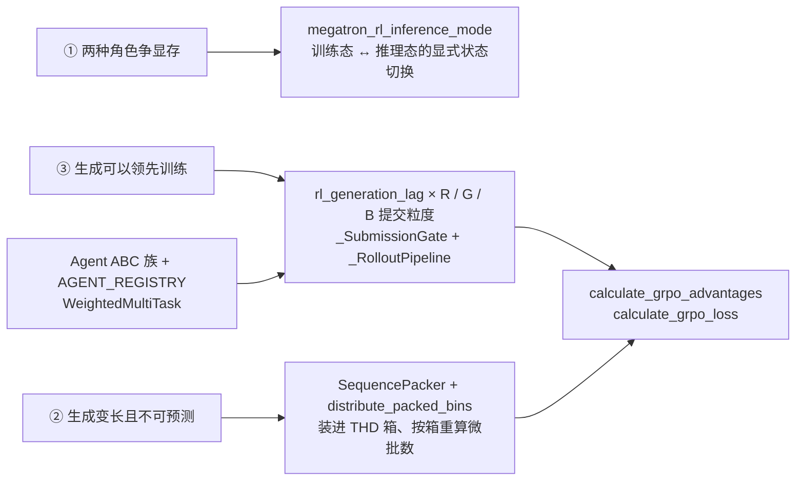
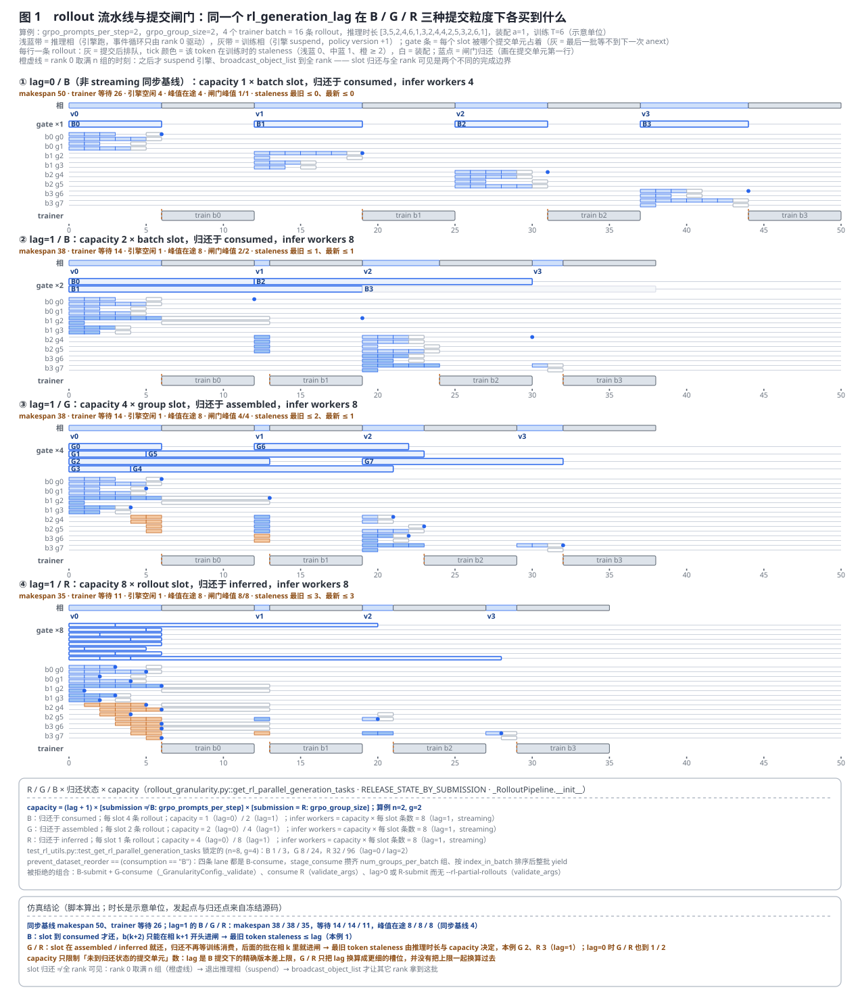
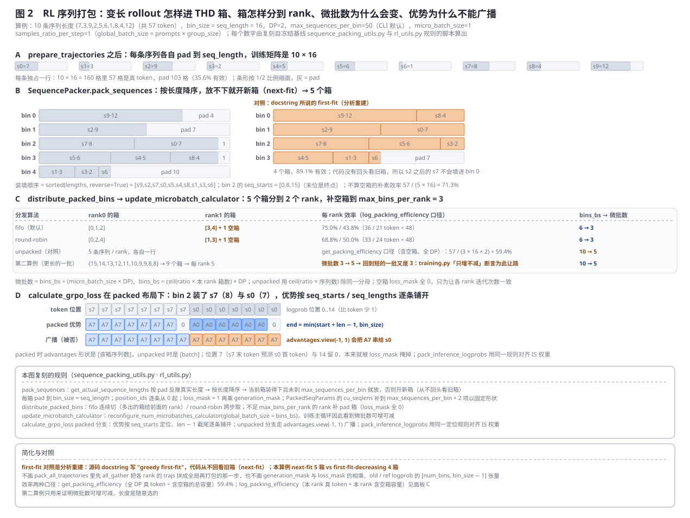
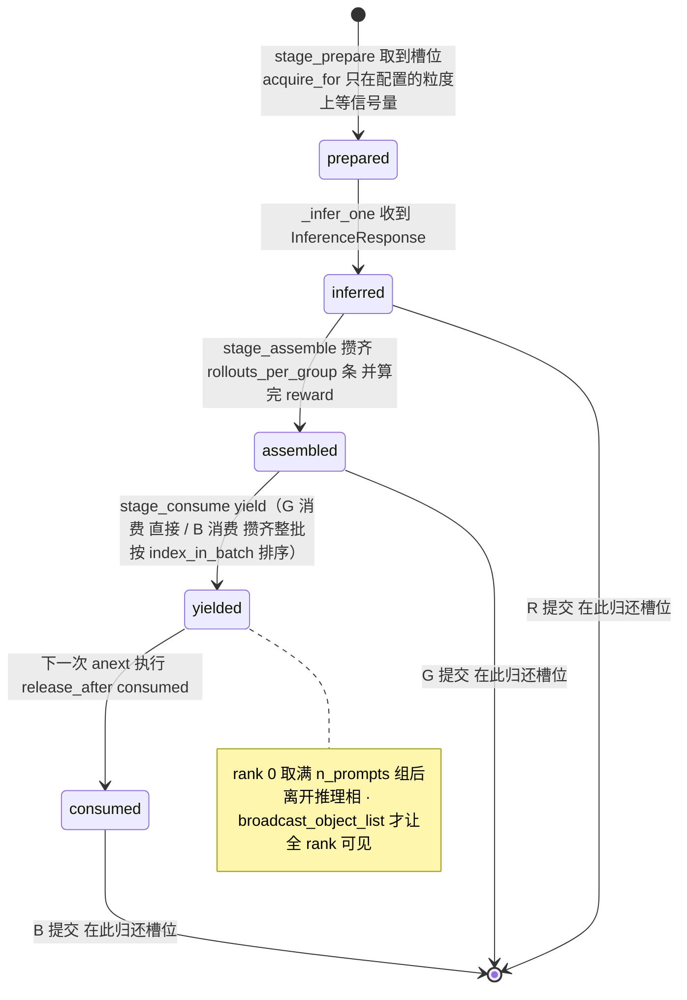
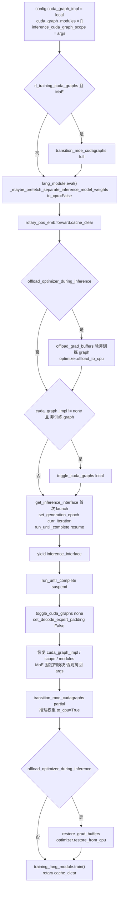
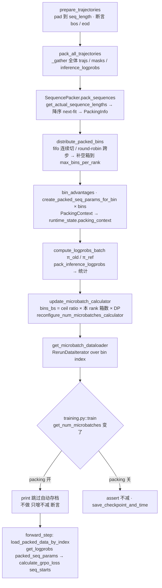
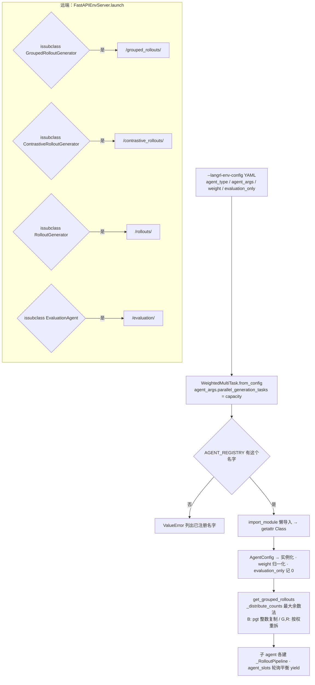

# Megatron-LM RL 运行时：同一批 GPU 轮流做推理与训练的实现层

> **源码基线**：`NVIDIA/Megatron-LM@85902ef599ea4eb06ada7567a479c524b605767a`（`dev`，2026-09-01）
> **主题**：`megatron/rl` 怎样把「同一批 GPU 轮流扮演推理与训练」这条结构约束做成运行时：策略陈旧度上限（`rl_generation_lag`）与调度计量单位（R / G / B 提交粒度 × GRPO 尺寸）的分离、prepare / infer / assemble / consume 四阶段流水线与三种归还状态、GRPO 目标（组内标准化、四项损失、IS 修正）、把变长 rollout 装进 THD 箱的序列打包与它对训练主循环不变量的外溢、`megatron_rl_inference_mode` 的显存腾挪（optimizer offload、独立推理权重的 UVM / torch_memory_saver 双后端、KV cache 三种处置、CUDA graph 形态、rotary LRU 隔离）、Agent 契约面（能力继承 → 端点、注册表白名单、多任务加权），以及可观测性、约束与 39 个手写 argparse flag 的配置契约。核心代码在 `megatron/rl/`、`train_rl.py` 与 `megatron/training/training.py` 的 RL 分支。
> **适用范围**：`megatron/rl` 的运行时实现层。训推一致性的算法层（refit、`inference_optimized`、logprob 重算正确性、IS 偏差分析）归 [[30_megatron_rl_posttraining_consistency_analysis]]；推理引擎本体（KV cache、连续批处理、suspend / resume 的内部）归 [[31_megatron_inference_engine_analysis]]；core 侧打包调度器归 [[29_megatron_packed_dataset_dynamic_cp_analysis]]；进程组机制归 [[17_megatron_parallelism_orchestration_analysis]]；CUDA graph 本体归 [[23_megatron_precision_cudagraph_fusion_analysis]]。
> **最近更新**：2026-09-09。按房子形状重写：§2 只讲原理与两张生成图，§3 单独讲代码流程与状态转移；新增闸门 capacity 与流水线的离散事件仿真、序列打包的逐格复刻、2026-03 以来 27 个提交的机制解释；更正 `pack_sequences` 的算法名、推理侧进程组的活入口与 `verify_model_weights_swap` 的触发频率。

---

## 1. 特性概览

### 1.1 问题背景

预训练的 step 当然不是纯函数——它推进参数、optimizer、scheduler、RNG 与 data iterator——但它的**训练样本**在 step 之前就由数据管线备好了，不依赖当前策略。RL 后训练的一次迭代必须先**生成数据**：拿当前策略跑若干条 rollout、算出奖励，才有东西可训。在 Megatron 的典型共置路径里，同一批 GPU 先扮演推理引擎、再扮演训练器（训练 CP>1 时会自动建一份 CP=1 的独立推理模型，非共置的 `rank_offset` 网格与跨 rank-set refit 归 [[30_megatron_rl_posttraining_consistency_analysis]]）。这带来三个预训练里没有的运行时问题：(1) **两种角色争显存**——训练态要持有 optimizer 状态与梯度缓冲，推理态要持有 KV cache、独立推理权重与推理 CUDA graph；(2) **生成变长且不可预测**——一条 rollout 生成多少 token 事先不知道，而训练要规整的 batch；(3) **生成可以领先训练**——严格同步（整批推完才训、训完才推）让推理引擎在训练相空转、让 trainer 在推理相空转，但领先太多就是 off-policy，策略梯度不再无偏。`megatron/rl` 的结构就是这三个问题的答案，本页按这个顺序展开。

### 1.2 解决方法

三个问题各对应一个决定性设计，GRPO 目标是这条数据流的终点，Agent 协议是环境侧的契约面：



- **状态切换**：`megatron_rl_inference_mode` 是一个上下文管理器，进入时把训练态换成推理态（eval、清 rotary LRU、offload optimizer 与梯度缓冲、把 CUDA graph 配置切到推理形态、把独立推理权重取回 GPU、`resume` 引擎），退出时反向做一遍；optimizer 的回搬被推迟到 logprob 重算之后（#4235）。
- **序列打包**：`prepare_trajectories` 先把每条轨迹各自 pad 到 `seq_length`；开 `--rl-use-sequence-packing` 后，`SequencePacker.pack_sequences` 按长度降序把它们装进 `bin_size = seq_length` 的箱，`distribute_packed_bins` 按 `fifo` / `round-robin` 分到 DP rank 并补空箱，`update_microbatch_calculator` 用箱数重算微批数——训练主循环为此放弃「微批数只增不减」的断言。
- **陈旧度与调度计量分离**：`--rl-generation-lag` 只回答「生成最多领先 trainer 几个 batch」；`--rl-submission-granularity` 把这个 batch 数换算成 gate capacity（batch / group / rollout 槽位），`RELEASE_STATE_BY_SUBMISSION` 决定槽位在 `inferred` / `assembled` / `consumed` 哪个状态归还；`--rl-consumption-granularity` 决定训练侧按组还是按批取数。
- **GRPO 目标**：组内标准化优势（分母加 `1e-4`，多轮轨迹把奖励复制到每一轮）、四项损失（PPO 裁剪、$k_3$ 形式的 KL、熵、只截上界的 IS 权重），并在 packed / unpacked 两种布局下分别铺开优势。
- **Agent 契约面**：能力用 ABC 继承表达，`FastAPIEnvServer.launch` 按 `issubclass` 条件注册端点；`AGENT_REGISTRY` 是 9 个名字的白名单（#5744 用它替换了能从任意 `.py` 路径 `exec_module` 的加载器）；`WeightedMultiTask` 用最大余数法在多任务间分配组数与槽位。

### 1.3 收益、开销和约束

| 维度 | 直接收益 | 必付成本或边界 |
|---|---|---|
| 推理 / 训练重叠 | 算例里 lag=1 把 makespan 从同步基线的 50 压到 38 / 38 / 35（B / G / R），trainer 等待从 26 降到 14 / 14 / 11（§2.3） | 只有 B 提交把 lag 当成精确的版本差上限；G / R 的归还不再等训练消费，最旧 token 的 staleness 由推理时长与 capacity 决定，本例到 2 / 3；`lag>0` 与 R 提交都要求 `--rl-partial-rollouts` |
| 在途并发 | capacity 是算出来的：$(\mathrm{lag}+1)\times[\mathrm{sub}\neq B:\ n]\times[\mathrm{sub}=R:\ g]$，infer worker 数与 HTTP 连接上限随之定 | 峰值在途 rollout 从 4 变成 8，推理引擎的 KV cache 与 `MegatronLocal` 的 httpx 连接池都按这个上限配 |
| 打包效率 | 算例 10 条序列 pad 后有效 35.6%，打包后按 `get_packing_efficiency` 口径 59.4%；微批数从 5 降到 3 | `micro_batch_size` 必须为 1；各 rank 补空箱对齐迭代次数；`training.py` 跳过微批数断言与自动存档；`pack_sequences` 是 next-fit 而非 docstring 说的 first-fit，本例多用一个箱 |
| 显存 | optimizer 与梯度缓冲在推理相下 CPU；独立推理权重空闲时 offload；KV cache 可 offload / recompute；推理侧只物化最后一个 token 的 logit（#4551） | 每次进出推理相都要搬运；`--rl-verify-model-weights-swap` 每次 refit 后多两次调试前向；rotary LRU 必须双向清 |
| 环境可插拔 | agent 只实现能力 ABC，端点自动生成；YAML 只能写白名单里的名字 | 远端 `FastAPIEnvServer` 拒绝 R 提交与 streaming；GRPO 组必须等大；`ReturnsLogProbs` 在基线里没有实现者 |

本页复用的记号：$n$ = `grpo_prompts_per_step`（每个 trainer batch 的组数），$g$ = `grpo_group_size`，$\mathrm{lag}$ = `rl_generation_lag`，$\mathrm{sub}\in\{R,G,B\}$ = 提交粒度，$\mathrm{con}\in\{G,B\}$ = 消费粒度。

---

## 2. RL 运行时详细方案

本节只讲原理。函数名只在必须点名配置旋钮或选择点时出现；hook、调用顺序、状态转移与守卫全部放到 §3。

### 2.1 共用算例

两张图共用两个算例，每个数字都由 `tools/figs/svg/megatron_rl_runtime_figures.mjs` 里复刻自冻结基线的规则算出。**流水线**：`grpo_prompts_per_step = 2`、`grpo_group_size = 2`，4 个 trainer batch 共 16 条 rollout，推理时长依次为 `[3, 5, 2, 4, 6, 1, 3, 2, 4, 4, 2, 5, 3, 2, 6, 1]`（示意单位），每组装配 `a = 1`，一次训练 step `T = 6`；四条 lane 分别是 lag=0 / B（非 streaming 同步基线）、lag=1 / B、lag=1 / G、lag=1 / R，另算 lag=0 的 G / R 做对照。**打包**：10 条序列长度 `{7, 3, 9, 2, 5, 6, 1, 8, 4, 12}`（共 57 token），`bin_size = 16`，`DP = 2`，`max_sequences_per_bin = 50`（CLI 默认），`micro_batch_size = 1`，`samples_ratio_per_step = 1`；第二算例 `{15, 14, 13, 12, 11, 10, 9, 9, 8, 8}` 只用来证明微批数也会增。

### 2.2 变体从哪里来：三个选择点

**提交 / 消费粒度。** `megatron/rl/rollout_granularity.py` 用两个 `Literal` 定义整个设计空间：`SubmissionGranularity = Literal["R", "G", "B"]`、`ConsumptionGranularity = Literal["G", "B"]`，配一个 `ReleaseState = Literal["inferred", "assembled", "consumed"]` 与映射表 `RELEASE_STATE_BY_SUBMISSION = {R: inferred, G: assembled, B: consumed}`。两个 `Literal` 不构成任意笛卡尔积：`_GranularityConfig._validate` 拒绝 B-submit + G-consume，并暂时完全拒绝 `filter_groups_with_same_reward`（源码给的理由：丢掉的组不会再生成，非 streaming 调用方会少收组、按批消费的消费者会卡在不完整的批上）；`validate_args` 要求 `lag>0` 与 R 提交都必须开 `--rl-partial-rollouts`，并拒绝 `--rl-consumption-granularity R`；远端 `FastAPIEnvServer.get_grouped_rollouts` 再拒绝 R 提交与 streaming，所以最细的 R 流水只在本地 agent 路径上活着。

**Agent 能力。** `megatron/rl/agent/api.py` 的 ABC 族：`Agent`（基类，唯一抽象方法 `get_rollout_response`）、`RolloutGenerator`、`ContrastiveRolloutGenerator`、`TokenizedRolloutGenerator`、`GroupedRolloutGenerator`（`prepare_group_rollout` 抽象 + 基类实现的 `get_grouped_rollouts`）、`EvaluationAgent`。选择点在 `fastapi_env_server.py::FastAPIEnvServer.launch` 的四个 `issubclass` 分支，以及 `registry.py::AGENT_REGISTRY` 的 9 个名字（`RemoteAgent`、`CountdownAgent`、`OpenMathInstructAgent`、`BigMathAgent`、`DAPOAgent`、`GSM8KAgent`、`AIMEAgent`、`NemoGymAgent`、`AceMathAgent`）；训练入口 `get_agent` 只会构造 `WeightedMultiTask`，它把 YAML 里的每个条目按名字解析。

**推理接口与部署。** `inference_interface.py` 声明 `ReturnsRaw` / `ReturnsTokens` / `ReturnsLogProbs` 三个 mixin；`MegatronLocal(InferenceServer, ReturnsTokens, ReturnsRaw)` 是本地引擎，`inference_interface_server.py::InferenceInterfaceServer` 是远端版本；`ReturnsLogProbs` 在基线里只有定义、没有实现者或运行时检查。部署形态由 `training.py` 决定：四个 `--rl-inference-*-model-parallel-size` 任一非空或训练 CP>1，就用 `megatron/core/inference/shards.py::build_inference_pg_collection`（两套 `HyperCommGrid`，decoder 与 expert 各一）建独立推理模型，权重从 UVM mempool 或 `torch_memory_saver.region(tag="rl_inference_model")` 分配；否则共享训练模型。KV cache 处置 `--rl-kv-cache-management-mode {persist, offload, recompute}`、打包分发 `--rl-sequence-packing-algo {fifo, round-robin}`、CUDA graph 形态 `--rl-persist-cuda-graphs` / `--rl-training-cuda-graphs` 都是 argparse `choices` 或布尔量，§2.6 / §2.7 逐个展开。

### 2.3 陈旧度上限与调度计量分离（图 1）

**要解决什么。** 「生成可以领先训练多少」是一个策略问题（off-policy 程度），「同时向推理引擎提交多少工作」是一个调度问题（并发、KV cache 占用、装配延迟）。基线之前它们被揉在三个互斥 flag 里（`--rl-num-parallel-generations` / `--rl-num-parallel-generation-batches` / `--rl-generation-batch-size`，由 `validate_args` 一段五十行的解析互相换算）；#5306 把它们收成一个 `--rl-generation-lag` 加两个粒度 flag。

**变换。** `get_rl_parallel_generation_tasks` 只做一件事：把「允许领先的 batch 数」换算成闸门容量

$$
\mathrm{capacity} = (\mathrm{lag}+1)\times[\mathrm{sub}\neq B:\ n]\times[\mathrm{sub}=R:\ g],
$$

其中方括号是 Iverson 记号。算例 $n=g=2$ 下 B 提交 capacity 为 1（lag=0）/ 2（lag=1），G 为 2 / 4，R 为 4 / 8；`tests/unit_tests/rl/test_rl_utils.py::TestRLUtils::test_get_rl_parallel_generation_tasks` 锁定的 $(n, g) = (8, 4)$ 在 lag=0 / 2 下是 1 / 3、8 / 24、32 / 96。闸门是一个 `asyncio.Semaphore(capacity)`，只在**配置的那一档**粒度上 acquire；infer worker 数 = capacity × 每提交单元的 rollout 条数，非 streaming 时再 `min` 到 `num_groups × rollouts_per_group`。`WeightedMultiTask` 把这个数分给子 agent 时也按粒度区分：B 模式 capacity 计量的是各 agent 本地的在途 batch，于是整数复制给每个活跃 agent；G / R 模式计量的是细粒度工作单元，按权重拆分。`MegatronLocal.launch` 的 httpx 连接池上限 `max_connections = n × g × capacity` 也跟着这个换算走。



图 1 的四条 lane 用同一组推理时长跑同一个仿真：浅蓝带是推理相（事件循环只由 rank 0 驱动），灰带是训练相（引擎 suspend，policy version +1）；每行一条 rollout，tick 的颜色是**该 token 在训练时的 staleness**（`prep_wandb_metrics` 的口径：`current_iteration − policy_epoch`，最旧 token 用 `r[0]`、最新 token 用 `r[-1]`）；蓝点是闸门归还；橙虚线是 rank 0 取满 $n$ 组的时刻。仿真结论：同步基线 makespan 50，trainer 等待 26；lag=1 的 B / G / R makespan 38 / 38 / 35，等待 14 / 14 / 11，峰值在途 rollout 从 4 变成 8。**图要证的结论**是 lag 上限与粒度换算的关系并不像 flag 名字暗示的那样简单：B 提交下 slot 到 `consumed` 才归还、下一批只能在下一相开头进闸，所以最旧 token 的 staleness 最大为 1（= lag）；G / R 提交下 slot 在 `assembled` / `inferred` 就归还，归还不再等训练消费，后面的批在当前相里就进闸，最旧 token 的 staleness 由推理时长与 capacity 决定——本例 G 到 2、R 到 3，而 lag=0 时 G / R 也到 1 / 2。换句话说，capacity 只限制「未到归还状态的提交单元」的个数；`rl_generation_lag` 是 B 提交下的精确版本差上限，G / R 只把它换算成更细的槽位，没有把上限一起换算过去。这是从冻结源码的归还语义推出的仿真结果，源码自己没有写出这条边界。

**被否掉的替代方案。** (a) 用输出队列的 `maxsize` 做背压——源码在 `_RolloutPipeline.__init__` 的注释里明确否掉：有界队列会成为第二道背压，悄悄把 `--rl-generation-lag` 配置的领先量夹住；流控必须完全归闸门。(b) 保留三个互斥 flag——它们编码的仍是「领先几批 × 每批几组」两个自由度，却要在 `validate_args` 里互相推导并派生 `enforce_order`；收成 lag + 粒度后，`validate_args` 只剩四条 assert（分析重建：#5306 的提交信息没有陈述动机）。

**代价与失效条件。** capacity 是上限不是实测并发；细粒度换来更高的引擎利用率，代价是 staleness 不再由 lag 精确封顶（见上）。远端环境（`RemoteAgent` → `FastAPIEnvServer`）不支持 R 提交与 streaming，只能走 B 或 G 的非 streaming 路径。

### 2.4 三阶段流水线与三种归还状态

**要解决什么。** 一条 rollout 从「被提交」到「被训练消费」经过三个不同的完成状态：推理返回（`inferred`）、组内齐了并算完 reward（`assembled`）、整批按序交给训练（`consumed`）。粒度越细，这些状态之间的距离越远——R 提交时一条 rollout 推理完就该把槽位让给下一条，B 提交时整批没被消费前槽位就不能复用，否则 lag 失去意义。

**变换。** `_RolloutPipeline` 把工作项推过 prepare → infer → assemble → consume（#5491 把原来一个 `generate_task` 闭包拆成这四段）：prepare 按 B → G → R 的嵌套顺序 acquire（只有配置的那一档真的等信号量），为每组调一次 `prepare_group_rollout` 拿到推理请求与 `build_rollout` 闭包，再为组内每条 rollout 发一个 `_InferWorkItem`；infer 是一个持久 worker 池，每条 rollout 推理返回后立即以 `inferred` 状态归还；assemble 攒齐一组、按 `rollout_idx` 排序、并发跑 `build_rollout`（算 reward），以 `assembled` 归还；consume 在 G 消费时按完成顺序直接 yield，在 B 消费时按 `batch_id` 缓冲、攒齐 `num_groups_per_batch` 组后按 `index_in_batch` 排序整批 yield，然后以 `consumed` 归还——注意这次归还发生在整批 yield 之后的下一次 `anext`，也就是下一个推理相的开头（图 1 lane ② 里 B0 的蓝点落在相 1 开头）。`prevent_dataset_reorder` 精确等于 `consumption == "B"`：它拥有的是**消费端的批序恢复**，不是全局确定性；`tests/unit_tests/rl/test_grouped_rollouts.py::TestGroupedRollouts::test_get_grouped_rollouts` 的 `batch_consume_submission_order` 与 `group_consume_completion_order` 两个参数化用例分别锁定这两种顺序。

**被否掉的替代方案（分析重建，源码沉默）。** 统一在 `consumed` 归还：G / R 的 capacity 会退化成「整批数 × 每批单元数」，细粒度失去意义——一条推理完的 rollout 仍占着槽位，直到整批被消费。统一在 `inferred` 归还：B 提交下批的槽位在推理完就空出，下一批立刻进闸，lag 不再对应任何训练侧事件，`rl_generation_lag` 的语义（「in-flight trainer batches = lag + 1」）无法成立。按提交粒度选归还状态，是让「一个槽位」始终对应「一个尚未走到该粒度自然终点的提交单元」。

**完成边界。** 槽位归还不等于数据可见。真实边界在流水线之外：rank 0 在推理相里对生成器 `anext` 取满 $n$ 组（确定性模式下按 `problem_id` 排序），非 streaming 时还要把生成器耗尽（`assert False, "Unexpected group left in generator."` 是守卫），然后退出推理相（`suspend` 引擎），再由 `broadcast_object_list` 把同一组 rollouts 发到所有 rank——函数返回才表示本轮训练输入对全 rank 可见。streaming 时生成器跨迭代复用（`_ROLLOUT_GENERATOR` 全局缓存），非 streaming 时每次调用新建一条流水线。

**代价与失效条件。** `filter_groups_with_same_reward` 在基线里是 assert 拒绝的死代码（assemble 阶段的 `keep` 恒为真），因为丢组后没有再生成会让 B 消费者卡死；#3964 修过一个非 streaming 的 bug——旧的循环上界写成了 `parallel_generation_tasks` 而不是 `num_groups`，非 streaming 请求会少生成组。

### 2.5 GRPO 目标：优势、四项损失与两种布局

**组内标准化。** `calculate_grpo_advantages(rewards, num_turns)` 用同一 prompt 的一组回答互相做基线，不需要 value 网络：

$$
A_i = \frac{r_i - \operatorname{mean}(r_{\mathrm{group}})}{10^{-4} + \operatorname{std}(r_{\mathrm{group}})} .
$$

分母的 `1e-4` 防除零：一组回答奖励全同（全对或全错）时标准差为 0，优势应趋近 0 而不是 NaN。多轮轨迹要多做一步——docstring 写明「`[[a,b],[c,d,e]]` 这条轨迹奖励 1.0，更新时 `[a,b]` 与 `[c,d,e]` 都拿 1.0」：实现先按组求 `num_turns.sum(axis=-1)` 得到每组总轮数，用它 `repeat` 均值与标准差，再把奖励按 `num_turns.flatten()` 展开。代码里留着一条自陈的限制：「Making an assumption that all groups are of the same size! @vitalyk: this will go away when we start sending env-based sample reqs.」——**当前实现要求组等大**，没有 assert 守卫，组不等大时是 numpy 广播错误而不是明确报错（未验证）。

**四项损失。** `calculate_grpo_loss` 返回

$$
\mathcal{L} = -\,w_{\mathrm{IS}}\cdot\min\!\left(\rho A,\ \bar{\rho} A\right) + \beta_{\mathrm{KL}}\, k_3 - w_{H}\, H ,
$$

其中 $\rho = \exp(\log\pi_\theta - \log\pi_{\mathrm{old}})$，$\bar\rho = \operatorname{clip}(\rho,\ 1-\epsilon_{\mathrm{low}},\ 1+\epsilon_{\mathrm{high}})$（`--grpo-clamp-eps-lower` / `--grpo-clamp-eps-upper`，DAPO 式的上下不对称；vanilla GRPO 把两者设成一样），$k_3 = e^{d} - d - 1$，$d = \log\pi_{\mathrm{ref}} - \log\pi_\theta$（`--grpo-kl-beta`），$H = -\pi_\theta\log\pi_\theta$ 逐 token（`--grpo-entropy-term-weight`），$w_{\mathrm{IS}} = \exp(\log\pi_{\mathrm{old}} - \log\pi_{\mathrm{inf}})$ 只在 `--rl-inference-logprobs-is-correction` 开启时启用，`--rl-importance-sampling-truncation-coef` 给出时用 `torch.min` **只截上界**。KL 用 $k_3$ 而不是直接的 $d$：由 $e^d \ge 1 + d$ 知逐 token 项恒非负，直接的 $d$ 可正可负——源码证明的是所选公式，「为何偏好非负逐样本惩罚」是本文分析。裁剪命中率（`truncated_from_above` / `truncated_from_below`）被显式返回供 `train_rl.py::loss_func` 汇总，是策略漂移的诊断信号之一，但不能单独等同于 policy-version lag。$w_{\mathrm{IS}}$ 的两个输入揭示它修正的边界：训练侧重算的 $\pi_{\mathrm{old}}$ 与 rollout 返回的 $\pi_{\mathrm{inf}}$ 之差，来自 kernel、精度或并行布局的差异；偏差分析归 [[30_megatron_rl_posttraining_consistency_analysis]]。

**两种布局。** 同一个函数处理两种张量形状：unpacked 是 `[batch, seq]`、优势 `[batch,]`，直接 `advantages.view(-1, 1)` 靠广播；packed 是 `[1, bin_size]`、优势 `[num_sequences_in_bin,]`，按 `seq_starts` / `seq_lengths` 逐条写进 `packed_advantages[0, start:end]`，`end = min(start + len − 1, bin_size)`——logprob 比 token 少 1。图 2 面板 D 用算例里 bin 2 装了 s7（8）与 s0（7）演示：`seq_starts = [0, 8, 15]`（末位是终点），s7 的优势占位置 0–6、s0 占 8–13，位置 7 与 14 留 0（本来就被 `loss_mask` 掩掉）；若照 unpacked 那样广播，s7 的优势会串到 s0 的所有 token 上。`pack_inference_logprobs` 用同一套定位规则把推理侧 logprob 对齐到箱里，`compute_packed_inference_logprobs_stats` 与 `align_unpacked_inference_logprobs` 分别在两种布局下算 $\pi_{\mathrm{old}}/\pi_{\mathrm{inf}}$ 的 min / max / mean 与绝对差（后者有 `assert all(abs_diffs <= 1.0)`）。

**staleness 的度量。** #3580 把「推理侧累加的 staleness 计数器」反转成「引擎给每段 token 盖的 `policy_epoch` / `kv_cache_epoch` 戳」（`(start, epoch)` 元组列表，随 `InferenceResponse` 回到 rollout），staleness 在训练侧记录指标时按 `current_iteration − epoch` 算；#4097 再把每条 rollout 的最旧 / 最新 token staleness 与逐 token 直方图加进 wandb 表。这样度量不依赖推理与训练的相对时钟，只依赖 `set_generation_epoch(curr_iteration)` 在进入推理相时打的戳。

### 2.6 序列打包（图 2）与它对训练主循环不变量的外溢

**要解决什么。** `prepare_trajectories` 把每条轨迹 pad 到 `seq_length`，算例 10 条序列共 57 个真 token 却要占 10 × 16 = 160 格（35.6% 有效）。打包的目标是把多条短序列装进同一行，用 THD 布局（`PackedSeqParams` 的 `cu_seqlens`）让注意力不跨序列泄漏。



**变换。** `SequencePacker.pack_sequences` 先用 `get_actual_sequence_lengths` 按 pad token 反推真实长度，按长度降序逐条放：当前箱装得下且未到 `max_sequences_per_bin` 就放，否则开新箱，**从不回头看旧箱**——docstring 写的是「greedy first-fit」，代码是 next-fit（decreasing）。算例的装填顺序 `[s9, s2, s7, s0, s5, s4, s8, s1, s3, s6]` 得到 5 个箱：bin 0 = {s9}，bin 1 = {s2}，bin 2 = {s7, s0}，bin 3 = {s5, s4, s8}，bin 4 = {s1, s3, s6}，装填量 12 / 9 / 15 / 15 / 6，不算空箱的朴素效率 71.3%；真正的 first-fit-decreasing 只需 4 个箱（89.1%），因为 s2 之后的 s7 可以回填进 bin 0——这条对照是分析重建。每箱 pad 到 `bin_size`，`position_ids` 每条序列从 0 重数，`loss_mask` 先置 1 再乘 `generation_mask`；`create_packed_seq_params_for_bin` 把 `cu_seqlens` 补到 `max_sequences_per_bin + 2` 项以固定形状（CUDA graph 签名一致性）。`distribute_packed_bins` 再把箱分到 DP rank：`fifo` 连续切、多出的箱给前面的 rank，本例 rank0 拿 [0, 1, 2]，rank1 拿 [3, 4] 再补 1 个空箱；`round-robin` 跨步取，rank0 拿 [0, 2, 4]，rank1 拿 [1, 3] 再补 1 个空箱；空箱 `loss_mask` 全 0，只为让各 rank 迭代次数一致。效率有两个口径：`get_packing_efficiency` 是全 DP 真 token ÷ 含空箱的总容量 = 57 / (3 × 16 × 2) = 59.4%；`log_packing_efficiency` 是本 rank 真 token ÷ 本 rank 含空箱容量，fifo 下两 rank 是 75.0% / 43.8%，round-robin 下是 68.8% / 50.0%——round-robin 换来的是 rank 间更均衡的装载。

**外溢到训练主循环。** 打包之后「一个样本」变成「一个箱」，`update_microbatch_calculator` 用 `bins_bs = ceil(samples_ratio_per_step × 本 rank 箱数) × DP` 调 `reconfigure_num_microbatches_calculator`，微批数 = bins_bs ÷ (`micro_batch_size` × DP)：算例 bins_bs = 6 → 3 个微批，unpacked 时是 10 → 5，第二算例 `{15, 14, 13, 12, 11, 10, 9, 9, 8, 8}` 装成 9 个箱、每 rank 5 → 10 → 5。微批数随每批 rollout 的长度分布**可增可减**。`megatron/training/training.py::train` 原本有一条不变量：微批数只能增不能减（`assert get_num_microbatches() > num_microbatches`，「Number of microbatches should not decrease」），否则就是 batch size ramp-up，要自动存档；`args.rl_use_sequence_packing or args.sequence_packing_scheduler is not None` 时它跳过断言与自动存档，只打印一行。这是一处真实的抽象泄漏——`megatron/rl` 的一个 flag 改变了 `megatron/training` 主循环的不变量，想读懂打包路径下的微批语义只看 `training.py` 不够。#4411 把 `rampup_batch_size` 参数从 `update_microbatch_calculator` 与两处 `reconfigure_num_microbatches_calculator` 调用里去掉（rampup 调度器被自定义 step batch size schedule 取代），打包路径从此只交 `global_batch_size` 一个量。

**被否掉的替代方案。** (a) 不打包、逐条 pad（基线里仍活着的默认路径）：本例 35.6% 有效 token，所有微批形状固定；这是实现最简单、效率最差的一档。(b) docstring 所说的 first-fit：本例少一个箱，但代码没有实现（分析重建；源码沉默于为何写成 next-fit）。(c) 不设 `max_sequences_per_bin`：源码注释说上限是「to prevent extreme imbalance」——一箱塞太多短序列会让 `cu_seqlens` 形状与注意力工作量极不均衡。

**代价与失效条件。** `validate_args` 强制 `micro_batch_size == 1`；每次 rollout 收集都 all_gather 全体 trajs 再打包（`pack_all_trajectories` 的 `_gather`），打包本身在每个 rank 上重复算一遍；空箱是纯浪费，DP 越大、箱数越不整除，浪费越多；#3551（2026-02）修过 packed logprob 的 off-by-2。

### 2.7 训推态切换的显存腾挪

**要解决什么。** 共置时训练态与推理态各有一套只在自己那一相有用的状态：训练态是 optimizer 状态、梯度缓冲、训练 CUDA graph 与 rotary 频率缓存；推理态是 KV cache、独立推理权重（若有）、推理 CUDA graph 与另一份 rotary 缓存。切相时不是「调 `model.eval()`」，而是把不在当前相的状态显式腾出去、把该相的状态显式请回来。

**变换。** `megatron_rl_inference_mode` 进入时：把 `cuda_graph_impl` 置为 `local`、`cuda_graph_modules` 置空、`inference_cuda_graph_scope` 取 `args.inference_cuda_graph_scope`（#4292 / #4293 把旧的 `cuda_graph_scope` 拆成 full-iteration impl、inference scope、per-layer capture modules 三个量；#4323 之前这里被硬写成空列表，覆盖了用户的推理 scope）；MoE 且 `--rl-training-cuda-graphs` 时 `transition_moe_cudagraphs(full)`；`eval()`；把独立推理权重取回 GPU；清 rotary LRU；`no_grad` 下 offload optimizer 与梯度缓冲（`--rl-training-cuda-graphs` 时梯度缓冲不 offload，只 warning——训练 graph 捕获了它的地址）；非训练 graph 时 `toggle_cuda_graphs(local)`；给引擎打 `set_generation_epoch(curr_iteration)` 戳；`resume` 引擎。退出时反向：`suspend` 引擎、`toggle_cuda_graphs(none)`、重置推理 decode 泄漏的 `drop_and_pad` 专家 padding（#3373）、恢复训练的 graph 配置（MoE 固定为 `mamba / attn / moe_router / moe_preprocess` 四个模块，否则拷回 `args.cuda_graph_modules`）、MoE 切回 `partial`、把独立推理权重送回 CPU、恢复梯度缓冲与 optimizer、训练模型 `train()`、再清一次 rotary LRU。三处细节值得单独说：

- **rotary LRU 必须双向清。** vanilla `RotaryEmbedding.forward` 带 `lru_cache`；源码注释明说复用推理相缓存的频率张量会破坏 RL 训练。因此进入与退出都 `cache_clear()`——这是双向的状态隔离，不只是回收显存。
- **optimizer 的回搬推迟到 logprob 之后。** #4235 把 `restore_from_cpu` 从 `get_environment_rollouts` 末尾搬到 `get_grpo_data_iterator` 里 `prepare_data_for_update` 之后（`optimizer_is_on_cpu` 参数）：$\pi_{\mathrm{old}}$ 与 $\pi_{\mathrm{ref}}$ 的重算是纯前向，不需要 optimizer；把它留在 CPU 上给前向让出显存。被否的替代（基线之前的代码）是一出推理相就搬回来。
- **独立推理权重的两个后端。** `--rl-inference-model-unified-memory-level=1` 时权重从 UVM mempool 分配，空闲时 `advise_managed_module_parameters_preferred_location` + `prefetch_managed_module_parameters` 到 CPU（只有参数，`register_buffer` 出来的 buffer 不走 UVM）；否则用 `torch_memory_saver.pause / resume(tag)`，用一个模块级 `_INFERENCE_MODEL_IS_PAUSED` 防重复搬运，#3567 给它加了前后显存摘要日志。两者都由 `--rl-offload-inference-model-weights-when-idle` 门控，没有独立推理模型时 `training.py` 直接 `ValueError`。

**第三方边界。** KV cache 的三种处置与 CUDA graph 的删除 / 重捕是**引擎**的行为：本页只证明 `get_dynamic_inference_engine` 把 `kv_cache_management_mode = args.rl_kv_cache_management_mode`、`static_kv_memory_pointers = args.rl_persist_cuda_graphs` 交给了 `InferenceConfig`，以及 `MegatronLocal.suspend / resume` 通过 coordinator 驱动引擎经过 `PAUSED → SUSPENDED` / `RESUMED` 状态（#3563 把原来等 `stopped` / `paused` 事件的写法换成 `wait_until(EngineState.*)`）；引擎在 `offload` 下把 KV 张量 storage 缩到 0 并备份到 CPU、在 `recompute` 下删掉再从头 `initialize_all_tensors` 并重置部分 prefill 过的请求，归 [[31_megatron_inference_engine_analysis]] §4.2。`torch_memory_saver` 与 UVM 分配器是本仓之外的依赖，本页只陈述交出去的 tag 与 device 参数。`validate_args` 用四条 assert 把这些组合钉住：`--rl-persist-cuda-graphs` / `--rl-training-cuda-graphs` 都要求 `cuda_graph_impl != "none"`；persist 而 KV 非 persist 时要么 UVM 要么装了 `torch_memory_saver`（静态指针的来源）；`offload` 模式要求 persist CUDA graph（重捕会跑 dummy forward 污染保留的 KV），且与 UVM 互斥。

**`--rl-verify-model-weights-swap` 每次都跑。** 帮助文本写「on the first swap」，但 `get_environment_rollouts` 的调用链没有 once-only 守卫：只要开着，每次 `swap_model_weights` 后都对训练与推理模型各跑一次前向并 `allclose(atol=0.1, rtol=5e-4)`。权重搬运出错是最难查的一类 bug——训练不崩、loss 不炸，只是悄悄用了错的权重；这道自检换确定性，代价是每次 rollout 收集多两次调试前向，不应理解成只付一次成本。refit 本体归 [[30_megatron_rl_posttraining_consistency_analysis]]。

### 2.8 Agent 契约面

**能力继承 → 端点。** `FastAPIEnvServer.launch` 逐个 `issubclass` 后条件注册：`/grouped_rollouts/` ↔ `GroupedRolloutGenerator`、`/contrastive_rollouts/` ↔ `ContrastiveRolloutGenerator`、`/rollouts/` ↔ `RolloutGenerator`、`/evaluation/` ↔ `EvaluationAgent`。一个 agent 支持什么，它的服务就暴露什么——不实现 `EvaluationAgent` 的 agent 启动后路由表里没有 `/evaluation/`。相比「注册全部端点、在处理函数里再返回不支持」，条件注册把能力边界前移到路由构造（这条取舍是本文分析，不是源码注释）。数据契约是 pydantic 模型（`RolloutRequest`、`GroupedRolloutRequest`、`Rollout`、`TokenRollout`、`RolloutGroup`、`ContrastiveRollout`、`EvaluationRequest`、`EvaluationResult` / `RewardEvaluationResult`、`EvaluationResponse`），基类 `AgentBaseModel` 声明 `extra='allow'`——自定义 agent 可以在标准契约上附加元数据而不必改基类；跨进程多态反序列化靠 `TypeLookupable.register_subclass / unwrap`。

**白名单防 RCE。** `--langrl-env-config` 指向一份用户 YAML；#5744 之前 `import_class` 接受 `path.py:ClassName` 并用 `spec.loader.exec_module` 从任意文件加载，等于允许任意代码执行。基线里 `AGENT_REGISTRY` 是 `dict[str, str]`，`get_agent_class` 只认 9 个名字、按 `module:Class` 懒导入，未知名字 `ValueError` 并列出已知名字。这与 [[41_megatron_config_surface_analysis]] §3.2 的 `TargetAllowlist` 是**同一类防护的两个独立实例**：配置文件里凡是能指定「用哪个类」的地方，都要一道白名单。

**内置 agent 与多任务。** `RewardOnlyAgent(RolloutGenerator, GroupedRolloutGenerator, PassAtEvaluationAgent)` 是训练 rollout 的最小基类：子类实现取数据集、算奖励、取 prompt；#4096 起 `get_reward` 多收一个 `finish_reason`——被 `max_tokens` 截断的回答与正常 `stop` 的回答可以区别计分（`tests/unit_tests/rl/test_rl_agents.py` 用 correct-stop-clean / correct-stop-trailing 等用例锁定）。`_rollout_from_response` 按 `isinstance(interface, ReturnsTokens)` 分支产出 `TokenRollout`（带 token、logprob、`generation_mask` 与 epoch 戳）或 `Rollout`。`WeightedMultiTask._distribute_counts` 用最大余数法分配组数：先取整、再把余数按小数部分从大到小补给各 agent，总数精确等于目标；`evaluation_only` 的 agent 权重记 0。`HFDatasetAgent` 是接 HF 数据集的混入，`RemoteAgent` 把请求转发到远端 `FastAPIEnvServer`。

**推理接口的闭环。** `MegatronLocal` 的 logprob 闭环来自具体实现而非 `ReturnsLogProbs` marker：`launch()` 强制 `args.return_log_probs = True`、`args.skip_prompt_log_probs = True`（#4551，推理侧只物化最后一个 token 的 logit 并跳过 prompt logprob），`base_generate()` 走 OpenAI 兼容 client 请求 `logprobs=True` 并把 `generation_log_probs` 写进 `InferenceResponse.logprobs`，epoch 戳从 `choice.message` 读（#4533）。#3648 把 Flask 前端搬到独立进程（`start_text_gen_server`）并改用共享的 `AsyncOpenAI` + httpx 连接池；#4768 把 `--rl-inference-parsers` 透传给文本生成服务（此前硬编码为空列表）。接入其它 backend 时必须逐实现验证 response，不能仅凭类型名放行。

### 2.9 开销结算

| 项 | 付出 | 换来 | 失效条件 |
|---|---|---|---|
| 闸门与流水线 | 每条 rollout 一个 `asyncio` 任务，B 消费时一份按批缓冲；capacity 决定 KV cache 与连接池上限 | 引擎在训练相之外持续有活；算例 makespan 50 → 38 / 38 / 35 | 远端环境不走本地流水线；G / R 的 staleness 不由 lag 封顶 |
| 三种归还状态 | 一张映射表、三处 `release_after` 调用 | 一个槽位始终对应一个未到自然终点的提交单元 | `filter_groups_with_same_reward` 被禁；组不等大无守卫 |
| 序列打包 | 每次收集 all_gather 全体 trajs、每 rank 重复装箱、空箱、`micro_batch_size = 1` | 有效 token 35.6% → 59.4%，微批 5 → 3 | next-fit 比 first-fit 多用箱；`training.py` 失去微批数不变量 |
| 态切换 | 每次进出各搬一次 optimizer / 梯度缓冲 / 推理权重，两次 rotary 清缓存，可选两次校验前向 | 推理相拿到整卡显存与推理 graph | `--rl-training-cuda-graphs` 下梯度缓冲不能 offload；`offload` KV 与 UVM 互斥 |
| Agent 契约 | 只能用白名单里的 9 个名字；远端只支持 B / G 非 streaming | 端点随能力自动生成；YAML 不再是 RCE 入口 | `ReturnsLogProbs` 无实现者，新 backend 需逐实现验证 |

**这条链在什么条件下失效**：训练 CP>1 但没有为独立推理模型准备显存（它总会被建出来）；`grpo_prompts_per_step` 不能被推理侧 EP 大小整除（`get_environment_rollouts` 的 assert）；`global_batch_size` 大于 $n\times g$（`samples_ratio_per_step ≤ 1` 的 assert）；$n\times g\times$`grpo_iterations` 不是 `global_batch_size` 的倍数。

---

## 3. 代码实现分析

### 3.1 类与所有权

```mermaid
classDiagram
  class Agent { <<ABC>> +get_rollout_response(request, inference_request) }
  class RolloutGenerator { +get_reward_rollouts(request) }
  class ContrastiveRolloutGenerator { +get_contrastive_rollouts(request) }
  class TokenizedRolloutGenerator
  class GroupedRolloutGenerator { +parallel_generation_tasks = 512 +prepare_group_rollout(request) +get_grouped_rollouts(request) }
  class EvaluationAgent { +run_evaluation(request) }
  class RewardOnlyAgent { +get_dataset() +get_reward(response, golden, finish_reason) +get_prompt(validation) }
  class WeightedMultiTask { +agents +weights +latest_distribution +from_config(config, pgt) -_distribute_counts(total) }
  class RemoteAgent
  class FastAPIEnvServer { +launch(env_cls, cls_args, port) +get_grouped_rollouts(request) }
  class _RolloutPipeline { +gate: _SubmissionGate +gran_policy: _GranularityConfig +infer_queue +assemble_queue +output_queue +stage_prepare() +stage_infer() +stage_assemble() +stage_consume() }
  class _SubmissionGate { +capacity +held +acquire_for(granularity) +release_after(state) }
  class MegatronLocal { +base_generate(request) +launch(model) +suspend() +resume() +set_generation_epoch(epoch) }
  class RLRuntimeState { +packing_context +last_collection_iteration +tokens_per_sec +packing_efficiency }
  Agent <|-- RolloutGenerator
  Agent <|-- ContrastiveRolloutGenerator
  Agent <|-- TokenizedRolloutGenerator
  Agent <|-- GroupedRolloutGenerator
  Agent <|-- EvaluationAgent
  RolloutGenerator <|-- RewardOnlyAgent
  GroupedRolloutGenerator <|-- RewardOnlyAgent
  EvaluationAgent <|-- RewardOnlyAgent
  RolloutGenerator <|-- WeightedMultiTask
  GroupedRolloutGenerator <|-- WeightedMultiTask
  ContrastiveRolloutGenerator <|-- WeightedMultiTask
  EvaluationAgent <|-- WeightedMultiTask
  FastAPIEnvServer <|-- RemoteAgent
  GroupedRolloutGenerator <|-- RemoteAgent
  GroupedRolloutGenerator ..> _RolloutPipeline : 每次 get_grouped_rollouts 新建
  _RolloutPipeline *-- _SubmissionGate
  WeightedMultiTask o-- Agent : 子 agent
  MegatronLocal ..> _RolloutPipeline : get_rollout_response 的目标
```



所有权：`_RolloutPipeline` 拥有三条队列与闸门，生命周期等于一次 `get_grouped_rollouts` 调用（streaming 时跨迭代存活，由模块级 `_ROLLOUT_GENERATOR` / `_ROLLOUT_AGENT` 持有，`rl_inference_interface_shutdown` 负责 `aclose`）；`RLRuntimeState`（模块级单例 `get_rl_runtime_state()`）拥有不进 checkpoint 的跨收集状态：`packing_context`、`last_collection_iteration`、吞吐指标；`MegatronLocal` 由 `_INFERENCE_INTERFACE` 全局缓存，只 `launch` 一次；训练循环里的 `buffered_rollouts` 是 `RerunDataIterator`，在 `grpo_iterations × (n·g / global_batch_size)` 个迭代内复用。

### 3.2 调用流程

```text
train_rl.py::main → pretrain(..., forward_step, model_provider)
`-- training.py::train（每个 iteration，perform_rl_step）
    `-- rl_utils.get_grpo_data_iterator(model, inference_model, optimizer, iteration, ref_state_dict, ...)
        |-- [buffered_rollouts 为空 或 iteration == last_collection + grpo_iterations × global_batches_per_collection]
        |-- get_environment_rollouts(model, inference_model, optimizer, n_prompts, samples_per_group)
        |   |-- [rl_offload_optimizer_during_inference] model[0].offload_grad_buffers() / optimizer.offload_to_cpu()   (sync)
        |   |-- [独立推理模型] _maybe_prefetch_separate_inference_model_weights(to_cpu=False) → swap_model_weights(refit)   (30 页)
        |   |   `-- [rl_verify_model_weights_swap] verify_model_weights_swap  ← 每次，无 once 守卫
        |   |-- assert n_prompts % ep_size == 0
        |   |-- with megatron_rl_inference_mode(inference_model, optimizer, cuda_graph_impl, False, training_model):
        |   |   |-- 进入：config.cuda_graph_impl=local / modules=[] / inference scope；transition_moe_cudagraphs(full)
        |   |   |        eval() → prefetch 权重到 GPU → rotary cache_clear → toggle_cuda_graphs(local)
        |   |   |        get_inference_interface → MegatronLocal.launch（仅首次；起引擎 + coordinator + 文本生成服务）
        |   |   |        set_generation_epoch(curr_iteration) → loop.run_until_complete(resume())            (wait: RESUMED)
        |   |   |-- get_rollout_generator(args, interface, n_prompts, samples_per_group)
        |   |   |   |-- get_rl_parallel_generation_tasks(args) → capacity
        |   |   |   |-- get_agent → WeightedMultiTask.from_config(yaml, parallel_generation_tasks=capacity)
        |   |   |   |   `-- get_agent_class(name)  ← AGENT_REGISTRY 白名单，KeyError → ValueError
        |   |   |   `-- agent.get_grouped_rollouts(GroupedRolloutRequest(num_groups=n_prompts, streaming, granularities))
        |   |   |       `-- WeightedMultiTask.get_grouped_rollouts：_distribute_counts → 子 agent 各建 _RolloutPipeline
        |   |   |           |-- stage_prepare  (async) gate.acquire_for(B/G/R) → prepare_group_rollout → infer_queue.put
        |   |   |           |-- stage_infer    (async) _infer_worker × num_infer_workers → _infer_one
        |   |   |           |   `-- agent.get_rollout_response → MegatronLocal.agenerate → base_generate
        |   |   |           |       `-- AsyncOpenAI.chat.completions.create（HTTP → 文本生成服务 → 引擎；31 页）  ← 第一处真正等待
        |   |   |           |       `-- gate.release_after("inferred")
        |   |   |           |-- stage_assemble (async) 攒齐一组 → gather(build_rollout) → get_reward → release_after("assembled")
        |   |   |           `-- stage_consume  (async generator) G：直接 yield；B：按 batch_id 攒齐、排序、整批 yield → release_after("consumed")
        |   |   |-- rank 0：[loop.run_until_complete(anext(gen)) for _ in range(n_prompts)]；非 streaming 再 drain 到 StopAsyncIteration
        |   |   |   其它 rank：占位列表
        |   |   `-- 退出：suspend()  (wait: SUSPENDED) → toggle_cuda_graphs(none) → set_decode_expert_padding(False)
        |   |            → 恢复 graph 配置 → transition_moe_cudagraphs(partial) → 推理权重回 CPU
        |   |            → [offload 参数为 False，此处不恢复 optimizer] → train() → rotary cache_clear
        |   `-- torch.distributed.broadcast_object_list(rollouts, src=0)   ← 全 rank 可见边界 (sync)
        |-- prepare_data_for_update(model, ref_state_dict, rollouts, tokenizer, sequence_packing, is_correction)
        |   |-- compute_group_stats → calculate_grpo_advantages（全局优势）
        |   |-- 按 DP rank 连续切分 rollouts 与优势；prepare_trajectories（pad 到 seq_length，bos / eod 断言）
        |   |-- [packing] pack_all_trajectories：_gather 全体 → SequencePacker.pack_sequences → distribute_packed_bins
        |   |            → create_packed_seq_params_for_bin × bins → log_packing_efficiency（all_gather 统计）
        |   |   [否]     get_ltor_masks_and_position_ids
        |   |-- compute_logprobs_batch(π_old) → load_state_dict(ref) → compute_logprobs_batch(π_ref) → load_state_dict(cur)
        |   |-- [packing] pack_inference_logprobs + compute_packed_inference_logprobs_stats → update_microbatch_calculator
        |   |   [否]     align_unpacked_inference_logprobs → reconfigure_num_microbatches_calculator(ceil(ratio × turns))
        |   `-- return RerunDataIterator(cycle(loader)), group_stats, example_groups
        |-- [optimizer_is_on_cpu] restore_grad_buffers() / optimizer.restore_from_cpu()   ← #4235：在 logprob 之后
        |-- runtime_state.reset_iteration_counters(iteration)
        `-- maybe_log_training_metrics（每个 iteration；prep_wandb_metrics + _collect_rollout_pipeline_metrics）
    `-- train_step → train_rl.py::forward_step
        |-- [packing] load_packed_data_by_index(packing_context) → get_logprobs(packed_seq_params)
        `-- calculate_grpo_loss(current, old, ref, advantages, eps, kl_beta, entropy_weight, inference_logprobs, is_coef, seq_starts, seq_lengths)
            `-- loss_func(loss_mask, kl_term, ratios, entropy_term, truncated_*, output_tensor) → 标量损失 + 指标
```

### 3.3 各机制的代码流程

#### 3.3.1 闸门与流水线的状态转移（对应 §2.3 / §2.4）



`_SubmissionGate.acquire_for(granularity)` 只在 `granularity == 配置的提交粒度` 时 `await self._sem.acquire()`，同时累加 `prepare_blocked_seconds` 与 `held`；`release_after(state)` 只在 `state == RELEASE_STATE_BY_SUBMISSION[submission]` 时 `release`。`stage_prepare` 有一条守卫：非 streaming 要求 `num_groups % num_groups_per_batch == 0`；`get_grouped_rollouts` 先 `assert isinstance(request.inference_interface, ReturnsRaw)`，再把三个 stage 建成 task、暴露 `_active_pipeline` 供指标读取，`finally` 里取消并 `gather(return_exceptions=True)`。队列用 `asyncio_Queue` / `asyncio_QueueShutDown`：prepare 结束 `infer_queue.shutdown()`，infer 结束 `assemble_queue.shutdown()`，assemble 结束 `output_queue.shutdown()`，consume 收到 shutdown 就 `return`——这是非 streaming 下 `StopAsyncIteration` 的来源。`get_rollout_generator` 在 `not streaming or _ROLLOUT_GENERATOR is None` 时重建生成器，所以非 streaming 每个迭代一条新流水线、streaming 全程一条。

#### 3.3.2 `megatron_rl_inference_mode` 的进与出（对应 §2.7）



`get_environment_rollouts` 调这个上下文时把 `offload_optimizer_during_inference` 传成 `False`（offload 已在它自己开头做过，恢复交给 `get_grpo_data_iterator` 的 `optimizer_is_on_cpu` 分支），而 `evaluate_and_print_results_rl` 传 `args.rl_offload_optimizer_during_inference`——评估路径的 offload / restore 都在上下文里闭合。`tests/unit_tests/rl/test_rl_utils.py::TestRLUtils::test_megatron_rl_inference_mode_restores_training_cuda_graph_state` 锁定了进出前后 `cuda_graph_impl / cuda_graph_modules / inference_cuda_graph_scope` 的值与 `toggle_cuda_graphs` 的两次调用顺序。

#### 3.3.3 打包 → 微批重算 → 主循环跳过断言（对应 §2.6）



`train_rl.py::forward_step` 在打包时从 `runtime_state.packing_context` 按箱索引取 `tokens / position_ids / loss_mask / advantages / old / ref / inference_logprobs / seq_starts / seq_lengths / packed_seq_params`（`load_packed_data_by_index`），不打包时用单序列 `PackedSeqParams`（`cu_seqlens = [0, seq]`，#3373 加的：让 `get_logprobs` 与训练前向的 CUDA graph 签名一致）；`loss_mask[:, 1:]` 对齐 logprob 少一位。`training.py` 在打包下另用 `consumed_train_bins` 计箱、`get_iteration_sequence_count` 计真实序列数，`consumed_train_samples` 始终按序列计。

#### 3.3.4 GRPO 损失的数据流（对应 §2.5）

```mermaid
flowchart LR
  R["rollouts 全 rank 可见"] --> S["compute_group_stats<br/>rewards / num_turns / epoch 戳"]
  S --> A["calculate_grpo_advantages<br/>组内 mean / std · 1e-4 · repeat 到每轮"]
  A --> DP["按 DP rank 切分<br/>steps_before 偏移取本 rank 优势"]
  DP --> O["compute_logprobs_batch π_old"]
  O --> RF["load_state_dict ref → π_ref → load_state_dict cur"]
  RF --> IS["IS 对齐：pack_inference_logprobs / align_unpacked<br/>update_inference_logprobs_group_stats"]
  IS --> IT["RerunDataIterator"]
  IT --> FW["forward_step: get_logprobs π_θ"]
  FW --> L["calculate_grpo_loss<br/>ratios · clamp · packed 优势铺开 · k3 · entropy · min IS"]
  L --> LF["loss_func: loss_mask 加权求和<br/>kl / ratio / entropy / truncated 统计"]
```



`is_correction` 关闭时 `inference_logprobs` 仍会被对齐并统计（「for logging purposes even if is_correction is disabled」），只是不进损失：`train_rl.py::forward_step` 在 `rl_inference_logprobs_is_correction` 为假时把它置 `None`。

#### 3.3.5 Agent 解析与端点注册（对应 §2.8）



远端处理函数每次请求都 `env_cls(**cls_args)` 新建 agent、把 `inference_interface.unwrap()` 成具体 `InferenceServer` 子类再调用；`RemoteAgent.get_grouped_rollouts` 先 `assert` 接口是 `InferenceServer`、提交粒度不是 R、不 streaming，再 POST 到 `/grouped_rollouts/`，把返回的组逐个 yield——它覆盖了基类的流水线实现，`prepare_group_rollout` / `get_rollout_response` 直接 `NotImplementedError`。

### 3.4 源码阅读路线

1. `megatron/rl/rollout_granularity.py::get_rl_parallel_generation_tasks` / `RELEASE_STATE_BY_SUBMISSION`：capacity 换算与归还状态表（#5306 `a58373f33`）；测试 `tests/unit_tests/rl/test_rl_utils.py::TestRLUtils::test_get_rl_parallel_generation_tasks`、`test_rl_granularity_validation_rejects_unsupported_modes`、`test_get_rollout_generator_keeps_num_groups_at_trainer_batch_size`。
2. `megatron/rl/agent/api.py::_GranularityConfig` / `_SubmissionGate` / `_RolloutPipeline` / `GroupedRolloutGenerator.get_grouped_rollouts`：四阶段流水线（#5491 `027fa4aab`，前身 #3517 `dde4701ea` 的 `generate_task` + `enforce_order`，修复 #3964 `ed5de26a4`）；测试 `tests/unit_tests/rl/test_grouped_rollouts.py::TestGroupedRollouts::test_get_grouped_rollouts`、`test_rollout_submission_granularity_limits_inference_concurrency`、`test_filter_groups_with_same_reward_rejected`、`test_weighted_multi_task`。
3. `megatron/rl/agent/weighted_multi_task.py::WeightedMultiTask.from_config` / `_distribute_counts` / `get_grouped_rollouts`：多任务分配与 pgt 的粒度分派。
4. `megatron/rl/rl_utils.py::get_rollout_generator` / `get_environment_rollouts`：入口、rank 0 取数、`broadcast_object_list`。
5. `megatron/rl/rl_utils.py::megatron_rl_inference_mode` / `_maybe_prefetch_separate_inference_model_weights` / `_torch_saver_swap_inference_model` / `verify_model_weights_swap`：态切换（#3373 `e19fbe2e1`、#4323 `29864b2ea`、#4292 `e41b37002`、#3567 `98495afaf`）；测试 `test_rl_utils.py::TestRLUtils::test_megatron_rl_inference_mode_restores_training_cuda_graph_state`。
6. `megatron/rl/rl_utils.py::get_grpo_data_iterator` / `prepare_data_for_update`：收集触发条件、DP 切分、logprob 重算、optimizer 回搬（#4235 `e7789676f`）。
7. `megatron/rl/rl_utils.py::calculate_grpo_advantages` / `calculate_grpo_loss` / `train_rl.py::forward_step` / `loss_func`：目标函数；测试 `test_rl_utils.py::TestRLUtils::test_grpo_loss_calculation_all_pi_eq`、`test_grpo_loss_truncation`、`test_multi_turn_advantage_calculation`。
8. `megatron/rl/sequence_packing_utils.py::SequencePacker.pack_sequences` / `distribute_packed_bins` / `create_packed_seq_params_for_bin` / `pack_inference_logprobs` / `update_microbatch_calculator` / `get_packing_efficiency` / `log_packing_efficiency`：打包（#3877 `7597a0d61`、#4411 `532ad926b`）；测试 `tests/unit_tests/rl/test_sequence_packing_utils.py::test_sequence_packing_integration`、`test_sequence_packing_empty_bins`、`test_get_bins_bs_and_steps`、`test_packing_observability_metrics`。
9. `megatron/training/training.py::train`（`Number of microbatches should not decrease` 分支、`consumed_train_bins`）与 `megatron/training/training.py::pretrain` 的独立推理模型构造分支（`force_cp1_inference_model`、UVM / `torch_memory_saver.region`），`megatron/core/inference/shards.py::build_inference_pg_collection`（#5186 `fc4597c0c`）。
10. `megatron/rl/rl_utils.py::compute_group_stats` / `prep_wandb_metrics` / `_collect_rollout_pipeline_metrics` / `log_rl_throughput_metrics`、`megatron/rl/rl_profiling.py::RLProfiler` / `RL_LOGGABLE_TIMER_NAMES`：可观测性（#3580 `43675d4b2`、#4097 `23663a870`、#3110 `a12484bd1`）；测试 `test_rl_utils.py::TestRLUtils::test_prep_wandb_metrics`。
11. `megatron/rl/agent/registry.py::AGENT_REGISTRY` / `get_agent_class`、`megatron/rl/server/agent/fastapi_env_server.py::FastAPIEnvServer.launch`、`megatron/rl/agent/reward_only_agent.py::RewardOnlyAgent._rollout_from_response`、`megatron/rl/inference/megatron.py::MegatronLocal.launch` / `base_generate` / `suspend` / `resume`：契约面（#5744 `48a887fec`、#4096 `e4d3a4c4f`、#4533 `e9a3184f8`、#4768 `d802f09a5`、#3648 `0d42bc6a0`、#3563 `7ea354b83`、#4551 `b00cad158`）；测试 `tests/unit_tests/rl/test_rl_agents.py::test_math_agent_compute_score`。
12. `megatron/training/arguments.py::_add_rl_args` / `validate_args` 的 `perform_rl_step` 段：全部 flag 与强制关系。

---

## 4. 配套机制

### 4.1 可观测性：阶段级 profiler、吞吐与 staleness

`megatron/rl/rl_profiling.py` 定义 `RL_LOGGABLE_TIMER_NAMES`（`rl/rollout-collection`、`rl/prepare-data-for-update`、`rl/inference-setup`、`rl/collect-rollouts`、`rl/sync-rollouts`、`rl/suspend-engine`、offload / restore 各阶段……），`training.py::training_log` 在 `perform_rl_step` 时把它们并入常规 timer 输出；`--rl-profile` 起 `RLProfiler`，每迭代写一条 `IterationProfile`（各 timer 的 min / max / rank0 值、负载不均衡比、吞吐与打包效率）到 JSONL，收尾写 CSV `RunSummary`，可同步 wandb / TensorBoard；同文件带 CLI `python -m megatron.rl.rl_profiling {analyze, compare, list}`（#3110）。#3877 加了 `log_rl_throughput_metrics`：名义 `tokens_per_sec`（`batch_size × seq_length`）之外，打包时另报 `compute_tokens_per_sec`（箱容量）与 `actual_tokens_per_sec`（真 token）及 `packing_efficiency`，写进 `RLRuntimeState` 供 profiler 读。#5491 的流水线自带计数：队列长度、`gate.held / capacity`、`prepare_blocked_seconds`、各阶段 dwell 的 mean / max / p50 / p99，由 `_collect_rollout_pipeline_metrics` 在每次记录后清零；`WeightedMultiTask.latest_distribution` 报各 env 的 `agent_groups / agent_pgts / agent_slots`（同名 env 求和，避免 evaluation_only 的零权重孪生条目覆盖）。从这个数据模型可得一个运维判据：RL step 同时含生成、装配与训练，比例随 §2.3 的粒度配置变化，定位瓶颈先看阶段驻留再下钻 kernel——这条比较是本文分析。

### 4.2 CUDA graph：共享内存池与 partial graph 的显存

`prepare_data_for_update` 在 `cuda_graph_impl == "full_iteration"` 时把 logprob 前向包进 `FullCudaGraphWrapper(use_single_mempool=args.cuda_graph_use_single_mempool)`，与训练循环里的 `FullCudaGraphWrapper` / `OptimizerCudaGraphWrapper` 同参（#4698 / #4521：optimizer graph 与 full-iteration graph 共用一个内存池）。#5451 优化 partial CUDA graph 的显存，在 RL 测试里体现为「cudagraph 反向捕获假定模型有 DDP，需要先给参数建 `main_grad`」。`--rl-training-cuda-graphs` 让训练相保留 graph、切相时不 toggle；代价见 §2.7（梯度缓冲不能 offload）。graph 捕获本体归 [[23_megatron_precision_cudagraph_fusion_analysis]]。

### 4.3 评估路径

`evaluate_and_print_results_rl` 在 `megatron_rl_inference_mode` 里由 rank 0 用 `get_agent(args)` 发 `EvaluationRequest(num_prompts=rl_prompts_per_eval, validation=True)`，`RewardOnlyAgent.run_evaluation` 先取全部 prompt、按 `rank_info` 切子集、`tqdm.gather` 逐条评估；结果用 `dist.gather_object` 收到最后一个 rank，按 `{env_id}_eval_mean_{k}` 取均值。评估模型在有独立推理模型时是推理模型（`training.py` 先把它的权重取回 GPU）。`PassAtEvaluationAgent` 提供 pass@k；`RewardOnlyAgent.evaluation_prompts` 默认 `NotImplementedError`，要让已注册的 `/evaluation/` 可用必须覆盖它。

### 4.4 服务面与端口

| 组件 | 端点 / 端口 | 落点 |
|---|---|---|
| 环境服务 | `/rollouts/` `/grouped_rollouts/` `/contrastive_rollouts/` `/evaluation/`（uvicorn `0.0.0.0:<port>`，`__main__` 默认 8000） | `megatron/rl/server/agent/fastapi_env_server.py` |
| 远端推理服务 | `/base_generate/`（端口取环境变量 `MEGATRON_RL_INFERENCE_SERVER_PORT`，默认 8294） | `megatron/rl/server/inference/inference_interface_server.py` |
| 本地引擎 | `MegatronLocal.launch(model, host='0.0.0.0', port=8294)`；coordinator 端口 41521；rank 0 起文本生成服务，`AsyncOpenAI` 走 httpx（`h2` 可用则 HTTP/2） | `megatron/rl/inference/megatron.py` |

`rl_inference_interface_shutdown` 依次 `aclose` 生成器、`kill` 接口（pause → stop 引擎 → 关 coordinator → 停文本生成服务），最后 `os._exit(0)`——源码自陈这是绕过 Flask 非守护线程的 hack。

### 4.5 仅是相邻、不由本页展开的机制

| 机制 | 与本页的接口 | owner |
|---|---|---|
| refit / `swap_model_weights`、`inference_optimized`、logprob 重算正确性、IS 偏差 | `get_environment_rollouts` 里的 `swap_model_weights` 调用与 `verify_model_weights_swap` | [[30_megatron_rl_posttraining_consistency_analysis]] |
| 动态推理引擎、KV cache 三种处置的内部、coordinator、`SET_GENERATION_EPOCH` | `MegatronLocal` 交出的 `InferenceConfig` 字段与 `suspend / resume` | [[31_megatron_inference_engine_analysis]] |
| core 侧 `PackedSeqParams` 调度器（`DpBalancedScheduler` 等） | 与 §2.6 是两套独立实现，共享 THD 布局 | [[29_megatron_packed_dataset_dynamic_cp_analysis]] |
| `HyperCommGrid` 与进程组 | `build_inference_pg_collection` 的两套网格 | [[17_megatron_parallelism_orchestration_analysis]] |
| `TargetAllowlist` | 与 `AGENT_REGISTRY` 同类的白名单 | [[41_megatron_config_surface_analysis]] |
| optimizer / 梯度缓冲的 offload 实现 | `offload_to_cpu` / `restore_from_cpu` / `offload_grad_buffers` 的调用方 | [[16_megatron_distributed_optimizer_analysis]]、[[22_megatron_memory_optimization_analysis]] |
| 功能树里模块 P 的覆盖登记 | 本页是 P 的实现层 owner | [[40_megatron_feature_tree_analysis]] |

---

## 5. 约束、适用场景与趋势

### 5.1 硬约束与失败边界

| 前提 / 不变量 | 源码边界 | 破坏后的行为 |
|---|---|---|
| `lag>0` 与 R 提交都要 partial rollouts | `arguments.py::validate_args`：`--rl-generation-lag requires --rl-partial-rollouts.`、`Rollout submission granularity requires streaming grouped rollouts.` | 启动期 `AssertionError` |
| 消费粒度 R 不支持；B 提交不能配 G 消费 | `validate_args`：`--rl-consumption-granularity R is not currently supported.`；`api.py::_GranularityConfig._validate` | 启动期 / 流水线构造期 `AssertionError` |
| `filter_groups_with_same_reward` 当前不可用 | `_GranularityConfig._validate` | 构造期 assert；assemble 里的过滤是死代码 |
| 非 streaming 的组数必须是每批组数的倍数 | `_RolloutPipeline.stage_prepare` 的 assert | 流水线起步即失败 |
| 推理接口必须支持原文返回 | `GroupedRolloutGenerator.get_grouped_rollouts` / `RewardOnlyAgent._rollout_from_response` 的 `isinstance(…, ReturnsRaw)` | assert |
| 远端环境不支持 R 提交与 streaming | `FastAPIEnvServer.get_grouped_rollouts` 三条 assert | assert |
| 非 streaming 时生成器必须被耗尽 | `get_environment_rollouts` 的 `assert False, "Unexpected group left in generator."` | 多余的组即报错 |
| `grpo_prompts_per_step` 被推理侧 EP 整除 | `get_environment_rollouts` 的 `assert n_prompts % pg_size == 0` | assert |
| 一次收集的样本数不少于一个 global batch，且 $n\cdot g\cdot$`grpo_iterations` 是 `global_batch_size` 的倍数 | `prepare_data_for_update`：`You cannot use more data than you sampled.`；`validate_args` 的整除 assert | assert |
| GRPO 组等大 | `calculate_grpo_advantages` 无守卫（注释自陈） | numpy 形状 / 广播错误（未验证） |
| 轨迹不超过 `seq_length`、短轨迹以 eod 结尾、BOS 规则、生成段只有一个 eod | `prepare_trajectories` 的四组 assert；`compute_group_stats` 的长度 / eod assert | assert |
| rollout 必须带 epoch 戳 | `compute_group_stats`：`Rollout has no policy_epoch data` | assert |
| 推理与训练 logprob 概率差 ≤ 1 | `align_unpacked_inference_logprobs` 的 `assert all(abs_diffs <= 1.0)` | assert |
| 打包要求 `micro_batch_size == 1`；`bins_bs` 被 `micro_batch_size × DP` 整除 | `validate_args`；`num_microbatches_calculator.py::ConstantNumMicroBatchesCalculator.__init__` | 启动期 / 重配期 assert |
| 微批数只增不减 | `training.py::train` 的 `Number of microbatches should not decrease` | 打包时跳过并打印；否则 assert |
| CUDA graph 组合 | `validate_args` 四条 assert（persist / training graph 要 `cuda_graph_impl != none`；persist + 非 persist KV 要 UVM 或 `torch_memory_saver`；`offload` KV 要 persist 且不配 UVM） | 启动期 `AssertionError` |
| 空闲 offload 推理权重的前提 | `validate_args`（无 UVM 时 `raise AssertionError` 要求装 `torch_memory_saver`）；`training.py::pretrain` 的 `ValueError`（需要独立推理模型）；`_torch_saver_swap_inference_model` 的 `RuntimeError` | 启动期报错 |
| `--rl-training-cuda-graphs` 下梯度缓冲不 offload | `get_environment_rollouts` / `megatron_rl_inference_mode` 的 `logger.warning` | 静默少省显存 |
| `--no-load-optim --skip-train --perform-rl-step` 不配 offload optimizer | `validate_args` 的 `'--rl-offload-inference-model-weights-when-idle …' / '--rl-offload-optimizer-during-inference is incompatible (no optimizer to offload).'` | 启动期报错 |
| 自定义 agent 必须进白名单；权重非负且总权重为正；子 agent 必须支持分组 rollout | `registry.py::get_agent_class` 的 `ValueError`；`weighted_multi_task.py::AgentConfig.__init__` / `WeightedMultiTask.__init__` 的 `ValueError`；`get_grouped_rollouts` 的 `TypeError` | 构造期报错 |
| 权重搬运正确 | `verify_model_weights_swap` 的 `torch.allclose(atol=0.1, rtol=5e-4)` assert，每次 refit 后 | assert（仅开关打开时） |
| tokenizer 没有 BOS | `MegatronLocal.launch` 的 warning | prompt 不带 BOS，`prepare_trajectories` 按 `tokenizer.bos is None` 放行 |

### 5.2 何时用哪条路

- **B / B + lag=0（默认）**：同步 GRPO，无 off-policy，引擎在训练相空转；不需要 `--rl-partial-rollouts`。远端环境只能走这里或 G 非 streaming。
- **B / B + lag≥1 + partial rollouts**：想要生成 / 训练重叠又要 staleness 有精确上限时的唯一选择；in-flight batch = lag + 1。
- **G / B 或 G / G + partial rollouts**：组级槽位让引擎更早补活；接受 staleness 越过 lag；G / G 消费按完成顺序，不保批序。
- **R / B + partial rollouts**：在途 rollout 数最细控制（`test_rollout_submission_granularity_limits_inference_concurrency` 锁定 `max_active_requests ≤ capacity`），只在本地 agent 路径可用；staleness 最松。
- **打包**：轨迹长度方差大、`seq_length` 远大于平均长度时开 `--rl-use-sequence-packing`；DP 大且箱数少时用 `round-robin` 均衡各 rank。
- **独立推理模型**：训练 CP>1 时自动；想让推理用更小 TP 减通信、或想在空闲时把推理权重 offload 时显式配 `--rl-inference-*-model-parallel-size`——「更小 TP 更省通信」是候选判据，不是源码承诺的最优配置。
- **KV cache**：默认 `persist`；显存紧张且能 persist CUDA graph 时 `offload`；不想付静态指针前提时 `recompute`。

### 5.3 当前演进方向

只看冻结基线之前的 git 历史，`megatron/rl` 在 2026 年沿五条线推进：(1) **rollout 调度**从 #3517（forced lag：streaming、`enforce_order`、`batch_id`、按 `pgt // num_groups` 的 worker 信号量）到 #5306（lag + R / G / B 粒度、三个互斥 flag 退役）再到 #5491（四阶段流水线 + 闸门可观测性），修复 #3964 与「多环境下 `num_groups=1` 让 `agent_slots` 全零卡死」的回归测试；(2) **态切换的显存**：#3170 torch_memory_saver offload、#3048 KV cache 保持虚拟地址的 offload、#3231 训练 graph 时不 offload 梯度缓冲、#3373 MoE 训练 graph 与切相修复、#4235 optimizer 延迟回搬、#4551 只物化最后一个 token 的 logit、#4698 / #4521 共享内存池、#5451 partial graph 显存；(3) **可观测性**：#3515 / #3580 / #4097 的 per-token off-policy 度量与极性反转、#3877 吞吐与打包指标、#3110 阶段级 profiler、#3446 按环境记指标；(4) **契约面加固**：#3351 用 json 替代 pickle、#3395 改走 OpenAI API 服务、#3648 前端独立进程、#3563 引擎状态的鲁棒信号、#4096 `finish_reason` 进奖励、#5744 注册表白名单；(5) **分离部署的准备**：#3213 非共置 refit、#5186 把 `build_inference_pg_collection` 搬进 `megatron/core/inference/shards.py` 并加 shard spec——`megatron/rl/parallel_utils.py` 在基线里仍在，但只剩 `examples/rl/benchmark_refit.py` 与一个 resharding 测试引用它，训练路径已不走它。序列打包自 2026-02 的 off-by-2 修复（#3551）与 #4411 去掉 rampup 参数后没有算法层改动，处于稳定状态。

---

## 6. 配置契约

RL 的 flag 全部是 `megatron/training/arguments.py::_add_rl_args` 的**手写 argparse**（`parser.add_argument_group(title='rl')`，共 39 个 `add_argument`），不在 `docs/coverage/megatron-lm.yaml` 的 14 个 config 类枚举面内——与 [[41_megatron_config_surface_analysis]] §2 由 `ArgumentGroupFactory` 从 dataclass 生成的参数组是两套体系；源码注释自陈「Refactor these string literals back to an enum after the megatron.training refactor」。下面按用途分组，「契约」一列写 `validate_args` 里的真实强制关系。

### rollout 调度（`_add_rl_args`，手写 argparse，不在 coverage 枚举面内）

| 字段 | 类型 | 默认 | 契约 |
|---|---|---|---|
| `--perform-rl-step` | `store_true` | `False` | 打开 RL 训练分支；`grpo_samples_per_iteration = n × g` 由它派生 |
| `--grpo-prompts-per-step` | `int` | `32` | $n$；须被推理侧 EP 整除；与 `--grpo-group-size`、`--grpo-iterations` 的乘积须是 `global_batch_size` 的倍数 |
| `--grpo-group-size` | `int` | `2` | $g$；R 提交时乘进 capacity；组必须等大（无守卫） |
| `--rl-generation-lag` | `int` | `0` | in-flight trainer batch = lag + 1；`>0` 要求 `--rl-partial-rollouts` |
| `--rl-submission-granularity` | `{R, G, B}` | `B` | R 要求 `--rl-partial-rollouts`；B 不能配 G 消费；远端不支持 R；决定归还状态 |
| `--rl-consumption-granularity` | `{R, G, B}` | `B` | R 被 assert 拒绝；B 即 `prevent_dataset_reorder` |
| `--rl-partial-rollouts` | `BooleanOptionalAction` | `False` | 即 `GroupedRolloutRequest.streaming`；streaming 时生成器跨迭代复用 |
| `--grpo-iterations` | `int` | `2` | 同一批数据复用的 epoch 数 $\mu$；决定下一次收集的迭代号 |
| `--grpo-filter-groups-with-same-reward` | `store_true` | `False` | 传到请求后被 `_GranularityConfig._validate` 拒绝 |

### GRPO 损失

| 字段 | 类型 | 默认 | 契约 |
|---|---|---|---|
| `--grpo-clamp-eps-lower` / `--grpo-clamp-eps-upper` | `float` | `0.01` / `0.01` | $\epsilon_{\mathrm{low}}$ / $\epsilon_{\mathrm{high}}$；相等即 vanilla GRPO |
| `--grpo-kl-beta` | `float` | `0.001` | $\beta_{\mathrm{KL}}$，乘 $k_3$ |
| `--grpo-entropy-term-weight` | `float` | `0.0` | $w_H$ |
| `--rl-inference-logprobs-is-correction` | `BooleanOptionalAction` | `False` | 开则 $w_{\mathrm{IS}}$ 进损失；关时推理 logprob 仍被对齐并统计 |
| `--rl-importance-sampling-truncation-coef` | `float` | `None` | 非空且 IS 开启时 `torch.min` 截上界 |

### 采样与环境

| 字段 | 类型 | 默认 | 契约 |
|---|---|---|---|
| `--rl-default-temperature` / `--rl-default-top-p` / `--rl-default-top-k` | `float` / `float` / `int` | `1.0` / `0` / `-1` | 写进 `GroupedRolloutRequest.generation_args`；`MegatronLocal.base_generate` 把 `temperature or 1.0`、`top_p or 0.0` 交给 OpenAI 兼容接口，`top_k` 不透传 |
| `--rl-skip-bos-token` | `BooleanOptionalAction` | `False` | 决定 `add_BOS` 与 `prepare_trajectories` 的首 token 断言方向 |
| `--rl-prompts-per-eval` | `int` | `32` | `EvaluationRequest.num_prompts` |
| `--rl-inference-parsers` | `nargs='*'` | `[]` | 透传给文本生成服务的响应解析器（#4768） |
| `--langrl-env-config` | `str` | `None` | YAML 路径；`agent_type` 只能是 `AGENT_REGISTRY` 的名字 |

### 推理拓扑与显存

| 字段 | 类型 | 默认 | 契约 |
|---|---|---|---|
| `--rl-inference-{tensor, pipeline, expert, expert-tensor}-model-parallel-size` | `int` | `None` | 任一非空（或训练 CP>1）就建独立推理模型；缺省项取训练侧值 |
| `--refit-method` | `{nccl, gloo, nvshmem}` | `gloo` | 交给 `swap_model_weights`（owner [[30_megatron_rl_posttraining_consistency_analysis]]） |
| `--rl-inference-model-unified-memory-level` | `{0, 1}` | `0` | 1 时独立推理权重从 UVM mempool 分配 |
| `--rl-offload-inference-model-weights-when-idle` | `BooleanOptionalAction` | `False` | 需要独立推理模型（`ValueError`）；无 UVM 时需要 `torch_memory_saver` |
| `--rl-offload-optimizer-during-inference` | `store_true` | `False` | 推理相前 offload；回搬在 logprob 之后；与 `--no-load-optim --skip-train` 互斥 |
| `--rl-kv-cache-management-mode` | `{persist, offload, recompute}` | `persist` | `offload` 要求 `--rl-persist-cuda-graphs` 且不配 UVM |
| `--rl-persist-cuda-graphs` | `BooleanOptionalAction` | `False` | 要求 `cuda_graph_impl != none`；KV 非 persist 时要求 UVM 或 `torch_memory_saver`；交给引擎作 `static_kv_memory_pointers` |
| `--rl-training-cuda-graphs` | `BooleanOptionalAction` | `False` | 要求 `cuda_graph_impl != none`；切相不 toggle graph；梯度缓冲不 offload |
| `--rl-verify-model-weights-swap` | `BooleanOptionalAction` | `False` | 每次 refit 后两次前向比对 |

### 打包与观测

| 字段 | 类型 | 默认 | 契约 |
|---|---|---|---|
| `--rl-use-sequence-packing` | `BooleanOptionalAction` | `False` | 要求 `micro_batch_size == 1`；引入 `consumed_train_bins`；主循环跳过微批数断言 |
| `--rl-sequence-packing-max-sequences-per-bin` | `int` | `50` | 每箱上限；`cu_seqlens` 补到它 + 2 项 |
| `--rl-sequence-packing-algo` | `{fifo, round-robin}` | `fifo` | 只影响 `distribute_packed_bins` |
| `--rl-profile` / `--rl-profile-dir` | `store_true` / `str` | `False` / `None`（→ `{save}/profiles`） | 起 `RLProfiler` |

以上 5 组共 39 个 flag，本页收 39 项；它们不在 `docs/coverage/megatron-lm.yaml` 的枚举面内。coverage 里 owner 为 30 页的 `TransformerConfig` 字段（`use_inference_optimized_layers`、`inference_grouped_gemm_backend`、`inference_moe_token_dispatcher_type`、`moe_router_padding_for_quantization`、`gated_linear_unit`）与 `InferenceSetupConfig.skip_prompt_log_probs` 见 [[30_megatron_rl_posttraining_consistency_analysis]]；`MegatronLocal.launch` 在运行期把 `return_log_probs` / `skip_prompt_log_probs` 强制为 `True`。两张 SVG 由 `tools/figs/svg/megatron_rl_runtime_figures.mjs` 从 §2.1 的算例与复刻规则生成，数值与正文的一致性由 `tools/figs/svg/lib/megatron_rl_runtime_figures.test.mjs` 锁定。

## Related Pages

- [[30_megatron_rl_posttraining_consistency_analysis]] —— 训推一致性的算法层（refit、`inference_optimized`、logprob 重算正确性、IS 偏差分析）；本页 §2.5 的 $w_{\mathrm{IS}}$ 与 §2.7 的 `swap_model_weights` 都交接到那里。
- [[40_megatron_feature_tree_analysis]] —— 功能树总览；本页是模块 P（`megatron/rl` 实现层）的 owner。
- [[41_megatron_config_surface_analysis]] —— §3.2 的 `TargetAllowlist` 与本页 `AGENT_REGISTRY` 是同一类防护的两个独立实例；§2 的 dataclass 参数体系与本页 39 个手写 flag 形成对照。
- [[31_megatron_inference_engine_analysis]] —— `MegatronLocal` 包装的动态推理引擎本体、suspend / resume 与三种 KV 管理模式的内部实现。
- [[17_megatron_parallelism_orchestration_analysis]] —— 推理侧独立并行度使用的 `HyperCommGrid` 与进程组机制。
- [[29_megatron_packed_dataset_dynamic_cp_analysis]] —— core 侧的序列打包调度器；与本页 §2.6 的 RL 侧打包是两套实现。
- [[02_engineering/02_train_frameworks/megatron-lm/index|Megatron-LM 知识地图]] —— 返回本域索引。
