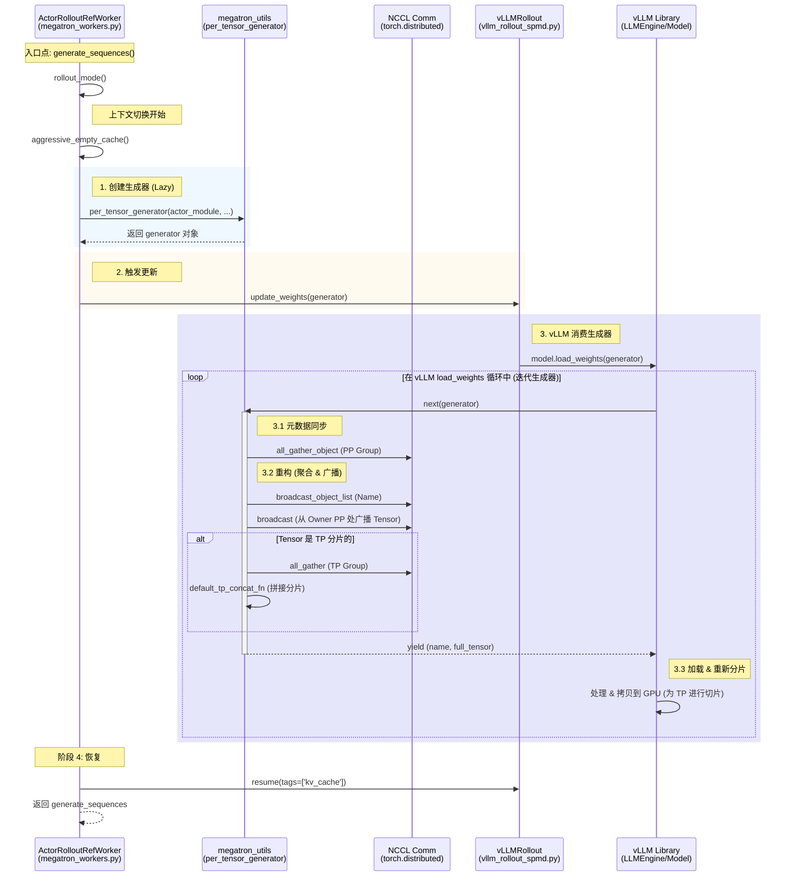

# verl 中 Megatron + vLLM 权重同步分析

> **源码基线**：`volcengine/verl@ab0705220a95952219111409d8f971872002c193`（`main`，2025-12-04）。本页分析的是第三方框架 **`volcengine/verl`**（不是 Megatron-LM——Megatron-LM 与 vLLM 在此只是被 verl 同步的两端，本页未直接引用二者源码），因此**不为本页钉 Megatron-LM 基线**。
> **基线定法（2026-08-28 补钉）**：原文未声明 commit，本轮用本机 verl 检出（HEAD `8a694930`，`main`，2026-06-17）沿历史回溯定出。`ab070522` 是**本页每一处引用都仍能解析的最新 commit**——紧随其后的 `fd893c78`（#4411，*retires vllm spmd mode in the codebase*，2025-12-04）即删除了 `verl/workers/rollout/vllm_rollout/vllm_rollout_spmd.py`。该 commit 下三个文件、以及正文描述的 `rollout_mode` / `per_tensor_generator` / `update_weights` / `default_tp_concat_fn` / `broadcast_from_megatron_pp` / `base_sync_done` 全部逐条核到函数与行号（已补进 §3、§4）。
> **叙事顺序**：本页**不按五拍组织**。它是**某历史版本的实现记录**——所分析的 `volcengine/verl` 调用链在当前 verl 已被整体删除（见下方 `[!deprecated]`），把它重排成「背景 → 为什么这么设计 → 实现 → 约束 → 发展趋势」会让一份考古记录看起来像仍然有效的当前分析。正文因此保持原有的调用栈叙述顺序。
> **最近更新**：2026-08-28。仅补入本条叙事说明；章节顺序、机制正文与既有引用一字未改。

> [!deprecated] 本页描述的调用链在当前 verl（HEAD `8a694930`，2026-06-17）已不存在。`verl/workers/rollout/vllm_rollout/vllm_rollout_spmd.py` 被 `fd893c78`（#4411，2025-12-04）删除；`verl/workers/megatron_workers.py` 被 `044bbba2`（#6067，*[BREAKING] refactor: deprecate workers, migrate to engines*，2026-04-20）删除，`rollout_mode` 在 HEAD 全树已无定义。仅 `verl/utils/megatron_utils.py` 存活，其中 `broadcast_from_megatron_pp`（`:1069`）、`default_tp_concat_fn`（`:1132`）、`per_tensor_generator`（`:1214`）三个函数仍在。以下描述对应基线 `ab070522`；要对当前 verl 重写本页，需改跟 engine 层的新 worker 抽象。

本文档分析了 `verl` 框架中训练模型（Megatron-LM）与推理模型（vLLM）之间的权重同步过程，特别关注 **共集群（Colocation）** 场景（即 Actor 和 Rollout 共享同一组 GPU）。

> **三方分工**：本文是 verl 在 Megatron+vLLM colocation 场景下的权重同步实现（Gather-Broadcast-Load 调用链）；Megatron 训练侧的 refit / 训推一致性通用机制见 [[30_megatron_rl_posttraining_consistency_analysis]]；三平面机制视角（weight publish 协议、跨框架不变量）见 [[01_posttraining_infra_mechanism_analysis]] 第 6 节。

## 1. 概述

在 Megatron + vLLM 组合中，权重同步遵循 **"Gather-Broadcast-Load"（聚合-广播-加载）** 模式。

由于 Megatron-LM 和 vLLM 可能使用不同的内部内存布局或并行策略，`verl` 采用了一种通用方法：**Megatron 将分片权重重构为标准的 HuggingFace 格式（完整张量），流式传输给 vLLM，然后 vLLM 根据其自身配置重新进行分片。**

**触发点：**
同步由 `verl/workers/megatron_workers.py` 中的 `ActorRolloutRefWorker` 类编排。具体来说，它发生在 `rollout_mode()` 方法内部，该方法在生成开始之前被调用。

## 2. 详细调用栈与时序

下面的时序图将高层逻辑映射到代码库中的具体类和函数。



## 3. 代码调用栈分析

以下是权重同步过程的分步跟踪：

### 步骤 1: 触发同步
**位置:** `verl/workers/megatron_workers.py:768`
**类:** `ActorRolloutRefWorker`（`verl/workers/megatron_workers.py:231`）
**方法:** `generate_sequences`（`:768`）-> `rollout_mode`（在 `:786` 经 `loop.run_until_complete` 调起）

当 PPO 训练循环请求 rollout 时，`generate_sequences` 被调用。它显式地切换上下文：

```python
# verl/workers/megatron_workers.py

def generate_sequences(self, prompts: DataProto):
    # ...
    if self._is_actor:
        # 在生成之前显式切换到 rollout 模式
        loop.run_until_complete(self.rollout_mode())
    # ...
```

### 步骤 2: 生成器创建
**位置:** `rollout_mode` 内部的 `verl/workers/megatron_workers.py:663`
**函数:** `verl.utils.megatron_utils.per_tensor_generator`（调用点 `verl/workers/megatron_workers.py:677-683`；`aggressive_empty_cache(force_sync=True)` 在 `:665`，`await self.rollout.update_weights(...)` 在 `:689`，`resume(tags=["kv_cache"])` 在 `:694`）

Worker 不会立即获取所有权重。相反，它创建一个生成器。这对显存效率至关重要。

```python
# verl/workers/megatron_workers.py

async def rollout_mode(self):
    # ...
    # 创建生成器。尚未发生通信。
    per_tensor_param = per_tensor_generator(
        self.actor.actor_module,
        self.actor_model_config,
        # ...
    )

    # 将生成器传递给 rollout worker
    await self.rollout.update_weights(per_tensor_param)
```

### 步骤 3: 驱动生成器 (vLLM 侧)
**位置:** `verl/workers/rollout/vllm_rollout/vllm_rollout_spmd.py:559`
**类:** `vLLMRollout`（`:144`）(或 `vLLMAsyncRollout`，`:604`)
**方法:** `update_weights`（`vLLMRollout` 在 `:559`，`model.load_weights(weights)` 在 `:582`；`vLLMAsyncRollout` 对应 `:721` / `:756`）

Rollout worker 接收生成器并将其直接传递给底层的 vLLM 引擎。

```python
# verl/workers/rollout/vllm_rollout/vllm_rollout_spmd.py

async def update_weights(self, weights: Generator, ...):
    # ...
    # vLLM 的 model.load_weights() 迭代 'weights' 生成器。
    # 这个迭代触发了执行通信的 'next()' 调用。
    model.load_weights(weights)
```

### 步骤 4: 通信循环 (生成器内部)
**位置:** `verl/utils/megatron_utils.py:894`
**函数:** `per_tensor_generator`（`:894`）

这是实际工作发生的地方，由 vLLM 的迭代惰性触发。

1.  **元数据同步:** `torch.distributed.all_gather_object` 确保所有 rank 知道参数的顺序（`verl/utils/megatron_utils.py:941`；PP 组版本另见 `:788`）。
2.  **PP 广播:** `broadcast_from_megatron_pp`（`verl/utils/megatron_utils.py:749`，调用点 `:969`）将张量从拥有它的流水线阶段（Pipeline Stage）移动到所有其他阶段。
3.  **TP 聚合:** `torch.distributed.all_gather` 收集张量模型并行分片（例如，切分的线性层），`default_tp_concat_fn`（`verl/utils/megatron_utils.py:812`）将它们合并成单个 `Full Tensor`（完整张量）。

## 4. 效率与并发分析

### 效率：低到中
效率很大程度上取决于模型大小和网络带宽（NVLink vs PCIe）。

1.  **冗余通信 (双重通信):**
    *   **Megatron 侧:** `TP Gather` -> `PP Broadcast`。这意味着每个参数最终都会作为完整副本复制到**每一张 GPU** 上（逐层流式传输）。
    *   **vLLM 侧:** 接收到 Full Tensor 后，vLLM（如果启用了 TP）会丢弃大部分数据，只保留其特定的分片。
    *   **浪费:** 对于 $TP=8$，每个 GPU 接收 $8/8$ 的权重，但只保留 $1/8$。与理想的 P2P 传输相比，带宽使用量实际上膨胀了约 $TP \times PP$ 倍。

2.  **串行阻塞:**
    *   生成器按顺序 yield 项目。
    *   PyTorch 中的网络操作（All-Gather, Broadcast）默认是阻塞/同步的。
    *   在此过程中，计算（推理/训练）完全停止。

### 并发与掩盖
**结论：在权重同步期间，计算和通信之间几乎没有有效的重叠掩盖。**

1.  **Stop-the-World:** 在 `update_weights` 期间，Actor 被阻塞。
2.  **无流水线:** 代码缺乏显式的流水线逻辑（例如，在传输第 $N$ 层时预处理第 $N+1$ 层的元数据）。它遵循严格的 `Gather -> Broadcast -> Yield -> Load` 串行循环。
3.  **LoRA 优化 (特例):**
    *   如果使用 LoRA 且 `base_sync_done=True`，该过程会**跳过**这个繁重的参数同步，仅传输微小的 Adapter 权重（`verl/workers/rollout/vllm_rollout/vllm_rollout_spmd.py:565-575`：`peft_config and base_sync_done` 为真时走 `TensorLoRARequest` + `add_lora`，否则才落到 `:578-585` 的 `model.load_weights`）。这是当前架构中主要的效率优化点。

## 5. 总结

当前的 Megatron + vLLM 同步实现优先考虑 **工程兼容性和正确性**，而不是原始性能。

*   **优点:** 解耦了 Megatron 的并行策略（TP/PP/DP）与 vLLM 的并行策略（TP）。它们不需要匹配的拓扑结构。
*   **缺点:** 通信开销高（Megatron 分片 -> 完整张量 -> vLLM 分片），导致全量微调时 `rollout_mode` 切换出现显著延迟。
*   **未来改进:** 如果拓扑匹配，直接 P2P 传输或共享内存方法（避免完整张量重构）将大幅提高性能。

## Related Pages

- [[02_engineering/02_train_frameworks/megatron-lm/index]]
- [[30_megatron_rl_posttraining_consistency_analysis]] — Megatron 训练侧的 refit / 训推一致性通用机制(本文的上游基础)
- [[01_posttraining_infra_mechanism_analysis]] — 第 6 节「Weight publish 协议」,三平面机制视角(框架无关)
- [[14_verl_rollout_runtime_analysis]] — verl 自身的 rollout request、KV 与权重刷新边界
- [[02_engineering/01_pytorch/index]]
