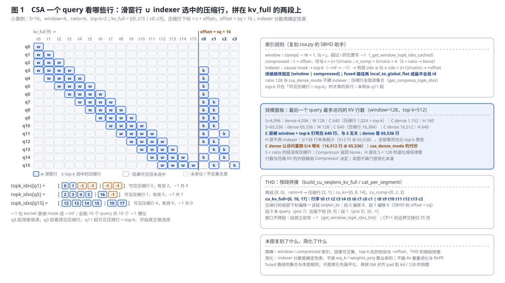
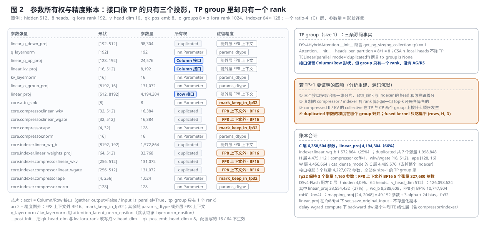
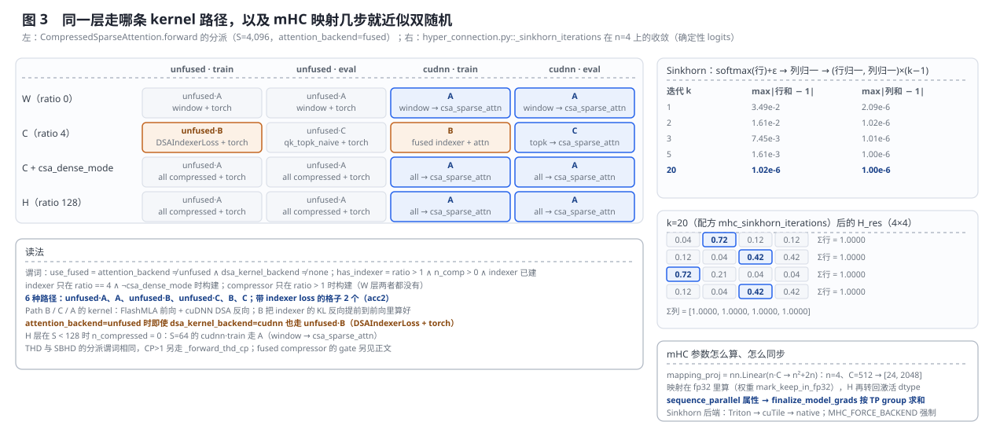
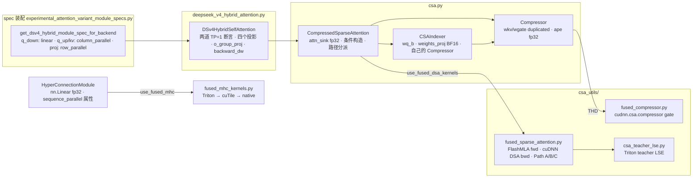

# DeepSeek-V4 Hybrid Attention 的单卡执行面：TP=1 边界、参数所有权与融合内核

> **源码基线**：`NVIDIA/Megatron-LM@85902ef599ea4eb06ada7567a479c524b605767a`（`dev`，2026-09-01）
> **主题**：DeepSeek-V4 Hybrid Attention 接进 Megatron 之后，并行轴上刻意不做 TP——配置期与构造期各一道 TP=1 断言，Compressor / Indexer / `q_down_proj` 从构造起就是 duplicated，mHC 用同步标记补非 TP-aware 参数——性能全部来自单卡内：CSA 把每个 query 的 KV 集合钉死在滑窗行加 top-k 压缩行；FlashMLA / cuDNN / cudnn-frontend / Triton 组成的融合内核族按 `dsa_kernel_backend` 与层型分派；FP8 训练下 compressor、indexer 权重投影、APE、attn_sink 与 mHC 映射留在高精度；up-projection 重算与延迟 wgrad 收显存。核心代码在 `megatron/core/transformer/experimental_attention_variant/`（`deepseek_v4_hybrid_attention.py`、`csa.py`、`csa_utils/`）与 `hyper_connection.py`。
> **适用范围**：DSv4 专有的单卡执行边界、参数所有权与精度账本；CP 数据面归 [[35_deepseek_v4_context_parallel_analysis]]，通用 Column/Row Parallel 与 sequence parallel 梯度收口归 [[12_megatron_tp_analysis]]，spec 装配与 `csa_*` / `dsa_indexer_*` 字段归 [[10_megatron_model_structure_analysis]]，`dsa_kernel_backend` / `use_fused_mhc` 字段与 DSA（非 hybrid）融合归 [[21_megatron_fusion_operators_analysis]]，模型结构背景归 [[13_deepseek_v4_analysis]]。
> **最近更新**：2026-09-07。按房子形状重写：从"TP 边界案例"扩成"单卡执行面"，新增三张生成图（CSA 索引集合、参数所有权与精度账本、kernel 分派与 Sinkhorn）与复刻回归。

---

## 1. 特性概览

### 1.1 问题背景

DeepSeek-V4 的注意力不是标准 MLA：每个 query 只看两类 KV 行——最近 `csa_window_size` 个 token 的滑窗行，以及把序列按 4 或 128 的 ratio 门控池化出来的压缩行，其中 ratio-4 层还要由一个学出来的 indexer 从压缩行里挑 top-k。这样的核心注意力天然是 MQA（key 与 value 是同一个单头张量），带一个每头的可学习 attention sink，压缩行的 RoPE 用另一套 base，indexer 有自己的 compressor 与 KL 蒸馏 loss。把它接进 Megatron 时面临三件互相拉扯的事：标准 MLA 的 Column/Row Parallel 接口是按 head 沿 TP 分片的，而这里的 sink、indexer 头和 top-k 索引都是"全 head"量；稀疏注意力的收益只在 kernel 真正只读被选中的行时才兑现，PyTorch 参考实现会把 gather 出来的 `(rows, top-k, d)` 张量整个物化；FP8 训练下参考 checkpoint 把 compressor 与 indexer 的权重投影、APE、sink 留在 BF16 / FP32，随手跟着 FP8 走会偏离参考模型。冻结基线的答案是把并行轴的复杂度整个砍掉，性能全部从单卡内的稀疏化、融合内核、精度策略与显存策略里拿。

### 1.2 解决方法

四条线。**(1) TP=1 硬边界**：`TransformerConfig.__post_init__` 的 `dsv4_hybrid` 分支断言 `tensor_model_parallel_size == 1`，`DSv4HybridAttention.__init__` 再断言 `get_pg_size(pg_collection.tp) == 1`；`q_down_proj`、Compressor 的两个投影、Indexer 的两个投影全部以 `parallel_mode="duplicated"` 构造（TE 断言此时 `tp_group is None`），只有 `q_up_proj` / `kv_proj` / `linear_proj` 三个投影保留 Column/Row Parallel 的形状接口——但它们所在的 TP group 只有一个 rank。mHC 的映射用普通 `nn.Linear`，靠 `sequence_parallel` 属性进入 `finalize_model_grads` 的求和归并。**(2) CSA 稀疏化**：`CompressedSparseAttention` 按层的 `compress_ratio` 条件构造 Compressor（ratio > 1）与 Indexer（ratio == 4 且非 `csa_dense_mode`），每个 query 的 KV 集合 = 滑窗行 ∪ 压缩行子集，压缩行接在原 token 行之后组成 `kv_full`，索引里的 `-1` 表示无效位。**(3) 融合内核族**：`use_fused_dsa_kernels` 为真时，稀疏注意力前向走 FlashMLA、反向走 cuDNN DSA，训练态 ratio-4 层把 indexer 的 KL 反向提前到前向里一起算；THD 下 compressor 的门控池化可分派到 cudnn-frontend 的 `cudnn.csa.compressor`；teacher LSE 有 Triton 版；mHC 的四个融合算子按 Triton → cuTile → native 逐算子选后端。**(4) 精度与显存**：`mark_keep_in_fp32` 让 APE、attn_sink 与 mHC 映射躲过 `Float16Module` 的整体转换，`get_fp8_disabled_context` 让 compressor 投影与 indexer 的 `weights_proj` 在 FP8 训练下留在 BF16；`mla_up_proj` 选择性重算把 Q/K/V 展开丢掉再算回来，`set_save_original_input` 避免 fp8/fp4 下把核心注意力输出存两份，`backward_dw` 把六个嵌套线性层的 wgrad 一起延迟。

### 1.3 收益、开销和约束

| 维度 | 直接收益 | 必付成本或边界 |
|---|---|---|
| 并行几何 | 没有 attention 侧的 TP collective；参数所有权一目了然（图 2） | 一层 attention 的全部参数与激活都在一张卡上；TP>1 需要证明四项目前源码沉默的契约（§2.2） |
| 计算量 | ratio-4 层每个 query 最多访问 window + top-k = 640 行 KV，与序列长度无关（图 1） | 多出 compressor 的两个 GEMM、indexer 的投影与 top-k；indexer 还有自己的 compressor |
| 融合内核 | FlashMLA 前向只读被选中的行；cuDNN 反向；cudnn-frontend 把约 40 次前向 / 50 次反向 eager launch 收成各一次（fused compressor 模块 docstring 自陈） | FlashMLA 与 cuDNN DSA 缺包直接 `ImportError`，fused compressor 缺包则静默回 eager 并只警告一次——两种回退策略并存（§2.5） |
| 精度 | APE、sink、mHC 映射 fp32；compressor / `weights_proj` BF16，与参考 checkpoint 一致 | THD 路径的 compressor GEMM 没有 SBHD 那层 `fp8_autocast(enabled=False)` 包裹（§2.6，源码事实，行为归 TE 依赖边界） |
| 显存 | `mla_up_proj` 重算丢掉展开的 Q/K/V；`save_original_input` 少存一份量化副本 | 重算要再跑一次 up-projection 与 RoPE；`checkpoint_core_attention` 与 `offload_qkv_linear` 被断言禁止 |
| 可诊断 | 几乎所有约束都是构造期 `assert` / `ValueError` | `attention_backend=unfused` 会静默关掉全部融合内核，哪怕 `dsa_kernel_backend=cudnn`（§2.5，仓内一个功能测试配置正踩在这上面） |

---

## 2. 单卡执行面详细方案

### 2.1 共用算例

参数账本用仓内最小真实配置 `tests/functional_tests/test_cases/gpt/gpt3_mcore_te_tp1_pp2_dsv4_hybrid_fused/model_config.yaml`：hidden 512、8 heads、`q_lora_rank` 192、`v_head_dim` 16、`qk_pos_emb_head_dim` 8、`csa_window_size` 128、`csa_compress_ratios` `[0,4,128,4,128,4]`（六层依次是 W / C / H / C / H / C）、indexer 64 heads × 128、`dsa_indexer_topk` 512、`dsa_kernel_backend: cudnn`，`o_groups` 与 `o_lora_rank` 取 `MLATransformerConfig` 默认 8 与 1024。注意 `__post_init__` 会把 `qk_head_dim` 与 `kv_lora_rank` 都改写成 `v_head_dim − qk_pos_emb_head_dim` = 8，配置里写的 16 与 64 不生效（源码 docstring 自陈"will be overridden automatically"）。索引替换的小例子另取一条短序列：S=16、window=4、ratio=4、top-k=2，indexer 分数用一张确定性表。规模面板与生产账本用 `examples/moe_recipes/deepseek_v4_flash/gb200/` 的三份配方（hidden 4096、64 heads、`v_head_dim` 512、`csa_compress_ratios` `([0,0,4]+[128,4]*20+[0])`）。三张图的每个数字都由 `tools/figs/svg/megatron_dsv4_tp_figures.mjs` 里复刻自冻结基线的索引、构造与分派规则算出。

### 2.2 TP=1：两道守卫，以及为什么接口还长得像 TP

**责任。** 第一道守卫在配置期：`TransformerConfig.__post_init__` 进入 `experimental_attention_variant == "dsv4_hybrid"` 分支后依次断言 `multi_latent_attention`、`csa_compress_ratios` 非空、长度不小于 `num_layers + mtp_num_layers`、取值都在 `{0, 4, 128}`、`tensor_model_parallel_size == 1`、`qk_clip` 关闭，随后置 `hetereogenous_dist_checkpoint = True`，拒绝 `dsa_kernel_backend="tilelang"`，`cudnn` 后端要求 SM90 以上，并在 SM90 上拒绝"ratio-4 indexer + dense indexer loss"的组合。第二道在构造期：`DSv4HybridAttention.__init__` 断言 `get_pg_size(self.pg_collection.tp) == 1`，同时断言不开 `checkpoint_core_attention` 与 `offload_qkv_linear`。两道守卫从 2026-04-30 的 Part 1（`bf4e1db32`）起就在，之后的 THD、CP、融合、精度提交都没有动它。

**接口为什么还长得像 TP。** spec 装配（`get_dsv4_hybrid_module_spec_for_backend`）给 `linear_q_up_proj` / `linear_kv_proj` 用 `backend.column_parallel_linear()`、给 `linear_proj` 用 `backend.row_parallel_linear()`，构造时传 `gather_output=False`、`input_is_parallel=True`、`tp_comm_buffer_name` 与 `tp_group=pg_collection.tp`。这和标准 MLA 是同一套接口，所以 fp8/fp4 下的 `set_save_original_input`、`delay_wgrad_compute` 下的 `backward_dw`、TE 的 FP8 上下文都不用为 DSv4 另写一份。但 `Attention.__init__` 用 `get_pg_size(pg_collection.tp)` 去除 head 数，TP=1 时 `num_attention_heads_per_partition` 就是 8；而 `CompressedSparseAttention.__init__` 里 `n_local_heads = config.num_attention_heads`，根本不除 TP——attn_sink 按全 head 数分配。只有 TP=1 时这两个量才恰好相等。

**被否掉的替代方案与判据（分析重建，源码沉默）。** 替代方案是像标准 MLA 那样沿 head 切 `q_up_proj` / `kv_proj` / `linear_proj`。它在这里输在四件源码可见的事实上：核心注意力是 MQA，`kv_proj` 只产出一个 `v_head_dim` 宽的单头 K=V，沿 head 切 Q 之后每个 rank 仍要完整的 K=V；indexer 的打分是对 64 个 index head 做加权求和再取 top-k，切 head 就要在 top-k 之前 all-reduce 分数；融合内核族只接受扁平的 `(rows, H, D)` 与全局索引，没有 TP-aware 变体；duplicated 参数的梯度要在哪个 group 归并没有任何现成规则。源码没有写"为什么选 TP=1"，本页把上面四条重建为扩展到 TP>1 时的证明义务（图 2 右栏），不冒充作者原话。

**数据怎么走、守卫与代价。** TP=1 下没有任何 attention 侧的 AG/RS collective；DP / PP / CP / EP 仍是独立轴，进程组怎样组合归 [[17_megatron_parallelism_orchestration_analysis]]。四份生产配方全部 `tensor_model_parallel_size: 1`、`expert_tensor_parallel_size: 1`，EP=64 承担 MoE 的切分，PP 1 / 2 / 4，THD 64K 的那份再加 CP=16（§5.2）。

> [!note] 分析重建
> "TP=1 是刻意选择而不是暂缺"这一判断的证据是：两道断言从 Part 1 起就在、之后 15 次改动该文件都没触碰、生产配方全部 TP1。四项证明义务是从 §2.4 的所有权账本与融合内核签名反推的，源码没有任何一处描述 TP>1 的方案。

### 2.3 CSA 稀疏化：一个 query 看哪些行



**责任。** `CompressedSparseAttention` 把 `[sq, b, np, v_head_dim]` 的 query、单头的 key（value 与 key 相同）、原始 hidden `x` 与压缩 query `qr` 变成 `[sq, b, np × v_head_dim]` 的输出。它先由 `_build_kv_full` 把 Compressor 的输出接在原 KV 之后（`kv_full = cat([kv, compressed_kv])`，`offset = sq`），再由 `get_window_topk_idxs` 产生滑窗索引，最后按路径决定压缩行的子集。

**变体集合的枚举依据。** 三条轴都来自源码自己的选择点。层型轴来自 `__init__` 的条件构造：`compress_ratio > 1` 才建 Compressor，`compress_ratio == 4 and not csa_dense_mode` 才建 Indexer，所以 ratio 0（`W`）两者都没有、ratio 4（`C`）两者都有、ratio 128（`H`）只有 Compressor；hybrid 栈的 `C` / `H` / `W` 符号通过 `hybrid_layer_specs.py::_wrap_dsv4_layer` 把 4 / 128 / 0 写进 spec params，GPT 路径则按 `csa_compress_ratios[layer_number − 1]`（MTP 层再加 `num_layers`）取。布局轴来自 `forward` 开头：`packed_seq_params.qkv_format == 'thd'` 走 `_forward_thd`，其中 CP>1 再走 `_forward_thd_cp`（归 [[35_deepseek_v4_context_parallel_analysis]]），否则是 SBHD。kernel 轴来自 `use_fused_dsa_kernels(config)`（§2.5）。

**小算例逐格替换。** S=16、window=4、ratio=4、top-k=2。滑窗索引是 `clamp(i − W + 1, 0) + j`、超过 i 的位置写 −1；Compressor 在 `sq < ratio` 时直接返回 `None`，否则只池化前 `(sq // ratio) × ratio` 个 token，得到 `n_comp = 4` 个压缩行；query i 只能看见前 $\lfloor (i+1)/r \rfloor$ 个压缩行。indexer 走 `causal mask → top-k → (−inf → −1) → 校验 (idx ≥ 0) ∧ (idx < ⌊(i+1)/r⌋) → +offset`，再与滑窗索引按固定顺序 `[window | compressed]` 拼起来。于是 `topk_idxs[q1] = [0, 1, -1, -1 | -1, -1]`（滑窗没填满、一个压缩行都看不见），`topk_idxs[q5] = [2, 3, 4, 5 | 16, -1]`（只看得见 c0，第二个 top-k 槽位是 −1），`topk_idxs[q15] = [12, 13, 14, 15 | 19, 17]`（四个压缩行里选两个）。全图 16 个 query 共 16 个 −1 槽位，它们在 kernel 里被 mask 成 −inf；q3 起滑窗填满，q3 起看得见压缩行，q11 起可见压缩行 > top-k、indexer 才真的在丢行。

**为什么 ratio-128 层不要 indexer（规模面板）。** 最后一个 query 最多访问的 KV 行数：S=4,096 时 dense 4,096、W 128、C 640（压缩行 1,024 > top-k）、C dense 1,152、H 160；S=65,536 时 C 仍是 640、C dense 涨到 16,512、H 640（压缩行 512）。C 层的访问量被 window + top-k 钉死在 640 行、与 S 无关；H 层的压缩行只有 S/128，全部看完也比再养一个 indexer 便宜——这就是类 docstring 里"window + 128x compressed, attend to all (compressor built only)"的算术。`csa_dense_mode` 是同一决定的反面：它关掉 ratio-4 的 indexer，让访问量随 S/4 增长。

**被否掉的替代方案与判据。** 替代是 dense attention 或"把压缩行全部看完"。判据就是上面这张面板：dense 的 65,536 行对 640 行；全看压缩行的 16,512 行对 640 行。源码在 `Compressor` docstring 里还否掉了另一个替代——把尾部补到 ratio 的整数倍再压缩：它选择让尾部 `seqlen % ratio` 个 token 没有压缩表示、只靠滑窗，理由是与推理时"decode token 落在不满 ratio 的 buffer 里也没有压缩条目"对齐，避免训推不匹配（源码自陈）。

**THD 布局与 -1 的处理。** 打包序列下不能整体 `cat`，`build_cu_seqlens_kv_full` 与 `cat_per_segment` 按段拼接：两段 `[8, 6]`、ratio 4 → 压缩行 `[2, 1]`，`cu_seqlens_kv=[0, 8, 14]`、`cu_seqlens_compressed=[0, 2, 3]`、`cu_seqlens_kv_full=[0, 10, 17]`，行序是 `t0…t7 c0 c1 | t8…t13 c2`；压缩行的段内局部下标偏移等于该段的 `seqlen_kv`（段 0 偏移 8、段 1 偏移 6），对应 SBHD 的 `offset = sq`；段 0 末 query 的压缩下标是 `[8, 9]`、段 1 是 `[6, -1]`。窗口不跨段。`cat_per_segment` 刻意按 `compressed_kv_thd.shape[0]`（可能为 CUDA graph 捕获而按静态容量补齐）而不是真实计数分配输出，把无效行路由到尾部填充槽——源码注释警告不要把这个分配缩小。fused 路径的集合与图 1 相同，只是 `build_flat_topk_idxs` 先经 `local_to_global_flat` 扁平化（SBHD 为 `local × B + b`，THD 为 `cu_seqlens_kv[batch] + local`），推理态再用 `DSA.compactify_wrapper` 把有效索引压到行首并返回 `topk_length`，FlashMLA 前再按 SM 对齐把 top-k pad 到 64（SM100）或 128（SM90）的倍数。

**守卫与代价。** SBHD 与 CP>1 的组合被两处 `ValueError` 拒绝（`forward` 要求 THD 且 `cp_partition_mode == "contiguous"`）；THD 下 Path B 若一个段都没有压缩 indexer K 则 `RuntimeError`。代价是每层多出 compressor 的两个 `hidden → coff × head_dim` GEMM 与门控 softmax、indexer 的 `wq_b` / `weights_proj` GEMM、top-k，以及 indexer 自己的一整套 compressor（§2.4）。

### 2.4 参数所有权账本



**四个投影接口。** `DSv4HybridSelfAttention.__init__` 只接受 `TELinear` 作为 `linear_q_down_proj`（其它类型 `ValueError`），并给它 `parallel_mode='duplicated'`、`tp_group=None`，形状 `[192, 512]`；`linear_q_up_proj` 是 `[128, 192]`（`num_attention_heads × q_head_dim`，而 `q_head_dim = v_head_dim`）、`linear_kv_proj` 是 `[16, 512]`（只产出一个 `v_head_dim` 宽的单头 K=V），两者都传 `gather_output=False` 与 `pg_collection.tp`；`linear_proj` 是 `[512, 8192]`，`input_is_parallel=True`。这张表解释一个常见误判：源码里出现 `gather_output`、`input_is_parallel`、`tp_comm_buffer_name`，只能证明模块遵循并行线性层 API，不能绕过两道 TP=1 断言。

**grouped output projection。** `linear_o_group_proj` 不是并行线性模块，而是直接创建的 `torch.nn.Parameter`，形状 `[o_groups × o_lora_rank, (heads × v_head_dim) / o_groups]` = `[8192, 16]`；构造器断言 `num_attention_heads × v_head_dim` 能被 `o_groups` 整除。前向把核心注意力输出 view 成 `o_groups` 组、每组做一次 `einsum("...gd,grd->...gr")` 得到 `o_groups × o_lora_rank` 宽的中间量，再送进 `linear_proj`。它用 `params_dtype` 与 `init_method` 初始化，这两个字段不是 DSv4 私有：`params_dtype` 归 [[23_megatron_precision_cudagraph_fusion_analysis]]，`init_method` / `output_layer_init_method` 归 [[10_megatron_model_structure_analysis]]。

**Compressor 与 Indexer 从构造起就是 duplicated。** `Compressor.__init__` 在 `get_fp8_disabled_context(config, is_init=True)` 里以 `parallel_mode="duplicated"` 建 `linear_wkv` 与 `linear_wgate`（`[coff × head_dim, hidden]`，ratio 4 时 `coff = 2` 做重叠池化、ratio 128 时 `coff = 1`），另有 fp32 的 `ape [ratio, coff × head_dim]` 与一个 RMSNorm。`CSAIndexer.__init__` 以同样模式建 `linear_wq_b [8192, 192]`（源码注释：参考 checkpoint 里它是 FP8，所以留在外层 `fp8_model_init` 上下文内）与 `linear_weights_proj [64, 512]`（刻意在 FP8 上下文之外构建，保持 BF16），并且拥有**自己的** Compressor（`head_dim = dsa_indexer_head_dim = 128`，`rotate=True` 做 Hadamard 旋转）。所以一个 C 层里有两套 compressor：注意力的（`[32, 512]`、`ape [4, 32]`）与 indexer 的（`[256, 512]`、`ape [4, 256]`）。

**账本合计（由脚本按形状乘出）。** C 层 6,358,504 个参数，其中 `linear_proj` 4,194,304（66%）——`o_lora_rank` 默认 1024 在这个小模型上把输出投影放大成最大的张量；`indexer.linear_wq_b` 1,572,864（25%）；Column/Row 接口投影 3 个张量 4,227,072 参数全部在 size-1 的 TP group 里；duplicated 7 个张量 1,998,848 参数；fp32 保持 3 个张量 1,160 参数；FP8 上下文外 BF16 5 个张量 327,680 参数。H 层 4,475,112（compressor `coff=1`：`[16, 512]`、`ape [128, 16]`），W 层 4,456,664，`csa_dense_mode` 的 C 层 4,489,576（去掉整个 indexer 连同它的 compressor）。换成 DSv4-Flash 配方，C 层 126,098,624 个参数，`linear_proj` 33,554,432（27%），`wq_b` 8,388,608，FP8 之外的 BF16 参数 10,747,904。mHC 每层另有 `mapping_proj [24, 2048]` = 49,152 参数加 3 个 alpha 与 24 个 bias，全部 fp32 保持（§2.8）。

**被否掉的替代方案与判据。** 替代是让 compressor / indexer 也走 Column Parallel 接口。判据在 TE 的契约里：`TELinear` 的 `duplicated` 模式断言 `tp_group is None`，而 duplicated 正是"权重在 TP rank 间复制、无张量并行"的定义；Compressor 的输出要按 `ratio` 个 token 一组做 softmax 池化再拼进 `kv_full`，沿 head 切开就没有"整行"可拼。indexer 的 `weights_proj` 输出是 64 个 head 的加权系数，被否掉的量化版本留在 DSA 那边：`dsa_indexer_weights_proj_use_quantization` 与 `_output_dtype` 两个字段的 docstring 都明写"does not affect `CSAIndexer`, which keeps its FP8-disabled BF16 projection"（字段 owner 是 [[10_megatron_model_structure_analysis]]）。

### 2.5 融合内核族：分派、gate 与两种回退策略



**选择面。** `dsa_kernels.py::use_fused_dsa_kernels` 只在 `attention_backend != unfused` 且 `dsa_kernel_backend != "none"` 时为真；`dsa_kernel_backend` 的合法值是 `none` / `tilelang` / `cudnn`，`dsv4_hybrid` 在 `__post_init__` 里拒绝 `tilelang`，所以对本页只剩 `none` 与 `cudnn` 两档；已弃用的 `apply_dsa_kernel_fusion` 在 `dsv4_hybrid` 下被映射为 `cudnn` / `none` 并发弃用警告，与显式枚举冲突时 `ValueError`。这两个字段的 owner 是 [[21_megatron_fusion_operators_analysis]]，本页只讲它们在 CSA 里的分派结果。

**分派矩阵（图 3 左，由复刻的谓词逐格算出）。** `forward` 的四条分支按 `use_fused_kernels`、`has_indexer_compressed = ratio > 1 ∧ n_compressed > 0 ∧ indexer 已建`、`self.training and torch.is_grad_enabled()` 三个谓词选路，S=4,096 下四种层型 × 四种条件共 6 种路径：W / C dense / H 层在 fused 下都走 **Path A**（`build_flat_topk_idxs` → `csa_sparse_attn`，压缩行来自 `get_compress_topk_idxs` 或根本没有），C 层训练态走 **Path B**（`fused_csa_indexer_sparse_attn`：fused indexer + attn，带 loss）、推理态走 **Path C**（`indexer_topk` 用 cuDNN indexer 前向 + TRT-LLM radix top-k，再 `csa_sparse_attn` 的 compact 快路径）；unfused 下对应 `_forward_unfused_csa` 的三条子路（训练态 `FusedDSAIndexerLoss.apply` + PyTorch 参考、推理态 `fused_qk_topk_naive`、无 indexer 时 `get_compress_topk_idxs`），带 indexer loss 的格子共 2 个。THD 的谓词相同（`_forward_thd` 的四条 `*_thd` 分支）。两条边界：`attention_backend=unfused` 时即使 `dsa_kernel_backend=cudnn` 也走 unfused·B——仓内 `gpt3_mcore_te_tp1_pp2_dsv4_hybrid_fused/model_config.yaml` 把 `--attention-backend` 写了两次（先 `fused` 后 `unfused`），功能测试脚本 `_run_training.sh` 用 `yq` 把每个键逐条转成命令行参数、argparse 以最后一次出现为准，这个名为 fused 的功能测试实际跑的是 PyTorch 回退；H 层在 S < 128 时 `n_compressed = 0`，S=64 的 cudnn·train 退化成纯滑窗的 Path A。

**Path A / C：`csa_sparse_attn`。** `CSASparseAttnFunc.forward` 调 `_csa_fwd_flash_mla`——把 top-k 按 `_get_topk_alignment()` pad（SM90 为 128、SM100 为 64）后交给 `flash_mla.flash_mla_sparse_fwd`，返回 `out`、`lse` 与可选的 `lse_indexer`；`backward` 调 `cudnn.DSA.sparse_attention_backward_wrapper` 得 `dq` / `dkv` / `d_sink`。Path C 的 `compact=True` 由 `DSA.compactify_wrapper` 把有效索引压到行首并给出 `topk_length`，让 kernel 只扫有效前缀；Path B 因为要 `lse_indexer` 而不能 compact（`indexer_topk > 0` 时断言 `topk_length is None`）。两个 kernel 都是懒加载：`_ensure_flash_mla` / `_ensure_dsa_namespace` 在第一次调用时 import，缺包抛带安装指引的 `ImportError`，**不回退**。

**Path B：`FusedCSAIndexerSparseAttnFunc`。** 它在一次 autograd 里做完 indexer 打分、top-k、KL loss、稀疏注意力前向；docstring 自陈"the indexer backward is eagerly computed in the forward pass with `grad_loss=1.0`; the actual backward simply scales the pre-computed gradients"。loss 有两种：`sparse_loss=True` 只在 top-k 位置算 KL，`False` 在全部因果可见位置算。teacher 分布的分母不是只有被选中的压缩行：`608545cfc`（#6349）修的正是"fused CSA indexer loss 的归一化与 compact 索引"，teacher LSE 要把滑窗与 sink 的质量一起计入（`_compute_csa_non_compressed_lse`，Triton 版在 `csa_teacher_lse.py`，`can_use_fused_csa_teacher_lse` 不满足时回 chunked PyTorch）；`059c16cd1`（#5960）给 unfused 路径补上同一条"完整 CSA 分母"。indexer loss 经 `DSAIndexerLossAutoScaler.apply(output, indexer_loss)` 挂到输出上：前向恒等，反向按 `main_loss_backward_scale` 缩放 loss 梯度；`dsa_indexer_loss_coeff > 0` 时还写进 `DSAIndexerLossLoggingHelper` 的 tracker 供日志。

**fused compressor：另一种回退策略。** `Compressor._forward_thd` 在 GEMM 之后调 `maybe_compress_thd_fused`，它替换的是 gather → `+APE` → 重叠窗变换 → fp32 softmax → 加权和 → bf16 这段。gate 全部写在 `csa_utils/fused_compressor.py` 里：`use_fused_dsa_kernels` 为真、张量在 CUDA 上、设备 compute capability **恰好** 10.0、`cudnn.csa.compressor` 可导入（设备支持但缺包时 `logger.warning` 一次，之后静默）、`ratio ∈ {4, 128}` 且 `coff ∈ {1, 2}`、ratio 128 时 `head_dim ∈ {128, 512}`、`kv` / `score` 为 bf16、`ape` 为 fp32、不在 `torch.use_deterministic_algorithms(True)` 下（`dAPE` 用 fp32 原子累加，不确定）、不在 `torch.compile` 追踪中、`total × coff × head_dim < 2^31`。任一不满足返回 `None`，调用方保留 eager。SBHD 路径与 CP 的 pre-grouped 输入根本不经过它。共用算例的 `v_head_dim` 16 让 H 层的注意力 compressor 在 GB200 上也走 eager（ratio 128 要求 head_dim 128 或 512）；配方里 `v_head_dim` 512 则命中。数值契约（源码 docstring）：fp32 中间量、最后一次 bf16 舍入，ratio 4 的 `dKV` / `dScore` 与 fp32 中间量的 eager 参考逐位相同，ratio 128 在给定容差内。这里是依赖边界：本页只转述 cudnn-frontend 文档的契约，未打开其 kernel。

**被否掉的替代方案与判据。** 替代是统一用 PyTorch 参考实现。`unfused_compressed_sparse_attn` 的 docstring 自陈它"mainly for reference, and the performance and the memory footprint of it is not good for the real scenario"：它把每个 query 的 `(top-k, d)` KV 都 gather 成 `(rows, top-k, d)` 张量再算，稀疏化在显存上被抵消。两种回退策略的差异也是判据：FlashMLA / cuDNN DSA 是 Path A/B/C 的本体，缺了就没有"稀疏注意力 kernel"这回事，所以 `ImportError`；fused compressor 只是同一段 eager 计算的加速版，语义参考仍是 eager，所以静默回退。

### 2.6 精度驻留：FP8 训练下谁留在高精度

`ec2aff43e`（#5308，"Keep DeepSeek V4 CSA compressor and indexer in high precision under FP8 training"）引入了本节的全部机制。**两个工具。** `module.py::mark_keep_in_fp32` 给张量打 `keep_in_fp32` 标记，`convert_module_to_dtype_except_fp32_marked` 让 `Float16Module` 转 bf16 时跳过它们；`fp8_utils.py::get_fp8_disabled_context(config, is_init)` 在 `is_init=True` 时返回 `fp8_model_init(enabled=False)`（只在 `fp8_param` / `fp4_param` 开启时有意义），否则返回 `fp8_autocast(enabled=False)`（只在 `fp8` / `fp4` 开启时有意义）。**谁用了它们。** `Compressor.ape` 与 `CompressedSparseAttention.attn_sink` fp32 保持（源码注释：参考 checkpoint 里是 FP32）；`Compressor` 的 `linear_wkv` / `linear_wgate` 在禁用的 init 上下文里构建，`_forward_sbhd` 再用禁用的 autocast 包住两次 GEMM；`CSAIndexer.linear_weights_proj` 在禁用的 init 上下文里构建、`forward_before_topk` 里用禁用的 autocast 跑；`linear_wq_b` 则留在外层 FP8 上下文内。mHC 的 `mapping_proj.weight`、三个 alpha 与 bias 也是 fp32 保持（§2.8）。测试 `TestCSAHighPrecisionParams::test_ape_and_attn_sink_stay_fp32_after_bf16_conversion` 锁定：`Float16Module` 转换后 `attn_sink`、两个 `ape` 仍是 fp32，而 `linear_wkv` / `linear_wgate` 的权重是 bf16。

**一处源码事实。** `_forward_thd` 里的两次 compressor GEMM 没有 `_forward_sbhd` 那层 `get_fp8_disabled_context(self.config)` 包裹（`csa.py` 里该上下文只出现在两个 `__init__` 与 `_forward_sbhd` / `forward_before_topk`）。权重因为在禁用的 init 上下文里构建仍是 BF16 参数，但 THD 前向的 GEMM 是否被外层 `fp8_autocast` 量化，取决于 TE `Linear` 对 BF16 权重的处理——这是依赖边界，本页不断言其运行时行为，只记录两条路径的包裹不对称。

**被否掉的替代方案与判据。** 替代是让所有线性层跟着 FP8 走。判据是源码反复自陈的"与参考 DeepSeek V4 checkpoint 一致"：哪些张量是 FP8、哪些是 BF16、哪些是 FP32 都照 checkpoint 的 dtype 布局。它的代价是 `fp8_param` 下这些参数不能享受 FP8 存储，图 2 算出 C 层有 327,680 个参数留在 FP8 之外。

### 2.7 显存与反向：up-proj 重算、原始输入保存、延迟 wgrad

**up-projection 重算。** `recompute_granularity == 'selective'` 且 `recompute_modules` 含 `"mla_up_proj"` 时，`get_query_key_value_tensors` 用 `tensor_parallel.CheckpointWithoutOutput(fp8=quantization)` 包住 `qkv_up_proj_and_rope_apply`（`q_up_proj` → `_q_rms_norm` → `kv_proj` → `kv_layernorm` → RoPE），`quantization = config.fp8 or config.fp4`；核心注意力算完后 `discard_output_and_register_recompute(core_attn_out)` 丢掉展开的 Q/K/V、注册反向时重算。这段从 Part 1 就在 DSv4 hybrid 里；`ea84ff707`（#6178，"Allow FP8/FP4 with AbsorbedMLA up-projection recompute"）改的是 `absorbed_mla.py`，是同一机制在姊妹模块上的放开，不是 DSv4 hybrid 的改动。重算方案本体归 [[18_megatron_recompute_analysis]]。

**原始输入保存。** fp8（非 delayed recipe，TE ≥ 2.6）或 fp4（TE ≥ 2.7）下，`__init__` 对 `linear_proj` 调 `set_save_original_input`：源码注释说融合核心注意力自己已经保存了输出，`linear_proj` 再存一份量化副本是浪费。`set_for_recompute_input_layernorm` 对 `q_down_proj` 与 `kv_proj` 做同样的事，供 input layernorm 重算用。`fused_mla_rope_out_of_place` 也是显存换正确性：`04bbfe649`（#5526）让逆 RoPE 不再原地改核心注意力输出，因为 fused DSA 的反向保留了原始的 O。

**延迟 wgrad。** `DSv4HybridSelfAttention.backward_dw` 依次冲刷 `kv_proj`、`q_down_proj`、`q_up_proj`、`core_attention.backward_dw()`（Compressor 的两个投影、Indexer 的两个投影与它自己的 compressor，None 守卫与 `__init__` 的条件构造一一对应）、`linear_proj`。测试 `TestDSv4HybridCSADelayedWgradFlush::test_csa_deferred_wgrads_flushed_through_core_attention` 锁定六个嵌套线性层都被冲刷。`delay_wgrad_compute` 归 [[15_megatron_pp_schedulers_analysis]]。

**守卫。** `checkpoint_core_attention`（`core_attn` 重算）与 `offload_qkv_linear` 被构造期断言禁止；`offload_core_attention` 与 `offload_attn_proj` 仍可用（`off_interface` 包住核心注意力与输出投影）。

### 2.8 mHC 交界：完整参数、同步标记与三后端

`HyperConnectionModule` 的动态映射是 `nn.Linear(n × C → n² + 2n, bias=False)`，`n = num_residual_streams`（默认与配方都是 4），另有 `alpha_pre` / `alpha_post` / `alpha_res`（各一个标量，初值 `mhc_init_gating_factor`）与 `bias`；n=4、C=512 时 `mapping_proj` 是 `[24, 2048]`，49,152 个参数。这些不是 Column/Row Parallel 参数。`_init_weights` 在 `config.sequence_parallel` 为真时给五个参数打 `sequence_parallel=True` 属性（源码注释："non-TP-aware layers whose gradients need to be all-reduced"），`finalize_model_grads.py::_allreduce_non_tensor_model_parallel_grads` 在 TP group 大于 1 时把带该属性的参数梯度做 sum 归并——在本页的 TP=1 前提下这段直接 `return`，不产生任何跨 rank 流量；它对 TP>1 的通用语义归 [[12_megatron_tp_analysis]]。

**映射怎么算。** `compute_mappings` 先算 `h_pre`（sigmoid）、`h_post`（2·sigmoid）、`h_res`（n×n 的 logits），再把 `h_res` 送进 Sinkhorn：`_sinkhorn_iterations` 先对行做 softmax 加 ε、再列归一，然后交替行归一、列归一共 `mhc_sinkhorn_iterations − 1` 轮。图 3 右栏用一张确定性 logits 表复刻：1 次迭代后 max|行和 − 1| 是 3.49e-2、max|列和 − 1| 是 2.09e-6（第一步就是列归一），5 次后行偏差 1.61e-3，20 次（配方值）后 1.02e-6 与 1.00e-6，都落到 ε 的量级；20 次后的 4×4 矩阵每行每列之和都是 1.0000。映射在 fp32 里算（`_projection_and_get_norm` 显式 `.to(torch.float32)`，`d8b71082e`（#6172）让 cuTile 路径也保持 fp32），算完再转回激活 dtype 乘到流上——源码注释说 sigmoid 输出与双随机矩阵有界，转回去是安全的。

**三后端。** `use_fused_mhc` 为真时构造器从 `fused_mhc_kernels.py` 取五个融合入口并 `log_fused_mhc_backend_once`；`fused_sinkhorn` 的顺序是 Triton → cuTile → native，`MHC_FORCE_BACKEND` 环境变量可强制、`MHC_DISABLE_TRITON` / `MHC_DISABLE_CUTILE` 可禁用，强制的后端不可用时记录错误、首次调用抛出；全部退到 native 时 `use_fused_mhc` 保持打开并发 rank-0 `UserWarning`。`9d46c924d`（#4624）是这套融合内核的快速实现。字段 owner：`use_fused_mhc` 归 [[21_megatron_fusion_operators_analysis]]，`enable_hyper_connections` / `mhc_sinkhorn_iterations` / `mhc_init_gating_factor` 归 [[10_megatron_model_structure_analysis]]，mHC 选择性重算与 CUDA graph 切分（`2f2f8ebae`，#5841）归 [[18_megatron_recompute_analysis]]。

**被否掉的替代方案与判据（分析重建）。** 替代是给 `mapping_proj` 用 TP-aware 线性层。它每 token 只产出 n² + 2n = 24 个标量，沿 TP 切既省不了什么显存也省不了计算，反而要为 Sinkhorn 之前的 n×n logits 加一次 gather；而 sequence parallel 下每个 rank 只看到自己的序列分片，复制参数的梯度必须求和——"完整参数 + 显式同步标记"用最小的机制满足了这个要求。源码只写了"需要 all-reduce"，没有写为什么不切分，此段为本页推断。

### 2.9 开销结算

| 项 | 每层每步成本 | 边界 |
|---|---|---|
| 稀疏注意力 | 每 query 读 window + top-k 行（C 层 640 行，与 S 无关）；FlashMLA 前向 + cuDNN 反向 | 缺 FlashMLA / cuDNN DSA 直接 `ImportError`；top-k 按 SM 对齐 pad 到 64 / 128 |
| Compressor | 两个 `hidden → coff × head_dim` GEMM + 门控 softmax，C 层两套（注意力 + indexer） | 只在 THD、CC 10.0、ratio/head_dim 在验证包络内才融合；确定性模式与 `torch.compile` 下 eager |
| Indexer | `wq_b`、`weights_proj` GEMM + cuDNN indexer 前向 + radix top-k；训练态多一份 KL（sparse 或 dense） | SM90 上 cudnn + ratio-4 + dense loss 被 `__post_init__` 拒绝 |
| 精度 | fp32 的 APE / sink / mHC 映射；BF16 的 compressor 投影与 `weights_proj` | 这些参数不享受 FP8 存储（C 层 327,680 个） |
| 显存 | `mla_up_proj` 重算再跑一次 up-projection + RoPE；`save_original_input` 少存一份量化副本 | `core_attn` 重算与 `qkv_linear` 卸载被断言禁止 |
| mHC | 一个 `[n² + 2n, n × C]` 的 fp32 GEMM + Sinkhorn 20 轮 | 全部退 native 时只警告，不报错 |
| 并行 | attention 侧零 TP collective；TP=1 下 SP 属性的求和归并直接返回 | TP>1 无方案；MoE / CP / PP 各自独立结算（§4） |

**这条链在什么条件下失效。** 四处：`attention_backend=unfused` 静默关掉全部 DSA/CSA 融合内核，`dsa_kernel_backend=cudnn` 变成空话；某段 `seqlen < ratio` 时 Compressor 返回 `None`，该层退化成纯滑窗（H 层在 S < 128 时必然如此），THD 下 Path B 若一个段都没有压缩 indexer K 直接 `RuntimeError`；fused compressor 在非 CC 10.0 设备或 ratio-128 的 `head_dim ∉ {128, 512}` 时静默 eager，性能落差没有任何告警（缺包才警告一次）；FP8 训练且 THD 时 compressor GEMM 的精度包裹与 SBHD 不对称（§2.6）。

---

## 3. 代码实现分析

### 3.1 类与所有权



| 层次 | 责任 | 不负责什么 |
|---|---|---|
| `get_dsv4_hybrid_module_spec_for_backend` | 选后端线性层类型、把 Compressor / Indexer / CSA / Attention 装成一棵 spec 树 | 不决定 ratio；`C` / `H` / `W` 由 `hybrid_layer_specs` 或 `csa_compress_ratios` 注入 |
| `DSv4HybridSelfAttention` | 两道 TP=1 断言之二、四个投影与 grouped output、RoPE、up-proj 重算、`backward_dw` | 不做稀疏化，不持有 sink |
| `CompressedSparseAttention` | 条件构造 Compressor / Indexer、`kv_full` 拼接、窗口索引、四条路径分派、indexer loss 挂载 | 不实现 kernel |
| `Compressor` / `CSAIndexer` | duplicated 投影、fp32 APE、门控池化、indexer 打分前的 Q/K/weights | 不做 top-k 选择（在 `fused_qk_topk_naive` / `indexer_topk` 里） |
| `csa_utils/fused_sparse_attention.py` | FlashMLA / cuDNN DSA 懒加载、索引扁平化与 compact、Path A/B/C 的 autograd | 不决定走不走 fused |
| `csa_utils/fused_compressor.py` | cudnn-frontend compressor 的 gate 与 autograd 接线 | 不改变语义参考（eager） |
| `HyperConnectionModule` / `fused_mhc_kernels.py` | 映射计算、Sinkhorn、聚合 / 展开、后端选择 | 不做 TP 切分 |

### 3.2 调用流程

```text
TransformerLayer.forward                                        （hybrid: HybridBlock 按 C/H/W 装层）
`-- DSv4HybridSelfAttention.forward(hidden_states, ...)          deepseek_v4_hybrid_attention.py
    +-- assert rotary_pos_emb / attention_bias / rotary_pos_cos,sin / inference_* 全为空
    +-- [cp_size > 1] 要求 thd + contiguous（ValueError）→ exchange_cp_boundary_hidden   → 见 35 页
    +-- get_query_key_value_tensors                                 同步，本地
    |   +-- linear_q_down_proj (TELinear duplicated)  → q_layernorm
    |   `-- [recompute_up_proj] CheckpointWithoutOutput(fp8=fp8|fp4).checkpoint(
    |           qkv_up_proj_and_rope_apply)                          否则直接调用
    |         `-- linear_q_up_proj → _q_rms_norm → linear_kv_proj → kv_layernorm
    |             → RoPE（apply_rope_fusion: fused_mla_rope_inplace；否则 apply_rotary_pos_emb）
    +-- core_attention = CompressedSparseAttention.forward(query, key, value, x, qr)   csa.py
    |   +-- [thd ∧ cp>1] _forward_thd_cp                            → 见 35 页
    |   +-- [thd] _forward_thd：Compressor.forward(thd) → maybe_compress_thd_fused | eager
    |   |         → build_cu_seqlens_kv_full / cat_per_segment → get_window_topk_idxs_thd → 四条 *_thd 分支
    |   `-- [sbhd] _build_kv_full：Compressor._forward_sbhd（sq < ratio → None）→ cat([kv, compressed])
    |       +-- get_window_topk_idxs
    |       +-- [¬use_fused] _forward_unfused_csa
    |       |     +-- [indexer ∧ training] indexer.forward_before_topk → FusedDSAIndexerLoss.apply  → loss
    |       |     +-- [indexer ∧ eval]     indexer.forward → fused_qk_topk_naive
    |       |     `-- unfused_compressed_sparse_attn（gather → MQA softmax with sink）
    |       +-- [indexer ∧ training] _forward_fused_indexer_training
    |       |     `-- fused_csa_indexer_sparse_attn → FusedCSAIndexerSparseAttnFunc.forward
    |       |           （cuDNN indexer 打分 → top-k → KL（teacher LSE 含 window+sink）→ FlashMLA fwd；
    |       |             indexer 反向已在前向算好）                                         → loss
    |       +-- [indexer ∧ eval] _forward_fused_indexer_inference
    |       |     `-- indexer_topk（cuDNN + radix top-k）→ build_flat_topk_idxs(compact) → csa_sparse_attn
    |       `-- 否则 _forward_fused_no_indexer → build_flat_topk_idxs → csa_sparse_attn
    |             `-- CSASparseAttnFunc.forward：_csa_fwd_flash_mla（pad top-k 到 64/128）    GPU 异步
    |   `-- [loss] DSAIndexerLossAutoScaler.apply(output, indexer_loss)   前向恒等
    +-- [recompute_up_proj] qkv_up_checkpoint.discard_output_and_register_recompute(core_attn_out)
    +-- 逆 RoPE（fused_mla_rope_out_of_place | apply_rotary_pos_emb(inverse=True)）
    +-- einsum("...gd,grd->...gr", core_attn_out, linear_o_group_proj)   grouped output
    `-- linear_proj (Row 接口, tp size 1) → (output, bias)                外部可见：返回层输出
反向：
  CSASparseAttnFunc.backward → cudnn.DSA.sparse_attention_backward_wrapper → dq, dkv, d_sink
  DSAIndexerLossAutoScaler.backward → indexer_loss × main_loss_backward_scale
  [delay_wgrad_compute] DSv4HybridSelfAttention.backward_dw → kv/q_down/q_up → core_attention.backward_dw
                          （compressor.wkv/wgate、indexer.wq_b/weights_proj、indexer.compressor）→ linear_proj
  mHC：finalize_model_grads._allreduce_non_tensor_model_parallel_grads（tp size 1 → 直接 return）
```

执行语义：整条前向在一个 rank 上同步展开，GPU kernel 异步；没有任何 attention 侧的跨 rank 等待点（TP=1），唯一的集合通信落在 CP>1 的边界交换与 compressed gather（35 页）。完成边界是 `linear_proj` 返回的 `(output, bias)`；训练态的第二个完成边界是 indexer loss 经 `DSAIndexerLossAutoScaler` 在反向里注入梯度。变体轴上 THD 与 SBHD 的四条分支一一对应。

### 3.3 源码阅读路线

1. 守卫：`megatron/core/transformer/transformer_config.py::TransformerConfig.__post_init__`（`dsv4_hybrid` 分支：`csa_compress_ratios`、TP=1、`qk_clip`、`tilelang`、SM90、`q_causal_offsets`；以及 `mla_down_proj_fusion` 断言与 `qk_head_dim` / `kv_lora_rank` 改写）；`megatron/core/utils.py::_validate_dsa_kernel_backend_dependencies`；`megatron/core/transformer/experimental_attention_variant/deepseek_v4_hybrid_attention.py::DSv4HybridAttention.__init__` / `::forward`。
2. 参数所有权：`deepseek_v4_hybrid_attention.py::DSv4HybridSelfAttention.__init__`（`linear_q_down_proj` 的 `TELinear` 检查与 `duplicated`、`linear_q_up_proj`、`linear_kv_proj`）/ `::DSv4HybridAttention.__init__`（`linear_o_group_proj`、`linear_proj`、`set_save_original_input`）；`megatron/core/extensions/transformer_engine.py::TELinear.__init__`（`duplicated` 断言 `tp_group is None`）；`megatron/core/transformer/attention.py::Attention.__init__`（`num_attention_heads_per_partition`、`checkpoint_core_attention`、`offload_qkv_linear`）；`megatron/core/models/gpt/experimental_attention_variant_module_specs.py::get_dsv4_hybrid_module_spec_for_backend`。
3. CSA 索引与分派：`megatron/core/transformer/experimental_attention_variant/csa.py::_get_window_topk_idxs_cached` / `::_get_compress_topk_idxs_cached` / `::get_window_topk_idxs_thd` / `::get_compress_topk_idxs_thd` / `::build_cu_seqlens_kv_full` / `::cat_per_segment` / `::unfused_compressed_sparse_attn` / `::_compute_unfused_csa_non_compressed_lse` / `::Compressor.__init__` / `::Compressor._forward_sbhd` / `::Compressor._forward_thd` / `::CSAIndexer.__init__` / `::CSAIndexer.forward_before_topk` / `::CSAIndexer.forward` / `::CompressedSparseAttention.__init__` / `::CompressedSparseAttention._build_kv_full` / `::CompressedSparseAttention._forward_unfused_csa` / `::CompressedSparseAttention._forward_fused_no_indexer` / `::CompressedSparseAttention._forward_fused_indexer_inference` / `::CompressedSparseAttention._forward_fused_indexer_training` / `::CompressedSparseAttention.forward` / `::CompressedSparseAttention._forward_thd` / `::CompressedSparseAttention.backward_dw`；`megatron/core/models/hybrid/hybrid_layer_specs.py::_wrap_dsv4_layer`；`megatron/core/models/hybrid/hybrid_layer_allocation.py::Symbols`。
4. 融合内核：`megatron/core/transformer/experimental_attention_variant/dsa_kernels.py::use_fused_dsa_kernels` / `::_get_dsa_kernel_backend`；`csa_utils/fused_sparse_attention.py::_ensure_flash_mla` / `::_get_topk_alignment` / `::_csa_fwd_flash_mla` / `::_ensure_dsa_namespace` / `::local_to_global_flat` / `::_compact_flat_topk_idxs` / `::build_flat_topk_idxs` / `::CSASparseAttnFunc` / `::csa_sparse_attn` / `::indexer_topk` / `::FusedCSAIndexerSparseAttnFunc` / `::FusedCSAIndexerSparseAttnFromTopkFunc` / `::fused_csa_indexer_sparse_attn`；`csa_utils/fused_compressor.py`（模块 docstring、`::_get_frontend` / `::fused_compressor_available` / `::maybe_compress_thd_fused`）；`csa_utils/csa_teacher_lse.py::can_use_fused_csa_teacher_lse` / `::fused_csa_teacher_lse`；`dsa.py::fused_qk_topk_naive` / `::DSAIndexerLossAutoScaler` / `::DSAIndexerLossLoggingHelper` / `::rotate_activation`。
5. 精度与显存：`megatron/core/transformer/module.py::mark_keep_in_fp32` / `::convert_module_to_dtype_except_fp32_marked`；`megatron/core/fp8_utils.py::get_fp8_disabled_context`；`megatron/core/tensor_parallel::CheckpointWithoutOutput`；`megatron/core/fusions/fused_mla_yarn_rope_apply.py::fused_mla_rope_inplace` / `::fused_mla_rope_out_of_place`；`deepseek_v4_hybrid_attention.py::DSv4HybridSelfAttention.backward_dw` / `::set_for_recompute_input_layernorm`。
6. mHC：`megatron/core/transformer/hyper_connection.py::_sinkhorn_iterations` / `::HyperConnectionModule.__init__` / `::HyperConnectionModule._init_weights` / `::HyperConnectionModule._projection_and_get_norm` / `::HyperConnectionModule.compute_mappings`；`megatron/core/fusions/fused_mhc_kernels.py::_forced_backend` / `::_raise_mhc_backend_validation_error` / `::log_fused_mhc_backend_once` / `::fused_sinkhorn`；`megatron/core/distributed/finalize_model_grads.py::_allreduce_non_tensor_model_parallel_grads`。
7. MoE 交界：`megatron/core/transformer/moe/shared_experts.py::SharedExpertMLP.__init__`；`megatron/core/transformer/moe/experts.py::TEGroupedMLP.__init__` / `::TEGroupedMLP._is_fused_impl_supported`；`megatron/core/parallel_state.py::get_expert_tensor_parallel_world_size`。
8. 配置与配方：`tests/functional_tests/test_cases/gpt/gpt3_mcore_te_tp1_pp2_dsv4_hybrid_fused/model_config.yaml`（注意重复的 `--attention-backend` 键）与 `gpt3_mcore_te_tp1_pp2_dsv4_hybrid_mhc_mtp/model_config.yaml`；`examples/moe_recipes/deepseek_v4_flash/gb200/mxfp8_SL4K_128GPU_TP1PP1EP64.yaml` / `mxfp8_THD4K_128GPU_TP1PP2EP64.yaml` / `mxfp8_THD64K_128GPU_TP1PP2EP64CP16.yaml`；`examples/moe_recipes/deepseek_v4_pro/gb300/mxfp8_SL4K_256GPU_TP1PP4EP64.yaml`。
9. 历史：`git show --stat` 命中 `bf4e1db32`（#4458 Part 1）、`2e5516872`（#4518 Part 3 MTP + mHC）、`f553f2fe4`（#4894 Part 4 融合内核）、`056d9c0f2`（#5011 THD）、`bfa33263c`（#5087 CP）、`04bbfe649`（#5526 逆 RoPE 不原地）、`ec2aff43e`（#5308 高精度）、`108cb6bcb`（#5984 fused compressor）、`059c16cd1`（#5960 完整分母）、`608545cfc`（#6349 归一化 + compact）、`1c44a5709`（#6372 `csa_utils/` 重构）、`9d46c924d`（#4624 mHC 融合）、`d8b71082e`（#6172 mHC fp32）、`2f2f8ebae`（#5841 mHC 重算 + CUDA graph）、`710925795`（#6279 DSA weights-proj 精度控制）、`53f497690`（#6343 MLA / DSA RoPE 打包融合）、`ea84ff707`（#6178 AbsorbedMLA up-proj 重算允许 FP8/FP4）、`e6a0a82d6`（#6911 THD 4K/64K 配方）。
10. 测试：`tests/unit_tests/transformer/experimental_attention_variant/test_dsv4_hybrid_attention.py::TestDSv4HybridAttentionConstructor::test_q_head_dim_equals_v_head_dim` / `::test_rope_base_varies_with_compress_ratio`、`::TestDSv4HybridGroupedOutput::test_o_group_proj_shape`、`::TestDSv4HybridQKV::test_key_equals_value`、`::TestDSv4HybridRopeFusion::test_rope_fusion_forward_backward_parity`、`::TestDSv4HybridAttentionThd::test_thd_single_segment_matches_sbhd_b1`；`test_attention_variant_csa.py::TestGetWindowTopkIdxs::test_invalid_marked_minus_one`、`::TestGetCompressTopkIdxs::test_offset_applied` / `::test_ratio_128`、`::TestCompressor::test_compressor_too_short_input`、`::TestCompressedSparseAttentionRatio1::test_ratio1_no_compressor`、`::TestCompressedSparseAttentionDenseMode::test_dense_mode_disables_indexer_for_ratio4`、`::TestCsaThdIndexHelpers::test_build_cu_seqlens_kv_full_basic` / `::test_cat_per_segment_basic_concat`、`::TestCompressedSparseAttentionThd::test_thd_path_b_training_forward_backward` / `::test_thd_path_c_inference_forward`、`::TestCSAHighPrecisionParams::test_ape_and_attn_sink_stay_fp32_after_bf16_conversion`；`test_csa_fused_compressor.py::TestCompressorFusedIntegration::test_forward_thd_fused_matches_eager`；`test_csa_fused_sparse_attention.py::TestGetTopkAlignment::test_alignment_per_sm`、`::TestLazyKernelImports::test_lazy_import_raises_and_caches`、`::TestBuildFlatTopkIdxs::test_compact_packs_valid_first`、`::TestFusedIndexerSparseAttn::test_sparse_path_fwd_output_bwd_grads_and_topk_clamp`、`::TestFusedIndexerSparseAttnFromTopk::test_sparse_loss_uses_full_flash_lse_plus_sink`；`test_csa_indexer_loss.py::TestCompressedThdDsaLoss::test_static_padding_is_excluded_from_loss_and_gradients`；`tests/unit_tests/transformer/experimental_attention_variant/test_attention_delay_wgrad.py::TestDSv4HybridCSADelayedWgradFlush::test_csa_deferred_wgrads_flushed_through_core_attention`；`test_dsv4_hybrid_native_parity.py::TestDSv4HybridNativeParity::test_attention_matches_native_reference`。

---

## 4. 配套机制

### 4.1 MoE 交界：attention TP 与 expert TP 分账

DSv4 模型的 MoE 层不改变 attention 的 TP=1 断言，但两个轴要分开记账。`SharedExpertMLP.__init__` 把 config 复制一份、把 `ffn_hidden_size` 换成 `moe_shared_expert_intermediate_size`，再以 `pg_collection.tp` 构造标准 MLP——共享专家用的是 attention 侧的 TP group（本页前提下 size 1）；shared-expert overlap 会关闭线性层自带的 TP AG/RS 并把执行拆成 dispatcher 按序调用的阶段，完整机制归 [[14_megatron_ep_analysis]]。routed expert 用的是 `pg_collection.expt_tp`：`TEGroupedMLP.__init__` 在 `use_transformer_engine_op_fuser=True` 时断言 `_is_fused_impl_supported()`，而该函数在 `self.tp_group.size() > 1`（expert TP > 1）时返回不支持——源码只记录原因，不自动换回 non-fused 实现，要走 non-fused 必须由配置方关闭 op-fuser。`parallel_state.get_expert_tensor_parallel_world_size` 只有在既无显式 override、也没有已初始化的 expert-TP group 时才回退报告普通 TP world size，这是兼容语义，不是两个轴永远相同的证明。四份配方都是 `expert_model_parallel_size: 64`、`expert_tensor_parallel_size: 1`。`moe_shared_expert_intermediate_size` 的字段契约归 [[14_megatron_ep_analysis]]。

### 4.2 CP 数据面的交接点

本页只在 caller tree 上标一个分叉：`DSv4HybridAttention.forward` 在 `cp_size > 1` 时要求 `qkv_format == 'thd'` 与 `cp_partition_mode == "contiguous"`（两处 `ValueError`），先调 `cp_utils.exchange_cp_boundary_hidden` 交换左边界 hidden，再把 `boundary_hidden` / `boundary_kv` 交给 `CompressedSparseAttention._forward_thd_cp`；`__post_init__` 还在 cudnn 后端下要求 CP 与 ratio-4 fused 的 cuDNN wrapper 支持 `q_causal_offsets`。`FusedCSAIndexerSparseAttnFunc.backward` 在 CP 下多出两次异步 reduce-scatter（compressed KV 与 indexer K），源码注释说两者都排在稀疏注意力反向之后以避开它的 SM/L2 争用。这些的所有权在 [[35_deepseek_v4_context_parallel_analysis]]。

### 4.3 仅是相邻、不由本页展开的机制

| 机制 | 与本页的接口 | owner |
|---|---|---|
| Column/Row Parallel、sequence parallel 梯度收口、TP overlap | §2.2 的三个接口投影与 §2.8 的 SP 属性在 TP>1 下的通用语义 | [[12_megatron_tp_analysis]] |
| spec 装配、`C` / `H` / `W` 符号、`csa_*` / `dsa_indexer_*` 字段、`hybrid_layer_allocation` 的 `*` 与 MLA 系互斥 | §2.3 的层型枚举依据 | [[10_megatron_model_structure_analysis]] |
| `dsa_kernel_backend` / `apply_dsa_kernel_fusion` / `use_fused_mhc` 字段本体、DSA（非 hybrid）融合与 `tilelang` 后端 | §2.5 的选择面 | [[21_megatron_fusion_operators_analysis]] |
| mHC 选择性重算、CUDA graph 切分、`mla_up_proj` 重算方案本体 | §2.7 / §2.8 | [[18_megatron_recompute_analysis]] |
| FP8 / FP4 recipe、`params_dtype`、`Float16Module` | §2.6 的两个工具是它的例外通道 | [[23_megatron_precision_cudagraph_fusion_analysis]] |
| MoE 的 EP / ETP、dispatcher、shared-expert overlap | §4.1 | [[14_megatron_ep_analysis]] |
| CP 的边界交换、compressed gather、layout kernels、CP 下的 indexer loss | §4.2 | [[35_deepseek_v4_context_parallel_analysis]] |
| 多轴同时 ready 时的 stream / SM / 显存竞争 | 本页 attention 主路径没有多 rank TP 通信可供 overlap | [[20_megatron_comm_overlap_analysis]] |
| 进程组怎样组合、DP / PP / CP / EP 的独立性 | §2.2 的"TP=1 只约束 attention 收到的 tensor-parallel group" | [[17_megatron_parallelism_orchestration_analysis]] |
| DeepSeek-V4 模型结构与论文超参 | 本页只解释 Megatron 接入的单卡执行面 | [[13_deepseek_v4_analysis]] |

---

## 5. 约束、适用场景与趋势

### 5.1 硬约束与失败边界

| 前提 / 不变量 | 源码边界 | 破坏后的行为 |
|---|---|---|
| `tensor_model_parallel_size == 1` | `transformer_config.py::TransformerConfig.__post_init__` 的 `assert self.tensor_model_parallel_size == 1` | 配置期断言 |
| attention 收到的 TP group size 为 1 | `deepseek_v4_hybrid_attention.py::DSv4HybridAttention.__init__` 的 `assert get_pg_size(self.pg_collection.tp) == 1` | 构造期断言 |
| `multi_latent_attention` 为真；`csa_compress_ratios` 非空、长度 ≥ `num_layers + mtp_num_layers`、取值 ∈ {0, 4, 128} | `__post_init__` 的三条 `assert` | 配置期断言 |
| `qk_clip` 关闭；`mla_down_proj_fusion` 关闭 | `__post_init__` 的 `assert not self.qk_clip` / `assert not self.mla_down_proj_fusion` | 配置期断言 |
| `dsa_kernel_backend` 不能是 `tilelang`；`cudnn` 需 SM90 以上；依赖包齐全 | `__post_init__` 的 `ValueError` / `assert sm[0] >= 9`；`utils.py::_validate_dsa_kernel_backend_dependencies` 的 `ValueError` | 配置期失败 |
| SM90 上不支持 cudnn + ratio-4 indexer + dense indexer loss | `__post_init__` 的 `ValueError`（"cuDNN Frontend SM90 dense DSA kernels are not reliable"） | 配置期失败；改 `dsa_indexer_use_sparse_loss` 或 `none` 后端 |
| CP>1 且 ratio-4 fused 需要带 `q_causal_offsets` 的 cuDNN wrapper | `__post_init__` 用 `inspect.signature` 检查 `DSA.indexer_forward_wrapper` 等 | 配置期 `ValueError` |
| 已弃用的 `apply_dsa_kernel_fusion` 不得与 `dsa_kernel_backend` 冲突 | `__post_init__` 的 `ValueError` 与弃用 warning | 配置期失败或只警告 |
| 不支持 core-attention checkpoint 与 QKV linear offload | `DSv4HybridAttention.__init__` 的两条 `assert` | 构造期断言 |
| `num_attention_heads × v_head_dim` 能被 `o_groups` 整除 | `DSv4HybridAttention.__init__` 的 `assert` | 构造期断言 |
| `linear_q_down_proj` 只接受 `TELinear` | `DSv4HybridSelfAttention.__init__` 的 `ValueError` | 构造期失败 |
| duplicated 线性层不得带 TP group | `transformer_engine.py::TELinear.__init__` 的 `assert tp_group is None` | 构造期断言 |
| forward 不接收外部 RoPE、attention bias、flash-decoding 的 cos/sin、flash-infer rope | `DSv4HybridAttention.forward` 的四条 `assert` | 前向断言 |
| 当前不支持 inference context / params；`hidden_states` 必须是 3-D | `DSv4HybridAttention.forward` 与 `DSv4HybridSelfAttention.get_query_key_value_tensors` 的 `assert` | 前向断言 |
| CP>1 必须走 THD 且 contiguous partition | `DSv4HybridAttention.forward` 与 `CompressedSparseAttention.forward` 的 `ValueError` | 前向失败；细节归 35 |
| THD 下 Path B 至少一个段有压缩 indexer K | `csa.py::CompressedSparseAttention._forward_unfused_csa_thd` / `::_forward_fused_indexer_training_thd` 的 `RuntimeError` | 前向失败 |
| THD 下 `packed_seq_params.max_seqlen_q` 必须给出 | `Compressor.forward` / `CSAIndexer.forward_before_topk` / `_apply_rope` 的 `ValueError` | 前向失败（为 CUDA graph 捕获避免 GPU→CPU 同步） |
| fused compressor 只在 CC 10.0、ratio ∈ {4, 128}、coff ∈ {1, 2}、ratio-128 head_dim ∈ {128, 512}、bf16/fp32 dtype、非确定性模式、非 compile 下启用 | `csa_utils/fused_compressor.py::maybe_compress_thd_fused` 的逐条 `return None`；缺包时 `fused_compressor_available` 的一次 `logger.warning` | 静默 eager |
| FlashMLA 与 cuDNN DSA 必须可导入 | `fused_sparse_attention.py::_ensure_flash_mla` / `::_ensure_dsa_namespace` 的 `ImportError` | 首次调用失败，不回退 |
| Path B 不能 compact | `_csa_fwd_flash_mla` 的 `assert`（`indexer_topk > 0` 要求 `topk_length is None`） | 断言 |
| APE / attn_sink / mHC 映射保持 fp32 | `module.py::mark_keep_in_fp32`；测试 `TestCSAHighPrecisionParams` | 被 `Float16Module` 转成 bf16 即测试红 |
| 启用 TE op-fuser 时 fused GroupedMLP 的 expert TP 必须为 1 | `moe/experts.py::TEGroupedMLP.__init__` 的 `assert self._is_fused_impl_supported()` | 构造期断言；不自动回退，是否走 non-fused 由配置方决定 |
| mHC 强制的后端必须可用 | `fused_mhc_kernels.py::_raise_mhc_backend_validation_error` | 构造或首次调用抛出；全部退 native 只 `UserWarning` |

这些约束分属不同子系统。诊断时先看是配置期还是构造期、抛的是哪个模块，再决定去 TP、CP、MoE、融合还是精度的 owner 页，不要把所有失败都归因于"DSv4 只能 TP=1"。

### 5.2 何时用哪条路

| 场景 | 建议 | 原因 |
|---|---|---|
| 生产训练 | TP=1，用 EP（64）与 PP / CP 承担切分 | 四份 `deepseek_v4_flash` / `deepseek_v4_pro` 配方全是 `TP1`、`ETP1`、mxfp8；没有任何 TP>1 的方案 |
| 要融合内核 | `dsa_kernel_backend: cudnn`，并确认 `attention_backend` 不是 `unfused` | `unfused` 静默关掉一切；THD 4K / 64K 配方显式写了 `cudnn` |
| 追求 fused compressor | THD 布局、CC 10.0、`v_head_dim` 128 或 512、不开确定性模式 | §2.5 的 gate；SBHD 与 CP pre-grouped 输入不经过它 |
| SM90 训练 ratio-4 层 | `dsa_indexer_use_sparse_loss: true`（配方即如此） | dense loss + cudnn 在 SM90 被 `__post_init__` 拒绝 |
| 短序列或短段很多 | 预期 H 层退化成滑窗、Path B 可能因无压缩段 `RuntimeError` | `sq < ratio` → Compressor 返回 `None` |
| 想砍掉 indexer 做对照 | `csa_dense_mode: true` | 访问量变成 window + S/4，图 1 的规模面板给出代价 |
| FP8 训练 | 接受 compressor / `weights_proj` / APE / sink / mHC 留在高精度；THD 下注意 §2.6 的包裹不对称 | 参考 checkpoint 的 dtype 布局 |
| 显存紧 | `recompute_modules` 加 `mla_up_proj`，`fp8/fp4` 下自动 `save_original_input`；`delay_wgrad_compute` | `core_attn` 重算与 `qkv_linear` 卸载被禁止 |
| 想验证是不是真的走了融合路径 | 看 `use_fused_dsa_kernels(config)` 与 `Compressor.use_fused_compressor`；缺包只有 fused compressor 会警告 | FlashMLA / cuDNN 缺包是 `ImportError`，不会静默 |

### 5.3 当前演进方向

> [!note] 以下只用冻结基线之前的 git 历史支撑，不预测未来。

**一、从"能跑"到"单卡内每一段都有融合版"。** Part 1（`bf4e1db32`，2026-04-30）把 CSA / HCA 与两道 TP=1 断言一起落地；Part 4（`f553f2fe4`，#4894）引入 FlashMLA / cuDNN DSA 的 Path A/B/C；THD（`056d9c0f2`，#5011）与 CP（`bfa33263c`，#5087）扩展布局；`108cb6bcb`（#5984）把 compressor 的门控池化分派到 cudnn-frontend；`608545cfc`（#6349）加入 Triton 版 teacher LSE 与 compact 索引；`1c44a5709`（#6372）把这些实现搬进 `csa_utils/`。这条线上每一步都没有碰并行轴。

**二、精度策略在"对齐参考 checkpoint"上收敛。** `ec2aff43e`（#5308）把 compressor 与 indexer 留在高精度、引入 `mark_keep_in_fp32` 与 `get_fp8_disabled_context`；`d8b71082e`（#6172）让 mHC 映射在 cuTile 路径上保持 fp32；`710925795`（#6279）给 DSA 的 `weights_proj` 加了量化与输出 dtype 控制，但 docstring 明确把 `CSAIndexer` 排除在外——CSA 这边的精度布局被当作既定契约。

**三、indexer loss 的分母被修正了两次。** `059c16cd1`（#5960）让 unfused 路径用完整的 CSA 分母（滑窗 + sink + 压缩行），`608545cfc`（#6349）修 fused 路径的归一化；两次都只改 teacher 一侧，说明"indexer 学的是注意力在压缩行上的真实分布"这个目标被反复校准。

**四、RoPE 融合分两条线。** DSv4 hybrid 自己的 fused RoPE 随 CP 支持（`bfa33263c`）进入，`04bbfe649`（#5526）改成 out-of-place 以保住 fused DSA 反向需要的原始 O；`53f497690`（#6343）的"打包 RoPE 融合"改的是 MLA / DSA 侧的 `fused_mla_rope_concat`，与 `ea84ff707`（#6178）一样是姊妹模块的改动。本页不把它们记作 DSv4 hybrid 的变更。

**五、mHC 从算子融合走到与调度耦合。** `9d46c924d`（#4624）加速融合内核，`2f2f8ebae`（#5841）让 mHC 选择性重算与 CUDA graph 在 EP a2a overlap 下共存，`c8cd108b1`（#6661）把 attention 侧的 CUDA graph 切分改成 opt-in。**由此可推断**：mHC 的下一步复杂度在重算与图捕获的交界，不在参数切分——这与它至今仍是"完整参数 + 同步标记"一致。

**六、配方在扩展布局而非并行轴。** `e6a0a82d6`（#6911，2026-08-27）新增 THD 4K 与 64K 配方，后者引入 CP=16，TP 仍是 1。

---

## 6. 配置契约

本页不拥有 `docs/coverage/megatron-lm.yaml` 里的任何字段；本节按 config 类列出本页机制**读取**的字段与它们在本页路径上的契约，owner 见各行。

### `ModelParallelConfig`

| 字段 | 类型 | 默认 | 本页路径上的契约 | owner 页 |
|---|---|---|---|---|
| `tensor_model_parallel_size` | `int` | `1` | `dsv4_hybrid` 下必须为 1（配置期 `assert`），attention 收到的 TP group size 也必须为 1（构造期 `assert`） | [[12_megatron_tp_analysis]] |
| `sequence_parallel` | `bool` | `False` | 为真时 mHC 的五个参数打 `sequence_parallel` 属性，进入 `_allreduce_non_tensor_model_parallel_grads` 的求和；TP=1 下该函数直接返回 | [[12_megatron_tp_analysis]] |
| `params_dtype` | `torch.dtype` | `torch.float32` | `linear_o_group_proj` 与各 norm 的驻留 dtype；被 `mark_keep_in_fp32` 标记的张量不受 `Float16Module` 转换 | [[23_megatron_precision_cudagraph_fusion_analysis]] |
| `delay_wgrad_compute` | `bool` | `False` | 为真时 `DSv4HybridSelfAttention.backward_dw` 冲刷四个投影与 compressor / indexer 的六个嵌套线性层 | [[15_megatron_pp_schedulers_analysis]] |
| `context_parallel_size` | `int` | `1` | >1 时 forward 要求 THD + contiguous，并分叉到 `_forward_thd_cp` | [[13_megatron_cp_analysis]] |
| `expert_tensor_parallel_size` | `Optional[int]` | `None` | 与 attention TP 分账；op-fuser 下 fused GroupedMLP 要求其为 1 | [[14_megatron_ep_analysis]] |

该类共 74 个字段，本页拥有 0 项、涉及 6 项；字段 owner 见 `docs/coverage/megatron-lm.yaml`。

### `TransformerConfig`

| 字段 | 类型 | 默认 | 本页路径上的契约 | owner 页 |
|---|---|---|---|---|
| `experimental_attention_variant` | `Optional[Literal[...]]` | `None` | `'dsv4_hybrid'` 选中本页的整条路径与 `__post_init__` 分支 | [[10_megatron_model_structure_analysis]] |
| `csa_window_size` | `int` | `128` | 滑窗行数；每 query 访问量的第一项 | [[10_megatron_model_structure_analysis]] |
| `csa_compress_ratios` | `Optional[List[int]]` | `None` | 逐层 0 / 4 / 128 决定 W / C / H 与 Compressor / Indexer 的条件构造；MTP 层按 `num_layers + layer_number − 1` 取 | [[10_megatron_model_structure_analysis]] |
| `csa_compress_rotary_base` | `float` | `40000.0` | ratio > 1 的层用 YaRN RoPE 与此 base，ratio 0 用 `rotary_base` | [[10_megatron_model_structure_analysis]] |
| `csa_dense_mode` | `bool` | `False` | 为真时 ratio-4 层不建 Indexer，压缩行全部进集合 | [[10_megatron_model_structure_analysis]] |
| `dsa_indexer_n_heads` / `dsa_indexer_head_dim` / `dsa_indexer_topk` | `Optional[int]` | `None`（算例与配方均为 64 / 128 / 512） | `wq_b` 与 `weights_proj` 的形状、indexer 自己 compressor 的 `head_dim`、top-k 槽位数 | [[10_megatron_model_structure_analysis]] |
| `dsa_indexer_loss_coeff` / `dsa_indexer_use_sparse_loss` | `Optional[float]` / `bool` | `None` / `False` | KL loss 系数与 sparse / dense 选择；SM90 + cudnn + dense 被拒绝 | [[10_megatron_model_structure_analysis]] |
| `dsa_indexer_weights_proj_use_quantization` / `dsa_indexer_weights_proj_output_dtype` | `bool` / `Literal["bf16","fp32"]` | `True` / `"bf16"` | docstring 明确不影响 `CSAIndexer`（它固定 FP8 之外的 BF16 投影） | [[10_megatron_model_structure_analysis]] |
| `dsa_kernel_backend` | `Literal["none","tilelang","cudnn"]` | `"none"` | `dsv4_hybrid` 只接受 `none` / `cudnn`；与 `attention_backend` 一起决定 `use_fused_dsa_kernels` | [[21_megatron_fusion_operators_analysis]] |
| `apply_dsa_kernel_fusion` | `Optional[bool]` | `None` | 弃用；`dsv4_hybrid` 下映射为 `cudnn` / `none` 并警告 | [[21_megatron_fusion_operators_analysis]] |
| `attention_backend` | `AttnBackend` | `auto` | `unfused` 让 `use_fused_dsa_kernels` 恒假 | [[10_megatron_model_structure_analysis]] |
| `multi_latent_attention` | `bool` | `False` | 必须为真（`__post_init__` 与 spec 工厂各一处断言） | [[10_megatron_model_structure_analysis]] |
| `qk_clip` | `bool` | `False` | 必须为假 | [[28_megatron_training_stability_observability_analysis]] |
| `hidden_size` / `num_attention_heads` | `int` | — | 各投影形状；`n_local_heads` 不除 TP | [[10_megatron_model_structure_analysis]] |
| `num_layers` / `mtp_num_layers` | `int` / `Optional[int]` | — / `None` | `csa_compress_ratios` 的最小长度与 MTP 层的 ratio 下标 | [[10_megatron_model_structure_analysis]] |
| `init_method` / `output_layer_init_method` | `Callable` | — | `linear_o_group_proj`、四个投影、compressor / indexer 投影与 APE 的初始化 | [[10_megatron_model_structure_analysis]] |
| `layernorm_epsilon` | `float` | `1e-5` | `_q_rms_norm` 与 compressor RMSNorm 的 eps；`attention_latent_norm_epsilon` 未设时的默认 | [[10_megatron_model_structure_analysis]] |
| `add_bias_linear` | `bool` | `True` | 只影响 `linear_proj` 的 bias | [[10_megatron_model_structure_analysis]] |
| `apply_rope_fusion` | `bool` | `False` | 选 `fused_mla_rope_inplace` / `fused_mla_rope_out_of_place` 或 `apply_rotary_pos_emb`；DSv4 强制 `mscale=1.0` | [[21_megatron_fusion_operators_analysis]] |
| `fp8` / `fp8_recipe` / `fp8_param` / `fp4` | `Optional[str]` / `str` / `bool` / `Optional[str]` | `None` / `delayed` / `False` / `None` | 决定 `get_fp8_disabled_context` 是否有实际效果、`set_save_original_input` 是否启用、`CheckpointWithoutOutput(fp8=…)` | [[23_megatron_precision_cudagraph_fusion_analysis]] |
| `recompute_granularity` / `recompute_modules` | `Optional[str]` / `Optional[List[str]]` | `None` / `None` | `selective` + `mla_up_proj` 触发 up-proj 重算；`core_attn` 被断言禁止 | [[18_megatron_recompute_analysis]] |
| `calculate_per_token_loss` | `bool` | `False` | 传给 fused / unfused indexer loss，决定报告原始 KL 和还是平均 | [[28_megatron_training_stability_observability_analysis]] |
| `enable_hyper_connections` / `mhc_sinkhorn_iterations` / `mhc_init_gating_factor` | `bool` / `int` / `float` | `False` / `20` / `0.01` | mHC 是否存在、Sinkhorn 轮数、alpha 初值 | [[10_megatron_model_structure_analysis]] |
| `use_fused_mhc` | `bool` | `False` | 选融合入口并 `log_fused_mhc_backend_once` | [[21_megatron_fusion_operators_analysis]] |
| `moe_shared_expert_intermediate_size` | `Optional[int]` | `None` | `SharedExpertMLP` 复制 config 后的 `ffn_hidden_size` | [[14_megatron_ep_analysis]] |
| `use_transformer_engine_op_fuser` | `bool` | `False` | 为真时 fused GroupedMLP 断言 expert TP 为 1 | [[21_megatron_fusion_operators_analysis]] |

该类共 266 个字段，本页拥有 0 项、涉及 29 项；字段 owner 见 `docs/coverage/megatron-lm.yaml`。

### `MLATransformerConfig`

| 字段 | 类型 | 默认 | 本页路径上的契约 | owner 页 |
|---|---|---|---|---|
| `q_lora_rank` | `int` | `1536` | `linear_q_down_proj` 输出宽、`q_layernorm` 宽、`linear_q_up_proj` 与 indexer `wq_b` 的输入宽 | 未登记 |
| `kv_lora_rank` / `qk_head_dim` | `int` | `512` / `128` | `dsv4_hybrid` 下被 `__post_init__` 改写成 `v_head_dim − qk_pos_emb_head_dim`（docstring 自陈） | 未登记 |
| `qk_pos_emb_head_dim` | `int` | `64` | RoPE 维度；决定改写后的 `qk_head_dim` | 未登记 |
| `v_head_dim` | `int` | `128` | `q_head_dim`、单头 K=V 宽、compressor `head_dim`、`softmax_scale = v_head_dim^-0.5` | 未登记 |
| `o_groups` / `o_lora_rank` | `int` | `8` / `1024` | `linear_o_group_proj` 的形状与整除断言、`linear_proj` 的输入宽 | 未登记 |
| `attention_latent_norm_epsilon` | `float \| None` | `None` | `q_layernorm` / `kv_layernorm` 的 eps，未设继承 `layernorm_epsilon` | 未登记 |
| `mla_down_proj_fusion` | `bool` | `False` | `dsv4_hybrid` 下必须为假 | 未登记 |
| `rotary_base` / `rotary_scaling_factor` / `original_max_position_embeddings` / `beta_fast` / `beta_slow` / `mscale` / `mscale_all_dim` | `float` / `int` | — | ratio 0 层用 `RotaryEmbedding(rotary_base)`，ratio > 1 层用 `YarnRotaryEmbedding(csa_compress_rotary_base, …)`；应用时强制 `mscale=1.0` | 未登记 |

该类共 21 个字段，本页拥有 0 项、涉及 15 项；`docs/coverage/megatron-lm.yaml` 目前没有把 `MLATransformerConfig` 列为 source，这些字段在覆盖清单里没有 owner，本页只记录读取关系。三张 SVG 均由 `tools/figs/svg/megatron_dsv4_tp_figures.mjs` 从同一组算例参数与复刻的索引 / 构造 / 分派 / Sinkhorn 规则生成，其数值与排版契约由 `tools/figs/svg/lib/megatron_dsv4_tp_figures.test.mjs` 锁定。

## Related Pages

- [[35_deepseek_v4_context_parallel_analysis]] — 同一 attention 在 CP 轴上的两阶段通信、`_forward_thd_cp` 与 CP 下的 indexer loss；本页只在 caller tree 上标出分叉点。
- [[12_megatron_tp_analysis]] — Column/Row Parallel、sequence parallel 梯度收口与 TP overlap 的机制 owner；本页的三个接口投影与 mHC 的 SP 属性在 TP>1 下的语义归它。
- [[10_megatron_model_structure_analysis]] — DSv4 spec 装配、`C` / `H` / `W` 层符号、`csa_*` / `dsa_indexer_*` 与初始化字段的契约。
- [[21_megatron_fusion_operators_analysis]] — `dsa_kernel_backend` / `use_fused_mhc` 字段本体与 DSA（非 hybrid）融合；本页只讲这些开关在 CSA 与 mHC 里的分派结果。
- [[23_megatron_precision_cudagraph_fusion_analysis]] — FP8 / FP4 recipe 与 `params_dtype`；本页的 `mark_keep_in_fp32` 与 `get_fp8_disabled_context` 是它的例外通道。
- [[13_deepseek_v4_analysis]] — DeepSeek-V4 模型结构背景；本页只解释 Megatron 接入的单卡执行面。
- [[02_engineering/02_train_frameworks/megatron-lm/index|Megatron-LM 知识地图]] — 返回本域索引。
