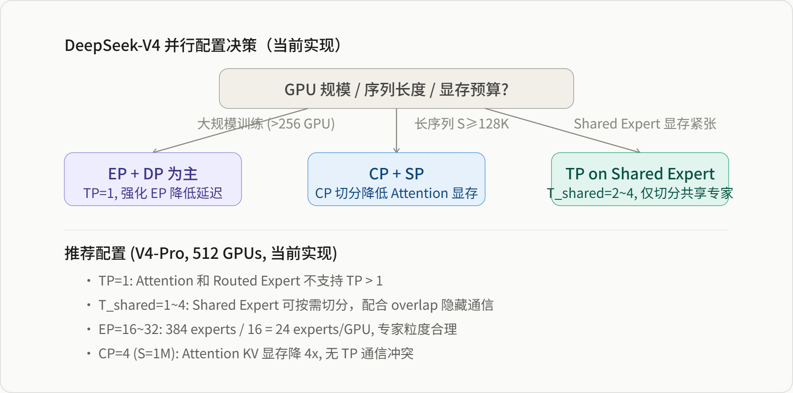

# DeepSeek-V4 Tensor Parallel 切分方案深度解析

*基于 Megatron-LM dev 分支源码的实证分析 · CSA/HCA · MoE · mHC · 通信量与 Overlap*

> **源基线**: Megatron-LM `dev` @ `232c478d4`（2026-06-16）· DSv4 源码 `megatron/core/transformer/experimental_attention_variant/{deepseek_v4_hybrid_attention,csa}.py`、`moe/experts.py`、`hyper_connection.py` 等。
> **维度**: 工程实现（框架层）。**审计/移库**: 2026-06-25（自 `02_train_frameworks/` 移入 `megatron-lm/`；核查 `deepseek_v4_hybrid_attention.py:92` 仍为 `get_pg_size(tp)==1`、`:447` 仍为 `parallel_mode='duplicated'`，行号较旧稿有数行漂移）。
> **与模型页的分工**: 模型侧无 TP 专页；本页是 V4 在 Megatron 的 *TP 切分实现*（强制 TP=1 的架构动因），与论文级架构 [[13_deepseek_v4_analysis]] / [[26_deepseek_v4_technical_deepdive]] 互补。

**目录**

-   关键发现：V4 TP 的真实面貌
-   为什么 V4 选择 TP=1：架构与工程考量
-   Attention 层：TP size = 1 的设计约束
-   Compressor/Indexer：Duplicated 模式
-   mHC：非 TP-aware 的梯度同步方案
-   MoE 层：Shared Expert TP vs Routed Expert 限制
-   通信量修正分析
-   TP 通信掩盖方案：Bulk vs Pipelined Overlap
-   结论与配置建议

## 一 关键发现：V4 TP 的真实面貌

> **核心发现 1：DSv4 Hybrid Attention 当前只支持 TP size = 1**  
> 源码中明确断言：`assert get_pg_size(self.pg_collection.tp) == 1, "DSv4 Hybrid Attention only supports TP size 1."`（`deepseek_v4_hybrid_attention.py:87-88`）。这意味着当前 Megatron-LM dev 分支中，V4 的 Attention 层**不执行任何 TP 切分**，所有 Attention 计算在每个 rank 上完整重复。

> **核心发现 2：Compressor 与 Indexer 均为 Duplicated 模式**  
> `Compressor.linear_wkv`、`Compressor.linear_wgate`、`CSAIndexer.linear_wq_b`、`CSAIndexer.linear_weights_proj` 的 `build_module` 调用均传入 `parallel_mode="duplicated"`（`csa.py:297,309,460,473`）。这四个线性层在 TP 组内全量复制，不产生 TP 通信。

> **核心发现 3：mHC 使用原生 nn.Linear，非 TP-sharded**  
> `HyperConnectionModule.mapping_proj = nn.Linear(self.n * self.hidden_size, self.n * self.n + 2 * self.n, bias=False)`（`hyper_connection.py:150-151`）。mHC 不通过 Column/Row Parallel 切分权重，而是依赖 `sequence_parallel` 属性触发梯度 AllReduce（`hyper_connection.py:195-200`）。

> **核心发现 4：Routed Expert 的 fused GroupedMLP 不支持 Expert TP > 1**  
> `TEGroupedMLP._is_fusable()` 中明确检查：`if self.tp_group.size() > 1: return _unsupported(f"expert TP > 1 (tp_size={self.tp_group.size()})")`（`experts.py:328-329`）。当前 fused 专家计算路径下，expert 内部不做 TP 切分。

| 模块 | 先前推断 | 源码实际 | 关键代码位置 |
| --- | --- | --- | --- |
| DSv4 Attention | Column+Row Parallel TP 切分 | **TP size 必须 = 1**，不 TP 切分 | `deepseek_v4_hybrid_attention.py:87` |
| q_down_proj | ColumnParallel | **Duplicated** (tp_group=None) | `deepseek_v4_hybrid_attention.py:427-439` |
| q_up_proj | ColumnParallel | ColumnParallel 接口 (gather_output=False)，但 TP=1 不生效 | `deepseek_v4_hybrid_attention.py:442-454` |
| kv_proj | ColumnParallel | ColumnParallel 接口 (gather_output=False)，但 TP=1 不生效 | `deepseek_v4_hybrid_attention.py:456-468` |
| output_proj | RowParallel | RowParallel 接口 (input_is_parallel=True)，但 TP=1 不生效 | `deepseek_v4_hybrid_attention.py:183-195` |
| o_group_proj | RowParallel 或 ColumnParallel | **nn.Parameter**，不分片 | `deepseek_v4_hybrid_attention.py:172-179` |
| Compressor | ColumnParallel | **Duplicated** (parallel_mode="duplicated") | `csa.py:288,300` |
| CSAIndexer | ColumnParallel | **Duplicated** (parallel_mode="duplicated") | `csa.py:451,464` |
| mHC mapping_proj | Column+Row Parallel | **nn.Linear**，SP 梯度同步 | `hyper_connection.py:150` |
| MoE Shared Expert | 标准 TP 切分 | 标准 TP 切分 (pg_collection.tp) | `shared_experts.py:118` |
| MoE Routed Expert (fused) | ETP 切分 | **不支持 TP > 1** | `experts.py:328-329` |

## 一.五 为什么 V4 选择 TP=1：架构与工程考量

TP=1 不是实现上的临时妥协，而是 V4 架构的**结构性选择**。从源码和架构两个维度分析，核心原因有五层：

### 1.1 压缩操作的全局性：无法在 TP 边界分片

CSA 的 `Compressor` 和 `Indexer` 是整个 Attention 路径中最关键也最特殊的操作，它们的计算特性决定了不适合 TP 切分。

**Compressor** 在序列维度执行 `softmax(score, dim=1).sum(dim=1)` 的归约（`csa.py:377`）。这个操作将 `ratio` 个 token 压缩为 1 个，涉及跨 token 的 softmax 和 weighted sum。如果按 head/output 维度 TP 切分，每个 rank 只能看到部分 score，需要额外的 AllGather 才能计算正确的 softmax 分母——这比标准 Attention 的 TP 同步更复杂。

**CSAIndexer** 的 Top-K 选择（`csa.py:532`）基于全局的 compressed KV 计算索引。若 KV 被 TP 切分，每个 rank 只能索引本地持有的 KV 子集，会丢失全局 Top-K 的准确性。

源码直接通过 `parallel_mode="duplicated"` 规避了这个问题：

```
self.linear_wkv = build_module(..., parallel_mode="duplicated")   # csa.py:297
self.linear_wgate = build_module(..., parallel_mode="duplicated") # csa.py:309
self.linear_wq_b = build_module(..., parallel_mode="duplicated")  # csa.py:460
```

来源：megatron/core/transformer/experimental_attention_variant/csa.py

> **关键结论**：即使 Attention 的其他部分（q_up_proj/kv_proj/output_proj）做了 TP 切分，**Compressor 和 Indexer 仍需在每个 rank 上持有完整输入并重复计算**。因此，TP 的收益会大幅降低：线性层的 FLOPs 可以分摊，但压缩和索引的计算无法分摊。

### 1.2 q_down_proj 的 duplicated 设计：需要完整 hidden states 做压缩

```
self.linear_q_down_proj = build_module(
    ...,
    tp_group=None,           # deepseek_v4_hybrid_attention.py:438
    parallel_mode='duplicated',
)
```

来源：megatron/core/transformer/experimental_attention_variant/deepseek_v4_hybrid_attention.py:427-439

`q_down_proj` 的输出维度是 `q_lora_rank`（通常远小于 hidden_size），但它的输入是完整的 `hidden_states`。更重要的是，`q_down_proj` 的输入 `hidden_states` 同时被 `kv_compressed = hidden_states` 直接复用（`deepseek_v4_hybrid_attention.py:558`），作为 KV 压缩的输入传入 `Compressor`。

如果 `q_down_proj` 做 ColumnParallel，输入 `hidden_states` 需要先 AllGather（因为 RowParallel 的下一层需要完整输入），而 KV 压缩也需要完整的 `hidden_states`——这导致输入侧需要两次全量数据准备，通信收益被抵消。`tp_group=None` 的选择说明设计者认为：**在压缩路径上保持完整输入比 TP 切分更划算**。

### 1.3 o_group_proj 的不可分性：Grouped LoRA 结构

```
_linear_o_group_proj = torch.empty(
    group_proj_out_size, group_proj_in_size, ...
)
self.linear_o_group_proj = torch.nn.Parameter(_linear_o_group_proj)  # deepseek_v4_hybrid_attention.py:172-179
```

来源：megatron/core/transformer/experimental_attention_variant/deepseek_v4_hybrid_attention.py:172-179

输出投影不是标准的线性层，而是 `o_groups` 个独立的 LoRA 投影（`einsum("...gd,grd->...gr", core_attn_out, wo_a_weight)`，`deepseek_v4_hybrid_attention.py:376`）。这个分组的 einsum 操作在 `o_groups` 维度上需要完整的注意力输出。

如果强行 TP 切分，需要在 einsum 前 AllGather 完整的 attention 输出（跨越 head 维度），然后在 einsum 后再按 hidden_size 维度重新分片——这种复杂的通信模式使得标准 Column/Row Parallel 无法直接套用。`nn.Parameter` 的手动创建绕过了 Megatron 的 TP 切分基础设施。

### 1.4 延续 V3 的设计哲学：弱化 TP，强化 EP+DP

DeepSeek-V3 的训练 infra 明确声明 **"No tensor parallelism needed"**。V4 延续了这一哲学：

| 维度 | V3 | V4 (当前实现) |
| --- | --- | --- |
| Attention | MLA, TP=1 | MLA + CSA/HCA, **TP=1** |
| MoE | EP + DP | EP + DP, Routed Expert **TP=1** |
| 主要通信 | EP All-to-All | EP All-to-All + CP Ring-AG |

V3/V4 的每 token 激活参数量很小（V3 37B，V4 的 CSA/HCA 进一步降低了激活量），通过 **EP（Expert Parallelism）** 和 **DP（Data Parallelism）** 就能将模型分布到集群。TP 的收益前提是单 layer 的参数量或激活量足够大，以至于切分后每个 rank 的计算量显著减少。但 V4 的：

-   **Attention 层**：由于 MLA 的 KV 共享和 CSA 的压缩，Attention 的激活占用已经很小
-   **MoE 层**：Routed Expert 通过 EP 已经将 expert 分布到不同 GPU，TP 进一步切分 expert 的边际收益有限

在 `experts.py:328-329` 中，`TEGroupedMLP` 明确拒绝 `TP > 1`：

```
if self.tp_group.size() > 1:
    return _unsupported(f"expert TP > 1 (tp_size={self.tp_group.size()})")
```

来源：megatron/core/transformer/moe/experts.py:328-329

> **这表明 NVIDIA/Megatron-LM 团队在 fused kernel 路径上也不认为 Expert TP 是当前 priority**。

### 1.5 通信开销与计算密度的权衡

假设未来移除 `assert tp == 1`，V4 Attention 的 TP 通信量包括：

-   `q_up_proj` AllGather: `S·B·num_heads·q_head_dim × (T-1)/T`
-   `kv_proj` AllGather: `S·B·v_head_dim × (T-1)/T`
-   `output_proj` ReduceScatter: `S·B·H × (T-1)/T`

但注意这些通信的收益是：

-   **线性层参数量分摊**：`q_up_proj`、`kv_proj`、`output_proj` 的参数量被 T 除
-   **Attention 核心计算不分摊**：因为 `Compressor` 和 `Indexer` 是 duplicated，每个 rank 仍需执行完整的压缩和索引
-   **o_group_proj 不分摊**：这是 `nn.Parameter`，无法通过 TP 分片

与标准 Dense Attention 相比，V4 的 TP 收益被压缩路径的 duplicated 计算抵消。设计者可能评估后认为：**TP 节省的显存和线性层计算量，不足以覆盖额外的 AllGather/ReduceScatter 通信开销，尤其是在长序列（S=1M）场景下**。

> **接口预留的深意**：ModuleSpec 层面保留了 Column/Row Parallel 接口（`backend.column_parallel_linear()` / `backend.row_parallel_linear()`），但 `__init__` 中加了 `assert tp == 1`——**接口为未来预留，但当前实现选择不走 TP 路径**。这是一种务实的工程策略：不阻塞未来的 TP 扩展，但也不在当前引入未经验证的复杂切分逻辑。

## 二 Attention 层：TP size = 1 的设计约束

### 2.1 源码中的 TP 接口与运行时约束

尽管 DSv4 Hybrid Attention 强制 TP=1，其 `build_module` 调用仍保留了标准的 Column/Row Parallel 接口参数。这表明当前实现为 future 的 TP 支持预留了接口，但尚未激活。

```
# DSv4HybridSelfAttention.__init__ (deepseek_v4_hybrid_attention.py:397-479)

# 1. q_down_proj: 明确指定 tp_group=None, parallel_mode="duplicated"
q_down_proj_kwargs = {}
if submodules.linear_q_down_proj in [TELinear]:
    q_down_proj_kwargs['parallel_mode'] = 'duplicated'
self.linear_q_down_proj = build_module(
    submodules.linear_q_down_proj,
    self.config.hidden_size, self.config.q_lora_rank,
    config=self.config, init_method=self.config.init_method,
    bias=False, tp_group=None,           # ← tp_group=None
    **q_down_proj_kwargs,
)

# 2. q_up_proj: ColumnParallel 接口, gather_output=False
self.linear_q_up_proj = build_module(
    submodules.linear_q_up_proj,
    self.config.q_lora_rank, self.config.num_attention_heads * self.q_head_dim,
    config=self.config, init_method=self.config.init_method,
    gather_output=False,                  # ← ColumnParallel 语义
    tp_group=pg_collection.tp,            # ← 但 TP=1, 不实际分片
)

# 3. kv_proj: ColumnParallel 接口, gather_output=False
self.linear_kv_proj = build_module(
    submodules.linear_kv_proj,
    self.config.hidden_size, self.config.v_head_dim,
    config=self.config, init_method=self.config.init_method,
    gather_output=False,                  # ← ColumnParallel 语义
    tp_group=pg_collection.tp,            # ← 但 TP=1, 不实际分片
)

# 4. output_proj: RowParallel 接口, input_is_parallel=True
self.linear_proj = build_module(
    submodules.linear_proj,
    linear_proj_in_size, self.config.hidden_size,
    config=self.config, init_method=self.config.output_layer_init_method,
    input_is_parallel=True,               # ← RowParallel 语义
    tp_group=self.pg_collection.tp,       # ← 但 TP=1, 不实际分片
)
```

来源：megatron/core/transformer/experimental_attention_variant/deepseek_v4_hybrid_attention.py

### 2.2 ModuleSpec 中的后端映射

在 `experimental_attention_variant_module_specs.py:187-194` 中，backend 对 DSv4 Attention 各子模块的映射如下：

```
attention = ModuleSpec(
    module=DSv4HybridSelfAttention,
    submodules=DSv4HybridSelfAttentionSubmodules(
        linear_q_down_proj=backend.linear(),           # ← 非并行
        linear_q_up_proj=backend.column_parallel_linear(),  # ← ColumnParallel
        linear_kv_proj=backend.column_parallel_linear(),    # ← ColumnParallel
        core_attention=core_attention,
        linear_proj=backend.row_parallel_linear(),     # ← RowParallel
        q_layernorm=qk_norm,
        kv_layernorm=qk_norm,
    ),
)
```

来源：megatron/core/models/gpt/experimental_attention_variant_module_specs.py:183-196

> **设计意图解读**：ModuleSpec 层面已经定义了标准的 Column+Row Parallel 映射（q_up_proj/kv_proj 为 column_parallel，output_proj 为 row_parallel，q_down_proj 为 duplicated），但 `DSv4HybridAttention.__init__` 中的 `assert tp == 1` 在运行时阻断了这些切分的实际生效。这是一种"接口就绪、实现待定"的工程策略。

### 2.3 o_group_proj：完全不分片的参数

Grouped Output 的 LoRA 投影 `linear_o_group_proj` 直接以 `nn.Parameter` 创建，未经过 `build_module`，因此不受任何 TP 切分：

```
_linear_o_group_proj = torch.empty(
    group_proj_out_size, group_proj_in_size,
    device=torch.cuda.current_device(), dtype=self.config.params_dtype,
)
self.config.init_method(_linear_o_group_proj)
self.linear_o_group_proj = torch.nn.Parameter(_linear_o_group_proj)
```

来源：megatron/core/transformer/experimental_attention_variant/deepseek_v4_hybrid_attention.py:172-179

> **显存影响**：由于 TP=1，每个 rank 都持有完整的 Attention 层参数。对于 V4-Pro（hidden_size=7168, num_heads=128），`linear_q_up_proj` 的参数量为 `q_lora_rank * num_heads * q_head_dim`，`linear_proj` 的参数量为 `o_groups * o_lora_rank * hidden_size`。在 512 GPU 集群上，Attention 层的参数不随 GPU 数量分摊，这是当前实现的主要显存瓶颈。

## 三 Compressor/Indexer：Duplicated 模式

### 3.1 Compressor 的 Duplicated 设计

CSA/HCA 的 KV 压缩器包含两个线性层 `linear_wkv`（值投影）和 `linear_wgate`（门控投影），均标记为 `parallel_mode="duplicated"`：

```
self.linear_wkv = build_module(
    submodules.linear_wkv,
    config.hidden_size, proj_out_dim,
    config=config, init_method=config.init_method,
    bias=False, skip_bias_add=False,
    parallel_mode="duplicated",           # ← 全量复制
)
self.linear_wgate = build_module(
    submodules.linear_wgate,
    config.hidden_size, proj_out_dim,
    config=config, init_method=config.init_method,
    bias=False, skip_bias_add=False,
    parallel_mode="duplicated",           # ← 全量复制
)
```

来源：megatron/core/transformer/experimental_attention_variant/csa.py:288-309

### 3.2 CSAIndexer 的 Duplicated 设计

索引器同样采用 duplicated 模式：

```
self.linear_wq_b = build_module(
    submodules.linear_wq_b,
    self.q_lora_rank, self.index_n_heads * self.index_head_dim,
    config=config, init_method=config.init_method,
    bias=False, parallel_mode="duplicated",
)
self.linear_weights_proj = build_module(
    submodules.linear_weights_proj,
    self.hidden_size, self.index_n_heads,
    config=config, init_method=config.init_method,
    bias=False, parallel_mode="duplicated",
)
```

来源：megatron/core/transformer/experimental_attention_variant/csa.py:451-474

> **Duplicated 模式的含义**：在 Megatron-LM 的 TELinear 中，`parallel_mode="duplicated"` 表示权重在 TP 组内每个 rank 上完整复制，计算时各 rank 独立执行相同的矩阵乘法。这与标准的 ColumnParallel（权重按输出维度切分）和 RowParallel（权重按输入维度切分）不同——Duplicated 不减少单层的参数量，也不引入 AllGather/ReduceScatter 通信。

> **为什么 Compressor/Indexer 不 TP 切分？**  
> 1\. **输出维度小**：`proj_out_dim = coff * head_dim`，当 compress_ratio=4 时 `coff=2`，`head_dim` 通常 64-128，输出维度仅 128-256，切分粒度太细。  
> 2\. **序列压缩的操作特性**：压缩涉及 `softmax(score, dim=1).sum(dim=1)` 的归约操作，跨 TP rank 分片会引入额外的同步逻辑。  
> 3\. **计算占比低**：Compressor 的 FLOPs 远低于 Attention 核心，TP 切分的收益无法覆盖通信开销。

## 四 mHC：非 TP-aware 的梯度同步方案

### 4.1 mHC 的架构特殊性

mHC（Manifold-Constrained Hyper-Connections）在 V4 中引入 n-stream 残差流，其核心映射矩阵通过原生 `nn.Linear` 定义：

```
class HyperConnectionModule(MegatronModule):
    def __init__(self, config: TransformerConfig, layer_number: int):
        super().__init__(config)
        self.n = config.num_residual_streams
        self.hidden_size = config.hidden_size

        # 原生 nn.Linear，非 TP-aware
        self.mapping_proj = nn.Linear(
            self.n * self.hidden_size, self.n * self.n + 2 * self.n, bias=False
        )

        # 可学习的缩放因子
        self.alpha_pre = nn.Parameter(torch.full((1,), init_alpha))
        self.alpha_post = nn.Parameter(torch.full((1,), init_alpha))
        self.alpha_res = nn.Parameter(torch.full((1,), init_alpha))
        self.bias = nn.Parameter(torch.zeros(self.n * self.n + 2 * self.n))
```

来源：megatron/core/transformer/hyper_connection.py:137-161

### 4.2 Sequence Parallel 梯度同步

由于 `mapping_proj` 不是 ColumnParallel 或 RowParallel，Megatron-LM 的 TP 梯度同步机制不会自动对其执行 AllReduce。取而代之的是，mHC 手动设置 `sequence_parallel` 属性：

```
def _init_weights(self) -> None:
    nn.init.xavier_uniform_(self.mapping_proj.weight)

    # sequence_parallel 属性触发梯度 AllReduce
    if self.config.sequence_parallel:
        setattr(self.mapping_proj.weight, 'sequence_parallel', True)
        setattr(self.alpha_pre, 'sequence_parallel', True)
        setattr(self.alpha_post, 'sequence_parallel', True)
        setattr(self.alpha_res, 'sequence_parallel', True)
        setattr(self.bias, 'sequence_parallel', True)
```

来源：megatron/core/transformer/hyper_connection.py:187-200

> **SP 属性工作机制**：在 Megatron-LM 的 DDP/DP 梯度同步路径中，拥有 `sequence_parallel` 属性的参数会在反向传播后执行 AllReduce（或 ReduceScatter + AllGather，取决于具体实现）。这确保了即使 `mapping_proj` 不是 TP-sharded，其梯度仍能在 TP 组内同步，维持各 rank 参数一致。

> **与标准 TP 的区别**：标准 ColumnParallel 在 forward 时输出分片（减少激活显存），backward 时通过 AllReduce 同步梯度；而 mHC 的 `nn.Linear` 在 forward 时输出完整（不减少激活显存），backward 时仅通过 SP 属性同步梯度。这意味着 mHC 的 TP 收益仅限于梯度同步，无法分摊前向计算的激活显存。

### 4.3 mHC 的前向计算流程

mHC 的核心计算不涉及任何 TP 通信：

```
def compute_mappings(self, x: Tensor) -> Tuple[Tensor, Tensor, Tensor]:
    s, b, _ = x.shape
    proj, r = self._projection_and_get_norm(x)   # mapping_proj + RMS norm
    h_pre, h_post, h_res = self._compute_h(proj, r)
    h_res = self._sinkhorn_op(                     # Sinkhorn-Knopp 投影
        h_res.view(s, b, self.n, self.n),
        self.sinkhorn_iterations, self.norm_eps
    )
    return h_pre, h_post, h_res
```

来源：megatron/core/transformer/hyper_connection.py:246-269

> **TileLang 融合优化**：当 `config.use_fused_mhc=True` 时，mHC 使用 fused cuTile kernel（`fused_sinkhorn`、`fused_h_aggregate`、`fused_h_post_bda`）替代 Python 参考实现。这些 fused kernel 在单卡内完成所有计算，不涉及跨 rank 通信。TileLang 融合将 mHC 的 wall-time 开销降至 ~6.7%。

## 五 MoE 层：Shared Expert TP vs Routed Expert 限制

### 5.1 Shared Expert：标准 TP 切分

V4 的 Shared Expert 继承自标准的 MLP 实现，明确使用 `pg_collection.tp` 进行 TP 切分：

```
class SharedExpertMLP(MLP):
    def __init__(self, config, submodules, gate, pg_collection=None):
        config.ffn_hidden_size = config.moe_shared_expert_intermediate_size
        super().__init__(config=config, submodules=submodules,
                         tp_group=pg_collection.tp)   # ← 标准 TP
```

来源：megatron/core/transformer/moe/shared_experts.py:112-118

Shared Expert 内部包含 `linear_fc1`（ColumnParallel）和 `linear_fc2`（RowParallel），其行为与 Dense FFN 的 TP 策略完全一致：

```
# Shared Expert 的前向包含标准 TP 通信
output, _ = super().forward(hidden_states)   # MLP forward: FC1(AG) → Act → FC2(RS)
if self.use_shared_expert_gate:
    logits = torch.nn.functional.linear(hidden_states, self.gate_weight)
    gate_score = torch.nn.functional.sigmoid(logits)
    output = output * gate_score
```

来源：megatron/core/transformer/moe/shared_experts.py:184-191

### 5.2 Routed Expert：Fused GroupedMLP 不支持 TP > 1

Routed Expert 使用 `TEGroupedMLP` 实现，其 fused kernel 路径对 TP 有严格限制：

```
def _is_fusable(self):
    def _unsupported(reason):
        logger.warning("TE fused GroupedMLP not available: %s", reason)
        return False

    # ... 其他检查 ...
    if self.tp_group.size() > 1:
        return _unsupported(f"expert TP > 1 (tp_size={self.tp_group.size()})")
    # ...
```

来源：megatron/core/transformer/moe/experts.py:312-329

> **关键限制**：当 `use_transformer_engine_op_fuser=True` 启用 fused GroupedMLP 时，若 expert TP size > 1，fused kernel 会被禁用，回退到非 fused 路径。在非 fused 路径下，expert 的 TP 切分理论上可行，但当前 dev 分支的默认配置和测试路径均基于 fused kernel（性能关键）。

### 5.3 Expert TP 的向后兼容行为

`parallel_state.py` 中 `get_expert_tensor_parallel_world_size()` 的 fallback 逻辑表明，当 expert TP group 未显式初始化时，默认复用标准的 TP group：

```
def get_expert_tensor_parallel_world_size():
    if _MPU_EXPERT_TENSOR_PARALLEL_WORLD_SIZE is not None:
        return _MPU_EXPERT_TENSOR_PARALLEL_WORLD_SIZE
    # Use tensor parallel group world size for backward compability otherwise
    if not _EXPERT_TENSOR_PARALLEL_GROUP:
        return _MPU_TENSOR_MODEL_PARALLEL_WORLD_SIZE
    else:
        return get_expert_tensor_parallel_group().size()
```

来源：megatron/core/parallel_state.py:1929-1938

> **实际含义**：若用户不显式设置 expert TP size，`pg_collection.expt_tp` 默认等于 `pg_collection.tp`。但在 DSv4 场景下，由于 Attention 强制 TP=1，`pg_collection.tp.size() == 1`，因此 `expt_tp` 也自然为 1，fused GroupedMLP 的 TP 限制不会触发。

### 5.4 Router 的 TP 策略

Router 在 `__init__` 中接收 `tp_group=pg_collection.tp`，但其权重通常不切分（输出维度 = num_experts，与 hidden_size 无关）：

```
class Router(nn.Module):
    def __init__(self, config, pg_collection):
        self.tp_group = pg_collection.tp
        # Router 权重不切分，各 rank 持有完整参数
```

来源：megatron/core/transformer/moe/router.py 相关逻辑

> **Router 不切分的原因**：Router 输出维度 = num_experts（如 384），远小于 hidden_size（7168）。按 TP 切分会导致各 rank 只负责部分 expert 的 score，需要在 Top-K 前 AllGather，增加 dispatch 前的同步延迟。当前实现选择让每个 rank 持有完整 router，本地计算完整 routing score。

## 六 通信量修正分析

### 6.1 符号定义

| 符号 | 含义 | V4-Pro 取值 |
| --- | --- | --- |
| $S$ | 序列长度 | 1M (max) |
| $B$ | batch size (per DP rank) | varies |
| $H$ | hidden size | 7168 |
| $T$ | TP size | 1 (DSv4 Attn 强制) |
| $T_{\mathrm{shared}}$ | Shared Expert TP size | 通常为 1 或 4 |
| $E$ | expert intermediate dim | 3072 |
| $N_{\mathrm{exp}}$ | 路由专家总数 | 384 |
| $K$ | 每 token 激活专家数 | 6 |
| $m$ | CSA 压缩率 | 4 |
| $m'$ | HCA 压缩率 | 128 |
| $n_h$ | query 头数 | 128 |

### 6.2 DSv4 Attention 层通信量（TP=1）

> **Forward:**  
> q_down_proj: 无 TP 通信 (duplicated, tp_group=None)  
> q_up_proj: 无 TP 通信 (TP=1, gather_output=False 不触发 AG)  
> kv_proj: 无 TP 通信 (TP=1)  
> linear_proj: 无 TP 通信 (TP=1, input_is_parallel=True 不触发 RS)  
> o_group_proj: 无 TP 通信 (nn.Parameter, 不分片)  
> Compressor: 无 TP 通信 (parallel_mode="duplicated")  
> Indexer: 无 TP 通信 (parallel_mode="duplicated")  
> **Attention 层 Forward TP 通信总计 = 0 bytes**  
>   
> **Backward:**  
> Weight grad AllReduce (q_up_proj, kv_proj, output_proj): 无 (TP=1 时 AllReduce 退化为本地累加)  
> Duplicated 层的 grad: 各 rank 独立计算，无同步  
> **Attention 层 Backward TP 通信总计 = 0 bytes**

> **重大修正**：先前分析假设 CSA Attention 有 ~4.5x S·B·H 的 TP 通信，但实际源码中 DSv4 Hybrid Attention 强制 TP=1，且 Compressor/Indexer 均为 duplicated 模式，**Attention 层不产生任何 TP 通信**。Attention 的计算和参数在每个 rank 上完全重复。

### 6.3 Shared Expert 通信量（TP 可能 > 1）

> **Forward (per token):**  
> FC1 AllGather: S·B·H × (T_shared-1)/T_shared bytes  
> FC2 ReduceScatter: S·B·H × (T_shared-1)/T_shared bytes  
> **Shared Expert Forward TP 通信 = 2 × S·B·H × (T_shared-1)/T_shared**  
>   
> **Backward:**  
> FC1 grad AllReduce: 2 × S·B·H × 2(T_shared-1)/T_shared  
> FC2 grad AllReduce: 2 × S·B·H × 2(T_shared-1)/T_shared  
> Weight grad AllReduce: 2 × H × E × 2(T_shared-1)/T_shared  
> **Shared Expert Backward TP 通信 ≈ 8 × S·B·H × (T_shared-1)/T_shared**

### 6.4 Routed Expert 通信量（fused 模式下 TP=1）

> **TP 部分:**  
> FC1 AllGather: 0 (TP=1)  
> FC2 ReduceScatter: 0 (TP=1)  
> **Routed Expert TP 通信 = 0**  
>   
> **EP 部分 (All-to-All):**  
> Dispatch: S·B·H·K × 2(ep-1)/ep² bytes  
> Combine: S·B·H·K × 2(ep-1)/ep² bytes  
> **Routed Expert EP 通信 ≈ 4 × S·B·H·K × (ep-1)/ep²**

### 6.5 mHC 通信量

> **Forward:**  
> mHC 前向无 TP 通信（nn.Linear 本地计算）  
> **mHC Forward TP 通信 = 0**  
>   
> **Backward (sequence_parallel=True):**  
> mapping_proj.weight AllReduce: 2 × (n² + 2n) × n·H bytes  
> alpha_pre/post/res AllReduce: 6 × (n + n + n²) bytes  
> bias AllReduce: 2 × (n² + 2n) bytes  
> **mHC Backward SP 通信 ≈ 2 × n² × n·H × 2(T-1)/T**（当 TP > 1 时）  
> **当前 TP=1 时：mHC Backward 通信 = 0**

### 6.6 单层总通信量对比（修正后）

| 层类型 | Forward TP 通信 | Backward TP 通信 | 其他通信 |
| --- | --- | --- | --- |
| DSv4 Attention | 0 | 0 | CP KV AG（若启用 CP） |
| Shared Expert | 2×S·B·H×(T_s-1)/T_s | ~8×S·B·H×(T_s-1)/T_s | 无 |
| Routed Expert (fused) | 0 | 0 | EP A2A Dispatch/Combine |
| mHC | 0 | 0 (TP=1) / ~4n³H (TP>1) | 无 |

> **关键结论**：在 DSv4 的当前 Megatron-LM 实现中，**绝大部分 TP 通信被消除**（因为 TP=1）。集群内的主要跨 rank 通信仅剩：  
> 1\. **EP All-to-All**（MoE dispatch/combine）  
> 2\. **CP Ring AllGather**（若启用 Context Parallelism）  
> 3\. **DP AllReduce**（梯度同步）  
> 这与 V3 的"No tensor parallelism needed"设计哲学一致——V4 延续了弱化 TP、强化 EP+DP 的策略。

## 七 TP 通信掩盖方案：Bulk vs Pipelined Overlap

### 7.1 当前 V4 实现中的 Overlap 状态

由于 DSv4 Attention 和 Routed Expert 当前均强制 TP=1，**Bulk Overlap 和 Pipelined Overlap 在 V4 的 Attention 和 Routed Expert 路径上均不触发**。但 Megatron-LM 的 overlap 机制在 Shared Expert 和潜在的 future TP 支持中仍然有效。

### 7.2 Shared Expert 的 Bulk Overlap

当 Shared Expert 启用 TP（`T_shared > 1`）时，`moe_shared_expert_overlap` 配置会禁用 TP 相关的 AG/RS 通信，改为在 token dispatcher 中手动调度：

```
if self.config.moe_shared_expert_overlap:
    # disable TP related AG/RS communications in the linear module
    for linear in [self.linear_fc1, self.linear_fc2]:
        if hasattr(linear, 'parallel_mode'):
            linear.parallel_mode = None
            linear.ub_overlap_rs_fprop = False
            linear.ub_overlap_ag_dgrad = False
            linear.ub_overlap_ag_fprop = False
            linear.ub_overlap_rs_dgrad = False
```

来源：megatron/core/transformer/moe/shared_experts.py:147-159

> **Shared Expert Overlap 设计**：当 `moe_shared_expert_overlap=True` 时，Shared Expert 的 TP 通信被显式关闭，其计算被调度到独立的 CUDA stream 上，与 token dispatcher 的 EP All-to-All 重叠。这是一种**跨模块 overlap**（Shared Expert compute ∥ EP dispatch），而非传统的 TP Bulk Overlap。

### 7.3 潜在的 future TP Overlap（接口层面）

尽管当前 V4 Attention TP=1，ModuleSpec 和 build_module 的接口已为 future 的 TP 支持预留了通信 buffer 名称：

```
# Attention 各线性层的 tp_comm_buffer_name
self.linear_q_down_proj = build_module(..., tp_comm_buffer_name='q_down_proj', ...)
self.linear_q_up_proj = build_module(..., tp_comm_buffer_name='q_up_proj', ...)
self.linear_kv_proj = build_module(..., tp_comm_buffer_name='kv_up_proj', ...)
self.linear_proj = build_module(..., tp_comm_buffer_name='proj', ...)
```

来源：deepseek_v4_hybrid_attention.py 各 build_module 调用

> **Future TP 支持的通信量预测**：若未来移除 `assert tp == 1` 的限制，V4 Attention 的 TP 通信量将与标准 MLA 类似：  
> \- q_up_proj (ColumnParallel): AG = S·B·num_heads·q_head_dim × (T-1)/T  
> \- kv_proj (ColumnParallel): AG = S·B·v_head_dim × (T-1)/T  
> \- output_proj (RowParallel): RS = S·B·H × (T-1)/T  
> \- **Forward 总计 ≈ 2 × S·B·H × (T-1)/T**（q_up_proj + kv_proj + output_proj，假设 q_head_dim·num_heads ≈ H）  
> 这与标准 Dense Attention 的 2×S·B·H 通信量相当，Compressor/Indexer 的 duplicated 设计使其不参与 TP 通信。

## 八 结论与配置建议

### 8.1 V4 TP 切分的真实特征

> **特征 1：Attention 层当前无 TP 切分** — DSv4 Hybrid Attention 的 `assert tp == 1` 和 Compressor/Indexer 的 `parallel_mode="duplicated"` 共同决定了 Attention 层在每个 rank 上完整重复计算。这是当前实现与先前推断分析最根本的差异。

> **特征 2：mHC 非 TP-sharded** — mHC 的 `nn.Linear` 不通过 Column/Row Parallel 切分，仅依赖 `sequence_parallel` 属性进行梯度同步。其前向计算无 TP 通信，但激活显存无法通过 TP 分摊。

> **特征 3：Routed Expert 的 fused 路径不支持 TP > 1** — `TEGroupedMLP._is_fusable()` 的 TP 限制意味着在性能关键的 fused kernel 路径下，expert 内部不做 TP 切分。Shared Expert 保留标准 TP 切分，但可通过 `moe_shared_expert_overlap` 与 EP 通信重叠。

> **特征 4：接口已预留 future TP 支持** — q_up_proj/kv_proj 的 `gather_output=False`、output_proj 的 `input_is_parallel=True`、以及各层的 `tp_comm_buffer_name`，均为未来移除 TP=1 限制后的切分做好了准备。

### 8.2 配置决策树（基于实际源码）



*图：DeepSeek-V4 并行配置决策树（基于当前源码实现）*

### 8.3 与 V3 设计哲学的延续

> **一句话总结**：DeepSeek-V4 在 Megatron-LM dev 分支中的当前实现延续了 V3 "弱化 TP、强化 EP+DP" 的设计哲学。DSv4 Hybrid Attention 强制 TP=1，Compressor/Indexer 采用 duplicated 模式，mHC 使用非 TP-aware 的 nn.Linear，Routed Expert 的 fused 路径不支持 TP > 1。因此，V4 的跨 rank 通信主要由 EP All-to-All 和 CP Ring-AG 承载，而非 TP 的 AllGather/ReduceScatter。Shared Expert 是唯一的标准 TP 切分点，但可通过 overlap 与 EP 通信隐藏。

> **Future Work**：若未来需要在大规模集群（>1024 GPU）上训练 V4 且单卡显存成为瓶颈，可考虑：  
> 1\. 移除 `DSv4HybridAttention` 的 `assert tp == 1` 限制，激活 q_up_proj/kv_proj 的 ColumnParallel 和 output_proj 的 RowParallel。  
> 2\. 为 Compressor/Indexer 实现细粒度的 TP 切分（需解决序列压缩的跨 rank 同步问题）。  
> 3\. 将 mHC 的 `nn.Linear` 替换为 Column+Row Parallel 实现，激活 TP 对激活显存的分摊。  
> 4\. 在 Routed Expert 的非 fused 路径中支持 ETP（需权衡 fused kernel 的性能损失）。

---

## 相关页面

**模型侧（论文级，01_theory）** — 本页讲 Megatron 的 TP 实现，下列讲架构动因：
- [[13_deepseek_v4_analysis]] — V4 整体架构（为何弱化 TP、强化 EP+DP）
- [[26_deepseek_v4_technical_deepdive]] — CSA/HCA/DSA 机制（压缩操作的全局性 = TP=1 的根因）
- [[25_mhc_analysis]] — 流形约束超连接（本页 §四 讲其非 TP-aware 梯度同步）
- [[30_deepseek_v4_audit_analysis]] — V4 wiki 对正式版审计

**框架侧（Megatron-LM，本目录）**：
- [[35_deepseek_v4_context_parallel_analysis]] — V4 CP 实现（姊妹页）
- [[12_megatron_tp_analysis]] — 通用 TP 机制　· [[25_megatron_nonuniform_tp_analysis]] — 非均匀 TP　· [[14_megatron_ep_analysis]] — 专家并行　· [[01_megatron_moe_training_optimization_analysis]] — MoE 训练优化
