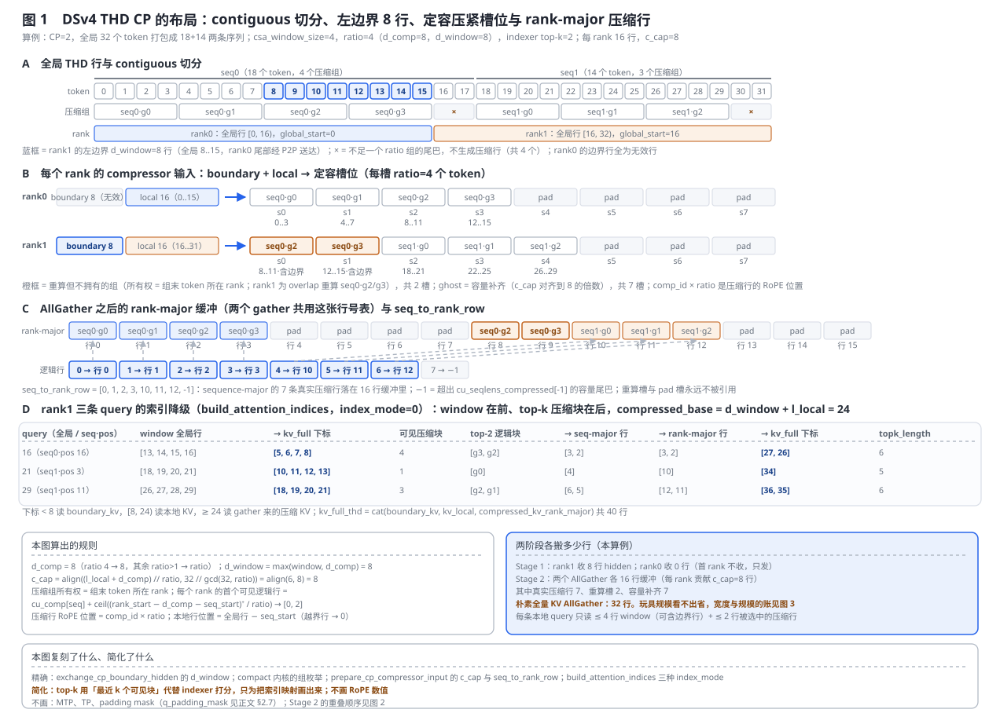
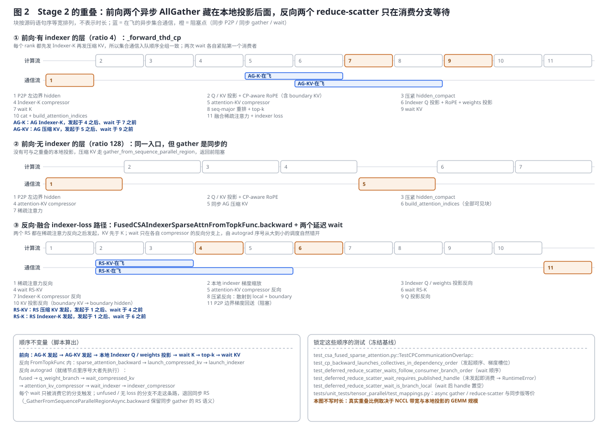
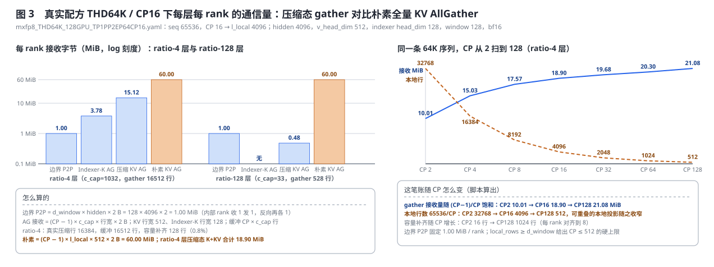
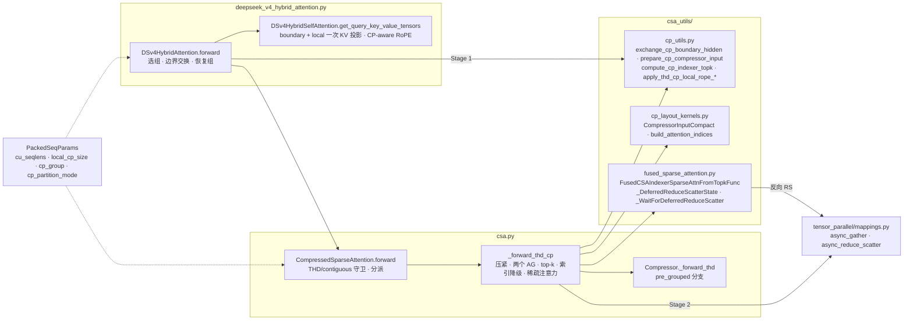

# DeepSeek-V4 Hybrid Attention 的上下文并行：边界交换、压缩态 gather 与通信重叠

> **源码基线**：`NVIDIA/Megatron-LM@85902ef599ea4eb06ada7567a479c524b605767a`（`dev`，2026-09-01）
> **主题**：压缩稀疏注意力为什么不能套用 Ring 或全量 KV AllGather，以及 Megatron 给 DSv4 Hybrid Attention 走的这条 CP 数据面——contiguous THD 分片、带 autograd 所有权的左边界 hidden P2P、定容压紧的 compressor 输入与 rank-major 压缩行、两个异步 AllGather 与本地投影的重叠、反向的延迟 reduce-scatter；再展开 CP 下的 indexer loss、CP-aware RoPE、Dynamic CP 组的消费与 CUDA graph 共存。核心代码在 `megatron/core/transformer/experimental_attention_variant/csa_utils/` 与 `csa.py`。
> **适用范围**：DSv4 的 CP 数据面与它读取的配置字段；CP 进程组、`cp_comm_type`、hierarchical CP 与 `cp_partition_mode` 转换器归 [[13_megatron_cp_analysis]]，packing 与 Dynamic CP 的调度和选组归 [[29_megatron_packed_dataset_dynamic_cp_analysis]]，TP=1、参数所有权与融合内核族归 [[34_deepseek_v4_tensor_parallel_analysis]]。
> **最近更新**：2026-09-07。按房子形状重写，新增三张生成图与布局 / 顺序 / 通信量的复刻回归。

---

## 1. 特性概览

### 1.1 问题背景

DSv4 的每个 attention 层是三种东西的混合：`csa_window_size` 宽的滑动窗口、按 `compress_ratio` 把 token 分组池化出来的压缩 KV，以及 ratio 为 4 的层上再加一个学出来的 indexer 做 top-k 检索。标准 CP 假定每个 rank 的 query 要看到全部 rank 的 KV，于是要么 Ring 传 KV 分块、要么把 KV 整个 AllGather；配合因果 mask 还要 zigzag 切分来均衡负载。DSv4 的依赖结构不是这样：窗口只依赖左邻居的固定几行，压缩块的分组按序列内位置整除、跨 rank 边界的组要能从相邻 rank 拿到原始 hidden，indexer 与稀疏注意力要看到的是**压缩后**的全局 K 和 KV 而不是原始 KV。把这三条依赖硬塞进 Ring 会让每个 rank 传输整段 KV 却只用一小角；zigzag 更直接破坏了「压缩组由连续 token 构成」这一前提。冻结基线因此给 DSv4 单独铺了一条 CP 路径，并在配置层把它与通用 CP 隔开。

### 1.2 解决方法

数据面锁定 `cp_partition_mode='contiguous'` 的 THD 分片：rank $r$ 持有全局行 $[r\cdot l_{\mathrm{local}},(r+1)\cdot l_{\mathrm{local}})$。跨 rank 依赖被拆成两类，各配一种通信。**Stage 1**：每个 rank 从左邻居收固定 `d_window = max(csa_window_size, d_comp)` 行 hidden（`_LeftBoundaryExchange`，前向 `batch_isend_irecv` 后立即 wait，反向把边界梯度送回 owner 累加），收到后在本地把边界行与本地行一起过 KV 投影，得到 `boundary_kv`；**Stage 2**：用 cuTe 内核把边界行与本地行压紧成定容的 compressor 输入，本地算出压缩 Indexer-K 与压缩 KV，各发一个异步 AllGather，在飞期间做 indexer 的 Q / weights 投影与 CP-aware RoPE，top-k 前等 K、attention 前等 KV；最终 KV 是 `cat(boundary_kv, kv_local, compressed_kv_rank_major)`，索引由 `build_attention_indices` 一次降到这张表的物理下标。反向里两个 AllGather 的梯度是两个 reduce-scatter，`FusedCSAIndexerSparseAttnFromTopkFunc.backward` 在稀疏注意力反向之后先后发起它们，`_WaitForDeferredReduceScatter` 让 wait 只落在消费该梯度的 autograd 分支上。Dynamic CP 组由 `PackedSeqParams` 携带，attention 入口替换、返回前恢复。

### 1.3 收益、开销和约束

| 维度 | 直接收益 | 必付成本或边界 |
|---|---|---|
| 通信量 | 只搬 `d_window` 行 hidden 和压缩行；配方 THD64K/CP16 下 ratio-4 层每 rank 接收 18.90 MiB，对比朴素全量 KV AllGather 的 60.00 MiB（§2.9） | 每个 AllGather 缓冲是 `CP × c_cap` 行的定容布局，含重算槽与容量补齐；ratio-4 层再多一个 Indexer-K gather |
| 重叠 | 两个 AllGather 藏在 indexer 的 Q / weights 投影后面，反向两个 reduce-scatter 藏在投影与 compressor 的反向后面（§2.5、§2.6） | Stage 1 的 P2P 与无 indexer 层的 gather 都是同步的；重叠只存在于有 indexer 且走融合内核的层 |
| 显存 | 每 rank 只持有本地行、`d_window` 行边界和压缩行；`test_thd_cp_peak_allocated_delta_scales_vs_cp1` 要求 CP2 ≤ 0.65、CP4 ≤ 0.35 倍的 CP1 峰值增量 | `kv_full_thd` 是一次真实 `cat`，压缩行在每个 rank 上各存一份 |
| 布局 | 所有形状由 `l_local`、`d_comp`、ratio 在主机端算出，`cu_seqlens` 只在设备端消费，因此 THD CP 可以整层进 CUDA graph（§2.8） | 锁定 contiguous 分片：`total_tokens` 必须整除 CP，每 rank 本地行 ≥ `d_window`，尾部不足 ratio 的 token 不产生压缩行 |
| 组合 | 与 Dynamic CP、MTP、THD CUDA graph 共存 | THD only、self-attention only、TP=1；`MTP + TP>1 + SP` 与 contiguous 的组合被配置层拒绝 |

---

## 2. CP 数据面详细方案

### 2.1 共用算例

全节固定同一个最小算例：CP=2，全局 32 个 token 打包成 18+14 两条序列（两条都不是 4 的倍数，尾巴共 4 个 token 不进压缩），`csa_window_size=4`，ratio=4（于是 d_comp=8、d_window=8），indexer top-k=2；每 rank l_local=16 行，`c_cap=8`。它踩中本特性的四条边界——压缩组跨 rank 边界、序列边界落在一个 rank 内部、有尾巴被丢、每 rank 的 compressor 输入要容量补齐。§2.9 的通信量则用真实配方 `examples/moe_recipes/deepseek_v4_flash/gb200/mxfp8_THD64K_128GPU_TP1PP2EP64CP16.yaml`（seq 65536、CP16、l_local=4096、window 128、`csa_compress_ratios` 含 4 与 128）。三张图的每个数字都由 `tools/figs/svg/megatron_dsv4_cp_figures.mjs` 里复刻自冻结基线的规则算出。

### 2.2 入口分派与 Dynamic CP 组

**责任。** `DSv4HybridAttention.forward` 是唯一入口：先存下静态 `pg_collection.cp`，若 `packed_seq_params.local_cp_size` 非空就要求 `packed_seq_params.cp_group` 也非空（`assert`），把本 microbatch 的动态组写进 `pg_collection.cp`；然后判定 `use_thd_cp = cp_size > 1 and qkv_format == 'thd'`，CP>1 却不是 THD、或 THD CP 却不是 contiguous 都直接 `ValueError`。`CompressedSparseAttention.forward` 再做一遍同样的保存、替换与两条 `ValueError`，按动态组的 size 决定进 `_forward_thd_cp` 还是普通 `_forward_thd`，返回前恢复原组。这就是 Dynamic CP 在 DSv4 侧的全部消费面：它**支持**由 `PackedSeqParams` 携带的组，不负责选组，选组与 reroute 归 [[29_megatron_packed_dataset_dynamic_cp_analysis]]。

**被否掉的替代：在通用 CP 的布局转换器里把 zigzag 转成 contiguous。** [[13_megatron_cp_analysis]] 讲的标准 attention 入口有一个 `convert_module_input_tensors_cp_partition_mode` 转换器，能在 zigzag 与 contiguous 之间做 all-to-all。DSv4 没有走它，而是在 `TransformerConfig.__post_init__` 里直接拒绝 `dsv4_hybrid + zigzag`，并要求 contiguous 只能来自 `sequence_packing_scheduler` 的 THD 输入。源码给的判据是三条 `ValueError` 文案：BSHD 不支持、legacy 切片路径只支持 zigzag、contiguous 只对 `dsv4_hybrid`/`gdn`/`kda` 开放。

> [!note] 分析重建
> 为什么不做「进场转一次布局」：Stage 1 的边界行、Stage 2 的压缩组所有权与 CP-aware RoPE 的 `global_start` 三者都假定本 rank 是全局序列的一段连续区间；若入口先做 all-to-all 再转回去，每层要多两次 A2A 且压缩组仍要跨 rank 重组。这一段是本页按数据依赖重建的理由，源码只给了 `ValueError` 文案。

### 2.3 Stage 1：左边界 hidden 交换与它的反向所有权

**责任。** `csa_utils/cp_utils.py::exchange_cp_boundary_hidden` 先算宽度：`d_comp` 在 ratio 为 4 时是 8、其他 ratio>1 时等于 ratio、ratio ≤ 1 时为 0；`d_window = max(csa_window_size, d_comp)`。然后把 hidden 展平成 `(t, hidden)` 交给 `_LeftBoundaryExchange.apply`。前向里非首 rank 发一个 `irecv` 收左邻居的 `d_window` 行，非末 rank 发一个 `isend` 把自己尾部 `d_window` 行送给右邻居，`batch_isend_irecv` 返回的请求逐个 `wait` 后才返回；rank 0 收到的是全零。反向对称：非首 rank 把 `grad_boundary` 发回左邻居，非末 rank 收右邻居发来的梯度写进自己尾部 `d_window` 行的 `grad_input`。`test_thd_cp_left_boundary_exchange_forward_backward` 锁定了两件事：前向收到的正是左 rank 尾部；反向只有被右邻居当边界消费过的行才有梯度。本地行数少于 `d_window` 时在通信前就 `RuntimeError`。

**为什么 ratio 4 的 `d_comp` 是 8 而不是 4。** `Compressor` 在 ratio 为 4 时 `overlap = True`、`coff = 2`：`_overlap_transform_thd` 把每个压缩组的输入拼成「上一组的前半 + 本组的后半」，一组压缩行要读两组 token。分析推断：rank 边界落在组内任意位置时，本 rank 拥有的第一个组最多需要前一组的 4 行加本组落在左边的 3 行，8 行是这个上界；ratio 128 无 overlap，上界就是 127 行，所以 `d_comp = ratio`。这条只有算式没有源码注释，测试 `test_composed_cp_layout_maps_every_index_and_gradient_to_its_source` 用的 `d_window = 8 if ratio == 4 else ratio` 与它一致。

**被否掉的替代：交换投影后的 KV 而不是 hidden。** 配方里 hidden 是 4096 宽而 KV 只有 512 宽，交换 KV 能省 8 倍字节。源码走的是 `_forward_thd_cp` 注释里自称的「hidden-only boundary exchange and boundary KV projection path」：`DSv4HybridSelfAttention.get_query_key_value_tensors` 把 `boundary_hidden` 与本地 hidden `cat` 后一次过 `linear_kv_proj` 与 `kv_layernorm`，再用 `global_start − boundary_rows` 做 CP-aware RoPE，切回 `boundary_kv`。判据（分析重建）：compressor 需要的是边界**hidden**而非 KV，一次 hidden 交换同时喂窗口 KV 与压缩组，且边界 KV 的梯度经本地投影自然流回同一条 P2P 边，不必再开第二条通信与第二份 autograd 所有权。

**守卫与代价。** 前向反向各一次同步 P2P，配方下每个内部 rank 收 1.00 MiB、发 1.00 MiB；P2P 发生在 Q/KV 投影之前，没有可与之重叠的本地工作。`_forward_thd_cp` 要求 `boundary_hidden` 与 `boundary_kv` 同时到场，且 `query.shape[0] == key.shape[0]`（self-attention only），否则 `RuntimeError`。

### 2.4 定容压紧：compressor 输入与 rank-major 压缩行



**责任。** `prepare_cp_compressor_input` 先算容量：`c_cap = align(max(1, (l_local + d_comp) // ratio), 32 // gcd(32, ratio))`——算例里 `(16+8)//4 = 6` 对齐到 8 得 `c_cap=8`。cuTe 内核 `CompressorInputCompact.forward` 按序列枚举 `[global_start − d_comp, global_start + l_local)` 内可见的**完整**压缩组，把每组的 ratio 个 token 从边界行或本地行拷进 `hidden_compact`，同时写出每槽的 `compressed_group_ids`（序列内组号，pad 槽为 −1）。图 1 面板 B：rank0 装的是 seq0 的 g0..g3，四个 pad；rank1 装的是 seq0 的 g2、g3（全部来自边界行）与 seq1 的 g0..g2，三个 pad。序列不足一个 ratio 的尾巴（seq0 的 token 16、17，seq1 的 30、31）在任何 rank 上都不产生压缩行，与非 CP 的 THD 路径「`cutoff = seqlen − seqlen % ratio`」同一条规则。

**所有权与 `seq_to_rank_row`。** 一个压缩组属于包含它**末 token**的 rank；rank1 重算的 seq0·g2/g3 末 token 在 11 和 15，属于 rank0，所以那两个槽只是 overlap 的输入，不会被任何人引用。`prepare_cp_compressor_input` 的第二段把 sequence-major 的逻辑压缩行映射到 rank-major 的物理行：每个 rank 的首个可见逻辑行是 `cu_comp[seq] + ceil((rank_start − d_comp − seq_start)⁺ / ratio)`，算例里是 [0, 2]；逻辑行 $i$ 的物理行 = `owner × c_cap + (i − first_logical_row[owner])`。于是 seq_to_rank_row = [0, 1, 2, 3, 10, 11, 12, -1]：真实压缩行 7 条落进 16 行缓冲，重算槽 2 个、容量补齐 7 个，最后的 −1 是超出 `cu_seqlens_compressed[-1]` 的容量尾巴。单元测试 `test_prepare_cp_compressor_input_builds_rank_row_map` 用单条 32 token 序列得到 `[0,1,2,3,10,11,12,13]`，本页脚本复刻的规则在那组输入上给出同一结果。

**被否掉的替代：按序列重排后再 gather。** 写成「每个 rank 只贡献自己拥有的组、gather 后按 `cu_seqlens_compressed` 排成 sequence-major」看起来更干净。源码注释给出的判据是 CUDA graph：定容的 rank-major 槽位让每个 rank 的贡献行数 `c_cap` 只依赖主机端已知的 `l_local`、`d_comp`、ratio，「no (seq, comp, valid) tensors or repack kernel are needed」；哪些槽是真实行由设备端的 `cu_seqlens` 决定，重排则是消费者做的一次 `index_select`（§2.5）。代价是 gather 缓冲带着重算槽与补齐槽——配方下 ratio-4 层每 rank 16512 行缓冲里补齐 128 行。

**反向。** `CompressorInputCompact.backward` 重建同一份映射，把 `grad_hidden_compact` 的每行散射回本地行或边界行，边界行的梯度再经 §2.3 的 P2P 回到左邻居；`test_composed_cp_layout_maps_every_index_and_gradient_to_its_source` 用 CP4、12 条参差序列把每个最终下标与每份梯度都对回了源 token。

### 2.5 Stage 2：两个异步 AllGather 与本地投影重叠



**顺序是事实，时长是示意。** `_forward_thd_cp` 在有 indexer 的层里按这个语句序执行：indexer 自己的 compressor 对 `hidden_compact.detach()` 算出本地压缩 Indexer-K → 为它挂一个延迟 reduce-scatter 的消费边 → `async_gather_from_sequence_parallel_region` 发起 AG-K → attention compressor 算出本地压缩 KV → 挂第二个消费边 → 发起 AG-KV → 本地 indexer 的 `linear_wq_b`、CP-aware RoPE、`rotate_activation`、`linear_weights_proj` → `k_indexer_gather.wait()` → 按 `seq_to_rank_row` 做 `index_select` 得到 sequence-major 的 K → `compute_cp_indexer_topk` → `compressed_kv_gather.wait()`。源码注释把两条不变量写明：每个 rank 都先发 K 后发 KV，所以集合通信入队顺序全组一致；把 AG-K 发在 attention compressor 之前，让 NCCL 同时与 compressor 和投影两段独立工作重叠。无 indexer 的层（ratio 128）走 `gather_from_sequence_parallel_region` 同步 gather，没有可重叠的本地工作——「Stage 2 一定异步」是不准确的。

**top-k 只看本地 Q、全量压缩 K。** `_build_cp_indexer_layout`（`@torch.compile`）把每条序列与本 rank 行区间求交得到本地 Q 段、K 段保留整条序列的压缩段、末尾加一个零 K 的合成 padding 段，并给每个非空 Q 段一个 `q_causal_offsets` 恢复它在原序列里的位置；单元测试 `test_compute_cp_indexer_topk_passes_offsets_without_repacking_k` 锁定了 `cu_q=[0,5,13,20]`、`cu_comp=[0,1,3,4]`、`global_start=7`、8 行本地 Q 时的 `[0,0,6,8,8]` / `[0,1,3,4,4]` / `[0,2,0,0]`，本页脚本复刻同一函数得到同样三组数。融合路径把这套元数据交给 `indexer_topk`；非融合路径用精确的全局位置逐 128 行算 `einsum → relu → weights → topk`，可见块数是 `min((pos+1)//ratio, 本序列压缩行数)`。top-k 的输出仍是序列内逻辑块号。

**CP-aware RoPE。** 本地行的位置由 `_thd_cp_position_ids` 从 `global_start = cp_rank × l_local` 算出：按 `cu_seqlens_padded` 找到序列、位置 = 全局行 − 序列起点，越界行（rank 0 的负边界行、超出末序列的行）映射到 0；`test_apply_thd_cp_local_rope_maps_invalid_boundary_rows_to_position_zero` 用 `global_start=−2` 锁定了这条。压缩行的位置是 `compressed_group_ids × ratio`，`Compressor._forward_thd` 在 `pre_grouped=True` 时直接按它取 cos/sin。fused（`fused_mla_rope_inplace` 带 `position_ids`）与 unfused（`_apply_rotary_pos_emb_bshd` 逐位置 `index_select`）两条实现共用同一份位置表。

**索引降级。** `build_attention_indices`（cuTe）一次把三类下标落到 `kv_full_thd = cat(boundary_kv, kv_local, compressed_kv_rank_major)` 的物理行：边界行下标 `pos − (global_start − d_window)`，本地行 `d_window + pos − global_start`，压缩行 `compressed_base + seq_to_rank_row[cu_comp[seq] + comp_id]`，其中 compressed_base = 24 = `d_window + l_local`。图 1 面板 D：全局 query 16 的窗口是 [13,14,15,16]，前三行来自边界，top-2 选 g3、g2，最终下标 [5, 6, 7, 8, 27, 26]、`topk_length=6`；query 21 是 seq1 的第 3 个位置，只有 1 个可见压缩块，最终 [10, 11, 12, 13, 34]、topk_length=5；query 29 得到 [18, 19, 20, 21, 36, 35]。`kv_full_thd` 共 40 行。`index_mode=0` 写选中的 top-k（window 在前），`index_mode=1` 写全部可见压缩块（无 indexer 层），`index_mode=2` 把压缩块放在前面并另返回它们的 rank-major 行给 indexer loss；`for_indexer_loss=True` 却没给 `compressed_topk` 时 `RuntimeError`。

### 2.6 反向：延迟 reduce-scatter 只在消费分支等待

**责任。** 两个 AllGather 的反向本该是两个同步 reduce-scatter（`_GatherFromSequenceParallelRegionAsync.backward` 保留了这条语义）。融合 indexer-loss 路径把它们改成延迟的：前向在 gather 之前用 `defer_reduce_scatter_wait` 给本地压缩张量各挂一条 `_WaitForDeferredReduceScatter` 边并拿到一个 `_DeferredReduceScatterState`；gather 出来的全局张量在送进 `FusedCSAIndexerSparseAttnFromTopkFunc` 前被 `detach`，本地梯度改由这两条边返回。`backward` 里的顺序是 sparse_attention_backward → launch_compressed_kv → launch_indexer：先跑稀疏注意力反向（避开它的 SM/L2 争用），再发 `async_reduce_scatter_along_first_dim` 的 RS-KV，最后发 RS-K，把两个 handle 写进对应 state、把**未等待**的 `handle.tensor` 作为 `local_k_indexer` / `local_compressed_kv` 两个参数的梯度返回。`_WaitForDeferredReduceScatter.backward` 在自己的分支被 autograd 执行时才 `handle.wait()`，handle 为空则 `RuntimeError`。

**为什么 KV 先发、K 后发。** 源码注释：压缩 KV 的消费分支在 autograd 里更新、会先执行，Indexer-K 因此可以在 attention compressor 的反向期间继续在飞。本页脚本用一个「就绪节点里序号最大者先执行」的最小引擎复刻 PyTorch 的调度，得到 fused → q_weight_branch → wait_compressed_kv → attention_kv_compressor → wait_indexer → indexer_compressor，与 `TestCPCommunicationOverlap::test_deferred_reduce_scatter_waits_follow_consumer_branch_order` 断言的事件序列逐项一致；发起顺序则由 `test_cp_backward_launches_collectives_in_dependency_order` 锁定，并要求梯度元组第 18、19 位正是两个 handle 的张量。整层反向的最后一步是 `_LeftBoundaryExchange.backward` 的同步 P2P。

**被否掉的替代与守卫。** 直接在 `backward` 末尾 `wait` 两个 RS（`indexer_k_reduce_scatter_state is None` 时源码正是这样做）会让 Q/weights 投影与两个 compressor 的反向都排在通信之后；延迟到消费边上等，代价是 `cp_group` 非空时必须同时给 `local_k_indexer` 与 `local_compressed_kv`，否则前向就 `RuntimeError`，反向还各有一条 CP 全局形状检查。非融合路径与推理路径根本不消费这两条边（`overlap_cp_backward = use_indexer_loss and use_fused_kernels`），退回同步 RS。

### 2.7 CP 下的 indexer loss

indexer loss 的教师是完整 CSA 注意力的分布，它必须看到全局压缩 KV 而 query 只有本地行。`_forward_thd_cp` 在 `training_with_grad and compressed_topk is not None` 时进入 loss 路径——提交 `4b01a1b9c`（#5809）把原来的 `indexer_loss_coeff > 0` 从这个条件里删掉，理由在测试 `test_thd_cp_zero_indexer_loss_keeps_indexer_grads` 的 docstring：coeff 为 0 时也要产出全零的 indexer 梯度，否则 DDP 的重叠 reduce 等不到这些参数「就绪」。稀疏 loss（`dsa_indexer_use_sparse_loss`）直接在 rank-major 缓冲上用 `index_mode=2` 的 rank-major 行做 `sparse_indexer_score_recompute_wrapper`；稠密 loss 先 `index_select` 出 sequence-major 的 K 与 KV，用 `_build_cp_indexer_layout` 的 `q_causal_offsets` 驱动 `_compute_dense_indexer_score`、`_compute_full_csa_teacher_lse`（Triton 可用时走 `fused_csa_teacher_lse`，否则 eager 参考实现）与 `_compute_dense_attn_score`；反向把 sequence-major 的 K 梯度按 `indexer_rank_map` `index_add_` 回 rank-major 再做 reduce-scatter。`loss_divisor` 在 `calculate_per_token_loss` 关闭时是 `l_local × cp_size`，非融合稠密路径且有 padding 时改用 `cu_seqlens_q_unpadded[-1]` 以对齐参考 DSA 的「按真实 query 行取均值」；padding 行由 `q_padding_mask` 从 loss、教师与梯度里剔除；loss 的日志按 `cp_group` 归约。`test_cp2_unfused_indexer_loss_and_grad_matches_cp1` 在稀疏 / 稠密两种 loss、单序列与参差 padding 两种布局下要求 CP2 与 CP1 的 loss 和梯度一致。

### 2.8 CUDA graph 与 THD CP 共存

THD 训练的 CUDA graph 由提交 `7f9175207`（#4359）引入，要求形状主机可知、`cu_seqlens` 只在设备端消费。CP 路径的每个形状都满足这一点：`c_cap` 与 `compact_len` 来自 `l_local`、`d_comp`、ratio；`seq_major_rows = (l_local × cp_size) // ratio`；`compressed_width` 是 `dsa_indexer_topk` 或 `max_seqlen_q // ratio`；`kv_full_thd` 的行数是 `d_window + l_local + cp_size × c_cap`。压紧内核、`_build_attention_indices_kernel`、`_build_cp_indexer_layout` 与 `compute_cp_indexer_topk` 的 mask 都在设备上读 `cu_seqlens`。`test_thd_cp_cuda_graph_replay_accepts_changed_padded_boundaries` 因此能在捕获后把 `cu_seqlens_*_padded` 整体换成另一组同形状、同总长、同 `max_seqlen` 的边界再 replay，并要求前向与 eager 位级一致、融合梯度按相似度门限一致；docstring 说得直白，失败就意味着「CP 路径把捕获时的 padding 边界或主机端动态形状烤进了图」。`test_thd_cp_cuda_graph_matches_eager_forward_backward` 另在 unfused 路径上要求前向与反向全部位级一致。

### 2.9 开销结算



| 项 | 每层每 rank 的量（配方 THD64K/CP16，bf16） | 重叠窗口 | 明确不能推出的结论 |
|---|---|---|---|
| 左边界 P2P | `d_window × hidden × 2 B` = 128 × 4096 × 2 = 1.00 MiB，收 1 发 1；反向再各 1 | 无：前向在投影前同步等待，反向是最后一个节点 | 不能写成被计算隐藏 |
| Indexer-K AllGather（ratio-4 层） | `c_cap=1032` 行 × 128 宽；接收 `(CP−1) × c_cap × 128 × 2 B` = 3.78 MiB | 与 attention compressor、indexer Q / weights 投影重叠 | 不能从压缩比推出固定的端到端加速 |
| 压缩 KV AllGather（ratio-4 层） | 接收 15.12 MiB；缓冲 16512 行，其中补齐 128 行 | 与 indexer Q / weights 投影重叠 | 不能承诺固定的 128× 通信缩减 |
| 压缩 KV AllGather（ratio-128 层） | `c_cap=33` 行；接收 0.48 MiB | 同步 gather，无重叠 | 不能套用有 indexer 层的时间线 |
| 朴素全量 KV AllGather（对照） | 接收 `(CP−1) × l_local × 512 × 2 B` = 60.00 MiB | —— | 它还要再算一遍压缩，不是同等功能 |
| 反向两个 reduce-scatter | 与前向两个 gather 同量 | 与 Q / weights 投影和两个 compressor 的反向重叠 | 重叠比例取决于 NCCL 带宽与投影 GEMM 规模，本页不给数字 |

ratio-4 层压缩态两项合计 18.90 MiB。dtype 取 bf16 是分析假设：配方 `bf16: true`，`Compressor._forward_thd` 末尾 `.to(dtype)` 回到输入 dtype，MXFP8 只在 GEMM 内部量化，而 `async_gather_from_sequence_parallel_region` 直接对 bf16 的压缩张量 all_gather。

**这条链在什么条件下失效。** 把 CP 从 2 扫到 128：gather 接收量随 $(CP-1)/CP$ 饱和，从 10.01 MiB 到 21.08 MiB；本地行数按 $1/CP$ 缩，从 32768 到 512。能藏住通信的本地投影随本地行数缩，通信却不缩，重叠窗口随 CP 增大而收窄，这是分析推断，源码没有给拐点。硬上限来自 `local_rows >= d_window`：64K 序列、window 128 时 CP ≤ 512。另外三处：`total_tokens` 不能整除 CP 时 `get_cp_slice_for_thd` 直接 `RuntimeError`；无 indexer 的层没有任何重叠；每 rank 的 compressor 输入含 `d_comp/ratio` 个重算槽与对齐补齐，CP 越大补齐占比越高（CP128 时 1024 行）。

---

## 3. 代码实现分析

### 3.1 类与所有权



| 层次 | 责任 | 不负责什么 |
|---|---|---|
| `DSv4HybridAttention` / `DSv4HybridSelfAttention` | 读取并恢复动态 CP 组；THD/contiguous 守卫；Stage 1 边界交换；边界与本地行一次 KV 投影；输出侧的 CP-aware 逆 RoPE | 不选组、不切片 |
| `CompressedSparseAttention` | 同样的守卫与组恢复；`_forward_thd_cp` 编排整段 Stage 2 与反向重叠边 | 不拥有任何 CP 进程组 |
| `cp_utils.py` | 宽度规则、P2P autograd、容量与 rank-row 映射、indexer 布局与 top-k、位置表 | 不做稀疏注意力 |
| `cp_layout_kernels.py` | 两个 cuTe 内核：压紧（前向 / 反向）与索引降级 | 不理解 indexer 打分 |
| `fused_sparse_attention.py` | 延迟 reduce-scatter 的状态与消费边；融合稀疏注意力 + loss 的前向与反向 | 不发起前向 gather |
| `mappings.py` | 异步 all-gather / reduce-scatter 的 handle | 不决定顺序 |

### 3.2 调用流程

```text
DSv4HybridAttention.forward(hidden_states, packed_seq_params)          deepseek_v4_hybrid_attention.py
+-- [local_cp_size] pg_collection.cp = packed_seq_params.cp_group       assert cp_group
+-- ValueError: CP>1 非 THD / THD CP 非 contiguous
+-- cp_utils.exchange_cp_boundary_hidden                                 sync：batch_isend_irecv → 逐个 wait
|   `-- _LeftBoundaryExchange.apply（backward：grad_boundary → 左 owner 尾部）
+-- get_query_key_value_tensors(..., boundary_hidden)
|   `-- qkv_up_proj_and_rope_apply：cat(boundary, local) → linear_kv_proj → kv_layernorm
|       `-- apply_thd_cp_local_rope_{fused,unfused}(kv, global_start − boundary_rows) → boundary_kv, kv
`-- core_attention = CompressedSparseAttention.forward(..., boundary_hidden, boundary_kv)   csa.py
    +-- 同样的组替换 / ValueError
    `-- _forward_thd_cp
        +-- RuntimeError：self-attention only；boundary 齐全
        +-- cu_seqlens_compressed = cumsum(seqlen // ratio)                    floor 丢尾
        +-- cp_utils.prepare_cp_compressor_input
        |   +-- CompressorInputCompact.apply（cuTe；backward 散射回 local + boundary）
        |   `-- seq_to_rank_row
        +-- [indexer] indexer.compressor._forward_thd(hidden_compact.detach(), pre_grouped)
        |   +-- defer_reduce_scatter_wait → local_k_indexer_grad_edge, state_K
        |   `-- async_gather_from_sequence_parallel_region → AG-K 发起（async）
        +-- self.compressor._forward_thd(hidden_compact, pre_grouped)
        +-- [indexer] defer_reduce_scatter_wait → local_compressed_kv_grad_edge, state_KV
        |   +-- async_gather_from_sequence_parallel_region → AG-KV 发起（async）
        |   +-- linear_wq_b → apply_thd_cp_local_rope_* → rotate_activation；linear_weights_proj   在飞期间
        |   +-- k_indexer_gather.wait()                                         <- wait 1
        |   +-- index_select(seq_to_rank_row) → compute_cp_indexer_topk（_build_cp_indexer_layout / indexer_topk）
        |   `-- compressed_kv_gather.wait()                                     <- wait 2
        +-- [无 indexer] gather_from_sequence_parallel_region                   sync
        +-- kv_full_thd = cat(boundary_kv, kv_local, compressed_kv[.detach() if overlap])
        +-- build_attention_indices（cuTe；index_mode 0/1/2）
        +-- [indexer loss] FusedCSAIndexerSparseAttnFromTopkFunc.apply(..., edges, cp_group, states)
        |   |   backward：sparse_attention_backward → RS-KV 发起 → RS-K 发起 → 本地 indexer 梯度
        |   |             wait 落在 _WaitForDeferredReduceScatter.backward（各自分支）
        |   `-- 或 _unfused_indexer_sparse_attn_from_topk（同步 RS 在 AG 的 backward 里）
        `-- [否则] csa_sparse_attn / unfused_compressed_sparse_attn
    `-- 输出：inverse CP-aware RoPE → grouped o-proj → linear_proj；pg_collection.cp = _orig_cp_group
```

执行语义：Stage 1 与无 indexer 层的 gather 是同步集合通信；AG-K / AG-KV 是异步发起、在第一个消费者处 `wait`；反向 RS-KV / RS-K 异步发起、在消费边上 `wait`。完成边界是本层输出返回（前向）与 `_LeftBoundaryExchange.backward` 把边界梯度送回左 owner（反向）；indexer loss 经 `DSAIndexerLossAutoScaler` 挂在输出上，日志按 `cp_group` 归约。

### 3.3 源码阅读路线

1. 入口与守卫：`megatron/core/transformer/experimental_attention_variant/deepseek_v4_hybrid_attention.py::DSv4HybridAttention.forward` / `::DSv4HybridSelfAttention.get_query_key_value_tensors`；`megatron/core/transformer/experimental_attention_variant/csa.py::CompressedSparseAttention.forward` / `::CompressedSparseAttention._forward_thd_cp`；`megatron/core/packed_seq_params.py::PackedSeqParams` / `::resolve_cp_group`；配置层 `megatron/core/transformer/transformer_config.py::TransformerConfig.__post_init__`（`cp_partition_mode` 系列 `ValueError`、cuDNN Frontend `q_causal_offsets` 检查）。
2. Stage 1：`megatron/core/transformer/experimental_attention_variant/csa_utils/cp_utils.py::exchange_cp_boundary_hidden` / `::_LeftBoundaryExchange` / `::_thd_cp_position_ids` / `::apply_thd_cp_local_rope_fused` / `::apply_thd_cp_local_rope_unfused`；`megatron/core/datasets/data_schedule_utils.py::get_cp_slice_for_thd`（contiguous 切片与整除检查）。
3. 定容压紧与索引：`cp_utils.py::prepare_cp_compressor_input`；`megatron/core/transformer/experimental_attention_variant/csa_utils/cp_layout_kernels.py::CompressorInputCompact` / `::build_attention_indices` / `::_require_cute` / `::_run_compiled_launch`；`csa.py::Compressor._forward_thd`（`pre_grouped` 分支）/ `::Compressor._overlap_transform_thd`。
4. Stage 2：`cp_utils.py::_build_cp_indexer_layout` / `::compute_cp_indexer_topk`；`megatron/core/tensor_parallel/mappings.py::async_gather_from_sequence_parallel_region` / `::_GatherFromSequenceParallelRegionAsync` / `::async_reduce_scatter_along_first_dim` / `::_AsyncCollectiveHandle`。
5. 反向重叠与 loss：`megatron/core/transformer/experimental_attention_variant/csa_utils/fused_sparse_attention.py::_DeferredReduceScatterState` / `::_WaitForDeferredReduceScatter` / `::defer_reduce_scatter_wait` / `::FusedCSAIndexerSparseAttnFromTopkFunc.forward` / `::FusedCSAIndexerSparseAttnFromTopkFunc.backward` / `::_compute_full_csa_teacher_lse`；`megatron/core/transformer/experimental_attention_variant/csa_utils/csa_teacher_lse.py::can_use_fused_csa_teacher_lse`；`csa.py::_unfused_indexer_sparse_attn_from_topk`。
6. 历史：`git show --stat` 依次看 `056d9c0f2`（#5011 THD）、`7f9175207`（#4359 THD CUDA graph）、`959a542a1`（#4226 Dynamic CP）、`bfa33263c`（#5087 CP 首落地）、`4b01a1b9c`（#5809）、`1c44a5709`（#6372 迁入 `csa_utils/`）、`608545cfc`（#6349）、`3f49de20d`（#6387）、`04fa3cee7`（#5691 通信重叠）。
7. 测试：`tests/unit_tests/transformer/experimental_attention_variant/test_csa_cp_utils.py::test_thd_cp_left_boundary_exchange_forward_backward` / `::test_apply_thd_cp_local_rope_maps_invalid_boundary_rows_to_position_zero` / `::test_prepare_cp_compressor_input_builds_rank_row_map` / `::test_compute_cp_indexer_topk_passes_offsets_without_repacking_k` / `::test_compute_cp_indexer_topk_unfused_uses_exact_global_positions`；`test_csa_cp_layout_kernels.py::test_compressor_input_compact_matches_native_forward_backward` / `::test_build_attention_indices_indexer_loss_mode_matches_native` / `::test_composed_cp_layout_maps_every_index_and_gradient_to_its_source`；`test_csa_fused_sparse_attention.py::TestCPCommunicationOverlap::test_deferred_reduce_scatter_wait_is_branch_local` / `::test_deferred_reduce_scatter_wait_requires_published_handle` / `::test_deferred_reduce_scatter_waits_follow_consumer_branch_order` / `::test_cp_backward_launches_collectives_in_dependency_order`；`test_dsv4_hybrid_attention_cp.py::TestDSv4HybridAttentionTHDCP::test_cp2_unfused_indexer_loss_and_grad_matches_cp1` / `::test_thd_cp_matches_full_reference_forward_backward` / `::test_thd_cp_zero_indexer_loss_keeps_indexer_grads` / `::test_dynamic_cp_mla_up_proj_recompute_matches_eager` / `::test_thd_cp_ratio4_eval_matches_full_reference` / `::test_thd_cp_cuda_graph_matches_eager_forward_backward` / `::test_thd_cp_cuda_graph_replay_accepts_changed_padded_boundaries` / `::test_thd_cp_peak_allocated_delta_scales_vs_cp1` / `::test_thd_cp_cuda_graph_time_scales_vs_cp1`；`tests/unit_tests/tensor_parallel/test_mappings.py`（异步集合通信）。

---

## 4. 配套机制

### 4.1 Dynamic CP：组从哪里来

`DefaultDynamicCPScheduler` 按样本长度为每个打包 buffer 决定 CP 度，写进 `PackedSeqParams.local_cp_size` 与 `cp_group`；`resolve_cp_group` 是 GPTModel、GDN 与 MTP 共用的解析入口，DSv4 的两层 forward 自己读同一对字段。交界只有两条：调用方必须在进 attention 前把组选好，且 `local_cp_size` 非空时 `cp_group` 不能为空；所有参与 rank 在同一 microbatch 里看到同一个组，AG-K 先于 AG-KV 的入队顺序才成立。`test_dynamic_cp_mla_up_proj_recompute_matches_eager` 覆盖了 `recompute_up_proj` 下 `CheckpointWithoutOutput` 捕获动态组的路径。调度与 reroute 归 [[29_megatron_packed_dataset_dynamic_cp_analysis]]。

### 4.2 `cp_partition_mode` 与 contiguous 的三重门控

`cp_partition_mode` 字段、zigzag 与 contiguous 之间的转换器、以及通用 attention 的入口转换归 [[13_megatron_cp_analysis]]。本页只记录 DSv4 拿到的那条 contiguous 路怎么被守住：`TransformerConfig.__post_init__` 要求 contiguous 加 CP 必须来自 `sequence_packing_scheduler`，拒绝 `MTP + TP>1 + sequence_parallel`（文案自陈是 token 侧 padding mask 的已知 bug，不是 CSA 的数学限制），`context_parallel_size > 1` 时 contiguous 只对 `dsv4_hybrid` / `gdn` / `kda` 开放且 `dsv4_hybrid` 拒绝 zigzag。`get_cp_slice_for_thd` 的 contiguous 分支按 `cu_seqlens_padded[-1]` 均分，rank $r$ 取 `[r × local_rows, (r+1) × local_rows)`；`extend_thd_padding_before_cp_slice` 在切片前把全局 padding 目标拉到 `cp_size` 的倍数。

### 4.3 融合 compressor 与融合内核族

`_forward_thd_cp` 给两个 compressor 传 `compressed_group_ids`，`Compressor._forward_thd` 因此走 `pre_grouped=True`：不调用 `maybe_compress_thd_fused`，直接 reshape 成组做 eager 的 gated pooling。所以 [[34_deepseek_v4_tensor_parallel_analysis]] 讲的 fused compressor gate（SM100、ratio/coff、dtype、shape 等）只约束非 CP 的 THD 路径，不能解读成「CP 路径满足条件即可 fused」。CP 路径真正依赖的融合件是 `use_fused_dsa_kernels(config)` 打开时的 `indexer_topk`、`csa_sparse_attn` 与 `FusedCSAIndexerSparseAttnFromTopkFunc`（cuDNN DSA + FlashMLA），以及 cuTe DSL 的两个布局内核；`dsa_kernel_backend='cudnn'` 且用到 ratio-4 indexer 时，配置层还要求 cuDNN Frontend 的 wrapper 带 `q_causal_offsets` 参数。内核族本身归 [[34_deepseek_v4_tensor_parallel_analysis]] 与 [[21_megatron_fusion_operators_analysis]]。

### 4.4 仅是相邻、不由本页展开的机制

| 机制 | 与本页的接口 | owner |
|---|---|---|
| CP 进程组、`cp_comm_type`、hierarchical CP、`cp_partition_mode` 转换器 | DSv4 只消费 `pg_collection.cp`，不读 `cp_comm_type` | [[13_megatron_cp_analysis]] |
| THD packing、两种调度器、reroute、`get_cp_slice_for_thd` | 产出本页消费的 `PackedSeqParams` 与 contiguous 切片 | [[29_megatron_packed_dataset_dynamic_cp_analysis]] |
| TP=1 断言、duplicated 参数、融合内核族、精度策略 | 同一个 attention 的另一条轴 | [[34_deepseek_v4_tensor_parallel_analysis]] |
| 多轴 stream / SM / 显存争用与 overlap 诊断 | §2.5、§2.6 的重叠在整步账本里能否兑现 | [[20_megatron_comm_overlap_analysis]] |
| THD CUDA graph 捕获机制本体 | §2.8 只讲 CP 路径为什么可捕获 | [[23_megatron_precision_cudagraph_fusion_analysis]] |
| DSv4 两阶段 CP 的模型 / 算法视角与论文对照 | 本页是它的 Megatron 实现 | [[23_deepseek_v4_cp_analysis]] |
| Ring / AllGather / A2A 的通用代数 | §1.1 被否掉的通用方案 | [[20_ring_attention_and_context_parallel_analysis]] |

---

## 5. 约束、适用场景与趋势

### 5.1 硬约束与失败边界

| 前提 / 不变量 | 源码边界 | 破坏后的行为 |
|---|---|---|
| CP>1 必须是 THD | `DSv4HybridAttention.forward` 与 `CompressedSparseAttention.forward` 各一条 `ValueError` | 构造 forward 时抛错 |
| THD CP 必须是 contiguous | 同上两处的第二条 `ValueError`；文案明说布局转换由 CSA 外部负责 | 抛错，不自动转换 |
| contiguous CP 必须来自 sequence-packing scheduler；`dsv4_hybrid` 拒绝 zigzag；contiguous 只对 `dsv4_hybrid`/`gdn`/`kda` 开放 | `TransformerConfig.__post_init__` 的 `ValueError` 家族 | 配置校验期失败 |
| `MTP + TP>1 + sequence_parallel` 与 contiguous 互斥 | `TransformerConfig.__post_init__` 的 `ValueError`（自陈 padding-mask 已知 bug） | 配置校验期失败；排障时与 CSA 数学限制区分 |
| Dynamic CP 时 `cp_group` 必须随 `local_cp_size` 一起给 | 两个 forward 里的 `assert cp_group is not None` | 断言失败 |
| `total_tokens` 整除 CP | `data_schedule_utils.py::get_cp_slice_for_thd` 的 `RuntimeError` | 切片前失败 |
| 本地行数 ≥ `d_window` | `_LeftBoundaryExchange.forward` 的 `RuntimeError` | 边界通信前失败；给出 CP ≤ seq/d_window 的上限 |
| THD CP 只支持 self-attention，且 `boundary_hidden`、`boundary_kv` 必须齐全 | `_forward_thd_cp` 的两条 `RuntimeError` | 抛错 |
| indexer 路径要求 THD 的 `bsz=1` | `_forward_thd_cp` 的 `RuntimeError` | 抛错 |
| 压缩行只来自完整 ratio 组 | `_forward_thd_cp` 的 `cu_seqlens_compressed = cumsum(seqlen // ratio)`；压紧内核只枚举完整组 | 每序列尾部不足 ratio 的 token 只能靠窗口 |
| indexer weights 行数等于本地行数 | `compute_cp_indexer_topk` 的 `RuntimeError` | 抛错 |
| indexer-loss 布局要有 `compressed_topk` | `build_attention_indices` 的 `RuntimeError` | 抛错 |
| cuTe DSL 可用、张量在 CUDA 上、架构是 sm_90a/100a/103a | `cp_layout_kernels.py::_require_cute` 与 `::_run_compiled_launch` 的 `RuntimeError` | 压紧与索引降级都不可用，CP 路径没有 eager 回退 |
| 延迟 reduce-scatter 必须先发起再消费 | `_WaitForDeferredReduceScatter.backward` 的 `RuntimeError` | 反向失败 |
| 反向重叠要求两个本地压缩张量都在，且 CP 全局形状匹配 | `FusedCSAIndexerSparseAttnFromTopkFunc.forward` / `.backward` 的三条 `RuntimeError` | 前向或反向失败 |
| ratio-4 fused DSA 的 cuDNN Frontend 必须带 `q_causal_offsets` | `TransformerConfig.__post_init__` 的 `ValueError`（仅 `dsa_kernel_backend='cudnn'`） | 配置校验期失败，可改 `dsa_kernel_backend='none'` |
| SM90 上稠密 indexer loss 不可用 | `TransformerConfig.__post_init__` 的 `ValueError`；`test_thd_cp_matches_full_reference_forward_backward` 在 SM90 稠密路径 skip | 改稀疏 loss 或非融合内核 |
| 非 pre-grouped THD 的 fused compressor gate | `csa_utils/fused_compressor.py` 的 gate，见 [[34_deepseek_v4_tensor_parallel_analysis]] | 对 CP 路径不适用：`pre_grouped=True` 直接走 eager |
| DSv4 Hybrid 不支持推理 | `DSv4HybridAttention.forward` 的 `assert inference_context is None` | 断言失败 |
| 异步 reduce-scatter 的首维整除 CP | `mappings.py::async_reduce_scatter_along_first_dim` 的 `assert` | 由 `CP × c_cap` 的定容布局保证 |

### 5.2 何时用哪条路

| 场景 | 建议 | 原因 |
|---|---|---|
| 64K 级 THD 训练，序列跨 GPU | `cp_partition_mode='contiguous'` + `sequence_packing_scheduler`，CP 取 `seq / max_seqlen_per_dp_cp_rank` | 这是配方本身；三重门控只放行这条组合 |
| 长短混合样本 | `DefaultDynamicCPScheduler` 动态选组 | DSv4 两层 forward 已消费动态组（§2.2） |
| 追求重叠 | 保持 `dsa_kernel_backend='cudnn'` 与 indexer loss 路径 | 前向 AG 与反向 RS 的重叠只在融合 indexer-loss 路径存在（§2.5、§2.6） |
| 排查 CP 与 CP1 不一致 | 先跑 `dsa_kernel_backend='none'` 的 `test_cp2_unfused_indexer_loss_and_grad_matches_cp1` 路径 | unfused 路径与 CP1 教师逐项对齐，融合梯度只按相似度门限 |
| 图捕获 | THD CUDA graph 可整层捕获 | 形状主机可知、`cu_seqlens` 设备端消费（§2.8） |
| CP 大到本地行不足 `d_window` | 缩 CP 或加 `max_seqlen_per_dp_cp_rank` | `_LeftBoundaryExchange` 直接拒绝 |

### 5.3 当前演进方向

旧页上的两条结论——「两阶段 CP 尚未实现」「Dynamic CP 不支持 MLA/DSv4」——在冻结基线都已失效，纠正过程留在 [[changelog]]；本页只陈述当前事实。冻结基线之前的历史给出了这条路的走向：

- **先 THD 后 CP，再重叠。** `056d9c0f2`（#5011，2026-06-26）给 DSv4 Hybrid Attention 加 THD；`bfa33263c`（#5087，2026-07-03）一次性落地两阶段 CP、cuTe 布局内核、CP-aware RoPE 与 1078 行的 CP 测试；`04fa3cee7`（#5691，2026-08-21）把两个 gather 改成异步、加上 `mappings.py` 的异步集合通信与延迟 reduce-scatter。**由此可推断**：通信与计算的重叠是这条路最新、也最可能继续动的部分。
- **正确性修补集中在 indexer loss。** `4b01a1b9c`（#5809）修零 loss 时的梯度就绪；`608545cfc`（#6349，2026-08-11）加 `csa_teacher_lse.py` 的 Triton 教师 LSE 与 compact attention indices；`3f49de20d`（#6387，2026-08-19）把 `context_parallel_layout` 拆成包，DSv4 侧只改了 `csa.py` 的 19 行接口。
- **结构收敛。** `1c44a5709`（#6372，2026-08-10）把 `csa_cp_utils.py` / `csa_cp_layout_kernels.py` 迁进 `csa_utils/`，与 `fused_sparse_attention.py`、`fused_compressor.py`、`csa_teacher_lse.py` 并列。
- **基座能力来自更早的两笔。** `7f9175207`（#4359，2026-06-17）的 THD 训练 CUDA graph 是 §2.8 的前提；`959a542a1`（#4226，2026-06-08）把 `local_cp_size` / `cp_group` 的消费收敛到 `resolve_cp_group`，DSv4 的两层 forward 沿用同一对字段。

> [!note] 推断
> 以上「走向」只基于冻结基线前的提交序列，不预测未来；两处 `TODO`（TE 只接受 contiguous 张量、Flash-infer RoPE 未测试）都在 DSv4 forward 的断言里。

---

## 6. 配置契约

本页不拥有任何配置字段；下面按类列出本页机制**读取**的字段与它在本页路径上的契约，owner 见各行。

### `ModelParallelConfig`

| 字段 | 类型 | 默认 | 本页路径上的契约 | owner 页 |
|---|---|---|---|---|
| `context_parallel_size` | `int` | `1` | >1 时进入 `use_thd_cp`；决定 `l_local = total_tokens / CP` 与 gather 缓冲的 `CP × c_cap` 行 | [[13_megatron_cp_analysis]] |
| `dynamic_context_parallel` | `bool` | `False` | 与 `context_parallel_size > 1` 同为 contiguous 三重门控的触发条件之一 | [[13_megatron_cp_analysis]] |
| `sequence_packing_scheduler` | `Literal['dp_balanced', 'default_dynamic_cp']` | `None` | contiguous + CP 的必要条件；后者产出 `local_cp_size` / `cp_group` | [[29_megatron_packed_dataset_dynamic_cp_analysis]] |
| `max_seqlen_per_dp_cp_rank` | `int` | `None` | 配方里给出每 rank 4096 行，即 `l_local` | [[29_megatron_packed_dataset_dynamic_cp_analysis]] |
| `pad_packed_seq_alignment` | `int \| 'max'` | `None` | 切片前把全局 padding 目标拉到 `cp_size` 的倍数 | [[23_megatron_precision_cudagraph_fusion_analysis]] |

该类共 74 个字段，本页拥有 0 项、涉及 5 项；字段 owner 见 `docs/coverage/megatron-lm.yaml`。

### `TransformerConfig`

| 字段 | 类型 | 默认 | 本页路径上的契约 | owner 页 |
|---|---|---|---|---|
| `cp_partition_mode` | `Literal['zigzag', 'contiguous']` | `'zigzag'` | DSv4 + CP 必须 contiguous，三重门控见 §4.2 | [[13_megatron_cp_analysis]] |
| `experimental_attention_variant` | `str` | `None` | `'dsv4_hybrid'` 才走本页路径 | [[10_megatron_model_structure_analysis]] |
| `csa_window_size` | `int` | `128` | `d_window = max(csa_window_size, d_comp)` | [[10_megatron_model_structure_analysis]] |
| `csa_compress_ratios` | `List[int]` | `None` | 每层 ratio；4 → `d_comp=8` 且建 indexer，128 → `d_comp=128`，0 → 窗口层 | [[10_megatron_model_structure_analysis]] |
| `dsa_indexer_topk` | `int` | `None` | `compressed_width` 与 top-k 输出宽度 | [[10_megatron_model_structure_analysis]] |
| `dsa_indexer_n_heads` / `dsa_indexer_head_dim` | `int` | `None` | Indexer-K 行宽（配方 128）与 Q 投影形状 | [[10_megatron_model_structure_analysis]] |
| `dsa_indexer_loss_coeff` | `float` | `None` | 只影响 loss 的缩放；为 0 仍走 loss 路径（#5809） | [[10_megatron_model_structure_analysis]] |
| `dsa_indexer_use_sparse_loss` | `bool` | `False` | 稀疏 loss 用 rank-major 行；稠密 loss 先重排成 sequence-major | [[10_megatron_model_structure_analysis]] |
| `dsa_kernel_backend` | `Literal['none', 'tilelang', 'cudnn']` | `'none'` | `'cudnn'` 打开融合 top-k / 稀疏注意力与反向重叠；`'tilelang'` 被 DSv4 拒绝 | [[21_megatron_fusion_operators_analysis]] |
| `apply_rope_fusion` | `bool` | `False` | 选 `apply_thd_cp_local_rope_fused` 或 `_unfused`，位置表相同 | [[21_megatron_fusion_operators_analysis]] |
| `calculate_per_token_loss` | `bool` | `False` | 关闭时 indexer loss 的 `loss_divisor = l_local × CP` | [[28_megatron_training_stability_observability_analysis]] |
| `mtp_num_layers` | `int` | `None` | 与 `TP>1 + SP + contiguous` 互斥 | [[10_megatron_model_structure_analysis]] |
| `cuda_graph_impl` / `cuda_graph_scope` | `str` / `list` | `'none'` / `None` | THD CP 整层可捕获的前提 | [[23_megatron_precision_cudagraph_fusion_analysis]] |
| `thd_max_packed_sequences` | `int` | `None` | 固定 `cu_seqlens` 的形状，使图捕获与 replay 的元数据同形 | [[29_megatron_packed_dataset_dynamic_cp_analysis]] |

该类共 266 个字段，本页拥有 0 项、涉及 15 项；字段 owner 见 `docs/coverage/megatron-lm.yaml`。

### `MLATransformerConfig`

| 字段 | 类型 | 默认 | 本页路径上的契约 | owner 页 |
|---|---|---|---|---|
| `v_head_dim` | `int` | `128` | `linear_kv_proj` 输出宽度与 attention compressor 的 `head_dim`，即 KV 行宽（配方 512） | 覆盖清单未收录该类 |
| `qk_pos_emb_head_dim` | `int` | `64` | CP-aware RoPE 只作用于每行末尾这一段 | 覆盖清单未收录该类 |
| `q_lora_rank` | `int` | `512` | indexer `linear_wq_b` 的输入宽度 | 覆盖清单未收录该类 |

该类共 21 个字段，本页拥有 0 项、涉及 3 项；`docs/coverage/megatron-lm.yaml` 的 `sources` 未登记 `MLATransformerConfig`。

### `PackedSeqParams`

| 字段 | 类型 | 默认 | 本页路径上的契约 | owner 页 |
|---|---|---|---|---|
| `qkv_format` | `str` | `None` | 必须是 `'thd'` | [[29_megatron_packed_dataset_dynamic_cp_analysis]] |
| `cu_seqlens_q` / `cu_seqlens_q_padded` | `Tensor` | `None` | 有 padded 版本时一律用 padded；两者不同指针时 `cu_seqlens_q` 作为 unpadded 长度参与 loss 归一化与 `q_padding_mask` | [[29_megatron_packed_dataset_dynamic_cp_analysis]] |
| `max_seqlen_q` | `int` | `None` | 主机端整数：RoPE 表长、`compressed_width` 与 `max_seqlen_kv = max_seqlen_q // ratio` | [[29_megatron_packed_dataset_dynamic_cp_analysis]] |
| `local_cp_size` / `cp_group` | `int` / `ProcessGroup` | `None` | 非空即 Dynamic CP：替换 `pg_collection.cp`，返回前恢复 | [[29_megatron_packed_dataset_dynamic_cp_analysis]] |
| `cp_partition_mode` | `Literal['zigzag', 'contiguous']` | `'zigzag'` | THD CP 要求 `'contiguous'` | [[13_megatron_cp_analysis]] |

该类共 15 个字段，本页拥有 0 项、涉及 7 项；它是数据契约而非配置类，不在 `docs/coverage/megatron-lm.yaml` 里。三张 SVG 均由 `tools/figs/svg/megatron_dsv4_cp_figures.mjs` 从同一组算例与复刻的宽度 / 压紧 / 行号映射 / 索引降级 / autograd 调度 / 通信量规则生成，其数值与正文的一致性由 `tools/figs/svg/lib/megatron_dsv4_cp_figures.test.mjs` 锁定。

## Related Pages

- [[13_megatron_cp_analysis]] —— CP 进程组、四种 `cp_comm_type`、hierarchical CP 与 `cp_partition_mode` 转换器的 owner；本页只消费它给出的 contiguous 布局。
- [[29_megatron_packed_dataset_dynamic_cp_analysis]] —— THD packing、Dynamic CP 选组与 `get_cp_slice_for_thd` 切片，产出本页消费的 `PackedSeqParams`。
- [[34_deepseek_v4_tensor_parallel_analysis]] —— 同一个 DSv4 Hybrid Attention 的 TP=1、参数所有权与融合内核族。
- [[20_megatron_comm_overlap_analysis]] —— 多轴 stream / SM / 显存争用，决定 §2.5、§2.6 的重叠在整步里能否兑现。
- [[23_deepseek_v4_cp_analysis]] —— DSv4 两阶段 CP 的模型 / 算法视角与论文对照。
- [[20_ring_attention_and_context_parallel_analysis]] —— Ring / AllGather / A2A 的通用机制与通信量代数，本页 §1.1 否掉的方案。
- [[02_engineering/02_train_frameworks/megatron-lm/index|Megatron-LM 知识地图]] —— 返回本域索引。
