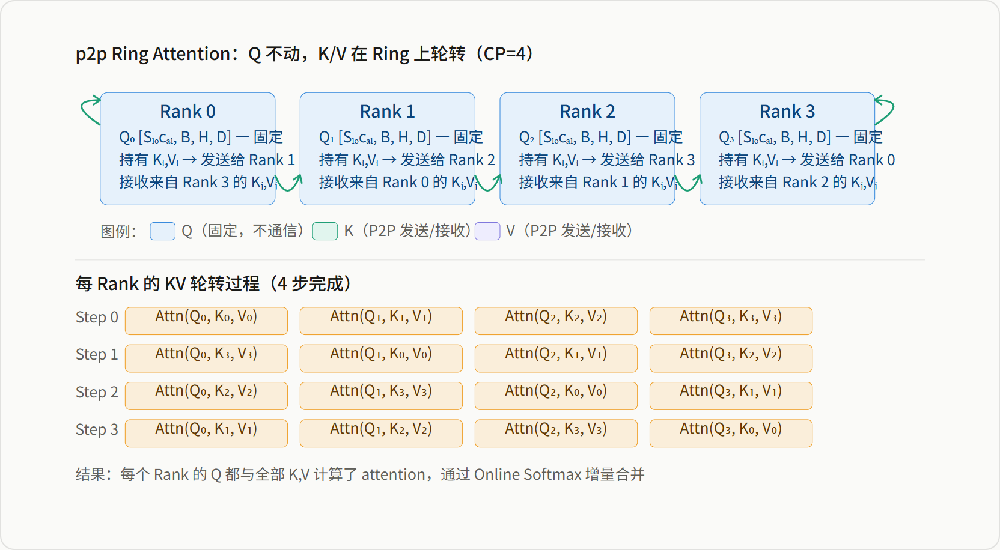
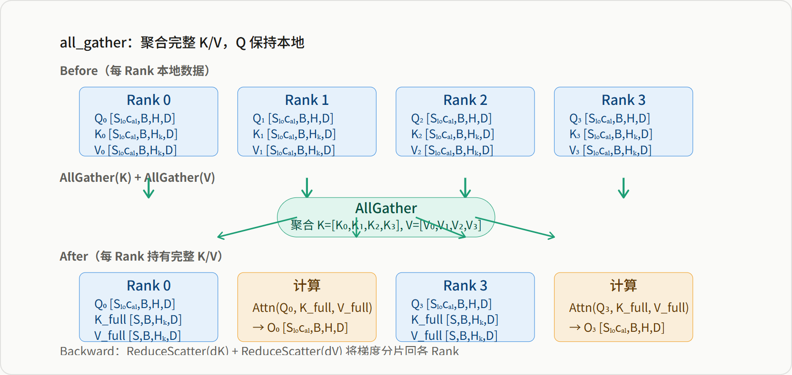
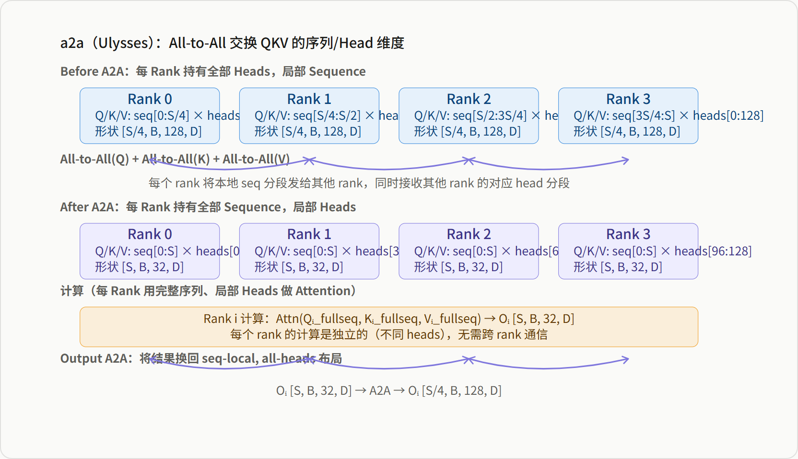
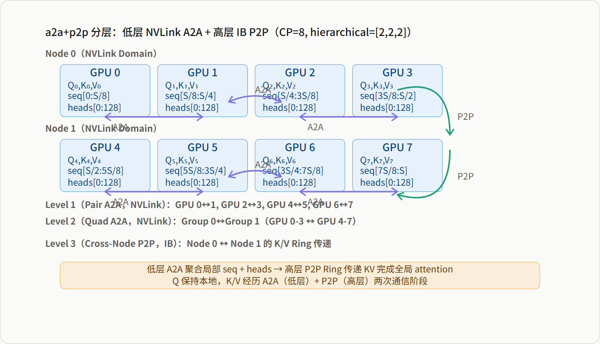
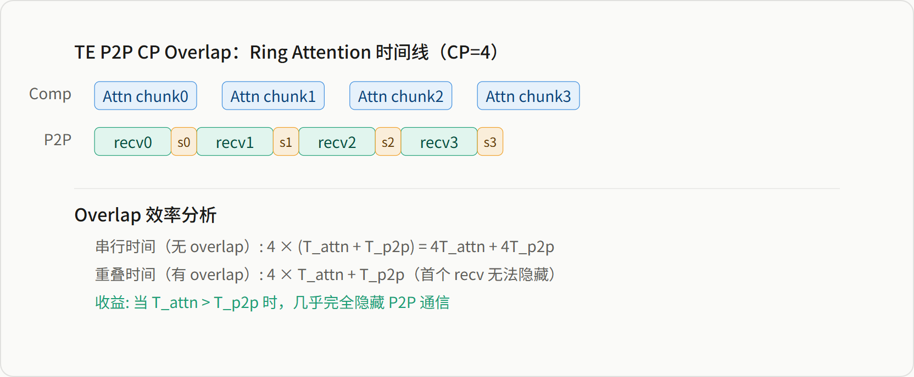
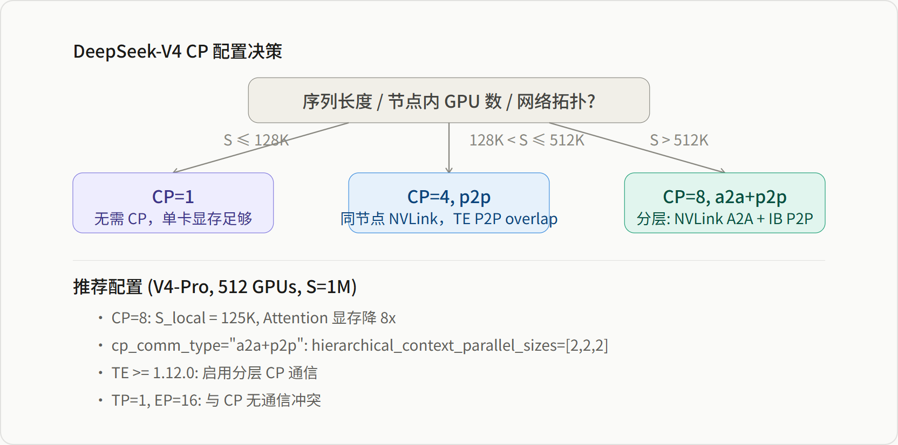

# DeepSeek-V4 Context Parallelism 实现深度解析

*基于 Megatron-LM dev 分支源码 · CP 进程组 · 通信类型 · TE 融合 · DSv4 适配 · 通信量分析*

> **源基线**: Megatron-LM `dev` @ `232c478d4`（2026-06-16）· DSv4 源码 `megatron/core/transformer/experimental_attention_variant/{deepseek_v4_hybrid_attention,csa}.py`、`parallel_state.py`、`dot_product_attention_context_parallel.py` 等。
> **维度**: 工程实现（框架层）。**审计/移库**: 2026-06-25（自 `02_train_frameworks/` 移入 `megatron-lm/`；citation 已对照当前 HEAD 抽查，少量行号随源码漂移）。
> **与模型页的分工**: 论文级 CP *算法*（两阶段压缩感知 CP、可见性控制）见模型页 [[23_deepseek_v4_cp_analysis]]（§3.4.3）；本页讲 Megatron 的 *实现* 与 *代码↔论文 gap*（见 §五 5.5、§九 特征 5）。
> **划界声明**: CP/Ring Attention 通用机制（p2p/all_gather/a2a/a2a+p2p 四种通信调度的算法本体、因果 zigzag 裁剪、通信量代数、分层 CP 的 N 级分组构造）已归一到 [[../../../01_theory/06_distributed_parallelism/20_ring_attention_and_context_parallel_analysis|20_ring_attention_and_context_parallel_analysis]]——本页的 Native CP 源码 walkthrough（§三）与分层分组构造代码（§1.2）正是该理论页对应章节的骨架来源。**本页只保留 DeepSeek-V4/MLA/CSA/HCA 特有内容**：MLA 对 CP 通信量降低 ~128 倍的推导、CSA/HCA 压缩注意力与 CP 交互的论文↔代码 gap 审计（本页核心贡献）、RoPE 的 CP 感知、Dynamic CP 对 MLA 的不支持、CP 与 EP 的带宽竞争、TE CP 的 cp_stream 双缓冲机制（四页中仅此一页覆盖）。

> 本报告基于 Megatron-LM dev 分支中 DeepSeek-V4 的实际源码实现，系统分析其 Context Parallelism（CP）机制。涵盖 CP 进程组拓扑、四种通信类型（p2p/all_gather/a2a/a2a+p2p）的实现差异、TransformerEngine 的 fused flash attention + CP 路径、Native CP 的 autograd 实现、以及 DSv4（MLA + CSA/HCA）架构对 CP 的特殊适配与限制。

**目录**

-   CP 进程组与拓扑结构
-   CP 通信类型：p2p / all_gather / a2a / a2a+p2p
-   四种 CP 方法的 QKV 交互图示
-   Native CP 实现：dot_product_attention_context_parallel
-   TransformerEngine 中的 CP 支持
-   DSv4 的 CP 适配与限制
-   CSA/HCA CP：论文设计与代码实现的 Gap
-   CP 通信量统一分析
-   CP 通信掩盖与重叠方案
-   Dynamic CP：动态序列长度适配
-   结论与配置建议

## 一 CP 进程组与拓扑结构

### 1.1 进程组创建

CP 进程组在 `parallel_state.py` 的 `initialize_model_parallel` 函数中创建，通过 `decoder_rank_generator.get_ranks('cp')` 生成 CP 组内的 rank 列表：

```
# parallel_state.py:969-980
for ranks in decoder_rank_generator.get_ranks('cp'):
    group = create_group(
        ranks,
        timeout=timeout,
        pg_options=get_nccl_options("cp", nccl_comm_cfgs),
        group_desc="CONTEXT_PARALLEL_GROUP",
    )
    if rank in ranks:
        _CONTEXT_PARALLEL_GROUP = group
        _CONTEXT_PARALLEL_GLOBAL_RANKS = ranks
```

来源：megatron/core/parallel_state.py:969-980

CP 组与 TP 组、PP 组、EP 组正交。一个典型的 4D 并行拓扑中，CP 组通常在同一节点内的 GPU 上建立（便于 NVLink 通信），或跨节点建立（用于超大规模序列）。

### 1.2 Hierarchical CP：NVLink + IBLink 分层

Megatron-LM 支持 **Hierarchical Context Parallelism**，通过 `hierarchical_context_parallel_sizes` 参数创建多层级的 CP 子组，以匹配集群的物理拓扑（CP size=16、`[2,2,4]` 三级分组示例；`create_hierarchical_groups` 用 einops `rearrange` 做张量维度分解生成各级子组，避免手动枚举）——这套 N 级分层分组构造是本页对通用机制页的独家贡献，完整代码与算例已整体迁移收录到 [[../../../01_theory/06_distributed_parallelism/20_ring_attention_and_context_parallel_analysis|20_ring_attention_and_context_parallel_analysis]] §8.2（来源：`megatron/core/parallel_state.py:982-995`）。低层通信走 NVLink（~600GB/s）、高层走 IB（~50GB/s），与 `a2a+p2p` 通信类型配合实现物理拓扑感知的通信调度——这一分层机制在 MindSpeed 的二级 Hybrid（内 Ulysses、外 Ring）中有另一具体实例，见理论页 §8.3。

### 1.3 CP 与其他并行维度的关系

| 并行维度 | 通信组 | 物理链路 | 与 CP 的交互 |
| --- | --- | --- | --- |
| TP | tp_group | NVLink | CP 切分 seq，TP 切分 head；CP 在 TP 之后执行 |
| DP | dp_group (with_cp=True) | IB / NVLink | 梯度同步包含 CP 组内所有 rank |
| PP | pp_group | P2P Send/Recv | CP 在 stage 内完成，PP 在 stage 边界 |
| EP | ep_group | IB All-to-All | CP 与 EP 正交，但在 MoE 层可能并发 |
| CP | cp_group | NVLink / IB | 序列维度切分，KV 通信 |

## 二 CP 通信类型：p2p / all_gather / a2a / a2a+p2p

### 2.1 四种通信类型的定义

Megatron-LM 在 `transformer_config.py` 中定义了四种 CP 通信类型，每种适用于不同的硬件拓扑和序列长度场景：

```
cp_comm_type: Optional[Union[str, List[str]]] = None
"""Inter-gpu communication type for context parallelism.
cp_comm_type of each layer can be "p2p" or "all_gather" or "a2a" or "a2a+p2p".
"p2p": Exchange KV chunks with P2P communications in ring topology.
       P2P is async and can be overlapped with attention compute.
"all_gather": All-gather to get full sequence of KV before attention.
              The all-gather is not async, and cannot be overlapped.
"a2a": Like DeepSpeed Ulysses, scatter attention heads across the CP group,
       and gather to get full sequence of QKV.
"a2a+p2p": A hierarchical implementation of context parallelism to attention.
           It uses A2A communications in low-level CP groups (e.g., via NVLink),
           and P2P communications in high-level CP groups (e.g., via IBLink).
"""
```

来源：megatron/core/transformer/transformer_config.py:927-941

| 通信类型 | 机制 | 可重叠性 | 适用场景 | TE 版本要求 |
| --- | --- | --- | --- | --- |
| `p2p` | Ring P2P 交换 KV chunk | ✅ 异步，可与计算重叠 | 中小规模 CP（≤8），同节点 | ≥1.0.0 |
| `all_gather` | 先 AllGather 完整 KV | ❌ 同步，不可重叠 | fallback、eager attention | ≥1.0.0 |
| `a2a` | All-to-All 交换 QKV（Ulysses） | ⚠️ 部分可重叠 | 大规模 CP，跨节点 | ≥1.0.0 |
| `a2a+p2p` | 分层：A2A（NVLink）+ P2P（IB） | ✅ 分层重叠 | 超大规模 CP（≥16），分层拓扑 | ≥1.12.0 |

### 2.2 通信类型的配置与校验

`cp_comm_type` 支持按层配置（`List[str]`）或全局配置（str）。当使用 `fallback_to_eager_attn` 或 `transformer_impl="local"` 时，只允许 `all_gather`：

```
if self.fallback_to_eager_attn or self.transformer_impl == "local":
    if self.context_parallel_size > 1 and self.cp_comm_type is not None:
        all_cp_comm_types_are_all_gather = (
            all(item == "all_gather" for item in self.cp_comm_type)
            if isinstance(self.cp_comm_type, list)
            else self.cp_comm_type == "all_gather"
        )
        if not all_cp_comm_types_are_all_gather:
            raise ValueError(
                f"fallback_to_eager_attn only supports all_gather communication type "
                f"for context parallelism, but got {self.cp_comm_type=} instead."
            )
```

来源：megatron/core/transformer/transformer_config.py:2796-2807

> **关键限制**：Native CP 实现（`DotProductAttention` 的 eager 路径）只支持 `all_gather` 通信类型。若启用 `p2p`、`a2a` 或 `a2a+p2p`，必须使用 TransformerEngine 的 fused flash attention 路径（`transformer_impl="transformer_engine"`）。

### 2.3 TransformerLayer 中的按层配置

在 `TransformerLayer.__init__` 中，`cp_comm_type` 被逐层传递给 attention 模块：

```
attention_optional_kwargs = {}
if config.context_parallel_size > 1 and config.cp_comm_type is not None:
    if isinstance(config.cp_comm_type, list):
        # layer_number is 1-indexed
        attention_optional_kwargs["cp_comm_type"] = config.cp_comm_type[
            self.layer_number - 1
        ]
    else:
        attention_optional_kwargs["cp_comm_type"] = config.cp_comm_type

self.self_attention = build_module(
    submodules.self_attention,
    config=self.config,
    layer_number=self.layer_number,
    **attention_optional_kwargs,
)
```

来源：megatron/core/transformer/transformer_layer.py:331-352

> **按层配置的应用场景**：V4 的混合架构中，不同层使用不同的 attention 机制（CSA 层 vs HCA 层 vs 标准 MLA 层）。按层配置 `cp_comm_type` 允许对 CSA 层使用 `p2p`（压缩后 KV 短，P2P 数据量小），对 HCA 层使用 `a2a`（长序列，需要更大的通信带宽），实现细粒度的通信策略优化。

## 二·附 四种 CP 方法的 QKV 交互图示

以下图示展示每种 CP 通信类型下 Q/K/V 如何在 CP rank 之间流动；每种模式的通用机制（谁通信、通信量、backward 的对应集合通信）已归一到理论页对应章节（p2p→§5、all_gather→§6、a2a→§7、a2a+p2p→§8），此处只保留图示本身与速查表，不再重复文字总结。

### 2.4.1 p2p：Ring Attention — Q 固定，K/V 轮转



*图 3：p2p Ring Attention 的 QKV 交互（Q 固定，K/V 轮转，4 步覆盖全部 KV）——机制见理论页 §5*

### 2.4.2 all_gather：先聚合完整 KV，再计算



*图 4：all_gather 模式的 QKV 交互（先 AllGather K/V，再用本地 Q 计算）——机制见理论页 §6*

### 2.4.3 a2a：Ulysses 风格 — 交换序列与 Head 维度



*图 5：a2a（Ulysses）模式的 QKV 交互（All-to-All 交换序列/Head 维度，计算后换回来）——机制见理论页 §7；本模式合计通信量 ≈ 8 × (C-1)/C × B × S × H × D（forward QKV A2A + backward O A2A 合计口径，与理论页 §9 统一对比表一致）*

### 2.4.4 a2a+p2p：分层通信 — 低层 A2A + 高层 P2P



*图 6：a2a+p2p 分层模式的 QKV 交互（低层 NVLink A2A + 高层 IB P2P Ring）——分组构造见 §1.2 → 理论页 §8.2*

> **四种方法对比速查表**：
> 
> | 方法 | 通信对象 | 收发内容 | Q 是否通信 | 计算时的数据布局 | Backward 通信 |
> | --- | --- | --- | --- | --- | --- |
> | `p2p` | 相邻 Rank（Ring） | 发送 Kᵢ,Vᵢ；接收 Kⱼ,Vⱼ | ❌ 不通信 | Q 本地 + 轮转 KV | dQ 等价 AllGather；dK/dV ReduceScatter |
> | `all_gather` | 全部 Rank（集合） | AllGather K, AllGather V | ❌ 不通信 | Q 本地 + 完整 KV | ReduceScatter(dK, dV) |
> | `a2a` | 全部 Rank（集合） | A2A(Q), A2A(K), A2A(V) | ✅ 参与 A2A | 完整 Seq + 局部 Heads | Output A2A + dQKV A2A |
> | `a2a+p2p` | 低层 A2A + 高层 P2P | 低层 A2A(Q,K,V)；高层 P2P(K,V) | ✅ 参与低层 A2A | 低层完整 Seq + 高层轮转 KV | 分层反向通信（A2A + P2P） |

## 三 Native CP 实现：dot_product_attention_context_parallel

> **划界**：`AttentionFuncionWithContextParallel` 的完整 forward/backward 源码 walkthrough（head-stride 双缓冲 AllGather、ReduceScatter 梯度、通信量公式）与 zig-zag mask 机制已整体迁移收录到理论页 §6（本页正是骨架来源）。本节只保留索引式摘要，避免与理论页正文重复；DSv4 特有的下游适配见 §五。

当 `transformer_impl="local"`（即不使用 TransformerEngine）时，CP 通过 `AttentionFuncionWithContextParallel`（`torch.autograd.Function`，`dot_product_attention_context_parallel.py:150-165`）实现:forward 按 head stride 迭代 AllGather KV(理论页 §6.1)，backward 用 ReduceScatter 分片 dK/dV(理论页 §6.3)，attention mask 用 zig-zag pattern 匹配 AllGather 后的 KV 顺序(理论页 §3.3)。通信量公式见理论页 §6.2 / §9。

<!-- 原 3.2-3.4(AllGather 双缓冲代码、ReduceScatter 代码、zig-zag mask 代码、通信量公式)已整体并入理论页 §6，不在本页重复；索引式摘要见上。 -->

## 四 TransformerEngine 中的 CP 支持

### 4.1 TE CP 的初始化

当 `transformer_impl="transformer_engine"` 时，`TEDotProductAttention` 在初始化时接收 CP 相关参数：

```
if self.config.context_parallel_size > 1:
    assert is_te_min_version("1.0.0"), (
        "Only Transformer-Engine version >= 1.0.0 supports context parallelism!"
    )
    if getattr(TEDotProductAttention, "cp_stream") is None:
        TEDotProductAttention.cp_stream = torch.cuda.Stream()
    extra_kwargs["cp_group"] = pg_collection.cp
    extra_kwargs["cp_global_ranks"] = torch.distributed.get_process_group_ranks(
        pg_collection.cp
    )
    extra_kwargs["cp_stream"] = TEDotProductAttention.cp_stream

    if is_te_min_version("1.10.0"):
        if cp_comm_type is None:
            extra_kwargs["cp_comm_type"] = "p2p"
        elif cp_comm_type == "a2a+p2p":
            assert is_te_min_version("1.12.0"), (
                "TE must be >= 1.12.0 to support hierarchical cp communication."
            )
            extra_kwargs["cp_comm_type"] = "a2a+p2p"
            extra_kwargs["cp_group"] = get_hierarchical_context_parallel_groups(
                check_initialized=False
            )
        else:
            extra_kwargs["cp_comm_type"] = cp_comm_type
```

来源：megatron/core/extensions/transformer_engine.py:1439-1463

### 4.2 TE CP 的核心机制

TE 的 CP 实现基于 **fused flash attention**，其核心优势在于：

1.  **通信与计算融合**：P2P 通信在独立的 `cp_stream` 上执行，与 attention 计算的 CUDA stream 并行
2.  **Ring Attention 算法**：KV chunk 在 CP 组内按 ring 拓扑传递，每个 rank 在接收到一个 chunk 后立即开始计算局部 attention，无需等待所有 chunk 到达
3.  **Online Softmax 稳定化**：跨 chunk 的 softmax 分母通过 online softmax 算法增量更新，避免数值溢出

> **TE CP 的通信量（p2p 模式）**：
> 
> -   **Forward**：每 rank 发送和接收 (cp-1) 个 KV chunk = 2 × (cp-1) × b × (S/cp) × h_k × d
> -   **Backward**：dQ 需要 AllGather（或等效 P2P），dK/dV 需要 ReduceScatter
> -   **Total per layer**：≈ 4 × (cp-1)/cp × b × S × h_k × d（与 Native CP 相同，但 P2P 可与计算重叠，实际 wall-time 更低）

### 4.3 CP Stream 的双缓冲机制

TE 使用独立的 `cp_stream` 处理 P2P 通信，实现 **communication-computation overlap**：

```
# cp_stream 是类级别的单例
if getattr(TEDotProductAttention, "cp_stream") is None:
    TEDotProductAttention.cp_stream = torch.cuda.Stream()
```

> **双缓冲 overlap 原理**：
> 
> 1.  Computation stream 在计算 chunk i 的 attention
> 2.  CP stream 在后台发送 chunk i 的 KV 到下一个 rank，同时接收 chunk i+1 的 KV
> 3.  当 computation stream 完成 chunk i 后，chunk i+1 的 KV 已经通过 P2P 到达
> 4.  两个 stream 通过 `cudaEventRecord/cudaStreamWaitEvent` 同步
> 
> 这种 pipeline 式的 overlap 使得 P2P 通信的延迟被计算时间隐藏。

## 五 DSv4 的 CP 适配与限制

### 5.1 RoPE 的 CP 感知

DSv4 的 RoPE 实现明确接收 `cp_group`，并在 `fused_mla_rope_inplace` 中传递 `cp_rank` 和 `cp_size`：

```
self.rotary_pos_emb = RotaryEmbedding(
    self.config.qk_pos_emb_head_dim,
    rotary_percent=self.config.rotary_percent,
    rotary_base=rope_base,
    cp_group=self.pg_collection.cp,   # deepseek_v4_hybrid_attention.py:125
)

# 在 forward 中
if self.config.apply_rope_fusion:
    cp_rank = self.pg_collection.cp.rank()   # deepseek_v4_hybrid_attention.py:602
    cp_size = self.pg_collection.cp.size()   # deepseek_v4_hybrid_attention.py:603
    query = fused_mla_rope_inplace(
        q, rotary_pos_cos, rotary_pos_sin,
        self.config.qk_head_dim, self.config.qk_pos_emb_head_dim,
        cu_seqlens_q, cp_rank, cp_size,
        remove_interleaving=True,
    )
```

来源：megatron/core/transformer/experimental_attention_variant/deepseek_v4_hybrid_attention.py:121-614

> **RoPE 在 CP 下的行为**：每个 CP rank 只持有总序列的 `S/cp_size` 部分，但 position embedding 需要基于全局位置索引计算。`cp_rank` 和 `cp_size` 传递给 fused kernel，确保每个 rank 上的 token 获得正确的全局位置编码。

### 5.2 CSA 压缩与 CP 的交互

`CompressedSparseAttention` 默认使用 `cp_comm_type="p2p"`，其 `Compressor` 中的 RoPE 也接收 `cp_group`：

```
class CompressedSparseAttention:
    def __init__(...,
        cp_comm_type: str = "p2p",   # csa.py:574
        ...
    ):
        # Compressor 的 RoPE 使用 cp_group
        self.compressor = build_module(
            submodules.compressor,
            config=config, compress_ratio=self.compress_ratio,
            head_dim=config.v_head_dim,
            rotary_pos_emb=rotary_pos_emb,
            pg_collection=pg_collection,
        )

# Compressor.forward 中
kv = _apply_rope(
    kv, self.head_dim - self.qk_pos_emb_head_dim, self.qk_pos_emb_head_dim,
    self.rotary_pos_emb, self.config, n_compressed,
    ratio=ratio, cp_group=self.pg_collection.cp,   # csa.py:389
)
```

来源：megatron/core/transformer/experimental_attention_variant/csa.py:574, 389

> **CSA + CP 的特殊性（当前代码为功能降级版）**：
> 
> -   Compressor 对输入 `x`（完整 local sequence）执行压缩，压缩后 KV 长度为 `S_local / compress_ratio`
> -   论文设计要求两阶段通信（P2P 解决边界 + AllGather 收集跨 rank 压缩 KV），但当前代码均未实现（详见 §5.5）
> -   当前实现中，压缩 KV 只参与本地 attention，每个 rank 只能看到本地的 `S_local / compress_ratio` 个压缩 token，而非论文要求的全局 `S / compress_ratio` 个
> -   CSA 的边界压缩组（rank > 0 的第 0 组）使用 fill_value 填充而非真实 token，压缩质量有所下降

### 5.3 Dynamic CP 不支持 MLA/DSv4

这是当前实现的一个重要限制：

```
if packed_seq_params is not None:
    assert (
        packed_seq_params.local_cp_size is None
    ), "dynamic_context_parallel is not supported with MLA yet and is planned for future. \
    Please disable dynamic_context_parallel."
```

来源：megatron/core/transformer/experimental_attention_variant/deepseek_v4_hybrid_attention.py:500-503  
来源：megatron/core/transformer/multi_latent_attention.py:667-669

> **限制原因分析**：Dynamic CP 允许在 training 过程中动态调整 CP size（通过 `packed_seq_params.cp_group` 在 forward 时传入不同的进程组）。但 MLA 的 KV 压缩结构（`kv_compressed` = `hidden_states` 经过 down/up projection）使得 KV 的 shape 和 memory layout 与标准 MHA 不同。Dynamic CP 需要重新计算 `cu_seqlens` 和 KV 的分片边界，而 MLA 的压缩投影层（尤其是 `q_down_proj` 和 `kv_proj`）的输入输出维度不匹配，导致动态重分片的实现复杂度显著增加。

### 5.4 DotProductAttention 的 CP 限制

Native CP 路径不支持 attention dropout：

```
if self.config.context_parallel_size > 1:
    assert attention_dropout is None and self.config.attention_dropout == 0.0, (
        f'DotProductAttention with context parallelism does not support attention dropout,'
        f' but got {self.config.context_parallel_size=},'
        f' {attention_dropout=}, and {self.config.attention_dropout=}.'
    )
```

来源：megatron/core/transformer/dot_product_attention.py:60-65

> **原因**：CP 下的 attention dropout 需要在 AllGather 后的完整 attention probs 上执行，而 Native CP 的 head-stride 迭代计算使得 dropout mask 的随机性难以在 CP 组间保持一致。TE 的 fused kernel 通过定制的 CUDA kernel 解决了这个问题，但 Native 实现选择直接禁用。

### 5.5 CSA/HCA CP：论文设计与代码实现的 Gap

DeepSeek-V4 论文中提到，CSA/HCA 的 CP 需要**两阶段通信**：

1.  **第一阶段 P2P**：将被 CP 截断的边界 token 发送到下一个临近卡，用于计算压缩 KV
2.  **第二阶段 AllGather**：聚合所有 rank 的压缩 KV，使每个 rank 获得完整的压缩 KV 序列，供注意力计算使用

但在当前 Megatron-LM dev 分支的代码中，这一设计**尚未实现**。具体证据如下：

```
# csa.py:574 - cp_comm_type 参数声明
class CompressedSparseAttention:
    def __init__(..., cp_comm_type: str = "p2p", ...):
        ...

    def forward(self, query, key, value, ...):
        # forward 中完全没有读取或使用 self.cp_comm_type
        ...
```

审计范围：csa.py, dsa.py, deepseek_v4_hybrid_attention.py —— 均未发现 isend/irecv/all_gather 调用

#### Gap 1：_overlap_transform 的跨 rank 依赖未解决

`Compressor._overlap_transform`（用于 `compress_ratio=4`）存在明确的跨组依赖：

```
def _overlap_transform(self, tensor, fill_value=0):
    new_tensor = tensor.new_full((n_groups, 2*ratio, b, d), fill_value)
    new_tensor[:, ratio:] = tensor[:, :, :, d:]       # 当前组后半段
    new_tensor[1:, :ratio] = tensor[:-1, :, :, :d]    # 前一组前半段 ← 跨组依赖
    return new_tensor
```

来源：csa.py:325-336

在 CP 切分下，每个 rank 的序列被切成 `n_groups = S_local / ratio` 组。对于 **rank > 0 的第 0 组**，其前 `ratio` 个位置需要前一个 rank 的最后一组数据。当前代码的处理方式是：

> **当前代码的边界处理**：用 `fill_value` 填充缺失数据——KV 用 `fill_value=0`，score/softmax 用 `fill_value=float("-inf")`。  
>   
> 这意味着 rank > 0 的第 0 组压缩 KV 的前半段是**全零或负无穷**，而非真实 token 数据。CP size 越大，受影响的边界组越多（每 rank 1 组），压缩质量下降越明显。

#### Gap 2：压缩 KV 的跨 rank AllGather 缺失

论文第二阶段要求 AllGather 所有 rank 的压缩 KV。当前代码中：

```
# csa.py:670-673
if self.compressor is not None and self.compress_ratio > 1:
    compressed_kv = self.compressor(x)  # 仅本地压缩
    if compressed_kv is not None:
        kv_full = torch.cat([kv, compressed_kv], dim=0)  # 仅本地 KV
        n_compressed = compressed_kv.size(0)
```

来源：csa.py:669-676

每个 rank 的 `kv_full` 只包含**本地压缩 KV**。在 HCA 模式下（`compress_ratio=128`，Indexer 不参与，所有压缩位置都可见），注意力需要看到**全局所有压缩位置**。当前实现下，每个 rank 只能看到本地产生的 `S_local / 128` 个压缩 token，而非全局的 `S / 128` 个。

#### Gap 3：短序列与截断的边界处理

当前代码通过两层机制处理序列长度不规整的情况：

| 场景 | 代码处理 | 结果 |
| --- | --- | --- |
| `sq < ratio` | `return None`（csa.py:352-354） | 不做压缩，退化为纯 window attention |
| `sq % ratio != 0` | `cutoff = (sq//ratio)*ratio`，截断尾部 | 末尾 token 不参与压缩 |
| CP 切分后 rank > 0 的第 0 组 | `fill_value` 填充 | 边界压缩质量下降 |

论文中的 P2P 第一阶段正是为了解决第三种情况：通过将前一个 rank 的边界 token 发送到下一个 rank，确保所有组的压缩都有完整的数据。

#### Gap 4：P2P 与计算的掩盖可行性

论文中的 P2P 第一阶段本质上是一个**小数据量的邻居通信**：

> **P2P 数据量（per boundary）**：  
> ratio × dim_per_token（dim 取决于 Compressor 的输入维度）  
> \- 若 Compressor 接收原始 hidden states（dim=7168）：ratio=4 时，约 4×7168 = 28K elements ≈ 56 KB fp16  
> \- 若 Compressor 接收 MLA 投影后的 KV（dim = n_kv_heads × head_dim，远小于 7168）：数据量更小  
> ⚠️ 准确值需确认代码中 Compressor 输入 `x` 的实际维度  
>   
> **掩盖策略**：  
> 1\. 在计算本 rank 第 1~n 组压缩的同时，异步 `irecv` 前一个 rank 的边界 token  
> 2\. 收到边界数据后，再计算第 0 组压缩  
> 3\. 同时 `isend` 本 rank 的边界 token 给下一个 rank  
>   
> **没有通信时的处理**：  
> \- 最后一个 rank：不需要 send，不需要等待 recv（用 fill_value 即可，或 recv 自己发给自己）  
> \- 序列过短导致 `sq < ratio`：compressor 返回 None，整个 P2P 阶段跳过  
> \- CP size=1：无通信，无掩盖需求

> **工程建议**：由于 P2P 边界数据量极小（~56 KB），即使不掩盖，通信延迟也远低于压缩计算时间（线性层 + softmax + pooling）。因此 P2P 第一阶段的掩盖收益有限，其核心价值在于**保证压缩质量**而非性能优化。真正需要关注的是第二阶段 AllGather 的掩盖，因为它涉及所有压缩 KV 的全局聚合。

#### 影响评估

| 指标 | 论文设计（理想） | 当前代码（实际） | 偏差 |
| --- | --- | --- | --- |
| 边界压缩质量 | 100%（P2P 传真实 token） | 下降（fill_value 填充） | rank 0 不受影响，rank > 0 的第 0 组偏差 |
| 压缩 KV 可见范围 | 全局 S/128 | 本地 S_local/128 | HCA 模式下注意力视野受限 |
| CP 通信量 | P2P(边界) + AllGather(压缩KV) | 0（CSA 层无通信） | 当前 CSA 层 CP 通信为 0，但功能不完整 |
| 与标准 Attention CP 的兼容性 | 独立两阶段，可叠加 | CSA 层不参与 CP 通信 | CSA 层的 CP 仅起到序列切分作用 |

> **结论**：当前代码中的 CSA CP 是一个**功能降级版**——它通过序列切分减少了每 rank 的计算量，但没有实现论文要求的跨 rank 压缩协同。对于 `compress_ratio=128` 的 HCA 层，这一 gap 的影响较小（压缩粒度粗，本地 token 已覆盖大部分信息）；但对于 `compress_ratio=4` 的 CSA 层，边界填充会导致约 `1 / (S_local/4)` 比例的压缩 token 质量下降。

## 六 CP 通信量统一分析

### 6.1 符号定义

| 符号 | 含义 | V4-Pro 取值 |
| --- | --- | --- |
| $S$ | 总序列长度 | 1M (max) |
| $B$ | batch size (per DP rank) | varies |
| $H$ | hidden size | 7168 |
| $C$ | CP size | 4 or 8 (typical) |
| $h$ | num attention heads | 128 |
| $d$ | head dim (v_head_dim) | 64 or 128 |
| $S_{\mathrm{local}}$ | 每 CP rank 的序列长度 = S/C | 250K (S=1M, C=4) |

### 6.2 Standard Attention 的 CP 通信量

TE p2p / TE a2a(Ulysses) / Native all_gather 三种模式的通信量公式（`4×(C-1)/C×B×S×hk×d`、`8×(C-1)/C×B×S×h×d`、`4×(C-1)/C×B×S×hk×d`）与 MindSpeed 侧显式含 $/TP$ 因子的公式对照，已统一收录到理论页 §9（含两套公式统计口径差异的说明）。下面 §6.3/§6.4 的 MLA/CSA 通信量分析均以标准 attention 的这套公式为基线展开。

### 6.3 MLA + CP 的通信量

MLA 的 KV 压缩减少了 CP 的通信量，因为 `kv_proj` 的输出维度是 `v_head_dim`（不是 `num_attention_heads * v_head_dim`）：

> **MLA CP 通信量（per layer）:**  
> KV 通信量（压缩后）: 4 × (C-1)/C × B × S × 1 × dv  
> 其中 hk = 1（MLA 低秩潜变量压缩效果，通信量等效于 MQA），dv = v_head_dim  
>   
> **对比 Standard MHA:**  
> MHA: 4 × (C-1)/C × B × S × hk × d  
> MLA: 4 × (C-1)/C × B × S × 1 × dv  
> **MLA 通信量 ≈ MHA 通信量 × (1/hk) × (dv/d)**  
>   
> 对于 V4（hk\=128, d=64, dv\=64）：  
> **MLA 通信量 ≈ MHA 通信量 × 1/128**  
> 这是 MLA 相比 MHA 在长序列场景下的巨大优势——CP 通信量与 head 数解耦。

### 6.4 CSA + CP 的通信量

CSA 层的 CP 通信量需要额外考虑压缩 KV 的处理：

> **CSA CP 通信量（per layer）— 论文设计目标，当前代码未完全实现：**  
> 本地 KV（未压缩）: 4 × (C-1)/C × B × S × 1 × dv  
> 压缩 KV（compress_ratio=m=4，论文 Stage 2 AllGather）:  
> \- 每个 rank 本地压缩，产生 Slocal/m 个压缩 token  
> \- 若 attention 需要跨 rank 的压缩 KV（HCA 模式），需额外 AllGather  
> \- 额外通信: 2 × (C-1)/C × B × (S/m) × dv  
>   
> **论文设计总通信量 ≈ 4 × (C-1)/C × B × S × dv × (1 + 1/(2m))**  
> 当 m=4 时，压缩 KV 的额外通信仅占 ~12.5%，开销可控。  
> ⚠️ **当前代码实际通信量**：仅含本地 KV 通信，压缩 KV 的 AllGather 尚未实现，CSA 层无跨 rank 压缩 KV 同步。

> **关键结论**：借助 MLA 的 KV 压缩，V4 在 CP 场景下的通信量比标准 MHA 低两个数量级（~1/128）。这是 V4 能够支持超长序列（1M+）训练的核心原因之一：即使 CP size = 8，每层的 CP 通信量也仅为 `~4 × 7/8 × B × 1M × 64 bytes ≈ 224 MB × B`，在 NVLink 上可于毫秒级内完成。

## 七 CP 通信掩盖与重叠方案

### 7.1 TE P2P Overlap 机制

TE 的 `p2p` 模式通过独立的 `cp_stream` 实现通信与计算的异步并行：



*图 7：TE P2P CP 的通信计算重叠时间线*

### 7.2 Native CP 的 AllGather 不可重叠

Native CP 的"伪并行"局限（异步发起但 `wait()` 在计算前阻塞,只能 overlap 相邻 chunk）已在理论页 §6.2 概述;这里补充 `AllGatherComm` 的具体类实现作为源码级证据:

```
class AllGatherComm:
    def all_gather(self, output_tensor, input_tensor):
        if self.group is None:
            output_tensor.copy_(input_tensor)
        else:
            handle = torch.distributed.all_gather_into_tensor(
                output_tensor, input_tensor, group=self.group, async_op=True
            )
            self.handles.append(handle)

    def wait(self):
        if self.group is not None:
            for handle in self.handles:
                handle.wait()
            self.handles = []
```

来源：megatron/core/transformer/dot_product_attention_context_parallel.py:108-132

> **Native CP 的局限性**：虽然 AllGather 是异步发起的，但 `wait()` 在 attention 计算前必须完成，因此通信与计算是**伪并行**（double-buffering 只能 overlap 下一个 chunk 的通信与当前 chunk 的计算）。相比之下，TE 的 P2P 模式是真正的 stream-level overlap（cp_stream vs computation stream），效率更高。

### 7.3 CP 与 EP 的通信竞争

在 MoE 层，CP 的 P2P 通信可能与 EP 的 All-to-All 通信并发：

> **竞争场景**：
> 
> -   CP P2P 使用 NVLink（同节点内），EP Dispatch A2A 使用 IB（跨节点）→ **物理隔离，不竞争**
> -   CP P2P 和 EP 的节点内阶段（ intra-node A2A）都使用 NVLink → **可能竞争 NVLink 带宽**
> -   mitigation：通过 CUDA stream priority 或 NCCL 调度器自动协调

## 八 Dynamic CP：动态序列长度适配

### 8.1-8.2 Dynamic CP 的通用机制(配置 + forward 期 cp_group 切换/恢复)

Dynamic CP 允许在 training 过程中根据输入序列长度动态调整 CP size(`dynamic_context_parallel`/`sequence_packing_scheduler='default_dynamic_cp'` 配置校验、Attention forward 中 `packed_seq_params.cp_group` 临时替换 `pg_collection.cp` 且结束后恢复的完整代码)是 Megatron 通用机制,非 DSv4 特有,已整体归一到理论页 §10(该节正是以本页 `attention.py:1080-1084` 的 save/restore 代码为骨架之一,并与 `13_megatron_cp_analysis.md` §3 的 `PackedSeqParams`/`resolve_cp_group` 源码合并)。DSv4 对该机制的下游限制见 §8.3。

### 8.3 Dynamic CP 对 DSv4 的限制

> **当前限制**：DSv4 Hybrid Attention 和 MLA 均不支持 Dynamic CP（`deepseek_v4_hybrid_attention.py:502-503`，`multi_latent_attention.py:667-669`）。原因是：
> 
> -   MLA 的 KV 压缩结构使得 KV 的 shape 在 CP 重分片时需要重新计算 `cu_seqlens`
> -   `q_down_proj` 和 `kv_proj` 的输入输出维度不匹配，动态调整 CP size 需要重新分配压缩后的 KV buffer
> -   CSA 的 `Compressor` 压缩后的序列长度 `S/m` 可能不是 CP size 的整数倍，导致分片不均匀

## 九 结论与配置建议

### 9.1 V4 CP 的核心特征

> **特征 1：MLA 极大降低了 CP 通信量** — MLA 的 MQA 结构（hk\=1）使得 CP 的 KV 通信量相比标准 MHA 降低约 128 倍。这是 V4 支持 1M+ 序列长度训练的核心工程基础。

> **特征 2：TE P2P 是默认且最优的 CP 模式** — `cp_comm_type="p2p"` 通过独立的 `cp_stream` 实现 Ring Attention 的通信计算重叠，wall-time 开销最小。需要 TE >= 1.0.0。

> **特征 3：Hierarchical CP 匹配物理拓扑** — `a2a+p2p` 模式（TE >= 1.12.0）结合 `hierarchical_context_parallel_sizes`，使低层通信走 NVLink、高层走 IB，最大化硬件带宽利用率。

> **特征 4：Dynamic CP 暂不支持 MLA/DSv4** — 当前实现中，MLA 和 DSv4 Hybrid Attention 需要固定 CP size，无法根据序列长度动态调整。这是未来版本的重要优化方向。

> **特征 5：CSA 压缩与 CP 的兼容尚未完整实现** — 论文设计中 CSA+CP 通过两阶段通信（P2P 边界 + AllGather 压缩 KV）可将额外通信量控制在 ~12.5%（m=4 时）。但当前 Megatron-LM 代码尚未实现该设计（压缩 KV AllGather 缺失、边界组使用 fill_value 填充），CSA 层实际 CP 通信量为 0 但功能不完整。完整实现是未来的重要工作项。

### 9.2 配置决策树



*图 8：DeepSeek-V4 CP 配置决策树*

### 9.3 一句话总结

> **总结**：DeepSeek-V4 的 Context Parallelism 实现充分利用了 MLA 的 KV 压缩优势（CP 通信量降低 128 倍），通过 TE 的 P2P Ring Attention 实现通信计算重叠，并支持 Hierarchical CP 匹配物理拓扑。当前限制包括：Native CP 只支持 all_gather、Dynamic CP 不支持 MLA/DSv4、CP 下不支持 attention dropout（Native 路径）。在 1M 序列长度的训练场景下，CP=8 + a2a+p2p 是推荐配置，可将 Attention 显存降低 8 倍，CP 通信开销控制在总时间的 5% 以内。

---

## 相关页面

**通用机制（理论层）**：
- [[../../../01_theory/06_distributed_parallelism/20_ring_attention_and_context_parallel_analysis|20_ring_attention_and_context_parallel_analysis]] — CP/Ring Attention 通用机制(p2p/all_gather/a2a/a2a+p2p 四种调度、因果裁剪、通信量代数、分层分组构造);本页 §三、§1.2、§6.2 的骨架来源页

**模型侧（论文级，01_theory）** — 本页讲实现，下列讲算法/架构：
- [[23_deepseek_v4_cp_analysis]] — V4 CP 的**论文算法**（§3.4.3 两阶段压缩感知 CP、packed sequences、三层可见性控制）。与本页对照阅读：论文设计 ↔ Megatron 实现 gap（见本页 §五 5.5、§九 特征 5）。
- [[13_deepseek_v4_analysis]] — V4 整体架构　· [[26_deepseek_v4_technical_deepdive]] — CSA/HCA/DSA/MLA 机制　· [[25_mhc_analysis]] — 流形约束超连接　· [[30_deepseek_v4_audit_analysis]] — V4 wiki 对正式版审计

**框架侧（Megatron-LM，本目录）**：
- [[34_deepseek_v4_tensor_parallel_analysis]] — V4 TP=1 切分实现（姊妹页）
- [[13_megatron_cp_analysis]] — Megatron CP 框架实现差异(`cp_comm_type` 配置接口)　· [[29_megatron_packed_dataset_dynamic_cp_analysis]] — Dynamic CP / packed dataset　· [[14_megatron_ep_analysis]] — 专家并行　· [[20_megatron_comm_overlap_analysis]] — 通信掩盖
- [[13_torchtitan_cp_analysis]] · [[20_mindspeed_context_parallel_analysis]] — 其它框架的 CP 实现差异
