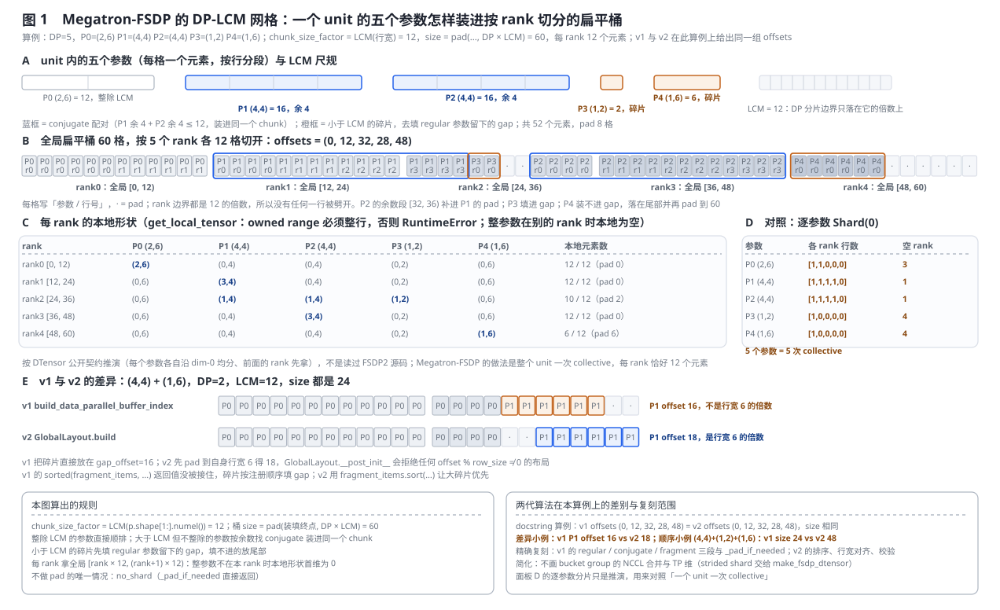
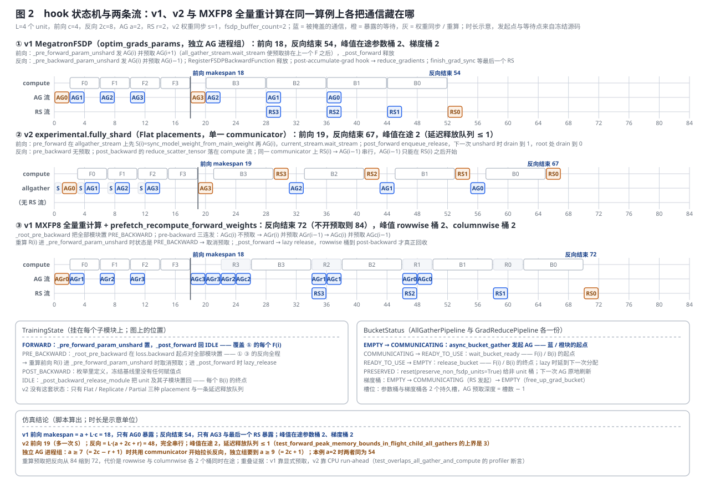
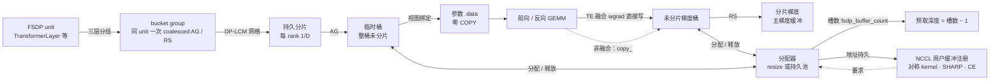
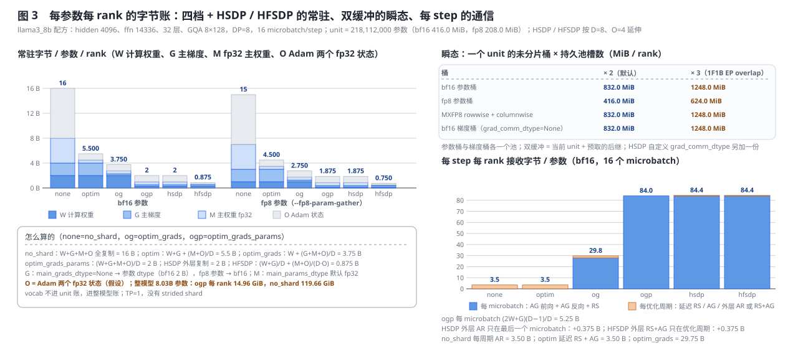
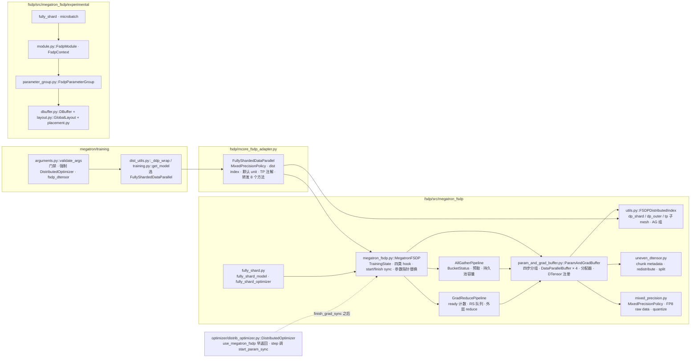
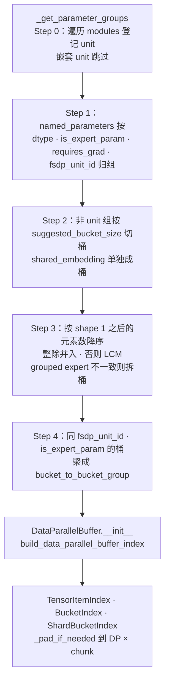
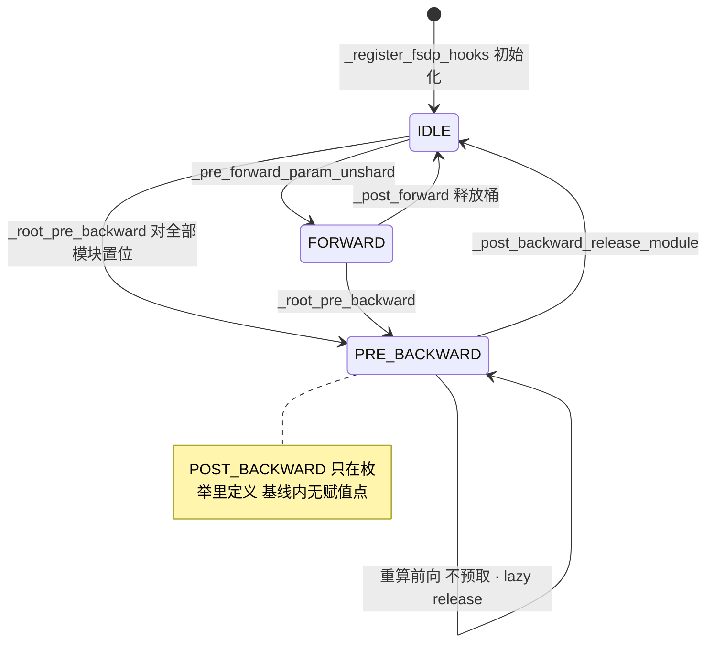
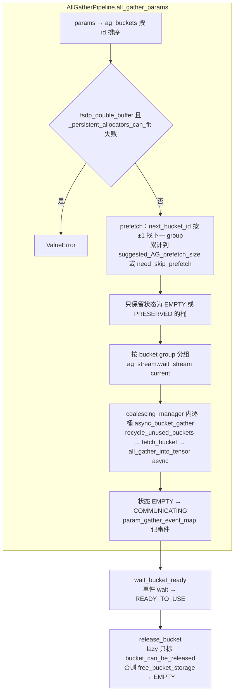
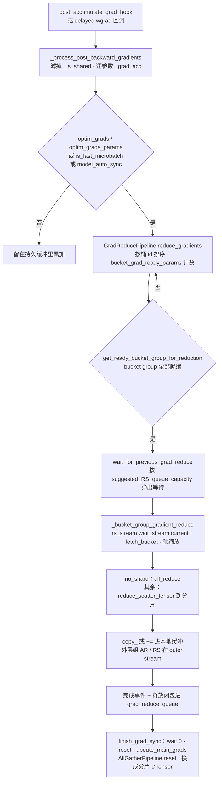
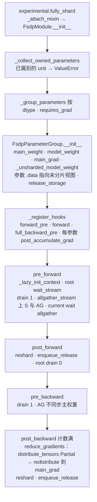

# Megatron-FSDP：按 FSDP unit 扁平分桶的 ZeRO 机器与它的第二代数据面

> **源码基线**：`NVIDIA/Megatron-LM@85902ef599ea4eb06ada7567a479c524b605767a`（`dev`，2026-09-01）
> **主题**：Megatron-FSDP 为什么把分片切在「FSDP unit 的扁平桶」而不是「参数」上，以及这一个决定如何长出整台机器——四步分组与 DP-LCM 网格、四类 `DataParallelBuffer` 与「ZeRO 四档 = 三个布尔量」、hook 状态机与 AG / RS 两条流水线、四档临时分配器与持久池、HSDP / HFSDP 外层、接入层；再用同一个算例复演冻结基线里并存的第二条数据面 `experimental/`（MFSDP v2：`DBuffer` / `Placement` / `GlobalLayout` / `FsdpParameterGroup` / `FsdpContext`）。核心代码在 `megatron/core/distributed/fsdp/`。
> **适用范围**：Megatron-FSDP 库本体、接入层与它拥有的配置字段；Torch FSDP2 是兄弟轴，只给边界与 owner，三条分片实现的横向对比归 [[16_megatron_distributed_optimizer_analysis]]；`fsdp_dtensor` 存档归 [[19_megatron_dist_checkpointing_analysis]]，EP A2A overlap 归 [[20_megatron_comm_overlap_analysis]]，CUDA graph 本体归 [[23_megatron_precision_cudagraph_fusion_analysis]]，激活重计算归 [[18_megatron_recompute_analysis]]，DDP 侧的 NCCL 内存池归 [[22_megatron_memory_optimization_analysis]]。
> **最近更新**：2026-09-08。按房子形状重写：§2 只讲原理与图，§3 单独讲代码流程与状态转移；新增与 `DistributedOptimizer` 的对照（§1.4）、unit → 桶 → 预取 → NCCL 注册的业务链与三处 COPY（§2.6）；v2 数据面升为并列 lane，三张生成图与复刻回归，补入 2026-04 以来的优化提交。

---

## 1. 特性概览

### 1.1 问题背景

`DistributedOptimizer` 只做到 ZeRO-1：梯度缓冲区按 DP 度切开，每个 rank 只保管一段优化器状态，参数本身仍是每 rank 一份完整副本。模型大到单个 DP rank 装不下一份 bf16 权重时，必须把参数也切开——算某一层之前把这层参数 all-gather 出来、算完立刻释放。现成的两条路 Megatron 都没有直接走：把 `DistributedOptimizer` 扩到 ZeRO-3 不行，它的分片建立在「梯度缓冲区的字节」上，没有层的概念，也没有 forward / backward 的 unshard / reshard 生命周期；直接用 PyTorch FSDP2 也不行，它是逐参数的 DTensor `Shard(0)`，每个参数各切各的，进出通信缓冲要一次 `COPY`，而 TE 的量化参数与 MoE grouped GEMM 又要求缓冲连续。冻结基线里的答案是一个自带 `pyproject.toml` 的独立分发包 `megatron-fsdp`（`0.6.0rc0`，依赖只有 `torch`、`einops`、`packaging`），vendor 在 `megatron/core/distributed/fsdp/src/` 下，由 654 行的 `mcore_fsdp_adapter.py` 接进训练循环。它的出身还留着痕迹：2025-02-26 的 `d165a8548` 以 `MCore Customized FSDP (Distopt-based FSDP)` 之名首次加入 `custom_fsdp/`，2025-08-21 的 `af28b5a55` 把它搬到 `fsdp/src/` 并做成可独立安装的包；`MegatronFSDP.forward` 的 profiler 标签至今仍是 `record_function("CustomFSDP.forward")`，`validate_args` 也顺手把已弃用的 `use_custom_fsdp` 置 `True`。

### 1.2 解决方法

分片切在 **FSDP unit 的扁平桶**上：一个 unit（默认 `TransformerLayer` / `MoETransformerLayer` / `MambaLayer`）的全部参数先按 `(dtype, is_expert_param, requires_grad, fsdp_unit_id)` 归组，再按 `chunk_size_factor = LCM(p.shape[1:].numel())` 装进一条扁平桶，桶尺寸 pad 到 `DP × LCM` 的倍数，每个 rank 持久保存桶的 `1/DP`。前向与反向在 unit 粒度 all-gather 整桶、算完释放；梯度按桶 reduce-scatter 回分片。参数指针在训练态指向未分片桶里的视图、在优化 / 存档态指向分片的非均匀 DTensor，`MegatronFSDP` 在 `forward()` 与 `finish_grad_sync()` 之间来回替换。四档 `data_parallel_sharding_strategy` 只是三个「要不要切」的布尔量；HSDP / HFSDP 在外层再加一个 DP 维。临时桶由四档分配器供给，持久池是 NCCL 用户缓冲注册与 CUDA graph 的前提。基线里另有一条活的第二代数据面 `experimental/`（1587 行，`mfsdp_v2` 测试 42 例）：同一个 DP-LCM 布局被重做成 `DBuffer` 上的 `Flat → Replicate → Partial → Flat` placement 变换，hook 收缩成四个方法，重叠靠 CPU run-ahead 而不是显式预取。

### 1.3 收益、开销和约束

| 维度 | 直接收益 | 必付成本或边界 |
|---|---|---|
| 通信次数 | 一个 unit 一次 collective，只有 dtype / 拓扑不同的参数才拆成独立 NCCL 调用；bucket group 再把同 unit 的桶合并进一个 `_coalescing_manager` | 同一个 `DTensor` 参数在不同 rank 上形状可以完全不同，整参数落在别的 rank 时本地为空，逐参数的对称集合通信会永远等不到字节（§2.3） |
| 零 `COPY` | 参数视图直接指向通信桶，TE 的 `get_main_grad` 把 wgrad 直接写进未分片梯度桶 | 桶尺寸 pad 到 `DP × LCM`：本页算例 52 个元素 pad 8 格；grouped expert 张量若 `chunk_size_factor` 不一致会被拆桶（§2.2） |
| 显存 | `optim_grads_params` 下每参数每 rank 常驻 `(W+G+M+O)/D`，llama3-8b 配方（D=8）从 no_shard 的 16 B 降到 2 B（§2.9） | 瞬态另付双缓冲：一个 unit bf16 桶 416.0 MiB，双缓冲 832.0 MiB，三缓冲 1248.0 MiB |
| 重叠 | AG 预取深度 = 持久池槽数 − 1，RS 队列按 `suggested_RS_queue_capacity` 排队；仿真里 v1 前向只暴露第一个 AG（§2.5） | 切了就必须重叠：`optim_grads` / `optim_grads_params` 强制 `overlap_grad_reduce=True`，`optim_grads_params` 强制 `overlap_param_gather=True`（§2.4） |
| NCCL | `nccl_ub` 把桶注册成 NCCL 用户缓冲，换来对称 kernel、SHARP 卸载与更少 SM | 强开持久池，`FixedPoolAllocator` 要求 unit 深度方向对称，混合架构要改 `MaxPoolAllocator`（§2.6） |
| 组合 | TP / CP / EP / HSDP / HFSDP / MXFP8 / 全量重计算 / full-iteration CUDA graph / 1F1B EP overlap | `CUDA_DEVICE_MAX_CONNECTIONS` 不能是 1，与 TP 的异步重叠正面冲突；只能配 `fsdp_dtensor` 存档、`sgd` / `adam` 优化器（§5.1） |

记号：$D$ 内层 DP（`dp_shard_dim`，Megatron 接入层实际是 `dp_cp`）大小，$O$ 外层 DP（`dp_outer_dim`）大小，$L$ unit 数，`chunk_size_factor` 即 LCM，$W / G / M / O$ 分别是每参数的计算权重、主梯度、主权重、优化器状态字节。同一个档位有两个名字：`fully_shard_model` 的参数叫 `zero_dp_strategy`（取 `0..3` 或四个字符串，由 `ShardingStrategy` 映射），落到 `ddp_config` 后叫 `data_parallel_sharding_strategy`（CLI `--data-parallel-sharding-strategy`）；DP 轴的两级叫 `dp_shard_dim`（内层）与 `dp_outer_dim`（外层）。

### 1.4 与 `DistributedOptimizer` 的对照：同一面旗子下的两台机器

`--use-megatron-fsdp` 会强开 `--use-distributed-optimizer`，训练循环看到的仍是 `DistributedDataParallelConfig` 与一个 `DistributedOptimizer`；但两条路的 owner 单位、缓冲寿命与通信闭环完全不同。三条实现路径的横向对照与 native 路径的全程证据归 [[16_megatron_distributed_optimizer_analysis]]，本表只列本页需要分清的差异：

| 维度 | native DDP + `DistributedOptimizer` | Megatron-FSDP |
|---|---|---|
| owner 单位 | 连续 flat buffer 上的**等长 range**：每个 rank 拥有 grad buffer 的一段，只切主权重与优化器状态 | **FSDP unit 的扁平桶**：一个 unit 一条桶，四档决定切不切计算权重、主权重、梯度 |
| 参数寿命 | 计算权重持久完整，参数是 `param_data` buffer 的视图；step 后 owner 段写回、AG 发布，与下一轮前向重叠 | `optim_grads_params` 下计算权重只在 unit 的前向 / 反向窗口内存在：AG 进临时桶、算完释放，参数是临时桶的视图 |
| 梯度寿命 | `param.main_grad` 是持久 grad buffer 的视图，反向就绪后按桶 RS 到 owner 段 | 梯度桶也是临时的：TE 融合 wgrad 直接写进桶，RS 后释放；`no_shard` / `optim` 才在持久缓冲里原地累加 |
| 分桶依据 | 按字节 `bucket_size` 沿注册逆序切，64 元素与 $\operatorname{lcm}(d,128)$ 对齐 | 先按 unit 与 `(dtype, expert, requires_grad)` 归组，unit 内不按大小切，再按 DP-LCM 网格 pad；`bucket_size` 只管非 unit 参数 |
| 预取 / 重叠 | AG 顺序 = bucket 顺序，前向 pre-hook 懒 dispatch 下一桶；有 unaligned / aligned / optimizer-step 三种发起 owner | 前向反向各一轮：AG 预取按 bucket id ±1，深度由预取预算或持久池槽数决定；RS 按队列容量排队 |
| 优化器 | `DistributedOptimizer` 自己建 range 与 buffer，step 只更新 owner 段 | `DistributedOptimizer` 只是壳：见 `use_megatron_fsdp` 就早返回，step 作用在 FSDP 交出的分片 DTensor 上，`start_param_sync` 由 FSDP 实现 |
| 每参数常驻 | 约 $6 + 12/d$ B（bf16 权重 + fp32 梯度完整，主权重 / 状态分片） | `optim` 5.5 B、`optim_grads` 3.75 B、`optim_grads_params` 2 B（§2.9，D=8） |
| 多实例 / 外层 | `num_distributed_optimizer_instances` 把 DP 切成 $k$ 个实例，实例间 AR | `dp_outer_dim` + `outer_dp_sharding_strategy`：HSDP 外层复制、HFSDP 外层再切优化器状态 |
| 存档 | `torch_dist` | 只认 `fsdp_dtensor` |
| 该选谁 | 单 DP rank 装得下 bf16 权重与 fp32 梯度，只缺优化器状态 | 权重或梯度本身装不下；或要 NCCL 对称注册 / SHARP 这类只在 FSDP 侧接了的通信优化 |

一句话：native 路径把「谁更新」切开，FSDP 把「谁保管」也切开；前者的通信是一次 RS 加一次 AG 绕整个 step，后者是每个 unit 每个 microbatch 两次 AG 加一次 RS。

---

## 2. 机制详细方案

本节只讲原理，用三张图与算例把每个机制的输入、决定性变换、不变量与代价说清；函数级的调用流程、hook 注册与状态转移全部放到 §3。

### 2.1 共用算例

三张图共用三个算例，每个数字都由 `tools/figs/svg/megatron_fsdp_figures.mjs` 里复刻自冻结基线的规则算出。**布局**：DP=5，一个 unit 里五个参数 P0=(2,6)、P1=(4,4)、P2=(4,4)、P3=(1,2)、P4=(1,6)——这是 `experimental/layout.py::GlobalLayout.build` docstring 与 `tests/unit_tests/distributed/mfsdp_v2/test_dbuffer.py::test_compute_layout_fills_lcm_padding_gaps` 锁定的那组，LCM(6, 4, 4, 2, 6) = 12，桶 60 个元素、每 rank 12 个。**时序**：L=4 个 unit，前向计算 c=4、反向 2c=8、AG a=2、RS r=2、v2 每 unit 一次主权重同步 s=1，持久池 `fsdp_buffer_count=2`；时长是示意单位，发起点与等待点来自源码。**字节账**：`examples/megatron_fsdp/train_llama3_8b_fsdp_h100_fp8.sh` 的形状（hidden 4096、ffn 14336、32 层、GQA 8 组 × kv-channels 128，D=8，每 step 16 个 microbatch），HSDP / HFSDP 按 D=8、O=4 延伸。

### 2.2 变体从哪里来：三个选择点

**wrapper 选择。** `megatron/training/models/dist_utils.py::_ddp_wrap`（配置驱动入口）与 `megatron/training/training.py::get_model`（`args` 入口）做同一个判断：`use_megatron_fsdp` → `FullyShardedDataParallel`；`use_torch_fsdp2` → `TorchFullyShardedDataParallel`；两者同开在 `_ddp_wrap` 里 `ValueError`。Torch FSDP2 是兄弟轴：它在 `megatron/training/arguments.py::validate_args` 里被限制为 PP=1、EP=1、不配 `DistributedOptimizer`、不配梯度累加融合、只认 `torch_dist` / `torch_dcp` 存档、必须解绑 embedding，内部生命周期交给 PyTorch，本页不展开，横向对比见 [[16_megatron_distributed_optimizer_analysis]] §2.2。

**分片档位。** `param_and_grad_buffer.py::ParamAndGradBuffer._init_each_parameter_group_buffers` 的四分支把 `data_parallel_sharding_strategy` 翻成三个布尔量，`fully_shard.py::ShardingStrategy` 给出 `0..3` 与四个字符串的等价映射，非法值 `ValueError`：

| 取值 | model weight 切 | main weight 切 | grad 切 | ≈ ZeRO |
|---|---|---|---|---|
| `no_shard` | 否 | 否 | 否 | DDP |
| `optim` | 否 | 是 | 否 | ZeRO-1 |
| `optim_grads` | 否 | 是 | 是 | ZeRO-2 |
| `optim_grads_params` | 是 | 是 | 是 | ZeRO-3 |

`MegatronFSDP` docstring 把 `optim` 这一档写成「除优化器状态外也切混合精度的 main weight」，上表 main weight 一列在三档里都是「是」不是笔误。

**外层档位。** `fully_shard.py::fully_shard_model` 只接受 `outer_dp_sharding_strategy ∈ {no_shard, optim}`：前者是 HSDP（外层复制，最后一个 microbatch 外层 all-reduce），后者是 HFSDP（优化器状态与主权重再按外层切一刀）；`optim` 要求内层必须是 `optim_grads_params`，否则 `ValueError`，旁边挂着 `TODO(@shjwudp, @cspades)`。

**分配器。** `ParamAndGradBuffer._init_each_parameter_group_buffers` 里：`fsdp_double_buffer` 且 unit 列表非空时用 `FixedPoolAllocator`，`megatron_fsdp_max_pool_double_buffer` 时换成 `MaxPoolAllocator`，池大小都是 `fsdp_buffer_count`；否则参数桶走 `StorageResizeBasedBucketAllocator`，梯度桶不传分配器、退到 `DataParallelBuffer` 默认的 `TemporaryBucketAllocator`。`RotaryBucketAllocator` 定义了但基线内没有构造点（全仓只有它自己的 docstring 示例）。

**数据面。** `megatron_fsdp/__init__.py` 的 `__all__` 导出 `MegatronFSDP` / `fully_shard*` / `FSDPDistributedIndex` / `MixedPrecisionPolicy` / `DistributedDataParallelConfig`，不导出 `experimental/`；`experimental/__init__.py` 自己导出 `DBuffer`、四种 placement、`fully_shard`、`microbatch`。两条数据面靠 import 路径选择，没有运行期开关；Megatron 训练循环只接 v1。

### 2.3 从 module 到 bucket：unit 粒度与 DP-LCM 网格



**要解决什么。** 分片要有一个「可整体释放」的单位，否则要么每个参数一次 collective（调用次数爆炸），要么把整模型当一桶（无法边算边放）。Megatron-FSDP 把这个单位定为 **FSDP unit**：默认是一个 `TransformerLayer` / `MoETransformerLayer` / `MambaLayer`，在模块树里最外层匹配的那个类生效，嵌套的同类模块并入外层。unit 隐含一条建模契约：unit 的参数只在它自己的前向、反向与优化步里被读写，跨模块偷读参数的模型（如直接读 `conv1d.weight` 原始张量的 `MambaMixer`）不能进 unit，它们的桶持久不释放。

**分组的三层。** 第一层按 unit；第二层按 `(dtype, 是否 expert 参数, requires_grad)`——只有这三样都相同的参数才能进同一次 collective（同 dtype 才能拼一条缓冲，expert 参数走另一张 mesh，不需要梯度的参数没有梯度桶）；第三层按行宽：桶内参数按 `shape[1:].numel()` 降序，行宽互相整除的并入，否则把 `chunk_size_factor` 抬到两者的 LCM。同一 unit 的多个桶再聚成一个 **bucket group**，在一次 coalesced collective 里发出。两个例外各切一桶：共享 embedding 在非 `no_shard` 下单独成桶，好让首尾 PP stage 对它的优化器状态切法一致、DP reduce-scatter 能排在 embedding all-reduce 之前；≥3D 且行宽与桶不一致的 grouped expert 张量拆出去，避免 LCM 把 pad 吹大（#5013）。`bucket_size` 只对不属于任何 unit 的参数生效，unit 内部不按大小切。

**桶内布局：DP-LCM 网格。** 桶不是对象图，是「一段扁平张量 + 一组索引」：每个参数在全局桶里的起止、桶的大小、本 rank 分片的起止都只是整数，显存只在需要时分配。装填规则三段：整除 LCM 的参数顺排；大于但不整除的参数按余数找 conjugate——余数之和 ≤ LCM 的两个参数装进同一个 chunk；小于 LCM 的碎片先填 regular 参数留下的 gap，填不进的放尾部。桶最后 pad 到 `DP × LCM` 的倍数，于是每个 rank 的分片边界都落在 LCM 的倍数上，`dim=0` 的任何一行都不会被分片边界劈开。图 1 面板 B：P0 整除；P1 余 4 与 P2 余 4 配对，P2 的余数段 [32, 36) 补进 P1 的 pad；P3 填进 gap；P4 装不进，落在 48；offsets = (0, 12, 32, 28, 48)，共 52 个元素，pad 8 格。面板 C 是每 rank 的本地形状：rank1 拿 P1 的 (3, 4)，rank2 拿 P1 的 (1, 4)、P2 的 (1, 4) 与整个 P3 的 (1, 2)；整参数落在别的 rank 时本地为空。

**被否掉的替代：FSDP2 的逐参数 `Shard(0)`。** 仓内文档（`docs/user-guide/features/megatron_fsdp.md`「Non-Uniform / Un-Even Model Sharding」）给的判据是那次 `COPY`：FSDP2 要把参数和梯度搬进搬出通信缓冲才能减少 NCCL 调用，Megatron-FSDP 则把连续通信桶的切片视图直接派给参数。图 1 面板 D 按 DTensor 公开契约推演同一算例：P3=(1,2) 只有 1 行，5 个 rank 里 4 个 rank 为空，五个参数五次 collective；这一面板不是读过 FSDP2 源码。代价也写在同一节：同一个 DTensor 参数在不同 rank 上形状不同，所以要一整个非均匀 DTensor 库来做逐参数的 unshard / reduce，否则「假设各 rank 字节对称」的集合通信会永久等待。

**被否掉的替代：按 DP 度直接均分字节。** 文档「locality」一段：连续只是一半要求，块量化（MXFP8 / NVFP4 的 scaling factor、`absmax`）要求块不被 FSDP 劈开，否则要跨 DP 通信和自定义 max-reduce kernel；DP-LCM 网格保证 `dim=0` 的任何一行不被分片边界劈开。文档自陈这条「Generalized support for contiguity and locality … is a work-in-progress」，并点名 veScale 论文。

**v2 的同一决定。** 第二代数据面把同一个布局算法重做了一遍，只保留偏移构造与最终 pad，rank 本地切片交给 placement。两代在 docstring 算例上给出同一组 offsets；差异在碎片：v2 先把碎片对齐到自身行宽再填 gap，并拒绝任何「偏移不是行宽倍数」的布局，v1 直接放在 gap 起点。图 1 面板 E 是 (4,4)+(1,6)、DP=2 的小例：v2 把 (1,6) 放到 offset 18，v1 放到 offset 16。第二处差异是装填顺序：v1 里对碎片排序的返回值没有被接住（它上面那行也是空语句），碎片按注册顺序填 gap；v2 让大碎片优先。脚本再跑一个顺序小例 (4,4)+(1,2)+(1,6)、DP=2：v1 给出 24 个元素的桶，v2 因为大碎片先占 gap、小碎片行宽对齐后掉到尾部，v2 给出 48 个——行对齐不变量是拿 pad 换来的。

**代价。** 非 `no_shard` 的每个桶都要付 pad；llama3-8b 一个 unit 的六个 TE 权重行宽是 14336、4096 与 1，`chunk_size_factor = LCM(14336, 4096) = 28672`，桶从 218,112,000 pad 到 218,136,576 个元素（D=8），这一份 pad 很小，但 grouped expert 张量若不拆桶会被 LCM 吹大。守卫与源码落点见 §3.3.1。

### 2.4 四类缓冲与「四档 = 三个布尔量」

**要解决什么。** ZeRO 的四档不是四套实现，而是三个「要不要切」的布尔量作用在同一种缓冲上：计算权重切不切、主权重切不切、梯度切不切（§2.2 的表）。每个参数组最多挂八种缓冲，常用四种：**计算权重缓冲**（非 `no_shard` 才有；FP8 时以字节形式保存；通信组优先用独立的 all-gather 进程组）、**转置权重缓冲**（只有 MXFP8 的 columnwise 数据需要）、**主权重缓冲**（需要梯度且指定了主权重 dtype 时才有，默认 fp32）、**主梯度缓冲**（需要梯度；dtype 未指定时跟参数 dtype，FP8 参数取 bf16）。

**同一种缓冲的两种模式。** 一个缓冲要么 sharded（本 rank 持久保存桶的 `1/D`），要么 unsharded（整桶持久保存，但仍能按 rank 取出一段「虚拟分片」）。虚拟分片是「部分切」的关键：`optim` 下计算权重整桶常驻、主权重按 rank 分片，两者之间靠同一套索引对应；分片梯度的 RS 输出、主权重的更新、参数的发布都用同一个 rank 坐标，所以四档共用一套代码。

**被否掉的替代：四套实现。** 分析重建：源码只需要一个「只取本 rank 分片」的开关就能同时服务四档——`no_shard` 下没有权重缓冲，参数以复制 DTensor 注册；其余三档从主权重缓冲取分片注册为 `Shard(0)`（HSDP 是 `[Replicate, Shard(0)]`，HFSDP 是 `[Shard(0), Shard(0)]` 带分片顺序，TP 参数再加一维）。

**守卫与代价。** 切了梯度就必须重叠：`optim_grads_params` 强制打开参数 AG 重叠，`optim_grads` 起强制打开梯度 RS 重叠，非延迟规约档直接断言——「关掉重叠省显存」这条调优空间在 ZeRO-2/3 下不存在。`no_shard` 有一条独立的正确性陷阱：梯度 all-reduce 后已在 DP 上复制，梯度统计只能在 TP / PP 组上规约，否则 grad norm 被 DP 度虚高（#3835 修的就是这个，见 §3.3.2）。`no_shard` / `optim` 配每步同步时，未分片梯度是原地 all-reduce 进累加缓冲的，用户必须每个优化周期清零，否则重复规约。

### 2.5 时序原理：unit 的生命周期、预取与规约队列



**一个 unit 的生命周期。** `optim_grads_params` 下，unit 的完整参数只在两个窗口里存在：前向窗口（pre-forward 发 AG、等它完成、算、post-forward 释放）与反向窗口（pre-backward 发 AG、算 dgrad / wgrad、post-backward 释放并把梯度交给 RS）。每个子模块带一个四态训练状态（`FORWARD` / `PRE_BACKWARD` / `POST_BACKWARD` / `IDLE`），每个桶带一个四态通信状态（`EMPTY` / `PRESERVED` / `COMMUNICATING` / `READY_TO_USE`）；前者决定 hook 在重算前向里要不要改行为，后者决定一次 AG 请求要不要真的发通信。

**预取。** AG 顺序就是 bucket id 顺序：前向每次 AG 当前 unit 的 bucket group 时顺手把 id+1 的 group 一起发，反向发 id−1；一次预取的总量受两条限制——**预取预算**（元素数，默认由「每 unit 元素数 × 2 与 1e9 取大」的一半得出）与**持久池槽数**（开了池时下一个桶必须装得下才预取）。因此不开持久池时预取深度由预算决定（llama3-8b 会预取 3 个 unit，见 §2.6），开了池时预取深度 = 槽数 − 1。预取顺序 = bucket id 顺序 = `named_parameters()` 注册顺序，模型执行顺序与注册顺序不一致时预取会取错桶，源码没有校验（本页推断）。

**规约。** 反向里每个参数的梯度就绪即计数，集齐一个 bucket group 才在 RS 流上发一次 coalesced reduce-scatter；完成事件进一个队列，队列里的元素数超过 **RS 队列容量**才弹出等待（llama3-8b 允许 5 个 unit 的梯度桶在途）。`optim_grads` / `optim_grads_params` 每个 microbatch 都发 RS；`no_shard` / `optim` 只在最后一个 microbatch（或每步同步）发，之前在持久缓冲里原地累加。根模块另有一个兜底：反向结束时把漏网的参数按名字排序处理，再把队列清空。

**独立 AG 进程组。** 前向 AG 与反向 RS 若共用一个 communicator，会在同一条 NCCL 队列上首尾相接（head-of-line blocking）；源码为计算权重缓冲另开一个 all-gather 进程组。仿真把 AG 时长从 1 扫到 10：共用 communicator 在 a ≥ 7（= 2c − r + 1）时开始拉长反向，独立组要到 a ≥ 9（= 2c + 1）；本例 a=2 时两者都是 54。

**仿真怎么说。** 图 2 lane ①：v1 前向 makespan 18（= a + L·c，只有 AG0 暴露），反向结束 54（只有 AG3 与最后一个 RS 暴露），峰值在途参数桶 2、梯度桶 2——就是两个槽。

**被否掉的替代：在反向末尾统一 reduce。** 源码把 reduce 挂在每个参数的梯度就绪事件上，只把漏网参数留给根兜底；判据是重叠——按就绪立刻发 RS 才能与后面的反向重叠（分析重建：源码只在 docstring 里写「launches asynchronous reduce-scatter … requires a subsequent call to `finish_grad_sync()`」）。

**激活重计算。** 整层重算会再跑一次前向：反向开始时把所有模块标成 `PRE_BACKWARD`，重算前向再进 pre-forward 时不预取、进 post-forward 时不立即释放（lazy，等下一次 AG 要新桶时才回收），于是 pre-backward 那一次 AG 同时服务重算与反向——这就是 docstring 里「gather parameters once for both the recomputation and backward computation」。bf16 参数的前向桶与反向桶是同一个，重算不再通信；MXFP8 参数的 columnwise 桶是独立的，#5175 让 pre-backward 三连发（反向桶不预取、前向桶预取 i−1、反向桶预取 i−1）。图 2 lane ③：三连发把反向从 84 缩到 72，代价是 rowwise 与 columnwise 各 2 个桶同时在途；三重前提（`optim_grads_params`、全量重计算、不开 EP overlap）见 §5.1。

### 2.6 业务链：从 unit 到通信桶、预取深度与 NCCL 注册，以及三处 COPY



**业务链。** 上面这条链把 §2.3 到 §2.5 串起来：unit 决定一次 collective 的粒度，bucket group 决定一次 coalesced 通信里有几条桶，DP-LCM 网格决定分片的形状；每次 AG 要一条整桶大小的临时缓冲，每次 RS 要一条整桶大小的未分片梯度缓冲，这两条临时缓冲由分配器供给；分配器的选择又反过来决定预取深度与能不能注册 NCCL 用户缓冲。以 llama3-8b 为例：一个 unit 一条桶，`chunk_size_factor = LCM(14336, 4096) = 28672`，桶 218,136,576 个元素；预取预算取 `max(1e9, 2 × unit)` 的一半 = 5e8 个元素，所以不开持久池时前向会**预取 3 个 unit**（4 个 unit 的参数桶同时在途）；RS 队列容量 1e9 个元素，最多 **5 个 unit 的梯度桶**在途才开始等；一旦打开持久池（`nccl_ub` 会强开），预取深度回落到槽数 − 1 = 1，除非把 `fsdp_buffer_count` 调大——这是本页推导的一条取舍：开 NCCL 用户缓冲换来的是 SM 与零拷贝，付出的是预取深度与每槽一个 unit 的显存。

**四档分配器。** 默认路径直接伸缩存储（`_resize_`）：文档解释了为什么绕开 caching allocator——碎片与垃圾回收会把大量 `cudaMalloc` / `cudaFree` 推迟到内存吃紧时集中爆发；同一句给出这条路的死穴：改底层存储与 NCCL 对称注册、CUDA graph 都不兼容，两者要求运行期地址持久。于是有持久池：**固定池**找出「桶布局完全相同」的最大一组 unit 做池，每个槽是一组命名张量，不对称的 unit 回退到伸缩分配或（打开回退开关时）持久分配；**最大池**（#5462）按 dtype 分层取各 unit 的最大桶布局，混合架构（Mamba + Transformer + MoE）因此能全部进池；#6316 把「双缓冲」泛化成 `fsdp_buffer_count` 个槽，AG 请求先问池能不能装下（可把待 lazy 释放的桶算作可用），RS 侧断言在途 unit ≤ 槽数。四档之间的取舍源码没有比较过——固定池要求深度方向对称、最大池取最大值多占显存、`nccl_ub` 强开持久池，这三条各自的 docstring 是事实，「默认档选 `_resize_` 是因为绝大多数模型不开 `nccl_ub`」是本页推断。

**三处 COPY，各由谁消掉。** 用户常问的「对称内存是不是把拷贝到 buffer 的动作省掉了」要拆成三处不同的拷贝：

| 拷贝 | 发生在哪 | 谁消掉它 | 消不掉的情况 |
|---|---|---|---|
| ① 参数进出通信缓冲 | FSDP2 式逐参数分片要把参数搬进 AG 输入、再从输出搬回 | 扁平桶 + 视图绑定：AG 的输出就是桶，参数的 `.data` 直接指向桶里的切片（FP8 参数换成设置 raw data） | step 后主权重（fp32）写回计算权重（bf16 / fp8）的那次 cast 是本 rank 分片上的一次必要拷贝 |
| ② wgrad 写进梯度桶 | 反向算出的 `param.grad` 要进入未分片梯度桶才能 RS | TE 的 `fuse_wgrad_accumulation`：GEMM 通过 `get_main_grad()` 拿到桶里的视图，wgrad 直接累加进桶（源码注释「dumps gradients into param.main_grad with zero-copy」） | 关闭梯度累加融合（如 `fsdp_dtensor` 功能测试的 `--no-gradient-accumulation-fusion`）时每个参数每个 microbatch 一次 `copy_`；未分片缓冲配自定义 `grad_comm_dtype` 时还要再拷一份通信 dtype 的临时桶；v2 的 Partial 梯度缓冲总是拷贝 |
| ③ NCCL 内部 staging | 未注册的用户内存，NCCL 要先拷进自己的注册缓冲再通信 | `nccl_ub`：临时桶与持久分片都从注册过的 NCCL 内存池分配，collective 直接读写用户缓冲；对称注册再让 NCCL 选对称 kernel（1 个 SM）、SHARP 卸载与 copy-engine AG | 注册绑定地址，所以必须持久池；对称 kernel / SHARP / CE 是 NCCL 的公开契约，本仓只证明「注册到了哪些组、地址不变」 |

所以答案是：把「拷贝进 buffer」省掉的是①②（扁平桶视图与 TE 融合 wgrad），对称内存 / 用户缓冲注册省掉的是③——NCCL 自己那次 staging 拷贝与它占用的 SM；两者叠加才是文档说的「zero-`COPY` end-to-end」。v2 的 `use_symm_mem` 走 PyTorch 的对称内存池，同样只管③，而且它的梯度还多一次②。

### 2.7 HSDP 与 HFSDP：外层切不切优化器状态

**要解决什么。** 跨节点的 DP 通信慢，节点内 NVLink 快。HSDP 把 DP 拆成内层（分片）与外层（复制）：所有缓冲只按内层 $D$ 切，外层各持一份完整分片，梯度在内层 RS 之后于外层 all-reduce，且只在最后一个 microbatch 做一次——外层通信从每个 microbatch 推迟到每个优化周期。HFSDP（外层 `optim`）再把主权重与优化器状态按外层切一刀：内层 $D$ 布局的权重与梯度是**真实存储**（helper 缓冲），主权重与优化器状态按 $D \times O$ 切；每个优化周期开头用外层 AG 把 $D \times O$ 分片拼成内层分片，最后一个 microbatch 用外层 RS 把内层梯度切回 $D \times O$ 分片。文档「Understanding Hybrid-FSDP」给出常驻公式

$$
\text{HFSDP} = \frac{\mathrm{Opt}}{D\,O} + \frac{G + W}{D},
$$

本页 §2.9 按它算数（$\mathrm{Opt}$ 含主权重与优化器状态）。

**被否掉的替代：让计算权重缓冲自己感知内外两层。** 源码注释把判据写得很直白：分离「存储」（helper）与「计算视图」可以让 DP 侧缓冲保持只描述一个 DP 维、优化器只碰全切的张量、内外层同步时机可控。代价是外层切分要求内层必须是 `optim_grads_params`，否则直接拒绝。

**与 TP / CP / EP 的叠加。** 文档「Mixing FSDP & Model Parallelism」规定跨多维拓扑切模型状态时 FSDP **最后执行**，因为它在计算前后立即 unshard / reshard，所以 FSDP 操作的是已被 TP / EP 切过的 strided shard。这里的「最后」是张量状态的变换顺序，不是 rank 集合两两不相交：实现把正交性表达成独立的 `DeviceMesh` 维度。独立包的 `dp_shard_dim` 可以指向纯 DP 子 mesh，也支持展平的 DP-CP 子 mesh（此时参数、梯度、优化器状态同时沿 DP 与 CP rank 分片，README 说明梯度按 DP-CP 世界大小归一）；Megatron 接入层的 dense mesh 命名固定为 `["dp_cp", "tp"]`（HSDP 再加 `"outer_fsdp_dp"`），PP 不在这张单 stage 的 mesh 里。令 dense 拓扑的纯 DP、CP、TP、PP 大小为 $D_0, C, T, P$，则独立包选纯 DP 时 $\lvert G_{\mathrm{fsdp}} \rvert = D_0 = \mathrm{world}/(T P C)$，接入层选 `dp_cp` 时 $\lvert G_{\mathrm{fsdp}} \rvert = D_0 C = \mathrm{world}/(T P)$——本页记号里的 $D$ 在 Megatron 路径上就是后者，不能把 CP 从分片大小里除掉。MoE 专家参数走另一张 expert mesh，expert 的判定有两处口径：「有没有 expert 参数」看参数的 `allreduce` 属性（决定是否必须给 expert DP 组），「某个参数是不是 expert」看参数全名里的 `.experts.`（决定分到哪个组）。

### 2.8 v2 数据面：placement 变换替代 hook 状态机

**要解决什么。** v1 的一切都建立在「桶 + 索引 + 两条流水线 + 四类 hook」上，`param_and_grad_buffer.py` 第 3 行挂着 `TODO: Split this file into smaller files.`。第二代数据面把问题重述成 DTensor 式的代数：一组逻辑张量放在一条本地缓冲里（`DBuffer`），每个 mesh 轴一个 placement——`Flat`（按 dim-0 分片的扁平布局，目前唯一的分片 placement）、`Replicate`、`Partial`（未规约的复制）；四种通信就是四个单轴变换：`Flat → Replicate` 是 all-gather，`Partial → Replicate` 是 all-reduce，`Partial → Flat` 是 reduce-scatter，`Replicate → Flat` 是本地切片。一次只允许一个轴变化。

**参数组的三份缓冲。** 每个 unit 按 `(dtype, requires_grad)` 分组，每组三份 `DBuffer`：主权重（按 `Placements.optimizer`，默认 fp32，分片参数就是它的 DTensor 视图）、计算权重（按 `Placements.parameter`；dtype 与 placement 都相同时直接复用主权重）、主梯度（按 `Placements.gradient`，持久分配）；另有一份全复制的未分片计算权重，参数的 `.data` 指向它的本地视图，平时把存储缩到 0。unit 不再是「wrapper 包一层」，而是把 mixin 混进模块类，要求自底向上应用。

**hook 收缩成四个方法，重叠靠 CPU run-ahead。** 前向前：主权重同步进计算权重、AG 进未分片缓冲，都在一条独立的 all-gather 流上发，计算流再等它；前向后：切回分片参数，把未分片存储排进**延迟释放队列**，队列长度超过 1 才回收最旧的一个，根模块结束时清空。因为 AG 在 CPU 发起时 GPU 还在算上一个 unit，所以不需要显式预取也能重叠（`test_overlaps_all_gather_and_compute` 用 profiler 断言 AG 与 GEMM 在不同 stream 且至少 `num_children − 1` 次重叠；`test_forward_peak_memory_bounds_in_flight_child_all_gathers` 断言前向峰值增量 < 3 个子权重）。反向前：同一 unshard 但不再同步主权重；反向后：按参数计数触发，梯度先拷进一条 `Partial` 缓冲再 reduce-scatter 到主梯度，这一步落在计算流上、同步完成。

**同一算例上的 v2。** 图 2 lane ②：前向 19（多一次主权重同步 S），后续 AG 靠 CPU run-ahead 与前一个 unit 的计算重叠，峰值在途 2、队列 ≤ 1。反向结束 67：reduce-scatter 落在计算流，`RS(i)` 依赖 `B(i)`，`AG(i−1)` 在同一 communicator 上排在 `RS(i)` 后，`B(i−1)` 又依赖 `AG(i−1)`，所以 `B → RS → AG → B` 首尾相接、完全串行——这正是 `test_overlaps_all_gather_and_compute` docstring 自陈的「Backward does not overlap … because gradient reduction is not delayed」。对照 v1：独立 AG 组、显式预取与独立 RS 流三件事都是为了不让这条链首尾相接。

**被否掉的替代（源码自陈）。** `_lazy_init_context` 的 docstring 写了两个方案：在 `fully_shard` 时急切建 context（父模块再分片时子 context 作废、嵌套分片变成二次方）与在每个模块上存 `is_root`（把根跟踪散到每个模块）；选的是第一次穿过最外层 FSDP 模块时惰性建一个 context 分给整棵子树。对称内存（#5440）：staging 缓冲从 PyTorch 的对称内存池分配，每次 collective 前 rendezvous，reduce 用 SUM 再除以 mesh 大小代替 AVG——NCCL 对称内存 reduce-scatter 只对 SUM 选对称 kernel。

**边界。** v2 暂时要求主梯度与主权重 placement 相同（HSDP / HFSDP 未实现）、`dp_axes` 必须按顺序覆盖整个 mesh、`Flat` 只能出现在 placement 列表的后缀、根 context 只能在最外层第一次 forward 时初始化；整个训练迭代可被 `torch.cuda.graph` 捕获（`test_captures_full_iteration`）。它没有 bucket 大小、没有 bucket group、没有预取深度、没有 TE FP8 路径、没有接入 Megatron 训练循环。

### 2.9 开销结算



一个 `TransformerLayer` unit = q/k/v/o + 3×MLP（swiglu 的 gate + up + down）+ 2 个 RMSNorm weight = 218,112,000 参数（vocab 不进 unit 账），bf16 416.0 MiB、fp8 208.0 MiB；整模型含解绑的 embedding 与 output 共 8.03B 参数（词表按 Llama-3 公开值 128256 计：脚本用 MOCK tokenizer、没有写 vocab，这一项是本页假设）。常驻按 `_init_each_parameter_group_buffers` 的三个布尔量、`_resolve_group_grad_dtype`、`MixedPrecisionPolicy.main_params_dtype=fp32` 默认值与 Adam 两个 fp32 状态（`DistributedOptimizer` 侧，假设）计：

| 配置（bf16 参数，D=8） | 常驻 B / 参数 / rank | 每 step 每 rank 接收 B / 参数（16 个 microbatch） | 瞬态（持久池 ×2 / ×3） |
|---|---|---|---|
| `no_shard` | 16 B（W2+G2+M4+O8 全复制） | 3.50 B：最后一个 microbatch 一次 all-reduce | 无未分片桶 |
| `optim` | 5.5 B | 3.50 B：延迟 RS + `start_param_sync` 的 AG | 无 |
| `optim_grads` | 3.75 B | 29.75 B：每 microbatch RS + 每周期 AG | 梯度桶 832.0 / 1248.0 MiB |
| `optim_grads_params` | 2 B | 84.00 B：每 microbatch 5.25 B = (2W+G)(D−1)/D | 参数桶 832.0 / 1248.0 MiB，梯度桶同量 |
| HSDP（D=8，O=4） | 2 B（外层复制） | 84.00 B + 外层 AR 0.375 B（仅最后一个 microbatch） | 同上 |
| HFSDP（D=8，O=4） | 0.875 B = (W+G)/D + (M+O)/(D·O) | 84.00 B + 外层 RS + AG 0.375 B（仅优化周期） | 同上 + `hsdp_comm_gbuf`（仅自定义 `grad_comm_dtype`） |

整模型在 `optim_grads_params` 下每 rank 常驻 14.96 GiB，`no_shard` 下 119.66 GiB。fp8 参数（`--fp8-param-gather`，主权重仍 fp32、主梯度 bf16）把 W 从 2 降到 1，六档分别是 15、4.5、2.75、1.875、1.875、0.75 B；MXFP8 再加一份 columnwise 桶，双缓冲瞬态回到 832.0 MiB。

**这条链在什么条件下失效。** (1) 通信量不随分片档位缩：`optim_grads_params` 每 microbatch 的 `(2W+G)(D−1)/D` 随 $D$ 饱和，能藏住它的只有每个 unit 的计算，仿真里 AG 时长超过 2c 就开始暴露；(2) 持久池装不下：`_persistent_allocators_can_fit` 失败直接 `ValueError`，非对称 unit 又不设 `fsdp_db_use_persist_buf_on_alloc_fail` 时会退到动态分配、失去 NCCL UBR；(3) 预取顺序 = bucket id 顺序 = `named_parameters()` 注册顺序，模型执行顺序与注册顺序不一致时预取会取错桶，源码没有校验（本页推断，依据 `_get_parameter_groups` Step 1 的遍历与 `next_bucket_id` 的 ±1）；(4) 非 unit 参数永远不释放，它们的桶只在 `reset` 时变 `PRESERVED`——unit 覆盖不到的大参数（embedding）是常驻的。

---

## 3. 代码实现分析

§2 讲的是原理；本节按同样的顺序给出代码流程：谁在什么时候调用谁、状态在哪一行变、等待点在哪。§3.1 是类与所有权，§3.2 是两棵调用树，§3.3 逐机制给出流程图与函数级说明，§3.4 是源码阅读路线。

### 3.1 类与所有权



> [!warning] 同名文件不是同一个东西
> `megatron/core/distributed/param_and_grad_buffer.py` 是 DDP / `DistributedOptimizer` 的缓冲区实现（见 [[16_megatron_distributed_optimizer_analysis]]）；本页讲的是 `megatron/core/distributed/fsdp/src/megatron_fsdp/param_and_grad_buffer.py`。两者同名、职责相近、代码不共享，引用符号时必须带全路径。

| 层次 | 责任 | 不负责什么 |
|---|---|---|
| `arguments.py` / `dist_utils.py` / `training.py` | 门禁、wrapper 选择、`DistributedDataParallelConfig` 组装、CUDA graph 模式与手工注册时机 | 不碰任何桶 |
| `mcore_fsdp_adapter.py::FullyShardedDataParallel` | 从 `parallel_state` 或 `ProcessGroupCollection` 建 `FSDPDistributedIndex`（`einops.rearrange` 生成 mesh，轴序写死、挂 `TODO: Supports configurable (dp, cp, ep, tp) order`）、按模块类名注解 `_tensor_parallel_mode`（`_MODULE_TYPE_REGISTRY` 与 `_detect_parallelism_type` 的注释自陈 forked from Megatron-Bridge）、决定默认 unit、EP overlap 断言、转发 8 个方法、TP 组 RNG 同步 | 不实现任何分片语义 |
| `MegatronFSDP` | 训练状态机、hook 注册、`start_param_sync` / `finish_grad_sync`、参数指针的两副面孔、`no_sync` / `sync` 上下文 | 不拥有桶的索引与存储 |
| `ParamAndGradBuffer` | 分组、四类缓冲、分配器与 NCCL 内存池、DTensor 注册、`update_main_grads` / `copy_main_weights_to_model_weights`（含 FP8 量化） | 不决定何时 gather / reduce |
| `AllGatherPipeline` / `GradReducePipeline` | `BucketStatus`、预取与容量、RS 队列与外层 reduce | 不知道模块边界 |
| `FSDPDistributedIndex` / `uneven_dtensor.py` / `mixed_precision.py` | 进程组与子 mesh；非均匀 DTensor 的元数据、gather、split；TE FP8 张量的 raw data 与量化 | 依赖边界：TE 的 `Float8Tensor` / `MXFP8Tensor` / `cast_master_weights_to_fp8` 内部不由本页证明 |
| `experimental/` | 第二代数据面：mixin、context、group、`DBuffer` 变换 | 不接 Megatron 训练循环 |

### 3.2 调用流程

```text
training.py::get_model / dist_utils.py::_ddp_wrap(use_megatron_fsdp=True)
`-- mcore_fsdp_adapter.py::FullyShardedDataParallel.__init__
    +-- MixedPrecisionPolicy(main_params_dtype, main_grads_dtype, grad_comm_dtype)
    +-- _init_dist_index -> FSDPDistributedIndex（dense mesh ["dp_cp","tp"]，HSDP 加 "outer_fsdp_dp"，MoE 另一张 expert mesh）
    +-- _annotate_tensor_parallelism（_MODULE_TYPE_REGISTRY + partition_dim + TELinear.parallel_mode 回退）
    +-- [overlap_moe_expert_parallel_comm] assert fsdp_buffer_count >= 3 / cuda_graph_impl in (none, full_iteration) / unit 子集
    `-- MegatronFSDP.__init__
        +-- _check_module_parameter_types（param.allreduce=False → 必须给 expt_dp_group，否则 ValueError）
        +-- 强制 overlap_param_gather / overlap_grad_reduce；assert overlap_grad_reduce（非延迟规约档）
        +-- _init_fsdp_param_and_grad_buffer
        |   +-- ParamAndGradBuffer.__init__
        |   |   +-- [nccl_ub] nccl_allocator.init / create_nccl_mem_pool / ubr_groups barrier
        |   |   +-- _get_parameter_groups（Step 0-4）
        |   |   +-- _init_each_parameter_group_buffers（三布尔量 · 分配器 · 四类缓冲 · HFSDP helper · meta 设备 reset_parameters · get_main_grad 补丁）
        |   |   +-- _init_distributed_params → make_fsdp_dtensor（非均匀 DTensor；TP 参数加维）
        |   |   `-- _init_optimizer_named_parameters
        |   +-- GradReducePipeline(rs_stream) / AllGatherPipeline(ag_stream)
        |   +-- suggested_RS_queue_capacity / suggested_AG_prefetch_size
        |   `-- [optim_grads_params] override_sharded_param_methods_with_safety_checks（.to / .cpu 在存储为 0 时只 warn）
        +-- _register_fsdp_hooks（§3.3.3 的四类 hook + 根 hook + state_dict / load_state_dict hook）
        `-- _replace_param_with_distributed_if_needed

训练一步（Megatron 侧只看到接入层转发的 8 个方法）
zero_grad_buffer
DistributedOptimizer.step 尾部 → model_chunk.start_param_sync            [fsdp_all_gather_in_start_param_sync] AG 第一个桶（async，不等）
MegatronFSDP.forward → _replace_param_with_raw_if_needed
+-- 每个 unit：_pre_forward_param_unshard → all_gather_and_wait_parameters_ready
|   +-- AllGatherPipeline.all_gather_params（预取 · 容量 ValueError · coalescing）      async，ag_stream
|   `-- wait_bucket_ready(bucket, bwd=False)                                             <- wait：只等当前桶
+-- 每个 unit：_register_post_backward_hook 插 RegisterFSDPBackwardFunction
`-- 每个 unit：_post_forward → release_module_parameters(bwd=False, lazy=PRE_BACKWARD?)
loss.backward
+-- _root_pre_backward：全部 PRE_BACKWARD · 登记待处理参数 · queue_callback(_root_post_backward)
+-- 每个 unit：_pre_backward_param_unshard（multi_grad_hook）→ AG(bwd=True) + 预取 i−1；[prefetch_recompute] 三连发   <- wait
+-- [重算] _pre_forward_param_unshard（取消预取）… _post_forward（lazy release）
+-- 每个参数：post_accumulate_grad_hook → _process_post_backward_gradients → _grad_acc → GradReducePipeline.reduce_gradients
|   `-- _bucket_group_gradient_reduce（rs_stream · coalescing · RS/AR · 外层 AR/RS）      async，进 grad_reduce_queue
+-- 每个 unit：RegisterFSDPBackwardFunction.backward → _post_backward_release_module（释放 bwd + fwd 桶，IDLE）
`-- _root_post_backward：剩余参数 _grad_acc → reduce → grad_reduce_pipeline.reset → microbatch_count += 1
finish_grad_sync
+-- synchronize_gradient_reduce → wait_for_previous_grad_reduce(0) + reset                 <- wait：全部 RS
+-- attach_grad_to_optimizer_state → update_main_grads（DTensor .grad / .decoupled_grad）
+-- synchronize_param_gather → AllGatherPipeline.reset(preserve_non_fsdp_units=True)      <- wait：剩余 AG
`-- _replace_param_with_distributed_if_needed；microbatch_count = 0
DistributedOptimizer.step（use_megatron_fsdp：不建 range，直接 step 内层优化器）
`-- install_optimized_model_weights → copy_main_weights_to_model_weights（FP8：cast_master_weights_to_fp8 分片量化）   完成边界
```

v2 单独一棵：

```text
experimental.fully_shard(module, mesh, placements, mp_policy, use_symm_mem)   自底向上，每个 unit 一次
`-- _attach_mixin → FsdpModule.__init__ → FsdpParameterGroup × k（main_weight / model_weight / main_grad DBuffer；参数切成 DTensor）
forward
+-- pre_forward：_lazy_init_context（root 一次）· root wait_stream · drain(1) · [allgather_stream] S(i) + AG(i) · current.wait_stream(allgather)
`-- post_forward：reshard · enqueue_release · [root] drain(0)
backward
+-- pre_backward（full_backward_pre_hook）：drain(1) · AG(i)                              <- wait：current.wait_stream
`-- post_backward（参数计数满）：reduce_gradients（Partial → Flat，compute 流同步）· reshard · enqueue_release · [root] drain(0)
optimizer.step 直接作用在 sharded_parameters（DTensor）上；下一次 pre_forward 的 S(i) 把主权重同步回 model_weight   完成边界
```

执行语义：v1 的 AG 与 RS 都是 `async_op=True` 的集合通信，各自在 side stream 上，等待点只有 `wait_bucket_ready`（当前桶）、`wait_for_previous_grad_reduce`（队列容量）与 `finish_grad_sync`（全部）；v2 的 AG 在 `allgather_stream` 上、RS 在 compute 流上同步。完成边界都是「优化后的主权重被复制回计算权重并再次 all-gather」——v1 在 `install_optimized_model_weights`（Megatron 侧由 `fully_shard_optimizer` 包装的 step 或 `DistributedOptimizer` 调用），v2 在下一次 `pre_forward` 的 `sync_model_weight_from_main_weight`。

### 3.3 各机制的代码流程

#### 3.3.1 分组与桶索引（对应 §2.3）



`param_and_grad_buffer.py::_get_parameter_groups` 返回三样东西：桶列表、参数到桶 id 的映射、桶 id 到 bucket group 的映射。Step 0 用 `is_submodule` 跳过已属于某个 unit 的嵌套模块；Step 1 里 FP8 参数（含 meta 设备初始化时由 `param_init_meta` 判出的）dtype 记为字符串 `"float8"`；Step 2 的 `_does_param_require_new_bucket` 只在非 `no_shard` 下对 `shared_embedding` 生效；Step 3 的 `_should_split_from_grouped_expert_bucket`（#5013）只对 expert 参数、≥3D、且 `chunk_size_factor` 不一致时返回 `True`，测试 `test_mfsdp_param_and_grad_buffer.py::test_grouped_expert_weights_split_when_chunk_size_factors_differ` 锁定 fc1 / fc2 各自成桶，`::test_per_expert_2d_weights_merge_via_lcm` 锁定 2D 权重仍按 LCM 合并；expert 参数的判定是 `".experts." in name`。`build_data_parallel_buffer_index` 不分配显存，只算索引：每个参数的 `TensorItemIndex`、桶的 `BucketIndex`、本 rank 分片的 `ShardBucketIndex`；`_get_dp_buffer_shard_bucket_index` 对 unsharded 缓冲算出「虚拟分片」的 `local_data_index`。v1 里 `sorted(fragment_items, key=...)` 的返回值没有被接住、`item[1:].numel()` 是空语句，是冻结源码事实。v2 对应 `experimental/layout.py::GlobalLayout.build`（docstring 自称 `build_data_parallel_buffer_index` 的「DBuffer-specific reimplementation」）、`GlobalLayout.__post_init__`（拒绝 `offset % row_size ≠ 0`、越界与重叠）与 `GlobalLayout.get_local_range`（`Flat` 轴上元素数必须整除 mesh 大小）；`DBuffer._validate_placements` 要求 `Flat` 只能是 placement 后缀（`test_2d_mesh_flat_before_replicate_is_rejected`），`DBuffer.get_local_tensor` 在 owned range 不整行时 `RuntimeError`。

#### 3.3.2 缓冲创建与参数注册（对应 §2.4）

`ParamAndGradBuffer._init_each_parameter_group_buffers` 先把 `data_parallel_sharding_strategy` 翻成三个布尔量（非法值 `ValueError`），再逐组建缓冲：`model_weight_buffer`（非 `no_shard`；dtype FP8 时 `torch.uint8`；`data_parallel_group` 优先取 `dist_index.get_fsdp_group(independent_all_gather=True)`）、`transpose_weight_buffer`（`fp8_need_transpose_data` 或 meta 初始化判出需要转置时）、`main_weight_buffer`（`requires_grad` 且 `mp_policy.main_params_dtype` 非 `None`）、`main_grad_buffer`（`requires_grad`；dtype 来自 `_resolve_group_grad_dtype`：`main_grads_dtype` 非 `None` 取它，FP8 参数取 bf16，否则取参数 dtype）；HFSDP 再建 `hfsdp_helper_wbuf / wtbuf / gbuf`（`_create_hfsdp_helper_buffer`，共享 `bucket_index`、各自算内层 `shard_bucket_index`）与只在自定义 `grad_comm_dtype` 时用到的 `hsdp_comm_gbuf`。所有 `main_grad_buffer` 的数据按 dtype 合并成一块（`buffer_all_in_one`），在 `mem_alloc_context` 里分配（`nccl_ub` 下即 NCCL 内存池）。`_init_distributed_params` → `make_fsdp_dtensor` 把每个参数注册成非均匀 DTensor：`no_shard` 下退到原始参数并注册为 `Replicate()`，其余三档从主权重缓冲取分片注册为 `Shard(0)`（HSDP `[Replicate(), Shard(0)]`，HFSDP `[Shard(0), Shard(0)]` 带 `_shard_order`，TP 参数再加一维）；`_init_optimizer_named_parameters` 生成优化器看到的参数列表。`MegatronFSDP.__init__` 里的强制规则：`optim_grads_params` → `overlap_param_gather = True`，`optim_grads` / `optim_grads_params` → `overlap_grad_reduce = True`，`not is_delay_grad_reduce` → `assert overlap_grad_reduce`。`no_shard` 的 grad norm 修复在 `megatron/core/optimizer/__init__.py::get_megatron_optimizer`：`effective_intra_dist_opt_group = mp_group if no_shard else intra_dist_opt_group`（#3835，注释直说否则会「inflating the norm」）；`MegatronFSDP.set_model_auto_sync` 在 `no_shard` / `optim` / HSDP 下打 warning，要求每周期 `zero_grad_buffer()`。

#### 3.3.3 hook 注册、训练状态与两条流水线（对应 §2.5）







`megatron_fsdp.py::MegatronFSDP._register_fsdp_hooks` 给每个子模块挂 `_training_state`，然后按 `named_modules()` 顺序注册：`_pre_forward_param_unshard`（`register_forward_pre_hook`，非 `no_shard` 才挂；`enable_fine_grained_param_gather_hook` 时挂到每个子模块并只 unshard 直接参数）、unit 上的 `_post_forward`（`register_forward_hook`）与 `_pre_backward_param_unshard`（由 `create_custom_backward_hook` 在输出张量上装 `register_multi_grad_hook(mode="any")`）、`optim_grads_params` 下 unit 上的 `_register_post_backward_hook`（前向 pre-hook 把恒等 autograd Function `RegisterFSDPBackwardFunction` 插在 unit 输入前，反向经过时调 `_post_backward_release_module`：释放 bwd 与 fwd 两个桶键、子模块置 `IDLE`）、每个需要梯度的参数的 `register_post_accumulate_grad_hook` → `_process_post_backward_gradients`；`setup_delayed_wgrad_acc_hook` 给开了 `overlap_dispatch_backward_with_experts_wgrad` 的层挂 `post_wgrad_grad_acc_hook`。根模块（参数数与 root 相同的那个子模块）另挂 `_root_pre_backward`（同样是输出上的 multi-grad hook）：`optim_grads_params` 下把全部模块置 `PRE_BACKWARD`、把所有 unit 桶的前向键标为可释放、登记 `_params_require_handle_grad`，再用 `torch.autograd.Variable._execution_engine.queue_callback` 排 `_root_post_backward`（按参数名排序处理剩余梯度、发起最后的 reduce、`grad_reduce_pipeline.reset()`、`microbatch_count += 1`、`model_auto_sync` 时直接 `finish_grad_sync`）。

AG 侧的入口是 `MegatronFSDP.all_gather_and_wait_parameters_ready`（`no_shard` 直接 return；HFSDP 在 `microbatch_count == 0` 或 auto sync 时把 `outer_fsdp_group_param_gather=True` 传下去；反向且参数是 FP8 时在 `wait_bucket_ready` 之后 `fp8_create_transpose_cache`）。`suggested_AG_prefetch_size` 与 `suggested_RS_queue_capacity` 在 `MegatronFSDP._init_fsdp_param_and_grad_buffer` 里由 `suggested_communication_unit_size` 推出：未指定时对 `optim_grads_params` 取「每 unit 平均元素数 × 2」再与 1e9 取 `max`（注释写「Cap to 1B elements」，实际是下限），RS 容量 = 它，AG 预算 = 它的一半。`AllGatherPipeline.reset(preserve_non_fsdp_units=True)`（#4717）把非 unit 桶标成 `PRESERVED` 而不释放，`test_mcore_fully_sharded_data_parallel.py::TestFsdpNonUnitBucketPreservation::test_non_unit_bucket_preserved_across_param_sync` 的 docstring 记录了触发场景。RS 侧 `_grad_acc` 的分叉：梯度桶分片时 `param.main_grad = param.get_main_grad()` 拿到临时桶视图，`param.grad` 非空则 `copy_` 进去并 `del param.grad`，TE 融合 wgrad（`grad_added_to_main_grad=True`）时跳过拷贝；未分片时 `main_grad.add_` 原地累加。`_bucket_group_gradient_reduce` 里 `fetch_bucket(dtype=grad_comm_dtype if sharded else None)`，未分片桶配自定义通信 dtype 时 `allocate_bucket_storage(init_values=...)` 多拷一份；`gradient_reduce_preprocessing` 预缩放并选 `ReduceOp`；`no_shard` / `optim` 用 `copy_`，累加档用 `+=`；外层组在 `outer_fsdp_group_grad_reduce_stream` 上做 AR（HSDP）或 RS（HFSDP）。持久池下 `_enforce_double_buffer_limit` 断言在途 unit ≤ `fsdp_buffer_count` 并在 `rs_stream` 上等旧的 RS，#5222 把这次检查挪进 `get_main_grad` getter。重算路径：`_pre_forward_param_unshard` 见 `PRE_BACKWARD` 时 `prefetch=False`，`_post_forward` 见 `PRE_BACKWARD` 时 `lazy=True`；`prefetch_recompute_forward_weights` 时 `_pre_backward_param_unshard` 连发三次 `all_gather_and_wait_parameters_ready`（`bwd=True, prefetch=False`；`bwd=False, prefetch=True`；`bwd=True, prefetch=True`）。收口 `finish_grad_sync` 四步：`synchronize_gradient_reduce`（`wait_for_previous_grad_reduce(0)` + `reset`，不重叠时同步 `start_grad_sync`）→ `attach_grad_to_optimizer_state`（`update_main_grads` 把分片梯度做成 DTensor 挂到 `optimizer_named_parameters` 的 `.grad` 或 `.decoupled_grad`，本地为空时 `None`）→ `synchronize_param_gather` → `_replace_param_with_distributed_if_needed`，`microbatch_count = 0`。参数指针的两副面孔：`forward()` 进来先 `_replace_param_with_raw_if_needed`，`state_dict` pre-hook 与 `finish_grad_sync` 换成分片 DTensor，`_reestablish_shared_weights` 保住 tied embedding。

#### 3.3.4 分配器、预取容量与 NCCL 内存池（对应 §2.6）

`ParamAndGradBuffer.__init__`：`fsdp_double_buffer` 且 unit 列表非空时 `weight_alloc` / `transpose_weight_alloc` / `main_grad_alloc` 各建一个 `FixedPoolAllocator`（`megatron_fsdp_max_pool_double_buffer` 时换 `MaxPoolAllocator`），`size=fsdp_buffer_count`，`fallback_to_persistent_buffer=fsdp_db_use_persist_buf_on_alloc_fail`；否则参数桶用 `StorageResizeBasedBucketAllocator`（`_alloc_storage` / `_free_storage` 里的 `Tensor._typed_storage()._resize_()`），梯度桶不传分配器、退到 `DataParallelBuffer` 默认的 `TemporaryBucketAllocator`；`RotaryBucketAllocator` 定义了但基线内没有构造点。`FixedPoolAllocator.__init__` 用 `_is_two_bucket_group_equal` 找出布局相同的最大一组 unit，找不到就 `assert`（「Found no FSDP units to use fixed-size buffering」）；`MaxPoolAllocator._build_fixed_max_pool` 逐 unit 把桶按 dtype 分组、从大到小排序、与当前池逐位取最大。池里每个 `(buffer_group, dtype, bucket_offset)` 是 `GlobalMemoryBuffer.get_tensor` 的一个命名张量，分配时传 `mem_alloc_context`。`AllGatherPipeline._persistent_allocators_can_fit` 把请求桶按分配器分组、把 `bucket_can_be_released` 为真的桶算作可释放，逐分配器调 `can_allocate`；`GradReducePipeline._enforce_double_buffer_limit` 断言 `double_buf_units ≤ fsdp_buffer_count` 并在 `rs_stream` 上等。测试：`test_mfsdp_param_and_grad_buffer.py::test_triple_buffer_pool_capacity_and_reuse`（三槽满、第四个等、释放后复用同一地址）、`::test_all_gather_capacity_check_groups_allocators_and_lazy_releases`、`test_mfsdp_config.py::test_fsdp_persistent_buffer_config_validation`、`test_mcore_fully_sharded_data_parallel.py::TestFullyShardedDataParallel::test_fsdp_db_persist_buf_on_alloc_fail`。零拷贝的三处落点：① `DataParallelBuffer.set_param_data_from_bucket`（`p.data = get_item_from_bucket(...).view(p.shape)`，FP8 走 `fp8_set_raw_data`；`megatron_fsdp_cache_param_bucket_views` 时用 `_same_tensor_view` 跳过重设）与 `copy_main_weights_to_model_weights`（step 后主权重写回本 rank 分片，FP8 走 `cast_master_weights_to_fp8`）；② `_init_each_parameter_group_buffers` 里给每个参数打的 `get_main_grad` 补丁：先 `_enforce_double_buffer_limit`，再 `gbuf.fetch_bucket(dtype=grad_comm_dtype if sharded else None)` 返回桶内视图，注释写明「Enables TransformerEngine's fuse_wgrad_accumulation=True feature which dumps gradients into param.main_grad with zero-copy」；③ `ParamAndGradBuffer.get_mem_alloc_context`：`nccl_ub` 下断言 `nccl_allocator` 可用，MCore 分配器按组数选 `nccl_allocator.nccl_mem` 或 `MultiGroupMemPoolAllocator`（`symmetric=not disable_symmetric_registration`），`fsdp_manual_registration` 下改用 `MemPoolAllocatorWithoutRegistration`，由 `training.py::train` 在 `start_iteration + 1` 时调 `manual_buffer_registration` 一次性注册；APEX 分配器不支持手工与对称注册，回退并 warning；`ubr_groups` 是 `[fsdp, expt_fsdp, fsdp_ag, expt_fsdp_ag, outer]` 里存在的那些，逐组 barrier。历史修补：#4054 把 `_enforce_double_buffer_limit` 的等待挪到 `rs_stream`，#4810 把持久池的回退分配器改成 `StorageResizeBasedBucketAllocator` 修 CUDA IMA，#4852 让 MXFP8 转置桶也持久化不对称 unit，#3918 给 HFSDP 加 MXFP8 转置 helper 缓冲，#4492 修 NCCL 内存池的反注册。

#### 3.3.5 HSDP / HFSDP 与 mesh（对应 §2.7）

`utils.py::FSDPDistributedIndex.__init__` 以 `dp_outer_dim is not None` 判定 `use_hybrid_fsdp`，要求 `outer_fsdp_group` 与展平的 `hybrid_fsdp_group` 同时存在，`hsdp_outer_dp_shard` 把桶坐标系抬到 `(dp_shard, dp_outer)` 展平 rank（`get_logical_hybrid_fsdp_rank`）。`fully_shard_model` 里 `dp_outer_dim` 与 `hybrid_fsdp_group` XOR 就 `ValueError`，外层 `optim` 而内层不是 `optim_grads_params` 也 `ValueError`（旁边 `TODO(@shjwudp, @cspades)`）；`_init_each_parameter_group_buffers` 在 `should_create_hfsdp_helper_buffers` 而内层不全切时 `NotImplementedError`（注释 `Important guard for HFSDP functionality!`），helper 缓冲由 `_init_hfsdp_helper_and_dp_buffer_data` 分配整块内层存储、让 dp buffer 视进自己的那一段。外层通信：`AllGatherPipeline.all_gather_params(outer_fsdp_group_param_gather=True)` 在 `outer_fsdp_group_param_gather_stream` 上把 $D \times O$ 分片 gather 成内层分片；`_bucket_group_gradient_reduce(outer_fsdp_group_grad_reduce=True)` 在 `outer_fsdp_group_grad_reduce_stream` 上做 AR（HSDP）或 RS（HFSDP），触发条件是 `dist_index.use_hybrid_fsdp and (is_last_microbatch or model_auto_sync)`。接入层 `mcore_fsdp_adapter.py::_init_dist_index` 从 `parallel_state` 或 `ProcessGroupCollection`（`dp_cp / dp_cp_ag / expt_dp / intra_dp_cp / inter_dist_opt`）取组，`_get_dp_tp_mesh` / `_get_hsdp_tp_mesh` 用 `einops.rearrange` 生成 mesh（轴序写死，挂 `TODO: Supports configurable (dp, cp, ep, tp) order`），`_check_mesh_ranks_and_group_ranks_are_consistent` 断言 mesh 与进程组一致；expert mesh 只在有 expert 参数时建（#3831）。测试 `test_mcore_fully_sharded_data_parallel.py::TestFullyShardedDataParallel::test_fsdp_with_hybrid_sharding`、`::test_fsdp_expt_device_mesh`、`::TestMegatronFSDPE2E::test_compatible_with_nd_parallel`。

#### 3.3.6 v2 的方法与守卫（对应 §2.8）



`experimental/fully_shard.py::fully_shard` 已是 `FsdpModule` 时 `ValueError`，失败时把类还原；`microbatch(module, is_last)` 给子树所有 `FsdpContext.is_last_microbatch` 赋值并在退出时恢复（基线内没有消费它的分支）。`FsdpModule.__init__` 断言 `dp_axes` 按顺序覆盖整个 mesh；`_lazy_init_context` 在子模块已有 context 时 `RuntimeError`。`FsdpParameterGroup.__init__` 要求组内 dtype / `requires_grad` 一致，`main_grad` 与 `main_weight` placement 不同时 `ValueError`（「until HSDP/HFSDP support is implemented」），`use_symm_mem` 时 `symm_mem.set_backend("NCCL")` 并从 `symm_mem.get_mem_pool` 分配 `_unsharded_model_weight` 与 Partial 梯度缓冲；`unshard_parameters` 先 `reallocate_storage`，在 `_unsafe_preserve_version_counter` 下 `rendezvous` 与 `redistribute(..., out=_unsharded_model_weight)`（`test_non_leaf_parameter_view_survives_storage_resize`）；`reduce_gradients` 要求梯度全有或全无，`partial_op` 在对称内存下用 SUM 再 `div_`，`zero_grad(set_to_none=True)` 后直接 `redistribute(out=main_grad)`，否则 `add_`（`test_backward_averages_across_dp_and_accumulates_across_calls`）。`DBuffer.redistribute` 由 `changed_mesh_axis` 找唯一变化轴，四种变换各对应 `allgather` / `allreduce` / `reduce_scatter` / `scatter`，其它 `NotImplementedError`；`get_dtensor` 对 `Partial` 拒绝转换。`FsdpContext.drain_delayed_releases(target_length)` 在 `allgather_stream` 上等 consumer event 再 `release_unsharded_storage`。提交与测试：#4835 / #5387 骨架，#5440 对称内存（`test_symmetric_memory.py` 断言 loss 一致且 profile 出现 `ncclSymk` kernel），#5652 context（`test_context.py` 三例），#5513 前向重叠（`test_overlaps_all_gather_and_compute`、`test_forward_peak_memory_bounds_in_flight_child_all_gathers`），#5704 NVTX（`test_annotation.py`），`test_cuda_graph.py::test_captures_full_iteration`。

### 3.4 源码阅读路线

1. 入口与门禁：`megatron/training/arguments.py::validate_args`（`use_megatron_fsdp` 分支；`use_torch_fsdp2` 分支；`fsdp_dtensor` / `dynamic_context_parallel` / emerging optimizer / chunked offload 的互斥）；`megatron/training/models/dist_utils.py::_ddp_wrap`；`megatron/training/training.py::get_model` / `::get_megatron_ddp_config`（`megatron_fsdp_cuda_graph_mode`、`fsdp_all_gather_in_start_param_sync`）/ `::train`（`manual_buffer_registration`）；`megatron/core/pipeline_parallel/schedules.py` 验证后 `synchronize_param_gather`（`5f80f0ac6`，#3155）。
2. 接入层：`megatron/core/distributed/fsdp/mcore_fsdp_adapter.py::FullyShardedDataParallel.__init__` / `::_init_dist_index` / `::_detect_parallelism_type` / `::_annotate_tensor_parallelism` / `::_fine_grained_recurse_module_types` / `::_get_default_fsdp_unit_modules` / `::_get_dp_tp_mesh` / `::_get_hsdp_tp_mesh`。
3. 主模块：`megatron/core/distributed/fsdp/src/megatron_fsdp/megatron_fsdp.py::TrainingState` / `::setup_delayed_wgrad_acc_hook` / `::MegatronFSDP.__init__` / `::MegatronFSDP._init_fsdp_param_and_grad_buffer` / `::MegatronFSDP.all_gather_and_wait_parameters_ready` / `::MegatronFSDP._register_fsdp_hooks` / `::MegatronFSDP.start_param_sync` / `::MegatronFSDP.finish_grad_sync` / `::MegatronFSDP._replace_param_with_distributed_if_needed` / `::RegisterFSDPBackwardFunction`。
4. 桶与缓冲：`megatron/core/distributed/fsdp/src/megatron_fsdp/param_and_grad_buffer.py::build_data_parallel_buffer_index` / `::_get_dp_buffer_shard_bucket_index` / `::StorageResizeBasedBucketAllocator` / `::FixedPoolAllocator` / `::MaxPoolAllocator` / `::DataParallelBuffer` / `::_get_parameter_groups` / `::ParamAndGradBuffer.__init__` / `::ParamAndGradBuffer._resolve_group_grad_dtype` / `::ParamAndGradBuffer._init_each_parameter_group_buffers` / `::ParamAndGradBuffer._init_distributed_params` / `::ParamAndGradBuffer.update_main_grads` / `::ParamAndGradBuffer.copy_main_weights_to_model_weights` / `::_create_hfsdp_helper_buffer` / `::BucketStatus` / `::GradReducePipeline` / `::AllGatherPipeline` / `::override_sharded_param_methods_with_safety_checks` / `::make_fsdp_dtensor`。
5. 公开 API 与配置：`fully_shard.py::ShardingStrategy` / `::fully_shard_model` / `::fully_shard_optimizer`；`utils.py::FSDPDistributedIndex` / `::GlobalMemoryBuffer`；`mixed_precision.py::MixedPrecisionPolicy` / `::fp8_quantize` / `::fp8_set_raw_data`；`uneven_dtensor.py::preprocess_state_dict_for_uneven_dtensor` / `::redistribute_uneven_dtensor_to_replicated` / `::split_dtensor`；`distributed_data_parallel_config.py::DistributedDataParallelConfig.__post_init__`（独立包备份）与 `megatron/core/distributed/distributed_data_parallel_config.py::DistributedDataParallelConfig.__post_init__`；`megatron/core/optimizer/__init__.py::get_megatron_optimizer`；`megatron/core/optimizer/distrib_optimizer.py::DistributedOptimizer.__init__` / `::DistributedOptimizer.step`。
6. v2：`experimental/placement.py::Placements` / `::changed_mesh_axis`；`experimental/layout.py::GlobalLayout.build` / `::GlobalLayout.get_local_range`；`experimental/dbuffer.py::DBuffer.redistribute` / `::DBuffer.get_local_tensor` / `::DBuffer.get_dtensor` / `::DBuffer.rendezvous`；`experimental/parameter_group.py::FsdpParameterGroup.__init__` / `::FsdpParameterGroup.unshard_parameters` / `::FsdpParameterGroup.reduce_gradients`；`experimental/module.py::FsdpContext` / `::FsdpModule.pre_forward` / `::FsdpModule.post_forward` / `::FsdpModule.pre_backward` / `::FsdpModule.post_backward` / `::FsdpModule._lazy_init_context`；`experimental/fully_shard.py::fully_shard` / `::microbatch`。
7. 历史：`git show --stat` 依次看 `d165a8548`（2025-02-26，`MCore Customized FSDP (Distopt-based FSDP)`，首次加入 `custom_fsdp/`）、`af28b5a55`（2025-08-21，`Decouple Custom FSDP to make it independently installable`，搬到 `fsdp/src/`）、`606ac26ea`（#3918）、`3dc225122`（#4054）、`2ebfbb21f`（#3249 独立 AG 组）、`5f80f0ac6`（#3155）、`e35d4e50c`（#4492）、`e9d9a4c47` / `77c0f8cb3`（#3797 / #3796）、`b5d143fe8`（#4181）、`657604004`（#4852）、`2ee3bfb2c`（#3835）、`67b2f3878`（#4663）、`473145c18`（#5013）、`378d81fbd`（#4717）、`d199bb9e9`（#4810）、`55638bc44`（#5222）、`2047dec31`（#5175）、`000dc1c71`（#4835）、`e7af86088`（#5387）、`da42015c8`（#4329）、`f285ea5fa`（#4990）、`adfe9e11d`（#5462）、`25f61179c`（#5440）、`5dbea4617`（#5652）、`91fcdfe4c`（#5704）、`ce8865c6c`（#5513）、`69e8e3b53`（#6316）。
8. 测试：`tests/unit_tests/distributed/mfsdp_v1/test_mfsdp_config.py::test_fsdp_persistent_buffer_config_validation` / `::test_fsdp_persistent_buffer_automatic_enablement` / `::test_fsdp_buffer_count_preserves_positional_api_compatibility`；`test_mfsdp_param_and_grad_buffer.py::test_triple_buffer_pool_capacity_and_reuse` / `::test_all_gather_capacity_check_groups_allocators_and_lazy_releases` / `::test_grouped_expert_weights_split_when_chunk_size_factors_differ` / `::test_per_expert_2d_weights_merge_via_lcm`；`test_mcore_fully_sharded_data_parallel.py::TestFullyShardedDataParallel::test_fsdp_db_persist_buf_on_alloc_fail` / `::test_fsdp_user_buffer_registration` / `::test_fsdp_with_hybrid_sharding`、`::TestMegatronFSDPE2E::test_compatible_with_nd_parallel` / `::test_full_iteration_cuda_graph_e2e`、`::TestFsdpNonUnitBucketPreservation::test_non_unit_bucket_preserved_across_param_sync`、`::TestFsdpMambaConvParamGather::test_mamba_fused_conv_param_without_prefetch`、`::TestFsdpHybridModelDoubleBuffer::test_train_steps_with_double_buffer`；`test_mfsdp_fully_shard.py::TestMegatronFsdpFullyShard::test_fully_shard` / `::test_dcp_checkpoint_save_and_load` / `::test_full_iteration_cuda_graph` / `::test_fully_shard_te_quantized` / `::test_model_with_frozen_param`；`test_mcore_tensor_parallelism_detect.py`；`test_mfsdp_uneven_dtensor.py`；`test_annotation.py`；`tests/unit_tests/distributed/mfsdp_v2/test_dbuffer.py::test_compute_layout_fills_lcm_padding_gaps` / `::test_dbuffer_layout_aligns_fragment_offsets_to_rows` / `::test_2d_mesh_flat_before_replicate_is_rejected`、`test_fully_shard.py::test_fully_shard_losses_match_baseline` / `::test_overlaps_all_gather_and_compute` / `::test_forward_peak_memory_bounds_in_flight_child_all_gathers` / `::test_backward_averages_across_dp_and_accumulates_across_calls` / `::test_non_leaf_parameter_view_survives_storage_resize`、`test_symmetric_memory.py::test_fully_shard_symmetric_memory_matches_default_and_profiles_nccl`、`test_context.py`、`test_cuda_graph.py::test_captures_full_iteration`；`tests/unit_tests/a2a_overlap/test_fsdp_1f1b_overlap.py::TestFSDP1F1BOverlap::test_fsdp_1f1b_training_step` / `::test_fsdp_1f1b_memory_opt`；`tests/unit_tests/transformer/test_fsdp_dtensor_checkpoint.py`。

---

## 4. 配套机制

### 4.1 `DistributedOptimizer` 是套壳，不是二选一

`--use-megatron-fsdp` 强制 `--use-distributed-optimizer`（不开就 warning 后强开），但 `distrib_optimizer.py::DistributedOptimizer.__init__` 看到 `ddp_config.use_megatron_fsdp` 就直接 return，不建自己的 buffer 与 range；`load_state_dict` 把状态直接交给内层优化器；`step` 结束时对每个 model chunk 调 `start_param_sync()`。grad norm 的规约组由 §2.4 / §3.3.2 的 `effective_intra_dist_opt_group` 决定。独立包路径下 `fully_shard_optimizer` 用零梯度先 `step()` 一次做非惰性状态初始化，再把 `optimizer.step` 换成「`finish_grad_sync` → base step → `install_optimized_model_weights`」的包装，`zero_grad` 顺带 `zero_grad_buffer`，并给 `state_dict` 挂 post-hook 为空分片 mock 出空 DTensor 供 DCP。step 内部的状态变化归 [[26_megatron_optimizer_step_internals_deepdive]]。

### 4.2 `fsdp_dtensor` 存档交接

`validate_args` 要求 Megatron-FSDP 只配 `--ckpt-format fsdp_dtensor`，反过来 `fsdp_dtensor` 也只对 Megatron-FSDP 测过。本页交出去的是：`state_dict` pre-hook 换成分片 DTensor、`fully_shard_model` 的 `preproc_state_dict_for_dcp_ckpt` 在 state_dict post-hook 里删掉 TE `_extra_state` 并调 `preprocess_state_dict_for_uneven_dtensor`、`load_state_dict` post-hook 调 `install_optimized_model_weights`。`torch_dist` → `fsdp_dtensor` 的转换脚本（`checkpoint_inspector.py`）、`strict_fsdp_dtensor_load` 与格式本体归 [[19_megatron_dist_checkpointing_analysis]]。

### 4.3 EP A2A overlap 交接

`e9d9a4c47` / `77c0f8cb3`（#3797 / #3796）把 combined-1F1B 接进 FSDP：`setup_delayed_wgrad_acc_hook` 给开了 `overlap_dispatch_backward_with_experts_wgrad` 的层的 expert 参数挂 `post_wgrad_grad_acc_hook`，让 MoE 在延迟 wgrad 算完后回调 `_process_post_backward_gradients`；接入层在 `overlap_moe_expert_parallel_comm` 下打开 `enable_fine_grained_param_gather_hook` 与 `enable_fine_grained_param_gather_backward_hook`（`b5d143fe8`，#4181 让前者对 MXFP8 可配置；`f285ea5fa`，#4990 给 `TEGroupedMLP` / `SharedExpertMLP` 加 `fine_grained_recurse_module_types`），并 `assert fsdp_buffer_count >= 3`（反向 / 重算 unit + 当前前向 unit + 预取的后继同时活着）与 per-layer CUDA graph 互斥。`combined_1f1b.py` 绕过 `MegatronFSDP.forward`，自己调 `_replace_param_with_raw_if_needed`、`pre_backward`、`post_forward_release_module` / `post_backward_release_module`；调度本身与 VPP 的拒绝归 [[20_megatron_comm_overlap_analysis]]。

### 4.4 full-iteration CUDA graph

`67b2f3878`（#4663）加 `megatron_fsdp_cuda_graph_mode`：`update_main_grads` 后不解引用 `param.grad`，保住 replay 用的指针；`training.py::get_megatron_ddp_config` 在 `cuda_graph_impl != "none"` 时打开它，`full_iteration` 下再把 `fsdp_all_gather_in_start_param_sync` 关掉——注释说明 `start_param_sync` 里在捕获范围之外的 stream 上发起的 AG 会在捕获内被 `wait()`，报错。持久池是前提（`_resize_` 会改地址），`test_mcore_fully_sharded_data_parallel.py::TestMegatronFSDPE2E::test_full_iteration_cuda_graph_e2e` 与 `test_mfsdp_fully_shard.py::test_full_iteration_cuda_graph` 覆盖 HSDP 两档。配置文档建议 `FusedAdam(use_decoupled_grad=True)` + `megatron_fsdp_use_decoupled_grad=True` 或 `main_params_dtype == main_grads_dtype`，否则梯度 cast 出来的副本无法被解引用。捕获机制本体归 [[23_megatron_precision_cudagraph_fusion_analysis]]。

### 4.5 激活重计算的 lazy release

§2.5 与 §3.3.3 已写：`PRE_BACKWARD` 下的 `_post_forward` 只标 `bucket_can_be_released`，下一次 `async_bucket_gather` 的 `recycle_unused_buckets` 才释放；`prefetch_recompute_forward_weights` 是 MXFP8 专用。FSDP 不接管激活——文档「Activations (`fprop`) and data gradients (`dgrad`) are not sharded or distributed」，激活侧归 [[18_megatron_recompute_analysis]] 与 [[22_megatron_memory_optimization_analysis]]。

### 4.6 `nccl_ub` 与 NCCL 内存池（FSDP 侧）

DDP 侧的 `nccl_allocator` 与退出前的反注册归 [[22_megatron_memory_optimization_analysis]]。FSDP 侧交出去的是：一个 `symmetric` 可选的 `MemPool`，注册到最多五个进程组（含独立 AG 组与外层组），`MultiGroupUBRAllocator` 在 APEX 分配器上模拟多组注册（先反注册再逐组注册）；`fsdp_manual_registration` 把注册推迟到第一个迭代之后一次完成。本仓能证明的是注册到了哪些组、持久池地址不变；对称 kernel、SHARP 卸载、copy-engine AG、FP32 over-the-wire 归约都是 NCCL 的公开契约（文档「NCCL」一节与 `nccl_ub` docstring 的 SM 占用表），本页不叙述其内部。v2 的 `use_symm_mem` 走的是 PyTorch `torch.distributed._symmetric_memory`，与 `nccl_allocator` 是两条路。

### 4.7 仅是相邻、不由本页展开的机制

| 机制 | 与本页的接口 | owner |
|---|---|---|
| 三条分片实现的横向对比、Torch FSDP2 的 wrapper 边界 | `_ddp_wrap` 的三分支 | [[16_megatron_distributed_optimizer_analysis]] |
| DP / CP / EP / TP 进程组与独立 AG 组的创建 | `FSDPDistributedIndex` 只消费 `pg_collection.dp_cp / dp_cp_ag / expt_dp / inter_dist_opt` | [[17_megatron_parallelism_orchestration_analysis]] |
| TP 的异步重叠依赖 `CUDA_DEVICE_MAX_CONNECTIONS=1` | 与 §5.1 第一条正面冲突 | [[12_megatron_tp_analysis]] |
| FP8 / MXFP8 / NVFP4 的 recipe 与参数量化流程 | `copy_main_weights_to_model_weights` 调 TE 的 `cast_master_weights_to_fp8` | [[23_megatron_precision_cudagraph_fusion_analysis]] |
| MoE 专家参数的 EP 布局与 grouped GEMM 的连续内存要求 | `is_expert_parameter` 与 expert mesh | [[14_megatron_ep_analysis]] |
| 训练稳定性与权重 hash 校验 | `check_weight_hash_across_dp_replicas_interval` 在 ZeRO-3 下被禁 | [[28_megatron_training_stability_observability_analysis]] |
| RL 训推之间的 refit / resharding | 分片参数是它的搬运源 | [[30_megatron_rl_posttraining_consistency_analysis]] |

---

## 5. 约束、适用场景与趋势

### 5.1 硬约束与失败边界

| 前提 / 不变量 | 源码边界 | 破坏后的行为 |
|---|---|---|
| `CUDA_DEVICE_MAX_CONNECTIONS` 不能是 `1` | `arguments.py::validate_args` 的 `assert`（文案「FSDP requires CUDA_DEVICE_MAX_CONNECTIONS > 1 or unset」）；同一函数在 Hopper 及以前配 TP / CP 时只 `warn_rank_0` | 启动失败；TP 侧丢重叠不是正确性问题，文档承认「May slightly affect TP and CP performance」 |
| 只能配 `--ckpt-format fsdp_dtensor`，且 `fsdp_dtensor` 只配 Megatron-FSDP | `validate_args` 两条 `assert` | 启动失败；跨格式走 `checkpoint_inspector.py` 转换 |
| 优化器只支持 `sgd` / `adam`；emerging optimizer、chunked optimizer state offload、dynamic CP 都拒绝 | `validate_args` 的四条 `assert` | 启动失败 |
| 不支持 `moe_single_grouped_weight` / `moe_single_grouped_bias` | `validate_args` 的 `ValueError`（自陈 TE `GroupedTensor` 需要重映射 grouped 存储，「DDP has a separate GroupedTensor-aware path」） | 退回 DDP / DistOpt |
| Megatron-FSDP 与 Torch FSDP2 不能同开 | `dist_utils.py::_ddp_wrap` 的 `ValueError` | 构造失败 |
| HFSDP 外层 `optim` 要求内层 `optim_grads_params` | `fully_shard_model` 的 `ValueError`；`ParamAndGradBuffer._init_each_parameter_group_buffers` 的 `NotImplementedError` | 构造失败 |
| `dp_outer_dim` 与 `hybrid_fsdp_group` 同给同不给 | `fully_shard_model` 的 XOR `ValueError`；`FSDPDistributedIndex.__init__` 两条 `ValueError` | 构造失败 |
| `init_model_with_meta_device` 不配 `no_shard`；meta 参数所在模块必须有 `reset_parameters` / `_reset_parameters` | `fully_shard_model` 与 `validate_args` 的 `ValueError`；`_init_each_parameter_group_buffers` 的 `ValueError` 与 `assert not p.is_meta` | 构造失败 |
| `prefetch_recompute_forward_weights` 三重前提：`optim_grads_params` + 全量重计算 + 不开 EP overlap；独立包还要求给 `fsdp_unit_modules` | `validate_args` 三条 `assert`；`fully_shard_model` 两条 `ValueError`；两份 `DistributedDataParallelConfig.__post_init__` 的 `assert` | 启动 / 构造失败 |
| 有 expert 参数（`param.allreduce=False`）就必须给 `expt_dp_group` | `MegatronFSDP.__init__` 的 `ValueError` | 构造失败 |
| 切了梯度就必须重叠 | `MegatronFSDP.__init__` 强制改写两个 overlap 字段并 `assert overlap_grad_reduce` | 「关掉重叠省显存」在 ZeRO-2/3 下不存在 |
| TP 子 mesh 即使不用 TP 也必须给 | `fully_shard_model` 里的 `TODO(@cspades)` 注释；`fully_shard_model` 无 mesh 时自建 `(world, 1)` 的 `(fsdp, tp)` mesh | 不是可配置项 |
| FP8 参数只在 ZeRO-3 这一档量化 | `copy_main_weights_to_model_weights` 里的 `TODO(@kunlunl, @cspades)` | ZeRO-1/2 下不要指望同等 FP8 覆盖 |
| `nccl_ub` 需要 `nccl_allocator`、强开持久池，torch < 2.11 时与 `expandable_segments:True` 互斥；`fsdp_manual_registration` 要求 `nccl_ub` | `ParamAndGradBuffer.__init__` 的 `assert`；两份 `__post_init__` 的 `ValueError`；`validate_args` 的 `assert` | 构造失败；后者 `ValueError` |
| `fsdp_buffer_count` 只有开了持久池才允许改，开了就必须 ≥ 2 | 两份 `DistributedDataParallelConfig.__post_init__` 的两条 `ValueError` | `ValueError` |
| 持久池必须装得下一次 AG 请求 | `AllGatherPipeline.all_gather_params` 的 `ValueError`；`GradReducePipeline._enforce_double_buffer_limit` 的 `assert` | 运行期失败 |
| `FixedPoolAllocator` 要求 unit 深度方向对称 | `FixedPoolAllocator.__init__` 的 `assert`（「Found no FSDP units to use fixed-size buffering」）；不对称 unit 退到 `_resize_` 或持久分配 | 混合架构改 `MaxPoolAllocator` |
| 1F1B EP overlap 下持久池 ≥ 3、不能 per-layer CUDA graph、unit 只能是 MCore 支持的三类 | `mcore_fsdp_adapter.py::FullyShardedDataParallel.__init__` 三条 `assert` | 构造失败 |
| `gradient_accumulation_fusion` 要求 TE ≥ 2.10 | 接入层 `assert is_te_min_version("2.10")` | 构造失败 |
| `optim_grads_params` 下不能开 `check_weight_hash_across_dp_replicas_interval` | `validate_args` 的 `assert` | 启动失败 |
| `sync_model_each_microbatch` 配 `no_shard` / `optim` / HSDP 时用户必须每周期 `zero_grad_buffer()` | `set_model_auto_sync` 的 `warning`；README 的 WARNING | 未分片梯度被重复规约进累加缓冲 |
| 非均匀 DTensor 上不能跑「逐参数、假设字节对称」的集合通信 | 文档「will hang waiting on bytes that will never arrive」；`make_fsdp_dtensor` 挂着 `TODO: Add validation checks for the legality of DTensor` | 挂死，没有运行期防护 |
| 桶不能在 `COMMUNICATING` 时释放；`EMPTY` / `PRESERVED` 的桶不能 wait | `AllGatherPipeline.release_bucket` / `::wait_bucket_ready` 的 `ValueError` | 运行期失败 |
| reset 时不能还有 ready 但未 reduce 的参数 | `GradReducePipeline.reset` 的 `assert` | 运行期失败 |
| mesh 轴序写死 | `mcore_fsdp_adapter.py::_get_dp_tp_mesh` 的 `TODO`；`_check_mesh_ranks_and_group_ranks_are_consistent` 的 `assert` | 与 [[17_megatron_parallelism_orchestration_analysis]] 的 `order` 不是同一套机制 |
| `keep_fp8_transpose_cache` 在 Blackwell 上没有收益 | README：「will not give any benefit from the Blackwell architecture」 | 纯亏参数量 × 1 B 显存 |
| v2：`main_grad` 与 `main_weight` placement 必须相同；`dp_axes` 必须按顺序覆盖整个 mesh；`Flat` 只能是 placement 后缀；单轴变换 | `FsdpParameterGroup.__init__` 的 `ValueError`；`FsdpModule.__init__` 的 `assert`；`_validate_placements` 的 `ValueError`；`changed_mesh_axis` / `redistribute` 的 `NotImplementedError` | 构造 / 运行期失败 |

**故意不做的事。** 不接管激活与重计算；不做自己的优化器（step 仍由 `DistributedOptimizer` 包着的 torch 优化器做）；不承担 mesh 轴序配置；`experimental/` 不进公开 `__all__`。

### 5.2 何时用哪条路

| 场景 | 建议 | 原因 |
|---|---|---|
| 单 DP rank 装得下 bf16 权重，只缺优化器状态 | `optim`（或留在 DDP + DistOpt） | 常驻 5.5 B/参数，每 step 只在最后一个 microbatch 通信一次 |
| 梯度累加多、梯度也装不下 | `optim_grads` | 每 microbatch 一次 RS，无参数 AG |
| 权重本身装不下 | `optim_grads_params` + 默认 unit | 每参数每 rank 2 B，代价是每 microbatch 两次 AG + 一次 RS |
| 跨节点 DP 大、节点内 NVLink | HSDP（外层 `no_shard`） | 外层只在最后一个 microbatch all-reduce |
| 节点内显存仍紧 | HFSDP（外层 `optim`） | 0.875 B/参数，外层 RS + AG 只在优化周期 |
| 追求 SM 与重叠 | `--use-nccl-ub --fsdp-double-buffer --fsdp-manual-registration`（配方原样） | 对称注册 + 持久池；`unset CUDA_DEVICE_MAX_CONNECTIONS` |
| Mamba + Transformer + MoE 混合架构 | 加 `--megatron-fsdp-max-pool-double-buffer` | `FixedPoolAllocator` 要求对称 |
| MXFP8 + 全量重计算 | 加 `--megatron-fsdp-prefetch-recompute-forward-weights` | 仿真里反向从 84 缩到 72 |
| 1F1B EP overlap | `--fsdp-buffer-count 3`，CUDA graph 只能 `full_iteration` | 接入层断言 |
| 不依赖 Megatron 的框架 | `pip install megatron-fsdp` + `fully_shard_model` / `fully_shard_optimizer` | 公开 API，`@experimental_api` |
| 想读最小实现或验证 placement 语义 | `experimental.fully_shard` | 不接训练循环，无 FP8 / bucket / HSDP |

### 5.3 当前演进方向

只用冻结基线之前的提交序列说话，不预测未来。

- **持久池从「双缓冲」泛化成「N 缓冲」。** `3dc225122`（#4054）修 reduce 时缓冲不够，`d199bb9e9`（#4810）修 IMA，`55638bc44`（#5222）修 wgrad 竞争，`657604004`（#4852）持久化转置桶，到 `69e8e3b53`（#6316）把槽数做成 `fsdp_buffer_count`——五个月里持久池是改动最密的一段，起因是 1F1B EP overlap 需要三个 unit 同时活着。
- **第二代数据面在 2026-06 至 07 一口气立起来。** `000dc1c71`（#4835）`DBuffer` / `GlobalLayout`，`e7af86088`（#5387）mixin 与 group，`25f61179c`（#5440）对称内存，`5dbea4617`（#5652）context，`ce8865c6c`（#5513）前向重叠，`72a78d62c`（#5640）把测试拆成 `mfsdp_v1` / `mfsdp_v2`。它把 v1 的 `ParamAndGradBuffer` + 两条流水线换成 placement 变换 + 延迟释放队列，`param_and_grad_buffer.py` 第 3 行的 `TODO: Split this file into smaller files.` 是对照。**由此可推断**：v1 的组织方式会被替代，但基线里 v2 还缺 FP8、HSDP、bucket 与训练循环接入。
- **接入层继续加厚。** `da42015c8`（#4329）默认 unit 加 `MambaLayer`，`b5d143fe8` / `f285ea5fa` 的细粒度 hook，`98b595c59`（#4888）与 `74687fe09`（#4664）修 TP 元数据识别——凡是「只有 Megatron 才知道」的知识都往 `mcore_fsdp_adapter.py` 沉，`fully_shard.py` 里 `experimental_api` 那条 `TODO(@cspades): Copied from megatron.core.utils to avoid depending on MCore` 是这条线的直接证据。
- **DTensor 侧接口尚未定型。** `uneven_dtensor.py::gather_uneven_dtensor_to_full_tensor` 只剩「Deprecated」一句转调 `redistribute_uneven_dtensor_to_replicated`；`gather_and_compute_chunk_metadata` 挂着两条 TODO（offset 计算文档、同步优化）；`make_fsdp_dtensor` 的合法性校验缺失。
- **文档自陈 contiguity / locality 是 work-in-progress**，DP-LCM 网格是当前答案而非终局。

---

## 6. 配置契约

### `DistributedInitConfig`

| 字段 | 类型 | 默认 | 契约 |
|---|---|---|---|
| `use_megatron_fsdp` | `bool` | `False` | 选 `FullyShardedDataParallel`；`validate_args` 顺手把已弃用的 `use_custom_fsdp` 置 `True`，强开 `use_distributed_optimizer`，关掉 `reuse_grad_buf_for_mxfp8_param_ag`，并触发 §5.1 那组 `assert` |
| `use_torch_fsdp2` | `bool` | `False` | 选 `TorchFullyShardedDataParallel`；与 `use_megatron_fsdp` 同开 `ValueError`；自身要求 PP=1、EP=1、无 DistOpt、无梯度累加融合、`torch_dist` / `torch_dcp`、解绑 embedding、非 fp16、`CUDA_DEVICE_MAX_CONNECTIONS ≠ 1` |

该类共 21 个字段，本表收 2 项；其余字段 owner 见 `docs/coverage/megatron-lm.yaml`。

### `DistributedDataParallelConfig`（MCore 版；不在覆盖清单的 `sources` 里，FSDP 相关字段由本页拥有）

| 字段 | 类型 | 默认 | 契约 |
|---|---|---|---|
| `use_megatron_fsdp` | `bool` | `False` | `DistributedOptimizer.__init__` 见它就早返回；`get_megatron_optimizer` 据它选 `effective_intra_dist_opt_group` |
| `use_custom_fsdp` | `bool` | `False` | 已弃用，`validate_args` 在 `use_megatron_fsdp` 时置 `True`，源码只剩注释 |
| `data_parallel_sharding_strategy` | `str` | `'no_shard'`（CLI 默认 `optim_grads_params`） | 四取值 → 三布尔量；非法值 `ValueError`；`optim_grads_params` 强制 `overlap_param_gather`，`optim_grads` 起强制 `overlap_grad_reduce` |
| `outer_dp_sharding_strategy` | `str` | `'no_shard'` | `{no_shard, optim}`；`optim` 要求内层 `optim_grads_params`；只在 `num_distributed_optimizer_instances > 1` 时生效 |
| `suggested_communication_unit_size` | `int` | `None` | `None` 时对 ZeRO-3 取「每 unit 元素数 × 2」再与 1e9 取 `max`；RS 队列容量 = 它，AG 预取预算 = 它的一半 |
| `keep_fp8_transpose_cache` | `bool` | `False` | `False` 时 unit 的 post-forward 与非 unit 的 forward hook 都 `fp8_discard_transpose_cache`；`True` 多占参数量 × 1 B |
| `nccl_ub` | `bool` | `False` | 强开 `fsdp_double_buffer`（`__post_init__`、`validate_args`、`ParamAndGradBuffer.__init__` 三处）；`validate_args` 同时强开 `fsdp_manual_registration`；torch < 2.11 与 `expandable_segments:True` 互斥 |
| `fsdp_double_buffer` | `bool` | `False` | 开持久池；unit 列表非空时选 `FixedPoolAllocator` / `MaxPoolAllocator`；`_enforce_double_buffer_limit` 与 `_persistent_allocators_can_fit` 只在它开时生效 |
| `fsdp_buffer_count` | `int` | `2` | 池槽数；未开池时改动 `ValueError`，开池时 < 2 `ValueError`；1F1B EP overlap 要求 ≥ 3 |
| `fsdp_db_use_persist_buf_on_alloc_fail` | `bool` | `False` | 不对称 unit 持久分配而不是退到动态分配器 |
| `fsdp_all_gather_in_start_param_sync` | `bool` | `True` | `start_param_sync` 里 AG 第一个桶；`full_iteration` CUDA graph 下由 `get_megatron_ddp_config` 关掉 |
| `disable_symmetric_registration` | `bool` | `False` | `create_nccl_mem_pool(symmetric=...)` 与 `register_mem_pool(symmetric=...)` 的取反 |
| `fsdp_manual_registration` | `bool` | `False` | 用 `MemPoolAllocatorWithoutRegistration` 分配，`train` 在第一个迭代后调 `manual_buffer_registration`；要求 `nccl_ub`（APEX 分配器不支持，回退并 warning） |
| `megatron_fsdp_main_params_dtype` | `torch.dtype` | `torch.float32`（CLI `fp32`；`auto` → `None`） | `None` 时不建 `main_weight_buffer`，计算权重充当主权重；`--fp8-param-gather` 需要它 |
| `megatron_fsdp_main_grads_dtype` | `torch.dtype` | `None` | `_resolve_group_grad_dtype`：`None` → 参数 dtype，FP8 → bf16 |
| `megatron_fsdp_grad_comm_dtype` | `torch.dtype` | `None` | 分片梯度桶按它分配；未分片桶或 HSDP 外层需要额外带 `COPY` 的临时桶；`MegatronFSDP.reset_mixed_precision_policy` 的注释说 `nccl_ub` / 持久池下不允许改它（会撑大 `FixedPoolAllocator` 的池、破坏 NCCL UBR），但代码里的条件写反了：恰恰在 `nccl_ub or fsdp_double_buffer` 为真时采用新值、否则保留旧值——冻结基线的行为以代码为准，本页记为注释与代码不一致 |
| `megatron_fsdp_use_decoupled_grad` | `bool` | `False` | `update_main_grads` 写 `param.decoupled_grad` 而不是 `.grad`，跳过向主权重 dtype 的 cast；`training.py` 由 `use_precision_aware_optimizer` 赋值 |
| `megatron_fsdp_prefetch_recompute_forward_weights` | `bool` | `False` | pre-backward 三连发；三重前提见 §5.1 |
| `megatron_fsdp_cache_param_bucket_views` | `bool` | `False` | `DataParallelBuffer.set_param_data_from_bucket` 缓存视图条目，`_same_tensor_view` 时跳过重设；要求 `use_megatron_fsdp` |
| `megatron_fsdp_cuda_graph_mode` | `bool` | `False` | 不解引用 `param.grad`；`cuda_graph_impl != "none"` 时自动打开 |
| `megatron_fsdp_enable_fine_grained_param_gather` | `bool` | `False` | per-Module 粒度 unshard；接入层在 MXFP8 + `fp8_param_gather` 或 EP overlap 时也打开 |
| `megatron_fsdp_max_pool_double_buffer` | `bool` | `False` | 换 `MaxPoolAllocator`，强开 `fsdp_double_buffer` |

在本页路径上被强制改写、owner 在 [[16_megatron_distributed_optimizer_analysis]] 的字段：`overlap_grad_reduce` / `overlap_param_gather`（§2.4 的强制规则）、`bucket_size`（`_ddp_wrap` 与 `get_model` 给默认 `max(40M, 1M × dp_cp)`，`disable_bucketing` 时置 `None`；只对非 unit 参数切桶）、`average_in_collective`（决定 `gradient_scaling_factor` 是 `1.0` 还是 `1/DP`，expert 参数用 `expt_dp / dp` 比值）、`check_for_nan_in_grad`（只在同步 `start_grad_sync` 路径检查；hook 路径用 `report_nan_in_param_grad`）、`fp8_param_gather`（接入层据它与 `mxfp8` 打开细粒度 hook）。

该类共 44 个字段，本表收 22 项、涉及 5 项；其余字段 owner 见 `docs/coverage/megatron-lm.yaml`。独立包备份 `fsdp/src/megatron_fsdp/distributed_data_parallel_config.py` 共 27 个字段，是同一组 FSDP 字段去掉 MCore 专属项，`__post_init__` 保留 `prefetch_recompute` 的 `assert`、`nccl_ub` 的互斥与 `fsdp_buffer_count` 的两条 `ValueError`（`test_mfsdp_config.py` 对两份都测）。

### `MixedPrecisionPolicy`（`fsdp/src/megatron_fsdp/mixed_precision.py`，frozen dataclass）

| 字段 | 类型 | 默认 | 契约 |
|---|---|---|---|
| `main_params_dtype` | `torch.dtype` | `torch.float32` | 接入层从 `megatron_fsdp_main_params_dtype` 构造；`None` 时无主权重缓冲 |
| `main_grads_dtype` | `torch.dtype` | `None` | 同上，决定 `main_grad_buffer` dtype 与 `buffer_all_in_one` 的分桶 |
| `grad_comm_dtype` | `torch.dtype` | `None` | 同上；持久池下 `FixedPoolAllocator` 的梯度池 dtype 用它（否则用各组 `grad_dtype`） |

该类共 3 个字段，本表收 3 项。

### `TransformerConfig` / `TrainingConfig`

| 字段 | 类 | 类型 | 默认 | 契约 |
|---|---|---|---|---|
| `init_model_with_meta_device` | `TransformerConfig` | `bool` | `False` | 只对 Megatron-FSDP 有效（docstring）；不配 `no_shard`；`ParamAndGradBuffer` 逐模块 `reset_parameters` 把 meta 参数直接 materialize 进桶，FP8 用 `param_init_meta` 判 dtype；`get_model` 在非 FSDP 下另走 CPU 初始化 |
| `check_weight_hash_across_dp_replicas_interval` | `TrainingConfig` | `int` | `None` | `optim_grads_params` 下必须为 `None`（参数分片后 DP 副本间没有可比的完整权重） |

`TransformerConfig` 共 266 个字段、`TrainingConfig` 共 21 个字段，本表各收 1 项；其余字段 owner 见 `docs/coverage/megatron-lm.yaml`。

### `experimental.Placements` 与 `experimental.fully_shard`

| 字段 / 参数 | 类型 | 默认 | 契约 |
|---|---|---|---|
| `Placements.dp_axes` | `list[int \| str]` | — | 必须按顺序覆盖整个 mesh（`assert`） |
| `Placements.parameter` | `list[Placement]` | — | `model_weight` 的 placement；与 `optimizer` 相同且 dtype 相同时复用 `main_weight` |
| `Placements.gradient` | `list[Placement]` | — | `main_grad` 的 placement；暂时必须等于 `optimizer` |
| `Placements.optimizer` | `list[Placement]` | — | `main_weight` 的 placement，分片参数 DTensor 由它得出 |
| `fully_shard(module, mesh, placements, mixed_precision_policy=None, use_symm_mem=False)` | — | `mp_policy` 缺省 `MixedPrecisionPolicy()` | 已是 `FsdpModule` 时 `ValueError`；`use_symm_mem` 从 `symm_mem.get_mem_pool` 分配 staging 缓冲并用 SUM + 除法代替 AVG |
| `microbatch(module, is_last)` | 上下文 | — | 给子树所有 `FsdpContext.is_last_microbatch` 赋值并在退出时恢复；基线内没有消费它的分支 |

`Placements` 共 4 个字段，本表收 4 项；三条长度不一致时 `ValueError`。

### 其它 owner 页的字段

`CheckpointConfig.strict_fsdp_dtensor_load`、`ckpt_format` 归 [[19_megatron_dist_checkpointing_analysis]]；`num_distributed_optimizer_instances` 归 [[16_megatron_distributed_optimizer_analysis]]；`overlap_moe_expert_parallel_comm`、`create_all_gather_group` 归 [[20_megatron_comm_overlap_analysis]]；`cuda_graph_impl` 归 [[23_megatron_precision_cudagraph_fusion_analysis]]；`fp8_recipe` / `fp8_param_gather` 归 [[23_megatron_precision_cudagraph_fusion_analysis]]；`recompute_granularity` 归 [[18_megatron_recompute_analysis]]。三张 SVG 均由 `tools/figs/svg/megatron_fsdp_figures.mjs` 从同一组算例与复刻的布局 / 仿真 / 字节账规则生成，其数值与正文的一致性由 `tools/figs/svg/lib/megatron_fsdp_figures.test.mjs` 锁定。

## Related Pages

- [[16_megatron_distributed_optimizer_analysis]] —— ZeRO / HSDP 的所有权概念层与三条分片实现路径（native DistOpt、Torch FSDP2、Megatron-FSDP）的横向对比；本页是其中 Megatron-FSDP 一栏的实现权威页。
- [[19_megatron_dist_checkpointing_analysis]] —— `fsdp_dtensor` 与 `torch_dist` 两套存档格式的分工，本页只交出非均匀 DTensor 的 state_dict 前处理。
- [[20_megatron_comm_overlap_analysis]] —— delayed wgrad / 1F1B EP overlap 怎样绕过本页的 hook 直接调用释放函数，以及多轴 stream 与 SM 争用。
- [[22_megatron_memory_optimization_analysis]] —— DDP 侧的 NCCL 内存池与激活侧的显存手段，与本页只管模型态的边界互补。
- [[23_megatron_precision_cudagraph_fusion_analysis]] —— FP8 / MXFP8 recipe 与 full-iteration CUDA graph 本体，本页只写 FSDP 侧为它们做的事。
- [[12_megatron_tp_analysis]] —— TP 的异步重叠依赖 `CUDA_DEVICE_MAX_CONNECTIONS=1`，与本页 §5.1 第一条正面冲突。
- [[02_engineering/02_train_frameworks/megatron-lm/index|Megatron-LM 知识地图]] —— 返回本域索引。
