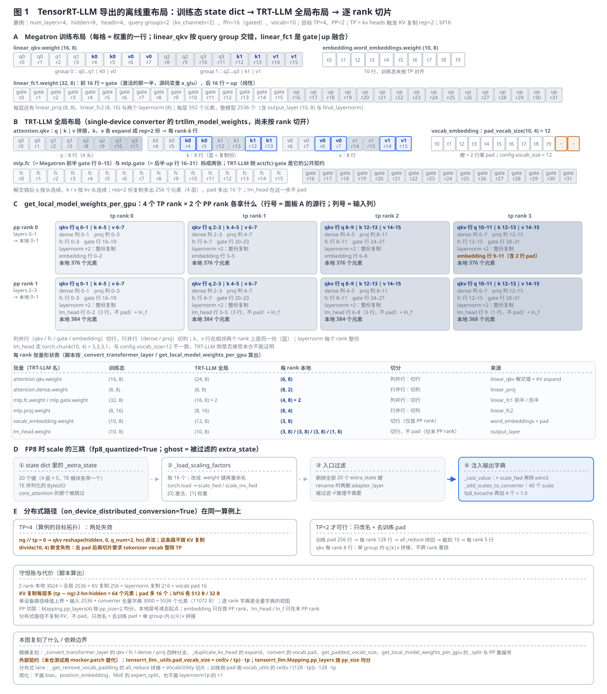
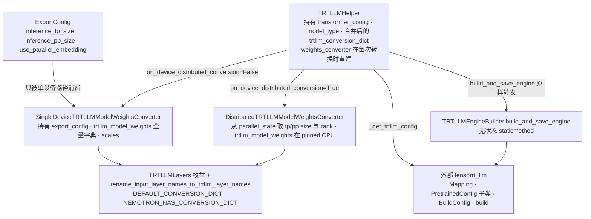
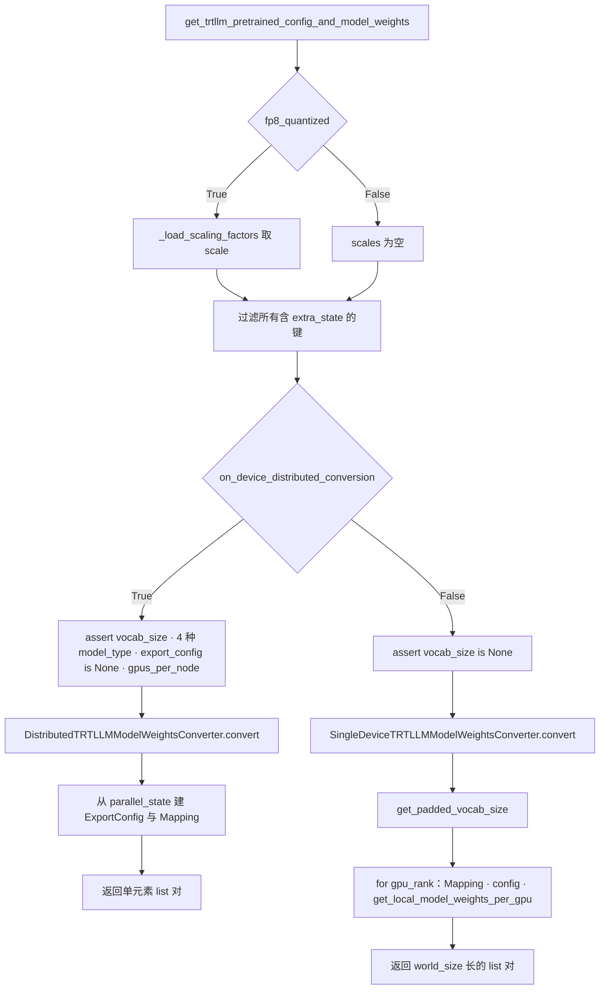
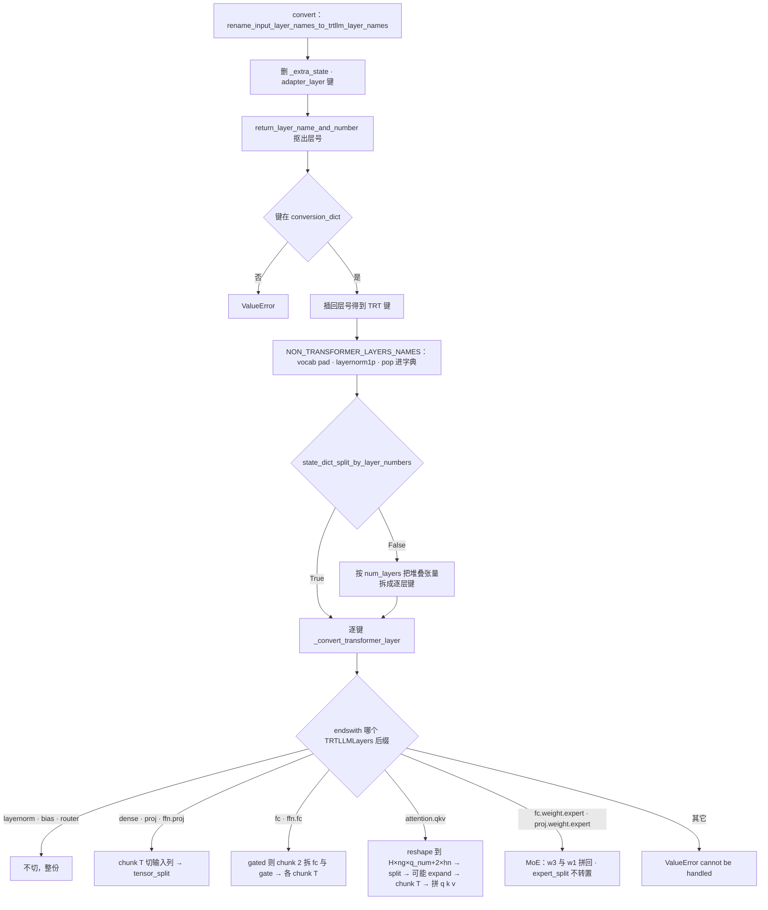
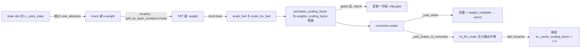
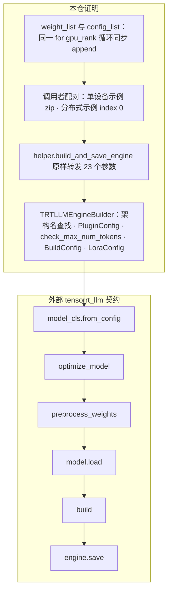

# Megatron-LM TensorRT-LLM 导出：训练态 state dict 的离线重布局

> **源码基线**：`NVIDIA/Megatron-LM@85902ef599ea4eb06ada7567a479c524b605767a`（`dev`，2026-09-01）
> **主题**：训练态 state dict 的布局（Megatron 层名、按 query group 交错的 QKV、融合的 gate|up、按 TP pad 的词表、`_extra_state` 里的 FP8 scale）怎样被改写成 TensorRT-LLM 的逐 rank 布局（`TRTLLMLayers` 层名、q|k|v 拼接与 KV 复制、gate / up 拆分、按目标 TP 切行切列、按目标 PP 切层、按 `Mapping` 生成的 config）；决定性设计是 `on_device_distributed_conversion` 选出的两条互斥路径，以及转换与建引擎两个 public API 之间靠调用者配对的 list 契约。核心代码在 `megatron/core/export/`。
> **适用范围**：功能树模块 M 的离线 TensorRT-LLM 权重导出（`megatron/core/export/**` 17 个文件、两个示例、6 个测试）。在线推理引擎归 [[31_megatron_inference_engine_analysis]]，分布式 checkpoint 的 TP 重切归 [[19_megatron_dist_checkpointing_analysis]]，RL refit 的在线权重交付归 [[30_megatron_rl_posttraining_consistency_analysis]]，ModelOpt 量化导出（`megatron/post_training`）归 [[40_megatron_feature_tree_analysis]] 模块 I。
> **最近更新**：2026-09-09。按房子形状重写：§2 只讲重布局原理与一张生成图，§3 单独讲调用流程与守卫；新增共用算例、KV 复制（!3383）的机制解释、逐 rank 守恒账与单设备峰值、分布式路径在同一算例上的两处失效、FP8 三跳计数、`_get_trtllm_config` 的字段来源；保留旧页全部更正。

---

## 1. 特性概览

### 1.1 问题背景

训练完的 GPT 是一个按 Megatron 模块命名、按训练拓扑分片、带着 TE 序列化状态的 state dict；TensorRT-LLM 建引擎要的是另一个世界：自己的层名枚举、每个推理 rank 一份已经切好的权重字典、一个描述 `tp_size × pp_size` 的 `PretrainedConfig`，以及 build 期的容量上限。两边差的不是数值而是**布局**——`linear_qkv.weight` 的行按 query group 交错存放，`linear_fc1.weight` 把 gate 与 up 融合在一张矩阵里，词表按训练 TP 被 pad 到 `128 × tp` 的倍数，FP8 的 scale 藏在 `._extra_state` 的 `BytesIO` 里。`megatron/core/export/` 就是这层离线适配：把训练布局改写成 TensorRT-LLM 逐 rank 布局，再把每一对 `weights_i / config_i` 交给外部 `tensorrt_llm` 去 build。它不是 [[31_megatron_inference_engine_analysis]] 里那个曾经的 `trt_llm_engine_wrapper.py`——那是推理引擎目录下一个从头到尾的桩，冻结基线里已被删除；导出子树是独立的 17 个文件。

### 1.2 解决方法

导出被拆成**两个 public API**：`TRTLLMHelper.get_trtllm_pretrained_config_and_model_weights` 把 state dict 变成两个位置对齐的 list（逐 rank 权重字典与逐 rank config），`TRTLLMHelper.build_and_save_engine` 接一对 `weights_i / config_i` 建一个 engine。转换内部由 `on_device_distributed_conversion` 二选一：**单设备路径**假设完整 state dict 在一台 CPU / GPU 上，在一个函数里把它重切成任意目标 `inference_tp_size × inference_pp_size`，输出 `world_size` 份；**分布式路径**假设 state dict 已按目标拓扑分片在各 GPU 上，每个 device 只给自己那份改名、去训练 pad、在单个 query group 内拼 q|k|v，不能在函数内换拓扑，`export_config` 必须为 `None`。两条路径共用 `TRTLLMLayers` 层名枚举与 `DEFAULT_CONVERSION_DICT` 改名词典，共用 `_load_scaling_factors → 过滤 extra_state → _add_scales_to_converter` 的 FP8 三跳，共用 `_get_trtllm_config` 从 `TransformerConfig` 生成 config。转换与 build 之间没有自动调用：调用者按同一下标配对两个 list，build 从 `TRTLLMEngineBuilder` 跨进外部 `tensorrt_llm`。

### 1.3 收益、开销和约束

| 维度 | 直接收益 | 必付成本或边界 |
|---|---|---|
| 拓扑 | 单设备路径能把 TP=1 的完整权重重切成任意目标 TP×PP，KV 头少于 TP 时复制 k / v 填满每个 rank（§2.4） | 调用设备要装下整模：本页算例的峰值上界是输入 2536 + converter 全量字典 3000 = 5536 个元素（§2.8）；`ng < tp` 要求 `tp % ng == 0`，否则 `raise Exception` |
| 分布式 | 分布式路径不聚合整模，每个 device 只处理自己那份，输出直接进 pinned CPU 内存 | 不能换拓扑：`export_config` 必须 `None`，TP / PP 从 `parallel_state` 推断；本页算例（ng=2、vocab=10、目标 TP=4）在这条路上两处失效（§2.3） |
| 层级变换 | q|k|v 拼接、gate / up 拆分、按列 / 按行切片、PP 切层与本地重编号全部由 converter 完成，TRT-LLM 侧只需 `model.load` | lm_head 从不 pad，而 `config.vocab_size` 按 pad 后报：vocab 不整除 TP 时两者不一致，TRT-LLM 侧是否接受本仓不能证明（§2.4） |
| FP8 | scale 从 TE 的 `_extra_state` 提取，权重乘 `scale_fwd` 后转 `float8_e4m3fn`，scale 以 fp32 键注入输出字典 | 只认 TE 的 `scale_fwd / scale_inv_fwd` 序列化格式；`fp8_kvcache` 的 kv scale 恒为 1.0，不是标定值（§2.5） |
| 依赖 | 仓内只做布局改写，build 的模型类、优化、权重预处理、序列化全交给 `tensorrt_llm` | 构造 `TRTLLMHelper` 就要求 `tensorrt_llm` 可导入（`ImportError`）；单元测试用 `mocker.patch` 替掉 `pad_vocab_size` / `str_dtype_to_torch`，仓内不证明任何 TRT-LLM 版本一定可 build（§2.7） |
| 配置 | `ExportConfig` 只描述目标推理拓扑与 embedding 布局，与训练 config 解耦 | `ExportConfig` 不在训练 config 枚举面内；`_get_trtllm_config` 消费的 `TransformerConfig` 字段 owner 全在别页（§6） |

### 1.4 与相邻交付路径的对照

| 路径 | 交付物 | 何时重切 | owner |
|---|---|---|---|
| 本页：TRT-LLM 导出 | 逐 rank 权重字典 + config → 外部 engine | 离线，一次性；单设备路径在函数内重切，分布式路径要求输入已按目标拓扑分片 | 本页 |
| RL refit 在线权重交付 | 训练 rank 直接把权重推给 rollout 引擎 | 每次 policy 更新；同进程 / 同集群 | [[30_megatron_rl_posttraining_consistency_analysis]] |
| 分布式 checkpoint 的 TP 重切 | 另一个训练拓扑下可加载的 checkpoint | 加载时按 `ShardedTensor` 元数据重组 | [[19_megatron_dist_checkpointing_analysis]] |
| ModelOpt 量化导出 | 量化后的 HF / TRT-LLM checkpoint | 训练后量化流程内 | [[40_megatron_feature_tree_analysis]] 模块 I |

记号（后文复用）：$H$ = `hidden_size`，$n_h$ = `num_attention_heads`，$n_g$ = `num_query_groups`（即 TRT-LLM 的 `num_key_value_heads`），$h_n$ = `kv_channels`，$F$ = `ffn_hidden_size`，$V$ = 词表大小，$T$ = `inference_tp_size`，$P$ = `inference_pp_size`，$q_{\mathrm{num}} = n_h / n_g$，$\mathrm{rep} = T / n_g$（仅当 $n_g < T$）。

---

## 2. 离线重布局的详细方案

本节只讲原理；函数级的调用顺序、守卫与 list 配对流程全部放到 §3。

### 2.1 共用算例

一个小 GPT：`num_layers = 4`、`hidden_size = 8`、`num_attention_heads = 4`、`num_query_groups = 2`（GQA，`kv_channels = 2`）、`ffn_hidden_size = 16`（gated：`linear_fc1.weight` 是 `(32, 8)` 的 gate|up 融合）、`vocab = 10`、不带 bias、embedding 与 output_layer 不共享；目标 `inference_tp_size = 4`、`inference_pp_size = 2`、`use_parallel_embedding = True`、bf16。$T = 4 > n_g = 2$ 触发 KV 复制，`rep = 2`；$V = 10$ 不整除 $T$ 触发 vocab pad。每层 592 个元素，整模型 2536 个（含 `output_layer` 与 `final_layernorm`）。图 1 的每个数字都由 `tools/figs/svg/megatron_trtllm_export_figures.mjs` 里逐句复刻自冻结基线的规则算出，`tools/figs/svg/lib/megatron_trtllm_export_figures.test.mjs` 锁定图与正文一致。



### 2.2 为什么训练布局不能直接装载：三处差异

**层名。** Megatron 的键是 `decoder.layers.N.self_attention.linear_qkv.weight` 这样的模块路径，TRT-LLM 认的是 `transformer.layers.N.attention.qkv.weight`。`TRTLLMLayers` 枚举了 24 个目标名（5 个一次性层 + 19 个 transformer 层内名，含 Nemotron-NAS 的 `ffn.*` / `attention.weight` 与 MoE 的 `*.expert`），`DEFAULT_CONVERSION_DICT` 给出 24 条 Megatron → 枚举的映射（Nemotron-NAS 再叠 4 条），TE 的 `linear_qkv.layer_norm_weight` 与 `linear_fc1.layer_norm_weight` 分别映射到 `input_layernorm` / `post_layernorm`。改名是逐键查表：键里的层号先被抠出、查表后再插回；查不到就 `ValueError`，`_extra_state` 与 `adapter_layer` 键在改名时直接删除。被否掉的替代方案是按字符串规则推断层名——判据是 Nemotron-NAS 与 Mixtral（!2479）都需要叠加自己的映射，词典叠加比规则改写更可扩展；代价是词典配错会把张量交给错误的目标参数，本仓没有端到端数值校验（分析重建）。

**交错的 QKV 与融合的 gate|up。** 面板 A：`linear_qkv.weight` 的 16 行按 query group 交错——每个 group 依次是 $q_{\mathrm{num}} = 2$ 个 q 头、1 个 k 头、1 个 v 头，每头 $h_n = 2$ 行，所以行序是 `q0 q0 q1 q1 k0 k0 v0 v0 | q2 q2 q3 q3 k1 k1 v1 v1`（attention.py 注释里的 `[sq, b, ng, (np/ng + 2) * hn]`）。TRT-LLM 要的是 q|k|v 三段拼接，每个 rank 拿自己的 q 头加对应的 k / v 头。`linear_fc1.weight` 的 32 行前 16 行是 gate（`mlp.py` 里被激活的那一半 `x_glu`），后 16 行是 up（`x_linear`）；TRT-LLM 把它们拆成 `mlp.fc` 与 `mlp.gate` 两张。

**按 TP pad 的词表与 `_extra_state`。** 训练侧 `calculate_padded_vocab_size` 把词表 pad 到 `make_vocab_size_divisible_by × tp` 的倍数（本页算例 TP=4 时 512 行、TP=2 时 256 行），每个训练 rank 持有其中一段；TRT-LLM 只要 tokenizer 词表，再按自己的 `pad_vocab_size(V, T)` 对齐。TE 模块的 `_extra_state` 是序列化的 `BytesIO`，装着 FP8 的 `scale_fwd / scale_inv_fwd`，TRT-LLM 不认这种键，但 FP8 导出又必须从里面取 scale。

### 2.3 两条路径的选择判据与各自代价

变体枚举依据是入口 `get_trtllm_pretrained_config_and_model_weights` 的 `on_device_distributed_conversion` 分支——只有这一个选择点，两条路径互斥。

**单设备路径**（默认）解决的是"我有一份 TP=1 / PP=1 的完整 state dict，要切成目标 $T \times P$"。它在一个函数里完成三件事：把整模改写成 TRT-LLM 全局布局（面板 B，每个 TP 切片以 `.{tp}.bin` 后缀存在同一个字典里），从 embedding / lm_head 推出 `config.vocab_size`，再为 `world_size = T \cdot P` 个 rank 各建一个 `Mapping` 与 config、取本地切片（面板 C）。代价是**调用设备必须装下整模加转换后的全量字典**——本页算例峰值上界 5536 个元素、11072 B（§2.8）。被否掉的替代方案是逐层流式转换——判据是 `get_padded_vocab_size` 要在 embedding 与 lm_head 都转换完之后才能定 `config.vocab_size`，而 config 又要先于 `get_local_model_weights_per_gpu` 生成（分析重建，源码对此沉默）。

**分布式路径**（`on_device_distributed_conversion=True`）解决的是"模型大到一台设备装不下"。前提是 state dict **已经按目标拓扑加载**：每个 device 只改自己那份的名、去训练 pad、在自己持有的 $n_g / T$ 个 group 内拼 q|k|v，dense / proj 权重直接改名不切（训练 TP 已经切过了），输出一对 `[weights], [config]`。代价是不能在函数内换拓扑：想要 TP=2 的引擎就得先以 TP=2 加载模型，`export_config` 必须为 `None`（TP / PP 从 `parallel_state` 推断）。在本页算例上它**两处失效**（面板 E）：`ng // tp = 0` 让 qkv 的 `reshape(hidden, 0, q_num+2, hn)` 非法（这条路没有 KV 复制），去 pad 后再切片的 `divide(10, 4)` 断言失败（tokenizer 词表必须整除 TP）。改成 TP=2 才可行：训练 pad 256 行 → 每 rank 128 行 → `all_reduce` 拼回 → 截到 10 → 每 rank 5 行；qkv 每 rank 8 行，只在单 group 内拼接，不跨 rank 重排。

判据一句话：**能装下整模就走单设备（它是唯一能换拓扑、能做 KV 复制的路）；装不下就先按目标拓扑加载再走分布式，并接受 $n_g \ge T$、$V \bmod T = 0$ 两个额外前提。**

### 2.4 逐层重排规则

**QKV 解交错与 KV 复制。** 单设备 converter 把 `(16, 8)` 的 `linear_qkv.weight` 转置成 `[H, n_g, q_{\mathrm{num}}+2, h_n]`，沿第三维 `split([q_num, 1, 1])` 得到 q / k / v 三块。$n_g \ge T$ 时要求 $n_g \bmod T = 0$，每个 rank 拿 $n_g / T$ 个 group；$n_g < T$ 时要求 $T \bmod n_g = 0$，k / v 先 `expand` 成 `rep = T / n_g` 份（!3383，§4.3），再与 q 一起各自 `torch.chunk(T)` 并按 q|k|v 拼接。本页算例 `rep = 2`：全局 qkv 从 `(16, 8)` 变成 `(24, 8)`（面板 B：q 8 行、k 8 行、v 8 行，其中 k / v 各 4 行是复制份），每 rank 6 行 `(6, 8)`；rank 0 拿 `q 0–1 | k 4–5 | v 6–7`，rank 1 拿 `q 2–3 | k 4–5 | v 6–7`——相邻两个 rank 持有同一份 k、v。为什么复制而不是让 rank 共享：TRT-LLM 的每个 TP rank 独立跑 attention，需要本地就有 k / v 权重；复制的代价是每层多 $(T - n_g) \cdot 2 \cdot h_n \cdot H$ = 64 个元素（§2.8）。`expand` 只造视图，真正的复制发生在切片后的 `.contiguous()`。

**gate / up 拆分。** `linear_fc1.weight` 转置后沿最后一维 `chunk(2)`：前半交给 TRT `mlp.fc`，后半改名成 `mlp.gate`；两张再各自 `chunk(T)`，本页每 rank `(4, 8)`。TRT-LLM 侧 `act(fc(x)) · gate(x)` 的语义是它的公开契约，本仓只保证前半 = Megatron 被激活的那一半。是否 gated 由 `is_gated_activation` 判定：`activation` 在 `{swiglu, geglu, fast-swiglu, fast-geglu}` 或 `transformer_config.gated_linear_unit`。MoE 的 `mlp.fc.weight.expert` 走另一条分支：`chunk(2, axis=1)` 得到 w1 / w3，各按 TP 切后**以 `[w3_i | w1_i]` 的顺序拼回一张**，键去掉 `.expert`、以 `.{tp}.bin` 存放且不转置——与 dense 的"拆成两张"相反，这是源码事实，`moe_tp_mode` 只进 config 不影响这里的切法。

**按列 / 按行切片。** 列并行的 qkv / fc / gate / embedding 切**行**（输出维），行并行的 dense / proj 切**列**（输入维）：`linear_proj.weight (8, 8)` 每 rank `(8, 2)`，`linear_fc2.weight (8, 16)` 每 rank `(8, 4)`。layernorm 与 bias 不切，每个 rank 整份。切片全部是 `torch.chunk` 语义：块大小 $\lceil n / T \rceil$，最后一块可短，块数可少于 $T$。

**词表 pad / 去 pad。** 单设备 `convert` 只在 `use_parallel_embedding` 且 $V \bmod T \ne 0$ 时把 embedding pad 到 `pad_vocab_size(10, 4) = 12`（面板 B 橙色 2 行零），每 rank `(3, 8)`；`get_padded_vocab_size` 再报 `config.vocab_size = 12`（有 lm_head 就 pad，没有就取 embedding 行数）。**lm_head 从不 pad**：`_split` 直接 `torch.chunk(10, 4)` 给出 3,3,3,1 行——与 `config.vocab_size = 12` 不一致，TRT-LLM 是否接受最后一个 rank 只有 1 行本仓不能证明；`use_parallel_embedding=False` 时 embedding 不 pad、每 rank 整张 10 行，而 config 仍报 12，同样是未证明的组合。分布式路径反过来做**去 pad**：`_get_remove_vocab_padding` 用 `val.shape[0] × T` 反推训练 pad 后的总行数，把本地段写进全零张量后 `all_reduce` 拼回整张，截到 tokenizer 词表，再按 `VocabUtility` 切回本 rank；它不做 TRT 侧 pad，`config.vocab_size` 直接等于 tokenizer 词表，所以要求 $V \bmod T = 0$。

**按 `Mapping` 切层与重编号。** `get_local_model_weights_per_gpu` 对每个 rank：`.bin` 键只留 `.{tp_rank}.bin` 的并去后缀；层号在 `mapping.pp_layers(num_layers)` 范围内的减去起点重编号（PP=2 时 pp rank 1 的 layers 2–3 变成本地 0–1），范围外的丢弃；embedding（及可选的 position embedding）只给首 PP rank，lm_head 与 `ln_f` 只给末 PP rank。本页算例每 rank 本地元素数：首 PP 组 376 个元素，末 PP 组 384 个元素（tp 0–2）与 368 个元素（tp 3，lm_head 只有 1 行）。

### 2.5 FP8 scale 的三跳

`fp8_quantized=True` 时（面板 D）：① state dict 里每层 5 个 `_extra_state`（TE 的 `linear_qkv / linear_proj / linear_fc1 / linear_fc2 / core_attention` 各带一个，4 层共 20 个）；② `_load_scaling_factors` 跳过 `core_attention` 的那个，取剩下 16 个，把键改成 `.weight` 后走同一套改名，`torch.load` 出 `scale_fwd / scale_inv_fwd`，`[0]` 是激活、`[1]` 是权重，gated 时 `.mlp.fc` 的两条再复制一份给 `.mlp.gate`；③ 入口把**所有**含 `extra_state` 的键删掉；④ converter 转换权重时 `_cast_value` 用 `weight_multiplier`（= `scale_fwd`）乘权重再转 `float8_e4m3fn`，转换完 `_add_scales_to_converter` 把 `trt_llm_scale`（= `scale_inv_fwd`）按 `*.activation_scaling_factor` / `*.weights_scaling_factor` 键注入输出字典——本页算例 40 个；`fp8_kvcache=True` 再为每层加一个 `attention.kv_cache_scaling_factor = 1.0`，4 个。为什么先取后删而不是边转边取：scale 的键名要经过与权重同一套改名才能对上，而改名函数会无条件删除 `_extra_state`，所以必须在改名前抄一份出来（源码事实，动机为分析重建）。"被过滤"不等于"推理不需要"：过滤的是键，需要的 scale 已经在 ① 到 ② 之间被搬走。scale 键没有 `.bin` 后缀，所以在单设备路径里会被复制到 PP 范围内的每个 TP rank。

### 2.6 config 生成：`_get_trtllm_config` 取了什么

config 是一个 dict 喂给 `TRT_MODEL_CONFIG[model_type]`（`GPTConfig` / `LLaMAConfig` / `GemmaConfig` / `FalconConfig` / `DeciConfig`）。它从 `TransformerConfig` 取 `num_layers`、`num_attention_heads`、`num_query_groups`（为 0 时退回 `num_attention_heads`）、`kv_channels`、`hidden_size`、`ffn_hidden_size`、`layernorm_epsilon`、`add_bias_linear`、`num_moe_experts`、`moe_router_topk`；从 helper 构造参数取 `position_embedding_type`（`rope` → `rope_gpt_neox`）、`max_position_embeddings`、`rotary_percentage`、`rotary_base`、`moe_tp_mode`、`moe_renorm_mode`、`share_embeddings_and_output_weights`、`activation`；从 `ExportConfig` 取 `tp_size`、`pp_size`、`use_parallel_embedding`；`vocab_size` 来自单设备的 `get_padded_vocab_size` 或分布式的 tokenizer 词表；`quantization` 由 `fp8_quantized / fp8_kvcache` 决定。三处要注意的源码事实：`moe_num_experts` 写成 `0 if moe_router_topk == 0 else (num_moe_experts or 1)`，而 `moe_router_topk` 默认 2，所以 dense 模型的 config 里是 `moe_num_experts = 1`、`moe_top_k = 2`（TRT-LLM 怎样对待 1 个 expert 是它的契约，本仓未验证）；`hidden_act` 在 MoE 下取 `activation.split("-")[-1]`，否则交给外部 `non_gated_version`；falcon 的 `new_decoder_architecture` 由 `num_layers == 32` 判定。`ExportConfig` 自己只有 4 个字段，只描述目标拓扑与 embedding 布局；分布式路径不消费调用者的 `ExportConfig`，而是从 converter 的 `parallel_state` 重建一个（`use_parallel_embedding` 硬编码 `True`）。

### 2.7 从 list 终点到 engine：配对契约与 build-time 上限

转换 API 的返回是两个等长 list：单设备 `world_size` 份，分布式各 1 份。helper 里没有"下一个待 build 的 rank"状态，`build_and_save_engine` 只接显式的一对 `weights / config`；同一下标配对是**数据契约**——单设备路径的两个 list 在同一个 `for gpu_rank` 循环里同步 append，`config_i.mapping.rank` 与 `weights_i` 的 `.{tp}.bin` 选择、PP 层范围一一对应，交叉配对会让 mapping 与本地权重不一致。build 侧的容量参数（`max_input_len / max_output_len / max_batch_size / max_seq_len / max_num_tokens / max_beam_width`）是 **build-time 上限**，不从训练 `seq_length` 继承；`max_seq_len` 缺省为前两者之和，`check_max_num_tokens` 归一 token 上限。跨出本仓的边界：`model_cls.from_config → optimize_model → preprocess_weights → model.load → build → engine.save` 全在 `tensorrt_llm`，本仓交出去的是 `(weights_i, config_i, BuildConfig + PluginConfig)`，能证明的是这三样怎样被算出来，不能证明某个 TRT-LLM 版本、GPU 架构或 plugin 组合一定可 build。

### 2.8 开销结算

| 项 | 本页算例 | 一般式 |
|---|---|---|
| Σ rank 本地元素 | 3024 = 全局 2536 + KV 复制 256 + layernorm 复制 216 + vocab pad 16 | 全局 + $(T - n_g)\,2 h_n H \cdot L$ + $(T-1)(2HL + H)$ + $(\lceil V/T \rceil T - V) H$ |
| KV 复制 | 每层 64 个元素、4 层 256 个，bf16 512 B | 仅 $n_g < T$ 时；随 $T / n_g$ 线性增长 |
| vocab pad | 2 行 × 8 = 16 个元素，32 B | 最多 $(T-1) H$ 个元素 |
| 单设备峰值上界 | 输入 2536（5072 B）+ converter 全量字典 3000 = 5536 个元素（11072 B） | 约 2× 模型元素数；逐 rank 字典是全量字典的视图，`torch.chunk` 沿 dim 0 不复制 |
| 分布式路径 | 每 device 只持本地份；一次 `all_reduce` 拼词表；输出经 `copy_(non_blocking=True)` 进 pinned CPU 内存 | 无整模聚合；源码没有显式 `synchronize`，非阻塞拷贝的完成点由调用者负责（未验证后果） |

这条链在什么条件下失效：单设备路径装不下整模（OOM，源码无守卫）；$n_g < T$ 且 $T \bmod n_g \ne 0$，或 $n_g \ge T$ 且 $n_g \bmod T \ne 0$（`raise Exception`）；分布式路径遇到 $n_g < T$（reshape 非法）或 $V \bmod T \ne 0$（`divide` 断言）；`torch.chunk` 块数少于 $T$ 时 `_split` 的 `[idx]` 越界（如 $V = 9$、$T = 4$）；词典缺键（`ValueError`）。

---

## 3. 代码实现分析

### 3.1 类与所有权



`TRTLLMHelper` 在构造时合并三层词典（默认 → Nemotron-NAS → 调用者），断言 `position_embedding_type ∈ {learned_absolute, rope}`，检查 `tensorrt_llm` 可导入；它不缓存任何 rank 状态，`self.weights_converter` 在每次转换调用时重建。两个 converter 都持有 `trtllm_model_weights` 字典与 `scales`，都用 `num_query_groups`（为 0 时按 `multi_query_mode` 取 1 或 `num_attention_heads`）算 `num_kv_heads`；区别是单设备的字典装整模的所有 `.{tp}.bin` 切片，分布式的字典装本 device 的一份，且每个值是 `torch.empty(..., device="cpu", pin_memory=True)` 后 `copy_(non_blocking=True)` 得到的。`trt_model_config.py` 在 `tensorrt_llm` 缺失时用 `MagicMock` 顶替（!3506），所以模块 import 不会失败，失败点推迟到 `TRTLLMHelper.__init__`。

### 3.2 调用流程

单设备路径从示例入口到 engine 落盘（全程同步、单进程；分布式路径的差异标在右侧）：

```text
examples/export/trtllm_export/single_device_export/gpt_single_device_cpu_export.py  (TP1 PP1 加载完整模型)
`-- TRTLLMHelper(transformer_config, model_type, ...)             # ImportError 若无 tensorrt_llm；合并词典
`-- helper.get_trtllm_pretrained_config_and_model_weights(state_dict, dtype, export_config)
    |-- assert state_dict is not None
    |-- scales = _load_scaling_factors(state_dict)   if fp8_quantized   # 先抄 scale
    |-- state_dict = {k: v ... if "extra_state" not in k}               # 再删键
    |-- [distributed] assert vocab_size, model_type in 4 种, export_config is None, gpus_per_node
    |   `-- _get_..._in_distributed_setting  → DistributedTRTLLMModelWeightsConverter.convert
    |       |-- rename → NON_TRANSFORMER：_get_remove_vocab_padding（1 次 all_reduce）→ transformer 层改名/拼 q|k|v
    |       |-- _add_scales_to_converter → ExportConfig(从 parallel_state) → _get_trtllm_config → Mapping(rank)
    |       `-- return [weights], [config]
    `-- [single-device] assert vocab_size is None
        `-- _get_..._list_on_single_device
            |-- SingleDeviceTRTLLMModelWeightsConverter(export_config, ...).convert(state_dict, dict, split_by_layer_numbers)
            |   |-- rename_input_layer_names_to_trtllm_layer_names        # ValueError 若缺映射
            |   |-- NON_TRANSFORMER：vocab pad（仅 use_parallel_embedding）· layernorm1p · pop 进全量字典
            |   `-- for layer in tqdm(...)：_convert_transformer_layer   # ValueError 若无分支能处理
            |-- _add_scales_to_converter(converter, scales, fp8_kvcache)
            |-- vocab_size_padded = converter.get_padded_vocab_size()
            `-- for gpu_rank in range(T·P)：
                |-- mapping = tensorrt_llm.Mapping(world_size, rank, tp_size, pp_size)   # 外部
                |-- config_i = _get_trtllm_config(...); config_i.mapping = mapping
                `-- weights_i = converter.get_local_model_weights_per_gpu(mapping, config_i)
`-- for weights_i, config_i in zip(weight_list, config_list):        # 调用者配对（分布式示例用 [0]）
    `-- helper.build_and_save_engine(engine_dir, weights_i, config_i, 容量参数...)
        `-- TRTLLMEngineBuilder.build_and_save_engine                # 再次 ImportError 守卫
            |-- getattr(tensorrt_llm.models, architecture)           # AttributeError；Llama 名兼容改写
            |-- PluginConfig / check_max_num_tokens / BuildConfig.from_dict / LoraConfig
            `-- model_cls.from_config → optimize_model → preprocess_weights → model.load → build → engine.save
                                                                      # ---- 外部 tensorrt_llm，本仓不证明 ----
```

没有异步 hop；唯一的等待点是分布式路径里 `all_reduce` 与非阻塞的 GPU→pinned CPU 拷贝，后者源码不同步。完成信号：转换 API 的返回就是"逐 rank 字典可用"；`engine.save` 返回就是"引擎落盘"。

### 3.3 各机制的代码流程

#### 3.3.1 入口与路径选择（对应 §2.3）



四条守卫都是 `assert`，`tests/unit_tests/export/trtllm/test_trtllm_helper.py::test_exceptions` 逐条锁定（含 `ExportConfig(use_embedding_sharing=...)` 的 `DeprecationWarning` 路径）。分布式的 model type 白名单是 `[gpt, gptnext, llama, nemotron_nas]` 四种，但 assert 文案只写 "gptnext and llama"——排障以布尔列表为准，不以过时文案为准。

#### 3.3.2 改名与逐层重排（对应 §2.2、§2.4）



`_add_to_trtllm_model_weights` 的三种 `split_type`：`None` 直接存整份；`tensor_split` 把每个切片转置回 `[out, in]` 后以 `.{i}.bin` 存；`expert_split` 同样以 `.{i}.bin` 存但不转置。每次存前都过 `_cast_value`：FP8 时按 `weights_scaling_factor` 键查 scale、乘 `weight_multiplier` 再转 `float8_e4m3fn`。分布式 converter 的同名函数只有四条分支（不切的一组含 dense / proj、fc 拆 gate、Nemotron 线性层、qkv 单 group 拼接），reshape 用 `num_kv_heads // inference_tp_size`。层级测试：`test_trtllm_layers.py::test_rename_input_layer_names_to_trtllm_layer_names_with_layer_numbers` / `_without_layer_numbers` / `_exception`；转换测试：`test_trtllm_single_device_converter.py::test_get_model_weights_converter`（`pad_vocab_size` 被 `mocker.patch`）。

#### 3.3.3 逐 rank 切片（对应 §2.4）

`get_local_model_weights_per_gpu(mapping, config)` 遍历全量字典：跳过一次性层；`.bin` 键只留 `.{tp_rank}.bin` 并去后缀；`layer_num = int(name.split(".")[2])` 在 `mapping.pp_layers(num_layers)` 内的减去起点重编号，否则丢弃；falcon 的 `new_decoder_architecture` 把 `post_layernorm` 改名 `mlp_layernorm`；`mapping.is_first_pp_rank()` 时加 embedding（`use_parallel_embedding` 则 `_split` 切行）与 position embedding，`is_last_pp_rank()` 时加 lm_head（`_split`，从不 pad）、`ln_f` 与其 bias。`_split` 在 `tp_size == 1` 时原样返回，否则 `torch.chunk(...)[idx].contiguous()`。scale 键（`*.activation_scaling_factor` 等）没有 `.bin` 后缀，按层号进入 PP 范围内每个 TP rank 的字典。

#### 3.3.4 FP8 三跳（对应 §2.5）



`_load_scaling_factors` 对 `val is None` 的 `_extra_state` 直接跳过，`val.seek(0)` 后 `torch.load`。测试 `test_single_device_fp8.py::test_get_model_weights_converter` 与 `test_distributed_fp8.py::test_get_model_weights_converter` 在 `fp8_quantized × fp8_kvcache` 四种组合上断言：config 的 `quant_algo / kv_cache_quant_algo`、每层 8 个 fp32 scale 键（非 gated：4 个 Linear × 2）、4 类可量化权重为 `float8_e4m3fn`、bias / layernorm / embedding / lm_head 保持 bf16。

#### 3.3.5 config 生成（对应 §2.6）

`_get_trtllm_config` 是纯函数：一个 dict 加 `model_type` 专属补丁（falcon 的 `new_decoder_architecture / parallel_attention`，`seq_len_interpolation_factor` 的线性 `rotary_scaling`，nemotron_nas 从 `heterogeneous_layers_config_encoded_json` 取 `block_configs` 并设 llama3 型 `rotary_scaling`），最后 `TRT_MODEL_CONFIG[model_type](**config)`。单设备路径每个 rank **新建一个 config 实例**再挂 `mapping`（源码注释强调不能复用同一实例）；分布式路径只建一个，`rank = pp_rank × tp_size + tp_rank`。

#### 3.3.6 list 配对与 build 边界（对应 §2.7）



builder 自己有 `reduce_fusion` 参数，但 helper 的 public wrapper 没有暴露它——通过 wrapper 使用时它保持 builder 默认值 `False`。`DeciLMForCausalLM` 强制 `strongly_typed=True`、`use_fused_mlp=False`；`use_lora_plugin` 非空时挂 `LoraConfig(lora_ckpt_source="nemo")`，源码留有 TODO。

### 3.4 源码阅读路线

1. `megatron/core/export/trtllm/trtllm_helper.py::TRTLLMHelper.__init__` —— 词典合并、`position_embedding_type` 断言、`ImportError`。
2. `::TRTLLMHelper.get_trtllm_pretrained_config_and_model_weights` —— 入口四条 `assert` 与路径选择；`::_get_trtllm_pretrained_config_and_model_weights_list_on_single_device` / `::_get_trtllm_pretrained_config_and_model_weights_in_distributed_setting`。
3. `::TRTLLMHelper._load_scaling_factors` / `::_add_scales_to_converter` / `::_get_trtllm_config`。
4. `megatron/core/export/trtllm/trtllm_layers.py::TRTLLMLayers` / `::TRTLLMLayers.rename_input_layer_names_to_trtllm_layer_names` / `::return_layer_name_and_number` / `NON_TRANSFORMER_LAYERS_NAMES`；`model_to_trllm_mapping/default_conversion_dict.py::DEFAULT_CONVERSION_DICT` / `NEMOTRON_NAS_CONVERSION_DICT`。
5. `megatron/core/export/trtllm/trtllm_weights_converter/single_device_trtllm_model_weights_converter.py::SingleDeviceTRTLLMModelWeightsConverter._convert_transformer_layer`（含内嵌 `_add_to_trtllm_model_weights` / `_duplicate_kv_head`）、`::convert`、`::get_padded_vocab_size`、`::get_local_model_weights_per_gpu`（内嵌 `_split`）、`::_cast_value`；`::pad_vocab_size` 是对 `tensorrt_llm._utils.pad_vocab_size` 的转发。
6. `megatron/core/export/trtllm/trtllm_weights_converter/distributed_trtllm_model_weights_converter.py::DistributedTRTLLMModelWeightsConverter.__init__`（VP 断言、`parallel_state` 读取）、`::_add_to_trtllm_model_weights`（pinned CPU）、`::_convert_transformer_layer`、`::_get_remove_vocab_padding`、`::convert`；`utils.py::is_gated_activation`。
7. `megatron/core/export/trtllm/engine_builder/trtllm_engine_builder.py::TRTLLMEngineBuilder.build_and_save_engine`；`trt_model_type.py::TRT_MODEL_TYPE_STRING`、`trt_model_config.py::TRT_MODEL_CONFIG`；`megatron/core/export/export_config.py::ExportConfig`、`model_type.py::ModelType`、`data_type.py::DataType`。
8. 示例：`examples/export/trtllm_export/single_device_export/gpt_single_device_cpu_export.py`（`zip` 配对）、`examples/export/trtllm_export/distributed_export/gpt_distributed_gpu_export.py`（`[0]` 配对）。
9. 测试：`tests/unit_tests/export/trtllm/test_trtllm_helper.py::TestTRTLLMHelper.test_exceptions`；`test_trtllm_single_device_converter.py::TestTRTLLMSingleDeviceConverter.test_get_model_weights_converter` / `::test_num_kv_heads_less_than_tp_size_valid` / `::test_num_kv_heads_less_than_tp_size_invalid` / `::test_num_kv_heads_greater_equal_tp_size_valid` / `::test_num_kv_heads_greater_equal_tp_size_invalid`；`test_trtllm_distributed_gpu_converter.py::TestTRTLLMDistributedGPUConverter.test_get_model_weights_converter`（TP=2、vocab 256 → embedding 128 行、qkv 96 行）；`test_single_device_fp8.py` / `test_distributed_fp8.py::test_get_model_weights_converter`；`test_trtllm_layers.py`。
10. 历史：`50502b9a0`（!3383，2025-09-03，KV 复制）、`6eaf7541e`（!3506，安全 import 与 `MagicMock`）、`5d0273fc4`（!2799，忽略 `adapter_layer`）、`3d3d86525`（!2479，Mixtral 映射）、`bbe933713`（!2963，Nemotron-NAS）、`ca1a3df69`（!2179，TE FP8 checkpoint 导出）。训练侧词表 pad：`megatron/training/vocab_utils.py::_calculate_padded_vocab_size_cached`；切片工具：`megatron/core/tensor_parallel/utils.py::VocabUtility.vocab_range_from_global_vocab_size` → `megatron/core/utils.py::divide`。

---

## 4. 配套机制

### 4.1 层名映射词典的三层叠加

`TRTLLMHelper.__init__` 先 `DEFAULT_CONVERSION_DICT.copy()`，`model_type == nemotron_nas` 时叠加 `NEMOTRON_NAS_CONVERSION_DICT`（把 `mlp.linear_fc1 / linear_fc2` 改指向 `ffn.fc / ffn.proj`，并加上 `replace_with_linear` 的 `self_attention.weight` / `mlp.weight`），最后叠加调用者的 `trtllm_conversion_dict`。词典的值必须是 `TRTLLMLayers` 成员（`assert isinstance`）。它解决的是"同一套 converter 服务 8 种 `ModelType`"：`TRT_MODEL_TYPE_STRING` 把 8 种压到 5 个 TRT-LLM 类名（gpt / gptnext / starcoder → `GPTForCausalLM`，llama / mixtral → `LlamaForCausalLM`，gemma、falcon、nemotron_nas 各一），类名差异进 config，键名差异进词典。

### 4.2 layernorm1p 的 +1

`layernorm_zero_centered_gamma` 且 `normalization == "LayerNorm"` 时，两个 converter 都给含 `layernorm.weight` 的键与 `final_layernorm` 加 1.0——NeMo 的 layernorm1p 把 gamma 存成零中心，TRT-LLM 要标准 gamma。RMSNorm 不加。这是导出唯一改数值的地方（FP8 的乘 scale 是精度变换）。

### 4.3 !3383 的 KV 复制：基线内最后一次机制性变更

`50502b9a0`（2025-09-03）之前，单设备 converter 对 qkv 只做 `torch.chunk(qkv[k], tp)`，并在 `query_groups_shape[1] % tp != 0` 时 `raise`，所以 `ng < tp` 一律不可导出。这次提交加入内嵌的 `_duplicate_kv_head(val, rep, dim)`（`expand` 到 `rep = tp // ng` 份），把守卫改成两段：`ng < tp` 要求 `tp % ng == 0`，`ng ≥ tp` 要求 `ng % tp == 0`；`q / k / v` 先 `reshape(hidden, -1)` 再 `chunk`，weight 与 bias 两条分支同改。为什么需要复制：TRT-LLM 每个 TP rank 独立算 attention，rank 数超过 kv 头数时每个 rank 必须本地持有一份 k / v；被否掉的替代是让多个 rank 共享一个 kv 头的通信方案——本仓的导出器只做布局、没有运行时通信可依赖（分析重建）。代价即 §2.8 的每层 $(T - n_g) \cdot 2 h_n H$ 个元素。测试锁定：`test_num_kv_heads_less_than_tp_size_valid`（ng=2、tp=4：每个 rank 的 qkv 权重与 bias 键都存在、k / v 段来自同一 group）、`_invalid`（ng=3、tp=4 → 异常文案 "duplicate or split"）、`greater_equal_valid`（ng=8、tp=4）、`greater_equal_invalid`（ng=5、tp=4）。分布式 converter **没有**这条逻辑。

### 4.4 仅是相邻、不由本页展开的机制

- **在线推理引擎**（`megatron/core/inference/`）：与导出无调用关系，历史上的 `trt_llm_engine_wrapper.py` 桩已删除 → [[31_megatron_inference_engine_analysis]]。
- **分布式 checkpoint 的 TP 重切**：分布式路径要求"先以目标拓扑加载"，加载时的重组归 [[19_megatron_dist_checkpointing_analysis]]。
- **RL refit 在线权重交付**：同属模块 M 的另一条路 → [[30_megatron_rl_posttraining_consistency_analysis]]。
- **ModelOpt 量化 / `megatron/post_training`**：`examples/export/README.md` 里与本子树并列的另一个导出面 → [[40_megatron_feature_tree_analysis]] 模块 I。
- **tokenizer 与词表约定**：`vocab_size` 参数的来源 → [[11_megatron_dataset_analysis]]。

---

## 5. 约束、适用场景与趋势

### 5.1 硬约束与失败边界

| 前提 / 不变量 | 源码边界 | 破坏后的行为 |
|---|---|---|
| `tensorrt_llm` 可导入 | `TRTLLMHelper.__init__` 与 `TRTLLMEngineBuilder.build_and_save_engine` 的 `raise ImportError` | 构造 helper 即失败；`trt_model_config.py` 的 `MagicMock` 让模块 import 不报错 |
| `position_embedding_type ∈ {learned_absolute, rope}` | `TRTLLMHelper.__init__` 的 `assert` | 其它位置编码不可导出 |
| state dict 非空 | 入口 `assert model_state_dict is not None` | — |
| 分布式：`vocab_size`、`gpus_per_node` 必填，`export_config` 必须 `None`，model type ∈ 4 种 | 入口四条 `assert`（`test_trtllm_helper.py::test_exceptions`） | `AssertionError`；assert 文案 "gptnext and llama" 少列了 gpt 与 nemotron_nas |
| 分布式：无 virtual pipeline | `DistributedTRTLLMModelWeightsConverter.__init__` 的 `assert vp_size is None or vp_size == 1` | 要求先聚合 VP chunk |
| 分布式：$n_g \ge T$ | 无显式守卫；`_convert_transformer_layer` 的 `reshape(hidden, ng // tp, ...)` | `ng // tp = 0` 时 `RuntimeError`（reshape 形状非法） |
| 分布式：$V \bmod T = 0$ | `_get_remove_vocab_padding` → `VocabUtility.vocab_range_from_global_vocab_size` → `divide` 的 `assert` | `AssertionError: 10 is not divisible by 4` |
| 单设备：`vocab_size` 必须 `None` | 入口 `assert vocab_size is None` | 由 embedding 行数推断 |
| 单设备：$n_g < T \Rightarrow T \bmod n_g = 0$；$n_g \ge T \Rightarrow n_g \bmod T = 0$ | `_convert_transformer_layer` 的两处 `raise Exception("... duplicate or split ...")` | 测试 `test_num_kv_heads_*_invalid` |
| 单设备：`torch.chunk` 块数 ≥ $T$ | 无守卫；`_split` 的 `torch.chunk(...)[idx]` | 块数不足时 `IndexError`（如 $V = 9$、$T = 4$ 的 lm_head） |
| 单设备：lm_head 行数与 `config.vocab_size` 一致 | 无守卫；lm_head 从不 pad 而 `get_padded_vocab_size` 会 pad | $V \bmod T \ne 0$ 时不一致（3,3,3,1 对 12）；TRT-LLM 侧行为未验证 |
| 单设备：`state_dict_split_by_layer_numbers=True` 时键必须含层号 | `rename_input_layer_names_to_trtllm_layer_names` 的 `assert layer_number is not None` | 堆叠格式须显式传 `False` |
| 每个键都在词典里 | `rename_...` 的 `raise ValueError("Unable to rename key ...")` | 缺映射即失败 |
| 每个 transformer 层键都有 converter 分支 | `_convert_transformer_layer` 末尾 `raise ValueError("... cannot be handled by converter")` | 未知后缀即失败 |
| `tqdm` 可导入 | 两个 `convert` 的 `raise ImportError` | — |
| 单设备：整模装得下 | 无守卫 | OOM；峰值上界约 2× 模型元素数（§2.8） |
| 分布式：非阻塞拷贝已完成 | 无守卫；`copy_(non_blocking=True)` 后无 `synchronize` | 过早读取 pinned 缓冲的后果未验证 |
| build：architecture 能在 `tensorrt_llm.models` 找到 | `getattr` 失败 `raise AttributeError` | Llama 名有一次 `LlamaForCausalLM → LLaMAForCausalLM` 兼容改写 |
| build：容量参数自洽 | 外部 `check_max_num_tokens` | 报错在 `tensorrt_llm` 内，本仓只转发参数 |

### 5.2 何时用哪条路

- **整模能放进一台 CPU / GPU** → 单设备路径：唯一能在函数内换目标拓扑、能做 KV 复制的路；把 state dict 先搬到 GPU 会更快（docstring 建议）。
- **整模放不下** → 先以目标 TP×PP 加载模型，再走分布式路径；接受 $n_g \ge T$、$V \bmod T = 0$、无 VP 三个额外前提，输出在 pinned CPU。
- **只想转换不 build** → 仍需安装 `tensorrt_llm`（构造即检查、`Mapping` / config 类来自它）；本仓没有"无依赖的纯格式工具"。
- **FP8 训练的 checkpoint** → 两条路都支持 `fp8_quantized / fp8_kvcache`，前提是 TE 的 `_extra_state` 格式。
- **MoE** → 单设备路径有 `expert_split` 分支；分布式 converter 没有 MoE 分支（`ValueError`）。

### 5.3 当前演进方向

`git log 85902ef -- megatron/core/export examples/export tests/unit_tests/export` 显示这一模块处于**稳定状态**：2026 年内只有两次非机制性触碰——`7d1acf6d4`（#3305，2026-02-11，`trtllm_layers.py` docstring 拼写）与 `325709393`（#2946，2026-02-09，legacy tokenizer 移除后两个 FP8 测试的 fixture 适配）；`4cf809cce`（#2373，2025-12-07）只改 `examples/export/README.md` 的 ModelOpt 名称。最近一次机制性变更是 2025-09-03 的 !3383（§4.3），之前是 2025-07 的 !3506 安全 import、2025-04 的 !2963 Nemotron-NAS 与 !2475 Gemma 修复、2025-03 的 !2799 忽略 adapter 权重、2025-02 的 !2683 DeepSeek FP4 / blocked FP8 量化。趋势判断（只依据基线前历史）：变更集中在"支持更多 `ModelType` 与量化格式"，而不是改动两条路径的结构；分布式路径自 2024 年以来未获得 KV 复制、MoE、vocab pad 三项能力，能力差距在扩大而不是收敛。

---

## 6. 配置契约

### `ExportConfig`（`megatron/core/export/export_config.py`；不在 coverage 枚举面内，本页拥有）

| 字段 | 类型 | 默认 | 契约 |
|---|---|---|---|
| `inference_tp_size` | `int` | `1` | 目标推理 TP；单设备路径按它切行 / 切列、复制 KV、pad 词表；分布式路径忽略调用者的值 |
| `inference_pp_size` | `int` | `1` | 目标推理 PP；`world_size = tp × pp`；`Mapping.pp_layers` 按它切层 |
| `use_parallel_embedding` | `bool` | `False` | `True` 时 embedding pad 到 `pad_vocab_size` 并按 TP 切行；`False` 时每 rank 整张、不 pad；分布式路径硬编码 `True` |
| `use_embedding_sharing` | `Optional[bool]` | `None` | 已弃用；非 `None` 即 `DeprecationWarning`，替代项是 helper 的 `share_embeddings_and_output_weights` |

该类共 4 个字段，本表收 4 项。

### `TRTLLMHelper.__init__`（keyword-only；手写签名，不在 coverage 枚举面内）

| 参数 | 类型 | 默认 | 契约 |
|---|---|---|---|
| `transformer_config` | `TransformerConfig` | — | §2.6 列出的字段被 `_get_trtllm_config` 与两个 converter 消费 |
| `model_type` | `ModelType` | — | 8 种；决定 `TRT_MODEL_TYPE_STRING` / `TRT_MODEL_CONFIG` 与 Nemotron-NAS 词典叠加 |
| `trtllm_conversion_dict` | `dict` | `{}` | 叠加在默认词典之上；值必须是 `TRTLLMLayers` |
| `position_embedding_type` | `str` | `"learned_absolute"` | 只允许 `learned_absolute` / `rope`（`assert`）；`rope` → config `rope_gpt_neox` |
| `max_position_embeddings` | `int` | `None` | 原样进 config |
| `rotary_percentage` | `int` | `1.0` | config `rotary_pct` |
| `rotary_base` | `int` | `10000` | config `rotary_base` |
| `rope_scaling_factor` | `float` | `8.0` | 仅 nemotron_nas：llama3 型 `rotary_scaling.factor` |
| `moe_tp_mode` | `int` | `2` | 原样进 config |
| `multi_query_mode` | `bool` | `False` | `num_query_groups == 0` 时 kv 头数取 1（否则取 `num_attention_heads`） |
| `activation` | `str` | `"gelu"` | 进 `is_gated_activation` 与 config `hidden_act` |
| `seq_len_interpolation_factor` | `float` | `None` | 非 `None` 时 config 加线性 `rotary_scaling` |
| `moe_renorm_mode` | — | `None` | `None` 时取外部 `MoeConfig.ExpertScaleNormalizationMode.RENORMALIZE` |
| `share_embeddings_and_output_weights` | `bool` | `False` | config `share_embedding_table`；共享时 state dict 无 `output_layer`，`get_padded_vocab_size` 不再 pad |

### `get_trtllm_pretrained_config_and_model_weights`

| 参数 | 类型 | 默认 | 契约 |
|---|---|---|---|
| `model_state_dict` | `dict` | — | 非 `None`；单设备为整模，分布式为本 device 的份 |
| `dtype` | `DataType` | — | `bfloat16 / float16 / float32` 三种；经外部 `str_dtype_to_torch` 变成存储 dtype |
| `export_config` | `ExportConfig` | `None` | 单设备必给；分布式必须 `None` |
| `on_device_distributed_conversion` | `bool` | `False` | 路径选择点 |
| `vocab_size` | `int` | `None` | 分布式必给（tokenizer 词表）；单设备必须 `None` |
| `gpus_per_node` | `int` | `None` | 分布式必给；单设备缺省取 `inference_tp_size` |
| `state_dict_split_by_layer_numbers` | `bool` | `True` | `False` 表示堆叠格式 `[num_layers, ...]`，由 `convert` 拆层 |
| `fp8_quantized` / `fp8_kvcache` | `bool` | `False` | §2.5 三跳与 config `quantization` |

### `build_and_save_engine`（helper wrapper，23 个参数原样转发）

| 参数 | 默认 | 契约 |
|---|---|---|
| `engine_dir`、`trtllm_model_weights`、`trtllm_model_config` | — | 同一下标的一对；`engine.save(engine_dir)` |
| `max_input_len` / `max_output_len` / `max_batch_size` | `1024` / `1024` / `4` | build-time 上限；`max_seq_len` 缺省为前两者之和 |
| `max_num_tokens` / `opt_num_tokens` / `max_seq_len` | `None` | 交给外部 `check_max_num_tokens` 归一 |
| `max_beam_width` / `tokens_per_block` | `1` / `128` | 进 `check_max_num_tokens` 与 paged KV 配置 |
| `paged_kv_cache` / `remove_input_padding` / `paged_context_fmha` / `multiple_profiles` | `True` / `True` / `False` / `False` | `PluginConfig` 开关 |
| `gpt_attention_plugin` / `gemm_plugin` | `"auto"` | `PluginConfig` |
| `use_lora_plugin` / `lora_ckpt_list` / `max_lora_rank` / `lora_target_modules` | `None` / `None` / `64` / `None` | 非空时挂 `LoraConfig(lora_ckpt_source="nemo")` |
| `use_refit` / `max_prompt_embedding_table_size` | `False` / `0` | 进 `BuildConfig` |
| （builder 独有）`reduce_fusion` | `False` | wrapper 未暴露，只能取默认值 |

### `TransformerConfig`（涉及，owner 在别页）

| 字段 | 本页用途 | owner |
|---|---|---|
| `num_layers` / `hidden_size` / `num_attention_heads` / `kv_channels` / `normalization` / `layernorm_epsilon` / `add_bias_linear` / `layernorm_zero_centered_gamma` | config 字段与 layernorm1p 判定；`num_query_groups`（`auto`）为 0 时的退路 | [[10_megatron_model_structure_analysis]] |
| `heterogeneous_layers_config_encoded_json` | nemotron_nas 的 `block_configs` 来源；coverage 清单未登记此字段（登记的是 `heterogeneous_block_specs`） | [[10_megatron_model_structure_analysis]] |
| `ffn_hidden_size` | config `intermediate_size` | [[25_megatron_nonuniform_tp_analysis]] |
| `gated_linear_unit` | `is_gated_activation` 的第二判据 | [[30_megatron_rl_posttraining_consistency_analysis]]（`auto`） |
| `num_moe_experts` / `moe_router_topk` | config `moe_num_experts / moe_top_k`（dense 模型得到 1 / 2） | [[14_megatron_ep_analysis]] |
| `virtual_pipeline_model_parallel_size`（`ModelParallelConfig`） | 分布式 converter 的 VP 断言 | [[15_megatron_pp_schedulers_analysis]]（`auto`） |
| `fp8` | 决定 TE 是否在 `_extra_state` 里写 scale | [[23_megatron_precision_cudagraph_fusion_analysis]] |

`TransformerConfig` 在 `docs/coverage/megatron-lm.yaml` 登记 265 个字段，本表涉及其中 14 项（另 1 项未登记）、拥有 0 项；`ModelParallelConfig` 登记 74 个字段，本表涉及 1 项。训练侧词表 pad 的 `make_vocab_size_divisible_by` 是手写 argparse 组，不在 coverage 枚举面内。

## Related Pages

- [[31_megatron_inference_engine_analysis]] —— 树内推理引擎与本页离线导出是两条路；该页记录了 `trt_llm_engine_wrapper.py` 桩的删除。
- [[19_megatron_dist_checkpointing_analysis]] —— 分布式路径要求"先以目标拓扑加载"，加载时的 TP 重切归它。
- [[30_megatron_rl_posttraining_consistency_analysis]] —— 模块 M 的另一条交付路：RL refit 的在线权重交付。
- [[11_megatron_dataset_analysis]] —— tokenizer 与词表约定；本页的 `vocab_size` 与去 pad 都以它为准。
- [[10_megatron_model_structure_analysis]] —— `_get_trtllm_config` 消费的大多数 `TransformerConfig` 字段的 owner。
- [[40_megatron_feature_tree_analysis]] —— 模块 M（本页）与模块 I（ModelOpt 导出）在功能树中的边界。
- [[02_engineering/02_train_frameworks/megatron-lm/index|Megatron-LM 知识地图]] — 返回本域索引。
