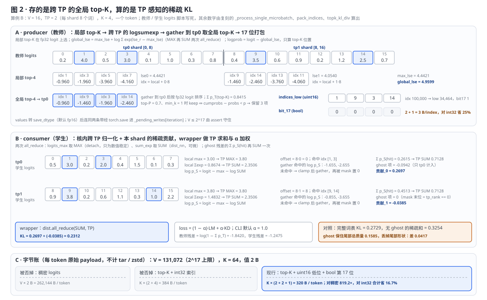
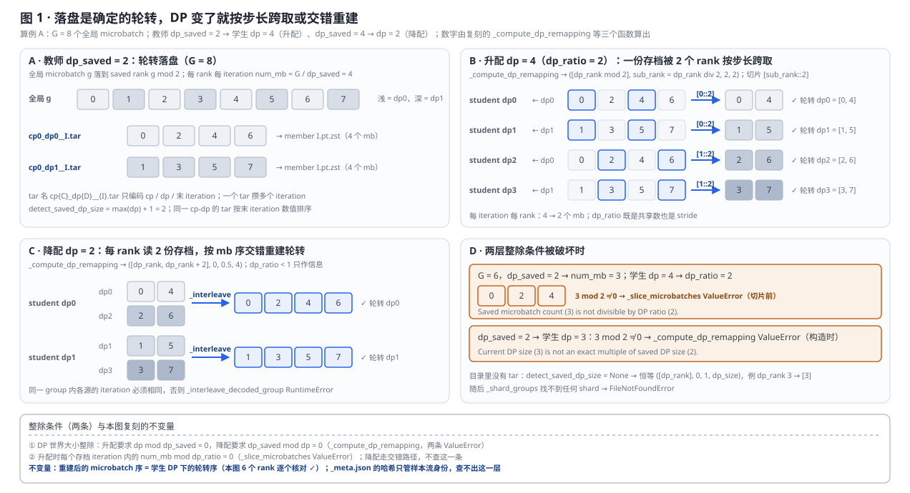
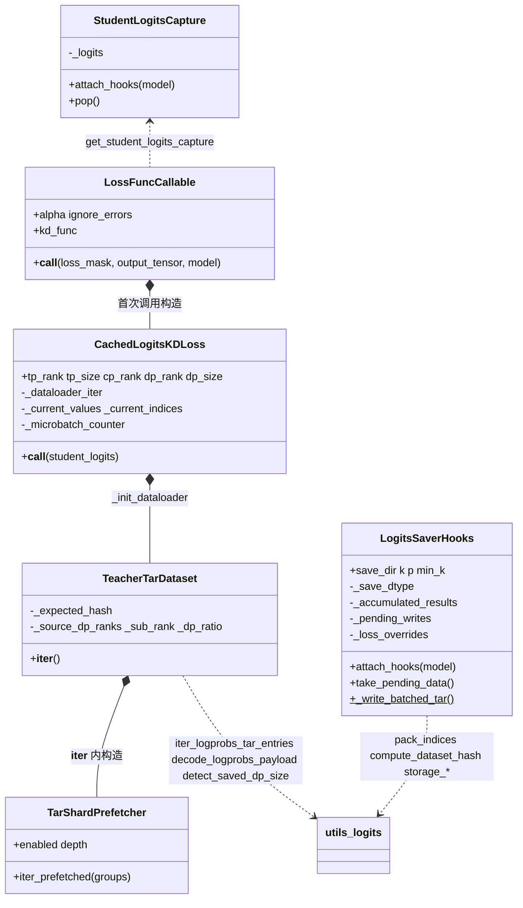
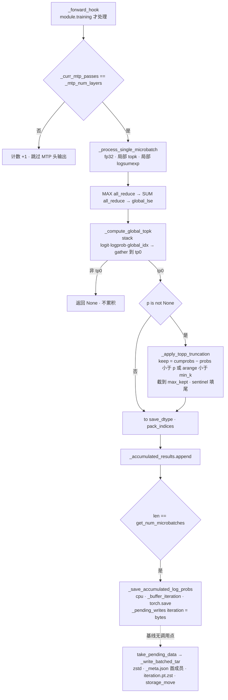
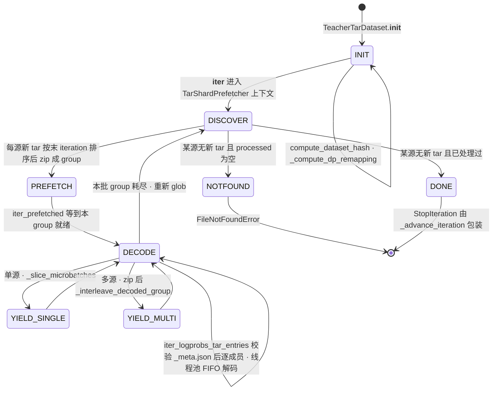
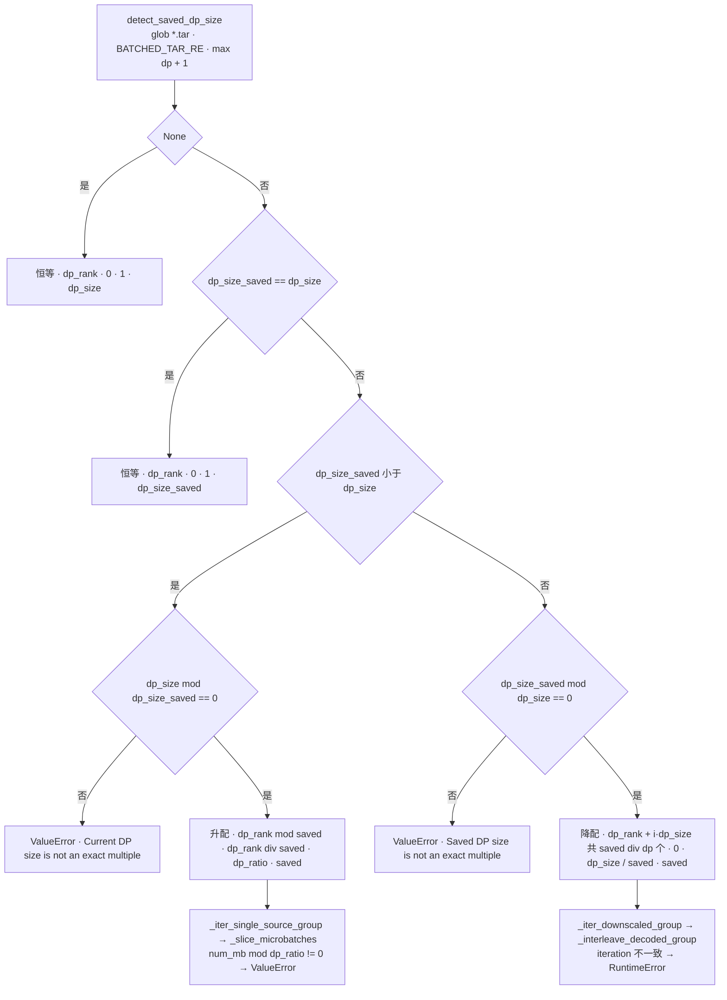

# Megatron-LM 离线 logits 蒸馏：top-K 缓存协议、DP 重映射与 TP 感知的稀疏 KL

> **源码基线**：`NVIDIA/Megatron-LM@85902ef599ea4eb06ada7567a479c524b605767a`（`dev`，2026-09-01）
> **主题**：离线 logits 蒸馏怎样把「教师每步陪跑」换成「教师跑一遍、写一份稀疏缓存」，以及为了让这份缓存既存得下又对得上样本而做的四个决定：存跨 TP 的全局 top-K 并把 17 位索引拆成 `uint16 + bool`、用样本流的声明哈希而不是运行时握手保证两次运行对齐、教师与学生 DP 度不同时按轮转落盘做跨取或交错重建、学生侧在 TP 切分的 logits 上直接算带 ghost token 的稀疏 KL。§2 只讲原理与算例，§3 单独讲 hook、reader 状态机与调用流程。核心代码在 `megatron/training/distillation/`。
> **适用范围**：功能树模块 Q 的离线教师产物路径（producer / 一致性契约 / DP 重映射 / consumer）与它的 11 个手写 argparse 开关；ModelOpt 在线蒸馏是兄弟轴，只给边界与 owner（[[40_megatron_feature_tree_analysis]] 模块 I）；样本流本身归 [[11_megatron_dataset_analysis]]，TP 的 logits 布局归 [[12_megatron_tp_analysis]]，不物化完整 logits 的另一条路归 [[24_megatron_linear_cross_entropy_analysis]]。
> **最近更新**：2026-09-09。按房子形状重写：§2 原理层与 §3 代码层分离；新增两个共用算例与两张生成图（DP 重映射、稀疏 KL）及复刻回归；把「producer 写盘链未闭合」追到 main → dev 合并提交；配置契约按教师 / 学生分表。

---

## 1. 特性概览

### 1.1 问题背景

知识蒸馏的目标函数很简单——让学生的输出分布逼近教师的。难的是工程账：在线蒸馏里教师必须在学生训练的每一步都做一次前向，教师通常比学生大，算力大头花在一个参数根本不更新的模型上；教师还要和学生一起占显存、一起走并行拓扑，学生能用的 TP / DP 配置被教师绑住。把教师前向挪到一次独立运行里去做，问题就变成三个：完整 logits 存不下（词表十万量级，一个 token 的分布就是几百 KB，`[序列 × 词表]` 乘上整个数据集完全不可行）；两次运行必须看到同一份样本流，而中间只有文件，没有运行时握手；教师那次运行的并行度不应该把学生锁死，至少 TP 与 DP 要能变。`megatron/training/distillation/` 这个模块在冻结基线里只有一个实质提交（#5019，2026-06-12），三个文件 1912 行，就是对这三个问题的回答。

### 1.2 解决方法

教师运行挂一个 forward hook 在 `output_layer` 上：每个 microbatch 先在各 TP shard 上取局部 top-K，用 MAX / SUM 两次 all_reduce 拼出全词表的 logsumexp，只对 top-K 位置算 logprob，gather 到 TP rank 0 按 fp32 logit 重排取全局 top-K（可选再做 top-P 截断），索引按 17 位拆成 `uint16` 低位与 `bool` 第 17 位，值转 `fp16`，整个 iteration 的 microbatch 经 `torch.save` 序列化后攒进内存里的 `_pending_writes[iteration]`；预期的落盘格式是每 (cp, dp) 一个 tar，首成员 `_meta.json` 记样本流声明哈希，其后每个 iteration 一个 zstd 压缩成员。学生运行读同一目录：按自己的 `(cp_rank, dp_rank)` 找 tar，先校验哈希，若教师 DP 度不同就按轮转落盘的规律跨取或交错重建，解码后在 TP 切分的学生 logits 上直接算稀疏 KL——核内做跨 TP 的归一化与本 shard 的贡献，wrapper 做最终的 TP 求和并按 `alpha` 与 LM loss 加权。同一个原理有两个边界要先说清：冻结基线里 producer 只闭合到内存 buffer，`take_pending_data` → `_write_batched_tar` 这条写盘链没有调用点（§2.6）；consumer 从 `training.py` 挂 hook 到 `topk_kl_div` 返回是一条可闭合的 live path（§3.2）。

### 1.3 收益、开销和约束

| 维度 | 直接收益 | 必付成本或边界 |
|---|---|---|
| 算力 | 教师只做一次前向，学生训练时没有教师参与；教师与学生的 TP、DP 可以不同 | CP 布局、micro-batch size、样本流必须相同，且没有守卫检查前两项（§5.1） |
| 存储 | 每 token 只存 K 项：$V = 131072$、$K = 64$、值 2 B 时 320 B 对稠密 262,144 B 是 819.2×（§2.2） | 尾部只剩一个 ghost token 的总质量，尾部形状不可恢复；K / P 是显式旋钮，源码不给保真度保证 |
| 索引 | 17 位拆 `uint16 + bool`，每索引 3 B，对 `int32` 省 25%，整条 top-K 记录省 16.7% | 词表上限 $2^{17}$，由 `assert` 守住 |
| 对齐 | `_meta.json` 的哈希在每个 tar 开头校验，seed / seq_len / train_samples / blend 任一改变立即 `RuntimeError` | 只是声明哈希，同名数据文件内容被替换查不出（§2.3） |
| DP 弹性 | 升配按步长跨取、降配交错重建，重建序等于学生 DP 的轮转序（§2.4） | 两层整除条件，破坏即 `ValueError`；找不到 tar 退化为恒等映射 |
| 学生显存 | 不 all_gather 完整 logits，只多两次标量 all_reduce 与一个 `[S, B, K]` 的 gather（§2.5） | 每 microbatch 四次 TP 集合通信（MAX、SUM、ghost SUM、wrapper SUM） |
| 写盘 | 预期由 checkpoint 的异步队列在后台压缩、写 tar | 冻结基线没有接线，`_pending_writes` 只增不减（§2.6） |

记号：$V$ 全局词表大小，$T$ TP 度，$K$ 每 token 保留项数，$D_s$ 教师写盘时的 DP 度，$D$ 学生 DP 度，$G$ 每 iteration 的全局 microbatch 数，$\alpha$ KD 权重。教师分布 $p_T$、学生分布 $p_S$，ghost 残差 $r_T = 1 - \sum_{k \in \mathrm{topK}} p_T(k)$，$r_S$ 同理。

### 1.4 与 ModelOpt 在线蒸馏的对照

同一仓库有两条蒸馏路，选择点是 `pretrain_gpt.loss_func` 的分支顺序：`logits_load_dir` 非空走本页；否则 `modelopt_enabled` 走 `megatron/post_training/loss_func.py`（`export_kd_teacher_load` → `model.compute_kd_loss`）。本表只列本页要分清的差异，在线路归 [[40_megatron_feature_tree_analysis]] 模块 I。

| 维度 | ModelOpt 在线蒸馏 | 离线 logits 蒸馏（本页） |
|---|---|---|
| 教师 | 与学生同进程，`modelopt_gpt_hybrid_builder` 按 `--export-kd-teacher-load` 装配教师，每步前向 | 独立运行一次，产物是 tar 目录 |
| 蒸馏信号 | 完整分布（含中间层特征，取决于 ModelOpt 配置） | 每 token top-K logprob + ghost 残差 |
| 并行耦合 | 教师与学生同一拓扑 | TP 由全局索引协议解耦，DP 允许整除比重映射，CP / MBS 必须相同 |
| 开关 | `megatron/post_training/arguments.py` | `arguments.py::_add_logits_distillation_args` 的 11 个手写 flag |
| 该选谁 | 教师装得下、拓扑一致、要中间层信号 | 教师太大或要复用一份教师产物训多个学生 |

---

## 2. 离线 logits 蒸馏详细方案

本节只讲原理，用两个算例与两张图把每个决定的输入、变换、不变量与代价说清；hook 注册、reader 状态机与调用流程全部放到 §3。

### 2.1 共用算例

**算例 A（DP 重映射）**：每 iteration 有 G = 8 个全局 microbatch，全局 microbatch $g$ 落到教师 saved rank $g \bmod D_s$。(i) 教师 dp_saved = 2 → 学生 dp = 4（升配，dp_ratio = 2）；(ii) 教师 dp_saved = 4 → 学生 dp = 2（降配）；(iii) 违反整除的两例：G = 6、dp_saved = 2 → 每 iteration num_mb = 3，学生 dp = 4；以及 dp_saved = 2 → 学生 dp = 3。

**算例 B（稀疏 KL）**：V = 16，TP = 2（每 shard 8 个词），K = 4，一个 token。教师 logits 与学生 logits 各 16 个数由脚本写死，其余每个数字——局部 lse、global_lse、全局 top-K、打包位、两次 all_reduce 的值、命中集合、ghost 残差、各 rank 贡献、完整词表 KL——都由 `tools/figs/svg/megatron_logits_distillation_figures.mjs` 里逐句复刻自冻结基线的规则算出，`tools/figs/svg/lib/megatron_logits_distillation_figures.test.mjs` 锁定它们与本文一致。字节账另取 V = 131,072（`_MAX_VOCAB_SIZE`）、K = 64、值 2 B。

### 2.2 存什么：跨 TP 的全局 top-K、可选 top-P、17 位打包



**要解决什么。** 一个 token 的完整分布是 $V$ 个数，存不下；但蒸馏需要的是「教师认为可能的那些词」的概率与它们的位置，这个集合很小。问题是 logits 在 TP 下按词表切成 $T$ 份，每个 rank 只看得到自己的 $V/T$ 个词，「全局 top-K」不在任何一个 rank 手里。

**变换在算例上怎么走。** 教师 logits 转 fp32 后，tp0 在自己 8 个词上取局部 top-4：idx 1、3、5、7；tp1 取 idx 9、14、13、11。归一化分母不需要完整词表：每个 rank 先算本 shard 的 lse（lse0 = 4.4421，lse1 = 4.0540），跨 TP 取 MAX 得 max_lse = 4.4421，再对 $\exp(\mathrm{lse}_r - \max)$ 求 SUM，得 global_lse = 4.9599——它就是对完整 16 个 logit 直接 logsumexp 的值，两次 all_reduce 只是数值稳定的分解。局部 top-K 位置上 logprob = logit − global_lse；因为 log-softmax 单调，局部 top-K 的位置与在 logprob 上取是一样的（`LogitsSaverHooks` docstring 自述），所以不必先算 `[S, B, V]` 的 log-softmax。各 rank 把 (logit, logprob, 全局索引 = 局部索引 + rank × 8) 打成一个 `[S, B, local_k, 3]` 的 fp32 张量 gather 到 tp0（fp32 精确表示到 $2^{24}$，够 17 位索引），tp0 按 **logit** 重排取全局 top-4：索引 {1, 9, 3, 14}，logprob -0.9599、-1.4599、-1.9599、-2.4599，累计质量 $\sum p_T(\mathrm{topK}) = 0.8415$，尾部 0.1585。若开 top-P = 0.7、min_k = 1：保留判据是「该项之前的累计质量 < p」（保证越过阈值的那一项被留下，且 top-1 永远在），前三项累计 0.756 才越过 0.7，第四项被截，只剩 3 项；K 维截到本 microbatch 所有 token 的最大保留数，短于它的 token 尾部填 sentinel（值 -1e3、索引 -1）。最后 `pack_indices`：索引 & 0xFFFF 存 `uint16`，索引 >> 16 存 `bool`；算例里四个索引都 < 65536，第 17 位全 0；一个 idx 100,000 的示例拆成 low 34,464、bit17 = 1，`unpack_indices` 用 `(bit17 << 16) | low` 还原。

**被否掉的替代与判据。** 存完整 logits：面板 C 的账，V = 131,072、值 2 B 时每 token 262,144 B，top-K + 17 位是 320 B，819.2×；判据是存储量随 $V$ 线性而随 $K$ 线性、$K \ll V$。索引存 `int32`：每 token 384 B，17 位拆法 320 B，索引本身省 25%、整条记录省 16.7%；判据是词表上限 $2^{17}$ 恰好比 `uint16` 多一位，多一个 `bool` 张量比多一个 `int32` 便宜（源码 docstring 自述「Global vocab requires 17 bits」）。各 rank 各存自己的局部 top-K、不做全局合并：存下来的文件就与教师 TP 度绑定，学生 TP 改变就对不上 shard；全局索引协议让 TP 彻底解耦（分析重建：源码只写「TP rank 0 saves the full top-K (unsharded)」）。先算完整 log-softmax 再取 top-K：多一个 `[S, B, V]` fp32 张量，docstring 明说是要「avoid materializing a full vocab-sized log-softmax tensor」。

**代价与失效条件。** 17 位不是物理打包：PyTorch `uint16` 2 B、`bool` 1 B，3 B/index 是**原始 tensor payload 口径**，不计 `torch.save` 容器、tar 头与 zstd；源码只定义两张 tensor 的 dtype，不保证序列化后的固定压缩率。词表超过 $2^{17}$ 时 `assert` 失败。ghost token 保住的是尾部**总质量**不是形状（§2.5 算例里丢掉的部分是 0.0417）。top-P 的 sentinel 索引 -1 经 `pack_indices` 会变成 65535 + bit17（源码注释承认「The index sentinel does not survive pack_indices()」），所以 consumer 必须同时按值 sentinel 过滤。`save_dtype` 默认 `fp16`，logprob 越小精度越差，`fp32` 时值占 4 B、每 token 448 B。

### 2.3 一致性契约：声明哈希，不是内容哈希，也不是运行时握手

**要解决什么。** 学生第 $N$ 个 iteration 第 $m$ 个 microbatch 读到的教师分布，必须恰好对应它自己正在算的那批 token；对不上不会报错，只会训出错的东西。教师和学生是两次独立进程，中间只有文件。

**变换怎么走。** `compute_dataset_hash` 把决定全局样本流的四个量序列化成 JSON 再 MD5：`seed`、`seq_length`、`train_samples`（缺失时回退 `train_iters × global_batch_size`）、`blend`。`blend` 的口径由 `_blend_identifiers` 再收一层：每个数据前缀只取**去扩展名的 basename 与权重**，目录路径与 `.bin` / `.idx` 内容都不参与；`blend_per_split` 只取 train split；mock 数据记 `{"kind": "mock"}`。教师把这个哈希与四个量一起写进每个 tar 的首成员 `_meta.json`（还带 `saver: {k, p, min_k, save_dtype}`），学生在自己的进程里用同一个函数算出期望值，读每个 tar 时先看 `_meta.json`：哈希不等 `RuntimeError`（文案「Data does not align!」），`_meta.json` 不在 payload 之前也 `RuntimeError`。

**被否掉的替代与判据。** 运行时握手做不到——没有教师进程可握。对数据文件做内容哈希：要在两侧各读一遍整个语料，且同一语料换目录就失配；现实现选路径无关的**配方身份**，判据是可复用性（分析重建，源码只说「path-agnostic representation」）。把 TP / DP / 模型结构也哈希进去：会把 §2.4 的 DP 弹性一起否掉，而这些量不影响样本流。

**代价与失效条件。** 这是**必要而非充分**的声明一致性：seed、长度、样本数、blend 名称或权重变了能查出；同名 IndexedDataset 内容被替换、`micro_batch_size` 或 CP 布局改变都查不出——后两者是 `cached_logits_loss.py` 模块 docstring 的「Assumptions」，没有守卫（§5.1）。`saver` 里的 K / p 也只是记录，学生不校验，直接消费文件里实际的 K 维。

### 2.4 DP 重映射：落盘是确定的轮转，升配跨取、降配交错



**要解决什么。** 教师用 8 卡 DP 存的数据，学生要能用 32 卡或 4 卡读。tar 按 `cp{C}_dp{D}__{I}.tar` 命名，`D` 是教师的 DP rank，文件与教师 DP 度绑定。

**不变量与变换在算例上怎么走。** 前提是 `_compute_dp_remapping` docstring 陈述的落盘模型：数据按轮转分到 DP rank，saved rank $d$ 持有全局 microbatch $d, d + D_s, d + 2D_s, \dots$。算例 A 里 dp_saved = 2：`cp0_dp0__I.tar` 持有 [0, 2, 4, 6]，`cp0_dp1__I.tar` 持有 [1, 3, 5, 7]，每 rank 每 iteration num_mb = 4。学生先用 `detect_saved_dp_size` 扫目录取文件名里 dp 的最大值 + 1 = 2，再分三支：

- **相等**：`([dp_rank], 0, 1, dp_size_saved)`，原样读。
- **升配**（dp = 4，dp_ratio = 2）：每份存档被 2 个学生 rank 共享，学生 `dp_rank` 读存档 `dp_rank mod 2`，以 `sub_rank = dp_rank div 2` 为起点按步长 2 切片 `[sub_rank::dp_ratio]`：dp0 ← dp0 [0::2] = [0, 4]，dp1 ← dp1 [0::2] = [1, 5]，dp2 ← dp0 [1::2] = [2, 6]，dp3 ← dp1 [1::2] = [3, 7]。每个 rank 拿到的正是学生 DP = 4 下的轮转序 $r, r + 4$。
- **降配**（dp_saved = 4 → dp = 2）：每个学生 rank 读 `dp_size_saved div dp_size` = 2 份存档 `dp_rank, dp_rank + dp_size`，把它们的 microbatch 按 `src0_mb0, src1_mb0, src0_mb1, src1_mb1, …` 交错：dp0 读 dp0 [0, 4] 与 dp2 [2, 6] → [0, 2, 4, 6]；dp1 读 dp1 [1, 5] 与 dp3 [3, 7] → [1, 3, 5, 7]。这也是学生 DP = 2 的轮转序。`dp_ratio = 0.5` 只作信息，切片路径不用它。

正确性判据不是「读到了数据」而是「重建出的全局顺序与教师当时一致」——顺序错了，token 与它的教师分布就对不上，而 §2.3 的哈希查不出这一层。图 1 对 6 个学生 rank 逐个核对了这条不变量。

**被否掉的替代与判据。** 要求教师与学生 DP 相同：把教师产物钉死在一种集群规模上。每条记录带全局 microbatch id、学生按 id 随机访问：tar 是顺序流，没有「id → 字节偏移」的索引，随机访问要另建索引；现实现只要求两层整除，用文件名与轮转规律换掉索引（分析重建）。这里不能反推 map-style `Dataset` 天生不能惰性读取——另建随机访问索引也可以惰性读，只是不是本仓选择的协议。

**代价与失效条件。** 两层整除：升配要求 `dp mod dp_saved = 0`，降配要求 `dp_saved mod dp = 0`，否则 `_compute_dp_remapping` 在构造 dataset 时就 `ValueError`（算例：dp_saved = 2 → dp = 3，文案「Current DP size (3) is not an exact multiple of saved DP size (2)」）；升配还要求每个存档 iteration 内 `num_mb mod dp_ratio = 0`，否则 `_slice_microbatches` 在切片前 `ValueError`（算例：G = 6 → num_mb = 3、dp_ratio = 2，文案「Saved microbatch count (3) is not divisible by DP ratio (2)」）；降配走交错路径不查这一条，但要求同一 group 内各源的 iteration 相同，否则 `_interleave_decoded_group` `RuntimeError`。目录里一个 tar 都没有时 `detect_saved_dp_size` 返回 `None`，映射退化为恒等 `([dp_rank], 0, 1, dp_size)`，随后 `_shard_groups` 找不到任何 shard 抛 `FileNotFoundError`；`max(dp) + 1` 的探测意味着中间缺文件的 rank 不会被发现，只在它自己的 rank 上报找不到。升配后每 rank 每 iteration 只剩 num_mb / dp_ratio 个 microbatch（4 → 2），tar 里其余一半解码后丢弃，解码开销不按需缩减。

### 2.5 学生侧稀疏 KL：核内跨 TP 归一化，ghost 只在 rank 0 计入，wrapper 做 TP 求和

**要解决什么。** 学生 logits 也按 TP 切成 $T$ 个 shard，教师给的是全局索引；要算的是

$$
\begin{aligned}
\mathrm{KL}(p_T \,\|\, p_S)
&=\sum_{k \in \mathrm{topK}} p_T(k)\bigl[\log p_T(k)-\log p_S(k)\bigr] \\
&\quad + r_T\bigl[\log r_T - \log r_S\bigr],
\end{aligned}
$$

其中 $\log p_S(k)$ 需要全词表的归一化分母，而 $k$ 落在哪个 shard 由索引决定。

**变换在算例上怎么走**（图 2 面板 B）。学生 logits 转 fp32，各 rank 取局部 max（tp0 3.0、tp1 3.8），跨 TP MAX 得 logits_max = 3.8，减掉（`detach`，只为数值稳定）；各 rank 算本 shard 的 $\sum \exp$（tp0 0.8674、tp1 1.4832），用 **可微** 的 `dist_nn.functional.all_reduce` SUM 得 sum_exp = 2.3506——梯度要能沿分母回流到两个 shard，所以这一次不能用普通 `dist.all_reduce`。于是 $\log p_S = \mathrm{logit} - \max - \log \mathrm{sum\_exp}$ 在两个 shard 上都是全局一致的归一化。教师索引减去 `offset = local_vocab_size × tp_rank` 映射到本 shard：tp0 offset 0 命中 {1, 3}，tp1 offset 8 命中 {9, 14}；越界的索引先 `clamp` 到 `[0, local_vocab_size)` 再 gather（避免索引错误，可能产生重复位置），然后被 mask 置零；mask 同时排除值为 sentinel 的项。命中位置的 $\log p_S$：tp0 -1.6547（idx 1）、-2.6547（idx 3），tp1 -0.8547（idx 9）、-3.6547（idx 14）。ghost token：各 rank 对命中项的 $p_S$ 求和（0.2615、0.4513），再 SUM all_reduce 得 0.7128，学生残差 $\log(1 - 0.7128) = -1.2475$；教师残差直接由文件里的 K 个 logprob 算 $\log(1 - 0.8415) = -1.8420$（两者都 clamp 到 $10^{-8}$ 以上）。残差项拼到 K 维末尾，mask 末位是 `float(tp_rank == 0)`——两个 rank 手里的残差相同，只能算一次。逐项 $p_T(\log p_T - \log p_S)$ 后按 mask 求和：tp0 贡献 0.2697（含 ghost 项 -0.0942），tp1 贡献 -0.0385，核返回 `[B, S]` 的局部贡献。wrapper `LossFuncCallable` 先按 `loss_mask` 求和，再在 TP group 上 `dist.all_reduce` SUM：KL = 0.2697 + (-0.0385) = 0.2312，最后 `loss = (1 − α)·LM + α·KD`，CLI 默认 α = 1.0。

**ghost 保住了什么、丢了什么。** 同一数据的完整词表 KL 是 0.2729。带 ghost 的稀疏 KL 是把 top-K 之外全部并成一个桶后两个粗化分布之间的 KL，粗化不增加散度，所以 0.2312 ≤ 0.2729，差 0.0417 就是被丢掉的尾部**形状**（学生把大量质量放在 idx 15 这种教师尾部词上，ghost 看不见）；尾部**总质量** 0.1585 被保住了。不带 ghost 的稀疏和是 0.3254——它不是任何两个归一化分布的 KL，可以大于完整 KL，也可以为负（tp1 的局部贡献就是负的：稀疏部分和不是 KL，只有全部相加才是）。

**被否掉的替代与判据。** 先 all_gather 完整学生 logits 再算：每个 rank 多一个 `[S, B, V]` fp32 张量（seq 8K、batch 1、V = 131,072 时 4 GiB），现实现只多两次每 token 一个标量的 all_reduce 与一个 `[S, B, K]` 的 gather（docstring 自述「avoiding a full-vocab-sized dense teacher tensor」；显存数字是本页算的）。ghost 在每个 rank 都计入：wrapper 的 SUM 会把它乘 $T$。分母用普通 all_reduce：梯度断在 shard 边界。把 KL 的 TP 求和也放进核里：核就必须知道自己被谁调用，现实现让核返回局部贡献、由 wrapper 归约，是「核只算本 shard」的分工（分析重建）。

**代价与失效条件。** 每 microbatch 四次 TP 集合通信（MAX、SUM、ghost SUM、wrapper SUM），全是每 token 一个标量或一次总和，通信量可忽略。`clamp` 导致的重复索引只靠 mask 消除，源码注释承认「may contain duplicate values due to clamping」。学生残差在 top-K 之外质量趋近 0 时被 clamp 到 $10^{-8}$，梯度在这里截断。eval 模式下 `_capture_logits` 不捕获、wrapper 直接返回 LM loss——教师 eval logits 没有存盘。

### 2.6 producer → disk 的接线边界与 LM loss 归零保图边

**接线边界。** 教师侧的 `_save_accumulated_log_probs` 名字容易误导：它只把 top-K 张量搬到 CPU、经 `_buffer_iteration` 序列化进内存的 `_pending_writes[iteration]`，此时磁盘上没有 tar。真正的 writer 是 `take_pending_data`（转移 pending 字节、以 `max(iteration)` 命名 tar）→ `_write_batched_tar`（在 checkpoint 异步后台进程里 zstd level 3 压缩、先写 `_meta.json` 再写各 iteration 成员、本地先写 `.tmp` 再 `os.replace` 原子发布、MSC 直接写）。冻结树里 `get_logits_saver` / `take_pending_data` / `_write_batched_tar` 除定义与导出外没有任何调用点；`tests/` 里也 grep 不到 `topk_kl_div` / `LogitsSaverHooks` / `_compute_dp_remapping`。历史上这条接线存在过：#5019 的原始提交把它放在 `checkpointing.py::save_checkpoint` 的 `async_save` 分支——在 checkpoint 请求之后再排一个 `AsyncRequest(async_fn=_write_batched_tar, async_fn_args=take_pending_data())`，并把 finalize 回调挪到 logits 请求上，让「成功」只在两次写都确认后才触发；`pretrain_hybrid.py` 也有同样的学生侧接线。main → dev 的合并提交 `c2a9a6016`（2026-06-22）的结果里这两处都没有，之后 dev 上再无恢复。本页只陈述冻结树事实：`--logits-save-dir` 让 hook 计算全局 top-K 并形成待写 buffer，**不能据此断言 tar 会落盘**；`_pending_writes` 在这个基线上只增不减。

**LM loss 归零保图边。** `attach_hooks` 同时把 `model.compute_language_model_loss` 换成 `(logits * 0).sum(dim=-1).transpose(0, 1)`：docstring 明写「preserves gradient edges」。这不是跳过 backward——训练编排照常反向、照常 step，只是 LM loss 的数值贡献为 0；配合 #5019 一起进入的 `--freeze-all-layers`（`get_model` 里对全部参数 `requires_grad_(False)`，并把 router 的 `frozen_expert_bias` 置 `True`，让 `finalize_model_grads._update_router_expert_bias` 跳过教师的 expert bias 更新），教师那次运行才真正「只前向」。`training_log` 在 `learning_rate is None and freeze_all_layers` 时把学习率记为 0.0。

### 2.7 开销结算

| 项 | 教师陪跑（在线） | 离线缓存 | 备注 |
|---|---|---|---|
| 教师算力 | 每步一次前向，贯穿学生训练 | 一次前向，贯穿数据集 | 复用一份产物训多个学生时再摊薄 |
| 教师侧通信 | 无额外 | 每 microbatch MAX + SUM 两次 all_reduce + 一次 gather 到 tp0 | gather 的是 `[S, B, local_k, 3]` fp32 |
| 存储 | 无 | 每 token $K \times (\text{值字节} + 3)$；K = 64、fp16 时 320 B，对稠密 819.2× | 原始 payload 口径，不计 tar / zstd |
| 教师侧内存 | 无 | 每 iteration 一份 `torch.save` 字节攒在 `_pending_writes` | 冻结基线无人排空 |
| 学生侧加载 | 无 | 1 个 DataLoader worker（远端 0 个）+ `decode_threads` 个解码线程（默认 4，lookahead `max(2 × threads, 4)` = 8）+ 远端 `msc_prefetch_depth` 个整 shard 预取（默认 2） | 顺序只有一条流，多 worker 会打乱 |
| 学生侧通信 | 教师前向的全部 TP / PP 通信 | 每 microbatch 四次标量级 TP all_reduce | — |
| 学生侧显存 | 教师参数 + 激活 | 一份 `[S, B, K]` 教师数据在 pinned host memory → GPU（`non_blocking`） | — |

**这条链在什么条件下失效。** 样本流不一致（seed / seq_len / train_samples / blend 之一改变）→ 读第一个 tar 时 `RuntimeError`；数据文件同名换内容或 MBS / CP 改变 → 无守卫，形状不合时在 `topk_kl_div` 的 gather 或 `IndexError` 处暴露，否则静默错配（未验证）；DP 不整除 → `ValueError`；词表超 $2^{17}$ → `AssertionError`；教师产物耗尽 → `StopIteration`；缺 `zstandard` → 两侧 `ImportError`；教师侧没有接 flush → 产物永远不出现，学生 `FileNotFoundError`。

---

## 3. 代码实现分析

### 3.1 类与所有权



三个模块级单例承载跨对象的状态：`logits_saver._ACTIVE_LOGITS_SAVER`（`get_logits_saver`，为 checkpoint 代码留的 flush 入口，基线无人调用）、`cached_logits_loss._ACTIVE_STUDENT_LOGITS_CAPTURE`（`get_student_logits_capture`，loss 函数取带梯度的学生 logits）、`utils_logits._STORAGE_GLOB_CACHE`（远端 glob 结果缓存）。`pretrain_gpt._build_cached_logits_loss_func` 用 `lru_cache(maxsize=1)` 让 `LossFuncCallable` 每进程只构造一次，docstring 自述「replacing the previous module-level mutable global」（#5351）。教师数据的 owner 链是：tar 文件 → DataLoader worker 里的 `TeacherTarDataset`（解码线程池产出 CPU 张量）→ pinned memory → `CachedLogitsKDLoss._current_values`（每 iteration 换一次）→ `topk_kl_div` 里的 GPU 副本。

### 3.2 调用流程

教师侧（producer；`sync` 除非标注）：

```text
training.py::pretrain → ::setup_model_and_optimizer  [args.logits_save_dir is not None]
`-- LogitsSaverHooks.__init__(save_dir, k, p, min_k, save_dtype)
|   +-- assert k > 0 / save_dir / save_dtype ∈ {fp16, bf16, fp32} / p ∈ (0, 1] / min_k ≥ 1
|   +-- compute_dataset_hash → metadata_dict → _meta_bytes
|   +-- storage_makedirs(save_dir)
|   `-- _ACTIVE_LOGITS_SAVER = self
`-- LogitsSaverHooks.attach_hooks(unwrapped_model[-1])
    +-- model.output_layer.register_forward_hook(_forward_hook)
    `-- _override_language_model_loss（compute_language_model_loss → 零 loss、保图边）

每个 microbatch 的前向（schedules.py 调 model.forward → output_layer.forward → hook）
`-- LogitsSaverHooks._forward_hook(module, input, output)   [module.training]
    +-- [_curr_mtp_passes < _mtp_num_layers] 计数后返回（跳过 MTP 头的输出）
    +-- torch.no_grad(): _process_single_microbatch(logits)
    |   +-- assert V ≤ 2^17；logits.float()；torch.topk(local_k)；torch.logsumexp
    |   +-- [tp_size > 1] dist.all_reduce(MAX) → dist.all_reduce(SUM) → global_lse
    |   +-- [tp_size > 1] _compute_global_topk → dist.gather(dst = TP src rank) → 非 tp0 返回 None
    |   +-- [p is not None] _apply_topp_truncation（sentinel 填尾、记 _topp_kept_counts）
    |   `-- .to(save_dtype)；pack_indices → (values, indices_low, high_bit)
    `-- [len(_accumulated_results) == get_num_microbatches()] _save_accumulated_log_probs
        +-- [tp_rank != 0] return
        +-- .cpu() ×3 → _buffer_iteration → torch.save → _pending_writes[curr_iteration] = bytes
        `-- [_topp_kept_counts] tensorboard 'avg-logprobs-kept'

无调用点（冻结基线）：get_logits_saver → take_pending_data → _write_batched_tar（async，zstd、tar、storage_move）
```

学生侧（consumer）：

```text
training.py::pretrain → ::setup_model_and_optimizer  [args.logits_load_dir is not None]
`-- StudentLogitsCapture().attach_hooks(unwrapped_model[-1])
    `-- output_layer.register_forward_hook(_capture_logits)；_ACTIVE_STUDENT_LOGITS_CAPTURE = self

training.py::train → ::train_step → schedules.py::forward_step
+-- pretrain_gpt.py::forward_step → model(...) → hook: _capture_logits 记下 output[0]（training 时）
`-- partial(pretrain_gpt.loss_func, loss_mask, model=model)(output_tensor)
    `-- pretrain_gpt.py::loss_func  [args.logits_load_dir is not None]
        `-- _build_cached_logits_loss_func(...)  (lru_cache) → LossFuncCallable.__call__(loss_mask, output_tensor, model)
            +-- [kd_func is None] CachedLogitsKDLoss(...)（此时 parallel_state 已初始化）
            +-- loss_lm = _mask_loss(output_tensor)；[not model.training] return loss_lm
            +-- try:
            |   +-- get_student_logits_capture().pop()  → 带梯度的 [S, B, local_V] logits
            |   +-- CachedLogitsKDLoss.__call__(logits)
            |   |   +-- iteration = args.curr_iteration
            |   |   +-- [_dataloader_iter is None] _init_dataloader(iteration)
            |   |   |   +-- TeacherTarDataset.__init__ → compute_dataset_hash；_compute_dp_remapping（ValueError ×2）
            |   |   |   `-- DataLoader(num_workers = 0 if 远端 else 1, pin_memory, prefetch_factor)  [async worker]
            |   |   +-- [iteration 变化] _advance_iteration → next(loader)  ← 第一次真正等待数据
            |   |   |   `-- TeacherTarDataset.__iter__ → _shard_groups → _iter_group → 解码 / 切片 / 交错
            |   |   +-- [microbatch_idx ≥ len(_current_values)] IndexError
            |   |   +-- teacher_values / indices .to(device, non_blocking=True)
            |   |   `-- topk_kl_div(..., add_ghost_token=True) → [B, S] 局部贡献
            |   +-- _mask_loss(loss_kd)；dist.all_reduce(SUM, TP group)  ← 最终 KL
            `-- except: [ignore_errors] warning + return loss_lm；否则 raise
            `-- loss_total = (1 − α)·loss_lm + α·loss_kd；report{'lm loss', 'logits distillation loss', 'total loss'}
```

完成边界：教师侧闭合在 `_pending_writes` 得到本 iteration 的字节（内存可见，磁盘不可见）；学生侧闭合在 `loss_total` 交回 `schedules.py::forward_step`，进入正常 backward。

### 3.3 各机制的代码流程

#### 3.3.1 producer hook：从 output_layer 输出到 pending buffer（对应 §2.2、§2.6）



守卫与细节：`__init__` 里 `assert k > 0`——`--logits-save-top-k` 默认 `None`，只给 `--logits-save-dir` 不给 K 时 `None > 0` 在 Python 3 抛 `TypeError`，不是 `AssertionError`（语言语义推断，未跑）。`_process_single_microbatch` 只有 tp0 返回非 `None`，所以非 tp0 rank 的 `_accumulated_results` 永远为空、永远不会触发 save；tp0 在攒满 `get_num_microbatches()` 个结果时触发，`_save_accumulated_log_probs` 里再检查一次 `tp_rank != 0`。`_curr_mtp_passes` 的计数假设 MTP 头的 `output_layer` 调用先于主头（`StudentLogitsCapture._capture_logits` 有同样的假设：「Assumes main head runs after MTP layers, overwriting this value prior to pop()」）。`_buffer_iteration` 以 `get_current_iteration()`（`args.curr_iteration`，回退 `args.iteration`）为键，同一 iteration 二次写会覆盖。`remove_hooks` 同时摘 hook 并恢复 `compute_language_model_loss`，基线里也没有调用点。

#### 3.3.2 reader：shard 发现、预取、解码、切片 / 交错（对应 §2.3、§2.4）



`_discover_shards` 对每个源 dp 用前缀 `cp{C}_dp{D}__` glob，过滤掉已处理与 `iter < start_iteration` 的文件，按末 iteration 数值排序；`_shard_groups` 在所有源都有新文件时 `zip` 成 group（多源时每 group 一个文件对应一个源），耗尽后回到 `DISCOVER` 再 glob 一次——这是给「教师还在并发发布」留的口子；只有再也发现不了新文件才返回，迭代结束由 `_advance_iteration` 包装成带目录名的 `StopIteration`。远端（`msc://`）路径的 glob 由 rank 0 执行并 `broadcast_object_list`，因此必须在主进程里跑：`_init_dataloader` 对远端把 `num_workers` 置 0，`storage_glob_with_caching` 在 DataLoader worker 里被调用时直接 `RuntimeError`。`TarShardPrefetcher` 只在远端启用：线程池 `max_workers = max(1, depth × 源数)`，`iter_prefetched` 先调度前 `depth` 个 group，每交付一个再调度第 `idx + depth` 个，`wait` 超过 0.5 s 记 warning；预取的方式是把整个对象 `read()` 一遍进 MSC 缓存。解码线程池按 `decode_lookahead` 提交、`deque` FIFO 交付，保证 tar 内顺序；`_iter_downscaled_group` 对多源用 `zip(*decoded_iters)` 锁步，任一源短一截即整体截断。`iter_logprobs_tar_entries` 以流式 `r|*` 打开，`_meta.json` 必须在 payload 之前（否则 `RuntimeError`），`iter < start_iteration` 的成员在 `extractfile` 之前跳过。`decode_logprobs_payload` 做 zstd 解压 → `torch.load(weights_only=True)` → `unpack_indices`。

#### 3.3.3 `_compute_dp_remapping` 的分支（对应 §2.4）



`TeacherTarDataset.__init__` 在多源时 `print_rank_0` 一条 「DP downscaling」、在 `dp_ratio > 1` 时一条「DP upscaling」；恒等与相等两支静默。`_slice_microbatches` 在 `dp_ratio <= 1` 时原样返回，因此降配的 `0.5` 不会走切片。

#### 3.3.4 KL 数据流：从两个 hook 到 `loss_total`（对应 §2.5）

```mermaid
flowchart LR
  O["output_layer 前向"] --> CAP["StudentLogitsCapture._capture_logits<br/>training 时记 output 0"]
  CAP --> POP["LossFuncCallable.__call__ → pop<br/>None → RuntimeError"]
  POP --> KD["CachedLogitsKDLoss.__call__<br/>iteration 变化 → _advance_iteration<br/>microbatch_idx 越界 → IndexError"]
  KD --> GPU["teacher values · indices → device non_blocking"]
  GPU --> K1["topk_kl_div · float<br/>max → MAX all_reduce detach<br/>exp sum → dist_nn SUM all_reduce"]
  K1 --> K2["offset 映射 · clamp · gather · mask 含 sentinel"]
  K2 --> K3["ghost：hit exp sum → SUM all_reduce<br/>residual 拼末位 · mask 末位 = tp_rank == 0"]
  K3 --> K4["sum mask × p_T · logp_T − logp_S → B×S"]
  K4 --> W["_mask_loss · dist.all_reduce SUM TP"]
  W --> T["loss_total = 1−α · LM + α · KD<br/>report 三项"]
  POP -.->|ignore_errors 时任何异常| F["warning · 只返回 LM loss"]
```



`ignore_errors` 的 `try` 覆盖从 `pop()` 到 TP all_reduce 的整段：包括 `FileNotFoundError`、哈希 `RuntimeError`、`StopIteration`、`IndexError` 与形状错误，全部降级为 warning「KD LOSS FAILED — falling back to LM loss」；不开时原样 raise。`report` 里 `'logits distillation loss'` 与 `'total loss'` 都与 `num_tokens` 拼在一起，供训练日志按 token 平均。

### 3.4 源码阅读路线

1. 入口与开关：`megatron/training/arguments.py::_add_logits_distillation_args`（11 个 flag，无 `validate_args` 交叉检查）；`megatron/training/training.py::setup_model_and_optimizer`（两组 hook 挂到 `unwrapped_model[-1]`）/ `::get_model`（`freeze_all_layers` → `requires_grad_(False)`、`frozen_expert_bias`）/ `::training_log`（冻结时学习率记 0.0）/ `::train`（`args.curr_iteration`）；`pretrain_gpt.py::_build_cached_logits_loss_func` / `::loss_func` / `::forward_step`。
2. producer：`megatron/training/distillation/logits_saver.py::LogitsSaverHooks.__init__` / `::LogitsSaverHooks.attach_hooks` / `::LogitsSaverHooks._override_language_model_loss` / `::LogitsSaverHooks._forward_hook` / `::LogitsSaverHooks._process_single_microbatch` / `::LogitsSaverHooks._compute_global_topk` / `::LogitsSaverHooks._apply_topp_truncation` / `::LogitsSaverHooks._save_accumulated_log_probs` / `::LogitsSaverHooks._buffer_iteration` / `::LogitsSaverHooks.take_pending_data` / `::LogitsSaverHooks._write_batched_tar` / `::get_logits_saver`。
3. 协议与存储层：`megatron/training/distillation/utils_logits.py::BATCHED_TAR_RE` / `::META_TAR_MEMBER` / `::CACHED_LOGITS_LOGPROB_SENTINEL` / `::compute_dataset_hash` / `::_blend_identifiers` / `::batched_tar_filename` / `::sorted_batched_tars` / `::pack_indices` / `::unpack_indices` / `::open_logit_file` / `::_verify_logprobs_metadata` / `::iter_logprobs_tar_entries` / `::decode_logprobs_payload` / `::detect_saved_dp_size` / `::storage_glob_with_caching` / `::_storage_glob_rank0` / `::storage_move` / `::TarShardPrefetcher.iter_prefetched`。
4. consumer：`megatron/training/distillation/cached_logits_loss.py::StudentLogitsCapture` / `::_compute_dp_remapping` / `::TeacherTarDataset.__init__` / `::TeacherTarDataset._discover_shards` / `::TeacherTarDataset._slice_microbatches` / `::TeacherTarDataset._interleave_microbatches` / `::TeacherTarDataset._shard_groups` / `::TeacherTarDataset._iter_entries_parallel` / `::TeacherTarDataset._interleave_decoded_group` / `::TeacherTarDataset.__iter__` / `::topk_kl_div` / `::CachedLogitsKDLoss._init_dataloader` / `::CachedLogitsKDLoss._advance_iteration` / `::CachedLogitsKDLoss.__call__` / `::LossFuncCallable.__call__`。
5. 相邻接线：`megatron/core/distributed/finalize_model_grads.py::_update_router_expert_bias`（`frozen_expert_bias`）；`megatron/core/transformer/moe/router.py::TopKRouter.__init__`；`megatron/core/msc_utils.py::MultiStorageClientFeature`；`megatron/post_training/loss_func.py::loss_func`（兄弟轴的选择点）。
6. 历史：`git show 277c4f804`（#5019，2026-06-12，整个模块与 `checkpointing.py::save_checkpoint` 的异步 flush、`pretrain_hybrid.py` 接线一次进入）；`git diff c2a9a6016^2 c2a9a6016 -- megatron/training/checkpointing.py pretrain_hybrid.py`（2026-06-22 main → dev 合并结果里没有这两处接线）；`0938eb760`（#5458，安装测试检查 `megatron.training` 导入）；`b60de39e2`（#5351，`pretrain_gpt.py` 去模块级全局，`lru_cache` 取代）。
7. 测试：冻结基线 `tests/` 里没有本模块的单元测试；`tests/unit_tests/training/test_train_step_schedule_plumbing.py` 只把 `logits_save_dir` / `logits_load_dir` 置 `None`。运行时验证路线只有 `_verify_logprobs_metadata` 的哈希校验、`_topp_kept_counts` 的 tensorboard 标量与 `ignore_errors` 的降级 warning。

---

## 4. 配套机制

### 4.1 checkpoint 异步队列是 flush 的预定宿主

`take_pending_data` 返回 `(tar_path, writes, meta_bytes, msc_enabled)` 四元组、`_write_batched_tar` 是 `@staticmethod` 且自己在子进程里 `MultiStorageClientFeature.enable()`——这两个签名是为 `AsyncRequest(async_fn, async_fn_args)` 设计的：#5019 原始接线把 logits 请求排在 checkpoint 请求之后，让持久 worker 先做 checkpoint preload 解除主线程阻塞，再在后台写 logits，并把 finalize 回调挪到 logits 请求上。异步 checkpoint 队列本体归 [[19_megatron_dist_checkpointing_analysis]]；本页只记录冻结基线里这条接线不存在。

### 4.2 远端存储（`msc://`）

`is_remote_storage_path` 当前等价于 `is_msc_path`。远端下三处行为改变：glob 由 rank 0 执行并广播（`_storage_glob_rank0`，结果可缓存）；DataLoader `num_workers = 0`；`TarShardPrefetcher` 启用。`storage_move` 拒绝 MSC（`ValueError`），所以远端 tar 不经 `.tmp` 中转、直接写——没有原子发布，读端可能看到写了一半的对象（分析推断）。`multistorageclient` 是依赖边界：本仓交出的是 `msc.open` / `msc.glob` / `msc.os.makedirs` 三个调用与 `prefetch_file=True` 等 kwargs（`open_logit_file` 对本地 `open` 过滤掉 MSC 专属参数），能证明的是路径分派与 rank-0 广播，不能证明 MSC 缓存内部的行为。

### 4.3 MTP 头的输出跳过

`args.mtp_num_layers` 非零时 `output_layer` 每个 microbatch 被调用 `mtp_num_layers + 1` 次，producer 与 consumer 都靠计数 / 覆盖只取最后一次；MTP 本体归 [[10_megatron_model_structure_analysis]]。

### 4.4 `--freeze-all-layers` 与 router expert bias 冻结

与本模块同一提交进入，让教师那次运行不更新参数、不更新 MoE router 的 `expert_bias`；`get_model` 里的分支与 `_update_router_expert_bias` 的 `getattr(module, 'frozen_expert_bias', False)` 检查都在冻结树里。它是手写 flag，不在 coverage 枚举面内，本页只记录耦合。

### 4.5 仅是相邻、不由本页展开的机制

`--export-kd-teacher-load` 与 `model.compute_kd_loss`（ModelOpt 在线蒸馏，[[40_megatron_feature_tree_analysis]] 模块 I）；`get_tensor_shapes_adjust_fn_for_distillation`（ModelOpt 的 PP 形状调整，同上）；`compute_language_model_loss` 的正常实现与 linear CE（[[24_megatron_linear_cross_entropy_analysis]]）；样本流的 `seed` / blend 语义（[[11_megatron_dataset_analysis]]）；TP 的 `VocabParallelEmbedding` / `output_layer` 切分（[[12_megatron_tp_analysis]]）；训练主循环怎样把 `loss_func` 的返回值送进 backward 与日志（[[01_megatron_architecture_analysis]]）。

---

## 5. 约束、适用场景与趋势

### 5.1 硬约束与失败边界

| 前提 / 不变量 | 源码边界 | 破坏后的行为 |
|---|---|---|
| 全局词表 $\le 2^{17}$ | `LogitsSaverHooks._process_single_microbatch` 的 `assert`（文案「exceeds maximum supported 131072 (17 bits)」） | 教师首个 microbatch 断言失败 |
| `k > 0`、`save_dir` 非空、`save_dtype ∈ {fp16, bf16, fp32}`、`p ∈ (0, 1]`、`min_k ≥ 1` | `LogitsSaverHooks.__init__` 的两条 `assert` 与三条 `ValueError` | 构造失败；`k = None` 时 `assert k > 0` 抛 `TypeError`（语言语义推断） |
| 样本流声明一致（seed / seq_length / train_samples / blend） | `utils_logits._verify_logprobs_metadata` 的 `RuntimeError`；`_meta.json` 缺失或不在首位 → `iter_logprobs_tar_entries` 两条 `RuntimeError` | 读第一个 tar 即失败 |
| 同 CP 布局、同 micro-batch size、同名数据内容 | 无守卫（模块 docstring「Assumptions」） | 形状不合时在 `topk_kl_div` 的 `gather` 或 `CachedLogitsKDLoss.__call__` 的 `IndexError` 暴露，形状恰好相合则静默错配（未验证） |
| DP 整除：升配 `dp mod dp_saved = 0`、降配 `dp_saved mod dp = 0` | `_compute_dp_remapping` 两条 `ValueError` | dataset 构造失败 |
| 升配时 `num_mb mod dp_ratio = 0` | `TeacherTarDataset._slice_microbatches` 的 `ValueError` | 第一个 iteration 解码后失败 |
| 降配时各源同 iteration | `TeacherTarDataset._interleave_decoded_group` 的 `RuntimeError` | 交错前失败 |
| 目录里有本 rank 的 tar | `TeacherTarDataset._not_found_error` 的 `FileNotFoundError`；`dp` 探测缺文件的 rank 只在该 rank 报 | 首次 `next(loader)` 失败 |
| 教师产物覆盖学生全部 iteration，且每 iteration 的 microbatch 数 ≥ 学生的 | `CachedLogitsKDLoss._advance_iteration` 的 `StopIteration`；`CachedLogitsKDLoss.__call__` 的 `IndexError` | 训练中途失败 |
| 学生 hook 已挂、每个 microbatch 前向都经过 `output_layer` | `LossFuncCallable.__call__` 与 `StudentLogitsCapture.pop` 的 `RuntimeError` | KD 分支失败 |
| `ignore_errors` | `LossFuncCallable.__call__` 的 `except Exception` → `logger.warning` | 上面从 `pop` 到 all_reduce 的所有异常降级为只用 LM loss，训练继续 |
| `zstandard` 可导入 | `_write_batched_tar` 与 `decode_logprobs_payload` 的 `ImportError` | 写 / 读 payload 失败；压缩不是可选档 |
| 远端 listing 在主进程 | `storage_glob_with_caching` 的 `RuntimeError`；`storage_move` 对 MSC 的 `ValueError`；`MultiStorageClientFeature.import_package` 的 `RuntimeError` | 远端路径下启动失败 |
| 教师 flush 有宿主 | 无守卫；冻结基线无调用点 | `_pending_writes` 只增不减，磁盘无产物 |
| `--logits-save-dir` 与 `--logits-load-dir` 同时非空 | 无互斥检查；两组 hook 都挂上，LM loss 被归零而 KD 分支照常 | 不是被支持的组合，只是没有守卫（分析推断） |

### 5.2 何时用哪条路

- 教师装不进学生的拓扑、或一份教师产物要训多个学生：走本页的离线路，先确认 flush 接线（冻结基线要自己接 `take_pending_data` → `_write_batched_tar`）。
- 教师与学生同拓扑、需要中间层信号、或要 ModelOpt 量化蒸馏：走 `--export-kd-teacher-load`（[[40_megatron_feature_tree_analysis]] 模块 I）。
- 只是想少物化一份 `[S, B, V]`、不做蒸馏：走 linear CE（[[24_megatron_linear_cross_entropy_analysis]]）。
- K 的选择：`_topp_kept_counts` 的 tensorboard 标量「avg-logprobs-kept」是唯一的在线观测点；top-P 让存储量随分布锐度自适应，但 K 维按 microbatch 内最大保留数截断，锐度不均的 batch 省不多。

### 5.3 当前演进方向

模块在 2026 年只有一个实质提交：#5019（2026-06-12）一次带入三个文件、11 个 flag、`--freeze-all-layers`、router 的 `frozen_expert_bias` 与 checkpoint 侧的异步 flush；随后 #5458（2026-06-24）只在安装测试里检查 `megatron.training` 导入，#5351 把 `pretrain_gpt.py` 的模块级全局改成 `lru_cache`。main → dev 的合并 `c2a9a6016` 之后 dev 上没有恢复 flush 接线的提交，`tests/` 里也没有本模块的单元测试——处于「一次进入、尚未迭代」的状态。可以从源码结构读出的预留方向（不是预测）：`is_remote_storage_path` 单独抽成函数、`storage_*` 一组包装、`_STORAGE_GLOB_CACHE`，都是为对象存储后端扩展留的接缝；`_write_batched_tar` 的 `msc_enabled` 参数与 `take_pending_data` 的四元组返回是给异步 checkpoint 队列的接口。

---

## 6. 配置契约

蒸馏的开关**不在任何被 [[41_megatron_config_surface_analysis]] §2 的 `ArgumentGroupFactory` 追踪的 config dataclass 里**——它们是 `megatron/training/arguments.py::_add_logits_distillation_args` 的 `Logits Distillation` 组里**手写的 argparse**，不在 `docs/coverage/megatron-lm.yaml` 的枚举面内。这正是本页此前零覆盖的直接原因：[[40_megatron_feature_tree_analysis]] §3.2 的配置面对账只枚举 14 个 config 类，看不见手写 argparse 组；文件面对账虽然把这 3 个文件标成了 🟡，却因为没有 flag 牵引而一直没人认领。没有 flag 盯着的地方，正是页面容易漏的地方——40 号页写过这条，蒸馏模块就是它的实例。`validate_args` 对这 11 个 flag 没有任何交叉检查。

### 教师侧（`--logits-save-*`）

| 字段 | 类型 | 默认 | 契约 |
|---|---|---|---|
| `logits_save_dir` | `str` | `None` | 非空即构造 `LogitsSaverHooks` 并挂到最后一个模型分片；可为 `msc://`；`storage_makedirs` 先建目录；冻结树只闭合到 `_pending_writes`，不能据此断言已写盘 |
| `logits_save_top_k` | `int` | `None` | 全局 top-K 项数；`effective_k = min(k, V)`，`local_k = min(effective_k, V / T)`；未给时 `assert k > 0` 抛 `TypeError` |
| `logits_save_top_p` | `float` | `None` | 非空时在全局 top-K 之后做 nucleus 截断，须在 `(0, 1]`；K 维截到 microbatch 内最大保留数 |
| `logits_save_top_p_min_k` | `int` | `1` | top-P 下每 token 至少保留数，须 `≥ 1`；`min(min_k, K)` |
| `logits_save_dtype` | `str` | `'fp16'` | `{fp16, bf16, fp32}` → `_DTYPE_MAP`；决定 `values` 的落盘精度与字节账里的「值字节」 |

### 学生侧（`--logits-load-*`）

| 字段 | 类型 | 默认 | 契约 |
|---|---|---|---|
| `logits_load_dir` | `str` | `None` | 非空即挂 `StudentLogitsCapture`，且 `pretrain_gpt.loss_func` 走 KD 分支（优先于 ModelOpt 分支） |
| `logits_load_decode_threads` | `int` | `4` | `TeacherTarDataset` 内解码线程数（`max(1, ·)`）；`decode_lookahead = max(2 × threads, 4)`；`> 1` 时 `print_rank_0` 一条 |
| `logits_load_prefetch_factor` | `int` | `3` | DataLoader 的 `prefetch_factor`，只在本地路径（`num_workers = 1`）生效；远端忽略 |
| `logits_load_msc_prefetch_depth` | `int` | `2` | 远端整 shard 预取深度（`max(0, ·)`）；`0` 关闭 `TarShardPrefetcher`；线程池 `max_workers = max(1, depth × 源数)` |
| `logits_load_kd_loss_alpha` | `float` | `1.0` | `loss_total = (1 − α)·LM + α·KD`；`LossFuncCallable` 构造函数自身默认 `0.5`，CLI 默认覆盖为 `1.0` |
| `logits_load_ignore_errors` | `bool` | `False` | KD 分支任何异常降级为 warning 并只返回 LM loss |

该 argparse 组共 11 个字段，本表收 11 项；它不在 `docs/coverage/megatron-lm.yaml` 的 `sources` 枚举面内。

### 其它 owner 页的字段

参与 `compute_dataset_hash` 的 `seed` 归 [[17_megatron_parallelism_orchestration_analysis]]；`train_samples` / `train_iters` / `global_batch_size` / `micro_batch_size` 归 [[27_megatron_job_resilience_analysis]]；`seq_length` 与 `data_path` / blend 不在 coverage 枚举面内，样本流语义归 [[11_megatron_dataset_analysis]]。决定 shard 与 offset 的 `tensor_model_parallel_size` 归 [[12_megatron_tp_analysis]]；决定 tar 名里 `cp` 的 `context_parallel_size` 归 [[13_megatron_cp_analysis]]；`mtp_num_layers` 归 [[10_megatron_model_structure_analysis]]；预定的 flush 宿主 `async_save` / `async_strategy` 归 [[19_megatron_dist_checkpointing_analysis]]。`--freeze-all-layers` 与本组一样是手写 flag，不在枚举面内。两张 SVG 由 `tools/figs/svg/megatron_logits_distillation_figures.mjs` 从 §2.1 的两个算例与复刻的重映射 / top-K / KL / 字节账规则生成，其数值与正文的一致性由 `tools/figs/svg/lib/megatron_logits_distillation_figures.test.mjs` 锁定。

## Related Pages

- [[40_megatron_feature_tree_analysis]] —— 功能树总览；本页填的是它 §4 仪表盘里模块 Q 那一行，ModelOpt 在线蒸馏（模块 I）是本页的兄弟轴。
- [[41_megatron_config_surface_analysis]] —— §6 说明本模块的开关为何不在那里讲的 dataclass 驱动体系内，以及这为什么导致它长期不可见。
- [[12_megatron_tp_analysis]] —— §2.2 / §2.5 消费的词表并行 logits 布局与 `output_layer` 切分在那里。
- [[11_megatron_dataset_analysis]] —— §2.3 的样本流一致性依赖的数据管线、seed 与 blend 语义在那里。
- [[24_megatron_linear_cross_entropy_analysis]] —— 另一处「不物化完整 logits」的做法，与本页的 top-K 截断是同一压力下的两条路。
- [[courses/megatron_lm|Megatron-LM 阅读路径]] —— 本页位于「分支七：特殊训练、案例与参考」中的入口与前置关系。
- [[02_engineering/02_train_frameworks/megatron-lm/index|Megatron-LM 知识地图]] —— 返回本域索引。
