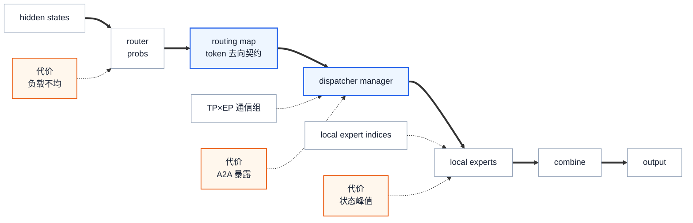

# Megatron-LM MoE 训练优化：负载建模与并行策略选型

> **源码基线**：`NVIDIA/Megatron-LM@85902ef599ea4eb06ada7567a479c524b605767a`（`dev`，2026-09-01）
> **主题**：围绕 token、专家参数、保存状态和执行窗口四种所有权，分析不同 MoE 训练负载应怎样选择并行策略与优化组合。
> **来源与适用范围**：源码约束结合 NVIDIA《[Scalable Training of Mixture-of-Experts Models with Megatron Core](https://arxiv.org/abs/2603.07685v2)》（2026-03-10，v2，下称“报告”）的建模与实测。本页是调优与选型总览；基础架构先读 [[01_megatron_architecture_analysis]]，完整 EP 算法归 [[14_megatron_ep_analysis]]。
> **最近更新**：2026-09-08。恢复四种所有权的原有组织方式，重新审核旧稿，补充负载模型、条件化选型及报告配置差异。

---

## 1. 背景：稀疏计算打破了稠密层的共址假设

MoE 为每个 token 只激活少数 expert，却必须把输入送到持有目标 expert 的 rank。总参数量决定需要存多少权重，激活参数量影响每个 token 的计算，两者都不能单独决定训练速度：路由偏斜、专家 GEMM 的实际大小、跨节点流量和保存到反向的激活，会把压力推向不同位置。

报告 §4–§6 分别讨论显存、低精度和长上下文，§9 再把它们放回同一个调优过程。这里保留原稿的四种所有权作为分析工具：**token 去哪里，expert 放哪里，状态放在哪里并保留多久，哪段独立计算负责覆盖通信**。“时间窗口所有权”是对 schedule、stream 和等待责任的概括，不是源码中的资源类型。

粗箭头表示一次 MoE 前向的数据依赖；蓝色突出路由与通信接口，橙色标出需要测量的成本。图中的 TP 指 expert TP；这是概念路径，不表达各阶段耗时或实际并发关系。

| 所有权问题 | 实际选型内容 | 深入阅读 |
|---|---|---|
| token 去哪里 | 路由、容量、dispatch/combine、backend 和跨域流量 | [[14_megatron_ep_analysis]] |
| expert 放哪里 | EP、expert TP、PP 及 dense/expert 两套数据并行组 | [[17_megatron_parallelism_orchestration_analysis]] |
| 状态放哪里、活多久 | 优化器分片、重算、offload、paged stash 和临时 buffer | [[16_megatron_distributed_optimizer_analysis]]、[[18_megatron_recompute_analysis]]、[[22_megatron_memory_optimization_analysis]] |
| 等待发生在哪里 | shared expert、相邻微批和跨并行域通信的独立窗口 | [[20_megatron_comm_overlap_analysis]] |

**证据口径**：报告数字是指定实验下的观测；源码断言是本基线的执行边界；下面的简化公式和候选方案是注明前提的分析推导。报告 §8.1 说明使用开发分支，并自述为 Megatron-Core v0.16 时点快照，但没有给出可与本页一一对应的固定提交，不能用 3 月的性能结果替代 9 月基线的功能验证。本页没有重新运行 GPU 性能实验。

---

## 2. 先追一条 token，而不是先背配置项

### 2.1 一次 MoE 层的路径

| 阶段 | 状态变化 | 冻结源码入口 |
|---|---|---|
| expert 放置 | 全局 expert 编号分成当前 EP rank 的连续 `local_expert_indices` | `moe_layer.py::BaseMoELayer.__init__` |
| 路由 | hidden state 产生一致的 `probs + routing_map` | `router.py::TopKRouter.routing` |
| 分发准备 | 将映射转换成 backend 的计数、容量与置换元数据 | `moe_layer.py::MoELayer.preprocess` |
| 跨 rank 分发 | 输入送到持有目标 expert 的 rank | `moe_layer.py::MoELayer.dispatch` |
| 本地计算 | 按 local expert 分组后执行专家计算 | `moe_layer.py::MoELayer.routed_experts_compute` |
| 归并 | 多个专家的加权结果回到源 token 位置，恢复输出布局 | `moe_layer.py::MoELayer.combine` / `postprocess` |

这些文件均位于 `megatron/core/transformer/moe/`。combine 恢复的是布局与归并关系，不表示专家计算可逆，也不表示本轮训练已完成。反向沿保存的通信身份传梯度，训练更新还要等待完整 forward/backward 与必要的容量检查。

### 2.2 描述负载至少需要两本 token 账

第一本账是**序列工作量**。设一个 batch 中有效序列长度为 $L_i$，有效 token 总数为 $N=\sum_i L_i$。固定模型宽度、层数、TopK，无路由 dropping，使用完整因果 SDPA，且 packing 确实按序列边界避免跨样本注意力时，可用下面的比例区分两类算术工作：

$$
F_{\mathrm{routed\ experts}}\propto NK,\qquad
F_{\mathrm{SDPA}}\propto\sum_i L_i^2.
$$

其中 $K$ 是每 token 选中的 expert 数；前一式忽略 router、shared expert、padding 与重算，后一式只指 attention 的 QK/AV 部分，QKV 投影仍随 token 数线性变化。这与报告 §6 的长上下文分析、源码 `megatron/training/training.py::num_floating_point_operations` 对 `total_real_tokens_in_batch` 和 `seqlen_squared_sum_in_batch` 的分账一致。稀疏注意力、滑窗和混合架构需要换成本模型，不能直接套用。

**同为 16,384 个有效 token**，四条 4,096 长序列与一条 16,384 长序列的路由条数相同，但后一种的 $\sum_i L_i^2$ 是前者的 **4 倍**。这是上述前提下的解析比较，不是训练步时增加四倍的实测；它说明“token 数相同”不足以选择 CP 或判断重算成本。计数口径见 [[32_megatron_tflops_analysis]]，packing 见 [[29_megatron_packed_dataset_dynamic_cp_analysis]]。

第二本账是**专家接收工作量**。为避免重复计数，先取 expert TP=1、无 dropping、无 padding；一个 EP 组共有 $N_{\mathrm{EP}}$ 个不同输入 token，第 $e$ 个 expert 接收 $n_e$ 条路由：

$$
\sum_{e=1}^{E}n_e=N_{\mathrm{EP}}K,\qquad
\bar n=\frac{N_{\mathrm{EP}}K}{E}.
$$

$E$ 是 expert 总数。若 rank $r$ 持有集合 $\mathcal E_r$，其接收量为 $R_r=\sum_{e\in\mathcal E_r}n_e$。应同时记录 expert 分布和 rank 分布：两个热点 expert 落在同一 rank，与分别落在两张卡上的关键路径不同。报告 §4.3.1 讨论的小专家 GEMM、§9.1 的并行选择，都需要这本账；只看全局平均值会漏掉最忙接收端。

本页用 $\rho=\max_r R_r/(\sum_r R_r/\mathrm{EP})$ 描述非空负载的 rank 偏斜，这是分析指标，不冒充 Megatron 某个日志字段。实际 buffer 还要看逐 expert 对齐后的行数及静态预算；有效 token、逻辑路由、物理行数应分别测量。

---

## 3. Token 所有权：把路由语义与通信后端分开

### 3.1 路由决定训练语义，backend 决定怎样搬运

router 的 top-k、sinkhorn、hash 路径决定 token-to-expert 映射；dropping 必须同步改变概率与映射。dispatcher 再把这份映射落实为分组、通信和恢复。完整 dispatcher 有 `allgather`、`alltoall`、`flex`；Flex 内部才选择 `deepep`、`deepepv2`、`hybridep`、`ncclep`。因此“使用 Flex”不足以判断通信形状、硬件要求或溢出行为。

`MoEFlexTokenDispatcher` 把映射整理到 expert TP×EP 通信域，交给 `_DispatchManager`。这个边界允许更换 backend，但不能消除代价：小消息更容易受启动开销影响，大量跨域路由更依赖互连，接收端偏斜会放大尾部等待。以上是选择 backend 的成本分析，不能从接口抽象直接推出某个 backend 更快。

报告 §8.2 的吞吐表采用 **force-balanced routing**。这是比较系统栈的实验条件，不能证明学习到的真实路由具有同样均衡性。本基线 `TopKRouter.forward` 的强制均衡选项会替换用于路由的 logits，因此应分别测系统能力与真实训练路由，不能为复现吞吐而悄悄改变训练条件。

### 3.2 容量优化要区分丢弃语义与接收空间

逐 expert capacity 限制每个 expert 保留多少路由；rank capacity 则为一个 expert rank 的置换接收区预定空间。前者可能改变实际参与计算的路由，后者试图减少等待动态接收计数后再决定形状的同步。将两者都称为“调大 capacity”会掩盖训练语义和错误处理的区别。

对齐也会放大物理量：假设两张卡各一个 expert，实际接收 384/128 行，所选专家路径要求 256 行对齐，则专家段占用是 512/256 行，而非 384/128。rank 上界要容纳对齐后的段；仅按平均 256 条路由预留会漏掉热点卡。这里是布局容量算例，真实 alignment 和预算公式取决于 backend，见 §8.2。

### 3.3 变长 token：有效计数不等于通信 shape

HybridEP 默认要求调用方保证通信组内等长。显式打开 `moe_hybridep_pad_variable_tokens` 后，manager 才做组内 MAX、主机 `.item()` 读数和 64 行对齐补齐，新增映射/概率行置零，combine 后裁回原输入长度。该过程自己带来同步，CUDA Graph 输入应在上游安排静态形状。

还应区分 manager 新增的零行和原输入中的 padding token。本基线 router 仅在 **Flex/HybridEP 且逐 expert、rank 两种 capacity factor 均未设置** 时按 padding mask 清除待 dispatch 路由；其余路径不能据有效 token 数直接推算通信量。

辅助损失也必须使用真实有效计数。两个 rank 分别有 65/129 个有效 token，总数是 194，不能各自乘组大小得到 130/258。`TopKRouter.attach_and_log_load_balancing_loss` 在逐 token loss 分支消费已经归约的计数，必要时才真正归约；z-loss 有自己的计数处理。优化 packing 后，应先验证这层数值口径，再比较吞吐。

---

## 4. 专家参数所有权：并行轴决定谁持有状态，而不只是怎样通信

### 4.1 Attention 与 MoE 可以采用不同分解

报告 §3 的 Parallel Folding 允许 attention TP 与 expert TP 分开配置。标准布局下，若总 GPU 数为 $W$，共享 PP 分解，则 dense DP 与 expert DP 分别满足：

$$
\begin{aligned}
W&=\mathrm{TP}\times\mathrm{CP}\times\mathrm{PP}\times\mathrm{DP},\\
W&=\mathrm{ETP}\times\mathrm{EP}\times\mathrm{PP}\times\mathrm{EDP}.
\end{aligned}
$$

ETP 指 expert TP，EDP 指 expert 数据并行；第二式没有独立 CP 因子，不能把 TP、CP、EP 全部连乘再当成 GPU 总数。源码 `parallel_state.py::initialize_model_parallel` 分别生成两套组，ETP 未指定时继承 TP。整除只是必要条件，还要满足 rank 排列和 PP 组一致等约束；实际拓扑以 [[17_megatron_parallelism_orchestration_analysis]] 为准。

这些等式也说明：固定卡数时扩大一个轴，通常会压缩另一个轴。不能只记“EP 省了专家参数”，却遗漏 EDP 变小后优化器分片、副本数与梯度通信发生的变化。

### 4.2 先按对象选轴，再按拓扑选范围

| 并行轴 | 主要改变 | 代价与选型条件 |
|---|---|---|
| EP | 把 expert 集合分给不同 rank；本地 expert 数为 $E/\mathrm{EP}$ | 需要 dispatch/combine；跨慢互连和偏斜接收可能抵消参数收益 |
| expert TP | 切单个 expert 的矩阵 | 减少单专家权重驻留，但可能切碎本已很小的 GEMM，并增加通信；单 expert 已可放下时，应与 ETP=1 对照 |
| attention TP / SP | 切 attention 矩阵及相应序列激活 | 有 collective 成本；本基线训练 TP>1 的 MoE 路径强制要求 SP |
| PP / VPP | 分散层与参数，改变微批调度 | PP 有气泡和 P2P；VPP 可能改善气泡，也改变激活寿命与通信次数，不能直接按 PP 等比例估激活 |
| CP | 分散序列侧工作与激活 | 不分片模型参数；收益须与 attention 通信、序列长度和 attention 类型一起判断 |
| DP / EDP 与分布式优化器 | 改变副本、规约和优化器状态分片 | dense 与 expert 使用各自组；固定全局 batch 时提高 DP 还会改变每副本微批安排 |

报告 §9.1 建议尽量利用高速域、避免不必要的模型切分。这是候选策略的起点，不是“EP 绝不能跨节点”：§9.2 的 H100 案例就使用 EP=64 跨越 NVL8 节点。选择较小 EP 配更多 PP，还是较大 EP 配通信重叠，要比较参数驻留、流水线气泡与暴露的 A2A，不能由节点边界独自决定。

### 4.3 为什么增加 EP 不一定减少专家激活

取 §2 的简化前提，并保持每个 EP rank 的输入量为 $T$。组内共有 $\mathrm{EP}\,T$ 个 token，均衡分配后每 rank 仍接收 **$TK$** 条路由；只是本地 expert 数减少，每个 expert 的平均 GEMM 行数变为 $\mathrm{EP}\,TK/E$。

因此增加 EP 可以同时减少本地 expert 参数、增大单 expert 的 GEMM，却未必减少每 rank 的专家激活总量；网络覆盖范围也可能扩大。该推导要求本地输入量固定。若固定的是组内总 token 数，结论就不同；在完整训练配置中还要重新核对 DP、CP、微批和路由偏斜。这比单纯“EP 越大越省显存”更能解释报告 §9.1 的取舍。

---

## 5. 激活与优化器状态所有权：省显存的手段会争抢同一对象

报告 §4.1.1 表 3 给出一个具体反例：DeepSeek-V3，BF16、256 GPU、PP=4、VPP=4、EP=64 的示例中，权重与梯度 36.4 GB，主权重与优化器状态 32.1 GB，激活 131.0 GB，总计 199.5 GB。**这个配置中**激活是最大项；它既不能证明所有 MoE 都由激活主导，也不能拿来与 FP8 或不同微批配置直接相加比较。

选省显存技术前，应按时间测峰值：

$$
\begin{aligned}
M_{\mathrm{peak}}=\max_t\bigl(&M_{\mathrm{weights}}(t)+M_{\mathrm{grads}}(t)+M_{\mathrm{opt}}(t)\\
&+M_{\mathrm{saved}}(t)+M_{\mathrm{comm}}(t)+M_{\mathrm{workspace}}(t)\bigr).
\end{aligned}
$$

这里把 graph 私有池计入 workspace，把 stash 计入保存激活，避免重复记账。各项单独峰值的和通常不是实际峰值，因为 schedule 决定它们是否同时存活。

| 到达峰值的对象 | 候选处理 | 必须支付或核对的成本 |
|---|---|---|
| 参数、梯度、optimizer state | EP/ETP/PP、分布式优化器、适用的状态卸载 | 新的通信与分片组；不能用减少激活替代持久状态预算 |
| 保存到反向的专家中间量 | selective recompute、细粒度 offload、paged stash | 重算耗计算，offload 耗链路，stash 耗页池及管理；看同时存活的层/微批 |
| rank 接收区与通信 buffer | 调整容量、消息布局、并发窗口 | 容量不足的后果依 backend；缩 buffer 可能增加同步或重跑 |
| 图池与在途临时状态 | 调整 graph scope、overlap、微批安排 | 更大捕获范围或更多并发不保证更小驻留 |

长上下文还改变“重算什么”的收益。报告 §6.2 指出 attention 算术占比随序列增长上升，因此应比较重算 SDPA 与只重算其他模块的时间成本，不能沿用短序列的整层重算配方。具体选择取决于实际 attention 形式和 profile，见 [[18_megatron_recompute_analysis]]。

paged stash 管的是多层/微批共同存活的专家激活，rank capacity 管的是一次 dispatch 的接收上界，增大后者不能代替检查前者。源码禁止 stash 与 `cpu_offloading` 同开，也禁止再对 `expert_fc1`、`moe_act`、`fused_group_mlp` 做模块 offload；并非禁止所有其他模块的卸载。DDP 的 CPU backup 和 bucket 则围绕 `_ParamAndGradBuffer` 的连续存储工作，与专家激活页池是不同对象，详见 [[22_megatron_memory_optimization_analysis]]。

---

## 6. 时间窗口所有权：Overlap 不是把 collective 改成异步

本批 routed experts 必须等 dispatch 输入到达，不能靠自己的后续计算覆盖这段前置依赖。窗口来自 shared expert 旁支、其他规约或 schedule 安排的相邻微批。源码在 `MoELayer.dispatch` 注册延迟 expert wgrad，在 `routed_experts_compute` 记录 dgrad 完成，就是为了沿具体依赖组织窗口。shared expert 的输出仍须等待后才能相加，latent MoE 训练还明确禁止 shared-expert overlap。

分析时要把三种现象分开：

| Timeline 现象 | 支持的诊断 | 应先比较的方案 |
|---|---|---|
| GPU 工作之间有明显 CPU 提交空隙或动态计数同步 | 主机提交/形状决策可能限速 | 融合、适当 graph scope、适用的静态容量；检查等待是否消失 |
| kernel 连续，但每个 expert 的 GEMM 很小、算力利用不足 | 可能是计算粒度问题，不能仅归因 CPU | 实收 token 分布、ETP、grouped GEMM、可行的 batch/EP 调整 |
| 通信在依赖链上持续暴露，且有可独立执行的工作 | 存在 overlap 候选窗口 | backend/拓扑与针对性 overlap；同时测通信、计算竞争和峰值显存 |

报告 §4.3.1 讨论过每 expert 约 128 token 的小 GEMM 场景，也单独讨论 host launch 和动态计数同步。**128 是该讨论中的形状，不是通用阈值**；低 SM 利用率本身也不足以区分三行原因。

非阻塞允许主机继续提交，overlap 要求设备有独立工作，CUDA Graph 减少重复提交；三者不能互相代替。融合减少提交和中间读写，低精度可能降低计算或某条通信路径的字节数，但本基线 `HybridEPDispatch.forward` 明写 `fp8_dispatch=False`，不能把 FP8 训练等同于 EP 流量减半。相关实现归 [[21_megatron_fusion_operators_analysis]] 和 [[23_megatron_precision_cudagraph_fusion_analysis]]。

图化也不总能留到最后：如果选择捕获整个 MoE，必须提前满足 §8 的 backend、容量和激活存储边界；若只捕获 attention/router 等局部范围，则是另一组约束。报告附录 B.2 的 DeepSeek-V3 GB200 graph scope 是 `attn, moe_router, moe_preprocess`，不能拿该实测证明 whole-MoE graph 的收益。

---

## 7. 选型顺序：先定位所有权，再选择机制

### 7.1 不同负载怎样形成不同候选方案

下表是由报告和本页模型重建的诊断路径，各类压力可以同时存在。只有观测列成立，才进入相应候选；没有给出未经测量的固定并行度或加速比。

| 负载与必要观测 | 建模或报告依据 | 第一组候选 | 反证与验收条件 |
|---|---|---|---|
| **持久状态受限**：参数/优化器已占满，激活峰值尚次要 | 总 expert 参数与激活参数分离；§4 的两套分片组；报告 §9.1 | 优先比较 EP、PP、ETP 与优化器分片，先得到能容纳的布局 | 检查 EDP 变化和新增通信；若 OOM 实际发生在反向激活峰值，转入下一行 |
| **保存激活受限**：微批/序列增长导致峰值上升，专家 FC1 等长时间驻留 | 报告表 3；§5 的同时存活状态模型 | selective recompute、适用的 offload/stash，联合微批和 VPP | 对照额外计算/拷贝与总步时；增加 EP 在固定本地 token 下未必减少专家激活 |
| **短序列、小专家 GEMM 或提交受限**：先由 timeline 区分两种原因 | 报告 §4.3.1；$\bar n=N_{\mathrm{EP}}K/E$ | 小 GEMM 比较 ETP=1、grouped GEMM 及可行的粒度调整；提交空隙比较融合/局部 graph | 跟踪真实 $n_e$、对齐成本与 CPU gap；改 EP/微批后重新检查内存和训练 batch |
| **跨域通信受限**：dispatch/combine 暴露且流量确实跨慢互连 | 报告 §9.2 的 NVL72/NVL8 对照；rank 接收量与拓扑 | 比较 EP 范围、backend、PP 替代布局和有窗口的 overlap | 测暴露等待而非仅 collective 时长；均衡实验仍需用真实路由复核尾部负载 |
| **长上下文或混合长度**：$\sum_i L_i^2$ 上升、attention/激活压力可观测 | 报告 §6；同 token 数的长短序列算例 | 合适的 CP/TP、packing、选择性重算；同步检查 MoE token 形状 | 区分 FLOP 占比与实际耗时瓶颈；报告的 4K/8K 每分片长度经验不是通用切换线 |

### 7.2 用报告实测理解选型，而不是抄一套配方

报告 §9.2 表 17 比较同为 DeepSeek-V3、序列 4,096、global batch 8,192、microbatch 1 的两组系统：

| 项目 | GB200 | H100 |
|---|---|---|
| GPU 数 / 单卡内存 | 256 / 192 GB | 1,024 / 80 GB |
| Attention TP / PP / EP（表 17） | 1 / 4 / 64 | 2 / 8 / 64 **（PP 有报告内冲突，见下）** |
| Expert TP / VPP | 1 / 4 | 1 / 4 |
| 精度 / dispatcher | MXFP8 / HybridEP | FP8 blockwise / DeepEP |
| CUDA Graph / EP overlap（表 17） | 启用 / 未启用 | 未启用 / 启用 |
| 报告吞吐 TFLOPS/GPU | 1,048 | 368 |

报告对这组结果的解释是：GB200 的容量与 NVL72 高速域使 EP=64 可留在该域内，主机提交优化更值得关注；H100 的 EP=64 跨越八个 NVL8 节点，通信重叠与更强的内存节省更重要。这支持“相同模型也应按拓扑、内存和暴露等待选机制”，**不能**用两列吞吐相除，声称是 HybridEP 相对 DeepEP、Graph 相对 overlap 或 FP8 格式的单因素收益。

> [!warning] 报告配置存在内部差异
> 已核对 PDF 原页：正文表 17（p.74）将 H100 这组结果的 PP 写为 **8**，附录表 20（p.87）对同样的 1,024 GPU、368 TFLOPS/GPU 结果写为 **4**；重算模块列表也有差异。因此本页保留定位并标注冲突，不将其当作可直接运行的完整 recipe。§9.2.2 另将“每卡 4 个 experts”与消除本地 token permutation 联系起来；仅凭 expert 数无法推出置换消失，融合掉独立 kernel 与不再需要分组语义也不是一回事。

报告的其余结果进一步限制了泛化范围：附录 B.2 中 GB300 的 DeepSeek-V3 配置启用了 1F1B overlap，而上述 GB200 配置关闭它。因此不能把“NVL72 上不需要 overlap”当作硬件定律。同样，报告表 11 的长上下文 Qwen3 结果不能与 4K 的每 token 成本混作同一任务进行排名。

### 7.3 一轮可复核的调优实验

先固定模型、有效序列分布、global batch、路由语义、精度与收敛检查口径，再记录 TP/CP/PP/DP 和 ETP/EP/EDP、硬件拓扑、软件提交及依赖版本。按报告 §9 的思路先满足显存，再生成少量候选并行布局；需要 whole-MoE graph 时提前纳入其硬约束。

随后对每个候选同时采集：端到端 step time、有效 tokens/s、各对象显存峰值、每 expert/rank 接收分布、暴露通信、CPU 提交空隙，以及 dropping/over-budget/stash overflow。按 §7.1 的诊断逐项改动，最后重新组合验证。capacity 变小若导致反复重跑，即使成功尝试本身更快，总训练时间也可能更长。

性能对照之外还要核对 loss、梯度及路由统计，明确 padding 是否参与 dispatch、FP8 或 dropping 是否改变比较条件。报告的均衡吞吐用于提出候选，真实负载的观测用于决定是否采用。

---

## 8. 当前基线的硬边界

### 8.1 提交训练前应核对的组合

| 边界 | 实际行为与源码入口 |
|---|---|
| expert 数可被 EP size 整除 | `moe_layer.py::BaseMoELayer.__init__` 断言；否则不能生成等量 local experts |
| 训练 attention TP>1 需要 SP | `moe_layer.py::MoELayer.forward` 直接抛 `ValueError`，不只是性能警告 |
| backend 有独立拓扑/dtype 前提 | `token_dispatcher.py::MoEFlexTokenDispatcher.__init__` 对 DeepEP/v2/NCCL EP 断言 expert TP×EP>1；HybridEP 无这条相同断言。HybridEP/DeepEP/v2 转换非 fp32 probs，其中 bf16/fp16 路径给 warning |
| HybridEP 变长补齐须显式启用 | `_HybridEPManager.setup_metadata` 的 MAX + padding；关闭时调用方保证等长，图输入应上游静态安排 |
| stash、专家实现与 offload 组合受限 | `transformer_config.py::TransformerConfig.__post_init__`：stash 需 rank factor，排斥 §5 列出的激活卸载；GroupedTensor 需 grouped GEMM |
| bucket 粒度须唯一 | `megatron/core/distributed/distributed_data_parallel_config.py::DistributedDataParallelConfig.__post_init__`：`bucket_size` 与 `num_buckets` 不能同设，后者必须为正 |
| whole-MoE graph 先判断适用分支 | `megatron/core/transformer/cuda_graph_config.py::validate_moe_cuda_graph_support` 对无 MoE、至多一个 expert、非 whole-MoE scope，以及逐 expert capacity + pad-to-capacity 直接返回；只是通过此项检查，并非所有 graph 检查 |
| 其余受检 whole-MoE 路径有六项合取 | 同一函数要求 TE graph、Flex、HybridEP、rank factor、paged stash、TE op-fuser 全部满足；**独立 GroupedTensor 不能替代 op-fuser** |

该表纠正旧稿将 whole-MoE 六项要求写成普遍条件、并把 GroupedTensor 解耦等同于整模块 graph 放行的说法。配置定义文件为 `megatron/core/transformer/transformer_config.py`；未写全路径的 MoE 文件仍位于 `megatron/core/transformer/moe/`。

### 8.2 本页维护的 rank capacity 契约

| TransformerConfig 字段 | 类型 / 默认 | 用途 |
|---|---|---|
| `moe_expert_rank_capacity_factor` | `Optional[float]` / `None` | **本页 owner**。HybridEP 的 rank 置换接收上界因子，或 NCCL EP 首轮接收 buffer 的容量因子；不能与逐 expert dropping factor 混同 |

对正常的正因子 $f$，HybridEP 以完成输入补齐后的本地行数 $N_{\mathrm{pad}}$、配置 TopK $K$ 计算 $\operatorname{round\_up}(\operatorname{int}(N_{\mathrm{pad}}Kf),a)$。这里的 $a$ 是专家路径 alignment；op-fuser/GroupedTensor 路径取 256，不额外乘 ETP。最终须装下逐 expert 对齐段的总量。若同时启用逐 expert capacity 的 drop-and-pad，`_HybridEPManager.setup_metadata` 会用该 padding 总量覆盖 rank 预算，不能把两套预算叠加。

NCCL EP 必须设置该因子；`_NCCLEPManager._ensure_bootstrap` 先把首轮本地输入行数取到 64 的倍数，乘 **ETP-folded TopK** 与因子，再按 alignment 对齐，结果缓存为接收容量。它与 HybridEP 不同：不能把后续变长输入视作自动扩容；动态专家路径仍会读实际计数并裁切，static-shape 路径另有 SM100/CuTe DSL 等准入条件。

配置期只许可 HybridEP/NCCL EP，且 HybridEP 要 op-fuser 或 GroupedTensor。该检查仅核 backend 字段，不代替把 dispatcher 实际选成 Flex。`None` 对 HybridEP 是动态无上界，对 NCCL EP 则不合法。若本地输入为 256、K=1、ETP=1、a=256，因子 1 的预算为 256，因子 1.25 则从 320 对齐成 512；**因子增加 25% 不等于物理空间增加 25%**。

超限处理必须随 backend 和执行方式选择：

| 路径 | 失败或完成边界 |
|---|---|
| 普通可回退的 HybridEP 训练 | 外部 dispatch 接口可临时 drop 并上报 `over_budget`；`PagedStashRunner` 在完整 forward/backward 后归约失败标志，清梯度、暂时取消预算/关闭 stash，用缓存的同一批数据重跑，最多两次尝试；成功返回之后 `train_step` 才执行 optimizer 更新 |
| 已捕获 TE whole-MoE 图的训练 replay | rank/stash 超限直接 `RuntimeError`，不走动态回退；要求调整预算或页池后重启。warmup/eager evaluation 与 replay 不同，capture 后使用 stash 的训练微批数须固定 |
| NCCL EP | manager 的依赖接口声明超容量 hard-trap，没有 HybridEP 的 overflow 标志与自动重跑保证；外部内核 trap 未在本页实测 |

`training.train` 在 rank factor 非空时就安装 runner，**不要求 stash 已启用**。成功 host spill 只是观测项，不等于 stash overflow。重跑前会处理梯度、必要参数 buffer 与图状态，但不是任意 RNG、日志或外部副作用的通用事务回滚。容量调优须看总步时和失败频率，而不只看接收 buffer 节省量。

冻结基线 `TransformerConfig` 自身声明 **266** 个字段，本页仅维护上述 **1** 项，其余 owner 由 `docs/coverage/megatron-lm.yaml` 指定。路由与 dispatcher 字段见 [[14_megatron_ep_analysis]]，分组专家与 op-fuser 见 [[21_megatron_fusion_operators_analysis]]，重算、stash、graph 分别见 [[18_megatron_recompute_analysis]]、[[22_megatron_memory_optimization_analysis]]、[[23_megatron_precision_cudagraph_fusion_analysis]]。

---

## 9. 演进方向：动态形状与隐式状态正在被逐步收紧

以下是已发生代码变化所支持的方向判断，不是上游路线图，也不是报告对未来性能的承诺：

- **形状责任趋于显式**：提交 `904ef6d86b87e81b85633d12b5fc79eb7efe45ac` 删除 sequence packing 触发的 HybridEP 自动补齐；当前由显式开关决定运行期 MAX/padding，图输入由上游安排。收益是更容易核对同步和形状成本，代价是调用方必须承担正确性责任。
- **并行组身份趋于显式**：`MoELayer.__init__` 优先接收 `ProcessGroupCollection`，缺省时仍回退全局 group，旁边 TODO 希望移除这种用法。attention TP 与 expert TP 可以不同，显式传组让这种差别可检查；不能写成全局回退已经消失。
- **静态执行把优化组合绑得更紧**：rank 预算、专家 padded segment、stash 与 whole-MoE graph 联动，减少动态同步的同时要求更明确的容量和失败策略。GroupedTensor 提供独立专家实现选项，但不自动放宽整模块 graph 守卫。

### 来源与复核入口

报告索引位于 `raw/02_engineering/02_train_frameworks/Scalable Training of Moe Models with Megatron core-2603.07685v2.md`；[v2 正文](https://arxiv.org/html/2603.07685v2) 与 [PDF](https://arxiv.org/pdf/2603.07685v2) 的自然定位为：§3 Parallel Folding，§4.1.1 表 3 显存，§4.3.1 小 GEMM/主机开销，§6 长上下文，§8.2 表 11 均衡吞吐，§9 选型，表 17 与附录表 20/B.2 配置。正文与附录的冲突按 §7.2 保留。

| 要复核的结论 | 冻结源码稳定入口 |
|---|---|
| 长度成本与两套并行分解 | `megatron/training/training.py::num_floating_point_operations`；`megatron/core/parallel_state.py::initialize_model_parallel` |
| 路由、计数、真实/强制均衡 | `megatron/core/transformer/moe/router.py::TopKRouter.forward` / `routing` / `attach_and_log_load_balancing_loss` |
| 输入形状、rank 预算与 backend 差别 | `megatron/core/transformer/moe/token_dispatcher.py::_HybridEPManager.setup_metadata` / `dispatch`；`_NCCLEPManager.__init__` / `_ensure_bootstrap`；`MoEFlexTokenDispatcher.__init__` |
| 专家输入与低精度通信边界 | `megatron/core/transformer/moe/experts.py::TEGroupedMLP._fused_forward`；`megatron/core/transformer/moe/fused_a2a.py::HybridEPDispatch.forward` / `backward`、`HybridEPCombine.backward` |
| 容量检查抵达 optimizer 之前 | `megatron/training/training.py::train` / `train_step`；`megatron/core/transformer/moe/paged_stash.py::PagedStashRunner.__call__` / `check_moe_overflow` / `prepare_for_rerun` / `_raise_if_te_whole_moe_graph_overflow` |

仓内可继续运行的针对性验证包括 `tests/unit_tests/transformer/moe/test_token_dispatcher.py::test_hybridep_variable_tokens_are_padded_to_group_max`、`test_routers.py::TestTop2Router.test_padding_mask_preserves_routes_outside_dropless_hybridep`，以及 `test_paged_stashing.py::TestPagedStashingOverBudget.test_overload_factor_and_over_budget` 的容量测试、同文件模块级 `test_te_whole_moe_graph_overflow_fails_instead_of_dynamic_fallback` 的图溢出测试。本次读取其约束，未运行这些 GPU 分布式测试，也未把测试存在当作性能复现。

## Related Pages

- [[01_megatron_architecture_analysis]] — 训练状态、schedule 与 optimizer 更新的总体边界。
- [[14_megatron_ep_analysis]] — router、dispatch/combine、MoE Parallel Folding 与各 backend 的完整算法。
- [[16_megatron_distributed_optimizer_analysis]] — 参数、梯度和 optimizer state 在 DP 域内的分片。
- [[17_megatron_parallelism_orchestration_analysis]] — TP/PP/CP/EP/DP 与组合进程组的生成。
- [[20_megatron_comm_overlap_analysis]] — 独立计算窗口、事件等待与跨轴资源竞争。
- [[22_megatron_memory_optimization_analysis]] — paged stash、offload、buffer 复用及峰值测量。
- [[23_megatron_precision_cudagraph_fusion_analysis]] — 精度、CUDA Graph 和融合执行的准入与运行边界。
