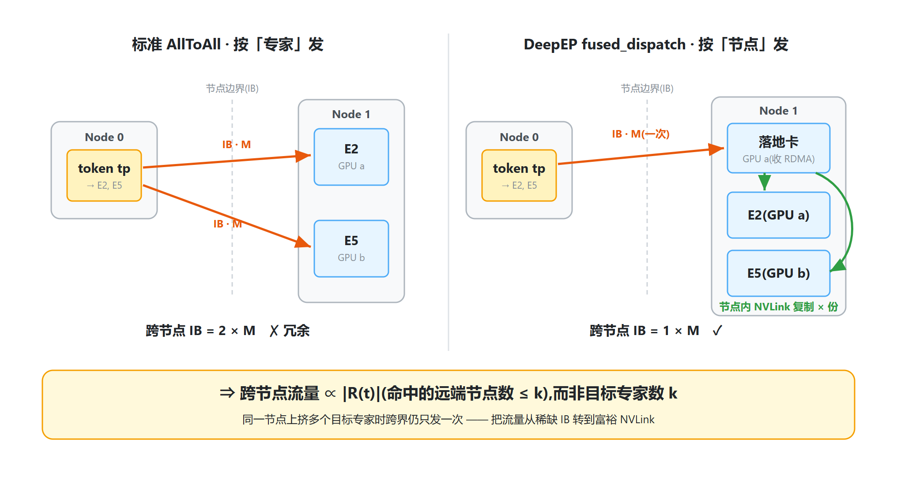
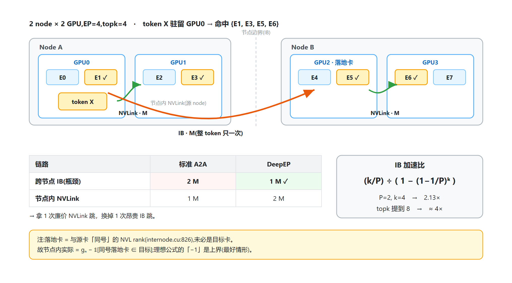

# Megatron-LM 专家并行(Expert Parallelism / MoE)深度解析

> 代码基准:`Megatron-LM/` 子仓库 `dev` 分支,commit `ee3f1ff`
> 核心目录:`megatron/core/transformer/moe/`(`moe_layer.py` 855 行、`token_dispatcher.py` 1624 行、`router.py`、`experts.py`)
> 配套阅读:`megatron_pp_schedulers_analysis.md`(EP A2A 重叠 = 该文档的调度器⑤ combined-1F1B)
> 适用读者:已了解 transformer 训练与 TP/DP/PP,想吃透 Megatron MoE 专家并行实现的工程师。

---

## 0. 总览

### 0.1 MoE 与 EP 是什么

**MoE(Mixture of Experts)**:把 transformer 层里的单个 FFN 换成 `E` 个并列的 FFN(专家)。一个路由器(router)给每个 token 打分,只挑 **top-`k`** 个专家来算这个 token(典型 `k=2~8`)。于是**参数量随 `E` 线性涨,但单 token 计算量只涨 `k` 倍** —— 这就是 MoE "参数多、算得少"的核心。

**EP(Expert Parallelism,专家并行)**:`E` 个专家的权重单卡放不下,于是把专家**按个数切开**分到 `ep` 张卡上,每卡持有 `E/ep` 个本地专家。token 经过路由后,要被**送到**它所选专家所在的卡上算,算完再**送回**。这一来一回的跨卡通信(all-to-all / all-gather)就是 EP 的代价与难点。

EP 不是"调度器"的集合,而是一个**并行维度**。它内部真正分形态的是 **Token Dispatcher(令牌分发器)** —— 决定 token 怎么在 EP rank 之间搬运。本文把 3 种 dispatcher 当作 PP 文档里"5 个调度器"的对应物逐个解读。

### 0.2 EP 在并行体系中的位置

`Megatron-LM/megatron/core/transformer/moe/README.md` 给出的并行轴对比:

| 并行轴 | 峰值激活显存 | 权重显存 | 优化器状态 | 单层通信量 |
|--------|------------|---------|-----------|-----------|
| TP | 1/N(开 SP) | 1/N | 1/N | 高 |
| **EP** | **~1(随负载均衡浮动)** | **MoE 层内 1/N** | **1/N** | **中** |
| PP | 1(VPP 时 >1) | 1/N | 1/N | 中 |
| CP | 1/N | 1 | 1/N(分布式优化器) | 中 |
| DP | 1 | 1 | 1/N(分布式优化器) | 低 |

关键:**EP 切的是专家权重与优化器状态(`1/ep`),但不切激活** —— 这与 TP 不同,是理解 EP 显存特性的第一要点。

### 0.3 MoE 层四步数据流

`MoELayer.forward`(`moe_layer.py:660`)的 `custom_forward` 把一层 MoE 拆成 4 步:

```
                       hidden_states [s, b, h]
                              │
        ┌─────────────────────┼──────────────────────┐
        │ (可选,与下方并行)                            │
   shared_experts_compute                              │
        │                                             ▼
        │                  ① route:  router 打分 → top-k → (probs, routing_map)
        │                            preprocess: reshape + 置换1(按目标专家排序)
        │                                             │
        │                  ② dispatch:  token_dispatch —— 跨 EP rank 通信
        │                            (AllGather / AllToAll / fused dispatch)
        │                                             │
        │                  ③ expert compute:  dispatch_postprocess(置换2)
        │                            → experts(GroupedGEMM)→ combine_preprocess
        │                                             │
        │                  ④ combine:  token_combine —— 反向通信送回原 rank
        │                            postprocess: 置换还原 + reshape
        │                                             │
        └────────────────→ output += shared_expert_output  ◄──┘
                              │
                       output [s, b, h]
```

源码:`route`(`moe_layer.py:445`)、`preprocess`(`460`)、`dispatch`(`512`)、`routed_experts_compute`(`584`)、`combine`(`619`)、`postprocess`(`628`)。

### 0.4 三种 Token Dispatcher 一览

| # | Dispatcher | 类 | 触发 | 核心通信 |
|---|-----------|-----|------|---------|
| ① | AllGather | `MoEAllGatherTokenDispatcher`(`token_dispatcher.py:229`) | `--moe-token-dispatcher-type allgather`(默认) | AllGather + ReduceScatter,跨 TP×EP 域 |
| ② | AllToAll | `MoEAlltoAllTokenDispatcher`(`token_dispatcher.py:371`) | `--moe-token-dispatcher-type alltoall` | All-to-All,跨 EP 域(+ TP AllGather) |
| ③ | Flex | `MoEFlexTokenDispatcher`(`token_dispatcher.py:1402`) | `--moe-token-dispatcher-type flex` | DeepEP / HybridEP 融合 dispatch 内核 |

### 0.5 记号约定

| 符号 | 含义 |
|------|------|
| `E` | 专家总数(`--num-experts`) |
| `k` | 每 token 选中的专家数(`--moe-router-topk`,默认 2) |
| `ep` | EP 度(`--expert-model-parallel-size`) |
| `etp` | ETP 度(`--expert-tensor-parallel-size`,专家层 TP) |
| `edp` | EDP 度(专家数据并行,expert data parallel) |
| `tp` | attention 的 TP 度 |
| `s` | 每 rank 本地 token 数(= seq_len × micro_batch / 序列切分) |
| `h` | hidden size;`E/ep` = 每卡本地专家数 `num_local_experts` |

---

## 1. EP 的目的与动机

### 1.1 MoE 的"参数显存墙"

MoE 的卖点是参数多。但 `E` 个专家的权重必须**全部常驻显存**(虽然每步只激活 `k` 个)。一个 transformer 层的 FFN 约 `8H²` 参数;MoE 把它变成 `E` 份 → `8EH²`。`E=64` 就是 64 倍 FFN 权重。加上混合精度 Adam 的 18 bytes/param,专家权重 + 优化器态轻松到 TB 级,单卡绝无可能。

**必须把专家切开。** 切法有两种:

- **用 TP 切专家**:把每个专家的矩阵乘切开。问题——MoE 常用"细粒度专家"(每个专家很小),TP 再切会让单卡矩阵小到 GPU 算不满,且每个专家每层都要 all-reduce,通信频繁。
- **用 EP 切专家**:把 `E` 个专家**按个数**分到 `ep` 卡,每卡管 `E/ep` 个完整专家。每卡仍跑完整的专家 GEMM(矩阵大、算得满),通信只在路由前后各一次(把 token 搬过去、把结果搬回来)。

### 1.2 为什么 EP 优于 TP 切专家(README Guideline 4)

| EP 的优势 | 原因 |
|----------|------|
| **GEMM 效率高** | 每卡跑完整专家,本地矩阵大,GPU 利用率高 |
| **通信量更低** | EP 每层只 dispatch/combine 各一次;TP 每个线性层都 all-reduce |
| **计算图简单** | dispatch/combine 是清晰的两次通信,易与计算重叠(见 §5) |
| **`ep = E` 时消除本地置换** | 每卡恰好 1 个专家(`num_local_experts=1`),省掉"置换2" |

README 实例:Mixtral 8×7B 上 `EP8×TP1` 优于 `EP4×TP2`。

### 1.3 EP 解决什么、不解决什么

- **解决**:专家权重显存(`÷ep`)、专家优化器状态显存(`÷ep`,叠加分布式优化器再 `÷edp`)。
- **不解决**:激活显存 —— EP 不切激活(§0.2 表),dispatch 后每卡还要为本地专家物化一批 token 的激活。
- **新引入的代价**:① 跨卡 dispatch/combine 通信(可占训练时间 30–40%);② 专家负载不均衡导致的 straggler(EP 的等效"气泡",见 §4)。

---

## 2. MoE 层核心数据流(源码)

### 2.1 进程组:EP / ETP / EDP

`BaseMoELayer.__init__`(`moe_layer.py:156`)按 EP 组切分专家:

```python
ep_size = utils.get_pg_size(self.ep_group)
assert self.config.num_moe_experts % ep_size == 0
self.num_local_experts = self.config.num_moe_experts // ep_size          # 每卡本地专家数 E/ep
local_expert_indices_offset = ep_rank * self.num_local_experts
self.local_expert_indices = [local_expert_indices_offset + i             # 本卡负责的专家全局编号
                             for i in range(self.num_local_experts)]
```

`parallel_state.py` 为 MoE 维护一组独立进程组:
- `get_expert_model_parallel_group`(`:1870`)—— **EP** 组,专家按个数切分的维度。
- `get_expert_tensor_parallel_group`(`:1920`)—— **ETP** 组,专家层内部的 TP。
- `get_expert_data_parallel_group`(`:2000`)—— **EDP** 组,专家权重的数据并行副本。
- `get_expert_tensor_and_model_parallel_group`(`:1965`)—— **ETP×EP** 合并组(代码里的 `tp_ep_group`),AllGather/Flex dispatcher 把它当一个统一通信域。

为何要独立于 attention 的 TP/DP/CP?见 §6 MoE Parallel Folding。

### 2.2 MoELayer.forward 四步(源码)

`moe_layer.py:660` 的 `custom_forward`:

```python
# ① route + preprocess
shared_expert_output = self.shared_experts_compute(hidden_states)        # 可选,见 §5.2
probs, routing_map = self.route(hidden_states, padding_mask, input_ids)  # router 打分 + top-k
hidden_states, probs = self.preprocess(hidden_states, probs, routing_map)# reshape + 置换1

# ② dispatch + ③ expert compute + ④ combine
dispatched_input, probs = self.dispatch(hidden_states, probs)            # 跨 EP rank 通信
output, mlp_bias = self.routed_experts_compute(dispatched_input, probs)  # 置换2 + experts + combine_preprocess
output = self.combine(output)                                            # 反向通信

# 收尾
output = self.postprocess(output, shared_expert_output)                  # 置换还原 + 加 shared expert
```

`dispatch` / `combine`(`moe_layer.py:512` / `619`)只是薄封装,真正干活的是 `self.token_dispatcher.token_dispatch / token_combine` —— 即 §3 的三种 dispatcher。

### 2.3 Router:打分 → top-k → routing_map

`route`(`moe_layer.py:445`)调 `self.router`。router 做:
1. 一个轻量线性层把 `hidden_states` 投影成 `[s, E]` 的 logits(建议 `--moe-router-dtype fp32`,高专家数下精度敏感)。
2. 打分函数 `softmax` 或 `sigmoid` → 概率。
3. 选 top-`k`(或先选 top-group 再选组内专家,group-limited routing)。
4. 产出两个张量:
   - `probs` `[s, E]` —— 每 token 对每专家的路由权重(非选中为 0)。
   - `routing_map` `[s, E]` 布尔多热掩码 —— token 到专家的分配。

**负载均衡**(README):`aux_loss`(微批级)、`seq_aux_loss`(序列级)、`global_aux_loss`(全局批)、`sinkhorn`、`aux-loss-free`(动态偏置)。它们的作用是把 token 尽量**均匀**分到各专家 —— 直接关系到 §4 的负载不均衡。

### 2.4 Experts:GroupedGEMM vs Sequential

`dispatched_input` 到达本卡后,`routed_experts_compute`(`moe_layer.py:584`)先 `dispatch_postprocess` 把 token 按本地专家排好,再喂给 `self.experts`:

- **`TEGroupedMLP`**(`experts.py:168`,`--moe-grouped-gemm`):把 `E/ep` 个专家的 GEMM **批成一次 grouped GEMM 内核**,即使各专家 token 数不同也只发一个 kernel。GPU 利用率高,是推荐路径。
- **`SequentialMLP`**(`experts.py:1143`):逐专家循环跑普通 MLP。kernel 数 = 专家数,launch 开销大,仅作回退。

---

## 调度器① — AllGather Dispatcher

`MoEAllGatherTokenDispatcher`,`token_dispatcher.py:229`。`--moe-token-dispatcher-type allgather`(**默认值**)。

### ①.1 动机与解决的问题

**思路最朴素**:与其精心计算"哪个 token 该发给哪个 rank",不如**让每个 rank 都拿到全部 token**,然后各自用 `routing_map` 挑出"路由到本地专家"的 token 来算。通信退化成一次规整的 AllGather + 一次 ReduceScatter,**没有不规则的 split**,实现简单、对负载不均衡不敏感(每个 rank 反正都有全量 token)。

**它解决的**:省去 AllToAll 那套 `input_splits/output_splits` 元数据计算与 DtoH 同步;在 EP 很小或纯 TP 场景下,这种"全量广播"的代价可以接受。

### ①.2 源码与流程

```python
def token_dispatch(self, hidden_states, probs):              # token_dispatcher.py:277
    if self.tp_size > 1 or self.ep_size > 1:
        self.routing_map = gather_from_sequence_parallel_region(self.routing_map, group=self.tp_ep_group)
        probs            = gather_from_sequence_parallel_region(probs,            group=self.tp_ep_group)
        # 跨 TP×EP 域 AllGather:[(s/tp)*b, h] -> [s*b*ep, h]
        hidden_states    = gather_from_sequence_parallel_region(hidden_states, group=self.tp_ep_group,
                                                                use_global_buffer=True)
    return hidden_states, probs

def dispatch_postprocess(self, hidden_states, probs):        # token_dispatcher.py:301
    self.local_map = self.routing_map[:, self.local_expert_indices[0]:self.local_expert_indices[-1]+1]
    permuted_local_hidden_states, ... = permute(hidden_states, self.local_map, ...)   # 挑本地专家的 token 并置换
    return permuted_local_hidden_states, tokens_per_expert, self.local_probs

def token_combine(self, hidden_states):                      # token_dispatcher.py:351
    if self.tp_size > 1 or self.ep_size > 1:
        hidden_states = reduce_scatter_to_sequence_parallel_region(hidden_states, group=self.tp_ep_group)
    return hidden_states
```

**流程图**

```
dispatch_preprocess  reshape [s/tp,b,h]→[s*b/tp,h],缓存 routing_map
        │
token_dispatch       AllGather(TP×EP 域):每个 rank 得到全量 token [s*b*ep, h]
        │
dispatch_postprocess 用 local_map 挑出路由到本地专家的 token → permute → 按专家分组
        │
experts              GroupedGEMM
        │
combine_preprocess   unpermute(还原置换)
        │
token_combine        ReduceScatter(TP×EP 域):把 expert 输出按原位置散回 + 跨 rank 求和
        │
combine_postprocess  reshape 回 [s/tp,b,h]
```

### ①.3 通信模拟图

`EP=4`,4 个 rank,每 rank 4 个本地 token:

```
       本地 token         AllGather(TP×EP 域)            本地挑选 + 计算
R0  [t0 t1 t2 t3]──┐
R1  [t4 t5 t6 t7]──┼─→ 每个 rank 都持有全 16 个 token ─→ 各 rank 按 routing_map 挑出
R2  [t8 ...    ]──┤    (激活显存瞬时放大 TP×EP 倍)        路由到本地专家的 token,
R3  [t12 ...   ]──┘                                       permute → GroupedGEMM
                                                               │
       原位结果  ◄── ReduceScatter(TP×EP 域)◄────────────────────┘
                     把各 rank 的 expert 输出按 token 原位置散回并求和
```

要点:通信是**规整的 AllGather/ReduceScatter**,无不规则 split;但**每个 rank 都吞下全量 token**。

### ①.4 开销分析

| 维度 | AllGather Dispatcher |
|------|---------------------|
| **通信量/rank** | `≈ (tp·ep)·s·h`(AllGather)+ 同量(ReduceScatter)。**∝ EP,与 topk `k` 无关** |
| **峰值激活显存** | 瞬时物化 `(tp·ep)·s·h` 全量张量 —— 三种 dispatcher 里**最高**,且随 EP 放大 |
| **专家权重显存/rank** | `E·W_expert /(ep·etp)` |
| **负载不均衡敏感度** | 低 —— 每个 rank 都有全量 token,计算量只取决于本地专家被路由的总 token 数 |

关键:AllGather **每个 token 只搬一次**(整 token),所以通信量**与 `k` 无关**;但与 `ep` 成正比。

### ①.5 适用场景及原因

- **纯 TP / EP 很小**:`ep` 小则 `(tp·ep)` 放大有限,规整通信的简单性占优。
- **大 top-k**:`k` 很大时 AllToAll 要发 `k` 份,而 AllGather 与 `k` 无关 —— 此时 AllGather 反而省。
- **不推荐**大 EP:`(tp·ep)·s·h` 的激活与通信会失控。README 定位:"Best For: TP-only setups, small EP, large Top-K"。

---

## 调度器② — AllToAll Dispatcher

`MoEAlltoAllTokenDispatcher`,`token_dispatcher.py:371`。`--moe-token-dispatcher-type alltoall`。

### ②.1 动机与解决的问题

AllGather 的浪费在于**每个 rank 吞全量 token**,绝大多数与本地专家无关。AllToAll 的思路:**只把 token 发给真正需要它的 rank**。每个 token 被路由到 `k` 个专家,就只发往这 `k` 个专家所在的 rank。

**解决的核心问题**:把通信量从"`∝ EP`"降到"`∝ topk`"。当 `ep > k`(大 EP、小 topk,典型配置)时,AllToAll 通信量远小于 AllGather,且激活显存也只需容纳路由到本地专家的那部分 token。代价是要精确计算 `input_splits / output_splits`(每个 rank 发往/收自其他 rank 的 token 数),并处理这些计数从 GPU 到 CPU 的同步。

### ②.2 源码与流程

dispatcher 自己的注释(`token_dispatcher.py:375`)给出 7 步工作流。核心三段:

```python
def dispatch_preprocess(self, hidden_states, routing_map, probs):     # :615
    self.tokens_per_expert = self.preprocess(self.routing_map)        # 算 input/output_splits 等元数据
    permutated_local_input_tokens, ... = permute(hidden_states, self.routing_map, ...)  # 置换1:按目标专家排序
    return permutated_local_input_tokens, permuted_probs

def token_dispatch(self, permutated_local_input_tokens, permuted_probs):   # :672
    global_input_tokens = all_to_all(self.ep_group, permutated_local_input_tokens,
                                     self.output_splits, self.input_splits, ...)  # EP 域 A2A
    global_probs        = all_to_all(self.ep_group, permuted_probs, ...)
    return global_input_tokens, global_probs

def dispatch_postprocess(self, global_input_tokens, global_probs):    # :718
    if self.tp_size > 1:
        global_input_tokens = gather_from_sequence_parallel_region(global_input_tokens, group=self.tp_group)
    if self.num_local_experts > 1:
        global_input_tokens, global_probs = sort_chunks_by_idxs(...)  # 置换2:按本地专家分组
    return global_input_tokens, tokens_per_expert, global_probs
```

`token_combine`(`:827`)做反向 A2A,`combine_preprocess`(`:786`)/`combine_postprocess`(`:866`)做反向的 TP-ReduceScatter 与置换还原。

**关键工程细节 —— DtoH 同步**(`_maybe_dtoh_and_synchronize`,`:910`):`input_splits/output_splits` 是 GPU 上算出的张量,但 `all_to_all` 的 split 参数需要 CPU 上的数值。dispatcher 在专用 `cuda_dtoh_stream` 上异步把这些计数拷回 CPU,并把同步点(`before_permutation_1/before_ep_alltoall/...`)推迟到尽量晚,以免 DtoH 拷贝阻塞主流。

**流程图**

```
dispatch_preprocess   preprocess(算 input/output_splits)→ 置换1(本地 token 按目标专家排序)
        │
token_dispatch        All-to-All(EP 域):token 张量 + probs 张量各一次
        │             每个 token 只发往其 k 个专家所在的 rank
        │
dispatch_postprocess  TP 域 AllGather → 置换2(num_local_experts>1 时按本地专家分组)
        │
experts               GroupedGEMM
        │
combine_preprocess    置换2 还原 → TP 域 ReduceScatter
        │
token_combine         All-to-All(EP 域)反向:把 expert 输出送回 token 原 rank
        │
combine_postprocess   置换1 还原 → reshape → 加 shared expert
```

### ②.3 通信模拟图

`EP=4`,`E=8`(每 rank 2 专家:R0 管 E0/E1,R1 管 E2/E3,…),`topk=2`:

```
dispatch:
R0 本地 token ─置换1─→ 按"目标专家所在 rank"分桶  input_splits=[n0,n1,n2,n3]
                         ┌──────────────────────────────┐
   每个 token 复制 k 份,  │   All-to-All(EP 域)         │
   分别投向 k 个目标 rank  └──────────────────────────────┘
                         ▼
R0 收到 = 全局所有路由到 E0/E1 的 token ── GroupedGEMM(E0,E1)──┐
                                                               │
combine:               All-to-All(EP 域)反向 ◄─────────────────┘
   把 expert 输出按 token 来源送回 ─置换1还原─→ output

对照:AllGather 是"每 rank 收全量 16 token";AllToAll 是"每 rank 只收路由到本地 2 专家的 token"。
```

#### ②.3.1 具体数字走查(EP=4, num_experts=4, topk=2)

> 本节为零冗余 AllToAll 的逐 token 数值走查(原独立页 `Megatron-LM_MoE_Zero_Redundancy_Analysis` 已并入本页)。设 4 卡各持 1 专家(R0→E0 … R3→E3),8 个 token,topk=2。

**① Router 输出 `routing_map`(`[8,4]`,行=token、列=专家、1=选中)**

```
       E0 E1 E2 E3            选中
T0      1  0  1  0   → E0,E2
T1      0  1  0  1   → E1,E3
T2      1  0  0  1   → E0,E3
T3      0  1  1  0   → E1,E2
T4      0  0  1  1   → E2,E3
T5      1  1  0  0   → E0,E1
T6      0  1  1  0   → E1,E2
T7      1  0  0  1   → E0,E3
```

**② 置换1 + `input_splits`/`output_splits`**:每 rank 按"目标专家所在 rank"分桶,本例每桶恰好 4 token,故 `input_splits = output_splits = [4,4,4,4]`(变长时各不等,见 §②.1)。

**③ Token Dispatch(All-to-All)**:每个 token 仅复制 `k` 份投向其 `k` 个目标 rank,**无全量广播**——这正是"零冗余":R0 只收路由到 E0 的 token `[T0,T2,T5,T7]`、R1 收 E1 的 `[T1,T3,T5,T6]`、R2 收 E2 的 `[T0,T3,T4,T6]`、R3 收 E3 的 `[T1,T2,T4,T7]`。

**④ 本地专家计算**:`Rank_i: E_i(收到的 token) → out_i`。专家参数只存在 1 张卡 → 专家显存 `= 总专家参数 / EP`(§②.4)。

**⑤ Combine(反向 All-to-All)+ 置换1还原 + 加权**:专家输出按 token 来源送回原 rank,`output_splits`/`input_splits` 互换(见 §②.2 阶段⑤),按 router 概率加权组合:

```
T0 = prob(E0)·out0[T0] + prob(E2)·out2[T0]
T2 = prob(E0)·out0[T2] + prob(E3)·out3[T2]
…（每 token 由其 topk 个专家的输出加权求和）
```

> 一句话:**token 按专家归属"精确投递",参数零复制、激活零广播**——通信量 `∝ topk`、显存 `÷ EP`,与 AllGather 的"收全量"形成对比(§②.4 / [[megatron_moe_training_optimization_report]] §2.4.1 给出精确公式 `2·S·B·H·K·(E-1)/E²`)。

### ②.4 开销分析

| 维度 | AllToAll Dispatcher |
|------|--------------------|
| **通信量/rank** | A2A `≈ k·s·h`(每 token 复制 `k` 份)+ TP AllGather。**∝ topk,与 EP 大小无关** |
| **峰值激活显存** | 只物化路由到本地专家的 token,均衡时 `≈ k·s·h`,**不随 EP 放大** |
| **专家权重显存/rank** | `E·W_expert /(ep·etp)` |
| **额外开销** | `input/output_splits` 元数据计算 + GPU→CPU 同步(`cuda_dtoh_stream` 已尽量重叠) |
| **负载不均衡敏感度** | 高 —— `output_splits` 直接反映各专家被路由的 token 数,热门专家所在 rank 成为 straggler(见 §4) |

**AllGather vs AllToAll 通信量交叉点**:AllGather `∝ ep`、AllToAll `∝ k`,交叉点约在 `ep ≈ k`。典型训练 `ep ≥ 8`、`k ≤ 8` → **AllToAll 通常更省**。

### ②.5 适用场景及原因

- **标准 EP > 1 训练**:绝大多数 MoE 训练的默认选择,`ep > k` 时通信量显著低于 AllGather。
- **单节点 EP(NVLink 域内)**:NCCL A2A 在 NVLink 上效率高。
- **不推荐**:极小 EP / 大 topk(此时 AllGather 更优);超大规模跨节点细粒度 MoE(此时 Flex/DeepEP 更优,见③)。

> [!update] 2026-06-16 · dev@232c478d4
> **`tp=ep=1` 时跳过"置换2"(identity chunk sort)**(#5102,`token_dispatcher.py:496`、`755`、`801`)。AllToAll dispatcher 在 `num_local_experts>1` 时本要做"置换2"(`sort_chunks_by_idxs`,把 A2A 收来的 token 按本地专家重新分组,见 §②.2 `dispatch_postprocess`)。但当 `tp_size==1 且 ep_size==1`(没有真正的跨 rank A2A,token 本就按全局专家顺序排好)时,这次置换是**恒等操作**,只是无谓拷贝显存。新增 `_local_expert_chunk_sort_is_identity()` 判定此情形,跳过 dispatch/combine 两侧的置换2,省一次置换内核与中间缓冲。退化并行配置(单卡多专家、调试)受益。

---

## 调度器③ — Flex Dispatcher(DeepEP / HybridEP)

`MoEFlexTokenDispatcher`,`token_dispatcher.py:1402`。`--moe-token-dispatcher-type flex` + `--moe-flex-dispatcher-backend deepep|hybridep`。

### ③.1 动机与解决的问题

标准 AllToAll 在**跨节点大规模细粒度 MoE**(如 DeepSeek-V3:256 专家、topk=8、EP 跨多节点)上有两个痛点:

1. **跨节点冗余**:一个 token 的 `k` 个专家可能多个落在**同一个远程节点**。标准 A2A 仍按"专家"为粒度发送 → 同一 token 跨节点重复传 `k` 次。
2. **置换与通信分离**:置换1、A2A、置换2 是分立的内核,反复读写显存,带宽浪费,且难重叠。

**Flex Dispatcher 的动机**:① 把通信域抽象成一个**统一的 TP×EP 组**,dispatch 逻辑与具体 TP/EP 分解解耦(`_initialize_metadata`,`token_dispatcher.py:1453`,把 `routing_map` 扩展成 `[token, world_size, local_experts]`);② 调用 **DeepEP / HybridEP 的融合内核**,把"置换 + A2A"合成一个 kernel,并在跨节点通信中**去掉冗余 token**(同节点多专家只跨节点发一次,落地后节点内复制)。

| 后端 | 特点 | 适用 |
|------|------|------|
| **DeepEP** | DeepSeek 开源;跨节点去冗余,融合 intra/inter-node 通信 | 跨节点 EP、细粒度 MoE |
| **HybridEP** | NVIDIA 优化;用 TMA + IBGDA,占用更少 SM,原生支持 MNNVL | GB200 NVL72、多节点 NVLink |

### ③.2 源码与流程

Flex dispatcher 把活儿委托给一个 `_comm_manager`(`_DeepepManager` `:1161` 或 `_HybridEPManager` `:990`):

```python
def dispatch_preprocess(self, hidden_states, routing_map, probs):    # :1481
    routing_map, probs = self._initialize_metadata(routing_map, probs)   # 扩展成 TP×EP 统一格式
    self._comm_manager.setup_metadata(routing_map, probs)
    return hidden_states, self._comm_manager.token_probs

def token_dispatch(self, hidden_states, probs, ...):                 # :1508
    dispatched_hidden_states = self._comm_manager.dispatch(hidden_states, async_finish, ...)
    return dispatched_hidden_states, self._comm_manager.dispatched_probs

# _DeepepManager.dispatch(:1237):一次 fused_dispatch 内核同时完成置换 + A2A
def dispatch(self, hidden_states, ...):
    hidden_states, dispatched_indices, dispatched_probs, num_tokens_per_expert, handle = \
        fused_dispatch(hidden_states, self.token_indices, self.token_probs,
                       self.num_experts, self.group, async_finish=async_finish, ...)
    self.handle = handle      # combine 时凭 handle 做精确反向通信
    return hidden_states
```

`token_combine`(`:1571`)调 `fused_combine`,凭 dispatch 阶段保存的 `handle` 做对称的反向融合通信。

**流程图**

```
dispatch_preprocess   _initialize_metadata:routing_map → [token, TP×EP, local_experts] 统一格式
        │             _comm_manager.setup_metadata
        │
token_dispatch        fused_dispatch 内核 ── 置换 + A2A 融合,跨节点去冗余 ──┐
        │                                                                  │
dispatch_postprocess  get_permuted_hidden_states_by_experts(按专家整理)     │
        │                                                                  │
experts               GroupedGEMM                                          │
        │                                                                  │
combine_preprocess    get_restored_hidden_states_by_experts                 │
        │                                                                  │
token_combine         fused_combine 内核(凭 handle 反向)◄──────────────────┘
        │
combine_postprocess   reshape + 加 shared expert
```

### ③.3 通信模拟图(跨节点去冗余)

`token tp` 被路由到 `E2`、`E5`,二者都在 `Node1`:

```
标准 AllToAll:
   Node0 ──跨节点发 tp──→ Node1(给 E2)
   Node0 ──跨节点发 tp──→ Node1(给 E5)        跨节点流量 = 2 份(冗余)

DeepEP fused_dispatch:
   Node0 ──跨节点发 tp 一次──→ Node1
                              └─ 节点内 NVLink 复制给 E2、E5     跨节点流量 = 1 份 ✓

   ⇒ 跨节点流量 ∝ token 的"目标节点数",而非"目标专家数 k"
```

#### ③.3.1 两级 dispatch 机制(源码)

`fused_dispatch`(`fused_a2a.py:135`)先 `get_dispatch_layout` 拿到**两套**变长计数,对应两级通信:

| 计数 | 粒度 | 阶段 |
|------|------|------|
| `num_tokens_per_rdma_rank` | 每 **node**(RDMA-rank) | `inter_dispatch`(RDMA / IB) |
| `num_tokens_per_rank` | 每 **GPU**(EP-rank) | `intra_dispatch`(NVLink) |
| `is_token_in_rank` | token→GPU 归属 | 节点内 fan-out |

buffer 也分两块:`num_rdma_bytes`(跨节点)+ `num_nvl_bytes`(节点内,`get_buffer:62`);注释 `wait in deepep::intra/inter_dispatch`(`fused_a2a.py:168`)点明两阶段。**核心规则:一个 token 不论在目标 node 上命中几个专家/几张卡,跨 node 只发一次(RDMA),落地后由该 node 内 NVLink 复制给真正的目标卡** —— asymmetric-domain forwarding,把流量从稀缺 IB 转到富裕 NVLink。

#### ③.3.2 通信量公式(两级分解)

记 token `t` 的 payload $M = H \times \text{bytes/elt}$(bf16 即 $2H$);$R(t)$ = 命中的**远端 node 集**(≠ 源 node),$g_n(t)$ = `t` 在 node $n$ 上的目标 GPU 数,$g_s(t)$ = 源 node 内目标 GPU 数(不含源卡)。逐 token:

$$
\text{RDMA(跨节点)}(t) = |R(t)|\cdot M
\qquad
\text{NVLink(节点内)}(t) = \Big[\sum_{n\in R(t)}\big(g_n(t)-1\big) + g_s(t)\Big]\cdot M
$$

对照标准 AllToAll(按专家粒度,跨节点 = 远端目标专家数 ≤ k):$\text{标准跨节点}(t)=(\#\text{远端目标专家})\cdot M$。

聚合(全局 $T=S\cdot B$ token,均匀路由近似,$P$=node 数,$k$=topk):

$$
\text{RDMA 总量}=T\,(P-1)\Big(1-(1-\tfrac1P)^k\Big)\,M,\qquad
\text{标准跨节点}=T\,\tfrac{k(P-1)}{P}\,M
$$

$$
\boxed{\ \text{IB 加速比}=\dfrac{k/P}{\,1-(1-1/P)^k\,}\ }
$$

dispatch 与 combine 对称(`fused_combine` 凭 `handle` 反向),前向 ×2、含反向 ×2 → 总系数 4,与 §②.4 / [[megatron_moe_training_optimization_report]] §2.4.1 标准 A2A 的 `4·S·B·H·K·(E−1)/E²` 同构,差别在把"按专家"换成"按远端 node"。

#### ③.3.3 数值走查(2 node × 2 GPU,8 专家,EP=4,topk=4)

布局(EP=4,每卡 8/4=2 专家):

```
node A:  GPU0 = {E0,E1}   GPU1 = {E2,E3}
node B:  GPU2 = {E4,E5}   GPU3 = {E6,E7}
```

看驻留在 GPU0(node A)的 token `X` → `{E1, E3, E5, E6}`:

| 专家 | 卡 | node | 类别 |
|---|---|---|---|
| E1 | GPU0 | A | 源卡本地(无通信) |
| E3 | GPU1 | A | 节点内 NVLink(源 node) |
| E5 | GPU2 | B | 远端 |
| E6 | GPU3 | B | 远端,**另一张卡** |

$R(X)=\{B\}$,$g_B(X)=2$(GPU2、GPU3),$g_s(X)=1$(GPU1)。

- **标准 A2A**:E5→GPU2、E6→GPU3 各发一份过 node 边界 → **跨节点 2M**;节点内 1M(→GPU1)。
- **DeepEP/HybridEP**:`inter_dispatch` 把 `X` 在 `num_tokens_per_rdma_rank[B]` 记一次 → 跨 node **1M** 到 node B 接收卡(设 GPU2);`intra_dispatch`(node B)GPU2 自留 E5 + NVLink 转 GPU3 给 E6 = **1M**;`intra_dispatch`(node A)GPU0 自留 E1 + NVLink 转 GPU1 给 E3 = **1M**。

| 链路 | 标准 A2A | DeepEP/HybridEP |
|---|---|---|
| **跨节点 IB(瓶颈)** | **2M** | **1M** ✅ |
| 节点内 NVLink | 1M | 2M(+1 跳 GPU2→GPU3) |

→ **拿 1 次廉价 NVLink 跳换掉 1 次昂贵 IB 跳**。代入公式($P=2,k=4$):$\text{IB 加速比}=\frac{4/2}{1-(1/2)^4}=2.13\times$;topk 提到 8 → $\frac{4}{1-1/256}\approx 4\times$。**topk 越大、专家越聚集远端 node,省得越多**(DeepSeek-V3 256 专家/topk8 + node-limited 路由即此场景)。EP=4 这种小规模(仅 1 个远端 node、每 token 跨节点 ≤ 1 份)收益有限,DeepEP/HybridEP 真正发力在 ≥4 node、每 node 8 卡。

#### ③.3.4 注意:不是 NCCL all2allv collective

标准 `MoEAlltoAllTokenDispatcher` 用的是变长 all2allv(`all_to_all` + `input_splits/output_splits`,`token_dispatcher.py:703`、`:558` "in variable size",底层 `all_to_all_single`)。**DeepEP/HybridEP 不是 collective**:Flex 路径无任何 `all_to_all` 调用,而是 `buffer.dispatch()`(`fused_a2a.py:160`)—— DeepEP/HybridEP 库的**融合 CUDA 内核**,底层是 **NVSHMEM 单边 RDMA**(normal 内核走 IBRC,low-latency 走 IBGDA;HybridEP 用 IBGDA + TMA),与 permute 融合、两级(RDMA per-node + NVLink per-GPU)。语义上是"变长 all-to-all"(`num_tokens_per_rdma_rank` / `num_tokens_per_rank` 就是那个 "v"),但实现上是**单边、融合、两级**,所以才能做 node 级去冗余 —— 普通 GPU↔GPU all2allv 做不到。

#### ③.3.5 通信量图解(三图速览)

> 本节把 §③.3.1–③.3.4 的两级通信量分析可视化。配图源码基线:**DeepEP @ `af9a040`**(`main`,2026-06-15),legacy v1 `Buffer` 内核(即 `--moe-flex-dispatcher-backend deepep` 走的路径)。

**图 1 — 核心思想:按「专家」发 vs 按「节点」发。** 标准 A2A 对同一 token 命中同节点的多个专家会跨界重复传 `k` 次;DeepEP 跨界只发一次(RDMA),落地后由节点内 NVLink 扇出。跨节点流量从此 ∝ 目标**节点**数 `|R(t)|`(≤ k),而非目标**专家**数 `k`。



**图 2 — 两级通信量分解与逐 token 公式。** RDMA(跨节点·稀缺)= `|R(t)|·M`;NVLink(节点内·富裕)= `[Σₙ(gₙ−1)+g_s]·M`;二者满足「省 1 跳 IB ⇄ 多 1 跳 NVLink」**严格相等**。源码上这两份计数正是 `notify_dispatch` 同时算出的 `total_count`(每节点,命中任意卡只 +1,`internode.cu:314`)与 `per_nvl_rank_count`(每卡,`:313`),分别喂给 `num_tokens_per_rdma_rank` / `num_tokens_per_rank`;落地后由 token 随身携带的 `SourceMeta.is_token_in_nvl_rank_bits` 位图(`internode.cu:22`)选通,`kRDMAAndNVLForwarder` 逐卡判断 `is_token_in_nvl_rank(dst_nvl_rank)`(`:971`)决定是否 NVLink 转发。

![图 2 两级通信量分解:RDMA(跨节点·稀缺)= |R(t)|·M,NVLink(节点内·富裕)= [Σ(gₙ−1)+g_s]·M;省 1 跳 IB ⇄ 多 1 跳 NVLink 严格相等。源码对应 notify_dispatch internode.cu:314 / :313、SourceMeta :22。](assets/megatron_ep_analysis_deepep_fig2.png)

**图 3 — 2 node × 2 GPU 数值走查(token X → {E1,E3,E5,E6})。** 标准 A2A 跨节点 2M;DeepEP 跨节点压到 1M、代价是节点内多 1 跳 NVLink。代入 IB 加速比 `(k/P)/(1−(1−1/P)ᵏ)`:`P=2,k=4 → 2.13×`,`topk=8 → ≈4×`。**源码纠正**:落地卡是与源卡「同号」的 NVL rank(`internode.cu:826`),未必是目标卡,故节点内实际 `= gₙ − 𝟙[同号落地卡∈目标]`,§③.3.2 理想公式里的「−1」是上界(最好情形)。



### ③.4 开销分析

| 维度 | Flex / DeepEP Dispatcher |
|------|-------------------------|
| **跨节点通信量** | `∝ token 的目标节点数 ≤ k`,对细粒度 MoE 远小于标准 A2A 的 `k·s·h` |
| **内核开销** | 置换 + A2A 融合为单内核,显存带宽占用低,易与计算重叠 |
| **峰值激活显存** | 与 AllToAll 同量级(只物化本地专家 token),融合内核中间缓冲更省 |
| **依赖** | 需 DeepEP / HybridEP 库;`TP×EP > 1`;`--moe-router-dtype fp32`(DeepEP probs 仅支持 fp32) |

### ③.5 适用场景及原因

- **跨节点大规模 EP**:跨节点带宽是瓶颈时,去冗余直接砍跨节点流量。
- **细粒度 MoE(DeepSeek-V3 类)**:专家多、topk 大,目标专家挤在少数节点,去冗余收益最大。
- **GB200 NVL72 / 多节点 NVLink**:用 HybridEP 后端,吃满 MNNVL。
- **不推荐**:单节点小 EP(融合内核与库依赖的复杂度不划算,标准 AllToAll 足够)。

> [!update] 2026-06-16 · dev@232c478d4 — Flex / DeepEP / HybridEP 后端的多项演进
>
> 1. **新增 `deepepv2` 后端**(#4793,`transformer_config.py:881`、`token_dispatcher.py:1470`)。`--moe-flex-dispatcher-backend` 取值从 `{deepep, hybridep}` 扩为 `{deepep, deepepv2, hybridep}`。`deepepv2` 用 DeepEP v2 的 **ElasticBuffer** API(`get_elastic_buffer` + `deepepv2_dispatch/combine`),由新类 `_DeepepV2Manager`(继承 `_DeepepManager` 但**不调其 `__init__`**,因为 v2-only 镜像可能不带 v1 Buffer API)承载。语义与 `deepep` 一致(跨节点去冗余 fused dispatch/combine),只是底层缓冲管理换成弹性缓冲;仍要求 probs 为 fp32(`--moe-router-dtype fp32`)。
>
> 2. **`moe_deepep_num_sms` 默认值改为 `None`**(#4793,`transformer_config.py:942`,原固定 `20`)。`None` 时:`deepep` 走 v1 默认 20 SM;`deepepv2` 走 `num_sms=0` 交库自适应。原"DeepEP 固定占 20 SM"的隐含假设已不再硬编码。
>
> 3. **Flex(DeepEP/HybridEP)现支持 THD / sequence packing 训练**(#4816,`transformer_config.py:3010`)。原断言"`sequence_packing` 仅支持 `alltoall`"放宽为 `('alltoall','flex')`。HybridEP 要求各 rank 输入 token 数相等,而 THD packed 各 rank token 数不一,故 `_HybridEPManager.setup_metadata`(`token_dispatcher.py:1071`)把本地 token 数 all-reduce 取**组内最大**、按 `HYBRIDEP_TOKEN_ALIGNMENT=64`(`fused_a2a.py:503`)对齐后**补零**,combine 末尾再**裁回**原长度。
>
> 4. **新增 `moe_hybridep_pad_variable_tokens` 开关**(#5048,`transformer_config.py:889`)。把上条的"补齐到组内最大 token 数"从"仅当启用 `sequence_packing_scheduler`"解耦:当前端自供本地 packed THD(不走 Megatron-Core 的 sequence packing 调度器)、但各 rank token 数仍不齐时,可单独打开此开关触发同样 padding。
>
> 5. **新增 `moe_hybridep_num_sms_preprocessing`(默认 108)**(#4694,`transformer_config.py:959`)。HybridEP 元数据扫描(preprocessing / metadata scan)kernel 占用的 SM 数,透传到 `init_hybrid_ep_buffer` / `hybrid_ep_dispatch`。与 `high_priority_a2a_comm_stream`(见 [[megatron_comm_overlap_analysis]] §5.7)配合,细调 A2A 与计算抢 SM 的平衡。
>
> 6. **移除 HybridEP IB 硬件上限的 Python 侧守卫**(#4846 移除;此前 #4719 添加、#4718 又 revert 过早期版本)。dev 一度在 `fused_a2a.py` 加过 `_validate_hybrid_ep_ib_tx_depth`,多节点(走 RDMA)且 per-rank token 过大时提前报"IB dispatch QP depth 超 65535 硬件上限"。**HEAD(dev@232c478d4)已彻底删除该检查**,不再有 Python 侧 IB token 上限校验(交底层库)。若多节点 HybridEP 报 QP depth 错误,需自行降 per-rank token(减 seq/micro-batch 或增 TP/CP)。
>
> 7. **DeepEP 本地 EP 组不再申请 RDMA 缓冲**(#4816,`fused_a2a.py:get_buffer`)。仅 `group.size() > torch.cuda.device_count()`(真跨节点)时才按 hint 申请 RDMA buffer;纯节点内 EP 组跳过,兼容无 internode 支持的 DeepEP 构建。
>
> 8. **DSv3 在 H100 上默认改用 HybridEP**(#5164/#5039)。参考配置从 `--moe-enable-deepep true` 切到 `--moe-flex-dispatcher-backend hybridep`(并设环境变量 `NUM_OF_HYBRID_EP_RANKS_PER_NVLINK_DOMAIN=8`)。即 §③.1 表中"HybridEP 适用 GB200/多节点 NVLink"的定位,现已在 H100 DSv3 这类标准 8 卡 NVLink 节点上作为默认推荐。

---

## 4. EP 的"气泡":负载不均衡与通信暴露

PP 的低效来自流水线气泡;EP 没有流水线,但有两个等效的低效来源。

### 4.1 负载不均衡 —— EP 的等效"气泡"

路由由数据决定,**不保证均匀**。设专家 `i` 收到 `T_i` 个 token,均衡时每专家 `T̄ = s·k·(并行域)/E`。定义不均衡因子:

$$f = \frac{\max_i T_i}{\bar T} \ge 1$$

每步的专家计算耗时由**最慢的那个 EP rank** 决定(它的本地专家收到的 token 最多)。于是有效计算时间被放大约 `f` 倍:

$$T_{\text{expert-compute}} \approx f \cdot T_{\text{balanced}}$$

`f − 1` 就是 EP 的"负载气泡率"。极端情况所有热 token 涌向一个专家,`f` 可达数倍。三种缓解手段:

| 手段 | 机制 | 配置 |
|------|------|------|
| **辅助损失** | `aux_loss` 等惩罚不均衡路由,训练中把 `f` 压向 1 | `--moe-router-load-balancing-type aux_loss` |
| **容量因子 + 丢弃/填充** | 每专家上限 `C·T̄`,超出的 token 丢弃,不足的填充 → 形状固定、`f` 被钳到 `C` | `--moe-expert-capacity-factor C --moe-pad-expert-input-to-capacity` |
| **aux-loss-free** | 动态调每专家偏置项,挤掉过载专家 | `--moe-router-enable-expert-bias` |

> dropless MoE(默认,无容量上限)精度好但形状动态;`drop_and_pad` 形状静态(利于 CUDA Graph)但可能丢 token。AllToAll dispatcher 的 `self.drop_and_pad` 分支(`token_dispatcher.py:442`)就是为此。

### 4.2 通信暴露

dispatch/combine 的 A2A **默认在关键路径上**:计算流必须等 token 搬运完成。README 指出 **EP A2A 可占训练时间 30–40%**。这是 EP 最大的吞吐杀手,缓解见 §5。

---

## 5. EP 通信优化

### 5.1 EP A2A Overlap(combined-1F1B)

**这正是 `megatron_pp_schedulers_analysis.md` 里的调度器⑤。** 一句话回顾:把 microbatch `i+1` 的前向与 microbatch `i` 的反向**在层粒度配对**,用一个的计算掩盖另一个的 A2A —— 前向 dispatch/combine 的 A2A 藏进反向 attention/MLP 计算里,反之亦然。

- 开关:`--overlap-moe-expert-parallel-comm --delay-wgrad-compute`。
- 双 CUDA 流:`comm_stream` 跑 dispatch/combine A2A,`comp_stream` 跑 attn/mlp。
- 宿主:PP=1 或 VPP(无标准非交错 1F1B 宿主)。
- 效果:把 §4.2 那 30–40% 的 A2A 暴露**藏掉**,不改变 EP 的通信量,改变的是它**是否在关键路径上**。
- 详见 PP 文档调度器⑤的三粒度流水图。

### 5.2 Shared Expert Overlap

许多 MoE(DeepSeek、Qwen3)有一个**共享专家**(所有 token 都过),与路由专家并列。`shared_experts_compute`(`moe_layer.py:524`)默认串行算它。

`--moe-shared-expert-overlap` 把共享专家计算塞进 dispatch/combine 的通信缝隙:dispatcher 在 `token_dispatch` 里 token A2A 发出后,立刻 `linear_fc1_forward_and_act`(`token_dispatcher.py:707`)算共享专家 fc1;在 `token_combine` 里 A2A 后算 fc2。**共享专家计算 = 路由专家 A2A 的天然填充物**,零额外通信。

### 5.3 delay_wgrad / overlap_dispatch_backward

- `--delay-wgrad-compute`:把专家反向拆成 `dgrad`(输入梯度,在关键路径)和 `wgrad`(权重梯度,可延后),用 `wgrad` 去填 A2A 的缝(借鉴 Zero-Bubble 的 B/W 拆分,见 PP 文档 §6)。是 combined-1F1B 的必备搭档。
- `overlap_dispatch_backward_with_experts_wgrad`(`moe_layer.py:441`、`519`):用专用 `_delayed_wgrad_stream` 把专家 wgrad 与 dispatch 的反向 A2A 重叠。与 `delay_wgrad_compute` 互斥(`transformer_config.py:2713`)。

---

## 6. MoE Parallel Folding(EP×ETP×EDP 与 attention 解耦)

### 6.1 问题

传统 MoE 框架有两个枷锁(README §MoE Parallel Folding):
1. **`EP ≤ DP`**:EP 必须是 DP 的子组,严重限制 EP 上限。
2. **attention 与 MoE 用同一套 TP/CP**:但二者诉求相反 —— 高 TP 利于 attention(省显存)却害 MoE(细粒度专家被切碎);高 CP 利于长序列 attention 却对 MoE 无意义(token 独立处理)。

### 6.2 解法:两套并行分解,折叠到同一组 GPU

**MoE Parallel Folding** 让 attention 层与 MoE 层用**各自独立**的并行分解,只共享 PP 维度:

```
同一组 GPU(每个 PP stage 内 GPU 数固定):

  Attention 层:   TP  ×  CP  ×  DP        ┐
                                          ├─ 两者 GPU 总数相等,可互相"折叠"
  MoE 层      :   ETP ×  EP  ×  EDP        ┘
                  └ 约束:ETP·EP·EDP = TP·CP·DP
```

```
示例(README):
  传统:    TP=4, CP=2, DP=8  → MoE 被迫 EP ≤ 8
  Folding:  attention 不变,MoE 用 ETP=1, EP=64, EDP=1  → EP 提升 8×
            (CP 折叠进 EP;ETP 设 1 让每个专家跑完整 GEMM)
```

### 6.3 收益

| 收益 | 说明 |
|------|------|
| **打破 `EP ≤ DP`** | EP 可远超 DP,细粒度 MoE 能用极大 EP |
| **降低最少 GPU 数** | CP 与 EP 折叠,原本 `CP=8×EP=8` 需 64 卡,折叠后 8 卡即可 |
| **独立调优** | attention 用高 TP 省显存;MoE 用 `ETP=1` 求 GEMM 效率与低通信 |
| **通信留在 NVLink 域** | CP 与 EP 通信都能压在节点内 |

> 论文:*MoE Parallel Folding*,arXiv:2504.14960。代码体现:§2.1 的 `expert_*` 系列进程组与 attention 的 `tp/cp/dp` 组完全独立构造。

---

## 7. 横向对比与选型

### 7.1 三种 Dispatcher 总对比

| 维度 | ① AllGather | ② AllToAll | ③ Flex(DeepEP/HybridEP) |
|------|------------|-----------|--------------------------|
| 核心通信 | AllGather + ReduceScatter(TP×EP 域) | All-to-All(EP 域)+ TP AG/RS | 融合 dispatch/combine 内核 |
| 通信量/rank | `∝ ep`,与 `k` 无关 | `∝ k`,与 `ep` 无关 | `∝ 目标节点数 ≤ k`,跨节点去冗余 |
| 峰值激活 | 最高(瞬时 `tp·ep·s·h`) | 中(`≈k·s·h`) | 中,融合内核中间缓冲更省 |
| 负载不均衡敏感 | 低 | 高 | 高 |
| 实现复杂度 | 低(规整通信) | 中(splits + DtoH 同步) | 高(依赖 DeepEP/HybridEP 库) |
| 默认/定位 | **默认值** | 标准 EP>1 训练 | 跨节点大规模细粒度 MoE |

### 7.2 选型决策树

```
要训 MoE 模型?
└─ 是 ──► 专家权重单卡放得下?
          ├─ 是 ──► EP=1,纯 DP/TP(无需 EP)
          └─ 否 ──► 开 EP,选 dispatcher:
                    │
                    ├─ EP 很小 / 纯 TP / topk 很大?
                    │   └─ 是 ──► ① AllGather(通信 ∝ep 与 k 无关,规整简单)
                    │
                    ├─ 标准训练,EP×ETP 压在单节点 NVLink 内?
                    │   └─ 是 ──► ② AllToAll(通信 ∝k,ep>k 时最省)
                    │
                    └─ 跨节点大规模 / 细粒度 MoE(DeepSeek-V3 类)?
                        └─ 是 ──► ③ Flex + DeepEP(跨节点去冗余)
                                  GB200 NVL72 → Flex + HybridEP

并行配置(README Guidelines):
  - EP×ETP 尽量压进单节点 NVLink;跨节点扩展优先用 PP
  - 专家层优先 EP 而非 TP(GEMM 效率高、通信少);ETP 尽量设 1
  - 大模型:attention 用 TP×CP×DP,MoE 用 Parallel Folding 的 ETP×EP×EDP
  - EP A2A 占比高(跨节点)→ 开 combined-1F1B 重叠(--overlap-moe-expert-parallel-comm)
  - 有共享专家 → 开 --moe-shared-expert-overlap
```

### 7.3 一句话总结

- **EP 的本质**:把 `E` 个专家按个数切到 `ep` 卡,专家权重/优化器态 `÷ep`;代价是路由前后各一次跨卡 token 搬运。
- **三种 dispatcher 的分野**:AllGather 通信 `∝ep`(适合小 EP/大 topk);AllToAll 通信 `∝k`(适合标准 EP>1);Flex/DeepEP 跨节点去冗余(适合跨节点细粒度 MoE)。
- **EP 的"气泡"**:不是流水线气泡,而是 ① 专家负载不均衡的 straggler(`aux_loss`/容量因子压制)+ ② A2A 通信暴露(combined-1F1B 重叠掩盖)。
- **Parallel Folding**:让 MoE 与 attention 用各自的并行分解,打破 `EP ≤ DP`,是大规模 MoE 的关键基建。

---

*生成依据:`Megatron-LM` `dev` 分支 `ee3f1ff`。源码行号以该 commit 为准,后续版本可能漂移。配套文档:`megatron_pp_schedulers_analysis.md`。*

## Related Pages

- [[megatron_pp_schedulers_analysis]] · [[megatron_model_structure_analysis]] · [[megatron_parallelism_orchestration_analysis]] · [[megatron_precision_cudagraph_fusion_analysis]]
- [[megatron_ep_analysis]] · [[megatron_moe_training_optimization_report]] · [[megatron_comm_overlap_analysis]] · [[megatron_cp_analysis]]
- [[02_engineering/02_train_frameworks/megatron-lm/index|Megatron-LM 知识地图]]
