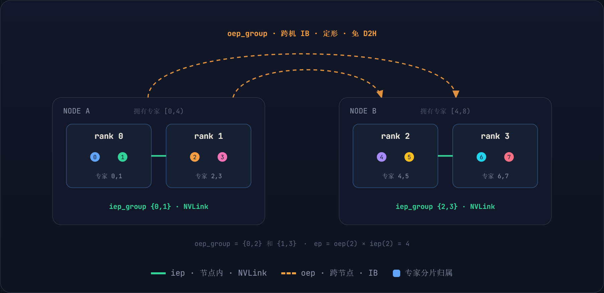
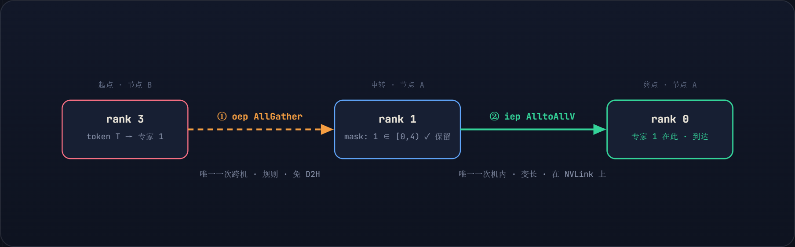
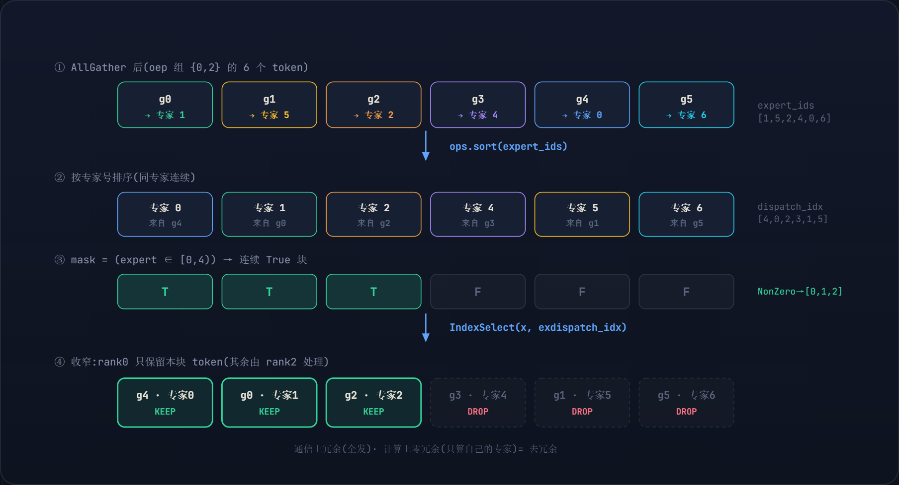
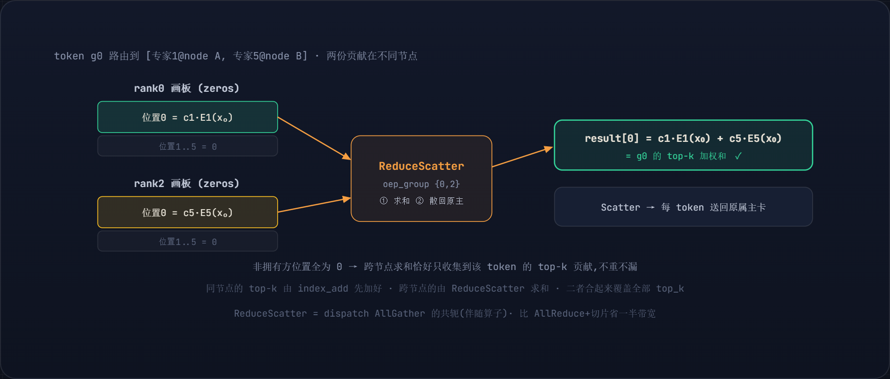
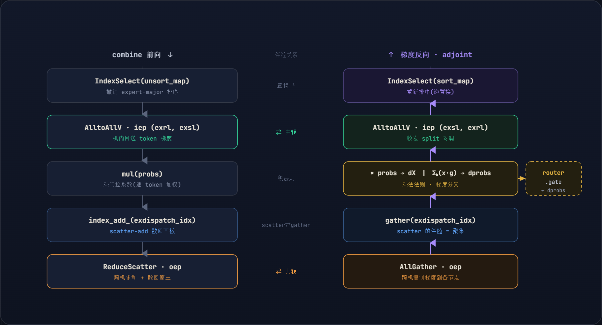

**目录**

-   00 问题本质
-   01 两级 EP 布局
-   02 一个 token 的旅程
-   03 dispatch 全流程
-   04 去冗余图解
-   05 计数转置与 D2H
-   06 combine 求和
-   07 约束与小结

MindFormers · Graph Mode · MoE Parallel Core

# 去冗余 Token 分发

*两级专家并行下的 token 交换、去冗余与通信代数*

class MoEAlltoAllDeredundencyTokenDispatcher(MoETokenDispatcher)

**配置示例**　E=8 · ep=4 · 2 节点 × 2 卡 · iep=2 · oep=2 **关注**　token 分发 / 去冗余 / D2H overlap

§ 00

## 一切的根源:MoE dispatch 是"邮局分拣"

> 训练时的物理事实只有两条:**token 分散在各 rank 上**,**专家也分散在各 rank 上**。而路由是乱序的——rank0 上的某个 token,可能被路由到住在 rank3 上的专家 7。

于是产生一个硬需求:每个 token 必须"长途跋涉"到它的专家所在 rank,算完再原路送回。因为"谁去谁那"是任意的多对多,这天生就是一次 *all-to-all*。这份 dispatcher 的全部巧思,都是为了驯服两个麻烦:

> 麻烦一 · 变长
> 
> 每个专家分到多少 token 是**数据决定的**,所以"谁发给谁几条"是运行时才知道的数字。all-to-all 必须先知道这些"收发条数"才能发起——这正是 `excounter` 与 `D2H` 的来源。

> 麻烦二 · 跨机慢
> 
> 机内卡间是 NVLink/HCCS(快),跨机是 IB/RoCE(慢一个量级)。让**不规则的、需要 D2H 的 all-to-all 跑在跨机链路上**,是大规模 MoE 的头号瓶颈。

核心思想一句话:*把"不规则 + D2H"关进快的机内;跨机只留定形、免 D2H 的规则 collective。*下面层层拆开。

§ 01

## 两级 EP 布局:oep / iep

专家并行组 `ep` 被分解成**外层 oep(跨节点)**和**内层 iep(节点内)**。专家则按节点分块:节点 A 拥有专家 `[0,4)`,节点 B 拥有 `[4,8)`;节点内再由两张卡细分。



*图 1 两级专家并行拓扑。专家按节点分块,节点内两张卡再细分。*

__init__token_dispatcher.py

```
self.iep = config.npu_nums_per_device      # 内层 EP = 单节点内 NPU 数(NVLink 域)
self.oep = self.ep // self.iep             # 外层 EP = 节点数(跨机 IB 域)
node_expert_num = self.expert_num // self.oep   # 每节点拥有的专家数
ep_idx = self.rank_id % self.ep
self.a = ep_idx // self.iep * node_expert_num   # 本 rank 所在【节点】的专家区间起点
self.b = self.a + node_expert_num               # 终点 → 本节点拥有专家 [a, b)
self.oep_group = get_oep_group_name(self.rank_id, self.ep, self.iep)  # 跨机组
self.iep_group = get_iep_group_name(self.rank_id, self.iep)          # 机内组
```

-   iep / oep**iep** 是节点内 NPU 数(快链路域),**oep** 是节点数(慢链路域)。整套设计的全部出发点就是这条**带宽不对称**。
-   a, b把专家先按 **oep 个节点**切成连续块,每节点 `node_expert_num` 个。`[a,b)` 是"本节点负责的专家区间",同节点两张卡共享它、再二次细分。

§ 02

## 一个 token 的旅程:一次跨机 + 一次机内

把宏观流程浓缩成一个 token 的两跳。token **T** 在 rank3,被路由到**专家 1**(住在 rank0)。它绝不会在跨机链路上做不规则投递——而是先被一次**规则 AllGather** 捎到正确的节点,再由一次**机内 AlltoAllV** 精确落到专家卡。



*图 2 每个 token 严格一次跨机(AllGather)+ 一次机内(AlltoAllV)。跨机链路上从不出现不规则 all-to-all。*

> 为什么这样拆
> 
> 跨机只用**定形**的 AllGather/ReduceScatter:split 是 rank 数的固定函数,HCCL/NCCL 用 ring 打满带宽,**且不需要 host 端 split → 零 D2H**。不规则的变长 AlltoAllV 与那点 D2H,全部关进快的机内。

§ 03

## dispatch 全流程:3 次 AllGather + 3 次 AlltoAllV

不是冗余,而是 `x` / `expert_id` / `router_coeff` 三个对齐张量各走一遍同一个搬运变换,外加一次纯计数交换。下面的泳道图按时间轴铺开,并标出那次小 D2H 如何**藏在跨机 AllGather 的阴影里**。

![图 3 dispatch 泳道时序。跨机(橙)只做定形 AllGather;机内(绿)做变长 AlltoAllV;那次小 D2H(粉)被 Depend 钉在 [C][D] 之间,藏进跨机通信阴影。](assets/mindformers_moe_token_dispatcher_analysis_fig3.png)

*图 3 dispatch 泳道时序。跨机(橙)只做定形 AllGather;机内(绿)做变长 AlltoAllV;那次小 D2H(粉)被 Depend 钉在 [C][D] 之间,藏进跨机通信阴影。*

| # | 调用 | 域 | 搬什么 | split | D2H |
| --- | --- | --- | --- | --- | --- |
| A | AllGather | 跨机 | expert_id | 定形 | 否 |
| B | AlltoAllV | 机内 | excounter 计数 | iepones 常量 | 否 |
| C | AllGather | 跨机 | router_coeff | 定形 | 否 |
| D | AllGather | 跨机 | x + mask 去冗余 | 定形 | 否 |
| E | AlltoAllV | 机内 | x(token) | exsl/exrl 变长 | 是 |
| F | AlltoAllV | 机内 | expert_id 随行 | exsl/exrl 变长 | 是 |

要分清两件事。**(1) 去冗余**:`x` / `expert_id` / `router_coeff` 三者在 §04 被**同一个 idx 一起过滤**——AllGather \[C\]\[D\] 只是先把全部 token 取来,随即在 `get_exdispatch_idx` 里一并收窄,`router_coeff` 同样不保留 node-B 的 token。**(2) 机内 AlltoAllV**:只有 `x` 和 `expert_id` 会一路送到专家卡(E/F),`router_coeff` 没有这一步——因为加权放在 **combine** 里做(见 §06),它只需停在"机内 gathered 帧"里和 `exdispatch_idx` 对齐,等 x 经 AlltoAllV-back 回到同一帧再相乘即可。

§ 04

## 去冗余图解:mask + NonZero + IndexSelect

"冗余"指什么:跨机 AllGather 把**全部** token 广播给 oep 组里每张卡,但每张卡只该计算路由到**自己专家块**的那些。多出来的就是冗余,必须在本地精确剔除。下面以 rank0(`a=0, b=4`,top_k=1)的视角,用具体数字走完 `get_exdispatch_idx`。



*图 4 去冗余四步:sort 让 [a,b) 变连续 → mask 取连续块 → NonZero 转下标 → IndexSelect 同步收窄 x / 专家 / 系数。*

get_exdispatch_idxtoken_dispatcher.py

```
sorted_expert_ids, dispatch_idx = ops.sort(expert_ids.astype(ms.float32))  # ① 按专家排序
dispatch_idx_floordiv_k = dispatch_idx // chosen_expert_num   # 展平的 (token×K) 槽位 → 还原 token 号
mask = ops.logical_and(sorted_expert_ids >= self.a, sorted_expert_ids < self.b)  # ③ 落在本块?
x = ops.AllGather(group=self.oep_group)(x)        # ② 跨机把所有 token 铺过来
idx = self.nonzero(mask.reshape(-1))              # 连续 True 块 → 整数下标 [0,1,2]
dispatch_idx        = IndexSelect()(dispatch_idx_floordiv_k, 0, idx)  # ④ 同步收窄三者
sorted_expert_ids   = IndexSelect()(sorted_expert_ids,       0, idx)
sorted_router_coeff = IndexSelect()(sorted_router_coeff,     0, idx)
```

-   sort**先排序**:同一专家的 token 排到一起(grouped GEMM 和按专家的 AlltoAllV split 都要求连续)。`dispatch_idx` 是 argsort,记录"排序后第 i 位来自原来哪个 token"。
-   // K**top_k 的灵魂**:reshape(-1) 后位置 p 对应 token p//K。`dispatch_idx // K` 把展平槽位映射回 token 行号——同一 token 若有多个本块专家,就会被 IndexSelect **重复索引**,这正是"一个 token 复制给多个专家"。
-   mask因为已排序,`[a,b)` 在排序数组里**必然是一段连续 True**,不会东一个西一个。
-   NonZero把布尔掩码变成**整数下标**,再用同一组下标从三个排序数组里切片,保证 token / 专家号 / 门控系数**始终对齐**。

§ 05

## 计数转置 \[B\] 与那唯一的 D2H

机内 payload AlltoAllV \[E\] 是变长的——必须先知道"机内每对卡收发几条"(`exsl/exrl`)。但每张卡本地只有"**按专家**"的直方图;要变成"**按目标卡**"的计数,得做一次按专家归属的**转置**,这就是 \[B\]。

![图 5 [B] 把"按专家"的直方图转置成"按目标卡"的计数。负载不均藏在数值里,计数的个数(形状)恒定——这就是 [B] 免 D2H、其产物却需 D2H 的根。](assets/mindformers_moe_token_dispatcher_analysis_fig5.png)

*图 5 [B] 把"按专家"的直方图转置成"按目标卡"的计数。负载不均藏在数值里,计数的个数(形状)恒定——这就是 [B] 免 D2H、其产物却需 D2H 的根。*

token_permutation · 建表段token_dispatcher.py

```
iepones = [node_expert_num // self.iep for i in range(self.iep)]   # 常量 [2,2]
expert_id = self.oep_allgather(expert_id)          # [A] 看到全局路由
excounter = self.onehot(expert_id).sum(axis=0)[self.a:self.b]   # 本块每专家 token 数
local_excounter = self.iep_alltoallv(excounter, iepones, iepones)  # [B] 转置(split 常量)
exsl = excounter.reshape(self.iep, -1).sum(axis=1)        # 发给每个 peer 几条(变长)
exrl = local_excounter.reshape(self.iep, -1).sum(axis=1)  # 从每个 peer 收几条(变长)
exsl = self.d2h(exsl, "CPU", False)   # ← 唯一 D2H,只搬 [iep] 个整数,非阻塞
exrl = self.d2h(exrl, "CPU", False)
router_coeff = ops.Depend()(router_coeff, (exsl, exrl))  # 控制边:D2H 先发起
router_coeff = ops.AllGather(group=self.oep_group)(router_coeff)  # [C] 大通信,D2H 在其阴影完成
```

-   为何搬这是"**先换计数、再换数据**"两段式里的"换计数",只不过搬到机内:把按专家的直方图转成按目标卡的计数,才填得出 \[E\] 的 split。
-   免 D2H\[B\] 搬的是**直方图**(每专家一个计数),bin 个数 = 专家个数 = config 常量 → split `iepones` 是编译期常量,本就在 host。
-   Depend静态图执行器按依赖 DAG 自由重排。`Depend(a,b)` 插入控制边:强制 D2H **先发起**、消费方 AlltoAllV **排到 AllGather 之后**。中间隔着跨机大通信,小 D2H 在其**时间阴影**里完成 → 不阻塞主流。

> 一句话戳破
> 
> 负载不均(token 多少)藏在计数的**数值**里(\[3,1,2,4\] 会变);但**计数的个数**(4 个专家 → split=\[2,2\])永远不变。所以交换计数这一步形状恒定 → 免 D2H;它算出的 token 条数是变的 → 下一步搬 token 时才需要 D2H。

§ 06

## combine 与 ReduceScatter:精确的 top-k 求和

一个 token 的 top-k 个专家可能散在不同节点。combine 必须把这些散开的加权输出重新加回到同一个 token,而它们物理上在不同卡。`ReduceScatter` 一步完成——它是 dispatch 那个 `AllGather` 的数学共轭。



*图 6 零画板使跨节点 Reduce 恰好等于"该 token 散在各节点的 top-k 贡献之和";Scatter 同时把结果送回原属主。*

token_unpermutationtoken_dispatcher.py

```
x = IndexSelect()(tokens, 0, unsort_map)                              # 撤销 expert-major 排序
x = ops.AlltoAllV(group=self.iep_group, block_size=hidden)(x, exrl, exsl)  # 机内回送(split 对调)
x = self.mul(probs.unsqueeze(1), x)                                  # 乘门控系数 → 加权
x = excombine_whiteboard.index_add_(0, exdispatch_idx.reshape(-1), x)  # 散回 gathered 帧(同节点 top-k 在此求和)
x = ops.ReduceScatter(group=self.oep_group)(x)                       # 跨节点求和 + 散回原主
```

-   whiteboard`excombine_whiteboard = x * 0.0` 是 dispatch 里造的**全零画板**。每个 (token,专家) 贡献只出现在**拥有该专家的节点**的画板里,别处全 0——这是求和不重不漏的关键。
-   index_add同节点两张卡的 top-k 贡献:机内 AlltoAllV 回送到 gather 它的卡,`index_add` 在同位置**累加**(同下标多次 add 即求和)。
-   ReduceScatter**Reduce**:跨 oep 求和,因非拥有方置零,恰好凑齐 token 散在各节点的贡献。**Scatter**:把结果切片送回原属主卡(AllGather 拼接的逆)。求和后每卡只需自己那批,故用 ReduceScatter 而非 AllReduce。

### 梯度反向:每个前向算子的伴随(adjoint)

反向把 combine 前向逐算子取**伴随(adjoint)**、逆序执行。两条关键:**ReduceScatter 的伴随是 AllGather**(跨机把梯度复制回每个节点),**scatter-add(index_add)的伴随是 gather**;而 `mul(probs)` 按乘法法则**分叉出两路梯度**——一路 *× probs* 回到专家输入,另一路 *Σₕ(x·g)* 正是**门控系数的梯度,流回 router**,这是路由打分网络唯一的学习信号。



*图 7 combine 的梯度反向:每个前向算子取伴随、逆序执行。ReduceScatter↔AllGather、scatter↔gather 互为共轭;mul(probs) 分叉出 dprobs 回流 router。*

-   RS → AG**ReduceScatter 的伴随是 AllGather**:前向把各节点部分结果求和后散回属主;反向把每个属主的输出梯度**跨机复制**回所有相关节点,让每个专家拿到完整的下游梯度。
-   scatter → gather`index_add_` 前向是 `out[idx] += x`(scatter-add);其伴随是 `grad_x = grad_out[idx]`(**gather**)——把画板上对应位置的梯度取回给每个 token 的专家输出。
-   dprobs`mul(probs)` 按乘法法则分叉:*× probs* 给专家输入,*Σₕ(x·g)* 给门控系数。后者是 **router 唯一的梯度来源**——路由打分网络正是靠它学习"该把 token 送给谁"。
-   a2a 对调机内 `AlltoAllV` 的伴随仍是 AlltoAllV,只是**收发 split 互换**(exrl↔exsl);置换类算子(unsort/sort)的伴随是其**逆置换**。整条链在 autograd 里闭环。

§ 07

## 约束链与一页小结

这套 dispatcher 能跑,需要一串整除约束同时成立——任意一个不满足就会得到 0 或丢余数:

| 约束 | 来源 | 含义 |
| --- | --- | --- |
| dp % ep == 0 | outer_dp = dp // ep | EP 切自 DP,EDP 副本数为整(故 **ep ≤ dp** 是铁律) |
| ep % iep == 0 | oep = ep // iep | EP 能按节点整分 |
| expert_num % oep == 0 | node_expert_num | 专家能按节点整分 |
| node_expert_num % iep == 0 | iepones | 专家能在节点内整分(计数 split 为常量的前提) |

> 全局哲学
> 
> 把**"按 token 的不规则聚合"**拆成**"排序后的连续块操作 + 规则集合通信的代数共轭"**:§04 用 sort 让筛选变成连续块,§06 用零画板让 ReduceScatter 变成精确的 top-k 求和,§05 用 Depend 把不可避免的那点 D2H 藏进通信阴影。跨机只走定形、免 D2H 的 AllGather/ReduceScatter,不规则与 D2H 全部降级到机内 NVLink。

### 正反向通信对偶

| 方向 | 跨机 (oep) | 机内 (iep) |
| --- | --- | --- |
| dispatch 前向 | AllGather | AlltoAllV (sl, rl) |
| combine 前向 | ReduceScatter | AlltoAllV (rl, sl) |

AllGather 与 ReduceScatter 互为共轭,AlltoAllV 的正反向只是收发 split 对调——整套结构在 autograd 里天然闭环。

**来源**　mindformers/parallel_core/training_graph/transformer/moe/token_dispatcher.py（master）  
**对照**　torchtitan/torchtitan/models/common/token_dispatcher.py（AllToAll / DeepEP 路径）  
**PyNative 对照**　本页讲 Graph 模式的去冗余 dispatcher;PyNative 路径的 EP 三方案(alltoall / zero_redundancy / deredundancy)与通信量对照见 [[mindformers_pynative_ep_analysis]]  
**说明**　图中数字为讲解用的小规模示例(E=8, ep=4, iep=2, oep=2);`d2h(..., False)` 的第三参为非阻塞标志属推断。  
**生成**　Claude Code · 技术解读报告
