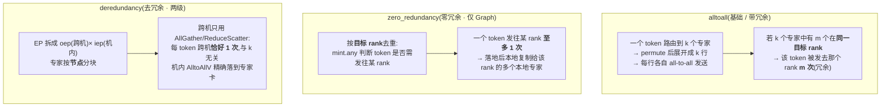
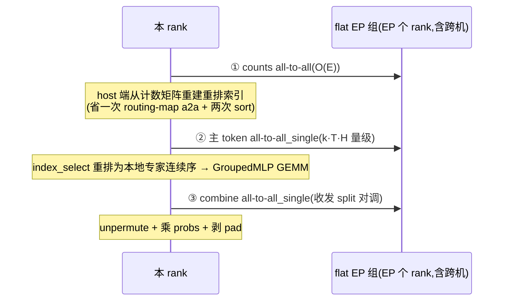
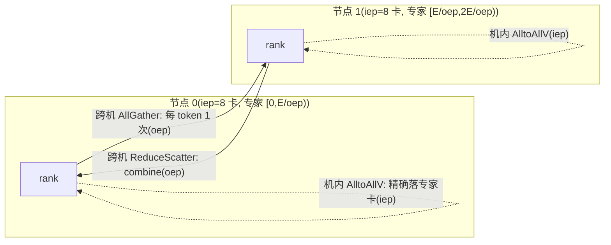

# MindFormers PyNative 专家并行(EP)实现与通信量分析

> **源码基线**: MindFormers @ `01e71622` (`master`, 2026-06-18)
> **维度**: Overview → Quick Start → Deep Dive
> **本文回答**: PyNative 路径下 EP 一共有几种实现、各自的搬运思路与通信量,重点拆解 `alltoall`(基础)与 `alltoall_deredundancy`(去冗余),并澄清 `zero_redundancy`(零冗余)在 PyNative 中**不存在**(只在 Graph 路径)。Graph 模式的去冗余 dispatcher 已有专页 [[mindformers_moe_token_dispatcher_analysis]],本文聚焦 PyNative 并把三种方案放在一张通信量对照表里。

---

## 0. 一个必须先讲清的事实(源码勘误)

用户常把 MindFormers MoE 的三种分发方式记成 **alltoall / 零冗余 / 去冗余** 三件套。但**这取决于你在看哪条代码路径**:

| dispatcher 名称 | PyNative 路径 | Graph 路径(training_graph) |
|---|---|---|
| `alltoall`(基础,逐 (token,expert) 对) | ✅ `ExpertParallel` | ✅ `MoEAlltoAllTokenDispatcher` |
| `alltoall_zero_redundancy`(零冗余,按目标 rank 去重) | ❌ **不存在** | ✅ `MoEAlltoAllZeroRedundancyTokenDispatcher` |
| `alltoall_deredundancy`(去冗余,两级 oep/iep) | ✅ `DeredundancyExpertParallel` | ✅ `MoEAlltoAllDeredundencyTokenDispatcher` |

**证据**:
- PyNative 的配置只暴露两种:`moe_token_dispatcher_type` 默认 `"alltoall"`,可选 `'alltoall', 'alltoall_deredundancy'` —— `mindformers/pynative/config/config.py:418-423`。
- PyNative 的 style 选择器只有两个分支,其余 `raise ValueError` —— `mindformers/pynative/base_models/gpt/parallelize.py:967-975`。
- 在整个 `mindformers/pynative/` 子树里 grep `zero_redundancy|ZeroRedundancy` 零命中;只有 `Deredundancy`。
- `zero_redundancy` 仅出现在 Graph 路径:`MoEAlltoAllZeroRedundancyTokenDispatcher` 定义于 `mindformers/parallel_core/training_graph/transformer/moe/token_dispatcher.py:137`,由 `ffn.py:102-103` 在 `moe_token_dispatcher_type == "alltoall_zero_redundancy"` 时选用。

> [!important] 所以严格回答"PyNative 的 deredundancyEP 和 zeroredundancyEP":
> **PyNative 有 deredundancy,没有 zeroredundancy。** PyNative 的"基础 alltoall"对应的正是 Graph 里那个**带冗余**的 `MoEAlltoAllTokenDispatcher`(逐 (token,expert) 对发送),它**不是**零冗余版本。零冗余是一个独立优化,目前只落在了 Graph 路径。本文仍会讲清零冗余的机制,因为它是理解"冗余"这一概念、以及与去冗余区别的关键参照系。

---

## 1. Overview:三种方案在解决什么"冗余"

MoE dispatch 的物理事实只有两条:**token 散在各 rank**、**专家也散在各 rank**,而路由是乱序多对多 —— 这天生是一次 all-to-all。三种方案的区别,全在于**如何减少一个 token 在链路上被重复搬运的次数**:

**一句话区分**:
- **基础 alltoall**:冗余度 = 落在同一 rank 的专家个数(最坏 = `k`)。
- **零冗余**:把"按 rank 的重复"压成 1,冗余度 = 该 token 触达的**不同 rank 数**。
- **去冗余**:专攻**跨机**这条慢链路,把跨机搬运压成"每 token 每方向 1 次",代价是把不规则搬运下放到机内 NVLink。

三者不是替代关系而是**针对不同瓶颈**:零冗余优化"专家在 rank 内聚集"的情形;去冗余优化"跨机带宽不对称"的情形。

| 概念 | 定义 | 源 file:line |
|---|---|---|
| `EP`(ep_degree) | 专家并行度 = `device_mesh.mesh_shape[0]` | `expert_parallel.py:228` |
| 本地专家数 | `E/EP`(基础);去冗余下每节点 `E/oep` | `expert_parallel.py:464` |
| `iep` 机内组 | `npu_nums_per_device`(默认 8,NVLink 域) | `config.py:415`,`expert_parallel.py:462` |
| `oep` 跨机组 | `EP // iep`(节点数,IB/RoCE 域) | `expert_parallel.py:463` |

---

## 2. Quick Start:从哪里开始读

EP 不是模型里的一个 `nn.Cell`,而是通过 `parallelize_module` 给 `GroupedMLP` **挂上 input_fn/output_fn 钩子**实现的并行策略(`ParallelStyle`):

- **入口**:`parallelize.py:958-981` 根据 `moe_token_dispatcher_type` 选 `ExpertParallel` 或 `DeredundancyExpertParallel`,作为 `parallelize_plan` 套到 `transformer_block.mlp.experts` 上。
- **挂钩**:`ExpertParallel._apply` 只接受 `GroupedMLP`,把专家权重按 `Shard(0)` 切在专家维,并注册 `input_fn=self._token_dispatch`、`output_fn=self._token_combine` —— `expert_parallel.py:405-416`、`326-332`。
- **一条最小调用链**:`MoELayer.construct` → router 出 `(top_scores, indices, num_tokens_per_expert)` → `self.experts(...)`(此调用被 `_token_dispatch` 前置、`_token_combine` 后置包裹) —— `moe_layer.py:124-132`。
- **专家计算**:dispatch 把 token 按专家排好后,`GroupedMLP` 做 grouped-GEMM,再由 combine 还原。

所以"EP 的实现"= **`_token_dispatch`(发) + 专家 GEMM + `_token_combine`(收)** 这三段,通信全在 dispatch/combine 里。

---

## 3. Deep Dive

### 3.1 基础 `ExpertParallel`(`alltoall`)—— 逐 (token,expert) 对的全 EP all-to-all

**思路**:把 `(token, k个专家)` 在 `_permute` 里**展开成 `k×T` 行**(每个 (token,expert) 槽一行),按专家号排序使同专家连续,然后一次 all-to-all 把每行发到其专家所在 rank。整条链跑在**单层 flat EP 组**上(`get_ep_group_name` 取连续 EP 个 rank,**不区分机内/跨机**)—— `expert_parallel.py:614-619`、`239`。

**dispatch 三步**(`_dispatch_comm`,`expert_parallel.py:199-213`):

1. **counts all-to-all**:先交换"每个专家收到几条"。`_counts_a2a` 把本地 `num_tokens_per_expert`(长度 `E`)按 EP 切块做 `comm.all_to_all`,得到 `num_tokens_per_expert_group` —— `expert_parallel.py:163-174`。这是变长 all-to-all 必需的"先换计数"。**搬运量 = O(E) 个计数,可忽略**。
2. **算 split + 重排索引**:`_compute_token_splits` 由计数算出 `input_splits/output_splits`(每个 EP peer 发/收多少 token)—— `:97-105`。关键优化:`_build_resort_index` **在 host 端从计数矩阵直接重建** dispatch 后的重排索引,**省掉了一次 routing-map 的变长 all-to-all + 两次 device sort**(原本需要把路由图也 a2a 过去再排序)—— `:107-145`,注释见 `:117-119`。
3. **主 token all-to-all**:`_main_a2a` 用 `comm.all_to_all_single`,`split_sizes = splits × hidden_size`,把 `k×T` 行 payload 发到目标 rank —— `:176-184`、`242-243`。落地后用第 2 步的索引 `index_select` 重排成本地专家连续序 —— `:147-154`、`246`。

**combine**:`_combine_comm` 反向 all-to-all(收发 split 对调),再 `_finalize_combine` 还原原序、乘门控系数 `probs`、剥掉 pad 行 —— `:378-403`、`344-376`。

> [!note] pad 细节:dispatch 前给**每个专家**预置 1 行全零 pad(共 `E` 行),保证每个专家至少收到 1 个 token(避免 grouped-GEMM 空组),combine 末尾再 `strided_slice` 剥掉 —— `_pad_inputs` `:80-95`,剥除 `:366-369`。注释明确:开 pad 后结果与 Megatron 不再逐位对齐(`:86`)。

**通信量**(设每 rank 本地 `T` 个 token、`H=hidden_size`、`k=top_k`、专家均匀分布,则一个 (token,expert) 对留本地的概率 ≈ `1/EP`):

| 段 | 集合通信 | 每 rank 发送量(近似) |
|---|---|---|
| counts a2a | `all_to_all` | `O(E)` 计数,≈0 |
| 主 token a2a(dispatch) | `all_to_all_single` | `k·T·H·(EP−1)/EP` |
| token a2a(combine) | `all_to_all_single` | `k·T·H·(EP−1)/EP` |

**冗余在哪**:`_permute` 用 `index_select(tokens, 0, index)`,`index` 长度 `k×(T+E)`,**逐 (token,expert) 槽各取一行** —— `:320`。所以一个 token 若有 `m` 个 top-k 专家恰好落在同一目标 rank,它会被**独立发送 `m` 次**到那个 rank。通信量随 `k` **线性增长**。这正是零冗余要消除的东西。

---

### 3.2 `DeredundancyExpertParallel`(`alltoall_deredundancy`)—— 两级 oep/iep,跨机去冗余

**思路一句话**:把"不规则 + 需 D2H 的 all-to-all"**关进快的机内 NVLink**;**跨机只留定形、规则的 AllGather / ReduceScatter,使每个 token 跨机恰好 1 次,与 `k` 无关**。这是它与基础 alltoall 的本质差别 —— 基础版整条 a2a 横跨机内机外不加区分。

**两级布局**(`expert_parallel.py:462-469`):
- `inter_ep = npu_nums_per_device`(=8,机内卡数),`outer_ep = EP // inter_ep`(节点数)。
- `oep_group`:`get_oep_group_name` 以 `npu_nums_per_device` 为**步长**取 rank → 收集"各节点同一卡位",是**跨机组**,size = `outer_ep` —— `:622-634`。
- `iep_group`:`get_iep_group_name` 取连续 8 个 rank → **机内组**,size = `inter_ep` —— `:637-648`。
- 专家按**节点**分块:`node_expert_num = E // outer_ep`,本 rank 所属节点负责专家区间 `[local_expert_start_index, local_expert_end_index)`,同节点 8 张卡共享该块再细分 —— `:464-467`。
- **硬约束**:`EP ≥ npu_nums_per_device`(否则跨不出一个完整节点,去冗余无意义),在 `config.py:425-433` 强校验。

**dispatch 流程**(`_token_dispatch`,`:447-557`):

1. **pad**:给本节点每个专家预置 1 行(`node_expert_num` 行)安全 token —— `:472-479`。
2. **`all_gather(topk_indices, oep_group)`**:跨机收齐全局路由图,本地 `histc` 出本节点每专家的 token 数 `excounter` —— `:483-486`。
3. **`all_to_all_single(excounter, iep_group)`**:机内把"按专家"的计数**转置**成"按目标卡"的计数,split 用常量 `iepones` → 免 D2H;产物 `exsl/exrl`(机内每对卡收发条数)是变长的 —— `:482`、`488-501`。
4. **`all_gather(probs, oep_group)`**:跨机收齐门控系数 —— `:504`。
5. **跨机取 token + 本地去冗余**:`all_gather(tokens, oep_group)` 把所有节点的 token 铺过来(**每 token 跨机 1 次**),再用 `mask = (a ≤ expert < b)` 选出"路由到本节点专家块"的 (token,expert) 对,`nonzero + index_select` **本地精确剔除冗余** —— `:515-526`。多出来的(发去别的节点该算的)在本地丢弃,不占额外跨机带宽。
6. **`all_to_all_single(routed_input, iep_group)`**:机内变长 AlltoAllV,把选出的 token 精确送到节点内**真正持有该专家的那张卡**;随行再 a2a 一次 `sorted_expert_ids` —— `:533-549`。
7. **resort**:按专家号排序成 grouped-GEMM 连续序 —— `:552-554`。

**combine 流程**(`_token_combine`,`:559-598`):机内 `all_to_all_single` 回送(split 对调)→ 乘 `probs` → `index_add_` 在零画板上累加(同节点 top-k 在此求和)→ **`reduce_scatter(routed_output, oep_group)`** 跨机求和并散回属主(AllGather 的数学共轭)→ 剥 pad —— `:570-591`。

**通信量**(`oep=outer_ep` 节点,`iep=8`):

| 方向 | 跨机(oep,慢) | 机内(iep,快) |
|---|---|---|
| dispatch | `AllGather`:token `T·H` + 路由/系数 `O(T·k)`(每 rank egress ≈ token 自己那份 `T·H`,**与 k 无关**) | `AlltoAllV`:选中 token,`O(本节点该算的 token·H)` |
| combine | `ReduceScatter`:`T·H`(AllGather 共轭) | `AlltoAllV`:回送,与 dispatch 对调 |

**关键**:跨机 token 量 ≈ **`2·T·H`(dispatch + combine,与 `k` 无关)**;基础 alltoall 横跨机外的部分是 `k·T·H·(跨机 rank 占比)`,**随 `k` 线性**。去冗余用"跨机定形集合通信(免 D2H)+ 机内不规则 AlltoAllV(NVLink)+ 本地 mask 剔除"换掉了"跨机不规则 a2a 把同一 token 按专家重复发送"。这就是去冗余之所以去的"冗余"。Graph 路径同款实现及其图解(mask/NonZero 去冗余、计数转置 D2H overlap、ReduceScatter top-k 求和)见 [[mindformers_moe_token_dispatcher_analysis]]。

---

### 3.3 零冗余 `MoEAlltoAllZeroRedundancyTokenDispatcher`(仅 Graph,作对照)

PyNative 没有这个类,但要理解"冗余/去冗余/零冗余"的差异必须讲它。零冗余仍是**单层 flat EP 的 all-to-all**(不分机内外),但**按目标 rank 去重**:

- 用 `mint.any(local_map_info, dim=-1)` 沿"本地专家维"求或 —— 一个 token 只要有**任意一个** top-k 专家落在某 rank,就对该 rank 计 1(而非每专家计 1)—— `token_dispatcher.py:193-197`。
- `select_index = mod(nonzero(send.ravel()), num_tokens)` 选出**去重后**要发往各 rank 的 token,`all2allvc` **每 token 每目标 rank 至多发 1 次** —— `:208-213`。
- 落地后用 `global_map_info` 的 `index_select(0, token_id_recover)` **在本地把 token 复制给该 rank 的多个本地专家**(复制发生在收端,不走网络)—— `:223-230`。
- combine 对称:`index_add_` 把多专家贡献在本地求和,再反向 `all2allvc` 回送 —— `:236-262`。

**通信量**:每 rank 发送量 ≈ `Σ_目标rank (去重后发往该 rank 的 token 数)·H`。设专家均匀分布,一个 token 触达的**不同 rank 数** ≈ `EP·(1−(1−1/EP)^k)`:
- 当**每 rank 本地专家多**(EP 小、E 大,token 的多个专家易聚在同一 rank),零冗余相对基础 alltoall 省得多(冗余从 `k` 降到"不同 rank 数")。
- 当**每 rank 本地专家少**(EP 大、本地专家数 `E/EP` 接近 1),`k` 个专家几乎都在不同 rank,零冗余≈基础 alltoall(省不动)。

**与去冗余的分工**:零冗余消的是"同一 token 发往**同一 rank**的重复",不区分机内机外;去冗余消的是"同一 token **跨机**的重复",专攻带宽不对称。二者正交。

---

### 3.4 `OverlapExpertParallel`—— 通信/计算重叠(与冗余正交)

PyNative 还有第三个 EP 类 `OverlapExpertParallel`(`ep_overlap.py:77`),它**不改变通信量**,只在基础 `alltoall` 之上加 **A/B/C/D 四个可微同步钩子 + 异步 a2a**,让 EP 的 HCCL kernel 与对侧线程的计算在双线程 `CommComputeOverlap` 下重叠:

- 主 token a2a 与 combine a2a 改用 `differentiable_all_to_all_single_async`,返回 `AsyncCollectiveTensor`,其 `wait()` 在首个消费算子处**惰性触发**,把 host wait 推进计算窗口 —— `ep_overlap.py:129-154`、设计注释 `:38-44`。
- 所有 EP 集合通信**funnel 到同一条 HCCL stream**(都走 `comm_func.all_to_all_single`),避免双线程在同组上跨 stream 投递导致的非确定序死锁 —— `:27-36`、`144-148`。
- dispatch 段 `A→counts→split→重排索引→async 主 a2a→B`;combine 段 `C→async combine a2a→D/D_LAST` —— `:158-180`。复用基类的 `_pad_inputs/_permute/_build_resort_index`,只重写"通信缝"。

它复用 `_build_resort_index` 的 host 端重建,使索引构建只读已完成的 counts a2a、**不强制** async 主 a2a 提前 wait,从而保住重叠窗口 —— `:158-166`。

---

## 4. 三方案通信量总对照

记号:`T`=每 rank 本地 token 数,`H`=hidden,`E`=专家数,`k`=top_k,`EP`=ep_degree,`oep`=节点数,`iep`=8。

| 维度 | `alltoall`(基础) | `zero_redundancy`(仅 Graph) | `alltoall_deredundancy` |
|---|---|---|---|
| 通信拓扑 | 单层 flat EP all-to-all | 单层 flat EP all-to-all | 两级:跨机 AllGather/ReduceScatter + 机内 AlltoAllV |
| 一个 token 在链路上的重复 | 每个目标**专家**一次(≤`k`) | 每个目标 **rank** 一次(≤不同 rank 数) | **跨机每方向恰好 1 次**(与 `k` 无关) |
| 与 `k` 的关系 | 线性 ∝ `k` | 次线性,封顶"不同 rank 数" | 跨机量与 `k` 无关 |
| 主要集合通信(dispatch) | `all_to_all`(counts)+ `all_to_all_single`(token) | `AllToAll`(map)+ `AllGather`(send/recv list)+ `AllToAllV`(token,去重) | `AllGather×3`(跨机)+ `AlltoAllV×2`(机内) |
| 变长 / D2H | 有(token a2a) | 有 | 跨机免 D2H,仅机内那唯一一次小 D2H |
| 适用瓶颈 | 通用,实现最简 | 本地专家聚集(EP 小 / E 大) | 跨机带宽不对称(多机,要求 `EP≥iep`) |
| PyNative 类 / Graph 类 | `ExpertParallel` / `MoEAlltoAllTokenDispatcher` | —(无) / `MoEAlltoAllZeroRedundancyTokenDispatcher` | `DeredundancyExpertParallel` / `MoEAlltoAllDeredundencyTokenDispatcher` |

**选型直觉**:单机或专家分布稀疏 → `alltoall`(配 `OverlapExpertParallel` 做重叠即可);多机、`k` 较大、跨机 IB 是瓶颈 → `alltoall_deredundancy`;Graph 模式下若想在不引入两级拓扑的前提下压掉"同 rank 重复" → `alltoall_zero_redundancy`。

---

## Related / Cross-references

- [[mindformers_moe_token_dispatcher_analysis]] —— Graph 模式去冗余 dispatcher 的逐算子图解(本文的姊妹篇,机制更细)
- [[14_megatron_ep_analysis]] —— Megatron-LM 的 EP / token dispatcher 对照
- [[15_torchtitan_ep_analysis]] —— torchtitan 的 EP(AllToAll / DeepEP 路径)对照
- [[20_deepseek_moe_analysis]] —— DeepSeek MoE 路由与共享专家(k、E 的来源)
- [[02_engineering/02_train_frameworks/index]] —— 训练框架域入口

---

**来源**　`mindformers/pynative/distributed/expert_parallel.py`、`ep_overlap.py`、`config/config.py`、`base_models/gpt/parallelize.py`、`transformers/moe/moe_layer.py`;对照 `parallel_core/training_graph/transformer/moe/token_dispatcher.py`(均 `master @ 01e71622`)
**说明**　通信量为均匀路由假设下的量级估计;pad 行数(基础版 `E` / 去冗余版 `node_expert_num`)对大 `T` 可忽略。
**生成**　Claude Code · source-faithful 分析
