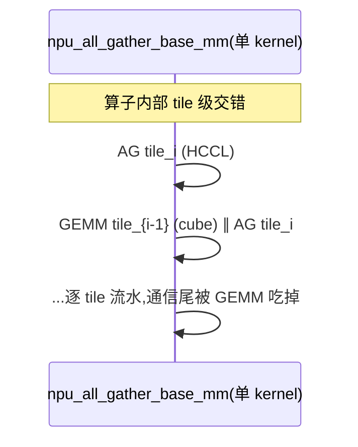
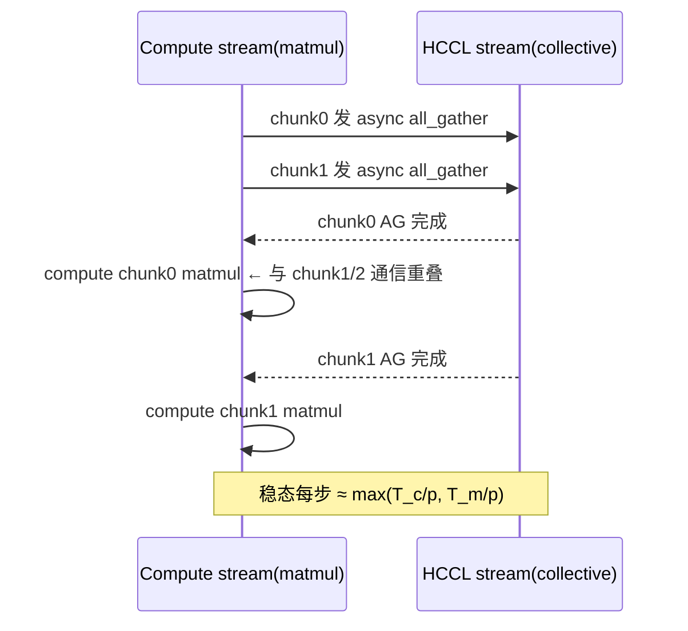
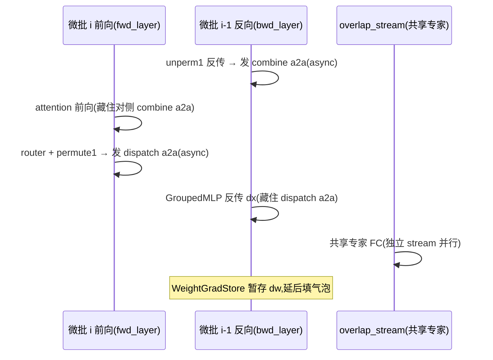
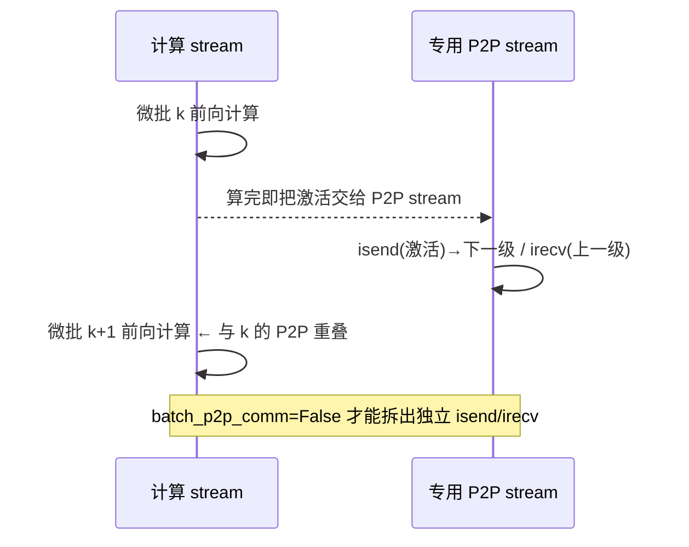

# MindSpeed 计算通信掩盖(通算重叠)— 源码级深度解析

> **代码基线**:MindSpeed core `master` @ `1432cb09`(patch Megatron `core_r0.17.0`) · MindSpeed-LLM `master` @ `0c16322d` · 阅读日期 2026-06-23
> **范围**:本页只讲"如何把集合通信藏到计算背后"——TP 的 all-gather/reduce-scatter、EP 的 all-to-all、PP 的 P2P、DP 的日志 all-reduce 各自被哪种特性、用什么机制掩盖。**每个掩盖特性都按统一四件套拆解**:① 机制(谁藏谁)② 时间线 / before-after 图示 ③ `> [!tip] 优化点` callout(量化:掩盖比例 / 气泡公式 / 隐藏的通信量)④ 源码解读(实际调用 + autograd + `file:line`,行号均经实际打开核对)。**并行的切分结构本身**(为什么要这些通信)归姊妹页 [[10_mindspeed_parallelism_analysis]],融合算子底座(MC2/lcal/GMM 的算子层)归 [[13_mindspeed_ascend_affinity_analysis]],这里只交叉引用、不重复。属 [[mindspeed/index]] 系列。

---

## 1. 总览:哪种通信被哪个特性藏起来

掩盖只有两条总思想:**(a) 软件流水**——把一次大 GEMM 沿 token(m)维切成若干 chunk,让第 $i$ 块的异步通信与第 $i\pm1$ 块的计算在不同 stream 上重叠(CoC / MoE-overlap / fb-overlap);**(b) 算子融合**——直接用昇腾把 matmul 与集合通信编进一个 NPU kernel,在算子内部交错 tile 计算与 HCCL 传输(MC2 / lcal / alltoall-MC2)。PP 层面是第三条路:**换调度**,把 P2P 与气泡用调度填掉。

| 被掩盖的通信 | 发生位置 | 掩盖特性 | 机制(流水 / 融合 / 换调度) | 优化点(量化) |
|---|---|---|---|---|
| TP all-gather + reduce-scatter | 列/行并行 Linear(SP) | **MC2** | 融合:`npu_all_gather_base_mm` / `npu_mm_reduce_scatter_base` | 单 kernel 内 tile 交错,TP 集合通信 ~100% 藏进 GEMM |
| TP AG / RS / all-reduce | 列/行并行 Linear | **CoC** | 流水:chunk + 双 stream;或 lcal 融合核 | $p$ 块流水,$T\!\approx\!\max(T_c,T_m)(1+\tfrac1p)$,$p{=}8$ 掩盖 ~7/8 |
| EP all-to-all(dispatch/combine) | MoE 层 | **moe-alltoall/allgather-overlap** | 流水:异步 a2a/AG/RS handle 与 GMM 重叠 | a2a 藏进同微批 `op_dx/op_dw`,2×全量 a2a 隐于 2 次 GMM |
| EP all-to-all(跨微批) | MoE 层 | **moe-fb-overlap** | 流水:微批 i 前向 ∥ 微批 i−1 反向 + dw 延迟 | 暴露最低,稳态每层 $\approx\max(T_{\text{comp}},T_{a2a})$ |
| EP all-to-all-v | MoE 层 | **moe-alltoall-mc2** | 融合:`npu_alltoallv_gmm` / `npu_gmm_alltoallv` | a2a-v⊕专家 GMM 编进单 kernel,EP 通信 ~100% 藏 |
| PP P2P(send/recv) | 流水级边界 | **optimize-p2p / send-recv** | 换流:独立 isend/irecv + 专用 stream | P2P 与下一段计算重叠,关键路径不见 P2P |
| PP 气泡(bubble) | warmup/cooldown | **DualPipeV** / **RiPipe** | 换调度:双向切半 / 气泡做重计算 | 气泡占比 $O(P)/O(m)$;RiPipe 重算"免费"塞气泡 |
| DP 日志 all-reduce | train_step 末尾 | **async-log-allreduce** | 异步 Work,延迟到取 loss 值才 wait | 跨 DC 高延迟小包被 `optimizer.step` 吸收 |

```mermaid
flowchart LR
    subgraph TP["TP 线性层"]
      MC2["MC2 融合核"]:::a
      CoC["CoC chunk 流水/lcal"]:::a
    end
    subgraph EP["MoE 专家并行"]
      A2A["alltoall/allgather overlap"]:::b
      FB["fb-overlap 跨微批"]:::b
      M2["alltoall-MC2 融合"]:::b
    end
    subgraph PP["流水并行"]
      DP2["DualPipeV / RiPipe"]:::c
      P2P["optimize send/recv"]:::c
    end
    DPg["async-log-allreduce"]:::d
    classDef a fill:#e3f2fd; classDef b fill:#e8f5e9; classDef c fill:#fff3e0; classDef d fill:#fce4ec
```

每个特性都是一个 `MindSpeedFeature` 子类,通过 `register_patches` 把实现猴补丁进 Megatron(契约见 [[mindspeed/index]] §1);掩盖类特性几乎都是 O2(`optimization_level=2`,如 `MC2Feature.__init__('use-ascend-mc2', 2)`,`mc2.py:11`),需 `--optimization-level 2` 放行。下面逐个深挖。

| 开关 | 特性 | 节 |
|---|---|---|
| `--use-ascend-mc2` | MC2 | §2 |
| `--use-ascend-coc` `--coc-parallel-num` `--coc-fused-kernel` | CoC | §3 |
| `--moe-alltoall-overlap-comm` / `--moe-allgather-overlap-comm` | MoE a2a/AG 重叠 | §4.1–4.2 |
| `--moe-fb-overlap` | 前反向跨微批重叠 | §4.3 |
| `--moe-alltoall-mc2` | MoE a2a+MC2 融合 | §4.4 |
| `--schedules-method dualpipev` `--dualpipev-dw-detach` | DualPipeV | §5.1 |
| `--recompute-in-bubble` / `--recompute-in-advance` | RiPipe | §5.2 |
| `--optimize-p2p-comm` / `--optimize-send-recv-comm` | P2P 优化 | §5.3 |
| `--async-log-allreduce` | DP 日志异步 | §6 |

> [!note] 三类机制 ↔ 三种"被掩盖比例"上界
> **融合**(MC2/lcal/alltoall-MC2):算子内部 tile 交错,理想 $\max(T_c,T_m)$,粒度不可调但掩盖最彻底;**软件流水**(CoC/MoE-overlap/fb-overlap):$p$ 块异步 handle,$\max(T_c,T_m)(1+\tfrac1p)$,粒度可调但有填充开销与尾部暴露;**换调度**(DualPipeV/RiPipe/P2P):不动单算子,改流水级编排把气泡/P2P 变小或变有用功。读每节的 `> [!tip] 优化点` 即可直接拿到该特性的量化收益与边界。

---

## 2. MC2 —— 把 TP 集合通信编进 matmul 融合核

**命题**:序列并行(SP)下,**列并行** Linear 前向要先沿序列维 `all-gather` 输入、再做 $XA^\top$;**行并行** 前向做完 $XA^\top$ 再 `reduce-scatter`。串行执行 = 计算时间 $T_c$ + 通信时间 $T_m$。MC2 不在 Python 层拆分,而是调用昇腾 `torch_npu` 的**单个融合大算子**,在算子内部把 GEMM 的 tile 与 HCCL 集合通信交错排布——一个 NPU op 内通信几乎全被 GEMM 掩盖,省去 launch / 同步 / 显存往返开销。

### 2.1 机制:四个 `autograd.Function` 走前/反向
补丁把 Megatron 的 `ColumnParallelLinear`/`RowParallelLinear` 整类替换为 `MindSpeedMC2{Column,Row}ParallelLinear`(`mc2.py:39-42`),前置硬性要求 `TP>1` 且 SP 打开(`mc2.py:23-28`)、与 CoC 互斥(`mc2.py:21-22`)。核心是哪个 TP 集合通信被融进哪次 GEMM:

| 路径 | 融合算子 | 融合的 TP 通信 | file:line |
|---|---|---|---|
| 列并行 **前向** | `npu_all_gather_base_mm` | AG(序列)+ matmul | `linear_function.py:40-48` |
| 列并行 **反向** | matmul 求 dX,async `_reduce_scatter_base` 与算 dw 重叠 | RS(dX) | `linear_function.py:99-101,149` |
| 行并行 **前向** | `npu_mm_reduce_scatter_base` | matmul + RS | `linear_function.py:169-171` |
| 行并行 **反向** | `npu_all_gather_base_mm` | AG + matmul | `linear_function.py:200-202` |

### 2.2 时间线

```text
列并行前向(MC2 融合):
  ┌─ npu_all_gather_base_mm ───────────────┐
  │ AG tile0 │AG tile1│AG tile2│  ...       │   ← HCCL 在算子内
  │     GEMM tile0 │GEMM tile1│GEMM tile2│  │   ← cube 在算子内
  └────────────────────────────────────────┘   理想耗时 ≈ max(T_c, T_m)

对照 串行(非 MC2):
  AG 全量 ████████        (T_m)
  GEMM            ████████ (T_c)   总 = T_c + T_m
```



> [!tip] 优化点(MC2)
> **把 matmul 与 TP 集合通信合进一个 NPU kernel**,算子内部逐 tile 交错:AG/RS 不再是 Python 层一次性大调用,而是被切成 tile 与 cube 计算交叉发射。串行 $T_c+T_m$ → 融合后理想 $\max(T_c,T_m)$,被掩盖比例 $\eta=\dfrac{\min(T_c,T_m)}{T_c+T_m}\xrightarrow{T_c\approx T_m}0.5$;当 $T_c\ge T_m$(GEMM 够大)时 **TP 集合通信被 ~100% 藏进 GEMM**。额外赢点:省掉 AG/RS staging 张量的一次 HBM 往返 + 一次 kernel launch/同步。列并行反向再叠一层软流水——async 发 RS(dX) 后先算 grad_weight,循环末才 `reduce_scatter_work.wait()`(`linear_function.py:99-101,149`)。

### 2.3 源码解读
列并行前向把"沿首维 all-gather 输入 + 矩阵乘"合成一次调用,`hcomm_info` 是从进程组取出的 HCCL 通信域名(`linear_function.py:7-20`):

```python
# linear_function.py:40-48 —— 列并行前向:一次完成 AG + GEMM
output, all_gather_grad_output = torch_npu.npu_all_gather_base_mm(
    x, weight.t(), hcomm_info, world_size,
    bias=None, gather_index=0,
    gather_output=(not all_gather_recomputation))  # 是否额外吐聚合后的输入
```

`gather_output=(not all_gather_recomputation)` 决定是否多吐一份聚合输入——若开重计算就不吐、反向再 AG 一次省显存(`linear_function.py:76-87`)。行并行前向对偶,先 matmul 再把结果 reduce-scatter,同样一个算子搞定:

```python
# linear_function.py:169-171 —— 行并行前向:matmul + reduce-scatter 一个算子
output = torch_npu.npu_mm_reduce_scatter_base(
    x, weight.t(), hcomm_info, world_size, reduce_op="sum", bias=None)
```

行并行反向再用 `npu_all_gather_base_mm`(AG+matmul)算 dX(`linear_function.py:200-202`)——四条路径正好把"AG 配 RS、RS 配 AG"两两对偶地融进前/反向四次 GEMM。

**与 DP 梯度重叠的解耦协同**:反向算 dw 时,若 `gradient_accumulation_fusion` 且 `main_grad` 为 fp32,直接调融合算子把 dw 原地累加进 `weight.main_grad`(`npu_matmul_add_fp32`,`linear_function.py:110-112`),省一次显存往返;同时返回**占位** grad_weight 并置 `grad_added_to_main_grad=True`,保证 `overlap_grad_reduce=True` 时反向 hook 都跑在主反传线程、不在后台线程触发,避免 DP 梯度 reduce 与权重 hook 的死锁(`linear_function.py:114-135` 注释)。**MC2(TP 掩盖)与 DP 梯度重叠是分层解耦、可叠加的**。

### 2.4 tradeoff(MC2 vs CoC)
| 维度 | MC2 | CoC |
|---|---|---|
| 掩盖载体 | `torch_npu` 单一融合大算子 | PyTorch chunk 流水 / lcal 融合核 |
| 切分粒度 | 算子内部 tile(不可调) | `coc_parallel_num∈{1,2,4,8}` 可调 |
| 适用 | 必须 SP 且 TP>1 | SP 或纯 all-reduce(非 SP)均可 |
| 退化路径 | 无 | m 太小回退 `Rewrite*`(不切) |
| 互斥 | 与 CoC 互斥 | 与 MC2 互斥 |

> MindSpeed-LLM 不重写 MC2(无 `mc2.py`),直接复用 core 实现。

---

## 3. CoC(Communication over Computation)—— chunk 切分 + 双 stream 软件流水

**命题**:与 MC2"靠融合算子"不同,CoC 在 **PyTorch 层**把 GEMM 沿 m(token)维切成 `parallel_num` 个 chunk,逐块发**异步**集合通信,使第 $i$ 块的通信 handle 与第 $i\pm1$ 块的 `torch.matmul` 重叠——纯脚本即可达到与 MC2 类似的掩盖,且可移植/可调粒度。另有一条用昇腾 **lcal** 库融合核的快路径。

### 3.1 机制:`COCParallel` 的双流水序
引擎是 `COCParallel`(`coc_utils.py:113-248`):`__init__` 按 `parallel_num` 把输入沿首维切片(`input_slice = shape[0] // split_num`,`coc_utils.py:128`);`comm_fcn(i,·)` 对第 $i$ 块发 `_all_gather_base`/`_reduce_scatter_base`/`all_reduce`,全 `async_op=True`(`coc_utils.py:182-195`)。两种流水序是机制核心:

```python
# coc_utils.py:200-211 —— run_compute_first(行并行 / REDUCE_SCATTER 走这条)
for i in range(self.split_num):
    compute_output = self.compute_fcn(input_slice)   # :208 先算第 i 块 matmul
    work, _ = self.comm_fcn(i, compute_output)       # :210 再对其结果发异步通信
    self.works.append(work)
# :213-214 循环末统一 wait —— 通信藏在"下一块的计算"后

# coc_utils.py:228-247 —— run_communicate_first(列并行 / ALL_GATHER 走这条)
for i in range(self.split_num):
    work, output_i = self.comm_fcn(i, input_)        # :234 先发第 i 块异步通信
    if pre_output is not None:
        pre_work.wait()                              # :240 当本块通信在飞时…
        self.compute_fcn(input_tensor=pre_output,    # :241 …计算第 i-1 块
                         output_tensor=self.get_output_slice(i - 1))
    pre_work, pre_output = work, output_i
```

列并行 ALL_GATHER 用 `compute_first=False`(先发 AG、算前一块),行并行 REDUCE_SCATTER 用 `compute_first=True`(先算、再 RS 结果)——因为 AG 是"通信产出计算的输入"(必须先通信),RS 是"通信消费计算的输出"(必须先计算)。按 chunk 分别集合通信后 token 在首维排布变了,须 `shuffle_as_coc_*` 做 `[parallel_num, world_size, per]` 维度互换还原(`coc_utils.py:49-60`)。

### 3.2 时间线(`run_communicate_first`,parallel_num=4)



> [!tip] 优化点(CoC)
> **纯软件 chunk 流水**:$p$ 块,每块计算 $T_c/p$、通信 $T_m/p$,流水稳态每步 $\max(T_c/p,T_m/p)$,加一次填充得
> $$
> T_{\text{CoC}}\approx\max(T_c,T_m)\Big(1+\tfrac1p\Big)
> $$
> $p{=}8$ 时上界 $\approx\tfrac98\max(T_c,T_m)$——即**较小那侧(通信或计算)被掩盖约 $7/8\!\approx\!87.5\%$**,$p$ 越大越逼近下界 $\max(T_c,T_m)$,但每块子 GEMM 越小、越易跌出昇腾 cube 高效区(故 `parallel_num` 限 `{1,2,4,8}`)。**对比 MC2**:同是通算重叠,MC2=单融合大算子(粒度不可调、必须 SP),CoC=软件流水(粒度可调、SP/非 SP 皆可)或 lcal 融合核;二者互斥。

### 3.3 源码解读:退化与对齐
$p\uparrow$ 越逼近下界但每块越小,故 `get_parallel_num` 若判 m 太小(`m < parallel_num` 且未开 fused-kernel)直接退化为不切的 `Rewrite*`(`coc_utils.py:73-82`);更进一步,它还查 `customized_coc_dict`——按 `[m,k,n]` 形状逐 GEMM 指定不同 `parallel_num`,让"切几块"可对每个线性层单独调参(`coc_utils.py:76-77`)。切块前可把 m/k 对齐 512B 以喂满 cube,反向若 `grad_output` 内轴非 512B 对齐则 `t().contiguous().t()` 重排内存(`coc_parallel_linears_sequence_parallel_fused.py:51-52`,`ALIGN_SIZE=512`,`:11`)。

**lcal 融合核快路径**:开 `--coc-fused-kernel` 时改走 `mindspeed.ops.lcal_functional.coc_ops`:列并行 `coc_ops.all_gather_matmul(input_, weight, output, bias)`(`coc_parallel_linears_sequence_parallel_fused.py:35`)、行并行 `coc_ops.matmul_reduce_scatter(...)`(`:111`)——这是昇腾 lcal(低延迟集合通信库)在 kernel 内做的 matmul+collective 融合,思路同 MC2 但走 lcal 而非 `torch_npu`。`parallel_num∈{2,4,8}` 时退回非融合的 `COC*SeqParallelFunction` chunk 流水、`==1` 退 `Rewrite*`(`:23-26`)。

---

## 4. MoE 通算重叠 —— 把 EP all-to-all 藏到专家 GEMM 背后

**命题**:MoE 瓶颈是 token dispatch/combine 的 **EP all-to-all**(每层 2 次全量 a2a)。MindSpeed 四条互斥路线都把 a2a 做成异步 handle 或融合算子,与 GroupedMatMul / 共享专家 / 对侧微批计算重叠。统一异步原语在 `overlap/comm_utils.py`:`async_all_to_all`(`:217-254`)、`async_all_gather`(`:161-185`)、`async_reduce_scatter`(`:188-214`)都返回 `(…, tensor, handle)`,核心是"拿 handle 不等"——`async_op=True` 把通信丢给后台、立刻把控制权还给计算流:

```python
# comm_utils.py:244-254 —— async_all_to_all:async_op=True 拿 handle 立即返回(不 wait)
handle = dist.all_to_all_single(
    a2a_out, input_.contiguous(),
    output_split_sizes=output_split_sizes, input_split_sizes=input_split_sizes,
    group=group, async_op=True)
return input_, a2a_out, handle
```

需要时还可挂到独立 `COMM_STREAM` 上、先 `event.wait()` 跨流同步再发通信(`comm_utils.py:229-243`),让 a2a 与默认计算流真正物理并行而非仅逻辑异步。

### 4.1/4.2 alltoall-overlap / allgather-overlap

**机制**:前向编排 `MoELayerOverlapAllToAll.forward`(`moe_layer_overlap_all2all.py:33`):router(`:44-49`)→ `token_permutation`(内部发异步 dispatch a2a,`:84-86`)→ 专家 GroupedMatMul(`:88`)→ `token_unpermutation`(combine a2a,`:90`)。专家 GEMM 与 a2a 的重叠在 `GroupedMlpWithCompAndCommOverlapAll2All`,反向里先对 permute 梯度发异步 a2a 拿 handle、**立刻**做 GroupedMatMul 反传、最后才交棒 handle:

```python
# grouped_mlp_with_comp_and_comm_overlap_all2all.py:212-217 —— 发异步 dispatch a2a(拿 handle 不等)
_, global_input_tokens, permute1_ep_all_to_all_handle = async_all_to_all(
    permutated_local_input_tokens, output_splits, input_splits, ep_group)
...
# :226 紧接着算 mm1_inputs_grad(GroupedMatMul op_dx 反传),a2a 在飞行中被吃掉
mm1_inputs_grad = gmm_cls.op_dx(ctx.gmm_ctx_1, act_inputs.grad, weights1, group_list)[0]
# :266-271 发 permute1 反向梯度 a2a;:273-280 set_all2all_experts_output 交棒下一阶段
# :309-316 op_dw / op_gmm_add 算专家权重梯度(再藏一层 a2a)
```

`allgather-overlap`(dispatcher=allgather)对偶:对 TP×EP 输入发 `async_all_gather` 拿 `ag_handle`,在飞时算 `op_dx`,再发 `async_reduce_scatter` 拿 `rs_handle`,然后 `ag_handle.wait()`——只是把 a2a 换成 AG/RS(`grouped_mlp_with_comp_and_comm_overlap_allgather.py:95,98,105,109`)。**共享专家**(若有)放 `ctx.moe_layer.shared_experts.stream` 这条独立 stream,与路由专家 a2a 并行(`moe_layer_overlap_all2all.py:379`)。

```text
MoE 层反向时间线(alltoall-overlap):
 comm:  ── dispatch a2a(async) ────────┐         ── permute1 grad a2a ──
 comp:        op_dx GroupedMatMul ██████│██  op_dw ██████
 shared:  共享专家 FC(独立 stream)  ▒▒▒▒▒▒▒▒▒
        a2a 全程藏在 op_dx/op_dw 的 cube 计算与共享专家计算背后
```

> [!tip] 优化点(alltoall/allgather-overlap)
> **EP all-to-all 藏进同微批的专家 GroupedMatMul**:dispatch a2a 异步发出后**立刻**跑 `op_dx`、combine 侧再藏进 `op_dw`,一层 MoE 的 2 次全量 EP all-to-all 几乎完全被 2 次专家 GEMM 吃掉;只要 $T_{\text{gemm}}\ge T_{a2a}$ 即近 100% 掩盖。**共享专家走独立 stream** 再榨一层并行度(`:379`)。代价:不跨微批,若同微批 GEMM 不够长则 a2a 尾部仍会暴露(暴露程度中等)——这正是 §4.3 fb-overlap 要进一步消除的。

### 4.3 fb-overlap(前向-反向跨微批重叠)—— 最激进一档

**机制**:让**一个微批的前向层**与**另一个微批的反向层**同时执行,使前向的 dispatch a2a 与反向的 combine a2a / GEMM 互填空隙。实现核心是四个组合函数(前向×反向 ∈ {dense,moe}²),`overlap_funcs/fwdbwd.py`:`…dense_backward_moe…`(`:37`)、`…moe_backward_dense…`(`:381`)、`…dense_backward_dense…`(`:684`)、`…moe_backward_moe…`(`:845`)。两个关键招式:

**(1) dx/dw 解耦**——`WeightGradStore` 包住反传,只先算 grad_input(dx),把权重梯度 dw 入队延后:

```python
# fwdbwd.py:203-205 —— 只算 dx,dw 入队(keep_grad 保住计算图给后续 dw)
WeightGradStore.start_decouple()
run_graph_backward(bwd_layer_graph.grouped_mlp_graph, keep_grad=True)  # keep for dw
WeightGradStore.end_decouple()
# … 之后 WeightGradStore.pop(experts_only=True)(:239)在合适时机统一算 dw
```

dw 对后续层无数据依赖,可拿去填后续气泡。**(2) 共享专家独立 stream**——反向共享专家的计算放 `bwd_dispatcher.overlap_stream`(`fwdbwd.py:191-194`),同样套 `WeightGradStore` 解耦,与路由专家 a2a 并行。



> [!tip] 优化点(fb-overlap,最彻底)
> **跨微批互填**:单微批串行 $=T_{\text{attn}}+T_{\text{gemm}}+T_{a2a}$;交错后微批 $i$ 的 $T_{a2a}$ 藏进微批 $i{-}1$ 的 $T_{\text{gemm}}/T_{\text{attn}}$,dw($\approx$ 半个 GEMM 反传)被 `WeightGradStore` 推去填通信尾部空隙,**稳态每层 $\approx\max(T_{\text{comp}},T_{a2a})$**——这是四条路线里 a2a 暴露最低的一档(连 §4.1 暴露的"GEMM 不够长"尾巴也被对侧微批吃掉)。代价是约束最重:`EP>1 & ETP=1`、grouped-gemm、调度须 {无PP/VPP/DualPipeV} 之一,与 alltoall-overlap、`overlap_grad_reduce`、`swap_attention` 互斥。

### 4.4 alltoall-MC2 —— 融合 a2a-v + GroupedMatMul

**机制**:与 §4.1–4.3 的"异步 handle 软流水"不同,这里用昇腾**专家 MC2 融合算子**把 all-to-all-v 与 GroupedMatMul 编进单 kernel(类比 §2 的 MC2,只是集合通信从 TP-AG/RS 换成 EP-a2a-v)。前半段 `AlltoallvPermuteGmm` 调 `torch_npu.npu_alltoallv_gmm`(dispatch a2a-v + 专家 FC1 一次出),后半段 `GmmUnpermuteAlltoallv` 调 `torch_npu.npu_gmm_alltoallv`(专家 FC2 + combine a2a-v):

```python
# mc2_fuse_a2a.py:39-51 —— dispatch a2a-v ⊕ FC1 融成一个 kernel(可带共享专家 mm_x/mm_weight)
mm1_out, shared_expert_mm1_out, permute2_out = torch_npu.npu_alltoallv_gmm(
    gmm_x=gmm1_inputs, gmm_weight=weight1, hcom=hcom_info, ep_world_size=ep_world_size,
    send_counts=send_counts, recv_counts=recv_counts, mm_x=mm_x, mm_weight=share_expert_weight1,
    permute_out_flag=True)
# mc2_fuse_a2a.py:130-141 —— FC2 ⊕ combine a2a-v(send/recv counts 互换即反向语义)
alltoall_out, shared_expert_mm2_out = torch_npu.npu_gmm_alltoallv(
    gmm_x=gmm2_inputs, gmm_weight=weight2, hcom=hcom_info, ep_world_size=ep_world_size,
    send_counts=recv_counts, recv_counts=send_counts, mm_x=mm_x, mm_weight=share_expert_weight2)
```

反向对偶:`AlltoallvPermuteGmm.backward` 把 `send_counts`/`recv_counts` 互换(等价反向 a2a-v 方向),用 `npu_gmm_alltoallv` 求 dx,再用 `npu_grouped_matmul`(`group_type=2, group_list_type=1`)求专家权重梯度 dw(`mc2_fuse_a2a.py:76-90`);共享专家权重梯度同理单独再算一道(`:92-94`)。约束严格(`moe_alltoall_mc2.py:28-40`):`alltoall_seq`→TP=1、`alltoall`→ETP=1 且仅 dropless(`moe_expert_capacity_factor is None`),与上面三条软流水路线及 `use_ascend_mc2`、`moe_tp_extend_ep` 全互斥(`:22-26`)。

```text
软流水(§4.1)              融合(alltoall-MC2)
 a2a(async) ──┐            ┌─ npu_alltoallv_gmm ───────────┐
   op_dx GMM ██│            │ a2a-v tile│a2a-v tile│ ...    │  ← HCCL 在算子内
   (尾可能露)  │            │   FC1 tile│FC1 tile│ ...      │  ← cube 在算子内
              ┘            └────────────────────────────────┘  通信 ~全藏,粒度不可调
```

> [!tip] 优化点(alltoall-MC2)
> **EP 版的 MC2**:把 dispatch all-to-all-v ⊕ 专家 FC1、combine all-to-all-v ⊕ 专家 FC2 各编进一个 NPU kernel,算子内部 tile 级交错 a2a-v 与 expert GEMM——EP all-to-all 在融合核内被 ~100% 掩盖,且省掉软流水路线里 permute/handle 的 Python 调度与中间张量。代价同 MC2:**粒度不可调**(算子内部 tile),约束最硬(`alltoall→ETP=1+dropless`),与所有软流水 MoE-overlap 互斥——融合 vs 流水,二选一。

### 4.5 四条 MoE 路线对比(掩盖载体 / 掩盖谁 / 暴露)

| 路线 | 掩盖载体 | a2a 藏到谁背后 | 跨微批 | 暴露 | 关键 file:line |
|---|---|---|---|---|---|
| alltoall-overlap | 异步 handle 软流水 | 同微批专家 op_dx/op_dw | 否 | 中(同微批 GEMM 不够长则尾露) | `grouped_mlp_...all2all.py:212-217,266-271` |
| allgather-overlap | 异步 AG/RS handle | 同微批 op_dx,RS 跟随 | 否 | 中 | `grouped_mlp_...allgather.py:95,98,105,109` |
| **fb-overlap** | 双 stream + dw 延迟 | **对侧微批**前向/反向 + dw 填尾 | 是 | 低(最彻底) | `fwdbwd.py:37,203-205,239` |
| alltoall-MC2 | NPU 融合大算子 | 算子内部 tile(a2a-v⊕GMM) | 否 | 低(融合,粒度不可调) | `mc2_fuse_a2a.py:39,130` |

直觉:前三条是"流水掩盖"(异步 handle / 跨微批交错),最后一条是"融合掩盖"(单 kernel);fb-overlap 暴露最低但约束最重,alltoall-MC2 与所有软流水路线互斥。EP all-to-all 的语义/切分与跨框架对照见 [[mindformers_moe_token_dispatcher_analysis]] 与 [[10_mindspeed_parallelism_analysis]]。

---

## 5. PP 调度与气泡消除(DualPipeV / RiPipe / P2P 优化)

1F1B 的气泡占比 $\text{bubble}=\dfrac{p-1}{m}$($p$=PP 大小,$m$=微批数)。本节从三方向打:**换调度把气泡变小**(DualPipeV)、**用气泡做有用功**(RiPipe)、**让 P2P 不阻塞**(optimize-p2p / send-recv)。

### 5.1 DualPipeV(双向切半流水)

**机制**:`DualpipeVFeature`,`--schedules-method dualpipev` + `--dualpipev-dw-detach`("detach dw in cooldown to reduce bubble",`dualpipev_feature.py:17`)。把 Megatron 的 `forward_backward_pipelining_without_interleaving` 整体替换为 `forward_backward_pipelining_with_cutinhalf`(`dualpipev_feature.py:70-71`),并改 `get_num_layers_to_build` 让**每个 PP rank 持 2 个模型 chunk**(`:74-75`)——这是 DeepSeek DualPipe 的 V(cut-in-half)变体:模型与数据都成对。`generate_dualpipev_schedule` 把每 rank 的时间轴排成 **7 段**:

```python
# dualpipev_schedules.py:310-344(精简)
num_microbatches = num_microbatches * 2          # :311 双向:正/反两条半流水
pp_size *= 2                                      # :320
for i in range(pp_size // 2):
    num_warmup_stages[i]   = pp_size - 2 - i * 2                       # :322
    num_overlap_stages[i]  = num_microbatches - pp_size * 2 + i*2 + 2  # :328 ← F&B 同跑稳态区
    num_cooldown_stages[i] = [i + 1, pp_size - 2*i - 2, i + 1]         # :334
schedule_all_stages = {'warmup', 'interleaved_forward', '1b1w1f',
    'overlap', '1b1overlap', 'interleaved_backward', 'cooldown'}       # :336-344
```

其中 **overlap 段**(`num_overlap_stages`,`:328`)是前后向同时跑的稳态区——内部按 `if args.moe_fb_overlap` 直接调 §4.3 的 fb-overlap 函数(`dualpipev_schedules.py:921,1098,1204`)。`cooldown` 段用 `WeightGradStore` 延迟下放 dw、`--dualpipev-dw-detach` 进一步 detach dw 以"用 dw 填冷却气泡"。

```mermaid
gantt
    title DualPipeV 每 rank 时间轴(generate_dualpipev_schedule 七段)
    dateFormat X
    axisFormat %s
    section rank
    warmup            :0, 2
    interleaved_fwd   :2, 3
    1b1w1f            :3, 4
    overlap(F&B 同跑) :4, 9
    1b1overlap        :9, 11
    interleaved_bwd   :11, 12
    cooldown(dw 填洞) :12, 14
```



> [!tip] 优化点(DualPipeV)
> **双向切半把气泡占比从 $\frac{p-1}{m}$ 压到 $O(P)/O(m)$**:overlap 稳态区长度 $\propto$ 微批数($\text{num\_overlap}=2m-4P+2i+2$,随 $m$ 线性增,`:328`),而 warmup/cooldown(气泡)只 $\propto P$($\text{warmup}=2P-2-2i$,`:322`)。于是气泡占比 $\sim O(P)/O(m)$,且双向半流水把单向 $p{-}1$ 的填充级数**砍半 → 等效流水深度约减半**;cooldown 段再用 detach 的 dw 填洞。约束:需 `untie_embeddings_and_output_weights`、`PP>1`、`num_layers≥2·PP`、微批 `≥2·PP−1`,与 CP/VPP/swap-attention/custom-fsdp/`overlap_grad_reduce`/tp_2d 互斥(`dualpipev_feature.py:20-52`)。

### 5.2 RiPipe(用气泡做重计算)

**机制**:`RiPipeSchedulesBubbleFeature`(`--recompute-in-bubble`)/`RiPipeSchedulesAdvanceFeature`(`--recompute-in-advance`)。VPP 交织 1F1B 的 warmup/steady 本就有空闲气泡,RiPipe 把"全量重计算"的反传重算挪进这些气泡。实现 `forward_backward_ripipe_pipelining` 在稳态 1F1B 里用 `should_recompute(fk)` 精确判定哪些微批的重算放进哪个气泡:

```python
# ripipe_schedules.py:204-217 —— 哪些微批在 1f1b 阶段重算(填气泡)
def should_recompute(fk):
    gid, intro_group_bid, chunk_id = get_chunk_batch_id(fk, forward=True)
    if chunk_id == 0:
        if gid < 2: return False
        elif gid < 2 + num_microbatches_recompute_steady_groups:
            if intro_group_bid >= (1 + 2 * pipeline_parallel_rank): return True
        else:
            if intro_group_bid >= pipeline_parallel_size - num_microbatches_recompute_tail: return True
    return False
```

```text
VPP 1F1B 稳态                          RiPipe:把重算塞进气泡
 rank: F F B ░░░ F F B ░░░  ← 气泡空转    rank: F F B[recomp] F F B[recomp]
                                                       ▲ 用气泡算反传重算,端到端不变
```

> [!tip] 优化点(RiPipe)
> **气泡里做重计算 = 近乎"免费"的激活重算**:只要单微批重算耗时 $T_{\text{recomp}}\le$ 气泡时长 $T_{\text{bubble}}$,该微批的重算就完全落在本就空转的气泡内,**端到端时间不变,却省下该微批的整份激活显存**——等于把"全量重计算的时间代价"抵消为 0。`get_ripipe_recompute_count_params` 据 PP/VPP/warmup 算出可塞进气泡的重算微批数;`recompute-in-advance` 进一步提前重算缩短关键路径。约束:`recompute-in-bubble` 仅支持 VPP 交织且依赖 `overlap_p2p_comm`,与 `optimize_send_recv_comm` 互斥。

### 5.3 optimize-p2p-comm / optimize-send-recv-comm

**机制**:两者都让 PP 的 send/recv 不再阻塞计算。**optimize-p2p-comm** 极简——只把 `config.batch_p2p_comm = False`:

```python
# optimize_p2p_comm/adaptor.py:11-13 —— 关掉 batch_isend_irecv
config = fn(args)
config.batch_p2p_comm = False
return config
```

这让 Megatron 用独立 `isend/irecv`(`_p2p_ops`)而非 `batch_isend_irecv`,从而能走 `overlap_p2p_comm` 把 P2P 与下一段计算重叠(仅 PP≥2 且非 VPP 生效)。**optimize-send-recv-comm** 更进一步:把调度换成 `flexible_schedules.forward_backward_pipelining_without_interleaving`,初始化一条**专用 P2P 通信进程组/stream**,调度内强制 `batch_p2p_comm=False`(`flexible_schedules.py:441`),在 `forward_comm_stream`/`backward_comm_stream` 上 `wait_stream(default_stream)` 后发 send/recv(`:474-484` 前向 send、`:500-503` recv_backward 走新 stream 组、`:517-527` backward send),实现 P2P 与计算的细粒度重叠。



> [!tip] 优化点(P2P 优化)
> **把 PP 级边界的 send/recv 从关键路径移走**:`batch_p2p_comm=False` 拆出独立 `isend/irecv`,使 P2P 能与下一微批的前向/反向计算重叠——理想下整条流水线只在 warmup 首包付一次 P2P 延迟,稳态每级的 send/recv 全被算掩盖。`optimize-send-recv` 再用**专用通信 stream + 独立 P2P 进程组**做细粒度调度(`flexible_schedules.py:474-527`),前向 send、反向 recv/send 各走自己的 stream,把粗粒度 batch P2P 拆成可与计算交错的小通信。

---

## 6. DP 日志异步 —— async-log-allreduce

**命题(一条重要澄清)**:这里掩盖的**不是**梯度 all-reduce(那由 distributed-optimizer 的 `overlap_grad_reduce` 负责),而是 **train_step 末尾对 loss 标量做的日志 all-reduce**。跨 DC(数据中心)训练时这次小通信延迟很高(`--async-log-allreduce` 的 help 明写 "useful in cross-DataCenter (DC) training",`features_manager/.../async_log_allreduce.py:29`),改成异步、延迟到真正打印 loss 时才 `wait`,即可把这段网络往返藏到优化器 step 背后。

**机制**:`AsyncLogAllreduceFeature` O2(`__init__(..., optimization_level=2)`),`--async-log-allreduce` 补丁替换 `train_step`(`features_manager/.../async_log_allreduce.py:38`)。`losses_reduced` 变成 `list[tuple(dict, Work)]`(核心 `async_log_allreduce.py:158-159`),取值前才 wait:

```python
# async_log_allreduce.py:56-63 —— lazy wait(真正取 loss 值的那一刻才等异步 all-reduce)
val = x[0][key]
handle = x[1]
if not isinstance(handle, torch.distributed.Work):
    raise AssertionError(...)
handle.wait()
return val
```

`train_step` 在 `optimizer.step()`(`:118`)之后才汇总 loss、经 `get_async_reduced_loss_value` 消费(`:167-168`),所以这次 all-reduce 与优化器更新天然重叠。

```text
 comp:  optimizer.step() ████████████  loss 汇总/打印
 comm:  loss all-reduce ──async──┐                wait()
                                 └── 在 step 背后飞行 ──┘ 取值时已就绪
```

> [!tip] 优化点(async-log-allreduce)
> **把 loss 日志 all-reduce 的延迟藏进 `optimizer.step()`**:这次通信是高延迟、极小包(几个标量),串行时整段是纯等待。改异步后被掩盖比例 $\eta=\dfrac{\min(T_{\log},T_{\text{opt}})}{T_{\log}+T_{\text{opt}}}$;跨 DC 下 $T_{\log}$(高延迟小包)被远大于它的 $T_{\text{opt}}$ **完全吸收**,关键路径几乎不见这次往返。**注意边界**:它掩盖的是 *loss-logging* 的 all-reduce,**不是梯度 reduce**(后者归 `overlap_grad_reduce`)——两者作用在完全不同的通信上,可同时开。

---

## 7. 组合与互斥(来自各特性 validate_args)

掩盖特性多为整类替换 `Linear`/`MoELayer`/调度函数,故大量两两互斥。下表每条来自对应 `validate_args`,是配 MindSpeed 最常踩的坑:

| 特性 | 必要条件 | 互斥于(节选) |
|---|---|---|
| MC2 | TP>1 且 SP 开 | CoC、`use_pipe_experts`、`use_nanopipe`、`unaligned_linear`(`mc2.py:18-32`) |
| CoC | — | MC2、A5 上 `coc_fused_kernel`、LoRA(LLM 侧) |
| moe-alltoall/allgather-overlap | EP>1、grouped-gemm、对应 dispatcher | `use_ascend_mc2` |
| moe-fb-overlap | EP>1 且 ETP=1、grouped-gemm、{无PP/VPP/DualPipeV} | alltoall-overlap、`overlap_grad_reduce`、`swap_attention`、ripipe |
| moe-alltoall-mc2 | seq→TP=1 / alltoall→ETP=1、dropless | mc2、alltoall/allgather-overlap、fb-overlap、`moe_tp_extend_ep`(`moe_alltoall_mc2.py:22-40`) |
| DualPipeV | PP>1、untie-embed、`num_layers≥2·PP`、微批≥2·PP−1 | custom-fsdp、`overlap_grad_reduce`、CP、VPP、swap-attention、tp_2d(`dualpipev_feature.py:20-52`) |
| RiPipe(bubble/advance) | VPP 交织、`overlap_p2p_comm` | optimize-send-recv、自适应重计算 |

**搭配直觉**:稠密模型常用 `MC2(或CoC) + DualPipeV/RiPipe + optimize-p2p`;MoE 大模型常用 `fb-overlap + DualPipeV`(二者深度协同,§5.1 overlap 段直接调 §4.3 函数),或 `alltoall-overlap + 普通 1F1B`。MC2 与几乎所有 MoE-overlap 互斥(都争用同一套 NPU 融合通道),需二选一。

**一句话总结**:TP 用 MC2(融合算子)/CoC(软件流水)把 AG/RS 藏进 GEMM;EP 用 alltoall/allgather-overlap、fb-overlap(跨微批 + dw 延迟)、alltoall-MC2(融合核)把 a2a 藏进专家 GEMM;PP 用 DualPipeV(双向切半缩气泡)、RiPipe(气泡做重计算)、optimize-p2p(独立 isend/irecv)消 P2P 与气泡;DP 用 async-log 把日志 all-reduce 藏进 optimizer.step。

---

## Related Pages

- [[mindspeed/index]] —— MindSpeed × MindSpeed-LLM 特性总罗盘与 `MindSpeedFeature` 契约
- [[10_mindspeed_parallelism_analysis]] —— 并行切分结构(TP/EP/PP/CP):本页通信的"来源",姊妹页
- [[20_mindspeed_context_parallel_analysis]] —— CP 家族的 send-recv overlap、双环 intra/inter 重叠、RingP2P 异步
- [[12_mindspeed_memory_optimization_analysis]] —— 重计算/Swap/zero-memory;fb-overlap、RiPipe、MC2-recompute 与之深度耦合
- [[13_mindspeed_ascend_affinity_analysis]] —— GroupedMatMul、融合算子、HCCL buffer、lcal/torch_npu 算子底座(MC2/CoC 依赖)
- [[30_comm_compute_overlap_analysis]] —— 通算掩盖的跨框架综述(对照视角)
- [[20_megatron_comm_overlap_analysis]] —— 被打补丁的宿主 Megatron 原生通算重叠(MC2/CoC/DualPipeV 即在其上替换)
- [[mindformers_moe_token_dispatcher_analysis]] —— MindSpore 侧 MoE token dispatch/all-to-all 对照
