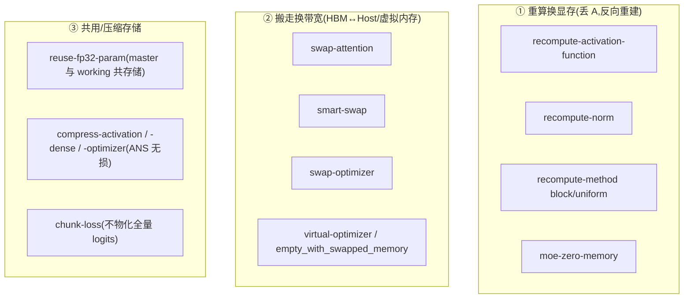

# MindSpeed 内存优化特性 — 省显存手段源码级分析

> **代码基线**:MindSpeed core `master` @ `1432cb09`(猴补丁 Megatron `core_r0.17.0`)· MindSpeed-LLM `master` @ `0c16322d` · 2026-06-23
> 本页只讲 MindSpeed 怎么把训练的**设备(NPU/HBM)显存占用降下来**:重计算、Swap 卸载、参数存储复用、MoE 零冗余、无损压缩、虚拟内存优化器、分块 loss。**每个特性按统一四件套拆解**:① 机制 ② before/after 图示 ③ `> [!tip] 优化点` callout(带省下的显存公式 / Δ)④ 源码解读(实际调用 + autograd,带 `file:line`)。每条非平凡结论的行号均经实际打开核对(路径相对各自仓库根:`mindspeed/...` 属 MindSpeed core,`mindspeed_llm/...` 属 MindSpeed-LLM)。
> **范围边界**:LayerZero / Custom-FSDP 的省显存来自参数/梯度分片,归 [[10_mindspeed_parallelism_analysis]];MoE 前反向重叠(fb-overlap)、通算掩盖归 [[11_mindspeed_comm_overlap_analysis]];融合算子(顺带省激活)归 [[13_mindspeed_ascend_affinity_analysis]]。本页只在交界处交叉引用。属 [[mindspeed/index]] 系列。

---

## 1. 总览

训练设备显存可拆成四项:**参数 P + 梯度 G + 优化器态 O + 激活 A**(外加瞬时缓冲):

$$
\begin{aligned}
M_{\text{device}} \;
&=\; \underbrace{M_P}_{\text{权重}} \;+\; \underbrace{M_G}_{\text{梯度}} \; \\
&\quad +\; \underbrace{M_O}_{\text{动量/master}} \;+\; \underbrace{M_A}_{\text{激活}} \; \\
&\quad +\; M_{\text{tmp}}
\end{aligned}
$$

其中 $M_A \propto b\cdot s\cdot h\cdot L$(随 batch×序列×层数线性涨),是长序列/深模型下的主峰;$M_O$(AdamW 下约 $2\sim3\times$ fp32 参数)是参数侧主峰。MindSpeed 的内存特性各自瞄准不同项,本质是三类思路:**重算换显存**(丢 $M_A$、反向重建)、**搬走换带宽**(D2H/H2D 或 NPU 虚拟内存,以 PCIe/HCCS 带宽换 HBM)、**共用/压缩存储**(同一块内存承载多份逻辑值,或无损压缩)。

| 特性 | 省的是哪一项 | 机制 | **优化点 Δ(省下的显存)** | 代价 |
|---|---|---|---|---|
| **重计算-激活函数** `--recompute-activation-function` | A(MLP 激活输出) | 丢 `act_out` 存储,反向 hook 重算 | $\Delta M_A\!\approx\! b\,s\,4h\cdot\text{sizeof}$ /层 | 一次激活函数前向 |
| **重计算-norm** `--recompute-norm` | A(LayerNorm 输出) | 丢 norm 输出,反向 hook 重算 | $\Delta M_A\!\approx\! b\,s\,h\cdot\text{sizeof}$ /norm | 一次 norm 前向 |
| **重计算-block(整层)** `--recompute-method block/uniform` | A(整层输入外的全部激活) | Megatron `checkpoint()` 逐层/分块 | 每重算层 ≈ 整层激活 − 层输入 | 一次整层前向 |
| **per-PP-rank 重计算层数** `--enable-recompute-layers-per-pp-rank` | A(调度重算粒度) | 改 `--recompute-num-layers` 语义为 PP-rank 计数 | 把重算配额均摊到各 chunk(无独立 Δ) | — |
| **smart-swap** `--smart-swap` | A | 自定义 NPU 分配器 + 运行时画像,自适应换出 | HBM 激活压到 `target_memory`/`reduction_memory` | D2H/H2D 带宽 + 画像步 |
| **swap-attention** `--swap-attention` | A(attention 段激活) | `saved_tensors_hooks` 异步 D2H,反向前预取 | 换出段激活在 fwd→bwd 间隙 HBM ≈ 0 | D2H/H2D 带宽 |
| **swap-optimizer** `--swap-optimizer` | O(+master P) | 优化器态常驻 pinned CPU,step 分块换入更新 | $M_O^{\text{peak}}\!\approx\! M_O/\texttt{swap\_times}$(默认 16) | D2H/H2D 带宽 |
| **reuse-fp32-param** `--reuse-fp32-param` | P(master+working 共存) | fp32 master = bf16(高半)+res(低半)共享存储 | $6\!\to\!4$ B/elem(省 $\tfrac13$) | 一点位重排开销 |
| **MoE-zero-memory** `--moe-zero-memory level0/1` | A(专家分发/中间激活) | 丢分发 token、mm1/激活输出,反向重算+重 dispatch | 专家激活峰值 ≈ 0(`tokens·h`×3 → 0) | 重算 + 重做 AllToAll |
| **compress-activation / -optimizer** | A / O | ANS(HANS)无损压缩,压缩态存 NPU 虚拟(host)内存 | ×`compress_ratio`(默认 0.5) | 压缩/解压算力 |
| **compress-dense** `--compress-dense level0/1` | A(dense MLP 激活) | 同上,按层异步压缩与 matmul 重叠 | ×0.5;level1 再换出尾数 | 压缩/解压算力 |
| **virtual-optimizer** `--virtual-optimizer` | O(exp_avg/exp_avg_sq) | `empty_with_swapped_memory` 把动量放可换页虚拟内存 | 预算内移出 $2\lvert P\rvert$ fp32 动量 | 按需缺页换页带宽 |
| **chunk-loss** `--loss-compute-mode chunk` | A(词表 logits) | 沿序列分块算 CE,前向即出梯度,不留全量 logits | $O(B\,S\,V)\!\to\! O(\text{chunk}\,V)$ | 串行分块 |
| **ckpt-acceleration** `--ckpt-acceleration` | 存盘瞬时显存/耗时 | 分布式 checkpoint 保存路径加速 | 削存盘瞬时峰值(非常驻 Δ) | — |



> [!tip] 优化点(全局共性原语)
> 上面三类手段最终都收敛到一个 PyTorch 原语:**`tensor.untyped_storage().resize_(0)`** ——前向把张量底层存储释放成 0 字节(但**保留** Python 张量对象与计算图节点),反向再 `resize_` 回去并由重算/换入/解压填回。它的妙处是:计算图拓扑不变(autograd 仍能找到该节点),省的纯粹是那段 HBM 字节。重计算、swap-attention、swap-optimizer、MoE-zero-memory、压缩五条线全部围绕它实现,差别只在"反向时谁来把字节填回"(重算 / H2D / 解码)。

---

## 2. 重计算(activation checkpointing)

**Thesis**:Megatron 原生整层 checkpoint 把"整层输入→整层输出"全段丢弃反向重算;MindSpeed 在此之上加了**选择性、细粒度**重算——只丢最贵又最易重算的激活(MLP 的激活函数输出、LayerNorm 输出),用**一次廉价前向**换回整段激活的显存,而非重算整层。

### 2.1 不存输出的 checkpoint:`CheckpointWithoutOutput`(共享原语)

细粒度重算的引擎是 `CheckpointWithoutOutput`(`mindspeed/core/memory/recompute/recompute_common.py:31-105`),与 PyTorch `torch.utils.checkpoint` 的关键差异:它**连前向输出张量的存储都不留**。

- `checkpoint()` 在 `torch.no_grad()` 下跑 `run_function` 拿到输出,并 `save_for_backward` 输入(`recompute_common.py:11-19`、`:54`)。
- `discard_output()` 对每个输出 `output.untyped_storage().resize_(0)`,**立即释放激活输出占的 HBM**(`recompute_common.py:61-63`)。
- 反向触发:对依赖该输出的下游张量 `register_hook(...recompute)`,反向回传到此处时 `recompute()` 恢复 RNG 状态、`enable_grad` 重跑 `run_function`,再把结果 `resize_` 回原存储并 `copy_` 填回(`recompute_common.py:65-105`、`:97-101`)。RNG 存/取(`:50-52`、`:78-80`)保证 dropout 等随机算子重算结果与前向一致。

**图示**(`resize_(0)` 时间线):

```
前向                                                反向
算 out ─用于下游─▶ discard_output()                 回传到此 ─▶ recompute()
                   out.storage().resize_(0)            恢复 RNG → enable_grad 重跑
                   (张量对象 / 计算图节点保留)          → resize_回原大小 → copy_ 填回
HBM: ▣▣▣ out 占用 ─▶ ░░░ 释放(fwd→bwd 整段空窗)─▶ ▣▣▣ 反向瞬时重建
```

> [!tip] 优化点(原语)
> 与 PyTorch 原生 checkpoint 相比,这里**连输出张量都不驻留**:原生 checkpoint 重算的是"输入→输出"整段并保留输出,本原语把**输出存储也归零**,只在反向那一刻才重建。代价仅是恢复 RNG + 一次 `run_function` 前向;只要 `run_function` 廉价(逐元素激活、norm),性价比就远高于整层重算。

### 2.2 激活函数级重算(MLP)

`--recompute-activation-function` 把 `MLP.forward` 换成 `core_activation_recompute_forward_impl`(feature:`mindspeed/features_manager/recompute/activation_function.py:33`)。其逻辑(`mindspeed/core/memory/recompute/activation/activation_recompute_forward.py:64-82`):正常路径直接算激活;重算路径用 `CheckpointWithoutOutput.checkpoint(activation_function, ...)` 算出 `intermediate_parallel` 喂给 `linear_fc2`,随后 `discard_output()` 丢掉激活函数输出(`:77`),并在 `output` 上挂 `recompute` hook(`:81-82`)——即**只丢 GLU/swiglu 的那块大激活**,反向用一次逐元素激活前向重建,几乎零算力代价却省下 MLP 中最大的中间张量。

**图示**:

```
默认 MLP(act_out 常驻到反向)                        重算 MLP(丢 act_out)
fc1 ─▶ act(swiglu)─▶[存 act_out: b·s·4h]─▶ fc2       fc1 ─▶ act ─▶ fc2 ─▶ discard_output(act_out)
            ▲ 反向直接读                                       反向: 一次 act 前向重建(无 matmul)
HBM 常驻: b·s·4h·sizeof / 层                          HBM 常驻: 0(仅反向瞬时占用)
```

> [!tip] 优化点(激活函数重算)
> GLU 门控下激活函数输入维是 `2·(2h)`、输出 `2h`,这块中间张量是 MLP 段激活的**最大项**。丢掉它,单层省下约
> $$
> \Delta M_A \;\approx\; b\cdot s\cdot 4h \cdot \text{sizeof(dtype)}\ \text{字节}
> $$
> 而重算代价只是一次**逐元素**激活函数(无 matmul、无 GEMM),故"性价比"远高于整层重算——同样省 `b·s·4h`,整层重算要付一整层 attn+MLP 的前向,激活级只付一个逐元素核。

### 2.3 Norm 级重算

`--recompute-norm` 把 `TransformerLayer.forward` 换成 `norm_recompute_forward_impl`(feature:`mindspeed/features_manager/recompute/norm_function.py:30-31`)。它对 `input_layernorm` 与 `pre_mlp_layernorm` 各建一个 `CheckpointWithoutOutput`(`mindspeed/core/memory/recompute/norm/norm_recompute_forward.py:61-66`、`:120-125`),attention/MLP 拿到 norm 输出后 `discard_output()` 并在其梯度上挂 `recompute`(`:84-86`、`:132-134`)。TransformerEngine 路径下还能把 norm 重算下推进 `linear_qkv`/`linear_fc1` 的融合算子(`:62-63`、`:121-123`)。

**图示**:

```
默认(norm 输出常驻)                                  重算 norm(丢 norm 输出)
x ─▶ norm ─▶[存 norm_out: b·s·h]─▶ attn/mlp           x ─▶ norm ─▶ attn/mlp ─▶ discard(norm_out)
                ▲ 反向直接读                                   反向: 一次 norm 前向重建
HBM 常驻: b·s·h·sizeof × 2(每层 2 个 norm)            HBM 常驻: 0(每层 2 个 norm 都丢)
```

> [!tip] 优化点(norm 重算)
> norm 输出与其输入**等大**(`[b,s,h]`),每层有 2 个 norm(attn 前、mlp 前),省下
> $$
> \Delta M_A \;\approx\; 2\cdot b\cdot s\cdot h \cdot \text{sizeof(dtype)}\ \text{字节 / 层}
> $$
> 重算只是一次 RMSNorm/LayerNorm(逐元素 + 一次 reduce)。TE 路径把重算**下推进** `linear_qkv`/`linear_fc1`(`:62-63`、`:121-123`),让 norm 与紧随的融合线性层共用一次重算,省掉单独的 norm 核启动。

### 2.4 选择哪些层重算:`should_recompute`

激活级与 norm 级共用同一选层函数 `should_recompute(config, layer_number, num_recompute)`(`recompute_common.py:108-142`)。机制要点:

- 计算当前层在其 chunk 内的"重算优先级" `recompute_priority = ((layer_number-1) % layer_per_chunk) * vpp_size + vpp_rank`(`:125`)。
- 若设了 `--recompute-num-layers`(整层全重算配额),优先级落在该配额内的层交给**整层重算**(返回 `False`,不走细粒度),其余层在 `[full, full+num_recompute)` 区间内做细粒度重算(`:128-137`)——即**整层重算与细粒度重算可叠加**,前 N 层整层、再后 M 层只重算激活/norm。
- `num_recompute is None` 表示该粒度对所有(剩余)层生效(`:139-140`)。

### 2.5 整层重算的 method 与 per-PP-rank 计数

`--recompute-method block` 把 `TransformerBlock._checkpointed_forward` 换成 `transformer_block_checkpointed_forward`(feature:`mindspeed/features_manager/recompute/recompute_method.py:17-21`;impl:`mindspeed/core/memory/common.py:73-203`):

- `uniform`:按 `recompute_num_layers` 步长,每个分块只 checkpoint 块首层输入(`common.py:147-156`)。
- `block`:逐层判断 `should_recompute()`,命中的层走 `checkpoint_handler`(`common.py:166-201`)。`reduce_recompute_for_last_chunk` 让 PP 最后一段最后一层不重算(`:183-190`),避免与反向首层撞峰。

`--enable-recompute-layers-per-pp-rank`(纯参数特性,`mindspeed/features_manager/recompute/enable_recompute_layers_per_pp_rank.py:11-15`)改变 `--recompute-num-layers` 的语义:开启后它表示**每个 PP-rank** 重算的层数,通过让 `should_recompute` 与 `transformer_block_checkpointed_forward` 取真实 `vpp_rank/vpp_size`(否则按 `vpp_rank=0,vpp_size=1` 折算,`recompute_common.py:120-123`、`common.py:169-172`),从而在 VPP 下把重算层均摊到各 model-chunk。

**图示**(per-PP-rank 把配额沿 chunk 交错摊开):

```
8 层 / 2 PP-stage / 2 VPP,层→stage:  Stage0=[0,1][4,5]  Stage1=[2,3][6,7]
recompute_num_layers=2 → 优先级 layer_idx·vpp_size+vpp_rank < 2
  Stage0 重算 {0,4}   Stage1 重算 {2,6}      ← 每 chunk 各摊 1 层,而非全压第一个 chunk
recompute_num_layers=3 → Stage0 {0,1,4}  Stage1 {2,3,6}
```

> [!tip] 优化点(整层重算 + 调度)
> 整层重算单层省得最多(≈ 整层激活 − 层输入),但重算代价也最大(一整层前向),故 MindSpeed 让它与激活/norm 细粒度重算**叠加**:`should_recompute` 的优先级区间 `[0,full)` 走整层、`[full, full+M)` 走细粒度(`recompute_common.py:128-137`),按"省得多但贵"→"省得少但便宜"分层下沉。per-PP-rank 把配额按 `layer_idx·vpp_size+vpp_rank` **交错**摊到各 model-chunk(`common.py:188-190`),避免重算峰值全压在第一个 chunk、与反向首层撞峰。

> [!example] 代码自带的分摊例子(`common.py:178-182`):8 层、2 PP-stage、2 VPP,层到 stage 的映射为 Stage0=`[0,1][4,5]`、Stage1=`[2,3][6,7]`。`recompute_num_layers=2` → 每 stage 重算 `{0,4}`/`{2,6}`;`=3` → 重算 `{0,1,4}`/`{2,3,6}`。即"优先级" `layer_idx*vpp_size+vpp_rank < recompute_num_layers` 把配额按 chunk 交错摊开(`common.py:188-190`)。

---

## 3. Swap 卸载(HBM ↔ Host)

**Thesis**:把暂时用不到的张量从 HBM 异步搬到 host 的 pinned 内存,需要时再搬回——以 D2H/H2D 带宽换 HBM 容量,关键是用独立 stream 把搬运与计算**重叠**,并精确卡在"前向算完即换出、反向用前才换入"。

### 3.1 swap-attention:按张量挂钩的激活换出

`--swap-attention` 复用自适应重计算框架,对允许的 Transformer 层注册预取(feature:`mindspeed/features_manager/memory/swap_attention.py:31-51`,默认换 `input_norm,self_attention,post_attention_norm`,见 `:17`)。核心搬运逻辑 `SwapTensor`/`SwapPrefetch`(`mindspeed/core/memory/swap_attention/prefetch.py`):

- 用 `torch.autograd.graph.saved_tensors_hooks(pack_hook, unpack_hook)` 包住层前向(`prefetch.py:235`)。前向每存一个激活触发 `pack_hook`:不够大/无梯度/非整存储的张量跳过(`no_swap_tensor`,阈值 `numel·elemsize·2 < 1 MiB`,`prefetch.py:123-136`),否则建 `SwapTensor` 并在预取 stream 上 `launch_d2h` 拷到 pinned CPU(`:41-53`、`:187`)。
- `wait_d2h_finished` 在 D2H 完成后 `tensor.storage().resize_(0)` 真正释放 HBM(`prefetch.py:62`)。
- 反向前 `unpack_hook`/`h2d` 在预取 stream 上 `launch_h2d`:先 `resize_(storage_size)` 再 `copy_` 回设备(`prefetch.py:66-81`、`:312-324`),`wait_h2d_finished` 同步后张量回到 `device` 态(`:84-90`)。
- 预取按层号提前发起(`h2d` 以 `layer_id + interval` 匹配,`prefetch.py:319`),让 H2D 与上一层反向计算重叠,隐藏带宽延迟。

**图示**:

```
前向(算完即换出)                                反向(用前预取换入)
attn 激活 ─launch_d2h(预取流)─▶ pinned host       layer_id+interval 提前 ─launch_h2d─▶ resize_+copy_
            wait_d2h ─▶ storage.resize_(0)           wait_h2d ─▶ 回 device 态;与上一层反向重叠
HBM: 激活在 fwd→bwd 间隙 = 0                       带宽: 每张激活走一趟 D2H + 一趟 H2D
```

> [!tip] 优化点(swap-attention)
> 把 attention 段激活在前向算完后**整段移出 HBM**,fwd→bwd 间隙内这些激活的 HBM 占用为 0;省下的显存 = 被换出层激活总量
> $$
> \Delta M_A \;\approx\; \sum_{\ell\in\mathcal{S}_{\mathrm{swap}}} b\cdot s\cdot h_\ell \cdot \operatorname{sizeof}
> $$
> 代价是把这块字节走一趟 D2H + 一趟 H2D。与重计算的取舍:**重算用算力换、swap 用 PCIe/HCCS 带宽换**;只搬 ≥1 MiB 且整存储的张量(`no_swap_tensor` 阈值,`prefetch.py:123-136`),小张量留 HBM 避免搬运得不偿失。预取靠 `layer_id+interval` 提前一层发起,让 H2D 被上一层反向计算掩盖,带宽延迟不上关键路径。

### 3.2 smart-swap:自定义分配器 + 运行时画像

`--smart-swap` 比 swap-attention 更"自动":它**替换 NPU caching 分配器**(`change_allocator()`,feature:`mindspeed/features_manager/memory/smart_swap.py:28-32`)并包住 `train_step`,由 C++ 的 `NPUSwapManager` 接管换入换出(`mindspeed/core/memory/smart_swap/swap_manager.py:56-70`,`OP_HOOK_ENABLE` + `swap_oom_enable`)。运行分三阶段:WARMUP → SEARCHING_POLICY → STABLE(`swap_manager.py:34-38`),先画像算子序列与张量生命周期,再搜出一套换出策略。

**图示**:

```
WARMUP ─画像─▶ SEARCHING_POLICY ─搜策略─▶ STABLE
opSeq 不稳定     opSeq 稳/可能 OOM,策略迭代    opSeq+策略都稳
                                              ┌ BETTER_PERFORMANCE: 只换激活,尽量重叠拷贝
策略偏好二选一 ──────────────────────────────┤
                                              └ BETTER_MEMORY_SAVING: 连优化器一起换(可能因 event 等待掉速)
OOM 时: target_memory 每步 -adjust_memory 自动收紧;< tensor_size_filter(20MiB)不入候选
```

策略偏好(`mindspeed/core/memory/smart_swap/swap_policy_config.py:5-17`):`BETTER_PERFORMANCE`(只换可换激活、尽量重叠拷贝)与 `BETTER_MEMORY_SAVING`(连优化器一起换、可能因 event 等待显著掉速)。目标显存可设 `target_memory`/`reduction_memory`,OOM 时按 `adjust_memory` 自动收紧(`swap_policy_config.py:47-59`);小于 `tensor_size_filter`(默认 20 MiB)的张量不入候选(`:55`)。

> [!tip] 优化点(smart-swap)
> 不像 swap-attention 按固定模块名换,smart-swap 通过**运行时画像 + 策略搜索**把 HBM 压到用户给定目标:
> $$
> \begin{aligned}
> M_{\text{HBM}}^{\text{target}} \;
> &=\; M_{\mathrm{device,max}} - M_{\mathrm{reduction}}\quad\text{或}\quad M_{\mathrm{target}}
> \end{aligned}
> $$
> OOM 触发时每步再 `-adjust_memory`(默认 300 MiB)自动收紧(`swap_policy_config.py:47-59`)。代价是 WARMUP/SEARCHING 的画像步开销,以及 `BETTER_MEMORY_SAVING` 下连优化器都换带来的 event 等待掉速——故它与 swap-attention / 自适应选择性重计算**互斥**(`smart_swap.py:19-23`),三者都要接管激活生命周期。

### 3.3 swap-optimizer:优化器态常驻 host,分块换入更新

`--swap-optimizer` 把 `DistributedOptimizer` 换成 `SwapDistributedOptimizer` 并替换 AdamW step(feature:`mindspeed/features_manager/optimizer/swap_optimizer_feature.py:39-42`,仅支持分布式优化器,`:20-29`)。机制(`mindspeed/core/optimizer/swap_optimizer/swap_optimizer.py`):

- 初始化时优化器态 `exp_avg/exp_avg_sq/max_exp_avg_sq`(及 fp16/bf16 的 master 拷贝)分配到 pinned CPU,设备侧 `storage().resize_(0)`(`swap_optimizer.py:62-79`),**常态下 HBM 不驻留优化器态**。
- step 时分块流水(`swap_adamw_step`,`:587-642`):以 `swap_numel = 总量 // swap_optimizer_times`(默认 16,`:48`)为粒度,在 `swap_to_device_stream` 上把一块参数+态换入(`swap_tensors_to_device`,`:117-131`),`npu_apply_fused_adamw_v2` 原地更新(`:632`),`copy_tensor_to_model_param` 写回模型权重,再在 `swap_to_host_stream` 上换出(`swap_tensors_to_host` + `resize_(0)`,`:141-155`、`:637-640`)。下一块换入与当前块计算重叠。

**图示**:

```
常态: 优化器态在 pinned host;HBM 侧 storage().resize_(0)
step 分 swap_optimizer_times(默认16)块流水:
  [换入块k]──▶[npu_apply_fused_adamw_v2 原地更新]──▶[copy 写回权重]──▶[换出块k + resize_(0)]
        ▲ 下一块换入(swap_to_device_stream)与本块计算重叠
HBM 瞬时: 只驻留 1/swap_times 的优化器态
```

> [!tip] 优化点(swap-optimizer)
> 优化器态在 HBM 的**瞬时**占用被压到约 `1/swap_optimizer_times`:
> $$
> M_O^{\mathrm{peak}} \;\approx\; \frac{M_O^{\mathrm{full}}}{n_{\mathrm{swap}}} \quad(n_{\mathrm{swap}}=16\text{，默认值})
> $$
> 对 7B+ 模型 AdamW 态(master+m+v ≈ 12 B/参数,即 `swap_num·12` 字节,见 `:50`),常驻 HBM 从数十 GB 降到 ~1/16。代价是每步把整套态过一遍 PCIe/HCCS:`swap_optimizer_times` 越大越省显存、但流水块越小、带宽利用率越低,是一个显存↔吞吐旋钮。与 `reuse_fp32_param` 互斥(`swap_optimizer_feature.py:21`):两者都重排 master/态的存储布局。

---

## 4. reuse-fp32-param

**Thesis**:混合精度分布式优化器里,同一份权重存了两遍——模型用的 bf16 working copy(2 B)与优化器的 fp32 master(4 B)。但 **fp32 的高 16 位恰好就是它截断成的 bf16**,低 16 位是残差。于是只存一块 `res(2B)+bf16(2B)=4B` 并把 working copy 视图成其高半,省掉那份独立的 2 B working copy。

**图示**:

```
普通混合精度(P 存两份)                  reuse-fp32-param(共享存储)
fp32 master  ▣▣▣▣ 4B  ┐                一块 bf16×2 缓冲 = 4B/elem
bf16 working ▣▣   2B  ┴ = 6B/elem       ├ 高半 bf16(pppp)  ← model_param.data 视图(working)
                                        └ 低半 res(残差)   → step 前 +res 重排回 fp32 master
fp32(0p0p0p0p) = bf16(pppp) ⊕ res(0000)  reuse_data_ptr 让三视图共享同一指针
```

机制(feature:`mindspeed/features_manager/memory/reuse_fp32_param.py:26-58`,要求 `--bf16`,`:17-24`;impl:`mindspeed/core/memory/reuse_param/`):

- 存储复用靠自定义算子 `reuse_data_ptr`(让多个张量共享同一底层指针),把 `shard_main_param_int32_view`、`res`、`bf16` 三个视图叠到同一块 `bf16×2` 缓冲上(`mindspeed/core/memory/reuse_param/adaptor.py:127-151` 单优化器版、`:154-189` 分布式版)。
- fp32↔(bf16+res)的**就地重排**由 `ConvertFp32BF16` 完成(`mindspeed/core/memory/reuse_param/reuse_optimizer.py:14-92`):注释 `fp32(0p0p0p0p) -> bf16(pppp) + res(0000)`(`:64`)说明——fp32 内存里"残差字 + 参数字"交错排列,通过 `view(-1,2).transpose(1,0).reshape(-1)` 把参数字聚到前半、残差聚到后半,得到连续的 bf16 working 视图(`:75-76`);反向重排(`view(2,-1).transpose(1,0)`,`:91`)即恢复 fp32。`TRANSPOSE_BF16_BIT=32768`(`:7`)用于在 int32 视图上标记"当前处于 bf16 布局还是 fp32 布局"。
- step 前后各做一次方向转换,使更新时是完整 fp32 master、前向时是 bf16 working,精度等价于普通混合精度。

> [!tip] 优化点(reuse-fp32-param)
> 利用"bf16 = fp32 截断高 16 位"的**位等价**,把 master(4B) 与 working(2B) 的 6 B/elem 折叠成共享的 4 B/elem:
> $$
> \begin{aligned}
> \underbrace{4}_{\text{fp32 master}}+\underbrace{2}_{\text{bf16 working}}
> &=6\ \text{B/elem}\;\longrightarrow\;\underbrace{2}_{\text{res}} \\
> &\quad +\underbrace{2}_{\text{bf16}}=4\ \text{B/elem}\quad(\text{省}\ \tfrac13)
> \end{aligned}
> $$
> 这是**无损**的(step 时重排回完整 fp32,精度与普通混合精度一致),代价仅一次 `view/transpose` 位重排。硬约束:依赖 bf16 高半=working 的位等价,故 **需 `--bf16`**、与 zero3 / fused_ema_adamw 互斥(`reuse_fp32_param.py:17-24`)。

---

## 5. MoE zero-memory

**Thesis**:MoE 专家段激活极贵(分发后的 token、上投影输出、激活输出都是 `tokens·h` 量级)。zero-memory 在前向**丢掉这些激活的存储**,反向时用保存的少量输入**重算**——其中 level0 连"token 分发(permute + AllToAll)"都重做,把激活峰值压到接近零。仅支持 `alltoall_overlap_comm` / `fb_overlap` 路径(feature:`mindspeed/features_manager/moe/moe_zero_memory.py:33-41`)。

机制在专家 GMM 的自定义 autograd(`mindspeed/core/transformer/moe/grouped_mlp_with_comp_and_comm_overlap_all2all.py:33-83` 前向 / `:85-` 反向):

- 前向:`mm1` 算完即 `inputs.untyped_storage().resize_(0)` 丢分发输入(`:50-51`);`level1` 再额外丢 `mm1_out`、`act_out` 存储并把待重算张量挂到 ctx(`:55-65`);凡需重算激活的层都丢 `act_out`(`:66-72`)。`save_for_backward` 据级别决定存不存 `inputs`(`:74-81`)。
- 反向:需要时用 `activation_func(act_inputs)` 重算激活(`:121-123`);`level0`(或 level1 的"仅重算激活"层)进一步**重做 token 分发**——重新 `permute` + `async_all_to_all` 把分发后的专家输入重建出来(`:139-156`、`:169-189`),用完即 `resize_(0)`。

**图示**:

```
默认专家 GMM(三段激活常驻)                        zero-memory(前向丢 + 反向重建)
permute─▶[inputs]─▶mm1─▶[mm1_out]─▶act─▶[act_out]─▶mm2   前向: 各步算完 resize_(0)
        ↑ 全部 tokens·h 量级,常驻到反向                    反向: act = activation_func(act_inputs) 重算
                                                          level0: 重做 permute + async_all_to_all 重建分发
HBM: ~3·(tokens·h)·sizeof                                 HBM: 专家激活峰值 ≈ 0
```

级别语义对照(`grouped_mlp_with_comp_and_comm_overlap_all2all.py:50-72`、`:139-189`):

| | 丢分发输入 `inputs` | 丢 `mm1_out` / `act_out` | 反向重算激活 | 反向重做 dispatch(permute+AllToAll) |
|---|---|---|---|---|
| **level0** | 是(`:50-51`) | 仅 `act_out`(`:72`) | 是 | **是**(`:139-189`) |
| **level1** | 是 | 是,额外丢 `mm1_out`+`act_out`(`:56`、`:64`) | 是 | 仅"只重算激活"的层 |

`--moe-zero-memory-num-layers` 限定 level1 激进丢弃只作用在每 PP-stage 的前若干层(`moe_zero_memory.py:21-23`);共享专家走 `zero_memory_shared_expert_mlp_forward`(`mindspeed/core/transformer/moe/moe_feature/overlap/experts.py:126-133`)。

> [!tip] 优化点(MoE zero-memory)
> 专家段三块激活 `inputs / mm1_out / act_out` 各是 `tokens·h` 量级(`tokens` = 路由后本地 token 数,含容量因子放大),全丢后**专家激活峰值 ≈ 0**:
> $$
> \begin{aligned}
> M_A^{\text{expert}} \;:\;
> &\sim 3\cdot(\text{tokens}\cdot h)\cdot\text{sizeof}\;\longrightarrow\;\approx 0\ (\text{仅反向瞬时重建})
> \end{aligned}
> $$
> level0 比 level1 更激进——连"分发"本身(`permute`+`AllToAll`)都不存、反向重做,故必须与通算重叠路径(`alltoall_overlap_comm`/`fb_overlap`)配合,把重做的 AllToAll 通信掩盖进反向计算才划算。代价:level0 多一次 AllToAll 通信重做(`:139-189`)。

---

## 6. 压缩(ANS 无损)

**Thesis**:激活/优化器态是浮点,尾数高熵但指数低熵——用 NPU 原生 **HANS(华为 ANS,Asymmetric Numeral System)无损编码**(`torch_npu.npu_hans_encode/decode`)压缩存储,压缩态放进 `empty_with_swapped_memory` 的虚拟(host 后备)内存,需要时解码。无损 → 不影响精度,代价是编解码算力(用副流与计算重叠)。

### 6.1 compress-dense(dense MLP 激活)

`--compress-dense level0/1` 换 `MLP.forward` 为压缩版(feature:`mindspeed/features_manager/compress_dense/compress_dense.py:25-28`,需 PTA 支持 `npu_hans_encode/decode` 与 `empty_with_swapped_memory`,且与激活函数重算互斥,`:17-23`)。机制(`mindspeed/core/memory/compress_dense/compress_tensor.py`):

- `CompressTensor.encode()` 调 `npu_hans_encode` 把激活拆成 `pdf`(256 桶直方图,`:111`)、`mantissa`(尾数)、`fixed`(定长压缩流)、`var`(`:57-68`),`wait_encode` 后 `tensor.untyped_storage().resize_(0)` 释放原激活(`:70-72`);反向 `decode()` 先 `resize_` 回原大小再 `npu_hans_decode` 填回(`:74-84`)。
- 压缩率默认 `compress_ratio=0.5`(`:113`)。`level1` 比 `level0` 多一步:把尾数 `mantissa` 也换出到 swap 虚拟内存(`swap_mantissa = compress_dense=="level1"`,`:266`),进一步省 HBM。
- 用副流 `hans_stream` 异步编解码,并在 MLP 前向里穿插"压上一层、等解压上一层",与 `linear_fc1/fc2` 重叠(`mindspeed/core/memory/compress_dense/mlp_forward.py:18-51`、`compress_tensor.py:271-314`)。

**图示**:

```
默认(激活全量驻 HBM)                       compress-dense(HANS 编码)
act ─▶[存 act 全量: |act|]                  act ─npu_hans_encode(副流)─▶ pdf+mantissa+fixed+var ─▶ resize_(0)
                                            反向 ─resize_+npu_hans_decode─▶ 还原 act(无损)
HBM: |act|                                  HBM: ~compress_ratio·|act|(默认 0.5);level1 再换出 mantissa
```

> [!tip] 优化点(compress-dense)
> 无损压缩把每块激活的 HBM 占用按压缩率缩小:
> $$
> M_A^{\mathrm{compressed}} \;\approx\; r_{\mathrm{compress}}\cdot M_A \quad(r_{\mathrm{compress}}=0.5\text{，默认值，即省一半})
> $$
> `level1` 再把尾数 `mantissa` 换出到 `empty_with_swapped_memory` 虚拟内存(`:266`),HBM 进一步下探。与重算/swap 的区别:**无损、不重算、不搬全量**——只搬压缩后的字节,且编解码在副流 `hans_stream` 上与 `linear_fc1/fc2` 重叠(`mlp_forward.py:18-51`),算力代价被计算掩盖。代价是编解码算力 + 与"激活函数重算"互斥(二者都改 `MLP.forward`,`compress_dense.py:17-23`)。

### 6.2 compress-activation / compress-optimizer(通用)

`--compress-activation` 用 `CompressHook(saved_tensors_hooks)` 接管整层激活(`mindspeed/core/memory/compress/compress_activation.py:396-429`),并把 `matmul/allgather/all2all` 包成"异步算子"以估时调度压缩任务(`:226-265`),按 `plan` 在算子空隙内压/解一批张量(`:340-393`)。`--compress-optimizer` 则对 AdamW 一二阶动量做 HANS 压缩(`mindspeed/core/memory/compress/compress_optimizer.py:14-60`),`update()` 时 `encode_state` 编码、`recover()` 时 `decode_state` 解码,`statistic` 每 100 步重统计一次 PDF(`:50-59`)。

> [!tip] 优化点(compress-activation / -optimizer)
> 同一套 HANS 无损编码,瞄准不同项:`compress-activation` 压**激活**(按 `plan` 塞进 `matmul/allgather/all2all` 的算子空隙,`:226-265`、`:340-393`,让压缩与通算/计算并行),`compress-optimizer` 压**优化器一二阶动量** `exp_avg/exp_avg_sq`,二者都 ×`compress_ratio` 缩小常驻 HBM。compress-optimizer 每 100 步重统计 PDF(`:50-59`)以适应动量分布漂移、保持压缩率;需 HANS + swap 内存、与 fused_ema_adamw 互斥(`compress/compress.py:49-55`)。

---

## 7. virtual-optimizer 与 ckpt 加速

### 7.1 virtual-optimizer:把动量放进 NPU 可换页虚拟内存

**Thesis**:不手写 D2H/H2D,而是用 `torch_npu.empty_with_swapped_memory` 申请一块**由 host 后备、NPU 按需缺页换页**的"虚拟"张量来存优化器动量。在用户给定的换出预算内,`exp_avg/exp_avg_sq` 不占 HBM;预算耗尽则回退普通 HBM 分配。

`--virtual-optimizer` 接收一个按 PP-rank 的换出量列表(`all` = 65 GB,feature:`mindspeed/features_manager/optimizer/virtual_optimizer.py:18-37`,需新版 PTA)替换 AdamW step(`mindspeed/core/optimizer/virtual_optimizer/adaptor.py:15-21`)。机制(`mindspeed/core/optimizer/virtual_optimizer/virtual_adam.py`):

- `VirtualAllocator` 按 `pp_rank` 取本 rank 的换出预算(`get_swap_memory_size`,`virtual_adam.py:102-115`),state 初始化时 `init_exp(p)` 用 `get_swap_memory` 申请 swapped 张量并打 `swap_tensor` 标记、累减预算(`:151-168`);超预算时 `get_npu_memory` 退回 `torch.zeros_like`(`:135-138`、`:173-180`)。
- 因为 swap 张量参与 `.copy_/.cpu/.clone/.detach` 等需特判,feature 还猴补丁了这些 `torch.Tensor` 方法以正确处理标记张量(`virtual_optimizer.py:52-105`)。
- 与 swap-optimizer 的区别:swap-optimizer 是**显式分块** D2H/H2D + 自管 pinned 缓冲;virtual-optimizer 把换页交给 **PTA/驱动的虚拟内存**,代码更轻,粒度由硬件缺页决定。

**图示**:

```
普通 HBM 动量                              virtual-optimizer
exp_avg/exp_avg_sq ─▶ HBM 常驻             empty_with_swapped_memory ─▶ host 后备张量(打 swap_tensor 标记)
2×|P| fp32                                NPU 按需缺页换页;预算内不占 HBM,超预算回退 zeros_like(HBM)
HBM: 2×|P|×4B                              HBM: max(0, 2|P|×4B − 本 rank 预算)
```

> [!tip] 优化点(virtual-optimizer)
> 把 AdamW 两个动量 `exp_avg/exp_avg_sq`(各 `|P|` fp32 = 4B/elem)移进虚拟内存,预算内 HBM 占用归零:
> $$
> \begin{aligned}
> M_O^{\text{HBM}} \;
> &\approx\; \max\big(0,\ 2\lvert P\rvert\cdot 4 - B_{\mathrm{swap},r_{\mathrm{PP}}}\big)\ \text{字节}
> \end{aligned}
> $$
> `--virtual-optimizer all` 取每 rank 上限 65 GB(`virtual_optimizer.py:18-20`)。相比 swap-optimizer 更轻量——**不写显式 D2H/H2D 流水**,换页交给 PTA/驱动,粒度由硬件缺页决定。代价:缺页换页带宽不可控(无法像 swap-optimizer 那样按块重叠)、依赖新版 PTA、与 fused_ema_adamw 互斥(`virtual_optimizer.py:35-39`)。

### 7.2 ckpt-acceleration:存盘路径加速

`--ckpt-acceleration`(level-0 特性,`mindspeed/features_manager/ckpt_acceleration/ckpt_acceleration.py:21-32`)补丁 `megatron.core.dist_checkpointing.save` 及 Torch DCP 的 `_validate_global_plan` / 分片校验(`save_wrapper` 等,`mindspeed/core/dist_checkpointing/checkpoint_adaptor.py`),放宽/加速分布式 checkpoint 的保存与校验路径。

**图示**:

```
默认存盘                                    ckpt-acceleration
save ─▶ _validate_global_plan(全局校验)      save_wrapper ─▶ 跳过/放宽 _validate_global_plan + 分片重叠校验
     ─▶ 分片不重叠校验 ─▶ 落盘                            ─▶ 落盘
瞬时显存/耗时 ↑(校验物化)                    瞬时显存/耗时 ↓
```

> [!tip] 优化点(ckpt-acceleration)
> 与上面常驻显存优化**正交**:它削的是分布式 checkpoint **存盘时的瞬时显存峰值与耗时**(校验路径物化的临时张量),不改训练步的常驻 P/G/O/A,故无常驻 Δ 公式——收益体现在 save 时的瞬时占用与墙钟,这里仅作归类登记。

---

## 8. chunk-loss(不物化全量词表 logits)

**Thesis**:LM head 输出 `[B·S, V]` 的 logits,大词表下这块比模型本体激活还大。chunk-loss 沿序列维分块算交叉熵,**前向里就把每块的梯度算出来累加**,再丢掉该块 logits——全量 logits 张量从不为反向保留,峰值从 $O(B\!\cdot\!S\!\cdot\!V)$ 降到 $O(\text{chunk}\!\cdot\!V)$。

`--loss-compute-mode chunk` + `--loss-chunk-size`(默认 1024)开启(feature:`mindspeed_llm/features_manager/memory/chunk_loss.py:20-25`)。核心是自定义 autograd `ChunkLoss`(`mindspeed_llm/core/models/common/chunk_loss.py:8-97`):

- 前向 `torch.split(hidden_states, chunk_size, dim=1)` 沿序列维分块(`:58-59`);每块用 `torch.func.grad_and_value(loss_forward, argnums=(0,1), has_aux=True)` 一次性拿到"对 hidden / 对 head_weight 的梯度"和"loss 值"(`:66-68`),累加 loss、写入预分配的 `grad_inputs`/`grad_weight`(`:71-73`),块 logits 随即可回收。
- `ctx.save_for_backward(grad_inputs, grad_weight)`(`:76`);反向只把已算好的梯度按上游标量缩放返回(`:92-97`),不再触碰 logits。

**图示**:

```
默认(物化全量 logits)                       chunk(逐块算梯度即丢)
hidden ─head─▶[B·S, V] logits ─▶ CE          for 块: hidden_k ─head─▶[chunk·V] ─grad_and_value─▶ 累加 grad
        ▲ 反向保留全量 logits                        块 logits 立即回收;反向只缩放预存梯度
HBM 峰值: B·S·V·sizeof                        HBM 峰值: chunk·V·sizeof
```

> [!tip] 优化点(chunk-loss)
> 把"先物化全量 logits 再算 loss"改成"逐块算梯度即丢",词表 logits 显存峰值从全量降到一个 chunk:
> $$
> \begin{aligned}
> M_A^{\text{logits}} \;:\; O(B\cdot S\cdot V)\;
> &\longrightarrow\;O(\texttt{chunk}\cdot V)\quad(\texttt{chunk}\text{ 默认 }1024)
> \end{aligned}
> $$
> 关键在 `torch.func.grad_and_value`:它在前向就**一次性**算出对 hidden 与 head_weight 的梯度(`:66-68`),把梯度写进预分配缓冲后该块 logits 立即可回收,反向只做一次上游标量缩放(`:92-97`)、不再触碰 logits。代价:分块串行 + 重复进出 head 线性层,换来词表 logits 峰值线性可控——大词表(V≈128K+)下这块往往比模型本体激活还大,收益显著。

> **跨框架对照** [[24_megatron_linear_cross_entropy_analysis]]:Megatron 的等价物是 `cross_entropy_fusion_impl='linear'` 融合线性 CE——同样"不物化全量 logits",但走**词表维 kernel 分块**(CuTe 融合核 + online-softmax + 反向重算,仅 Blackwell)而非这里的**序列维框架层 autograd 分块**(纯 PyTorch、可移植 NPU)。两者与 Flash-Attention 同属"online-softmax + 不物化大矩阵 + 反向重算"家族。

> 对比 [[32_distributed_optimizer_deepdive]]:reuse-fp32-param / swap-optimizer / virtual-optimizer 都作用在分布式优化器的 master 与态布局上,理解它们前先读懂 Megatron 分布式优化器如何分片 P/G/O 最有效。

---

## 9. 特性组合与互斥(从 validate_args 读出)

这些内存特性多数会**接管同一份资源的生命周期**(激活的 saved-tensor 钩子、优化器态的存储布局),因此存在硬约束。下表全部来自各 feature 的 `validate_args`,是配置时的实测红线:

| 约束 | 含义 | file:line |
|---|---|---|
| smart-swap ⊥ 自适应选择性重计算 | 二者都接管激活换出 | `memory/smart_swap.py:19-23` |
| swap-attention ⊥ 自适应重计算 / 自适应内存优化 / LoRA | 钩子冲突 | `memory/swap_attention.py:20-29` |
| swap-optimizer ⊥ reuse-fp32-param;**需**分布式优化器 | 都重排 master/态存储 | `optimizer/swap_optimizer_feature.py:20-29` |
| reuse-fp32-param **需** `--bf16`;⊥ zero3 / fused_ema_adamw | 依赖 bf16 高半=working 的位等价 | `memory/reuse_fp32_param.py:17-24` |
| virtual-optimizer ⊥ fused_ema_adamw;需新版 PTA | 依赖 `empty_with_swapped_memory` | `optimizer/virtual_optimizer.py:35-39` |
| compress-dense ⊥ recompute-activation-function;需 HANS | 二者都改 `MLP.forward` 省激活 | `compress_dense/compress_dense.py:17-23` |
| compress-optimizer ⊥ fused_ema_adamw;需 HANS+swap 内存 | — | `compress/compress.py:49-55` |
| moe-zero-memory **需** alltoall-overlap-comm 或 fb-overlap | 重算依赖通算重叠路径 | `moe/moe_zero_memory.py:33-34` |

可叠加的典型组合:**整层重算 + 激活/norm 细粒度重算**(§2.4 的优先级区间天然分层叠加)、**reuse-fp32-param + 激活重算 + swap-attention**(分别打 P、A、A 三项,互不接管对方资源)。

---

## Related Pages

- [[mindspeed/index]] — MindSpeed × MindSpeed-LLM 特性总罗盘(四大类入口)
- [[10_mindspeed_parallelism_analysis]] — 并行划分(LayerZero/Custom-FSDP 的分片省显存在此)
- [[20_mindspeed_context_parallel_analysis]] — 上下文并行(长序列下激活主峰 $M_A$ 的另一条压法:沿序列切分)
- [[11_mindspeed_comm_overlap_analysis]] — 通算掩盖(MoE fb-overlap、swap/压缩用到的副流重叠思想)
- [[13_mindspeed_ascend_affinity_analysis]] — 昇腾亲和(融合算子、HANS/empty_with_swapped_memory 等 PTA 能力;swap-optimizer 复用其融合优化器核)
- [[32_distributed_optimizer_deepdive]] — Megatron 分布式优化器 P/G/O 分片(reuse/swap/virtual optimizer 的基底)
- [[megatron-lm/index]] — 被补丁的宿主:原生重计算与混合精度优化器实现
