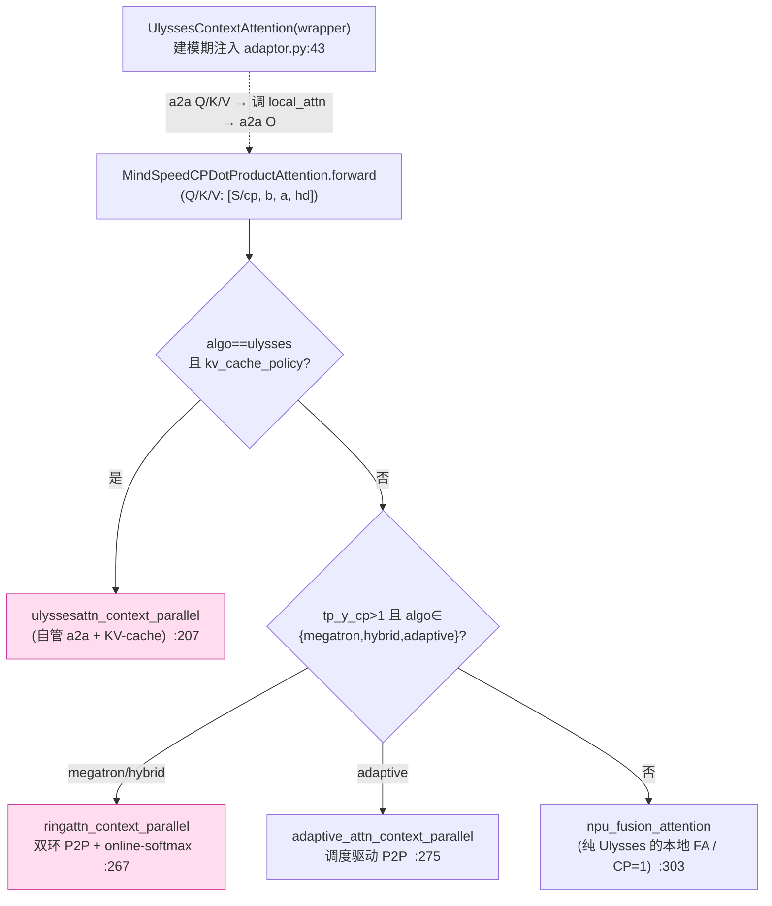

# MindSpeed 上下文并行(Context Parallel)深度解析

> **代码基线**:MindSpeed core `master` @ `1432cb09`(猴补丁 Megatron `core_r0.17.0`)· 2026-06-23
> 本页只讲 MindSpeed 的 **CP 家族**:运行期怎么把 attention 分派到 Ulysses / Ring(双环)/ Hybrid / Adaptive / KV-cache 五条路,每条路在卡间搬什么、按因果性怎么裁剪、通信量与序列长度 $S$/CP 度的代数关系、各自的约束与选型。**每个 CP 变体都按统一四件套拆解**:① 机制 ② 卡间数据流 / before-after 图示 ③ `> [!tip] 优化点` callout(量化收益)④ 源码解读(实际调用 + autograd + `file:line`)。行号均经实际打开核对。
> 属 [[mindspeed/index]] 系列;并行总览见 [[10_mindspeed_parallelism_analysis]](本页是其 §2 CP 一节的深挖展开)。Megatron 原生 CP 对照见 [[13_megatron_cp_analysis]];通算掩盖(send-recv overlap)归 [[11_mindspeed_comm_overlap_analysis]]。亲和 FA 核(`npu_fusion_attention`)见 [[13_mindspeed_ascend_affinity_analysis]]。
>
> **划界声明**:CP/Ring Attention 通用机制(为什么切序列、折叠/头尾负载均衡的数学证明、因果块裁剪、Ring 单环主循环 + online-softmax、Ulysses 换轴机制与通信量代数、分层混合的分组构造、RoPE 位置编码切分不变量)已归一到 [[../../../01_theory/06_distributed_parallelism/20_ring_attention_and_context_parallel_analysis|20_ring_attention_and_context_parallel_analysis]]——本页多处正是该理论页对应章节(§3.3 负载均衡定量证明、§3.5 位置编码不变量、§4.1 因果三分支裁剪、§5.2 在线 softmax 公式、§7 Ulysses 全套机制、§8.1/§8.3 分层混合)的骨架来源。**本页只保留 MindSpeed 独有的框架实现差异**:五算法运行期分派脊柱、Ring 的**双环(outer/inner window)**结构与反向双 dKV 环、**Adaptive CP**(调度驱动、rank 重映射)、**KV-cache CP**(显存换反向通信)—— 这四项在其它三个框架页均不存在;此外还有各算法的源码级实现细节(GQA 头补齐、变长 a2a、CP×TP-2D 合并域等)。

---

## 0. 总览

### 0.1 CP 是什么 · MindSpeed 怎么做

MindSpeed **不重写 Megatron 的 CP 框架**,而是用 `ContextParallelFeature` 把 Megatron 的 `DotProductAttention` 整类替换成 `MindSpeedCPDotProductAttention`,在其 `forward` 里**运行期分派**到五套自研搬运策略,通过 `--context-parallel-algo` 选择。CP 通用动机(attention 的 $O(S^2)$ 墙)见理论页 §1。

> 与 Megatron 把 `cp_comm_type` 透传给 TransformerEngine 内核不同,MindSpeed 的 CP 内核**全在 PyTorch+`npu_fusion_attention` 层自己实现**(`mindspeed/core/context_parallel/`),因为昇腾 NPU 没有 TE 的 CP 路径——`CPDotProductAttentionImpl.__init__` 干脆把 `config.context_parallel_size` 临时置 1 再调父类,并断言"CP 不走 TE 原生路径"(`dot_product_attention.py:52-58`)。

### 0.2 记号约定

| 符号 | 含义 |
|------|------|
| $cp$ | CP 度(`--context-parallel-size`) |
| $S$ | 全局序列长度;每卡持有 $S/cp$ |
| $b$ / $h$ / $hd$ | micro-batch / hidden / head dim($h=a\cdot hd$) |
| $a$ / $a_{kv}$ | 注意力头数 / KV 头数(GQA 时 $a_{kv}<a$) |
| $TP$ | 张量并行度(头先被 TP 切,CP 在 $a/TP$ 头上再操作) |
| $u$ / $r$ | Hybrid 下 ulysses 子度 / ring 子度($cp=u\cdot r$) |
| `cp_window` | 双环窗口大小(`--cp-window-size`),须整除 ring 度 |

### 0.3 五种算法横向对比(末列为优化点速览)

| 算法(`--context-parallel-algo`) | 卡间原语 | 序列分区 | 关键约束(已核对) | 适用 | 内核入口 | 优化点速览(量化) |
|------|---------|---------|---------|------|------|------|
| `ulysses_cp_algo` | 头维 **all-to-all** ×4 | $S/cp$ → 换成 $a/cp$ 头 | `seq%cp==0`、`a%(cp·TP)==0` | 同节点高带宽、头数足 | `ulysses_context_parallel.py:159` | 通信 $\propto h$,4 次大块 a2a;MHA、$cp{>}2$ 比 Ring 省 |
| `megatron_cp_algo`(Ring/双环) | KV 块环形 **P2P** | $S/cp$(2·cp 段配对) | `seq%(2cp)==0`、`cp_window∈[1,cp)` 整除 cp | 通用、跨节点容忍 | `ring_context_parallel.py:1231` | 通信 $\propto h_{kv}$,$cp{-}1$ 步 P2P **全被 FA 计算掩盖**;因果块裁剪砍 ~50% 算量 |
| `hybrid_cp_algo` | 内 all-to-all × 外 P2P | $u\times r$ 二维 | `r=cp/u>1`、`a%(u·TP)==0` | 超大 CP、跨节点 | `model_parallel_utils.py:59` | a2a 只走节点内高带宽;跨节点流量降到 $2(r{-}1)$ 步可掩盖 P2P |
| `adaptive_cp_algo` | 调度驱动 batch-P2P | 重调度 + rank 重映射 | `seq%cp==0`、不规则掩码 | 变长/稀疏 EoD 掩码 | `adaptive_context_parallel.py:50` | 按真实算量重排,把最重 straggler 拉平;通信随掩码稀疏度,可同时搬 Q/KV |
| `kvallgather_cp_algo` | KV all-gather | 走 megatron-cp 切法 | 仅 `causal` 掩码 | causal 短窗、调试 | 复用 megatron-cp 切分 | 1 次 allgather、无 online-softmax;以"物化全 KV"换实现最简 |

> **一个易踩的源码事实**:这五个名字**不在同一处声明**。`ContextParallelFeature` 的 `choices` 只列 `megatron_cp_algo / hybrid_cp_algo / hybrid_adaptive_cp_algo / kvallgather_cp_algo`(`context_parallel_feature.py:21-23`);`ulysses_cp_algo` 与 `adaptive_cp_algo` 是 **Ulysses / Adaptive 两个独立 feature 用 `add_parser_argument_choices_value` 追加**进同一个 `--context-parallel-algo` 的(`features_manager/.../ulysses_context_parallel.py:15-19`、`adaptive_context_parallel.py:14-18`)。要全集合,必须同时启用这几个 feature。

正交叠加项不是独立算法:**KV-cache CP**(§7,显存换反向通信)与 **2·cp 因果负载均衡**(§2,所有因果算法的共同地基,机制见理论页 §3.3)可叠加在上五者之上,各自的量化优化点见对应节。

---

## 1. 分派脊柱:`CPDotProductAttentionImpl.forward`(MindSpeed 独有架构)

整个 CP 家族的运行期总开关是 `dot_product_attention.py:134-322`。它先确定 `tp_y_cp_sz`(2D-TP 下取 `TensorParallelYUnionCP` 合并域,否则取 `context_parallel_size`,`:185-189`),再三段式分派:



三段式分派(脊柱)逐段:

```python
# dot_product_attention.py:191-209 —— 分支 ①:Ulysses + KV-cache
if (cp_size > 1 and algo == "ulysses_cp_algo" and config.context_parallel_kv_cache_policy):
    self.ulysses_comm_para['cache_policy'] = get_cache_policy(...)      # 本层缓存策略
    output = ulyssesattn_context_parallel(query, key, value, attn_para, self.ulysses_comm_para)
    return output
# :210 —— 分支 ②:Ring / Hybrid / Adaptive(都需要环形或调度 P2P)
if tp_y_cp_sz > 1 and algo in ['megatron_cp_algo','hybrid_cp_algo','adaptive_cp_algo','hybrid_adaptive_cp_algo']:
    cp_para = {...cp_group, cp_size, rank, cp_global_ranks...}
    if algo in ['megatron_cp_algo','hybrid_cp_algo']:
        cp_para['cp_inner_ranks']  = get_ring_ranks_for_intra_window()   # 双环:窗口内  :258
        cp_para['cp_outer_ranks']  = get_ring_ranks_for_inter_window_kv()# 双环:窗口间 KV 环  :259
        cp_para['cp_dkv_outer_ranks'] = get_ring_ranks_for_inter_window_dkv()  # 反向 dKV 环  :260
        output = ringattn_context_parallel(query, key, value, n_head, cp_para, scale, ...)   # :267
    else:
        cp_para['scheduling_info'] = get_scheduling_info()
        output = adaptive_attn_context_parallel(query, key, value, n_head, cp_para, ...)      # :275
else:
    # :286-316 —— 分支 ③:纯 Ulysses(无 cache)/ CP=1 → 直接落 npu_fusion_attention(:303)
    output = torch_npu.npu_fusion_attention(query, key, value, n_head, shape_order, ...)
```

**这里的调用关系有些反直觉**：`else` 分支（`:303`）中的“纯 Ulysses”看起来没有执行任何跨卡通信。原因是 4 次 all-to-all 并不在这里发生；系统早在**建模阶段**就通过 `attention_init_wrapper` 注入了一层 `UlyssesContextAttention`，用于包装 `core_attention`（`adaptor.py:43`）。运行时，`UlyssesContextAttention.forward` 先执行 a2a，再调用 `self.local_attn`（即当前的 `forward`）计算本地 FA。因此：

- **纯 Ulysses**:a2a 在外层 wrapper,内层 `forward` 走 `:303` 的 plain FA;
- **Ulysses+KV-cache**:wrapper 检测到 `use_custom_ulysses_backward` 直接调 `local_attn`(`ulysses_context_parallel.py:172-179`),把通信让给 `:207` 的自定义 autograd `ulyssesattn_context_parallel` 自己管;
- **Ring/Hybrid/Adaptive**:无 wrapper,通信全在 `:267`/`:275` 的内核里。

> patch 侧还有个分流:`kvallgather` 与 `ulysses` 把 `TEDotProductAttention` 替成轻量 `MindSpeedTEDotProductAttention`,其余算法替成完整 `MindSpeedCPDotProductAttention`(`context_parallel_feature.py:106-111`)。

> **`sparse_mode` 的就地设定**:`forward` 开头按掩码类型给 `config.sparse_mode` 赋值——causal → `2`(`dot_product_attention.py:147`),`reset_attention_mask` 的 general 掩码 → `2`,但若开了 CP 且非 ulysses 则改 `1`(`:149-153`),`no_mask` → `0`(`:180-181`)。这个码直接喂给 `npu_fusion_attention` 选 mask 形态,是 CP 内核与亲和 FA 核(见 [[13_mindspeed_ascend_affinity_analysis]] §3.5)的接口约定。

> **CP × TP-2D 的合并域**:开 `tp_2d` 且 `tp_y>1` 时,CP 不再是独立通信域,而是与 TP 的 y 方向合成一个 `TensorParallelYUnionCP` 联合组——`tp_y_cp_sz = cp·tp_y`(`dot_product_attention.py:185-189`、`adaptor.py:30-33`)。此时序列切分也要按 `2·tp_y_cp_sz` 配对再 reshape 回 `[cp, s/cp]`(`get_batch_utils.py:206-241`),Ulysses 的 a2a 组取 `tp_y_cp.group`、Ring 走 `tp_y_cp.overlap_group`(`dot_product_attention.py:218-222`、`:247-248`)。这是 CP 与 TP-2D 正交叠加时唯一需要"换组"的地方,四框架中仅 MindSpeed 有这一耦合。

---

## 2. 序列切分:MindSpeed 的分派实现

> 折叠/头尾配对的数学证明(为什么早+晚配对能消除 straggler)、量化算例均已归一到理论页 §3.3(本页正是该节骨架来源之一);RoPE 位置编码切分不变量已归一到理论页 §3.5。本节只保留 MindSpeed 按算法分派切分逻辑的源码实现。

序列怎么切到 rank,在 `get_batch_on_this_cp_rank`(`get_batch_utils.py:89-137`),按算法分派到 ulysses(顺序切)、megatron-cp(2×切)、EoD padding、general 等变体(`:112-137`)。

`_get_batch_on_this_cp_rank_in_megatron_cp` 把序列 view 成 $2cp$ 段、`index_select` 出早晚两段(`get_batch_utils.py:244-263`):

```python
# get_batch_utils.py:252-260
val = val.view(*val.shape[0:seq_dim], 2 * cp_size, val.shape[seq_dim] // (2 * cp_size), ...)
index = torch.tensor([cp_rank, (2 * cp_size - cp_rank - 1)], device=val.device)  # ← 早块+晚块配对
val = val.index_select(seq_dim, index)
```

Ulysses 因为 attention 时已聚成全序列,用顺序 `chunk` 即可(`_get_batch_on_this_cp_rank_in_ulysses_cp`,`:266-277`);kvallgather 直接复用 megatron-cp 的 2·cp 切法(`:135-136`);2D-TP 走 `_get_batch_on_this_tp_y_cp_rank_in_megatron_cp` 按 `2·tp_y_cp` 配对(`:206-241`);EoD-padding 逐子序列各自 2·cp 配对(`_get_batch_on_this_cp_rank_in_megatron_cp_eod_padding`,`:140-177`)。

> **位置编码切分的镜像实现**(不变量见理论页 §3.5):`get_pos_emb_on_this_cp_rank`(`rotary_pos_embedding_utils.py:15-47`)按算法逐一镜像上面的 token 切分逻辑——megatron-cp 走同一套 `[cp_rank, 2cp-1-cp_rank]` 的 2·cp 配对(`:50-61`),ulysses 走顺序 `chunk`(`:91-96`),hybrid 先按 ring 度做 2·r 配对再按 ulysses 度 chunk(`:99-116`),adaptive 则用 `remapped_seq_order` 重排索引(`:131-142`)。

---

## 3. Ulysses —— MindSpeed 的实现细节

> 头维 all-to-all 换轴的机制、形状流转、通信量代数($V_{ulysses}$ 及其与 $V_{ring}$ 的比值)均已归一到理论页 §7(本页正是该节骨架来源)。本节只保留理论页未展开的两处 MindSpeed 特有源码分支。

### 3.1 `single_all_to_all` 的二分支实现

`single_all_to_all` 自身按散射轴二分支:`scatter_idx<2`(散序列维)直接 reshape;`scatter_idx>=2`(散头维,Ulysses 走这支)先把头维转到第 0 轴再 `all_to_all_single`、收完转回(`ulysses_context_parallel.py:87-108`)——这就是"换头轴"在一个 collective 里的实现。GQA 头补齐(`repeat_interleave`)与不等长 a2a 的 `DynamicGatherSizeCalculator` 机制见理论页 §7.3(代码原样收录在那里)。

### 3.2 不等长 a2a 的替代模式

GQA + KV 头=1 时 `--use-ulysses-allgather-kv` 改用 `AllGatherComm`(AllGather-KV + All2All-Q,`ulysses_context_parallel.py:456-557`)替代 repeat-all2all——这是 MindSpeed 针对极端 GQA(单 KV 头)场景的专属优化开关,四框架中仅此一家。a2a 是 4 轮大块、带宽受限 → 适合**单节点 NVLink/HCCS 域内**;跨节点低带宽下不如 Ring 可重叠。

---

## 4. Ring / 双环 —— MindSpeed 的双环扩展(独有架构)

> 单环主循环、online-softmax 合并公式均已归一到理论页 §5(本页正是骨架来源之一)。**双环(outer×inner window)结构本身是 MindSpeed 独有的**,不存在于其它三页——这是本节的核心保留内容。

### 4.1 双环结构与前向主循环

不换布局,保持每卡 $S/cp$;MindSpeed 把单环升级为 **outer×inner 双环**,给"窗口内 intra + 窗口间 inter"两级 P2P 留重叠空间。组的构造在 `initialize_context_parallel_group_for_double_ring`(`model_parallel_utils.py:121-212`):把 ring 全局 rank 按 `cp_window` 切成若干 window,建 intra-window 组(`:155-165`);inter-window 的 **KV 环**(`:167-171`)与 **dKV 环**用两套不同的 rank 序列——尤其 dKV 环是一段绕窗游走算出来的(`:173-187`),因为反向 dKV 的累加顺序与前向 KV 不同。前向主循环(`ring_context_parallel.py:995-1028`)双层嵌套、各持一个 `RingP2P`,double-buffer 收发:

```python
# ring_context_parallel.py:995-1028(精简)
for j in range(outer_size):                       # 窗口间(可跨节点)
    if j < outer_size-1: outer_ring.async_send_recv(cur_kv, next_round_kv, ...)   # :1003 预取下一窗口 KV
    for i in range(inner_size):                    # 窗口内(节点内)
        if i < inner_size-1: inner_ring.async_send_recv(cur_kv, next_kv, ...)     # :1008 预取窗口内下一块
        attn_outs = attention_strategy.compute_fused_attention(...)              # :1018 本地 FA(算当前块)
        global_attn_outs = attention_strategy.update_out(cp_config)              # :1020 online-softmax 累积
        if inner_ring.wait(): cur_kv, next_kv = next_kv, cur_kv                  # :1022 double buffer 翻转
    if outer_ring.wait():     cur_kv, next_round_kv = next_round_kv, cur_kv      # :1026
```

```
双环:  outer(窗口间,慢/跨节点)预取  ‖  inner(窗口内,快/节点内)逐块算+预取  ── 两条管道都不空转
```

> [!tip] 优化点(双环)
> **两级管道都满载**:外环(窗口间、可能跨节点、慢)在外层循环预取整个下一窗口,内环(窗口内、节点内 HCCS、快)逐块预取——跨节点慢链路的延迟被整个内窗口的计算掩盖,而非卡在关键路径。`cp_window=1` 即退化为理论页 §5 描述的单环。单步通信被计算掩盖的通用原理、因果块裁剪(近半算量)的通用机制见理论页 §4.1、§5.3。

### 4.2 因果块裁剪与变长打包(MindSpeed 特有部分)

三分支裁剪算法(对角块全算 / KV 在 Q 前只取前半 / KV 在 Q 后只取后半)与 EoD/THD 变长打包下的 `compute_qkv_index` 已归一到理论页 §4.1、§4.3(本页是骨架来源)。TND(变长 packing)走 `tnd_forward_fetch`(`ring_context_parallel.py:36-57`)用 `index_select` 取半块,与理论页描述的机制一致。

**MLA 特有分支(理论页未覆盖)**:**MLA**(`k.shape[-1] != v.shape[-1]`,如 DeepSeek 非对称 head dim,`ring_context_parallel.py:925`)单独成路——KV 不能拼成一个 `[2,...]` 张量,改用 `[k, v]` 列表分别收发(`:977-980`;`RingP2P.async_send_recv` 把 k/v 拼 flat buffer 再切回,`utils.py:143-197`)。这是 MindSpeed 为兼容非对称 head dim 模型(MLA)专门加的分支,不属于通用 Ring 机制。

### 4.3 通信量代数

$$
V_{\text{ring}} \;\approx\; 2\cdot\frac{cp-1}{cp}\cdot\frac{b\,S\,h_{kv}}{TP}
$$

与 Ulysses 的比值 $V_{ulysses}/V_{ring}=\frac{2}{cp}\cdot\frac{a}{a_{kv}}$ 见理论页 §7.2(该式即以此处推导为骨架)。

### 4.4 源码解读:双环反向(MindSpeed 独有)

online-softmax 合并公式(`forward_update_without_fused`,`utils.py:77-119`)已归一到理论页 §5.2(数学式一致,`--use-fused-ring-attention-update` 时改走融合核 `npu_ring_attention_update`)。`RingP2P.async_send_recv` 按 `ring_rank % 2` 决定先发还是先收以避免死锁(`utils.py:165`),`use_cp_send_recv_overlap` 时收发各走一个独立组(`:175`/`:188`)。前向按 causal / eod / general 选 `AttentionStrategy`(工厂 `:746-755`),KV cache 由 `KVCacheManager` 按 full/half 决定缓存哪些块(`:758-791`,机制详见 §7)。

反向是前向的镜像但**多一根环**(理论页 §5.5 讲了单环 ring backward 为什么需要第二根梯度环这一通用原理)。MindSpeed 的双环反向:$dq$ 累积在本地,$dk/dv$ 必须像前向 KV 那样**环回**到 K/V 属主 rank,且累加顺序与前向相反,所以双环用 `is_backward=True` 建(`RingP2P` 把 next/prev 对调,`utils.py:135-136`),inter-window 的 dKV 走**专门的 `cp_dkv_outer_ranks`**(`ring_context_parallel.py:1081`)而非前向 KV 环——这是理论页单环反向之外、双环结构特有的扩展:

```python
# ring_context_parallel.py:1140-1173(精简)
dq_step, dk_step, dv_step = AttentionWithCp.backward_step_helper(...)   # :1140 本步局部梯度
if i == 0 and j > 0:  inter_dkv_comm.wait(); cur_dkv, next_round_dkv = next_round_dkv, cur_dkv  # :1143-1145 跨窗收 dKV
elif i > 0:           intra_dkv_comm.wait(); cur_dkv, next_dkv = next_dkv, cur_dkv               # :1146-1148 窗内收 dKV
causal_grad_update(q_block_id, kv_block_id, dq_step, dk_step, dv_step, dq, dk, dv)               # :1156 按因果分支累加
intra_dkv_comm.async_send_recv(cur_dkv, next_dkv, ...)                  # :1164 dKV 继续环传
```

`causal_grad_update`/`tnd_grad_update` 按 §4.2 同样的三分支决定哪半 q/kv 的梯度参与累加(`:132-152`/`:112-129`)。

### 4.5 约束

- `seq % (2·cp)==0`(SBHD;THD/EoD 下放宽到 `seq % cp==0`,`context_parallel_feature.py:88-92`);
- `cp_window ∈ [1, cp)` 且 `cp % cp_window == 0`(`context_parallel_feature.py:46-50`);
- alibi 位置编码只支持 `megatron_cp_algo` + alibi type 2 + causal(`:42-44`、`:53-55`)。

---

## 5. Hybrid —— MindSpeed 的运行期接线

> 分层混合(节点内 A2A + 节点间 P2P)的动机、二级 rank 布局代码均已归一到理论页 §8.1、§8.3(本页正是骨架来源)。本节只保留理论页未展开的运行期集成细节。

### 5.1 源码解读与约束

运行期,`dot_product_attention.py:213-232` 检测到 hybrid ring 组已建则取 hybrid 的 cp_group/ranks,把 ring 内核跑在**外层 ring 子组**上;内层 Ulysses 的 a2a 组由 `attention_init_wrapper` 取 `get_context_parallel_group_for_hybrid_ulysses()`(`adaptor.py:41-42`)。双环组构造也复用同一函数:`initialize_context_parallel_group_for_double_ring` 检测 `use_hybrid_cp` 时,**先按 ulysses 度 stride 切出各 ring 子组、再逐组建窗口**(`model_parallel_utils.py:202-210`),与纯 megatron-cp 的"整组直接建窗口"(`:211-212`)分流——即 Hybrid 复用了 §4 的双环基础设施,只是 ring 子组的构造方式不同。约束:`r=cp/u>1` 且整除、`a % (u·TP)==0`、`cp_window∈[1,r)` 且整除 $r$(`context_parallel_feature.py:58-80`)。`hybrid_adaptive_cp_algo` 把外层 Ring 换成 Adaptive 调度(同一套组构造,内层仍 Ulysses)。

---

## 6. Adaptive CP —— 面向不规则掩码的调度驱动 P2P(MindSpeed 独有算法)

### 6.1 机制

变长 / EoD-packing / 稀疏掩码下,2·cp 配对的静态裁剪不再均衡(块与块的实际算量差异大)。Adaptive 把全掩码粗化、按各 block 实际计算量做**任务重调度 + rank 重映射**,运行期由 `get_scheduling_info()` 给出每步的收发目标,而非固定环序。`AdaptiveAttention.forward`(`adaptive_context_parallel.py:50-157`)按 `scheduling_info` 的 `round_num` 轮循环,每轮 P2P 收发对象不是"环上邻居"而是**调度方案指定的任意 rank**。

### 6.2 图示

```
固定环(Ring):      rank 永远只收上游邻居的 KV,环序写死
调度驱动(Adaptive):
   round k:  rank A ──Q──► rank B(B 帮 A 算)──O──► 回送 A      ← 既可搬 KV,也可搬 Q
             rank C ──KV─► rank D                              ← 收发目标由 scheduling_info 指定
   局部结果用 npu_ring_attention_update 做 online-softmax 合并(:120-122)
   按"各 block 真实算量"打包,使每轮各 rank 负载尽量相等
```

> [!tip] 优化点(Adaptive)
> 量化:静态 2·cp 配对假设"每块算量 ∝ 块序号";但稀疏 / 变长掩码下真实算量由掩码模式决定,某些 rank 会卡在最密区域成为 straggler。Adaptive 从(粗化后的)掩码**测出每块真实算量**,重调度 + rank 重映射把任务**均摊到各轮**,把最重 straggler 拉到平均水平。关键自由度:**既能搬 KV(像 Ring)也能搬 Q**——收到别人 Q 的 rank 算完把 O 送回(`flash_attn_p2p_communicate_o`,`:33-47`),多一维让稀疏三角能被均匀打包。通信量随**掩码稀疏度**走(只对非空块通信),而非固定 $cp{-}1$ 步全环;再配 `--attention-mask-on-cpu` 把 $O(S^2)$ 掩码留 CPU、省 NPU HBM。

### 6.3 源码解读

`flash_attn_p2p_communicate`(`:7-30`)对 `send_q_dst/send_kv_dst/recv_q_src/recv_kv_src` 用 `batch_isend_irecv` 成批发起,可同时给多个目标发 Q(`:11-13`)、收到 Q 的 rank 下一轮回送 O(`:17-21`):

```python
# adaptive_context_parallel.py:11-26
for send_dst in scheduling_info.send_q_dst:   # 可同时给多个目标发 Q
    send_recv_ops.append(P2POp(isend, send_q_dst, send_dst, cp_group, tag=send_dst))
if scheduling_info.recv_q_src > -1:           # 收到 Q 的 rank 下一轮要回送 O
    send_recv_ops.append(P2POp(irecv, recv_q_src, scheduling_info.recv_q_src, cp_group, tag=rank))
```

主循环跑 `round_num+1` 轮、软件流水:"上一轮收到 Q/KV → 这一轮才算"(`is_activate = is_recv_q or is_recv_kv`,`:76-78`),把收发与计算错开一拍以重叠。局部结果用 `npu_ring_attention_update` 做 online-softmax 合并(`:120-122`、收到 O 时 `:135-137`)。反向先把 softmax 的 $m/\ell$ 统计量 `_all_gather_base` 到全组(`:177-187`),再按前向调度逆序回收 dQ/dKdV(`:300-349`)。调度信息在 `get_batch_on_this_cp_rank` 阶段经 `set_scheduling_info`/`set_remapped_seq_order` 预生成(`get_batch_utils.py:362-363`)。开关:`--adaptive-cp-only-reschedule`(只重调度不重映射)、`--attention-mask-on-cpu`、`--adaptive-cp-without-coarse`(<8K 不粗化)(`features_manager/.../adaptive_context_parallel.py:22-32`)。

---

## 6.5 kvallgather —— MindSpeed 的低复杂度配置

> 全收 KV、无 online-softmax、同步不可重叠的通用机制已归一到理论页 §6。本节只记 MindSpeed 侧的配置名与约束。

`kvallgather_cp_algo` 是 Ring 的"去环形化"简化版,机制同理论页 §6:序列仍按 megatron-cp 的 2·cp 配对切(`get_batch_utils.py:135-136`),attention 不再环传 KV,而是一次 **all-gather** 到全序列再算。patch 侧它和 Ulysses 一样走轻量 `MindSpeedTEDotProductAttention`(`context_parallel_feature.py:106-108`)。**硬约束:只支持 `causal` 掩码**(`context_parallel_feature.py:83-85`);非 reset 下 `seq%(2cp)==0`、reset(THD)下 `seq%cp==0`(`:87-92`)。

---

## 7. KV-cache CP —— 用显存换反向通信(MindSpeed 独有机制)

### 7.1 机制

Ring/Ulysses 的**反向**默认要把前向搬过的 K/V **再环传/再 a2a 一遍**。KV-cache 在前向就缓存已聚好的 K(/V),反向直接命中、省掉一轮通信——拿显存换通信。由 `--context-parallel-kv-cache-policy {half,full}` 控制,`get_cache_policy` 按 `layer_number % (interval+1)` 决定本层是否缓存(`context_parallel_kv_cache.py:5-13`),`--context-parallel-cache-interval` 让缓存隔层生效、把显存峰值摊到部分层。

### 7.2 图示与权衡

```
None(默认): 前向搬 KV ─┐      反向再搬一整轮 KV(P2P/a2a)   → 省显存、费通信
half:        缓存 K   ─┤      反向只重搬 V(约半轮)          → 折中
full:        缓存 K+V ─┘      反向 0 轮 KV 通信(全命中缓存)  → 费显存、省通信
```

| 策略 | 缓存内容 | 反向时 | 权衡 |
|------|---------|--------|------|
| `None`(默认) | 不缓存 | 反向重做 KV 通信 | 省显存、费通信 |
| `half` | 只缓存 K | V 反向重新环传/a2a | 折中 |
| `full` | 缓存 K+V | 反向不再通信 KV | 费显存、省通信 |

> [!tip] 优化点(KV-cache CP)
> 量化:这是一笔**显存↔反向通信**的等价交换。`full` 缓存 K+V,反向 "only need communicate KV in the first step"(`context_parallel_kv_cache.py:74`),后续步直接取 `self.k[cache_index]/self.v[cache_index]`(`:128-132`),**反向 KV 通信量 $\to 0$**(省掉一整轮 $\approx 2(cp{-}1)\cdot bS/cp\cdot h_{kv}/TP$ 的反向环传);代价是常驻缓存 $cp$ 块 K+V/层。`half` 只缓存 K、V 仍传(`:122-126`),**约省半轮**。`--context-parallel-cache-interval` 让缓存隔层生效(`:5-13`),把显存峰值摊到部分层——在"显存够省一点通信"与"显存紧只缓存关键层"之间连续调。

### 7.3 两套实现

- **Ring 侧**:`ContextParallelKVCache`(`context_parallel_kv_cache.py:16-134`)管 outer/inner 双环的 KV 收发与 cache 命中——`full` 下首步后命中缓存(`:74`、`:128-132`),`half` 只缓存 K(`:122-126`)。
- **Ulysses 侧**:自定义 autograd `UlyssesAttnWithKVCache`(`ulysses_context_parallel.py:560-758`)。前向按策略缓存:`full` 存 a2a **前**的 `key/value`、`half` 存 `key` + a2a 后的 `v`、`None` 存 a2a 后的 `k/v`(`:625-630`);backward 用 `recomm_backward` 只对缓存块重做一次 a2a(`:715-723`),省掉一轮反向通信。

约束:`cp>1` 且必须 `use_flash_attn`;`cache_interval < num_layers`;allgather-kv 仅 ulysses + GQA(`features_manager/.../context_parallel_kv_cache.py:29-66`)。
> cache 的**省显存**量化与重计算权衡见 [[12_mindspeed_memory_optimization_analysis]];本页只记其改变了 CP 的通信结构。

---

## 8. 选型(MindSpeed 操作指南)

### 8.1 决策树(约束已逐条核对)
```
要训长序列、开 CP,选 --context-parallel-algo:
├─ 头数足(a % (cp·TP)==0)且单节点 NVLink/HCCS 域内?
│   └─ 是 → ulysses_cp_algo(换头轴,4 次 a2a,attention 见全序列;MHA 大 cp 通信最省)
├─ 跨多节点、超大 CP(头数也够 a%(u·TP)==0)?
│   └─ 是 → hybrid_cp_algo(节点内 Ulysses a2a + 节点间 Ring P2P,各用所长)
├─ 通用长序列 / 跨节点 / GQA(KV 头少)/ 要异步重叠?
│   └─ 是 → megatron_cp_algo(双环 P2P,通信只随 h_kv,可 send-recv overlap;默认)
├─ 变长 / EoD-packing / 稀疏不规则掩码,负载倾斜?
│   └─ 是 → adaptive_cp_algo(调度重排 + rank 重映射;或 hybrid_adaptive_cp_algo)
└─ causal 短窗 / 调试求简?
    └─ 是 → kvallgather_cp_algo(全收 KV,仅 causal)

正交叠加:任一算法都可叠 --context-parallel-kv-cache-policy {half,full}(显存换反向通信);
         --cp-window-size 控双环窗口;--use-cp-send-recv-overlap 开收发重叠。
```

### 8.2 通信量与暴露汇总(每卡 · 每层 · 前向)

| 算法 | 通信原语 | 通信量(量级) | 随什么涨 | 可重叠 | 暴露 |
|------|---------|--------------|---------|--------|------|
| Ulysses | 4 次 all-to-all | $4\cdot\frac{cp-1}{cp}\cdot\frac{bSh}{cp\,TP}$ | 全头 $h$ | 部分 | 中(大块带宽受限) |
| Ring/双环 | $cp{-}1$ 步环形 P2P | $2\cdot\frac{cp-1}{cp}\cdot\frac{bSh_{kv}}{TP}$ | KV 头 $h_{kv}$ | ✅ 异步 + 双环窗口 | 低 |
| Hybrid | 内 a2a + 外 P2P | 内层按 Ulysses($u$)、外层按 Ring($r$) | 混合 | ✅ 外层 | 低(跨节点段可重叠) |
| Adaptive | 调度驱动 batch-P2P | 随调度方案,可搬 Q 也可搬 KV | 掩码稀疏度 | ⚠️ 部分 | 视调度 |
| KV-cache 叠加 | 省掉**反向**一轮 KV 通信 | 反向 $\div$ 约 2(full) | — | — | 用显存换 |

$V_{ulysses}/V_{ring}=\frac{2}{cp}\cdot\frac{a}{a_{kv}}$:MHA 大 $cp$ 选 Ulysses 省通信,GQA(KV 头少)选 Ring(推导见理论页 §7.2)。

### 8.3 一句话总结

- **脊柱**:`MindSpeedCPDotProductAttention.forward` 运行期三段分派(Ulysses+cache / Ring·Hybrid·Adaptive / plain),CP 内核全在 PyTorch+`npu_fusion_attention` 自实现,不依赖 TE(§1,独有架构)。
- **双环**(§4)是 MindSpeed 对 Ring 的独有扩展:outer(窗口间)× inner(窗口内)两级 P2P + 双 dKV 反向环,四框架中仅此一家。
- **Adaptive**(§6)是 MindSpeed 独有的第五套算法:调度驱动 P2P、按真实算量拉平 straggler,应对任意不规则掩码。
- **KV-cache CP**(§7)是 MindSpeed 独有的正交叠加项:显存换反向通信,可叠在前四种算法之上。
- **通用机制**(为什么切序列、折叠/头尾负载均衡、因果裁剪、Ulysses 换轴、分层混合分组、通信量代数)见 [[../../../01_theory/06_distributed_parallelism/20_ring_attention_and_context_parallel_analysis|20_ring_attention_and_context_parallel_analysis]]。

---

*生成依据:MindSpeed core `master` @ `1432cb09`(2026-06-23)。行号以该 commit 为准。Ulysses/Ring/Hybrid/Adaptive/KV-cache 内核分别位于 `mindspeed/core/context_parallel/` 的 `ulysses_context_parallel/`、`ring_context_parallel/`、`model_parallel_utils.py`、`adaptive_context_parallel/` 子模块;分派脊柱在 `dot_product_attention.py:134-322`。通用机制骨架已归一至理论页,详见页头划界声明。*

## Related Pages

- [[../../../01_theory/06_distributed_parallelism/20_ring_attention_and_context_parallel_analysis|20_ring_attention_and_context_parallel_analysis]] —— CP/Ring Attention 通用机制(本页多节的骨架来源页)
- [[mindspeed/index]] —— MindSpeed×MindSpeed-LLM 特性总罗盘(四大类入口)
- [[10_mindspeed_parallelism_analysis]] —— 并行总览;本页是其 §2 CP 一节的深挖展开(TP/PP/MoE-EP/DP 见该页)
- [[11_mindspeed_comm_overlap_analysis]] —— CP 的 send-recv overlap、双环 intra/inter 重叠、RingP2P 异步掩盖
- [[12_mindspeed_memory_optimization_analysis]] —— KV-cache CP 的省显存量化、重计算与 CP 的互补
- [[13_mindspeed_ascend_affinity_analysis]] —— 昇腾亲和融合核(`npu_fusion_attention` 即 CP 内核的本地 FA),四件套对照阅读
- [[13_megatron_cp_analysis]] —— Megatron 原生 CP 实现差异(`cp_comm_type` 四选一,内核在 TE),与本页逐条对照
- [[29_megatron_packed_dataset_dynamic_cp_analysis]] —— packed/THD 变长数据与动态 CP(本页 EoD/TND 切分的数据侧)
- [[megatron-lm/index]] —— 被打补丁的宿主框架;对照阅读原生 5D 并行
