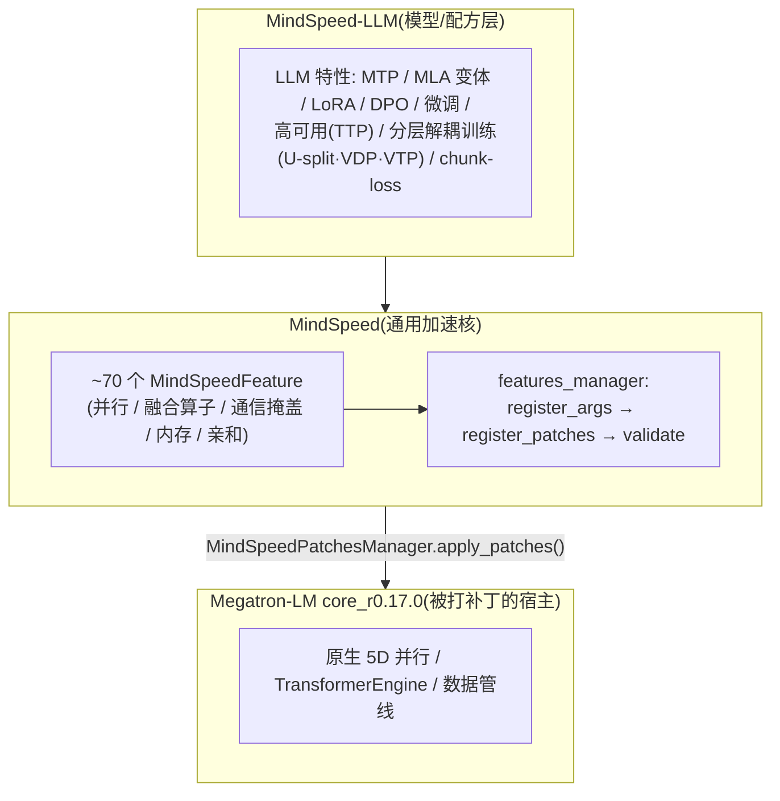

# MindSpeed × MindSpeed-LLM 训练优化特性 — 知识地图

> **代码基线**:MindSpeed `master` @ `1432cb09`(基于 Megatron `core_r0.17.0`,2026-06-22) · MindSpeed-LLM `master` @ `0c16322d`(2026-06-22)
> **最后更新**:2026-06-23(新建子目录;架构总览 + 四大类特性深挖 4 篇)
> 华为昇腾(Ascend/NPU)训练加速栈的源码级特性综述。回答:MindSpeed 里到底有哪些训练优化特性、各自解决什么瓶颈、怎么实现。按用户关心的四类组织——**并行 / 计算通信掩盖 / 内存优化 / 昇腾亲和**——逐类深挖,本页是总罗盘。

---

## 0. 一句话定位:猴补丁式的 Megatron 加速层

MindSpeed **不是**一个独立训练框架,而是一套**对 Megatron-LM 做猴补丁(monkey-patch)的特性库**。它在 `import megatron` 之前/之后,把一组"特性"按需注册的补丁打进 Megatron 的函数与类,从而把昇腾亲和的算子、并行策略、通信掩盖、内存手段注入原生 Megatron 训练流程。

- **两层**:`MindSpeed`(core)是与模型无关的昇腾通用加速;`MindSpeed-LLM` 在其上叠加模型层与 LLM 任务特性(预训练/SFT/RLHF/推理/权重转换),并**复用 + 扩展** core 的特性表。
- **宿主**:被补丁的是 Megatron-LM `core_r0.17.0`(见分支 `origin/core_r0.17.0`)。MindSpeed 的并行机制对照 [[megatron-lm/index]] 阅读最有效。

## 1. 特性机制:MindSpeedFeature 契约

每个优化特性都是 `MindSpeedFeature` 子类,实现统一契约(`mindspeed/features_manager/feature.py:9-77`):

| 钩子 | 作用 | file:line |
|---|---|---|
| `register_args(parser)` | 注册启用该特性的 CLI 开关 | `feature.py:22-24` |
| `register_patches(pm, args)` | 把补丁函数注册进 `MindSpeedPatchesManager` | `feature.py:56-58` |
| `pre/validate/post_validate_args` | 绕过/还原 Megatron 参数校验 | `feature.py:26-49` |
| `incompatible_check / dependency_check` | 特性间互斥/依赖约束 | `feature.py:60-68` |
| `is_need_apply(args)` | `optimization_level ≤ args.optimization_level` 且开关打开,或 level-0 默认补丁 | `feature.py:17-20` |

- **三档优化等级 O0/O1/O2**:`optimization_level` 字段(`feature.py:12-15`)。level-0 特性是"默认补丁"(基础适配,必打);O1/O2 是渐进式加速特性,按 `--optimization-level` 门控。
- **总表与分组**:`create_features_list()` 把 ~70 个特性按域分组装配(`mindspeed/features_manager/__init__.py:367-398`),这张分组表正是本知识库四大类的来源。
- **生效时机**:`megatron_adaptor.py:39-42` 在适配入口调用 `apply_features_pre_patches` / `apply_features_patches`,遍历 `FEATURES_LIST` 对命中的特性 `register_patches` 后统一 `apply_patches()`。

## 2. 四大类特性 → 四篇深挖

| 维度 | 页面 | 覆盖特性(代表) |
|------|------|----------------|
| **并行** | [[mindspeed_parallelism_analysis]] | CP(Ulysses/Ring/自适应/KV-cache)、TP(非对齐/TP-2D/vocab)、PP(分层布局/noop/可变序列/非对齐/num-layer-list)、MoE-EP(GMM/tp-extend-ep/共享专家/专家放置/负载均衡)、DP & 分布式(LayerZero/Custom-FSDP/Torch-FSDP)、分层解耦训练(U-split/VDP/VTP) |
| **并行·CP 深挖** | [[mindspeed_context_parallel_analysis]] | CP 家族专题:分派脊柱、Ring 双环(outer/inner window)、Adaptive 调度驱动 P2P、KV-cache CP 显存换通信(四框架中仅此一家);通用机制见 [[../../../01_theory/06_distributed_parallelism/ring_attention_and_context_parallel_analysis\|ring_attention_and_context_parallel_analysis]] |
| **计算通信掩盖** | [[mindspeed_comm_overlap_analysis]] | MC2(matmul+通信融合)、CoC(communication-over-computation)、MoE 通算重叠(allgather/alltoall/fb-overlap/alltoall-mc2)、PP 调度掩盖(DualPipeV/RiPipe/optimize-p2p/send-recv)、async-log-allreduce |
| **内存优化** | [[mindspeed_memory_optimization_analysis]] | 重计算(激活/norm/按 PP-rank/选择性)、Swap(smart-swap/swap-attention/swap-optimizer)、reuse-fp32-param、MoE-zero-memory、压缩(activation/optimizer/ANS-dense)、virtual-optimizer、chunk-loss、ckpt 加速 |
| **昇腾亲和** | [[mindspeed_ascend_affinity_analysis]] | 融合算子(GMM/swiglu/softmax/RoPE/moe-permute)、Flash-Attention(FA v1/v2/alibi/mask/MLA/DSA)、HCCL buffer 管理、affinity(交叉熵 NPU 亲和改写,非绑核)、QoS、TE-on-NPU、op_builder/ops 自定义算子、融合优化器(Muon/EMA-AdamW/低精度)、QAT |

## 3. 全特性罗盘(create_features_list 分组)

> 下表即 `create_features_list()` 的装配顺序与分组,是 MindSpeed core 的"特性总账"。每组归到上面四大类之一(或工具类),详见各深挖页。

| 分组(`add_*_features`) | 特性 | 归类 |
|---|---|---|
| megatron_basic | Requirements / Megatron / TransformerEngine / **Muon** | 基础 + 亲和 |
| context_parallel | ContextParallel / **Ulysses** / KvCache / Adaptive | 并行 |
| data_parallel | AsyncLogAllreduce | 掩盖 |
| fusions | **GroupedMatmul** / FusedSwiglu / FusedSoftmax / FusedRoPE / FusedMoEPermute | 亲和 |
| affinity | Affinity(注:非 CPU 绑核,而是 VocabParallel 交叉熵的 NPU 亲和改写,`affinity.py:13-17` 补丁 `calculate_predicted_logits`) | 亲和 |
| functional | Profiler / NPUDeterministic / Tflops / DataDump | 工具 |
| recompute | Activation / Norm / PerPPRank / Method | 内存 |
| tensor_parallel | UnalignedLinear / **MC2** / **CoC** / **TP2d** / ReplaceIndexPut | 并行 + 掩盖 |
| pipeline_parallel | **RiPipe** / Noop / OptimizeP2P / VariableSeq / MultiParam / OptimizeSendRecv / PPLayout / Unaligned / **DualpipeV** | 并行 + 掩盖 |
| moe | **GMM** / **TpExtendEp** / SharedExperts / **AllGatherOverlap** / **AlltoAllOverlap** / **ZeroMemory** / **FbOverlap** / Balanced / ExpertsPlacement / **AlltoAllMC2** / FixRouter | 并行 + 掩盖 + 内存 |
| hccl_buffer | BufferSet / BufferAdaptive / OpModeSet | 亲和 |
| optimizer | **FusedEmaAdamw** / Virtual / LowPrecision | 内存 + 亲和 |
| distributed | BufferPad / **LayerZero** / **TorchFSDP** / **CustomFSDP** / ResetBucketOrder | 并行 + 内存 |
| memory | **ReuseFP32Param** / **SmartSwap** / **SwapAttention** | 内存 |
| compress / compress_dense | CompressActivation / CompressOptimizer / ANS-Dense | 内存 |
| swap_optimizer | SwapOptimizer | 内存 |
| transformer | FusionAttention v1/v2 / Alibi / Mask / **MLA** / McoreRearrange / **DSA** | 亲和 |
| qat / qos / ckpt / auto_settings / ttp | QAT / QoS / CkptAccel / **AutoSettings** / **TTP** | 工具/亲和/高可用 |

**MindSpeed-LLM 增量**(`mindspeed_llm/features_manager/`):MTP、MLA 变体(G2/DSA-indexer)、qwen3-next attention、MHC、LoRA / LU-LoRA、DPO、finetune、evaluation/inference、high_availability、**分层解耦训练**(U-shaped-split / VDP / VTP)、mamba-CP、chunk-loss、num-layer-list 等模型/任务层特性。

## Cross-Domain Links

- [[megatron-lm/index]] —— 被 MindSpeed 打补丁的宿主框架,5D 并行/MoE/通信掩盖原生实现(对照阅读)
- [[mindformers/index]] —— 华为另一条昇腾训练栈(MindSpore 生态)的 MoE EP 分析,与 MindSpeed(PyTorch+NPU 生态)互为对照
- [[torchtitan/index]] —— PyTorch-native 并行栈,FSDP2/DTensor 对照
- [[comm_compute_overlap_analysis]] / [[comm_compute_fusion_guide]] —— 通算掩盖/融合的跨框架综述
- [[distributed_optimizer_deep_dive]] —— ZeRO/FSDP/MindSpeed 分布式优化器对比

## Related Pages

- [[mindspeed_parallelism_analysis]] · [[mindspeed_comm_overlap_analysis]] · [[mindspeed_memory_optimization_analysis]] · [[mindspeed_ascend_affinity_analysis]]
- [[02_engineering/02_train_frameworks/index]] —— 训练框架目录索引
