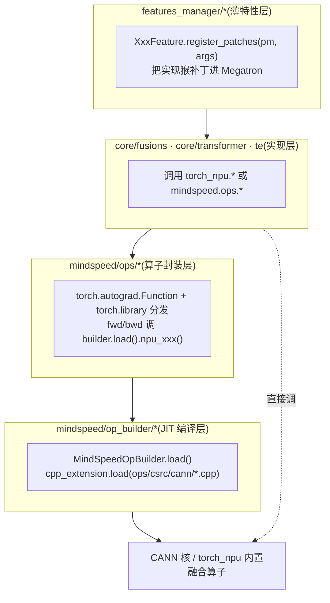
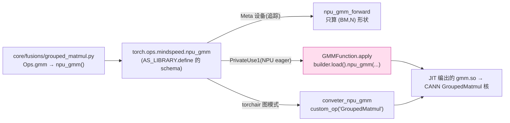

# MindSpeed 昇腾亲和特性与融合算子 — 源码级分析

> **代码基线**:MindSpeed core `master` @ `1432cb09`(patch Megatron `core_r0.17.0`)· MindSpeed-LLM `master` @ `0c16322d` · 阅读日期 2026-06-23
> **范围**:本页只讲"是什么让 MindSpeed *亲和昇腾(Ascend/NPU)*"——把通用算子换成 `torch_npu.*` / 自研 CANN 融合核的那条线:自定义算子 JIT 系统(op_builder/ops)、融合算子(GMM/swiglu/softmax/RoPE/RMSNorm/moe-permute)、Flash-Attention 家族(含 MLA/DSA)、HCCL buffer 与 QoS 调优、TransformerEngine-on-NPU、融合优化器与 QAT。**并行切分**见 [[mindspeed_parallelism_analysis]],**通算掩盖**(MC2/CoC/lcal)见 [[mindspeed_comm_overlap_analysis]],**内存手段**见 [[mindspeed_memory_optimization_analysis]],本页只交叉引用、不重复。属 [[mindspeed/index]] 系列。每条非平凡结论带 `file:line`,行号均经实际打开核对。

---

## 1. 总览:通用算子 → 昇腾原生融合核

MindSpeed 的"昇腾亲和"本质是一次**算子替换**:Megatron 默认走 PyTorch eager / CUDA / apex / NVIDIA-TransformerEngine 的算子,在 NPU 上要么没有、要么慢;每个亲和特性通过 `register_patches` 把对应函数猴补丁成调用 `torch_npu.*` 内置融合算子,或调用 MindSpeed 用 `op_builder` 现场 JIT 编出来的自研 CANN 核。

| 通用算子(Megatron 默认) | MindSpeed 特性 | 底层昇腾核 | 收益 |
|---|---|---|---|
| `grouped_gemm.ops`(MoE 专家 GEMM) | **grouped-matmul (GMM)** | CANN `GroupedMatmul`(`npu_gmm`) | 变长分组 GEMM 一次 launch,免逐专家循环 |
| `bias_swiglu`(逐元素) | **use-swiglu** | `torch_npu.npu_swiglu` | gate×up×SiLU 单核融合 |
| `ScaledMaskedSoftmax`(CUDA) | **fused-softmax** | `torch_npu.npu_scaled_masked_softmax` | scale+mask+softmax 融合 |
| `apply_rotary_pos_emb`(逐元素) | **use-fused-rotary-pos-emb** | `npu_rotary_position_embedding`(自研 CANN) | cos/sin 旋转单核 |
| MoE permute/unpermute(gather/scatter) | **moe-permute-fusion** | `torch_npu.npu_moe_token_permute_with_routing_map` | routing-map 直接驱动重排 |
| `DotProductAttention`(朴素 QK^T·softmax·V) | **use-flash-attn / v2** | `torch_npu.npu_fusion_attention(_v2)` | FlashAttention,O(S) 显存 |
| `index_put` 式 cross-entropy | **affinity** | 逻辑取反×乘法(避 scatter) | 规避 NPU 上低效的散点写 |
| `FusedAdam`(apex) | **fused_ema_adamw / 低精度 / Muon** | `npu_apply_fused_ema_adamw` 等自研核 | 优化器一步融合 |
| HCCL 集合通信(默认偏大 buffer) | **hccl-group-buffer / op-mode / aiqos** | `ProcessGroupHCCL.Options.hccl_config` | 按组裁 buffer、调 QoS/扩展模式 |

四层落地结构——薄特性层把实现猴补丁进 Megatron,实现层调 `torch_npu.*` 或 `mindspeed.ops.*`,ops 层用 autograd+`torch.library` 分发,op_builder 层把 CANN `.cpp` 现场 JIT:



> 全部特性都是 `MindSpeedFeature` 子类,契约(`register_args`/`register_patches`/`is_need_apply`/`optimization_level`)见 [[mindspeed/index]] §1。亲和类里:**默认补丁(O0)**有 GMM/swiglu/softmax/RoPE/RMSNorm/Muon/TE-basic/低精度优化器;**O2** 才放行 FA/MLA/DSA/moe-permute-fusion/QoS/QAT。

CLI 开关速查(本页范围):

| 开关 | 特性 | 等级 | 节 |
|---|---|---|---|
| (默认,无开关) | grouped-matmul / use-swiglu / fused-softmax / RMSNorm | O0 | §2/§3 |
| `--use-fused-rotary-pos-emb` | Fused RoPE | O0 | §3 |
| `--moe-permute-fusion` / `--use-fused-moe-token-permute-and-unpermute` | MoE permute 融合 | O2 | §3 |
| `--use-flash-attn` + `--sparse-mode` + `--pre/next-tockens` | Flash-Attention v1 | O2 | §4 |
| `--use-fusion-attn-v2` | FA v2(alibi) | O2 | §4 |
| `--multi-head-latent-attention` (+`--qk-rope/nope-head-dim`) | MLA | O2 | §4 |
| `--experimental-attention-variant dsa` (+4 个 `--use-fused-*`) | DSA | O2 | §4 |
| `--hccl-group-buffer` / `--hccl-group-buffer-adaptive` / `--hccl-op-mode` | HCCL buffer | — | §5 |
| `--aiqos` (+`--aiqos-mode/-enable-roce`) | QoS | O2 | §6 |
| `--fp8-format` / `--fp8-recipe` / `--te-gmm-mode` | TE-on-NPU | O0 | §7 |
| `--optimizer-selection fused_ema_adamw` (+`--ema-decay`) | 融合 EMA-AdamW | — | §8 |
| `--quant-states` / `--quant-grads` | 低精度优化器 | O0 | §8 |
| `--optimizer muon` | Muon | O0 | §8 |
| `--qat-scheme` | QAT | O2 | §8 |

---

## 2. op_builder / ops 自定义算子系统(地基)

**命题**:昇腾的高性能核往往不在 `torch_npu` 里,而是 CANN 的 C++/AscendC 源码。MindSpeed 的 `op_builder` 是一套**运行期 JIT 编译器**——首次用到某算子时,把 `ops/csrc/cann/*.cpp` 用 `torch.utils.cpp_extension.load` 现编现载成 `.so`,再用 `torch.library` 把它注册成 `torch.ops.mindspeed.*` 算子,从而同时拿到 eager 执行与 torchair 图模式两条路径。

### 2.1 编译层:`MindSpeedOpBuilder.load()`

抽象基类的核心就是一个 `load()`:把子类 `sources()` 列的 `.cpp` 喂给 `cpp_extension.load`,链接参数硬挂 `-lascendcl`(CANN 运行时)与 `-ltorch_npu`,编译结果按 `name` 缓存进类级字典 `_loaded_ops`,**同一进程只编一次**(`op_builder/builder.py`):

```python
# op_builder/builder.py:11  —— 自定义命名空间,DEF=允许 define 新算子
AS_LIBRARY = Library("mindspeed", "DEF")

class MindSpeedOpBuilder(ABC):
    _loaded_ops = {}                                              # :18 类级编译缓存

    def extra_ldflags(self):                                      # :58-63 链接参数
        return ['-L'+os.path.join(self._cann_path, 'lib64'), '-lascendcl',
                '-L'+os.path.join(self._torch_npu_path, 'lib'), '-ltorch_npu']

    def load(self, verbose=True):                                 # :65-77 核心
        if self.name in __class__._loaded_ops:                   # :66-67 命中缓存即返
            return __class__._loaded_ops[self.name]
        op_module = load(name=self.name,                         # :69-74 现场 JIT 编 .cpp
                         sources=self.get_absolute_paths(self.sources()),
                         extra_include_paths=self.get_absolute_paths(self.include_paths()),
                         extra_cflags=self.cxx_args(),           # :53-56 安全加固档
                         extra_ldflags=self.extra_ldflags())
        __class__._loaded_ops[self.name] = op_module             # :75 入缓存
        return op_module
```

`cxx_args()` 走安全加固档:`-fstack-protector-all -fPIC -fvisibility=hidden -D_FORTIFY_SOURCE=2 -O2`(`builder.py:53-56`),GMM 子类再按 torch 版本追 `-std=c++17`(≥2.1)或 `c++14`(`gmm_builder.py:80-84`)。`register_op_proto()` 用 `AS_LIBRARY.define(proto)` 把算子 schema 注册进自定义命名空间(`builder.py:34-38`)。

### 2.2 子类层:`GMMOpBuilder` 声明算子 schema 与 Meta/GE 转换器

以 GMM 为例,一个 builder 子类干三件事:① `sources()` 指向 CANN `.cpp`;② `OP_PROTO` 声明算子签名(两个重载);③ 在 `register_op_ir()` 里为 **Meta 设备**注册形状推断、为 **torchair 图模式**注册 GE 转换器落到 CANN 自定义算子 `GroupedMatmul`(`op_builder/gmm_builder.py`):

```python
# op_builder/gmm_builder.py:88-126
class GMMOpBuilder(GMMOpBuilderPublic):
    OP_NAME = "grouped_matmul"
    OP_PROTO = (                                                  # :90-93 两个重载签名
        "npu_gmm.Tensor(Tensor original_weight, Tensor x, Tensor weight, *, "
        "Tensor? bias=None, Tensor? group_list=None, int? group_type=0, "
        "bool? gemm_fusion=False) -> Tensor",
        "npu_gmm.List(... int[]? group_list=None ...) -> Tensor")

    def sources(self):                                           # :64-65 现场编的 CANN 源
        return ['ops/csrc/cann/gmm.cpp', 'ops/csrc/flop_counter/flop_counter.cpp']

    def register_op_ir(self):
        @impl(AS_LIBRARY, "npu_gmm.Tensor", "Meta")             # :101 形状/dtype 推断(不算数)
        def npu_gmm_forward(original_weight, x, weight, *, bias=None,
                            group_list=None, group_type=0, gemm_fusion=False):
            BM, N = x.shape[0], weight.shape[-1]
            return x.new_empty((BM, N), dtype=x.dtype)          # :103-106 只给出输出 shape

        @register_fx_node_ge_converter(torch.ops.mindspeed.npu_gmm.Tensor)  # :108 torchair 图模式
        def conveter_npu_gmm(original_weight, x, weight, *, ...):
            result = conveter_npu_gmm_param(x, bias, group_type)
            return GroupedMatmul([x], [weight], ..., group_list,            # :124-126 落 CANN GroupedMatmul
                                 split_item=3, group_type=group_type, group_list_type=0)[0]
```

`GroupedMatmul(...)` 最终调 `torchair.ge.custom_op("GroupedMatmul", ...)`(`gmm_builder.py:213`),把图节点接到 CANN 自定义算子。`group_list_type=0`(`GMMOpBuilder`,`group_list` 为**累积** token 数)与 `=1`(`GMMV2OpBuilder`,**每组**计数)对应两套 proto/转换器(`gmm_builder.py:90-93 vs 131-133`,`group_list_type=0/1` 在 `:126 / :166`)。

### 2.3 封装层:`ops/gmm.py` 的三种"分发键"

`MindSpeedOpBuilder` 只负责"编",真正的 eager 执行体在 `ops/gmm.py`:一个 `torch.autograd.Function` 管前反向,再用 `@impl(..., "PrivateUse1")` 把它绑到 NPU 设备键。**`PrivateUse1` 就是 PyTorch 给 NPU 预留的私有 dispatch key**——这是 eager 路径在 NPU 上被真正调用的入口:

```python
# ops/gmm.py:153-161  —— eager NPU 执行入口(.Tensor 与 .List 两个重载共用)
@impl(AS_LIBRARY, "npu_gmm.List", "PrivateUse1")
@impl(AS_LIBRARY, "npu_gmm.Tensor", "PrivateUse1")
def _npu_gmm(original_weight, x, weight, *, bias=None, group_list=None,
             group_type=0, gemm_fusion=False):
    group_list_data_type = 1 if isinstance(group_list, (torch.Tensor, type(None))) else 0
    group_args = (group_list, group_type, gemm_fusion, 0, group_list_data_type)
    return GMMFunction.apply(original_weight, x, weight, bias, group_args)   # 进 autograd
```

于是同一个 `npu_gmm` 算子注册到**三种键**,各司其职:

| 分发键 | 用途 | 注册点 |
|---|---|---|
| `Meta` | 形状/dtype 推断(不算数,供编译追踪) | `@impl(AS_LIBRARY, "npu_gmm.Tensor", "Meta")`,`gmm_builder.py:101` |
| `PrivateUse1` | **NPU eager 真正执行**(走 `GMMFunction`) | `@impl(AS_LIBRARY, "npu_gmm.Tensor", "PrivateUse1")`,`gmm.py:153-154` |
| GE converter | torchair 图模式落 CANN `GroupedMatmul` 节点 | `@register_fx_node_ge_converter(...)`,`gmm_builder.py:108` |



`op_builder/__init__.py:1-27` 登记了约 27 个 builder:`SwigluOpBuilder`/`RmsNormOpBuilder`/`FusionAttentionV2OpBuilder`/`FFNOpBuilder`/`RotaryPositionEmbeddingOpBuilder`/`MatmulAddOpBuilder`/`FusedEmaAdamWOpBuilder`/各类 `*AllReduce*`/`MoeTokenPermute/Unpermute`/`NPUSparseLIGradKlLoss`(DSA)等,覆盖融合算子、MC2 通算融合核、融合优化器、DSA 稀疏核。

> **要点**:`op_builder` ≠ 普通 Python 封装,它是"把 CANN 源码编进训练进程"的机制。`-lascendcl` 链接 + `Meta`/`PrivateUse1`/`GE converter` 三键 + 类级编译缓存,共同保证算子在 NPU eager 与图模式下都可用、且只编一次——这是 MindSpeed 区别于纯 Python monkey-patch 的硬核底座。

---

## 3. 融合算子(fusions)

### 3.1 GroupedMatmul(GMM)—— MoE 专家计算的第一原语

MoE 把若干专家的权重堆成一个张量,token 按路由分到各专家;朴素实现要么逐专家 for-loop GEMM(launch 风暴),要么 padding 到等长(浪费算力)。GMM 用一个 `group_list`(各组**累积** token 数)驱动一次**变长分组矩阵乘**:

```
专家:  E0      E1   E2          E3
token: ▣▣▣▣▣ | ▣▣▣ | ▣▣▣▣▣▣▣ | ▣▣        group_list=cumsum([5,3,7,2])=[5,8,15,17]
       └─ W0 ─┘└W1─┘└─── W2 ──┘└W1─┘        一次 npu_gmm launch,内部按 group_list 切段做 GEMM
                                             ↑ 免逐专家循环、免 padding
```

特性把 Megatron 的 `grouped_gemm_util.ops` 整体换成 MindSpeed 的 `Ops`,并伪造 `get_device_capability` 返回 `(9,0)` 让 Megatron 原生那条"GMM 是否可用"的 CUDA 能力检查在 NPU 上通过(`features_manager/fusions/grouped_matmul.py:11,16`);`Ops.gmm` 把 `batch_sizes` 做 `cumsum` 成 `group_list` 再调 `npu_gmm`(`core/fusions/grouped_matmul.py:7-21`、`:38-39`)。

GMM 的 autograd 体现了**反向的权重梯度融合**这一 MoE 训练关键细节(`ops/gmm.py`):

```python
# ops/gmm.py:33  —— 前向:一次 launch 完成变长分组 GEMM
outputs = GMMFunction.builder.load().npu_gmm([x], [weight], bias, group_list, group_type, group_list_type)
...
# ops/gmm.py:56-66  —— 反向:开 gemm_fusion 时,权重梯度不单独算
if ctx.gemm_fusion:
    dx, _, dbias = GMMFunction.builder.load().npu_gmm_backward_fusion(   # :58 只算 dx/dbias
        [grad_outputs], [weight], group_list, ctx.group_list_type)
    npu_groupmatmul_add_fp32(x, grad_outputs, group_list,               # :60 dgrad 直接累加进 main_grad
                             original_weight.main_grad)
```

`npu_groupmatmul_add_fp32` 把权重梯度 `dgrad = xᵀ·dy` **直接累加进 `weight.main_grad`**,省掉一次显存读写——A5 机型直接调内置 `torch_npu.npu_grouped_matmul_add_`,否则走 JIT 核(`ops/npu_groupmatmul_add.py:12-16`):

```python
# ops/npu_groupmatmul_add.py:11-16
def npu_groupmatmul_add_fp32(x, dy, grouplist, grad):
    if check_npu_version(NPUVersion.A5):                                       # A5:内置融合核
        torch_npu.npu_grouped_matmul_add_(grad.view(grouplist.shape[0], x.shape[-1],
                                          dy.shape[-1]), x, dy, grouplist)
    else:                                                                      # 其余:JIT 核
        groupmatmul_add_op_builder.load().npu_groupmatmul_add_fp32(x, dy, grouplist.to('npu'), grad)
```

### 3.2 SwiGLU / RMSNorm —— 逐元素链路融成单核

SwiGLU 把 gate/up 切分、SiLU、逐元素乘融进 `torch_npu.npu_swiglu` 单核;`BiasSwiGLUFunction` 则先把 bias 加进去(`core/fusions/fused_bias_swiglu.py`):

```python
# core/fusions/fused_bias_swiglu.py:4-17
def fused_swiglu(x):
    return torch_npu.npu_swiglu(x, dim=-1)        # :5  gate×up×SiLU 三步一核

class BiasSwiGLUFunction:
    @staticmethod
    def apply(x, bias, *args):
        return fused_swiglu(x + bias)             # :17 含 bias 的变体
```

RMSNorm 把 `rsqrt(mean(x²))` 归一与权重缩放融成 `torch_npu.npu_rms_norm` 单核,并保留 `unfused_rmsnorm` 作回退(`core/fusions/fused_rms_norm.py`):

```python
# core/fusions/fused_rms_norm.py:29-42
def _norm(self, x):
    return x * torch.rsqrt(x.pow(2).mean(-1, keepdim=True) + self.eps)   # 朴素:多个逐元素核
def fused_rmsnorm(self, x):
    return torch_npu.npu_rms_norm(x, self.weight, epsilon=self.eps)[0]   # :37 单核
def forward(self, x):
    return self.fused_rmsnorm(x) if self.config.use_fused_rmsnorm else self.unfused_rmsnorm(x)
```

### 3.3 Fused Softmax —— scale+mask+softmax 三步一核(带硬约束)

三个类(`ScaledUpperTriangMaskedSoftmax`/`ScaledMaskedSoftmax`/`ScaledSoftmax`)统一落到 `torch_npu.npu_scaled_masked_softmax`,把缩放、mask 加法、softmax 融合(`core/fusions/fused_softmax.py:13,20,27,47`)。关键是 `is_kernel_available` 给出的硬约束——不满足就回退非融合实现:

```python
# core/fusions/fused_softmax.py:30-37
def is_kernel_available(self, mask, b, np, sq, sk):
    return (self.scaled_masked_softmax_fusion   # 用户开关
            and self.input_in_float16           # 输入须 fp16
            and 32 < sk <= 4096                 # sk ∈ (32, 4096]
            and sq % 16 == 0 and sk % 16 == 0)  # sq/sk 都整除 16
```

### 3.4 Fused RoPE —— cos/sin 旋转单核

`apply_rotary_pos_emb_bshd` 在 `--use-fused-rotary-pos-emb` 打开时调自研 CANN 核 `npu_rotary_position_embedding`,否则回退 `t*cos + rotate_half(t)*sin` 的逐元素版(`core/fusions/fused_rope.py`):

```python
# core/fusions/fused_rope.py:58-74
if multi_latent_attention:                       # :58-61 MLA:先做奇偶位拼接预处理
    x1, x2 = t[..., 0::2], t[..., 1::2]
    t = torch.cat((x1, x2), dim=-1)
...
if getattr(args, "use_fused_rotary_pos_emb"):    # :68
    mode = 1 if rotary_interleaved else 0        # 交错与否决定 mode
    t = npu_rotary_position_embedding(t.contiguous(), cos_, sin_, mode).to(t.dtype)  # :70 单核
else:
    t = (t * cos_) + (_rotate_half(t, rotary_interleaved) * sin_)                     # :72 回退
```

`npu_rotary_position_embedding` 由 `RotaryPositionEmbeddingOpBuilder` JIT 加载(`ops/npu_rotary_position_embedding.py`)。yarn 缩放时强制关 rope-fusion(`fused_rope.py:85-87`),因为 yarn 的 mscale 需在 cos/sin 上额外缩放,与融合核不兼容。

### 3.5 MoE Permute/Unpermute Fusion(O2)

`--moe-permute-fusion` 把 Megatron `moe_utils.permute/unpermute` 换成 `torch_npu.npu_moe_token_permute_with_routing_map` 的版本——**routing-map 直接驱动 token 重排,免去显式 `argsort`+`gather`**(`te/pytorch/permutation.py`):

```python
# te/pytorch/permutation.py:24-25(forward)、:53(backward)
permuted_input, permuted_probs, sorted_indices = torch_npu.npu_moe_token_permute_with_routing_map(
    tokens, routing_map, probs=probs, num_out_tokens=num_out_tokens, drop_and_pad=drop_and_pad)
...
act_grad, probs_grad = torch_npu.npu_moe_token_permute_with_routing_map_grad(...)   # :53 反向
```

特性会校验 `torch_npu` 是否具备该属性,缺失则降级并提示"升级 CANN≥8.3.RC1、PTA≥7.2.RC1"(`features_manager/fusions/fused_moe_permute.py:27-37`);且只支持 alltoall / alltoall_seq dispatcher,allgather 报错(`:44-47`)。因为 TE 的 permute 接口缺 `drop_and_pad`/`routing_map` 入参,这里改补丁 megatron 的 `moe_utils.permute/unpermute`(`:77,82`)。

---

## 4. Flash-Attention 家族(含 MLA / DSA)

**命题**:注意力是显存与算力双瓶颈。MindSpeed 把 Megatron 的 `DotProductAttention.forward` 整体替换成调用昇腾 FlashAttention 融合核 `npu_fusion_attention`,避免实例化 `S×S` 注意力矩阵。

### 4.1 FA v1:`npu_fusion_attention` 的实际调用

`FusionAttentionFeature`(O2,`--use-flash-attn`)**仅当 CP 关闭时**才接管 `DotProductAttention.forward`(`fusion_attention_v1_feature.py:61-68`);CP 开启时由 [[mindspeed_parallelism_analysis]] 的 ring/ulysses 注意力接管。实现体 `dot_product_attention_forward_impl` 先按 packed 与否选布局,再调融合核(`flash_attention/adaptor.py`):

```python
# core/transformer/flash_attention/flash_attention/adaptor.py:49-83
if packed_seq_params is not None:                       # :49 TND(变长 packing)
    actual_seq_qlen  = packed_seq_params.cu_seqlens_q.tolist()
    actual_seq_kvlen = packed_seq_params.cu_seqlens_kv.tolist()
    shape_order = 'TND'
else:                                                   # :57 SBH(常规)
    actual_seq_qlen = actual_seq_kvlen = None
    query, key, value = [rearrange(x, 's b h d -> s b (h d)') for x in [query, key, value]]
    shape_order = 'SBH'

output = torch_npu.npu_fusion_attention(                # :68-83 一行融合核
    query, key, value, n_head, shape_order,
    atten_mask=attention_mask, scale=scale,             # scale = softmax_scale (:47)
    pre_tockens=self.config.pre_tockens,                # 滑窗左可见范围
    next_tockens=self.config.next_tockens,              # 滑窗右可见范围
    keep_prob=1 - self.attention_dropout.p,             # dropout 保留率
    inner_precise=0, sparse_mode=sparse_mode,           # sparse_mode: 9 种 mask 形态码
    actual_seq_qlen=actual_seq_qlen,                    # TND 下各样本真实长度
    actual_seq_kvlen=actual_seq_kvlen)[0]
```

`sparse_mode` 在 `no_mask` 时强制置 0(`adaptor.py:43-45`)。两种布局的形状流转:

```
SBH(常规):  Q/K/V [s, b, h, d] ──rearrange s b h d→s b (h d)──► npu_fusion_attention(SBH)
TND(packing):Q/K/V [t, n, d] + cu_seqlens_q/kv(各样本边界)──► npu_fusion_attention(TND, actual_seq_*)
             └─ 多条变长样本拼一条,用 actual_seq_qlen/kvlen 切回各样本,免 padding
```

`--sparse-mode` 暴露 9 种 mask 形态(0 defaultMask / 1 allMask / 2 leftUpCausal / 3 rightDownCausal / 4 band / 5-6 prefix / 7-8 varlen,`fusion_attention_v1_feature.py:35-52`),v1 的 `validate_args` 只许 0/2(`:54-56`);`pre/next-tockens` 控制滑窗范围(默认 65536/0)。

### 4.2 FA v2 / MLA / DSA

- **FA v2**(`--use-fusion-attn-v2`,默认关、主要给 alibi):`validate_args` 强制 `use_flash_attn=True` 并标注"未正式发布"(`fusion_attention_v2_feature.py:33-36`);落到自研 `npu_fusion_attention_v2`(`ops/fusion_attention_v2.py`),alibi 偏置作为 `pse` 传入。
- **MLA**(`--multi-head-latent-attention`):特性把 `MultiLatentAttention.__init__` 与 `DotProductAttention.__init__` 替换为 MindSpeed 版,并把参数名 `qk_nope/rope_head_dim` 映射回 Megatron 的 `qk_head_dim/qk_pos_emb_head_dim`(`mla_feature.py:73-74,88-93`);RoPE 段对 MLA 做奇偶位拼接(§3.4 的 `fused_rope.py:58-61`)。
- **DSA(DeepSeek Sparse Attention)**(实验,`--experimental-attention-variant dsa`):**core 侧 `dsa.py` 只是参数门**——注册 `--use-dsa-absorb`/`--use-fused-lightning-indexer`/`--use-fused-sparse-flash-attention`/`--use-fused-lightning-indexer-kl-loss` 并做互斥校验,**整个类没有 `register_patches`**(`dsa.py:1-45`,只有 `is_need_apply`/`register_args`/`validate_args`,后者在 `:31-44` 要求四个开关同开)。真正的稀疏注意力融合核是自研 CANN 算子,源码在 `ops/csrc/cann/npu_lightning_indexer.cpp`、`npu_sparse_attn_shared_kv.cpp`,builder 见 `op_builder/__init__.py:27`,实际接线在 MindSpeed-LLM 模型层。

---

## 5. HCCL buffer 管理

**命题**:HCCL(昇腾的 NCCL 对位)给每个通信组预留一块固定 staging buffer,默认偏大,N 个并行组叠起来吃掉大量显存。MindSpeed 三个特性允许**按组精调** buffer 尺寸与算子展开模式。

机制统一:补丁 `parallel_state.get_nccl_options`(返回 `ProcessGroupHCCL.Options()`),在建组时把每组配置塞进 `options.hccl_config`(`core/hccl_buffer/adaptor.py`):

```python
# core/hccl_buffer/adaptor.py:16-26  —— 自适应路径:每组按名取算好的 buffer 尺寸
def get_nccl_options_wrapper(get_nccl_options):
    def wrapper(pg_name, nccl_comm_cfgs):
        if args.hccl_group_buffer_adaptive and _HCCL_GROUP_BUFFER.get(pg_name) is not None:
            options = torch_npu._C._distributed_c10d.ProcessGroupHCCL.Options()
            options.hccl_config = {"hccl_buffer_size": _HCCL_GROUP_BUFFER[pg_name]}   # :23-24 按组裁 buffer
            return options
        return get_nccl_options(pg_name, nccl_comm_cfgs)
    return wrapper
```

- **`--hccl-group-buffer "tp:200;ep:300;..."`**(手动):`parse_hccl_buffer_string` 解析成 `{pg_name: MB}`(白名单含 dp/tp/pp/cp/exp/tp_exp/cp_ulysses…,`hccl_adaptive_func.py:8-71`),建组时 `options.hccl_config = {"hccl_buffer_size": ...}`(`adaptor.py:51-53`)。
- **`--hccl-group-buffer-adaptive`**(自动):`hccl_buffer_auto_adaptive` 按 `seq_length/mbs/hidden_size` 与各并行度,逐组算"最大通信量"再换算成 MB(`hccl_adaptive_func.py:78-359`)。摘录:`tp` 组 `≈2·⌈S/CP·B·H/2²⁰⌉`(`:125-131`)、`cp`(ulysses)`≈2·⌈S/CP·B·H/TP/2²⁰⌉`(`:219-228`)、`exp`(EP)缺省 `200`(`:159-172`)、`mp`/`tp_cp` 常量 `10`。
- **`--hccl-op-mode "tp:1;..."`**:把 `hccl_op_expansion_mode` 写进每组 `hccl_config`(`hccl_op_mode_adaptor.py:17-22`)——这是昇腾特有的"集合通信算子在 AI Core 上展开 vs 由 AI CPU 调度"的开关,影响小消息延迟。

> 为何对 NPU 尤其重要:HCCL buffer 是**预留**的常驻显存,默认值为兼容最坏情况而偏大;真实通信量由 `S/CP/TP` 等并行度决定,按组精算能把这块"隐形常驻显存"压到实际需要,长序列/大 EP 下省下的 HBM 相当可观。

---

## 6. CPU affinity 与 QoS

> [!warning] 命名陷阱——`AffinityFeature` 不是 CPU 绑核
> 直觉上 "affinity" 应是 CPU 核 / NUMA 绑定。**但 MindSpeed core 里全仓没有 `sched_setaffinity` / `numa` / `bind_cpu` 任何调用**(grep 为空,MindSpeed-LLM 同样)。`features_manager/affinity/affinity.py` 实际做的是一次**昇腾亲和的 cross-entropy 重写**。

`AffinityFeature`(O1)把 `VocabParallelCrossEntropy.calculate_predicted_logits` 替换为 MindSpeed 版,补丁注释直接点明意图(`affinity.py:13-18`)。差异在于:把"将被 mask 的元素置零"这个操作,从 `index_put_`/scatter 改成**逻辑取反再乘**(`core/tensor_parallel/cross_entropy.py`):

```python
# core/tensor_parallel/cross_entropy.py:18-32
target_mask = (target < vocab_start_index) | (target >= vocab_end_index)   # :18 越界 token 掩码
masked_target = target.clone() - vocab_start_index
masked_target *= ~target_mask          # :20 取反×乘,等价于"被 mask 处置 0",但避开 scatter
...
predicted_logits = predicted_logits_1d.view_as(target)
predicted_logits *= ~target_mask       # :32 同理,规整向量化乘法
```

散点写(scatter / `index_put_`)在 NPU 上会触发低效的非连续访存/同步,而逐元素乘 `*= ~mask` 是规整的向量化操作——故"亲和"。`affinity.py:15` 的注释原话:`use logical negation followed by multiplication to achieve the same effect as setting selected elements to zero`。

**QoS**(`--aiqos`,O2):把 `initialize_model_parallel` 整体换成 `initialize_model_parallel_qos`,在每次建组时按"并行类型"分配网络/SDMA 优先级(`core/qos/adaptor.py`):

```python
# core/qos/adaptor.py:69-94  —— 按 parallel_type 给集合通信打流量优先级标签
roce_qos = ai_qos.set_parallel_roce_qos(parallel_type)   # :70  0-7
sdma_qos = ai_qos.set_parallel_sdma_qos(parallel_type)   # :71  0-7
if is_a3_version:                                         # A3 机型
    if args.aiqos_enable_roce:
        kwargs['pg_options'].hccl_config = {'hccl_sdma_qos': sdma_qos,        # :86-87
            'qos_service_level': roce_qos, 'qos_traffic_class': roce_qos * 32}
    else:
        kwargs['pg_options'].hccl_config = {'hccl_sdma_qos': sdma_qos}        # :90
else:                                                     # 非 A3:只设 RoCE 服务级别
    kwargs['pg_options'].hccl_config = {'qos_service_level': roce_qos,        # :93
        'qos_traffic_class': roce_qos * 32}
```

本质是给不同并行域的集合通信打**流量优先级标签**,缓解 RoCE 网络上多组通信争抢。

---

## 7. TransformerEngine-on-NPU

**命题**:Megatron 默认用 NVIDIA TransformerEngine(TE)做 FP8 与融合线性层,TE 内核是 CUDA 的。MindSpeed 在 `mindspeed/te/` 维护一套**同名替身**,把 TE 的关键类整体补丁成 NPU 实现,从而在不改 Megatron 模型代码的前提下跑 FP8/融合算子(`features_manager/megatron_basic/transformer_engine_basic.py`,O0):

| Megatron/TE 类 | MindSpeed-NPU 替身 | 行号 |
|---|---|---|
| `TransformerBlock.forward` | checkpoint 感知的 `transformer_block_forward` | `:119-121` |
| `TEGroupedLinear`(列/行) | `MindSpeedTEGroupedLinear`(或 `...Performance...`,按 `--te-gmm-mode`) | `:136-164` |
| `TEDotProductAttention` | `MindSpeedTEDotProductAttention`(仅 CP=1) | `:192-195, 264-267` |
| `TEColumn/RowParallelLinear` | 原生 Linear,或开 mc2 时换 MC2 融合 Linear | `:245-262` |
| `Format`/`*Scaling`/`Fp8Padding` | MindSpeed FP8 recipe 实现 | `:202-214` |

FP8:`--fp8-format` 扩出 `hif8`,`--fp8-recipe` 扩出 `blockwise`/`mxfp8-32x32`(`:47-49`);开 FP8 时补丁 TE 的 `Format`/`Float8CurrentScaling`/`MXFP8BlockScaling`/`TEDelayedScaling`/`Fp8Padding`(`:202-214`)。MC2 仅在 mxfp8 recipe 下兼容 FP8(`:90-91`)。MC2 融合通算线性层细节见 [[mindspeed_comm_overlap_analysis]]。

---

## 8. 融合优化器与 QAT

### 8.1 Fused EMA-AdamW

AdamW 一步更新 + EMA(指数滑动平均)影子权重本是多次逐元素 kernel,这里融成单核。特性先把 `apex.optimizers.FusedAdam` 占位换成 `FusedEmaAdamW`(`fused_ema_adamw_feature.py:24-28`),O2 时再补 checkpoint 的 EMA 存取与 `DistributedOptimizer.__init__`(`:30-44`)。核心是**一次 kernel 同时回写 param/m/v/s 四个张量**(`core/optimizer/fused_ema_adamw/fused_ema_adamw.py`):

```python
# core/optimizer/fused_ema_adamw/fused_ema_adamw.py:22-40
for i, param in enumerate(var):
    # 一次 npu_apply_fused_ema_adamw 同时更新:param.data / 一阶动量 m / 二阶动量 v / EMA 影子 s
    param.data, m_ref, v_ref, s_ref = npu_apply_fused_ema_adamw(   # :27 单核
        grad[i], param.data, m[i], v[i], s[i], step,
        lr, ema_decay, beta1, beta2, eps, mode, bias_correction, weight_decay)
```

`npu_apply_fused_ema_adamw` 由 `FusedEmaAdamWOpBuilder` JIT 编 `ops/csrc/cann/npu_apply_fused_ema_adamw.cpp`(`op_builder/fused_ema_adamw_builder.py:16`),Python 封装一次返回四元组(`ops/npu_apply_fused_ema_adamw.py:24`)。同源的 `npu_apply_fused_adamw_v2` 被 swap-optimizer 复用(见 [[mindspeed_memory_optimization_analysis]] §3.3)。

### 8.2 低精度优化器 / Muon / QAT

- **低精度优化器**(`--quant-states {fp8,hif8,mxfp8}` / `--quant-grads`,O0):把优化器状态/梯度量化存储,补丁覆盖 `MixedPrecisionOptimizer.{prepare_grads,step,...}` 一长串;属"内存×亲和"交叉,内存视角见 [[mindspeed_memory_optimization_analysis]]。
- **Muon**(`--optimizer muon`,O0):把 Muon(对动量做 Newton-Schulz 正交化的矩阵更新)反向移植到 Megatron 0.12.x(`muon_optimizer_feature.py:30-32`),补 `get_megatron_optimizer`、TP 属性、layer-wise 分布式优化器与 checkpoint 一整套(`:147-258`)。NS 旋钮:`--muon-num-ns-steps`(默认 5)、`--muon-scale-mode {spectral,unit_rms_norm,shape_scaling}`、`--muon-tp-mode {blockwise,duplicated,distributed}`(决定 TP 切分权重如何做 NS)、`--muon-fp32-matmul-prec`(`:57-89`);非矩阵参数回退 `--muon-scalar-optimizer {adam,lion}`(`:96-102`)。NS 迭代是纯 matmul,跑在 NPU 张量核上;算法本身见 [[muon_analysis]]。
- **QAT**(`--qat-scheme {w4a16-mxfp4,w8a16-mxfp8,...}`,O2):量化感知训练,把 `LinearWithGradAccumulationAndAsyncCommunication.forward/backward` 换成量化线性核(`qat_quant_engine.py:55-62`);要求至少开 `gradient-accumulation-fusion` / `async-tp-allreduce` / `sequence-parallel` 之一才接管,否则仅告警(`:26-37`)。

---

## 9. 小结:亲和性的三个层次

把上面八节归纳,MindSpeed 的"昇腾亲和"落在三个层次,逐层下沉:

1. **算子替换(最常见)**——通过 `register_patches` 把 Megatron 的通用算子换成 `torch_npu.*` 内置融合核:swiglu/softmax/RoPE/RMSNorm/FA。零编译,纯转发(§3、§4)。
2. **自研 CANN 核 + JIT(硬核)**——`torch_npu` 没有的算子,用 `op_builder` 现场编 `ops/csrc/cann/*.cpp`:GMM、融合优化器、DSA lightning-indexer、MC2 通算核。`-lascendcl` 链接 + `Meta`/`PrivateUse1`/`GE` 三键是这层的护城河(§2、§8)。
3. **运行时/通信调优(系统级)**——不换算子,而是调 HCCL buffer 尺寸、算子展开模式、网络 QoS 优先级,以及规避 NPU 低效模式(scatter→乘法的 cross-entropy)(§5、§6)。

> [!note] 与 Megatron 原生融合算子的关系
> 第 1、2 层替换的"上游"——即被换掉的 NVIDIA/apex 融合核——见 [[megatron-lm/megatron_fusion_operators_analysis]]。两页对照可看出:同一个 `apply_rotary_pos_emb` / `bias_swiglu` / `DotProductAttention` 接口,Megatron 用 CUDA/TE 核,MindSpeed 用 `torch_npu`/CANN 核,接口签名兼容、实现整体替换。

---

## Related Pages

- [[mindspeed/index]] —— MindSpeed 特性总罗盘与 `MindSpeedFeature` 契约(本页是"昇腾亲和"维度的深挖)
- [[mindspeed_parallelism_analysis]] —— 并行切分(CP 下的 ring/ulysses 注意力会接管 FA;MoE-EP 用 GMM)
- [[mindspeed_context_parallel_analysis]] —— 上下文并行(CP 内核全在 `npu_fusion_attention` 层自实现,与本页 FA 互补)
- [[mindspeed_comm_overlap_analysis]] —— 通算掩盖(MC2/CoC/lcal 是"融合通信"的亲和核,与本页"融合计算"互补)
- [[mindspeed_memory_optimization_analysis]] —— 内存优化(低精度优化器、swap-optimizer 复用本页的融合优化器核)
- [[megatron-lm/megatron_fusion_operators_analysis]] —— 被替换前的 Megatron/NVIDIA 原生融合算子(对照阅读:同一接口,CUDA vs NPU 两套核)
- [[muon_analysis]] —— Muon 优化器(Newton-Schulz)算法原理
