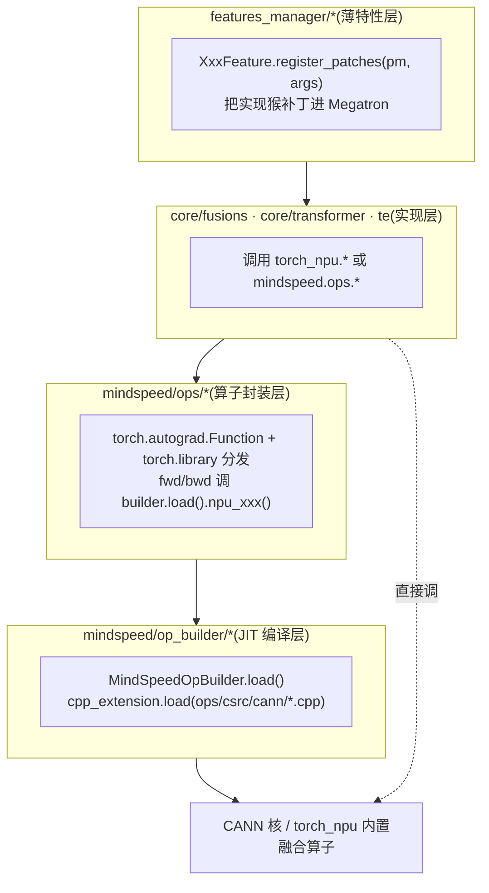
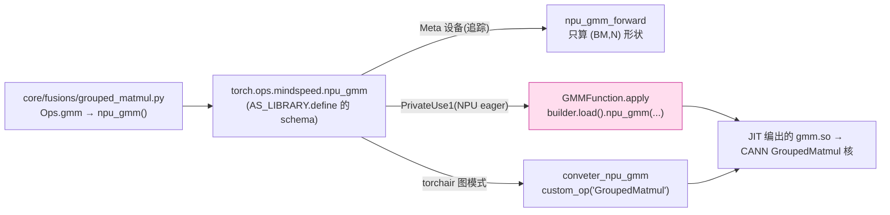

# MindSpeed 昇腾亲和特性与融合算子 — 源码级分析

> **代码基线**:MindSpeed core `master` @ `1432cb09`(patch Megatron `core_r0.17.0`)· MindSpeed-LLM `master` @ `0c16322d` · 阅读日期 2026-06-23
> **范围**:本页只讲"是什么让 MindSpeed *亲和昇腾(Ascend/NPU)*"——把通用算子换成 `torch_npu.*` / 自研 CANN 融合核的那条线。**每个融合算子都按统一四件套拆解**:① 融合内容(哪些散算子合进一个核)② before/after 图示 ③ 优化点 callout ④ 源码解读(实际调用 + autograd + 底层 `npu_*`)。并行切分见 [[mindspeed_parallelism_analysis]],通算掩盖(MC2/CoC/lcal)见 [[mindspeed_comm_overlap_analysis]],内存手段见 [[mindspeed_memory_optimization_analysis]],本页只交叉引用、不重复。属 [[mindspeed/index]] 系列。每条非平凡结论带 `file:line`,行号均经实际打开核对。

---

## 1. 总览:通用算子 → 昇腾原生融合核

MindSpeed 的"昇腾亲和"本质是一次**算子替换**:Megatron 默认走 PyTorch eager / CUDA / apex / NVIDIA-TransformerEngine 的算子,在 NPU 上要么没有、要么慢;每个亲和特性通过 `register_patches` 把对应函数猴补丁成调用 `torch_npu.*` 内置融合算子,或 `op_builder` 现场 JIT 编出来的自研 CANN 核。**融合**的统一收益是:N 个内存受限(memory-bound)散算子 → 1 个核,省掉中间张量的 HBM 来回(每个中间张量 = 1 写 + 1 读)与 kernel launch 开销。

| 通用算子(Megatron 默认) | MindSpeed 特性 | 底层昇腾核 | 融合内容(N→1) | 收益 |
|---|---|---|---|---|
| 逐专家 for-loop GEMM | **grouped-matmul (GMM)** | `npu_gmm`(自研 CANN `GroupedMatmul`) | E 次切片+GEMM → 1 次变长分组 GEMM | 免 launch 风暴、免 padding |
| `bias_swiglu`(逐元素) | **use-swiglu** | `torch_npu.npu_swiglu` | chunk+SiLU(σ·gate)+gate⊙up(~4 pass)→1 | 0 中间张量 |
| `RMSNorm`(逐元素链) | **use-fused-rmsnorm** | `torch_npu.npu_rms_norm` | x²+mean+ε+rsqrt+×x+×w(~6 pass)→1 | 1 读 1 写 |
| `apply_rotary_pos_emb` | **use-fused-rotary-pos-emb** | `npu_rotary_position_embedding`(自研) | rotate_half+×cos+×sin+add(~5 pass)→1 | 0 中间张量 |
| `ScaledMaskedSoftmax`(CUDA) | **fused-softmax** | `torch_npu.npu_scaled_masked_softmax` | scale+mask_fill+softmax(max/exp/sum/div)(~7)→1 | causal mask 核内生成 |
| permute/unpermute(argsort+gather) | **moe-permute-fusion** | `npu_moe_token_permute_with_routing_map` | argsort+gather(token)+gather(prob)→1 | routing-map 直驱重排 |
| `DotProductAttention`(QKᵀ·softmax·V) | **use-flash-attn / v2** | `torch_npu.npu_fusion_attention` | QKᵀ+scale+mask+softmax+·V →1,**不落 S×S** | O(S) 显存、online-softmax |
| `index_put` 式 cross-entropy | **affinity** | 逻辑取反×乘法(避 scatter) | scatter → 向量化乘 | 规避 NPU 低效散点写 |
| `FusedAdam`(apex) | **fused_ema_adamw / 低精度 / Muon** | `npu_apply_fused_ema_adamw` 等自研核 | AdamW(m,v,param)+EMA(~9 pass)→1 | 一步回写 4 张量 |
| HCCL 集合通信(偏大 buffer) | **hccl-group-buffer / op-mode / aiqos** | `ProcessGroupHCCL.Options.hccl_config` | — | 按组裁 buffer、调 QoS |

四层落地结构——薄特性层把实现猴补丁进 Megatron,实现层调 `torch_npu.*` 或 `mindspeed.ops.*`,ops 层用 autograd+`torch.library` 分发,op_builder 层把 CANN `.cpp` 现场 JIT:



> 全部特性都是 `MindSpeedFeature` 子类,契约(`register_args`/`register_patches`/`is_need_apply`/`optimization_level`)见 [[mindspeed/index]] §1。亲和类里:**默认补丁(O0)**有 GMM/swiglu/softmax/RoPE/RMSNorm/Muon/TE-basic/低精度优化器;**O2** 才放行 FA/MLA/DSA/moe-permute-fusion/QoS/QAT。各特性的 CLI 开关、等级与对应节,见下文每节标题(§3 融合算子默认即开,§4 注意力族需 O2)。

---

## 2. op_builder / ops 自定义算子系统(地基)

**命题**:昇腾的高性能核往往不在 `torch_npu` 里,而是 CANN 的 C++/AscendC 源码。MindSpeed 的 `op_builder` 是一套**运行期 JIT 编译器**——首次用到某算子时,把 `ops/csrc/cann/*.cpp` 用 `torch.utils.cpp_extension.load` 现编现载成 `.so`,再用 `torch.library` 把它注册成 `torch.ops.mindspeed.*` 算子,从而同时拿到 eager 执行与 torchair 图模式两条路径。

### 2.1 编译层:`MindSpeedOpBuilder.load()`

抽象基类的核心就是一个 `load()`:把子类 `sources()` 列的 `.cpp` 喂给 `cpp_extension.load`,链接参数硬挂 `-lascendcl`(CANN 运行时)与 `-ltorch_npu`,编译结果按 `name` 缓存进类级字典 `_loaded_ops`,**同一进程只编一次**(`op_builder/builder.py`):

```python
# op_builder/builder.py:11  —— 自定义命名空间,DEF=允许 define 新算子
AS_LIBRARY = Library("mindspeed", "DEF")

class MindSpeedOpBuilder(ABC):
    _loaded_ops = {}                                              # :18 类级编译缓存

    def extra_ldflags(self):                                      # :58-63 链接参数
        return ['-L'+os.path.join(self._cann_path, 'lib64'), '-lascendcl',
                '-L'+os.path.join(self._torch_npu_path, 'lib'), '-ltorch_npu']

    def load(self, verbose=True):                                 # :65-77 核心
        if self.name in __class__._loaded_ops:                   # :66-67 命中缓存即返
            return __class__._loaded_ops[self.name]
        op_module = load(name=self.name,                         # :69-74 现场 JIT 编 .cpp
                         sources=self.get_absolute_paths(self.sources()),
                         extra_include_paths=self.get_absolute_paths(self.include_paths()),
                         extra_cflags=self.cxx_args(),           # :53-56 安全加固档
                         extra_ldflags=self.extra_ldflags())
        __class__._loaded_ops[self.name] = op_module             # :75 入缓存
        return op_module
```

`cxx_args()` 走安全加固档:`-fstack-protector-all -fPIC -fvisibility=hidden -D_FORTIFY_SOURCE=2 -O2`(`builder.py:53-56`),GMM 子类再按 torch 版本追 `-std=c++17`(≥2.1)或 `c++14`(`gmm_builder.py:80-84`)。`register_op_proto()` 用 `AS_LIBRARY.define(proto)` 把算子 schema 注册进自定义命名空间(`builder.py:34-38`)。

### 2.2 子类层:`GMMOpBuilder` 声明算子 schema 与 Meta/GE 转换器

以 GMM 为例,一个 builder 子类干三件事:① `sources()` 指向 CANN `.cpp`;② `OP_PROTO` 声明算子签名(两个重载);③ 在 `register_op_ir()` 里为 **Meta 设备**注册形状推断、为 **torchair 图模式**注册 GE 转换器落到 CANN 自定义算子 `GroupedMatmul`(`op_builder/gmm_builder.py`):

```python
# op_builder/gmm_builder.py:88-126
class GMMOpBuilder(GMMOpBuilderPublic):
    OP_NAME = "grouped_matmul"
    OP_PROTO = (                                                  # :90-93 两个重载签名
        "npu_gmm.Tensor(Tensor original_weight, Tensor x, Tensor weight, *, "
        "Tensor? bias=None, Tensor? group_list=None, int? group_type=0, "
        "bool? gemm_fusion=False) -> Tensor",
        "npu_gmm.List(... int[]? group_list=None ...) -> Tensor")

    def sources(self):                                           # :64-65 现场编的 CANN 源
        return ['ops/csrc/cann/gmm.cpp', 'ops/csrc/flop_counter/flop_counter.cpp']

    def register_op_ir(self):
        @impl(AS_LIBRARY, "npu_gmm.Tensor", "Meta")             # :101 形状/dtype 推断(不算数)
        def npu_gmm_forward(original_weight, x, weight, *, bias=None,
                            group_list=None, group_type=0, gemm_fusion=False):
            BM, N = x.shape[0], weight.shape[-1]
            return x.new_empty((BM, N), dtype=x.dtype)          # :103-106 只给出输出 shape

        @register_fx_node_ge_converter(torch.ops.mindspeed.npu_gmm.Tensor)  # :108 torchair 图模式
        def conveter_npu_gmm(original_weight, x, weight, *, ...):
            result = conveter_npu_gmm_param(x, bias, group_type)
            return GroupedMatmul([x], [weight], ..., group_list,            # :124-126 落 CANN GroupedMatmul
                                 split_item=3, group_type=group_type, group_list_type=0)[0]
```

`GroupedMatmul(...)` 最终调 `torchair.ge.custom_op("GroupedMatmul", ...)`(`gmm_builder.py:213`)。`group_list_type=0`(`GMMOpBuilder`,`group_list` 为**累积** token 数)与 `=1`(`GMMV2OpBuilder`,**每组**计数)对应两套 proto/转换器(`gmm_builder.py:90-93 vs 131-133`,`group_list_type` 在 `:126 / :166`)。

### 2.3 封装层:`ops/gmm.py` 的三种"分发键"

`MindSpeedOpBuilder` 只负责"编",真正的 eager 执行体在 `ops/gmm.py`:一个 `torch.autograd.Function` 管前反向,再用 `@impl(..., "PrivateUse1")` 把它绑到 NPU 设备键。**`PrivateUse1` 就是 PyTorch 给 NPU 预留的私有 dispatch key**——这是 eager 路径在 NPU 上被真正调用的入口:

```python
# ops/gmm.py:153-161  —— eager NPU 执行入口(.Tensor 与 .List 两个重载共用)
@impl(AS_LIBRARY, "npu_gmm.List", "PrivateUse1")
@impl(AS_LIBRARY, "npu_gmm.Tensor", "PrivateUse1")
def _npu_gmm(original_weight, x, weight, *, bias=None, group_list=None,
             group_type=0, gemm_fusion=False):
    group_list_data_type = 1 if isinstance(group_list, (torch.Tensor, type(None))) else 0
    group_args = (group_list, group_type, gemm_fusion, 0, group_list_data_type)
    return GMMFunction.apply(original_weight, x, weight, bias, group_args)   # 进 autograd
```

于是同一个 `npu_gmm` 算子注册到**三种键**,各司其职:

| 分发键 | 用途 | 注册点 |
|---|---|---|
| `Meta` | 形状/dtype 推断(不算数,供编译追踪) | `@impl(AS_LIBRARY, "npu_gmm.Tensor", "Meta")`,`gmm_builder.py:101` |
| `PrivateUse1` | **NPU eager 真正执行**(走 `GMMFunction`) | `@impl(AS_LIBRARY, "npu_gmm.Tensor", "PrivateUse1")`,`gmm.py:153-154` |
| GE converter | torchair 图模式落 CANN `GroupedMatmul` 节点 | `@register_fx_node_ge_converter(...)`,`gmm_builder.py:108` |



`op_builder/__init__.py:1-27` 登记了约 27 个 builder:`SwigluOpBuilder`/`RmsNormOpBuilder`/`FusionAttentionV2OpBuilder`/`FFNOpBuilder`/`RotaryPositionEmbeddingOpBuilder`/`MatmulAddOpBuilder`/`FusedEmaAdamWOpBuilder`/各类 `*AllReduce*`/`MoeTokenPermute/Unpermute`/`NPUSparseLIGradKlLoss`(DSA)等,覆盖融合算子、MC2 通算融合核、融合优化器、DSA 稀疏核。

> [!tip] 优化点(地基级)
> op_builder ≠ 普通 Python 封装,它是"把 CANN 源码编进训练进程"的机制。三个硬收益:① **`-lascendcl` 链接** + 现编现载,让 `torch_npu` 没有的核(GMM、融合优化器、DSA、MC2)也能在 NPU 上跑;② **`Meta`/`PrivateUse1`/`GE` 三键**让同一算子在 eager 与 torchair 图模式两条路径都可用、shape 可追踪;③ **类级 `_loaded_ops` 缓存**(`builder.py:18,66-67`)保证一个进程只 JIT 编一次,把编译开销摊销为 0。这是 MindSpeed 区别于纯 Python monkey-patch 的硬核底座。

---

## 3. 融合算子(fusions)

> 本节六个算子全部按四件套展开:**融合内容 → before/after 图示 → 优化点 callout → 源码解读**。

### 3.1 GroupedMatmul(GMM)—— MoE 专家计算的第一原语

**融合内容**:MoE 把若干专家权重堆成一个张量,token 按路由分到各专家。朴素实现 = E 个独立 GEMM,逐专家循环 launch;GMM 用一个 `group_list`(各组**累积** token 数)把它们融成一次变长分组矩阵乘。反向再融一道:权重梯度 `dgrad=xᵀ·dy` 与"累加进 `main_grad`"两步合一。

| 朴素散算子(每专家 e=0..E-1) | GMM 融合后 |
|---|---|
| `x_e = x[start_e:end_e]`(切片) ×E | 1 次 `npu_gmm`,内部按 `group_list` 切段 |
| `y_e = x_e @ W_e`(GEMM)×E | — |
| (或 padding 到等长再 batched GEMM,浪费算力) | 变长,免 padding |
| 反向:`dW_e = x_eᵀ @ dy_e` + `main_grad += dW_e`(2 步×E) | `npu_groupmatmul_add_fp32`:matmul+accumulate 一步 |

**图示**:

```
朴素逐专家 for-loop                          GMM 一次 launch
E0  x0 ─▶[GEMM W0]─▶ y0  (launch#1)
E1  x1 ─▶[GEMM W1]─▶ y1  (launch#2)          ▣▣▣▣▣|▣▣▣|▣▣▣▣▣▣▣|▣▣  tokens
E2  x2 ─▶[GEMM W2]─▶ y2  (launch#3)   ──▶    └W0─┘└W1┘└── W2 ──┘└W1┘
E3  x3 ─▶[GEMM W3]─▶ y3  (launch#4)          group_list=cumsum([5,3,7,2])=[5,8,15,17]
   E 次 launch + E 段中间输出                 1 次 npu_gmm launch,核内按 group_list 切段
```

> [!tip] 优化点(GMM)
> ① **kernel launch:E→1**——E=64/256 个专家时省掉 launch 风暴,把"调度密集"变"算力密集",拉满 Cube 占用;② **免 padding**——变长分组直接吃真实 token 数,不浪费算力在 pad 上;③ **反向权重梯度融合**:`npu_groupmatmul_add_fp32` 把 `dgrad=xᵀ·dy` 的矩阵乘与"累加进 `weight.main_grad`"两步并成一个核,**省掉一次对 main_grad 的 HBM 读写**(`ops/gmm.py:60`)。

**源码解读**:特性把 Megatron 的 `grouped_gemm_util.ops` 整体换成 MindSpeed 的 `Ops`,并伪造 `get_device_capability` 返回 `(9,0)` 让 Megatron 原生那条"GMM 是否可用"的 CUDA 能力检查在 NPU 上通过(`features_manager/fusions/grouped_matmul.py:9-16`、`core/fusions/grouped_matmul.py:38-39`);`Ops.gmm` 把 `batch_sizes` 做 `cumsum` 成 `group_list` 再调 `npu_gmm`(`core/fusions/grouped_matmul.py:7-21`)。autograd 体现反向的权重梯度融合(`ops/gmm.py`):

```python
# ops/gmm.py:33  —— 前向:一次 launch 完成变长分组 GEMM
outputs = GMMFunction.builder.load().npu_gmm([x], [weight], bias, group_list, group_type, group_list_type)
...
# ops/gmm.py:56-66  —— 反向:开 gemm_fusion 时,权重梯度不单独算
if ctx.gemm_fusion:
    dx, _, dbias = GMMFunction.builder.load().npu_gmm_backward_fusion(   # :58 只算 dx/dbias
        [grad_outputs], [weight], group_list, ctx.group_list_type)
    npu_groupmatmul_add_fp32(x, grad_outputs, group_list,               # :60 dgrad 直接累加进 main_grad
                             original_weight.main_grad)
```

`npu_groupmatmul_add_fp32` 把权重梯度直接累加进 `weight.main_grad`——A5 机型调内置 `torch_npu.npu_grouped_matmul_add_`,否则走 JIT 核(`ops/npu_groupmatmul_add.py:11-16`):

```python
# ops/npu_groupmatmul_add.py:11-16
def npu_groupmatmul_add_fp32(x, dy, grouplist, grad):
    if check_npu_version(NPUVersion.A5):                                       # A5:内置融合核
        torch_npu.npu_grouped_matmul_add_(grad.view(grouplist.shape[0], x.shape[-1],
                                          dy.shape[-1]), x, dy, grouplist)
    else:                                                                      # 其余:JIT 核
        groupmatmul_add_op_builder.load().npu_groupmatmul_add_fp32(x, dy, grouplist.to('npu'), grad)
```

GE 图模式落到 CANN `GroupedMatmul`,`split_item=3`(`gmm_builder.py:124-126`)——这是变长分组的关键属性。

### 3.2 SwiGLU —— gate/up 链路融成单核

**融合内容**:LLaMA/Qwen 的 FFN 门控激活 `SwiGLU(x) = SiLU(gate) ⊙ up`,其中 `gate, up = chunk(x, 2)`、`SiLU(z) = z·σ(z)`。朴素实现是 4 个逐元素 pass:

| 朴素散算子 | 中间张量 |
|---|---|
| `gate, up = x.chunk(2, dim=-1)`(split) | gate, up |
| `s = sigmoid(gate)` | s |
| `silu = gate * s` | silu |
| `out = silu * up` | out |
| 含 bias 时再前置 `x = x + bias` | — |

`torch_npu.npu_swiglu(x, dim=-1)` 把上面 4 步全部融进一个核。

**图示**:

```
朴素(逐元素,3 个中间张量)                      融合(1 核,0 中间张量)
x ─chunk─▶ gate ─σ─▶ s ─×─▶ silu ─×─▶ out      x ─▶[ npu_swiglu(dim=-1) ]─▶ out
       └▶ up ───────────────────┘              gate/up 切分、SiLU、⊙ 全核内完成
  HBM: 写 gate,up,s,silu + 多次读                HBM: 读 x 一次,写 out 一次
```

> [!tip] 优化点(SwiGLU)
> kernel launch **~4→1**;中间张量 `s/silu`(各 `[S·B, H_ffn]`)**0 落 HBM**——对 `S·B=10K, H_ffn=8192, bf16` 的一层,单 `silu` 中间张量就 ~160MB,融合后这块 HBM 来回(写+读 ~320MB/层)整段消失。+bias 变体把 `x+bias` 也并进核内(`fused_bias_swiglu.py:17`)。

**源码解读**:`SwiGLUFunction`/`BiasSwiGLUFunction` 都只是 `fused_swiglu` 的薄壳(`core/fusions/fused_bias_swiglu.py`):

```python
# core/fusions/fused_bias_swiglu.py:4-17
def fused_swiglu(x):
    return torch_npu.npu_swiglu(x, dim=-1)        # :5  chunk+SiLU+⊙ 三步一核

class SwiGLUFunction:
    @staticmethod
    def apply(x, *args):
        return fused_swiglu(x)                     # :11

class BiasSwiGLUFunction:
    @staticmethod
    def apply(x, bias, *args):
        return fused_swiglu(x + bias)              # :17 含 bias 的变体
```

特性把 Megatron 的 `fused_bias_swiglu.SwiGLUFunction/BiasSwiGLUFunction` 替换成上面两个类(`features_manager/fusions/fused_bias_swiglu.py:9-11`)。各 MoE expert 路径(`core/transformer/moe/experts.py:110` 等)在 `gated_linear_unit` 且激活为 silu 时直接把 `activation_func` 设为 `fused_swiglu`;MoE 加权变体(probs 直乘)走 `mindspeed_groupedmlp_weighted_bias_swiglu_impl`,`res = fused_swiglu(x) * probs`(`te/pytorch/module/grouped_linear.py:402-411`)。

### 3.3 RMSNorm —— 归一化逐元素链融成单核

**融合内容**:`RMSNorm(x) = x · rsqrt(mean(x²)+ε) · weight`。朴素 `_norm` 是一串逐元素 + 一个 reduce:

| 朴素散算子(`_norm` + 缩放) | 说明 |
|---|---|
| `xf = x.float()` | 升精度 cast |
| `x2 = xf.pow(2)` | 逐元素平方 → 中间张量 |
| `ms = x2.mean(-1, keepdim=True)` | reduce |
| `r = rsqrt(ms + ε)` | 逐元素 |
| `n = xf * r` | 逐元素乘(广播) |
| `out = n.type_as(x) * weight` | cast + 逐元素乘 |

`torch_npu.npu_rms_norm(x, weight, eps)[0]` 把这 ~6 步融进一个核。

**图示**:

```
朴素 _norm(多核 + 中间张量 x2)                       融合(1 核)
x ─cast─▶xf ─pow2─▶x2 ─mean─▶ms ─+ε,rsqrt─▶r           x ─┐
xf ─────────────────────────────────×──▶ n ─×w─▶ out   w ─┴▶[ npu_rms_norm ]─▶ out
  写 x2(全尺寸)、reduce、两次乘                          读 x/w,写 out;x² 不落 HBM
```

> [!tip] 优化点(RMSNorm)
> kernel launch **~6→1**;`x²` 这个**和输入等大**的中间张量 0 落 HBM(对 `[S·B, H]` 而言这是最贵的一块);reduce 与逐元素乘在核内流水,只读 x/weight 一次、写 out 一次。每个 Transformer 层有 2 个 norm(attn 前、ffn 前),80 层即省 160 次 launch×(fwd+bwd)。保留 `unfused_rmsnorm` 作回退,由 `config.use_fused_rmsnorm` 开关选择(`fused_rms_norm.py:39-42`)。

**源码解读**(`core/fusions/fused_rms_norm.py`):

```python
# core/fusions/fused_rms_norm.py:29-42
def _norm(self, x):
    return x * torch.rsqrt(x.pow(2).mean(-1, keepdim=True) + self.eps)   # 朴素:多核
def unfused_rmsnorm(self, x):
    output = self._norm(x.float()).type_as(x)                            # :32-34 回退
    return output * self.weight
def fused_rmsnorm(self, x):
    return torch_npu.npu_rms_norm(x, self.weight, epsilon=self.eps)[0]   # :37 单核
def forward(self, x):
    if self.config.use_fused_rmsnorm:
        return self.fused_rmsnorm(x)                                     # :40-41
    return self.unfused_rmsnorm(x)
```

`npu_rms_norm` 是 `torch_npu` 内置融合核;`op_builder/__init__.py:8` 另有 `RmsNormOpBuilder` 给需要 JIT 自研变体的场景(如 `add_rms_norm` 通算融合,见 [[mindspeed_comm_overlap_analysis]])。

### 3.4 Fused RoPE —— cos/sin 旋转单核

**融合内容**:旋转位置编码 `RoPE(t) = t⊙cos + rotate_half(t)⊙sin`。朴素版里 `rotate_half` 本身就是 split+neg+cat,加上两次乘、一次加:

| 朴素散算子 | 说明 |
|---|---|
| `x1,x2 = t[...,:d/2], t[...,d/2:]`(split) | rotate_half 内部 |
| `rh = cat(-x2, x1)`(neg + concat) | 中间张量 |
| `a = t * cos` | 逐元素乘 |
| `b = rh * sin` | 逐元素乘 |
| `out = a + b` | 逐元素加 |

`npu_rotary_position_embedding(t, cos, sin, mode)` 把 rotate-half + 两次乘 + 加全融进一个核;`mode=1` 走交错(interleaved)布局,`mode=0` 走常规。

**图示**:

```
朴素(~5 核,中间张量 rh/a/b)                      融合(1 核)
t ─split/neg/cat─▶ rh ─×sin─▶ b ─┐               t ─┐
t ─×cos──────────────────▶ a ────┴+▶ out         cos┼▶[ npu_rotary_position_embedding(mode) ]─▶ out
                                                 sin┘   rotate_half/×cos/×sin/+ 全核内
```

> [!tip] 优化点(RoPE)
> kernel launch **~5→1**;`rotate_half` 产生的 concat 中间张量(与输入等大)0 落 HBM。**注意一处亲和细节**:yarn 缩放时 MindSpeed 强制关 rope-fusion(`fused_rope.py:85-87`),因为 yarn 的 mscale 要在 cos/sin 上额外缩放,与定长融合核不兼容——这是"融合不是免费"的真实边界。

**源码解读**:`apply_rotary_pos_emb_bshd` 在 `--use-fused-rotary-pos-emb` 打开时调自研 CANN 核,否则回退逐元素版(`core/fusions/fused_rope.py`):

```python
# core/fusions/fused_rope.py:58-74
if multi_latent_attention:                       # :58-61 MLA:先做奇偶位拼接预处理
    x1, x2 = t[..., 0::2], t[..., 1::2]
    t = torch.cat((x1, x2), dim=-1)
rot_dim = freqs.shape[-1]
t, t_pass = t[..., :rot_dim], t[..., rot_dim:]   # :64 只旋转前 rot_dim 维
cos_ = (torch.cos(freqs) * _mscale).to(t.dtype)  # :65
sin_ = (torch.sin(freqs) * _mscale).to(t.dtype)  # :66
if getattr(args, "use_fused_rotary_pos_emb"):    # :68
    mode = 1 if rotary_interleaved else 0        # 交错与否决定 mode
    t = npu_rotary_position_embedding(t.contiguous(), cos_, sin_, mode).to(t.dtype)  # :70 单核
else:
    t = (t * cos_) + (_rotate_half(t, rotary_interleaved) * sin_)                     # :72 回退
```

`npu_rotary_position_embedding` 由 `RotaryPositionEmbeddingOpBuilder` JIT 加载,薄封装直接转发到 `.so` 里的 `npu_rotary_position_embedding(x, cos, sin, mode)`(`ops/npu_rotary_position_embedding.py:10-12`)。MLA 的奇偶位拼接(`:58-61`)是因为 MLA 的 rope 段排布与标准不同,需先交错重排再进核。

### 3.5 Fused Softmax —— scale+mask+softmax 三步一核(带硬约束)

**融合内容**:注意力打分的 `softmax(scale·QKᵀ + mask)`。softmax 本身是 5 个 pass(max/sub/exp/sum/div),加上 scale 乘与 mask 填 `-inf`:

| 朴素散算子 | 中间/代价 |
|---|---|
| `s = input * scale` | 全尺寸 `[b,np,sq,sk]` 中间 |
| `s = s.masked_fill(mask, -inf)` | 需物化完整 mask 张量 |
| `m = s.max(-1)` / `s = s - m` | softmax 数值稳定 |
| `e = exp(s)` / `z = e.sum(-1)` / `out = e / z` | 3 pass |

`torch_npu.npu_scaled_masked_softmax(input, mask, scale, fixed_triu)` 把这 ~7 步融成一个核;`fixed_triu=True` 时**因果三角 mask 在核内即时生成**,无需物化完整 mask。

**图示**:

```
朴素(~7 核 + 物化 S×S mask)                          融合(1 核)
QKᵀ ─×scale─▶ s ─maskfill─▶ s' ─max/sub/exp/sum/div─▶ out   input ─┐
                ▲                                                  mask ┼▶[ npu_scaled_masked_softmax ]─▶ out
          物化 [b,np,sq,sk] mask                                 scale ┘  causal 时核内生成三角(免 mask 张量)
```

> [!tip] 优化点(Softmax)
> kernel launch **~7→1**;softmax 的 max/exp/sum 三趟 reduce 在核内流水,中间张量不落 HBM;**因果场景(`ScaledUpperTriangMaskedSoftmax`)的三角 mask 由核内 `fixed_triu_mask=True` 即时生成**,省掉完整 `[b,np,sq,sk]` mask 张量的物化与读写(`fused_softmax.py:13,47`)。代价是硬约束:`is_kernel_available` 要求 fp16、`32<sk≤4096`、`sq/sk` 整除 16,不满足就回退非融合实现(`fused_softmax.py:30-37`)。

**源码解读**:三个类统一落到 `npu_scaled_masked_softmax`(`core/fusions/fused_softmax.py`):

```python
# core/fusions/fused_softmax.py:6-27
class ScaledUpperTriangMaskedSoftmax:            # 因果:第 4 参 True → 核内生成上三角
    @staticmethod
    def apply(input_, scale):
        ... output = torch_npu.npu_scaled_masked_softmax(input_, dummy_mask, scale, True)  # :13
class ScaledMaskedSoftmax:                       # 任意 mask
    @staticmethod
    def apply(input_, mask, scale):
        return torch_npu.npu_scaled_masked_softmax(input_, mask, scale, False)             # :20
class ScaledSoftmax:                             # 无 mask
    @staticmethod
    def apply(input_, scale):
        ... return torch_npu.npu_scaled_masked_softmax(input_, dummy_mask, scale, False)   # :27
```

派发逻辑在 `forward_fused_softmax`:因果且 `sq==sk` 走 `True`(上三角),否则按是否有 mask 走 `False` 或 `ScaledSoftmax`(`fused_softmax.py:40-52`)。

### 3.6 MoE Permute / Unpermute Fusion(O2)

**融合内容**:MoE dispatch 要把 token 按所属专家重排成连续段。朴素三步:从 `routing_map` 算排序索引、按索引 gather token、按索引 gather 概率。

| 朴素散算子 | 说明 |
|---|---|
| `sorted_indices = argsort(routing_map flatten)` | 排序 |
| `permuted = tokens[sorted_indices]`(gather) | 散点读 |
| `permuted_probs = probs[...]`(gather) | 散点读 |
| (drop_and_pad 还要单独 pad) | — |

`npu_moe_token_permute_with_routing_map` 把 sort + 两次 gather(+ drop_and_pad)融成一个核,routing-map 直接驱动重排。

**图示**:

```
朴素(argsort + 多次 gather)                         融合(1 核)
routing_map ─argsort─▶ idx ─gather(tokens)─▶ permuted    tokens ─┐
                          └gather(probs)──▶ permuted_probs  routing_map ┼▶[ npu_moe_token_permute_with_routing_map ]
   显式 idx 张量 + 散点读                                   probs ───┘  ─▶ permuted, permuted_probs, sorted_indices
```

> [!tip] 优化点(MoE permute)
> sort+gather **多核→1**,且 routing-map 直接驱动重排,免去显式 `argsort`+多次 `gather` 的散点访存;反向同样有融合核 `..._grad`。代价:需要 CANN≥8.3.RC1、PTA≥7.2.RC1,缺失则降级警告(`features_manager/fusions/fused_moe_permute.py:27-37`),且只支持 alltoall / alltoall_seq dispatcher,allgather 报错(`:44-47`)。

**源码解读**:`MoePermuteMaskMap`(autograd)前向调融合核、反向调对称的 grad 核(`te/pytorch/permutation.py`):

```python
# te/pytorch/permutation.py:24-25(forward)
permuted_input, permuted_probs, sorted_indices = torch_npu.npu_moe_token_permute_with_routing_map(
    tokens, routing_map, probs=probs, num_out_tokens=num_out_tokens, drop_and_pad=drop_and_pad)
# :53 (backward) —— 反向重用 sorted_indices/routing_map
act_grad, probs_grad = torch_npu.npu_moe_token_permute_with_routing_map_grad(
    permuted_act_grad, permuted_probs_grad, sorted_indices, routing_map, num_experts, num_tokens, drop_and_pad)
```

Unpermute 对称:`MoeUnpermuteMaskMap` 前向调 `_npu_moe_token_unpermute_with_routing_map`(`:85-87`),反向 `npu_moe_token_unpermute_with_routing_map_grad`(`:120/:134`)。因为 TE 的 permute 接口缺 `drop_and_pad`/`routing_map` 入参,特性改补丁 megatron 的 `moe_utils.permute/unpermute`(`fused_moe_permute.py:77,82`)而非 TE 接口。

---

## 4. Flash-Attention 家族(含 MLA / DSA)

**命题**:注意力是显存与算力双瓶颈,**朴素实现的致命点是要物化 `S×S` 注意力矩阵**(`S=8K` 时单头单 batch 就是 256MB)。MindSpeed 把 Megatron 的 `DotProductAttention.forward` 整体替换成调用昇腾 FlashAttention 融合核 `npu_fusion_attention`。

**融合内容**:`Attn = softmax(scale·QKᵀ + mask) · V`,朴素是 7+ 个 pass 且中途物化 S×S:

| 朴素散算子 | 中间张量 |
|---|---|
| `S = Q @ Kᵀ`(matmul) | **`[b,np,sq,sk]` 全尺寸 S×S** |
| `S = S * scale` | S×S |
| `S = S + mask` | S×S |
| `softmax(S)`(max/sub/exp/sum/div,5 pass) | S×S 多趟 |
| `dropout(S)` | S×S |
| `O = S @ V`(matmul) | — |

`npu_fusion_attention` 用**分块 tiling + online-softmax**,把 QKᵀ→scale→mask→softmax→·V 全部在片上(SRAM)流水完成,**S×S 矩阵从不写回 HBM**。

**图示**:

```
朴素 DotProductAttention(物化 S×S)              FlashAttention 融合核(O(S) 显存)
Q,K ─matmul─▶ S[S×S] ─×scale─▶ ─+mask─▶          Q,K,V(分块)
   ─softmax(max/exp/sum/div)─▶ P[S×S]            ──▶[ npu_fusion_attention ]──▶ O
   ─dropout─▶ ─matmul V─▶ O                       逐块 QKᵀ→online-softmax→·V,S×S 只在 SRAM
   HBM 峰值 ∝ S²                                  HBM 峰值 ∝ S(只存 Q/K/V/O + softmax 统计量)
```

> [!tip] 优化点(Flash-Attention)
> ① **最大的赢点是显存:O(S²)→O(S)**——`S×S` 注意力矩阵从不物化到 HBM,长序列训练的显存墙被推开(这是它和上面逐元素融合的本质区别:省的不是 launch,是**整张二次方矩阵**);② kernel launch **7+→1**;③ online-softmax 让 max/sum 在分块流水中增量更新,无需对 S×S 做全局 reduce;④ TND 布局下多条变长样本拼一条、用 `actual_seq_*` 切回,**免 padding**(`adaptor.py:49-56`)。

**源码解读**:`FusionAttentionFeature`(O2,`--use-flash-attn`)**仅当 CP 关闭时**才接管 `DotProductAttention.forward`(`fusion_attention_v1_feature.py:58-68`);CP 开启时由 [[mindspeed_context_parallel_analysis]] 的 ring/ulysses 注意力接管。实现体先按 packed 与否选布局,再调融合核(`flash_attention/adaptor.py`):

```python
# core/transformer/flash_attention/flash_attention/adaptor.py:43-83
sparse_mode = self.config.sparse_mode
if attn_mask_type == AttnMaskType.no_mask:
    sparse_mode = 0                                    # :44-45 no_mask 强制 0
if packed_seq_params is not None:                      # :49 TND(变长 packing)
    actual_seq_qlen  = packed_seq_params.cu_seqlens_q.tolist()
    actual_seq_kvlen = packed_seq_params.cu_seqlens_kv.tolist()
    shape_order = 'TND'
else:                                                  # :57 SBH(常规)
    query, key, value = [rearrange(x, 's b h d -> s b (h d)') for x in [query, key, value]]
    shape_order = 'SBH'
output = torch_npu.npu_fusion_attention(               # :68-83 一行融合核
    query, key, value, n_head, shape_order,
    atten_mask=attention_mask, scale=scale,            # scale = softmax_scale (:47)
    pre_tockens=self.config.pre_tockens,               # 滑窗左可见范围
    next_tockens=self.config.next_tockens,             # 滑窗右可见范围
    keep_prob=1 - self.attention_dropout.p,            # dropout 保留率
    inner_precise=0, sparse_mode=sparse_mode,          # sparse_mode: 9 种 mask 形态码
    actual_seq_qlen=actual_seq_qlen,                   # TND 下各样本真实长度
    actual_seq_kvlen=actual_seq_kvlen)[0]
```

布局二选一(`adaptor.py:49-66`):**SBH** 把 `[s,b,h,d]` rearrange 成 `[s,b,h·d]`;**TND** 把多条变长样本拼成一条,用 `cu_seqlens_q/kv` 给出各样本边界、`actual_seq_*` 切回,免 padding。`--sparse-mode` 暴露 9 种 mask 形态(0 defaultMask / 2 leftUpCausal / 3 rightDownCausal / 4 band / 5-6 prefix / 7-8 varlen,`fusion_attention_v1_feature.py:35-52`),v1 的 `validate_args` 只许 0/2(`:54-56`);`pre/next-tockens` 控制滑窗范围(默认 65536/0,`:24-34`)。

**FA v2 / MLA / DSA**:

- **FA v2**(`--use-fusion-attn-v2`,默认关、主要给 alibi):落到自研 `npu_fusion_attention_v2`,alibi 偏置作为 `pse` 传入(builder `FusionAttentionV2OpBuilder`,`op_builder/__init__.py:1`)。
- **MLA**(`--multi-head-latent-attention`):特性把 `MultiLatentAttention`/`DotProductAttention` 的 `__init__` 替换为 MindSpeed 版,并把参数名 `qk_nope/rope_head_dim` 映射回 Megatron 的 `qk_head_dim/qk_pos_emb_head_dim`;RoPE 段对 MLA 做奇偶位拼接(§3.4 的 `fused_rope.py:58-61`)。
- **DSA(DeepSeek Sparse Attention)**(实验,`--experimental-attention-variant dsa`):**core 侧 `dsa.py` 只是参数门**——注册 `--use-dsa-absorb`/`--use-fused-lightning-indexer`/`--use-fused-sparse-flash-attention`/`--use-fused-lightning-indexer-kl-loss` 并做互斥校验(`dsa.py:12-44`,`validate_args` 在 `:31-40` 要求四个开关同开),**整个类没有 `register_patches`**。真正的稀疏注意力融合核是自研 CANN 算子,源码在 `ops/csrc/cann/npu_lightning_indexer.cpp`、`npu_sparse_attn_shared_kv.cpp`,builder 见 `NPUSparseLIGradKlLossOpBuilder`(`op_builder/__init__.py:27`),实际接线在 MindSpeed-LLM 模型层。

---

## 5. HCCL buffer 管理

**命题**:HCCL(昇腾的 NCCL 对位)给每个通信组预留一块固定 staging buffer,默认偏大,N 个并行组叠起来吃掉大量显存。MindSpeed 三个特性允许**按组精调** buffer 尺寸与算子展开模式。

机制统一:补丁 `parallel_state.get_nccl_options`(返回 `ProcessGroupHCCL.Options()`),在建组时把每组配置塞进 `options.hccl_config`(`core/hccl_buffer/adaptor.py`):

```python
# core/hccl_buffer/adaptor.py:16-26  —— 自适应路径:每组按名取算好的 buffer 尺寸
def get_nccl_options_wrapper(get_nccl_options):
    def wrapper(pg_name, nccl_comm_cfgs):
        if args.hccl_group_buffer_adaptive and _HCCL_GROUP_BUFFER.get(pg_name) is not None:
            options = torch_npu._C._distributed_c10d.ProcessGroupHCCL.Options()
            options.hccl_config = {"hccl_buffer_size": _HCCL_GROUP_BUFFER[pg_name]}   # :23-24 按组裁 buffer
            return options
        return get_nccl_options(pg_name, nccl_comm_cfgs)
    return wrapper
```

- **`--hccl-group-buffer "tp:200;ep:300;..."`**(手动):`parse_hccl_buffer_string` 解析成 `{pg_name: MB}`,建组时 `options.hccl_config = {"hccl_buffer_size": ...}`(`hccl_buffer_set_wrapper`,`adaptor.py:46-57`)。
- **`--hccl-group-buffer-adaptive`**(自动):`hccl_buffer_auto_adaptive` 按 `seq_length/mbs/hidden_size` 与各并行度,逐组算"最大通信量"再换算成 MB(`adaptor.py:31-43`)。
- **`--hccl-op-mode`**:把 `hccl_op_expansion_mode` 写进每组 `hccl_config`——这是昇腾特有的"集合通信算子在 AI Core 上展开 vs 由 AI CPU 调度"的开关,影响小消息延迟。

> [!tip] 优化点(HCCL buffer)
> HCCL buffer 是**预留的常驻显存**,默认值为兼容最坏情况而偏大;真实通信量由 `S/CP/TP/EP` 等并行度决定。按组精算把这块"隐形常驻显存"压到实际需要——长序列 / 大 EP 下省下的 HBM 相当可观,且不影响任何算子精度(纯系统级调优)。

---

## 6. CPU affinity 与 QoS

> [!warning] 命名陷阱——`AffinityFeature` 不是 CPU 绑核
> 直觉上 "affinity" 应是 CPU 核 / NUMA 绑定。**但 MindSpeed core 里全仓没有 `sched_setaffinity` / `numa` / `bind_cpu` 任何调用**(grep 为空,MindSpeed-LLM 同样)。`features_manager/affinity/affinity.py` 实际做的是一次**昇腾亲和的 cross-entropy 重写**。

`AffinityFeature` 把 `VocabParallelCrossEntropy.calculate_predicted_logits` 替换为 MindSpeed 版。差异在于:把"将被 mask 的元素置零"这个操作,从 `index_put_`/scatter 改成**逻辑取反再乘**(`core/tensor_parallel/cross_entropy.py`):

```python
# core/tensor_parallel/cross_entropy.py:18-32
target_mask = (target < vocab_start_index) | (target >= vocab_end_index)   # :18 越界 token 掩码
masked_target = target.clone() - vocab_start_index
masked_target *= ~target_mask          # :20 取反×乘,等价于"被 mask 处置 0",但避开 scatter
...
predicted_logits = predicted_logits_1d.view_as(target)
predicted_logits *= ~target_mask       # :32 同理,规整向量化乘法
```

散点写(scatter / `index_put_`)在 NPU 上会触发低效的非连续访存 / 同步,而逐元素乘 `*= ~mask` 是规整的向量化操作——故"亲和":不是融合更多算子,而是**把一个对 NPU 不友好的算子换成等价但访存规整的写法**。

**QoS**(`--aiqos`,O2):把 `initialize_model_parallel` 整体换成 `initialize_model_parallel_qos`,在每次建组时按"并行类型"分配网络 / SDMA 优先级(`core/qos/adaptor.py`):

```python
# core/qos/adaptor.py:69-94  —— 按 parallel_type 给集合通信打流量优先级标签
roce_qos = ai_qos.set_parallel_roce_qos(parallel_type)   # :70  0-7
sdma_qos = ai_qos.set_parallel_sdma_qos(parallel_type)   # :71  0-7
if is_a3_version:                                         # A3 机型
    if args.aiqos_enable_roce:
        kwargs['pg_options'].hccl_config = {'hccl_sdma_qos': sdma_qos,        # :86-87
            'qos_service_level': roce_qos, 'qos_traffic_class': roce_qos * 32}
    else:
        kwargs['pg_options'].hccl_config = {'hccl_sdma_qos': sdma_qos}        # :90
else:                                                     # 非 A3:只设 RoCE 服务级别
    kwargs['pg_options'].hccl_config = {'qos_service_level': roce_qos,        # :93
        'qos_traffic_class': roce_qos * 32}
```

> [!tip] 优化点(QoS / affinity)
> QoS 给不同并行域的集合通信打**流量优先级标签**(0-7),缓解 RoCE 网络上多组通信争抢——通信不变快,但关键路径(如 TP allreduce)不被旁路通信挤占;cross-entropy 亲和则用一次 `*= ~mask` 替掉 scatter,**单核内向量化**,避开 NPU 散点写的同步惩罚。两者都不改数值,纯访存 / 调度层面的亲和。

---

## 7. TransformerEngine-on-NPU

**命题**:Megatron 默认用 NVIDIA TransformerEngine(TE)做 FP8 与融合线性层,TE 内核是 CUDA 的。MindSpeed 在 `mindspeed/te/` 维护一套**同名替身**,把 TE 的关键类整体补丁成 NPU 实现,从而在不改 Megatron 模型代码的前提下跑 FP8 / 融合算子(`features_manager/megatron_basic/transformer_engine_basic.py`,O0):

| Megatron/TE 类 | MindSpeed-NPU 替身 | 行号 |
|---|---|---|
| `TransformerBlock.forward` | checkpoint 感知的 `transformer_block_forward` | `:119-121` |
| `TEGroupedLinear`(列/行) | `MindSpeedTEGroupedLinear`(或 `...Performance...`,按 `--te-gmm-mode`) | `:129-164` |
| `TEDotProductAttention` | `MindSpeedTEDotProductAttention`(仅 CP=1) | `:192-195, 264-267` |
| `TEColumn/RowParallelLinear` | 原生 Linear,或开 mc2 时换 MC2 融合 Linear | `:245-262` |
| `Format`/`*Scaling`/`Fp8Padding` | MindSpeed FP8 recipe 实现 | `:202-214` |

FP8:`--fp8-format` 扩出 `hif8`,`--fp8-recipe` 扩出 `blockwise`/`mxfp8-32x32`(`:47-49`);开 FP8 时补丁 TE 的 `Format`/`Float8CurrentScaling`/`MXFP8BlockScaling`/`TEDelayedScaling`/`Fp8Padding`(`:202-214`)。MC2 仅在 mxfp8 recipe 下兼容 FP8(`:90-91`)。

> [!tip] 优化点(TE-on-NPU)
> 不是新融合,而是**接口级整体替换**:借 TE 的同名类签名,把 CUDA TE 的 FP8 cast / 融合线性 / DPA 全部替成 NPU 实现,使 Megatron 模型层零改动即可在昇腾跑 FP8 训练;`--te-gmm-mode performance` 进一步换成高性能 GroupedLinear(`:129-164`)。MC2 融合通算线性层细节见 [[mindspeed_comm_overlap_analysis]]。

---

## 8. 融合优化器与 QAT

### 8.1 Fused EMA-AdamW

**融合内容**:AdamW 一步更新 + EMA 影子权重,逐参数张量本是一长串逐元素核。融合后**一个核同时回写 param/m/v/s 四个张量**:

| 朴素散算子(每参数) | 读写 |
|---|---|
| `m = β1·m + (1-β1)·g` | 读 m,g;写 m |
| `v = β2·v + (1-β2)·g²` | 读 v,g;写 v |
| `m̂ = m/(1-β1ᵗ)`,`v̂ = v/(1-β2ᵗ)` | bias-correction |
| `denom = √v̂ + ε` | 逐元素 |
| `param -= lr·(m̂/denom + wd·param)` | 读/写 param |
| `s = ema_decay·s + (1-ema_decay)·param` | 读 s;写 s |

`npu_apply_fused_ema_adamw` 把这 ~9 个 pass 融成一个核,一次返回 `(param, m, v, s)`。

**图示**:

```
朴素(~9 核,每核读写大状态张量)                 融合(1 核)
g ─▶[m更新]─▶[v更新]─▶[bias校正]─▶[denom]        (g,param,m,v,s,step,超参)
  ─▶[param更新]─▶[wd]─▶[ema更新]                   ──▶[ npu_apply_fused_ema_adamw ]──▶ (param,m,v,s)
  param/m/v/s 各被读写多趟                          四个状态张量各读 1 写 1
```

> [!tip] 优化点(Fused 优化器)
> 优化器更新是纯 memory-bound:param/m/v/s 四个**与模型等大**的状态张量,朴素实现每个要被读写多趟。融合核把 launch **~9→1**、四个状态张量各只**读 1 写 1**——对 7B+ 模型,优化器状态本身就占数十 GB,省下的 HBM 带宽直接缩短每步的 optimizer.step 墙钟时间。

**源码解读**:特性先把 `apex.optimizers.FusedAdam` 占位换成 `FusedEmaAdamW`(`fused_ema_adamw_feature.py:24-28`),O2 时再补 checkpoint 的 EMA 存取与 `DistributedOptimizer.__init__`(`:30-44`)。核心是一次 kernel 回写四张量(`core/optimizer/fused_ema_adamw/fused_ema_adamw.py`):

```python
# core/optimizer/fused_ema_adamw/fused_ema_adamw.py:22-40
for i, param in enumerate(var):
    # 一次 npu_apply_fused_ema_adamw 同时更新:param.data / m / v / EMA 影子 s
    param.data, m_ref, v_ref, s_ref = npu_apply_fused_ema_adamw(   # :27 单核
        grad[i], param.data, m[i], v[i], s[i], step,
        lr, ema_decay, beta1, beta2, eps, mode, bias_correction, weight_decay)
```

`npu_apply_fused_ema_adamw` 由 `FusedEmaAdamWOpBuilder` JIT 编 `ops/csrc/cann/npu_apply_fused_ema_adamw.cpp`,Python 封装一次返回四元组(`ops/npu_apply_fused_ema_adamw.py:9-24`)。`step()` 里 EMA decay 还做了 warmup:`ema_decay = min(ema_decay, (1+n)/(10+n))`(`fused_ema_adamw.py:136-139`)。同源的 `npu_apply_fused_adamw_v2` 被 swap-optimizer 复用(见 [[mindspeed_memory_optimization_analysis]])。

### 8.2 低精度优化器 / Muon / QAT

- **低精度优化器**(`--quant-states {fp8,hif8,mxfp8}` / `--quant-grads`,O0):把优化器状态 / 梯度量化存储,补丁覆盖 `MixedPrecisionOptimizer.{prepare_grads,step,...}`;属"内存×亲和"交叉,内存视角见 [[mindspeed_memory_optimization_analysis]]。
- **Muon**(`--optimizer muon`,O0):把 Muon(对动量做 Newton-Schulz 正交化的矩阵更新)反向移植到 Megatron 0.12.x(`muon_optimizer_feature.py:30-32`)。NS 旋钮:`--muon-num-ns-steps`(默认 5,`:77-82`)、`--muon-scale-mode {spectral,unit_rms_norm,shape_scaling}`(`:57-63`)、`--muon-tp-mode {blockwise,duplicated,distributed}`(决定 TP 切分权重如何做 NS,`:83-89`)、`--muon-fp32-matmul-prec`(`:64-70`);非矩阵参数回退 `--muon-scalar-optimizer {adam,lion}`(`:96-102`)。NS 迭代是纯 matmul,跑在 NPU Cube 核上;算法本身见 [[muon_analysis]]。
- **QAT**(`--qat-scheme {w4a16-mxfp4,w8a16-mxfp8,...}`,O2):量化感知训练,把 `LinearWithGradAccumulationAndAsyncCommunication.forward/backward` 换成量化线性核;要求至少开 `gradient-accumulation-fusion` / `async-tp-allreduce` / `sequence-parallel` 之一才接管,否则仅告警。

---

## 9. 小结:亲和性的三个层次

把上面八节归纳,MindSpeed 的"昇腾亲和"落在三个层次,逐层下沉:

1. **算子替换(最常见)**——通过 `register_patches` 把 Megatron 的通用算子换成 `torch_npu.*` 内置融合核:swiglu / softmax / RoPE / RMSNorm / FA。零编译,纯转发(§3、§4)。
2. **自研 CANN 核 + JIT(硬核)**——`torch_npu` 没有的算子,用 `op_builder` 现场编 `ops/csrc/cann/*.cpp`:GMM、融合优化器、DSA lightning-indexer、MC2 通算核。`-lascendcl` 链接 + `Meta`/`PrivateUse1`/`GE` 三键是这层的护城河(§2、§8)。
3. **运行时 / 通信调优(系统级)**——不换算子,而是调 HCCL buffer 尺寸、算子展开模式、网络 QoS 优先级,以及规避 NPU 低效模式(scatter→乘法的 cross-entropy)(§5、§6)。

> [!note] 与 Megatron 原生融合算子的关系
> 第 1、2 层替换的"上游"——即被换掉的 NVIDIA/apex 融合核——见 [[megatron-lm/megatron_fusion_operators_analysis]]。两页对照可看出:同一个 `apply_rotary_pos_emb` / `bias_swiglu` / `DotProductAttention` 接口,Megatron 用 CUDA/TE 核,MindSpeed 用 `torch_npu`/CANN 核,接口签名兼容、实现整体替换;**融合内容(哪些散算子合一)是一致的,差别只在底层核的供应商**。

---

## Related Pages

- [[mindspeed/index]] —— MindSpeed 特性总罗盘与 `MindSpeedFeature` 契约(本页是"昇腾亲和"维度的深挖)
- [[mindspeed_parallelism_analysis]] —— 并行切分(CP 下的 ring/ulysses 注意力会接管 FA;MoE-EP 用 GMM)
- [[mindspeed_context_parallel_analysis]] —— 上下文并行(CP 内核全在 `npu_fusion_attention` 层自实现,与本页 FA 互补)
- [[mindspeed_comm_overlap_analysis]] —— 通算掩盖(MC2/CoC/lcal 是"融合通信"的亲和核,与本页"融合计算"互补)
- [[mindspeed_memory_optimization_analysis]] —— 内存优化(低精度优化器、swap-optimizer 复用本页的融合优化器核)
- [[megatron-lm/megatron_fusion_operators_analysis]] —— 被替换前的 Megatron/NVIDIA 原生融合算子(对照阅读:同一接口,CUDA vs NPU 两套核)
- [[muon_analysis]] —— Muon 优化器(Newton-Schulz)算法原理
