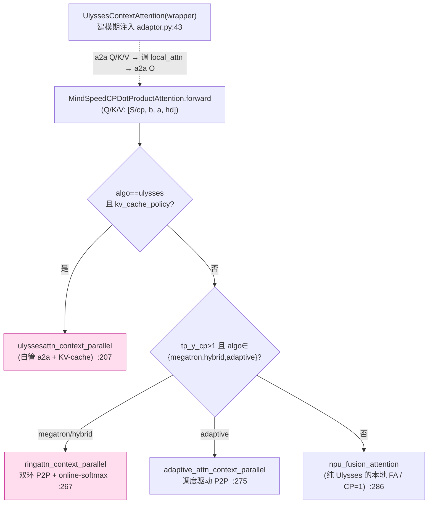

# MindSpeed 上下文并行(Context Parallel)深度解析

> **代码基线**:MindSpeed core `master` @ `1432cb09`(猴补丁 Megatron `core_r0.17.0`)· 2026-06-23
> 本页只讲 MindSpeed 的 **CP 家族**:运行期怎么把 attention 分派到 Ulysses / Ring(双环)/ Hybrid / Adaptive / KV-cache 五条路,每条路在卡间搬什么、按因果性怎么裁剪、通信量与序列长度 $S$/CP 度的代数关系、各自的约束与选型。每条非平凡结论都带 `file:line`,行号均经实际打开核对。
> 属 [[mindspeed/index]] 系列;并行总览见 [[mindspeed_parallelism_analysis]](本页是其 §2 CP 一节的深挖展开)。Megatron 原生 CP 对照见 [[megatron_cp_analysis]];通算掩盖(send-recv overlap)归 [[mindspeed_comm_overlap_analysis]]。

---

## 0. 总览

### 0.1 CP 是什么 · MindSpeed 怎么做

**上下文并行**把序列维 $S$ 切到 CP 组的 $cp$ 张卡,每卡只持 $S/cp$ 个 token 的 Q/K/V 与激活,把长序列 attention 的 $O(S^2)$ 激活/算力压到 $1/cp$。难点恒在 attention:每个 query 要看全序列 K/V,而 K/V 被切散了——必须在 CP 组内搬运。MindSpeed **不重写 Megatron 的 CP 框架**,而是用 `ContextParallelFeature` 把 Megatron 的 `DotProductAttention` 整类替换成 `MindSpeedCPDotProductAttention`,在其 `forward` 里**运行期分派**到五套自研搬运策略,通过 `--context-parallel-algo` 选择。

> 与 Megatron 把 `cp_comm_type` 透传给 TransformerEngine 内核不同,MindSpeed 的 CP 内核**全在 PyTorch+`npu_fusion_attention` 层自己实现**(`mindspeed/core/context_parallel/`),因为昇腾 NPU 没有 TE 的 CP 路径——`CPDotProductAttentionImpl.__init__` 干脆把 `config.context_parallel_size` 临时置 1 再调父类,并断言"CP 不走 TE 原生路径"(`dot_product_attention.py:52-58`)。

### 0.2 记号约定

| 符号 | 含义 |
|------|------|
| $cp$ | CP 度(`--context-parallel-size`) |
| $S$ | 全局序列长度;每卡持有 $S/cp$ |
| $b$ / $h$ / $hd$ | micro-batch / hidden / head dim($h=a\cdot hd$) |
| $a$ / $a_{kv}$ | 注意力头数 / KV 头数(GQA 时 $a_{kv}<a$) |
| $TP$ | 张量并行度(头先被 TP 切,CP 在 $a/TP$ 头上再操作) |
| $u$ / $r$ | Hybrid 下 ulysses 子度 / ring 子度($cp=u\cdot r$) |
| `cp_window` | 双环窗口大小(`--cp-window-size`),须整除 ring 度 |

### 0.3 五种算法横向对比

| 算法(`--context-parallel-algo`) | 卡间原语 | 序列分区 | 关键约束(已核对) | 适用 | 内核入口 |
|------|---------|---------|---------|------|------|
| `ulysses_cp_algo` | 头维 **all-to-all** ×4 | $S/cp$ → 换成 $a/cp$ 头 | `seq % cp==0`、`a % (cp·TP)==0` | 同节点高带宽、头数足 | `ulysses_context_parallel.py:159` |
| `megatron_cp_algo`(Ring/双环) | KV 块环形 **P2P** | $S/cp$(2·cp 段配对均衡) | `seq % (2·cp)==0`、`cp_window∈[1,cp)` 且整除 cp | 通用、跨节点容忍 | `ring_context_parallel.py:918` |
| `hybrid_cp_algo` | 内 all-to-all × 外 P2P | $u\times r$ 二维 | `r=cp/u>1`、`a % (u·TP)==0` | 超大 CP、跨节点 | `model_parallel_utils.py:59` |
| `adaptive_cp_algo` | 调度驱动 batch-P2P | 重调度 + rank 重映射 | `seq % cp==0`、不规则掩码 | 变长/稀疏 EoD 掩码 | `adaptive_context_parallel.py:50` |
| `kvallgather_cp_algo` | KV all-gather | 走 megatron-cp 切法 | 仅 `causal` 掩码 | causal 短窗、调试 | 复用 megatron-cp 切分 |

> **一个易踩的源码事实**:这五个名字**不在同一处声明**。`ContextParallelFeature` 的 `choices` 只列 `megatron_cp_algo / hybrid_cp_algo / hybrid_adaptive_cp_algo / kvallgather_cp_algo`(`context_parallel_feature.py:21-23`);`ulysses_cp_algo` 与 `adaptive_cp_algo` 是 **Ulysses / Adaptive 两个独立 feature 用 `add_parser_argument_choices_value` 追加**进同一个 `--context-parallel-algo` 的(`ulysses_context_parallel.py(feature):15-19`、`adaptive_context_parallel.py(feature):14-18`)。要全集合,必须同时启用这几个 feature。

---

## 1. 分派脊柱:`CPDotProductAttentionImpl.forward`

整个 CP 家族的运行期总开关是 `dot_product_attention.py:134-322`。它先确定 `tp_y_cp_sz`(2D-TP 下取 `TensorParallelYUnionCP` 合并域,否则取 `context_parallel_size`,`:185-189`),再三段式分派:



三段式分派(脊柱)逐段:

```python
# dot_product_attention.py:191-209 —— 分支 ①:Ulysses + KV-cache
if (cp_size > 1 and algo == "ulysses_cp_algo" and config.context_parallel_kv_cache_policy):
    self.ulysses_comm_para['cache_policy'] = get_cache_policy(...)      # 本层缓存策略
    output = ulyssesattn_context_parallel(query, key, value, attn_para, self.ulysses_comm_para)
    return output
# :210 —— 分支 ②:Ring / Hybrid / Adaptive(都需要环形或调度 P2P)
if tp_y_cp_sz > 1 and algo in ['megatron_cp_algo','hybrid_cp_algo','adaptive_cp_algo','hybrid_adaptive_cp_algo']:
    cp_para = {...cp_group, cp_size, rank, cp_global_ranks...}
    if algo in ['megatron_cp_algo','hybrid_cp_algo']:
        cp_para['cp_inner_ranks']  = get_ring_ranks_for_intra_window()   # 双环:窗口内
        cp_para['cp_outer_ranks']  = get_ring_ranks_for_inter_window_kv()# 双环:窗口间 KV 环
        output = ringattn_context_parallel(query, key, value, n_head, cp_para, scale, ...)   # :267
    else:
        cp_para['scheduling_info'] = get_scheduling_info()
        output = adaptive_attn_context_parallel(query, key, value, n_head, cp_para, ...)      # :275
else:
    # :286-316 —— 分支 ③:纯 Ulysses(无 cache)/ CP=1 → 直接落 npu_fusion_attention
    output = npu_fusion_attention(query, key, value, n_head, shape_order, ...)
```

**这里有个反直觉的接线**:`else` 分支(`:286`)的"纯 Ulysses"看似没做任何跨卡通信——因为 Ulysses 的 4 次 all-to-all 不在这里,而是在**建模期**就把 `core_attention` 包了一层 `UlyssesContextAttention`(`adaptor.py:43`,由 `attention_init_wrapper` 注入)。运行时是 `UlyssesContextAttention.forward` 先做 a2a、再调 `self.local_attn`(即本 `forward`)算本地 FA。于是:

- **纯 Ulysses**:a2a 在外层 wrapper,内层 `forward` 走 `:286` 的 plain FA;
- **Ulysses+KV-cache**:wrapper 检测到 `use_custom_ulysses_backward` 直接调 `local_attn`(`ulysses_context_parallel.py:172-179`),把通信让给 `:207` 的自定义 autograd `ulyssesattn_context_parallel` 自己管;
- **Ring/Hybrid/Adaptive**:无 wrapper,通信全在 `:267`/`:275` 的内核里。

> patch 侧还有个分流:`kvallgather` 与 `ulysses` 把 `TEDotProductAttention` 替成轻量 `MindSpeedTEDotProductAttention`,其余算法替成完整 `MindSpeedCPDotProductAttention`(`context_parallel_feature.py:106-111`)。

> **CP × TP-2D 的合并域**:开 `tp_2d` 且 `tp_y>1` 时,CP 不再是独立通信域,而是与 TP 的 y 方向合成一个 `TensorParallelYUnionCP` 联合组——`tp_y_cp_sz = cp·tp_y`(`dot_product_attention.py:185-189`、`adaptor.py:30-33`)。此时序列切分也要按 `2·tp_y_cp_sz` 配对再 reshape 回 `[cp, s/cp]`(`get_batch_utils.py:206-241`),Ulysses 的 a2a 组取 `tp_y_cp.group`、Ring 走 `tp_y_cp.overlap_group`(`dot_product_attention.py:218-222`、`:247-248`)。这是 CP 与 TP-2D 正交叠加时唯一需要"换组"的地方。

---

## 2. 序列切分与因果负载均衡(2·cp 配对)

CP 的结构核心是"序列怎么切到 rank",在 `get_batch_on_this_cp_rank`(`get_batch_utils.py:89-137`),它按算法分派到 ulysses(顺序切)、megatron-cp(2×切)、EoD padding、general 等变体(`:112-137`)。

**为什么不能朴素顺序切**:因果(causal)attention 里 query 位置 $i$ 只 attend $0..i$。若把 $S$ 顺序均分成 $cp$ 段,持有**靠后**段的卡要 attend 近全序列(算得多),靠前的卡几乎不算——三角形负载,严重不均。MindSpeed 沿用 Megatron 思路把序列切成 **$2cp$ 段**,给 rank $i$ 同时分**第 $i$ 段和第 $2cp{-}1{-}i$ 段**(一早一晚),把每卡负载拉平。代码在 `_get_batch_on_this_cp_rank_in_megatron_cp`(`get_batch_utils.py:244-263`):

```python
# get_batch_utils.py:252-260
val = val.view(*val.shape[0:seq_dim], 2 * cp_size, val.shape[seq_dim] // (2 * cp_size), ...)
index = torch.tensor([cp_rank, (2 * cp_size - cp_rank - 1)], device=val.device)  # ← 早块+晚块配对
val = val.index_select(seq_dim, index)
```

```
朴素切(因果):  rank0 [▁▁]算少          rank3 [██]算多        ← 三角不均
2·cp 配对:      rank_i = 第 i 段(早) + 第 2cp-1-i 段(晚)   ← 拉平 ✅
  cp=4: rank0={0,7} rank1={1,6} rank2={2,5} rank3={3,4}
```

这一切分是 Ring 能做"因果块裁剪"(§4)的前提:每卡持有的 q 在内存里就是 `[2, S/cp, b, h]` 的早/晚两半(`ring_context_parallel.py:975`),裁剪逻辑直接按这两半下刀。Ulysses 因为 attention 时已聚成全序列,用顺序切即可(`_get_batch_on_this_cp_rank_in_ulysses_cp`,`get_batch_utils.py:266`)。

> **一条隐形的正确性不变量**:RoPE 位置编码必须按**和 token 完全相同**的方式切到 CP rank,否则每卡拿到的 token 和它的旋转相位对不上、注意力全错。`get_pos_emb_on_this_cp_rank`(`rotary_pos_embedding_utils.py:15-47`)因此按算法逐一镜像切分逻辑——megatron-cp 走同一套 `[cp_rank, 2cp-1-cp_rank]` 的 2·cp 配对(`:50-61`),ulysses 走顺序 `chunk`(`:91-96`),hybrid 先按 ring 度做 2·r 配对再按 ulysses 度 chunk(`:99-116`),adaptive 则用 `remapped_seq_order` 重排索引(`:131-142`)。这是 CP 家族里最容易被忽略、却必须与 §2 切分严格对齐的一环。

---

## 3. Ulysses —— 头维 all-to-all 换轴

### 3.1 命题
Ring/all-gather 都在"序列切分"这根轴上想办法;Ulysses **换轴**:attention 在 head 维天然并行。于是 attention **前**用 all-to-all 把"切序列"重排成"切头"——每卡换成持**完整序列**但只算 $a/cp$ 头;attention **后**再 a2a 换回切序列。每卡 attention 时看到全序列,无需环形、无需 online-softmax。

### 3.2 机制:`single_all_to_all` 的形状流转
核心是一次 `all_to_all_single` 加两次 reshape/transpose(`ulysses_context_parallel.py:83-108`):

```python
# ulysses_context_parallel.py:94-108(scatter_idx=2 头维, gather_idx=0 序列维)
input_t = input_.reshape([-1, seq_world_size, inp_shape[2]] + ...).transpose(0, 1).contiguous()
output  = torch.empty_like(input_t);  torch.distributed.all_to_all_single(output, input_t, group)
# 注释原话:[cp, s/cp, b, n/cp, d] -> [s/cp, b, cp, n/cp, d]
return output.reshape(... inp_shape[gather_idx] * seq_world_size ...).contiguous()
```

```
输入  [S/cp, b, a,   hd]        每卡:切序列、全部头
拆头  [S/cp, b, cp, a/cp, hd]    把头维拆出 cp 份(待散)
a2a   跨 cp 卡交换(行↔列转置)
还原  [S,    b, a/cp, hd]        每卡:全序列、1/cp 头  ← 在此做本地 FA
              │  本地 npu_fusion_attention([S, b, a/cp, hd])
输出  [S,    b, a/cp, hd]  ──a2a(gather↔scatter)──►  [S/cp, b, a, hd]
```

`UlyssesContextAttention.forward`(`:159-221`)对 Q/K/V 各 a2a 一次(`:197-199`),本地 attention 后对输出反向 a2a(`:214`)——**每层 4 次 all-to-all**。GQA 下 KV 头不足以被 $cp$ 整除时,先 `repeat_interleave` 把 KV 头补齐(`:187-189`)。

### 3.3 通信量代数(每卡 · 每层 · 前向)
a2a 的本地张量是切序列布局 $[S/cp,b,a/TP,hd]$,元素数 $\dfrac{b\,S\,h}{cp\cdot TP}$;每次 all-to-all 每卡发出其中 $\dfrac{cp-1}{cp}$。四次(Q/K/V/O):

$$
V_{\text{ulysses}} \;\approx\; 4\cdot\frac{cp-1}{cp}\cdot\frac{b\,S\,h}{cp\cdot TP}
$$

对照 Ring(§4.3)$V_{\text{ring}}\approx 2\cdot\frac{cp-1}{cp}\cdot\frac{b\,S\,h_{kv}}{TP}$,比值

$$
\frac{V_{\text{ulysses}}}{V_{\text{ring}}}=\frac{2}{cp}\cdot\frac{a}{a_{kv}}
$$

> 这给出一个可从代码推出的选型量化:**MHA**($a=a_{kv}$)下 $cp>2$ 时 Ulysses 通信量更小;**GQA**($a/a_{kv}$ 大,如 8)下要 $cp>16$ Ulysses 才划算——这正是 GQA 下 Ulysses 要 `repeat_interleave` 把 KV 头补回去、通信反而变贵的代价,也是 `--use-ulysses-allgather-kv`(KV 头=1 时用 AllGather-KV + All2All-Q 替代 repeat,`ulysses_context_parallel.py:456`)存在的理由。

### 3.4 不等长 a2a:gather_size 注入
当序列被 mask 成不能被 $cp$ 整除时,`single_all_to_all` 的等分 reshape 会崩。`UlyssesContextAttention` 因此持一个可注入的 `GatherSizeCalculator`(`ulysses_context_parallel.py:24-60`):`DynamicGatherSizeCalculator.calculate` 从 attention mask 的真实序列长度算出 a2a 输出在 `gather_idx` 上的实际尺寸(`:49-60`),forward 据此走 `unaligned_cp.mapping.all_to_all`(支持 `split_sizes` 不等切,`:197-218`),并在算完后按各 rank 的 `cal_split_sizes` reshape 回去(`:205-218`)。这让 Ulysses 能处理变长/稀疏序列而不强制 padding。

### 3.5 边界与约束
- `a % (cp·TP)==0` 且 `seq % cp==0`(`ulysses_context_parallel.py(feature):28-33`);头不够分则退 Ring 或 allgather-kv 变体。
- a2a 是 4 轮大块、带宽受限 → 适合**单节点 NVLink/HCCS 域内**;跨节点低带宽下不如 Ring 可重叠。

---

## 4. Ring / 双环 —— KV 环形 P2P + online-softmax

### 4.1 命题
不换布局,保持每卡 $S/cp$;让 K/V 块在 CP 组内**环形 P2P 流转**,每步算一个局部 attention 用 online-softmax 累积,转一圈得到完整注意力。P2P 异步可与 FA 计算重叠——长序列/跨节点默认。

### 4.2 双环(double-ring)结构:为什么不是单环
MindSpeed 把单环升级为 **outer×inner 双环**,给"窗口内 intra + 窗口间 inter"两级 P2P 留重叠空间。组的构造在 `initialize_context_parallel_group_for_double_ring`(`model_parallel_utils.py:121-212`):把 ring 全局 rank 按 `cp_window` 切成若干 window,建 intra-window 组(`:155-165`);inter-window 的 **KV 环**与 **dKV 环**用两套不同的 rank 序列——尤其 dKV 环是一段绕窗游走算出来的(`:173-187`),因为反向 dKV 的累加顺序与前向 KV 不同。前向主循环(`ring_context_parallel.py:995-1028`)双层嵌套、各持一个 `RingP2P`,double-buffer 收发:

```python
# ring_context_parallel.py:995-1028(精简)
for j in range(outer_size):                       # 窗口间
    if j < outer_size-1: outer_ring.async_send_recv(cur_kv, next_round_kv)   # 预取下一窗口 KV
    for i in range(inner_size):                    # 窗口内
        if i < inner_size-1: inner_ring.async_send_recv(cur_kv, next_kv)     # 预取窗口内下一块
        attn_outs = attention_strategy.compute_fused_attention(...)          # 本地 FA(算当前块)
        global_attn_outs = attention_strategy.update_out(cp_config)          # online-softmax 累积
        if inner_ring.wait(): cur_kv, next_kv = next_kv, cur_kv              # double buffer 翻转
    if outer_ring.wait():     cur_kv, next_round_kv = next_round_kv, cur_kv
```

`RingP2P.async_send_recv`(`utils.py:140-197`)按 `ring_rank % 2` 决定先发还是先收以避免死锁,用 `dist.isend/irecv` 异步;`use_cp_send_recv_overlap` 时收发各走一个独立组(`:175`/`:188`)。online-softmax 合并在 `forward_update_without_fused`(`utils.py:77-119`):标准的 $m=\max(m_{prev},m_{cur})$、按 $e^{m_\cdot-m}$ 缩放重标定 $\ell$ 与 out(`:86-114`)——这是把"对各 KV 块的局部 attention"无误差合并成全序列 attention 的数学核心。

### 4.3 因果块裁剪:把环的算量砍掉近一半
2·cp 配对切分(§2)让每个 KV 块相对当前 Q 块**要么全可见、要么全不可见、要么只半可见**,`causal_forward_fetch` 据此三分支裁剪(`ring_context_parallel.py:16-33`):

```python
# ring_context_parallel.py:18-31
if q_block_id == kv_block_id:                 # 对角块:带因果掩码全算
    cur_q, cur_k, cur_v = [x.view(-1, *x.shape[2:]) for x in [q, cur_k, cur_v]]
elif kv_block_id <= q_block_id:               # KV 在 Q 之前:只取 cur_k/cur_v 的前半 x[0],无需掩码
    cur_q = q.view(-1, *q.shape[2:]);  cur_k, cur_v = [x[0] for x in [cur_k, cur_v]]
else:                                         # KV 在 Q 之后:只有 Q 的后半 q[1] 能 attend
    cur_q = q[1];  cur_k, cur_v = [x.view(-1, *x.shape[2:]) for x in [cur_k, cur_v]]
```

TND(变长 packing)走 `tnd_forward_fetch`(`:36-57`)用 `index_select` 取半块。这是 2·cp 配对切分的"回报":整环的 FA 计算量从朴素的 $cp\cdot(\text{全块})$ 降到约一半。

**EoD/THD 变长打包的因果均衡**:多条样本拼成一条 packed 序列时,2·cp 段配对要**逐子序列**做。`compute_qkv_index`(`ring_context_parallel.py:429-444`,`@lru_cache`)对每段 `[prev_eod, eod]` 取中点 `mid=(eod+prev)//2`,把**前半 `[prev:mid]` 划给 KV、后半 `[mid:eod]` 划给 Q**:

```python
# ring_context_parallel.py:435-439
for eod_pos in seq_lens:
    mid = (eod_pos + prev_eod_pos) // 2
    kv_indices.extend(full_indices[prev_eod_pos:mid])   # 每条子序列前半 → KV 块
    q_indices.extend(full_indices[mid:eod_pos])         # 每条子序列后半 → Q 块
```

于是 `kv_block_id <= q_block_id` 时只 `index_select` 出各子序列的 KV 前半、`kv_block_id > q_block_id` 时只取 Q 后半(`tnd_forward_fetch:47-55`),把 §4.3 的"整块/半块"裁剪推广到了**变长**场景。前向 `AttentionWithCp.forward` 在 `is_eod_reset` 分支据此预生成 `q_index/kv_index/softmax_indices` 供反向复用(`:958-972`)。数据侧的 packing 与动态 CP 见 [[megatron_packed_dataset_dynamic_cp_analysis]]。

### 4.4 通信量代数(每卡 · 每层 · 前向)
每步发 K、V 两块,各 $b\cdot\frac{S}{cp}\cdot\frac{h_{kv}}{TP}$;有效 $cp{-}1$ 步:

$$
V_{\text{ring}} \;\approx\; 2(cp-1)\cdot b\,\frac{S}{cp}\,\frac{h_{kv}}{TP}
\;=\;2\cdot\frac{cp-1}{cp}\cdot\frac{b\,S\,h_{kv}}{TP}
$$

通信量只随 **KV 头** $h_{kv}$ 走(GQA 友好),且是 $cp{-}1$ 步小块 P2P(延迟受限但天然容忍跨节点、可被双环 + send-recv overlap 掩盖)。

### 4.5 反向:dKV 反向环 + MLA 支持
反向是前向的镜像但**多一根环**。$dq$ 累积在本地(q 不动),而 $dk/dv$ 必须像前向 KV 那样**环回**到 K/V 的属主 rank——且累加顺序与前向相反,所以双环用 `is_backward=True` 建(`RingP2P` 把 next/prev 对调,`utils.py:135-136`),并且 inter-window 的 dKV 走**专门的 `cp_dkv_outer_ranks`**(§4.2 那段绕窗游走算出的环,`ring_context_parallel.py:1081`)而非前向的 KV 环:

```python
# ring_context_parallel.py:1140-1173(精简)
dq_step, dk_step, dv_step = backward_step_helper(...)         # 本步局部梯度
if i == 0 and j > 0:  inter_dkv_comm.wait(); cur_dkv, next_round_dkv = next_round_dkv, cur_dkv  # 跨窗收 dKV
elif i > 0:           intra_dkv_comm.wait(); cur_dkv, next_dkv = next_dkv, cur_dkv               # 窗内收 dKV
causal_grad_update(q_block_id, kv_block_id, dq_step, dk_step, dv_step, dq, dk, dv)               # 按因果分支累加
intra_dkv_comm.async_send_recv(cur_dkv, next_dkv, ...)        # dKV 继续环传
```

`causal_grad_update`/`tnd_grad_update` 按 §4.3 同样的三分支决定哪半 q/kv 的梯度参与累加。**MLA**(`k.shape[-1] != v.shape[-1]`,如 DeepSeek 的非对称 head dim)单独成路:KV 不能拼成一个 `[2,...]` 张量,改用 `[k, v]` 列表分别收发(`ring_context_parallel.py:925-926`、`:977-980`;`RingP2P.async_send_recv` 把 k/v 拼 flat buffer 再切回,`utils.py:143-197`)。

### 4.6 约束
- `seq % (2·cp)==0`(SBHD;THD/EoD 下放宽到 `seq % cp==0`,`context_parallel_feature.py:88-92`);
- `cp_window ∈ [1, cp)` 且 `cp % cp_window == 0`(`context_parallel_feature.py:46-50`);`cp_window=1` 即退化单环。
- alibi 位置编码只支持 `megatron_cp_algo` + alibi type 2 + causal(`:42-44`、`:53-55`)。

---

## 5. Hybrid —— Ulysses × Ring 二维 CP

### 5.1 命题与组合方式
单一策略在超大 CP 跨多节点都不划算:Ulysses 吃带宽(适合节点内 NVLink),Ring 容忍延迟(适合跨节点)。`hybrid_cp_algo` 把 CP 组分解为 $cp=u\times r$(`ulysses_degree_in_cp` × `ring_degree`),**内层 Ulysses 走 a2a、外层 Ring 走 P2P**。组构造在 `initialize_context_parallel_group_for_hybrid_cp`(`model_parallel_utils.py:59-118`),关键是 rank 的摆放:

```python
# model_parallel_utils.py:97-118
# Ulysses need higher communication bandwidth than Ring. Try to put Ulysses ranks in the same node.
for m in range(ring_degree):                    # ulysses 子组:连续 u 个 rank(尽量同节点)
    ulysses_ranks = [ranks[idx] for idx in range(m*ulysses_degree, (m+1)*ulysses_degree)]
for m in range(ulysses_degree):                 # ring 子组:跨步 stride=u(跨节点)
    ring_ranks = [ranks[idx] for idx in range(m, len(ranks), ulysses_degree)]
```

```
节点0 [r0 r1 | r2 r3]   节点1 [r4 r5 | r6 r7]      u=2, r=2(cp=4? 这里示意 u=2,r=4)
  └a2a┘ └a2a┘              └a2a┘ └a2a┘             内层 Ulysses:同节点连续 rank,a2a
   r0 ──P2P──── r2 ──P2P──── r4 ──P2P──── r6        外层 Ring:跨节点 stride=u,环形 P2P
```

运行期,`dot_product_attention.py:213-232` 检测到 hybrid ring 组已建则取 hybrid 的 cp_group/ranks,把 ring 内核跑在**外层 ring 子组**上;内层 Ulysses 的 a2a 组由 `attention_init_wrapper` 取 `get_context_parallel_group_for_hybrid_ulysses()`(`adaptor.py:41-42`)。

### 5.2 约束
`r=cp/u>1` 且整除、`a % (u·TP)==0`、`cp_window∈[1,r)` 且整除 $r$(`context_parallel_feature.py:58-80`)。`hybrid_adaptive_cp_algo` 把外层 Ring 换成 Adaptive 调度(同一套组构造,内层仍 Ulysses)。

---

## 6. Adaptive CP —— 面向不规则掩码的调度驱动 P2P

### 6.1 命题
变长 / EoD-packing / 稀疏掩码下,2·cp 配对的静态裁剪不再均衡(块与块的实际算量差异大)。Adaptive 把全掩码粗化、按各 block 实际计算量做**任务重调度 + rank 重映射**,运行期由 `get_scheduling_info()` 给出每步的收发目标,而非固定环序。

### 6.2 机制
`AdaptiveAttention.forward`(`adaptive_context_parallel.py:50-157`)按 `scheduling_info` 的 `round_num` 轮循环,每轮的 P2P 收发对象不是"环上邻居"而是**调度方案指定的任意 rank**——`flash_attn_p2p_communicate`(`:7-30`)对 `send_q_dst/send_kv_dst/recv_q_src/recv_kv_src` 用 `batch_isend_irecv` 成批发起:

```python
# adaptive_context_parallel.py:11-26
for send_dst in scheduling_info.send_q_dst:   # 可同时给多个目标发 Q
    send_recv_ops.append(P2POp(isend, send_q_dst, send_dst, cp_group, tag=send_dst))
if scheduling_info.recv_q_src > -1:           # 收到 Q 的 rank 下一轮要回送 O
    send_recv_ops.append(P2POp(irecv, recv_q_src, scheduling_info.recv_q_src, cp_group, tag=rank))
```

注意它**两种东西都搬**:既可能搬 KV(像 Ring),也可能搬 Q(收到别人 Q 的 rank 算完再把 O 送回去,`flash_attn_p2p_communicate_o`,`:33-47`)——这是为不规则掩码做负载再分配的关键自由度。局部结果仍用 `npu_ring_attention_update` 做 online-softmax 合并(`:120-122`)。调度信息在 `get_batch_on_this_cp_rank` 阶段经 `set_scheduling_info`/`set_remapped_seq_order` 预生成。开关:`--adaptive-cp-only-reschedule`(只重调度不重映射)、`--attention-mask-on-cpu`(掩码留 CPU 省 NPU 显存)、`--adaptive-cp-without-coarse`(<8K 时不粗化)(`adaptive_context_parallel.py(feature):22-32`)。

---

## 6.5 kvallgather —— 全收 KV 的最简回退

`kvallgather_cp_algo` 是 Ring 的"去环形化"简化版:序列仍按 megatron-cp 的 2·cp 配对切(`get_batch_on_this_cp_rank` 直接复用 `_get_batch_on_this_cp_rank_in_megatron_cp`,`get_batch_utils.py:135-136`),但 attention 不再环传 KV,而是把 K/V 一次 **all-gather** 到全序列、每卡用本地 $S/cp$ 个 query 对完整 $S$ 算——逻辑最简、无 online-softmax,代价是 all-gather 同步暴露、每卡物化完整 KV。patch 侧它和 Ulysses 一样走轻量 `MindSpeedTEDotProductAttention`(`context_parallel_feature.py:106-108`)。**硬约束:只支持 `causal` 掩码**(`context_parallel_feature.py:83-85`);非 reset 下 `seq % (2·cp)==0`、reset(THD)下 `seq % cp==0`(`:87-92`)。定位:小 CP、causal 短窗、求实现简单或调试。

## 7. KV-cache CP —— 用显存换反向通信

### 7.1 命题
Ring/Ulysses 的**反向**默认要把前向搬过的 K/V **再环传/再 a2a 一遍**。KV-cache 在前向就缓存已聚好的 K(/V),反向直接命中、省掉一轮通信——拿显存换通信。由 `--context-parallel-kv-cache-policy {half,full}` 控制,`get_cache_policy` 按 `layer_number % (interval+1)` 决定本层是否缓存(`context_parallel_kv_cache.py:5-13`),`--context-parallel-cache-interval` 让缓存隔层生效、把显存峰值摊到部分层。

| 策略 | 缓存内容 | 反向时 | 权衡 |
|------|---------|--------|------|
| `None`(默认) | 不缓存 | 反向重做 KV 通信 | 省显存、费通信 |
| `half` | 只缓存 K | V 反向重新环传/a2a | 折中 |
| `full` | 缓存 K+V | 反向不再通信 KV | 费显存、省通信 |

### 7.2 两套实现
- **Ring 侧**:`ContextParallelKVCache`(`context_parallel_kv_cache.py:16-134`)管 outer/inner 双环的 KV 收发与 cache 命中——`full` 策略下"only need communicate KV in the first step"(`:74`、`:128-132`),后续步直接取 `self.k[cache_index]/self.v[cache_index]`;`half` 策略只缓存 K、V 仍传(`:122-126`)。
- **Ulysses 侧**:自定义 autograd `UlyssesAttnWithKVCache`(`ulysses_context_parallel.py:560-758`)。前向按策略缓存:`full` 存 a2a **前**的 `key/value`、`half` 存 `key` + a2a 后的 `v`、`None` 存 a2a 后的 `k/v`(`:625-630`);backward 用 `recomm_backward` 只对缓存块重做一次 a2a,省掉一轮反向通信。GQA + KV头=1 时 `--use-ulysses-allgather-kv` 改用 `AllGatherComm`(AllGather-KV + All2All-Q,`:456-557`)替代 repeat-all2all。

约束:`cp>1` 且必须 `use_flash_attn`;`cache_interval < num_layers`;allgather-kv 仅 ulysses + GQA(`context_parallel_kv_cache.py(feature):29-66`)。
> cache 的**省显存**量化与重计算权衡见 [[mindspeed_memory_optimization_analysis]];本页只记其改变了 CP 的通信结构。

---

## 8. 选型

### 8.1 决策树(约束已逐条核对)
```
要训长序列、开 CP,选 --context-parallel-algo:
├─ 头数足(a % (cp·TP)==0)且单节点 NVLink/HCCS 域内?
│   └─ 是 → ulysses_cp_algo(换头轴,4 次 a2a,attention 见全序列;MHA 大 cp 通信最省)
├─ 跨多节点、超大 CP(头数也够 a%(u·TP)==0)?
│   └─ 是 → hybrid_cp_algo(节点内 Ulysses a2a + 节点间 Ring P2P,各用所长)
├─ 通用长序列 / 跨节点 / GQA(KV 头少)/ 要异步重叠?
│   └─ 是 → megatron_cp_algo(双环 P2P,通信只随 h_kv,可 send-recv overlap;默认)
├─ 变长 / EoD-packing / 稀疏不规则掩码,负载倾斜?
│   └─ 是 → adaptive_cp_algo(调度重排 + rank 重映射;或 hybrid_adaptive_cp_algo)
└─ causal 短窗 / 调试求简?
    └─ 是 → kvallgather_cp_algo(全收 KV,仅 causal)

正交叠加:任一算法都可叠 --context-parallel-kv-cache-policy {half,full}(显存换反向通信);
         --cp-window-size 控双环窗口;--use-cp-send-recv-overlap 开收发重叠。
```

### 8.2 通信量与暴露汇总(每卡 · 每层 · 前向)

| 算法 | 通信原语 | 通信量(量级) | 随什么涨 | 可重叠 | 暴露 |
|------|---------|--------------|---------|--------|------|
| Ulysses | 4 次 all-to-all | $4\cdot\frac{cp-1}{cp}\cdot\frac{bSh}{cp\,TP}$ | 全头 $h$ | 部分 | 中(大块带宽受限) |
| Ring/双环 | $cp{-}1$ 步环形 P2P | $2\cdot\frac{cp-1}{cp}\cdot\frac{bSh_{kv}}{TP}$ | KV 头 $h_{kv}$ | ✅ 异步 + 双环窗口 | 低 |
| Hybrid | 内 a2a + 外 P2P | 内层按 Ulysses($u$)、外层按 Ring($r$) | 混合 | ✅ 外层 | 低(跨节点段可重叠) |
| Adaptive | 调度驱动 batch-P2P | 随掉度方案,可搬 Q 也可搬 KV | 掩码稀疏度 | ⚠️ 部分 | 视调度 |
| KV-cache 叠加 | 省掉**反向**一轮 KV 通信 | 反向 $\div$ 约 2(full) | — | — | 用显存换 |

$V_{ulysses}/V_{ring}=\frac{2}{cp}\cdot\frac{a}{a_{kv}}$:MHA 大 $cp$ 选 Ulysses 省通信,GQA(KV 头少)选 Ring。

### 8.3 一句话总结
- **脊柱**:`MindSpeedCPDotProductAttention.forward` 运行期三段分派(Ulysses+cache / Ring·Hybrid·Adaptive / plain),CP 内核全在 PyTorch+`npu_fusion_attention` 自实现,不依赖 TE。
- **Ulysses** 换头轴、4 次 a2a、看全序列,带宽受限宜节点内;通信 $\propto h$(全头),GQA 下要大 $cp$ 才划算。
- **Ring/双环** KV 环形 P2P + online-softmax,因果靠 2·cp 配对 + 三分支块裁剪砍掉近一半算量;通信 $\propto h_{kv}$(GQA 友好),延迟受限宜跨节点、可重叠。
- **Hybrid** = 节点内 Ulysses × 节点间 Ring 二维;**Adaptive** = 调度驱动 P2P 应对不规则掩码;**KV-cache** = 显存换反向通信,正交叠加在前三者之上。

---

*生成依据:MindSpeed core `master` @ `1432cb09`(2026-06-23)。行号以该 commit 为准。Ulysses/Ring/Hybrid/Adaptive/KV-cache 内核分别位于 `mindspeed/core/context_parallel/` 的 `ulysses_context_parallel/`、`ring_context_parallel/`、`model_parallel_utils.py`、`adaptive_context_parallel/` 子模块;分派脊柱在 `dot_product_attention.py:134-322`。*

## Related Pages

- [[mindspeed/index]] —— MindSpeed×MindSpeed-LLM 特性总罗盘(四大类入口)
- [[mindspeed_parallelism_analysis]] —— 并行总览;本页是其 §2 CP 一节的深挖展开(TP/PP/MoE-EP/DP 见该页)
- [[mindspeed_comm_overlap_analysis]] —— CP 的 send-recv overlap、双环 intra/inter 重叠、RingP2P 异步掩盖
- [[mindspeed_memory_optimization_analysis]] —— KV-cache CP 的省显存量化、重计算与 CP 的互补
- [[megatron_cp_analysis]] —— Megatron 原生 CP(p2p/all_gather/a2a/a2a+p2p,内核在 TE),与本页逐条对照
- [[megatron_packed_dataset_dynamic_cp_analysis]] —— packed/THD 变长数据与动态 CP(本页 EoD/TND 切分的数据侧)
- [[megatron-lm/index]] —— 被打补丁的宿主框架;对照阅读原生 5D 并行
