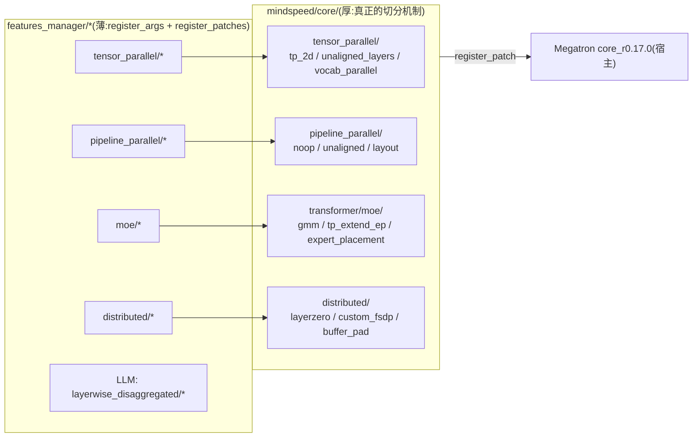
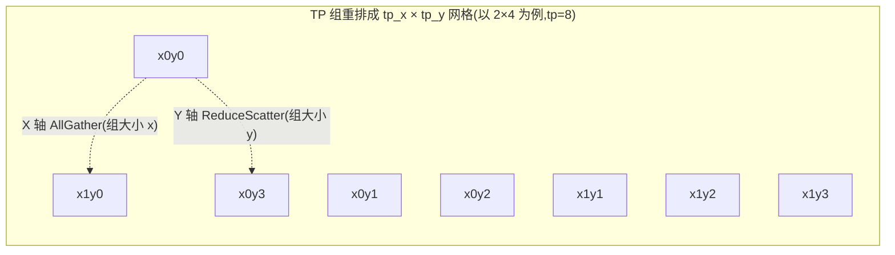
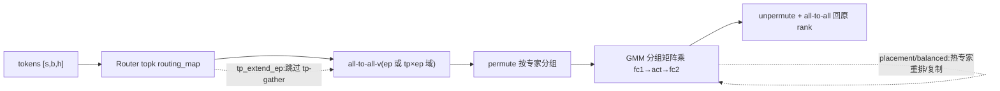
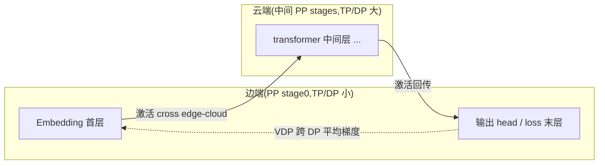

# MindSpeed 并行特性 — 划分结构源码级分析

> **代码基线**:MindSpeed core `master` @ `1432cb09`(猴补丁 Megatron `core_r0.17.0`)· MindSpeed-LLM `master` @ `0c16322d` · 阅读日期 2026-06-23
> 本页只讲 MindSpeed 在各并行维度上**怎么切、切到哪个 rank、谁替换了 Megatron 的哪段划分逻辑**(TP/PP/MoE-EP/DP/分层解耦)。**每个并行特性都按统一四件套拆解**:① 机制(切到哪个 rank、替换了谁)② before/after 或 dataflow 图示 ③ `> [!tip] 优化点` callout(量化:切分比 / 通信模式 / 内存 ÷ / 何时赢)④ 源码解读(`file:line`,行号均经实际打开核对;路径相对各自仓库根:`mindspeed/...` 属 MindSpeed core,`mindspeed_llm/...` 属 MindSpeed-LLM)。
> **范围边界**:CP 上下文并行已独立成页 [[mindspeed_context_parallel_analysis]](见 §2);并行结构上的**通算掩盖**(send-recv overlap、MC2、CoC、MoE fb-overlap、DualPipeV/RiPipe 调度)归 [[mindspeed_comm_overlap_analysis]];KV-cache/重计算/Swap 等省显存手段归 [[mindspeed_memory_optimization_analysis]];融合算子(GMM/FA 内核)归 [[mindspeed_ascend_affinity_analysis]]。本页只在交界处交叉引用。属 [[mindspeed/index]] 系列。

---

## 1. 总览

MindSpeed 不新造并行框架,而是把 Megatron 原生 5D 并行(TP-CP-EP-DP-PP)里"切分点"的实现按需替换成昇腾亲和版本。每个并行特性都是一个 `MindSpeedFeature`:`register_patches` 把 Megatron 的某个划分函数/类换成 `mindspeed/core/<domain>/` 下的实现,真正的机制在 core 里。

| 维度 | 解决的瓶颈 | MindSpeed 特性 | 替换的 Megatron 划分点 | **优化点(一句话量化)** |
|------|-----------|----------------|----------------------|----------------------|
| **CP** 上下文并行 | 长序列 attention 激活/算力随 $s$ 线性涨 | ContextParallel / Ulysses / Adaptive / KvCache | `DotProductAttention`、`get_batch_on_this_cp_rank` | 每卡只算 $s/cp$ 的 attention(见独立页) |
| **TP** 张量并行 | 单卡放不下大权重;$N$ 越大通信税 $\frac{N-1}{N}$ 越逼近 1 | TP-2D / UnalignedLinear / VocabParallel | `Column/RowParallelLinear`、`VocabParallelEmbedding.forward` | TP-2D 把 $\sim N$ 通信降到 $\sim 2\sqrt N$;unaligned 零 padding |
| **PP** 流水划分 | 各 stage 层数/算力不均 → 气泡 | Noop / Unaligned / PPLayout / MultiParameter / VariableSeq / num-layer-list | `get_num_layers_to_build`、`get_transformer_layer_offset` | 按真实算力配层,把 max(stage) 墙钟拉到趋近 mean |
| **MoE-EP** 专家并行 | 专家算力分散;TP 切专家低效;专家负载倾斜 | GMM / TpExtendEp / ExpertsPlacement / BalancedMoE / SharedExpert / FixRouter | `GroupedMLP`、`TopKRouter.routing`、`MoELayer` | GMM E→1 launch;tp-extend-ep 有效 EP=$tp\cdot ep$ 不加卡;placement 摊平热专家 |
| **DP & 分片** | 优化器/梯度/参数冗余;Ascend 桶对齐 | LayerZeRO / CustomFSDP / TorchFSDP2 / BufferPad / ResetBucketOrder | `setup_model_and_optimizer`、`_ParamAndGradBuffer`、DDP | ZeRO-3 把 P+G+O 全切到 $\frac{1}{N_3}$,比 ZeRO-1 多省 P、G 的 4 B/param |
| **分层解耦** | 边-云异构集群,边端 TP/DP 小于云端 | U-shaped-split / VDP / VTP / mamba-CP(LLM) | `forward_backward_pipelining_*`、`initialize_model_parallel` | 边/云各用自己的 TP/DP,只让中间激活过边-云链路 |



> **怎么读这些特性**:`features_manager/<domain>/*.py` 都很薄,只做两件事——`register_args` 注册 CLI 开关、`register_patches(pm, args)` 把 Megatron 的某个全限定名换成 core 实现。读懂一个并行特性 = 顺着它 `register_patch('megatron....X', mindspeed....Y)` 这一行,跳到 `mindspeed/core/<domain>/` 里看 `Y` 的真正机制。本页所有结论落在被替换的 `Y` 上,而非 feature 壳子。`MindSpeedFeature` 契约(`register_args`/`register_patches`/`validate_args`/`optimization_level`)见 [[mindspeed/index]] §1。

### 记号约定

| 符号 | 含义 |
|------|------|
| $N$ / $tp$ | TP 度;TP-2D 下 $N=x\cdot y$($x=$tp_x、$y=$tp_y) |
| $s$ / $b$ / $h$ / $E$ | 序列长 / micro-batch / hidden / linear 输出宽 |
| $cp$ / $ep$ / $pp$ / $dp$ | CP / EP / PP / DP 度 |
| $V$ | SP 后单卡激活体量 $\frac{b\,s\,h}{N\cdot cp}$(TP-2D 通信代数用) |
| `pp_rank` / `vpp_rank` | 流水 stage 号 / 虚拟流水 chunk 号 |
| edge / cloud | 分层解耦的边端(少卡弱)/ 云端(多卡强) |

---

## 2. CP — 上下文并行(已独立成页)

CP 是 MindSpeed 改动最厚的并行维度(Ulysses / Ring 双环 / Hybrid / Adaptive / KV-cache 五套搬运策略 + 2·cp 因果配对切分 + RoPE 切分不变量 + 通信量代数与选型),已**独立成页深挖**,见 **[[mindspeed_context_parallel_analysis]]**。一句话定位:它把序列维 $s$ 切到 CP 组,让每卡只算 $s/cp$ 的 attention;难点是 attention 全局算子需跨卡交换 Q/K/V,MindSpeed 用 `--context-parallel-algo` 在五套自研内核(全在 PyTorch+`npu_fusion_attention` 层,不走 TE)间运行期分派。本页不再展开。

---

## 3. TP — 张量并行

### 3.1 TP-2D:权重的二维网格切分

**机制**:Megatron 一维 TP 把每个权重沿一个维度切 $N=$tp 份,$N$ 增大时 all-reduce 的通信组也涨到 $N$,"通信税" $\frac{N-1}{N}$ 趋近 1、且整组都要参与一次大集合通信(易跨节点、不可重叠)。TP-2D 把 TP 组重排成 $x\times y$ 网格($\text{tp\_x}\times\text{tp\_y}$),**同一个权重沿两个维度同时切**,把单次大 all-reduce 拆成 X 向 AllGather + Y 向 ReduceScatter 两组**更小**的集合通信。约束 `tp = tp_x·tp_y`、不支持 MoE(`tp_2d.py:39-42`)。



```
1D TP(组大小 N):        [一次 all-reduce over N 张卡]  通信税 (N-1)/N,组跨节点、不可叠 matmul
TP-2D(x·y=N):
   X 轴 AllGather  ──┐  组大小 x
                      ├─ matmul([s/cp,b,h/y]·[h/y,E/x])
   Y 轴 ReduceScatter─┘  组大小 y
   每个集合只在 √N 量级的小组内,通信税降到 (x-1)/x 或 (y-1)/y,且 AG 可与 matmul 重叠
```

> [!tip] 优化点(TP-2D)
> 设 SP 后单卡激活体量 $V=\frac{b\,s\,h}{N\cdot cp}$。1D TP+SP 一条 linear 前向 AG+反向 RS 各搬 $\approx(N-1)V$、通信组大小 $N$;TP-2D 拆到两个正交小组 $V_{\text{AG}_x}\approx(x-1)V$、$V_{\text{RS}_y}\approx(y-1)V$,总量 $x+y-2$ 对照 1D 的 $N-1=xy-1$:**当 $x=y=\sqrt N$ 时从 $\sim N$ 降到 $\sim 2\sqrt N$**,通信税从 $\frac{N-1}{N}$ 降到 $\frac{\sqrt N-1}{\sqrt N}$。更关键的是每个集合的"爆炸半径"从 $N$ 卡缩到 $\sqrt N$ 卡(可压进节点内 HCCS 域),且 AG/RS 可叠进 matmul。**何时赢**:TP 大(≥8)、跨节点、想压通信占比时;TP 小则二维拆分的额外组开销不划算。

**源码解读**:切分形状由 `Linear2DSplitAlongFirstDim.forward` 的注释直给(`linear_2d_split_along_first_dim.py:64-65`):激活 `[s/(x·cp), b, h/y]`、权重 `[h/y, E/x]`——**隐藏维 $h$ 按 $y$ 切、输出维 $E$ 按 $x$ 切**。前向主路(非 overlap/coc 分支)就是 "AG → matmul → RS"(`:128-137`):

```python
# linear_2d_split_along_first_dim.py:129-137
# [s/(x*cp), b, H/y] -> [s/cp, b, H/y]            ← X 向 AllGather 把序列补回
total_input = sync_gather_along_first_dim(activation_input, ag_comm_intf, ...)
# [s/cp, b, H/y] @ [H/y, e/x] -> [s/cp, b, e/x]   ← 本地 matmul
matmul_res = torch.matmul(total_input, weight.t())
# [s/cp, b, E/x] -> [s/(y*cp), b, E/x]            ← Y 向 ReduceScatter 把部分和聚 + 重切序列
matmul_res = sync_reduce_scatter_along_first_dim(matmul_res, rs_comm_intf)
```

`ParallelLinear2D`(`parallel_linear_2d.py:24-85`)封装该 autograd,持 `ag_comm_intf`(X 向 AllGather)与 `rs_comm_intf`(Y 向 ReduceScatter)两套通信域(`:76-79`)。X/Y 及 ND1/ND2 通信组在 `parallel_state_2d.py` 构造(`_TP_X_PARALLEL_RING_RANKS`/`_TP_Y_...` 与 `_TENSOR_MODEL_PARALLEL_GROUP_FOR_ND1/ND2_*`,`:15-28`);`initialize_ndmm_parallel_group(nd1_dim1_size=tp_x, nd2_dim1_size=tp_y)`(`:94-100`)给 **ND1**(列并行 fc1,主切轴 $x$)与 **ND2**(行并行 fc2,主切轴 $y$)两套独立子组——fc1 的输出切轴正是 fc2 的输入切轴,链式相消、两层间无需 all-gather 回全量,这是 "2D" 真省通信的结构前提。Feature 把 MLP/SelfAttention/Embedding/norm/PP 张量形状全换成 2D 版(`tp_2d.py:44-94`),并建 `TensorParallelYUnionCP`(tp_y∪cp 联合域,`:101-116`)供 CP 换组(见 [[mindspeed_context_parallel_analysis]])。**反向**是双集合流水(时序注释 `:142-150`):先 AG(grad_output 沿 Y)+ AG(activation_input 沿 X)两路异步取全量,再 MM 算 partial grad_input、RS 聚成完整 grad_input,同时 MM 算 grad_weight(grad-accum-fusion 走 `wgrad_gemm_accum_fp32/fp16`,`:219-231`)。开 `coc_fused_kernel` 时前向三步融成一次 `coc_ops.all_gather_matmul_reduce_scatter`(`:121-127`,省两次中间张量 HBM 往返),物理摆放由 `get_comm_domain_rank`(`:28-38`)按 TFTF/FTFT 把 device id 映射到 `(comm_domain, coc_rank)`(重叠细节归 [[mindspeed_comm_overlap_analysis]])。

前向是 AG→MM→RS、反向是 (AG‖AG)→MM→(RS‖MM),两个方向都把集合通信与 matmul 交错错峰(`linear_2d_split_along_first_dim.py:142-150` 的时序注释):

```
time ──────────────────────────────────────────────────────────►
| AG(grad_o, Y|X)
|            AG(activation_input, X|Y)
|            part_grad_act = MM(tot_grad_o, weight)
|                                          RS(part_grad_act, X|Y)   → grad_input
|                                          MM(tot_grad_o^T, tot_act_input) → grad_weight
```

> **worked shape walk**(fc1,$s{=}4096,b{=}1,h{=}8192,E{=}32768,x{=}2,y{=}4,cp{=}1$):本卡激活 `[s/x,b,h/y]=[2048,1,2048]` → **AG(x=2)** 沿序列补回 `[4096,1,2048]` → matmul 权重 `[h/y,E/x]=[2048,16384]` 得 `[4096,1,16384]` → **RS(y=4)** 沿序列聚部分和 `[1024,1,16384]`。两个集合分别只在 2 卡、4 卡的小组内,无任何 8 卡大 all-reduce。

### 3.2 非对齐 Linear(UnalignedLinear)

**机制**:Megatron 要求 `output_size`、注意力头数能被 TP 整除;面对非 2 的幂头数 / 非整除维度只能 padding 浪费算力。UnalignedLinear 让每个 rank 持**不等长**切片。`unaligned_linear_feature.register_patches` 把 `ColumnParallelLinear`/`RowParallelLinear` 换成 `Unaligned*Adaptor`,并把 `megatron.core.utils.divide` 换成 `divide_adaptor`(放开整除断言),以适配 MHA/GQA 头的非均匀分布(`unaligned_linear_feature.py:36-42`)。

```
对齐 1D TP(output=70, TP=8):          Unaligned(output=70, TP=8):
  必须 pad 到 ⌈70/8⌉·8 = 72            余数 70%8=6 摊到前 6 个 rank:
  每 rank 持 9 列、含 2 列假权重        rank0–5 各 9、rank6–7 各 8 = 70,零 padding
  算力浪费 = 2/72 ≈ 2.8%               每 rank 真实列,无浪费
```

> [!tip] 优化点(Unaligned-Linear)
> 切法 = 把不能整除的**余数 +1 分摊到前 `numerator % world_size` 个 rank**(`unaligned_utils.py:8-11`),输出宽度逐 rank 不等。**省的是 padding 算力**:对 `output=70,TP=8` 浪费率从 $\frac{72-70}{72}\approx2.8\%$ 降到 0;GQA 头不整除 / 头数非 2 的幂时收益更大。**何时赢**:头数或维度不整除 TP 且不想 padding 时。代价:与 MC2、TP-2D、MoE 互斥(`unaligned_linear_feature.py:20-24`)。

**源码解读**:本 rank 输出宽度由 `unaligned_divide(output_size, world_size, rank)` 算出(`unaligned_column_parallel_linear.py:73`;GQA 走 `num_query_groups`,`:70-71`):

```python
# unaligned_utils.py:8-11
res = numerator // world_size
if rank < numerator % world_size:   # 前 r 个 rank 各多拿 1
    res += 1
```

### 3.3 Vocab 并行 ReplaceIndexPut

**机制**:词表并行 embedding 的 Megatron 实现对 mask 外 token 用 `index_put_` 置零,该算子在 NPU 上是非确定的散点写、精度欠佳。`ReplaceIndexPutFeature` 把 `VocabParallelEmbedding.forward` 换成 `vocab_parallel_embedding_forward_impl`(`vocab_parallel.py:22-56`),改用纯张量算子。

```
Megatron(散点写 index_put_):              MindSpeed(逻辑取反 × 乘,向量化):
 越界 token ─index_put_(置 0)─▶            masked_input *= ~input_mask     (越界平移区清 0)
   NPU 非连续散点写、触发同步、               output_parallel *= ~input_mask[...,None]  屏蔽越界行
   bf16 反向非确定                          整条路径无 index_put_,确定可复现
```

> [!tip] 优化点(Vocab-ReplaceIndexPut)
> 把"被 mask 元素置零"从 `index_put_`/scatter 换成 `*= ~mask` 的**规整逐元素乘**——避开 NPU 散点写的同步惩罚与非确定性。两个取数分支各有取舍:`deterministic_mode` 走 `weight[masked_input]`(可复现、反向确定,`:39`),否则走 `F.embedding`(bf16 累加精度更高但反向非确定,`:43`);开 SP 时用 `reduce_scatter`(输出已沿序列切,省一次 scatter,`:52`)否则 `all_reduce`(`:55`)。**不改数值,纯访存规整化**;与 [[mindspeed_ascend_affinity_analysis]] §6 的 cross-entropy 亲和(同样 scatter→乘)同源。

```python
# vocab_parallel.py:29-47
input_mask = (input_ < self.vocab_start_index) | (input_ >= self.vocab_end_index)  # 越界 mask
masked_input = input_.clone() - self.vocab_start_index;  masked_input *= ~input_mask  # 平移到本 rank 词表区间并清零
output_parallel = self.weight[masked_input] if self.deterministic_mode \
                  else F.embedding(masked_input, self.weight)   # 确定性取行 / 否则 F.embedding(bf16 更准)
output_parallel *= ~input_mask[..., None]   # 屏蔽越界行
```

| 分支 | 触发 | 取数算子 | 取舍 |
|------|------|---------|------|
| `deterministic_mode` | 开确定性 | `weight[masked_input]`(`:39`) | 可复现,反向确定 |
| 否则(默认) | — | `F.embedding`(`:43`) | bf16 累加精度更高,反向非确定 |
| `reduce_scatter_embeddings` | 开 SP | `reduce_scatter`(`:52`) | 输出已沿序列切,省一次 scatter |
| 否则 | 无 SP | `all_reduce`(`:55`) | 每卡全量 embedding |

---

## 4. PP 划分

> 这里只覆盖**层如何分到 stage**;DualPipeV/RiPipe/optimize-p2p 等**调度与气泡掩盖**归 [[mindspeed_comm_overlap_analysis]]。共同瓶颈:Megatron 默认每 stage 等分层数,但首尾要带 embedding/loss/MTP、MoE 层更贵,等分必致气泡。

### 4.1 noop 占位层 — 用零算力假层拉平负载

**机制**:`--noop-layers 3,7` 在指定位置插入 `NoopTransformerLayer`(`noop_layers/adaptor.py:32-83`):它继承 `MegatronModule`、**无参数**(`super().__init__(None)`),forward 只 `return hidden_states.clone(), context`(`:83`)——不含算力、不占权重。作用是把真实层"挤"到更均衡的 stage 分布。同时修正 FLOPs 统计与 MoE 指标的层号映射(`mindspeed_track_moe_metrics` 透传 `noop_layers`,`:143-159`)。

```
PP=2、24 层,首 stage 还要扛 embedding → 实际更重:
  朴素等分:  stage0 [L0..L11]+embed(重)   stage1 [L12..L23]       ← stage0 撑爆
  noop 3,7:  stage0 [L0,L1,noop,noop,L2..L9]+embed  stage1 [L10..L23]
             ↑ 两个空层占名额,真实层后移到 stage1,首 stage 真实算力↓、更均衡
```

> [!tip] 优化点(noop)
> 零算力假层是**最轻的负载微调**:不改 `num_layers`、不动其他特性,只把名义层数挪位,让超载 stage(尤其首 stage 含 embedding、末 stage 含 loss)的真实层后移。`k` 个 noop 把首 stage 真实层数从 $\frac{L}{pp}$ 降到 $\frac{L}{pp}-k$,目标是让各 stage 真实算力趋同、把流水气泡压到最小。**何时赢**:只想做负载微调、不想改层数列表或 DSL 时。

### 4.2 层数自定义:从列表到二维到 DSL

| 特性 | 粒度 | 机制(已核对) |
|------|------|------|
| **num-layer-list**(LLM) | 逐 PP-stage 一个数 | `--num-layer-list 4,4,4,4`;`pre_validate` 把 `num_layers` 临时设为列表长度骗过 Megatron 校验(`num_layer_list.py:22`),`post_validate` 还原(`:40-43`);patch `get_num_layers_to_build`+`_get_layer_offset`(`:54-57`) |
| **Unaligned** | **PP×VPP 二维**嵌套 | `get_num_layers_to_build_unaligned` 直接返回 `layers[pp_rank][vpp_rank]`(`unaligned_pipeline.py:4-10`);offset 用**列优先前缀和**(VPP 内层先连续,`:23-35`) |
| **PPLayout** | 字符串 DSL | `"E\|(t\|)*3,m\|m\|\|L"`(E=embed、t=transformer、m=MTP、L=loss、`\|` 分 stage、`*` 重复,`pipeline_model_parallel_layout_feature.py:30-31`),`PipelineParallelLayerLayout` 解析 num_stages 并反推 VPP(`:64-69`);patch `get_num_layers_to_build`+`get_transformer_layer_offset`(`:204-211`);与 dualpipev/noop 互斥(`:103-115`) |

```
num-layer-list 6,4,4,6 (pp=4):  stage0[L0..5] stage1[L6..9] stage2[L10..13] stage3[L14..19]
   首尾多给层(扛 embed/loss),中间少给 → 每 stage 墙钟趋同
unaligned [[2,1],[3,2]] (pp×vpp): 列优先展平 [2,3,1,2] → 前缀和 [0,2,5,6,8] → offset [[0,5],[2,6]]
pp-layout  "E|(t|)*3,m|m||L":     DSL 直接画 embed/transformer/mtp/loss 的逐 stage 摆放,反推 VPP
```

> [!tip] 优化点(num-layer-list)
> 最简档:逐 stage 一个整数,直接指定每 stage 装几层。把负载 $\propto$ 层数的 stage 配平——首尾 stage 因含 embed/loss 算力更高,故配更少 transformer 层。约束 `len(list)==pp`、⊥ VPP/dualpipev、开 noop 时自动失效(`num_layer_list.py:27-38`)。**何时赢**:只想逐 stage 配层数、模型非交错 VPP 时。

> [!tip] 优化点(unaligned-PP)
> 把负载配平精度从"逐 stage"提到 **PP×VPP 二维**:每个 `(pp_rank, vpp_rank)` 格点独立给层数。难点是 offset 必须用**列优先前缀和**(`unaligned_pipeline.py:23-35`)——因为交错 VPP 调度执行顺序是"所有 stage 的 chunk0,再所有 stage 的 chunk1",同一 model-chunk 的层在全局编号上必须连续。**何时赢**:开了交错 VPP 且各 chunk 也不均时。

> [!tip] 优化点(pp-layout)
> 最强表达力:用字符串 DSL `E|(t|)*3,m|m||L` 一次画出 embedding/transformer/MTP/loss 的逐 stage 精确摆放,`get_num_stages_from_str` 解析 stage 数并反推 VPP(`:64-69`)。能精确把 MTP 层、embed/loss 放到指定 stage——这是 num-layer-list 做不到的(后者只配 transformer 层数)。**何时赢**:有 MTP / 非 transformer 特殊层、要精确摆位时;⊥ dualpipev/noop/recompute-in-bubble(`:103-115`)。

### 4.3 跨 stage 张量:多参数与变长

**MultiParameter** 让 stage 间能传**多个张量**(Megatron 默认只传一个 hidden)。`pipeline_tensor_shapes` 描述跨界张量形状列表,缺省按精度推出一个默认项(`multi_parameter.py:43-52`),随后 patch 全套 `send/recv_forward/backward`、`get_tensor_shapes`、`forward/backward_step`(`:74-118`)使 P2P 按形状列表**逐个**收发。

```
Megatron P2P:   stage_i ──[单个 hidden]──▶ stage_{i+1}
MultiParameter: stage_i ──[张量列表 shape0,shape1,...]──▶ stage_{i+1}  (按 pipeline_tensor_shapes 逐个收发)
```

> [!tip] 优化点(multi-parameter)
> 解锁"一个 stage 边界传多张量"的能力——MTP、多模态等需要把 ≥2 个张量跨 stage 传时,不必硬塞进单个 hidden 或拆成多次 P2P。默认项形状 `(s/cp, mbs, h)`、dtype 随 bf16/fp16/fp32(`:43-52`)。**何时赢**:模型结构要求跨 stage 多张量时;⊥ moe_fb_overlap、dualpipev(`:36-42`)。

**VariableSeq** 支持 microbatch 间**变长序列**,patch `_communicate`/`_communicate_shapes` 在 P2P 前先同步动态 shape(`variable_seq_length.py:58-65`)——收方无法预知发方序列长度,故每次 P2P 先传 shape 头、再传数据。仅 MoE 场景启用(无 `num_moe_experts` 时 `pre_validate` 强制关闭,`:40-41`)。

```
定长 P2P:    收方已知 shape,直接 recv 数据
VariableSeq: 发方序列变长 → 先发 shape 头 ──▶ 收方据此分配 ──▶ 再发数据  (仅 MoE)
```

> [!tip] 优化点(variable-seq)
> 让流水线吃**变长 microbatch**,免去把所有样本 pad 到同一最大长度的算力 / 显存浪费(对长度方差大的 MoE SFT 数据收益明显)。代价是每次 P2P 多一个 shape-同步握手,故非变长场景纯属额外开销——`pre_validate` 在无 `num_moe_experts` 时强制关闭(`:40-41`)。**何时赢**:MoE + 数据集序列长度方差大时。

---

## 5. MoE-EP 结构

**机制**:专家并行把 `num_experts` 个专家分到 EP 组各 rank,token 经 router 后 all-to-all 到目标专家所在 rank 计算(EP 总览与三种 dispatcher 对照见 [[14_megatron_ep_analysis]])。MindSpeed 在"专家怎么算(GMM)、EP 怎么扩(tp-extend-ep)、负载怎么均(placement/balanced)"三处做文章。



### 5.1 GMM:EP 的计算原语

**机制**:一张卡上有多个本地专家、每个是独立小 GEMM,逐个算利用率低。`MoEGmmFeature` 把 `GroupedMLP` 换成 `MindSpeedGmmExperts`(`gmm.py:25-27`),用**分组矩阵乘**一次算完所有本地专家。`GmmExpertsImpl.forward` 把本地专家权重 reshape 成 `[num_local_experts, h, -1]`(`gmm/experts.py:84-85`)后,fc1/fc2 各调一次 `gg.ops.gmm(..., tokens_per_expert, ...)`(`:95`、`:116`),按 `tokens_per_expert` 把变长分组喂进**单个** grouped-matmul:

```python
# gmm/experts.py:95,116
fc1_output = gg.ops.gmm(permuted_local_hidden_states, w1, tokens_per_expert, trans_b=False, ...)  # :95
...
fc2_output = gg.ops.gmm(intermediate_parallel,        w2, tokens_per_expert, trans_b=False, ...)  # :116
```

```
逐专家 loop(慢):  [E0 GEMM][E1 GEMM][E2 GEMM][E3 GEMM]   4 个 kernel,launch 开销 ×4
GMM(快):          tokens_per_expert=[t0,t1,t2,t3]
                   ┌────────── 单个 grouped-matmul kernel ──────────┐
                   │ [t0×h]·W0 ‖ [t1×h]·W1 ‖ [t2×h]·W2 ‖ [t3×h]·W3 │  变长分组,一次发射
                   └───────────────────────────────────────────────┘
```

> [!tip] 优化点(GMM)
> kernel launch **E→1**:E=64/256 个专家时省掉 launch 风暴,把"调度密集"变"算力密集"拉满 Cube;变长分组**免 padding**(直接吃真实 `tokens_per_expert`)。关键设计:专家权重**不再按 tp_size 切**(`gmm/experts.py:21-22` 注释 "avoid splitting by tp_size")——每个专家跑完整 GEMM(矩阵大、算得满),为 §5.2 tp-extend-ep 铺路。两条工程旁路:**空 rank 守卫**(`tokens_per_expert` 全零时退化成普通 `torch.matmul`,避免空分组崩内核,`:124-151`)、**激活重算**(`should_recompute_activation` 命中且非通算重叠路径时,fc1 后激活走 `CheckpointWithoutOutput`+`discard_output`+反向 hook 重算,`:103-109`、`:153-161`)。`npu_gmm` 内核的 op_builder/autograd/反向权重梯度融合细节见 [[mindspeed_ascend_affinity_analysis]] §3.1。

### 5.2 tp-extend-ep:用 TP 组扩 EP

**机制**:一维 TP 会把每个专家的权重再切到 TP 组——专家本就细粒度,再切既低效又多一跳通信。tp-extend-ep 反过来:**不切专家权重,而把 TP 组的 rank 直接并入 EP**,有效专家并行度变成 $tp\times ep$。`All2AllSeqTp2epDispatcherImpl` 的类注释点破本质(`tp_extend_ep/token_dispatcher.py:14-18`):"original logic is alltoall in tp region, then alltoallv in ep region / if use tp_extend_ep, just alltoallv in tp\*ep region"。配套 `routing_tp_extend_ep` 跳过 router 的 tp-gather、`MoELayer`→`MindSpeedAlltoAllSEQTptoEpMoELayer`(`tp_extend_ep.py:33-40`)。

```
原(tp=2, ep=2,专家权重被 tp 再切成半):
   token ─a2a(tp 域,size2)─→ ─a2a-v(ep 域,size2)─→ 专家(半权重 GEMM,算不满)
tp-extend-ep(有效 EP = tp·ep = 4,专家整权重):
   token ───────a2a-v(tp×ep 域,size4)──────→ 专家(完整权重 GEMM)
```

> [!tip] 优化点(tp-extend-ep)
> dispatch 从 "tp 域 a2a(size $tp$)→ ep 域 a2a-v(size $ep$)" **两跳合成一跳** "tp×ep 域 a2a-v(size $tp\cdot ep$)":少一次集合通信启动 + 一次 token 物化。同时专家 GEMM 维度**不被 $tp$ 切碎**(从 $E/(ep\cdot tp)$ 列恢复到 $E/ep$ 列,矩阵更大、利用率更高)。本质:**不加一张卡就把有效 EP 从 $ep$ 放大到 $tp\cdot ep$**——把原本用于切碎专家的 TP 卡改用于并行更多专家。约束 `num_experts % (tp·ep)==0`、需 permutation-async-comm + grouped-gemm + `alltoall_seq`(`tp_extend_ep.py:22-26`)。**何时赢**:专家细粒度、被 TP 切碎算不满时。

### 5.3 专家放置与负载均衡

**ExpertsPlacement(动态再放置)**:router 负载天然倾斜,"热专家"被打爆。`expert_placement_init` 维护 `expert_mapping`(专家→物理位置置换,`planner.py:9-23`);`predict_expert_load` 用 **EMA**(`ema_weight=0.9`)滚动预测每专家负载(`:26-39`);每 `--expert-placement-freq`(默认 50,`experts_placement.py:16`)步触发 `expert_placement_greedy`——**按预测负载降序贪心**把每专家放到当前最空、且未超 `num_experts/num_devices` 配额的设备(`planner.py:111-150`)。patch 挂在 fb-overlap 的 MoE 层(`experts_placement.py:46-48`),需分布式优化器(`:28`)。

```python
# planner.py:38(EMA)+ :127-142(贪心放置,精简)
load = 0.9*load + 0.1*tokens                       # 每步滚动预测
for i in sorted(experts, key=cost, reverse=True):  # 按预测负载降序
    q = argmin_device(samples_each_device[d] for d in devices
                      if experts_each_device[d] < E/D)   # 选最空且未超配额 ⌊E/D⌋ 的设备
    P[i] = q;  samples_each_device[q] += cost[i];  experts_each_device[q] += 1
```

```
placement(再放置):热专家整体搬到更空的卡 —— 总副本数不变,周期性搬权重
balanced (复制)  :热专家 E_hot 在多卡各留一份副本 —— token 分摊到副本,省搬运但费显存
          卡0[E_hot E1]  卡1[E_hot E2]  卡2[E_hot E3] ... ← E_hot 多份,负载/份
```

> [!tip] 优化点(expert-placement / balanced-moe)
> 两条思路压**热专家倾斜**。**placement**:EMA 预测 + 降序贪心重放置,把 max-load 拉到趋近 mean。worked:4 卡 8 专家、预测负载 `[100,90,80,70,60,50,40,30]`、配额 ⌊8/4⌋=2,贪心后四卡各 130——把原本可能 (100+90) 挤一卡拉成完美摊平,代价是每 50 步一次 a2a 搬专家权重。**balanced-moe**:复制 `--balanced-moe-hot-expert-num`(默认 3)个热专家到多 EP rank(`balanced_moe.py:18-20`),token 分摊到副本、**省搬运但费显存**;EP≥16/32 才划算(`:66-72`)、仅 alltoall(`:76-77`)、热专家数 ≤ 本地专家数(`:36`)。**SharedExpert**(`shared_expert.py:22-24`,废弃名翻译成 `moe_shared_expert_intermediate_size`)与 **FixRouter**(`moe_fix_router.py:25`,EP>1 时修 capacity/topk,`:19-20`)是两个轻量校正,不改负载结构。

---

## 6. DP 与分布式分片

**机制**:纯 DP 下每卡冗余持有全量参数/梯度/优化器态。Megatron 分布式优化器只把**优化器态**沿 DP 切(ZeRO-1)。MindSpeed 提供从轻到重的分片选项,最重的 LayerZeRO 把**参数+梯度+优化器态**都切(ZeRO-3 式),并能把 TP 维也纳入分片域。

| 特性 | 分片对象 | 实现要点 | file:line |
|------|---------|---------|-----------|
| **LayerZeRO** | 参数+梯度+优化器态(ZeRO-3 式) | 自研 `LayerZeRO3` 包模型,持 `(zero3_process_group, zero1_process_group)` 两级组 + `tp_zero_process_group`;auto-wrap 递归把三套组下发给子模块(`fsdp.py:75,107-108`) | `layerzero/zero3/fsdp.py:75-141`;feature `layerzero.py:49-54` |
| **CustomFSDP** | 参数+梯度(按桶) | 复用 Megatron `custom_fsdp` buffer,patch `gradient_reduce_preprocessing`(选 AVG/SUM)与 `GradReducePipeline.mark_bucket_ready`(桶组就绪才发 reduce-scatter) | `custom_fsdp_feature.py:13-16` |
| **TorchFSDP2** | 参数+梯度(DTensor) | 直接接 PyTorch FSDP2,patch `TorchFullyShardedDataParallel.__init__`、torch_dcp 存取与 meta-init 修正 | `torch_fully_sharded_data_parallel.py:32-49` |
| **BufferPad** | —(对齐) | 把 param/grad buffer 各桶起始地址 pad 到 512 字节对齐(Ascend 需要),patch `_ParamAndGradBuffer.__init__` | `buffer_pad.py:14-25` |
| **ResetBucketOrder** | —(顺序) | 让参数 all-gather 桶序对齐前向计算序,提升 `overlap_param_gather` 收益(硬依赖 `--overlap-param-gather`,`:21-22`) | `reset_bucket_group_order_feature.py:30-43` |

```
Megatron 分布式优化器(ZeRO-1):  P 全量 | G 全量 | O 沿 DP 切
   每卡常驻 ≈ 2(P)+2(G)+12/dp(O) B/param   ← P、G 仍每卡全量驻留(4 B/param 冗余)
LayerZeRO(ZeRO-3 式):           P 沿 zero3 切 | G 沿 zero3 切 | O 沿 zero3+zero1+tp_zero 切
   每卡常驻 ≈ 16/N₃ B/param,前向 all-gather(P)→算→reduce-scatter(G),用完即弃分片
```

```python
# layerzero/zero3/fsdp.py:106-118(auto-wrap 把两级组 + tp_zero 下发给每个子模块)
root_kwargs = {
    "process_group": (self.zero3_process_group, self.zero1_process_group),  # :107 两级分片域
    "tp_zero_process_group": tp_zero_process_group,                         # :108 TP 维也卷进分片
    ...}
_auto_wrap(module, auto_wrap_policy, ..., root_kwargs, LayerZeRO3)          # :119 递归装配分片单元
```

> [!tip] 优化点(LayerZeRO)
> 分片粒度从 ZeRO-1 推到 **ZeRO-3 式**。Adam 混合精度下每参数 16 B(2 P + 2 G + 4 fp32-master + 4 m + 4 v):ZeRO-1 只把后 12 B 沿 dp 切、前 4 B(P+G)每卡全量驻留;LayerZeRO 把**全部 16 B 沿 zero3 组($N_3$)切**到 $\frac{16}{N_3}$ B/param,即原本冗余的 P、G(4 B/param)也不再每卡全量。再叠 `tp_zero_process_group` 把 TP 维也卷进分片(`fsdp.py:107-108`),`_auto_wrap` 把每个子模块做成独立"分片单元"(`:105-126`)、前向用前 all-gather 自己那份、算完即释放。**内存 ÷**:$N_3$ 越大、参数量越大省得越多;代价是前向多一轮参数 all-gather。**何时赢**:模型大到 ZeRO-1 仍 OOM 时。

```
桶机制(Custom-FSDP / buffer-pad / reset-bucket 共用 Megatron 桶 buffer 上做文章):
  buffer: [bucket0 | bucket1 | bucket2 | ...]   ← buffer-pad 把每个 bucket 起始地址 pad 到 512B 对齐
  Custom-FSDP mark_bucket_ready:  bucket0✓ bucket1✗ → return False(延后)
                                  同组全 ✓ → 合并成一次更大的 reduce-scatter
  reset-bucket-order: all-gather 桶序重排成前向计算序 → 先用先取,提升 overlap_param_gather 预取命中
```

```python
# core/distributed/custom_fsdp/param_and_grad_buffer.py:14-22(按 dtype 选 reduce-op)
if scaling_factor is None:                 reduce_op = ReduceOp.SUM
elif ddp_config.average_in_collective:     reduce_op = ReduceOp.AVG
elif ddp_config.gradient_reduce_div_fusion and grad_data.dtype != torch.bfloat16:
                                           reduce_op = ReduceOp.SUM
else:  grad_data.mul_(scaling_factor);     reduce_op = ReduceOp.SUM   # bf16:先 mul_ 再 SUM,避 div-fusion
```

> [!tip] 优化点(Custom-FSDP)
> 介于 ZeRO-1 与 ZeRO-3 之间——沿用 Megatron 桶式 buffer,只把两处换成昇腾版:① `gradient_reduce_preprocessing` 按 dtype 选 reduce-op,**bf16 下避开 div-fusion**、改 `grad.mul_(scaling)` 后走 SUM(`param_and_grad_buffer.py:8-24`,规避 bf16 除法精度损失);② `mark_bucket_ready` 实现**桶组级**触发——一个 bucket 就绪不立刻发 reduce-scatter,等同组所有 bucket 的 grad-ready 参数齐了才发(`:27-47`,任一未齐即 `return False`),把零散小桶**合并成一次更大的集合通信**,提升带宽利用。

> [!tip] 优化点(buffer-pad / reset-bucket)
> 两个不改分片语义的 Ascend 桶旋钮。**buffer-pad**:把每个 param/grad bucket 起始地址 pad 到 512 B 对齐(`buffer_pad.py:14-25`)——HBM/HCCS 集合通信对对齐地址吞吐更高,代价是少量 padding。**reset-bucket-order**:把参数 all-gather 桶序重排成前向计算序(`reset_bucket_group_order_feature.py:30-43`),让"先用到的参数先 all-gather",提升 `overlap_param_gather` 预取命中(故硬依赖 `--overlap-param-gather`,`:21-22`)。两者都纯系统级调优、不改数值。**Torch-FSDP2** 则不走 Megatron 桶,直接接 PyTorch 原生 FSDP2(DTensor 分片)+ torch_dcp checkpoint(`:32-49`),生态更标准、代价是一串与 5D 并行的兼容补丁。

---

## 7. 分层解耦训练(MindSpeed-LLM)

**机制**:面向**边-云异构**集群——边端设备少/算力弱、云端多/强。把模型按层解耦成"边段 + 云段"的跨域流水,只让中间激活跨边-云传输。三个特性协同(均挂在 `--layerwise-disaggregated-training` 总开关下,`u_shaped_split_feature.py:15`)。

### 7.1 U-shaped split — 首尾层都钉在边端

**机制**:把**首层与末层(embedding 输入 + 输出 head/loss)都放在 PP 第一个 stage(边端)**,中间层放云端,形成 U 形——数据与标签留在边端,只有中间隐藏态在边-云间往返。`schedules.py:253-257` 的 `is_end_stage` 文档:"In U-shaped split scenarios, the first and last layers deploy on the first pipeline stage"。loss 因此在**首 stage 的 U 形末端**算(`:300-303`):

```python
# schedules.py:300-303
if not config.layerwise_disaggregated_training:
    should_compute_loss = parallel_state.is_pipeline_last_stage()
else:
    should_compute_loss = parallel_state.is_pipeline_first_stage() and is_end_stage  # U 形:首 stage 且末端
```

```
线性 PP:  stage0 → stage1 → stage2 → stage3        (末 stage 算 loss)
U 形:     边端 stage0[首层chunk] → 云1 → 云2 → 云端 stage_k
                ↑__末层chunk______________________________↓
            边端同时持首层+末层 chunk,末 stage 经 last→first 组把激活送回边端算 head+loss
```



> [!tip] 优化点(U-shaped-split)
> 把线性流水"首→…→末"弯成 U 形,让首尾在物理上同处边端——**只有中间隐藏态过边-云链路,数据/标签/loss 全留边端**(隐私 + 省跨域带宽)。两处结构改动:边端 stage **同时持首层 chunk + 末层 chunk**(`forward_backward_pipelining_without_interleaving` 断言 model 必须是 chunk 列表,`schedules.py:830-831`;层数按 `num_layer_list[pp_stage][vpp_rank]` 二维取,`num_layer_list.py:117`),非首 stage 的 `data_iterator` 置空(`:835-836`);新建 `group_first_to_last`/`group_last_to_first` 一对跨域组闭合 U,PP 数为奇数时给首/末各加一条额外通信流(`:1009-1019`)。U-shaped 换掉 `forward_backward_pipelining_without_interleaving`/`initialize_model_parallel`/p2p 全套(`u_shaped_split_feature.py:49-60`)。

### 7.2 VDP — 边/云不同数据并行度

**机制**:边段与云段可有**不同 DP 度**。`_init_vdp_state` 按本地拓扑推边端 DP:`edge_dp_size = LOCAL_WORLD_SIZE / (cp · edge_tp)`,与配置的 `vdp_size` 不等即启用(`parallel_state.py:851-877`,核心 `:862-864`)。

```
边端 LOCAL_WORLD_SIZE=8, edge_tp=1, cp=1 → edge_dp = 8/(1·1) = 8;云端 vdp=2
   edge_dp(8) ≠ vdp(2) → _VDP_ENABLED;逻辑 world += (vdp-1)·cp·tp 撑过 Megatron 组划分
   新建 VDP_CROSS_CLOUD_TP / VDP_CROSS_EDGE_CLOUD 两类跨域组,反向跨边端自己的 DP 域平均梯度
```

> [!tip] 优化点(VDP)
> 让**边/云各用自己的 DP 度**,不被对方拖累(边端弱、可少副本;云端强、可多副本)。难点是边端多出的 DP 副本在 Megatron 看来"凭空多了卡",VDP 把逻辑 world-size 撑成 `real_world_size + (vdp_size-1)·cp·tp`(`parallel_state.py:957`、`:1018`)骗过组划分,再建 `VDP_CROSS_CLOUD_TP`/`VDP_CROSS_EDGE_CLOUD` 两类跨域组(`:62-63`,构造 `:1182-1206`),patch `finish_grad_sync`/`register_grad_ready`/`get_grad_norm_fp32`/`create_group`(`vdp_feature.py:30-47`)让边端跨自己 DP 域平均梯度、且与云端 DP 解耦。**何时赢**:边/云算力配比悬殊、需各自独立 DP 时。

### 7.3 VTP — 边/云不同张量并行度

**机制**:不同 PP stage 可有**不同 TP 度**(边端 GPU 少→TP 小,云端 TP 大)。`--tensor-model-parallel-size` 取全局**最大** TP,真实各 stage TP 由节点拓扑在分布式初始化后自动探测(`vtp_feature.py:9-15`)。

```
边端 GPU 少 → TP 小;云端 TP 大。--tensor-model-parallel-size 取全局最大 TP
   world_size % (tp·pp·cp) != 0 (异构 TP) → pre_validate 膨胀 world = tp·pp·cp 过 Megatron 校验 → post 还原
```

> [!tip] 优化点(VTP)
> 让**边/云各用自己的 TP 度**——边端 GPU 少则 TP 小(少切、少通信),云端多则 TP 大(切得动大权重)。Megatron 的 `world_size % (tp·pp·cp)==0` 校验会在异构 TP 下失败,VTP 在 `pre_validate_args` 把 `world_size` 临时膨胀到 `tp·pp·cp`(DP=1 最小合法值)骗过校验、`post_validate_args` 还原(`vtp_feature.py:20-46`,核心 `:36-39`),并 patch `torch.distributed.all_gather_into_tensor`(`:59`)在异构 TP 下跳过 timer-stats 的全局聚合(`utils.py:98-110`)。**何时赢**:边-云每节点 GPU 数不同、需异构 TP 时。**mamba-CP** 为 Mamba/SSM 块追加 `mamba_cp_algo` CP 选项(同属 LLM 分层解耦域)。三者协同:U-shaped 决定**层往哪放**、VDP 决定**各自 DP**、VTP 决定**各自 TP**。

---

## 8. 特性约束与互斥(从 validate_args 读出)

这些并行特性多数会**接管 Megatron 的同一段划分逻辑**(同一线性类、同一套并行组、同一调度器),因此存在硬约束。下表全部来自各 feature 的 `validate_args`,是配置时的实测红线:

| 特性 | 关键约束 / 互斥 | file:line |
|---|---|---|
| **tp-2d** | `tp = tp_x·tp_y`;⊥ sequence_parallel / fused_rmsnorm / nanopipe / ascend_coc / **MoE**;CP 仅 megatron/ulysses | `tp_2d.py:29-42` |
| **unaligned-linear** | ⊥ MC2 / tp-2d / **MoE** | `unaligned_linear_feature.py:20-24` |
| **num-layer-list** | ⊥ VPP / dualpipev;`len(list)==pp`;开 noop 时自动失效 | `num_layer_list.py:27-38` |
| **pipeline-layout** | ⊥ dualpipev / noop / pipeline-num-transformer-layers / recompute-in-bubble·advance | `pipeline_model_parallel_layout_feature.py:103-115` |
| **multi-parameter** | ⊥ moe_fb_overlap / dualpipev | `multi_parameter.py:36-42` |
| **variable-seq** | 仅 MoE(无 num_moe_experts 自动关) | `variable_seq_length.py:40-41` |
| **tp-extend-ep** | `num_experts % (tp·ep)==0`;**需** permutation-async-comm + grouped-gemm + `alltoall_seq`;⊥ capacity-factor | `tp_extend_ep.py:22-28` |
| **balanced-moe** | 热专家数 ≤ 本地专家;仅 alltoall;**需** fb_overlap + grouped_gemm;⊥ capacity-factor | `balanced_moe.py:36,74-78` |
| **expert-placement** | **需**分布式优化器;EP>1 | `experts_placement.py:28-31` |
| **fix-router** | `expert_model_parallel_size > 1` | `moe_fix_router.py:19-20` |
| **reset-bucket-order** | **需** `--overlap-param-gather` | `reset_bucket_group_order_feature.py:21-22` |
| **swap-optimizer / reuse-fp32** | 与本页分片正交但共用 master/态布局,见 [[mindspeed_memory_optimization_analysis]] §9 | — |

**可叠加的典型组合**:tp-2d(打 TP)+ CP(经 `TensorParallelYUnionCP` 联动)+ PP noop/num-layer-list(打 stage 负载)+ LayerZeRO/分布式优化器(打 P/G/O 冗余),四维互不接管对方的划分点。**MoE 是最多互斥点**:tp-2d、unaligned-linear 都明确不支持 MoE,MoE 自己的 tp-extend-ep/balanced 又对分发器和 grouped-gemm 有硬要求。

---

## 9. 选型与一句话小结

### 9.1 维度内选型(约束已逐条核对)

```
TP:  权重大、TP 也大(≥8)且想压通信占比 → tp-2d(x·y 网格,两组小集合,可叠 matmul 重叠)
     头数/维度非整除、不想 padding        → unaligned-linear(余数摊前 r 个 rank;⊥ tp-2d/mc2/moe)
     词表并行要 NPU 确定性                 → vocab ReplaceIndexPut(纯张量 mask,无 index_put_)
PP:  只想逐 stage 配层数               → num-layer-list(LLM,最简)
     PP×VPP 二维不均                    → unaligned(嵌套列表,列优先 offset)
     要精确摆 embed/loss/MTP            → pipeline-model-parallel-layout(字符串 DSL)
     纯负载微调、不想改层数             → noop-layers(零算力占位)
     跨 stage 多张量 / 变长             → multi-parameter / variable-seq(仅 MoE)
MoE: 专家计算原语                      → grouped-gemm(GMM,空 rank 退普通 matmul)
     专家细、TP 切碎了                  → tp-extend-ep(有效 EP=tp·ep,一跳 a2a-v)
     热专家倾斜                        → expert-placement(EMA+贪心重放置)或 balanced-moe(复制热专家)
DP:  只切优化器态(默认)               → Megatron 分布式优化器(ZeRO-1)
     要切参数+梯度+优化器态            → LayerZeRO(ZeRO-3 式,叠 tp_zero,16/N₃ B/param)
     接 PyTorch 生态                   → torch-fsdp2;Ascend 桶对齐 → buffer-pad(512B)
边云异构: U-shaped-split + VDP + VTP(首尾钉边端、边/云各自 DP/TP)
```

### 9.2 一句话小结

- **TP**:TP-2D 用 $x\times y$ 网格把一次大 all-reduce 拆成 X-AllGather + Y-ReduceScatter 两组 $\sqrt N$ 量级小集合(ND1/ND2 正交主切轴),通信 $\sim N\to\sim2\sqrt N$ 且可重叠;unaligned 放开整除约束、余数摊前若干 rank 零 padding;vocab 用纯张量 mask 换掉 NPU 不确定的 `index_put_`。
- **PP**:noop 零算力假层 + num-layer-list/unaligned/layout 三档"自定义每 stage 装什么层" + multi-parameter/variable-seq 解锁跨 stage 多张量/变长,核心都是 patch `get_num_layers_to_build`+layer-offset,把非均匀负载摊平。
- **MoE-EP**:GMM 一次算完本地全专家(权重不按 tp 切),tp-extend-ep 把 TP 并入 EP(有效 EP=$tp\cdot ep$、一跳 a2a-v、不加卡),placement/balanced 用 EMA 预测 + 贪心重放置/复制压热专家倾斜。
- **DP**:从 ZeRO-1(Megatron 默认,只切 O)到 LayerZeRO 的 ZeRO-3 式(切 P+G+O 到 $16/N_3$ B/param 并卷入 TP 维),Custom-FSDP/Torch-FSDP2 居中,buffer-pad/reset-bucket 是 Ascend 亲和的对齐与桶序微调。
- **分层解耦**:U-shaped(首尾钉边端)+ VDP(边/云不同 DP)+ VTP(边/云不同 TP),把异构边-云集群拆成低并行边段 + 高并行云段的跨域流水。

---

## Related Pages

- [[mindspeed/index]] —— MindSpeed×MindSpeed-LLM 特性总罗盘(四大类入口)
- [[mindspeed_context_parallel_analysis]] —— CP 上下文并行独立深挖(分派脊柱、双环前向/反向、通信量代数、TND 变长裁剪、RoPE 不变量、选型)
- [[mindspeed_comm_overlap_analysis]] —— 本页所有并行结构上的**通算掩盖**(CP send-recv overlap、MC2/CoC、TP-2D AG/RS 重叠、MoE fb-overlap、PP DualPipeV/RiPipe 调度)
- [[mindspeed_memory_optimization_analysis]] —— 重计算/Swap/MoE-zero-memory 等省显存手段(与 LayerZeRO/CustomFSDP 分片互补)
- [[mindspeed_ascend_affinity_analysis]] —— GMM/FlashAttention/swiglu 等昇腾融合算子(TP/MoE 的计算原语;§3.1 是本页 GMM 的内核侧)
- [[14_megatron_ep_analysis]] —— Megatron 原生 MoE 专家并行(三种 dispatcher、Parallel Folding),与本页 §5 跨框架对照
- [[megatron-lm/index]] —— 被打补丁的宿主框架;对照阅读原生 5D 并行
