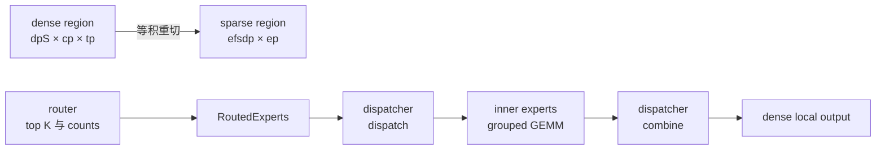

# 专家并行 EP：重切稀疏 rank 平面，用统一 dispatcher 隔离通信与专家计算

> **代码基准**：pytorch/torchtitan `main` @ `a3168782c9a3a2e40afbd0de114818b96e2bda6e`（2026-08-26）
> **最后更新**：2026-08-27 · **系列**：[[02_engineering/02_train_frameworks/torchtitan/index|TorchTitan 知识地图]]
>
> **本页回答**：EP 怎样在同一组 rank 上把 dense 区域重切为 `efsdp × ep`，router、dispatch、GroupedExperts、combine 怎样形成可替换协议，auxiliary-loss-free load balancing 怎样跨 forward、AC 与 optimizer step 保持状态，以及 standard、DeepEP v2、HybridEP、MinimalAsyncEP 分别用什么形状与同步假设换取延迟、吞吐、显存或 CUDA Graph 组合性。
>
> **边界**：全局 rank 预算与 mesh 构造详见 [[02_engineering/02_train_frameworks/torchtitan/10_torchtitan_parallel_dims_analysis|并行维度与进程网格]]；FSDP 生命周期、TP/CP 规则、SPMD 类型系统和通信重叠分别归属兄弟页。本页只追踪它们在 MoE 稀疏区的交点。

---

## 1. Overview

### 背景与问题

把 EP 想成在 DP、CP、TP 之外再乘一个新轴，会错误地扩大 world-size 预算。TorchTitan 的约束先要求 `dp_replicate × dp_shard × cp × tp × pp == world_size`，再要求 dense 区域的 `dp_shard × cp × tp` 可被 EP 整除（`torchtitan/distributed/parallel_dims.py:84-128`）。也就是说，EP 不是多买一组 rank，而是让 MoE 稀疏区域以另一种坐标解释同一组 rank。

第二个问题是通信实现并不唯一：标准 `all_to_all_single`、DeepEP v2、HybridEP 和 MinimalAsyncEP 的 buffer、静态形状、设备依赖不同，但模型不应为每个后端重写专家 MLP。当前稳定边界是兄弟节点 `token_dispatcher` 与 `inner_experts`；`RoutedExperts.forward()` 固定执行 `dispatch → inner_experts → combine`（`torchtitan/models/common/moe.py:123-180`）。

### Thesis

TorchTitan EP 的核心不是一个“专家并行层”，而是两个解耦：同一 rank 集合从 dense 的 `dp_shard × cp × tp` 重切为 sparse 的 `efsdp × ep`，通信侧再通过统一 dispatcher 协议与专家计算解耦。这样，GroupedExperts 只看专家连续的 token 与 offsets，后端可以独立选择动态 dropless AllToAll、DeepEP compact/expand、HybridEP 静态 nonblocking capacity，或 MinimalAsyncEP 的对称内存固定缓冲，而不用改变 MoE 主干（`torchtitan/models/common/moe.py:123-180`、`torchtitan/models/common/token_dispatcher.py:172-225`）。

### 概念表

| 概念 | 当前含义 | 不应再采用的心智模型 |
|---|---|---|
| `efsdp` | sparse 存储 mesh 中负责专家参数分片的轴；EP 轴负责专家维分片（`torchtitan/distributed/fsdp.py:267-360`） | EP 是 world size 的额外乘数 |
| dispatcher | 接收 dense-local token、routing map/counts，返回专家连续激活、counts 与可逆 metadata（`torchtitan/models/common/token_dispatcher.py:172-225`） | 每个模型自带一个 `ExpertParallel` 包装器 |
| `inner_experts` | 只消费按专家分组的 token；GroupedExperts 由 counts 生成 offsets 并调用 grouped GEMM（`torchtitan/models/common/moe.py:35-120`） | 专家 MLP 同时拥有通信与路由 |
| dense/sparse SPMD | `RoutedExperts` 外侧回到 dense 语义，专家计算窗口进入 sparse mesh（`torchtitan/models/common/moe.py:163-169`） | 整个模型永久切到 EP mesh |
| live backends | `standard`、`deepep`、`hybridep`、`minimal_async_ep` 四个当前 factory 分支（`torchtitan/models/common/config_utils.py:358-423`） | DeepEP v1 HT/LL 或已删除的模型专属路径仍是现行入口 |

### 关键图

等积关系是：

$$
d_{\mathrm{dpS}}d_{\mathrm{cp}}d_{\mathrm{tp}}
= d_{\mathrm{efsdp}}d_{\mathrm{ep}}
$$

代码把 dense storage mesh 建成 `[pp, dp_replicate, dp_shard, cp, tp]`，把 sparse storage mesh 建成 `[pp, dp_replicate, efsdp, ep]`，并导出各自的 forward/backward mesh（`torchtitan/distributed/parallel_dims.py:216-279`）。

### Quick Start：先选语义，再选后端

1. 令 `num_experts % expert_parallel_degree == 0`；模型初始化会显式拒绝不能均分的配置（`torchtitan/models/common/decoder.py:206-215`）。
2. 配置 rank 等积关系；`ParallelDims` 同时检查 world-size 乘积和 sparse 区域可整除性（`torchtitan/distributed/parallel_dims.py:84-128`）。
3. 从 `standard` 起步；需要 DeepEP v2、GB200 NVL72 优化或无 CPU 同步的固定形状路径时，再分别选择 `deepep`、`hybridep`、`minimal_async_ep`。factory 对未知 backend 直接报错（`torchtitan/models/common/config_utils.py:358-423`）。
4. 若开启 generic Trainer CUDA Graph，EP 只接受 nonblocking HybridEP 或 MinimalAsyncEP；PP 同时被拒绝（`torchtitan/trainer.py:165-196`）。

可追踪调用链如下：模型 config 构造 `GroupedExperts.Config + TokenDispatcher.Config`（`torchtitan/models/common/config_utils.py:426-455`）→ router 产出 `scores/routing_map/counts`（`torchtitan/models/common/moe.py:338-403`）→ dispatcher `dispatch` → sparse mesh 下的 `inner_experts` → dispatcher `combine`（`torchtitan/models/common/moe.py:123-180`）→ shared experts 在 dispatcher 之后独立计算并相加（`torchtitan/models/common/moe.py:404-453`）。

---

## 2. Rank 重切、激活布局与专家参数存储

### ① 背景/问题

Dense attention 需要 CP/TP 维度，MoE 专家却需要 EP 把专家分到不同 rank。若给每段模型各建一套不相关 process group，参数 checkpoint、FSDP 和 SPMD 布局会失去统一坐标。

### ② 为什么这么设计

选中路线是保持 rank 总量不变，只在 sparse region 把 `dp_shard × cp × tp` 重解释为 `efsdp × ep`。明显替代方案是把 EP 作为正交新乘数；它会改变 world-size 预算，且不能复用 dense rank。源码的决策准则是“两个区域等积且可整除”，由构造 guard 强制，而不是性能启发式（`torchtitan/distributed/parallel_dims.py:84-128`）。

### ③ 实现思路与细节

- storage 视角保留 PP、DP-replicate 等外层轴：dense 为 `[pp, dpR, dpS, cp, tp]`，sparse 为 `[pp, dpR, efsdp, ep]`；forward/backward 再分别取 dense `[dp, cp, tp]` 与 sparse `[dpR, efsdp, ep]` 视图（`torchtitan/distributed/parallel_dims.py:216-279`）。
- SPMD runtime 把 dense/sparse meshes 注册到线程局部状态，`maybe_set_sparse_mesh()` 只在专家窗口切换当前 mesh（`torchtitan/distributed/spmd_types.py:108-192`）。`RoutedExperts` 因而可以在 dispatch 前后保留 dense 语义，只让 `inner_experts` 在 sparse context 中执行（`torchtitan/models/common/moe.py:163-169`）。
- 专家 state placement 在 EP 轴是 `Shard(0)`，在 DP-replicate 与 EFSDP 轴是 replicate（`torchtitan/models/common/moe_sharding.py:30-48`）；激活通过 `local_map` 从 dense sequence-parallel 输入进入 sparse 专家布局，再回到 dense 布局（`torchtitan/models/common/moe_sharding.py:200-302`）。
- FSDP 识别 `routed_experts.inner_experts` 下的参数并改用 sparse mesh。通常专家维 `Shard(0)`；当 `efsdp × ep > num_experts` 时改为 `Shard(1)`，避免在专家维制造无意义 padding（`torchtitan/distributed/fsdp.py:267-360`）。

### ④ 约束/边界

`efsdp` 在 sparse mesh 中可为 singleton，但 `ep` 必须整除 sparse rank 数，且模型专家数必须整除 EP degree（`torchtitan/distributed/parallel_dims.py:130-145`、`torchtitan/models/common/decoder.py:206-215`）。这不是“EP 自动负载均衡”：router 倾斜仍会形成不同 token counts；mesh 只定义所有权与布局。

FSDP 在 EP 下显式安排 forward/backward prefetch，因为设备到主机同步会干扰隐式 prefetch 的时序（`torchtitan/distributed/fsdp.py:384-424`）。具体 FSDP 生命周期不在本页展开。

---

## 3. 统一 dispatcher 协议、router 与 grouped experts

### ① 背景/问题

Router 产生的是 token-to-expert 稀疏关系，而 grouped GEMM 需要“同一专家的 token 连续排列 + 每专家边界”。通信后端还要保存足够 metadata，使 combine 能把结果还原到 token/top-k 槽位。把这些责任塞进模型专属 GroupedExperts，会令后端和模型形成笛卡尔积。

### ② 为什么这么设计

当前选择是把 dispatcher 与 `inner_experts` 做成兄弟节点，以一个小协议隔离通信和计算；替代方案是 dispatcher 包住专家或由每个模型自行分发。**知识库推断**：兄弟节点边界避免了模型种类与通信后端形成实现笛卡尔积。提交 `4a93ee4e4bd72` 统一了这条边界；HEAD 又以 `x_TD.shape[0]` 表示物理 padding 后的当前 token 数，而不再沿用该提交正文里的 `num_tokens_per_rank` 调用形态（`torchtitan/models/common/token_dispatcher.py:202-225`）。因此历史提交解释迁移动机，当前签名必须以 HEAD 为准。

### ③ 实现思路与细节

- Router 在 float32 中计算 gate，支持 sigmoid/softmax、可选 group-limited top-k、只影响选择的 expert bias，以及 top-k 权重归一化/缩放（`torchtitan/models/common/moe.py:183-335`）。它输出 scores、routing map 和每专家 counts。
- BaseEPDispatcher 定义 `dispatch(x, scores, routing_map, counts) -> dispatched_input, counts, metadata` 与 `combine(expert_output, metadata)`；metadata 是后端私有的可逆状态（`torchtitan/models/common/token_dispatcher.py:172-225`）。
- `RoutedExperts` 固定串联 dispatch、sparse-context `inner_experts`、combine，并在 `parallelize()` 时把 EP mesh 交给 dispatcher（`torchtitan/models/common/moe.py:123-180`）。
- GroupedExperts 用 counts 的前缀边界生成 offsets，随后执行三组 grouped matrix multiply；它不读取 process group 或路由 map（`torchtitan/models/common/moe.py:35-120`）。FusedSwiGLU 变体也消费 offsets，并用最后一个 offset 跳过静态 padding 尾部（`torchtitan/overrides/fused_swiglu.py:95-180`、`torchtitan/overrides/fused_swiglu.py:600-658`）。
- DeepSeek V3 与 GPT-OSS 都经 common factory 构造 dispatcher；GPT-OSS 虽有自定义 grouped expert，仍复用同一 `RoutedExperts` 边界（`torchtitan/models/deepseek_v3/__init__.py:180-268`、`torchtitan/models/gpt_oss/__init__.py:149-181`）。

### ④ 约束/边界

统一协议不等于所有后端同形状：standard 可用真实 token 数，persistent backends 需要配置最大容量；combine metadata 也不能跨 backend 互换（`torchtitan/models/common/token_dispatcher.py:172-225`、`torchtitan/models/common/token_dispatcher.py:1186-1259`）。

量化 grouped experts 还会改变 dispatcher 选择：TorchAO 可把 standard 包装为带 group padding 的 dispatcher，或沿用 HybridEP 的 padding；DeepEP 与 MinimalAsyncEP 当前被量化工具拒绝（`torchtitan/components/quantization/utils.py:33-64`）。

### ⑤ 发展趋势（有锚点的推断）

提交 `3101b42f9045` 把 FusedSwiGLU 与 dispatcher override 改成可交换顺序的兄弟节点组合；CPU 测试同时验证 generator override 不污染 trainer 的 DeepEP compact 模式（`tests/unit_tests/cpu/test_inference_moe.py:84-152`）。据此可推断，演进方向是继续把通信、专家 kernel 与 actor 模式做成正交 override，而不是恢复模型专属包装器。

---

## 4. Auxiliary-loss-free load balancing：跨 forward、AC 与 optimizer 的状态机

### ① 背景/问题

Top-k router 若长期偏向少数专家，会把通信与 grouped GEMM 的尾部延迟放大；但把均衡项加进训练 loss 又会改变反向目标。TorchTitan 采用 auxiliary-loss-free 路线：用每步实际路由计数更新一个独立 bias，让下一步的 expert choice 逐渐回正，而不向 loss 注入辅助梯度（`torchtitan/models/common/moe.py:375-394`）。这里的状态跨越 forward、activation checkpointing（AC）重算与 optimizer step，不能只从 router 的单次调用理解。

### ② 为什么这么设计

选中路线是“forward 累积 usage，optimizer pre-hook 在梯度累积结束时统一更新”；明显替代方案是每个 microbatch 就地改 bias，后者会令同一 optimizer step 内后续 microbatch 看到不同路由策略。源码注释明确把 pre-hook 与 gradient accumulation 的兼容性作为理由（`torchtitan/models/common/moe.py:375-378`）；引入提交 `01f4e50228fb4a304d17b5b5c5edfe39cc960000` 的正文也把“从额外 TrainSpec 入口改为 optimizer hook”归因于这一问题。随后 `2bfcdd8e149e49b9e958fd58a9fbed261754a1af` 把各层 usage 堆叠后统一规约，并加入 full-recompute 双计数修正；这解释了当前“跨层 batch reduce”而非每层一次 collective 的形态。

### ③ 实现思路与细节

- **选择与 gating value 分离**：router 先得到原始 `scores_TE`，只在 `scores_for_choice_TE` 上加 `expert_bias_E` 并执行 top-k；选定 expert 后，`topk_scores_TK` 仍从未加 bias 的原始 scores gather。因此 bias 只改变“选谁”，不改变已选专家在 mixture 中的 gating value（`torchtitan/models/common/moe.py:277-329`）。
- **两类 buffer、两种生命周期**：启用时 `expert_bias_E` 是 float32、`persistent=True`；`tokens_per_expert_E` 始终存在但为 float32、`persistent=False`。前者进入模型持久状态，后者只是 optimizer step 之间的临时计数；DeepSeek V3 adapter 也把外部 `e_score_correction_bias` 映射到该 bias（`torchtitan/models/common/moe.py:379-394`、`torchtitan/models/deepseek_v3/state_dict_adapter.py:45-54`）。
- **forward 累积**：每次训练 forward 从 bool routing map 沿 token 维求和，并在 `no_grad` 下累加到 counter；eval forward 不累积，CPU 单测固定路由后验证了这一区别（`torchtitan/models/common/moe.py:413-444`、`tests/unit_tests/cpu/test_moe.py:46-87`）。counter 的 SPMD placement 在 DP/CP 上为 `Partial`；EP 开启时 TP 也为 `Partial`，因为该轴承载不同 token，未开 EP 时 TP 为 `Replicate`（`torchtitan/models/common/moe_sharding.py:70-85`）。
- **AC 修正与跨 rank 汇总**：non-reentrant full AC 会令 forward 与 backward recompute 各计一次；hook 通过 transformer block 的 `checkpoint_impl == NO_REENTRANT` 检测并对该层计数整除 2。之后把所有层堆叠；仅 `EP && TP>1` 时先在 dense TP group 求和，再在可选 loss mesh 上求和，并把本地 tensor 重建为全 replicate DTensor（`torchtitan/components/optimizer/optimizer.py:443-491`）。提交 `f3660a493af7f0f435167dcb8aac1cca56d976ff` 的正文记录了新增 dense-TP reduce 的直接原因：SPMD backend 下 TP 训练的 routing bias 曾因漏规约而不一致。
- **step 边界更新**：各模型的 `post_optimizer_build_fn` 显式注册 hook，例如 Qwen3 model spec（`torchtitan/models/qwen3/__init__.py:613-634`）；Trainer 在模型并行化后构造 optimizer 并注册它（`torchtitan/trainer.py:533-538`）。每次 `optimizers.step()` 前，hook 对每层计算 `coeff × sign(mean(count)-count)`，再减去 delta 自身均值，使 bias 更新量零均值；随后先 `add_` bias、再清零 counter（`torchtitan/components/optimizer/optimizer.py:493-526`）。因此欠载专家得到正向选择偏置，过载专家得到负向偏置；该 buffer 更新不经过 optimizer parameter、学习率或 weight decay。Trainer 的 step 位于所有 microbatch forward/backward 与梯度裁剪之后（`torchtitan/trainer.py:785-889`）。

### ④ 约束/边界

启用 guard 要求 `load_balance_coeff > 0`；注册 hook 时传入 `model_parts` 内所有 MoE 层必须一致地“全部启用或全部禁用”，否则抛 `ValueError`。它并不要求各层数值系数相同：单测用 `0.1/0.2` 验证不同层独立更新并清零 counter，同时验证 `None/0.2` 被拒绝（`torchtitan/components/optimizer/optimizer.py:418-441`、`tests/unit_tests/cpu/test_optimizer_param_groups.py:149-207`）。计数发生在 common router 与 dispatcher 之间，因此四种 live dispatcher 共用同一状态机；但模型 spec 必须实际安装 `post_optimizer_build_fn`，自定义 MoE 只设置 coefficient 却不注册 hook，会积累 counter 而不更新 bias，这是由注册调用链推出的集成责任（`torchtitan/models/common/moe.py:413-444`、`torchtitan/trainer.py:533-538`）。

AC 的 `/2` 被源码明确标为 hack，只假设 full AC 造成均匀两次计数；`sign(mean-count)` 令精确的全层 2× 缩放不改变 bias 方向，整除主要修正 usage metrics（`torchtitan/models/common/moe.py:431-438`、`torchtitan/components/optimizer/optimizer.py:461-466`）。**知识库推断**：selective、非标准或非均匀重算若不满足这个假设，整除 2 既不能表达真实 usage，也可能改变相对均值的符号。另一个边界是 hook 中的 TP/loss-mesh all-reduce 当前阻塞且运行在默认 compute stream，源码尚未给出可隐藏的通信窗口（`torchtitan/components/optimizer/optimizer.py:451-484`）。

checkpoint 只保存 persistent bias，不保存 step 内 counter；因此从 step 边界恢复可继续沿用已学习 bias，但在梯度累积中途恢复不会重建已观察的部分 usage。该结论来自 buffer 的 persistent 标志与每步清零时序，而不是 DCP 对 mid-step 恢复的显式保证。当前 update 还明确注释“并不完全等同于论文算法”，不能把这里的 mean-centered sign rule 外推成论文的逐式复现（`torchtitan/components/optimizer/optimizer.py:510-519`）。

### ⑤ 发展趋势（有锚点的推断）

源码在 AC 检测处留下迁移到 PyTorch 新 detection API 的 TODO，在 collective 处留下评估 blocking sync 的 TODO（`torchtitan/components/optimizer/optimizer.py:443-465`、`torchtitan/components/optimizer/optimizer.py:451-453`）。据此只能推断检测与同步实现仍可能收敛；HEAD 没有 async hook、selective-AC 精确计数或 checkpoint counter 的承诺。

---

## 5. Standard AllToAll：动态 dropless 参考路径

### ① 背景/问题

最通用的 dispatcher 必须处理每个 rank、每个专家都不同的 token 数，并在 combine 时恢复原 token/top-k 次序。动态 split 需要先交换 counts，因此会暴露一次 CPU 可见的 split-size 准备窗口。

### ② 为什么这么设计

standard 选择 PyTorch collective 和精确动态 splits；替代方案是按最坏情况固定容量。前者避免静态 padding 与丢 token，代价是 count exchange、显式 wait 和 device-to-host split materialization（`torchtitan/models/common/token_dispatcher.py:228-314`）。**知识库推断**：它因此适合作为语义参考与无专用通信库的起点；CUDA Graph guard 则明确排除了这条 EP 路径（`torchtitan/trainer.py:165-196`）。

### ③ 实现思路与细节

1. EP=1 时走本地 reorder/scatter，不发 collective（`torchtitan/models/common/token_dispatcher.py:47-169`）。
2. EP>1 先按目标 rank 整理 token，切入 sparse mesh 语义，交换每 rank/per-expert counts，并把 split sizes 物化到主机（`torchtitan/models/common/token_dispatcher.py:372-493`）。
3. `all_to_all_single` 先得到 rank-major token；`_permute()` 再排成 local-expert-major，供 grouped GEMM 消费（`torchtitan/models/common/token_dispatcher.py:316-370`、`torchtitan/models/common/token_dispatcher.py:495-547`）。
4. combine 逆置 expert-major 排列，再反向 AllToAll，并用 scores 把 top-k 贡献 scatter-add 回原 token（`torchtitan/models/common/token_dispatcher.py:549-618`）。

这里的 scatter-add 不是裸 `Tensor.scatter_add_`：TorchTitan 把它注册成 `torchtitan::deterministic_scatter_add` custom op，调用期间强制 deterministic algorithms、`finally` 恢复调用前全局设置，并分别注册 fake 与手写 autograd；反向对 `src` 用相同 index gather，对 index 不求导（`torchtitan/ops/scatter_add.py:10-48`）。提交 `8bc267dea7eed768e03be2f4450c3b03d7b4fde4` 记录了为什么不继续用旧替代 `bmm`：它虽规避 scatter 的非确定性，但 eager backward 太慢；当前路线选择“确定性 scatter + 显式梯度”，该提交只在给定 Llama4/Qwen3 测试上报告略快，不能外推成所有 shape 的性能结论。

### ④ 约束/边界

旧页若把返回的 `AsyncCollectiveTensor` 描述为跨 shared experts 的延迟 wait，已经不符合 HEAD：combine 随后的 dtype 转换、score 乘法与 scatter 是结果数据依赖（`torchtitan/models/common/token_dispatcher.py:549-618`），而 shared experts 在整个 routed path 完成后才单独执行（`torchtitan/models/common/moe.py:404-453`）。提交 `963c20cba37` 也明确把 shared experts 移出 dispatcher，以清理 DTensor 边界；当前不存在该重叠窗口。

generic Trainer 在 CUDA Graph + EP 下显式拒绝 standard，因为动态形状与 CPU 同步不满足捕获条件（`torchtitan/trainer.py:165-196`）。

custom scatter 的确定性只约束本地 top-k 汇合；它不使 AllToAll 到达顺序、expert kernel 或跨 rank 整个训练自动满足全局 bitwise determinism。fake/autograd 注册证明该 op 可 trace/可反传，也不等价于 standard dispatcher 已满足 CUDA Graph 的动态 split 条件。

---

## 6. DeepEP v2：训练 compact、推理 expand 的单 buffer 路径

### ① 背景/问题

DeepEP 需要同时覆盖训练中的 dropless 动态 token 与无梯度生成中的固定容量 CUDA Graph。旧 v1 把 high-throughput 与 low-latency 做成两套 API，容易让 buffer 生命周期和模型模式分叉。

### ② 为什么这么设计

v2 选择统一 ElasticBuffer：有梯度训练走 compact，按真实 token 通信；无梯度 inference 走 expand，以配置 capacity 提供静态输出。明显替代方案是保留 v1 HT/LL 双 API；当前模块头部已把它标为 legacy，并说明 v2 的统一模式（`torchtitan/distributed/deepep/deepep.py:7-36`）。决策准则是训练显存/通信量与推理可捕获形状之间按运行模式切换。

### ③ 实现思路与细节

- `DeepEPTokenDispatcher` 使用 v2、创建一个 eager ElasticBuffer；dispatch 把当前物理 token 数传给 buffer，combine 随即调用 `sync_combine()`，所以公共接口不暴露 pending handle（`torchtitan/models/common/token_dispatcher.py:768-878`）。
- ElasticBuffer 在有梯度时选择 compact permute/unpermute，无梯度且 cudagraphable 时选择 expand；expand 对容量做显式上界断言（`torchtitan/distributed/deepep/deepep.py:384-437`、`torchtitan/distributed/deepep/deepep.py:440-557`）。
- dispatch/combine 通过自定义 op 与手写 autograd 互为反向；score 在通信算子外施加，combine 再归约 top-k 输出（`torchtitan/distributed/deepep/deepep.py:204-327`、`torchtitan/distributed/deepep/deepep.py:560-605`）。
- buffer 显式拥有通信内存并要求 `explicitly_destroy=True`，把昂贵资源绑定到 dispatcher 生命周期（`torchtitan/distributed/deepep/deepep.py:335-381`）。

### ④ 约束/边界

当前代码要求 DeepEP Python 包版本至少 2.0（`torchtitan/distributed/deepep/deepep.py:44-67`）。在 generic Trainer 的 CUDA Graph 规则中，DeepEP 并未列入允许的 EP backend；无梯度 generator 的 expand override 是另一条 actor 场景，不能据此声称训练图捕获已支持（`torchtitan/trainer.py:165-196`、`torchtitan/overrides/moe_token_dispatcher.py:7-38`）。

当前 H100 集成矩阵覆盖 Qwen3 `FSDP4 + EP4 + DeepEP`，并因 DeepEP/NVSHMEM 为 CUDA-only 而跳过 ROCm（`torchtitan_recipes/tests/h100.py:89-95`、`tests/integration_tests/h100.py:73-78`）。这证明该组合有提交测试，不等于其他拓扑自动得到覆盖。

### ⑤ 发展趋势（有锚点的推断）

提交 `756213e155ae` 以 v2 取代 HT/LL 分裂，并将 compact training、expand inference 收敛到单 buffer。结合当前文件的 legacy 声明，可推断维护重心已转到 v2；旧 DeepEP v1 不应继续作为现行机制讲解。

---

## 7. HybridEP：NVL72 融合通信与 permute，以容量换图捕获

### ① 背景/问题

在 GB200 NVLink72 域内，通用 AllToAll 之后再 permute 会产生额外 kernel、读写与中间内存；但完全动态的接收量又不利于 CUDA Graph 和低启动开销。

### ② 为什么这么设计

HybridEP 选择 TMA 优化的 `dispatch_with_permute`，直接生成 expert-major 输出。blocking 模式保留精确 token 数；nonblocking 模式用容量因子预留静态空间。替代方案是通信后单独 permute；源码把目标设备和融合路径直接写在模块说明中（`torchtitan/distributed/deepep/hybridep.py:7-20`）。决策准则是 NVL72 上的 kernel/内存开销与 overflow 风险，而非跨设备可移植性。

### ③ 实现思路与细节

- dispatcher config 的 `non_blocking_capacity_factor` 决定模式，并初始化 HybridEP buffer；dispatch/combine 仍实现统一接口（`torchtitan/models/common/token_dispatcher.py:881-1006`）。
- blocking dispatch 根据真实 counts 分配精确接收区；nonblocking 以静态 capacity 运行，通信与 expert-major permute 融合（`torchtitan/distributed/deepep/hybridep.py:115-190`）。
- nonblocking capacity 随 factor 增长：更多预留内存降低 overflow，较小 factor 节省内存但可能丢 token（`torchtitan/distributed/deepep/hybridep.py:80-109`）。
- combine 在 score 加权后用 opaque dispatch handle 回送并归约；前后向均由自定义 op/手写 autograd 配对（`torchtitan/distributed/deepep/hybridep.py:224-248`、`torchtitan/distributed/deepep/hybridep.py:394-540`）。

### ④ 约束/边界

nonblocking overflow 会静默丢弃超容量 token，当前路径没有 host-side overflow 检查（`torchtitan/distributed/deepep/hybridep.py:115-190`）。这是以静态图和低同步换取的语义风险，capacity factor 必须按路由分布留裕量。

实现要求 CUDA，且 dispatch 不支持 FP8（`torchtitan/distributed/deepep/hybridep.py:394-452`）。generic Trainer 只有 nonblocking HybridEP 能与 CUDA Graph + EP 组合，blocking HybridEP 会被 guard 拒绝（`torchtitan/trainer.py:165-196`）。当前集成矩阵覆盖 `FSDP4 + EP2 + compile` 并跳过 ROCm（`tests/integration_tests/h100.py:49-55`）。

### ⑤ 发展趋势（有锚点的推断）

提交 `156db2eadada` 引入 HybridEP，并明确以 NVL72 上融合 communication+permute 降低开销与内存。由当前模块仍锁定 GB200 NVLink72 可推断，它是硬件专化分支，而不是 standard 的通用替代品。

---

## 8. MinimalAsyncEP：固定对称缓冲、无 CPU 同步及 CP/TP/PP 组合

### ① 背景/问题

动态图 counts 的 D2H 同步会阻断 CUDA Graph；引入完整专用库又增加依赖。MinimalAsyncEP 的目标是用 Torch symmetric memory 与 Triton/CUDA kernels 提供足够小的训练路径，并把最坏容量固定在初始化阶段。

### ② 为什么这么设计

它选择两个 ping-pong hidden buffers、counts buffer 和固定 `R_max`，dispatch 在 GPU 上完成 count 交换、远端写入与 expert-major 排列。替代方案是像 standard 一样把 split sizes 拉回 CPU；Minimal 明确用静态最坏容量换无 CPU 同步、可图捕获和更大的常驻显存（`torchtitan/distributed/minimal_async_ep/api.py:7-21`、`torchtitan/distributed/minimal_async_ep/api.py:174-295`）。这里的 “Async” 指 host 不同步，不是公共 API 返回一个可延后 wait 的异步 handle。

### ③ 实现思路与细节

- 初始化验证 EP>1、专家可整除、训练配置、FullAC 与 hidden dtype，然后按完整配置 key 复用唯一 process-global buffer（`torchtitan/distributed/minimal_async_ep/api.py:49-143`）。
- symmetric-memory buffer 只支持 CUDA backend；两块 hidden buffer 与 counts 在初始化时按最大容量分配，配置不完全相同则拒绝复用（`torchtitan/distributed/minimal_async_ep/api.py:174-295`）。
- dispatch 先交换 GPU counts，再由 kernel 直接写出 local-expert-major 行，省掉 standard 的独立 rank-major permute；combine 以 FP32 累加 top-k 活跃行（`torchtitan/distributed/minimal_async_ep/api.py:368-555`、`torchtitan/distributed/minimal_async_ep/kernels.py:147-190`）。
- persistent dispatcher 的当前每-rank token 上限为 `num_tokens_per_microbatch_per_dp_rank / (cp × tp)`，要求整除；Minimal 的接收容量再乘 EP size 与 `min(top_k, num_local_experts)`（`torchtitan/models/common/token_dispatcher.py:1009-1124`、`torchtitan/models/common/token_dispatcher.py:1186-1259`）。PP 不进入此式；**知识库推断**：原因是 PP 位于 sparse storage mesh 的外层，不参与一次 stage-local EP collective（`torchtitan/distributed/parallel_dims.py:216-279`）。
- 提交 `15db18b9cfc96` 把 CP/TP/PP 接到统一 dispatcher/SPMD contract；HEAD 的类说明也明确支持可选 CP、TP、PP（`torchtitan/models/common/token_dispatcher.py:1009-1014`、`torchtitan/distributed/minimal_async_ep/api.py:7-10`）。

### ④ 约束/边界

Minimal 要求 `ep_size > 1`、FullAC、CUDA symmetric memory，且 hidden buffer dtype 当前只允许 bfloat16 或 float32（`torchtitan/distributed/minimal_async_ep/api.py:84-143`、`torchtitan/distributed/minimal_async_ep/kernels.py:18-23`）。capacity 小于运行所需值会在配置更新阶段报错，而不是运行时静默扩容（`torchtitan/models/common/token_dispatcher.py:1186-1259`）。

当前 committed H100 recipe 覆盖 `FSDP2 + CP2 + TP2 + EP8 + FullAC + spmd_types`，集成项为 8 GPU 且跳过 ROCm（`torchtitan_recipes/tests/h100.py:63-77`、`tests/integration_tests/h100.py:57-63`）。提交 `15db18b9cfc96` 还记录了独立 PP2 数值对照，但当前集成矩阵没有 CP+TP+PP 同时非 1 的一项；因此“代码支持 PP”与“所有联合拓扑均已回归”必须分开陈述。

API 边界在 dispatch 结束时执行 fused group barrier，注释明确当前没有 microbatch overlap（`torchtitan/distributed/minimal_async_ep/api.py:298-365`）。所以它消除 CPU 同步，不等于已经把不同 microbatch 的通信与计算流水化。

### ⑤ 发展趋势（有锚点的推断）

提交 `7b579addea35` 的初版以最坏容量、FullAC 和 offset-aware SwiGLU 构成最小闭环；`15db18b9cfc96` 再扩到 CP/TP/PP。由于当前 API 仍明确写着“no microbatch overlap”，可推断下一类优化空间是扩大设备侧流水窗口，但源码没有承诺时间表。

---

## 9. 选择判据、fallback 与验证边界

### ① 背景/问题

四个 live backend 共享接口，但不是按“新旧”线性排序；错误的选择会表现为 CPU sync、静态内存膨胀、overflow 丢 token、硬件不兼容或缺少回归覆盖。

### ② 为什么这么设计

应按语义与平台约束选择，而不是默认专用 kernel 总是更快。明显替代方案是让框架自动 fallback；当前 factory 对未知值报错，persistent backend 的非法容量也报错，没有从 DeepEP/Hybrid/Minimal 静默降级到 standard 的路径（`torchtitan/models/common/config_utils.py:358-423`、`torchtitan/models/common/token_dispatcher.py:1186-1259`）。显式失败避免训练语义在不知情时改变。

### ③ 实现思路与细节

| 目标 | 首选 | 关键机制 | 主要代价/风险 |
|---|---|---|---|
| 最清晰 dropless 语义、无专用库 | standard | 动态 counts + 双向 AllToAll（`torchtitan/models/common/token_dispatcher.py:228-370`） | CPU split materialization；不支持 generic EP CUDA Graph |
| 训练 compact、生成静态 expand | DeepEP v2 | 单 ElasticBuffer 按 grad/cudagraph 模式切换（`torchtitan/distributed/deepep/deepep.py:384-557`） | DeepEP ≥2.0；generic Trainer 图捕获未放行 |
| GB200 NVL72 + compile/graph | nonblocking HybridEP | 融合 dispatch+permute，静态 capacity（`torchtitan/distributed/deepep/hybridep.py:80-190`） | 容量内存；overflow 静默丢 token；硬件专化 |
| 少依赖、CUDA Graph、CP/TP/PP contract | MinimalAsyncEP | symmetric memory 固定双缓冲，无 CPU sync（`torchtitan/distributed/minimal_async_ep/api.py:174-365`） | FullAC、CUDA、BF16/FP32、较大常驻容量 |

验证层次也要分开：CPU 单测检查专家数可整除和 standard permute（`tests/unit_tests/cpu/test_expert_parallel.py:17-89`）；GPU FSDP 单测检查专家参数在不同 `efsdp × ep` 下选择 `Shard(0)` 或 `Shard(1)`（`tests/unit_tests/gpu/test_fsdp_moe_sharding.py:24-140`）；H100 集成矩阵才覆盖 DeepEP、HybridEP 与 Minimal 的代表组合（`tests/integration_tests/h100.py:49-78`）。

### ④ 约束/边界

这些测试不是全矩阵证明：当前 committed Minimal 集成没有 PP>1，Hybrid 专注 NVL72/CUDA，DeepEP 代表项是 Qwen3 FSDP+EP。三个 persistent dispatcher 都要求 `expert_parallel_degree > 1`，配置容量也必须为正且不小于按 CP/TP 推导的运行需求（`torchtitan/models/common/token_dispatcher.py:1186-1253`）。模型侧可以自定义 `inner_experts`，但只要遵守 common `RoutedExperts` 协议就不是旧式模型专属 dispatcher（`torchtitan/models/gpt_oss/__init__.py:149-181`）。

最后两条旧结论应明确作废：一，`torchtitan/distributed/expert_parallel.py`、llama4 专属装配和 `ExpertParallel._partition_fn` 不在当前机制中，现行公共 sharding 入口是 `set_moe_sharding_config()`（`torchtitan/models/common/moe_sharding.py:305-377`）；二，shared-expert/AllToAll-combine overlap 已被移除，不能从异步 collective 类型推导出仍有该计算窗口（`torchtitan/models/common/moe.py:404-453`、`torchtitan/models/common/token_dispatcher.py:549-618`）。

### ⑤ 发展趋势（有锚点的推断）

factory 对四个 backend 的参数仍有统一配置 TODO（`torchtitan/models/common/config_utils.py:358-423`）。结合统一 dispatcher 与 sibling override 的演进，可推断后续更可能收敛配置面，而不是合并四种不同的通信/容量语义。

---

## Related Pages

- [[02_engineering/02_train_frameworks/torchtitan/10_torchtitan_parallel_dims_analysis|并行维度与进程网格]] — EP/EFSDP 等积重切所依赖的全局 rank 预算与 mesh 构造。
- [[02_engineering/02_train_frameworks/torchtitan/11_torchtitan_fsdp_analysis|FSDP 分片与生命周期]] — 专家参数 sparse mesh、prefetch 与 checkpoint 语义的上层所有者。
- [[02_engineering/02_train_frameworks/torchtitan/12_torchtitan_tp_analysis|张量并行 TP]] — dense sequence-parallel 激活进入 MoE 前的 TP 布局。
- [[02_engineering/02_train_frameworks/torchtitan/13_torchtitan_cp_analysis|上下文并行 CP]] — MinimalAsyncEP 容量式中 CP 分摊 token 的来源。
- [[02_engineering/02_train_frameworks/torchtitan/16_torchtitan_spmd_types_analysis|SPMD 类型与布局系统]] — dense/sparse current-mesh 切换与 `local_map` 类型边界。
- [[02_engineering/02_train_frameworks/torchtitan/22_torchtitan_ac_analysis|激活检查点 AC]] — full recompute、selective recompute 与副作用状态的统一边界。
- [[02_engineering/02_train_frameworks/torchtitan/24_torchtitan_comm_optimizations_overlap_analysis|通信优化与重叠]] — collective、prefetch 与真正可重叠窗口的全局分析。
