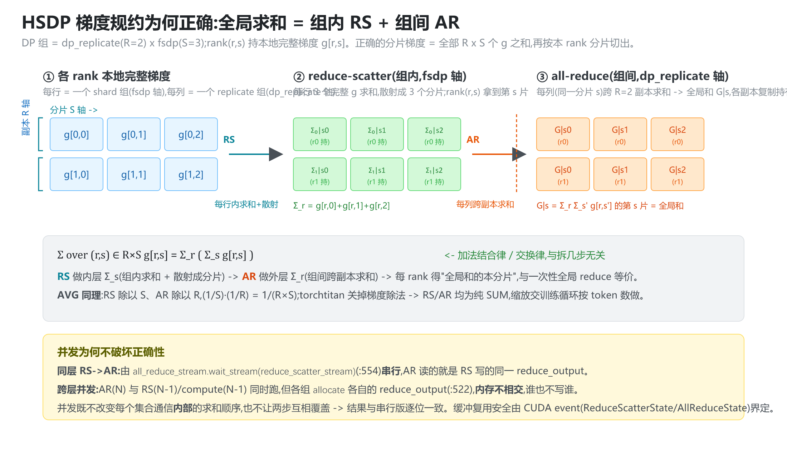
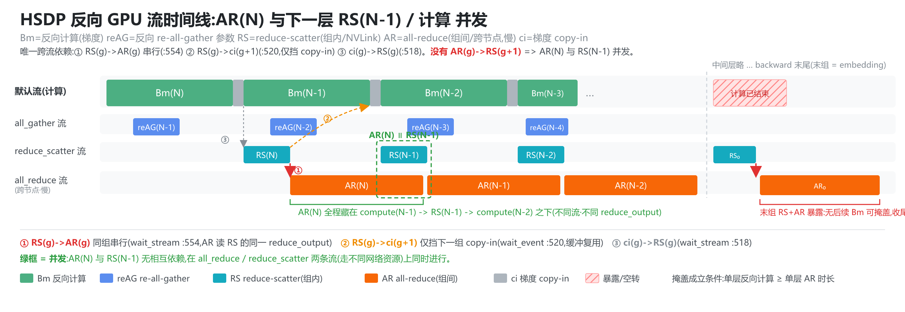
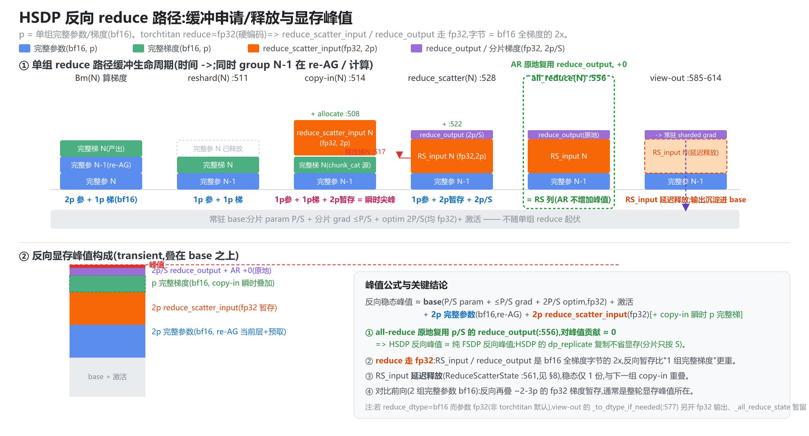

# HSDP 反向梯度通信掩盖 —— reduce-scatter 与 all-reduce 双流掩盖(源码级)

> **代码基准**:torchtitan `main` @ `a3168782c9a3a2e40afbd0de114818b96e2bda6e`（接线）· PyTorch `2.9.1`（FSDP2 内核 `torch/distributed/fsdp/_fully_shard/`）
> **最后更新**:2026-08-27（复核当前 storage mesh 接线；PyTorch 双流机制与图固定于 2.9.1） · **系列**:torchtitan 多维并行源码级分析(见 [[torchtitan/index]])
>
> 本文是 [[11_torchtitan_fsdp_analysis|FSDP2 机制深度分析]] §4.4/§6.2 的展开篇,把 HSDP 反向 reduce-scatter→all-reduce 的跨流编排逐行讲清。配套预取/显存专题见 [[20_torchtitan_fsdp_prefetch_overlap_memory_analysis]]。
>
> **四页分工**(2026-07-31 补):本页专注 **HSDP**(dp_replicate × fsdp 双轴)反向双流掩盖这一个切面;单轴 FSDP 的标杆机制见 [[11_torchtitan_fsdp_analysis]],其预取/显存深挖见 [[20_torchtitan_fsdp_prefetch_overlap_memory_analysis]];编译器友好的 DTensor-collective 替代方案见 [[25_torchtitan_simple_fsdp_analysis]]。
> 行号约定:torchtitan 以仓库根为基准写完整 `torchtitan/...`;PyTorch FSDP2(2.9.1)以 `[pt]` 前缀,根目录 `torch/distributed/fsdp/_fully_shard/`。所有结论基于本机源码逐条复核(见复核表)。

---

## 0. 一句话地图

```
HSDP 反向每层做两次集合通信:
  reduce-scatter(组内 fsdp 轴,典型走节点内 NVLink) → all-reduce(组间 dp_replicate 轴,典型走跨节点网络)

torchtitan 声明 replicate/shard 轴，FSDP2 抽取逻辑 HSDP mesh；掩盖逻辑 100% 在 FSDP2:
  两条独立通信流(reduce_scatter_stream / all_reduce_stream)+ 逐层反向流水
  → RS(N) 被 compute(N-1) 掩盖;AR(N) 进一步被 compute(N-1)/(N-2) 与 RS(N-1) 掩盖
  代价:仅最后一组(embedding)的 RS+AR 尾部因无后续计算而暴露,收尾回调显式等待
```

---

## 1. 触发链：torchtitan 的多维 storage mesh → FSDP2 的逻辑 HSDP 两组

### 1.1 torchtitan 侧：用 storage mesh + `DataParallelMeshDims` 声明 HSDP

默认 `spmd_types` 下，`parallelize_llama` 先调用 `resolve_fsdp_mesh()`，再把 `dp_mesh` 与 `dp_mesh_dims` 交给共享 `apply_fsdp_to_decoder`（`torchtitan/models/llama3/parallelize.py:57-77`）。resolver 保留 `[dp_replicate,dp_shard,cp,tp]` dense storage mesh，并声明 `shard=(dp_shard,cp)`、`replicate=dp_replicate`（只包含实际启用的轴；`torchtitan/distributed/fsdp.py:28-62`）。

- shard 轴 = `dp_shard`，启用 CP 时再把 `cp` flatten 进 FSDP shard group。
- replicate 轴 = `dp_replicate`。
- TP 留在 storage mesh 中供参数的既有 TP placement 使用，不属于 HSDP 规约轴。

共享入口对每个 TransformerBlock 调 `fully_shard(...,mesh=dp_mesh,dp_mesh_dims=...)`，最后再包根模块（`torchtitan/distributed/fsdp.py:223-232,267-368`）。torchtitan 对 HSDP 的运行时判断仍只用于日志：

```python
if "dp_replicate" in (dp_mesh.mesh_dim_names or ()):
    logger.info("Applied HSDP to the model")
```

日志位置为 `torchtitan/distributed/fsdp.py:376-380`。**掩盖逻辑完全在 FSDP2,torchtitan 不参与；变化的是 HSDP 轴如何从多维 storage mesh 中显式抽取。**

### 1.2 FSDP2 侧:2D mesh → HSDPMeshInfo → 两个进程组

`fully_shard` 根据 torchtitan 显式传入的 DP mesh dims 抽取/flatten DP 子网格，并构造逻辑 `HSDPMeshInfo`(`[pt]_fsdp_common.py:74`)；它同时继承 `FSDPMeshInfo`(分片)和 `DDPMeshInfo`(复制),携带两个进程组:

| 进程组 | 轴 | 通信 | 源码 |
|---|---|---|---|
| `shard_process_group` | `fsdp`(组内) | **reduce-scatter** | `[pt]_fsdp_common.py:58` |
| `replicate_process_group` | `dp_replicate`(组间) | **all-reduce** | `[pt]_fsdp_common.py:69` |

`FSDPParamGroup` 据此暴露三个属性(`[pt]_fsdp_param_group.py`):

```python
_reduce_scatter_process_group -> mesh_info.shard_process_group       # :751-753
_all_reduce_process_group     -> mesh_info.replicate_process_group   # :756-758(断言 HSDPMeshInfo)
_is_hsdp                      -> isinstance(mesh_info, HSDPMeshInfo)  # :737
```

`_is_hsdp` 为 True 是整个 HSDP 反向路径的总开关。

---

## 2. 五条 stream:HSDP 专属的第 5 条 `all_reduce_stream`

`FSDPCommContext.lazy_init`(`[pt]_fsdp_param_group.py:58-86`)创建五条流:

| 流 | 用途 | 优先级 | 行 |
|---|---|---|---|
| 默认流 | 前向/反向**计算** | 普通 | -- |
| `all_gather_copy_in_stream` | AG 的 copy-in | **高(-1)** | :67 |
| `all_gather_stream` | all-gather(反向 re-AG) | **高(-1)** | :72 |
| `reduce_scatter_stream` | **reduce-scatter** + 梯度除法 | **高(-1)** | :75 |
| `all_reduce_stream` | **HSDP 组间 all-reduce** | **普通** | :79 |

第 5 条流的创建带着一句关键注释(`[pt]_fsdp_param_group.py:76-78`),直接给出 HSDP 掩盖的物理前提:

> Run the HSDP all-reduces concurrently with all-gather/reduce-scatter **since collectives use different network resources and can overlap in the typical intra-node sharding / inter-node replication case**.

- **为什么 RS 与 AR 必须分两条流**:若共用一条 NCCL 流,GPU 上 FIFO,AR(N) 排在 RS(N) 后还会挡住 RS(N-1) → 退化串行。分两条流后,`all_reduce_stream` 上的 AR 与 `reduce_scatter_stream` 上的 RS 能在不同网络 fabric 上同时跑。
- **为什么 AR 是普通优先级、其余通信流是高优先级**:高优先级(-1)是为防延迟敏感的 copy-in/RS 被计算 kernel 挤掉而阻塞计算(`:60-64` 注释);AR 走跨节点网络、不与计算流抢 copy 资源,普通优先级即可。

---

## 3. 反向触发链:谁、在何时发起 RS 和 AR

FSDP2 的反向通信不是 `loss.backward()` 后显式调用,而是**挂进 autograd 图**,由引擎按拓扑序在正确时机回调:

| 钩子 | 挂载点 | 触发时机 | 动作 | 源码 |
|---|---|---|---|---|
| **pre-backward** | 前向**输出**张量上 `register_hook` | 该层梯度即将算前 | `unshard()` re-AG 参数 + 反向预取 | `[pt]_fsdp_state.py:282/336-343` |
| **post-backward** | 前向**输入**上的 autograd `Function` | 该层所有参数梯度算完后 | **RS + AR** + reshard | `[pt]_fsdp_param_group.py:478/830-856` |
| **root final cb** | `queue_callback` | 整个 backward 结束 | 等所有 RS/AR 完成 | `[pt]_fsdp_state.py:293/345-351` |

post-backward 挂在前向**输入**上(`RegisterPostBackwardFunction`,`:830`,在 `pre_forward` 时 apply 到输入,`:692`):autograd 反向是拓扑序,挂输入上的 Function 其 `backward` 必然在"该 group 所有参数梯度都算完"之后触发——正是发起 RS/AR 的最佳时机。

---

## 4. 核心:`post_backward` → `foreach_reduce` 的跨流编排

### 4.1 `post_backward`(`[pt]_fsdp_param_group.py:478-569`)

```python
# 1. 收集 autograd 算出的完整梯度
unsharded_grads.append(fsdp_param.unsharded_grad_data)          # :507-509
# 2. 先 reshard 释放完整参数,再规约(省显存)
if self.reshard_after_backward:
    self.reshard()                                             # :511-512
# 3. 让默认流等上一个 group 的 RS event(缓冲复用安全)
self.device_handle.current_stream().wait_event(reduce_scatter_state.event)  # :516-522
# 4. 调 foreach_reduce,HSDP 才把 replicate 组 + all_reduce_stream 传进去
foreach_reduce(...,
    self._all_reduce_process_group if self._is_hsdp else None, # :554  <- HSDP 才非 None
    all_reduce_stream,                                         # :555
    ...)
# 5. 保存 RS / AR 状态用于跨流保活与收尾
self.comm_ctx.reduce_scatter_state = ReduceScatterState(...)   # :561
self._all_reduce_state = AllReduceState(all_reduce_input, all_reduce_event)  # :567
```

`all_reduce_group` 参数**仅 HSDP 非 None**(`:554`),这是 FSDP 与 HSDP 在同一函数内的唯一分叉。

### 4.2 `foreach_reduce`(`[pt]_fsdp_collectives.py:446-635`)—— RS 和 AR 同体编排

这是整个掩盖机制的心脏。逐段看流编排:

```python
# (A) copy-in:把各参数完整梯度 chunk_cat 进连续缓冲 —— 跑在【默认流】
foreach_reduce_scatter_copy_in(unsharded_grads, reduce_scatter_input, world_size)  # :514
current_stream = device_handle.current_stream()
reduce_scatter_stream.wait_stream(current_stream)            # :518  RS 等 copy-in

# (B) reduce-scatter:跑在【reduce_scatter_stream】(组内分片轴)
with device_handle.stream(reduce_scatter_stream):            # :521
    _div_if_needed(reduce_scatter_input, predivide_factor)
    reduce_scatter_comm(output=reduce_output, input=reduce_scatter_input,
                        group=reduce_scatter_group, op=reduce_scatter_op)  # :528-533
    reduce_scatter_event = reduce_scatter_stream.record_event()           # :534
    post_reduce_stream = reduce_scatter_stream

    # (C) HSDP all-reduce:跑在【all_reduce_stream】(组间复制轴)
    if all_reduce_group is not None:                         # :536  <- 仅 HSDP
        post_reduce_stream = all_reduce_stream               # :553
        all_reduce_stream.wait_stream(reduce_scatter_stream) # :554  AR 等本组 RS
        with device_handle.stream(all_reduce_stream):        # :555
            dist.all_reduce(reduce_output, group=all_reduce_group, op=all_reduce_op)  # :556-560
            all_reduce_input = reduce_output
            all_reduce_event = all_reduce_stream.record_event()                       # :562

# (D) postdivide + 转 dtype + view-out 写回 sharded_param.grad —— 跑在 post_reduce_stream
with device_handle.stream(post_reduce_stream):               # :575
    ...
```

**流依赖链(单个 group 内,有硬数据依赖,必须串行)**:

```
copy-in(默认流) --wait_stream--> RS(reduce_scatter_stream) --wait_stream--> AR(all_reduce_stream)
   :514                :518             :528                      :554            :556
```

`all_reduce_stream.wait_stream(reduce_scatter_stream)`(`:554`)是**组内** RS->AR 的数据依赖:AR 要规约的正是 RS 刚产出的 `reduce_output`,逻辑上不可并发。

**跨 group 才是掩盖发生处**:AR(N) 在 `all_reduce_stream`,而 group N-1 的 RS(N-1) 在 `reduce_scatter_stream`、compute(N-1) 在默认流——三条流、三个 group 错位流水。CPU 派发完 group N 的 RS/AR(异步入队各自的流)后**不阻塞**,立刻回到 autograd 引擎继续算 layer N-1 的梯度 → 这就是计算掩盖通信的本质。

### 4.3 FAQ:RS 和 AR 并发,算术结果怎么保证正确?

关键前提:**真正并发的 RS 和 AR 从来不是同一份梯度**。要分两种情形:

1. **同一 group(同一层梯度)内 RS->AR 是串行的,不并发。** AR 要规约的正是 RS 刚产出的 `reduce_output`,有硬数据依赖,代码用 `all_reduce_stream.wait_stream(reduce_scatter_stream)`(`[pt]_fsdp_collectives.py:554`)把 AR 锁在本组 RS 之后。AR 原地读写同一个 `reduce_output`(`:556`),不存在两步同时碰它。

2. **跨 group(不同层)才并发,且操作不相交的内存。** 能重叠的是 AR(N) 与 RS(N-1)/compute(N-1)。每个 group 进 `foreach_reduce` 都**独立** `allocate` 自己的 `reduce_scatter_input`(`:508`)和 `reduce_output`(`:522`)——AR(N) 只碰 group N 的缓冲,RS(N-1) 只碰 group N-1 新分配的缓冲,物理上不相交,故并发安全。缓冲复用安全由 CUDA event(`ReduceScatterState`/`AllReduceState`)界定,见 §8。

3. **数学上"先组内 RS、再组间 AR"= 正确的全局梯度**,靠的是加法结合律:



DP 组 = `dp_replicate(R)` x `fsdp(S)`,rank `(r,s)` 持本地完整梯度 `g[r,s]`;正确的分片梯度 = 全部 `R x S` 个 `g` 之和按本 rank 分片切出。`Σ_{(r,s)} g = Σ_r (Σ_s g)`:**RS 做内层 `Σ_s`(组内求和+散射成分片)、AR 做外层 `Σ_r`(组间跨副本求和)**,两步都是 summation,拆几步、放几条流都不改结果。AVG 同理:RS 除以 `S`、AR 除以 `R`,乘起来 `1/(R x S)`;torchtitan 关掉梯度除法后 RS/AR 均为纯 SUM(见 §7)。**并发既不改变每个集合通信内部的求和,也不让两步互相覆盖,结果与一次性全 reduce 逐位等价。**

---

## 5. 反向掩盖时间线(reshard_after_forward=True,torchtitan 不开 PP 时的默认)

### 5.1 host 端算子下发顺序(单 Python 线程,逐 group 反向)

反向由 autograd 引擎**单线程、逆序**逐 group(g = N, N-1, N-2, …)回调,每个 group 走同一套钩子。下面是**实际下发到各 stream 的顺序**与对应行号(`[pt]_fsdp_param_group.py` / `[pt]_fsdp_collectives.py`):

```
for g in (N, N-1, N-2, ...):              # autograd 逆序
  pre_backward(g): unshard(g) 参数         -> 【all_gather 流】(多半已预取)      :459
  autograd 算 g 层梯度                      -> 【默认流】 compute(g)
  post_backward(g):                                                          :478
    reshard(g) 释放完整参数                                                    :511
    默认流.wait_event( RS(上一组).event )    <- 缓冲复用门,只挡 copy-in         :520
    foreach_reduce(g):                                                       :446
      copy-in(g): chunk_cat 完整梯度        -> 【默认流】 ci(g)                 :514
      reduce_scatter流.wait_stream(默认流)   <- RS 等本组 ci(g)                 :518
      reduce_scatter(g)                     -> 【RS 流】 RS(g) + record event   :528
      all_reduce流.wait_stream(RS流)         <- AR 等本组 RS(同一 reduce_output) :554
      all_reduce(g)                         -> 【AR 流】 AR(g) + record event    :556
    保存 reduce_scatter_state / all_reduce_state                             :561/567
```

由此得到**仅有的三条跨流顺序约束**:

| # | 依赖 | 原语(行) | 性质 |
|---|---|---|---|
| ① | `RS(g) -> AR(g)` | `wait_stream`(:554) | **同组串行**:AR 读 RS 写的同一 `reduce_output`,逻辑上不可并发 |
| ② | `RS(g) -> ci(g+1)` | `wait_event`(:520) | 跨组,只挡**下一组 copy-in**(缓冲复用),**不挡 AR** |
| ③ | `ci(g) -> RS(g)` | `wait_stream`(:518) | 同组,RS 等本组 copy-in |

**关键:约束里没有 `AR(g) -> RS(g+1)`。** `AR(N)` 在 AR 流、`RS(N-1)` 在 RS 流,两者都只**间接**被 `RS(N)` 触发(`AR(N)` 由 ① 直接等 `RS(N)`;`RS(N-1)` 经 ② 的 `ci(N-1)` + RS 流 FIFO 间接等 `RS(N)`),**彼此之间没有任何 wait** → 并发。

### 5.2 GPU 流时间线

把 ①②③ 落到时间轴上(`AR` 是慢的跨节点集合,画成长条):



要点:
- **同组 `RS(N) -> AR(N)` 串行**(①);但 **`AR(N)` 与 `RS(N-1)` 并发**(图中绿框)——这才是 HSDP 反向最关键的重叠。`AR(N)` 从 `RS(N)` 结束起跑,一路横跨 `compute(N-1)` 尾巴、`RS(N-1)` 整段、`compute(N-2)` 头部。
- 之所以能并发:二者在 `all_reduce` / `reduce_scatter` 两条流上,各自 `allocate` 独立的 `reduce_output`(§4.3),内存不相交;且 NVLink(组内 RS)与跨节点(组间 AR)走不同网络资源,物理上同时进行。
- **`RS(N)` 被 `compute(N-1)` 掩盖**(经典 ZeRO-3 反向掩盖,FSDP/HSDP 共有);**`AR(N)` 被其后的 `compute(N-1)`+`RS(N-1)`+`compute(N-2)` 连续掩盖**(HSDP 多出来的这层,靠第 5 条流)。
- **掩盖成立条件**:单层反向计算 ≥ 单层 `AR` 时长。`AR` 是慢的跨节点集合,一旦 `dp_replicate` 大 / 跨节点带宽低使 `AR` 比 compute 还长,`AR` 流会变成瓶颈、尾部(§6)增长——这也是为什么 HSDP 通常把 `dp_shard` 放节点内、`dp_replicate` 跨节点,让 `AR` 量尽可能小。

---

## 6. 暴露的尾部与收尾同步

掩盖不是无损的,**最后几层无后续计算可掩盖**:

- backward 结束时,root final callback `_root_post_backward_final_callback`(`[pt]_fsdp_state.py:293-318`)对每个 group 收尾;在 `is_last_backward` 时让默认流 `wait_event` 最后一个 `reduce_scatter_state.event`(`:313-317`)。
- 每个 group 自身的 `_wait_for_post_backward`(`[pt]_fsdp_param_group.py:588-597`)等 `_post_reduce_event` 和 `_all_reduce_state.event`——确保 optimizer 读分片梯度前,该层 RS+AR 真正完成。

所以**反向最后一组(通常是 embedding)的 RS + AR 是暴露的**:无可掩盖的后续反向计算,其延迟直接计入迭代墙钟。层数越多,这段暴露占比越小;`dp_replicate` 越大、跨节点带宽越低,AR 尾部越痛。

---

## 7. torchtitan 特有:关闭梯度除法如何作用到 RS / AR 的 reduce op

torchtitan 调 `disable_fsdp_gradient_division` → 每个 FSDP 模块 `set_gradient_divide_factor(1.0)`(`torchtitan/distributed/fsdp.py:85-99,368-374`)。该 factor 一路传到 `_get_gradient_divide_factors`(`[pt]_fsdp_collectives.py:672-725`),直接决定 RS 和 AR 用什么 op:

```python
data_parallel_size = reduce_scatter_group.size()
if all_reduce_group is not None:                    # HSDP
    data_parallel_size *= all_reduce_group.size()   # :694-695  RS组 x AR组
if factor is None: factor = float(data_parallel_size)
if not overflow_risk and not force_sum:
    if factor == data_parallel_size:
        return None, None, ReduceOp.AVG, ReduceOp.AVG   # :706  默认:RS=AVG, AR=AVG
    else:
        rs_op = _make_nccl_premul_sum(1/factor)
        return None, None, rs_op, ReduceOp.SUM          # :707-709
```

| 场景 | RS op(组内) | AR op(组间) | 净效果 |
|---|---|---|---|
| **FSDP2 默认**(不关除法) | `AVG`(除以 shard_size) | `AVG`(除以 replicate_size) | 梯度按**总 DP 规模**求平均,除法天然劈成两半分摊到两次集合通信 |
| **torchtitan**(`factor=1.0`) | `premul_sum(1.0)`=纯 SUM | `SUM` | 跨整个 DP **纯求和不平均**,缩放由训练循环按全局 token 数自己做 |

含义:HSDP 的梯度平均因子在默认下被**优雅地分解**——RS 在分片组内除 shard_size,AR 在副本组间除 replicate_size,乘起来正好是 1/(总DP)。torchtitan 把两者都改成 SUM,自己掌控缩放。**这不影响掩盖机制**(op 只改 NCCL 规约方式,不改流编排),但解释了为什么 torchtitan 的反向里 RS/AR 都是纯 sum。

---

## 8. 跨流张量保活:为什么 HSDP 多一个 `AllReduceState`

通信张量在 A 流产生、B 流(或 optimizer 在默认流)使用,不能被提前覆盖。FSDP 用 NamedTuple + event 保活:

- `ReduceScatterState`(`:107`)= `(reduce_scatter_input, event)`:下一个 group 发 RS 前 `wait_event` 上一个(`:516-522`),防 RS 输入缓冲被提前复用。
- `AllReduceState`(`:112`,**HSDP 专属**)= `(all_reduce_input, event)`:`post_backward` 保存(`:567`)。注释(`:217-221`)给了关键理由——**bf16 规约 + fp32 参数**时,`all_reduce_input` 在 RS 流分配、升回 fp32 后就没有引用了,必须用 `AllReduceState` 持有到 backward 结束,否则缓冲被复用、AR 还在读 → 数据竞争。

---

## 9. 内存:reduce 路径的申请/释放与峰值

反向 reduce 路径每个 group 在 `foreach_reduce` 里申请/释放三块缓冲(`[pt]_fsdp_collectives.py`)。**关键前提**:torchtitan 的 `mixed_precision_reduce` 当前类型只允许 `float32`(`torchtitan/config/configs.py:104-108`),所以默认混合精度配置下 reduce 走 fp32——`reduce_scatter_input` / `reduce_output` 的字节是 bf16 全梯度的 **2×**。



### 9.1 三块缓冲的生命周期

| 缓冲 | 大小 | dtype | 申请 | 释放 |
|---|---|---|---|---|
| `unsharded_grad`(g) | p | bf16 | autograd 算梯度时产出 | copy-in 后 `unsharded_grads.clear()`(`:517`) |
| `reduce_scatter_input`(g) | **2p**(fp32) | fp32 | `allocate`(`:508`),copy-in(`chunk_cat`)目标,顺带 bf16->fp32 上采样 | RS 后**延迟释放**(`ReduceScatterState`,下一组 `:520/523` 放手) |
| `reduce_output`(g) | **2·p/S**(fp32) | fp32 | RS `allocate`(`:522`) | `view-out` 成 `sharded_param.grad`,**常驻**到 optimizer |

- **copy-in 瞬时尖峰**:`unsharded_grad`(bf16 p)与 `reduce_scatter_input`(fp32 2p)同时存在(chunk_cat 源/目标),`clear()` 后落回。
- **先 reshard 再规约**(`:511`):规约时本层完整参数已释放,RS_input 不与本层完整参数同时占峰。
- `reduce_scatter_input` 延迟释放(类比前向 `AllGatherState` 双缓冲),稳态仅 1 份,与下一组 copy-in 重叠。

### 9.2 all-reduce 对峰值贡献 ≈ 0

`dist.all_reduce(reduce_output, ...)`(`:556`)**原地复用** `reduce_output`(`all_reduce_input = reduce_output`,`:561`),不另开缓冲。torchtitan 下 `reduce_dtype = fp32 = orig_dtype`,`view-out` 处 `_to_dtype_if_needed`(`:577`)是 no-op,连那块 fp32 输出都不会重建。

> **结论**:HSDP 的 all-reduce 是"在已分片的 p/S 张量上原地求和",**几乎不抬高显存峰值**。HSDP 反向峰值 ≈ 纯 FSDP 反向峰值。注意 HSDP 的 `dp_replicate` 复制**不省显存**——分片只按 `S`(fsdp 轴),每个副本各持一份 P/S。

### 9.3 反向峰值构成

```
反向稳态峰值 ≈ base(分片 param P/S + 分片 grad ≤P/S + optim 2P/S,均 fp32)+ 激活
            + 2p 完整参数(bf16,re-AG:当前层 + 预取下一层)
            + 2p reduce_scatter_input(fp32 暂存)
            [+ copy-in 瞬时再叠 1p 完整梯度(bf16)]
```

- 反向暂存比"1 组完整梯度"更重:因 reduce 走 fp32,`reduce_scatter_input` 是 2p(字节)。
- 对比前向(见 [[20_torchtitan_fsdp_prefetch_overlap_memory_analysis]]):前向峰值 ≈ 2 组完整参数(bf16);反向再叠 ~2–3p 的 fp32 梯度暂存,**通常是整轮训练的显存峰值所在**。
- 通用情形提醒:若 `reduce_dtype=bf16` 而参数 fp32(非 torchtitan 默认),`view-out` 的 `_to_dtype_if_needed`(`:577`)会另开 fp32 输出、`_all_reduce_state` 暂留 bf16 输入(+p/S,见 §8)。

---

## 10. 源码复核小结

| 断言 | 位置 | 结果 |
|---|---|---|
| torchtitan 声明 storage mesh 与 DP 轴,掩盖交给 FSDP2 | `torchtitan/distributed/fsdp.py:28-62` | OK（当前基线） |
| HSDP replicate=`dp_replicate`,shard=`dp_shard(+cp)` | `torchtitan/distributed/fsdp.py:54-62` | OK（当前基线） |
| RS 走 shard 组,AR 走 replicate 组 | `[pt]_fsdp_param_group.py:751-758` | OK |
| 第 5 条 `all_reduce_stream`(普通优先级)+ 释因注释 | `[pt]_fsdp_param_group.py:79`、:76-78 | OK |
| post-backward = 挂前向输入的 autograd Function | `[pt]_fsdp_param_group.py:692/830-856` | OK |
| 先 reshard 再规约 | `[pt]_fsdp_param_group.py:511-512` | OK |
| `all_reduce_group` 仅 HSDP 非 None | `[pt]_fsdp_param_group.py:554` | OK |
| RS 在 reduce_scatter_stream,AR 在 all_reduce_stream | `[pt]_fsdp_collectives.py:521/555` | OK |
| 组内 AR 等本组 RS(`wait_stream`) | `[pt]_fsdp_collectives.py:554` | OK |
| copy-in 在默认流,RS `wait_stream` copy-in | `[pt]_fsdp_collectives.py:514/518` | OK |
| HSDP 除法因子 = shard x replicate,劈成 AVG/AVG | `[pt]_fsdp_collectives.py:694-695/706` | OK |
| torchtitan factor=1.0 → RS/AR 均 SUM | `torchtitan/distributed/fsdp.py:85-99,368-374` + `[pt]:707-709` | OK |
| `AllReduceState` 保活 AR 输入到 backward 末 | `[pt]_fsdp_param_group.py:217-221/567` | OK |
| 收尾等 RS/AR event(暴露尾部) | `[pt]_fsdp_state.py:313-317`、`_fsdp_param_group.py:588-597` | OK |
| torchtitan reduce dtype 当前配置只允许 fp32 | `torchtitan/config/configs.py:104-108` | OK（当前基线） |
| RS_input(fp32,2p)allocate / copy-in | `[pt]_fsdp_collectives.py:508/514` | OK |
| reduce_output(fp32,2p/S)allocate | `[pt]_fsdp_collectives.py:522` | OK |
| AR 原地复用 reduce_output(不新增缓冲) | `[pt]_fsdp_collectives.py:556/561` | OK |
| unsharded_grad copy-in 后立即 clear | `[pt]_fsdp_collectives.py:517` | OK |

---

## 11. 小结

- **触发**:torchtitan 仅搭 2D mesh `[dp_replicate, fsdp]`;FSDP2 由此建 `HSDPMeshInfo`,拿到 `shard_process_group`(RS)与 `replicate_process_group`(AR)两个进程组,`_is_hsdp` 总开关打开 HSDP 反向路径。
- **双掩盖机制**:`foreach_reduce` 把每层梯度的 reduce-scatter 发到 `reduce_scatter_stream`(组内/NVLink)、all-reduce 发到 `all_reduce_stream`(组间/跨节点),两条流用不同网络资源故能物理并发;CPU 异步发起后不阻塞,继续派发后续层反向计算 → RS(N) 被 compute(N-1) 掩盖,AR(N) 进一步被 compute(N-1)/(N-2) 与 RS(N-1) 掩盖。
- **组内串行、组间流水**:单 group 内 copy-in -> RS -> AR 有硬数据依赖必须串行(两个 `wait_stream`);跨 group 才错位重叠。
- **代价**:仅最后一组(embedding)的 RS+AR 尾部因无后续计算暴露,由 backward 收尾回调 `wait_event` 等待。
- **torchtitan 特有**:关掉梯度除法后,默认的 RS=AVG / AR=AVG(把 1/总DP 劈成两半分摊)变为 RS/AR 均 SUM,缩放改由训练循环按全局 token 数做;不影响掩盖。
- **内存**:reduce 路径三块缓冲(`unsharded_grad` bf16 p / `reduce_scatter_input` fp32 2p / `reduce_output` fp32 2p/S);torchtitan reduce=fp32 使暂存翻倍。**all-reduce 原地复用 `reduce_output`(`:556`),对峰值贡献 ≈ 0** → HSDP 反向峰值 ≈ 纯 FSDP 反向峰值,`dp_replicate` 复制不省显存。反向峰值 ≈ base + 2p 完整参数 + 2p fp32 梯度暂存,常是整轮显存峰值所在。

---

> 图源:`assets/hsdp-backward-overlap.svg`、`assets/hsdp-grad-decompose.svg`、`assets/hsdp-backward-memory.svg`(可用 `@resvg/resvg-js` 以 zoom=2 重新导出 PNG)。

---

## Related Pages

- [[11_torchtitan_fsdp_analysis]] —— FSDP2 标杆篇:本文是其 HSDP 反向的展开
- [[16_torchtitan_spmd_types_analysis]] —— 当前 storage mesh/类型 mesh 与 `DataParallelMeshDims` 接线
- [[20_torchtitan_fsdp_prefetch_overlap_memory_analysis]] —— FSDP 预取/掩盖/显存深挖伴篇
- [[23_torchtitan_compute_memory_optimizations_analysis]] —— 计算/显存性能手段(低精度/融合/编译)
- [[24_torchtitan_comm_optimizations_overlap_analysis]] —— 通信优化与跨维度重叠矩阵
- [[torchtitan/index]] —— torchtitan 多维并行知识地图
