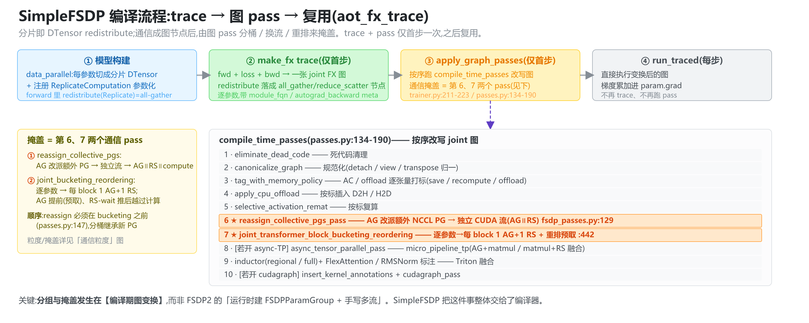
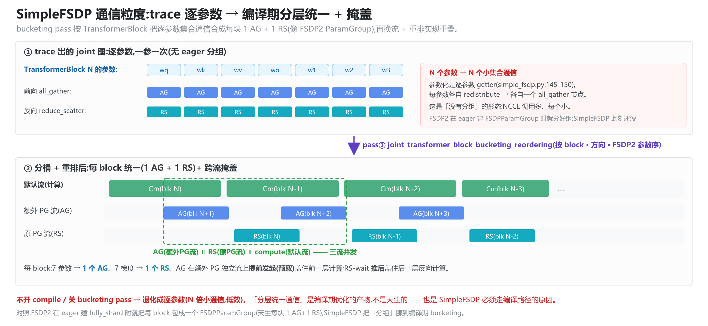

# SimpleFSDP —— 编译器友好的 FSDP:分片即可追踪的 DTensor 集合通信(源码级)

> **代码基准**:torchtitan `main` @ `61c010fcb`(`experiments/graph_trainer/`)· PyTorch nightly(实验件)
> **最后更新**:2026-06-17(§5 扩写为编译流程 + 两个通信 pass + 掩盖机制源码级深挖,新增 §5.5 通信粒度 + 2 张 SVG→PNG 机制图)· **系列**:torchtitan 多维并行源码级分析(见 [[torchtitan/index]])
>
> 对象是 torchtitan `experiments/graph_trainer/` 的 SimpleFSDP(论文 arXiv:2411.00284),FSDP2 的编译器友好替代:把 all-gather/reduce-scatter 表达成 DTensor `redistribute` 进图,交编译器分桶重叠。对照 [[11_torchtitan_fsdp_analysis]] / [[21_torchtitan_hsdp_backward_overlap_analysis]]。
>
> **四页分工**(2026-07-31 补):本页是唯一走**编译器路径**的一支——FSDP2 原生 eager 机制(手写 hook+event 编排)的标杆篇是 [[11_torchtitan_fsdp_analysis]],其预取/掩盖/显存源码级深挖是 [[20_torchtitan_fsdp_prefetch_overlap_memory_analysis]],HSDP 双流展开是 [[21_torchtitan_hsdp_backward_overlap_analysis]];本页讲的是把这套手写编排换成**声明式 DTensor collective + 编译器 pass**的实验分支,与前三页的 eager 机制互补而非替代。
> 行号约定:实验代码以 `graph_trainer/`(= `torchtitan/torchtitan/experiments/graph_trainer/`)为根;PyTorch 以 `[pt]` 前缀。

---

## 0. 一句话定位

```
FSDP2(02/07):  eager + FSDPParamGroup + 5 条 CUDA stream + 预取钩子 + event 手写编排
                通信藏在 module hook 里,编译器看不见

SimpleFSDP:     把"分片参数 -> 完整参数"表达成一个 DTensor.redistribute(Replicate)
                = 前向 all-gather;其反向的 Partial(sum) -> Shard = reduce-scatter
                通信变成图里的 collective 节点 -> 编译器 pass 做分桶/重排/重叠
                "Sharding as parameterized collectives within the computation graph"(README:9)
```

核心权衡:**把通信编排从"运行时手写多流"挪到"编译期图变换"**。代价是必须走编译路径(`aot_fx_trace`,nightly);收益是通信节点对编译器可见,可与 AC/CUDAGraph/CPU-offload/Async-TP **作为同质的图 pass 自由组合**(MANIFESTO:42-46),并号称比 eager FSDP2 有显存与吞吐改进(README:9)。

---

## 1. 核心思想:参数化(parametrization)+ 可追踪集合通信

SimpleFSDP 用 PyTorch 的 **parametrization** 机制:注册到模块上的参数是**分片 DTensor**,但每次 `forward` 通过一个参数化模块 `ReplicateComputation` 把它"动态还原"成完整参数。这个还原就是一次 `redistribute`,在 traced 图里就是一个 all-gather collective。

- MANIFESTO:48-51:"expresses all-gather and reduce-scatter as **traceable DTensor operations**. The collectives show up as **nodes in the graph**, so they can be reordered, fused, and overlapped by passes — not hidden behind opaque module hooks."

于是"参数怎么取回来 / 梯度怎么规约"不再是 FSDP2 那套 `unshard()/wait_for_unshard()/post_backward` 钩子链,而是**纯 DTensor 语义 + 编译器 pass**。

---

## 2. 参数切分:`data_parallel` + `distribute_tensor`

入口 `data_parallel(model, device_mesh, mode, mp_policy, shard_dim, full_dtensor)`(`simple_fsdp.py:261`)。对每个 module 的直接参数:

1. **切成分片 DTensor**:`distribute_tensor(p, device_mesh, param_sharding)`(`:294-302`)。若参数已是 DTensor(被 TP/EP 先切过),改用 `_distribute_dtensor` 组合(§4)。
2. **注册参数化** `ReplicateComputation`(`:318-328`)。
3. 已经是 SimpleFSDP 包过的模块跳过(`if "SimpleFSDP" in mod.__class__.__name__: continue`,`:289-290`),避免重复套。

三种模式 → 三种 placement(`:270-281`):

| mode | param_sharding | 等价 |
|---|---|---|
| `replicate` | `(Replicate(),)` | DDP(参数全复制) |
| `fully_shard` | `(Shard(shard_dim),)` | FSDP / ZeRO-3(默认 dim 0) |
| `hybrid_shard` | `(Replicate(), Shard(shard_dim))` | HSDP(需 2D mesh,`:277-279`) |

> 与 FSDP2 一样,分片参数注册在模块上 → **优化器状态天然 1/N**;混合精度由 §3 的 redistribute dtype 控制。

---

## 3. 运行时:`ReplicateComputation` 的 redistribute

参数化模块 `ReplicateComputation`(`simple_fsdp.py:167`)的 `forward(x)` 调 `replicate_compute(x)`(`:189`)。核心(无 TP/EP 的 `non_dp_mesh_dims==0` 分支,`:231-239`):

```python
output = x.redistribute(
    placements=self.compute_placements,    # [Replicate()] * ndim  -> 前向 all-gather
    forward_dtype=self.param_dtype,        # bf16:all-gather 前转 dtype
    backward_dtype=self.reduce_dtype,      # fp32:反向规约 dtype
)
if not self.full_dtensor:
    output = output.to_local(grad_placements=self.grad_placements)  # [Partial(sum)] * ndim
```

- `compute_placements = [Replicate()] * mesh.ndim`(`:180`):**前向把分片参数 redistribute 成 Replicate = all-gather**,得到完整参数做本地计算。
- `grad_placements = [Partial(reduce_op="sum")] * mesh.ndim`(`:181-183`):告诉 DTensor"本地张量的梯度是 Partial(sum)"。**反向时 DTensor 自动把 Partial(sum) 规约回原 placement**:
  - `fully_shard`:Partial(sum) → Shard = **reduce-scatter**;
  - `replicate`(DDP):Partial(sum) → Replicate = **all-reduce**;
  - `hybrid_shard`(HSDP):两者混合(组内 RS + 组间 AR)。
  - 代码注释明示(`:190-193`):"gradients are partial tensors that need reduction (DDP: allreduce, FSDP: reduce_scatter, HSDP: mix of both)"。

> 对照 [[21_torchtitan_hsdp_backward_overlap_analysis]]:FSDP2 用 `foreach_reduce` 在 RS/AR 两条流上手写 HSDP 反向;**SimpleFSDP 只声明 `grad_placements=Partial(sum)`,RS/AR 由 DTensor 反向 + 编译器 pass 生成**。语义等价,实现路径完全不同。

- `forward_dtype/backward_dtype`(`:212-213`):把混合精度(`param=bf16 / reduce=fp32`)**编进 redistribute**,无需 FSDP2 的 `MixedPrecisionPolicy` 钩子。
- `full_dtensor=True` 时输出保持 DTensor(不 `to_local`,`:238-239`),用于整网 DTensor/autoparallel 路径;nD 并行下未实现(`:197-200`)。

### 3.1 动态子类 + 缓存(为 compile 复用)

`_register_parametrization`(`:135`)不是用 `nn.utils.parametrize`,而是**动态造一个子类** `SimpleFSDP{ClassName}`,把参数名变成 `property` getter,getter 调 `parametrization(self._parameters[pn])`(`:145-164`)。

- **按 `(原类, 参数名集合)` 缓存**(`_wrap_class_cache`,`:130-132/151-163`):同类型模块共享同一个 SimpleFSDP 子类 → `torch.compile` 只需编译一次、复用到每层(与 [[23_torchtitan_compute_memory_optimizations_analysis]] §4 逐 block compile 复用同理)。
- 子类注入 `sys.modules` 让 pickle/GraphPickler 能解析(为 precompile 序列化,`:160-162`)。
- 为何不用官方 `parametrize`:为兼容 DCP(分布式 checkpoint),`state_dict` 直接从 `self._parameters` 取分片参数、不触发 getter(`:138-143`)。

### 3.2 `disable_active_parametrization`:初始化/调试旁路

全局开关 `_active_parametrization`(`:29`)+ 上下文管理器(`:32-39`)。`forward` 里若关闭则**直接返回 x**(`:254-255`),不做 all-gather。用于模型初始化/状态检查:`with disable_active_parametrization(): model.init_states()`(`:251-253`)。各模型 `model.py` import 它(如 `llama3/model.py:13`)。

---

## 4. 与 TP/EP 组合:`_distribute_dtensor`

当参数已被 TP/EP 切成 DTensor,DP 不能再 `distribute_tensor` 重切,而是组合 **outer=DP mesh / inner=TP/EP mesh**(`_distribute_dtensor`,`simple_fsdp.py:48`):

- 用 `DeviceMesh._concatenate([outer, inner])` 拼出跨 mesh(`:61`),placement = `(DP_placement,) + inner_spec.placements`。
- DP 分片维与 inner 分片有嵌套时用 `_StridedShard(shard_dim, split_factor=inner.num_shards_map[shard_dim])` 表达"先 TP 切、再 FSDP 切"的顺序(`:70-94`)——与 FSDP2 在 [[11_torchtitan_fsdp_analysis]] §2.3 用 `_StridedShard` 叠 TP 是同一思想。
- 支持 FSDP/DDP/HSDP × EP/TP/EP+TP(`:54-94`)。

运行时若有 TP/EP 轴(`non_dp_mesh_dims>0`,`:194-230`):先把 2D DTensor **重包成 dp_mesh 上的 1D DTensor** 做高效 all-gather,redistribute 后再重包回 non_dp_mesh(注释 TODO:DTensor 应原生支持这种 mesh 折叠,`:216-217`)。

---

## 5. 编译流程与计算-通信掩盖(核心)

SimpleFSDP 把分片表达成图节点后,**通信的掩盖完全交给 graph_trainer 的 `aot_fx_trace` 编译流水线**——分桶、改流、重排都是图 pass。本节回答四件事:编译流程、通信 pass 是什么、在哪个阶段加、怎么掩盖。

### 5.1 编译流程:train step → joint FX 图 → pass 流水线 → 复用

默认 `--compile.mode aot_fx_trace`(`compile.py:99`、`configs.py:20`)。此模式下 `apply_compile` **不包模型**,trace 发生在训练步内(`compile.py:99-113`)。`GraphTrainer._make_fx_forward_backward_step`(`trainer.py:188`)的逻辑:

```
首个 train step(self._traced_step is None):
  1) make_fwd_bwd_step(model, loss_fn)                         trainer.py:202
       └ 组一个函数:前向 + loss + 反向(.backward)
  2) minimal_fx_tracer(fwd_bwd_fn, module=model)(...)          trainer.py:204
       └ make_fx 非严格追踪 fwd+loss+bwd 成【一张 joint FX 图】(无 AOTAutograd 切分,README:8)
       └ SimpleFSDP 的 redistribute 在此落成显式节点:
           _c10d_functional.all_gather_into_tensor / reduce_scatter_tensor + wait_tensor
       └ 节点带 meta:module_fqn(哪个 block)、autograd_backward(是否反向,common_utils.py:70)
       └ 返回 TracedResult(gm, example_inputs, state_fqns, num_static_inputs, ...)  make_fx_tracer.py:281
  3) passes = construct_default_graph_passes(traced, config)   trainer.py:211-216
  4) gm = apply_graph_passes(gm, example_inputs, passes)       trainer.py:218
       └ 按序跑下面 §5.2/§5.3 的 pass,改写这张图(只跑一次)

之后每个 step:run_traced(self._traced_step)(...)               trainer.py:225
  └ 直接执行已变换的图,梯度累加进 param.grad(trainer.py:234-238);不再 trace、不再跑 pass
```

要点:**"首步 trace+变换一次、之后复用"**。SimpleFSDP 的集合通信此刻已是图里的 `all_gather_into_tensor`/`reduce_scatter_tensor` 节点,对所有 pass 可见、可改派 PG、可分桶、可重排。

pass 流水线(`compile_time_passes`,`passes.py:134-190`,按序):

```
1  eliminate_dead_code            清理
2  canonicalize_graph             规范化(detach/view/transpose 归一)
3  tag_with_memory_policy         AC/offload 逐张量打标(save/recompute/offload)
4  apply_cpu_offload              按标插入 D2H/H2D
5  selective_activation_remat     按标复算
6  reassign_collective_pgs_pass   ★通信 pass ①:AG 改派独立 PG/流              ← §5.2
7  joint_transformer_block_bucketing_reordering_pass  ★通信 pass ②:分桶 + 重排/预取  ← §5.3
8  [若开 async-TP] async_tensor_parallel_pass   micro_pipeline_tp(见 [[24_torchtitan_comm_optimizations_overlap_analysis]] §2)
9  inductor(regional/full)+ FlexAttention/RMSNorm 标注  → Triton 融合
10 [若开 cudagraph] insert_kernel_annotations + cudagraph_pass
```

**两个通信 pass 在第 6、7 位**——在显存策略(AC/offload)之后、inductor 编译之前。顺序有讲究(`passes.py:147`):`reassign_collective_pgs_pass` **必须在 bucketing 之前**,这样被分桶的集合通信能继承新 PG。



### 5.2 通信 pass ①:`reassign_collective_pgs_pass` —— 额外 PG = 独立流(AG∥RS)

`fsdp_passes.py:129`。只做一件事:**把 all-gather 改派到一个新建的、同 ranks 的额外 NCCL 进程组**。

- **找目标**:`is_wait_tensor_from_fsdp`(`:52-64`)识别"输入可一路回溯到 graph input(单输入算子链)"的 all-gather——即 FSDP 参数 all-gather,可被任意预取。
- **建额外 PG**:`_get_or_create_extra_fsdp_pg`(`:120`)→ `new_group(ranks=同源, use_local_synchronization=True)`(`:105-111`),按源 PG 缓存(`_EXTRA_FSDP_PG_REGISTRY`,`:67-70`)。
- **改派**:把这些 all-gather 节点的 group 参数改成额外 PG(`:154-159`)。

**为什么这就能掩盖**(注释 `:133-140`):

> "Each PG runs on its own CUDA stream, so moving a collective to an extra PG (same ranks) lets it overlap with the collectives left on the original PG — e.g. all-gathers overlapping reduce-scatters in backward."

每个 NCCL PG 在 GPU 上对应一条独立 stream。把 AG 挪到额外 PG → AG 在一条流、RS 留在原流 → **AG∥RS 并发**。这正是 FSDP2 反向用"独立 all_gather 流 / reduce_scatter 流"换来的 AG∥RS([[21_torchtitan_hsdp_backward_overlap_analysis]] §2),SimpleFSDP 改由"图里换 PG"实现——**编译期决定,而非运行时建流**。

### 5.3 通信 pass ②:`joint_transformer_block_bucketing_reordering_pass` —— 分桶 + 重排/预取

`fsdp_passes.py:442`,核心类 `JointManualOverlapScheduler`(`:231`,继承 PyTorch inductor 的 `ManualOverlapScheduler`),在 joint(fwd+bwd 同图)上一次完成分桶 + 重排。两步:

**(a) 分桶**(`_manual_bucket_collectives`,`:285`):按 TransformerBlock、**按方向**合并集合通信——{前向 AG}、{反向 AG}、{反向 RS} 各合成一个大桶(`module_bucket_plans` = `get_default_transformer_block_buckets(n_layers)`)。`FSDPParamOrderBucketer`(`:208`)按 **Eager FSDP2 的 managed-parameter 顺序**打包(`fsdp_param_module_order` 取自 traced state FQN 序,`passes.py:152-156`)。
- 效果 = FSDP2 的 `FSDPParamGroup`:一个 block 的逐参数 all-gather 合成**一次**大 AG、逐参数梯度合成**一次** RS,减少 NCCL 调用、提升带宽利用。fwd/bwd 桶刻意分开,保证 AG 配对不跨前/反向边界。

**(b) 重排/预取**(`_manual_reorder_graph`,`:303`):构造 `overlap_deps`(控制依赖)再让调度器移动节点。
- **AG 预取**(`_schedule_ag_prefetch`,`:365`):**逆序游走**图,把每个 all-gather-**wait** 与它前面的 all-gather-**start** 配对,并令该 wait 依赖后面某个 compute——等价于**把 AG 发起提前、把 wait 推后越过计算**,于是 block N+1 的参数 AG 盖在 block N 的计算上(前向预取)。fwd/bwd 各用独立缓冲,配对不跨边界;孤儿 AG(wait 未配上)挂到本方向最后一个 compute(`_apply_trailing_block`,`:422`)。
- **RS 重叠**(`_schedule_rs_prefetch`,`:325`):**自顶向下**,让延后的 RS-wait 节点依赖 RS-start 节点,**把 reduce-scatter 的 wait 推后越过后续反向计算**,于是本层梯度 RS 盖在下一层反向计算上。RS 只在反向,无需方向跟踪。
- **落地**:`_reorder_overlap_nodes`(`:73`)= inductor 的 `_move_overlap_nodes`(无则 `_stable_topological_sort` 兜底),按 `overlap_deps` 物理重排图。

### 5.4 掩盖怎么发生:一图收束

```
分片参数(DTensor)
  └ redistribute  ──trace──►  图里 all_gather_into_tensor / reduce_scatter_tensor + wait
       ├ pass① reassign_collective_pgs:AG 换额外 PG → 独立 CUDA 流 → AG ∥ RS ∥ compute
       └ pass② 分桶:每 block 合成 1 AG + 1 RS(像 FSDP2 ParamGroup,按参数序)
                重排:overlap_deps 把 AG-start 提前、collective-wait 推后越过 compute
                      → AG 盖在前一层计算上(预取)、RS 盖在后一层反向计算上
  = FSDP2 的"多流 + 预取 + 逐层分组",只是改在【编译期图变换】上做,而非运行时 stream/event
```

> 这些 pass 对无 FSDP collective 的图是 no-op(`fsdp_passes.py:10-12`),并可与 async-TP、CUDAGraph、CPU-offload、AC **作为同一张图上的 pass 自由组合**(README:11)。(注:`autobucketing_reordering_pass`/`transformer_block_bucketing_reordering_pass`,`fsdp_passes.py:167/181`,是已废弃 JIT 后端 `jit_backend.py` 走的非 joint 版;默认 `aot_fx_trace` 走上面的 joint 版。)

### 5.5 通信粒度:trace 逐参数 → 编译期分层统一(重要)

一个常见疑问:**SimpleFSDP 是每个参数做一次通信,还是分层统一通信?** 答案是**两段式**:



1. **参数化层(trace 时)= 逐参数,一参一次**。`_register_parametrization` 给每个参数名各装一个 getter(`simple_fsdp.py:145-150`),`replicate_compute(x)` 接收的是**单个参数**做 `x.redistribute`(`:189/232`)。所以 trace 出的图里,一个 block 的 `wq/wk/wv/wo/w1/w2/w3/norm…` 是 **N 个独立的 `all_gather_into_tensor` 节点**——**没有 eager 分组**。
2. **编译期 bucketing pass = 按 block 分层统一**。`joint_transformer_block_bucketing_reordering_pass`(§5.3)把这些逐参数 collective 按 TransformerBlock 合成**每 block 1 个 AG + 1 个 RS**(按 FSDP2 参数序),= FSDP2 的 `FSDPParamGroup`。

**关键含义**:对 SimpleFSDP 来说,「分层统一通信」是**编译期优化的产物,不是天生的**。

| | 何时分组 | 不分组会怎样 |
|---|---|---|
| **FSDP2** | eager 建 `fully_shard` 时就把每 block 包成 `FSDPParamGroup` → 天生每块 1 AG+1 RS | — |
| **SimpleFSDP** | **编译期 bucketing pass** 才合并;trace 时逐参数 | 不开 compile / 关 bucketing → 退化成逐参数(N 倍小通信,低效) |

这也是 SimpleFSDP 必须走编译路径(`aot_fx_trace`)的原因之一:把"分组"从 FSDP2 的"运行时建 ParamGroup"挪到了"编译期 bucketing 图变换"。(默认 bucket plan 是 per-TransformerBlock,`get_default_transformer_block_buckets`;embedding / 最后的 norm+lm_head 等 block 外参数不在默认 plan 内,可能保持逐参数。)

---

## 6. 与 FSDP2 的对比

| 维度 | FSDP2(`fully_shard`,[[11_torchtitan_fsdp_analysis]]/[[21_torchtitan_hsdp_backward_overlap_analysis]]) | SimpleFSDP(本篇) |
|---|---|---|
| 通信单位 | `FSDPParamGroup`(eager 建组,天生每块 1 AG+1 RS) | **trace 逐参数 → 编译期 bucketing 合成每块 1 AG+1 RS**(见 §5.5) |
| 取回参数 | `unshard()` 钩子发 all-gather | 前向 `redistribute(Replicate)` 进图 |
| 梯度规约 | `post_backward` → `foreach_reduce`(RS/AR) | 声明 `grad_placements=Partial(sum)`,DTensor 反向自动 RS/AR |
| 掩盖编排 | 5 条 CUDA stream + 预取钩子 + event(运行时) | 编译器图 pass:额外 PG + 分桶 + 重排(编译期) |
| 混合精度 | `MixedPrecisionPolicy` | redistribute 的 `forward_dtype/backward_dtype` |
| 对编译器 | 通信藏在 module hook,tracer 看不见 | 通信是显式图节点,可重排/融合/重叠 |
| 运行环境 | eager(主路径) | `torch.compile aot_fx_trace`,需 nightly(实验) |
| HSDP | 第 5 条 all_reduce 流手写 | `(Replicate, Shard)` placement,反向自动出 RS+AR |

**本质差异**:FSDP2 把"何时通信、藏在哪"写死在运行时;SimpleFSDP 把它**留给编译器在图上决定**——这也是 graph_trainer 整体哲学(MANIFESTO:42-46 "Every optimization is a graph pass")。

---

## 7. 接入、组合与约束

- **接入**:`apply_simple_fsdp(model, parallel_dims, training)`(`common_utils.py:217`)按 `parallel_dims` 选 mesh 与 mode(`dp_replicate+dp_shard/cp` → `hybrid_shard`;仅 `dp_replicate` → `replicate`;否则 `fully_shard`,`:228-237`),对模型整体 `data_parallel`(`:273`);MoE 的 `moe.experts` 在 EP 开启时单独用 `edp_mesh` 包(`:265-271`)——与 FSDP2 的 `edp_mesh` 思想一致([[15_torchtitan_ep_analysis]] §7)。
- **组合现状**(README:200-218 composability 表,`aot_fx_trace`):Meta init / AC / 混合精度 / TP / CP / EP / DCP / CUDAGraph 已 ✅;Float8/MXFP8、EP+AC、EP+PP、图级 PP、microbatch overlap、precompile 仍 🚧。
- **AutoParallel**:可用 `--compile.enable_autoparallel` 让 AutoParallel 解 SPMD placement,再走同一 `aot_fx_trace` 流水(README:87-126);numerics 与 eager 紧密一致但不要求逐位相同。
- **约束**:需 PyTorch nightly(README:26);走编译路径;`full_dtensor` 的 nD 并行未实现(`simple_fsdp.py:197-200`)。

---

## 8. 源码复核小结

| 断言 | 位置 | 结果 |
|---|---|---|
| 分片表达成图内可追踪集合通信 | `MANIFESTO.md:48-51`、`README.md:9` | OK |
| `data_parallel` 逐 module distribute_tensor + 注册参数化 | `simple_fsdp.py:261-329` | OK |
| 三模式 placement(replicate/fully_shard/hybrid_shard) | `simple_fsdp.py:270-281` | OK |
| 前向 redistribute→Replicate = all-gather | `simple_fsdp.py:232-236` | OK |
| 反向 grad_placements=Partial(sum) 触发 RS/AR | `simple_fsdp.py:181-183/190-193` | OK |
| 混合精度 = redistribute forward/backward_dtype | `simple_fsdp.py:212-213` | OK |
| 动态子类 + 按 (类,参数名) 缓存供 compile 复用 | `simple_fsdp.py:130-164` | OK |
| `disable_active_parametrization` 旁路(init/调试) | `simple_fsdp.py:32-39/254-255` | OK |
| TP/EP 组合用 `_distribute_dtensor` + `_StridedShard` | `simple_fsdp.py:48-127` | OK |
| aot_fx_trace 默认;trace 在训练步内,首步一次、之后 run_traced 复用 | `compile.py:99-113`、`trainer.py:188-230` | OK |
| make_fx 把 fwd+loss+bwd 追成一张 joint 图 | `trainer.py:202-209`、`README.md:8` | OK |
| pass 流水线:两个通信 pass 在第 6/7 位 | `passes.py:134-158` | OK |
| pass① reassign_collective_pgs:AG 换额外 PG=独立流(AG∥RS) | `fsdp_passes.py:129-164/133-140` | OK |
| 额外 PG 同 ranks + use_local_synchronization | `fsdp_passes.py:105-111` | OK |
| 可任意前移的 all-gather 识别(预取目标) | `fsdp_passes.py:52-64` | OK |
| pass② 分桶:按 block/方向/FSDP2 参数序合成 1 AG+1 RS | `fsdp_passes.py:208-294` | OK |
| pass② 重排:AG 逆序预取 + RS 延后 wait(overlap_deps) | `fsdp_passes.py:303-439` | OK |
| 参数化逐参数 getter → trace 出逐参数 collective(无 eager 分组) | `simple_fsdp.py:145-150/189` | OK |
| 接入 `apply_simple_fsdp`,MoE 专家走 edp_mesh | `common_utils.py:217-282` | OK |
| 实验件,需 nightly,Float8/PP/microbatch overlap 仍 🚧 | `README.md:24-29/200-218` | OK |

---

## 9. 小结

- **是什么**:SimpleFSDP = 把 DDP/FSDP/HSDP 表达成"分片 DTensor + 参数化的 `redistribute`",前向 redistribute→Replicate 即 all-gather,反向 Partial(sum)→Shard/Replicate 即 reduce-scatter/all-reduce。通信成为**图里的显式节点**。
- **编译流程**:`aot_fx_trace` 首步用 `minimal_fx_tracer`(make_fx)把 fwd+loss+bwd 追成**一张 joint 图**(redistribute 落成 `all_gather_into_tensor`/`reduce_scatter_tensor` 节点),`apply_graph_passes` 跑一遍 pass 流水线改写图,之后每步 `run_traced` 复用。
- **怎么掩盖**(两个通信 pass,流水线第 6/7 位):① `reassign_collective_pgs_pass` 把 AG 改派额外 NCCL PG → 独立 CUDA 流 → AG∥RS∥compute(等价 FSDP2 多流);② `joint_transformer_block_bucketing_reordering_pass` 按 block 分桶(每 block 合 1 AG+1 RS,像 FSDP2 ParamGroup)+ 用 `overlap_deps` 把 AG-start 提前、collective-wait 推后越过计算(等价 FSDP2 预取)。全在**编译期图变换**上完成。
- **怎么组合**:与 TP/EP 用 `_distribute_dtensor`+`_StridedShard` 嵌套;混合精度编进 redistribute dtype;AC/CUDAGraph/CPU-offload/Async-TP 都是同一张图上的 pass。
- **与 FSDP2 的关系**:**语义等价、实现哲学相反**——FSDP2 运行时手写编排(主路径、eager),SimpleFSDP 编译期图变换(实验、需 nightly)。它是 graph_trainer "Every optimization is a graph pass" 哲学在数据并行上的落地,也是 [[24_torchtitan_comm_optimizations_overlap_analysis]] §5 `full_dtensor`/autoparallel 方向的近亲。

> 图源:`assets/simple-fsdp-compile-flow.svg`、`assets/simple-fsdp-bucketing-overlap.svg`(可用 `@resvg/resvg-js` 以 zoom=2 导出 PNG)。

---

## Related Pages

- [[11_torchtitan_fsdp_analysis]] —— FSDP2 eager 实现(SimpleFSDP 的对照对象)
- [[21_torchtitan_hsdp_backward_overlap_analysis]] —— HSDP 反向多流(SimpleFSDP 用 placement 表达)
- [[24_torchtitan_comm_optimizations_overlap_analysis]] —— 编译器通信优化 / full_dtensor 近亲
- [[torchtitan/index]] —— torchtitan 多维并行知识地图
