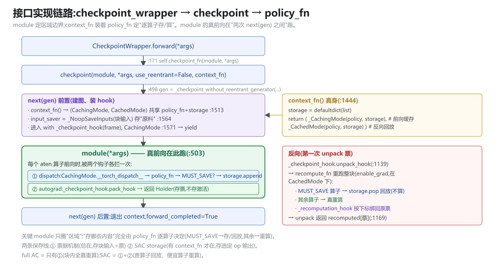
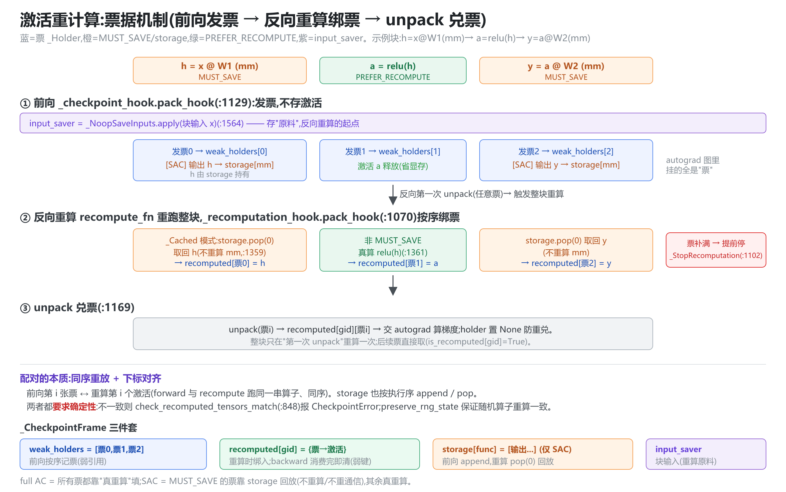
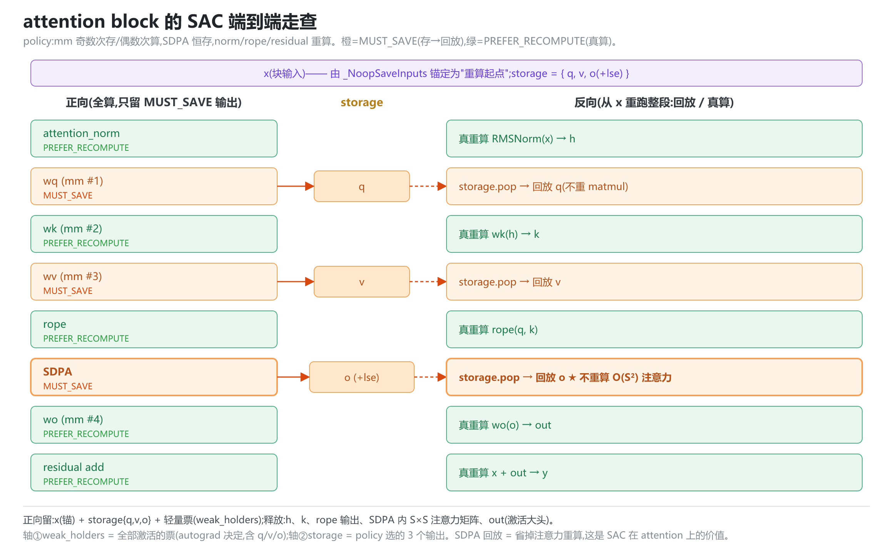
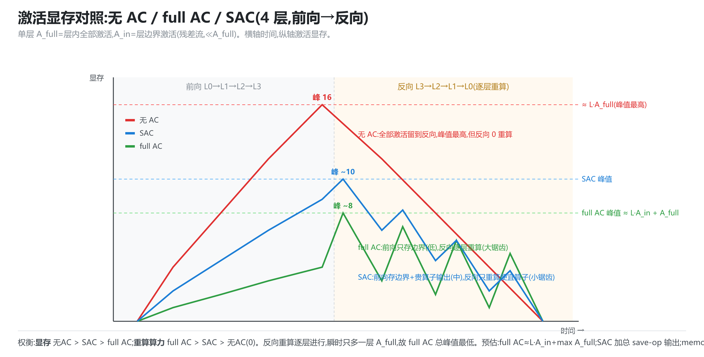
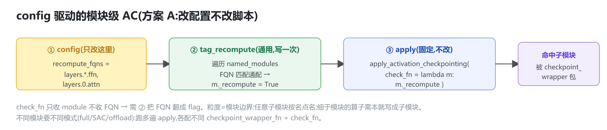
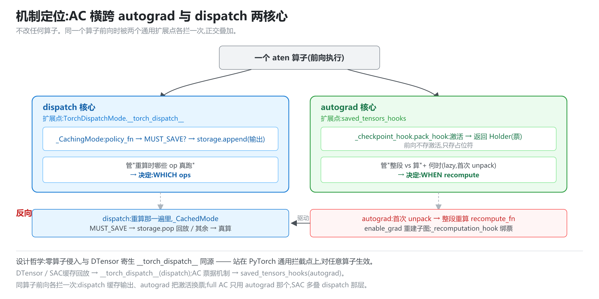

# 激活重计算 AC —— 原理分析与代码解读

> **代码基准**:torchtitan `main` @ `cf3c4312` · PyTorch `2.9.1`(`torch/utils/checkpoint.py`、`torch/distributed/algorithms/_checkpoint/checkpoint_wrapper.py`)
> **最后更新**:2026-06-11 · **系列**:torchtitan 多维并行源码级分析(见 [[torchtitan/index]])
>
> 把 `checkpoint_wrapper` / `torch.utils.checkpoint` / SAC 啃透:**接口能力、实现链路、嵌套、重算重放、显存管理与预估、粒度控制、以及与 autograd/dispatch 两核心的关系**。所有结论基于 PyTorch 2.9.1 源码逐条复核。
> 行号:torchtitan 以 `torchtitan/` 为根;PyTorch 以 `[pt]` 前缀。全部插图为 SVG→PNG(源文件在 `assets/`)。

---

## 0. 先分清两个 "checkpoint"(完全不同的机制)

只是英文撞名。本文只讲**激活 checkpoint**。

| | 激活 checkpoint(本文) | 权重/模型 checkpoint(DCP) |
|---|---|---|
| 目的 | 训练时**省显存**:不存中间激活,反向重算 | **容错/续训**:把权重+优化器+step 存盘 |
| 代码 | `torch.utils.checkpoint`、`checkpoint_wrapper` | `torch.distributed.checkpoint`(DCP) |
| torchtitan | `distributed/activation_checkpoint.py`(`apply_ac`) | `components/checkpoint.py`(`CheckpointManager`,`dcp.save/load`) |
| 作用对象 | autograd 图里的激活(内存) | 磁盘上的 state_dict |

二者正交,可同时开。

---

## 1. 全景:三层结构 + torchtitan 三模式

```
torchtitan apply_ac (activation_checkpoint.py:204)  对每个 TransformerBlock 包一次(:246-253)
  ├─ mode="full"          → _apply_full_ac  → ptd_checkpoint_wrapper(整块)
  ├─ mode="selective"     → _apply_op_sac   → ptd_checkpoint_wrapper(context_fn=SAC policy)
  └─ mode="memory_budget" → torch._functorch.config.activation_memory_budget(需 torch.compile)
        ↓
checkpoint_wrapper (checkpoint_wrapper.py:198)  把 module 包成 CheckpointWrapper(:114)
        ↓ forward 委托
torch.utils.checkpoint.checkpoint
  ├─ use_reentrant=True  → CheckpointFunction(老,autograd.Function)
  └─ use_reentrant=False → _checkpoint_without_reentrant_generator(默认,saved_tensors_hooks)
        └─ SAC: _CachingTorchDispatchMode(前向缓存选定 op)+ _CachedTorchDispatchMode(重算回放)
```

---

## 2. `checkpoint_wrapper` 提供的能力

`checkpoint_wrapper(module, ...)`(`[pt]checkpoint_wrapper.py:198`):

| 能力 | 说明 | 源码 |
|---|---|---|
| **输入 nn.Module** | 签名即 `checkpoint_wrapper(module: nn.Module)`,返回 `CheckpointWrapper` 包装它 | `:114, 198` |
| `checkpoint_impl` | `NO_REENTRANT`(默认)/ `REENTRANT`(deprecated) | `:122-137` |
| `checkpoint_fn` | 自定义 checkpoint 函数,覆盖默认 | `:138-143` |
| `**checkpoint_fn_kwargs` | 透传 `context_fn`/`preserve_rng_state`/`determinism_check`/`early_stop`/`debug` | torchtitan `:177` |
| **state_dict 透明** | post/pre hook 剥/加 `_checkpoint_wrapped_module.` 前缀 | `:70-102` |
| **属性/索引转发** | `__getattr__`/`__getitem__` 透传被包模块 | `:46-55` |
| **批量按谓词应用** | `apply_activation_checkpointing(model, check_fn / auto_wrap_policy)` 按条件包**指定子模块** | `:250-324` |
| **兄弟:offload** | `offload_wrapper` 用 `save_on_cpu(pin_memory=True)` 搬激活到 CPU | `:105-111` |

---

## 3. 接口实现链路:从 `checkpoint_wrapper` 到 `policy_fn`

**一句话**:`module` 定 checkpoint 的**区域边界**;`context_fn`(里面装 `policy_fn`)定**这段里逐算子存还是算**。module 的真实 forward 在"两次 `next(gen)` 之间"跑,期间票据 hook + 前向 dispatch mode 都开着。



**逐跳代码**:

1. `CheckpointWrapper.__init__`:`self.checkpoint_fn = partial(torch.utils.checkpoint.checkpoint, use_reentrant=False, **{context_fn, ...})`(`:133`)——策略 baked 进 partial。
2. `CheckpointWrapper.forward`:`return self.checkpoint_fn(self._checkpoint_wrapped_module, *args)`(`:171`)——module 当 `function` 传入。
3. `checkpoint`(`[pt]:497-508`):`gen=_checkpoint_without_reentrant_generator(function,...)` → `next(gen)`(前置) → `function(*args)`(真前向) → `next(gen)`(后置)。
4. 生成器(`:1513/1564/1571`):`context_fn()` 产出两个 mode;`_NoopSaveInputs` 存输入;`with _checkpoint_hook(frame), forward_context: yield`。
5. `create_selective_checkpoint_contexts`(`:1444`):`storage=defaultdict(list); return (_CachingMode(policy,storage), _CachedMode(policy,storage))`——**两 mode 共享 `(policy_fn, storage)`**。

**接口里有"两条保存线",别混**:

| 保存线 | 存什么 | 由谁控 | 何时 | 源码 |
|---|---|---|---|---|
| **票据机制**(总在) | 块**输入** + 一串空票(Holder) | 非重入 checkpoint 本身 | 前向 | `_NoopSaveInputs:1564` / `_checkpoint_hook.pack_hook:1129` |
| **SAC storage**(有 context_fn 才在) | policy 判 `MUST_SAVE` 的**算子输出** | `policy_fn` | 前向缓存 / 反向回放 | `:1328 / :1359` |

- **full AC**(不传 context_fn):只有票据机制 → 块内激活全靠反向整块重算。
- **SAC**(传 context_fn):票据机制 + storage 叠加 → 重算时贵算子从 storage 回放、便宜算子真算。

---

## 4. 嵌套:支持

- `_NoopSaveInputs.get_args`(`[pt]checkpoint.py:801-805`)注释直说:嵌套时内层输入可能存在**父 checkpoint** 上,unpack 会**递归触发**父层重算。
- `unpack_hook` 用 `gid = _current_graph_task_id()`(`:1140`)隔离多次/嵌套 backward。
- `apply_activation_checkpointing` 的 `auto_wrap_policy` 走递归包装,天然支持嵌套。

---

## 5. 重算/重放机制:票据机制(非重入,默认)

核心:**前向不存激活、只发"票"(`_Holder`);反向第一次要激活时,照原料重跑整块 forward,按下标把激活绑回同一批票。**



三件套(`_CheckpointFrame`,`[pt]:822`):`weak_holders`(按序记票)、`recomputed[gid]`(票→激活)、`recomp_counter[gid]`(对齐计数)。

- **① 前向** `_checkpoint_hook.pack_hook`(`:1129`):待保存激活 → 造 `_Holder`、`weak_holders.append`、记元数据、**返回票(交 autograd 的是票不是激活)**;真实激活前向后释放。另:`_NoopSaveInputs.apply(块输入)`(`:1564`)存原料。
- **② 反向第一次 unpack**(`:1139`):取原料 → 在 `_recomputation_hook + enable_grad` 下跑 `recompute_fn` 重跑整块。重算时 `_recomputation_hook.pack_hook`(`:1070`)按 `recomp_idx` 取 `weak_holders[idx]`、`recomputed[票]=x`;`early_stop` 凑齐即 `_StopRecomputationError`(`:1102`)。
- **③ 兑票**(`:1169`):返回 `recomputed[gid][票]`,holder 置 None。整块只重算一次。

**配对本质**:前向与重算跑同序算子 → 第 i 张票 ↔ 第 i 个激活,**靠下标对齐**;故**要求确定性**(`check_recomputed_tensors_match:848`),`preserve_rng_state`(`:1524/1546`)保证随机算子一致。

**对比 REENTRANT**(`CheckpointFunction:223`,deprecated):autograd.Function 在 backward `detach` 输入重跑;缺点:输入不 require_grad 时梯度断、不支持 checkpoint 内再 backward、kwargs 要手动打包。

---

## 6. SAC:同一套流程 + "贵算子回放缓存"

SAC = 非重入票据机制 + 一对 TorchDispatchMode:

- **前向** `_CachingTorchDispatchMode`(`:1295`):每 op 调 `policy_fn`,若 `MUST_SAVE/PREFER_SAVE` 则**输出缓存进 `storage[func]`**(`:1328`);op 照常算。
- **重算** `_CachedTorchDispatchMode`(`:1331`):遇 `MUST_SAVE` 算子**`storage.pop(0)` 回放**(`:1359`)不重算;其余真重跑。
- `storage` 这对 mode 共享(`:1444`),按执行序 append/pop。

`CheckpointPolicy` 四档(`:1251`):`MUST_/PREFER_ × SAVE/RECOMPUTE`,`MUST_*` 不被 compile 覆盖。

### 6.1 torchtitan 的 policy(`_get_custom_policy:122`)

```python
def wrapped_policy(ctx, func, *args, **kwargs):
    if func == _to_copy and cuda→cpu:    return MUST_SAVE          # MoE D2H 元数据(:128)
    if func in (mm, linear):
        if weight_shape in 强制重算集:    return PREFER_RECOMPUTE   # 按 FQN 强制(:144)
        meta[mm_count] += 1
    if func in save_ops:                                            # SDPA/comm/linear/...
        if func in (mm,linear) and mm_count % 2 == 0:
                                          return PREFER_RECOMPUTE   # 每第 2 个 mm 重算(:150)
                                          return MUST_SAVE
    return PREFER_RECOMPUTE                                         # 便宜算子重算
```
`save_ops`(`_get_save_ops:81-87`)= compute-intensive ∪ {SDPA, linear, flex_attention, max} ∪ {reduce_scatter, all_to_all, DeepEP/HybridEP dispatch/combine}。

### 6.2 一个 TransformerBlock 前向的逐算子决策(示意)

按执行序对 mm 计数 → **奇数次 mm 存、偶数次 mm 重算**;SDPA、通信恒存;norm/RoPE/激活/加法重算:

| # | 算子 | 类别 | mm计数 | 决策 | 存 storage |
|---|---|---|---|---|---|
| 1 | attention_norm | reduction | — | RECOMPUTE | ✗ |
| 2 | `wq` | mm | 1 | **MUST_SAVE** | ✓ |
| 3 | `wk` | mm | 2 | RECOMPUTE | ✗ |
| 4 | `wv` | mm | 3 | **MUST_SAVE** | ✓ |
| 5 | RoPE | pointwise | — | RECOMPUTE | ✗ |
| 6 | **SDPA** | save_ops | — | **MUST_SAVE** | ✓ |
| 7 | `wo` | mm | 4 | RECOMPUTE | ✗ |
| 8 | residual add | pointwise | — | RECOMPUTE | ✗ |
| 9 | ffn_norm | reduction | — | RECOMPUTE | ✗ |
| 10 | `w1` | mm | 5 | **MUST_SAVE** | ✓ |
| 11 | `w3` | mm | 6 | RECOMPUTE | ✗ |
| 12 | silu(w1)*w3 | pointwise | — | RECOMPUTE | ✗ |
| 13 | `w2` | mm | 7 | **MUST_SAVE** | ✓ |
| (TP) | reduce_scatter / all_to_all | comm | — | **MUST_SAVE** | ✓ |

前向只把 ✓ 的输出留进 storage(wq/wv/w1/w2 + SDPA + 通信);反向重算时 ✓ 的回放、✗ 的(norm/RoPE/激活/加法 + wk/wo/w3)真重算。**动机**:SDPA 重算贵、通信重算会**重发集合通信**(更致命),故恒存;matmul 折中存一半。

### 6.3 attention 段端到端走查(正向存什么 / 反向怎么做)

以 attention 子段为例(`x → norm → wq/wk/wv → rope → SDPA → wo → +x`),mm 计数:wq#1存、wk#2算、wv#3存、wo#4算;SDPA 恒存。



**正向(全算一遍,只"留下"几样)**:所有算子照常执行,区别只在留不留输出。
- **storage(轴②)= { q(wq 出), v(wv 出), o(SDPA 出,含 lse) }** —— policy 判 MUST_SAVE 的 3 个输出。
- **x** 由 `_NoopSaveInputs` 锚为重算起点。
- **weak_holders(轴①)** = autograd 要保存的**全部**激活的票(含 q/v/o)。
- **被释放的大头**:`h`(norm 出)、`k`、rope 输出、**SDPA 内部 S×S 注意力矩阵**、`out`。

**反向(从 x 重跑整段,贵的回放、便宜的真算)**:第一次 unpack 触发整段重算:

| 算子 | 重算时 |
|---|---|
| attention_norm | **真重算** RMSNorm(x) → h |
| wq | `storage.pop` → **回放 q**(不重 matmul) |
| wk | **真重算** wk(h) → k |
| wv | `storage.pop` → **回放 v** |
| rope | **真重算** rope(q,k) |
| **SDPA** | `storage.pop` → **回放 o ★ 不重算 O(S²) 注意力** |
| wo | **真重算** wo(o) → out |
| residual | **真重算** x + out → y |

走的过程中 `_recomputation_hook` 把每个激活(真算或回放)按下标绑回正向那张票,凑齐即 `early_stop` 停,然后 autograd 用填好的票算梯度。**关键收益**:SDPA 回放省掉 O(S²) 注意力重算(SAC 在 attention 上的价值),wq/wv 回放省 2 次投影 matmul;只有 norm/rope/residual + wk/wo 这些便宜算子真重算。

> 对照 **full AC**:连 SDPA 一起重算(注意力重做一遍),更省显存但费算力。SAC 用"多存 q/v/o 那点显存"换"反向不重算注意力"。`weak_holders` 始终是全部激活的票,`storage` 才是 policy 选的 3 个——两者正交。

---

## 7. 显存管理与预估

### 7.1 存什么 / 不存什么

| | 前向存 | 不存(靠重算) | 释放 |
|---|---|---|---|
| full AC | 仅**块输入** + 空票 | 块内全部中间激活 | `recomputed` 是 WeakKeyDict(`:830`),backward 消费完即清 |
| SAC | 块输入 + **选定 op 输出**(storage) | 未选 op 激活 | storage 该块 backward 后 pop 干净;再 backward 报错(`:1354`) |
| offload | 激活搬 pinned CPU,反向 H2D 拉回 | — | `save_on_cpu` |

### 7.2 三策略显存对照



设 L 层,单层 `A_full`=层内全部激活,`A_in`=层边界激活(残差流,≪A_full)。

- **无 AC**:峰值 ≈ `L·A_full`,反向 0 重算。
- **full AC**:峰值 ≈ `L·A_in + max A_full`。前向只存边界,反向**逆序逐层**重算(同时刻只一层 materialize→用→释放,锯齿)。
- **SAC**:介于二者,峰值 ≈ `L·A_in + Σ save-op 输出`。比 full 省算力、多占显存。

**权衡**:显存 无AC > SAC > full AC;重算算力 full AC > SAC > 0。

### 7.3 怎么估

- **full AC**:可手算 `L·A_in + max A_full`(`A_in=B·S·D·dtype`)。
- **SAC**:加总 policy 判 `MUST_SAVE` 的 op 输出 shape(`debug=True` 的 op 列表辅助)。
- **memory_budget**(`apply_ac:234`,需 compile):设 `torch._functorch.config.activation_memory_budget`(0~1,`:243`),AOTAutograd partitioner 在联合图上对每个激活"存 vs 算"做 **min-cut/背包**自动最优;`visualize_memory_budget_pareto`(`:236`)输出 **(显存,运行时) Pareto 前沿**,直接看曲线选 budget。
- 注意:AC 只省**激活**,不省参数/梯度/优化器(那是 FSDP),二者正交叠加。

---

## 8. 粒度控制:如何标记"任意特定算子"重算

**现状粗粒度**:`policy_fn(ctx, func, *args)` 在 **aten dispatch** 层决策,只拿得到 **op 类型 + args(shape)+ 出现计数**,`SelectiveCheckpointContext` 只有 `is_recompute`(`:1247`)——**无 FQN/变量名**,点不到"某个特定实例"。

可选(推荐→hacky):
1. **嵌套 module/region checkpoint(最 idiomatic)**:把要控制的算子做成它自己的 checkpoint 区(内联 `checkpoint(lambda a: a@W, x)` 或抽成子模块包 `checkpoint_wrapper`)。
2. **按 FQN 给不同模块挂不同 policy**:每个 `checkpoint_wrapper` 各带 `context_fn`,可按位置定制。
3. **按出现序的有状态 policy**:扩展闭包记 count(如 `mm_count%2`)。能 work 但脆。
4. **按 shape 强制(现成)**:`per_op_sac_force_recompute_mm_shapes_by_fqns`,鲁棒但同形状无法区分。
5. **compile 模式 FX 节点级标记**:`_CachingMode` compile 时写 `fx_traceback.current_meta["recompute"]`(`:1313`),配 memory_budget partitioner 做节点级控制。

> **"占位符 + policy_fn 按名替换为 module"** 的思路:方向(把算子表达成模块边界)对,但杠杆错——`policy_fn` 是 dispatch 期逐 op 决策函数,此刻已拍平成 aten op,**不能改图、拿不到名字**。正解是直接对边界调 `checkpoint(...)`(方案 1)。

### 8.1 config 驱动的模块级 AC(方案 A,改配置不改脚本)

把"哪些子模块重算"从写死的逻辑变成**声明式 FQN 配置** + 一个通用 tag 预处理 + 固定的 apply:



```python
import fnmatch
def tag_recompute(model, fqn_globs):
    for fqn, m in model.named_modules():
        if any(fnmatch.fnmatch(fqn, g) for g in fqn_globs):
            m._recompute = True                 # 标记由 config 驱动

# 脚本固定这两步,永不改;只改 config 里的 fqn_globs
tag_recompute(model, ac_config.recompute_fqns)
apply_activation_checkpointing(
    model, checkpoint_wrapper_fn=checkpoint_wrapper,
    check_fn=lambda m: getattr(m, "_recompute", False),
)
```

- 注意 `check_fn` 只收 module 不收 FQN,故需上面的 tag 预处理把 FQN 翻译成 flag。
- 粒度落在**模块边界**:任意子模块按 FQN 点名;细于模块的算子需在模型里**本就写成子模块**。
- 不同模块要不同模式(full/SAC/offload):**跑多遍** `apply_activation_checkpointing`,各配不同 `checkpoint_wrapper_fn` + `check_fn`。

---

## 9. 机制定位:横跨 autograd 与 dispatch 两核心

AC **不改任何算子**,纯靠两个通用扩展点拼出来——一个在 autograd 核心、一个在 dispatch 核心。



**分工**:

| 扩展点 | 属哪个核心 | 管什么 | 决定 | 源码 |
|---|---|---|---|---|
| `saved_tensors_hooks` | **autograd** | "整段存 vs 算"的票据机制 | **何时重算**(lazy,首次 unpack) | `_checkpoint_hook:1127` / `_recomputation_hook:1068` |
| `TorchDispatchMode` | **dispatch** | "逐 op 缓存/回放" | **重算时哪些 op 真跑** | `_Caching/_Cached:1295/1331` |

同一个算子前向时**两个钩子各触发一次**(dispatch 缓存输出、autograd 把激活换票),正交叠加。full AC 只用 autograd 那个就成立;SAC 多叠 dispatch 那层。

**还借的 autograd 设施**:`_NoopSaveInputs`(`autograd.Function`,存输入,`:785`)、`enable_grad`(重建子图,`:1152`)、`graph_task_id`(隔离 backward,`:1140`)。

**设计哲学**:零算子侵入,与 **DTensor 寄生 `__torch_dispatch__`** 同源——

| 机制 | 寄生扩展点 | 拦的事件 |
|---|---|---|
| DTensor | `__torch_dispatch__` | 算子执行 → 传播 placement + 插通信 |
| SAC 缓存/回放 | `__torch_dispatch__` | 算子执行 → 缓存/回放选定输出 |
| AC 票据机制 | `saved_tensors_hooks` | 保存激活 → 换占位符 / 触发重算 |

---

## 10. 源码复核对照表

| 机制 | 位置 | ✓ |
|---|---|---|
| 非重入驱动 | `[pt]checkpoint.py:1453` | ✅ |
| checkpoint 驱动生成器(next/fn/next) | `:497-508` | ✅ |
| 前向只存票 | `:1129-1137` pack_hook | ✅ |
| 反向触发整块重算 | `:1139-1171` unpack_hook | ✅ |
| 重算按下标绑票 | `:1070-1107` | ✅ |
| 输入保存(autograd.Function) | `:785/1564` | ✅ |
| early_stop | `:1102-1105` | ✅ |
| 确定性校验 | `:848-916` | ✅ |
| 嵌套(递归 unpack + gid) | `:801-805 / :1140` | ✅ |
| SAC 前向缓存 / 重算回放 | `:1295-1329 / :1331-1362` | ✅ |
| 两 mode 共享 policy+storage | `:1444-1448` | ✅ |
| policy 无 FQN | `:1247` | ✅ |
| compile FX 标记 | `:1313-1315` | ✅ |
| checkpoint_wrapper 收 nn.Module | `[pt]checkpoint_wrapper.py:114/198` | ✅ |
| torchtitan 三模式 / policy | `activation_checkpoint.py:198/201/234 / 122` | ✅ |

---

## 11. 附录:`ActivationCheckpointConfig` 字段速查与场景

`torchtitan/config/configs.py:235`。按用途分四组:

### A. 总开关
- **`mode`**(默认 `selective`):选 AC 策略。`none`=不做(显存富裕/要速度);`full`=整块重算,显存最低算力最多(**OOM 时用**);`selective`=per-op SAC,均衡默认;`memory_budget`=编译器按预算自动选(**需 compile**)。

### B. `selective` 模式调参
- **`per_op_sac_force_recompute_mm_shapes_by_fqns`**(默认 `["moe.router.gate"]`):把这些 FQN 解析成 Linear 形状 → **凡该形状的 mm 一律强制重算**(无视"每隔一个 mm 才重算")。默认抠掉 MoE 路由门那种小而廉价的 mm 的显存。**坑**:policy_fn 拿不到 FQN,按**形状**匹配 → 同形状的别处 mm 会**误伤**。
- **`early_stop`**(默认 `False`):反向重算所需激活补齐就提前停(省算力)。torch 默认 `True`,torchtitan 改 `False` 更稳(SAC 的 storage 按序 pop 回放,跑完整块更安全)。full AC 可设 `True` 省算力。

### C. `memory_budget` 模式调参
- **`memory_budget`**(默认 `0.5`,0~1):partitioner 的显存/算力旋钮。`0.0`=整段 full AC 的显存(最省、最多重算),`1.0`=默认 runtime 最优显存(几乎不重算)。
- **`visualize_memory_budget_pareto`**(默认 `False`):导出 budget 0→1(步 0.05)的 **(运行时 vs 显存) Pareto 曲线 SVG** 到 `{dump_folder}/memory_budget_pareto`。**仅一次性调参跑开**(跑 21 遍,贵),看图选 budget 后关掉。

### D. 正确性/调试(全模式)
- **`preserve_rng_state`**(默认 `True`):保存/恢复 RNG,使重算的随机算子(dropout)与前向一致 → 逐位可复现。**区域内有随机算子时必开**;确定无随机才可设 `False` 省开销。
- **`determinism_check`**(默认 `"default"`):反向比对重算 vs 前向张量的 shape/dtype/device(`check_recomputed_tensors_match`),抓非确定性;`"none"` 关校验略快。
- **`debug`**(默认 `False`):重算不匹配时 dump 详细 op trace 帮排错,更慢。**限制**:与自定义 `context_fn` 不兼容(`:1496-1500`)→ **只能用于 full AC,不能用于 selective**。

| 字段 | 适用 mode | 典型设置 |
|---|---|---|
| `mode` | — | `selective`(默认);OOM→`full` |
| `per_op_sac_force_recompute_mm_shapes_by_fqns` | selective | 默认 `["moe.router.gate"]`,注意同形状误伤 |
| `early_stop` | full/selective | `False`(稳);full 可 `True` |
| `memory_budget` | memory_budget | 看 Pareto 曲线定 |
| `visualize_memory_budget_pareto` | memory_budget | 仅调参跑 `True` |
| `preserve_rng_state` | 全 | 有 dropout 必 `True` |
| `determinism_check` | 全 | `default`(留保险) |
| `debug` | **仅 full** | 仅排错 `True` |

---

**一句话总括**:`checkpoint_wrapper(module, context_fn)` 把 module 当区域、`forward` 交给 `checkpoint` 在"两次 next 之间"跑,期间票据 hook + 前向 dispatch mode 同开;`context_fn` 产出共享 `(policy_fn, storage)` 的一对 mode,前向缓存 MUST_SAVE 输出、反向回放。机制上 AC **横跨 autograd(`saved_tensors_hooks`,决定何时重算)与 dispatch(`TorchDispatchMode`,决定哪些 op 真跑)两核心**,零算子侵入,与 DTensor 寄生 `__torch_dispatch__` 同源;粒度上 SAC 是 dispatch 级(类型/形状/计数),要点名任意算子应把它做成自己的 checkpoint 区,而 config 驱动的模块级 AC(方案 A)能"改配置不改脚本"。

> 图源(SVG→PNG):`assets/ac-callchain`(§3)、`ac-ticket`(§5)、`ac-attn-sac`(§6.3)、`ac-memory`(§7)、`ac-config-flow`(§8)、`ac-cores`(§9)。SVG 源与 PNG 同目录,改后用 `@resvg/resvg-js` 重渲。

## Related Pages

- [[activation_checkpointing_analysis]] —— 理论侧/Megatron 视角:`CheckpointFunction`(重入路径)、view/cast ctx 特性、理论显存评估;与本文(torch 非重入 + SAC 工程实现)互补
- [[torchtitan/index]] —— torchtitan 多维并行知识地图(`apply_ac` 在并行施加管线第 4 步)
- [[torchtitan_fsdp_analysis]] / [[torchtitan_fsdp_prefetch_overlap_memory_analysis]] —— FSDP 与 AC 正交叠加:AC 省激活,FSDP 省参数/梯度/优化器
- [[torchtitan_tp_analysis]] —— DTensor 同样寄生 `__torch_dispatch__`,与 SAC 的 dispatch mode 是同一设计哲学
- [[torchtitan_ep_analysis]] —— MoE 的 D2H 元数据正是 policy 里 `_to_copy(cuda→cpu)` MUST_SAVE 的来源
- [[12_saved_tensors_recompute_and_runtime_abi_analysis]] —— `memory_budget` 模式背后的 AOTAutograd min-cut partitioner 与 saved/recompute 选择
