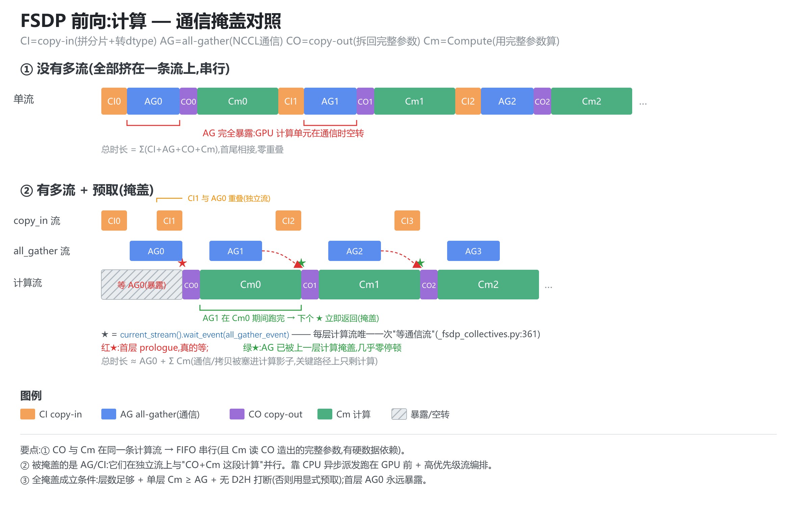
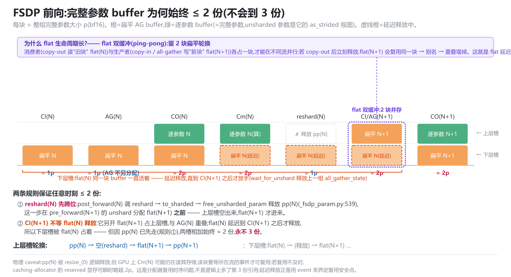

# FSDP2 预取 · 计算通信掩盖 · 显存生命周期 —— 源码级专题

> **代码基准**:torchtitan `main` @ `cf3c4312` · PyTorch `2.9.1`(FSDP2 内核 `torch/distributed/fsdp/_fully_shard/`)
> **最后更新**:2026-06-12(新增 §5.5 勘误与补充:分配≠新建,两层复用与社区机制) · **系列**:torchtitan 多维并行源码级分析(见 [[torchtitan/index]])
>
> 本文是对 `fully_shard`(FSDP2)一系列追问的整理稿,**所有结论基于 PyTorch 2.9.1 源码逐条复核**。
> 行号约定:torchtitan 以 `torchtitan/` 为根;PyTorch FSDP2 以 `[pt]` 前缀,根目录 `torch/distributed/fsdp/_fully_shard/`。
> 配套总览见 [[torchtitan_fsdp_analysis]](标杆篇);本文是其**深挖伴篇**,聚焦**预取、掩盖、显存**三件事并配两张机制图。

---

## 0. 一句话地图

```
fully_shard(module) ──► 一个 FSDPParamGroup(= 一次 all-gather + 一次 reduce-scatter)
   参数:逐参数切成分片 DTensor(只占 1/N),三态 SHARDED↔UNSHARDED
   运行:forward/backward 钩子驱动 unshard(取回完整参数)→ 计算 → reshard(释放)
   掩盖:独立高优先级 stream + CPU 跑在 GPU 前 + event 编排,把 AG/CI 塞进计算影子
   代价:预取要求"下一组先就位、当前组才释放" → 峰值从 1 组完整参数涨到 2 组
```

---

## 1. `fully_shard` 的实现流程与功能

### 1.1 通信单位:FSDPParamGroup,必须自底向上

`fully_shard(module)` 每调一次构造**一个 `FSDPParamGroup`**(`[pt]_fsdp_param_group.py:117`),收纳该 module 下尚未被子模块认领的参数。**一个 group = 一次 all-gather + 一次 reduce-scatter**,所以必须自底向上调用:先包每个 `TransformerBlock`,最后包根 `model`(根 group 只剩 embedding/norm/lm_head)。逐层分组的本质:一个 group 的参数 all-gather 后要同时驻留显存,整模型一组就退化为不分片。

### 1.2 参数切分:per-param → 分片 DTensor

`FSDPParam._init_sharded_param`:`torch.chunk` 沿默认 `Shard(0)` 切 → **预填充**把分片补零到统一大小(`chunks[0]`,使 all-gather 不必再 pad)→ 本 rank 分片存成 1D 扁平 `_sharded_param_data`(=all-gather 输入,也是真正占的显存)。注册到模块上的是 ND 的分片 **DTensor**,优化器直接作用其上 → **优化器状态天然 1/N**。

### 1.3 三态机与钩子链

`SHARDED ↔ SHARDED_POST_FORWARD ↔ UNSHARDED`,运行期在 `SHARDED↔UNSHARDED` 间往返。钩子链(全部核对 `[pt]_fsdp_state.py`):

```
forward_pre_hook  → _pre_forward(:228)  → root_pre_forward(:120) → pre_forward(unshard+wait) → 显式预取(:249)
module.forward(...)                       ← 此刻是完整 UNSHARDED
forward_hook      → _post_forward(:254) → reshard + 注册 pre-backward hook + 释放上次 AG 缓冲(:264)
反向:输出张量上的 _pre_backward(:282) → unshard + 反向预取;输入上的 autograd Function → post_backward → RS + reshard
```

### 1.4 torchtitan 侧(`fsdp.py`,已核)

- `disable_fsdp_gradient_division`(`fsdp.py:11`):每个 `FSDPModule` 设 `set_gradient_divide_factor(1.0)`,关掉按 world_size 除,改由训练循环按全局 token 数缩放。
- `get_fsdp_reshard_after_forward_policy`(`fsdp.py:28`):`always→True / never→False / default→ not pp_enabled`(开 PP 默认不 reshard,避免每 microbatch 反复 re-AG)。

---

## 2. 预取流程

预取 = **把下一组的 `unshard()`(发起 all-gather)提前到当前组还在计算时发出**。`_prefetch_unshard`(`[pt]_fsdp_param_group.py:613`)实质就是提前调目标组的 `unshard()`。三条路径:

- **隐式预取(默认,前向)**:靠"CPU 跑在 GPU 前 + 独立流"。`get_all_gather_streams`(`[pt]:88-98`)只有在非 async_op 且 FORWARD/PRE_BACKWARD 态时才返回独立的 `copy_in`/`all_gather` 流,否则退回当前流(即不重叠)。
- **反向预取(默认)**:`_pre_backward` 里 `default_prefetch = len(_states_to_backward_prefetch)==0`(`[pt]_fsdp_state.py:286`)→ `_backward_prefetch`(`[pt]:599`)按**前向记录的逆序** `post_forward_order` 预取(naive,可能取错目标)。
- **显式预取**:`set_modules_to_forward/backward_prefetch` 主动串联(`[pt]_fsdp_state.py:249/288`)。比隐式更早更激进,代价是更多完整参数同时驻留。torchtitan 的 MoE 模型用它绕开 EP all-to-all 的 D2H 打断。

---

## 3. 计算 — 通信掩盖(图)

### 3.1 五条 stream(`[pt]_fsdp_param_group.py:58-86`,已核)

| 流 | 用途 | 优先级 |
|---|---|---|
| 默认流 | 前向/反向计算 | 普通 |
| `all_gather_copy_in_stream` | copy-in(拼分片+转 dtype) | 高(-1) |
| `all_gather_stream` | **all-gather**(通信) | 高(-1) |
| `reduce_scatter_stream` | **reduce-scatter**(通信)+ 梯度除法 | 高(-1) |
| `all_reduce_stream` | HSDP 组间 all-reduce | 普通 |

**AG 与 RS 是两条独立通信流**——反向里"重新 all-gather 下一层参数"与"reduce-scatter 本层梯度"必然并发,共用一条流就会串行化。

### 3.2 掩盖对照图



要点:
- **CI 开扁平 buffer → AG 通信 → CO 拆回完整参数 → Cm 计算**。CO 与 Cm 在**同一条计算流**上,CUDA 同流 FIFO → **CO→Cm 串行**;且 Cm 读 CO 造出的完整参数,有硬数据依赖,逻辑上也必须 CO 在前。
- 被掩盖的是 **AG/CI**:它们在独立高优先级流上,与"CO+Cm 这段计算"并行。靠 CPU 异步派发跑在 GPU 前面实现。
- **唯一跨流同步点** ★ = `current_stream().wait_event(all_gather_event)`(`[pt]_fsdp_collectives.py:361`),每层计算流只在 CO 前等一次 AG。稳定态下 AG 已被上一层计算掩盖,★ 几乎零停顿;**唯独首层 AG0(prologue)真的暴露**。

### 3.3 ZeRO-3 的 all-gather 能否"全掩盖"?——不是天然保证

| 成立条件 | 失效场景 |
|---|---|
| 层数足够多(首/末层暴露占比小) | 首层 AG0 永远暴露(无可掩盖的前置计算) |
| 单层计算 ≥ 单层 all-gather(带宽不瓶颈) | 参数巨大/算力强带宽弱时 AG 露尾 |
| CPU 跑在 GPU 前,不被 D2H 同步打断 | `.item()`/动态 shape/**EP 的 token all-to-all** 含 D2H → 隐式预取断,需显式预取 |
| reshard 策略合适 | `reshard_after_forward=True` 反向要 re-AG,同样需藏在反向计算后 |

**工程保证手段**:必要时显式预取(绕 D2H)、合适的分组粒度(一个 TransformerBlock 是甜点)、按需调 `reshard_after_forward`。

---

## 4. copy-in 细节(三步 + 方向)

`foreach_all_gather`(`[pt]_fsdp_collectives.py:236-289`)与 `all_gather_copy_in`(`:175-188`):

1. **开输出 buffer**(`:262`):`allocate((input_numel × world_size,))`,大小 = 整组完整参数 `p`(bf16)。
2. **narrow 出本 rank 段**(`:182-184`):`all_gather_input = all_gather_output.narrow(0, numel*rank, numel)`——本 rank 的输入就是输出里它该占的那段的 **view**;all-gather 完成后本 rank 数据天然在位,省一次自我拷贝。
3. **foreach 拷入**(`:185-187`):`torch._foreach_copy_(foreach_copy_dsts, all_gather_inputs)`。

> **方向**:`_foreach_copy_(dsts, srcs)` 同 `self.copy_(src)`——**第一个参数是目的、第二个是源**,把 `all_gather_inputs`(参数分片,第二个)拷进 `foreach_copy_dsts`(buffer 槽位,第一个)。即"源在后、目的在前"。

**为什么 copy-in 不阻塞算子下发**:① CPU 侧纯异步 kernel 派发、内部无 D2H,发完立刻继续派发下一层;② 跑在独立高优先级流,不占计算流;③ copy-in→AG 的先后用 `all_gather_stream.wait_stream(copy_in_stream)`(`:273`)在 GPU 端排序,不靠 CPU 阻塞。独立于 `all_gather_stream` 还让**下一组 CI 与当前组 AG 重叠**。

---

## 5. 显存生命周期与增长(图)

### 5.1 关键事实:unsharded 参数是视图,不另占

eager 模式下 `init_unsharded_param`(`[pt]_fsdp_param.py:501-502`):`unsharded_tensor = self.all_gather_outputs[0]; unsharded_param = torch.as_strided(unsharded_tensor, ...)`——**完整参数就是 copy-out 目标 buffer 的 `as_strided` 视图**,不重复占显存。

### 5.2 各 buffer 与每阶段新增

| buffer | 大小 | dtype | 占用出现点(分配行为见 §5.5) | 释放点 |
|---|---|---|---|---|
| 分片参数 `_sharded_param_data` | p/N | fp32 | 建模期,**常驻** | — |
| 扁平 AG buffer `all_gather_output` | **p** | bf16 | **CI**:每次 unshard 新建**张量对象**(`[pt]_collectives.py:262`),物理块稳态来自 allocator 池命中 | copy-out 后(前向延迟释放) |
| 逐参数 buffer `all_gather_outputs` | **p** | bf16 | **首迭代 CO 创建一次**(`[pt]_param.py:443-446` 早退守卫);此后每次 CO 仅 `alloc_storage` 把 storage resize 回满(`:648/866`) | reshard(`free_storage` = `resize_(0)`,`:665/872`) |
| unsharded 参数本体 | **0** | — | `as_strided` 视图 | 随上行 |

- **CI(N):显存 +p**(扁平 buffer;copy-in 目标是它的 narrow 视图)
- **AG(N-1):+0**(不分配,写进 CI(N-1) 已开好的扁平 buffer)
- **CO(N):显存 +p**(逐参数 storage 回满;拷贝瞬间扁平+逐参数并存 = **2p**);完整参数本体 +0(视图)

> 注意:本表的 "+p" 是**显存占用**的增量;它**不等于**"每次新分配"——逐参数 buffer 的张量对象只建一次、之后是 storage 缩放,扁平 buffer 的物理块稳态来自缓存池。详见 §5.5 勘误。

### 5.3 为什么完整参数 buffer 始终 ≤ 2 份(不会到 3 份)

这是一个容易踩的疑问:CI(N+1) 与 AG(N) 重叠时,会不会同时存在 flat(N) + pp(N) + flat(N+1) = **3 份**?**不会**——靠两条被代码顺序锁死的规则,把它压在 2 份:



**规则①:reshard(N) 先腾位,再预取。** `post_forward(N)` 调 `reshard()`(`[pt]_fsdp_param_group.py:419`)→ FORWARD 分支落到 `_to_sharded()`(`:429`)→ `to_sharded`(`[pt]_fsdp_param.py:539`)`free_unsharded_param()` **释放 pp(N)**。兄弟 block 顺序执行,所以 `post_forward(N)` 在 `pre_forward(N+1)` 的 `unshard`(`:438`,分配 flat(N+1))**之前**——上层槽先空出来,flat(N+1) 才进来。

**规则②:CI(N+1) 不等 flat(N) 释放,但 flat(N) 延迟释放只多扛 1 块。** CI(N+1) 故意**另开** flat(N+1)(为了与 AG(N) 重叠),flat(N) 不立即释放,而是被存进 `comm_ctx.all_gather_state`,**等下一组 copy-in 之后**才在 `wait_for_unshard(N+1)` 释放(`[pt]:353-355` 先释放上一组的 `all_gather_state`)。即 `[Note: Overlapping all-gather copy-in and all-gather]`(`[pt]:43-52`)说的"have the next group free it after its copy-in"。

两条合起来:**下层槽**被 flat(N) 占到 CI(N+1) 之后,**上层槽**轮换 `pp(N) → 空(reshard) → flat(N+1) → pp(N+1)`。因为 pp(N) 已先走(规则①),两槽相加任意时刻 = **2 份 = 2p,永不 3p**。

**为什么 flat 不在 copy-out 后(pp(N) 已就绪)就释放?—— 双缓冲(ping-pong)。** flat(N) 的**数据**在 copy-out 后确实没用了(pp(N) 已有),但它的 **buffer** 不能马上释放,原因有二:

- **跨流复用安全**:copy-out(N) 在**计算流**上读 flat(N)。若 copy-out 一调完就 `resize_(0)` 释放,下一组 copy-in(N+1) 在 **copy_in 流**上申请 flat(N+1) 时,分配器很可能复用 flat(N) 那块 → copy_in 流往这块写、计算流还在读 → **跨流竞争**。CPU 又无法同步知道 copy-out 在 GPU 上跑完没。FSDP 保留引用 + 挂 copy-out event,下一组释放前先 `wait_event`(`_wait_all_gather_streams_on_event`,`[pt]:412-417`),用事件而非 CPU 阻塞界定"何时可安全复用"。
- **双缓冲,否则重叠塌掉(核心)**:若立刻释放 flat(N),flat(N+1) 大概率**复用同一块** → flat(N) 与 flat(N+1) **别名同一内存**。于是"读这块的 copy-out(N)"与"写这块的 all-gather(N+1) / copy-in(N+1)"只能**串行**,`copy-out ‖ 下一组 all-gather`、`下一组 copy-in ‖ 本组 all-gather` 两处重叠全没了。保留 flat(N) 到 copy-in(N+1) 之后,**逼着 flat(N+1) 拿到另一块内存** → 消费者(CO(N))与生产者(CI/AG(N+1))各占一块 → 不同流上并行。这就是经典 **ping-pong 双缓冲**,生命周期恰好长 1 个 group,代价 = +1 块扁平 buffer(p)。

> **反证**:`wait_for_unshard` 只有**前向 implicit** 才延迟(`[pt]:397-408`);**反向 / 显式预取 / world_size==1** 走 `else` 分支,`_wait_all_gather_streams_on_event(copy_out_event)` 后**立即释放**。docstring(`[pt]:341-348`)给的理由:反向里 copy-out 已能和**上一组 reduce-scatter** 重叠(另一对流),不需双缓冲去换 copy-in‖all-gather,故反向不延迟、更省显存。

> **逐列实证**(图中 7 列):CI(N)=1p → AG(N)=1p(AG 不另分配)→ CO(N)=2p(扁平+逐参数)→ Cm(N)=2p(flat(N)延迟+pp(N))→ reshard(N)=1p(释放 pp(N))→ CI/AG(N+1)=2p(flat(N)延迟+flat(N+1))→ CO(N+1)=2p。

> **物理 caveat**:pp(N) 被 `resize_(0)` 逻辑释放,但 GPU 上 Cm(N) 可能仍在读其存储,该块要等所在流的 event 才可被复用;若复用不及时,caching-allocator 的 *reserved* 显存可瞬时略超 2p。这是分配器复用时序问题,**不是逻辑上多了第 3 份引用**;延迟释放正是用 event 界定复用安全点。

### 5.4 峰值小结

- **稳定态峰值 ≈ 2 组完整参数(2p)**:算第 N 组(pp(N)=p,或延迟的 flat(N))时,下一组的扁平 buffer(p)已就位 → 2p;叠在常驻 `base`(分片参数 P/N(fp32)+ 分片梯度 + 优化器 2P/N + 激活)之上。
- **多流的代价就是 +1 组完整参数**:串行版任意时刻只 1 组(省显存但 AG 全暴露),多流为掩盖须保留 2 组。bf16 让这部分每元素减半,通常远小于优化器/激活,故默认开多流。

### 5.5 勘误与补充(2026-06-12):分配 ≠ 新建——两层复用与社区机制

> [!deprecated] 勘误
> 本文初版(§5.2 旧表述)把 CI/CO 写成"每次开出 +p 的 buffer",容易让人误以为**每次都全新分配、有显著 mem-alloc 开销与碎片**。这不准确——"FSDP 没做内存复用"的印象是错的。复用其实已存在于两层;FSDP 没做的只是"自管持久 ping-pong 通信池"这一种形态。

**两层既有复用(源码已核)**:

1. **对象级——CO 侧只分配一次,之后 storage 缩放**。`init_all_gather_outputs` 有早退守卫(`[pt]_fsdp_param.py:443-444`:`if not force_recreate and len(self.all_gather_outputs) > 0: return`)——逐参数 buffer 的**张量对象只在首迭代创建**;此后每层每迭代只是 `alloc_storage/free_storage`(`:866-874`)把**同一张量的 storage 在 0↔满之间 `resize_`**(即 [[torchtitan_fsdp_analysis]] §3.4 的 storage-resizing 技巧)。
2. **物理级——caching allocator 池命中**。CI 的扁平 buffer 虽每次都是新 `torch.empty`(对象级新),但 `torch.empty` ≠ `cudaMalloc`:物理块来自 CUDA caching allocator 池。transformer 结构规整 → 每层 buffer 大小完全相同 → **稳态次次池命中,不触发 cudaMalloc**,分配只剩 µs 级池查找。

**为什么 FSDP2 不自管持久池**:

- caching allocator 已提供等效复用且通用;自管池要重新实现**跨流安全**(A 流释放、B 流复用须等 event)——allocator 的 per-stream 池已内建这套。FSDP 的哲学:语义层只管生命周期与事件(`AllGatherState` 延迟释放),物理复用交给 allocator。
- 组尺寸不全齐(embedding 组 / norm+lm_head 组 / block 组各异),持久池须按 max 配,常驻更高;且私有池内存**无法与激活错峰共享**(激活峰值在反向早期、通信缓冲常驻),总 reserved 可能不降反升。
- 跨流碎片这个真痛点,官方给的是开关而非池:`_set_unshard_async_op(True)` docstring 原话(`[pt]_fully_shard.py:602-610`)"allows the all-gather allocations to happen in the **default stream, avoiding inter-stream memory fragmentation**"——代价是 copy-in 不再与计算重叠、需显式预取。

**社区已有的相关机制(全部本地源码核实)**:

| 层级 | 机制 | 位置 |
|---|---|---|
| 对象级复用 | unsharded buffer 建一次 + storage resize 0↔满 | `[pt]_fsdp_param.py:443/866-874` |
| 物理级复用 | caching allocator 池命中;`expandable_segments:True` 治碎片 | allocator 配置 |
| 跨流碎片 | `_set_unshard_async_op(True)` 分配挪回默认流 | `[pt]_fully_shard.py:599-610` |
| 自定义分配钩子 | `AllGather/ReduceScatter` 协议带 `allocate()`;`set_custom_all_gather/reduce_scatter` 注入("better control over communication **and memory usage**") | `[pt]_fsdp_collectives.py:52/67`、`[pt]_fully_shard.py:458-475` |
| 通信缓冲注册 | `set_allocate_memory_from_process_group(enable)`——缓冲直接从 ProcessGroup 分配(NCCL 用户缓冲注册/NVLS 零拷贝路线,本质即"持久注册缓冲") | `[pt]_fully_shard.py:595-597` |
| 专属内存池 | `torch.cuda.MemPool` / `use_mem_pool` | `torch/cuda/memory.py:1159/1212` |
| 编译路线 | traceable FSDP2 下 inductor pass `remove_fsdp2_unsharded_param_graph_input_usage` 把 `resize_+copy_` 消除(unsharded param 直接 alias AG 输出,连 copy-out 都省);CUDAGraph 固定地址 = 极致复用 | `[pt]_fsdp_param.py:516-519` 注释 |
| 引擎级先例(静态规划路线) | Megatron 经典 `param_and_grad_buffer.py` 持久大缓冲;Megatron-FSDP 的 bucket 化持久缓冲(`BucketingPolicy`) | `Megatron-LM/megatron/core/distributed/{,fsdp/src/megatron_fsdp/}param_and_grad_buffer.py` |

**值不值得自建持久池——分场景**:PyTorch eager + CUDA 上净收益小(alloc 已池命中、碎片有 expandable_segments、跨流有 async_op 开关);**值得做**的场景:① 零拷贝集合通信(NVLS/对称内存,入口即 `set_custom_all_gather` 的 `allocate()` / `set_allocate_memory_from_process_group`);② compile/CUDAGraph;③ **非 CUDA-allocator 栈(NPU)**——分配器行为不同、碎片更痛时,Megatron 式静态持久缓冲(按 layer 模板预分配 + ping-pong)很可能净赚,实现时须自管"跨流 event 界定复用安全点"(`AllGatherState` 即教材)。

---

## 6. 反向(`reshard_after_forward=True`)要点

前向已 free 完整参数 → 反向每层先 **re-AG** 取回参数,算完梯度后 **reduce-scatter**。稳定态**三条流同时忙**:计算流(梯度)、`all_gather`(逆序预取 re-AG 下一层)、`reduce_scatter`(规约本层梯度),三者两两重叠——这正是 AG/RS 必须分两条流的实证。

`post_backward` 顺序(`[pt]:494-495`):**先 reshard 再 RS**,让规约时显存里已无本层完整参数。反向峰值 ≈ base + 2 组完整参数 + **~1 组完整梯度**(Bm 产出→RS 消费前的暂留)。

---

## 7. 源码复核小结

| 断言 | 位置 | 结果 |
|---|---|---|
| 5 条 stream + 高优先级 | `[pt]_fsdp_param_group.py:58-86` | ✅ |
| 隐式预取才用独立 AG 流 | `[pt]:88-98` | ✅ |
| 前向延迟释放 AG buffer | `[pt]:397-406` `wait_for_unshard` | ✅ |
| 唯一跨流同步 wait_event | `[pt]_fsdp_collectives.py:361` | ✅ |
| copy-in 三步 + 方向 | `[pt]_fsdp_collectives.py:175-188 / 262-273` | ✅ |
| unsharded 参数 = as_strided 视图 | `[pt]_fsdp_param.py:501-502/525` | ✅ |
| 扁平/逐参数 buffer 分配 | `[pt]_collectives.py:262`、`[pt]_param.py:445/648` | ✅ |
| free_unsharded_param 释放 | `[pt]_fsdp_param.py:665-672` | ✅ |
| 先 reshard 再 RS | `[pt]_fsdp_param_group.py:494-495` | ✅ |
| 关梯度除法 / reshard 策略 | `torchtitan/distributed/fsdp.py:11/28-48` | ✅ |
| **逐参数 buffer 仅首迭代创建(早退守卫)** | `[pt]_fsdp_param.py:443-446` | ✅(§5.5 勘误依据) |
| alloc/free_storage = storage `resize_` | `[pt]_fsdp_param.py:866-874` | ✅ |
| async_op 挪默认流避免跨流碎片 | `[pt]_fully_shard.py:599-610` docstring | ✅ |
| `set_custom_all_gather` + `allocate()` 钩子 | `[pt]_fully_shard.py:458-475`、`[pt]_fsdp_collectives.py:52/67` | ✅ |
| `set_allocate_memory_from_process_group` | `[pt]_fully_shard.py:595-597` | ✅ |

> 图源:`assets/fsdp-overlap.svg`、`assets/fsdp-memory.svg`(可用 `@resvg/resvg-js` 或任意 SVG 工具重新导出 PNG)。

## Related Pages

- [[torchtitan_fsdp_analysis]] —— FSDP2 总览标杆篇(参数切分、钩子链、reduce-scatter、HSDP);本文为其深挖伴篇
- [[torchtitan/index]] —— torchtitan 多维并行知识地图
- [[torchtitan_ac_analysis]] —— 激活重计算:与 FSDP 正交叠加,AC 省激活、FSDP 省参数/梯度/优化器
- [[torchtitan_ep_analysis]] —— EP 的 token all-to-all 含 D2H 同步,正是打断隐式预取、需显式预取的实例
- [[comm_compute_overlap_analysis]] —— 跨框架计算通信掩盖对比
- [[distributed_optimizer_deep_dive]] —— FSDP2 / ZeRO / MindSpeed 三方对比
