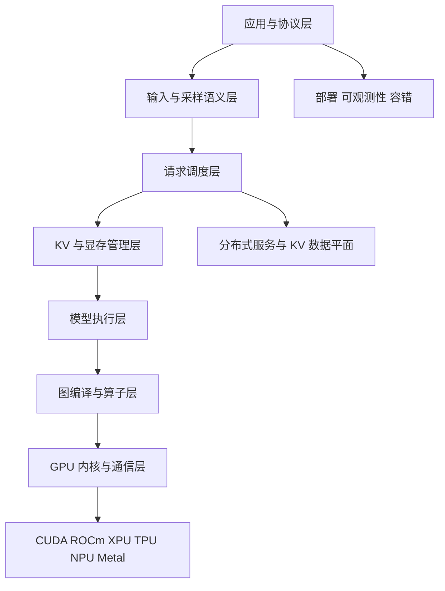
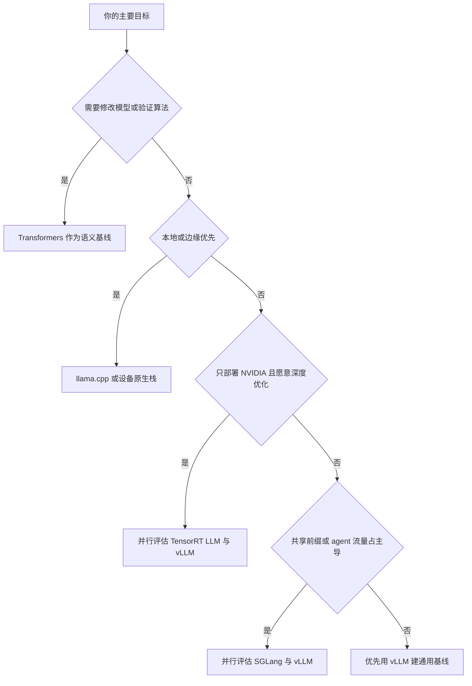

# 大模型推理技术栈全景 —— 从模型文件到在线服务

> **观察时间**：2026-08-18
> **vLLM 源码基准**：`vllm-project/vllm@f4b161d7fca438bfe29509984759be1943a5aa88`（`v0.27.2rc0-189-gf4b161d7fc`）
> **结论**：现代 LLM 推理不是“选一个框架”这么简单，而是一条跨越模型格式、调度、KV 内存、编译、内核、通信、服务与可观测性的流水线。vLLM 的价值在于把其中大多数层整合成一个可扩展的通用引擎。

---

## 一、先建立正确的分层模型

| 层 | 核心问题 | 常见技术与组件 | vLLM 中的落点 |
|---|---|---|---|
| 模型与制品 | 权重如何表达、加载和复用 | Hugging Face config、Transformers、Safetensors、GGUF、量化权重 | 模型注册表、流式权重加载、量化插件 |
| 协议与输入 | HTTP、chat template、多模态、结构化输出如何统一 | OpenAI-compatible API、tokenizer、JSON Schema、grammar | FastAPI API server、InputProcessor、Structured Output |
| 调度 | 谁在本轮运行、运行多少 token | continuous batching、chunked prefill、priority、preemption | V1 Scheduler 的统一 token 预算 |
| KV 内存 | 长上下文如何避免碎片和重复计算 | paged KV、prefix cache、KV quantization、offload | BlockPool、KVCacheManager、KVConnector |
| 模型执行 | 一步前向如何分发到多卡 | TP、PP、DP、EP、CP、MoE dispatcher | Executor、Worker、Model Runner |
| 编译与内核 | 如何减少 Python、launch 和内存流量 | `torch.compile`、Inductor、CUDA Graph、FlashAttention、FlashInfer、Triton、CUTLASS | `VLLM_COMPILE`、CustomOp、融合 pass、attention backend |
| 数据平面 | Prefill 与 Decode、GPU 与外部缓存如何交换 KV | NIXL、Mooncake、LMCache、RDMA、P/D disaggregation | KV transfer connector |
| 运维 | 怎样扩缩容、限流、观测和定位 SLO | Prometheus、OpenTelemetry、router、Kubernetes | metrics、tracing、OpenAI server；更大规模控制面通常由外部系统补齐 |

这张表也解释了为什么“FlashAttention 很快”不等于“推理服务很快”：decode 可能受 CPU 调度和 kernel launch 限制，prefill 可能受算力和长尾限制，长上下文还可能先撞上 KV 容量；任何单点优化都只覆盖其中一段。

## 二、当前主流推理框架如何分工

| 技术栈 | 最适合的场景 | 关键优势 | 主要边界 |
|---|---|---|---|
| **Transformers `generate()`** | 算法验证、模型兼容性基线、低并发脚本 | 语义清晰、模型覆盖广、改模型最方便 | 不以高并发 continuous batching 和服务 SLO 为首要目标 |
| **vLLM** | 通用 GPU 在线服务、离线批推理、多种硬件和并行方式 | continuous batching、paged KV、OpenAI API、丰富量化/投机/分布式/编译能力 | 功能组合复杂，最优配置必须按模型、硬件与工作负载验证 |
| **SGLang** | 高性能在线服务、共享前缀明显的 agent/多轮工作负载 | RadixAttention、continuous batching、P/D 分离、结构化输出与广泛并行能力 | 同样快速演进；应按目标模型和后端实测，不宜只凭单项 benchmark 迁移 |
| **TensorRT-LLM** | NVIDIA GPU 上追求极致性能和深度定制 | NVIDIA 内核栈、KV manager、scheduler、PyExecutor、CUDA Graph、投机解码 | 硬件绑定更强，构建和部署复杂度通常更高 |
| **llama.cpp** | 本地、桌面、边缘、CPU/混合设备、GGUF 生态 | 纯 C/C++、部署轻、量化和硬件后端覆盖广 | 与大型数据中心 GPU serving 的优化目标不同 |
| **Text Generation Inference** | 维护既有 TGI 部署 | Hugging Face 生态与既有运维资产 | 官方已进入维护模式；新项目应优先评估 vLLM、SGLang 等活跃方案 |

上述定位来自各项目当前官方材料，而不是把 benchmark 排名外推成普遍结论：Transformers 的官方生成入口是 `generate()` / `GenerationConfig`；SGLang 官方列出 RadixAttention、P/D 分离、投机解码、连续批处理和多种并行；TensorRT-LLM 的官方架构把 LLM API、PyExecutor、scheduler、KV cache manager 与模型执行拆开；llama.cpp 官方强调 GGUF、量化及跨硬件后端；Hugging Face 已明确标注 TGI 进入维护模式。

### 2.1 一个实用选择树

这棵树不是最终答案。最终选型需要固定模型、权重量化、输入/输出长度分布、并发模型、SLO 与成本口径，测出 TTFT、TPOT、吞吐、错误率和单位请求成本的 Pareto 前沿。

## 三、vLLM 在这条栈中的位置

vLLM 不是一个单纯的 PagedAttention kernel。当前源码把一条完整服务路径都纳入仓库：

1. **前端**：`LLM` 提供离线批推理，`vllm serve` 提供 OpenAI-compatible HTTP 服务；`docs/design/arch_overview.md:14-79`。
2. **引擎控制面**：InputProcessor、OutputProcessor 与 EngineCoreClient 处理请求语义、流式输出和 EngineCore 通信；`vllm/v1/engine/llm_engine.py:90-111`、`vllm/v1/engine/async_llm.py:72-156`。
3. **调度与 KV**：Scheduler 用 token budget 统一描述 prefill/decode，KVCacheManager 与 BlockPool 负责分页块、前缀命中和回收；`vllm/v1/core/sched/scheduler.py:476-639`、`vllm/v1/core/kv_cache_manager.py:232-530`。
4. **执行**：Executor 将本轮 `SchedulerOutput` 广播到 worker；worker 负责模型、并行通信和 GPU 运行；`vllm/v1/executor/abstract.py:50-139,211-229`、`vllm/v1/worker/gpu_worker.py:1044-1139`。
5. **编译与内核**：生产默认 `-O2`，启用更多编译区间、融合与 `FULL_AND_PIECEWISE` CUDA Graph；`docs/design/optimization_levels.md:5-13,64-81`。
6. **外部数据平面**：KV connector 依赖覆盖 LMCache、NIXL 与 Mooncake transfer engine；`requirements/kv_connectors.txt:1-8`。

当前 CUDA 软件栈还明确依赖 PyTorch 2.13、Transformers 5.5.3+、Tokenizers、Safetensors、FastAPI、PyZMQ、msgspec、FlashInfer，以及 TVM FFI、TileLang、cuDNN frontend、CUTLASS DSL 等可选/平台组件；证据见 `requirements/common.txt:10-34,55-58` 与 `requirements/cuda.txt:7-35`。这说明 vLLM 更像一个**推理操作系统加集成发行版**：调度和内存策略在上层，具体算子会按平台、模型、量化方式和可用依赖派发。

## 四、推理性能应该怎样拆解

| 指标 | 含义 | 常见主导因素 | 优化方向 |
|---|---|---|---|
| TTFT | 从请求到首 token | 排队、tokenize、prefill、KV 命中、长 prompt | prefix cache、chunked prefill、P/D 分离、请求路由 |
| TPOT | 相邻输出 token 的平均间隔 | decode batch、kernel launch、内存带宽、同步 | CUDA Graph、融合 kernel、投机解码、合适批量 |
| ITL 尾延迟 | 流式 token 间隔的 P95/P99 | 调度抖动、大 prefill 干扰、通信尾部 | token budget、prefill 限流、负载隔离 |
| 吞吐 | 每秒 token 或请求 | batch 利用率、GPU 利用率、并行效率 | continuous batching、DP/TP/EP、量化、异步流水 |
| 容量 | 可驻留权重和 KV | 权重精度、上下文、并发、块大小 | 权重/KV 量化、paged KV、offload、缩短 `max_model_len` |
| 正确性 | 输出是否等价且稳定 | chat template、generation config、量化、kernel 数值路径 | 固定采样语义、回归集、逐层与端到端校验 |

> [!warning] 三个常见误区
> 1. 吞吐最高的配置不一定满足交互式 P99；增大 `max_num_batched_tokens` 往往会用 TTFT 换吞吐。
> 2. TP 不是免费的容量扩展：它引入逐层 collective；模型能单卡装下时，DP 往往更适合扩请求吞吐。
> 3. 量化节省显存不等于必然加速；若目标硬件没有匹配 kernel，反量化或格式转换可能抵消收益。

## 五、建议学习路径

1. 先读 [[vllm/index|vLLM 推理引擎知识地图]]，把离线与在线拓扑分开。
2. 再读 [[vllm/10_vllm_engine_architecture_analysis|vLLM 引擎架构与请求生命周期]]，跟一次 `schedule → execute → sample → update`。
3. 用 [[vllm/01_vllm_feature_optimizations_guide|vLLM 快速使用与优化指南]] 启服务并建立 benchmark 基线。
4. 按瓶颈进入 scheduler、KV、attention、quantization、speculative decoding、distributed 和 compilation 专题。
5. 对共享前缀、分离式推理或特定硬件场景，再横向对照 [[sglang/index|SGLang]] 与 [[mooncake_analysis|Mooncake 分离式推理]]。

## 主要外部来源

- [Hugging Face Transformers 文本生成](https://huggingface.co/docs/transformers/llm_tutorial)
- [SGLang 官方仓库](https://github.com/sgl-project/sglang)
- [TensorRT-LLM 架构总览](https://nvidia.github.io/TensorRT-LLM/developer-guide/overview.html)
- [llama.cpp 官方仓库](https://github.com/ggml-org/llama.cpp)
- [Hugging Face TGI 维护状态](https://huggingface.co/docs/inference-endpoints/engines/tgi)
- [vLLM 官方架构总览](https://docs.vllm.ai/en/latest/design/arch_overview/)

## Related Pages

- [[vllm/index|vLLM 推理引擎知识地图]]
- [[vllm/10_vllm_engine_architecture_analysis|vLLM 引擎架构与请求生命周期]]
- [[vllm/01_vllm_feature_optimizations_guide|vLLM 快速使用与优化指南]]
- [[sglang/index|SGLang 推理框架]]
- [[speculative_decoding/index|投机推理专题]]
- [[mooncake_analysis|Mooncake 分离式推理]]
