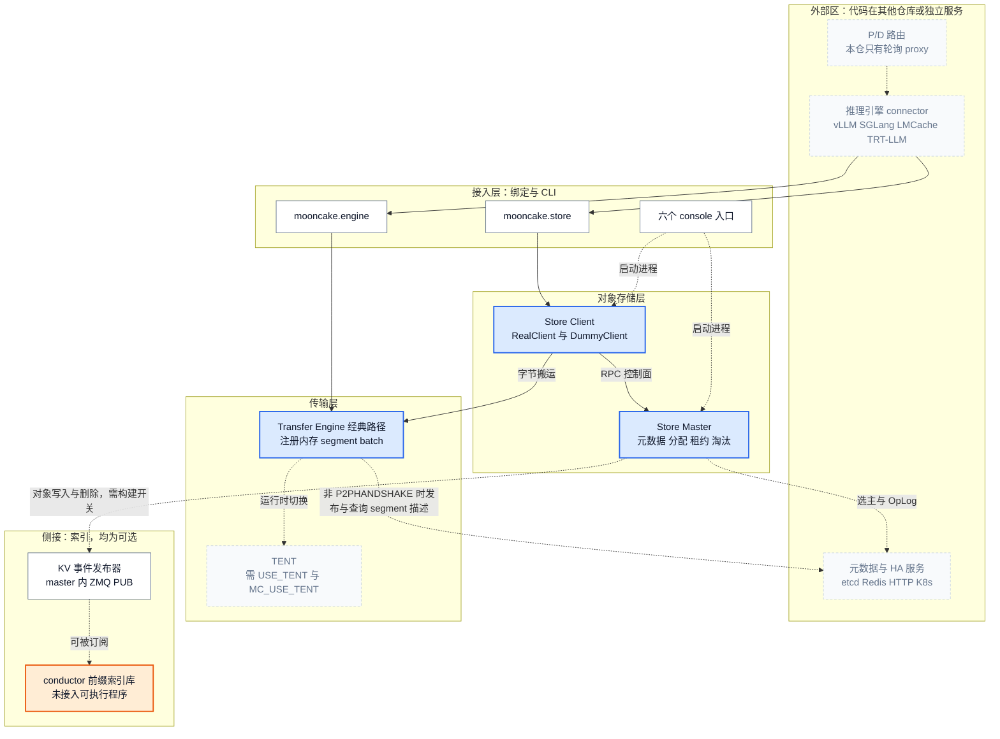
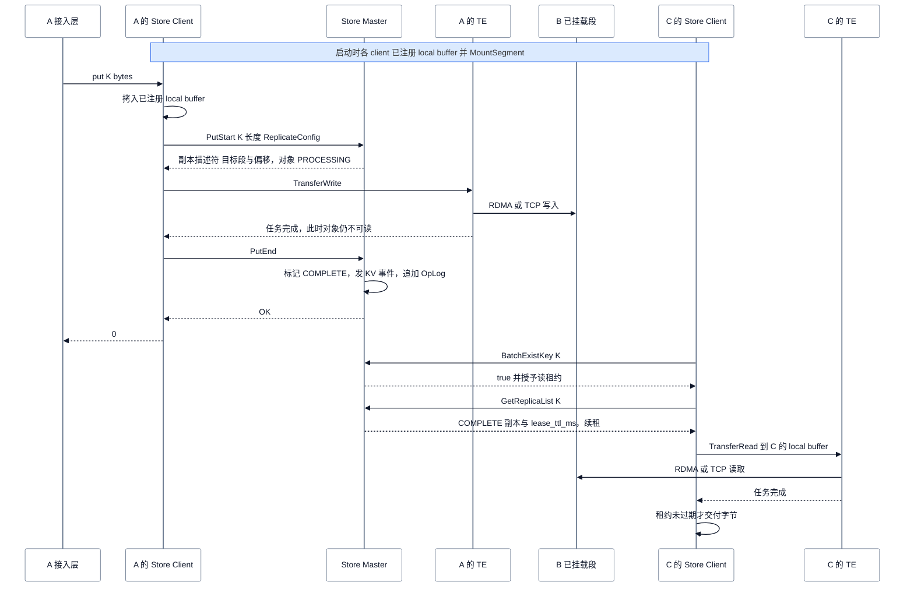
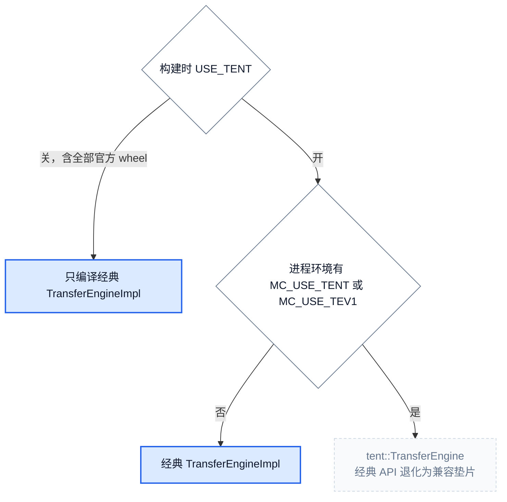
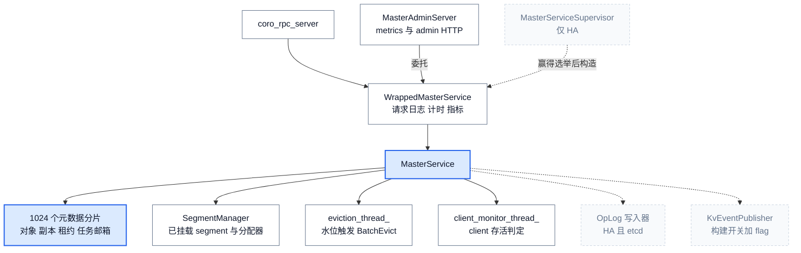
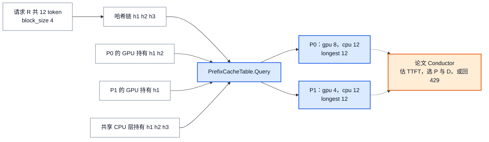
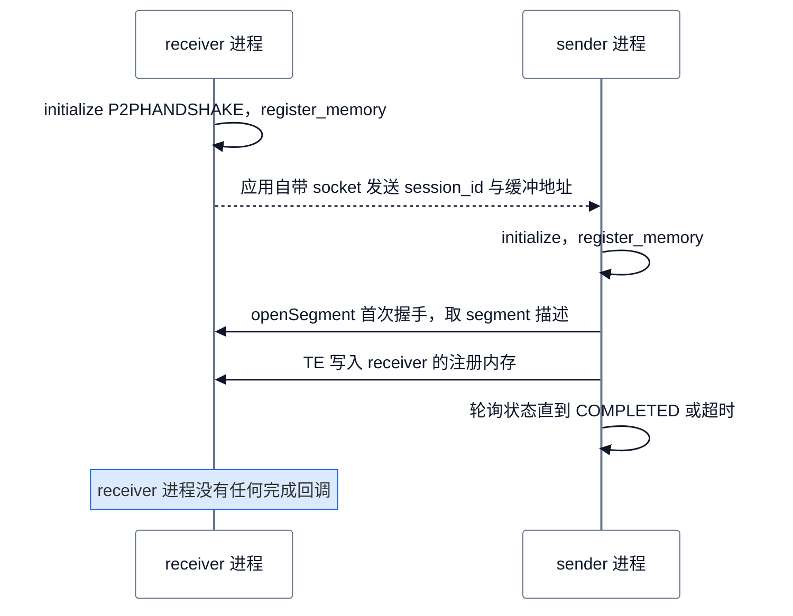
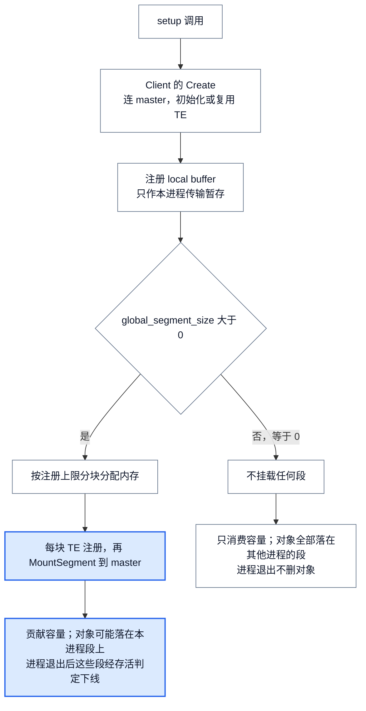
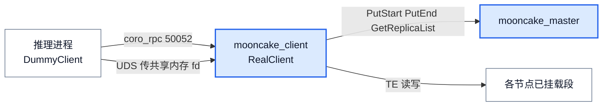
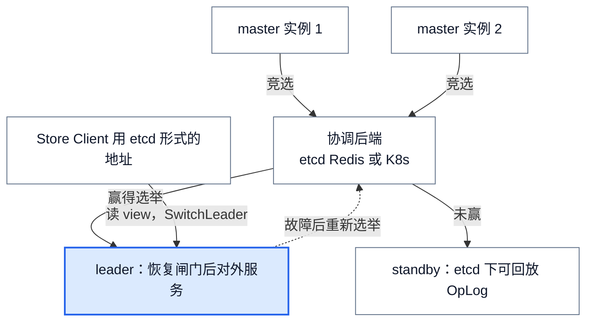

# Mooncake 软件架构总览：开源数据面、论文控制面与使用场景

> **源码基线**：`kvcache-ai/Mooncake@7d3a94e9d8c30abf02fcd64df218c16c1abc70df`（`main`，2026-09-24）
> **主题**：先从论文“用存储换计算”的设计压力划出开源仓的能力边界，再按职责与状态归属建立接入、对象存储、传输、索引四层五模块，并跟随一次跨进程 Store 写读看它们怎样协作。随后逐模块说明设计与限制，对照论文列出哪些设计已开源、哪些不在仓内，最后给出代码映射和五个使用场景。论文以仓内 `FAST25-release/Mooncake-FAST25.pdf`（FAST'25 版）为主，arXiv:2407.00079 v1（2024-06-24）与 v3（2024-07-09）补充 FAST 版删去的过载调度与 trace 统计。
> **适用范围**：仓库级架构、论文↔开源对照与场景入口；TE 切片与选路、对象租约与淘汰、分层卸载、HA、vLLM 接线分别归 10/11/12/13/20，P/D 分离与 KV 分层原理归推理理论页；EP、PG、P2P Store、reshard、RL 只列边界（静态源码与文档核验，未实跑 RDMA、多机或 HA 集群）。
> **最近更新**：2026-09-24。新建页，取代旧论文页 `mooncake_analysis`。

## 1. 设计背景、目标与能力边界

### 1.1 论文的设计压力：用存储换计算

Mooncake 是 Kimi 的 serving 平台。FAST'25 版把目标写成一个带约束的优化问题：在 TTFT 与 TBT 两类延迟 SLO 下最大化有效吞吐（§1、§2.1）。长上下文让这个问题更尖锐：输入常是输出的 10–100 倍（§3.3），prefill 的算力成为主要成本。prefill 与 decode 为什么要分池、分离后多出哪段交接，归 [[26_prefill_decode_disaggregation_analysis|P/D 分离原理]]；本页只取论文里决定软件形态的那部分论证。

论文的核心论证是**复用前缀 KV 什么时候比重算划算**（§2.2，Table 1）。设模型 $l$ 层、隐维 $d$，$a,b$ 为 Eq. (1) 的常数，$\mathrm{gqa}$ 为 query 头数与 KV 头数之比，$s$ 为元素字节数，$G$ 为 GPU 算力，$B$ 为 KV 装载带宽（取主机到设备与网卡带宽的较小者），$n$ 为 prompt 长度，$p$ 为命中前缀长度。复用省下 $l(ap^{2}d+bpd^{2})$ 的计算，却要搬 $p\cdot l\cdot(2d/\mathrm{gqa})\cdot s$ 字节，于是：

$$
\begin{aligned}
\mathrm{flops}(n) &= l\left(a n^{2} d + b n d^{2}\right), \\
\frac{B}{G} &> \frac{2ds}{\mathrm{gqa}\left(apd + bd^{2}\right)}.
\end{aligned}
$$

按 LLaMA3-70B 与 8×A800、前缀 8192 计算，所需 $B$ 约 6 GB/s；换成 8×H800 则约 19 GB/s（§2.2）。容量上，单机约 1 TB DRAM 只能存约 300 万 token 的 KV，多数负载下达不到理论最高命中率的一半；约 5000 万 token 才接近上限，需要汇集至少 20 台节点的 DRAM（§5.3.1，Fig. 9）。

由此得到三条设计要求：**跨节点汇集 DRAM/SSD 作为 KV 池、用高带宽多网卡通路搬 KV、按缓存位置调度请求**。论文分别用 Mooncake Store、Transfer Engine 与 Conductor 回应它们（§3.1，Fig. 2）。这种“恢复是否快过重算”的通用账本归 [[22_kv_tiering_transfer_analysis|KV 分层与迁移]] §4。

### 1.2 论文系统与开源仓是两条不同的边界

论文 Fig. 2 的系统有四部分：全局调度器 Conductor（缓存感知的 prefill 调度、KV 负载均衡、按负载的 decode 调度），带本地 chunked prefill 调度与 PP/SP 的 prefill 池，带本地调度器的 decode 池，以及由各节点 CPU/DRAM/SSD 组成的 Mooncake Store 与 RDMA Transfer Engine。一次请求经过四步（§3.1，Fig. 3）：Conductor 选一对 prefill/decode 实例；prefill 从远端 CPU 内存装载可复用前缀；未命中部分分块流水执行，新 KV 逐层流式送往 decode 节点的 CPU 内存；全部到齐后请求加入 decode 的 continuous batching。

论文自己就把开源范围说得很窄：FAST 版称公开的是“traces, along with the KVCache transfer infrastructure”（§1，p. 3），并称 transfer engine 代码“will also be open sourced later”（§5.4.1）。冻结源码与这个说法一致：

- **在仓内**：Transfer Engine、Mooncake Store 的 master 与 client、Python 绑定与命令行入口，以及一条可选的 KV 事件流和一个尚未接入任何可执行程序的前缀索引库。
- **不在仓内**：Conductor 的 P/D 选择与 TTFT 估算、SLO 拒绝、热点迁移决策、提前拒绝，以及 CPP 与逐层 prefill。前两类属于集群调度，后两类属于推理引擎内部。

本页的论点因此是：**开源 Mooncake 是一套数据面工具箱（TE + Store + 绑定），论文的控制面不在开源仓；`mooncake-conductor/` 只是一个没有接线的前缀索引库。** 仓库没有解释为何不开源控制面；把这部分理解为 Moonshot 内部系统或交给推理引擎实现，是分析推断。逐项对照见第 4 章。

### 1.3 冻结版本的能力范围

先约定后文反复出现的五个术语：

- **segment**：某个 Store Client 注册给 TE、再挂载到 master 的一段内存，是 Store 存放对象副本的容量单位；TE 也以 segment 名定位远端地址。
- **local buffer**：Store Client 注册给 TE 的本进程传输暂存区，读写的字节都先经过它；它不进入存储池。
- **OpLog**：HA 模式下 leader 把元数据变更按序写入 etcd 的操作日志，standby 回放它来追平状态。
- **TENT**：`mooncake-transfer-engine/tent/` 中的新一代传输运行时，支持按片跨网卡喷洒与跨协议故障转移；需要编译开关加环境变量才启用。
- **NoF**：NVMe over Fabrics SSD 池（构建开关 `USE_NOF`），master 可以在上面分配 `NOF_SSD` 类型的副本。

| 类别 | 当前能力与实现依据 | 阅读时的边界 |
|---|---|---|
| 核心 | 经典 Transfer Engine（`mooncake-transfer-engine/include/transfer_engine.h::TransferEngine`）及其元数据插件（`P2PHANDSHAKE`、HTTP、etcd、Redis）；Store master（`mooncake-store/src/master.cpp::main`）；嵌入式 Store client（`MooncakeDistributedStore.setup` → `RealClient`）；Python 模块 `mooncake.engine`、`mooncake.store` 与六个 console 入口 | etcd 与 Redis 元数据插件并非每个官方 wheel 都有：wheel 间差异见 §3.4，插件细节见 [[10_mooncake_transfer_engine_analysis|Transfer Engine]] §10 |
| 可选：启动开关 | 独立式 client `mooncake_client` + `setup_dummy`；SSD 卸载 `--enable_offload`；HA `--enable_ha`；master 内嵌 HTTP 元数据服务 `--enable_http_metadata_server`；动态内存副本 `--dynamic_replication_mode`（默认 `off`）；REST 服务 `mc_store_rest_server` | 各自的完成与失败语义由 11/12/13 负责 |
| 可选：构建开关 | KV 事件需 `ENABLE_KV_EVENTS`（默认关，官方 wheel 开）；HA 后端分别需 `STORE_USE_ETCD`、`STORE_USE_REDIS`、`STORE_USE_K8S_LEASE`；NoF、3FS、CXL 等存储后端各有开关 | 未编译时部分开关静默失效，部分在启动时终止（§3.2、§6.5） |
| 实验或非默认 | TENT 需编译期 `USE_TENT` 且运行期设 `MC_USE_TENT`，官方 wheel 均不满足；`mooncake-conductor/` 需 `WITH_CONDUCTOR`，只链接进单元测试 | 不作为默认路径描述 |
| 兼容与遗留 | master `--port`/`--max_threads` 已由 `--rpc_port`/`--rpc_thread_num` 取代；`--etcd_endpoints` 仅作 etcd HA 的回退别名；`MC_USE_TEV1` 是 `MC_USE_TENT` 的别名；`--root_fs_dir` 是遗留持久化路径；`docs/source/design/architecture.md` 描述已过时 | 以当前实现为准，冲突见 §4.4 |
| 外部集成 | vLLM、SGLang、LMCache、TensorRT-LLM、NIXL 等的 connector 位于各自仓库；本仓仅带一份 vLLM connector 副本 `mooncake-wheel/mooncake/mooncake_connector_v1.py` 和轮询式 proxy | vLLM 侧见 20；其余集成当前无 owner 页 |
| 周边，本页排除 | `mooncake-ep`（带 `active_ranks` 的 DeepEP 式 MoE dispatch/combine）、`mooncake-pg`（带故障上报与 rank 恢复的 torch ProcessGroup 后端）、`mooncake-p2p-store`（Go 实现、无 master 的 etcd P2P 对象共享，面向 checkpoint）、`mooncake-reshard`（权重与 KV 的重分片规划）、`mooncake-rl`（单个 450 行示例）、Engram embedding 表存储 | 与 KV serving 数据面无直接调用关系 |
| 不在仓内 | Conductor 调度、SLO 准入与 HTTP 429、提前拒绝、CPP、逐层 prefill | 见第 4 章 |

能力来源为顶层 `CMakeLists.txt` 与 `mooncake-common/common.cmake` 的构建开关、`.github/workflows/_build-wheel.yaml` 的六个 wheel profile、`pyproject.toml` 与 `mooncake-wheel/pyproject.toml` 的 `[project.scripts]`，以及对应实现。

## 2. 静态架构与动态协作

### 2.1 按职责与状态归属划分五个模块

分类轴只有一条：**谁持有哪类状态、对上承诺什么合同**。依赖方向自上而下；模块不等于进程，也不等于目录。例如同一个推理进程里可以同时有接入层对象、一个 Store Client 和一个 Transfer Engine 实例。

图 1 实线表示依赖与调用方向，虚线表示可选或仅在特定部署下存在的关系。蓝色为每次 Store 读写都会经过的核心模块，橙色为仓内存在但未接入任何可执行程序的部分，灰色为外部系统或非默认路径。

<!-- 图 1 规格：上方外部区（推理引擎 connector、P/D 路由、元数据与 HA 服务）；中间三层（接入层、对象存储层含 Store Client 与 Store Master、传输层含经典 TE 与 TENT）；右侧索引侧接（master 内 KV 事件发布器、conductor 库）。核心数据路径 SC→TE 与控制路径 SC→SM 用 acc1，conductor 库用 acc2，外部与 TENT 用 ghost。 -->


| 模块 | 职责与合同 | 持有的状态与不变量 | 委托与非职责 | 边界 | 关键符号 |
|---|---|---|---|---|---|
| **接入层** | 把 Python 调用映射为 C++ 对象调用；把 console 命令 `execv` 成原生二进制 | 只持有包装对象（`MooncakeStorePyWrapper` 内的 `PyClient` 指针、`TransferEnginePy` 内的引擎） | 不做调度、不持久化状态 | 两条打包路径并存（§3.4） | `mooncake-integration/store/store_py.cpp::MooncakeStorePyWrapper`；`mooncake-integration/transfer_engine/transfer_engine_py.cpp::TransferEnginePy`；`python/mooncake/cli.py::main` |
| **Store Client** | 对上提供 put/get/exist；对下向 master 申请与发布副本，并驱动字节搬运 | 本进程挂载的全局 segment、注册过的 local buffer、TE 实例、`MasterClient` 连接、带租约截止时间的查询结果 | 字节交给 TE；分配、租约和淘汰交给 master | 嵌入式与独立式两种进程归属（§3.3） | `mooncake-store/include/real_client.h::RealClient`、`dummy_client.h::DummyClient`、`client_service.h::Client` |
| **Store Master** | 集中管理对象到副本的映射、segment 空间分配、读租约、淘汰、卸载与晋升派单 | 1024 个元数据分片（`MasterService::kNumShards`）、`SegmentManager`、client 存活表、淘汰线程、可选 OpLog | **不在数据路径上**：从不读写对象字节 | 单点或 HA（§3.2） | `mooncake-store/include/master_service.h::MasterService`；`rpc_service.h::WrappedMasterService` |
| **Transfer Engine** | 把“本地地址 → 目标 segment + 偏移”的批量请求搬完，并报告每个任务的状态 | 本地注册内存与 rkey（RDMA 对端访问这段注册内存所需的密钥）、远端 segment 描述缓存、batch 与 task 状态、endpoint 池 | 不理解对象、key 或 KV 语义 | TENT 仅在构建加环境变量时生效（§3.1） | `mooncake-transfer-engine/include/transfer_engine.h::TransferEngine`；`transfer_engine_impl.h::TransferEngineImpl`；`transfer_metadata.h::TransferMetadata` |
| **索引侧接** | master 对外广播对象的写入与删除事件；conductor 库把多源事件整理成按实例、按介质的前缀索引 | 发布器：有界事件队列与 ZMQ 序号；库：`PrefixCacheTable` 的每 context 前缀表 | 发布器不做查询；库不做调度，也不对外服务 | 两者都需构建开关；库没有可执行入口（§3.5） | `mooncake-store/include/kv_event/kv_event_publisher.h::KvEventPublisher`；`mooncake-conductor/include/conductor/prefixindex/prefix_indexer.h::PrefixCacheTable` |

外部区不属于本仓模块：推理引擎决定何时写读哪些 KV、怎样命名 key，路由决定请求去哪一对实例。本仓只提供被它们调用的接口；vLLM 的接线见 [[20_mooncake_vllm_integration_analysis|vLLM 集成]]，vLLM 侧协议见 [[02_engineering/03_infer_frameworks/vllm/22_vllm_disaggregated_kv_serving_analysis|vLLM 分离式 KV]]。

### 2.2 一次跨进程 Store 写读：A 写入，C 读出

选一条跨越全部核心模块的生命周期：进程 A 与进程 C 都以嵌入式方式使用 Store，A 写入对象 K，C 随后读出。对象的全部字节落在第三方 B 已挂载的 DRAM segment 里；B 也可以就是 A 或 C，那时 TE 退化为本机 memcpy。

**前提：挂载。** 每个进程 `setup` 时，`RealClient::setup_internal` 先经 `Client::Create` 连上 master 并初始化 TE，再把 `local_buffer_size` 大小的本地缓冲注册给 TE；`global_segment_size > 0` 时把全局 segment 按块注册给 TE，并逐块 `MountSegment` 到 master。local buffer 只作本进程的传输暂存，不进入存储池；进入存储池的是挂载的 segment（[[11_mooncake_store_object_lifecycle_analysis|对象生命周期]] §8）。

**写。** A 调 `put(K, bytes)`。`RealClient::put_internal` 先把字节拷进已注册的 local buffer，形成 slice，再调 `Client::Put`。`PutStart` RPC 让 master 在某个已挂载 segment 上分配副本，把对象置于 `PROCESSING` 并返回副本描述符。A 的 `TransferSubmitter` 按目标是否在本机选 memcpy 或 TE，由 TE 把字节写进 B 的内存；`TransferFuture::get` 是第一个真正等待的地方。字节写完后 A 发 `PutEnd`，master 把副本翻成 `COMPLETE`；启用时它还会发布 KV 事件并追加 OpLog。**此刻之前，任何读者都拿不到 K**；TE 完成不等于对象可见。

**读。** C 先 `batch_is_exist([K])`，master 回 `true` 并授予读租约（默认 10 s，`--default_kv_lease_ttl`）；只看不锁的探测要用 `ProbeKey`。C 再 `get(K)`：`Client::Query` 经 `GetReplicaList` 取得 `COMPLETE` 副本列表和 `lease_ttl_ms`，同时续租；`RealClient` 用 `SelectBestReplica` 选副本，从自己的 local buffer 分出目标缓冲，由 C 的 TE 从 B 读回。传输结束后，`Client::Get` 才检查租约是否已过期，过期则返回 `LEASE_EXPIRED`，因为读到的内存可能已被淘汰复用。

<!-- 图 2 规格：七个参与者沿用图 1 模块名：A 接入层、A 的 Store Client、Store Master、A 的 TE、B 已挂载段、C 的 Store Client、C 的 TE。写段：拷入 local buffer → PutStart → 副本描述 → TE 写 B → 完成 → PutEnd → master 标 COMPLETE 并发事件。读段：BatchExistKey 授租约 → GetReplicaList 返回描述与 TTL → C 的 TE 读 B → 传输后检查租约。master 与 B 之间没有任何消息，表示 master 不在数据路径上。 -->


失败路径同样落在这些边界上。字节写失败时，`Client::Put` 根据 `DetermineFinalizeDecision` 发 `PutRevoke` 撤销未完成副本；`PutStart` 遇到已存在的 key 返回 `OBJECT_ALREADY_EXISTS`，`Client::Put` 把它当作成功直接返回，不会覆盖旧值；空间不足时 `PutStart` 返回 `NO_AVAILABLE_HANDLE`，由调用方重试，master 只在后台淘汰。写路径的发布点、写者失联与抢占见 [[11_mooncake_store_object_lifecycle_analysis|对象生命周期]] §4，租约规则见同页 §5，淘汰见同页 §6；TE 内部从提交到 CQE 计数的“完成”台阶见 [[10_mooncake_transfer_engine_analysis|Transfer Engine]] §7。

### 2.3 调用关系与完成信号

下面的调用树只保留改变状态、跨越执行边界或决定完成的调用。`─[RPC]→` 表示跨进程 coro_rpc，标“间接”的边省略了包装函数。每个子树右侧注明所属模块。

```text
接入层：store_py.cpp::MooncakeStorePyWrapper "put"
└─ RealClient::put                                              Store Client（进程 A）
   └─ RealClient::put_internal                                  拷入 local buffer，形成 slices
      └─ Client::Put
         ├─ MasterClient::PutStart ─[RPC]→ WrappedMasterService::PutStart
         │  └─ MasterService::PutStart                           Store Master：分配副本，对象 PROCESSING
         ├─ [存在磁盘副本] Client::PutToLocalFile
         ├─ [每个内存或 NoF 副本] Client::TransferWrite
         │  └─ Client::TransferData
         │     ├─ TransferSubmitter::submit                      选 LOCAL_MEMCPY 或 TRANSFER_ENGINE
         │     │  └─ [间接] TransferSubmitter::submitTransferEngineOperation
         │     │     ├─ TransferEngine::openSegment               传输层：定位 B 的 segment
         │     │     └─ TransferSubmitter::submitTransfer
         │     │        ├─ TransferEngine::allocateBatchID
         │     │        └─ TransferEngine::submitTransfer        异步：返回时字节可能尚未发出
         │     └─ TransferFuture::get                            第一个等待点
         ├─ DetermineFinalizeDecision
         ├─ [全部成功] MasterClient::PutEnd ─[RPC]→ MasterService::PutEnd
         │                                                       Store Master：COMPLETE → KV 事件 → [HA] OpLog
         └─ [有失败] MasterClient::PutRevoke ─[RPC]→ MasterService::PutRevoke

接入层：MooncakeStorePyWrapper "batch_is_exist"
└─ RealClient::batchIsExist → RealClient::batchIsExist_internal  Store Client（进程 C）
   └─ Client::BatchIsExist
      └─ MasterClient::BatchExistKey ─[RPC]→ MasterService::BatchExistKey
                                                                  Store Master：命中即 GrantReadLease

接入层：MooncakeStorePyWrapper::get
└─ RealClient::get_buffer → RealClient::get_buffer_internal     Store Client（进程 C）
   ├─ Client::Query
   │  └─ MasterClient::GetReplicaList ─[RPC]→ MasterService::GetReplicaList
   │                                                              只回 COMPLETE 副本，续租；记录晋升与动态副本观察
   ├─ SelectBestReplica                                         优先本机 endpoint 上的副本
   ├─ ClientBufferAllocator::allocate                           C 的已注册 local buffer
   ├─ [选中 LOCAL_DISK 副本] RealClient::batch_get_into_offload_object_internal
   │                                                              经属主 client 的 offload RPC 取回后直接返回（12 §5）
   ├─ allocateSlices
   ├─ FilterQueryResult                                         只保留选中的副本
   └─ Client::Get(key, filtered_qr, slices)
      ├─ FindFirstCompleteReplica
      ├─ Client::TransferRead → [间接，同写路径] TransferEngine::submitTransfer
      └─ QueryResult::IsLeaseExpired                            过期则 LEASE_EXPIRED，数据作废
```

| 跨边界对象 | 生产者 → 消费者 | 完成或可见的含义 |
|---|---|---|
| `ReplicateConfig` | 接入层 → Store Client → Store Master | 副本数、首选 segment、pin 等放置意图；master 可尽力而为，不保证全部满足（11 §4） |
| `Replica::Descriptor` 列表 | Store Master → Store Client | `PutStart` 返回的是**占位**：地址已分配，对象不可读 |
| `TransferRequest` 批与 `BatchID` | Store Client → Transfer Engine | `submitTransfer` 返回只表示已入队；`getTransferStatus` 为 `COMPLETED` 才表示字节已落到对端 |
| `ObjectMeta` 与 `PutEnd` | Store Client → Store Master | 对象的唯一发布点；此后读者可见，KV 事件发出 |
| `GetReplicaListResponse` 与 `QueryResult` | Store Master → Store Client | 描述符加 `lease_ttl_ms`；租约只保护到截止时刻，client 在传输后复核 |
| KV 事件批 | Store Master → 外部订阅者 | 尽力投递：队列满时丢弃最旧事件并留出序号空洞（§3.5） |

## 3. 模块设计

下面沿用图 1 的五个模块名。每节只给职责、设计取舍、源码路线与约束；机制细节由各 owner 页展开。设计理由除明确引用论文或源码注释的部分外，均为依据当前实现的分析推断。

### 3.1 传输层：Transfer Engine 与 TENT

**职责与合同。** TE 对上只暴露一组与 key 无关的批量搬运 API：`registerLocalMemory`、`openSegment`、`allocateBatchID`、`submitTransfer`、`getTransferStatus`、`freeBatchID`。这组名字与 FAST 版 Listing 1 几乎一一对应（§3.2.2）。它持有本地注册内存、远端 segment 描述缓存、batch/task 状态与 endpoint 池，状态归属见 [[10_mooncake_transfer_engine_analysis|Transfer Engine]] §2。元数据插件决定 segment 描述从哪里取：连接串为 `P2PHANDSHAKE` 时直接问对端；`http://`、`etcd://`、`redis://` 分别走对应插件；不带 `://` 的串默认按 etcd 解析（`mooncake-transfer-engine/src/transfer_engine.cpp::parseConnectionStringInternal`）。

**设计压力与取舍。** 论文要求的带宽接近 DRAM 带宽（8×400 Gbps，§3.2），并批评 NCCL 不能优雅处理节点或网卡的增减，也不支持 DRAM 到 DRAM 的路径（§3.2.3）。TE 因此选择单边读写加注册内存：接收方不参与每次搬运，调用方自己交换地址。代价是调用方必须管好地址与生命周期；场景一的示例就用一条应用自己的 TCP 连接交换地址（§6.1）。

**两套引擎的选择。** 经典路径与 TENT 由构建开关和环境变量共同决定：



`src/transfer_engine.cpp` 在 `#ifndef USE_TENT` 下只有经典实现；`USE_TENT` 构建中，`TransferEngine::TransferEngine` 读环境变量设置 `use_tent_`。`.github/workflows/_build-wheel.yaml` 的六个 profile 都没有 `-DUSE_TENT=ON`，只有 `ci.yml` 的一个测试 job 与 `docker/xpu.Dockerfile` 打开它。所以通过 PyPI 使用 Mooncake 的所有路径默认走经典 TE；TENT 的选中条件与兼容缺口见 10 §9。

**源码路线。** `mooncake-transfer-engine/include/transfer_engine.h::TransferEngine` → `src/transfer_engine.cpp::TransferEngine::init` → `include/transfer_engine_impl.h::TransferEngineImpl` → `include/multi_transport.h::MultiTransport::selectTransport` → `include/transfer_metadata.h::TransferMetadata::getSegmentDescByName`；拓扑见 `include/topology.h::Topology`。

**约束。** 经典 `init` 不按 `protocol` 参数选传输，有 HCA 的机器传 `"tcp"` 仍走 RDMA（后文场景均以此为准）；超时只在 Python 包装层判定；各 wheel 含哪些元数据插件见 §3.4。这些都由 10 §8 与 §10 展开。

### 3.2 Store Master：只管元数据的中心

**职责与合同。** master 是 Store 唯一的中心进程。它对 client 提供 `MountSegment`、`PutStart/PutEnd/PutRevoke`、`GetReplicaList`、`ExistKey/ProbeKey`、`Remove` 以及复制与迁移接口（`CopyStart`、`MoveStart`），对运维提供 admin/metrics HTTP。状态包括 1024 个元数据分片、按 segment 组织的空间分配器、每个对象的读租约、client 存活表，以及卸载与晋升邮箱。

**设计压力与被拒方案。** 最直观的做法是让 master 代收代发对象字节，由它把数据推到存储节点。`docs/source/design/architecture.md` 至今仍这样描述（master “drives managed pool buffer nodes” 调 TE）；但冻结代码里的 `TransferWrite/TransferRead` 都在 `Client` 内执行，master 从不调用 TE 搬运对象，部署指南也写明 “the master is never in the data path”。推断的取舍依据与 1.1 的带宽论证一致：master 一旦进入数据路径，汇聚带宽就被单机网卡封顶。代价是需要两阶段写和读租约来防止读到半成品或已回收的内存，这部分理由见 11 §2。

**内部组织与源码路线。** 下图按对象归属画出 master 进程内的主要部件；虚线部件只在 HA 或对应开关打开时存在。

<!-- 图：master 进程内部关系。RPC 服务把请求交给 WrappedMasterService，再转给 MasterService；MasterService 拥有分片、SegmentManager、淘汰线程、client 监控线程，可选拥有 OpLog 写入器与 KV 事件发布器；HA supervisor 在赢得选举后构造 WrappedMasterService；admin 服务委托给 WrappedMasterService。 -->


`mooncake-store/src/master.cpp::main` 解析约 100 个 gflag（`DEFINE_*` 共 102 处）与可选配置文件，按需启动内嵌 HTTP 元数据服务；非 HA 时直接构造 `coro_rpc_server` 并 `RegisterRpcService` 注册 `WrappedMasterService`，HA 时交给 `ha::MasterServiceSupervisor::Start`。`WrappedMasterService` 在 RPC 层做请求日志、计时与指标计数，再转给 `MasterService`。读写路径见 `MasterService::PutStart/PutEnd/GetReplicaList/BatchExistKey`，淘汰见 `MasterService::BatchEvict`，卸载派单见 `MasterService::OffloadObjectHeartbeat`，动态副本见 `MasterService::DynamicReplicationAdmissionThreadFunc`。

**约束与边界。**

- **淘汰**：由水位触发，以租约截止时间近似 LRU，`PutStart` 从不内联淘汰（11 §6）。
- **卸载与晋升**：master 只记账和派单，client 在心跳里执行（[[12_mooncake_store_tiering_offload_analysis|分层与卸载]] §2）。
- **HA**：支持 etcd、Redis、K8s 三种协调后端，但只有 etcd 能配 OpLog（`--enable_oplog` 需 `--enable_ha` 且后端为 etcd，否则 `LOG(FATAL)`）。只开 `--enable_ha` 而不配 OpLog 或快照恢复时，standby 是 Noop，切换后元数据从空开始（[[13_mooncake_store_ha_recovery_analysis|高可用与恢复]] §3、§4）。
- **KV 事件**：`--enable_kv_events=true` 只有在构建时开了 `ENABLE_KV_EVENTS` 才起作用；否则 `KvEventPublisher` 是空实现，`enabled()` 恒为假，源码里没有对应告警（§3.5）。
- **单点**：非 HA 部署下 master 是单点，崩溃期间所有控制面操作暂停；已挂载 segment 里的字节仍在 client 手中。

### 3.3 Store Client：嵌入式与独立式两种资源归属

**职责与合同。** Store Client 是 Store 在每台机器上的执行者：挂载 segment 贡献容量，向 master 申请与发布副本，用 TE 搬字节，并把结果交给接入层。它以 `PyClient` 为接口，有两种实现：

| 形态 | 进程与入口 | 谁持有 segment、TE 与 master 身份 | 应用进程的调用方式 | 代价 |
|---|---|---|---|---|
| 嵌入式 | 推理进程内 `MooncakeDistributedStore.setup(...)` → `RealClient` | 推理进程自己 | 直接函数调用 | 推理进程退出后，它挂载的 segment 经存活判定下线，其上对象随之删除（11 §7、§8） |
| 独立式 | 常驻进程 `mooncake_client`（`real_client_main.cpp::main`）+ 应用内 `setup_dummy(...)` → `DummyClient` | `mooncake_client` 进程 | coro_rpc（默认端口 50052）加抽象 UDS `@mooncake_client_<port>.sock` 传共享内存 fd | 多一跳 RPC；`put` 的字节随 RPC 发送，读取经共享内存暂存，API 文档写明这条路径不是零拷贝 |

**设计压力与取舍。** master 的存活判定、segment 归属和写者身份都以 client 实例为单位。把 client 嵌入推理进程最简单，但缓存寿命就与推理进程绑在一起。README 把“缓存数据不随引擎重启、升级而丢失”列为 Store 的特性；独立式正是实现这一点的部署形态。这一对应关系是推断，README 没有点名独立式。

还有第三种常见组合不要与独立式混淆：嵌入式 `RealClient` 取 `global_segment_size=0`，只消费、不贡献容量，容量由别的进程（例如常驻的 `mooncake_client`）提供。vLLM `MooncakeStoreConnector` 的 standalone-store 模式就是这一种：它始终调用 `setup(...)`，进程保有自己的 Client 身份与 TE，并不经过 `DummyClient` 的 RPC 和共享内存（[[20_mooncake_vllm_integration_analysis|vLLM 集成]] §2）。三种形态的启动方式见 §6.2 与 §6.3。

**源码路线。** 嵌入式：`store_py.cpp::MooncakeStorePyWrapper` 的 `setup` → `RealClient::setup_real` → `RealClient::setup_internal` → `Client::Create` → `Client::MountSegment`。独立式：`real_client_main.cpp::main` → `RealClient::setup_internal` → `RegisterClientRpcService`；应用侧 `DummyClient::setup_dummy` → `DummyClient::connect` → `DummyClient::register_shm_via_ipc`。两种形态的进程关系图见 §6.3。

**约束。**

- `setup_dummy` 的 `mem_pool_size` 参数在 `DummyClient::setup_dummy` 中没有被使用。
- API 文档的示例 `setup_dummy(..., "localhost:8080")` 把地址写成了 HTTP 元数据端口；实际应填 `mooncake_client --port` 的地址，默认 50052，UDS 名也由这个端口推出。
- 嵌入式 `setup_real` 把本地 RPC 端口固定传为 50052；开启 SSD 卸载时，另起的 offload RPC 服务使用系统分配的端口（§6.4）。

### 3.4 接入层：Python 绑定、CLI 与打包

**职责与合同。** 两个 pybind 模块：`mooncake.engine`（`transfer_engine_py.cpp`，类 `TransferEngine`）与 `mooncake.store`（`store_py.cpp`，类 `MooncakeDistributedStore` 等）。六个 console 入口在 `pyproject.toml` 与 `mooncake-wheel/pyproject.toml` 中定义一致：

| 入口 | 目标 | 作用 |
|---|---|---|
| `mooncake_master` | `mooncake.cli:main` → `execv` 包内二进制 | 启动 Store Master |
| `mooncake_client` | `mooncake.cli_client:main` → `execv` | 启动独立式 Store Client |
| `transfer_engine_bench` | `mooncake.cli_bench:main` → `execv` | TE 基准 |
| `mooncake_http_metadata_server` | `mooncake.http_metadata_server:main` | 独立的 aiohttp 元数据服务，`/metadata` 路由，默认端口 8080 |
| `mc_store_rest_server` | `mooncake.mooncake_store_service:sync_main` | 内嵌一个 Store Client 并暴露 HTTP 调试 API，配置来自 `MOONCAKE_*` 环境变量或 JSON |
| `transfer_engine_topology_dump` | `mooncake.transfer_engine_topology_dump:main` | 打印本机拓扑 |

前三个入口的 Python 模块只调用 `python/mooncake/_launcher.py::locate` 找到包内二进制后 `os.execv`，因此进程号与参数都原样属于原生程序。

**被拒方案与判据。** 另一种做法是像 `store` 模块那样再加一个 pybind 入口，让 master 或 `mooncake_client` 在 Python 解释器里运行。当前实现改为用 `execv` 把 Python 进程直接替换成原生二进制。`cli.py` 的注释只给出一条理由：保留 CLI 的进程号，便于调用方可靠地停止服务。其余判据是推断：信号处理（`master.cpp` 自己安装 `SIGINT/SIGTERM` 处理）、gflags 解析与 `--version` 都与源码构建出的二进制完全一致；一份 wheel 同时交付 Python 库与原生服务，运维不必关心解释器。代价是 Python 侧拿不到这些进程的内部状态，只能通过 RPC 与 HTTP 端点观察。

**设计压力与现状。** 打包正处于迁移中，两条路径并存。官方 release 由 `_build-wheel.yaml` 调 `scripts/build_wheel.sh`，把构建产物与 `python/mooncake/` 下已迁移的模块拷进 `mooncake-wheel/mooncake/`，再用 `mooncake-wheel/pyproject.toml`（版本 0.3.13）打包。根目录 `pyproject.toml` 是 scikit-build-core 路径（版本 0.3.12.post1），默认定义 `USE_CUDA=false`、`WITH_EP=false`，并通过 `python/CMakeLists.txt` 直接安装尚未迁移的模块。两份版本号不一致，按源码注释属于迁移 Phase 1。另有 C API（`transfer_engine_c.h`、`store_c.h`）、Rust（`WITH_STORE_RUST`）与 Go（`WITH_STORE_GO`）绑定，本页不展开。

**约束。** wheel 功能由 `_build-wheel.yaml` 的六个 profile 决定，本页其他章节涉及 wheel 差异时都以这里为准：x86 的三个 profile（CUDA、CUDA 13、non-CUDA）都打开 `USE_ETCD` 与 `STORE_USE_ETCD`；四个 CUDA profile（x86 与 arm64 各两个）打开 `WITH_EP`；arm64 的两个 CUDA profile 既没有 etcd 元数据插件，也没有 etcd HA 后端，non-CUDA arm64 则两者都有；没有任何 profile 打开 `USE_REDIS`、`USE_TENT` 或 `WITH_CONDUCTOR`；所有 profile 都追加 `ENABLE_KV_EVENTS=ON`。

### 3.5 索引侧接：KV 事件与 `mooncake-conductor/`

这一节回答三个问题：仓里实际有什么，文档声称有什么，论文的 Conductor 做了什么而仓里没有。

#### 仓里实际有什么

**master 侧的 KV 事件发布器。** `KvEventPublisher` 在 `PutEnd`、删除与副本增减时，按介质发布 stored/removed/cleared 事件，经 ZMQ PUB 以 msgpack 批量发送。队列有界（`--kv_events_queue_capacity` 默认 65536），满时丢弃最旧事件，并预留一个序号空洞让订阅方察觉丢失。发布器只有 PUB 套接字，**没有 replay 服务**。它由 12 个 flag 配置：`--enable_kv_events` 与 11 个 `--kv_events_*`（`bind_endpoint`、`model_name`、`backend_id`、`tenant_id`、`additional_salt`、`lora_name`、`block_size`、`dp_rank`、`emit_legacy_compat`、`emit_object_key`、`queue_capacity`）。

**`mooncake-conductor/` 静态库。** 它是 C++20 静态库 `conductor_cpp_core`，只在 `WITH_CONDUCTOR=ON`（默认关）时构建，唯一的链接者是 `tests/` 下的 `conductor_test`。库里有四件东西：

- `zmq/zmq_client.h::ZMQClient`：SUB 订阅加 DEALER 请求 replay，按序号检测空洞并尝试补齐。replay 只对 vLLM 与 SGLang 发布者启用（`ReplayEnabled`）；对 Mooncake 发布者，一旦出现空洞就把来源标为 stale，这与 master 发布器没有 replay 服务相符。
- `zmq/msg_decoder.h`：`DecodeVllmEventBatch`、`DecodeSglangEventBatch`、`DecodeMooncakeEventBatch` 三种事件解码器；`kvevent/object_key_parser.h` 负责把引擎写进 Store 的对象 key（包括 vLLM-Ascend 的逐层 key 布局）解析回块信息。
- `prefixindex/hash_strategy.h`：在查询侧复现引擎的块哈希链。`vllm_v1` 策略支持 `sha256`（pickle 编码）与 `sha256_cbor`，`sglang` 与 `sglang_bigram` 策略用 `sha256_raw`。
- `prefixindex/prefix_indexer.h::PrefixCacheTable`：按 context 维护前缀表，提供 `StoreGpu/RemoveGpu/StoreShared/RemoveShared/Query`。每个 context 最多 20 万个前缀，超出后按写入顺序（FIFO）批量淘汰到 90%；`Query` 不改变这个顺序。

事件处理的抽象接口 `zmq/zmq_client.h::EventHandler::HandleBatch` 在全仓只有一个实现：测试里的 `MockEventHandler`。因此没有任何可执行程序把“订阅事件 → 更新前缀表 → 回答查询”接起来。

**被拒方案与判据。** 发布器的直观做法有两种：订阅方跟不上时阻塞发布，或者在 master 里保留一段可重放的事件缓冲。当前实现两者都没选。头文件注释写明入队是非阻塞的，满了就丢最旧的事件；丢弃时预留一个序号空洞，交给订阅方发现并自行重建。判据是推断：事件在 `PutEnd` 等元数据变更路径上产生，阻塞会让写路径的发布点等待最慢的订阅者；master 内的重放缓冲又要额外占内存，并在 HA 切换时面对缓冲归属问题。代价是订阅方只能靠序号空洞察觉丢失，而 conductor 库对 Mooncake 发布者的处理正是直接标记 stale。

#### 原理图：前缀索引到哪里为止

论文用前缀链式哈希给块编号：块 $b_i$ 的键同时由自身与全部前缀决定（v1 §5.1、Fig. 3；FAST §3.2.1）：

$$
h_1 = H(b_1),\qquad h_i = H\left(h_{i-1}\,\Vert\,b_i\right),\quad i \ge 2.
$$

conductor 库的 `vllm_v1` 策略是同一种链式结构，区别在链的起点和每块的附加键。它先把 `python_hash_seed` 编码后做 SHA-256，得到种子根 $h_0$；之后每块都把父摘要、本块 token 与附加键 $e_i$ 一起编码（pickle 或 CBOR）后哈希。$e_i$ 包括 LoRA 名（有则每块都带）和 cache salt（只在第一块带）：

$$
h_0 = H\left(\mathrm{seed}\right),\qquad h_i = H\left(h_{i-1}\,\Vert\,b_i\,\Vert\,e_i\right),\quad i \ge 1.
$$

SGLang 策略只在给了 cache salt 时由盐派生根摘要，否则第一块没有父摘要（`hash_strategy.cpp` 中的 `ResolveHashProfile`、`VllmV1HashChain` 与 `SglangHashChain`）。所以只有种子、LoRA 与盐都一致时，查询侧算出的键才能与引擎发布的键对上。

下面用一个教学例子说明 `PrefixCacheTable::Query` 的输出。设 block_size 为 4，请求 R 有 12 个 token，得到链 $h_1,h_2,h_3$。实例 P0 的 GPU 持有 $h_1,h_2$，实例 P1 的 GPU 只持有 $h_1$，共享 CPU 层持有全部三块。`Query` 对每个实例、每个 dp rank（实例内数据并行副本的编号，引擎事件按它区分 GPU 持有者）先沿本实例 GPU 持有的块推进游标，再沿共享 CPU 层、磁盘层继续推进，得到累积的分层命中长度；`longest_match_tokens` 取最后的磁盘层值。

<!-- 图 3 规格：左侧请求与哈希链，中间 Query 接收三类持有者，右侧两个实例的分层命中；虚线指向论文 Conductor 的后续步骤，用 acc2 标出仓内不存在。数字由教学假设推得，不是运行记录。 -->


图中两个实例的最长命中都是 12 个 token，区别只在 GPU 层（8 对 4）。库的职责到此为止：它给出“每个实例在各层能复用多少”，**不估时间、不做选择**。游标推进规则见 `prefix_indexer.cpp::PrefixCacheTable::Query` 与 `tests/prefix_indexer_test.cpp`；前缀复用的一般原理见 [[14_prefix_caching_analysis|Prefix Caching]] §3。

#### 论文的 Conductor 在此之后还做什么

论文 Algorithm 1 接着对每个 prefill 实例 $p$ 估一个 TTFT（FAST §4.1；v1 §5.1 的版本结构相同，阈值条件写成互补的另一方向，语义等价）：

$$
\mathrm{TTFT}(p) = T_{\mathrm{transfer}}(p) + T_{\mathrm{queue}}(p) + T_{\mathrm{prefill}}\left(n,\ \ell_{p}\right).
$$

若全局最佳命中长度与 $p$ 的本地命中长度之比超过 `kvcache_balancing_threshold`，取 $\ell_p$ 为全局最佳长度，并估算把差额 KV 从持有者搬到 $p$ 的时间；否则取 $\ell_p$ 为本地命中长度，$T_{\mathrm{transfer}}=0$。$T_{\mathrm{prefill}}$ 用离线数据拟合的多项式回归预测，$T_{\mathrm{queue}}$ 为该实例已排队请求的 prefill 时间之和。Conductor 选 TTFT 最小的 $p$，再按负载选 decode 实例；若 TTFT 或 TBT 超出 SLO，直接向上层返回 HTTP 429。若选中的 $p$ 需要远端 KV，就触发 `TransferKVCache`，这一步同时起到热点复制的作用（FAST §4.1–4.2）。阈值目前手工调整（§4.2 脚注）。以上步骤在冻结源码中**都不存在**：全仓检索不到 TTFT 估计、SLO 准入或阈值常量。仓内挑选 P/D 实例的代码共有三处，默认全部是轮询：`mooncake-wheel/mooncake/vllm_v1_proxy_server.py::get_next_client`（`itertools.cycle`）、`benchmarks/xypd_benchmarks/proxy_demo.py` 中 `Proxy` 的 `prefill_cycler/decode_cycler`（调度策略可插拔，默认 `RoundRobinSchedulingPolicy`，调用方可以换成自己的策略，但仓内没有提供按缓存命中或 TTFT 选择的实现），以及测试用的 `scripts/tone_tests/python/toy_proxy_server.py::get_next_client`（`itertools.cycle`）。

#### 文档声称有什么

`docs/source/design/conductor/conductor-architecture-design.md` 描述了一个 Go 进程 `conductor-ctrl`：`EventManager` 管理生命周期、HTTP 服务与动态注册，`KVEventHandler` 把引擎事件转成前缀表变更，对外提供 `/register`、`/unregister`、`/query`，配置示例 `http_server_port: 13333`，构建方式为在 `mooncake-conductor/conductor-ctrl` 下 `go build`。冻结基线没有这个目录。`mooncake-conductor/` 的全部 6 个提交里也从未出现过 `.go` 文件或 `conductor-ctrl/`，所以这是**从未进入 git 历史**的设计，不是被删除的实现。另外，`docs/source/api-reference/http/conductor-indexer.md` 为标准事件合同推荐 XXH3-64，而库的查询侧三种策略都是 SHA-256，用来逐位复现 vLLM 与 SGLang 的块哈希。

### 3.6 外部区与周边组件

推理引擎集成的代码都在各自仓库，本仓提供的是 TE 与 Store 的接口：

- **vLLM**：`MooncakeConnector`（直连 P/D）与 `MooncakeStoreConnector`（共享池）在 vLLM 树内，接线与寿命语义归 [[20_mooncake_vllm_integration_analysis|vLLM 集成]]。本仓的 `mooncake_connector_v1.py` 是经 `kv_connector_module_path` 加载的副本，其 `wait_for_layer_load` 与 `save_kv_layer` 都是空操作，注释写明不做逐层保存；配套的 `vllm_v1_proxy_server.py` 按轮询挑选 prefill 与 decode 实例。
- **SGLang、LMCache、TensorRT-LLM、NIXL、vLLM-Ascend**：README 列为集成方，本域当前没有 owner 页，已在 [[02_engineering/03_infer_frameworks/mooncake/index|Mooncake]] 登记为缺口。

周边组件只列边界，见 1.3 表格的“周边”行。

## 4. 论文设计与开源实现对照

### 4.1 逐项对照

“位置”列按 FAST'25 版的节号给出，FAST 版删除的内容用 arXiv v1 的节号。“原理归属”指讲清这一原理的 wiki 页面。

| 论文特性 | 论文位置 | 开源状态与代码锚点 | 原理归属 |
|---|---|---|---|
| Conductor 为每个请求选一对 P/D 实例 | FAST §3.1，Fig. 2；v1 §3 | **不在仓内**。仓内三处 P/D 选择代码全是轮询（清单见 §3.5） | [[26_prefill_decode_disaggregation_analysis|P/D 分离]] §2 |
| KVCache 中心的 prefill 调度与 TTFT 估算 | FAST §4.1，Algorithm 1，Fig. 5 | **不在仓内**。conductor 库的 `PrefixCacheTable::Query` 只给出各实例的分层命中长度（§3.5） | 本页 §3.5 |
| 前缀链式哈希块键 | FAST §3.2.1；v1 §5.1，Fig. 3 | **部分**。conductor 库 `HashStrategy` 在查询侧复现引擎哈希；Store 的 key 是调用方给的不透明字符串，master 没有前缀概念 | [[14_prefix_caching_analysis|Prefix Caching]] §3 |
| 热点 KV 复制与缓存负载均衡 | FAST §4.2；§5.3.3 Fig. 11；v1 §5.2 | **部分**。master 有按读热度增加内存副本的 `--dynamic_replication_mode`（默认 `off`，可选 `observe` 或 `enforce`，默认最多 2 个内存副本）以及 `CopyStart/MoveStart` 接口；没有调度驱动的迁移 | [[22_kv_tiering_transfer_analysis|KV 分层与迁移]] §5 |
| SLO 不可达时回 HTTP 429 | FAST §4.1 | **不在仓内** | — |
| 提前拒绝与基于预测的提前拒绝 | v1 §6.2–6.4，Fig. 7–8，Table 2（FAST 版已删去） | **不在仓内** | 本页 §4.2；背压的一般讨论见 26 §4 |
| Chunked Pipeline Parallelism | FAST §3.3；v1 §4.1 | **不在仓内**。本仓没有模型执行代码，这是推理引擎内部的并行方式 | 本页 §4.2；分块流水的通用原理见 29 |
| 逐层 prefill，KV 装载与存储和计算重叠 | FAST Fig. 3，§5.4.3；v1 §4.2，Fig. 5 | **不在仓内**。仓内 connector 副本声明不做逐层保存；Store 只提供 ranged scatter 读取，用于支撑引擎侧逐层读取的带宽（`client_service.cpp` 中 `ScatterRangeBuilder` 的注释） | 本页 §4.2；逐层可读边界见 22 §2 |
| 分布式 KV 池（DRAM + SSD） | FAST §3.2.1 | **在仓内**。master + client 组成内存池；SSD 由 `--enable_offload` 下的 `LOCAL_DISK` 副本承担 | 11，12 |
| 对象 API：put、get、change_replica | FAST §3.2.2 | put/get **在仓内**；`change_replica` **不存在**，副本数改由 `ReplicateConfig` 在写入时指定，事后调整用 `CopyStart/MoveStart` | 11 |
| LRU 淘汰，正在被读的块不淘汰 | FAST §3.2.1 | **形式不同**。以读租约保护正在读的对象，由水位触发的 `BatchEvict` 按租约截止时间近似 LRU | 11 §6 |
| TE 批量搬运 API | FAST §3.2.2，Listing 1 | **在仓内**，方法名与 Listing 1 一致：`TransferEngine::registerLocalMemory/allocateBatchID/submitTransfer/getTransferStatus/freeBatchID` | 10 |
| 拓扑感知选路、16 KB 切片且各片可走不同路径、SIEVE 端点池、故障换路 | FAST §3.2.3，Fig. 4 | **在仓内，有出入**。经典 TE 的默认切片为 64 KiB（`config.h` 中 `slice_size = 65536`），网卡按请求而非按片选择；按片喷洒在 TENT 中，而官方 wheel 不含 TENT；SIEVE 是默认端点存储 | 10 §5、§6 |
| Messenger：每个节点上的独立传输进程 | v1 §3（FAST 版改称 Store 内的 transfer engine） | **改名、改形**。TE 是链接进进程的库；独立进程的形态对应 `mooncake_client`（推断） | 10 |
| 请求 trace | FAST 附录 A；v3 §4 | **在仓内**：`FAST25-release/traces/` 三个文件，`arxiv-trace/` 为旧版 | — |
| 固定 P/D 比例，负载剧烈波动时才切换角色 | FAST §5.5，Fig. 15 | **不在仓内**，属于运维策略 | [[26_prefill_decode_disaggregation_analysis|P/D 分离]] §4 |

### 4.2 仓外三项设计的论文论证

下面三项设计都不在本仓，别的 wiki 页也只零散提到过（[[26_prefill_decode_disaggregation_analysis|P/D 分离]] 概述了 v1 §6 的提前拒绝，[[22_kv_tiering_transfer_analysis|KV 分层迁移]] 讲了 v1 §4.2 的逐层等待），没有一页完整保留论文的论证。这里各用一段保留论文的论证，供将来的实现页对照。

**CPP：为什么用分块流水做跨节点 prefill（FAST §3.3；v1 §4.1）。** 论文先说明为何保留独立的 prefill 池：chunked prefill 虽然减轻了对 decode 的干扰，却难以同时让 prefill 的 MFU 最大化、让 decode 满足 TBT SLO；而且长上下文 prefill 需要不同的跨节点并行设置。跨节点并行有三种选择。把 TP 扩到多个节点，每层都要做两次昂贵的 RDMA all-reduce，拉低 prefill 节点的 MFU。序列并行（SP）能让长请求满足 TTFT，但用于短请求时 MFU 低于单节点 TP；弹性 SP 虽然可行，却增加架构复杂度；而且 SP 仍需频繁跨节点通信，既拉低 MFU，又与 KV 传输争抢网络。CPP 把每 $X$ 个 prefill 节点组成一个流水组，把请求输入切成不超过 `prefill_chunk` 的块，由不同节点同时处理同一请求的不同块。跨节点通信只发生在流水段边界，容易与计算重叠，也少占 KV 传输的网络；它对短上下文没有明显开销，也免去频繁调整节点划分。未命中的 token 超过阈值时才分块，阈值通常大于 1000 个 token（FAST §3.1）。论文称据其所知，这是流水式加速首次用于推理阶段。分块流水的时间线、每个 stage 为何保存自己的历史 KV，见 [[29_chunked_pipeline_parallelism_analysis|CPP 原理]]。

**逐层 prefill：让 KV 搬运藏进计算（v1 §4.2，Fig. 4–5；FAST Fig. 3，§5.4.3）。** v1 把显存看作与算力同样稀缺的资源：一个请求的 KV 大小为 $S$、处理时间为 $T$，它的显存占用成本就是 $S\cdot T$。若请求被分块，并与 decode 请求内联执行（chunked prefill），$T$ 变长，占用成本随之增大。prefill 逐层执行且受算力约束，于是 KV 的装载与存储可以与计算重叠：每层 attention 开始前，等待该层的异步装载完成，并触发下一层的异步装载；attention 结束后，异步存储该层 KV；所有层算完后，再等待全部存储完成。这样 prefill 实例的执行时间大致等于 KV 装载时间或标准 prefill 时间之一，取决于前缀占输入的比例；写成两者取大是分析简化。论文强调的主要收益是：只要显存能容下单个请求，prefill 调度就可以不看显存大小，只看 KV 的分布与可用 DRAM。decode 实例则在 GPU 解码的同时异步装载（Fig. 4 注 †）。FAST 版在 Fig. 3 标出“Layer-wise Load and Store”，并在 §5.4.3 的延迟分解中把逐层 prefill 计为一项。本仓的 connector 副本不做逐层保存，逐层读写要由推理引擎实现。

**提前拒绝与基于预测的提前拒绝（v1 §6，Fig. 7–8，Table 2；FAST 版删去）。** v1 把过载看作当前 LLM 服务的常见问题，高峰期尤其突出：GPU 供给跟不上请求增长，扩容往往不可行，只能拒绝一部分请求（§2、§6）。分离架构下，prefill 与 decode 的负载分别用预测的最大 TTFT、TBT 与各自 SLO 的比值来度量（§6.1）。若请求在 prefill 完成后才因 decode 负载过高被拒，prefill 的算力就白费了。于是 v1 把 decode 负载评估提前到 prefill 开始前，由 Conductor 按两池中较高的负载决定是否接收，这就是提前拒绝（§6.2）。但在 20 台机器上 20 分钟的实测中，提前拒绝让 prefill 与 decode 的负载出现反相振荡（Fig. 7）。原因是预测 decode 负载与其实际执行之间有时间差：decode 负载低时 Conductor 大量接收，直到 prefill 满载；这些请求进入 decode 后 decode 负载升高，Conductor 转而拒绝，prefill 负载随之下降；decode 排空后循环重演（§6.3，Fig. 8a）。修正办法是预测 prefill 完成之后那段时间的 decode 负载，再决定是否接收（§6.4，Fig. 8b）。请求级预测需要提前知道每个请求的输出长度，成本高或不准；v1 采用系统级预测：假设每个请求的 decode 耗时都是 $t_d$，对给定时刻 $t$，把届时已完成 prefill 的请求加入 decode 实例，移除执行时间已超过 $t_d$ 的请求，再用各 decode 实例平均 TBT 与 TBT SLO 之比作为预测负载。在 8P+8D、23000 条请求以 2 倍速重放的过载实验中，被拒请求从基线的 4183 降到提前拒绝的 3771 与基于预测的 3589（§7.2，Table 2）。这些决策都属于 Conductor，本仓没有对应实现；P/D 分离下背压的一般讨论见 [[26_prefill_decode_disaggregation_analysis|P/D 分离]] §4。

### 4.3 论文数字及其条件

下表的数字都是论文在特定实验设置下的测量，不能当作开源仓的性能承诺；本页没有复现。FAST 版的实验模型是 dummy LLaMA3-70B，节点为 8×A800 加 4×200 Gbps 网卡；v1 版是 dummy LLaMA2-70B。

| 结论 | 版本与位置 | 配置与基线 | 结果 |
|---|---|---|---|
| 有效请求容量 | FAST Fig. 1，§5.2.2 | conversation 负载，16 个节点，对比 vLLM 的三种配置；TTFT 阈值 30 s，TBT 取最长 10% 间隔的均值，阈值为 100/200/300 ms | 三个阈值下分别 +498%、+157%、+59%（摘要写作 59%–498%） |
| tool&agent 与 synthetic 负载 | FAST Fig. 6–7 | 200 ms TBT 阈值 | 相对 vLLM prefix caching +42%；相对 vLLM +40% |
| 生产收益 | FAST §1、§5 | Kimi 历史统计，对比此前基于 vLLM 的系统 | A800 集群多处理 115% 请求，H800 集群多处理 107% |
| prefill 调度 | FAST §4.2，Fig. 5 | 16 个 8×A800 节点，conversation trace | 平均 TTFT：全局缓存感知 3.07 s，本地缓存感知 3.58 s，负载均衡 5.27 s，随机 19.65 s；全局比本地再降 14% |
| 全局缓存与本地缓存 | FAST §5.3.2，Fig. 10 | 10 个 prefill 节点，每节点 300 万 token 容量，输出长度限为 1 | 命中率最高提高 136%（2.36×），prefill 计算时间最多降 48% |
| TE 带宽 | FAST §5.4.1，Fig. 12 | 传 40 GB，并发 64，最小粒度 128 KB | 4×200 Gbps 下 87 GB/s，8×400 Gbps 下 190 GB/s，分别约为 TCP 的 2.4× 与 4.6× |
| 带宽需求 | FAST §5.4.2，Fig. 13 | synthetic 负载，模拟 24–400 Gbps | 低于 100 Gbps 时 TTFT 急剧上升；建议至少 100 Gbps |
| 端到端延迟分解 | FAST §5.4.3，Fig. 14 | 128k 输入，前缀命中 95% | prefill 时间降 92%，计入调度与传输开销后 TTFT 仍降 86% |
| P/D 配比 | FAST §5.5，Fig. 15 | 16 个节点，synthetic 负载，TTFT 10 s，TBT 100 ms | 约 1:1 时有效请求容量最高 |
| 模拟长上下文吞吐 | v1 §7.1.2，Fig. 10 | 3P+1D 与 2P+2D 对比 vLLM-[4M]；为避免干扰，vLLM 逐个处理请求 | 吞吐提升 50%–525% |
| 真实 trace 重放 | v1 §7.1.3，Fig. 11 | 10P+10D 对比 20 个 vLLM 实例，23000 条请求；TTFT 上限 30 s，TBT 0.1 s/token | vLLM 仅 57% 请求满足 TBT；Mooncake 多处理约 75% 请求 |
| 过载时的拒绝数 | v1 §7.2，Table 2 | 8P+8D，23000 条请求以 2 倍速重放 | 拒绝数：基线 4183，提前拒绝 3771，基于预测的提前拒绝 3589 |
| trace 统计 | v3 §4.2，Table 1 | 开源 trace 共 23608 条，单一全局缓存池仿真 | 平均输入 7590、输出 182 token；LRU 下 1000 块命中率 30%，5 万块 50%，容量无限 51% |

v1 在公开数据集与模拟数据实验（§7.1.1–7.1.2）里不用绝对阈值：先在最低观测 RPS 下测得 TTFT 与 TBT，再乘以 10 与 5 作为 P90 上限，并把结果归一化到 1.0（§2、§7.1）。这是实验口径，不是 Kimi 的生产 SLO。真实 trace 重放（§7.1.3）则用绝对阈值：TTFT 30 s，TBT 0.1 s/token。v3 称“平均输入输出比约 720”，但 7590/182 约为 42，所以 720 只可能是逐请求比值的平均。论文没有给出定义，这一解读是推断。README 第 33 行至今沿用 v1 的“多处理 75% 请求”；FAST 版对应的生产数字是 115% 与 107%，两者的口径与实验都不同。

### 4.4 仓库文档与冻结源码的出入

| 文档说法 | 冻结源码 | 处理 |
|---|---|---|
| `design/architecture.md`：master 驱动存储节点调 TE 搬数据；缓存层“不保证高可用”；TE 已开源、“updates are forthcoming” | 字节搬运在 `Client::TransferWrite/TransferRead`；master 有三种 HA 后端 | 以源码为准；这份 20 行的文档已过时 |
| conductor 设计文档：Go `conductor-ctrl`、`EventManager`、`KVEventHandler`、HTTP `/query`（端口 13333） | git 历史中从未出现；库里只有抽象 `EventHandler` 与测试实现 | 视为未实现的设计（§3.5） |
| conductor 索引 API 参考：推荐 XXH3-64 | 库的查询侧三种策略都是 SHA-256 | 事件合同与引擎哈希不是同一件事；以源码为准 |
| 部署指南与设计文档：HA 基于 etcd | `CreateLeaderCoordinator` 支持 etcd、Redis、K8s；只有 OpLog 限定 etcd | 见 13 §3 |
| Store API 文档中的 `setup_dummy` 示例 | 示例地址与 `mem_pool_size` 参数都与实现不符 | 详见 §3.3 约束 |
| README：“多处理 75% 请求” | 数字来自 arXiv v1 的重放实验；FAST 版为 115%/107% | §4.3 |
| 部署指南：`MC_USE_TENT` 设任意值即启用 TENT | 还需编译期 `USE_TENT`，官方 wheel 都没有 | 见 10 §10 |

## 5. 架构到代码映射

一个目录可以承载多个模块，一个模块也可以跨多个目录。所有路径相对 Mooncake 仓库根。

| 模块 | 职责 | 目录与文件 | 关键符号 | 边界说明 |
|---|---|---|---|---|
| 接入层 | Python 绑定、CLI、打包 | `mooncake-integration/{store,transfer_engine}/`、`python/mooncake/`、`mooncake-wheel/`、`scripts/build_wheel.sh`、`pyproject.toml` | `MooncakeStorePyWrapper`、`TransferEnginePy::initialize`、`_launcher.py::locate` | pybind 模块由 `mooncake-integration/CMakeLists.txt` 构建，却在 wheel 里以 `mooncake.engine` 与 `mooncake.store` 出现 |
| Store Client | 挂载、读写、驱动搬运 | `mooncake-store/src/{real_client.cpp,real_client_main.cpp,dummy_client.cpp,client_service.cpp,transfer_task.cpp,file_storage.cpp}` | `RealClient::setup_internal`、`Client::Put`、`Client::Get`、`TransferSubmitter::submit`、`DummyClient::setup_dummy` | `file_storage.cpp` 属于 client，但执行的是 master 派来的卸载单（12） |
| Store Master | 元数据、分配、租约、淘汰、HA | `mooncake-store/src/{master.cpp,master_service.cpp,rpc_service.cpp}`、`mooncake-store/src/ha/`、`mooncake-store/include/master_config.h` | `master.cpp::main`、`MasterService::PutStart/PutEnd/GetReplicaList/BatchEvict`、`ha::MasterServiceSupervisor::Start` | `master.cpp` 同时启动内嵌的 HTTP 元数据服务，而该服务是 TE 的元数据后端 |
| Transfer Engine | 注册、元数据、切片、选路、完成 | `mooncake-transfer-engine/{include,src}/`、`src/transport/*`、`tent/` | `TransferEngine::init/submitTransfer/getTransferStatus`、`MultiTransport::selectTransport`、`TransferMetadata` | `tent/` 只在 `USE_TENT` 时参与构建 |
| 索引侧接 | KV 事件、前缀索引库 | `mooncake-store/{include,src}/kv_event/`、`mooncake-conductor/` | `KvEventPublisher::PublishCommitted`、`PrefixCacheTable::Query`、`ZMQClient`、`EventHandler::HandleBatch` | 发布器在 master 进程内；库没有可执行入口 |
| 外部区副本 | vLLM connector 副本与 proxy | `mooncake-wheel/mooncake/{mooncake_connector_v1.py,vllm_v1_proxy_server.py}` | `vllm_v1_proxy_server.py::get_next_client` | 上游 connector 在 vLLM 仓库 |

```text
Mooncake/
├─ mooncake-transfer-engine/  Transfer Engine：经典实现、各 transport；tent/ 为 TENT
├─ mooncake-store/            Store Master（master.cpp、master_service.cpp、ha/）
│                             + Store Client（real_client*.cpp、client_service.cpp、dummy_client.cpp）
│                             + 索引侧接的发布器（kv_event/）
├─ mooncake-integration/      接入层：pybind 模块 engine 与 store
├─ python/mooncake/           接入层：已迁移的 CLI 包装与配置模块
├─ mooncake-wheel/            接入层：遗留打包路径 + 外部区副本（vLLM connector、proxy）
├─ mooncake-conductor/        索引侧接：前缀索引静态库，仅测试链接
├─ mooncake-common/           构建开关、etcd 与 K8s lease 的 Go 包装、公共头文件
├─ mooncake-ep/ mooncake-pg/ mooncake-p2p-store/ mooncake-reshard/ mooncake-rl/   周边，本页排除
├─ FAST25-release/            论文 PDF 与请求 trace
└─ docs/                      设计与部署文档（部分过时，见 §4.4）
```

## 6. 使用场景

场景按“谁启动什么进程、交付什么结果”划分，来源是 console 入口、`docs/source/getting_started/quick-start.md`、`docs/source/deployment/mooncake-store-deployment-guide.md` 与 `docs/source/design/transfer-engine/index.md` 的示例，以及对应实现。命令假定已安装 `mooncake-transfer-engine` wheel；`<...>` 为待替换值。本页核对了脚本、flag 与实现路径，没有实际运行。

| 场景 | 启动的进程 | 交付物与完成条件 |
|---|---|---|
| 6.1 TE 点对点传输 | 两个应用进程，各自持有一个 TE | 对端注册内存里出现字节；`transfer_sync_write` 返回 0 |
| 6.2 嵌入式共享 KV 池 | `mooncake_master` + 若干内嵌 Store Client 的应用进程 | `put` 返回 0 后其他进程可 `get` |
| 6.3 独立式共享 KV 池 | `mooncake_master` + 常驻 `mooncake_client` + 使用 `DummyClient` 的应用进程 | 同上，但缓存寿命不随应用进程 |
| 6.4 SSD 卸载 | master 与 client 都开卸载 | 对象多出 `LOCAL_DISK` 副本；内存被淘汰后仍可读 |
| 6.5 HA master | 多个 `mooncake_master` + 协调后端 | leader 故障后客户端切到新 leader |

其余顶层入口不单独成卡，归入上面的场景或列为工具。下表逐一对账，flag 已按各自的解析器核对：

| 入口 | 类别 | 与场景的关系 |
|---|---|---|
| `transfer_engine_bench`（`mooncake-transfer-engine/example/transfer_engine_bench.cpp`） | 工具：TE 基准 | 场景一的双进程基准版：一端 `--mode=target`，另一端 `--mode=initiator --segment_id=<target>`，再加 `--operation`、`--protocol`、`--metadata_server`。`--metadata_server` 的默认值是写死的 etcd 地址，必须覆盖；`--backend=tent` 需要 `USE_TENT` 构建 |
| `mc_store_rest_server`（`mooncake.mooncake_store_service:sync_main`） | 可选：带 HTTP 调试 API 的嵌入式 Store Client | 场景二的一个变体：进程内嵌一个 `RealClient`，配置来自 `--config`、`-D key=value` 或 `MOONCAKE_*` 环境变量，另有 `--port`（默认 8080）与 `--max-wait-time` |
| `mooncake_http_metadata_server`（`mooncake.http_metadata_server:main`） | 可选服务：独立的 TE 元数据服务 | 替代 master 的 `--enable_http_metadata_server`，供场景二、三用 `metadata_server="http://<host>:<port>/metadata"` 连接；`--port` 默认 8080，`--host` 默认 `0.0.0.0` |
| `transfer_engine_topology_dump`（`python/mooncake/transfer_engine_topology_dump.py`） | 工具：打印本机网卡拓扑 | 诊断用，不属于任何读写生命周期 |
| `mooncake-wheel/mooncake/vllm_v1_proxy_server.py` 与 `mooncake_connector_v1.py` | 外部集成副本 | vLLM 直连 P/D 的轮询 proxy 与 connector，归 [[20_mooncake_vllm_integration_analysis|vLLM 集成]] |
| `benchmarks/xypd_benchmarks/proxy_demo.py`、`scripts/tone_tests/python/toy_proxy_server.py` | 基准与测试 proxy | 轮询挑选 P/D 实例（§3.5），不是受支持的部署入口 |

### 6.1 场景一：TE 点对点传输（`P2PHANDSHAKE`）

**执行入口。** 应用直接用 `mooncake.engine.TransferEngine`，不需要 master，也不需要元数据服务。这是推理引擎直连 P/D 的底层用法：vLLM 的 `MooncakeConnector` 与 SGLang 的 PD 后端都建在这一层（接线见 20）。

**命令模板。** 这个模板取自 `docs/source/design/transfer-engine/index.md` 的 receiver/sender 示例，地址交换用的是应用自己的 TCP socket：

```bash
# 终端 1：receiver 注册一块内存，经自己的 socket（示例端口 5555）把 session_id 与地址发给 sender
python receiver.py
# 终端 2：sender 用 initialize("localhost", "P2PHANDSHAKE", "tcp", "") 初始化，
# 再调用 transfer_sync_write(<receiver session_id>, <本地地址>, <对端地址>, <长度>)
python sender.py
```

**函数调用。**

```text
receiver.py / sender.py：TransferEngine()                        接入层 engine 模块
├─ TransferEnginePy::initialize
│  └─ TransferEnginePy::initializeExt
│     └─ TransferEngine::init                                     传输层；非 USE_TENT 构建进入 TransferEngineImpl
├─ TransferEnginePy::registerMemory → TransferEngine::registerLocalMemory
├─ [sender] TransferEnginePy::transferSyncWrite
│  └─ TransferEnginePy::transferSync(..., WRITE)
│     ├─ [本地无该 segment 缓存] TransferEngine::openSegment      取得对端 segment 描述，P2PHANDSHAKE 下直接问对端
│     ├─ TransferEngine::allocateBatchID
│     ├─ TransferEngine::submitTransfer                           返回时尚未发出字节
│     ├─ [循环] TransferEngine::getTransferStatus                 COMPLETED 返回 0；FAILED 或超时返回 -1
│     └─ TransferEngine::freeBatchID
└─ TransferEnginePy::unregisterMemory
```

**软件逻辑。**



**完成与限制。** 完成信号只在发起方：`getTransferStatus` 为 `COMPLETED`。接收方要么靠带外消息，要么用 notify 接口（`submitTransferWithNotify`）才能知道数据已到。地址的交换与缓冲寿命完全由调用方负责，TE 不替调用方保证对端缓冲在搬运期间仍然有效。`protocol` 参数的实际作用见 §3.1 约束；超时与重试语义见 10 §8。

### 6.2 场景二：嵌入式共享 KV 池

**执行入口。** 先启动 `mooncake_master`（非 HA，默认 RPC 端口 50051），再在每个参与进程里调用 `MooncakeDistributedStore.setup(...)`。示例取自 quick-start 与部署指南，使用 `P2PHANDSHAKE`，因此不需要元数据服务。

**命令模板。**

```bash
mooncake_master        # 可选：--enable_http_metadata_server=true --http_metadata_server_port=8080
```

```python
from mooncake.store import MooncakeDistributedStore

store = MooncakeDistributedStore()
store.setup(
    local_hostname="<本机可达地址>",
    metadata_server="P2PHANDSHAKE",            # 或 http://<host>:8080/metadata
    global_segment_size=<贡献给池的字节数>,     # 0 表示只消费、不贡献容量
    local_buffer_size=<本地传输缓冲字节数>,
    protocol="tcp",                            # 或 "rdma"
    rdma_devices="",
    master_server_addr="<master>:50051",
)
store.put("<key>", b"<value>")
value = store.get("<key>")
store.close()
```

**函数调用。** 读写调用树见 §2.3；这里只列 `setup`：

```text
接入层：MooncakeStorePyWrapper "setup"
└─ RealClient::setup_real                                        Store Client
   └─ RealClient::setup_internal
      ├─ Client::Create
      │  ├─ Client::ConnectToMaster                              IP:Port 直连，或 etcd:// 等 HA 形式（§6.5）
      │  ├─ [未传入 engine] Client::InitTransferEngine           传输层：TransferEngine::init
      │  └─ Client::InitTransferSubmitter
      ├─ ClientBufferAllocator::create
      ├─ Client::RegisterLocalMemory                             local buffer 注册给 TE
      └─ [global_segment_size > 0，按块循环] Client::MountSegment
         └─ Client::MountSegmentAndGetId
            ├─ TransferEngine::registerLocalMemory               传输层
            └─ MasterClient::MountSegment ─[RPC]→ MasterService::MountSegment   Store Master：登记 segment
```

**软件逻辑。**

读写之后的时序与图 2 相同，这里只画 `setup` 的分支：是否挂载 segment 决定了这个进程是贡献容量，还是只消费。



**完成与限制。** `put` 返回 0 即 `PutEnd` 成功，对象对所有 client 可见；已存在的 key 也返回 0，不会覆盖。`get` 返回空字节串表示失败。进程退出后，它挂载的 segment 经存活判定下线，其上的对象随之删除（11 §7）；`global_segment_size=0` 的进程没有段，退出不删对象。端口相关约束见 §3.3。

### 6.3 场景三：独立式共享 KV 池

**执行入口。** 由常驻的 `mooncake_client` 持有 segment、TE 与 master 身份，推理进程只运行轻量的 `DummyClient`。部署指南的 Method C 就是这种形态。

**命令模板。** flag 已按 `real_client_main.cpp` 与 `master.cpp` 的 gflag 核对：

```bash
mooncake_master --enable_http_metadata_server=true --http_metadata_server_port=8080
mooncake_client \
  --global_segment_size="4GB" \
  --master_server_address="<master>:50051" \
  --metadata_server="http://<master>:8080/metadata" \
  --port=50052
```

```python
from mooncake.store import MooncakeDistributedStore

store = MooncakeDistributedStore()
store.setup_dummy(<mem_pool_size>, <local_buffer_size>, "<mooncake_client 主机>:50052")
store.put("<key>", b"<value>")
```

**函数调用。**

```text
CLI：mooncake_client → cli_client.py::main → os.execv 包内二进制
real_client_main.cpp::main                                       Store Client（常驻进程）
├─ RealClient::create
├─ RealClient::setup_internal(..., "@mooncake_client_<port>.sock", port, ...)
│                                                                与 §6.2 的 setup 子树相同
├─ RealClient::start_dummy_client_monitor                       超时未 ping 的 DummyClient 被解除映射
├─ coro_rpc_server(threads, port, host)
├─ RegisterClientRpcService                                     注册 put_dummy_helper 等处理函数
└─ coro_rpc_server::start                                       阻塞服务

应用进程：MooncakeStorePyWrapper "setup_dummy"                  接入层
└─ DummyClient::setup_dummy
   ├─ DummyClient::connect(server_address)                       coro_rpc 连 mooncake_client
   ├─ ShmHelper::allocate(local_buffer_size)
   └─ DummyClient::register_shm_via_ipc                          经 UDS 传共享内存 fd

应用进程：put
└─ DummyClient::put ─[RPC]→ RealClient::put_dummy_helper → [间接] Client::Put
                                                                 以 mooncake_client 自己的 Client 身份写入
```

**软件逻辑。**



**完成与限制。** 完成语义与 §6.2 相同，但落在 `mooncake_client` 进程内。推理进程崩溃只丢它自己的共享内存映射，池中的对象与 segment 不受影响（11 §8）。`server_address` 的正确填法见 §3.3 约束。

### 6.4 场景四：SSD 卸载

**执行入口。** master 与 client 两端都要打开卸载。master 决定哪些对象下沉并派单，client 在心跳里取单并写本地 SSD。默认在 `PutEnd` 时写穿入队；加 `--offload_on_evict=true` 后，改在淘汰选中时才入队。

**命令模板。**

```bash
mooncake_master --enable_offload=true \
  --offload_on_evict=true --promotion_on_hit=true    # 后两个可选
# 客户端二选一：
#   嵌入式：setup(..., enable_ssd_offload=True, ssd_offload_path="<已存在的可写绝对路径>")
#   独立式：MOONCAKE_OFFLOAD_FILE_STORAGE_PATH=<路径> mooncake_client --enable_offload=true <其余 flag 同 §6.3>
```

部署指南要求不要同时设 `--root_fs_dir`，它属于遗留的共享目录持久化路径（12 §9）。

**函数调用。**

```text
Store Master：MasterService::PutEnd 或 BatchEvict               按 offload_on_evict 选时机，把任务放入属主 client 的邮箱
Store Client：RealClient::setup_internal [enable_ssd_offload]
├─ offload RPC 服务（端口由系统分配）                           供读者取回 LOCAL_DISK 副本
└─ FileStorage::Init → 心跳线程
   └─ FileStorage::Heartbeat
      ├─ Client::OffloadObjectHeartbeat
      │  └─ MasterClient::OffloadObjectHeartbeat ─[RPC]→ MasterService::OffloadObjectHeartbeat   取走全部任务
      ├─ [间接] 定位内存副本并写入存储后端
      └─ Client::NotifyOffloadSuccess ─[RPC]→ master           登记 LOCAL_DISK 副本，此刻起可读
```

**软件逻辑。**


**完成与限制。** 新的 `LOCAL_DISK` 副本只在 `NotifyOffloadSuccess` 被 master 记下后才可读。`LOCAL_DISK` 副本只能经属主 client 的 offload RPC 读取，属主离线时这些副本不可用。`offload_on_evict` 模式下，被选中的对象在落盘完成前仍占着内存，所以此时 `PutStart` 仍可能返回 `NO_AVAILABLE_HANDLE`。完整轨迹与失败分支见 12 §4 与 §7。

### 6.5 场景五：HA master

**执行入口。** 多个 `mooncake_master` 以 `--enable_ha=true` 启动并竞选 leader；客户端改用协调后端形式的 master 地址，以便发现 leader。

**命令模板。** 部署指南的 etcd 示例，flag 已按 `master.cpp` 核对：

```bash
# 每个 master 实例
mooncake_master \
  --enable_ha=true \
  --ha_backend_type=etcd \
  --ha_backend_connstring="<etcd1>:2379;<etcd2>:2379;<etcd3>:2379" \
  --enable_oplog=true \
  --rpc_address=<本实例可达 IP>
# 客户端：master_server_addr="etcd://<etcd1>:2379;<etcd2>:2379;<etcd3>:2379"
```

**函数调用。**

```text
CLI：master.cpp::main [--enable_ha]
└─ ha::MasterServiceSupervisor::Start                            Store Master（HA）
   ├─ CreateStandbyController                                     OpLog 跟随需 etcd 加 --enable_oplog；两者都没有则为 Noop
   └─ [选主循环，间接] CreateLeaderCoordinator                     etcd、redis 或 k8s；未编译的后端失败
      └─ 获得 leadership → 恢复闸门 → 构造 WrappedMasterService 对外服务；失去 leadership 后回到 standby
Store Client：Client::ConnectToMaster("etcd://...")
├─ ParseHABackendSpec
├─ ha::ReadCurrentViewOrWaitForReady                              最多等 30 s
├─ Client::SwitchLeader
└─ LeaderMonitorThreadMain 与存储心跳                             后续再触发 SwitchLeader
```

**软件逻辑。**



**完成与限制。** leader 通过恢复闸门后才对外服务。`--enable_oplog` 只能配 etcd，配 Redis 或 K8s 会 `LOG(FATAL)`。etcd 后端要求构建时开 `STORE_USE_ETCD`，否则 `EtcdHelper` 的桩函数以 `LOG(FATAL)` 终止；哪些 wheel 含这个开关见 §3.4。只开 `--enable_ha` 时 standby 不携带元数据，切换后对象索引为空，client 需要重新挂载。客户端若仍用 `IP:Port` 直连，就跟不到新 leader；客户端还要用 `MC_STORE_CLUSTER_ID` 与 master 的 `--cluster_id` 对齐命名空间。完整规则见 13 §6 与 §8。

## 7. 小结与阅读入口

读完本页，应能把一次 Store 读写拆成四段：**接入层把调用交给 Store Client；Store Client 向 Store Master 申请并发布副本、取得读租约；Transfer Engine 在 client 之间搬字节；master 始终只持有元数据。** 各层持有的状态分别是：接入层只有包装对象；client 持有挂载的 segment、local buffer、TE 与带期限的查询结果；master 持有对象元数据、分配器与租约；TE 持有注册内存、segment 描述与 batch 状态。对象在 `PutEnd` 时才可见，读取的有效性以传输结束时租约未过期为准。

与论文对照，开源仓提供的是 Store 与 TE 这套数据面，外加一条 KV 事件流和一个未接线的前缀索引库。Conductor 的 P/D 选择、TTFT 估算、SLO 拒绝与提前拒绝都不在仓内；CPP 与逐层 prefill 属于推理引擎。部署时的选择点有三个：直连传输（§6.1）还是共享池（§6.2、§6.3），缓存寿命是否要独立于推理进程（§6.3），以及是否需要 SSD 容量（§6.4）与 master 高可用（§6.5）。

| 想进一步理解的问题 | 下一页 |
|---|---|
| 一次批量写怎样切片、选网卡、判定完成、重试？TENT 何时生效？ | [[10_mooncake_transfer_engine_analysis|Transfer Engine]] |
| 对象何时可见，租约何时授予和检查，淘汰按什么排序？ | [[11_mooncake_store_object_lifecycle_analysis|Store 对象生命周期]] |
| 内存放不下时怎样卸载到 SSD，热对象怎样晋升回内存？ | [[12_mooncake_store_tiering_offload_analysis|Store 分层与卸载]] |
| master 故障后谁接管，元数据从哪里恢复？ | [[13_mooncake_store_ha_recovery_analysis|Store 高可用与恢复]] |
| vLLM 的两个 Mooncake connector 在 Mooncake 内部做了什么？ | [[20_mooncake_vllm_integration_analysis|vLLM 集成]] |
| P/D 分离与 KV 分层迁移的一般原理是什么？ | [[26_prefill_decode_disaggregation_analysis|P/D 分离]]、[[22_kv_tiering_transfer_analysis|KV 分层与迁移]] |
| Mooncake 在 Kimi 线上服务里处于什么位置？ | [[23_kimi_k3_infra_deepdive|Kimi K3 训推基础设施]] |
| 推理框架的整体技术栈里，数据平面在哪一层？ | [[01_llm_inference_technology_stack_analysis|推理技术栈]] |

## Related Pages

- [[02_engineering/03_infer_frameworks/mooncake/index|Mooncake]] — 本子域的入口与阅读依赖。
- [[10_mooncake_transfer_engine_analysis|Transfer Engine]] — 展开本页传输层的切片、选路、完成计数与 TENT 边界。
- [[11_mooncake_store_object_lifecycle_analysis|Store 对象生命周期]] — 展开本页生命周期中的两阶段写、读租约、淘汰与两种部署形态。
- [[20_mooncake_vllm_integration_analysis|vLLM 集成]] — 说明外部区的 vLLM connector 怎样调用本页的 TE 与 Store。
- [[26_prefill_decode_disaggregation_analysis|P/D 分离原理]] — 本页论文部分所依托的分离架构原理与提前拒绝的背压讨论。
- [[22_kv_tiering_transfer_analysis|KV 分层与迁移]] — “恢复是否快过重算”的通用账本，以及多级缓存的可读边界。
- [[23_kimi_k3_infra_deepdive|Kimi K3 训推基础设施]] — Mooncake 作为 Kimi 分离式推理底座的业务背景。
