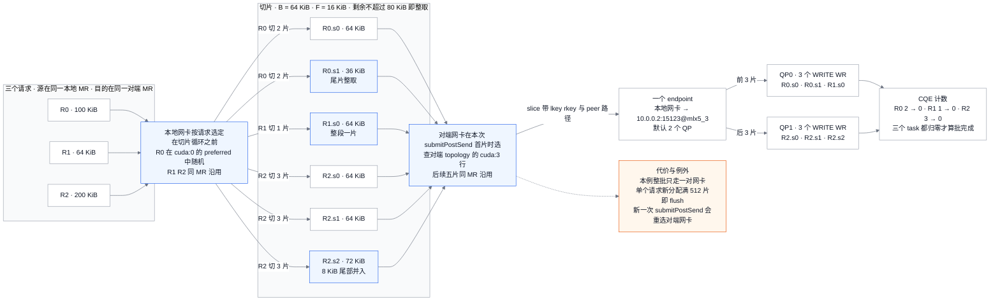
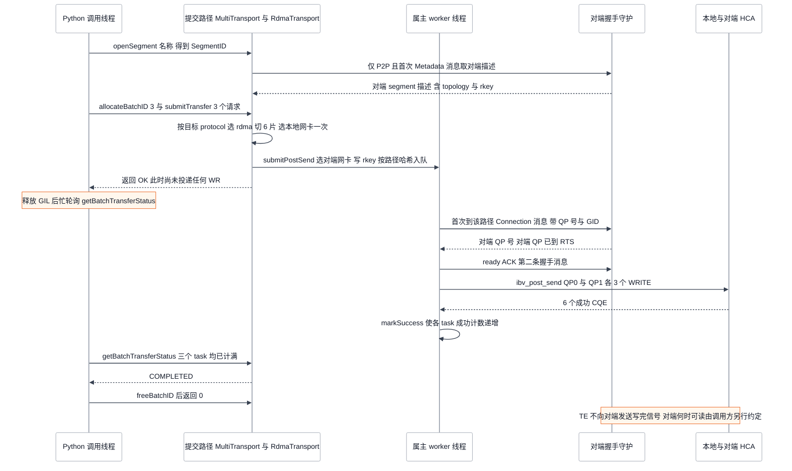
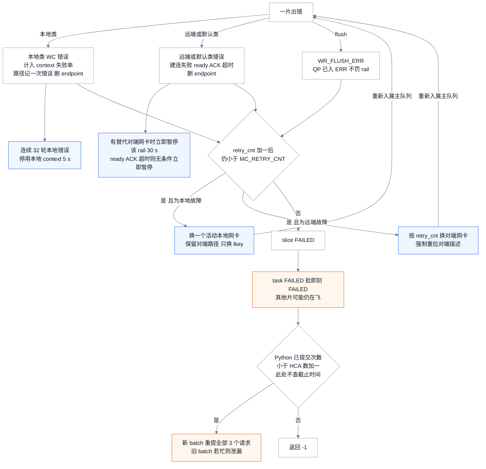

# Mooncake Transfer Engine：一次批量写如何切片、选路、计数完成与分层重试

> **源码基线**：`kvcache-ai/Mooncake@7d3a94e9d8c30abf02fcd64df218c16c1abc70df`（`main`，2026-09-24）
> **主题**：从 Python `batch_transfer_sync_write` 出发，跟踪经典 Transfer Engine（TE）如何发布 segment 与 MR、按 64 KiB 切片、按请求选本地与对端网卡、经 WorkerPool 投递到多 QP 并以 CQE 计数判定完成，再说明 slice、rail、context、整批四层重试与 Python 超时；最后界定 TENT 的选中条件与关键差异。核心目录为 `mooncake-transfer-engine/src/` 与 `mooncake-integration/transfer_engine/`。
> **适用范围**：经典 TE 的 RDMA 数据面、元数据与 Python 同步包装；TENT 只写到选择边界，厂商传输只列边界，Store 与 vLLM 如何调用 TE 分别归 11 与 20（未实跑 RDMA/多机，静态源码与测试核验）。
> **最近更新**：2026-09-24。新建页。

## 1. 三个 buffer 的一次同步写：六片、一对网卡、一个截止时间

P/D 分离时，prefill 节点要把一批 KV block 写进 decode 节点预先分配好的显存。block 之间地址不连续，数量又多；若每块都走一次 socket 拷贝，发送端和接收端的 CPU 都会被占住。Mooncake TE 的做法是：双方事先把大块内存注册成 RDMA memory region（MR），把每个 MR 的 `rkey` 发布到元数据里；发送端据此直接发 one-sided RDMA WRITE，接收端 CPU 在建连之后不再参与。TE 要解决的具体问题因此变成四件事：把一组 `(本地地址, 远端地址, 长度)` 切成 work request；为每段数据挑本地和对端网卡；判断何时算“写完”；失败时在哪一层、以多大粒度重来。

本页用下面这个**最小例子**贯穿全文。例子中的地址、网卡名与拓扑是便于复算的假设，算术与选路规则来自冻结源码：

- P 节点的 TE 以 `P2PHANDSHAKE` 初始化，已把 GPU0 上从地址 `A` 起的 1 GiB 显存注册成一个 MR，location 解析为 `cuda:0`；本地 topology 中 `cuda:0` 的 preferred 网卡为 `mlx5_0`、`mlx5_1`。
- D 节点的 segment 名是 `10.0.0.2:15123`，它也把 GPU3 上从 `B` 起的 1 GiB 注册为一个 MR，location 为 `cuda:3`，其 topology 中 `cuda:3` 的 preferred 只有 `mlx5_3`。
- P 调用 `batch_transfer_sync_write("10.0.0.2:15123", [A, A+100Ki, A+164Ki], [B, B+1Mi, B+2Mi], [100Ki, 64Ki, 200Ki])`，三个请求的源和目的各自落在同一个 MR 内。

先约定几个术语。**HCA** 即 RDMA 网卡，一个 HCA 对应一个 `RdmaContext`。**QP**（queue pair）是一条可靠连接上的发送/接收队列对。**WR**（work request）是投进 QP 的一条指令，本页中一个 WR 就是一次 RDMA WRITE。**SGE** 是 WR 携带的“本地地址 + 长度 + lkey”描述，本页每个 WR 只带一个。**CQ** 是完成队列，**CQE** 是其中的一条完成记录，报告某个 WR 成功或出错。**rail** 指“本地 HCA → 对端 HCA”这条路径，源码中以 `peer_nic_path`（`对端server@对端网卡`）按本地 context 区分。

冻结源码给出的结果如下，§5–§8 逐项复算：

| 问题 | 本例答案 | 决定它的规则 |
|---|---|---|
| 切成几片 | 100 KiB → 64+36；64 KiB → 64；200 KiB → 64+64+72，共 **6 片** | 剩余量不超过 64+16 KiB 时整段取走，尾部 8 KiB 并入最后一片（§5） |
| 本地网卡 | 第一个请求在 `{mlx5_0, mlx5_1}` 中随机选一个，另两个请求沿用同一 MR 的上次选择 | 选择以请求为单位，不按切片轮换（§6） |
| 对端网卡 | 第一片按 D 的 topology 在 `cuda:3` 的 preferred 中选中 `mlx5_3`，其余五片沿用 | 在同一次 `WorkerPool::submitPostSend` 调用中，同一 MR 的后续切片复用对端选择；本例只有一次这样的调用（§6） |
| 连接与 QP | 一个 endpoint（本地网卡 → `10.0.0.2:15123@mlx5_3`），默认 2 个 QP，各投 3 个 WRITE | `MC_NUM_QP_PER_EP=2`，按剩余 QP 均分（§7） |
| 何时算完成 | 三个 task 的未决片数分别从 2、1、3 降到 0，批状态才变为 `COMPLETED` | 发起端 CQE 计数；TE 不向对端发“写完”信号（§7） |
| 超时与重试 | 从调用开始计 30 s + 372,736 ns；slice 在 worker 内最多试 9 次，整批在 Python 内最多提交 `numContexts()+1` 次 | slice/rail/context 在 RDMA worker 内判定，整批与超时在 Python 包装内判定（§8） |

**中心结论**：经典 TE 把路径决定在**请求**粒度（本地网卡，同 MR 的后续请求沿用）和“同一次 `WorkerPool::submitPostSend` 调用里的同一 MR”粒度（对端网卡），用固定大小切片把请求拆成单 SGE 的 RDMA WRITE，以发起端 CQE 计数作为唯一的完成证据。这种“选一次、后面沿用”是基线前两天由 #4259 引入的：此前对端网卡逐片随机选取，项目为节省提交路径的 CPU 放弃了逐片选择（§6）。失败恢复分在两套互不知情的机制里：RDMA worker 在 slice 粒度换 rail 或换本地网卡，Python 包装在整批粒度重提；两者之间没有取消机制，只有 Python 的截止时间兜底。设计文档说“每个切片可能走不同路径”，这在 #4259 之前对对端一侧成立，在冻结基线上已不再成立；官方 wheel 的使用者可能以为能用 `MC_USE_TENT` 切到按片喷洒和跨协议 failover，这也与冻结源码不符，见 §6 与 §9。

阅读顺序：§2 先交代状态归谁、何时对对端可见；§3–§4 是初始化与注册；§5–§7 用本例走完数据面；§8 是失败与超时；§9 是 TENT 边界；§10 汇总文档与代码冲突；§11 是配置契约，§12 是源码阅读路线。

## 2. 状态归属：segment、endpoint 与 batch 各归谁

一次写涉及的状态分成三类：长期存在并对对端发布的内存描述、按网卡对建立的连接，以及只活在一次调用里的 batch。它们的所有者和可见时点都不同，后文的失败语义大多由这张表推出。

| 状态 | 所有者 | 何时建立 | 何时对对端可见 | 何时销毁 |
|---|---|---|---|---|
| 本地 segment 描述：`name`、`protocol`、`devices`（名字/LID/GID）、`topology` 矩阵、`buffers`（每个 MR 的 location、地址、长度、按本地 HCA 下标排列的 `lkey[]`/`rkey[]`） | `TransferMetadata` 中的 `LOCAL_SEGMENT_ID` | `RdmaTransport::install` 建壳，`registerLocalMemory` 追加 buffer | etcd/http：`updateLocalSegmentDesc` 把整份描述写到 `mooncake/ram/<segment>`；P2P：不发布，对端来拉时现场编码 | 注销内存或 `removeLocalSegment` |
| 对端 segment 缓存（`SegmentID` → 描述） | 发起端 `TransferMetadata` | `openSegment` → `getSegmentID` 首次拉取 | — | 默认永不过期；只在强制刷新或后台轮询时替换 |
| RPC 位置（握手用的 `ip:port`） | `TransferMetadata` 的 rpc_meta | `TransferEngineImpl::init` 调 `addRpcMetaEntry` | etcd/http：写 `mooncake/rpc_meta/<server>`；P2P：segment 名本身就是 `ip:port` | 引擎释放 |
| MR | 每个本地 HCA 的 `RdmaContext` | 注册时在**每个**本地 HCA 上各注册一次 | 通过描述中的 `rkey[]` | 注销 |
| endpoint（本地 HCA × 对端 `server@nic` 路径，含 N 个 QP） | 该 HCA 的 `EndpointStore`（默认 SIEVE） | 第一片发往该路径时惰性创建并握手 | 握手完成、ready ACK 之后 | 被淘汰或出错时进入 `waiting_list_`，在途 WR 排空后回收 |
| `BatchDesc` / `TransferTask` / `Slice` | 调用方持有 batch；slice 在 CQE 之前由 worker 队列与 QP 引用 | `allocateBatchID`、`submitTransfer` | 不发布 | `freeBatchID`，且仅当所有 task 均已收尾；否则返回 `BatchBusy`、不释放 |

**元数据后端**只有三种可走。`TransferMetadata` 的构造函数先把连接串拆成 `协议://地址`；不带 `://` 的串默认视为 `etcd`，字面值 `P2PHANDSHAKE` 则进入点对点模式。

- **`P2PHANDSHAKE`**：不需要外部服务。本地 RPC 端口在 `[MC_MIN_RPC_PORT, MC_MAX_RPC_PORT]`（默认 15000–17000）中随机挑选，segment 名被改写为 `本机IP:端口`；`openSegment` 通过 TCP 向对端守护进程发一条 `Metadata` 类型消息，现场取回对端描述。
- **etcd / http(s)**：segment 描述与 rpc_meta 写成两个键，对端按键读取。`MC_METADATA_CLUSTER_ID` 可在 `mooncake/` 之后插入一级前缀，用来隔离集群。
- **redis**：源码中有 `RedisStoragePlugin`，但 `USE_REDIS` 默认关闭，任何 release wheel 都没打开它。在这些 wheel 上传入 `redis://…`，会落到 `MetadataStoragePlugin::Create` 末尾的 `LOG(FATAL)`，进程直接终止，不会退回到其他后端。

etcd 也不是每个 wheel 都有：`.github/workflows/_build-wheel.yaml` 中，x86_64 的 cuda、cuda13、non-cuda 与 arm64 的 non-cuda 四个 profile 带 `-DUSE_ETCD=ON`，arm64 的 cuda 与 cuda13 两个 profile 只带 `-DUSE_HTTP=ON`。在后两种 wheel 上传入 etcd 地址（包括不带 `://`、按默认解析为 etcd 的地址），同样会触发 `LOG(FATAL)`。

对端描述默认一经取到就一直缓存（`metacache=true`）。只有三条路会刷新它：`WorkerPool::submitPostSend` 为某片选不到对端网卡时强制重拉一次；`redispatch` 在远端故障后强制重拉；`MC_TE_METADATA_REFRESH_INTERVAL_SECONDS` 大于 0 时启用后台轮询。对端先注册新内存、本端再写这块内存时，第一种路径能兜住。对端重启后若沿用同一个名字，本端的旧 `rkey` 要等到出现 WC 错误、进入 `redispatch` 时才会被换掉。

## 3. 初始化：选中的是经典 TE，协议参数不决定传输

**引擎选择在编译期就有一道闸。** `mooncake-transfer-engine/src/transfer_engine.cpp` 整体包在 `#ifndef USE_TENT … #else … #endif` 中。未定义 `USE_TENT` 时，编译出的 `TransferEngine` 只有经典实现，根本不读 `MC_USE_TENT`；定义了 `USE_TENT` 时，构造函数才检查 `getenv("MC_USE_TENT") || getenv("MC_USE_TEV1")`，只要变量存在（值任意）就把 `use_tent_` 置真。`USE_TENT` 在 `mooncake-common/common.cmake` 中默认为 `OFF`。仓库 workflow 里只有 `ci.yml` 的 TENT 测试任务传 `-DUSE_TENT=ON`，另外 `docker/xpu.Dockerfile` 也打开了它；`release.yaml` 调用的 `_build-wheel.yaml` 在全部六个 profile 中都没有这个开关。因此 PyPI 包 `mooncake-transfer-engine`（模块 `mooncake.engine`）一律走经典路径，设置 `MC_USE_TENT` 既不生效也不报错。

**`protocol` 参数在经典路径上被丢弃。** 经典分支的 `TransferEngine::init(…, protocol)` 第一行就是 `(void)protocol`。Python 端 `TransferEnginePy::initializeExt` 只在三处使用这个字符串：由 `initMemoryAllocator` 决定 `allocate_managed_buffer` 用哪种分配器（`"rdma"`、`"tcp"` 都落到 64 KiB 对齐的 `posix_memalign`）；在 `USE_EFA`、`USE_CXI` 构建里显式安装 efa/cxi 传输；以及 `"flagcx"` 的安装。于是在一台有 HCA 的标准 CUDA 机器上，`initialize(…, "tcp", …)` 照样装的是 RDMA；想强制走 TCP，只能设 `MC_FORCE_TCP`。每次调用的 `transport_hint` 在非 TENT 构建里被 `parseTransportHint` 解析为 0，经典 TE 从不读取这个字段。

**实际装哪种传输，由 `TransferEngineImpl::init` 按构建宏和环境变量决定。** 函数先绑定 RPC 端口：P2P 走 §2 的随机端口；etcd/http 取 `MC_TCP_BIND_ADDRESS` 或第一个 LAN 地址，端口同样随机，再发布 rpc_meta。然后依次判断：

1. 设了 `MC_FORCE_TCP`：只装 TCP，直接返回。
2. 设了 `MC_FORCE_SHM`（非空，且不是 `0`、`false`、`no`、`off`）：未定义 `ENABLE_MULTI_PROTOCOL` 时只装 SHM，直接返回。该宏默认关闭，官方 wheel 也没打开，所以在 wheel 上这就是 SHM-only；打开该宏的构建则继续往下走，最后再追加安装 SHM。
3. 否则发现拓扑：用 `MC_CUSTOM_TOPO_JSON` 指定的文件，或调 `Topology::discover`，后者受 Python `device_name` 过滤表和 `MC_TE_FILTERS` 白名单约束。
4. 按构建选择分支。x86_64 CUDA wheel（含 cuda13 变体）带 `-DUSE_INTRA_NVLINK=ON`，arm64 CUDA wheel 带 `-DUSE_MNNVL=ON`，两者都进入 NVLink 分支：设了 `MC_INTRANODE_NVLINK` 就装节点内 NVLink；MNNVL 构建在被强制或没有 HCA 时装 MNNVL；有 HCA（或设了 `MC_FORCE_HCA`）时**直接**装 `"rdma"`；以上都不满足时装 TCP。其他构建在有 HCA 且未强制 TCP 时，调用 `autoDiscoverTransport()` 在 barex、efa、rdma_twosided、rdma 之间选一个。

由此推出一个文档没写的限制（分析推断，依据是代码结构与构建参数）：`MC_USE_RDMA_TWOSIDED` 只在 `autoDiscoverTransport()` 中读取，而官方 CUDA wheel 走的 NVLink 分支不会调用它，所以这个开关在官方 CUDA wheel 上不起作用。

`RdmaTransport::install` 为 topology 中每个 HCA 构造一个 `RdmaContext`；构造失败的 HCA 会被 `disableDevice` 移出候选列表，但在原下标处保留一个非活动占位对象，使 `lkey[]`/`rkey[]` 的下标依然对得上。随后它建好 segment 描述（`protocol="rdma"`、设备列表、topology），启动握手守护，并发布描述。

每个请求走哪个传输，看的是**目标** segment 的 `protocol` 字段：`MultiTransport::selectTransport` 用 `metadata_->getSegmentDescByID(target_id)->protocol` 在本地 `transport_map_` 中查同名传输。本地没有同名传输时返回 `NotSupportedTransport`，整批一个请求都不提交（`tests/multi_transport_batch_test.cpp::BatchRouting.UnsupportedTargetDoesNotPartiallySubmit`）。经典 TE 在这里**没有跨协议回退**：一端是 rdma、另一端只装了 tcp，两端之间就传不通。

## 4. 注册：把地址范围变成对端可用的 rkey

`batch_register_memory` 释放 GIL 后调用 `TransferEngineImpl::registerLocalMemoryBatch`；单个 `register_memory` 不释放 GIL，走的是 `registerLocalMemory`。两条路线的前置检查相同：长度为 0 返回 `ERR_INVALID_ARGUMENT`；地址范围先在 `local_memory_regions_` 中做重叠预留，与已注册区域重叠则返回 `ERR_ADDRESS_OVERLAPPED`；然后逐个已安装传输调用注册，任一传输失败就把已成功的传输逆序回滚，并释放预留。

`RdmaTransport::registerLocalMemoryInternal` 做四件事，每件都影响后面的选路：

- **location**：调用方传通配符时，用 `getMemoryLocation` 只看首页，CPU 内存解析为 `cpu:<NUMA>`，GPU 内存解析为 `cuda:<id>`。这个名字就是 topology 矩阵的行键，选网卡时查的正是它。
- **每个 HCA 都注册一次**：同一块内存在每个 `RdmaContext` 上各注册一个 MR，因此 `lkey[i]`/`rkey[i]` 的下标就是 HCA 下标。任何本地网卡都能读这块内存，任何对端网卡都能用对应的 `rkey` 写它。这是后面换 rail、换本地网卡时不必重新注册的前提。
- **按 `max_mr_size` 分块**：超过上限（默认 `0x10000000000`，即 1 TiB，另受设备 `max_mr_size` 约束）的缓冲会被拆成多个 MR，每块发布一个 `BufferDesc`，避免 `ibv_reg_mr` 静默截断。GPU 内存只导出一次 dma-buf fd，供所有 HCA 共用。
- **只发布一次**：各分块先用 `addLocalMemoryBuffer(…, false)` 加入本地描述，最后统一 `updateLocalSegmentDesc`；中途失败时按分块回滚 MR 和描述。P2P 模式下这一步直接返回 0，对端要等到下次拉取时才看到新 buffer。

注册成功只说明本地描述已更新（etcd/http 模式下还已写入存储）。对端是否看见，取决于它的缓存何时刷新（§2）。

## 5. 切片：64 KiB 块、尾片合并与 MR 边界

`RdmaTransport::submitTransferTask` 对每个请求从偏移 $o=0$ 开始循环，由 `SliceLengthCalculator::calculate` 给出每片长度。设请求长度为 $L$，块长 $B$ 取 `slice_size`（默认 65536），碎片阈值 $F$ 取 `fragment_limit`（默认 16384）：

$$
\ell_{0}(o)=
\begin{cases}
L-o, & L-o\le B+F,\\
B, & \text{otherwise},
\end{cases}
$$

$$
\ell(o)=\min\bigl(\ell_{0}(o),\ R_{\mathrm{src}}(o),\ R_{\mathrm{dst}}(o)\bigr),\qquad o\leftarrow o+\ell(o).
$$

$R_{\mathrm{src}}(o)$ 与 $R_{\mathrm{dst}}(o)$ 分别是源地址、目的地址所在 MR 到该 MR 末尾的剩余字节，由 `bytesUntilBufferEnd` 算出。找不到覆盖该地址的 MR 时，这一项不参与取最小值。第一行是**尾片合并**：剩余量不超过 $B+F$ 就一次取完，避免拖出一个很小的尾片；第二行是**不跨 MR**：一片绝不越过任一侧 MR 的边界，因为一个 WR 只能携带一组 `lkey`/`rkey`。

本例中 $B+F=80$ KiB，三个请求的源和目的都在同一个 MR 内，MR 边界不起作用：

| 请求 | 偏移处剩余 | 规则 | 切片 |
|---|---|---|---|
| R0，100 KiB | 100 超过 80 → 取 64；剩 36 不超过 80 → 整取 | 普通块 + 尾片 | 64、36 |
| R1，64 KiB | 64 不超过 80 → 整取 | 整段一片 | 64 |
| R2，200 KiB | 200 → 64；136 → 64；72 不超过 80 → 整取 | 两个普通块 + 合并尾片（64+8） | 64、64、72 |

共 6 片，`task.slice_count` 分别为 2、1、3，`total_bytes` 合计 364 KiB（372,736 字节）。**同一个请求可以跨 MR，切片不可以。** 请求级选网卡要求整个请求落在一个 MR 内（`bufferCoversRange`），不满足时退回逐片选择（§6）。某片的源地址不在任何已注册 MR 中时，`fail_task_and_cleanup` 把这一片、所有尚未投递的片以及后续 task 一并标为失败（后续 task 各插入一个零长失败片以驱动计数），并返回 `AddressNotRegistered`。`tests/rdma_transport_submit_task_test.cpp::SubmitTransferTaskTest.PartialSubmitFailsBatch/PartialSubmitFailsAllTasks` 用一个 2×64 KiB 的请求对着 64 KiB 的 MR 复现了这一点：第一片停在 MR 边界，第二片找不到 MR。

有一个配置陷阱：`fragment_limit` 只有在设置 `MC_FRAGMENT_RATIO` 时才按 `slice_size / ratio` 重新计算。只改 `MC_SLICE_SIZE` 时，它仍是绝对值 16 KiB，尾片合并阈值因此变成“新块长 + 16 KiB”，而不是按比例缩放。

网卡对既然已经定死，为什么还要切片？源码没有写明理由，以下是**分析推断**：一是切片后才能按 §7.2 把同一请求分散到多个 QP；二是 slice 是 worker 内重试与换 rail 的单位（§8），切得小，失败时只需重发 64 KiB 而不是整个请求；三是单个 WR 的长度有上限，WR 长度也影响 CQ 完成的节奏。

<!-- Figure spec: 问题=同一最小例子如何从三个请求变成六个 WRITE WR，以及网卡在哪一步选定；类型=原理图（本地选网卡→切片算术→对端复用→QP 均分）；实体=R0/R1/R2、本地网卡选择、六个切片（标长度与规则）、对端网卡选择、endpoint、QP0/QP1、CQE 计数、flush 代价框；关系=请求→按请求选本地网卡→切片→同一 submitPostSend 内复用对端网卡→均分到两个 QP→按 task 计数；图独有信息=本地网卡在切片循环之前按请求选定、尾片合并落在哪三片、3+3 的 QP 划分、对端网卡只在新一次 submitPostSend 时重选；阅读顺序=左到右；证据=RdmaTransport::submitTransferTask、SliceLengthCalculator::calculate、selectDeviceImpl、WorkerPool::submitPostSend、RdmaEndPoint::submitPostSend；数值=本页声明的例子；验证=Mermaid 语法人工逐行检查。 -->

图中蓝色节点是两条决定性规则：尾片整取，以及网卡选一次再复用。本地网卡在切片循环开始之前按请求选定，所以图中“选本地网卡”排在切片前面。橙色框是这种设计的代价与例外，§6 末尾给出 flush 的精确条件。均分的前提是 QP 深度和 CQ 余量都足够，QP 已满时的背压见 §7.2。

## 6. 选网卡：本地按请求，对端按提交内的 MR 复用

**topology 矩阵是选路的输入。** `Topology::discover` 为每个 NUMA 节点生成 `cpu:N` 行：与该节点同 NUMA 的 HCA 进 preferred，其余进 avail。CUDA 构建还用 `discoverCudaTopology` 为每块 GPU 生成 `cuda:N` 行：先在与 GPU 同 NUMA 的 HCA 中找 PCIe 路径距离最小的一组放进 preferred（同 NUMA 没有 HCA 时在全部 HCA 中找），其余 HCA 进 avail。`resolve()` 把名字换成 HCA 下标，并生成通配行 `*`。整个矩阵随 segment 描述一起发布，对端选网卡时读的就是这份矩阵。

`Topology::selectDevice(location, retry_count)` 的规则很简单：

- `retry_count == 0`：在 preferred 中取随机数模长度，随机源是线程局部的 `SimpleRandom`；设 `MC_PATH_ROUNDROBIN=1` 时改用线程局部计数器轮转。preferred 为空时退到 avail。
- `retry_count > 0`：确定性遍历。记 $r$ 为 `retry_count`，$P$、$A$ 为该行的 preferred 与 avail 列表，取两者拼接后的第 $(r-1) \bmod (\lvert P\rvert+\lvert A\rvert)$ 个（从 0 起数）。只有这时才会用到 avail 中的网卡。

**本地网卡按请求选一次。** `submitTransferTask` 在进入某个请求的切片循环**之前**，为该请求调用一次 `selectDevice(local_desc, source, length, …, retry=0, hint_buffer, hint_device)`。`selectDeviceImpl` 中有一条复用规则：命中的 MR 与上一个请求相同、location 不是按偏移解析的 `segments:` 形式、且 `retry_count == 0` 时，直接沿用上次的网卡下标，不再重新随机。这些“上次”变量在整个 `submitTransferTask` 调用内有效，所以一次调用写同一个 MR 时，本地网卡在整个调用中固定不变。本例 R0 随机选到比如 `mlx5_1` 后，R1、R2 都沿用它，六片全部挂到 `mlx5_1` 的 `RdmaContext`。#4279 引入的 `BatchRdmaDeviceCache` 只在描述中只有一个 HCA 时生效，不改变多网卡时的结论。逐片选择只在两种情况下出现：请求跨 MR，或请求选中的网卡已被标为非活动；这时第一次尝试用 `retry=0`，之后按 `retry_cnt++` 确定性遍历。`tests/rdma_buffer_range_index_test.cpp::BufferRangeIndex.LastHitReusesHintDevice/DeviceHintDoesNotFollowBufferJump` 分别钉住了“同 MR 沿用”和“换 MR 重选”。

**对端网卡在 `WorkerPool::submitPostSend` 中选。** 这个函数运行在调用线程上，逐片执行 `selectPeerDevice`：用**对端**描述中的 topology，查目的地址所属 buffer 的 location（本例是 `cuda:3`）。默认既没有 hint，也没有亲和表；设 `MC_ENABLE_DEST_DEVICE_AFFINITY` 后，本地网卡名作为 hint，对端有同名网卡就选它（适合 rail 对齐的组网）；设 `MC_ENABLE_HCA_PEER_AFFINITY` 后，按 `MC_NIC_PEER_AFFINITY` 给出的“本地 HCA=对端 HCA 列表”映射选择。两个开关同时打开时都被关闭，并打 ERROR 日志。对端选择同样按 `(last_buffer_id, last_device_id)` 复用，但这两个变量是 `submitPostSend` 的**函数局部变量**，每次调用都从 -1 开始，`BatchRdmaDeviceCache` 也是新建的。所以本页所说的“同一次提交”，精确含义是**同一次 `WorkerPool::submitPostSend` 调用**：在这次调用里，同一目的 MR 的后续片沿用首片的选择；换一次调用就重新随机。选中的 rail 若处于暂停（§8），就在该 buffer 有 `rkey` 的其余对端网卡中找第一个可用的；一个也找不到则该片直接失败。第一次选不到时，会用 `getSegmentDescByID(target, true)` 强制重拉对端描述，再试一次。

**一次调用里 `submitPostSend` 会被调用几次。** `submitTransferTask` 把切片按本地 context 攒在 `slices_to_post` 中，结束时对每个 context 调用一次 `submitPostSend`。此外还有一个中途 flush：当 `nr_slices` 达到水位 `kSubmitWatermark = max_wr × num_qp_per_ep`（默认 256×2=512）时，立即把已攒的片交出去。这个计数有两个限制条件：它在**每个请求开始时清零**，而且只统计新分配的切片（`from_cache == false`），调用线程的线程局部缓存最多可回收 4096 个切片。因此，只有单个请求**新分配**的切片达到 512 个时才会中途 flush：冷缓存下约 32 MiB 就会触发；缓存是热的时，要切出比缓存可回收数多 512 片才触发（缓存满时约 4608 片，默认块长下约 288 MiB），每次 flush 都对应一次新的 `submitPostSend`，也就是一次对端网卡的重新随机；本地网卡的沿用提示则跨 flush 保留。本例的三个小请求远达不到水位，全程只有结尾那一次 `submitPostSend`。

**为什么改成“选一次、后面沿用”。** 这个行为是基线前两天才合入的。#4259（`4336273a`，2026-09-22）之前，`WorkerPool::submitPostSend` 对每一片都调用 `pickTopologyDevice`，在 preferred 中随机取一个对端网卡；本地网卡虽然也是按请求选，但每个请求各自随机，请求之间不沿用。该提交说明的理由是提交路径的 CPU 开销：同一 MR 的连续切片每次都要重新解析 location 字符串、遍历 topology 表，而 #4132 已经先探测了上一次命中的 buffer，剩下的开销就在这一步。被放弃的方案是**逐片按 topology 随机选网卡**，判据是**提交路径的 CPU 开销**。提交说明没有讨论这对多网卡分摊的影响，以下是**分析推断**：逐片随机能把一次调用的切片摊到对端 preferred 列表中的多块网卡上，改为沿用之后，这种分摊只能来自多次 `submitPostSend` 调用、多个 MR 或 location，以及多个调用线程的并发。

> [!contradiction] 设计文档与冻结源码
> `docs/source/design/transfer-engine/index.md` 的 Topology Aware Path Selection 一节写道，超过 64 KB 的请求被切片后，每片“might use a different path”，以此让所有 RDMA 网卡协同工作。#4259 之前，这句话对**对端一侧**成立：对端网卡确实逐片随机选取。本地网卡在 #4259 之前也是按请求选定的，那时同样不存在逐片的本地路径变化。冻结基线上，同一请求的各片只有在 redispatch、逐片回退或跨越一次 flush 时才会换路径。真正的按片喷洒是 TENT 的设计（§9）。

由此得到一个**分析推断**：在冻结基线上，一次只写一个 MR、且没有触发 flush 的调用最多用满一对网卡；新分配切片达到水位的大请求会在每次 flush 时重选对端网卡，但本地网卡仍然固定。README 中“4×200 Gbps 下 87 GB/s、8×400 Gbps 下 190 GB/s”这组数字最早出现在 `348afd75`（2024-11-27，`git log -S`），`c1a3665b6`（2026-06-10）只是最后一次改动该行，两者都早于 #4259。所以这组数字测于 #4259 之前、对端网卡按片选取的时期（#4259 前一刻逐片随机已由其 diff 证实，2024-11 当时的选路代码本页未逐版核对），不能拿来推断冻结基线上单次调用的带宽；仓库中也找不到对应的 tebench 配置或脚本，只能当作项目声明。

## 7. 投递与完成：从 worker 队列到 CQE 计数

### 7.1 提交返回时，还一片都没发出去

`submitTransferTask` 把 6 片按本地 context 分组，调用 `RdmaContext::submitPostSend`，也就是 `WorkerPool::submitPostSend`。后者解析 `dest_rkey` 和 `peer_nic_path`（形如 `10.0.0.2:15123@mlx5_3`），再按 `std::hash(peer_nic_path) % workers_per_ctx` 把片放进**属主线程**的队列（默认每个 HCA 两个传输线程，另有一个监控线程），然后返回。所以 `submitTransfer` 返回 OK 只说明切片、选路和入队都已完成，还没有任何 WR 被投递。同一路径的所有片始终由同一个属主线程投递，该线程也负责轮询与之配对的 CQ：`cqIndexForPostingThread` 把线程 i 映射到 CQ i，`MC_NUM_CQ_PER_CTX` 在初始化时会被抬高到不少于 `workers_per_ctx`。

属主线程的 `transferWorker` 在“已提交数不等于已处理数、或 CQ 仍有未完成项”时循环执行 `performPostSend` 与 `performPollCq`；空闲超过 100 ms 后在条件变量上最多挂起 1 s。`performPostSend` 依次处理每条路径上的片：

1. 路径处于暂停（rail 暂停，或 `MC_CONN_PAUSE_TTL_MS` 设置的重连冷却）时，本批片直接进入失败列表，按 §8 的 slice 级规则重派。
2. 用 `RdmaContext::endpoint(peer_nic_path)` 取 endpoint，没有就在 `EndpointStore` 中插入一个新的，构造 `MC_NUM_QP_PER_EP` 个 RC QP。容量达到 `max_ep_per_ctx` 时按 SIEVE（默认）或 FIFO 淘汰；被淘汰的 endpoint 先 `beginDestroy`，把 QP 转入 ERR 以冲刷在途 WR，放进 `waiting_list_`，待 WR 排空后才由 `reclaimEndpoint` 真正释放。
3. endpoint 未连接时进行主动握手（§7.3）。握手在进程级的 8 线程执行器中运行，属主线程在等待期间继续排空 CQ。
4. endpoint 处于 `CONNECTED_WAIT_READY_ACK` 时本轮跳过，下轮再试；等待超过 10 s 则暂停该 rail、删除 endpoint。
5. 调用 `RdmaEndPoint::submitPostSend` 投递。

### 7.2 多 QP 均分与背压

`RdmaEndPoint::submitPostSend` 按 QP 顺序切连续的块，每块大小为“剩余片数 ÷ 剩余 QP 数”向上取整，再受两个上限约束：该 QP 剩余深度 `max_wr − wr_depth`，以及 CQ 余量 `max_cqe − cq_outstanding`。本例 6 片、2 个 QP、深度充足，于是 QP0 分到前 3 片，QP1 分到后 3 片。每个 WR 只有一个 SGE，opcode 为 `IBV_WR_RDMA_WRITE`（读请求用 READ），带 `IBV_SEND_SIGNALED`；`wr_id` 就是 `Slice*`，投递时打上时间戳 `ts`，状态置为 `POSTED`。某个 QP 已满时跳到下一个 QP；所有 QP 都满或 CQ 已满时，没投出去的片**留在属主线程的队列里**，下一轮循环再投。这就是经典 TE 的背压方式，不会因为队列满而让片失败。`ibv_post_send` 返回错误时，`bad_wr` 及其之后的片进入失败列表，按 §8 的 slice 级规则处理。

### 7.3 握手：一次 TCP JSON 往返，外加一次 ready ACK

所有控制面报文都走 `SocketHandShakePlugin`：每条消息新建一个 TCP 连接，发送一个带类型标签的 JSON 帧，类型分为 Connection、Metadata、Notify、Probe。主动方的 `RdmaEndPoint::setupConnectionsByActive` 发出本端的 `local_nic_path`、`peer_nic_path`、QP 号列表与 GID/LID。被动方的守护进程在 `RdmaTransport::onSetupRdmaConnections` 中按 `peer_nic_path` 里的网卡名找到本地 context，为发起方路径取出或创建 endpoint，再由 `setupConnectionsByPassive` 把 QP 推进到 RTR/RTS 并回复自己的 QP 号。主动方随后把自己的 QP 推进到 RTS，进入 `CONNECTED_WAIT_READY_ACK`，再发一条 `ready_ack=true` 的第二条握手消息；发送成功后置为 `CONNECTED`，被动方收到这条消息时也置为 `CONNECTED`。自动 GID 在 RTR 阶段失败时，按 `MC_AUTO_GID_MAX_RETRIES`（默认 2）重新探测 GID 再握手。出站连接的超时由 `MC_HANDSHAKE_CONNECT_TIMEOUT` 控制（默认 5 s）。

<!-- Figure spec: 问题=一次同步批写在调用线程、提交路径、属主 worker、对端守护与 HCA 之间的先后与完成可见点；类型=时序图；实体=Python 调用线程、MultiTransport/RdmaTransport 提交路径、WorkerPool 属主线程、对端握手守护、本地与对端 HCA；关系=openSegment 取描述→提交入队→首次握手两段→投递→CQE→计数→轮询看到完成→释放 batch；图独有信息=submit 返回早于 post、握手发生在 worker 而非调用线程、TE 不给对端发完成信号；证据=TransferEnginePy::batchTransferSync、MultiTransport::submitTransfer/getBatchTransferStatus、RdmaTransport::submitTransferTask、WorkerPool::submitPostSend/performPostSend/performPollCq、RdmaEndPoint::setupConnectionsByActive、TransferMetadata::getSegmentDescInternal；验证=Mermaid 语法人工逐行检查。 -->

### 7.4 “完成”的六个台阶

同一个“完成”在不同层有不同的证据。本例中它们依次出现：

| 台阶 | 证据 | 所在代码 | 说明 |
|---|---|---|---|
| 已提交 | `submitTransfer` 返回 OK | `MultiTransport::submitTransfer` | 6 片已切好、入队；尚未投递 |
| 已投递 | `slice->status=POSTED`，`ts` 置为当前时间 | `RdmaEndPoint::submitPostSend` | 两个 QP 的深度各加 3，CQ 未完成数加 6 |
| 片完成 | 成功 CQE 被属主线程取走 | `WorkerPool::performPollCq/processCompletions` | `Slice::markSuccess` 原子递增 `success_slice_count` 与 `transferred_bytes`；QP 深度与 CQ 未完成数回减到 0 |
| task 完成 | `success + failed == slice_count` | `RdmaTransport::getTransferStatus` | 本例三个 task 依次满足 2/2、1/1、3/3，并置 `is_finished` |
| 批完成 | 所有 task 都 `COMPLETED` | `MultiTransport::getBatchTransferStatus` | 置 `status_cached`；带 notify 的提交此时才由上层 `TransferEngineImpl::getBatchTransferStatus` 发送通知 |
| 调用返回 | Python 看到 `COMPLETED` 后 `freeBatchID` 并返回 0 | `TransferEnginePy::batchTransferSync` | 释放 `BatchDesc` 与切片 |

最后还差一级：**对端可读**。RC 语义下，WRITE 的成功 CQE 表示响应端 HCA 已确认这个 WR；数据何时对对端的 GPU 或 CPU 可见、是否需要额外的 fence，属于 verbs 与硬件的合同，TE 源码没有在此之上再做任何保证。TE 也不会主动通知对端。只有调用 `submitTransferWithNotify` 时，才会在**发起端轮询**看到批完成之后发出一条 notify。发送点在 `TransferEngineImpl::getBatchTransferStatus`；`TransferEngineImpl::getTransferStatus` 在某个 task 完成时也会顺带调用它，但只有整批 `COMPLETED` 才真正发送，且每批只发一次。发送走 `TransferEngineImpl::sendNotifyByName`：`MC_RDMA_NOTIFY_ENABLED`（默认开启）关闭时直接走 TCP 带外通道；开启时，若装的是 rdma_twosided，RDMA 通知任何失败都会在 `MC_RDMA_NOTIFY_OOB_FALLBACK`（默认开启）下退回带外通道；若装的是经典 `RdmaTransport`，只有返回 `ERR_NOT_IMPLEMENTED`（对端不支持或消息过大）时才退回，QP 故障等其他错误直接返回。`batch_transfer_sync_write` 不带 notify，对端何时可以消费这些 KV 要由上层自行约定，vLLM 的做法见 [[20_mooncake_vllm_integration_analysis]]。

`MultiTransport::getBatchTransferStatus` 有一个会影响失败语义的细节：扫描过程中只要遇到一个 `FAILED` 或 `TIMEOUT` 的 task 就立即返回批 `FAILED`，**不等**其他 task 收尾。这种提前返回的后果见 §8.3。

## 8. 失败与重试：四层判定，没有取消

### 8.1 每一层管什么

| 层 | 触发 | 粒度 | 预算与冷却 | 动作 |
|---|---|---|---|---|
| 提交前 | 找不到目标描述、协议不匹配 | 整批 | 不重试 | `selectTransports` 失败，整批不提交；Python 返回 -1 |
| 提交中 | 源地址不在任何本地 MR，或没有可用的活动本地网卡 | 当前 task 中尚未交给 worker 的片与后续 task | 不重试 | 标失败并返回 `AddressNotRegistered`（竞态下也可能是 `InvalidArgument`）；已在水位 flush 时交出去的片继续飞行；Python 不轮询就调用 `freeBatchID`，返回 -1，**不进入**整批重提 |
| slice | WC 错误、建连失败、ready ACK 超时、`ibv_post_send` 失败 | 单片 | `retry_cnt` 先加一再与 `MC_RETRY_CNT`（默认 9）比较，片的初值取请求的 `advise_retry_cnt` | 远端或默认类错误：删除 endpoint，按 `retry_cnt` 在对端网卡中确定性换一个；本地类 WC 错误（`LOC_*`、`MW_BIND`）：换一个活动的本地网卡，保留对端路径，只替换 `lkey`；`WR_FLUSH_ERR`：不罚 rail，本地 context 仍活动时按远端策略重派，否则换本地网卡 |
| rail（本地网卡 × 对端网卡路径） | 同一路径累计 5 次错误，计数只在相邻两次错误间隔超过 5 s 时清零（不是滑动窗口）；存在替代对端网卡时第一次错误就触发；ready ACK 超时不论有无替代都立即触发 | 路径 | 暂停 `MC_RDMA_RAIL_PAUSE_SECONDS`（默认 30 s），到期自动恢复 | 暂停期间发往该路径的片改选其他对端网卡；没有可选网卡则失败 |
| context（本地网卡） | 连续 32 轮含本地类错误的完成处理（中间出现成功即清零）；异步事件 `DEVICE_FATAL`、`PORT_ERR` 等 | 本地 HCA | 前者停 `MC_CONTEXT_PAUSE_TTL_MS`（默认 5000 ms）后半开恢复；后者在收到 `PORT_ACTIVE` 后再等 `kContextRecoveryDelayNs`（30 s），GID 探测成功才恢复 | 队列中的片交给其他本地网卡；发布的 topology 同步刷新 |
| 整批（Python） | 批状态为 `FAILED`（`MultiTransport::getBatchTransferStatus` 已把 task 级 `TIMEOUT` 映射为批 `FAILED`，所以 Python 批级路径中的 `TIMEOUT` 分支是死代码） | 整批全部请求 | 最多 `numContexts()+1` 次（经典路径下为本地 HCA 数 + 1）；截止时间只在轮询等待期间检查 | 新建 batch，重新提交**全部**请求，包括已经写成功的；FAILED 后不检查截止时间就重提 |

slice 级重试完全在 RDMA worker 内部完成，Python 看不到；只有预算耗尽时，片才以 `markFailed` 计入 `failed_slice_count`。rail 与 context 是两个方向相反的熔断器：远端问题暂停对端路径、换对端网卡，本地问题停用本地 context、换本地网卡。`tests/worker_pool_rail_state_test.cpp::WorkerPoolRailStateTest.RepeatedFailuresPauseRail/ImmediatePauseStillPausesOnFirstError/StaleErrorsDoNotAccumulate/LocalFailuresTripContextAtThreshold/BreakerReactivatesAtDeadline` 覆盖了这些阈值和恢复。经典 TE 的故障转移**只在 RDMA 内部换 rail**，不会从 RDMA 转到 TCP 或其他协议。

<!-- Figure spec: 问题=一片失败后按什么顺序被判定、在哪一层消化或上抛；类型=决策流程图；实体=失败事件三类、slice 预算判断、换对端网卡/换本地网卡两条恢复、rail 与 context 熔断、task/批 FAILED、Python 整批重提与截止时间；关系=从 worker 内部恢复到 Python 层重提的逐层上抛；图独有信息=本地与远端故障走相反方向、FAILED 早返回时其他片仍在飞、整批重提会重写已成功的请求；证据=WorkerPool::processCompletions/redispatch/tryHandoffToAnotherLocalWorker/markRailFailed/markLocalContextFailure、MultiTransport::getBatchTransferStatus、TransferEnginePy::batchTransferSync；验证=Mermaid 语法人工逐行检查。 -->

图中两条回边表示重派的片重新进入属主队列，下一次出错时再走一遍判定，并不是说一定会再失败。Python 的判断框只看提交次数：截止时间只在轮询 `WAITING` 时检查，不在这个分支上。蓝色节点在 RDMA worker 内部消化故障；橙色节点是故障上抛到批和 Python 层之后带来的副作用。

### 8.2 超时只在 Python 层判定

经典 TE 自身默认**不会**把一片判为超时。`MC_SLICE_TIMEOUT` 默认为 -1；只有设为正数秒时，`MultiTransport::getTransferStatus` 才会把投递时间 `ts` 早于该阈值、仍在等待的 task 报成 `TIMEOUT`，而即便如此在途的 WR 也不会被撤销。`WorkerPool::monitorWorker` 在 CQ 未完成项停留 30 s、或轮询间隔超过 5 s 时只打诊断日志；打开 `MC_TRACK_RDMA_POSTED_SLICES` 后，日志会按对端路径列出卡住的片，但同样不改变任何状态。

截止时间由 `TransferEnginePy` 决定。构造时读取 `MC_TRANSFER_TIMEOUT`（秒，下限钳到 5，未设时为 30）；`batchTransferSync` 在重试循环**之前**记录起点 $t_{0}$，此后只在“批仍为 `WAITING`”的轮询中与同一个截止时间比较：批一旦判为 `FAILED`，循环立即进入下一次重提，这一步**不检查**截止时间：

$$
\begin{aligned}
t_{\mathrm{deadline}}
&=t_{0}+\max\bigl(5,\ T_{\mathrm{env}}\bigr)\cdot 10^{9}\ \mathrm{ns}\\
&\quad+\sum_{i}L_{i}\cdot 1\ \mathrm{ns/B}.
\end{aligned}
$$

$T_{\mathrm{env}}$ 是 `MC_TRANSFER_TIMEOUT` 的秒数，未设时为 30；$L_{i}$ 是第 $i$ 个请求的字节数。本例 $\sum_{i} L_{i}=372{,}736$，截止时间是 30 s 加 0.37 ms；1 GiB 的批大约多给 1.07 s。源码注释称这一项为“1 GiB per second”，实际是每字节 1 ns，即 $10^{9}$ B/s。整批重提不会重置起点，所以之后每一次重提都与第 1 次共用同一个 30 s 预算；但由于 `FAILED` 之后不查截止时间，已经过期时仍会再提交一整批：这一批若在第一次轮询前已 `COMPLETED`，调用返回 0；若仍在等待，则判超时返回 -1；若又 `FAILED`，则继续不查截止时间地重提，直到用完 `numContexts()+1` 次。等待期间调用线程已释放 GIL，但轮询循环中没有任何 sleep，会持续占满一个 CPU 核。

### 8.3 部分失败的副作用：几处没有回滚

`freeBatchID` 只在每个 task 的 `is_finished` 都为真时才释放，否则返回 `BatchBusy`；而 `is_finished` 只由状态查询置位。Python 在下面四种情况下都忽略这个返回值，`BatchDesc` 与切片因此再也不会被释放：

- **批提前判 FAILED。** 只要有一个 task 失败，`getBatchTransferStatus` 就返回 `FAILED`，此时其他 task 可能还有片在飞，释放失败，旧 batch 泄漏。
- **轮询中超时。** 源码中的 TODO 注释已承认这是“已知的内存泄漏”。FAILED 分支在代码上与超时分支同构，但没有对应注释（此为读码结论）。
- **过期后多提交的批。** 上一批 `FAILED` 后不查截止时间就重提（§8.2）。新批若仍在等待，第一次轮询即判超时，这一整批刚投出就被丢下；若又 `FAILED`，还会继续重提，直到用完重试次数，每一批都同样泄漏。只有新批恰好已 `COMPLETED` 时，调用才返回 0 并正常释放。
- **提交失败。** `submitTransfer` 返回非 OK 时，Python 不轮询就直接 `freeBatchID`。即使所有片都已标为失败，也没有人把 `is_finished` 置位，释放必然返回 `BatchBusy`。更要紧的是，`fail_unposted_slices` 只把尚未交给 worker 的片标失败；在水位 flush（§6）时已交出去的片会继续投递、继续写对端。只有在 `selectTransports` 阶段就失败、一个 task 都没建时，这个 batch 才能被正常释放。

另外两处副作用与泄漏无关：

- **整批重提会重写已成功的请求。** `entries` 在进入重试循环前一次性构造完毕，重提时原样提交全部 3 个请求，`advise_retry_cnt` 保持为 0。旧批仍在飞的片与新批的片会同时写同一段目标内存。内容相同时，这种重复写不影响正确性（分析推断），但会占用额外带宽和 QP 深度。
- **返回 -1 不等于对端内存已安全。** 无论是超时、重试耗尽还是提交失败，返回时都可能有旧 WR 尚未完成，TE 没有撤销或排空这些 WR 的接口。若上层收到 -1 后立即把对端目标块分配给别的请求，迟到的 WRITE 仍可能落进去（分析推断）。上层该如何处理，归 [[20_mooncake_vllm_integration_analysis]] 与 [[11_mooncake_store_object_lifecycle_analysis]]。

Python 包装里还有两处注释与实际行为不一致。第一处：`transferSync` 注释说重试会“遍历所有本地 context”，并把 `advise_retry_cnt` 设为本次重试序号；但请求级的本地网卡选择固定用 `retry=0` 随机挑选，这个序号只影响逐片回退路径，并作为片的 `retry_cnt` 初值，反而**减少**了 slice 级的重试预算。`batchTransferSync` 则干脆始终传 0。第二处：提交失败时，Python 用 `CheckSegmentStatus` 决定是否清掉句柄缓存，但非 barex 的经典实现始终返回 OK，所以在 RDMA 构建上 `handle_map_` 里的句柄永远不会被清除，陈旧的对端描述只能靠 §2 的强制重拉路径替换。

## 9. TENT：另一套引擎，只在编译开启后可选

TENT 位于 `mooncake-transfer-engine/tent/`，是项目的新一代传输运行时。经典 `mooncake::TransferEngine` 在 `USE_TENT` 构建中是一个兼容垫片：`use_tent_` 为真时，大部分 API 转交给 `mooncake::tent::TransferEngine`，`installTransport` 变成空操作。

**如何被选中**：必须同时满足两个条件：编译时 `-DUSE_TENT=ON`，运行时进程环境中存在 `MC_USE_TENT` 或 `MC_USE_TEV1`（值任意）。`docs/source/api-reference/cpp/tent.md` 写清了这两个条件；`docs/source/deployment/mooncake-store-deployment-guide.md` 的环境变量表只写了“设置任意值即启用 TENT”，没有提编译条件。按 §3，官方 wheel 都不满足编译条件，所以包括通过 PyPI 使用 TE 的 vLLM 集成在内，默认都走经典路径。只有在 TENT 路径上，`init` 的 `protocol=="tcp"` 才会调用 `ConfigHelper::forceTcp`（`tests/transport_uint_test.cpp::TransferEngineTentCompatibilityTest.TcpProtocolForcesTcpTransport`），`transport_hint` 才会生效。

**与经典路径的关键差异**。以下两点来自 TENT 的设计文档，本页只核对了相关符号存在，没有展开其实现：

- **按片喷洒**：`docs/source/design/tent/slice-spraying.md` 描述了 `DeviceSelector` 的两种模式：基线模式在最高优先级网卡组内轮转，smart 模式以 EWMA 带宽预测完成时间，并把多片加权分到多块网卡上。这就是“每片可走不同路径”，而且是按负载而非随机分配；经典 TE 在 #4259 之后已不再逐片选路（§6）。
- **跨协议故障转移**：`docs/source/design/tent/failover.md` 描述了在完成阶段把失败的 task 交给下一个可用传输（例如 RDMA → TCP），以及 RailMonitor 的指数冷却。`tent/src/runtime/transfer_engine_impl.cpp::TransferEngineImpl::resubmitTransferTask` 与 `tent/tests/engine_failover_e2e_test.cpp` 确实存在。但这份文档前后矛盾：前半部分的故障模型表与状态机一节称提交阶段的失败“Not retried today”，末尾 Known Gaps 却写着 submit 阶段的恢复“is implemented”，并列出对应测试。以 TENT 源码为准，前半部分已过时。

**兼容垫片暴露给经典调用方的缺口**（已核对 `src/transfer_engine.cpp` 的 TENT 分支与 Python 包装）：

- `numContexts()` 在 TENT 下固定返回占位值 1，所以 Python 整批重提的上限变成 2 次。
- `batch_transfer_async_*` 把 TENT 返回的 batch ID（实际是 `tent::Batch*`）`reinterpret_cast` 成经典的 `BatchDesc*`，再写入 `start_timestamp`；`get_batch_transfer_status` 还会读它的 `task_list`。这是类型混淆，只在 `USE_TENT` 与 `MC_USE_TENT` 同时成立时触发。同步接口与 `transfer_submit_write/transfer_check_status` 不做这种转换，不受影响。

TENT 的内部实现（DeviceSelector、RailMonitor、各 transport 插件）不在本页范围内，**本域目前没有页面拥有它**，这一缺口已登记给协调方。

## 10. 约束与文档—代码冲突一览

| 结论 | 文档说法 | 冻结源码 | 影响 |
|---|---|---|---|
| 切片不再各走各的路 | 设计文档：每片可能走不同路径 | #4259 之前对端网卡确实逐片随机；冻结基线上本地网卡按请求选、同 MR 连续请求沿用，对端网卡在一次 `submitPostSend` 调用中同 MR 沿用，只在水位 flush 时重选 | 未触发 flush 的单 MR 调用只用一对网卡；文档描述的是 #4259 之前的对端行为 |
| `protocol` 不选传输 | Python API 接受 `"rdma"`、`"tcp"` 等 | 经典 `init` 中 `(void)protocol`；传输由构建宏、HCA 与 `MC_FORCE_TCP` 决定 | 有 HCA 的机器传 `"tcp"` 仍走 RDMA |
| `MC_USE_TENT` 在官方 wheel 上无效 | 部署指南：设置任意值即启用 TENT | 缺少 `USE_TENT` 时类里根本没有 TENT 分支；六个 wheel profile 都没开 | 静默走经典路径，无日志 |
| 节点内 NVLink 变量名 | 设计文档与中文归档写 `MC_INTRA_NVLINK` | `TransferEngineImpl::init` 读的是 `MC_INTRANODE_NVLINK`（`supported-protocols.md` 写对了） | 按设计文档设置不起作用 |
| GID 默认值 | 设计文档：`MC_GID_INDEX` 默认 3 | `GlobalConfig::gid_index=-1`，由 `findBestGidIndex` 自动挑选；也接受 `NCCL_IB_GID_INDEX` | 不设置时不是固定用 3 |
| redis 元数据 | 源码有 `RedisStoragePlugin` | `USE_REDIS` 默认关闭，任何 wheel 都没开；未知后端触发 `LOG(FATAL)` | 在官方 wheel 上用 `redis://` 会直接终止进程 |
| etcd 并非处处可用 | 连接串不带 `://` 时默认按 etcd 解析 | arm64 CUDA wheel 没有 `USE_ETCD` | 该 wheel 上只能用 http 或 P2P |
| two-sided RDMA 开关 | `MC_USE_RDMA_TWOSIDED` 可选 | 只有 `autoDiscoverTransport()` 读它，CUDA wheel 走的 NVLink 分支不调用该函数 | 在官方 CUDA wheel 上无效（分析推断） |
| 故障转移范围 | TENT 文档描述跨协议 failover | 经典路径只在 RDMA 内部换 rail 或本地网卡 | 官方 wheel 不存在 RDMA → TCP 回退 |
| TENT failover 文档 | 前半部分：submit 阶段失败不重试 | 同一文档的 Known Gaps 与测试表明已实现 | 以 TENT 源码为准 |
| README 带宽 | 87 GB/s 与 190 GB/s | 数字首次出现于 `348afd75`（2024-11-27），早于 #4259；仓库中没有可复现的对应配置 | 测于逐片选对端网卡的时期，只作为声明，不作为冻结基线的带宽依据 |

## 11. 配置契约

以下默认值来自 `mooncake-transfer-engine/include/config.h::GlobalConfig`，解析规则来自 `mooncake-transfer-engine/src/config.cpp::loadGlobalConfig`。`globalConfig()` 在进程内第一次被调用时经 `std::call_once` 解析一次，之后修改环境变量不再生效；打开设备时，`updateGlobalConfig` 还会把 QP、WR、CQE、MR 等上限钳到设备能力以内。

### 11.1 切片、重试与完成

| 键 | 默认 | 合法值 | 契约 |
|---|---|---|---|
| `MC_SLICE_SIZE` | `65536` | 大于 0 | §5 公式中的 $B$；不会联动 `fragment_limit` |
| `MC_FRAGMENT_RATIO` | 未设（`fragment_limit=16384`） | `0 < 值 < slice_size`；非法值按 4 处理 | 设置后 `fragment_limit = slice_size / 值`，即尾片合并阈值 $F$ |
| `MC_RETRY_CNT` | `9` | 1–127 | 单片 `max_retry_cnt`；也是提交时逐片回退选网卡的次数上限 |
| `MC_SLICE_TIMEOUT` | `-1`（关闭） | 1–65535 秒 | 仅在状态查询时把过旧的等待片报为 `TIMEOUT`，不撤销 WR |

### 11.2 QP、CQ、endpoint 与 MR

| 键 | 默认 | 合法值 | 契约 |
|---|---|---|---|
| `MC_NUM_QP_PER_EP` | `2` | 1–255 | 每个 endpoint 的 RC QP 数，§7.2 的均分对象 |
| `MC_MAX_WR` | `256` | 1–65535，另受设备钳制 | 单 QP 深度；与 QP 数的乘积也是提交时分批送入 worker 的水位 |
| `MC_MAX_CQE_PER_CTX` | `4096` | 1–65535，另受设备钳制 | CQ 余量上限，参与投递背压 |
| `MC_MAX_EP_PER_CTX` | `65536`（环境变量最大可设 65535） | 另受“设备 max_qp ÷ QP 数”钳制 | 每个 HCA 的 endpoint 容量，超出即淘汰 |
| `MC_ENDPOINT_STORE_TYPE` | `SIEVE` | `FIFO` 或 `SIEVE` | 淘汰算法；淘汰后两阶段销毁 |
| `MC_WORKERS_PER_CTX` | `2` | 1–8 | 每个 HCA 的属主投递与轮询线程数，路径按哈希固定到某个线程 |
| `MC_NUM_CQ_PER_CTX` | `1` | 1–255；初始化时抬到不少于 worker 数 | 每个 HCA 的 CQ 数，线程 i 轮询 CQ i |
| `MC_MAX_MR_SIZE` | `0x10000000000`（1 TiB） | 大于 0，另受设备钳制 | 超出即拆成多个 MR 分别发布 |

### 11.3 选路与 GID

| 键 | 默认 | 合法值 | 契约 |
|---|---|---|---|
| `MC_ENABLE_DEST_DEVICE_AFFINITY` | 关闭 | 变量存在即开启 | 以本地网卡名作 hint 选对端同名网卡 |
| `MC_ENABLE_HCA_PEER_AFFINITY` | `false` | `0/1/true/false` | 按 `MC_NIC_PEER_AFFINITY` 选对端；与上一项同时开启时两者都被关闭 |
| `MC_NIC_PEER_AFFINITY` | 空 | `本地HCA=对端HCA,…;…` | 本地到对端的网卡映射表 |
| `MC_GID_INDEX` | `-1`（自动） | 0–255；未设时回退读 `NCCL_IB_GID_INDEX` | 固定 GID 下标；为 -1 时由 `findBestGidIndex` 按候选类别挑选 |
| `MC_AUTO_GID_MAX_RETRIES` | `2` | 0–16 | 握手在 RTR 阶段失败后重新探测 GID 的次数 |

### 11.4 失败处理与诊断

| 键 | 默认 | 合法值 | 契约 |
|---|---|---|---|
| `MC_RDMA_RAIL_PAUSE_SECONDS` | `30` | 1–3599 | rail 暂停时长（累计 5 次错误且相邻间隔都不超过 5 s，或有替代网卡、ready ACK 超时时立即触发） |
| `MC_CONTEXT_PAUSE_TTL_MS` | `5000` | 1–600000 | 本地 context 熔断后的暂停时长，到期半开恢复 |
| `MC_CONN_PAUSE_TTL_MS` | `0`（关闭） | 0–600000 | endpoint 拆除后暂停向该对端主动重连的时长 |
| `MC_HANDSHAKE_CONNECT_TIMEOUT` | `5` 秒 | 1–3599 | 所有出站握手、探测与通知 RPC 的 connect 超时 |
| `MC_TRACK_RDMA_POSTED_SLICES` | `false` | 布尔 | 记录已投递的片，供 CQ 卡住时的诊断日志使用；会在热路径上加锁 |

### 11.5 元数据、端口与传输变体

| 键 | 默认 | 合法值 | 契约 |
|---|---|---|---|
| `MC_DISABLE_METACACHE` | 缓存开启 | 变量存在即关闭缓存 | 关闭后每次按 ID 取对端描述都重新拉取 |
| `MC_TE_METADATA_REFRESH_INTERVAL_SECONDS` | `0`（关闭） | 大于等于 0 | 大于 0 时后台定期刷新已缓存的对端描述 |
| `MC_MIN_RPC_PORT` / `MC_MAX_RPC_PORT` | `15000` / `17000` | 1024–65535，且不在 32768–60999；最小值不大于最大值，否则回退默认 | P2P 与新 RPC 映射下随机端口的取值范围 |
| `MC_MIN_PRC_PORT` / `MC_MAX_PRC_PORT` | — | 同上 | 上一行两个键的拼写错误别名，只在正确拼写的键未设时读取 |
| `MC_USE_RDMA_TWOSIDED` | `false` | 布尔 | 仅在 `autoDiscoverTransport()` 路径上生效（见 §3） |

`loadGlobalConfig` 共读取 **56** 个不同的 `MC_*` 名称（54 个配置项，另加 `MC_MIN_PRC_PORT`/`MC_MAX_PRC_PORT` 两个拼写别名），此外还有 1 个非 `MC_` 回退键 `NCCL_IB_GID_INDEX`。本节表格覆盖其中 **29** 个；其余 27 个（如 `MC_IB_PORT`、`MC_MTU`、`MC_MAX_SGE`、`MC_MAX_INLINE`、`MC_LOG_LEVEL`、`MC_LOG_DIR`、`MC_RDMA_NOTIFY_*`、`MC_MLX5_*`、`MC_EFA_NIC_SELECTION`、`MC_MIN_REG_SIZE` 等）的归属或排除理由记录在 `docs/coverage/mooncake.md`。

### 11.6 `loadGlobalConfig` 之外的直接读取

以下变量不经过 `GlobalConfig`，而是在具体代码点直接 `getenv`。本页只收与数据面相关的这些：

| 变量 | 读取点 | 契约 |
|---|---|---|
| `MC_FORCE_TCP` | `TransferEngineImpl::init` | 只装 TCP；经典路径上强制 TCP 的唯一方式 |
| `MC_FORCE_SHM` | 同上，紧接 `MC_FORCE_TCP` 检查 | 非空且不为 `0/false/no/off` 时生效；未定义 `ENABLE_MULTI_PROTOCOL`（官方 wheel 即如此）只装 SHM，否则在自动安装之后追加 SHM |
| `MC_FORCE_HCA` | 同上 | 拓扑发现没找到 HCA 时仍安装 RDMA |
| `MC_TCP_BIND_ADDRESS` | 同上 | 非 P2P 模式下 RPC 绑定的 IP |
| `MC_LEGACY_RPC_PORT_BINDING` | 同上，以及 `TransferEnginePy::initializeExt` | 使用 segment 名中的 `host:port` 作为 RPC 端口，而不是随机端口 |
| `MC_CUSTOM_TOPO_JSON` | 同上 | 用文件中的 topology 矩阵代替自动发现 |
| `MC_TE_FILTERS` | `mooncake-transfer-engine/src/topology.cpp::getIbvDeviceWhitelist` | IB 设备白名单 |
| `MC_PATH_ROUNDROBIN` | `Topology::Topology` | 首选网卡由随机改为线程局部轮转 |
| `MC_RDMA_BIND_ADDRESS` | `RdmaTransport::install` | 双网卡环境下 NIC 路径使用的 RDMA 可达地址 |
| `MC_METADATA_CLUSTER_ID` | `TransferMetadata::TransferMetadata` | 元数据键前缀中插入一级集群 ID |
| `MC_INTRANODE_NVLINK` | `TransferEngineImpl::init`（NVLink 分支） | 安装节点内 NVLink 传输；文档误写作 `MC_INTRA_NVLINK` |
| `MC_TRANSFER_TIMEOUT` | `TransferEnginePy::TransferEnginePy` | §8.2 公式中的 $T_{\mathrm{env}}$，下限 5 秒 |
| `MC_USE_TENT` / `MC_USE_TEV1` | `TransferEngine::TransferEngine`（仅 `USE_TENT` 构建） | 选择 TENT 后端 |
| `MC_REDIS_USERNAME` / `MC_REDIS_PASSWORD` / `MC_REDIS_DB_INDEX` | `MetadataStoragePlugin::Create`（仅 `USE_REDIS` 构建） | redis 元数据后端的认证与库号 |

这 17 个名称不计入上面的 56。厂商传输各自读取的变量（`MC_FORCE_MNNVL`、`MC_DISABLE_HIP`、`MC_CXL_DEV_PATH` 等）以及指标开关 `MC_TE_METRIC*`，同样登记在 `docs/coverage/mooncake.md`。

## 12. 源码阅读路线

下表路径相对冻结的 Mooncake 仓库，`::` 之后是 C++ 限定符号或测试名。本次只做静态阅读，没有运行 RDMA、多机或 GPU 测试。

| 要复核的结论 | 源码与测试入口 |
|---|---|
| TENT 编译闸与环境变量选择；经典 `init` 丢弃 `protocol` | `mooncake-transfer-engine/src/transfer_engine.cpp::TransferEngine::TransferEngine/TransferEngine::init`；`tests/transport_uint_test.cpp::TransferEngineTentCompatibilityTest.TcpProtocolForcesTcpTransport` |
| 官方 wheel 的构建宏 | `.github/workflows/_build-wheel.yaml`（Configure build profile 步骤）；`mooncake-common/common.cmake` 中的 `USE_TENT`、`USE_REDIS`、`USE_ETCD`、`USE_TCP` 选项 |
| 传输安装分支、RPC 端口绑定、`MC_FORCE_TCP` | `mooncake-transfer-engine/src/transfer_engine_impl.cpp::TransferEngineImpl::init`；`mooncake-transfer-engine/include/transfer_engine_impl.h::TransferEngineImpl::autoDiscoverTransport/numContexts` |
| 按目标 protocol 路由、不部分提交 | `mooncake-transfer-engine/src/multi_transport.cpp::MultiTransport::selectTransports/selectTransport/submitTransfer`；`mooncake-transfer-engine/tests/multi_transport_batch_test.cpp::BatchRouting.UnsupportedTargetDoesNotPartiallySubmit` |
| 注册：重叠预留、逐传输回滚、每个 HCA 一个 MR、分块与一次发布 | `mooncake-transfer-engine/src/transfer_engine_impl.cpp::TransferEngineImpl::registerLocalMemory/registerLocalMemoryBatch`；`mooncake-transfer-engine/src/transport/rdma_transport/rdma_transport.cpp::RdmaTransport::registerLocalMemoryInternal/allocateLocalSegmentID/install` |
| 元数据后端、P2P 拉取、缓存与强制刷新 | `mooncake-transfer-engine/src/transfer_metadata.cpp::TransferMetadata::TransferMetadata/getSegmentDescInternal/getSegmentDescByID/getSegmentID/updateLocalSegmentDesc/addRpcMetaEntry/sendHandshake`；`mooncake-transfer-engine/src/transfer_metadata_plugin.cpp::MetadataStoragePlugin::Create/SocketHandShakePlugin` |
| 切片算术与不跨 MR | `mooncake-transfer-engine/src/transport/rdma_transport/rdma_transport.cpp::SliceLengthCalculator::calculate/bytesUntilBufferEnd/RdmaTransport::submitTransferTask`；`mooncake-transfer-engine/tests/rdma_transport_submit_task_test.cpp::SubmitTransferTaskTest.PartialSubmitFailsBatch/PartialSubmitFailsAllTasks` |
| topology 矩阵与网卡挑选 | `mooncake-transfer-engine/src/topology.cpp::discoverCudaTopology/Topology::selectDevice/Topology::resolve/Topology::disableDevice`；`mooncake-transfer-engine/tests/topology_test.cpp::ToplogyTest.TestSelectDevice` |
| 本地网卡按请求选、同 MR 复用；水位 flush；复用的来历 | `mooncake-transfer-engine/src/transport/rdma_transport/rdma_transport.cpp::selectDeviceImpl/RdmaTransport::submitTransferTask`（`kSubmitWatermark`）；提交 `4336273a`（#4259）的说明与 diff；`mooncake-transfer-engine/include/transport/rdma_transport/rdma_batch_cache.h::BatchRdmaDeviceCache::select`；`mooncake-transfer-engine/tests/rdma_buffer_range_index_test.cpp::BufferRangeIndex.LastHitReusesHintDevice` |
| 对端网卡、亲和开关、暂停 rail 的替代 | `mooncake-transfer-engine/src/transport/rdma_transport/worker_pool.cpp::selectPeerDevice/WorkerPool::submitPostSend` |
| 属主线程、endpoint 创建与握手 | `mooncake-transfer-engine/src/transport/rdma_transport/worker_pool.cpp::WorkerPool::transferWorker/performPostSend`；`mooncake-transfer-engine/src/transport/rdma_transport/rdma_context.cpp::RdmaContext::postingThreadForPeer/endpoint`；`mooncake-transfer-engine/src/transport/rdma_transport/rdma_endpoint.cpp::RdmaEndPoint::setupConnectionsByActive/setupConnectionsByPassive`；`mooncake-transfer-engine/src/transport/rdma_transport/rdma_transport.cpp::RdmaTransport::onSetupRdmaConnections` |
| 多 QP 均分与背压 | `mooncake-transfer-engine/src/transport/rdma_transport/rdma_endpoint.cpp::RdmaEndPoint::submitPostSend` |
| SIEVE 淘汰与两阶段回收 | `mooncake-transfer-engine/src/transport/rdma_transport/endpoint_store.cpp::SIEVEEndpointStore::evictEndpoint/reclaimEndpoint`；`mooncake-transfer-engine/tests/endpoint_store_test.cpp::EndpointStoreTest.ReclaimDrainsQuiescentEntries` |
| notify 的发送点与退回规则 | `mooncake-transfer-engine/include/transfer_engine_impl.h::TransferEngineImpl::getBatchTransferStatus/getTransferStatus`；`mooncake-transfer-engine/src/transfer_engine_impl.cpp::TransferEngineImpl::sendNotifyByName` |
| CQE 计数与 task、批状态 | `mooncake-transfer-engine/src/transport/rdma_transport/worker_pool.cpp::WorkerPool::performPollCq/processCompletions`；`mooncake-transfer-engine/include/transport/transport.h::Transport::Slice::markSuccess/markFailed`；`mooncake-transfer-engine/src/transport/rdma_transport/rdma_transport.cpp::RdmaTransport::getTransferStatus`；`mooncake-transfer-engine/src/multi_transport.cpp::MultiTransport::getTransferStatus/getBatchTransferStatus/freeBatchID` |
| slice 重派、换本地网卡、rail 与 context 熔断 | `mooncake-transfer-engine/src/transport/rdma_transport/worker_pool.cpp::WorkerPool::redispatch/tryHandoffToAnotherLocalWorker/markRailFailed/isRailAvailable/shouldRetrySlice/isLocalWcFailure/markLocalContextFailure/handleContextEvent`；`mooncake-transfer-engine/tests/worker_pool_rail_state_test.cpp::WorkerPoolRailStateTest.RepeatedFailuresPauseRail/LocalFailuresTripContextAtThreshold` |
| 配置默认值与解析 | `mooncake-transfer-engine/include/config.h::GlobalConfig`；`mooncake-transfer-engine/src/config.cpp::loadGlobalConfig/updateGlobalConfig/ValidatePortRange` |
| Python 包装：GIL、忙轮询、超时、整批重提、异步接口在 TENT 下的类型混淆 | `mooncake-integration/transfer_engine/transfer_engine_py.cpp::TransferEnginePy::TransferEnginePy/initializeExt/batchTransferSync/transferSync/batchTransferAsync/getBatchTransferStatus/batchRegisterMemory` |
| TENT 设计与故障转移符号 | `docs/source/design/tent/slice-spraying.md`；`docs/source/design/tent/failover.md`；`mooncake-transfer-engine/tent/src/runtime/transfer_engine_impl.cpp::TransferEngineImpl::allocateBatch/resubmitTransferTask` |

## 13. 边界

本页只展开经典 TE 的 RDMA 数据面及其元数据与 Python 包装。以下传输只在 §3 的选择分支中出现，内部实现不展开：TCP，节点内 NVLink（`nvlink_intra`），MNNVL（`nvlink`），HIP/XGMI，MUSA，MACA，Ascend（HCCL、direct、UBShmem、heterogeneous），EFA，CXI，CXL，SHM，barex，UB（kunpeng），NVMe-oF，NCCL host，FlagCX，sunrise_link，rdma_twosided。Mooncake Store 如何用 TE 搬运对象，归 [[11_mooncake_store_object_lifecycle_analysis]]；vLLM 如何调用 TE、如何处理返回值，归 [[20_mooncake_vllm_integration_analysis]]；整体分层以及与论文 Messenger 的对照，归 [[01_mooncake_architecture_overview_analysis]]；EP/PG 的设备侧传输不在本域范围内。本页所在目录见 [[02_engineering/03_infer_frameworks/mooncake/index|Mooncake]]。

## Related Pages

- [[01_mooncake_architecture_overview_analysis]]：Mooncake 的整体分层与论文对照，说明 TE 在 Store、P2P 与集成层之下所处的位置。
- [[11_mooncake_store_object_lifecycle_analysis]]：Store 如何把对象副本的 put/get 落到本页描述的批量传输上，以及 Store 自己如何处理 TE 的失败。
- [[20_mooncake_vllm_integration_analysis]]：vLLM 如何调用 `batch_transfer_sync_write`、如何处理 0/-1 返回值，以及如何约定对端何时可读。
- [[02_engineering/03_infer_frameworks/vllm/22_vllm_disaggregated_kv_serving_analysis|vLLM 分离式 KV]]：从 vLLM 的 connector 协议看 KV 跨 Engine 交接，其中 Mooncake 直连与 store 两条路径的下层就是本页的 TE。
- [[22_kv_tiering_transfer_analysis]]：KV 分层迁移的原理页，它把“何时减引用、如何重试”留给实现，本页给出 TE 层的答案。
- [[pin_memory_and_memory_semantics_analysis]]：内存注册与 RDMA one-sided 语义的背景，是理解本页 MR、lkey、rkey 的前置知识。
