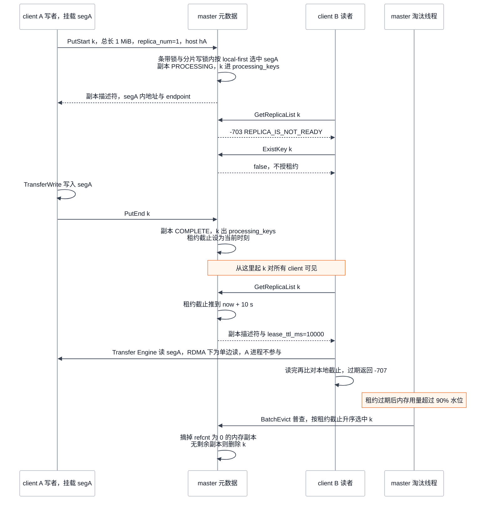
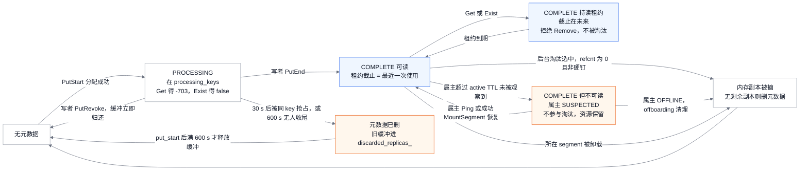
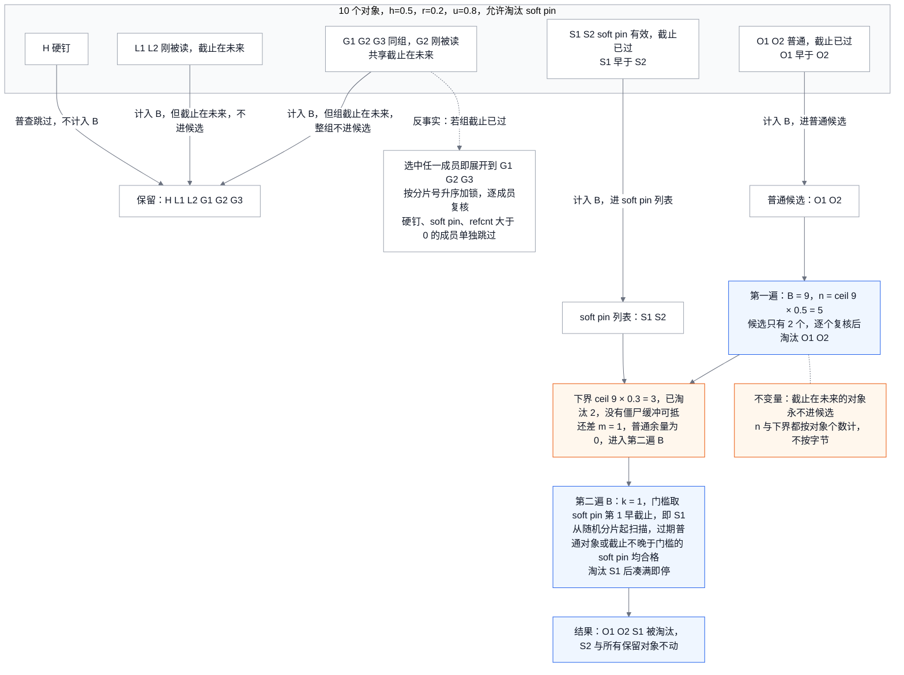

# Mooncake Store 对象生命周期：两阶段写、读租约与后台淘汰

> **源码基线**：`kvcache-ai/Mooncake@7d3a94e9d8c30abf02fcd64df218c16c1abc70df`（`main`，2026-09-24）
> **主题**：一个对象从 `PutStart` 到可读、在读租约下被读取、再被后台淘汰的全过程，以及 master 与 client 在每一步各持有什么状态、何时对他人可见。随后讲空间不足、写者失联、segment 卸载和 client 掉线时对象与已挂载内存的去向，最后是错误码、两种部署形态与 master 配置契约。核心代码在 `mooncake-store/src/master_service.cpp`、`mooncake-store/src/client_service.cpp`。
> **适用范围**：内存副本（MEMORY）的对象生命周期与 master 元数据；SSD/DFS/NoF 分层、HA 与 OpLog、Transfer Engine 字节搬运和 vLLM 用法各有归属页，本页只在接口处给一行边界（静态源码与测试核验，未实跑集群）。
> **最近更新**：2026-09-24。新建页。

所属目录见 [[02_engineering/03_infer_frameworks/mooncake/index|Mooncake]]。下文路径中的 `ms/` 均指 `mooncake-store/`，`MS` 指 `MasterService`。

## 1. 两个 client、一个 key：PutEnd 之前别人看到什么

Mooncake Store 的 master 只管元数据，不碰字节。对象的每个副本是某个 client 挂载进来的一段内存（segment）里的一块缓冲；写者和读者都经 [[10_mooncake_transfer_engine_analysis|Transfer Engine]] 直接读写那块内存。于是有三个问题只能落在 master 的元数据上：字节写完之前不能让别人读到半截；读者正在远程读时，那块缓冲不能被淘汰后分给新对象；空间不够或某个 client 掉线时，要有人决定哪些对象让路、哪些缓冲可以回收。

最小例子：master 以 `--allocation_strategy=local_first` 启动，有两个 client。A 在主机 hA 上挂载 `segA`，B 在主机 hB 上挂载 `segB`。A 以 `replica_num=1` 写 1 MiB 的 key `k`，B 随后读 `k`。

<!-- Figure spec: 问题=一次 put→get→evict 中 master 状态何时改变、何时对他人可见；类型=时序图；参与者=写者 A、master 元数据、读者 B、master 淘汰线程；关系=每条消息标真实 RPC 名与返回码；图独有信息=PutEnd 前 B 的 Get/Exist 的两种返回、PutEnd 把租约截止设为当前时刻、读者在传输后才验租约、淘汰按截止时间排序；阅读顺序=自上而下；证据=MS::PutStart/PutEnd/GetReplicaList/ExistKeyImpl/BatchEvict 与 Client::Put/Query/Get；验证=Mermaid 人工核查（本机无渲染器）。 -->

逐步看 master 手里的状态变化：

1. **PutStart**：master 先拿同 key 的条带互斥锁，再拿元数据分片写锁；local-first 把写者所在主机的 segment 排到候选最前，在 `segA` 的 allocator 上切出一整块 1 MiB 缓冲。随后插入 `ObjectMetadata{client_id=A, put_start_time, size=1 MiB}`，副本状态为 `PROCESSING`，`k` 进入分片的 `processing_keys`。A 拿到的只是副本描述符，内容为地址、大小与 transport endpoint。
2. **PutEnd 之前**：B 的 `GetReplicaList` 返回 -703，`ExistKey`/`ProbeKey` 返回 `false` 且不授租约。第三个 client 对 `k` 发 `PutStart` 会得到 -705；而 `Client::Put` 把 -705 当成功返回，于是它以为写成了，实际字节是 A 的，还没就绪。非 force 的 `Remove` 得 -703，别的 client 发 `PutEnd` 得 -601。
3. **PutEnd**（必须由 A 发出）：副本转 `COMPLETE`，`k` 移出 `processing_keys`，`GrantReadLease(0)` 把租约截止设成当前时刻。这不是给哪位读者的租约，而是给淘汰排序打上的"最近使用时间"。此刻起 `k` 对所有 client 可见。
4. **B 的 Get**：`GetReplicaList` 把截止推到 now + 10 s，并把 `lease_ttl_ms=10000` 回给 B。B 用发请求**之前**的本地时刻加 10 s 作为自己的截止，读完再检查；过期就返回 -707，读到的字节作废。
5. **淘汰**：租约过期后，若内存用量超过 90% 水位，后台线程按截止时间升序挑对象，摘掉 `k` 的内存副本；没有其他副本时，`k` 从元数据中整体消失。

同一时刻其他 client 的各种操作得到什么，可以按下表查：

| 其他 client 的操作 | PutEnd 之前 | PutEnd 之后、租约内 | 租约过期后 |
|---|---|---|---|
| `Get`（经 `GetReplicaList`/`BatchGetReplicaList`） | -703 `REPLICA_IS_NOT_READY` | 返回副本描述符，并把租约推到 now + TTL | 同左；已被淘汰则 -704 |
| `ExistKey` / `BatchExistKey`（`IsExist`/`BatchIsExist`） | `false`，不授租约 | `true`，**授予与 Get 相同的租约** | 同左；已被淘汰则 `false` |
| `ProbeKey` / `BatchProbeKey` | `false` | `true`，不授租约 | 同左；已被淘汰则 `false` |
| 同 key 的 `PutStart` | -705；写者 30 s 未收尾后可被抢占 | -705，`Client::Put` 视为成功 | -705 |
| 非 force 的 `Remove` | -703 | -706 `OBJECT_HAS_LEASE` | 成功 |
| 后台淘汰 | 不参与，`PROCESSING` 副本不可淘汰 | 跳过 | 可被选中 |

对分组对象，表中的"租约"是整组共享的那一份（§5.4、§6.5）。

## 2. 为什么是两阶段写、限时读租约和后台淘汰

源码没有写一段总体设计理由；本节的取舍比较是分析推断，依据在括号里的源码事实。

**两阶段写把"占位"和"发布"分开。** 字节走 client 之间的 RDMA/TCP 通道，master 只知道"分配了"和"写者说写完了"。若 `PutStart` 分配后立刻可读，读者会读到尚未写入的缓冲；若让 master 代写字节，master 就成了带宽瓶颈。于是 `PutStart` 只返回地址、让对象处于 `PROCESSING`，`PutEnd` 才把副本翻成 `COMPLETE`。设计文档对 PutStart 的描述也说两步是为了不让其他 client 读到部分写入的值（`docs/source/design/store/mooncake-store.md` 的 PutStart 接口说明）。

**读侧用限时租约，不用引用计数。** 读者是远程进程，可能在读的中途崩溃；引用计数需要一个"读完释放"的 RPC，以及读者崩溃后的回收逻辑。租约只是一个截止时间：master 不跟踪读者是谁，读者崩溃也不会泄漏保护，到期自然失效（`ms/include/lease.h::Lease` 注释写明服务端必须兑现 now + ttl，才不会在客户端持有的租约到期前淘汰）。代价有两个。一是读者必须在 TTL 内读完，否则只能丢弃数据重读（§5.2）；二是只"看一眼"的 `ExistKey` 也会授租约，扫描式探测会把整片内存钉住（§5.3）。副本上的 `refcnt` 只留给 master 自己派发、自己收尾的内部任务（copy/move/offload/promotion 的源副本），淘汰跳过 `refcnt > 0` 的副本。

**PutStart 不为内存副本内联淘汰。** 内存副本分配失败时，`PutStart` 直接返回 -200，只把 `need_mem_eviction_` 置位，由后台线程去淘汰（§6.7）。唯一的例外是 DFS bucket：DFS 分配因容量耗尽而失败时，`PutStart` 会在准入内强制淘汰一个 bucket 并重试（`MS::TryRecoverDfsSpaceAfterAllocationFailure`，只在 `dfs_allocation_failed` 时启用），见 [[12_mooncake_store_tiering_offload_analysis]]。推断的理由是：`PutStart` 持有目标分片的写锁，而淘汰要对全部 1024 个分片做普查；内联淘汰会让写者排在全表扫描后面，还要在持锁状态下获取其他分片锁。代价是调用方必须自行重试，测试里就是循环 40 次、每次间隔 50 ms 等待后台腾出空间（`ms/tests/master_service_test.cpp::ExistKeyLeasesPinSegmentButProbeKeyDoesNot`）。

## 3. master 与 client 各持有什么

### 3.1 状态归属

| 状态 | 持有者与容器 | 保护 | 谁改它 |
|---|---|---|---|
| 对象元数据 `ObjectMetadata` | master：`metadata_shards_`，共 1024 个 `MetadataShard`，按 `hash(tenant, key) % 1024` 路由，内含 `TenantState.metadata` | 分片 `SharedMutex` | PutStart/PutEnd/PutRevoke/Remove/淘汰/失效句柄清理 |
| 未完成写集合 `processing_keys` | 同一 `TenantState` | 分片锁 | `InsertMetadata` 加入；全部副本 `COMPLETE` 时由 PutEnd/PutRevoke 移出；超时扫描清理 |
| 同 key 准入串行化 | `object_operation_locks_`，4096 条互斥锁的条带 | 条带互斥锁 | 只有 `PutStart`、`UpsertStart` 获取 |
| 读租约 `Lease` | `ObjectMetadata::lease_`（`shared_ptr`；分组对象指向组共享的同一个） | 原子 CAS，只增不减 | Get/Exist/PutEnd |
| 组成员表 | `group_domain_`：单锁的 `group → {member_keys, lease}` | 独立 `SharedMutex` | `InsertMetadata` 注册、删除时注销；读路径不碰，只有淘汰查询 |
| soft pin 截止 | `ObjectMetadata::soft_pin_timeout` 与 `soft_pin_deadline_index_` 小顶堆 | 元数据内 `SpinLock`、索引 mutex | PutEnd 首次完成时提交；`TaskCleanupThreadFunc` 每 30 s 清理到期项 |
| 被抢占或超时的旧缓冲 | `discarded_replicas_` 链表，带到期时间 | `discarded_replicas_mutex_` | PutStart 抢占与超时扫描加入；`ReleaseExpiredDiscardedReplicas` 到期释放 |
| segment 与 allocator | `segment_manager_`：`mounted_segments_`、`allocator_manager_`（只放可分配的注册）、`segments_by_host_` | `segment_mutex_` | Mount/Unmount/offboarding |
| client 存活 | `client_liveness_records_`、`ok_client_` | `client_mutex_` 与记录内的 `transition_mutex_` | Ping/Mount/ReMount/`ClientMonitorFunc` |
| client 侧 | `QueryResult`（副本描述符与本地租约截止）、已挂载 segment 列表、**segment 那块内存本身** | client 进程 | — |

client 不缓存任何对象元数据；它拥有的是自己挂载的物理内存，以及一次查询拿到的描述符和截止时间。

`ms/include/master_service.h::MasterService` 顶部注释规定了锁序：`client_mutex_` → `tenant_quota_policy_mutex_` → `snapshot_mutex_` → 分片 mutex → `tenant_quota_recompute_mutex_` → 租户配额表内部锁或 `segment_mutex_` → soft pin 索引锁。`PutStart` 的实际顺序是：条带锁（最外层，不在注释列表里）→ `client_mutex_` 共享锁 → `snapshot_mutex_` 共享锁，拿到后取"仍保留资源的 client 集合"，**随即释放 `client_mutex_`** → 分片写锁 → `segment_mutex_` 共享锁，只用来拍一份 allocator 快照 → 分组对象才获取 `group_domain_` 写锁。`PutStart` 不获取 soft pin 索引锁：它传给 `InsertMetadata` 的已提交截止为空，索引要到 `PutEnd` 提交 soft pin 时才写。淘汰每次只持一个分片锁；整组淘汰先放掉触发者所在分片的锁，再按分片号升序逐个获取成员分片锁，避免两个整组淘汰互相 AB/BA 死锁（`MS::EvictGroupOrObject` 注释）。

> [!note] 尚未接入 MasterService 的新结构
> 基线里已有 `ms/include/segment/pool.h::SegmentPool`、`ms/include/segment/catalog.h::RegionCatalog`、`ms/include/placement/replica_allocator.h::ReplicaAllocator`、`ms/include/object_entry.h::ObjectEntry`、`ms/include/object_index.h::ObjectIndex`、`ms/include/group_index.h::GroupIndex`，但 `master_service.{h,cpp}`、`master.cpp`、`rpc_service.cpp` 都不引用它们；使用 `SegmentPool` 的 `StoreResourceSnapshotCodec` 也只有测试调用。当前 live 的是上表中的 `MetadataShard`、`GroupDomain`、`SegmentManager`。读源码时不要把这些类当成现行路径。

### 3.2 副本状态机与对象可见性

`ms/include/replica.h::ReplicaStatus` 定义了六个值，live 转换只有四条：

- `mark_complete`：`PROCESSING → COMPLETE`（PutEnd）。
- `mark_removed`：`COMPLETE/PROCESSING → REMOVED`，只在开启 OpLog 的 HA 模式下使用，先标记，持久化后再真正摘除，见 [[13_mooncake_store_ha_recovery_analysis]]。
- `cancel_remove`：`REMOVED → COMPLETE`，用于 OpLog 预留失败时回滚。
- `mark_processing`：`COMPLETE → PROCESSING`，只用于 `UpsertStart` 的原地覆盖写。它会让 key 暂时不可读，本页不展开。

`INITIALIZED` 和 `FAILED` 在全仓没有任何赋值点：`INITIALIZED` 只出现在枚举和字符串表里，`FAILED` 只在快照恢复时被当作"跳过"条件读取。`UNDEFINED` 标记被 move 走的副本。

对象层面没有单独的状态字段，可见性由副本推出。`MS::TryGetReadableReplicaDescriptor` 判定一个副本"可读"要同时满足：`COMPLETE`；内存句柄有效，即 allocator 仍存活且 segment 生命期未失效；属主 client 处于 `ACTIVE`（`AllocatedBuffer::isAvailable` 检查 `ClientLivenessRecord::IsServing`）；endpoint 不在 standby 恢复后待重挂的失效名单里。`GetReplicaList` 只返回可读副本。一个副本都没有时：若全部是 `REMOVED` 返回 -704，否则返回 -703。因此"写还没完成"和"属主正处于 SUSPECTED"对读者是**同一个错误码**。

<!-- Figure spec: 问题=一个内存副本对象从创建到消失有哪些可观察状态、每条边由谁触发；类型=状态图（flowchart）；实体=无元数据、PROCESSING、COMPLETE 可读、COMPLETE 持租约、属主 SUSPECTED 不可读、旧缓冲延迟释放、副本摘除；关系=边标真实触发者与条件；图独有信息=PutRevoke 立即归还而抢占与超时要等 600 s、SUSPECTED 可恢复、租约只挡淘汰；阅读顺序=左到右；证据=replica.h::Replica、MS::PutStart/PutEnd/PutRevoke/DiscardExpiredProcessingReplicas/BatchEvict/ProcessClientOffboardingJob、allocator.h::AllocatedBuffer::isAvailable；验证=Mermaid 人工核查。 -->

## 4. 写路径：PutStart、传输、PutEnd 与 PutRevoke

### 4.1 PutStart 的准入

`MS::PutStart` 先做不持锁的参数检查：三种副本数不能全为 0，key 不能为空，长度不能为 0；DFS 与 NoF 的组合限制见 [[12_mooncake_store_tiering_offload_analysis]]；在 cachelib allocator 下，单对象长度不能超过 `kMaxSliceSize`（slab 大小减 16 字节）。随后 `ResolveSoftPinRequest` 解析 soft pin 请求：`ENABLE` 可带 `soft_pin_ttl_ms`，缺省取 `default_kv_soft_pin_ttl`，超过 `max_kv_soft_pin_ttl` 返回 -600；`PRESERVE`/`DISABLE` 带 TTL 也返回 -600。`group_ids` 被解析为本 key 的 `group_id`。

然后获取同 key 条带锁，进入 `admit`，在 `snapshot_mutex_` 共享锁和分片写锁下检查 key：

- 已有元数据，先按"仍保留资源的 client 集合"清掉失效句柄；若清完已无有效副本，就当作新对象继续。
- 有任一 `COMPLETE` 副本，或 `put_start_time + put_start_discard_timeout_sec` 仍未到，返回 -705。并发的 16 个写者只会有一个准入成功（`ms/tests/master_service_concurrent_scenario_test.cpp::ConcurrentPutStartsAdmitOneWriter`）。
- 否则是**被抢占的僵尸写**：旧的 `PROCESSING` 副本移入 `discarded_replicas_`，到期时间定为旧的 `put_start_time + put_start_release_timeout_sec`，删掉旧元数据，再按新对象分配。旧缓冲不立刻复用，是因为旧写者可能仍在对它做 RDMA 写（`MS::UpsertStart` 头部注释写明了这一点）。

`AllocateAndInsertMetadata` 依次完成三件事。多租户开启时先预扣 `value_length × replica_num` 的配额，失败返回 -1700；准入时不为租户淘汰（本页的多租户内容止于此边界）。接着 `AllocateReplicas` 分配副本，见 §4.2。最后 `InsertMetadata` 插入元数据：副本全部为 `PROCESSING`；记下待提交的 soft pin 动作，只作用于本次写分配的副本 ID；分组对象把 `lease_` 换成组共享的 `Lease`；把 key 放进 `processing_keys`。

### 4.2 分配：preferred、local-first 与 best-effort

`MS::AllocateReplicas` 先组装一份有序的偏好列表：

1. 若弃用字段 `ReplicateConfig::preferred_segment` 非空，只用它；否则用 `preferred_segments` 列表去重。两者不会合并。
2. 若 `allocation_strategy` 为 `local_first`，或请求带 `prefer_alloc_in_same_node`，并且 `replica_num == 1`：把 `ScopedAllocatorAccess::GetHostOrderedSegments(writer_host_id, key)` 的结果追加到列表后面。写者 host 取请求里的 `host_id`，没有则取 master 此前为该 client 记下的 host（来自挂载或更早的请求）。这个函数先列写者主机上的全部 segment（起点按 `hash(key)` 轮转），再按主机名字典序依次列后续主机，回绕一圈覆盖所有主机。显式指定的 preferred 仍排在最前（`ms/tests/master_service_placement_scenario_test.cpp::ExplicitPreferredSegmentOverridesLocalFirst`）。
3. 在 `segment_mutex_` 共享锁下拍一份 `AllocatorManager` 快照，然后**在分片写锁内、segment 锁外**调用策略的 `Allocate`。

`ms/include/allocation_strategy.h::CreateAllocationStrategy` 的映射是：`random` 和 `local_first` 都得到 `RandomAllocationStrategy`，local-first 的"本地优先"完全来自上一步追加的偏好列表；`free_ratio_first` 得到 `FreeRatioFirstAllocationStrategy`；`cxl` 与 `ssd_free_ratio_first` 各有专用实现，归边界页；未识别的字符串告警后回落 `random`，启用 CXL 时强制 `cxl`。

`RandomAllocationStrategy::Allocate` 的规则：

- 候选只取 `getServingNames()`，即仍有可服务注册的 segment。属主非 `ACTIVE` 时，`SegmentAllocatorRegistration::Allocate` 直接返回空，不会往 SUSPECTED 属主的内存里分配（`ms/tests/allocation_strategy_test.cpp::SuspectedRegistrationIsSkipped`）。
- 只有一个可服务 segment 时走快速路径，**忽略偏好列表**直接在它上面分配。
- 否则每个偏好 segment 各尝试一次；成功的记入"已用"，保证同一对象的副本落在不同 segment。不足的部分从随机起点顺序扫描，最多 `min(kMaxRetryLimit=100, segment 数)` 个。
- 每个副本是**整对象长度的一块连续缓冲**（`allocateSingle(slice_length)`），不做条带化。
- best-effort：凑不满 `replica_num` 时返回已分到的副本，一个都没有才返回 -200。

`FreeRatioFirstAllocationStrategy` 在偏好列表之后，从 6 × 剩余副本数个随机样本中按空闲比例降序挑选，不够再回落同样的随机扫描。

分配结果回到 `AllocateReplicas` 后，纯内存配置（NoF、DFS 副本数都为 0）**只要分到至少 1 个副本就算成功**：`HasExpectedReplicaAllocation` 对这种配置只要求大于 0，少于请求数时只记一个 `put_start_partial_allocations` 指标并打 WARNING（`ms/tests/master_service_placement_scenario_test.cpp::PutStartPartialAllocationIsVisible`，3 副本请求在 2 个节点上得到 2 个）。一个也分不到时返回 -200，并且只在"可服务 segment 数 ≥ replica_num"时置位 `need_mem_eviction_`：segment 数本身不够时，淘汰也变不出新 segment。

segment 级 allocator 由 `--memory_allocator` 选择：默认 `OffsetBufferAllocator`，返回真实的最大空闲区；`CachelibBufferAllocator` 要求 segment 基址与大小按 slab 对齐，最大空闲区报告为"未知"。

### 4.3 client 侧：写字节与收尾决定

`Client::Put` 收集各 slice 的长度，交给 `MasterClient::PutStart`；后者把长度求和，经 coro_rpc 调用 `WrappedMasterService::PutStart`（解析写租户后转给 `MS::PutStart`），RPC 只携带对象总长。拿到描述符后，它对每个内存/NoF 副本**依次同步**调用 `TransferWrite`，经 `ms/include/transfer_task.h::TransferSubmitter` 选择本地 memcpy 或 Transfer Engine，并等待 future 完成。字节怎样落到对端内存归 [[10_mooncake_transfer_engine_analysis]]。

传完后 `DetermineFinalizeDecision` 决定怎样收尾。常规模式（单副本或多副本可靠写）要求分配满足、且**每个已分配副本的传输都成功**，才发 `PutEnd(ALL)`；任一失败就发 `PutRevoke(ALL)`，并把第一个传输错误返回给调用方。"1 个内存副本 + 1 个 NoF 副本"的灵活双副本模式允许只收尾成功的一侧，属于 NoF 边界，这里不展开。

有两个 client 侧语义需要注意：

- `PutStart` 返回 -705 时，`Client::Put` 与 `BatchPut`（`Client::CollectResults`）都**返回成功**。`Put` 因此是"不存在才写"：对已存在 key 的第二次 Put 不写任何字节，也不报错。要覆盖写得用 `Upsert`。
- `BatchPutStart` 在 master 侧逐 key 独立调用 `PutStart`（`WrappedMasterService::BatchPutStart`），没有跨 key 原子性。一批中部分 key 得到 -200 时，其余 key 照常写入，失败 key 在结果向量里单独报 -200。

### 4.4 PutEnd 与 PutRevoke：发布点

`MS::PutEnd` 在 `snapshot_mutex_` 共享锁和分片写锁下执行：

1. `client_id` 必须等于元数据里的写者，否则返回 -601。
2. 若 key 已不在 `processing_keys`，而目标副本已全部 `COMPLETE`，按幂等重试返回 OK；否则返回 -700。
3. 把目标类型的 `PROCESSING` 副本逐个 `mark_complete`。若这是对象第一次出现 `COMPLETE` 副本，且完成的副本属于本次写，就提交待定的 soft pin：`CommitPendingSoftPin` 计算截止时间，并登记进截止索引。soft pin 的寿命从这一刻起算，之后的读**不**续期（`ms/tests/master_service_test.cpp::SoftPinExpiresAndGetDoesNotReactivate`）。
4. 结算写配额。若开启 `enable_offload` 且未开启 `offload_on_evict`，这里还会给完成的内存副本排一个卸载任务，见 [[12_mooncake_store_tiering_offload_analysis]]。
5. 全部副本 `COMPLETE` 时把 key 移出 `processing_keys`。
6. `GrantReadLease(0)`：把租约截止设为 max(原截止, 当前时刻)。这给对象打上"最近使用时间"，不保护任何读者。
7. 发布 KV stored 事件（默认关闭，归 [[01_mooncake_architecture_overview_analysis]]）；HA 模式下追加一条 `PUT_END` OpLog，采用"先可见后持久"（归 [[13_mooncake_store_ha_recovery_analysis]]）。

**可见点**就是 PutEnd 在持分片写锁期间把第一个副本置为 `COMPLETE` 的那一刻。`GetReplicaList` 在同一分片的读锁下判断可读性，所以对单个 key，读者看到的要么是 -703，要么是完整的 `COMPLETE` 副本。

`MS::PutRevoke` 同样要求是原写者、且写仍在进行，只摘目标类型的 `PROCESSING` 副本；目标类型里只要有已完成副本就返回 -700。没有有效副本剩下时，删除整个对象，缓冲随 `Replica` 析构**立即**归还 allocator。非 HA 模式下，任何读写访问器（`MetadataAccessorRW` 构造函数）都会顺手清掉句柄已失效的内存副本，这是一种惰性清理。

### 4.5 写者失联：抢占与回收

写者在 `PutStart` 之后、`PutEnd`/`PutRevoke` 之前崩溃，对象就成了僵尸：既不可读，也挡住同 key 的新写。回收有两条路，都由时间驱动，与写者的存活状态无关：

- **抢占**：超过 `put_start_discard_timeout_sec`（默认 30 s）后，同 key 的新 `PutStart` 接管，见 §4.1。
- **超时回收**：`DiscardExpiredProcessingReplicas` 在每次淘汰普查中逐分片调用；没有淘汰发生时，淘汰线程也会每隔 `put_start_release_timeout_sec` 全表扫一遍。超过 `put_start_time + put_start_release_timeout_sec`（默认 600 s）的 `PROCESSING` 副本被摘下，送进 `discarded_replicas_`；对象没有有效副本就删掉。

两条路都要等到 `put_start_time + 600 s` 之后才可能释放缓冲。何时真正释放，取决于扫描什么时候跑：

- **有内存压力时**：淘汰每 10 ms 触发一次，普查和 `ReleaseExpiredDiscardedReplicas` 随之执行，到期后很快释放。
- **无压力时**：`EvictionThreadFunc` 每隔 `put_start_release_timeout_sec` 才做一次全表扫描，所以最坏接近两倍超时，即约 20 分钟。

代价在 `ms/tests/master_service_test.cpp::PutStartExpiringTest` 里可以看到：同一 key 被抢占后，旧缓冲和新缓冲同时占着空间，下一个 key 的 `PutStart` 因此得到 -200。构造函数强制 `release > discard`，否则抛异常。

## 5. 读路径：谁授租约、谁检查租约

### 5.1 GetReplicaList 授租约

`MS::GetReplicaList` 在 `snapshot_mutex_` 共享锁和分片读锁下取可读副本描述符（§3.2）。有描述符时调用 `GrantReadLease(default_kv_lease_ttl_)`，把截止推到 max(原截止, now + TTL)，再把描述符、`lease_ttl_ms` 和对象校验和一起返回。`BatchGetReplicaList` 按分片分组处理，对每个命中的 key 同样授租约。只有 `GetReplicaListForAdmin`/`BatchGetReplicaListForAdmin` 不授租约，也不触发 promotion。命中只有本地盘副本时，还可能触发 promotion 回内存，见 [[12_mooncake_store_tiering_offload_analysis]]。

`ms/include/lease.h::Lease` 是一个原子的纳秒截止值，`GrantReadLease` 用 CAS 只增不减。所以并发读者之间不会互相缩短对方的保护，过期由 `now >= deadline` 判定。

### 5.2 client 在传输之后检查租约

`Client::Query` 在发 RPC **之前**记下本地 `steady_clock` 时刻，加上返回的 `lease_ttl_ms`，作为 `QueryResult` 的截止。`Client::Get` 调用 `FindFirstCompleteReplica`，取列表中第一个 `COMPLETE` 描述符（单 key Get 不按本地性挑选），然后 `TransferRead`、校验对象校验和，最后才检查 `QueryResult::IsLeaseExpired`：过期返回 -707，即使字节已经拷进了用户缓冲。

这里有两个时钟域：master 用 `system_clock` 记截止，client 用自己的 `steady_clock`。client 的截止从发请求前算起，正常情况下不晚于 master 的截止，所以是保守的（分析推断；master 墙钟跳变会影响租约与淘汰排序，源码没有防护）。租约只保证"master 不会在截止前主动淘汰或 Remove 这个对象"，不能中途打断一次已经开始的传输；它也不挡 segment 卸载和属主掉线（§7）。

### 5.3 Exist 授租约，Probe 不授

`MS::ExistKey`/`BatchExistKey` 与 `ProbeKey`/`BatchProbeKey` 共用 `ExistKeyImpl`/`BatchExistKeyImpl`，区别只在 `grant_lease` 参数。前者对每个命中的 key 授予**与 Get 相同的** `default_kv_lease_ttl` 租约；后者（#3801 引入）只做时点判断。在 client 侧，`Client::IsExist`/`BatchIsExist` 走前者，`Client::ProbeKey`/`BatchProbeKey` 走后者，standalone 模式下 `RealClient` 注册了对应的 RPC 处理函数。

后果要分两层看。"租约期内淘汰腾不出空间"来自 `MS::BatchEvict` 的普查规则：`now < EvictionDeadline()` 的对象不进入候选，被 `ExistKey` 命中的对象因此在 TTL 内都不可淘汰。测试 `ms/tests/master_service_test.cpp::ExistKeyLeasesPinSegmentButProbeKeyDoesNot` 只能佐证其中一部分。它的前半段显示，两个 2 MiB 对象写满 4 MiB segment 并逐个 `ExistKey` 后，下一个 `PutStart` 立即得到 -200；但不做 `ExistKey` 也会立即得到 -200，因为 `PutStart` 不内联淘汰。后半段才有对照意义：换成 `ProbeKey` 后，重试中的 `PutStart` 在后台淘汰后成功。只想知道"在不在"的扫描应当用 Probe。

### 5.4 分组对象：读一个成员，续整组

分组对象的 `lease_` 指向组共享的 `Lease`，所以对任何成员的 `GetReplicaList`/`ExistKey` 都会延长整组的截止，同组其他成员的非 force `Remove` 也会得到 -706（`ms/tests/master_service_group_test.cpp::GroupedReadRefreshesSharedGroupLease`）。PutEnd 的 `GrantReadLease(0)` 只能把组截止往后推，不会让一个仍有效的组租约失效。

> [!contradiction] 代码注释与行为不一致
> `MS::GetReplicaList` 与 `MS::ExistKeyImpl` 的注释写着 "Read path is group-agnostic: only the object's own lease is refreshed"。但对象"自己的" `lease_` 就是组共享的那一份（`MS::InsertMetadata` 中 `lease_ = RegisterGroupMember(...)`），上述测试也验证了整组续期。以行为和测试为准；设计文档的对象分组一节对此的描述与行为一致。

## 6. 淘汰：水位触发、以租约截止近似 LRU、两遍扫描

### 6.1 何时触发、目标多大

`MS::EvictionThreadFunc` 每 10 ms 醒一次，读取 `SegmentManager::GetMemoryUsage().used_ratio()`。记用量比例为 $u$、`eviction_high_watermark_ratio` 为 $h$、`eviction_ratio` 为 $r$。当 $u>h$，或 `need_mem_eviction_` 已置位且 $r>0$ 时，调用 `BatchEvict(r_target, r_lower)`：

$$
\begin{aligned}
r_{\mathrm{target}} &= \max\bigl(r,\; u-h+r\bigr),\\
r_{\mathrm{lower}} &= \max\bigl(r_{\mathrm{target}}/2,\; u-h\bigr),\\
n_{\mathrm{pass1}} &= \bigl\lceil B\, r_{\mathrm{target}}\bigr\rceil,\qquad n_{\min} = \bigl\lceil B\, r_{\mathrm{lower}}\bigr\rceil .
\end{aligned}
$$

$B$ 是 eviction base：非硬钉、且至少有一个可淘汰内存副本的对象**个数**。按默认值 $h=0.90$、$r=0.05$，若 $u=0.93$、$B=1000$，则 $r_{\mathrm{target}}=0.08$、$r_{\mathrm{lower}}=0.04$，第一遍目标 80 个对象，下界 40 个。仅因分配失败触发、且 $u\le h$ 时，$r_{\mathrm{target}}=r=0.05$，$r_{\mathrm{lower}}=0.025$。目标按对象个数而不是字节数计：大对象和小对象各算一个，一轮腾出的字节数不固定。只要仍高于水位，下一个 10 ms 周期会再来一轮。

### 6.2 普查：谁有资格、按什么排序

`BatchEvict` 先持 `snapshot_mutex_` 共享锁，用 16 个线程并行扫描 1024 个分片。每个分片顺带执行一次 `DiscardExpiredProcessingReplicas`。对每个对象：

- 硬钉（`with_hard_pin`，创建时确定、不可改）直接跳过，也不计入 $B$。
- "可淘汰内存副本"指 `MS::IsEvictableMemoryReplica`：内存副本、可读（§3.2，所以属主 SUSPECTED 的副本不算）、`refcnt == 0`。一个都没有的对象不计入 $B$。
- `now < EvictionDeadline()`，即租约截止仍在未来的对象，不进入候选。
- 剩下的对象，soft pin 未到期的放进 soft pin 列表（仅当 `allow_evict_soft_pinned_objects=true`），其余放进普通候选。

排序键是 `ObjectMetadata::EvictionDeadline()`，也就是租约截止。PutEnd 把它设成写入时刻，每次读把它推到读时刻 + TTL，所以它近似于"最近一次使用时间"。按它升序淘汰就是近似 LRU，不需要单独的访问链表。`ms/include/eviction_strategy.h` 里的 `LRUEvictionStrategy`/`FIFOEvictionStrategy` 只被 `master_service.h` 前向声明、被单元测试使用，不在 live 路径上。

### 6.3 两遍扫描

- **第一遍**：从普通候选中用 `nth_element` 取截止最早的 $n_{\mathrm{pass1}}$ 个，逐个在分片锁下复核（截止、soft pin、可淘汰副本），然后淘汰。复核失败的记下，不计数，继续取下一个。是否只物化截止时间分界附近的一段有界"前沿"，取决于淘汰目标比例而不是候选数量：比例低于 `kCompactPrebypassTargetRatio`（$10/44\approx 0.227$）时，普查只收集截止时间，之后只为前沿物化完整候选，被跳过太多时再补一轮扫描；比例更高时普查直接收集完整候选，因为再扫一遍的代价高于它省下的物化。
- 第一遍结束后调用 `ReleaseExpiredDiscardedReplicas` 释放到期的僵尸缓冲，释放的个数也抵扣下界。
- **第二遍**只在"已淘汰数 + 已释放数"仍不足 $n_{\min}$ 时执行。还差的个数记为 $m$，上限是"普通余量"（第一遍没淘汰或复核被跳过的普通候选）加上 soft pin 列表的长度。第二遍分两种：
    - **A**：$m$ 不超过普通余量时，用 `nth_element` 求出普通余量中第 $m$ 早的截止作为门槛；然后从随机分片起逐分片扫描，淘汰截止不晚于门槛的过期非 soft pin 对象，凑满 $m$ 个即停。
    - **B**：否则，令 $k$ 为 $m$ 减去普通余量，求出 soft pin 列表中第 $k$ 早的截止作为门槛；同样从随机分片起逐分片扫描，**任何**过期的普通对象，以及截止不晚于门槛的 soft pin 对象都有资格，按扫描顺序淘汰，凑满 $m$ 个即停（`ms/tests/master_service_evict_scenario_test.cpp::SoftPinnedObjectsAreFallbackCandidates`）。

两种第二遍都不按截止时间全局升序淘汰：`nth_element` 只用来定门槛，实际顺序是分片扫描顺序。

> [!contradiction] 第二遍 B 的注释与行为不一致
> `MS::BatchEvict` 在 B 分支的注释写着 "Prioritize evicting objects without soft pin, but also allow evicting soft pinned objects"。实际代码在一次分片扫描中把合格的普通对象与合格的 soft pin 对象混在一起，谁先被扫到就先淘汰谁。门槛只限制**哪些** soft pin 对象有资格，并不让普通对象在这一遍里优先。

一整轮既没淘汰也没释放、而之前又有分配压力时，`need_mem_eviction_` 会被重新置位，下一轮再试。

用一个 10 对象的小例子把普查和两遍走一遍。为了让第二遍触发，参数取 `--eviction_high_watermark_ratio=0.5`、`--eviction_ratio=0.2`，当前用量 $u=0.8$。按 §6.1 的公式得 $r_{\mathrm{target}}=\max(0.2,\,0.5)=0.5$、$r_{\mathrm{lower}}=\max(0.25,\,0.3)=0.3$。

<!-- Figure spec: 问题=一次 BatchEvict 怎样从对象集合得到淘汰集合；类型=决策流（flowchart）；实体=H 硬钉、L1/L2 持租约、G1-G3 同组且 G2 被读、S1/S2 soft pin 已过期租约、O1/O2 普通；关系=普查分流到"保留/普通候选/soft pin 列表"，第一遍按 n=ceil(B·r_target) 取最早者，第二遍 B 的触发条件与 soft pin 门槛，分组的反事实展开与逐成员复核；图独有信息=B 含持租约与分组对象但它们不进候选、n 与下界按对象个数、第二遍按分片顺序而非升序；数值=h=0.5,r=0.2,u=0.8,B=9,n=5,下界=3；阅读顺序=上到下；证据=MS::BatchEvict、MS::EvictGroupOrObject、MS::IsEvictableMemoryReplica；验证=Mermaid 人工核查。 -->

图里有两点值得注意。第一，$B$ 把持租约的 L1、L2 和整组 G 都算进去了，它们只是不进候选。所以目标个数是按"有可淘汰副本的对象总数"算的，不是按"当前可淘汰的对象数"算的；可淘汰的对象不够时，第一遍会达不到 $n$。第二，第二遍 B 若在扫描中先遇到还有剩余的过期普通对象，会先淘汰它，而不是先淘汰 S1；本例因为普通对象已在第一遍淘汰完，才轮到 S1。

### 6.4 执行：只摘内存副本

`BatchEvict` 内的 `evict_replicas` 只弹出可淘汰的内存副本，放进延迟析构列表，等释放分片锁之后再析构，把缓冲还给 allocator。如果对象还剩本地盘副本等其他有效副本，对象继续存在，读者之后读到的是那些副本。没有剩余副本才删除元数据，并发布 KV removed 事件。开启 `offload_on_evict` 时，淘汰前可能先把一个副本送去卸载，推迟摘除；这个挂钩点在 `try_evict_or_offload`，机制归 [[12_mooncake_store_tiering_offload_analysis]]。HA 模式下改为先写 OpLog、持久化后再摘除，归 [[13_mooncake_store_ha_recovery_analysis]]。

### 6.5 分组：在租约层面全有或全无

普查时，分组对象的截止就是组共享的截止，同组成员要么都是候选，要么都不是。选中其中一个成员后，`MS::EvictGroupOrObject` 从 `group_domain_` 读出成员表（不持分片锁），按分片号升序逐个加锁，在每个成员自己的锁下**逐个复核**硬钉、租约、soft pin 和可淘汰副本，通过的才淘汰。因此：

- 组内任一成员被读过（组租约未到期），整组都不会被选中（`MasterServiceEvictScenarioTest::ActiveGroupMemberBlocksWholeGroup`）。
- 组租约已过期时，整组一起淘汰（`MasterServiceEvictScenarioTest::EvictsWholeGroupTogether`）。但单个成员若是硬钉、soft pin（在不允许淘汰 soft pin 的那一遍）、或 `refcnt > 0`，只跳过这个成员，其余照删（`ms/tests/master_service_group_test.cpp::GroupedEvictionSkipsUnsafeMembersAndEvictsSafePeers`）。
- 按组淘汰最多让实际数量超出目标一个组的大小。

设计文档把这概括为"生命周期提示，不是事务保证"，与代码一致：全有或全无只在组租约这一层成立。

### 6.6 判定练习：三个对象会不会被选中

条件：默认参数，$u=0.93$，第一遍目标取 80 个，且普通候选远多于 80 个。

| 对象 | 普查结果 | 第一遍 | 第二遍 | 结论 |
|---|---|---|---|---|
| O1：10 s 内被 `Get` 或 `ExistKey` 过 | `now < EvictionDeadline`，不进入任何候选 | — | — | 不淘汰。租约到期后按截止时间重新排队 |
| O2：soft pin 未到期，租约已过期 | 进入 soft pin 列表（仅当 `allow_evict_soft_pinned_objects=true`） | 跳过 | 仅当第一遍后仍不足下界、且普通余量不够时进入第二遍 B；截止不晚于 soft pin 门槛才有资格，按分片扫描顺序被淘汰 | 这种条件下保留；压力大到普通对象不够用时可能被淘汰；flag 为 `false` 时 TTL 内永不被水位淘汰 |
| O3：属于某组，组内另一成员 10 s 内被读过 | 共享 `Lease` 截止在未来，不进入候选；即使被当作触发者，`EvictGroupOrObject` 逐成员复核租约也会跳过 | — | — | 不淘汰，整组保留 |

若 O3 所在组的租约已过期，而那个被读过的成员不是"持租约"，而是 `refcnt > 0`（例如正作为 copy/offload 的源副本），结果就变成：该成员被跳过，O3 和其余成员照样被淘汰。

### 6.7 PutStart 不为内存副本内联淘汰：-200 对调用方意味着什么

内存副本分配失败时，`AllocateReplicas` 只置位 `need_mem_eviction_` 并返回 -200，`PutStart` 原样把错误交给 client；`Client::Put` 打出"空间不足，可调低 `eviction_high_watermark_ratio` 或挂更多 segment"的提示后返回错误。master 侧不重试，client 侧也不自动重试。能否在下一次 `PutStart` 前腾出空间，取决于后台线程是否找得到过期、未钉、`refcnt == 0` 的对象。如果内存被硬钉对象或持租约对象占满（例如大量 `ExistKey`），$B$ 或候选为空，`PutStart` 会一直失败。DFS bucket 耗尽是唯一会在准入内强制淘汰并重试的情形，归 [[12_mooncake_store_tiering_offload_analysis]]。多租户配额超额同样不内联淘汰；设计文档与此相反的说法见 §11。

## 7. segment 挂载、卸载与 client 存活

### 7.1 挂载与 SegmentStatus

`MS::MountSegment` 在 `client_mutex_` 写锁下为 client 创建或复用一条 `ClientLivenessRecord`，再通过 `ObserveAndRun` 在同一个状态转换临界区里调用 `ScopedSegmentAccess::MountSegment`。后者按 `--memory_allocator` 为这段内存建 allocator，把注册加入 `allocator_manager_`，登记 host 索引。成功的 Mount 同时算一次存活观察。对已挂载且参数完全一致的同一 segment 再次 Mount，返回 `SEGMENT_ALREADY_EXISTS` 并视为成功；client 处于 OFFLINE 时 Mount 被拒，返回 -1010。

`ms/include/segment/status.h::SegmentStatus` 有 `OK`、`DRAINING`、`DRAINED`、`GRACEFULLY_UNMOUNTING`、`UNMOUNTING` 和 `UNDEFINED`。只有 `OK` 的 segment 的注册会留在 `allocator_manager_` 里接受新分配。`DRAINING`/`DRAINED` 属于 drain 作业（实验性的迁移作业，本页不展开）。

### 7.2 三种卸载，只有一种先等

- **`MS::UnmountSegment`（立即卸载）**：`PrepareUnmountSegment` 从 allocator 表中移除注册，并调用 `SegmentAllocatorRegistration::Invalidate`，使这段内存上**所有已分配缓冲的句柄立刻失效**。这些副本马上变得不可读，不管有没有租约（`ms/tests/master_service_test.cpp::UnmountSegmentHidesReplicasBeforeAsyncCleanup`）。非 HA、非快照、非 CXL 时，元数据清理交给后台 `replica_cleanup_worker_` 异步执行 `ClearInvalidHandles`；随后 `CommitUnmountSegment` 删除 segment 记录。
- **`MS::GracefulUnmountSegment`**：只关闭新分配（`SetAllocatable(false)`，状态为 `GRACEFULLY_UNMOUNTING`），已有副本仍可读；到期后由 `graceful_unmount_scheduler_` 调用上面的 `UnmountSegment`。只有属主 client 能发起。
- **offboarding**：client 被判 OFFLINE 后由 master 自己执行，见 §7.3。

租约保护不了以上任何一种：`UnmountSegment` 和 offboarding 都不查租约。持有描述符、正在读的读者，面对的是属主已经释放或即将释放的内存。master 端没有对此的防护；读者会不会读到被复用的字节，取决于属主何时释放那块内存，这是 client 进程的行为，本页不作断言。

### 7.3 ACTIVE → SUSPECTED → OFFLINE

<!-- Figure spec: 问题=client 掉线后它的 segment 与其上对象按什么时间线变化；类型=状态图（flowchart）；实体=ACTIVE、SUSPECTED、OFFLINE、offboarding 完成、重新挂载；关系=边标触发条件与默认时长；图独有信息=SUSPECTED 期间副本不可读但保留且可恢复、OFFLINE 后拒绝重挂直到记录删除、重挂得到空 segment；阅读顺序=左到右；证据=client_liveness.h::ClientLivenessRecord、MS::ClientMonitorFunc/ProcessClientOffboardingJob/Ping/ReMountSegment；验证=Mermaid 人工核查。 -->

`MS::ClientMonitorFunc` 每秒对每条存活记录调用一次 `ClientLivenessRecord::EvaluateAndRetire`：

- **ACTIVE → SUSPECTED**：距最后一次观察满 `client_active_ttl_sec`（默认 10 s）。观察来自 `Ping` 或成功的 `MountSegment`。进入 SUSPECTED 后，这个 client 的 segment 上的副本立即不可读（读者得 -703），也不能往里分配新副本，不参与淘汰；但内存和元数据都保留。源码没有说明为什么要设这个中间态。分析推断：一次短暂的网络抖动不应该直接删掉对象；SUSPECTED 先挡住读和新分配，但保留资源，抖动过后即可原样恢复，所以真正的删除推迟到 suspicion TTL 之后。
- **SUSPECTED → ACTIVE**：`Ping` 或一次成功的 `MountSegment` 都能恢复。`MS::MountSegment` 经 `ObserveAndRun` 提交观察，在 SUSPECTED 下返回 `RECOVERED_ACTIVE`，日志为 `signal=memory_mount`；通用的观察恢复语义见 `ms/tests/client_liveness_test.cpp::ObservationRecoversSuspectedButNotOffline`。`ReMountSegment` 不算：它用的是"保留资源"守卫，不会把 SUSPECTED 拉回 ACTIVE（`MasterServiceTest::ReMountDoesNotRecoverSuspectedClient`）。
- **SUSPECTED → OFFLINE**：在 SUSPECTED 中再满 `client_suspicion_ttl_sec`（默认 20 s）。转换时先预留一个 offboarding 作业，再发布 OFFLINE；退役回调随后把 client 移出 `ok_client_`，取消它挂着的 graceful unmount，对它的每个 segment 做 `PrepareUnmountSegment`，并把作业交给 `ClientOffboardingWorker`。

`MS::ProcessClientOffboardingJob` 在后台执行：

1. 用 `ClearStaleHandles` 清掉与该存活记录绑定的 `COMPLETE` 内存副本（以及它拥有的本地盘副本），没有剩余有效副本的对象随之删除（`ClientOffboardingProcessesRealSegmentAndMetadataResiduals` 断言之后 `ExistKey` 为 `false`）。
2. 若还有落在它 segment 上的 `PROCESSING` 副本，作业返回"未完成"，按退避重试，直到这些写被收尾或被 §4.5 的超时回收。
3. 注销本地 SSD 登记，`CommitUnmountSegment`，清理 HTTP metadata server 上的对应条目（需开启 `enable_metadata_cleanup_on_timeout`），最后删除存活记录。

存活记录删除之前，同一 client 的 Mount/ReMount 都被拒（-1010）；删除之后再挂，得到的是全新记录和空 allocator。

多副本对象中只有落在掉线 client 上的那个副本被清掉，对象经其他副本继续可读，这正是 `replica_num > 1` 的用途。**写者**掉线不会触发任何这类清理：写者身份只写在 `ObjectMetadata::client_id` 里，它未完成的写只能走 §4.5 的时间回收。

### 7.4 client 心跳与重挂

`Client::StorageHeartbeatThreadMain` 每秒 `Ping` 一次。master 的 `MS::Ping` 在"记录不存在或已 OFFLINE"或"不在 `ok_client_` 中"时回 `NEED_REMOUNT`；只有成功的 `ReMountSegment` 才把 client 放进 `ok_client_`。收到 `NEED_REMOUNT` 后，client 异步调用 `ReMountSegment`，带上自己全部已挂载 segment，并把 Transfer Engine 的 segment 描述与 RPC 元数据重新发布到 metadata server。连续 3 次 Ping 失败时，非 HA 模式重连同一地址；HA 模式通过 leader 视图切换，归 [[13_mooncake_store_ha_recovery_analysis]]。

非 HA 的 master 重启会丢失全部对象元数据。client 重连、重挂后，segment 重新出现，但上面没有任何对象（`ms/tests/non_ha_reconnect_test.cpp::ClientAutoReconnectAndRemount`）。

开启 HA 或快照恢复时，本页的几种状态在切换后并不都能保留。机制归 [[13_mooncake_store_ha_recovery_analysis]]，这里只列与生命周期直接相关的四点：

- 快照恢复（`MS::ApplySnapshotState`）会删除租约已过期的对象，以及仍有非 `COMPLETE` 副本的对象。这条删除规则不检查 `IsHardPinned`，所以租约已过期的硬钉对象同样会被删掉。
- OpLog 负载带 `hard_pinned`，但不带 soft pin 和租约（`MS::SerializeMetadataForOpLog`）；快照恢复也会清空 soft pin 索引。所以经 OpLog 重放恢复的对象保留硬钉，soft pin 在两条恢复路径上都退化为普通缓存。
- `OpType` 里没有 PutStart。切换时仍在进行的写，新 leader 上没有它的元数据，写者随后的 `PutEnd` 得到 -704。
- standby 恢复出来、所在 endpoint 尚未被属主重挂的副本，在 `invalid_replica_endpoints_` 里被判为不可读，因此按 §6.2 也不会被淘汰，直到属主重挂。

## 8. 两种部署：嵌入式 RealClient 与独立 mooncake_client

master 的存活判定、segment 归属和写者身份都以"Client 实例"为单位。部署形态决定了这个实例和推理进程是不是同一个进程：

| 形态 | 入口 | 谁持有 segment 与 master 身份 | 推理进程崩溃的后果 |
|---|---|---|---|
| 嵌入式 | `ms/src/real_client.cpp::RealClient::setup_internal`，由 Python `setup(...)` 调用 | 推理进程本身 | 约 10 s 后它的 segment 进入 SUSPECTED，其上对象不可读；再约 20 s 进入 OFFLINE，对象被删 |
| 独立 | 二进制 `mooncake_client`（`ms/src/real_client_main.cpp`）+ 推理进程内的 `DummyClient` | `mooncake_client` 进程 | 只丢推理进程自己的共享内存映射；store 中的对象与 segment 不受影响 |

嵌入式的 `setup_internal` 把 `local_buffer_size` 注册成本地传输缓冲，它不进入存储池。`global_segment_size > 0` 时，先按传输层注册上限，用 `GetNextSegmentSize` 把总容量切成若干等大、按 slab 对齐的块，每块 `MountSegment` 一次；RDMA 下还会按网卡所在 NUMA 节点分布。`global_segment_size == 0` 时不挂载任何 segment，这个进程只消费、不贡献容量。

独立模式下，`mooncake_client` 的 gflag 默认值为 `--global_segment_size=4 GB`、`--local_buffer_size=0`、`--port=50052`。进程启动时构造一个 `RealClient`，挂载全局 segment，然后启动 coro_rpc 服务注册 `RealClient` 的各个处理函数，并在抽象 UDS `@mooncake_client_<port>.sock` 上接收共享内存 fd。推理进程调用 `DummyClient::setup_dummy`：经 coro_rpc 连上 `mooncake_client`，申请一块共享内存作为本地缓冲，用 `SCM_RIGHTS` 把 fd 传过去注册，并起一个 ping 线程。之后每个 put/get 都是一次对 `mooncake_client` 的 RPC；`RealClient` 以**自己的** Client 身份与 master 交互，`DummyClient` 的 id 只用于在 `RealClient` 里查找对应的共享内存上下文。`RealClient::dummy_client_monitor_func` 在某个 DummyClient 停止 ping 超过 TTL 后解除它的共享内存映射。

## 9. 错误码语义

`ms/include/types.h::ErrorCode` 中与对象生命周期相关的码：

| 码 | 名称 | 谁返回、何时 | 调用方该怎么理解 |
|---|---|---|---|
| -200 | `NO_AVAILABLE_HANDLE` | `PutStart` 一个副本也分不到；client 收尾时分配不满足可靠模式 | 暂时没空间；master 已请求后台淘汰，自己决定是否重试；批量写按 key 独立失败 |
| -600 | `INVALID_PARAMS` | 参数非法、soft pin TTL 越界、cachelib 下单对象超 `kMaxSliceSize` | 修正请求 |
| -601 | `ILLEGAL_CLIENT` | 非原写者发 `PutEnd`/`PutRevoke` | 只有 `PutStart` 的发起者能收尾 |
| -700 | `INVALID_WRITE` | 没有进行中的写却调用 `PutEnd`/`PutRevoke`，或 Revoke 目标里有已完成副本 | 重复 `PutEnd` 且目标已完成时返回 OK，不报此码 |
| -703 | `REPLICA_IS_NOT_READY` | `GetReplicaList` 找不到可读副本、且副本并非全部 `REMOVED`；`Remove` 遇到未完成副本 | 写未完成，或属主 SUSPECTED，或 endpoint 待重挂；**三者同码，调用方无法区分** |
| -704 | `OBJECT_NOT_FOUND` | key 不存在或无有效副本 | 已被删除或淘汰 |
| -705 | `OBJECT_ALREADY_EXISTS` | `PutStart` 同 key 已有完成副本，或有 30 s 内的未完成写 | `Client::Put`/`BatchPut` 把它当成功 |
| -706 | `OBJECT_HAS_LEASE` | 非 force 的 `Remove` 撞上未过期的对象或组租约 | 等租约过期，或用 force |
| -707 | `LEASE_EXPIRED` | client 端：`Get` 读完后发现本地截止已过 | 丢弃读到的字节，重新 `Get` |
| -708 | `OBJECT_HAS_REPLICATION_TASK` | `Remove` 时对象上有 copy/move 任务 | 等任务结束 |
| -1010 | `UNAVAILABLE_IN_CURRENT_STATUS` | client OFFLINE 期间 Mount/ReMount；segment 正在 `UNMOUNTING` | 等 offboarding 完成后再挂 |
| -1700 | `TENANT_QUOTA_EXCEEDED` | 多租户 `PutStart` 预扣配额失败 | 准入不内联淘汰；多租户的其他错误码不在本页范围 |

## 10. 约束与失败边界

| 前提 | 源码边界 | 违反时 |
|---|---|---|
| 读者在租约 TTL 内完成传输 | `Client::Get` 在 `TransferRead` **之后**检查 `QueryResult::IsLeaseExpired` | 返回 -707，已拷贝的字节不可信；没有中途中止 |
| 租约只挡 master 主动的 Remove 与淘汰 | `MS::Remove` 查 `IsLeaseExpired`；普查与复核查 `EvictionDeadline`；`UnmountSegment`/offboarding 不查租约 | 卸载或属主掉线会立刻使句柄失效，无论有无租约 |
| 同一 key 只写一次 | `PutStart` 对已存在 key 返回 -705，`Client::Put` 映射为成功 | 第二次 Put 的新字节被静默丢弃；覆盖写须用 Upsert |
| 纯内存多副本是 best-effort | `HasExpectedReplicaAllocation` 对纯内存配置接受 ≥1 个 | 冗余度下降，只有 WARNING 与 `put_start_partial_allocations` 指标 |
| 每个已分配副本都要写成功 | `DetermineFinalizeDecision` 的可靠模式 | 任一失败就 `PutRevoke(ALL)`，Put 返回第一个错误 |
| 硬钉对象永不被淘汰 | 普查、复核、租户淘汰都跳过 `IsHardPinned` | 内存被硬钉对象占满时 $B=0$，`PutStart` 持续 -200；硬钉**不**阻止 Remove |
| 存在性扫描不应钉住内存 | `ExistKeyImpl(grant_lease=true)` | 大量 `ExistKey` 使对象在 TTL 内不可淘汰，新写入得 -200；应改用 `ProbeKey` |
| 僵尸写尽快释放空间 | 缓冲在 `put_start_time + put_start_release_timeout_sec` 后才释放 | 抢占期间新旧缓冲同时占用；至少到 `put_start_time` 加 10 分钟，无内存压力时最坏约 20 分钟 |
| 淘汰量足以回到水位下 | 目标按对象个数计（`ceil(B × r)`） | 一轮腾出的字节数取决于对象大小；高于水位时每 10 ms 再来一轮 |
| 属主短暂失联后恢复 | SUSPECTED 期间副本不可读但保留 | 最长约 20 s 内读者得 -703；恢复后原对象重新可读，超时则删除 |

## 11. 设计文档与当前代码的差异

以下每一条都以代码为准：

| 文档或注释的说法 | 当前代码 | 依据 |
|---|---|---|
| 多租户 `PutStart` 超额时内联淘汰并重试，最多两次（设计文档 Tenant Quota 一节） | 直接返回 -1700，只有后台每秒一次的租户水位检查会淘汰 | `MS::PutStart`、`MS::ChargeTenantQuota`、`MS::EvictTenantsOverWatermark` |
| preferred segment 分配"最多重试 10 次"（设计文档 Preferred Segment Allocation 一节） | 每个偏好 segment 试一次，之后随机扫描 `min(100, segment 数)` 个；同一文档另一处写的就是 `min(100, total_segments)` | `RandomAllocationStrategy::kMaxRetryLimit` |
| 硬钉对象"只能用 force Remove 或 RemoveAll 删除" | 非 force 的 `Remove` 只查租约，不查硬钉；租约过期后可以直接删除 | `MS::Remove` |
| Master–Client 接口以 protobuf 消息定义，`PutStartRequest` 带 `slice_lengths` | 实际是 coro_rpc 处理函数加 `YLT_REFL`/struct_pack 序列化；`PutStart` 只收对象总长，每个副本一块整对象缓冲 | `ms/src/rpc_service.cpp::RegisterRpcService`、`MasterClient::PutStart`、`MS::AllocateReplicas` |
| 存在 LRU/FIFO 淘汰策略类 | 只有测试使用；live 策略是按租约截止普查 | `ms/include/eviction_strategy.h` 与 `MS::BatchEvict` |
| `SegmentManager` 构造参数默认 `CACHELIB` | master 的 gflag 默认 `offset`，而 `MasterService` 总是显式传入配置值；构造默认值只影响直接构造（测试） | `ms/include/segment.h::SegmentManager`、`MS::MasterService` 构造函数 |
| 读路径注释称"只刷新对象自己的租约" | 分组对象刷新的是组共享租约 | §5.4 |
| `ReplicaStatus::INITIALIZED`/`FAILED` | 无赋值点，属遗留 | §3.2 |

## 12. 配置契约

### 12.1 master gflags：租约、淘汰、存活、分配、写超时与租户

master 从 `--config_path` 指向的 JSON 读取同名键。优先级是：命令行显式设置的 flag，高于配置文件，再高于 flag 默认值。两个特例：`client_ttl` 在配置文件里的旧键名是 `client_live_ttl_sec`；三个时长类 flag 接受裸毫秒数，或带 `ms`/`s`/`m`/`h` 后缀的字符串。

| gflag | 类型 | 默认 | 契约 |
|---|---|---|---|
| `default_kv_lease_ttl` | string（时长） | `10000`（ms） | Get/Exist 授予的租约长度，也作为 `lease_ttl_ms` 回给 client |
| `default_kv_soft_pin_ttl` | string（时长） | `1800000`（30 min） | `ENABLE` 未带 TTL 时的 soft pin 寿命；从首个副本可读时起算，读不续期；必须 ≤ max，否则构造时抛异常 |
| `max_kv_soft_pin_ttl` | string（时长） | `86400000`（24 h） | 请求级 soft pin TTL 上限，超过则 `PutStart` 返回 -600 |
| `allow_evict_soft_pinned_objects` | bool | `true` | 第二遍能否淘汰 soft pin 对象；为 `false` 时 soft pin 在 TTL 内免于水位淘汰 |
| `eviction_ratio` | double | `0.05` | §6.1 的 $r$；为 0 时分配失败不触发淘汰；取值 [0,1] |
| `eviction_high_watermark_ratio` | double | `0.90` | §6.1 的 $h$；内存用量比例超过即触发；构造时校验 [0,1] |
| `tenant_eviction_high_watermark_ratio` | double | `0.90` | 仅多租户：按租户自身有效配额的水位，后台每秒检查一次，淘汰到"水位减 `eviction_ratio`"；0 表示关闭 |
| `client_active_ttl_sec` | int64 | `10` | 距最后一次观察满该时长即 ACTIVE → SUSPECTED；必须 > 0 |
| `client_ttl` | int64 | `10` | `client_active_ttl_sec` 的弃用别名；两者都显式设置且不同时，以新名为准并告警 |
| `client_suspicion_ttl_sec` | int64 | `20` | SUSPECTED 持续该时长即转 OFFLINE；未显式设置、但显式设了 active TTL 时，取 active TTL 的值 |
| `memory_allocator` | string | `offset` | segment allocator：`offset` 或 `cachelib`（后者要求 segment 按 slab 对齐、单对象 ≤ `kMaxSliceSize`）；其他值启动失败 |
| `allocation_strategy` | string | `random` | `random`/`free_ratio_first`/`local_first`/`ssd_free_ratio_first`/`cxl`；未知值告警后回落 `random`；`enable_cxl` 时强制 `cxl` |
| `put_start_discard_timeout_sec` | uint64 | `30` | 超过后，同 key 的新 `PutStart` 可以抢占未收尾的写 |
| `put_start_release_timeout_sec` | uint64 | `600` | 未收尾写的缓冲最早在 `put_start_time` 加该值后释放；也是 copy/move/offload/promotion 任务的过期时长；必须大于 discard，否则构造时抛异常 |
| `enable_multi_tenants` | bool | `false` | 严格多租户准入；`PutStart` 预扣 `value_length × replica_num` |
| `tenant_quota_connector_type` | string | `file` | 租户配额策略的来源类型 |
| `tenant_quota_connector_uri` | string | 空 | 租户配额策略的来源地址 |
| `enable_metadata_cleanup_on_timeout` | bool | `false` | offboarding 时删除 HTTP metadata server 上该 segment 的条目；需要同进程的 HTTP metadata server，或能推导出 http(s) 地址，否则启动时自动关闭 |

`mooncake-store/src/master.cpp` 共定义 102 个 gflag（另有 8 个 `DEFINE_validator`），本表覆盖 18 个；其余 84 个的归属记录在 `docs/coverage/mooncake.md`。

## 13. 按问题回到源码与测试

下表路径相对冻结的 Mooncake 仓库，`::` 后是稳定符号或测试名。测试只作为复核入口，本次未执行。

| 要复核的结论 | 源码/测试入口 |
|---|---|
| 进程入口与 RPC 注册 | `ms/src/master.cpp::main`、`ms/src/rpc_service.cpp::RegisterRpcService`、`ms/src/real_client_main.cpp::main` |
| 分片、条带锁、锁序与状态容器 | `ms/include/master_service.h::MasterService`（`MetadataShard`、`kNumShards`、`kObjectOperationLockStripes`、`GroupDomain`、`SoftPinDeadlineIndex`）、`MS::AcquireObjectOperationLock` |
| PutStart 准入、抢占与分配 | `MS::PutStart`、`MS::AllocateAndInsertMetadata`、`MS::AllocateReplicas`、`MS::InsertMetadata`；`ms/tests/master_service_test.cpp::PutStartExpiringTest`；`ms/tests/master_service_concurrent_scenario_test.cpp::ConcurrentPutStartsAdmitOneWriter` |
| 分配策略、local-first 与 best-effort | `ms/include/allocation_strategy.h::CreateAllocationStrategy/RandomAllocationStrategy::Allocate/RankedAllocationStrategy::AllocateRanked`、`ms/src/segment.cpp::BuildHostOrderedSegments`；`ms/tests/master_service_placement_scenario_test.cpp::LocalFirstPutPrefersWriterHost/ExplicitPreferredSegmentOverridesLocalFirst/PutStartPartialAllocationIsVisible`；`ms/tests/allocation_strategy_test.cpp::SuspectedRegistrationIsSkipped` |
| client 写与收尾决定 | `ms/src/client_service.cpp::Client::Put` → `ms/src/master_client.cpp::MasterClient::PutStart`（求总长）→ `ms/src/rpc_service.cpp::WrappedMasterService::PutStart` → `MS::PutStart`；`DetermineFinalizeDecision`、`Client::CollectResults`；`WrappedMasterService::BatchPutStart` |
| 发布点、soft pin 提交、幂等 | `MS::PutEnd`、`MS::PutRevoke`、`ms/include/object_metadata.h::ObjectMetadata::CommitPendingSoftPin`；`ms/tests/master_service_scenario_test.cpp::PutStartEndFlow`；`MasterServiceTest::SoftPinExpiresAndGetDoesNotReactivate` |
| 副本状态与可读判定 | `ms/include/replica.h::Replica/ReplicaStatus`、`MS::TryGetReadableReplicaDescriptor`、`ms/include/allocator.h::AllocatedBuffer::isAvailable` |
| 读租约与 client 检查 | `MS::GetReplicaList`、`ms/include/lease.h::Lease`、`Client::Query`、`Client::Get`、`Client::FindFirstCompleteReplica` |
| Exist 与 Probe | `MS::ExistKeyImpl/BatchExistKeyImpl`；`MasterServiceTest::ExistKeyLeasesPinSegmentButProbeKeyDoesNot/BatchProbeKeyReportsPointInTimeExistence` |
| 分组租约与整组淘汰 | `MS::RegisterGroupMember`、`MS::EvictGroupOrObject`；`ms/tests/master_service_group_test.cpp::GroupedReadRefreshesSharedGroupLease/GroupedEvictionSkipsUnsafeMembersAndEvictsSafePeers`；`ms/tests/master_service_evict_scenario_test.cpp::EvictsWholeGroupTogether/ActiveGroupMemberBlocksWholeGroup` |
| 淘汰触发、普查与两遍 | `MS::EvictionThreadFunc`、`MS::BatchEvict`、`MS::IsEvictableMemoryReplica`、`ObjectMetadata::EvictionDeadline`；`MasterServiceEvictScenarioTest::EvictsExactOldestObjectsAtLowRatio/SoftPinnedObjectsAreFallbackCandidates/HardPinnedObjectsSurvivePressure` |
| 僵尸写回收 | `MS::DiscardExpiredProcessingReplicas`、`MS::ReleaseExpiredDiscardedReplicas`、`MasterService::DiscardedReplicas` |
| segment 挂载与卸载 | `MS::MountSegment/UnmountSegment/GracefulUnmountSegment`、`ms/src/segment.cpp::ScopedSegmentAccess::MountSegment/PrepareUnmountSegment/PrepareGracefulUnmountSegment/CommitUnmountSegment`、`ms/include/segment/status.h::SegmentStatus`；`MasterServiceTest::UnmountSegmentHidesReplicasBeforeAsyncCleanup` |
| 存活状态机与 offboarding | `ms/include/client_liveness.h::ClientLivenessRecord`、`MS::ClientMonitorFunc`、`MS::ProcessClientOffboardingJob`、`MS::Ping`、`MS::ReMountSegment`；`MasterServiceTest::ReMountDoesNotRecoverSuspectedClient/ClientOffboardingProcessesRealSegmentAndMetadataResiduals`；`ms/tests/client_liveness_test.cpp` |
| client 心跳与重挂 | `Client::StorageHeartbeatThreadMain`；`ms/tests/non_ha_reconnect_test.cpp::ClientAutoReconnectAndRemount` |
| 切换或恢复后保留哪些生命周期状态 | `MS::ApplySnapshotState`、`MS::SerializeMetadataForOpLog`、`ms/include/ha/oplog/oplog_types.h::OpType` |
| 两种部署 | `RealClient::setup_internal`、`GetNextSegmentSize`、`RealClient::dummy_client_monitor_func`、`ms/src/dummy_client.cpp::DummyClient::setup_dummy/register_shm_via_ipc` |
| gflag 与配置解析 | `ms/src/master.cpp` 的 `DEFINE_*` 与 `InitClientLivenessConf`、`ms/include/master_config.h::ResolveClientLivenessConfig`、`ms/include/types.h` 的 `DEFAULT_*` 常量 |

## Related Pages

- [[01_mooncake_architecture_overview_analysis]] — Mooncake 的系统分层与论文对照，以及 PutEnd/淘汰时发布的 KV 事件由谁消费。
- [[10_mooncake_transfer_engine_analysis]] — `TransferWrite`/`TransferRead` 拿到副本描述符之后，字节怎样经 segment 查找与网卡写进对端内存。
- [[12_mooncake_store_tiering_offload_analysis]] — 内存副本之外的本地盘/DFS/NoF 副本，以及 offload-on-evict 与 promotion 如何挂在本页的淘汰和读路径上。
- [[13_mooncake_store_ha_recovery_analysis]] — HA 模式下 PutEnd/淘汰的 OpLog 先标记后摘除、master 切换与 standby 恢复后的重挂。
- [[20_mooncake_vllm_integration_analysis]] — vLLM 实际调用了本页哪些接口（Put/Get/Exist/Probe、group_ids、local-first），以及这些语义对 vLLM 的影响。
- [[02_engineering/03_infer_frameworks/vllm/22_vllm_disaggregated_kv_serving_analysis|vLLM 分离式 KV]] — 从 vLLM 侧看 Mooncake store connector 如何把 KV block 写成对象、再由未来的 decode 实例查找读取。
- [[22_kv_tiering_transfer_analysis]] — KV cache 分层与传输的一般原理，可用来对照 Mooncake 把"可见、租约、淘汰"放在 master 元数据上的做法。
