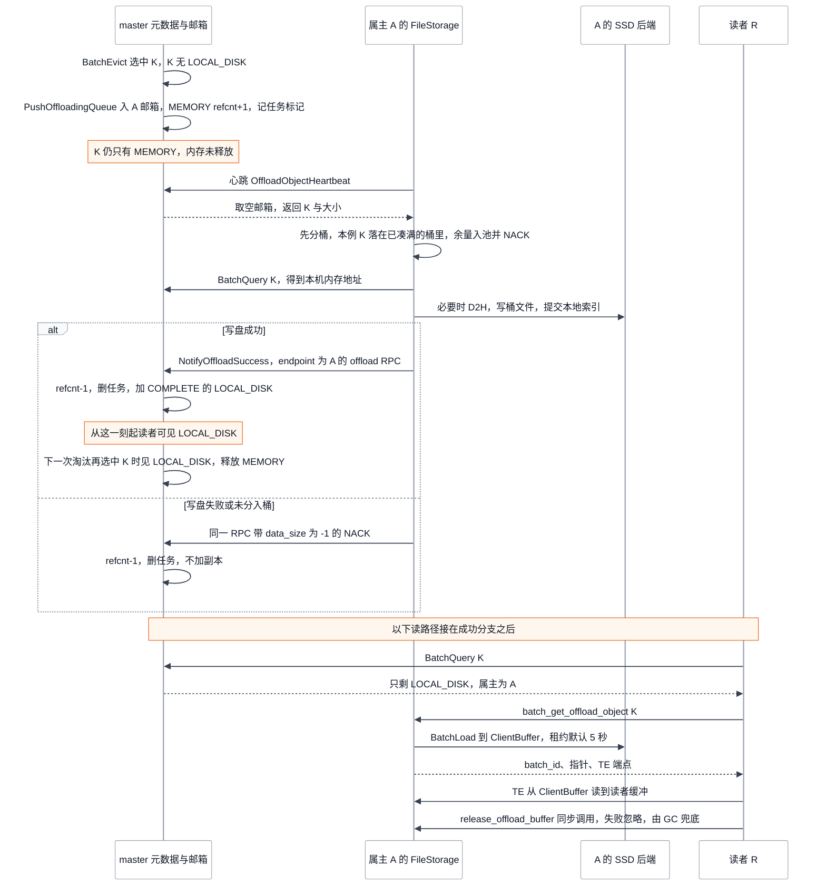
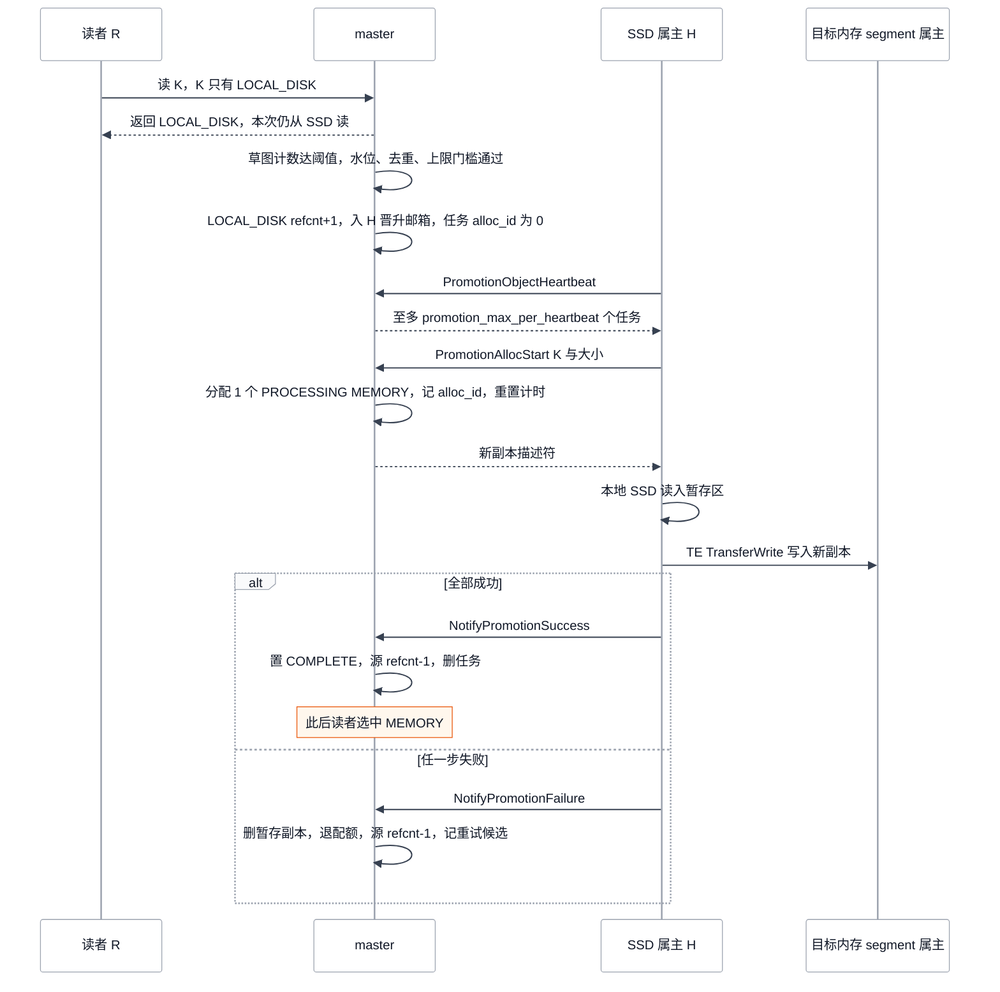

# Mooncake Store 分层与卸载：master 派单、client 落盘与 LOCAL_DISK 的可读边界

> **源码基线**：`kvcache-ai/Mooncake@7d3a94e9d8c30abf02fcd64df218c16c1abc70df`（`main`，2026-09-24）
> **主题**：内存池放不下时，对象怎样经 master 的心跳邮箱派单、由持有内存副本的 real client 写进本地 SSD，并登记为 `LOCAL_DISK` 副本；下一次读怎样经属主 RPC 取回，`promotion_on_hit` 又怎样把热对象拉回内存。随后说明五类存储后端、遗留 `DISK` 副本、DFS 描述符副本与两种分配器，最后给出配置契约。核心代码位于 `mooncake-store/src/{master_service.cpp,file_storage.cpp,real_client.cpp,local_ssd/}`。
> **适用范围**：本页覆盖 Store 的 SSD/DFS 分层控制面、执行面、可见性与失败边界。内存淘汰规则、租约、pin 与副本状态机由对象生命周期页负责；字节搬运由 Transfer Engine 页负责；HA、OpLog 与快照由高可用页负责；vLLM 侧磁盘暂存与层级日志由 vLLM 集成页负责；NoF/CXL 只列边界。结论来自静态源码与测试核验，未实跑 SSD/DFS。
> **最近更新**：2026-09-24。新建页。

## 1. 一个被淘汰的对象，从内存副本被选中到 SSD 副本可读

内存 segment 容量固定。写满以后，淘汰线程要么丢弃对象，要么把对象搬到更便宜的层。Mooncake Store 的做法是把 SSD 设计成另一种副本：master 不接触数据，只决定哪个对象该下沉，并在搬运期间锁住源副本。实际执行 SSD I/O 的是持有该内存副本的 real client。写完以后，client 回报 master，master 才把新副本加入元数据，读者从这一刻起才能看见它。

先用一个最小例子说明这件事。对象 K 大小为 4 MB，唯一的 `MEMORY` 副本位于节点 A 注册的内存 segment。A 的 real client 以 `enable_ssd_offload=True` 启动了 `FileStorage`，使用默认的 bucket 后端。同一次心跳里，K 与其他待卸载对象一起凑满了一桶：累计达到 500 个 key 或 256 MB，而且 K 落在已成形的桶里。如果 K 是这次心跳取到的唯一对象，`GroupOffloadingKeysByBucket` 不会组出任何桶，K 进入余量池并被 NACK，下面的步 3→4 不会发生，这种情况见 §7。master 以 `--enable_offload=true --offload_on_evict=true` 启动。下表中的每一步都来自 §4 的源码轨迹；时间只是默认参数下的数量级，不是实测值。

| 步 | 在谁手上 | 做了什么 | K 的副本与 master 标记 | 读者此时拿到 |
|---|---|---|---|---|
| 0 | A 的 client | Put 完成 | `MEMORY(A)` COMPLETE，refcnt 0 | `MEMORY` |
| 1 | master 淘汰线程 | 内存越过高水位。`BatchEvict` 选中 K，发现它还没有 `LOCAL_DISK` 副本，于是调用 `PushOffloadingQueue` 把 `{K, 4 MB}` 放入 A 的卸载邮箱 | `MEMORY(A)` refcnt 1，另有 `offloading_tasks[K]` | 仍是 `MEMORY`。内存**没有**释放 |
| 2 | A 的心跳线程，最多再等一个心跳周期（默认 10 s） | 调用 `OffloadObjectHeartbeat`，一次取走邮箱里的全部任务 | 同上。邮箱已空，只剩任务标记 | `MEMORY` |
| 3 | A 的 `FileStorage` | 先把本次取到的 key 分桶，K 落在已凑满的桶里；凑不满一桶的余量留在后端的余量池里。然后通过 `BatchQuery` 找到 K 在本机内存中的地址；数据在设备内存时先做 D2H；最后写入桶文件并提交本地索引 | 同上。字节已经写到 A 的 SSD，但 master 还不知道 | `MEMORY` |
| 4 | A → master | 发送 `NotifyOffloadSuccess(K, size, endpoint=A 的 offload RPC 地址)` | refcnt 回到 0，删除任务标记，同时加入 COMPLETE 状态的 `LOCAL_DISK(A)` | 仍是 `MEMORY`：`LOCAL_DISK` 已可见，但有内存副本时读者不会选它 |
| 5 | master，下一次淘汰再选中 K 时 | K 已有 `LOCAL_DISK` 副本，直接释放内存副本。`BatchEvict` 只在水位或分配压力下运行，而且只处理被选中的对象 | 只剩 `LOCAL_DISK(A)` | `LOCAL_DISK` |
| 6 | 读者 R | 选中 `LOCAL_DISK` 副本，用 RPC 请 A 从 SSD 读入 A 的暂存区，再由 R 通过 TE 把数据拉回自己的缓冲区 | 不变 | 数据 |
| 7 | master（开启 `promotion_on_hit` 时） | K 第二次被读时通过频次门槛，于是 pin 住 `LOCAL_DISK` 副本，并把晋升任务放入 A 的晋升邮箱 | `LOCAL_DISK(A)` refcnt 1，另有 `promotion_tasks[K]` | 这次读仍走 SSD |
| 8 | A 的下一次心跳 | 依次执行 `PromotionAllocStart`、读取本地 SSD、TE 写入新内存副本、`NotifyPromotionSuccess` | 新增 `MEMORY(X)`，先是 PROCESSING，提交后变为 COMPLETE | 提交之后拿到 `MEMORY` |

本页的中心结论是：**分层由 master 记账和锁定，由 client 在心跳中执行；新副本只在完成通知被 master 写进元数据的那一刻才可读。** 在 `offload_on_evict` 模式下，被选中的对象在步 1 到步 5 之间仍占着内存。由于这个时间差，内存紧张时新的 `PutStart` 仍可能得到 `NO_AVAILABLE_HANDLE`。测试 `MasterServiceOffloadScenarioTest.OffloadOnEvictQueuesInsteadOfFreeing` 恰好断言了这一点：两次 `PutStart` 都失败，而邮箱里有任务。

## 2. 为什么由 master 记账、由 client 执行

### 2.1 数据只在 client 手里，master 只能派单

数据只存在于 client 注册的内存和 client 本地的磁盘上。master 进程不注册数据缓冲区，也不参与数据搬运。所以卸载必须由持有源字节的 client 执行，master 能做的只有两件事：

1. **保证源不消失。** master 把选中的内存副本 `inc_refcnt()`。`IsEvictableMemoryReplica` 只接受 refcnt 为 0 的可读内存副本，因此卸载期间这份副本不会被淘汰。
2. **让执行者知道要做什么。** master 把任务放进目标 client 的邮箱 `LocalSsdTaskMailbox`，client 在心跳中来取。

源码没有说明为什么选择拉取而不是由 master 主动推送。**分析者推断**有两点理由：client 本来就定期向 master 发 RPC，拉取不要求 master 反向连接每个 client；心跳频率也天然限制了每个 client 的卸载节奏。代价是延迟：新副本最早在下一个心跳后才出现。

执行者是**源内存副本所在 segment 的属主**，不一定是写入对象的 client。`PushOffloadingQueue` 通过 `segment_manager_` 的 `GetOwnerClientId` 查到属主，再把任务放进这个属主的邮箱。因此 SSD 字节总是落在内存副本所在的节点上，拷贝源始终是本机内存。这一关系也解释了 §10 的 SSD 感知放置：选择内存 segment，实际上同时决定了对象以后会落到哪块 SSD。

### 2.2 两种卸载时机

| | 写穿（默认：`enable_offload=true`，`offload_on_evict=false`） | 淘汰时卸载（`offload_on_evict=true`） |
|---|---|---|
| 触发点 | `PutEnd` 把内存副本置为 COMPLETE 后，立即对**每个**已完成的内存副本调用 `PushOffloadingQueue` | 只有 `BatchEvict` 或租户配额淘汰选中该对象、且对象还没有 `LOCAL_DISK` 副本时，才调用 `PushOffloadingQueue` |
| pin 的对象 | 第一个入队成功的内存副本；多个副本在各自属主的邮箱里生成镜像，由同一个任务标记 `mirror_clients` 统一记录 | 只 pin 一个内存副本。其余 refcnt 为 0 的内存副本在同一轮就被淘汰 |
| SSD 写入量 | 每个成功写入的对象都要写一次 SSD，热对象也会写 | 只有被淘汰的对象才写 SSD |
| 内存何时回收 | 与卸载无关。等卸载完成、refcnt 归零后，普通淘汰规则才能回收 | 等卸载完成，下一次淘汰再选中它、看到已有 `LOCAL_DISK` 副本后才回收 |
| 回收不了时 | 不影响写入 | 入队失败时默认**跳过**本轮，内存保留；`offload_force_evict=true` 才会不经卸载直接淘汰，见 §7 |

写穿的代价是冗余写 SSD，好处是 `LOCAL_DISK` 副本在内存压力出现之前就已存在，淘汰可以立即释放内存。淘汰时卸载避免了热对象的冗余写入，但回收内存必须等待一个心跳周期和一次落盘。源码注释和 `docs/source/deployment/ssd/ssd-offload.md` 都把后者描述为“SSD 只在内存压力下写入”；`mooncake-wheel/tests/test_offload_on_eviction.py` 断言，小负载在该模式下不产生 `LOCAL_DISK` 副本。`offload_force_evict` 只在 `offload_on_evict` 为真时生效，因为构造函数只在该分支读取它。测试 `ForceEvictAloneKeepsDefaultQueueing` 与 `ForceEvictAloneStillEvictsUnderPressure` 固定了这一点。

论文把 CPU/DRAM/SSD 描述为一个统一的 KVCache 池。冻结基线的开源 Store 则把 SSD 实现成三条彼此独立的路径：第一条是持有内存副本的 client 异步写入、并且只能经属主进程读取的 `LOCAL_DISK` 副本；第二条是 DFS 描述符副本；第三条是遗留的 `DISK` 副本。论文设计与开源实现的对应关系见 [[01_mooncake_architecture_overview_analysis|01 架构总览]]，KV 分层迁移的一般原理见 [[22_kv_tiering_transfer_analysis|KV 分层存储与迁移]]。

## 3. 状态模型：谁持有什么、谁改它

| 状态 | 属主 | 关键字段与不变量 | 谁修改 |
|---|---|---|---|
| 对象副本集 `ObjectMetadata` | master 元数据 shard | `MEMORY` 副本带 refcnt。`LOCAL_DISK` 副本的描述符 `LocalDiskDescriptor{client_id, object_size, transport_endpoint}` 指向属主 client 及其 offload RPC 地址 | `PutEnd`、`NotifyOffloadSuccess`、淘汰、`EvictDiskReplica`、清理 |
| 卸载任务标记 `offloading_tasks[key]` | master `TenantState` | `OffloadingTask{source_id, start_time, mirror_clients}`。每个 key 一个标记，存在期间源副本 refcnt+1 | 入队时创建；完成、NACK、过期、删除或 upsert 取消时移除 |
| 晋升任务 `promotion_tasks[key]` 与重试候选 `promotion_candidates` | master `TenantState` | `PromotionTask{source_id, alloc_id, object_size, start_time, holder_id, ...}`。`alloc_id=0` 表示尚未分配目标 | 准入、分配、提交、失败、过期 |
| LocalSSD 登记 `LocalSsdManager` | master | 每个 client 一条 `ClientRecord`：卸载邮箱、晋升邮箱、`total_capacity_bytes`、`used_bytes`、`enable_offloading_` | `MountLocalDiskSegment`、`ReportSsdCapacity`、心跳、完成通知、反注册 |
| 频次草图 `CountMinSketch` | master，仅在 `promotion_on_hit` 开启时构造 | 按租户作用域 key 计数，计数饱和于 255 | 每次调用 `TryPushPromotionQueue` 时加一：读到只有 `LOCAL_DISK` 副本的对象时调用，重试候选时也调用 |
| 本地落盘索引 | client 的存储后端，例如 bucket 后端的 `object_bucket_map_` | 先写文件，再提交索引，最后通知 master | `BatchOffload`、磁盘淘汰、回滚 |
| 属主暂存区 `ClientBuffer` 批次 | client 的 `FileStorage` | `batch_id → AllocatedBatch`，带 `lease_timeout`，默认 5 s | 读 RPC 分配，读者释放或 GC 回收 |
| `enable_offloading_` 闩 | client 的 `FileStorage` | 初始化时由后端 `IsEnableOffloading()` 决定；遇到 `KEYS_ULTRA_LIMIT` 置假，此后本进程内不再恢复 | `Init`、`OffloadObjects` |

从源码可以直接读出三条不变量：

- **源副本不被回收。** 任务标记存在期间，源副本 refcnt 大于 0，`IsEvictableMemoryReplica` 不会选中它。晋升期间，源 `LOCAL_DISK` 副本同样被 refcnt pin 住。
- **只为已登记的属主登记 `LOCAL_DISK`。** `NotifyOffloadSuccess` 和 `AddReplicaForRetainedClient` 都在 `snapshot_mutex_` 共享锁内检查 `HasMountedLocalDiskSegment`。`UnmountLocalDiskSegment` 以独占锁反注册，所以一次登记要么落在清扫之前、随后被清扫掉，要么在反注册之后被拒绝。测试 `CompleteOffloadAfterUnmountIsRefused` 覆盖了后一种情况。
- **每个 key 至多一个 `LOCAL_DISK` 副本（源码推断）。** 两条登记路径都只在对象还没有任何 `LOCAL_DISK` 副本时才新增；否则只更新同一 client 已有副本的 endpoint 和大小。

## 4. 卸载轨迹：从淘汰选中到新副本可读

<!-- Figure spec: 问题=offload_on_evict 下一个对象从被选中到 LOCAL_DISK 可读、再被读取的交接；类型=时序图；参与者=master、属主 client A 的 FileStorage、A 的存储后端、读者 R；关键状态=refcnt pin、邮箱取空、先写文件再提交索引再通知、master 加 COMPLETE 副本即可读、下一轮淘汰才释放内存；失败分支=写盘失败回 NACK；读路径=RPC 让 A 读 SSD 到暂存区、R 用 TE 拉回、释放暂存；非比例时序；证据=MasterService::BatchEvict/PushOffloadingQueue/OffloadObjectHeartbeat/NotifyOffloadSuccess、FileStorage::Heartbeat/OffloadObjects、RealClient::batch_get_into_offload_object_internal；验证=手工 Mermaid 检查清单，未渲染。 -->


### 4.1 master 侧：入队与 pin

`BatchEvict` 内部的 `try_evict_or_offload` 在 `offload_on_evict` 模式下依次检查四个分支：

1. 已有 `LOCAL_DISK` 副本时，直接淘汰内存副本。
2. `offload_force_evict` 为真且本轮入队数已达上限时，直接淘汰。上限等于 `offloading_queue_limit × offload_cap_ratio`，默认 25000。
3. 否则逐个尝试可淘汰的内存副本，第一个 `PushOffloadingQueue` 成功的副本被 `inc_refcnt()`，并记录 `OffloadingTask`。随后本轮的 `evict_replicas` 会淘汰其余 refcnt 为 0 的冗余内存副本。
4. 入队失败且 `offload_force_evict` 为假时返回 0，本轮不释放任何内存。

启用 OpLog 时，`BatchEvict` 的这个 lambda 在最前面直接走淘汰，因此 HA 的 OpLog 模式下，池级淘汰不会卸载；OpLog 本身归 [[13_mooncake_store_ha_recovery_analysis]]。租户配额淘汰 `EvictTenantMemoryForQuota` 有自己的一份同构 lambda，其中**没有** OpLog 检查，触发它的 `EvictTenantsOverWatermark` 也只看多租户设置。所以同时开启 OpLog、多租户和 `offload_on_evict` 时，租户配额淘汰仍会把对象入队卸载。一轮池级淘汰结束后，如果没有释放任何内存、但有对象被推迟到卸载，会打印 `[EVICT] No memory freed this cycle` 告警。

`PushOffloadingQueue` 的守卫如下：

- 源副本必须可读，而且是内存副本。
- 源副本所属 client 必须处于 serving 状态。
- 按 segment 名查到的属主不能在两次读取之间变化。
- 目标 client 必须有 LocalSSD 登记；没有登记时返回 `UNABLE_OFFLOADING`。
- 邮箱未满，上限为 `offloading_queue_limit`，满时返回 `KEYS_ULTRA_LIMIT`。
- 邮箱处于开启状态，关闭时返回 `UNABLE_OFFLOADING`。
- 同一个 key 不重复入队，重复时返回 `OBJECT_ALREADY_EXISTS`。

一个都没有入队时，函数明确返回失败，避免调用方为从未提交的工作记下 pin（注释引用 issue #2997）。`MasterServiceSSDTest.PushOffloadingQueueReportsNoopAsFailure` 固定了这一行为。

### 4.2 client 侧：取单、落盘、回报

`FileStorage::Heartbeat` 每隔 `MOONCAKE_OFFLOAD_HEARTBEAT_INTERVAL_SECONDS`（默认 10 s）运行一次，并持有 `offloading_mutex_` 发起 `OffloadObjectHeartbeat(enable_offloading_)`。master 端的 `LocalSsdManager::SetOffloadingAndTakePending` 同时做两件事：写入开关，并**一次取走**全部待办任务。因此邮箱是至多交付一次的通道；任务交出以后，master 手里只剩任务标记。之后 client 依次执行以下步骤：

0. **先分桶。** bucket 后端经 `AllocateOffloadingBuckets` → `GroupOffloadingKeysByBucket` 把 key 按每桶 500 个 key 或 256 MB 分组，凑不满一桶的余量放进后端的 `ungrouped_offloading_objects_`，超过单桶上限的对象直接跳过；其他后端把全部 key 当作一组。§7 的余量 NACK 依赖这个先分桶、后读内存的顺序。
1. 对每个桶按租户调用 `BatchQuerySegmentSlices`。它请 master 返回副本列表，并挑出 `IsReplicaOnLocalMemory` 为真的内存副本，直接取得本机地址。查不到本机副本的 key 进入失败列表。
2. 源地址在加速器上时，先经 `PinnedBufferPool` 做 D2H 暂存，保证后端拿到的总是主机指针。
3. 调用存储后端的 `BatchOffload`。以 bucket 后端为例，它先按容量上限执行两阶段磁盘淘汰：先通知 master 删除被淘汰 key 的 `LOCAL_DISK` 副本，再删除文件。随后 `WriteBucket` 写数据文件，再在独占锁下提交 `object_bucket_map_`。
4. 调用 `complete_handler`，填入本机 offload RPC 地址后发送 `NotifyOffloadSuccess`。RPC 失败时，`RollbackCommittedBucket` 撤销本地提交，防止出现 client 能读、master 却不知道的幽灵副本。
5. 没有写成的 key，包括未分进任何桶的 key，都用 `data_size=-1` 的哨兵批量 NACK，让 master 立即释放 pin，而不必等待 600 s 的过期回收。

同一次心跳随后还会调用 `ProcessPromotionTasks` 处理晋升（§6）和 `RunDiskWatermarkEviction`；后者按默认 0.90/0.80 的磁盘水位主动淘汰。

### 4.3 master 侧：登记即可见

`NotifyOffloadSuccess` 先要求 client 仍能保持资源，也就是 `TryAcquireRetainingGuard` 成功。然后逐条处理：

- **有任务标记时**：先 `dec_refcnt`，删除标记。若属主仍有登记，而且对象还没有 `LOCAL_DISK` 副本，就直接以 `ReplicaStatus::COMPLETE` 构造并加入副本，同时 `OnDiskReplicaAdded`，并把 `used_bytes` 加上对象大小。
- **没有任务标记时**：走 `AddReplicaForRetainedClient`。对象不存在时，这条路径会**新建**一个只有 `LOCAL_DISK` 副本的对象。设计意图是在 master 重启后重新领养磁盘文件，见 §7。

因为副本入场时已经是 COMPLETE，读可见性的边界就是这一次 shard 写入。master 没有单独的发布阶段，也没有再次校验文件存在。完成阶梯只有下面几级：

```text
入邮箱(master) → 被心跳取走(交付) → 桶文件与本地索引提交(client 本地完成) → NotifyOffloadSuccess 写入元数据(可见) → 下一次淘汰再选中它时释放内存(淘汰时卸载模式)
```

### 4.4 写穿变体：同一段 client 流程，不同的触发点和 pin

写穿模式下，`PutEnd` 在把目标副本置为 COMPLETE 之后，满足以下三个条件就会对每个已完成的内存副本调用 `PushOffloadingQueue`：本次 `replica_type` 不是 `DFS`；`enable_offload` 为真、`offload_on_evict` 为假；对象没有正在处理的 DFS 副本。只有第一个成功入队的副本被 pin，所有镜像 client 都记录在同一个 `mirror_clients` 中。

副本数大于 1 时，每个副本的属主都会收到镜像任务，测试 `RejectedUpsertLeavesTheOtherMirrorInPlace` 覆盖了这一点。根据 §3 的第三条不变量，**源码推断**第二个镜像的完成通知不会新增副本，也不会计入该 client 的 `used_bytes`；那份 SSD 字节不受 master 追踪，要等该 client 的磁盘淘汰清理。这一点没有测试覆盖。

## 5. 下一次读走哪条路径

master 的 `GetReplicaList`/`BatchGetReplicaList` 只返回可读副本，并在读时续租，续租规则见 [[11_mooncake_store_object_lifecycle_analysis]]。选择权在 client：`RealClient` 的读路径调用 `replica_selection.h::SelectBestReplica`，优先级为本机 `MEMORY` > 本机 NoF > 远端 `MEMORY` > 远端 NoF > `LOCAL_DISK` > `DFS` > `DISK`。所以只要还有内存副本，SSD 就不会被读到。低层 `Client::Get` 用 `FindFirstCompleteReplica` 取第一个完成的副本；`docs/source/design/store/mooncake-store.md` 的“first complete replica”说法描述的是这一层。

选中 `LOCAL_DISK` 后，`RealClient::batch_get_into_multi_buffers_internal` 按 `transport_endpoint` 把 key 分组，每个属主调用一次 `batch_get_into_offload_object_internal`：

1. **远端属主，也是默认路径。** 读者发出 `ClientRequester::batch_get_offload_object`。属主的 `RealClient::batch_get_offload_object` 把 SSD I/O 投到独立线程池，执行 `FileStorage::BatchGet`：从 `ClientBuffer` 分配暂存区（只有 `use_uring` 开启时，`AllocateBatch` 才为 O_DIRECT 预留对齐余量），调用 `BatchLoad` 读盘，登记批次租约，然后返回 `{batch_id, pointers, TE 端点, gc_ttl_ms}`。读者用 `Client::BatchGetOffloadObject` 经 TE 把属主暂存区的数据读入自己的缓冲区；GPU 缓冲区可以直接作为散列目的地址，字节搬运见 [[10_mooncake_transfer_engine_analysis]]。读者随后调用 `release_offload_buffer`：`ClientRequester::invoke_rpc` 内部用 `syncAwait` 同步等待，但返回结果被忽略，释放失败时由属主 GC 回收。最后执行对象校验和 `VerifyObjectChecksum`。
2. **同进程恢复到 GPU。** 目标就是本进程、目的地址全在加速器上，并且 `MC_STORE_PINNED_RESTORE_ARENA_SIZE_BYTES` 大于 0 时，改走 `FileStorage::BatchGetLocal`，从 pinned 恢复区直接 H2D，不经过 RPC。

这条读路径有两个硬边界：

- **暂存租约。** 属主的 GC 线程会回收过期批次。读者的计时从 `batch_get_into_offload_object_internal` 入口开始，早于属主 RPC，所以 `gc_ttl_ms`（`MOONCAKE_OFFLOAD_CLIENT_BUFFER_GC_TTL_MS`，默认 5000）这个预算要覆盖 RPC、属主读 SSD 和 TE 读三段。总耗时超过预算时，即使数据已经搬完，也会得到 `OBJECT_HAS_LEASE` 错误，因为暂存区可能已被复用。
- **属主进程必须在线。** 内存副本由网卡提供服务，不需要持有它的进程参与；磁盘副本则必须由属主进程读出并暴露。属主掉线后，RPC 失败会直接转成该批 key 的错误，读路径不会在同一次调用里改用其他副本。`ClientRequester` 的连接重试配置为 3 次、间隔 1 s；注释指出，未设置 RPC 超时环境变量时，最坏情况约需 91 s 才失败。

## 6. `promotion_on_hit`：把热的 SSD 对象拉回内存

<!-- Figure spec: 问题=读到只剩 LOCAL_DISK 的对象后，谁决定晋升、谁执行、新内存副本何时可见；类型=时序图；参与者=读者 R、master、持有 SSD 的 holder H、目标内存 segment 属主 T；关键状态=本次读仍走 SSD、频次/水位/去重/上限门槛、源 LOCAL_DISK pin、alloc_id 与 PROCESSING 副本、提交才可见；失败分支=NotifyPromotionFailure 删暂存副本并记重试候选；非比例；证据=MasterService::GetReplicaList/TryPushPromotionQueue/PromotionObjectHeartbeat/PromotionAllocStart/NotifyPromotionSuccess/NotifyPromotionFailure、FileStorage::ProcessPromotionTasks；验证=手工 Mermaid 检查清单，未渲染。 -->


晋升与卸载方向相反，但 master 派单、client 执行的结构相同。开启条件是 `promotion_on_hit_ = enable_offload_ && config.promotion_on_hit`。只开启晋升、不开启卸载时，只会打印警告，晋升实际上不生效。

**准入发生在读路径上，并且是异步的。** `GetReplicaList` 在持有只读 accessor 时判断“无内存副本且有 `LOCAL_DISK` 副本”。释放 accessor 以后，再调用 `TryPushPromotionQueue`；批量读路径 `BatchGetReplicaList` 同理。触发晋升的这一次读仍按 §5 走 SSD。`TryPushPromotionQueue` 依次检查以下门槛：

| 门槛 | 规则 | 未通过时 |
|---|---|---|
| 频次 | `CountMinSketch` 以租户作用域 key 自增，计数低于 `promotion_admission_threshold`（默认 2，范围限制在 1 到 255）时不通过，因此默认第二次读才会晋升 | 直接放弃，不记候选 |
| 水位 | DRAM 使用率不低于 `eviction_high_watermark_ratio` 时不通过；这是尽力而为的采样 | 记为重试候选 |
| 写入中 | key 在 `processing_keys` 中，说明主写者持有全部 PROCESSING 副本 | 放弃 |
| 去重 | 已有晋升任务时，`TouchPromotion` 只刷新邮箱中该任务的新近度 | 放弃 |
| 已有内存副本 | — | 放弃 |
| 上限 | 全局在途数不低于 `promotion_queue_limit`（默认 50000）。这是软上限，跨 shard 并发时可能多放进少量任务 | 记为重试候选 |

通过全部门槛后，master 把源 `LOCAL_DISK` 副本 `inc_refcnt()`，并通过描述符里的 `client_id` 找到 holder，调用 `PushPromotionQueue`。任务进入 holder 的晋升邮箱，按新近度排序；master 同时记录 `PromotionTask`，其中 `alloc_id=0`。

**执行在 holder 的心跳上。** `PromotionObjectHeartbeat` 每次最多返回 `promotion_max_per_heartbeat` 个任务，默认值为 1；设为 0 时按 1 处理。上限放在 master 侧，是为了不丢失剩余任务。注释给出的理由是：每个任务都要同步完成一次 SSD 读和一次 RDMA 写，批量太大可能拖过 client 存活窗口。`FileStorage::ProcessPromotionTasks` 对每个任务依次执行以下步骤：

1. **`PromotionAllocStart`**：只有 holder 可以调用。master 校验任务仍存在、大小与准入时记录的一致、对象不在写入中、仍没有内存副本，然后收取租户配额。分配时先释放 holder 的 serving guard，避免 holder 与目标 segment 属主形成锁环。随后用全局分配策略分配 1 个 `MEMORY` 副本，以 PROCESSING 状态加入元数据，记下 `alloc_id`，并**重置** `start_time`，让过期计时覆盖真正的传输阶段。
2. holder 从本地 SSD 读取对象，写入 `ClientBuffer` 暂存区。
3. 通过 `Client::PromotionWrite` 调用 `TransferWrite`，把字节写进新副本。新副本可能位于任何节点，因为 client 传入的首选 segment 为空。
4. **`NotifyPromotionSuccess`**：同样只有 holder 可以调用。master 按 `alloc_id` 找到**这一个**暂存副本，调用 `mark_complete()`，这时新副本对读者可见。随后 master 执行源副本 `dec_refcnt`、结算配额、删除任务，并把在途数减一。

晋升完成以后，`LOCAL_DISK` 副本仍然保留。等这个对象再次被淘汰时，淘汰时卸载模式会因为已有 `LOCAL_DISK` 副本而直接释放内存，不需要再写一次盘。

**失败与回收。** `PromotionAllocStart` 本身失败（通常是 DRAM 不足），或分配之后任何一步失败，client 都会调用 `NotifyPromotionFailure`。这个调用是幂等的：master 在已分配时删除暂存副本，并退回配额、减少源 refcnt。如果对象仍然只有 `LOCAL_DISK` 副本，而且连续执行失败次数少于 `kMaxPromotionExecutionFailures`（3），master 会把它记为重试候选。记录候选时只用 `count()` 读取草图，不递增，因为执行失败不代表新的读需求。重试由淘汰线程的 `RunPromotionCandidateRetry` 负责；它经 `TryPushPromotionQueue` 重新准入，每次重试都会把草图计数加一。重试的边界如下：候选上限 50000，每个候选最多重试 64 次，候选 TTL 300 s，退避从 10 ms 增长到 5 s。client 连失败通知都没有发出时，由 `put_start_release_timeout_sec`（默认 600 s）过期回收兜底。

**吞吐边界（源码推导）。** 每个 holder 每个心跳周期最多完成 `promotion_max_per_heartbeat` 个晋升。默认 10 s 心跳、每次 1 个，即单个 holder 约 0.1 个对象/秒。晋升的定位是缓慢地把反复命中的对象搬回内存，不能替代读路径本身。

## 7. 失败与部分失败

| 情形 | 源码行为 | 结果 |
|---|---|---|
| 桶写失败、D2H 失败或查不到本机副本 | `OffloadObjects` 把这些 key 收进 `failed_tasks`，用 `data_size=-1` 批量 NACK；master 执行 `dec_refcnt`，删除标记，计入 `inc_offload_failed` | 不新增副本。淘汰时卸载模式下，下一轮淘汰可以重新入队 |
| 本次心跳取到的 key 不足以组成一个桶 | bucket 后端 `GroupOffloadingKeysByBucket` 把不足 `bucket_keys_limit`（500）且总量未达 `bucket_size_limit`（256 MB）的余量放进 `ungrouped_offloading_objects_` 等下轮；但 `OffloadObjects` 在**本轮**就把这些不在任何桶里的 key NACK 掉 | **源码推断**：下轮余量组桶时，这些 key 已不在当轮任务表中，会被跳过而不落盘。写穿模式不会重新派单，这批 key 因此得不到 SSD 副本；淘汰时卸载模式下，只有重新入队的 key 才会写入。没有测试覆盖 `OffloadObjects` 与余量池的组合 |
| 磁盘键数或容量达到上限 | `BatchOffload` 返回 `KEYS_ULTRA_LIMIT` 后，client 把 `enable_offloading_` 置假，且进程内不再恢复；下次心跳时 master 以关闭状态取空邮箱，并逐个释放 pin | 此后入队返回 `UNABLE_OFFLOADING`。淘汰时卸载模式在 `offload_force_evict=false` 时会保留内存，写入可能持续得到 `NO_AVAILABLE_HANDLE`。配置 bucket 淘汰策略和 `MAX_TOTAL_SIZE` 后，后端 `IsEnableOffloading` 始终为真，可以避开这种状态 |
| 执行者（即源内存 segment 的属主）取走任务后进程崩溃 | 存活过期后进入下线流程，`ClearStaleHandles` 的谓词删除该 client 的 COMPLETE 内存副本，**不检查 refcnt**，所以被 pin 的源副本在存活过期时就被删除；任务标记要等过期回收或 `EraseMetadata` 才清除 | 内存随下线释放。对象若没有其他副本，就随之删除 |
| 执行者进程存活，但卸载心跳卡住 | 邮箱已空，master 只剩任务标记，源副本保持 pin | 等 `put_start_release_timeout_sec`（默认 600 s）过期回收，或对象被删除、`EraseMetadata` 清理标记与邮箱镜像；在此之前这份内存无法淘汰 |
| 持有 SSD 的 client 掉线 | 存活过期后进入 client 下线流程：`ClearStaleHandles` 清掉该 client 拥有的 COMPLETE `LOCAL_DISK` 副本和隶属内存副本，再 `UnregisterClient` 丢弃邮箱与容量；存活判定归 [[11_mooncake_store_object_lifecycle_analysis]] | 只剩这份磁盘副本的对象随之删除，读者得到未命中。清扫完成前，读者可能先遇到 RPC 失败（§5） |
| 计划下线 | `DrainLocalDiskSegment` 在 `offloading_mutex_` 内置 `draining_` 闩并调用 `UnmountLocalDiskSegment`，master 反注册后清扫该属主的 `LOCAL_DISK`，再等待宽限期，让已经开始的读完成 | 迟到的完成通知得到 `SEGMENT_NOT_FOUND`；心跳看到闩后不再重新挂载。测试有 `HeartbeatAfterDrainDoesNotRemount` 与 `DrainSurvivesParkedHeartbeatTick` |
| master 重启 | `FileStorage::Heartbeat` 自己处理 `SEGMENT_NOT_FOUND`：重新调用 `MountLocalDiskSegment`、上报容量，并在后台 `ReRegisterOffloadedObjects`，经 `ScanMeta` 与无任务的 `NotifyOffloadSuccess` 重新领养。这条路径不依赖 client 为内存 segment 做的 Ping 或重挂载 | bucket 与 file-per-key 后端可以恢复；NVMe KV 的 `ScanMeta` 为空操作；offset 后端默认不持久化。恢复协议归 [[13_mooncake_store_ha_recovery_analysis]] |
| 完成通知 RPC 失败 | bucket 后端 `RollbackCommittedBucket` 撤销本地索引并删除文件 | 不留下 client 能读、master 不知的副本 |
| 删除与已交付的卸载竞态 | `Remove` 只拒绝 copy/move 的 `replication_tasks`，不拒绝卸载；`EraseMetadata` 只能清理标记和**仍在邮箱中**的镜像 | **源码推断**：client 若已取走任务，完成通知会走无任务分支，把已删除的 key 重新领养成只有 `LOCAL_DISK` 副本的对象。`ssd-free-ratio-first-allocation.md` 称对象已消失时忽略通知，与 `AddReplicaForRetainedClient` 的建对象行为矛盾。没有测试覆盖 |
| Upsert 遇到卸载 | 镜像仍全部在邮箱中时，`CancelQueuedOffloadTask` 原地取消；已有镜像被取走时返回 `OBJECT_HAS_REPLICATION_TASK`，调用方需重试。在途晋升也会拒绝 upsert | 测试包括 `UpsertPreemptsQueuedOffload`、`UpsertIsRejectedWhileOffloadInFlight`、`UpsertStartRejectsActivePromotionTask` |
| 磁盘侧淘汰 | 后端的写时淘汰和水位淘汰先调用 `BatchEvictDiskReplica(LOCAL_DISK)`，让 master 删除该 client 的 `LOCAL_DISK` 副本，然后才删文件 | 对象只剩这份副本时随之删除 |
| 物理擦盘但 master 仍保留元数据 | `RemoveAll` 会触发 client 端的全局擦盘，而且这种擦除**不区分租户**，源码有 TODO。之后 `Client::Put` 通过 `healDanglingLocalDiskReplica` 探测文件，确认文件已不存在后才驱逐悬空副本 | 多租户下擦盘可能误伤其他租户的 SSD 文件，源码已承认此问题 |

## 8. 五类存储后端与选择

client 侧的 `FileStorageConfig::FromEnvironment` 读取 `MOONCAKE_OFFLOAD_STORAGE_BACKEND_DESCRIPTOR`，由 `storage_backend.cpp::CreateStorageBackend` 按 `StorageBackendType` 构造对应后端。无法识别的描述符只打印一条 `LOG(ERROR)`，然后沿用结构体默认值 `kBucket`，**不会**导致启动失败。

默认选 bucket 后端的理由，部署文档只给了一半：file-per-key 后端“在规模上会产生大量小文件”、设计文档称它“不适合百万级对象”，bucket 后端则标为通用和大规模部署的选择。**分析者推断**另一半理由：KV 块通常是大量小对象，打包成大文件可以把写入合并成少量大块顺序写。代价就是 §7 的余量池问题，以及只能按整桶回收空间。

| 描述符 | 类 | 落盘形态 | 重启后重新登记 | 磁盘侧淘汰 | 文档状态 |
|---|---|---|---|---|---|
| `bucket_storage_backend`（默认） | `BucketStorageBackend` | 多个对象合成 `.bucket` 数据文件和 `.meta` 元数据文件，默认每桶至多 500 个 key 或 256 MB | 支持，经 `ScanMeta` | FIFO/LRU 写时淘汰，需要设置 `MAX_TOTAL_SIZE` 或 `MAX_PHYSICAL_BYTES`；另有心跳水位淘汰 | 正式 |
| `file_per_key_storage_backend` | `StorageBackendAdaptor` | 每个对象一个文件，路径同样由 `FileUtil::ResolvePathFromKey` 生成两级哈希目录 | 支持 | FIFO 文件队列 | 正式 |
| `offset_allocator_storage_backend` | `OffsetAllocatorStorageBackend` | 单个预分配文件，由 `OffsetAllocator` 管理区间 | 默认不支持；设置 `MOONCAKE_OFFSET_PERSIST_MODE` 后可走恢复路径 | 自身的高低水位；心跳水位淘汰为空操作 | 正式 |
| `nvme_kv_storage_backend` | `NvmeKvStorageBackend` | NVMe KV 命名空间，大对象分块存储，经 io_uring 或 ioctl 执行 | 不支持，`ScanMeta` 为空操作 | — | 设计与部署文档**没有**“experimental”标注 |
| `distributed_storage_backend` | `DistributedStorageBackend` | `MOONCAKE_DFS_FS_ADAPTER=posix/hf3fs` 时为文件系统模式，走 §9.2 的 DFS 描述符副本，**不参与**卸载；`=oss` 时为对象存储模式，按 key 整对象上传到 OSS，仍登记为 `LOCAL_DISK` | OSS 模式支持；文件系统模式返回 `NOT_SUPPORTED` 并跳过 | OSS 后端不做淘汰 | HF3FS 适配器标为 experimental；OSS 文档**没有**该标注 |

“distributed”在源码里有两层互不相同的含义，最容易混淆：

- `StorageBackendType::kDistributed` 是 client 侧的一种**后端类型**。
- `ReplicaType::DFS` 是由 master 分配区间的**副本类型**。

`FileStorage` 构造时用 `UsesObjectStorage()` 在两者之间分流。文件系统模式下，`config_.enable_dfs` 置真，`Client::SetDfsStorageBackend` 挂上数据面；`Init()` 只启动暂存区 GC，**不挂载** LocalSSD，也不启动卸载心跳。因此一个 client 不能同时是 DFS 数据面和 `LOCAL_DISK` 卸载属主。测试 `FileStorageTest.DistributedBackendSelectsControlPlaneFromStorageMode` 覆盖了这一分流。OSS 适配器还要求构建时找到 libcurl 和 OpenSSL（`HAVE_OSS_ADAPTER`），HF3FS 适配器要求 `USE_3FS=ON`（默认 OFF）。

## 9. 另外两种“盘”：遗留 `DISK` 副本与 DFS 描述符副本

### 9.1 遗留 `DISK`：`--root_fs_dir` 下的共享目录

master 的 `root_fs_dir` 非空时，构造函数设置 `use_disk_replica_`。之后**每次** `PutStart` 分配内存副本的同时，都会追加一个 PROCESSING 状态的 `DISK` 副本，路径为 `FileUtil::ResolvePathFromKey(key, root_fs_dir, cluster_id)`，即 `<root_fs_dir>/<cluster_id>/` 下按 key 哈希分出的两级单字母目录，再接清洗后的 key。client 在 `Client::Create` 阶段向 master 取 `GetStorageConfig`，得到 `<root_fs_dir>/<cluster_id>`、`enable_disk_eviction` 和 `quota_bytes`，据此构造遗留的 `StorageBackend`。写入由 `Client::PutToLocalFile` 完成：先在调用线程同步 D2H，把数据拷进一个字符串，再在线程池里异步 `StoreObject`，然后 `PutEnd(DISK)`；D2H 失败时执行 `PutRevoke(DISK)`。读者经共享文件系统读取，它在 `SelectBestReplica` 里优先级最低。

`global_file_segment_size` 只影响 master 的容量指标，默认值是 int64 最大值，表示不限；它不配置 DFS 分配器。`deployment/ssd/ssd-offload.md` 与 `design/store/mooncake-store.md` 都提醒，这条路径不要与 `--enable_offload` 同时使用。

### 9.2 DFS 描述符副本：master 分配区间，client 直接读写共享文件

这条路径的启用和约束集中在 `MasterService::InitDfsAllocatorFromEnvironment` 与 `PutStart`：

- **启用。** 通过 master 环境变量 `MOONCAKE_ENABLE_DFS` 开启，兼容旧名 `MOONCAKE_DFS_ENABLED`。同时开启 `enable_snapshot`、`enable_snapshot_restore` 或 OpLog 时，构造函数**抛出** `std::invalid_argument`，因为分配器状态还无法恢复。`MOONCAKE_DFS_SINGLE_TENANT=false` 时，只记录错误日志，并关闭 DFS。分配器初始化失败时同样关闭 DFS，而不是抛异常。
- **请求约束。** `ReplicateConfig::dfs_replica_num` 至多为 1，而且必须同时有 `replica_num > 0`，也就是必须伴随内存副本。DFS 只接受默认租户；分配器未就绪时返回 `DFS_SERVICE_UNAVAILABLE`。
- **写入。** `PutStart` 调用 `dfs_allocator_->Allocate(key, size)` 得到 `DistributedFSDescriptor{file_path, offset, object_size, aligned_size, shard_idx}`；在 bucket 模式下，`shard_idx` 字段承载的是桶号。client 要等所有非 DFS 传输都成功以后，才由 `Client::WriteDfsReplicas` 调用 `DistributedStorageBackend::BatchWrite` 做定位写。前面的传输失败时，DFS 写入被跳过，只计入指标。`PutEnd` 把 DFS 副本置为 COMPLETE；bucket 分配器还要执行 `MarkCommitted`，失败时返回 `FILE_WRITE_FAIL`。这里的完成是**请求同步**：`WriteAt` 返回即确认，不承诺 fsync 持久化。
- **读取。** `Client::ReadDfsReplica` 按描述符直接读共享文件，在 `SelectBestReplica` 中排在 `LOCAL_DISK` 之后。

`DfsAllocatorInterface` 有两种实现，由 `MOONCAKE_DFS_ALLOCATOR` 选择：值为 `bucket` 时使用后者，其他值都使用前者。

| | `ShardAllocator`（默认，#4281 由 `DfsGlobalAllocator` 改名而来） | `ImmutableBucketAllocator`（#4124，标注 experimental） |
|---|---|---|
| 空间模型 | 固定个数、固定容量的 shard 文件，默认 64 个、每个 4 GiB，每个 shard 内部由 `OffsetAllocator` 管理区间 | 只追加写入的桶文件，默认每桶 1 GiB、至多 64 桶 |
| 释放 | 区间逐个释放，经过 `deferred_free_duration`（默认 30 s）后才能复用 | 桶内条目只标记 TOMBSTONE，不复用；只有整桶淘汰才回收空间 |
| 淘汰 | 淘汰线程每 `eviction_check_interval`（5 s）调用 `RunShardDfsEviction`：越过高水位 0.9 后，逐 shard 按 LRU 预选；在元数据 shard 锁下逐个校验，未处理中、非硬 pin、租约已过期且软 pin 允许的才接受，删除副本后执行 `ResolvePreparedEviction` | `RunBucketDfsEviction` 以整桶为单位：候选**全部**被接受才在锁内执行 `CommitEvictionLogical`，锁外删除文件。分配失败时，`PutStart` 会强制淘汰一个桶再重试 |
| 扩容与重启 | 管理 API `ExpandDfsShards` 只增不减。设计文档称重启能发现连续布局，但不恢复分配和 key 元数据 | 头文件注释说明 `Init` 拒绝已含桶文件的根目录；状态只存于运行时 |

`immutable-dfs-bucket-allocator.md` 只说明了这个分配器做什么：区间只追加、删除只打墓碑、从不复用，靠整桶删除回收；文档没有写为什么需要它。**分析者推断**：从不复用区间，就不必像 shard 分配器那样依赖 30 s 的延迟释放窗口来防止读者手中的旧描述符读到新数据，而且整桶删除比在共享文件系统上管理碎片简单。代价是空间利用率较低，而且淘汰时必须整桶校验通过。

整个 DFS 路径在 `design/store/mooncake-store.md` 和 `src/hf3fs/README.md` 中标为 **Work in progress**，不受 Store 的容错、HA 连续性、持久性或多租户保证覆盖。

**NoF 与 CXL 只到此为止。** `nof_replica_num` 与 `ReplicaType::NOF_SSD` 需要以 `USE_NOF` 构建，该 CMake 选项默认 OFF；未启用时，`PutStart` 以 `INVALID_PARAMS` 拒绝 NoF 请求。即使启用，NoF 也不能与 `prefer_alloc_in_same_node` 同时使用。NoF 有独立的 `NoFBatchEvict`，部署文档标为 experimental。CXL 属于内存 segment 的分配策略。二者都不属于本页所说的卸载路径。

## 10. SSD 感知放置：`--allocation_strategy=ssd_free_ratio_first`

按 §2.1，选择哪个内存 segment 放对象，就决定了对象以后落到哪块 SSD。`SsdFreeRatioFirstAllocationStrategy` 因此按 segment **属主 client 的 SSD 空闲比例**给内存 segment 打分：

- 分子与分母来自 `LocalSsdManager::GetUsage`。`total_capacity_bytes` 由 client 在 `ReportSsdCapacity` 中上报，上报值是配置项 `MOONCAKE_OFFLOAD_TOTAL_SIZE_LIMIT_BYTES`（默认 2 TB），不是实测磁盘容量。`used_bytes` 在新增 `LOCAL_DISK` 副本时增加，由 `ReleaseLocalDiskUsage` 减少。
- 算法沿用 `RankedAllocationStrategy::AllocateRanked`：首选 segment 优先；其余随机抽样 `6 × replica_num` 个候选，按空闲比例降序分配；仍不足时随机兜底。
- 查不到属主或容量不大于 0 时，空闲比例按 1.0 计算。**推断**：在混合部署中，没有登记 LocalSSD 的节点反而会排到最前面。

测试 `MasterServiceOffloadScenarioTest.AllocationPrefersTheFresherSsd` 覆盖了这一策略。晋升分配同样走全局策略（§6）。设计文档 `ssd-free-ratio-first-allocation.md` 仍描述 `SsdMetricsProvider` 接口和 `LocalDiskSegment` 计数器，但冻结基线已没有这两个类，计数改由 `LocalSsdManager` 维护，见 §12。

## 11. 配置契约

### 11.1 master gflags

下列 gflag 都可以在 master 的 JSON 配置中写同名键；命令行显式设置时覆盖 JSON。

| gflag | 默认 | 约束与校验 | 作用 |
|---|---|---|---|
| `enable_offload` | `false` | 关闭时 `MountLocalDiskSegment` 与 `UnmountLocalDiskSegment` 返回 `UNABLE_OFFLOAD` | 打开 LocalSSD 控制面；默认写穿，写穿行为在 `PutEnd` 中入队 |
| `offload_on_evict` | `false` | 实际生效值为 `enable_offload && offload_on_evict`；OpLog 模式下池级 `BatchEvict` 绕过卸载，租户配额淘汰不绕过 | 把卸载推迟到 `BatchEvict` 和租户淘汰时 |
| `offload_force_evict` | `false` | 只在 `offload_on_evict` 生效时读取 | 本轮入队数达到上限，或入队失败时，不经卸载直接淘汰 |
| `offloading_queue_limit` | `50000` | 必须在 (0, 1e8] 内，否则 `LOG(FATAL)` | 每个 client 卸载邮箱的待办上限，满时返回 `KEYS_ULTRA_LIMIT` |
| `offload_cap_ratio` | `0.5` | 必须在 [0, 1] 内 | 每轮淘汰的入队上限为 `offloading_queue_limit × offload_cap_ratio` |
| `promotion_on_hit` | `false` | 实际生效值为 `enable_offload && promotion_on_hit`；只开此项时打印警告 | 读到只有 `LOCAL_DISK` 副本的对象时准入晋升 |
| `promotion_admission_threshold` | `2` | 最终限制在 [1, 255]：master.cpp 解析时把大于 255 的值截到 255，构造函数再把 0 提到 1、把大于 255 的值截到 255 | 频次门槛；设为 1 时关闭第二次命中门槛 |
| `promotion_queue_limit` | `50000` | 软上限 | 全局在途晋升数上限 |
| `promotion_max_per_heartbeat` | `1` | 设为 0 时按 1 处理 | 单次 `PromotionObjectHeartbeat` 返回的任务数 |
| `allocation_strategy` | `random` | 可选 `random`、`free_ratio_first`、`cxl`、`ssd_free_ratio_first`、`local_first` | 取 `ssd_free_ratio_first` 时启用 §10 的策略 |
| `root_fs_dir` | `""` | 非空时启用遗留 `DISK` 副本；`GetStorageConfig` 还要求 `cluster_id` 非空 | §9.1 |
| `global_file_segment_size` | int64 最大值 | 只用于指标 | 遗留文件容量指标；为默认值时标记为不限 |
| `enable_disk_eviction` | `true` | 经 `GetStorageConfig` 下发 | 遗留 `StorageBackend` 是否淘汰旧文件 |
| `quota_bytes` | `0` | 为 0 时取所在文件系统容量的 90% | 遗留 `StorageBackend` 的容量上限 |

本页引用、但由其他页面负责的 master 配置有：`put_start_release_timeout_sec`，默认 600 s，同时是卸载与晋升任务的过期时间；`eviction_high_watermark_ratio`，同时是晋升的水位门槛；`cluster_id`；这三项由 [[11_mooncake_store_object_lifecycle_analysis]] 与 [[13_mooncake_store_ha_recovery_analysis]] 负责。

master.cpp 共定义 102 个 gflag，本表覆盖其中 14 个与分层直接相关的项；其余 gflag 的归属记在 `docs/coverage/mooncake.md`。

### 11.2 client 开关与 `MOONCAKE_OFFLOAD_*`

client 的总开关不是环境变量。以下三个参数都在 client 进程上设置：

- Python `setup(..., enable_ssd_offload=True, ssd_offload_path=...)` 或独立 real client 的 `--enable_offload=true`，决定是否创建 `FileStorage`。`ssd_offload_path` 非空时覆盖 `MOONCAKE_OFFLOAD_FILE_STORAGE_PATH`。用 `python -m mooncake.mooncake_store_service` 启动时，`python/mooncake/mooncake_config.py::MooncakeConfig.load_from_env` 把 `MOONCAKE_OFFLOAD_ENABLED`（默认 `false`）映射为 `enable_ssd_offload`；C++ 代码本身不读取这个变量。
- `--start_offload_rpc_server`（默认 `true`）控制是否对外提供磁盘读取 RPC。只写不读的属主可以关闭它。

| 环境变量 | 默认 | 作用 |
|---|---|---|
| `MOONCAKE_OFFLOAD_STORAGE_BACKEND_DESCRIPTOR` | `bucket_storage_backend` | 选择 §8 的后端；无法识别的值回落到 bucket |
| `MOONCAKE_OFFLOAD_FILE_STORAGE_PATH` | `/data/file_storage` | 必须是已存在、可写、非符号链接的绝对路径，否则构造 `FileStorage` 时抛异常 |
| `MOONCAKE_OFFLOAD_LOCAL_BUFFER_SIZE_BYTES` | 1.25 GiB | 属主侧 `ClientBuffer`，同时承载 §5 的读暂存和 §6 的晋升暂存 |
| `MOONCAKE_OFFLOAD_SCANMETA_ITERATOR_KEYS_LIMIT` | `20000` | 重启扫描时每批上报的 key 数；旧名 `MOONCAKE_SCANMETA_ITERATOR_KEYS_LIMIT` |
| `MOONCAKE_OFFLOAD_TOTAL_KEYS_LIMIT` | `10000000` | 后端键数上限，是 `IsEnableOffloading` 的判据之一 |
| `MOONCAKE_OFFLOAD_TOTAL_SIZE_LIMIT_BYTES` | 2 TB | 后端容量上限，也是 `ReportSsdCapacity` 的上报值 |
| `MOONCAKE_OFFLOAD_HEARTBEAT_INTERVAL_SECONDS` | `10` | 卸载与晋升心跳周期，决定 §1 中最快几步的节拍 |
| `MOONCAKE_OFFLOAD_CLIENT_BUFFER_GC_INTERVAL_SECONDS` | `1` | 读暂存区 GC 周期 |
| `MOONCAKE_OFFLOAD_CLIENT_BUFFER_GC_TTL_MS` | `5000` | 读暂存区租约；读者超过这个时间得到 `OBJECT_HAS_LEASE` |
| `MOONCAKE_OFFLOAD_ENABLE_DISK_WATERMARK_EVICTION` | `true` | 心跳中按水位主动淘汰磁盘对象 |
| `MOONCAKE_OFFLOAD_DISK_EVICTION_HIGH_WATERMARK_RATIO` | `0.90` | 旧名 `MOONCAKE_DISK_EVICTION_HIGH_WATERMARK_RATIO`；非法值静默回落为默认 |
| `MOONCAKE_OFFLOAD_DISK_EVICTION_LOW_WATERMARK_RATIO` | `0.80` | 旧名 `MOONCAKE_DISK_EVICTION_LOW_WATERMARK_RATIO`；必须低于高水位 |
| `MOONCAKE_OFFLOAD_USE_URING` | `false` | 使用 io_uring 做文件 I/O；旧名 `MOONCAKE_USE_URING`。开启后 pinned 恢复区会被禁用 |
| `MC_STORE_PINNED_RESTORE_ARENA_SIZE_BYTES` | `0` | 同进程恢复到 GPU 时使用的 pinned 恢复区 |
| `MOONCAKE_OFFLOAD_BUCKET_KEYS_LIMIT` | `500` | 每桶键数上限，也是 §7 中余量判定的门槛 |
| `MOONCAKE_OFFLOAD_BUCKET_SIZE_LIMIT_BYTES` | 256 MB | 每桶字节上限；更大的对象直接跳过，随后被 NACK |
| `MOONCAKE_OFFLOAD_BUCKET_MAX_TOTAL_SIZE` | `0`，表示不限 | 逻辑容量上限；旧名 `MOONCAKE_BUCKET_MAX_TOTAL_SIZE` |
| `MOONCAKE_OFFLOAD_BUCKET_MAX_PHYSICAL_BYTES` | `0`，表示关闭 | 按 `st_blocks` 实测目录占用计算的物理上限 |
| `MOONCAKE_OFFLOAD_BUCKET_DISK_SCAN_CACHE_MS` | `500` | 物理占用扫描结果的缓存时间 |
| `MOONCAKE_OFFLOAD_BUCKET_EVICTION_POLICY` | `none` | 可选 `fifo`、`lru`；旧名 `MOONCAKE_BUCKET_EVICTION_POLICY` |
| `MOONCAKE_OFFLOAD_FSDIR` | `file_per_key_dir` | file-per-key 后端的子目录名 |
| `MOONCAKE_OFFLOAD_ENABLE_EVICTION` | `true` | file-per-key 后端的淘汰开关；旧名 `ENABLE_EVICTION` |

代码中出现的 `MOONCAKE_OFFLOAD_*` 共 22 个：21 个由 C++ 读取，列在表中；1 个 `MOONCAKE_OFFLOAD_ENABLED` 由 Python 启动器读取，写在上方列表中。本页全部覆盖，另附 1 个 `MC_STORE_*` 变量和 7 个旧名。后端专属的 `MOONCAKE_OFFSET_*`（8 个）、`MOONCAKE_NVME_KV_*`（10 个）和 `MOONCAKE_OSS_*`/`OSS_*`（17 个）没有逐项列出，其归属记在 `docs/coverage/mooncake.md`。

### 11.3 `MOONCAKE_DFS_*`

master 与 client 都通过 `DistributedStorageConfig::FromEnvironment` 读取这些变量，两端的根目录和布局必须一致。开关变量只在 master 读取。

| 环境变量 | 默认 | 作用 |
|---|---|---|
| `MOONCAKE_ENABLE_DFS` | `false` | master 的 DFS 开关，只由 master 读取；兼容旧名 `MOONCAKE_DFS_ENABLED` |
| `MOONCAKE_DFS_ROOT_DIR` | `/mnt/3fs/mooncake` | 共享根目录，相对路径会被转成绝对路径；旧名 `MOONCAKE_DISTRIBUTED_ROOT_DIR` |
| `MOONCAKE_DFS_FS_ADAPTER` | `hf3fs` | 可选 `posix`、`hf3fs`、`oss`，其中 `oss` 走卸载路径；旧名 `MOONCAKE_DISTRIBUTED_FS_TYPE` |
| `MOONCAKE_DFS_ALLOCATOR` | `shard` | 值为 `bucket` 时选 `ImmutableBucketAllocator` |
| `MOONCAKE_DFS_SHARD_COUNT` | `64` | shard 个数 |
| `MOONCAKE_DFS_SHARD_CAPACITY` | 4 GiB | 每个 shard 的容量，必须按 alignment 对齐 |
| `MOONCAKE_DFS_BUCKET_CAPACITY` | 1 GiB | bucket 模式下的单桶容量 |
| `MOONCAKE_DFS_MAX_BUCKET_COUNT` | `64` | bucket 模式下的桶数上限 |
| `MOONCAKE_DFS_ALIGNMENT` | `4096` | 区间对齐单位，必须是 2 的幂 |
| `MOONCAKE_DFS_SINGLE_TENANT` | `true` | 为 false 时校验失败，master 关闭 DFS |
| `MOONCAKE_DFS_EVICTION_ENABLED` | `true` | master 淘汰线程是否调用 `RunDfsEviction` |
| `MOONCAKE_DFS_EVICTION_HIGH_WATERMARK` | `0.9` | 开始淘汰的水位 |
| `MOONCAKE_DFS_EVICTION_LOW_WATERMARK` | `0.7` | 淘汰的目标水位，必须满足 0 ≤ low < high ≤ 1 |
| `MOONCAKE_DFS_DEFERRED_FREE_SECONDS` | `30` | shard 区间延迟复用时间 |
| `MOONCAKE_DFS_EVICTION_CHECK_INTERVAL` | `5` | 淘汰检查周期，单位为秒 |

注册表中的 `MOONCAKE_DFS_*` 共 14 个，加上 master 直接读取的开关 `MOONCAKE_ENABLE_DFS`/`MOONCAKE_DFS_ENABLED`，本表全部覆盖，同时列出了 2 个 `MOONCAKE_DISTRIBUTED_*` 旧名。未列出的 `MOONCAKE_DISTRIBUTED_HEALTH_CHECK` 只在 OSS 模式初始化时做健康检查，记在 `docs/coverage/mooncake.md`。

## 12. 官方文档与冻结源码的出入

| 文档说法 | 冻结源码 | 处理 |
|---|---|---|
| `design/store/ssd-offload.md` 称存储后端接口“由三个后端实现”，架构图也只画出三个 | `StorageBackendType` 有五个值，另外两个是 `kDistributed` 与 `kNvmeKv`（§8） | 以源码为准 |
| 同一文档称 master 返回的是“选中要从内存淘汰的对象” | 默认模式在 `PutEnd` 写穿入队；按淘汰选对象只在 `offload_on_evict` 模式下成立，而该文档没有描述这种模式和晋升 | 本页 §2.2 区分了两种时机 |
| 同一文档称没有凑满一桶的对象会留到下一次心跳重试 | 后端确实保留余量，但 `OffloadObjects` 在当轮就把这些 key 作为失败 NACK 给 master | 见 §7 的推断 |
| `deployment/ssd/ssd-offload.md` 概述称内存压力高时 master 才指示卸载 | 该文档的参数表写明默认 `offload_on_evict=false`，即在 Put 完成时立即写入 | 文档自相矛盾，以参数表和源码为准 |
| 部署文档称 `--offload_force_evict` 只在超过每轮上限时强制淘汰 | 入队失败时也会强制淘汰 | 以源码为准 |
| `ssd-free-ratio-first-allocation.md` 描述的 `SsdMetricsProvider`、`LocalDiskSegment` | 两个类都已不存在，计数改由 `LocalSsdManager` 维护；该文档称对象消失时忽略完成通知，但 `AddReplicaForRetainedClient` 会新建对象 | 以源码为准 |
| `design/store/mooncake-store.md` 称读取时“选第一个完成的副本” | 只有低层 `Client::Get` 如此；`RealClient` 使用 `SelectBestReplica` 的优先级 | §5 |
| 部署文档称 offset 后端重启后无法恢复 | 只在默认 `MOONCAKE_OFFSET_PERSIST_MODE` 关闭时成立 | §8 |
| 线索称 NVMe KV、OSS 与 HF3FS 都标为 experimental | 冻结基线只把 DFS 描述符路径、HF3FS 适配器、`ImmutableBucketAllocator` 和 NoF 标为 experimental 或 WIP；NVMe KV 与 OSS 文档没有这个标注 | 已更正 |
| `FileStorage::Heartbeat` 头注释称只有取到卸载任务时才处理晋升 | 代码在每个成功的心跳里都会调用 `ProcessPromotionTasks` | 属代码注释漂移 |
| `PromotionAllocStart` 注释称分配会尽量偏向 holder 的内存 segment | `FileStorage` 传入的首选 segment 为空 | 属代码注释漂移 |

## 13. 按问题回到源码与测试

下表中的路径相对冻结的 Mooncake 仓库，`ms/` 表示 `mooncake-store/`。本次没有运行这些测试。

| 要复核的结论 | 源码与测试入口 |
|---|---|
| 两种卸载时机与 pin | `ms/src/master_service.cpp::MasterService::PutEnd`、`MasterService::BatchEvict`（`try_evict_or_offload`）、`MasterService::EvictTenantMemoryForQuota`；`ms/tests/master_service_offload_scenario_test.cpp::PutEndQueuesOffloadByDefault/OffloadOnEvictSkipsQueueingAtPutEnd/OffloadOnEvictQueuesInsteadOfFreeing/ForceEvictReclaimsMemoryWhenOffloadPushFails`；`ms/tests/offload_on_evict_test.cpp` |
| 入队守卫与邮箱 | `MasterService::PushOffloadingQueue/CancelQueuedOffloadTask`；`ms/include/local_ssd/manager.h::LocalSsdManager`、`LocalSsdTaskMailbox`；`ms/tests/local_ssd/local_ssd_test.cpp`；`ms/tests/master_service_ssd_test.cpp::PushOffloadingQueueReportsNoopAsFailure` |
| client 取单、落盘与 NACK | `ms/src/file_storage.cpp::FileStorage::Heartbeat/OffloadObjects/BatchQuerySegmentSlices`；`ms/src/storage_backend.cpp::BucketStorageBackend::BatchOffload/GroupOffloadingKeysByBucket`；`ms/tests/file_storage_test.cpp` |
| 登记即可见、属主登记守卫与重新领养 | `MasterService::NotifyOffloadSuccess/AddReplicaForRetainedClient/UnmountLocalDiskSegment/ClearLocalDiskHandlesOwnedBy`；`master_service_offload_scenario_test.cpp::CompleteOffloadAfterUnmountIsRefused/UnmountLocalDiskKeepsReAdoptionWorking` |
| 读路径与暂存租约 | `ms/include/replica_selection.h::SelectBestReplica`；`ms/src/real_client.cpp::RealClient::batch_get_into_multi_buffers_internal/batch_get_into_offload_object_internal/batch_get_offload_object`；`FileStorage::BatchGet/BatchGetLocal/ClientBufferGCThreadFunc` |
| 晋升准入、执行与失败 | `MasterService::GetReplicaList/TryPushPromotionQueue/PromotionObjectHeartbeat/PromotionAllocStart/NotifyPromotionSuccess/NotifyPromotionFailure/RunPromotionCandidateRetry`；`FileStorage::ProcessPromotionTasks`；`ms/tests/promotion_on_hit_test.cpp`；`ms/tests/file_storage_promotion_test.cpp`；`mooncake-wheel/tests/test_promotion_on_hit.py` |
| 过期回收与删除清理 | `MasterService::DiscardExpiredProcessingReplicas`（`offloading_tasks` 与 `promotion_tasks` 段）、`MasterService::EraseMetadata` |
| 后端选择与分流 | `ms/src/config/file_storage_config.cpp::FileStorageConfig::FromEnvironment`、`ms/src/storage_backend.cpp::CreateStorageBackend`、`ms/include/storage/distributed/distributed_storage_backend.h::DistributedStorageBackend::UsesObjectStorage`；`file_storage_test.cpp::DistributedBackendSelectsControlPlaneFromStorageMode`；`ms/tests/storage_backend_test.cpp`、`ms/tests/nvme_kv/*`、`ms/tests/oss_adapter_test.cpp` |
| 遗留 `DISK` | `MasterService::MasterService`（`use_disk_replica_`）、`MasterService::GetStorageConfig`；`ms/src/client_service.cpp::Client::PutToLocalFile`；`ms/tests/master_service_ssd_scenario_test.cpp` |
| DFS 副本与两种分配器 | `MasterService::InitDfsAllocatorFromEnvironment/PutStart/RunShardDfsEviction/RunBucketDfsEvictionInternal`；`ms/include/storage/distributed/dfs_allocator_interface.h::DfsAllocatorInterface`、`shard_allocator.h::ShardAllocator`、`immutable_bucket_allocator.h::ImmutableBucketAllocator`；`Client::WriteDfsReplicas/ReadDfsReplica`；`ms/tests/master_service_dfs_scenario_test.cpp`、`dfs_*_test.cpp` |
| SSD 感知放置 | `ms/src/allocation_strategy.cpp::SsdFreeRatioFirstAllocationStrategy::Allocate`、`ms/include/allocation_strategy.h::RankedAllocationStrategy::AllocateRanked`；`master_service_offload_scenario_test.cpp::AllocationPrefersTheFresherSsd` |
| 端到端（需要真实部署） | `mooncake-wheel/tests/test_ssd_offload_in_evict.py`、`test_offload_on_eviction.py` |

## Related Pages

- [[02_engineering/03_infer_frameworks/mooncake/index|Mooncake]]：本子域入口，说明各页的阅读依赖与覆盖边界。
- [[11_mooncake_store_object_lifecycle_analysis]]：内存淘汰的选择规则、租约、pin 与副本状态机，本页的入队与 refcnt pin 都建立在它之上。
- [[10_mooncake_transfer_engine_analysis]]：`LOCAL_DISK` 读取和晋升写入中 TE 字节搬运的完成与重试语义。
- [[13_mooncake_store_ha_recovery_analysis]]：master 重启后 LocalSSD 的重新挂载、磁盘对象重新领养，以及 OpLog 与 DFS 的互斥。
- [[20_mooncake_vllm_integration_analysis]]：vLLM connector 怎样消费这些层级，包括磁盘暂存与层级日志。
- [[01_mooncake_architecture_overview_analysis]]：论文中的 CPU/DRAM/SSD 池与开源实现的对应关系。
- [[22_kv_tiering_transfer_analysis]]：KV 分层迁移的一般原理，涵盖命中、完成与可读性的区分。
