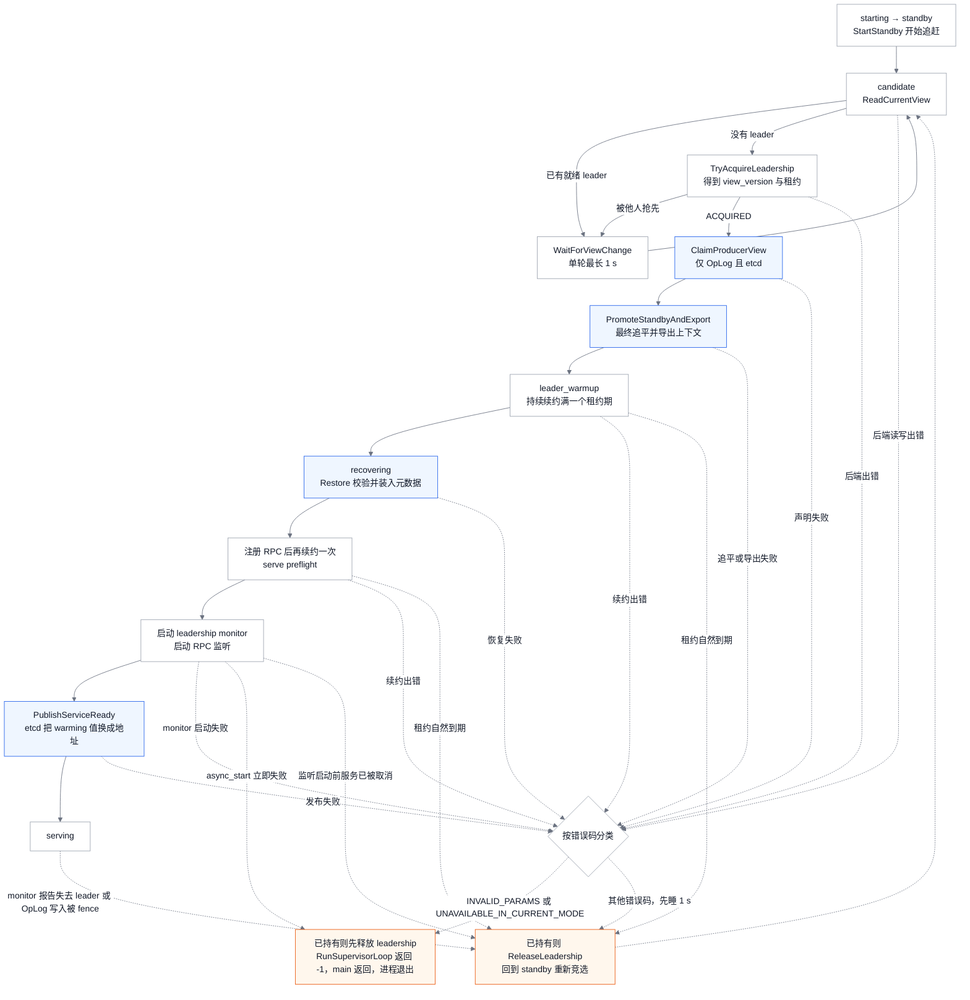
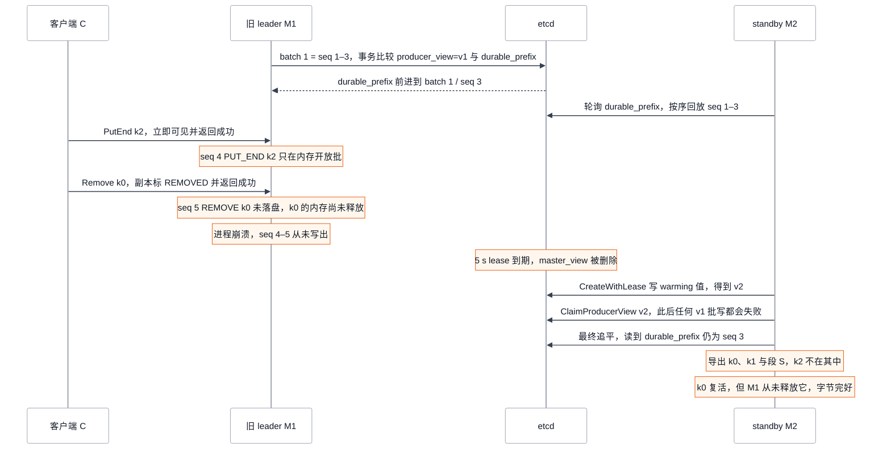
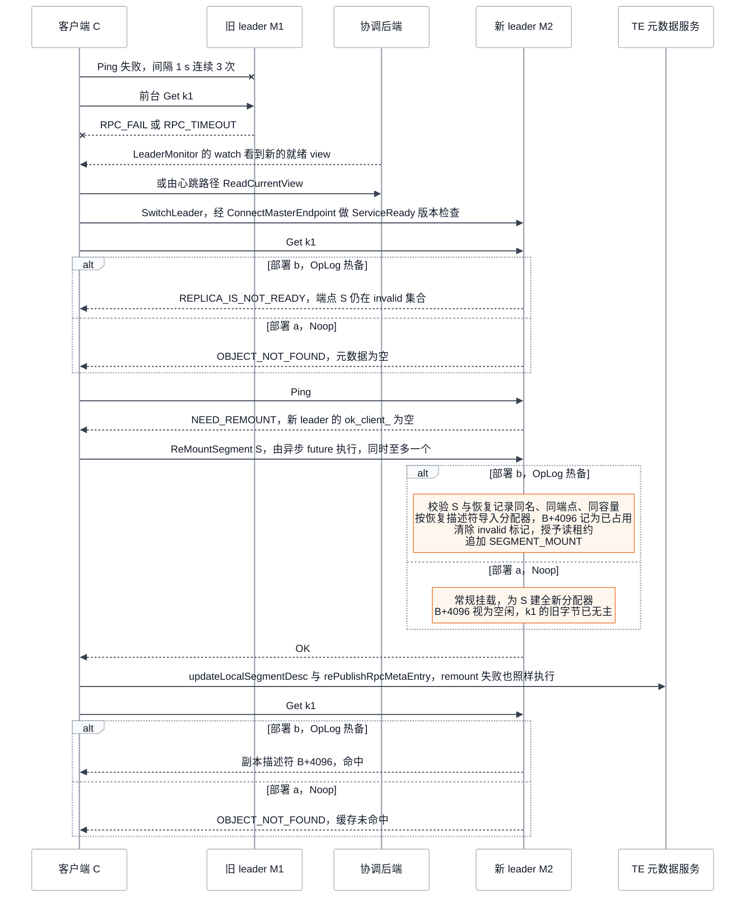

# Mooncake Store 高可用与恢复：选主之后，元数据与已缓存字节怎样重新对上

> **源码基线**：`kvcache-ai/Mooncake@7d3a94e9d8c30abf02fcd64df218c16c1abc70df`（`main`，2026-09-24）
> **主题**：master 进程故障后由谁接管、新 leader 的对象元数据从哪里来、客户端在切换窗口里看到什么。依次展开 supervisor 选主循环与 etcd/redis/k8s 三种协调后端，standby 的 OpLog 回放与快照引导，leader 对外服务前的恢复闸门与二次确认，客户端的 leader 发现、`SwitchLeader`、remount 与 TE 描述重发，以及非 HA 快照；核心代码在 `mooncake-store/src/ha/`、`master_service.cpp` 与 `client_service.cpp`。
> **适用范围**：master 高可用、元数据恢复与客户端重连；对象生命周期、租约与客户端存活归 Store 对象生命周期页，SSD/DFS 分层归分层卸载页，TE 数据面归 Transfer Engine 页，vLLM 侧后果归 vLLM 集成页（静态源码与测试核验，未实跑 etcd/redis/k8s 集群）
> **最近更新**：2026-09-24。新建页。

## 1. 一次切换：两个 master、一个客户端、一个已缓存对象

先用一个具体场景把问题固定下来。etcd 集群上跑着两个 master 候选：`M1 = 10.0.0.1:50051` 是 leader，`M2 = 10.0.0.2:50051` 是 standby，两者 `cluster_id` 都是默认的 `mooncake_cluster`。客户端 C 以 `etcd://…` 形式的地址接入集群，挂载了一个 64 MiB 内存段 S，段名与 Transfer Engine（TE，客户端之间搬运字节的传输引擎）端点都是 `10.0.0.9:17777`，基址记为 B。C 之前 `Put` 了 1 KiB 的对象 `k1`，副本落在 S 的 `B+4096`。这时 M1 进程被 kill。

Mooncake Store 的 master 只持有元数据：对象键到副本描述符（端点、地址、大小）的索引，以及每个段的分配器状态。`k1` 的 1 KiB 字节始终留在 C 的内存里，master 进程死掉并不会带走它们。因此高可用要回答的并不是“数据丢没丢”，而是三件事：谁成为新的唯一服务者；新 leader 的索引从哪里恢复；恢复出的索引能否重新绑定到仍然存活的字节上，并且不会指向已经被复用的地址。

同一次 kill 在两种常见部署下会得到不同结果。下表就是本页要证明的结论，后文逐项给出源码依据：

| 部署 | 切换后新 leader 的元数据 | C 已挂载内存里 `k1` 的字节 | 随后一次 `Get k1` |
|---|---|---|---|
| (a) 只开 `--enable_ha`，不开 OpLog 或快照恢复 | **空**：standby 控制器（standby 进程里负责追赶、并在促升时把元数据交给新 leader 的组件）退化为什么也不做的 `NoopStandbyController`，交出的促升上下文 `PromotionContext`（对象、段与回放位置的打包）是空的，新 leader 从零元数据开始服务 | 仍在原地址，但已无主。C remount（收到心跳提示后，把已挂载的段重新向 master 登记一遍）后，新 leader 为 S 建立全新分配器，这 1 KiB 视为空闲，以后可能被新的 Put 覆盖 | remount 前后都返回 `OBJECT_NOT_FOUND`，对上层来说是一次缓存未命中 |
| (b) etcd 后端 + `--enable_oplog` 热备 | 等于 **etcd 中已 durable（已写进 etcd 的连续前缀）的 OpLog**：`k1` 与段 S 的记录都在；崩溃前只进了内存批、尚未落盘的 `PUT_END` 丢失 | 仍在原地址，在新 leader 眼里是一个“恢复出来但暂不可读”的副本 | C remount 之前返回 `REPLICA_IS_NOT_READY`；remount 按原描述符重建分配器之后命中，返回的仍是 `B+4096` |

两种部署都要经过同一套选主与服务闸门，差别只在 standby 手里有没有可交接的元数据。第 3 节说明谁有资格服务，第 4–5 节说明元数据从哪里来、何时开放，第 6 节从客户端视角重放这次切换，第 7 节讨论快照这一中间形态。切换窗口内的完整错误对照见 §8.1。

## 2. 问题与设计取舍：索引能丢，指错地址不行

master 故障后，最朴素的恢复办法是让新 master 从空索引起步，等客户端重新写入。这样做一定安全，因为空索引不会指向任何字节，代价是整个集群的缓存命中率归零。另一个极端是让每次元数据变更都先同步落盘再回复客户端，这样切换不丢任何索引，但每次 `PutEnd` 都要等一次 etcd 事务。基线代码走的是中间路线，可以归纳为三个决定。

**选主与恢复能力分开配置。** 协调后端（etcd、redis、k8s）只决定谁持有 leadership；standby 能交出什么元数据，由 `CreateStandbyController` 按 OpLog 和快照开关另行选择。所以“开了 HA”并不等于“切换不丢缓存”，(a) 部署就是这两者之间的缺口。

**持久化不对称：新增可以丢，删除不能提前生效。** `PUT_END` 走 `MasterService::AppendOpLogVisibleBeforeDurable`：对象先在 leader 上可见，`PutEnd` 立即返回，OpLog 条目之后才异步成批写入 etcd。`REMOVE` 走 `AppendOpLogWithDurableFinalize`：副本先被标成 `REMOVED`，真正从元数据里摘除并释放内存（`FinalizeRemovedReplicasAfterDurable`）要等该条目 durable 之后。这样，新 leader 恢复出的每个描述符所指的内存，旧 leader 都还没有归还给分配器。最坏情况是一个新写的对象被遗忘，或者一个已删除的对象重新出现，但字节完好；不会出现“索引说是 `k1`，字节其实是别的对象”的情况。这一保证只属于 OpLog 路径，快照-only 热备没有它（§7.2）。源码没有写明这样设计的理由，“用丢失近期写入换取 PutEnd 不等 etcd”是分析推断。

**恢复出的副本在 owner 回来之前不可读。** 新 leader 只能从 OpLog 里知道 S 上有哪些分配，无法确认 C 是否还活着、S 是否仍映射在原地址。因此恢复阶段只给这些副本挂一个占位分配器，并把端点记入 `invalid_replica_endpoints_`（master 内部“这些端点上的副本暂不可读”的集合）；等 C 以相同的段身份 remount，master 才按这些描述符重建真实分配器，副本也才变为可读。

## 3. 选主循环：谁有资格服务

### 3.1 supervisor 的阶段顺序

`--enable_ha=true` 时，`mooncake-store/src/master.cpp::main` 不直接起 RPC 服务，而是构造 `MasterServiceSupervisor` 并调用 `Start()`。`Start()` 先由 `BuildHABackendSpec` 解析后端类型、连接串与 `cluster_id`，再由 `CreateStandbyController` 选择 standby 能力，最后进入 `RunSupervisorLoop`。进程启动后先做 standby，只有赢得选主并走完下图的每一步，才会注册 RPC 并对外发布自己的地址。

<!-- Figure spec: 问题=一个 master 从赢得选主到对外服务要经过哪些关卡，任何一关失败去哪；类型=阶段流程图；实体=supervisor 阶段、MasterRuntimeState 名、错误码分类、两个失败出口；关系=主路径自上而下，虚线为失败：先按错误码分类，致命码释放 leadership 后进程退出，其余释放后睡 1 s 回到 candidate；租约自然到期、监听启动前被取消与 serving 结束则释放后立即回到竞选，不睡；图独有信息=producer view 声明与促升早于续约预热，恢复早于注册 RPC，发布就绪地址是最后一步，INVALID_PARAMS 与 UNAVAILABLE_IN_CURRENT_MODE 让进程退出；证据=master_service_supervisor.cpp::RunSupervisorLoop/HandleSupervisorError/IsFatalHABackendError/HandleLeadershipPhaseError/WarmupLeadership/ClaimProducerViewForServing，master.cpp::main；验证=Mermaid 解析与渲染。 -->

几处顺序值得注意。

- **先 fence 旧 leader 的 OpLog，再促升 standby。** `ClaimProducerViewForServing` 只在 `enable_oplog`、etcd 后端且 `cluster_id` 非空时执行：它把新 view 写进 `/oplog/<cluster_id>/producer_view`。在此之后，旧 leader 的任何批写事务都会在比较 `producer_view` 时失败（§4.2）。standby 的最终追平排在它之后，所以追到的 durable 前缀不会再被旧 leader 延长。
- **促升在预热之前。** `PromoteStandbyAndExport` 停掉 standby 的回放循环并导出上下文，随后 `WarmupLeadership` 在 `session.lease_ttl`（三种后端都是 5 s）内反复 `RenewLeadership`，直到续约满一个完整租约期。源码没有注释这段等待的目的。分析推断：对没有 OpLog fencing 的部署，这是唯一的时间性隔离，让一个可能仍在运行、刚失去租约的旧 leader 有时间通过 leadership monitor 发现并停服。
- **恢复在注册 RPC 之前。** 源码注释写明“Restore is the serving gate”：只有 `RestoreFromBatchOpLogPromotion` 或 `RestoreFromStandby` 成功，才调用 `RegisterRpcService`。恢复失败一定先释放 leadership，不会用残缺的元数据对外服务，部署指南把这称作 fail-closed。
- **失败之后是重试还是退出，由错误码决定。** 各阶段的错误都经 `HandleSupervisorError`（已持有 leadership 时先经 `HandleLeadershipPhaseError` 释放）处理：`IsFatalHABackendError` 把 `INVALID_PARAMS` 与 `UNAVAILABLE_IN_CURRENT_MODE` 判为致命，`RunSupervisorLoop` 返回 -1，`master.cpp::main` 把它作为进程返回值直接退出；其余错误码睡 1 s 后回到 candidate。`RestoreFromStandbyState` 与批快照促升的校验失败（描述符越界、重叠、段不认识、副本 ID 非法等）几乎都是 `INVALID_PARAMS`。在促升与恢复阶段，只有 `INCOMPLETE_OPLOG_CATCH_UP`、`OBJECT_ALREADY_EXISTS`、`INTERNAL_ERROR`、`DFS_SERVICE_UNAVAILABLE` 和 etcd 等后端错误会回到重试。另外两种退出不经过分类：`server.async_start()` 立即失败时释放 leadership 后直接返回 -1；serving 阶段构造 `WrappedMasterService` 时抛出的异常（例如 OpLog writer 连不上 etcd、DFS 与快照互斥）在 supervisor 和 `main` 里都没有被捕获，进程直接终止；此时它仍持有 leadership，下一个候选要等租约自然到期（最长 5 s）才能获取。分析推断：一份内容不合法的 durable 元数据会让赢得选主的节点逐个退出，集群能否恢复取决于外部的进程守护（systemd、k8s 重启策略等）；即使被重启，同一份元数据仍会在恢复时再次触发退出，需要人工处理。
- **注册之后还要确认一次。** `RenewLeadership` 预检、启动 `StartLeadershipMonitor`，然后 `server.async_start()`，最后 `PublishServiceReady`。`detail::ServingStateGate` 把“激活服务”和“失去 leadership 后停服”串行化：monitor 回调或 OpLog writer 进入终止状态时，`RequestShutdown` 先把 admin 可用性置为 false，再停止 RPC 监听。

`MasterRuntimeState` 的七个状态名（`starting`、`standby`、`candidate`、`recovering`、`catching_up`、`leader_warmup`、`serving`）通过 metrics 端口上的 admin 服务对外暴露，`/health`、`/role`、`/ha_status`、`/leader` 可以观察一个节点当前卡在哪一步。

### 3.2 三种协调后端

`LeaderCoordinator` 接口只有六个方法：读当前 view、尝试获取、续约、等待 view 变化、启动 monitor、释放。另有一个带默认实现的 `PublishServiceReady`。`leader_coordinator_factory.cpp::CreateLeaderCoordinator` 按 `HABackendType` 构造三种实现之一。设计文档 `docs/source/design/store/mooncake-store.md` 仍写 HA 通过 etcd 集群协调，基线代码实际支持三种后端；部署指南的 flag 表已列出 `etcd`、`redis`、`k8s`，但只给了前两者的示例。

| 维度 | etcd | redis | k8s |
|---|---|---|---|
| 选主记录 | `mooncake-store/<cluster_id>/master_view`，挂 5 s lease，用 `CreateRevision == 0` 事务创建 | `mooncake-store/{<cluster_id>}/master_view` 哈希，Lua 脚本在键不存在时写入并 `PEXPIRE` | 连接串 `namespace/lease-name` 指定的 Lease 对象，不使用 `cluster_id` |
| `view_version` 来源 | 创建事务的 etcd revision | 独立计数键 `…/master_view_version` 的 `INCR` | Lease 的 `leaseTransitions` |
| 租约与续约 | 5 s，keepalive 线程续约 | 5 s，每 `lease_ttl/3` 续约，最小间隔 200 ms | 租期 5 s、renew deadline 3 s、retry 1 s，由 client-go 选举协程维护 |
| 地址何时对客户端可见 | 获取时写入 `__mooncake_service_warming__:<token>` 占位值，`ReadCurrentView` 把它读作“没有 leader”；`PublishServiceReady` 用 CAS 换成真实地址 | 获取时就写入 `leader_address`（默认 `PublishServiceReady` 为空操作） | 获取时 holder 就是地址 |
| OpLog 与 fencing | 支持 | `main` 直接 FATAL：`enable_oplog currently requires ha_backend_type=etcd` | 同左 |
| 编译开关 | `STORE_USE_ETCD` | `STORE_USE_REDIS` | `STORE_USE_K8S_LEASE`，未编译时返回 `UNAVAILABLE_IN_CURRENT_MODE` |

地址可见时机的差别会影响客户端。etcd 在整个预热与恢复期间都把 view 读成“空”，客户端不会连向一个还没监听的地址。redis 和 k8s 则在获取 leadership 时就暴露地址，客户端 `SwitchLeader` 里的 `ServiceReady` 探测会一直失败，直到新 leader 真正开始监听，客户端按 1 s 节奏重试。对 k8s 后端，只有同时配置了 `pod_name` 与 `pod_namespace`，supervisor 才会在进入 serving 时给 Pod 打上 `mooncake.io/store-role=leader` 标签，失去 leadership 时移除。按标签路由的 Service 就是靠它找到 leader 的；这一用途是推断，打标签本身是源码事实。

三种后端的内部实现（etcd lease、Redis Lua 原子性、client-go 选举）属于外部依赖。本页只陈述 Mooncake 交给它们的参数和从它们读回的字段，不叙述其内部行为。

### 3.3 旧 leader 如何被挡住

仍在运行的旧 leader 有三条停服路径，覆盖面依次变窄。

1. **leadership monitor。** 旧 leader 在 serving 时持有 `StartLeadershipMonitor` 的回调。以 etcd 为例，keepalive 线程一旦退出，就按 `ClassifyLeadershipLossReason` 报告 `kLostLeadership` 或 `kRenewError`，回调随即停止 RPC 监听。
2. **OpLog fencing（仅 etcd + OpLog）。** 新 leader 声明 producer view 之后，旧 leader 的 `OrderedOpLogWriter` 下一次批写事务会得到 `ETCD_TRANSACTION_FAIL`。writer 以 `kFenced` 进入终止状态，supervisor 通过 `SetBatchOpLogTerminalCallback` 停服并回到 standby。这条路径不依赖时钟。
3. **时间隔离。** 新 leader 在预热期续约满一个租约期后才开始恢复与服务（§3.1）。

分析推断：在 (a) 部署里只有第 1、3 条。如果旧 leader 与协调后端之间网络分区，它发现失去 leadership 之前，仍可能继续回应能连到它的客户端。

## 4. 元数据从哪里来：standby 的能力决定恢复内容

### 4.1 `CreateStandbyController` 的选择

`standby_controller.cpp::BuildStandbyRuntimeCapabilities` 只看两个布尔量：

- `has_snapshot_bootstrap = enable_oplog_snapshot || enable_snapshot_restore`
- `has_oplog_following = enable_oplog && backend == etcd`

两者都为假时返回 `NoopStandbyController`，日志为“HA standby controller falls back to noop”。只要有一个为真，就构造 `CapabilityDrivenStandbyController`，内部运行 `HotStandbyService`。组合起来有四种运行形态：

| 形态 | 条件 | standby 持有什么 | 促升时交出什么 |
|---|---|---|---|
| Noop | 两者皆假，包括只开 `enable_ha`，以及 `enable_ha + enable_snapshot` 但不开 `enable_snapshot_restore` | 无 | 空 `PromotionContext` |
| 快照-only | `enable_snapshot_restore`，没有 OpLog 跟随；任意后端 | 启动 standby 时加载的最新目录快照（§7.2） | 该快照转成的对象与段列表，不再追赶 |
| OpLog 跟随 | etcd + `enable_oplog` | 从空或本地热状态出发，持续回放 durable 批 | 追平到最新 durable 前缀后的对象与段列表 |
| OpLog + 批快照 | 再加 `enable_oplog_snapshot` | standby 自己周期生成批快照；启动时先从批快照恢复，再回放后缀 | 整个 `StandbyMetadataStore` 分块移交（`PromoteAndDetachBatchOpLogStore`） |

表中第一行的第二种情况是个配置陷阱：HA leader 上开 `enable_snapshot` 会照常 fork 快照（§7.1），但 standby 控制器只看 `enable_snapshot_restore`，所以这些快照在切换时不会被用到。

### 4.2 OpLog：有序批、durable 前缀与 producer view

用第 1 节的例子稍作延伸，就能看清 OpLog 保证什么、不保证什么。设 M1 依次产生 5 条 OpLog：seq 1 是段 S 的 `SEGMENT_MOUNT`，seq 2 是 `PUT_END k0`，seq 3 是 `PUT_END k1`；这三条已写成 batch 1，durable 前缀为 `{batch 1, last_seq 3}`。随后 C 又 `Put` 了 `k2`（seq 4），并 `Remove` 了 `k0`（seq 5）；这两条还在 writer 的开放批里，M1 就崩溃了。

<!-- Figure spec: 问题=OpLog 的 durable 前缀怎样决定新 leader 能恢复什么，以及为什么不会指向被复用的内存；类型=序列图；实体=客户端 C、旧 leader M1、etcd、standby M2，五条 seq；关系=批写事务同时比较 producer_view 与 durable_prefix，standby 只回放到 durable 前缀，新 leader 先声明 producer view 再最终追平；图独有信息=可见早于落盘的 k2 丢失、删除未落盘的 k0 复活但字节完好；证据=MasterService::AppendOpLogVisibleBeforeDurable/AppendOpLogWithDurableFinalize、OpLogBatchStorage::WriteBatchAndAdvancePrefixImpl/ClaimProducerView、HotStandbyService::FinalCatchUpBatchRecordsLocked；数值=声明的五条 seq 示例；验证=Mermaid 解析。 -->

批写事务 `OpLogBatchStorage::WriteBatchAndAdvancePrefixImpl` 在一次 etcd 事务里完成两件事：比较 `producer_view` 等于本 writer 的 view、`durable_prefix` 等于期望值；然后写入 batch 记录，并把前缀推进到 `{batch_id, last_seq}`。batch 必须恰好接在前缀之后（`batch_id = prefix.batch_id + 1`，`first_seq = prefix.last_seq + 1`），所以 durable 部分永远是一段无空洞的前缀。例子里的 `k1` 能被新 leader 找到，是因为它在这段前缀里；它的 `SEGMENT_MOUNT` 排在更前面，也在其中。`k2` 丢失，因为它只在开放批里。

OpLog 记录七种 `OpType`：`PUT_END`、`PUT_REVOKE`、`REMOVE`、`LEASE_RENEW`、`SEGMENT_MOUNT`、`SEGMENT_UNMOUNT`、`SEGMENT_UPDATE`。其中 `LEASE_RENEW` 在基线下没有写入点，`OpLogApplier::ApplyOpLogEntry` 也把它当作不支持的类型。OpLog 里没有 `PutStart`，所以跨切换进行中的写入必须重做：新 leader 不知道那次预分配，旧 `PutStart` 之后的 `PutEnd` 会得到 `OBJECT_NOT_FOUND`。那段预分配区间在 remount 后导入的分配器里也是空闲的（导入只标记恢复出的描述符）；客户端若仍在往里写，就可能与新分配重叠，这类僵尸写的处理见 [[11_mooncake_store_object_lifecycle_analysis|Store 对象生命周期]] 关于处理超时与抢占的部分，本页不重复。standby 的元数据结构 `StandbyObjectMetadata` 明确不存租约和 soft pin，促升后对象以普通缓存身份继续存在，`hard_pinned` 则会保留。

写入不能入队时，`PutEnd` 的行为是：writer 进入重试期间 `accepting=false`，开放批满 `oplog_batch_max_entries` 时 `Reserve` 返回 `TASK_PENDING_LIMIT_EXCEEDED`。`PUT_END` 与段操作的入队失败只打一条 WARNING（`PutEnd: OpLog queue failed`），`PutEnd` 本身照样返回成功。基线里没有找到之后补发的路径，因此在 etcd 抖动期间写入的对象，一旦发生切换就不会出现在新 leader 上（按源码推导）。删除类操作不会静默丢失，但有一个半生效状态。`Remove` 在预留槽位失败时直接返回错误，删除不生效；陈旧句柄清理（`PersistStaleHandleCleanupForHA`）在提交失败时用 `cancel_remove` 撤回标记。`MasterService::Remove` 却是先 `mark_removed()` 再 `Commit`，`Commit` 失败（writer 已进入终止状态或已停止）时只返回错误，不撤回标记。于是旧 leader 上该对象的全部副本都是 `REMOVED`，`GetReplicaList` 返回 `OBJECT_NOT_FOUND`；这次删除却永远不会 durable，`FinalizeRemovedReplicasAfterDurable` 不会执行，内存也不会释放，切换后对象会在新 leader 上重新出现（按源码推导）。

卸载路径还有一处不对称。`MasterService::NotifyOffloadSuccess` 在存在 master 登记的 offloading task 时（`PutEnd` 在 `enable_offload` 且未开 `offload_on_evict` 时登记的写穿任务，或 `BatchEvict` 登记的任务），直接 `AddReplicas` 加上 LOCAL_DISK 副本，不追加 OpLog；没有 task 时走 `AddReplicaForRetainedClient`，会追加一条 `PUT_END`。按源码推导，OpLog 模式下经 task 路径加上的 LOCAL_DISK 副本不在 durable 前缀里，要等该键下一次 `PUT_END` 才会被带上，切换后新 leader 可能只知道它的内存副本。卸载本身归 [[12_mooncake_store_tiering_offload_analysis|分层与卸载]]。

### 4.3 最终追平与导出

`HotStandbyService::PreparePromotionLocked` 先停掉回放循环，再调用 `FinalCatchUpBatchRecordsLocked`：反复 `PollOnce`，直到本地已应用的 seq 不小于 etcd 里 `durable_prefix.last_seq`。durable 前缀不存在时，只有本地 seq 为 0 才算成功。追不上时返回 `INCOMPLETE_OPLOG_CATCH_UP`，这不是致命码，supervisor 释放 leadership 后回到重试。等待策略分两种：

- **legacy 导出（`PromoteAndExportSnapshot`）** 使用 `kLegacyTotalDeadline`，总时限 30 s。
- **批快照模式（`PromoteAndDetachBatchOpLogStore`）** 使用 `kBoundedNoProgress`：只要仍在前进就一直追，连续 `batch_oplog_retry_timeout_sec`（默认 180 s）无进展才失败。它还会校验 `applied_cursor.last_seq` 与本地 seq 一致、副本 ID 合法（不合法是 `INVALID_PARAMS`，属致命），再把整个 metadata store 移交出去，由 `RestoreFromStandbyState` 按 `kDefaultBatchOpLogPromotionChunkObjects`（100 万）分块装入。

源码没有说明两种模式为什么用不同的时限。分析推断：批快照模式面向大规模元数据，促升时要追的后缀可能很长，standby 也可能刚因 compaction floor 做过 rebootstrap。固定 30 s 总时限会让一次仍在稳定前进的追平失败；释放 leadership 后，下一个候选面对的是同样长的后缀，可能一直选不出 leader。以“无进展”为界，只在真正卡住时才放弃，代价是这次促升的最长耗时没有上界。

`IsReadyForPromotion` 对复制滞后只打警告，不阻止促升（阈值 `max_replication_lag_entries` 在 `CreateStandbyService` 中写死为 1000）。滞后多少，由最终追平负责补齐。

### 4.4 Noop 的后果

`NoopStandbyController::PromoteStandbyAndExport` 直接返回默认构造的 `PromotionContext`。其中 `metadata_store` 为空，supervisor 因此走 `RestoreFromStandby(objects={}, seq=0, segments={})`。这条路径的校验照常执行，只是没有任何内容。测试 `HighAvailabilityTest.HaWithoutOplogRestoresEmptyContextAndServes` 断言这样的 leader 能进入 serving。

对第 1 节的例子而言，C 随后 remount S 时，`ReMountSegment` 在 `standby_accounted_memory_bytes_` 里找不到 S，不做任何副本重绑定；`ScopedSegmentAccess::MountSegment` 为 S 建立一个全新分配器，`k1` 占用的 `B+4096` 在新分配器里是空闲空间。这 1 KiB 字节没有被清除，只是不再有任何索引指向它，下一次恰好分到这段地址的 Put 会覆盖它。所以 (a) 部署的一次切换等价于整个集群缓存清空，只是物理内存并没有被立即覆写。

## 5. 服务前的恢复闸门

无论元数据来自 OpLog、快照还是空上下文，新 leader 都要经过 `MasterService::RestoreFromStandbyState`。它在 `client_mutex_` 与 `snapshot_mutex_` 两把写锁下执行一组校验，任一失败就返回错误。每一块的校验都先于写入；测试 `RestoreFailureKeepsExistingState` 验证一次失败的恢复不会写入无效对象，也不会破坏已有状态。批快照多块恢复若在中途失败，supervisor 会先销毁整个 `WrappedMasterService` 再释放 leadership，所以不会以半装入的状态对外服务。释放之后的去向由错误码决定（§3.1）：下列校验失败除 DFS 一条外都返回 `INVALID_PARAMS`，属于致命错误，进程退出；`OBJECT_ALREADY_EXISTS`、`INTERNAL_ERROR`（分块读取失败）与 `DFS_SERVICE_UNAVAILABLE` 会回到重试。

- DFS 模式在读取任何内容之前就拒绝（`DFS_SERVICE_UNAVAILABLE`），空上下文也不例外（`RestoreRejectsDfsMode` 用的就是空上下文），因为 DFS 分配器状态不可恢复。所以 DFS 与**任何** HA 模式都不兼容，而不只是与快照、OpLog 互斥（§8.2）。只开 `enable_ha`（Noop）再设 `MOONCAKE_ENABLE_DFS` 时，构造检查不会报错，每次促升却都在这里失败；这个错误码不是致命的，于是释放、1 s 后重试、再失败，循环往复。只开 `enable_snapshot_restore` 的 HA 部署也落入同一循环，因为 supervisor 在构造 serving 服务前强制关掉了该项，构造检查不会拦截。客户端看到的症状因后端而异：etcd 一直把 view 读作空，新客户端在 30 s 初始发现超时后以 `UNAVAILABLE_IN_CURRENT_STATUS` 失败；redis 与 k8s 在获取 leadership 时就公布地址，客户端读得到地址，但 `Connect` 里的 `ServiceReady` 探测失败（按源码推导的活锁）。
- 每个内存段必须有非空的名字、端点和容量，名字与端点不能在两个段之间重复。
- 每个内存副本的端点必须能在恢复出的段表里找到，大小必须等于对象大小；同一段内的地址区间不能重叠，累计大小不能超过段容量。
- 副本 ID 不能为 0，不能重复。恢复成功后，`Replica::next_id_` 被推进到最大 ID 之后，防止新分配与恢复出的 ID 冲突。

装入的内存副本并不直接可读。每个恢复出的内存段都配一个 `DummyBufferAllocator`，只登记端点，分配与释放都是空操作，并被 `standby_allocator_keepalive_` 持住；新 leader 的段管理器此时还没有这些段，所以它们的端点全部进入 `invalid_replica_endpoints_`。`TryGetReadableReplicaDescriptor` 遇到这类端点就跳过。`MasterService::GetReplicaList` 在可读副本列表为空时再分两种情况：全部副本都是 `REMOVED` 返回 `OBJECT_NOT_FOUND`，否则返回 `REPLICA_IS_NOT_READY`，恢复出、尚未 remount 的对象属于后者。测试 `UnreadableRestoredMemoryReplicaIsNotEvictable` 还说明，这种不可读副本不会被淘汰或拿去抵扣配额，也就不会在 owner 回来之前被回收。

部署指南把这一步描述为过滤“registry 里已不存在的段”上的副本。源码的实际判据更宽：恢复时新 leader 的段管理器中尚未挂载的所有端点都会被过滤，而全新进程里所有段都满足这一条件。因此在 owner remount 之前，所有恢复出的内存副本一律不可读。

清除 invalid 标记、释放占位分配器的唯一路径，是该段 owner 的 remount（§6.2）。基线 `master_service.cpp` 中没有找到针对“永远不回来的段”的超时回收：这些对象会以不可读状态一直留在元数据里，直到被其他生命周期路径处理（归 [[11_mooncake_store_object_lifecycle_analysis|Store 对象生命周期]]）。

## 6. 客户端：发现新 leader、remount 与 TE 描述重发

<!-- Figure spec: 问题=客户端从旧 leader 失联到 Get 重新命中（或确认未命中）经历哪些步骤，两种部署在哪里分叉；类型=带 alt 分支的序列图；实体=客户端 C、旧 leader M1、协调后端、新 leader M2、TE 元数据服务，沿用 k1 与 B+4096 示例；关系=两条发现路径汇合到 SwitchLeader，Ping 返回 NEED_REMOUNT 触发异步 remount，master 侧按部署分叉：b 按恢复描述符导入分配器，a 建全新分配器，客户端随后重发 TE 描述；图独有信息=b 在 remount 前 REPLICA_IS_NOT_READY、之后命中原地址，a 前后都是 OBJECT_NOT_FOUND 且 B+4096 被视为空闲；证据=Client::LeaderMonitorThreadMain/StorageHeartbeatThreadMain/SwitchLeader/ConnectMasterEndpoint、MasterService::Ping/ReMountSegment/GetReplicaList；验证=Mermaid 解析与渲染。 -->

### 6.1 两条发现路径

客户端的 master 地址写成 `etcd://…`、`redis://…` 或 `k8s://…` 时，`ParseHABackendSpec` 会构造与 master 同类的 coordinator。`Client::ConnectToMaster` 先用 `ReadCurrentViewOrWaitForReady` 最多等 30 s（`kInitialLeaderReadyTimeout`），等不到就绪 leader 则返回 `UNAVAILABLE_IN_CURRENT_STATUS`。连上之后，有两条路径会触发切换。

- **`LeaderMonitorThreadMain`**：阻塞在 `WaitForViewChange` 上，超时 30 s，仅作兜底重读，平时靠后端 watch 唤醒。etcd 的 warming 值被读作空 view 时，它清掉本地的当前 view，等下一次就绪值；拿到新 view 就调用 `SwitchLeader`。
- **`StorageHeartbeatThreadMain`**：每 1 s 调用一次 `Ping`，连续 3 次失败后 `ReadCurrentView` 并 `SwitchLeader`；没有就绪 view 时每 1 s 重试。

`SwitchLeader` 拒绝版本更低的 view。对同版本、同地址且上次 ping 成功的 view，它什么也不做；否则调用 `Client::ConnectMasterEndpoint`（在 `MasterClient::Connect` 外包一层心跳指标观测），由 `MasterClient::Connect` 切换连接池地址，并用 `ServiceReady` RPC 核对服务端与客户端的版本号，版本不一致会返回 `INVALID_VERSION`。进入 HA 运行态后（`EnterHaRuntimeMode`），心跳与探测使用单独的连接池：`connect_retry_count = 0`、连接超时 1 s。据源码注释，这是为了避免旧 Pod IP 丢弃 SYN 时，YLT 默认的 4 × 30 s 重试预算拖慢切换。前台 RPC 保持原有重试策略。

`SwitchLeader` 之后、remount 完成之前的这段时间，前台 `Get` 的结果取决于 `MasterService::GetReplicaList`：(b) 部署里对象存在但没有可读副本、也并非全部 `REMOVED`，返回 `REPLICA_IS_NOT_READY`；(a) 部署里键根本不存在，返回 `OBJECT_NOT_FOUND`。`Client::Query` 把 `GetReplicaList` 的错误原样返回，不在这一层重试。

两个容易配错的地方：

- **地址形式。** 客户端如果仍用 `IP:Port` 直连一个 HA 集群，就没有 coordinator。心跳失败后只会重连同一个地址，跟不到新 leader。
- **命名空间。** master 的选主键与 OpLog 键都用 `--cluster_id`；客户端构造 coordinator 时 `cluster_namespace` 为空，由 `HaClusterNamespaceConfig::FromEnvironment` 读环境变量 `MC_STORE_CLUSTER_ID`，未设置时默认 `mooncake_cluster`。master 改了 `cluster_id` 而客户端没有设这个变量，客户端就会盯着另一个键。部署指南只把 `MC_STORE_CLUSTER_ID` 列为客户端指标标签，设计文档写它默认是 `mooncake`，两处都与源码不符，以源码为准。k8s 后端的 Lease 名来自连接串，不受这两个变量影响。

### 6.2 `NEED_REMOUNT` 与 master 侧的分配器重建

`MasterService::Ping` 只在客户端的存活观测被接受、并且客户端已在 `ok_client_` 中时返回 `OK`，否则返回 `NEED_REMOUNT`。新 leader 的 `ok_client_` 起始为空，所以切换后每个客户端的第一次 Ping 都会触发 remount。非 HA 重启后同理，测试 `NonHAReconnectTest.ClientAutoReconnectAndRemount` 覆盖了这一路径。

客户端用 `std::async` 在独立线程里调用 `ReMountSegment`。同一时刻最多一个 remount，是靠心跳循环里的 `remount_segment_future.valid()` 检查保证的：上一个 future 还没结束就不再发起。remount 线程持有的 `mounted_segments_mutex_` 防的是另一件事：据源码注释，它避免一个段先被卸载成功、又被这次 remount 重新挂回去。master 侧的 `MasterService::ReMountSegment` 依次执行：

1. `ValidateStandbyRemountSegment`：该段若对应一个恢复出的段记录，名字、端点、容量必须完全一致，否则返回 `INVALID_PARAMS`；对应恢复记录且协议为 `cxl` 的段返回 `UNAVAILABLE_IN_CURRENT_MODE`。
2. 常规挂载，为 S 建立一个真实分配器。
3. 扫描全部元数据分片，找出端点属于 S 的已恢复内存副本，用 `BuildRegionLiveAllocations` 把它们的描述符转成活跃分配。然后按分配器类型调用 `ImportOffsetBufferAllocator` 或 `ImportCachelibBufferAllocator`，得到一个“这些区间已占用”的分配器。
4. 原子地替换分配器，把新的 `AllocatedBuffer` 绑回副本；从 `invalid_replica_endpoints_` 删除 S，对受影响的对象 `GrantReadLease(default_kv_lease_ttl)`，把客户端加入 `ok_client_`。
5. OpLog 模式下为每个段追加 `SEGMENT_MOUNT`，让下一代 standby 也知道这个段。

任一步失败都会回滚本次新挂载的段，副本保持不可读，可以重试（`FailedRemountKeepsReplicaInvalidAndCanBeRetried`、`MultiSegmentRemountFailurePublishesNeitherSegment`）。`RemountMakesRestoredMemoryReplicaReady` 断言 remount 后两个恢复对象的地址仍是 `base` 与 `base+4096`，并且新分配不会落到它们上面；`RemountRestoresCachelibMemoryReplica` 覆盖 cachelib 分配器。

### 6.3 TE 描述重发

remount 之后，客户端还会调用 `transfer_engine_->getMetadata()->updateLocalSegmentDesc()` 与 `rePublishRpcMetaEntry(local_hostname_)`。这两步不看 remount 的结果：`ReMountSegment` 失败只打一条 ERROR 日志，随后照样重发。据源码注释，这是为了覆盖 HTTP 元数据服务与 master 同进程部署的情形：master 重启后，内存中的 TE 段描述和 `mooncake/rpc_meta/<hostname>` 都会丢失，远端 peer 查询时得到 404，数据传输随之失败。两次发布各自失败时会置 pending 标志，由下一次成功的 ping 单独重试。LOCAL_DISK 段不在这里 remount，而是交给 `FileStorage::Heartbeat` 在遇到 `SEGMENT_NOT_FOUND` 时处理（归 [[12_mooncake_store_tiering_offload_analysis|分层与卸载]]）。TE 段描述的格式与读取方归 [[10_mooncake_transfer_engine_analysis|Transfer Engine]]。

## 7. 快照：非 HA 重启与快照-only 热备

### 7.1 fork 式目录快照

`--enable_snapshot` 在两种情况下都会让 `MasterService` 构造 `MasterSnapshotManager`：非 HA；或 HA 但没有 OpLog（`enable_snapshot && !enable_oplog_`）。另有一个硬前提：`memory_allocator` 必须是 `offset`。选 `cachelib` 时，快照管理器不会被创建，而且没有任何日志提示。OpLog 模式下，主节点打印“Skipping primary snapshot generation”，快照改由 standby 的批快照协调器负责。

快照线程每 `snapshot_interval_seconds` 醒一次，在 `snapshot_mutex_` 写锁下 `fork()`。子进程把元数据、段与任务管理器状态序列化后上传到对象存储（`local` 或 `s3`），再更新目录中的 `latest` 标记；父进程等待子进程，超时（`snapshot_child_timeout_seconds`）先发 SIGTERM，仍不退出再发 SIGKILL。上传成功后只保留最近 `snapshot_retention_count` 份。有客户端正在下线（offboarding）时，本轮跳过。

### 7.2 恢复时的租约过滤

恢复有两个入口。

- **非 HA**：构造函数里 `enable_snapshot_restore && !enable_oplog_snapshot` 时调用 `RestoreState`，按候选顺序逐个尝试 `DownloadSnapshotPayloads → Decode → ApplySnapshotState`，全部失败则以空状态启动。
- **HA 快照-only standby**：`CatalogBackedSnapshotProvider` 在 standby 启动时读取最新快照，promotion 时经 legacy 导出交给新 leader。

两条路径都会丢弃一类对象。`ApplySnapshotState` 删除“并非全部副本 `COMPLETE`”或“读租约已过期”的对象。`DeserializeStandbyObjectMetadata` 同样跳过 `lease_timeout <= now` 的条目，以及含非 `COMPLETE` 副本或内存句柄失效的条目。这里的读租约，是对象最近一次被读时授予的截止时间：`PutEnd` 授予零时长租约，每次读取延长 `default_kv_lease_ttl`（默认 10 s）。快照测试需要设置 `MOONCAKE_MASTER_SERVICE_SNAPSHOT_TEST_SKIP_CLEANUP` 才能绕过这一清理。

按源码推导，这意味着快照恢复只保留“恢复时刻读租约仍未到期”的对象，也就是快照前约 10 s 内被读过、且在租约到期前完成恢复的那一小部分。其余对象即使在快照里，也不会被恢复。源码没有给出理由。分析推断：租约是 master 承诺“到期前不回收这块内存”的截止时间。非 HA 重启时，旧 master 进程在恢复之前就已退出，恢复时刻租约仍未到期的对象，旧 master 生前不可能回收过它的地址，所以对 `RestoreState` 而言，这条过滤恰好是内存安全的前提。

这个前提对 HA 快照-only standby 不成立（分析推断，基线下没有测试覆盖这一场景）。这里的租约过滤只在 `HotStandbyService::Start` → `LoadSnapshotBaselineLocked` → `DeserializeStandbyObjectMetadata` 时执行一次，时刻记为 T0；之后旧 leader 还会继续服务到 T1，其间可以淘汰或删除 T0 之后租约才到期的对象，并把地址分给别的对象。促升时，`PromoteAndExportSnapshot` 原样导出 T0 的集合，不再过滤；`RestoreFromStandbyState` 本身不检查租约；C remount 时，`ReMountSegment` 按这些陈旧描述符导入分配器并把副本标为可读。于是一次随后的 `Get` 可能拿到另一个对象的字节。恢复出的对象不带 `object_checksum`，在 `Client::VerifyObjectChecksum` 里因缺少期望值被直接放行，即使客户端开了对象校验也拦不住。这一点并非快照-only 独有：OpLog 的 `MetadataPayload` 与 `StandbyObjectMetadata` 都没有 checksum 字段，所以任何经切换恢复出的对象都会跳过对象校验。与之对照，OpLog 路径靠 §2 的“删除先落盘”保证：旧 leader 在删除 durable 之前从不释放内存，所以恢复出的描述符不会指向被复用的地址。

快照-only standby 还有一个时效问题：快照只在 `HotStandbyService::Start` 时加载一次（`PrepareBootstrapBaselineLocked` → `LoadSnapshotBaselineLocked`），此后不再追赶。促升时，`FinalCatchUpForPromotionLocked` 在 `enable_oplog_following=false` 下直接返回 OK。所以交出的是这个 standby 启动时那一刻的快照；叠加上面的租约过滤，一个长期待命的 standby 恢复出的对象通常很少（推断）。standby 每次重新 `Start`，例如自己当过 leader 后回到 standby 时，会重新加载最新快照（`TestStart_SnapshotOnlyRestartRefreshesNewerCatalogSnapshot`）。

`enable_oplog_snapshot` 的批快照是另一套机制：由 standby 从自己的 `StandbyMetadataStore` 生成，不含租约，启动时先恢复快照再回放后缀，并借助 compaction floor 做 OpLog 裁剪。本页只把它作为 §4.1 的第四种形态登记；其分块、GC 与裁剪协议在基线下没有展开。

## 8. 切换窗口与失败边界

### 8.1 客户端在各窗口看到什么

| 窗口 | 客户端观察 | 成因 |
|---|---|---|
| 旧 leader 已死，etcd lease 尚未到期（最长 5 s） | 前台 RPC 返回 `RPC_FAIL` 或 `RPC_TIMEOUT`；心跳累计失败 | 选主记录仍在，standby 无法获取 leadership |
| 新 leader 已获取，处于促升、预热、恢复阶段 | etcd：view 读作空，心跳路径打印“No active master view is published yet”；redis/k8s：地址可见，但 `ServiceReady` 探测失败 | 预热至少续约满 5 s，恢复耗时与对象数成正比 |
| 已 `SwitchLeader`，尚未 remount | (a) `OBJECT_NOT_FOUND`；(b) 该段上的对象返回 `REPLICA_IS_NOT_READY`，其他仍有可读副本的对象正常 | (b) 中端点仍在 `invalid_replica_endpoints_` |
| remount 已完成 | (a) 仍为 `OBJECT_NOT_FOUND`，新 Put 可能覆盖旧字节；(b) 命中，地址不变 | (b) 中分配器已按描述符重建 |
| 恒定损失 | (b) 崩溃前未 durable 的 `PUT_END`、跨切换的 `PutStart`、soft pin 状态、经 offloading task 加上的 LOCAL_DISK 副本；未 durable 的 `REMOVE`（包括 `Commit` 失败留下的半删除）会让对象复活 | §4.2 |
| 读到错误字节的风险 | 快照-only 热备：remount 后 `Get` 可能返回已被旧 leader 复用地址上的另一个对象的字节，对象校验也不会报错（推断） | §7.2：租约过滤只在 standby 启动时做一次，恢复和 remount 都不再检查 |
| 促升无法完成 | 恢复遇到致命码时进程退出，要靠外部重启；只开 `enable_ha` 又开 DFS 时，促升无限重试，永远没有 leader（推断） | §3.1、§5 |

从崩溃到新 leader 可服务的下界大致是：lease 到期检测（≤ 5 s，进程正常退出时会主动 revoke）、加上预热（5 s）、加上最终追平与恢复。这个估算来自源码中的常量，没有经过实测。

### 8.2 硬约束与互斥

| 前提 | 源码位置 | 违反时 |
|---|---|---|
| HA 需要可解析的后端连接串；只有 etcd 能回退到 `etcd_endpoints` | `master.cpp::main`，`ResolveConfiguredHABackendConnstring` | `LOG(FATAL)`，进程退出 |
| `enable_oplog` 需要 `enable_ha` 且后端为 etcd | `master.cpp::main`；`MasterService` 构造时 `enable_oplog_ = enable_ha && enable_oplog && etcd` | `LOG(FATAL)` |
| `enable_oplog_snapshot` 需要 OpLog、etcd、合法 `cluster_id`、`snapshot_chunk_object_count > 0`、可解析的对象存储类型 | `batch_oplog/config.h::ValidateBatchOpLogSnapshotConfig` | `LOG(FATAL)` |
| 后端未编译进二进制 | `ha_types.h::ValidateHABackendAvailability` | supervisor 视 `UNAVAILABLE_IN_CURRENT_MODE` 与 `INVALID_PARAMS` 为致命错误，`Start` 返回 -1 |
| DFS 分配器与任何 HA 模式都不兼容；与快照、快照恢复、OpLog 的互斥在构造时检查 | `MasterService::InitDfsAllocatorFromEnvironment`（环境变量 `MOONCAKE_ENABLE_DFS`）；`MasterService::RestoreFromStandbyState` | 开了快照、快照恢复或 OpLog：构造时抛 `std::invalid_argument`，非 HA 的 `main` 与 HA 的 supervisor 都不捕获，进程终止。例外是 HA 下只开 `enable_snapshot_restore`：supervisor 构造 serving 服务前强制 `wrapped_config.enable_snapshot_restore = false`，构造检查因此放行。这种情况和只开 `enable_ha` 一样：构造通过，但每次促升在恢复第一步就返回 `DFS_SERVICE_UNAVAILABLE`（空上下文也一样，`RestoreRejectsDfsMode`），非致命，于是释放、重试、再失败，永远没有 leader（推断的活锁） |
| CXL 段不能经 standby 恢复重新绑定 | `ValidateStandbyRemountSegment`；`ReMountSegment` 副本扫描 | remount 返回 `UNAVAILABLE_IN_CURRENT_MODE`（`RemountRejectsCxlForStandbyMemorySegment`） |
| 段卸载后的副本清理，只有在“非 HA、未开快照、未开 CXL”时才异步 | `MasterService` 构造的 `enable_async_segment_cleanup_`；`UnmountSegment` | 其余情况在 `UnmountSegment` 内同步 `ClearInvalidHandles`，卸载 RPC 更慢，但快照与 OpLog 看到的状态一致 |
| 目录快照需要 offset 分配器 | `MasterService` 构造中的 `memory_allocator_type_ == OFFSET` | cachelib 下不创建快照管理器，也没有日志 |
| 目录快照需要 `local` 或 `s3` 对象存储；`local` 需要 `MOONCAKE_SNAPSHOT_LOCAL_PATH` | `ParseSnapshotObjectStoreType`；`local_file_snapshot_config.cpp` | 空串或未知类型抛异常，构造失败 |
| standby 必须处于运行状态才能促升 | `CapabilityDrivenStandbyController::PromoteStandbyAndExport` | 返回最近一次 standby 错误或 `UNAVAILABLE_IN_CURRENT_STATUS`，supervisor 释放 leadership；该错误若是 `INVALID_PARAMS` 或 `UNAVAILABLE_IN_CURRENT_MODE` 则进程退出，否则 1 s 后重试（§3.1） |
| 恢复出的元数据必须通过全部校验 | `MasterService::RestoreFromStandbyState`；`HandleLeadershipPhaseError` → `IsFatalHABackendError` | 描述符类校验失败返回 `INVALID_PARAMS`：释放 leadership 后进程退出；`OBJECT_ALREADY_EXISTS`、`INTERNAL_ERROR`、`DFS_SERVICE_UNAVAILABLE` 则回到重试。退出后的恢复依赖外部进程守护，同一份 durable 元数据会让重启后的节点再次退出（推断） |

## 9. HA 错误码

`types.h::ErrorCode` 为高可用预留了 -1000 到 -1099，基线实际使用 -1000 到 -1007 和 -1010 到 -1012，-1008 与 -1009 未分配。

| 错误码 | 值 | 在本页链路中的产生点 |
|---|---|---|
| `ETCD_OPERATION_ERROR` | -1000 | etcd 操作失败；keepalive 以此退出时重置 etcd 客户端，并按 `kRenewError` 报告失去 leadership |
| `ETCD_KEY_NOT_EXIST` | -1001 | `ReadCurrentView` 把它读作“没有 leader”；fenced 批写发现 `producer_view` 键不存在时按被 fence 处理，对外返回 -1002 |
| `ETCD_TRANSACTION_FAIL` | -1002 | 争抢 `master_view` 失败（`CONTENDED`）、`PublishServiceReady` 的 CAS 失败、OpLog 批写比较失败；最后一种会让 writer 进入 `kFenced` 终止状态 |
| `ETCD_CTX_CANCELLED` | -1003 | etcd watch 或 keepalive 被取消；keepalive 以此退出时归类为 `kLostLeadership` |
| `OPLOG_ENTRY_NOT_FOUND` | -1004 | 基线下几乎没有产生点；仅在快照序号解析中与 `ETCD_KEY_NOT_EXIST` 同样视为“前缀不存在” |
| `K8S_LEASE_OPERATION_ERROR` | -1005 | k8s Lease 辅助函数调用失败 |
| `K8S_LEASE_NOT_FOUND` | -1006 | k8s `ReadCurrentView` 读作“没有 leader” |
| `INCOMPLETE_OPLOG_CATCH_UP` | -1007 | 最终追平无法证明已应用全部 durable 前缀，或批快照 rebootstrap 落后于 compaction floor；促升失败、释放 leadership，非致命，回到重试 |
| `UNAVAILABLE_IN_CURRENT_STATUS` | -1010 | standby 未运行时拒绝促升；客户端 30 s 内等不到就绪 leader；writer 重试期间拒绝 `Reserve` |
| `UNAVAILABLE_IN_CURRENT_MODE` | -1011 | 后端未编译；CXL 段经 standby 恢复后 remount。supervisor 把它与不在本区段的 `INVALID_PARAMS` 一起视为致命，任何阶段遇到都让进程退出 |
| `NOT_SUPPORTED` | -1012 | 位于 HA 区段，但基线下的产生点在文件存储与 DFS 分配器，不在 HA 链路上 |

## 10. 配置契约

以下是 `mooncake-store/src/master.cpp` 中与高可用、OpLog、快照和命名空间有关的 gflags；同名键也可以写在 `--config_path` 指向的配置文件里（`InitMasterConf`）。

### 10.1 选主与命名空间

| 字段 | 类型 | 默认 | 契约 |
|---|---|---|---|
| `enable_ha` | bool | `false` | 为真时 `main` 走 `MasterServiceSupervisor`，为假时直接起 RPC 服务 |
| `ha_backend_type` | string | `etcd` | `etcd`、`redis` 或 `k8s`；其他值在 `BuildHABackendSpec` 中得到 `INVALID_PARAMS`，属致命错误 |
| `ha_backend_connstring` | string | `""` | 后端连接串：etcd 为分号分隔的端点，redis 为 `redis://host:port`，k8s 为 `namespace/lease-name`（省略 namespace 时用 `default`）。非空时优先于 `etcd_endpoints`；同时设置且不一致时打警告 |
| `etcd_endpoints` | string | `""` | 兼容别名，仅当后端为 etcd 且 `ha_backend_connstring` 为空时生效；非 HA 模式下设置只打警告 |
| `cluster_id` | string | `mooncake_cluster` | etcd/redis 选主键的命名空间、OpLog 与批快照键的前缀、目录快照 catalog 的命名空间，也用于 `root_fs_dir/<cluster_id>` 持久化目录；客户端侧须用 `MC_STORE_CLUSTER_ID` 设成同一个值 |
| `pod_name` | string | `""`，回退读 `$POD_NAME` | 与 `pod_namespace` 同时非空且后端为 k8s 时，serving 期间给 Pod 打 `mooncake.io/store-role=leader` 标签 |
| `pod_namespace` | string | `""`，回退读 `$POD_NAMESPACE` | 同上 |

本类 7 个字段，表中覆盖 7 个。

### 10.2 OpLog 热备

| 字段 | 类型 | 默认 | 契约 |
|---|---|---|---|
| `enable_oplog` | bool | `false` | 主节点创建 fenced `OrderedOpLogWriter`，standby 跟随 durable 前缀；需要 HA 与 etcd |
| `enable_oplog_snapshot` | bool | `false` | standby 周期生成批快照、启动时先从批快照恢复，并做 OpLog 裁剪；前置条件见 §8.2 |
| `snapshot_chunk_object_count` | uint64 | `1000000` | 每个批快照分块的对象数上限，必须大于 0 |
| `oplog_poll_interval_ms` | int32 | `1000` | standby 轮询 durable 前缀的基础间隔，也是追平重试退避的初值 |
| `oplog_batch_max_entries` | uint32 | `1024` | writer 开放批可容纳的保留与已提交条目上限；满了以后 `Reserve` 返回 `TASK_PENDING_LIMIT_EXCEEDED`，其中 `PUT_END` 被静默丢弃（§4.2） |
| `batch_oplog_retry_timeout_sec` | uint32 | `180` | standby 可重试错误的最长连续窗口；也是批快照模式下促升追平的“无进展”超时 |

本类 6 个字段，表中覆盖 6 个。

### 10.3 目录快照

| 字段 | 类型 | 默认 | 契约 |
|---|---|---|---|
| `enable_snapshot` | bool | `false` | 非 HA 或无 OpLog 的 HA leader 上，启动 fork 式快照线程；仅支持 offset 分配器 |
| `enable_snapshot_restore` | bool | `false` | 非 HA：构造时 `RestoreState`；HA：standby 启动时从目录快照引导。HA serving 的 leader 强制关闭此项，只从 `PromotionContext` 恢复 |
| `snapshot_interval_seconds` | uint64 | `600` | 目录快照间隔；批快照协调器也用这个值 |
| `snapshot_child_timeout_seconds` | uint64 | `300` | 快照子进程超时，超时后依次发 SIGTERM、SIGKILL |
| `snapshot_retention_count` | uint32 | `2` | 保留最近几份快照；开了 `enable_snapshot` 时为 0 会抛异常 |
| `snapshot_backup_dir` | string | `""` | 非空时，上传改为全部尝试而不是 fail-fast，失败的文件与 `latest` 另存到本地目录 |
| `snapshot_object_store_type` | string | `""` | `local` 或 `s3`；启用快照时空串会抛异常；`s3` 需要编译时带 AWS SDK |
| `snapshot_payload_store_type` | string | `""` | 已弃用，是上一项的别名，命令行使用时打警告 |
| `snapshot_payload_backend_type` | string | `""` | 已弃用，同上 |
| `snapshot_catalog_store_type` | string | `""` | 空串或 `embedded` 表示目录与对象存储放在一起；`redis` 需要连接串（`payload` 是已弃用别名） |
| `snapshot_catalog_backend_type` | string | `""` | 已弃用，是上一项的别名 |
| `snapshot_catalog_store_connstring` | string | `""` | redis 目录的连接串；为空时回退到 `ha_backend_connstring` |
| `snapshot_catalog_backend_connstring` | string | `""` | 已弃用，是上一项的别名 |

本类 13 个字段，表中覆盖 13 个。

本页三类配置共覆盖 26 个 master gflags。`root_fs_dir`、`global_file_segment_size` 的帮助文本虽然提到 HA，实际属于存储后端，与客户端存活、租约、淘汰相关的 TTL 类 flags 同样不在本页；其余 master gflags 的 owner 记录在 `docs/coverage/mooncake.md`。

## 11. 按问题回到源码与测试

下表路径相对冻结的 Mooncake 仓库，`ms/` 即 `mooncake-store/`；`::` 后是稳定符号或测试名。这些测试是复核入口，本次没有运行任何依赖 etcd、redis 或 k8s 的测试。

| 要复核的结论 | 源码/测试入口 |
|---|---|
| HA 与非 HA 的分叉，以及启动期约束 | `ms/src/master.cpp::main`（supervisor 的返回值即进程返回值）；`ms/include/master_config.h::ResolveConfiguredHABackendConnstring`；`ms/include/ha/snapshot/batch_oplog/config.h::ValidateBatchOpLogSnapshotConfig` |
| 选主、fence、促升、预热、恢复、预检、发布的顺序，以及失败时重试还是退出 | `ms/src/ha/leadership/master_service_supervisor.cpp::RunSupervisorLoop/WarmupLeadership/ClaimProducerViewForServing/HandleSupervisorError/HandleLeadershipPhaseError/IsFatalHABackendError`；`ms/include/ha/leadership/master_service_supervisor.h::detail::ServingStateGate`；`ms/tests/ha/leadership/high_availability_test.cpp::ServingStateLossDoesNotWaitForPublication/ServingStateSerializesActivationAndLoss` |
| 三种后端的键、版本号与就绪可见性 | `ms/src/ha/leadership/leader_coordinator_factory.cpp::CreateLeaderCoordinator`；`ms/src/ha/leadership/backends/etcd/etcd_leader_coordinator.cpp::EtcdLeaderCoordinator::TryAcquireLeadership/PublishServiceReady/ReadCurrentView`；`ms/src/ha/leadership/backends/redis/redis_leader_coordinator.cpp::kAcquireLeadershipScript`；`ms/src/ha/leadership/backends/k8s/k8s_leader_coordinator.cpp::K8sLeaderCoordinator::TryAcquireLeadership/ParseConnstring`；`high_availability_test.cpp::WaitForViewChangeObservesWarmingLeaderReady` |
| standby 能力选择与 Noop 空上下文 | `ms/src/ha/standby_controller.cpp::CreateStandbyController/BuildStandbyRuntimeCapabilities/NoopStandbyController`；`high_availability_test.cpp::HaWithoutOplogRestoresEmptyContextAndServes` |
| 新增先可见、删除先落盘，以及半删除与卸载副本的例外 | `ms/src/master_service.cpp::MasterService::AppendOpLogVisibleBeforeDurable/AppendOpLogWithDurableFinalize/FinalizeRemovedReplicasAfterDurable/PutEnd/Remove/PersistStaleHandleCleanupForHA/NotifyOffloadSuccess/AddReplicaForRetainedClient` |
| fenced 批写与连续前缀 | `ms/src/ha/oplog/oplog_batch_storage.cpp::OpLogBatchStorage::WriteBatchAndAdvancePrefixImpl/ClaimProducerView`；`ms/src/ha/oplog/ordered_oplog_writer.cpp::OrderedOpLogWriter::Reserve`；`ms/tests/ha/master_service_ha_test.cpp::FencedWriterClaimsConfiguredProducerView/FencedWriterRejectsContendedProducerViewClaim`；`ms/tests/ha/oplog/ordered_oplog_writer_test.cpp::FencingFailurePreservesTerminalError` |
| 最终追平的目标与失败 | `ms/src/hot_standby_service.cpp::HotStandbyService::PreparePromotionLocked/FinalCatchUpBatchRecordsLocked/PromoteAndDetachBatchOpLogStore`；`ms/tests/ha/standby/hot_standby_service_test.cpp::UsesDurablePrefixLastSeqAsCatchUpTarget/MissingDurablePrefixRejectsNonzeroSequence/FailsPromotionWhenTargetBatchUnreadable` |
| 恢复校验、占位分配器与不可读副本 | `ms/src/master_service.cpp::MasterService::RestoreFromStandbyState/TryGetReadableReplicaDescriptor/GetReplicaList`（可读列表为空时，全部 `REMOVED` 返回 `OBJECT_NOT_FOUND`，否则 `REPLICA_IS_NOT_READY`）；`master_service_ha_test.cpp::RestoreFailureKeepsExistingState/UnreadableRestoredMemoryReplicaIsNotEvictable/RestoreRejectsDfsMode`；DFS 开关 `MasterService::InitDfsAllocatorFromEnvironment` |
| remount 重建分配器并恢复可读 | `ms/src/master_service.cpp::MasterService::ReMountSegment/ValidateStandbyRemountSegment/Ping`；`master_service_ha_test.cpp::RemountMakesRestoredMemoryReplicaReady/RemountRestoresCachelibMemoryReplica/FailedRemountKeepsReplicaInvalidAndCanBeRetried/RemountRejectsCxlForStandbyMemorySegment` |
| 客户端发现、切换、remount 与 TE 描述重发 | `ms/src/client_service.cpp::Client::ConnectToMaster/SwitchLeader/ConnectMasterEndpoint/LeaderMonitorThreadMain/StorageHeartbeatThreadMain`；`ms/src/master_client.cpp::MasterClient::Connect`；`ms/include/master_client.h::detail::MakeMasterRpcClientPoolConfig`；`ms/tests/non_ha_reconnect_test.cpp::NonHAReconnectTest.ClientAutoReconnectAndRemount` |
| 目录快照 fork 与租约过滤，快照-only 热备的陈旧描述符风险 | `ms/src/master_snapshot_manager.cpp::MasterSnapshotManager`；`ms/src/master_service.cpp::MasterService::RestoreState/ApplySnapshotState`；`ms/src/ha/snapshot/catalog_backed_snapshot_provider.cpp::DeserializeStandbyObjectMetadata`；`ms/include/metadata_store.h::StandbyObjectMetadata`（无 checksum 字段）；`ms/src/client_service.cpp::Client::VerifyObjectChecksum` |
| 快照-only standby 只在启动时加载 | `ms/src/hot_standby_service.cpp::HotStandbyService::PrepareBootstrapBaselineLocked/LoadSnapshotBaselineLocked/FinalCatchUpForPromotionLocked`；`hot_standby_service_test.cpp::TestStart_SnapshotOnlyRestartRefreshesNewerCatalogSnapshot` |
| 运行期观察节点处于哪个阶段 | `ms/src/master_admin_service.cpp` 的 `/health`、`/role`、`/ha_status`、`/leader`；故障注入入口 `ms/tests/e2e/chaos_test.cpp` |

## Related Pages

- [[02_engineering/03_infer_frameworks/mooncake/index|Mooncake 源码地图]]：本页所在子域的阅读顺序与覆盖边界。
- [[01_mooncake_architecture_overview_analysis|Mooncake 架构总览]]：master、client、TE 三层各持有什么状态，是本页“master 只持有元数据”这一前提的来源。
- [[11_mooncake_store_object_lifecycle_analysis|Store 对象生命周期]]：Put/Get/Remove、读租约、淘汰与客户端存活（ACTIVE/SUSPECTED/OFFLINE）的权威页；本页只使用这些概念，恢复后的对象由它接着管理。
- [[12_mooncake_store_tiering_offload_analysis|Store 分层与卸载]]：SSD/DFS 副本与 LOCAL_DISK remount；DFS 与快照、OpLog 互斥的另一侧。
- [[10_mooncake_transfer_engine_analysis|Transfer Engine]]：remount 后重发的段描述与 RPC 元数据由谁读取、怎样用于数据面。
- [[20_mooncake_vllm_integration_analysis|Mooncake 的 vLLM 集成]]：master 切换在 vLLM connector 侧表现为未命中还是错误，以及上层如何重算。
