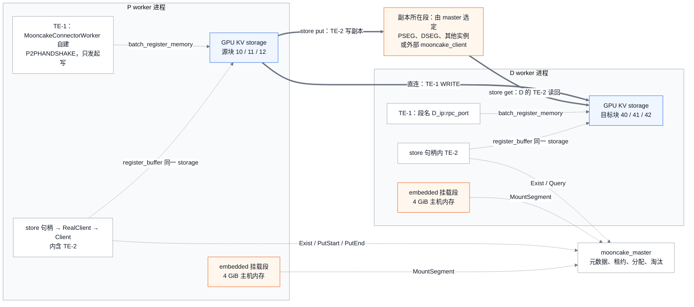
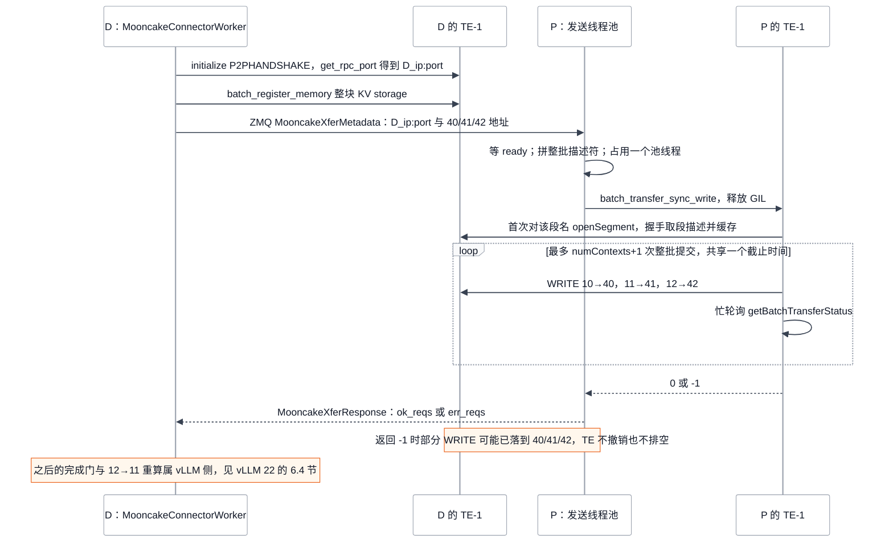
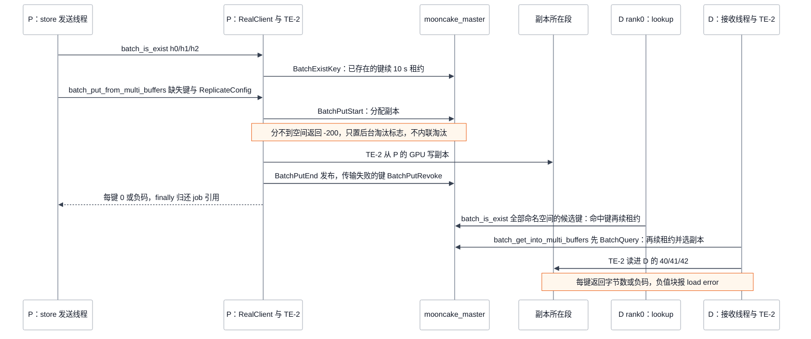

# Mooncake 与 vLLM 集成：越过 Python 绑定之后的对象、完成与寿命

> **源码基线**：`vllm-project/vllm@199cb9b964822e59ab9b58d88e7be31eb419a2ae`（`main`，2026-09-07）
> **源码基线**：`kvcache-ai/Mooncake@7d3a94e9d8c30abf02fcd64df218c16c1abc70df`（`main`，2026-09-24）
> **主题**：vLLM 配置 `MooncakeConnector` 与 `MooncakeStoreConnector` 后，每个 worker 进程里建出哪些 Mooncake 对象；15 个跨越 Python 绑定的调用分别进入 Mooncake 的哪段 C++、对 master 与 Transfer Engine 产生什么效果、vLLM 又怎样解释返回值；最后说明两边的完成、失败与寿命语义在哪里对齐、在哪里错位，并覆盖示例 proxy、Mooncake 仓内的 connector 副本和版本兼容。vLLM 侧代码在 `vllm/distributed/kv_transfer/kv_connector/v1/mooncake/`，Mooncake 侧入口在 `mooncake-integration/`。
> **适用范围**：只写两仓交界处的对象、调用与语义映射。vLLM 的 Scheduler/worker 协议、store 键布局与 save job 引用归 vLLM 分离式 KV 页；TE、Store 生命周期、分层、HA 的内部机制分别归本目录 10–13。结论来自两仓冻结源码的静态核验，未实跑多机、RDMA 或 master 集群。
> **最近更新**：2026-09-24。新建页。

## 1. 同一个 R 同时走直连与 store：先回答四个问题

[[02_engineering/03_infer_frameworks/vllm/22_vllm_disaggregated_kv_serving_analysis|vLLM 分离式 KV Serving]] 讲清了 vLLM 怎样消费 connector 的结果，但它对 Mooncake 的证据止于 `batch_transfer_sync_write` 的返回码和 store API 的每键返回值。部署者真正要回答的问题落在边界另一侧：配好两个 connector 之后进程里有几个 Transfer Engine（TE）、`mooncake_protocol` 是否真能选择传输、一次前缀查找会不会让对象活得更久、put 返回 -200 时谁该负责腾空间。这些问题都不能单靠任何一侧的代码回答，本页把每个跨界调用从 vLLM 调用点一路跟到 Mooncake 的 C++ 目标，再回到 vLLM 对结果的处理。

沿用 vLLM 22 页的请求 R：12 个 prompt token，block size 为 4，P 的源块为 `[10,11,12]`，D 的目标块为 `[40,41,42]`，store 内容键记作 `h0/h1/h2`（见 [[02_engineering/03_infer_frameworks/vllm/22_vllm_disaggregated_kv_serving_analysis#1. 十二个 prompt token，搬完三个 block 为什么还要再算一个 token|22 §1]] 与 [[02_engineering/03_infer_frameworks/vllm/22_vllm_disaggregated_kv_serving_analysis#7.1 把 R 变成三个内容键，再由未来的 D 恢复|22 §7.1]]）。配置取 Mooncake 文档 `docs/source/deployment/integrations/vllm/vllm-mooncakestoreconnector.md` 里的组合：P、D 都用 `MultiConnector`，子 connector 依次为 `MooncakeConnector` 和 `MooncakeStoreConnector`，P 为 `kv_producer`，D 为 `kv_consumer`。`MOONCAKE_CONFIG_PATH` 指向的 JSON 采用 `mode=embedded`（默认），`global_segment_size` 与 `local_buffer_size` 取默认 4 GiB，`protocol="rdma"`，`device_name=""`。两侧都是 TP=1、PP=1，各只有一个 worker 进程。

| 问题 | 结论 | 展开 |
|---|---|---|
| 每个 worker 进程有几个 TE | **两个**。`MooncakeConnectorWorker` 自己构造 TE-1；`MooncakeDistributedStore.setup` 没有传 `engine`，`Client::Create` 于是再建一个 TE-2。`MultiConnector` 把同一个 `kv_caches` 字典分别交给两个子 connector，同一批 GPU KV storage 因而在两个 TE 里各注册一次 | §2 |
| 直连路径的 KV 字节落在哪里 | P 的 TE-1 从 P 已注册的 GPU KV storage 读取，WRITE 到 D 的 TE-1 已注册的 D GPU KV storage 中 `[40,41,42]` 的地址。目标段名是 D 上报的 `D_ip:rpc_port` | §3 |
| store 路径的 KV 字节落在哪里 | P 的 TE-2 把 `h0/h1/h2` 写进 master 分配的副本缓冲。embedded 模式下，这块缓冲位于某个 vLLM worker 挂载的 DRAM 段中，可能是 P、D 自己，也可能是别的实例；standalone-store 模式下位于外部 `mooncake_client` 的段中。之后读者的 TE-2 把它读回自己 GPU 中已注册的 `[40,41,42]` | §2.3、§4 |
| 一次 lookup 会不会延长对象寿命 | **会**。`batch_is_exist` 进入 master 的 `BatchExistKey`（`grant_lease=true`），对每个存在且可读的键授予默认 10 s 读租约；租约未到期的对象不会被淘汰。开启 group 语义时，续约作用于整组。在 `MultiConnector` 下，即使 D 最终由直连加载，store 的 lookup 也照样执行；P 在 put 前的去重查询同样会续约。不授租约的 `BatchProbeKey`（#3801）在 Mooncake 基线已经存在，但 vLLM 基线没有使用，两个 release 的绑定中也都没有它 | §4.2 |
| put 返回 -200 时两边各做什么 | Mooncake：`AllocateReplicas` 一个副本都分不到，于是返回 `NO_AVAILABLE_HANDLE`，只置位后台淘汰标志，不内联淘汰，client 也不重试。vLLM：失败键不推进 `_saved_offset`，置起全局 pressure 并跳过该请求后续的 save 批次，直到之后任一批成功才解除；save job 照常收尾 | §5 |

两条路径的代价结构不同。下表中的比较来自源码结构，没有性能实测：

| 维度 | 直连：TE-1 | store：TE-2 加 master |
|---|---|---|
| 依赖的外部服务 | 无。段描述靠 P2P 握手获取，请求面走 vLLM 自己的 bootstrap HTTP 和 ZMQ | `mooncake_master`、Store 的 metadata server；standalone-store 下还要外部 `mooncake_client` |
| 进程内资源 | 注册整块 KV storage；P 侧有 `num_workers` 个阻塞发送线程 | 同一块 KV storage 再注册一次；另有 `local_buffer_size` 大小的主机缓冲，embedded 下还有 `global_segment_size` 大小的挂载段 |
| 谁决定对象寿命 | vLLM：P 的源块一直持有到写完或 480 s 过期 | master：租约、水位淘汰、段卸载 |
| 失败信号的粒度 | 整批 0 或 -1 | 每个键一个 int |

证据边界：本页叙述的 Mooncake 内部行为都读自 Mooncake 基线 `main@7d3a94e9`。vLLM 的依赖声明允许 `mooncake-transfer-engine>=0.3.12`，对 release 只核验了 vLLM 所调用的绑定方法是否存在、签名是否一致（§8），没有核验它们的内部实现。

## 2. 一个 worker 进程里有哪些 Mooncake 对象

### 2.1 对象清单与所有者

vLLM 进程里只有 worker 角色持有 Mooncake 对象。Scheduler 侧的 `MooncakeConnectorScheduler` 只管理请求表；`MooncakeStoreScheduler` 只持有一个 ZMQ REQ 形式的 `LookupKeyClient`，没有 store 句柄（`MooncakeStoreConnector.shutdown` 的 docstring 也写明 scheduler 角色是 no-op）。示例 proxy 进程同样不持有任何 Mooncake 对象。

<!-- Figure spec: 问题=MultiConnector 配置下 P、D 两个 worker 进程各持有哪些 Mooncake 对象，R 的字节在两条路径上分别落到哪里；类型=所有权与数据落点图；实体=两侧 GPU KV、TE-1、store 句柄内的 TE-2、embedded 挂载段、master、副本所在段；关系=实线为 R 的字节流，虚线为注册、挂载与 master RPC；图独有信息=同一 KV storage 在两个 TE 各注册一次，store 副本落点由 master 决定且可能是任一挂载段；证据=MooncakeConnectorWorker.__init__/register_kv_caches、MooncakeStoreWorker.__init__/register_kv_caches、MultiConnector.register_kv_caches、Client::Create、RealClient::setup_internal；验证=手工 Mermaid 规则复查。 -->


| 对象 | 创建点（vLLM → Mooncake） | 持有者 | 寿命终点 |
|---|---|---|---|
| TE-1：`mooncake.engine.TransferEngine`，即 `TransferEnginePy` 包着的 `TransferEngine` 与 `TransferEngineImpl` | `MooncakeConnectorWorker.__init__` 中的 `TransferEngine()` 与 `initialize(get_ip(), "P2PHANDSHAKE", mooncake_protocol, device_name)` | `MooncakeConnectorWorker.engine` | **vLLM 从不显式关闭它。** `MooncakeConnector` 没有覆写 `shutdown`，继承的 `KVConnectorBase_V1.shutdown` 直接返回 `None`；`MooncakeConnectorWorker.shutdown` 只停 ZMQ、线程池、事件循环和 bootstrap server。直到对象被回收时，`~TransferEnginePy` 才关闭缓存的段句柄并释放引擎（推断：通常就是进程退出时） |
| TE-1 的注册 | `register_kv_caches` 对每个互不相同的 `untyped_storage()` 整块调用 `batch_register_memory` | TE-1 | 从不 unregister |
| store 句柄：`MooncakeDistributedStore`，经 `RealClient` 与 `Client` 连接 master，内含 TE-2 | `MooncakeStoreWorker.__init__` 中的 `MooncakeDistributedStore()` 与 `setup(...)` | `MooncakeStoreWorker.store` | `MooncakeStoreConnector.shutdown`/`__del__` → `MooncakeStoreWorker.close` → `store.close()` → `RealClient::tearDownAll` |
| local buffer：`local_buffer_size` 大小的主机内存，注册进 TE-2 | `RealClient::setup_internal` | RealClient | `tearDownAll` 时 unregister |
| embedded 挂载段：`global_segment_size` 大小的主机内存，按块 `MountSegment` 给 master | `setup_internal`（仅当 `global_segment_size > 0`） | RealClient 与 Client | `Client` 析构时 `UnmountSegment` 通知 master |
| TE-2 的注册 | `MooncakeStoreWorker.register_kv_caches` 对每个互不相同的 storage 调用 `register_buffer`（capacity-only 实例跳过这一步） | TE-2 | 随 Client 析构一起释放 |
| `ReplicateConfig` | `MooncakeStoreWorker.__init__` 构造一份 | 发送线程；每次 put 前可能改写其中的 `group_ids` | 随 worker |

两个 TE 各自维护一张 `local_memory_regions_` 表（它是 `TransferEngineImpl` 的成员）。同一个 TE 内部，重叠注册会得到 `ERR_ADDRESS_OVERLAPPED`；分属两个 TE 时，两张表互不相见，所以 `MultiConnector` 的双重注册不会报错。经典 RDMA 传输会在每个 HCA 上为这块内存注册一个 MR（[[10_mooncake_transfer_engine_analysis#4. 注册：把地址范围变成对端可用的 rkey|10 §4]]），双 TE 因而意味着每张网卡上有两份 MR 与两套 rkey，被 pin 住的物理页仍只有一份（推断，未实测 MR 资源占用）。TP=N 时每个 rank 都是一套独立的对象，整个 engine 共有 2N 个 TE；embedded 模式下还要挂 N 个 4 GiB 的段。

**为什么不共用一个 TE。** 共用在绑定层面是可行的：`MooncakeDistributedStore.setup` 接受关键字参数 `engine`，TE 绑定也导出了 `TransferEngine.get_engine()`，返回底层的 `shared_ptr<TransferEngine>`（v0.3.12 已有）。`Client::Create` 收到现成引擎时会打印 “Use existing transfer engine instance” 并跳过 `InitTransferEngine`。vLLM 基线没有这样做，源码也没有解释原因。以下是分析推断，依据是上文代码：第一，两个引擎的初始化语义不同。TE-1 用 `P2PHANDSHAKE` 启动、忽略 protocol；TE-2 按 JSON 中的 metadata server、`protocol` 和设备名初始化。改为共用后，store 的这些传输配置会被整体绕过。第二，`MultiConnector` 各自独立地构造子 connector，没有在兄弟之间传递对象的钩子，而每个 connector 还必须能单独使用。第三，两个 connector 都会注册同一块 KV storage，而同一个 `TransferEngineImpl` 内的第二次注册会因地址重叠得到 `ERR_ADDRESS_OVERLAPPED`；基线的 store 侧对此只记日志（§4.1），共用引擎就必须先协调好由谁注册。不共用的代价是上面说的两套 MR、两个 RPC 端口和两组 TE 内部线程。

注册的前提是 KV storage 在进程寿命内不换物理页。vLLM 在 `vllm/config/vllm.py::VllmConfig._verify_kv_transfer_compat` 中，只要配置了任何 KV connector，就拒绝 `PYTORCH_CUDA_ALLOC_CONF=expandable_segments:True`（除非同时启用 cumem allocator）。注释点名的理由正是 NIXL 与 Mooncake 注册的 IB MR 会指向被重映射掉的旧物理页。

### 2.2 `mooncake_protocol` 不决定直连的传输，store 的 `protocol` 则决定

vLLM 把直连的传输开关放在 `kv_connector_extra_config`：`mooncake_protocol` 默认 `"rdma"`，`device_name` 默认 `""`（两者的读取点见 [[02_engineering/03_infer_frameworks/vllm/22_vllm_disaggregated_kv_serving_analysis#11.2 kv_connector_extra_config 的键|22 §11.2]]）。越过绑定之后，这两个值的命运完全不同：

- `mooncake_protocol` 的作用取决于装的是哪种 wheel。Mooncake 的发布 workflow 产出两类 wheel：`release.yaml`、`release-cuda13.yaml`、`release-non-cuda.yaml` 经 `_build-wheel.yaml` 构建标准包（x86_64 CUDA 带 `USE_INTRA_NVLINK`，arm64 CUDA 带 `USE_MNNVL`，non-CUDA 两者都不带）；`release-efa*.yaml` 经 `_build-efa-wheel.yaml` 以 `-DUSE_EFA=ON` 构建 `mooncake-transfer-engine-efa` 系列。ROCm、MUSA、NPU 另有各自的 workflow，本页没有逐一展开。
  - **标准 wheel**（vLLM `requirements/kv_connectors.txt` 指定的就是它）：`TransferEnginePy::initializeExt` 以 `TransferEngine(!use_flagcx, filter)` 构造引擎，即开启自动发现。经典 `TransferEngine::init` 第一行就是 `(void)protocol`，实际装哪种传输由 `TransferEngineImpl::init` 按构建宏、拓扑与 `MC_*` 环境变量决定（[[10_mooncake_transfer_engine_analysis#3. 初始化：选中的是经典 TE，协议参数不决定传输|10 §3]]）。在这类 wheel 上，这个字符串能改变 vLLM 行为的途径只有**让初始化失败**：在不带 `USE_MNNVL` 的 x86 wheel 上传 `"nvlink"` 时，`initMemoryAllocator` 返回失败，`initialize` 得到 -1，vLLM 随即抛出 `RuntimeError("Mooncake Transfer Engine initialization failed.")`；`"xgmi"` 被直接拒绝；`"flagcx"` 会关掉自动发现，再尝试安装 flagcx 传输，但所有发布 workflow 都没有打开 `USE_FLAGCX`，`MultiTransport::installTransport` 报 “Unsupported transport”，结果同样是 -1。
  - **EFA wheel**：`initializeExt` 在 `USE_EFA` 下以 `TransferEngine(false, filter)` 构造引擎，自动发现是关闭的。只有 `protocol == "efa"` 才安装 EFA 传输，`"flagcx"` 走上面的失败路径，其余值一律只装 TCP。所以在 EFA wheel 上，vLLM 的默认值 `"rdma"` 会**静默地只走 TCP**，必须显式写 `mooncake_protocol="efa"`；这是 protocol 字符串真正决定传输的唯一 wheel。
- `device_name` 按逗号拆成设备过滤表，传给 `TransferEngine(auto_discover, filter)`，限定拓扑发现能看到哪些 HCA，因此确实会影响选路。

所以，在带 HCA 的机器上用标准 CUDA wheel 时，`mooncake_protocol="tcp"` 装上的仍是 RDMA；要让直连走 TCP，得靠环境变量或设备过滤（见本节末段）。`release*.yaml`、`_build-wheel.yaml` 与 `_build-efa-wheel.yaml` 都没有传 `-DUSE_TENT=ON`，所以只有自行编译的 TENT 构建才会响应 `protocol=="tcp"`（[[10_mooncake_transfer_engine_analysis#9. TENT：另一套引擎，只在编译开启后可选|10 §9]]）。

store 的 TE-2 走另一条初始化路线。`Client::InitTransferEngine` 先调用 `ClientAutoDiscoveryConfig::FromEnvironment(protocol, device_names_configured)`：未设 `MC_MS_AUTO_DISC` 时，只有 `protocol` 为 `"rdma"` 或 `"efa"` 且没给设备名，才开启自动发现，其余情况都按 `protocol` 显式安装传输（`"tcp"` 装 TCP，`"rdma"` 加设备名则只在这些设备上安装 RDMA）。JSON 里的 `protocol` 还决定 embedded 段的分配方式：`"rdma"` 且网卡分布在多于一个 NUMA 节点时，段会按这些节点拆分。

由此得到一个组合限制（推断，依据是上面两段代码）：`MC_FORCE_TCP` 是进程级环境变量，在 `TransferEngineImpl::init` 最前面检查。在本例配置下（store 的 `protocol="rdma"`、没给设备名，因而走自动发现），它会让同一进程里的 TE-1 和 TE-2 **都**只装 TCP；如果 store 给了设备名，`InitTransferEngine` 会在这之后再显式安装一次 RDMA。想让 store 走 TCP、直连仍走 RDMA，可以只在 JSON 里写 `protocol="tcp"`。反过来想让直连走 TCP、store 仍走 RDMA，可以利用 TE-1 的 `device_name`：`Topology::discover` 调用的 `listInfiniBandDevices` 会跳过不在过滤表中的 HCA，所以当 TE-1 的 `device_name` 不匹配任何 HCA 时，`TransferEngineImpl::init` 看到的 HCA 列表为空。此时 x86_64 CUDA wheel 与 non-CUDA wheel 会安装 TCP，arm64 CUDA wheel（`USE_MNNVL`）则会安装 MNNVL；TE-2 按 store 自己的配置初始化，不受影响。经典 TE 在两端之间没有跨协议回退（10 §3），所以 P 与 D 的 TE-1 必须同时这样配置。以上是依据代码推导的结论，未实跑。

> [!contradiction] vLLM 22 页对 `mooncake_protocol` 的描述不完整
> [[02_engineering/03_infer_frameworks/vllm/22_vllm_disaggregated_kv_serving_analysis#11.2 kv_connector_extra_config 的键|22 §11.2]] 把 `mooncake_protocol` 记为“Mooncake 传输引擎协议”，§6.4 的标题也写成“数据面走 RDMA WRITE”。在 Mooncake 基线的经典 TE 与标准 wheel 上，这个字符串不选择传输：opcode 确实是 WRITE，但 RDMA、TCP 还是节点内 NVLink，由自动发现、设备过滤与 `MC_FORCE_TCP`、`MC_INTRANODE_NVLINK` 等环境变量决定。EFA wheel 是例外：那里只有 `"efa"` 能装上 EFA，默认的 `"rdma"` 只会得到 TCP。以 `mooncake-transfer-engine/src/transfer_engine.cpp::TransferEngine::init` 与 `mooncake-integration/transfer_engine/transfer_engine_py.cpp::TransferEnginePy::initializeExt` 为准。

### 2.3 `mode`：vLLM 只校验，Mooncake 只看 `global_segment_size`

`vllm/distributed/kv_transfer/kv_connector/v1/mooncake/store/worker.py::MooncakeStoreConfig` 把 `mode` 定义为 `Literal["embedded", "standalone-store"]`。`__post_init__` 要求 embedded 时 `global_segment_size > 0`、standalone-store 时 `== 0`，并且 `local_buffer_size > 0`。`mode` 本身**不会传给 Mooncake**：`setup(...)` 的七个位置参数里没有它，只有租户不是 `"default"` 时才额外带上关键字参数 `tenant_id`。在 Mooncake 侧，两种模式的差别全部来自 `global_segment_size`：

- **embedded**（`global_segment_size > 0`）：`RealClient::setup_internal` 分配主机内存，按传输注册上限切块，逐块 `MountSegment`。这个 vLLM worker 于是成为存储池的内存提供者，master 可以把**任何**实例的对象放进它的 DRAM。consumer 一侧的 D 也不例外。worker 调用 `close()` 或崩溃，都会连带掉这块段上的对象（[[11_mooncake_store_object_lifecycle_analysis#7.2 三种卸载，只有一种先等|11 §7.2]]）。
- **standalone-store**（`global_segment_size == 0`）：不挂载任何段，vLLM 进程只作请求方，容量要由外部进程提供。`mooncake-transfer-engine` wheel 本身就附带 `mooncake_client` 二进制（`mooncake-wheel/pyproject.toml` 的 package-data），它默认挂 4 GB。

要注意的是，vLLM 的“standalone-store”**不是** [[11_mooncake_store_object_lifecycle_analysis#8. 两种部署：嵌入式 RealClient 与独立 mooncake_client|11 §8]] 中那种经 `setup_dummy` 连 `mooncake_client` 的 DummyClient 形态。vLLM 调用的始终是 `setup(...)`，也就是 `RealClient::setup_real`。这个进程保有自己的 `Client` 身份、自己的 TE-2 和 master 心跳，字节由它的 TE-2 直接与外部段交换，不经过 `mooncake_client` 的 RPC 和共享内存。所以 vLLM 进程崩溃时不会丢对象（它没有段），但它尚未 `PutEnd` 的写会进入写者失联的回收路径（[[11_mooncake_store_object_lifecycle_analysis#4.5 写者失联：抢占与回收|11 §4.5]]）。

`local_buffer_size` 在两种模式下都必须大于 0：vLLM 的校验如此要求，`setup_internal` 也会把这块主机内存注册进 TE-2。vLLM 的 put/get 直接使用已注册的 GPU 地址，本页没有在 vLLM 调用链中找到依赖这块缓冲的路径。它在 Mooncake 读取磁盘副本等路径上的用途归 [[12_mooncake_store_tiering_offload_analysis|12]]。JSON 里的 `enable_offload` 同样不会传给 `setup`（vLLM 没有传 `enable_ssd_offload`），它只打开 vLLM 侧的磁盘暂存预算（§4.4）；真正的 SSD 分层要在提供段的那一方打开。

> [!contradiction] Mooncake 自家文档的 store 配置在 vLLM 基线上会被拒绝
> Mooncake 基线的 `docs/source/deployment/integrations/vllm/kv-cache-storage.md` 与 `vllm-mooncakestoreconnector.md` 都给出 `"global_segment_size": "0"`，但没有写 `mode`。vLLM 基线的 `MooncakeStoreConfig` 默认 `mode="embedded"`，`__post_init__` 会抛出 `ValueError("embedded mode requires global_segment_size > 0")`。后一份文档的示例 JSON 在 `device_name` 之后还多了一个尾逗号，不是合法 JSON。照抄时必须补上 `"mode": "standalone-store"` 并另起提供容量的进程，或者改用非零 `global_segment_size`。

## 3. 直连路径：四个 TE 调用越过绑定之后

### 3.1 段身份：`initialize` 与 `get_rpc_port`

`initialize(get_ip(), "P2PHANDSHAKE", …)` 让 TE-1 在 P2P 握手模式下启动：不依赖 etcd 或 http metadata server，由 `findAvailableTcpPort` 随机绑定一个 RPC 端口，本段名为 `ip:rpc_port`。`get_rpc_port` 返回的就是这个端口（`TransferEngineImpl::getRpcPort` 读 `metadata_->localRpcMeta().rpc_port`）。

vLLM 只在 D 侧用到它：`receive_kv_from_single_worker` 把 `remote_hostname=self.hostname`、`remote_port=self.rpc_port` 写进 `MooncakeXferMetadata`。P 的 `send_kv_to_decode` 拼出 `remote_session = f"{remote_hostname}:{remote_port}"`，作为 `batch_transfer_sync_write` 的 `target_hostname`。P 自己的 rpc 端口只写进日志。因此 D 的段身份完全来自 D 这次进程启动时随机选到的端口。D 重启后段名随之改变，P 会按新名字重新 `openSegment`；旧名字的句柄仍留在 `handle_map_` 中，在 RDMA 构建上不会被清理（§3.3 第 2 步，另见 10 §8.3 末段）。握手过程见 [[10_mooncake_transfer_engine_analysis#7.3 握手：一次 TCP JSON 往返，外加一次 ready ACK|10 §7.3]]。

`initialize` 失败时 vLLM 抛 `RuntimeError`；`device_name` 与传输的关系见 §2.2。

### 3.2 注册：`batch_register_memory`

`MooncakeConnectorWorker.register_kv_caches` 为每层计算 region 基址和 block 长度（块内不连续的布局按 head 拆 region），但交给 TE 注册的是**去重后的整块 `untyped_storage()`**：`batch_register_memory(kv_data_ptrs, kv_data_lens)`，`location` 取绑定的默认值 `kWildcardLocation`。这个调用释放 GIL，进入 `TransferEngineImpl::registerLocalMemoryBatch`：零长度与重叠直接拒绝，再逐个已安装传输注册，任一失败就逆序回滚（[[10_mooncake_transfer_engine_analysis#4. 注册：把地址范围变成对端可用的 rkey|10 §4]]）。

vLLM 对非零返回抛 `RuntimeError("Mooncake batch memory registration failed.")`。D 注册完就返回；P 之后还要启动 ZMQ 发送监听，并把 `tcp://ip:side_channel_port` 登记到 bootstrap server。P2P 模式下，注册只更新本地描述，对端要到下次拉取段描述时才看得到（同见 10 §4）。在 vLLM 的顺序里，D 总是先注册完成，才会发出携带地址的 `MooncakeXferMetadata`。

### 3.3 同步写：`batch_transfer_sync_write`

P 侧 `send_kv_to_decode` 等到这一批请求的 `SendBlockMeta.ready`，由 `_build_transfer_params` 把**本批所有就绪请求**的描述符拼成一组 `src_ptrs/dst_ptrs/lengths`，再用 `sender_loop.run_in_executor(self._sender_executor, self._send_blocks, …)` 在 `num_workers`（默认 10）线程池中阻塞调用一次 `batch_transfer_sync_write`。越过绑定后，`TransferEnginePy::batchTransferSync` 依次：

1. 释放 GIL，在 `handle_map_` 中查找或 `openSegment(target_hostname)`；打开失败直接返回 -1。
2. 在进入重试循环**之前**构造好全部请求，然后最多提交 `numContexts()+1` 次（即本地 HCA 数加一）。只有批状态为 FAILED 或 TIMEOUT 时才**整批**重提；`submitTransfer` 本身失败时**立即返回 -1，不重试**。此时若 `CheckSegmentStatus` 也不是 OK，就 `closeSegment` 并把该段名从 `handle_map_` 中删掉，但经典 TE 在非 barex 构建上的 `TransferEngineImpl::CheckSegmentStatus` 总是返回 OK，所以 RDMA 构建上这条清理分支不会执行。轮询 `getBatchTransferStatus` 时不 sleep。
3. 所有轮次共用同一个截止时间：`max(5, MC_TRANSFER_TIMEOUT)` 秒（未设时 30 s），再加上每字节 1 ns；截止或重试耗尽时返回 -1，全部完成时返回 0（[[10_mooncake_transfer_engine_analysis#8.2 超时只在 Python 层判定|10 §8.2]]）。

`MC_TRANSFER_TIMEOUT` 只在 `TransferEnginePy` 的构造函数中读取，store 路径不经过这个包装，所以不受它影响。

```text
MooncakeConnectorWorker._sender_worker                      [P, sender_loop 协程]
`-- send_kv_to_decode(identity, sock, meta)
    |-- 等 SendBlockMeta.ready                                 [≤ VLLM_MOONCAKE_ABORT_REQUEST_TIMEOUT]
    |-- _build_transfer_params -> 整批 src_ptrs/dst_ptrs/lengths
    `-- run_in_executor(_sender_executor, _send_blocks)        [阻塞一个池线程]
        `-- TransferEngine.batch_transfer_sync_write(D_ip:rpc_port, ...)   ==== pybind 边界 ====
            `-- TransferEnginePy::batchTransferSync(WRITE)
                |-- gil_scoped_release；handle_map_ 或 openSegment
                |-- for retry < numContexts()+1: allocateBatchID -> submitTransfer
                |   `-- while: getBatchTransferStatus         [无 sleep 忙轮询，共享截止时间]
                `-- return 0 | -1
    返回值如何进入 P 的 sent/need_send 与 D 的 pull_tasks_count 完成门：见 vLLM 22 §6.4
```

树中省略的完成门计数归 [[02_engineering/03_infer_frameworks/vllm/22_vllm_disaggregated_kv_serving_analysis#6.4 MooncakeConnector：bootstrap 走 HTTP，请求面走 ZMQ，数据面走 RDMA WRITE|22 §6.4]]；本页只补充 -1 覆盖整批这一点（§3.4）。

<!-- Figure spec: 问题=R 的直连写越过绑定后在 Mooncake 里经历哪些步骤，vLLM 以什么信号认定完成；类型=跨进程时序图；参与者=D 的 MooncakeConnectorWorker、D 的 TE-1、P 的发送线程池、P 的 TE-1；关系=握手、整批提交、忙轮询与共享截止、0/-1 回传、ZMQ 响应；图独有信息=完成信号只有 P 的返回码加 ZMQ ok_reqs，-1 时可能已有字节落地；证据=MooncakeConnectorWorker.receive_kv_from_single_worker/send_kv_to_decode/_send_blocks、TransferEnginePy::batchTransferSync；验证=手工 Mermaid 规则复查。 -->


### 3.4 返回码在 vLLM 里的含义，以及对不上的地方

**完成与可读性。** 这条路径上，D 唯一的完成依据是 P 回复的 `ok_reqs`，而 P 只在 `batch_transfer_sync_write` 返回 0 之后才发出这条回复。TE 的 0 表示发起端已经收齐每一片的成功完成事件；这些字节何时对 D 的 GPU 可见，属于 verbs 与硬件的合同（[[10_mooncake_transfer_engine_analysis#7.4 “完成”的六个台阶|10 §7.4]]）。vLLM 在 D 侧没有额外的 fence，而是把 `finished_recving` 交给 Scheduler，之后才让 forward 读取这些块（推断：vLLM 依赖 RDMA 写完成后 ZMQ 消息才到达的先后次序）。

**失败粒度。** 一次调用覆盖本批所有就绪请求，任一片失败都会让整批返回 -1，vLLM 随即把本批所有请求都记进 `err_reqs`。整批重提会把已经写成功的请求再写一遍，内容相同所以不影响正确性，但会多占带宽（[[10_mooncake_transfer_engine_analysis#8.3 部分失败的副作用：几处没有回滚|10 §8.3]]）。

**线程与时间尺度。** 每个在飞的调用都会占住一个池线程，并在忙轮询中吃满一个 CPU 核（推断，依据是循环中没有 sleep）。P 侧最多 `num_workers` 个这样的线程。默认 TE 截止约为 30 s 加上每 GiB 约 1.07 s，远小于 vLLM 的 `VLLM_MOONCAKE_ABORT_REQUEST_TIMEOUT`（480 s），所以通常是 TE 先返回。调用期间 `send_meta.sending > 0`，`fetch_finished_sending_reqs` 的过期回收会跳过这个请求，P 的源块一直持有到调用返回。如果把 `MC_TRANSFER_TIMEOUT` 设到超过 540 s（480 + 60），D 侧 ZMQ 的 `RCVTIMEO` 会先到期：D 记为失败，而 P 仍在写（推断）。

**迟到的写。** TE 返回 -1 时可能还有 WR 在飞（10 §8.3）。在 vLLM 基线上，D 收到 `err_reqs` 只打日志：不减计数、不上报 invalid block、也不给 `finished_recving`，目标块 `[40,41,42]` 会一直保留在等待远端 KV 的请求名下（除非客户端中止这个请求），所以迟到的写落进去不会影响其他请求（推断）。这个“安全”其实是 [[02_engineering/03_infer_frameworks/vllm/22_vllm_disaggregated_kv_serving_analysis#6.4 MooncakeConnector：bootstrap 走 HTTP，请求面走 ZMQ，数据面走 RDMA WRITE|22 §6.4]] 记录的失败收尾缺口的副产品。基线之后的 #50984 让 D 把失败请求的目标块报为 invalid，并随即结束接收（§11）。此后目标块可能按 `kv_load_failure_policy` 被释放、重新分配，迟到的 WRITE 是否可能落进已经转给别的请求的块，要结合 TE 的在飞 WR 何时结束来判断。这一点未核验，登记给 10 与后续基线。

## 4. store 路径：八个 store 调用与 `ReplicateConfig`

### 4.1 `setup` 与 `register_buffer`：失败处理不对称

`MooncakeStoreWorker.__init__` 调用 `setup(local_hostname, metadata_server, global_segment_size, local_buffer_size, protocol, device_name, master_server_address[, tenant_id=])`。`local_hostname` 默认取 `get_ip()`，可用 `MOONCAKE_REQUESTER_LOCAL_HOSTNAME` 覆盖。越过绑定后，`RealClient::setup_real` 进入 `setup_internal`：主机名不带端口，于是由 `AutoPortBinder` 绑定一个端口，本 client 名成为 `host:port`（`MOONCAKE_PREFERRED_SEGMENT` 指向的正是这种名字）。接着 `Client::Create` 连接 master，`transfer_engine == nullptr` 时新建并初始化 TE-2；然后分配并注册 local buffer；`global_segment_size > 0` 时再挂载段。返回值是 0 或负的 `ErrorCode`，vLLM 对非零抛 `RuntimeError`。

`register_buffer(base_addr, region_len)` 进入 `RealClient::register_buffer_internal` 和 `Client::RegisterLocalMemory`，把 GPU storage 注册进 TE-2。这里与直连路径**不对称**：在基线上，vLLM 遇到非零返回**只打 `logger.error`**，之后照样为各层布局注册、启动收发线程。基线之后，#53781 为启用 HiSparse 时的按组注册路径（host 与 device region 均在内）新增了一处 `register_buffer` 调用，失败即抛 `RuntimeError`；原调用点在 `origin/main` 上仍然只记日志（§11，未在基线核验）。注册失败的后果要等到之后每次 put/get 按键失败时才显现（推断：TE-2 无法对未注册的地址发起传输）。

### 4.2 `batch_is_exist`：每次查询都在续租约

vLLM 在两处调用 `batch_is_exist`：

- **lookup**：Scheduler 经 ZMQ 把请求发到 worker rank 0 的 `LookupKeyServer`，由 `MooncakeStoreWorker.lookup` 把每个 `(group, hash)` 在**所有需要加载的 rank 命名空间**下各生成一个候选键，一次 `batch_is_exist` 查完。所有命名空间都返回 1 才算这个块存在。
- **save 去重**：每个 worker 的 `KVCacheStoreSendingThread._handle_request` 在 put 之前查一次，`exists != 1` 的键视为缺失，需要写入。

越过绑定后，调用链是 `RealClient::batchIsExist` → `Client::BatchIsExist` → master 的 `BatchExistKey` → `BatchExistKeyImpl(grant_lease=true)`。对每个存在且有可读副本的键，master 调用 `GrantReadLease(default_kv_lease_ttl_)`（`types.h::DEFAULT_DEFAULT_KV_LEASE_TTL = 10000` ms，可由 master 配置覆盖）。截止只增不减；分组对象共享一份租约，查一个成员就续整组（[[11_mooncake_store_object_lifecycle_analysis#5.3 Exist 授租约，Probe 不授|11 §5.3]]、[[11_mooncake_store_object_lifecycle_analysis#5.4 分组对象：读一个成员，续整组|11 §5.4]]）。租约未到期的对象不会成为淘汰候选。对 vLLM 而言，这带来三个后果：

- **lookup 本身就延长寿命。** 命中的块在查询后至少还能活 10 s，这正好覆盖了 D 从命中到分配目标块、再到 get 的等待。代价是每次查询都在给对象续租。LookupKeyClient 按请求缓存 future，拿到结果就删除；请求被抢占后再次调度时会重新查询（推断：每轮调度都会再续一次）。
- **`MultiConnector` 会替没选中的子 connector 续租。** `MultiConnector.get_num_new_matched_tokens` 会询问全部子 connector（见 [[02_engineering/03_infer_frameworks/vllm/22_vllm_disaggregated_kv_serving_analysis#8. MultiConnector：选择一个 loader，等待所有保存者|22 §8]]）。本例中直连排在前面，R 实际由直连加载，但 store 的 lookup 仍会执行，给 `h0/h1/h2` 续上 10 s。P 在 put 前的去重查询也会给已存在的键续租。
- **租约能把容量钉住。** Mooncake 自己的测试 `master_service_test.cpp::ExistKeyLeasesPinSegmentButProbeKeyDoesNot` 表明：把段写满之后逐个 `ExistKey`，下一个 `PutStart` 立即得到 -200，租约期内淘汰也腾不出空间。查询流量大而容量紧张时，vLLM 自己的 lookup 与去重就可能是 §5 那个 -200 的成因之一（推断，未实测）。

不授租约的 `BatchProbeKey` 由 Mooncake #3801 于 2026-09-21 合入，Mooncake 基线有 `batch_probe_key` 绑定，但 v0.3.12 与 v0.3.13.post1 都没有（§8）。vLLM 基线全部使用 `batch_is_exist`。

返回值为负（RPC 失败等）时，lookup 用 `== 1` 判定，负值自然算未命中；save 去重用 `!= 1` 判定，负值算缺失，于是去写。两处都不会把错误升级为请求失败。

### 4.3 `batch_put_from_multi_buffers` 与 `ReplicateConfig`

vLLM 先等当前 forward 的 CUDA event，再在同一份 `ReplicateConfig` 上按需写入 `group_ids`，然后调用 `batch_put_from_multi_buffers(keys, addrs, sizes, replicate_config)`。`addrs[i]` 与 `sizes[i]` 是第 i 个键在 GPU KV 中的散列地址列表。越过绑定后，调用链是 `RealClient::batch_put_from_multi_buffers_internal` → `BatchWriteFromMultiBuffers` → `Client::BatchPut`，内部再分三步：

1. master 的 `BatchPutStart` → `AllocateReplicas`：分配副本缓冲，失败即 -200（§5）。
2. `SubmitTransfers` / `WaitForTransfers`：TE-2 把 GPU 数据写进副本缓冲。
3. 逐键 `BatchPutEnd` 发布；传输失败的键走 `BatchPutRevoke`（[[11_mooncake_store_object_lifecycle_analysis#4.4 PutEnd 与 PutRevoke：发布点|11 §4.4]]）。

返回值是每键一个 int：`OBJECT_ALREADY_EXISTS` 被 `Client::BatchPut` 当作成功，所以并发写同一个键时返回 0。vLLM 把 `< 0` 的键记为失败：本 job 不推进 `_saved_offset`，也不为这些块发 `BlockStored` 事件；不论成败，`finally` 都会 `finish_store_job`（job 引用的归还见 [[02_engineering/03_infer_frameworks/vllm/22_vllm_disaggregated_kv_serving_analysis#7.3 save job 引用、部分失败与容量压力|22 §7.3]]）。

vLLM 往 `ReplicateConfig` 里只写两个字段，`replica_num` 始终保持默认值 1，所以每个键只有一个内存副本：

- **`preferred_segment`**：来源是 extra 键 `preferred_segment`，或环境变量 `MOONCAKE_PREFERRED_SEGMENT`（`rdma_utils.py::get_configured_preferred_segment`）。只有**显式给出**的 extra 键归一化后为空（空白串或非字符串）才会抛 `ValueError`；环境变量为空时视为 `None`，即不设偏好。它在 Mooncake 的 `replica.h::ReplicateConfig` 中被注释为 **Deprecated**，替代者是 `preferred_segments` 列表。`AllocateReplicas` 在它非空时**只用它**，不与列表合并；默认的 `RandomAllocationStrategy` 先尝试偏好段，不行再随机扫描其他段（[[11_mooncake_store_object_lifecycle_analysis#4.2 分配：preferred、local-first 与 best-effort|11 §4.2]]）。偏好因此不是约束。vLLM 在 embedded 模式下遇到 `preferred_segment` 时会警告“rank 贡献的段将闲置”，这只在偏好段还有空间时近似成立；偏好段写满后，对象仍会落到各 rank 的段上。vLLM 不设 `prefer_alloc_in_same_node`，也不自己填 `host_id`；Mooncake 的 `Client::AttachHostId` 会在 client 有 host 身份时代为填入。master 若配置 `local_first`，就按这个写者主机把同机段排进偏好列表。
- **`group_ids`**：只有 `enable_group_semantics` 为真、且 `_replicate_config_supports_group_ids` 在类或实例上探测到这个属性时才写入。每个键的组名由 `_make_mooncake_group_id` 生成：`vllm-mooncake-store:{cache_prefix@}{model}{store_namespace}@{chunk_hash}`，其中**不含** TP shard 和 KV cache group。于是同一个逻辑前缀 chunk 的全部 shard（以及 HMA 下的各个 group）构成一个组；这一点有测试 `test_mooncake_store_worker.py::test_store_sending_thread_group_ids_share_across_kv_cache_groups` 锁定。在 Mooncake 侧，组的全有或全无只在组租约这一层成立：读任一成员就续整组，组租约过期后整组一起淘汰，但单个成员若被硬钉或正被引用，只跳过它自己（[[11_mooncake_store_object_lifecycle_analysis#6.5 分组：在租约层面全有或全无|11 §6.5]]）。对 vLLM 的意义是：不会只淘汰掉某些 TP shard，而让其余 shard 留下一个无法组装的前缀（分析推断）。

### 4.4 `batch_get_into_multi_buffers`、`batch_get_replica_desc` 与磁盘暂存

接收线程把本请求所有待取的键按 `tp_rank` 轮转顺序，然后调用 `batch_get_into_multi_buffers(keys, addrs, sizes)`。越过绑定后，`RealClient::batch_get_into_multi_buffers_internal` 先做一次 `Client::BatchQuery`，即 master 的 `BatchGetReplicaList`，这次查询同样会续租约（[[11_mooncake_store_object_lifecycle_analysis#5.1 GetReplicaList 授租约|11 §5.1]]）；然后用 `SelectBestReplica` 挑副本。内存副本由 TE-2 直接读进目标 GPU 地址，磁盘副本走属主进程的暂存路径（[[12_mooncake_store_tiering_offload_analysis#5. 下一次读走哪条路径|12 §5]]）。返回值是每键读到的字节数或负码。vLLM 把 `< 0` 的键对应的块报为 load error，并 `break` 掉剩余的子批；抛异常时，把当前子批的所有块报为失败。之后的恢复由 [[02_engineering/03_infer_frameworks/vllm/22_vllm_disaggregated_kv_serving_analysis#9. lease 续期、失效上报与超时边界|22 §9]] 的 `kv_load_failure_policy` 决定。

以下两项是 [[12_mooncake_store_tiering_offload_analysis|12]] 交给本页的 vLLM 侧行为：

- **磁盘暂存预算。** JSON 中 `enable_offload=true` 时，vLLM 设定预算常量 `DEFAULT_MOONCAKE_DISK_STAGING_BUFFER_BYTES = 1280 MiB`。它照抄的是 Mooncake `storage_backend.h` 中 `FileStorageConfig::local_buffer_size` 的默认值。每个键的暂存量估为按 4096 字节对齐的数据量再加 8 KiB；一批的总量超过 `VLLM_MOONCAKE_DISK_STAGING_USABLE_RATIO`（默认 0.9）乘以预算时，由 `_split_disk_offload_load_batches` 拆成多个子批；单个键超过 1280 MiB 时，整个请求跳过，所有块记为失败。属主可以用 `MOONCAKE_OFFLOAD_LOCAL_BUFFER_SIZE_BYTES` 改这个值，但 vLLM 写死了 1280 MiB，两者可能对不上（推断）。
- **层级日志。** 只有在 `VLLM_MOONCAKE_STORE_TIER_LOG` 打开时，vLLM 才在每次 get 之前调用 `batch_get_replica_desc(keys)`，再用 `is_memory_replica()` 与 `is_disk_replica()`（兼容 `is_local_disk_replica()`）把每个键归到 memory、disk 或 unknown，出现异常就全部记为 unknown。越过绑定后，这个调用也是 `Client::BatchQuery`，即 master 的 `BatchGetReplicaList`。这个方法对每个命中的键续租约，递增 `inc_mem_cache_hit_nums`（或文件缓存命中计数）与 `inc_valid_get_nums`。`promotion_on_hit_` 打开且只有本地盘副本时，它会把对象推进 `promotion_candidates`，随后 `TryPushPromotionQueue`；dynamic replication 打开时，还会计入复制候选。这个诊断开关因而不是只读的。

### 4.5 `remove_all` 与 `close`：返回值没人看

`MooncakeStoreConnector.reset_cache` → `MooncakeStoreScheduler.reset_store` → `LookupKeyClient.reset` 通过 ZMQ 把请求发给 rank 0 的 `LookupKeyServer`。后者先 `kv_send_thread.request_queue.join()` 排空本 rank 在途的 put，再调用 `store.remove_all(force=True)`，只要没有抛异常就回 `RESP_OK`。越过绑定后，`RealClient::removeAll` 进入 `Client::RemoveAll(force)`，经 `to_py_ret` 返回删除的对象数，或者**负的错误码**，出错时并不抛异常。vLLM 忽略这个返回值，所以 master 不可达时，`remove_all` 返回负码，vLLM 仍然回 ACK，`reset_store` 返回 True。[[02_engineering/03_infer_frameworks/vllm/22_vllm_disaggregated_kv_serving_analysis#10. 权重更新、后台 job 与真正清空的边界|22 §10]] 所说“等待 ACK/NACK”中的 ACK，因此只能证明没有抛 Python 异常，不能证明对象已被清空。此外，`force=True` 会跳过租约与复制任务检查，被租约保护、正在被读的对象也会被删。只排空 rank 0 的发送队列也覆盖不了其他 rank 的在途 put，这仍依赖 22 §10 要求调用者先暂停调度。

`close()` 进入 `RealClient::tearDownAll`：先停内部服务，unregister local buffer，然后析构 `Client`。析构中会对每个挂载段调用 `UnmountSegment` 通知 master，最后销毁 TE-2。embedded 模式下，这一步会立刻让本段上所有副本的句柄失效，租约也保护不了它们（[[11_mooncake_store_object_lifecycle_analysis#7.2 三种卸载，只有一种先等|11 §7.2]]）。于是，一个 vLLM worker 正常关闭，也会让其他实例正在读取的、放在它内存里的对象消失。vLLM 的 `close()` 是幂等的，异常只记日志。

```text
KVCacheStoreSendingThread._handle_request(req_meta)                       [P, 每 rank 一个发送线程]
|-- store.batch_is_exist(keys)        ==== pybind ==== RealClient::batchIsExist
|   `-- Client::BatchIsExist -> master BatchExistKey(grant_lease=true)    [命中键续租约]
|-- store_layout.prepare_values(...)   -> 每键一组 GPU 地址与长度
|-- current_event.synchronize()
|-- replicate_config.group_ids = [...] [仅 enable_group_semantics 且探测到字段]
|-- store.batch_put_from_multi_buffers(keys, addrs, sizes, replicate_config)
|   `-- RealClient::batch_put_from_multi_buffers_internal -> Client::BatchPut
|       |-- master BatchPutStart -> AllocateReplicas      [失败返回 -200，置 need_mem_eviction_]
|       |-- SubmitTransfers / WaitForTransfers             [TE-2 写副本缓冲]
|       `-- master BatchPutEnd | BatchPutRevoke             [逐键发布或撤回]
|-- res < 0 的键 -> failed_indices；含 -200 -> _mark_request_skipped_for_pressure
`-- finally: finish_store_job(req_meta)                     [归还 save job 引用，不论成败]

KVCacheStoreRecvingThread._handle_request(req_meta)                       [D, VLLM_MOONCAKE_LOAD_RECV_THREADS 个]
|-- [enable_offload] _split_disk_offload_load_batches -> 子批
|-- [VLLM_MOONCAKE_STORE_TIER_LOG] store.batch_get_replica_desc -> BatchQuery [也续租约]
`-- store.batch_get_into_multi_buffers(keys, addrs, sizes)
    `-- RealClient::batch_get_into_multi_buffers_internal
        |-- Client::BatchQuery -> master BatchGetReplicaList   [续租约]
        |-- SelectBestReplica -> TE-2 读入目标 GPU 地址
        `-- 每键返回字节数或负码 -> 负值块记为 load error 并 break
```

<!-- Figure spec: 问题=R 的 store 路径越过绑定后 master 与 TE-2 各做什么，lookup 与 get 如何续租约，-200 在哪一步产生；类型=跨进程时序图；参与者=P 发送线程、P 的 RealClient 与 TE-2、mooncake_master、副本所在段、D rank0 lookup、D 接收线程与 TE-2；关系=Exist 续租、BatchPutStart 分配或 -200、TE 写、PutEnd、lookup 续租、Query 续租、TE 读；图独有信息=三处续租点与 -200 不内联淘汰；证据=KVCacheStoreSendingThread._handle_request、MooncakeStoreWorker.lookup、KVCacheStoreRecvingThread._handle_request、MasterService::BatchExistKeyImpl/AllocateReplicas、Client::BatchPut；验证=手工 Mermaid 规则复查。 -->


## 5. -200：Mooncake 与 vLLM 各自做了什么

**Mooncake 侧。** `-200` 就是 `types.h::ErrorCode::NO_AVAILABLE_HANDLE`，注释为“内存分配因空间不足失败”。在 vLLM 的调用路径上，它产生于 master `AllocateReplicas` 调用分配策略时：`RandomAllocationStrategy::Allocate` 在没有任何可服务段时，或所有候选段都分不出一块整对象长度的连续缓冲时返回它。纯内存配置下，只要分到一个副本就算成功，所以 -200 意味着一个副本都没有分到。这时 master 只在“可服务段数 ≥ `replica_num`”时置位 `need_mem_eviction_`，交给后台淘汰线程处理，`PutStart` 本身**不为内存副本内联淘汰**（唯一会在准入内强制淘汰并重试的是 DFS bucket 耗尽，而 vLLM 从不请求 DFS 副本）；`Client::BatchPut` 对这个码只计数，不重试（[[11_mooncake_store_object_lifecycle_analysis#6.7 PutStart 不为内存副本内联淘汰：-200 对调用方意味着什么|11 §6.7]]）。能否腾出空间，取决于后台是否找得到租约过期、未钉住、`refcnt == 0` 的对象。这正与 §4.2 的续租相互作用：查询越多，可淘汰的候选越少。

**vLLM 侧。** `MOONCAKE_NO_AVAILABLE_HANDLE = -200` 是 vLLM 自己的常量。发送线程在某批的失败码中看到它，就调用 `_mark_request_skipped_for_pressure`：置起全局 `_store_pressure_active`，并把**当前请求**加入跳过集合。之后这个请求的 save job 在 `_should_skip_request` 处直接返回，只完成 `finally` 的收尾，不再发起 put。其他请求的批次照常执行。只要任意一批全部成功，`_clear_store_pressure` 就同时清掉全局标志和整个跳过集合。被跳过的请求没有推进 `_saved_offset`，只要它还活着，下一个 job 会从上次成功的位置补写（`test_mooncake_store_worker.py::test_store_sending_thread_retries_skipped_range_after_pressure`）。只有 -200 会触发这个闸门，其他负码不会（`::test_store_sending_thread_only_skips_on_no_available_handle`）。

**对不上的地方。** vLLM 把 -200 称作“CPU/disk offloading pressure”，按暂时性压力处理。但在 Mooncake 侧还有一种**永久性**成因：根本没有可服务的段。例如 standalone-store 模式下没有启动任何 `mooncake_client`，或者所有 embedded 实例都已关闭。这时每个 put 都返回 -200，而闸门只有等到某批成功才会解除，结果就是每个新请求的第一批都失败一次，然后跳过自己的后续批次（推断，依据是上述两段代码）。vLLM 的日志不区分这两种成因，要回到 master 的段表去判断。

## 6. 完成、失败与寿命：两侧语义对照

vLLM 22 页已经把 vLLM 侧的完成门与引用写清楚了。下表只列两侧**同一个信号**在边界两边的含义：

| 信号 | Mooncake 侧含义 | vLLM 侧的解释 | 错位 |
|---|---|---|---|
| `batch_transfer_sync_write == 0` | 本批每一片都在发起端完成 | P 的 `sent += 1`，并向 D 回 `ok_reqs` | 对端何时可见由 verbs 与硬件保证，vLLM 不加 fence（§3.4） |
| `batch_transfer_sync_write == -1` | 截止到期或重试耗尽，可能仍有 WR 在飞 | 本批所有请求记入 `err_reqs`，基线 D 只打日志 | 部分字节可能已落地；基线 D 没有失败收尾（22 §6.4） |
| `batch_is_exist` 返回 1 | 查询时对象存在且可读，且**已续租** | 计为命中 | vLLM 把它当纯查询，没有意识到它在延长寿命 |
| put 每键 0 | 已 `PutEnd` 发布，或键已存在 | 推进 `_saved_offset` | 键已存在的情况下，另一写者的对象可能随后被淘汰，而 vLLM 以为自己保存过 |
| put 每键 -200 | 一个副本都分不到，后台淘汰已被请求 | 暂停该请求的 save | 永久无段与暂时压力无法区分（§5） |
| get 每键的字节数 | 已读进目标地址；读完后还有 client 侧的租约检查（`LEASE_EXPIRED` 为 -707） | `>= 0` 视为成功 | 一致 |
| `remove_all` 的返回值 | 删除数或负码 | 被忽略，只看有无异常 | ACK 不能证明已清空（§4.5） |
| `close` | 卸载本进程的段，副本立即失效 | 关停时的清理 | embedded 下会让别的实例丢对象（§4.5） |

**寿命有四条互不相等的时间线。** 第一条是 GPU KV 的注册：两个 TE 都持有到进程结束，其中 TE-1 从不关闭。第二条是 P 的源块持有：直连路径由 `SendBlockMeta` 的 480 s 过期管理，store 路径由 save job 引用管理（22 §7.3）。第三条是 store 对象：由 master 的租约、淘汰和段卸载决定，每次 lookup、去重查询、get，乃至打开的层级日志都会把它往后推。第四条是 embedded 挂载段本身：跟随 vLLM worker 进程，关闭或崩溃都会带走其中的对象。这四条没有一条由另一条推导出来，vLLM 22 页“源请求、异步 save、远端对象三条时间线”的说法，在 Mooncake 侧还要再加上“承载对象的段属于哪个进程”这一条。

**master 故障切换在 vLLM 侧的表现**（Mooncake 侧的各个窗口见 [[13_mooncake_store_ha_recovery_analysis#8.1 客户端在各窗口看到什么|13 §8.1]]）。切换窗口里，客户端先看到 `RPC_FAIL`（-900）或 `RPC_TIMEOUT`（-901）。新 leader 切换后、段重新挂载前，OpLog 模式下原段上的对象返回 `REPLICA_IS_NOT_READY`（-703），无 OpLog 模式下返回 `OBJECT_NOT_FOUND`（-704）；`Client::Query` 不重试。vLLM store connector 的处理如下：

- **lookup**：`batch_is_exist` 给出负码，或者因为对象暂无可读副本而返回 0，两种情况都**计为未命中**，本地重算，只丢复用，不影响正确性。抛异常时 `lookup` 直接返回命中长度 0。
- **save**：去重查询给出负码时视为缺失，于是尝试 put；`BatchPutStart` 的 RPC 失败会返回非 -200 的负码，不会触发 pressure 闸门，失败的块留给该请求下一个 job 补写。
- **get**：如果 lookup 在切换前命中、get 落在切换窗口里，`BatchQuery` 返回的 -900、-901、-703 或 -704 都会让对应块成为 load error。默认 `kv_load_failure_policy=fail` 时，**请求以 KV transfer error 结束**；配置为 `recompute` 时，从第一个失效块开始重算（22 §9）。这是切换在 vLLM 侧唯一可能让请求失败的路径。
- **reset**：切换窗口内的 `remove_all` 返回负码，但仍被 ACK（§4.5）。
- **直连路径不受影响**：TE-1 用的是 P2P 握手，不经过 master。

## 7. 十五个越界点总表

| 编号 | 调用 | vLLM 调用点 | 绑定 → C++ 目标 | Mooncake 侧效果 | vLLM 对结果的处理 |
|---|---|---|---|---|---|
| 1 | TE `initialize` | `MooncakeConnectorWorker.__init__` | `TransferEnginePy::initialize` → `initializeExt` → `TransferEngine::init` → `TransferEngineImpl::init` | P2P 握手 RPC 端口。标准 wheel：自动发现传输，`protocol` 被丢弃，只用于分配器校验，`"flagcx"` 会让初始化失败。EFA wheel：关闭自动发现，只有 `"efa"` 装 EFA，其余装 TCP（§2.2） | 非 0 抛 `RuntimeError` |
| 2 | TE `get_rpc_port` | 同上；D 侧写入 `MooncakeXferMetadata.remote_port` | `TransferEnginePy::getRpcPort` → `TransferEngineImpl::getRpcPort` | 返回随机绑定的 RPC 端口，段名为 `ip:port` | 被 P 拼成 `remote_session` |
| 3 | TE `batch_register_memory` | `MooncakeConnectorWorker.register_kv_caches` | `TransferEnginePy::batchRegisterMemory` → `TransferEngineImpl::registerLocalMemoryBatch` | 在每个传输、每个 HCA 上注册，失败回滚，重叠则拒绝 | 非 0 抛 `RuntimeError`；从不 unregister |
| 4 | TE `batch_transfer_sync_write` | `MooncakeConnectorWorker._send_blocks`，由 `send_kv_to_decode` 放进线程池 | `TransferEnginePy::batchTransferSyncWrite` → `batchTransferSync(WRITE)` | 整批提交、忙轮询、最多 `numContexts()+1` 轮整批重提、共享截止时间，返回 0 或 -1 | 非 0 时本批全部记入 `err_reqs` |
| 5 | Store `setup` | `MooncakeStoreWorker.__init__` | `setup` lambda → `RealClient::setup_real` → `setup_internal` → `Client::Create` 与 `InitTransferEngine` | 连接 master，新建 TE-2（`protocol` 生效），注册 local buffer，`global_segment_size > 0` 时挂载段 | 非 0 抛 `RuntimeError`；`mode` 不传给 Mooncake |
| 6 | Store `register_buffer` | `MooncakeStoreWorker.register_kv_caches` | `RealClient::register_buffer_internal` → `Client::RegisterLocalMemory` | 在 TE-2 中注册同一块 GPU storage | 基线：非 0 只记日志，照常运行 |
| 7 | Store `batch_put_from_multi_buffers` | `KVCacheStoreSendingThread._handle_request`，以及 Mamba 边界状态的 `_maybe_offload_boundary_states` | `RealClient::batch_put_from_multi_buffers_internal` → `Client::BatchPut` | `BatchPutStart` 分配（可能 -200）→ TE-2 写 → `BatchPutEnd` 或 `BatchPutRevoke`；键已存在视为成功 | 负码键记为失败；-200 触发 pressure 闸门；`finally` 归还 job 引用 |
| 8 | Store `batch_get_into_multi_buffers` | `KVCacheStoreRecvingThread._handle_request` | `RealClient::batch_get_into_multi_buffers_internal` | `BatchQuery` 续租约 → 选副本 → TE-2 读入 GPU（磁盘副本经属主暂存） | 负码块记为 load error，并 break 掉后续子批 |
| 9 | Store `batch_is_exist` | `MooncakeStoreWorker.lookup`（rank 0）；save 去重（每个 rank） | `RealClient::batchIsExist` → `Client::BatchIsExist` → master `BatchExistKey` | `grant_lease=true`，命中键续默认 10 s；分组对象续整组 | lookup 以 `== 1` 计命中；去重以 `!= 1` 计缺失 |
| 10 | Store `batch_get_replica_desc` | `_get_replica_tiers_by_key`，仅 `VLLM_MOONCAKE_STORE_TIER_LOG` 打开时 | `RealClient` 中的 `batch_get_replica_desc` → `Client::BatchQuery` | 与 get 走同一 master 方法 `BatchGetReplicaList`：续租约、递增命中计数，`promotion_on_hit` 打开时推入晋升队列 | 只用于日志分类；异常时记为 unknown |
| 11 | Store `remove_all` | `LookupKeyServer` 处理 `RESET_MSG`（rank 0） | `RealClient::removeAll` → `Client::RemoveAll(force)` | 删除全部对象，跳过租约检查；返回删除数或负码 | 忽略返回值，没有异常就 ACK |
| 12 | Store `close` | `MooncakeStoreWorker.close`，由 connector 的 `shutdown`/`__del__` 调用 | `RealClient::tearDownAll` → `Client` 析构 | 卸载挂载段（副本立即失效）、unregister local buffer、销毁 TE-2 | 异常只记日志；幂等 |
| 13 | `ReplicateConfig.preferred_segment` | `MooncakeStoreWorker.__init__` 设置一次 | `replica.h::ReplicateConfig`（已弃用字段）→ master `AllocateReplicas` | 非空时替代 `preferred_segments`；先试偏好段，不够再随机回退 | 显式给出的 extra 键为空时抛 `ValueError`，环境变量为空时视为不设；embedded 模式下打印警告 |
| 14 | `ReplicateConfig.group_ids` | 每次 put 前在发送线程中写入 | master 按组记账 | 组共享租约；淘汰在组租约层面全有或全无 | 按类或实例属性探测；不支持时警告并退回无组写入 |
| 15 | 错误码 -200 | 发送线程的失败码集合 | `ErrorCode::NO_AVAILABLE_HANDLE`，来自 `AllocateReplicas` | 不内联淘汰，只置后台标志；client 不重试 | 进入 pressure 闸门，直到某批成功（§5） |

## 8. 版本兼容：`>=0.3.12` 允许的 wheel 里有没有这些方法

`requirements/kv_connectors.txt` 声明 `mooncake-transfer-engine >= 0.3.12`，注释说明 CUDA 13 镜像会换成同版本的 `mooncake-transfer-engine-cuda13`；`requirements/rocm.txt` 声明 `mooncake-transfer-engine-rocm >= 0.3.13`。这个包同时提供 `mooncake.engine`（`engine.so`）与 `mooncake.store`（`store.so`），见 `scripts/build_wheel.sh`。用 `git show <tag>:<path>` 对两个 release 做字符串与签名核对，结果如下：

| 调用 | v0.3.12（`c7ae97fd`，2026-07-23） | v0.3.13.post1（`71973589`，2026-08-31） | 备注 |
|---|---|---|---|
| TE `initialize` / `get_rpc_port` | 有 | 有 | — |
| TE `batch_register_memory` | 有，`location` 默认通配 | 同 | — |
| TE `batch_transfer_sync_write` | 有，四个位置参数加可选 `transport_hint` | 同 | vLLM 只传四个位置参数 |
| Store `setup` | 有，`engine`、`tenant_id` 等为关键字参数 | 同 | vLLM 只在租户不是 default 时传 `tenant_id` |
| `register_buffer`、`batch_put_from_multi_buffers`、`batch_get_into_multi_buffers`、`batch_is_exist`、`batch_get_replica_desc`、`remove_all(force)`、`close` | 有 | 有 | — |
| `ReplicateConfig.preferred_segment` / `preferred_segments` / `group_ids` | 有，`preferred_segment` 已标注 Deprecated | 同 | vLLM 对 `group_ids` 的探测只对早于 0.3.12 的包有意义 |
| `ReplicaDescriptor.is_memory_replica` / `is_disk_replica` | 有 | 有 | vLLM 通过 `getattr` 容错 |
| `batch_probe_key` | **无** | **无** | 只有 Mooncake 基线有；vLLM 基线也没有使用 |

所以，vLLM 调用的 15 个面在允许的两个 release 中都存在，签名也兼容。这两个 release 内部（例如 `BatchExistKey` 是否同样授租约、-200 的产生条件）是否与 Mooncake 基线一致，本页没有核验。

## 9. 示例 proxy 与 Mooncake 仓内的 connector 副本

### 9.1 vLLM 示例 proxy：`transfer_id` 与 bootstrap 路由

vLLM 22 页把 `examples/disaggregated/` 下的 P/D 路由登记为“本域暂无 owner”（[[02_engineering/03_infer_frameworks/vllm/22_vllm_disaggregated_kv_serving_analysis#14.4 所有权表：本页拥有的部分与它的邻居|22 §14.4]]）。其中 **Mooncake 专用的示例** `examples/disaggregated/mooncake_connector/` 由本页负责；通用的 P/D proxy 仍是 vLLM 域的缺口。

`run_mooncake_connector.sh` 用 `VLLM_MOONCAKE_BOOTSTRAP_PORT=$bootstrap_port` 启动若干 `kv_producer` 与 `kv_consumer` 实例，先检查 `import mooncake.engine` 能否成功，再启动 proxy 并跑 `vllm bench serve`。`mooncake_connector_proxy.py` 的请求流如下：

1. **启动阶段**：`get_prefiller_info` 对每个 P 先轮询 `/health`，再 GET `bootstrap_addr + "/query"`，从 `MooncakeBootstrapServer.query` 的返回中取得 `{dp_rank: engine_id}` 与 DP 数。只有 P 侧 TP rank 0、PP rank 0 的 worker 会启动 bootstrap server（`should_launch_bootstrap_server`）；各 worker 通过 `/register` 登记自己的 `tcp://ip:side_channel_port`。
2. **每个请求**：proxy 生成 `request_id = uuid4()`，令 `transfer_id = f"xfer-{request_id}"`。按 `prefiller_cycle` 轮转选出一个 `(P, dp_rank)`，按 `itertools.cycle` 轮转选出一个 D。
3. **发往 P**：`kv_transfer_params = {do_remote_decode: True, do_remote_prefill: False, transfer_id}`，`max_tokens=1`，`stream=False`，并用 `X-data-parallel-rank` 头把请求钉到这个 DP rank。这个请求用 `asyncio.create_task` **后台发出，不等待结果**。
4. **发往 D**：`kv_transfer_params = {do_remote_prefill: True, remote_bootstrap_addr, remote_engine_id: dp_engine_id[dp_rank], transfer_id}`，D 的流式响应直接返回给客户端。

P、D 两个请求是**并发**发出的，这解释了 vLLM 侧两处看似多余的逻辑：D 的 `MooncakeXferMetadata` 可能先于 P 的 Scheduler 处理到这个请求，所以 `send_kv_to_decode` 会先建一个占位的 `SendBlockMeta` 等待 `ready`；D 用 `transfer_id` 而不是各自的 request_id 做配对。P 的 `request_finished` 返回 `None`，不交出任何参数，D 所需的全部路由信息都由 proxy 生成。示例中的几处边界（依据是代码，其中后台任务的行为属推断）：

- P 请求失败只会停留在后台任务里，不会传给客户端；D 等不到 KV，只能靠 480 s 的超时收场。
- `--prefill URL` 省略 bootstrap 端口时，帮助文本说默认 “none”，代码实际用 `bootstrap_port or 8998`。
- 路由只做轮转：没有负载反馈，也不看前缀亲和，与论文中 Conductor 的调度无关（§10）。

### 9.2 Mooncake 仓内副本 `mooncake_connector_v1.py` 与 vLLM 基线的漂移

Mooncake 的 wheel 中附带 `mooncake/mooncake_connector_v1.py` 与 `mooncake/vllm_v1_proxy_server.py`，用法是 `kv_connector_module_path: "mooncake.mooncake_connector_v1"`。对照 vLLM 基线的结果：

| 维度 | Mooncake 仓内副本 | vLLM 基线的内置 connector |
|---|---|---|
| 能否在 vLLM 基线加载 | **不能**：模块级 `from vllm.attention.selector import get_attn_backend` 在 vLLM 基线已不存在（只有 `vllm/v1/attention/selector.py`）；构造函数是 `(vllm_config, role)` 两个参数，而 `KVConnectorFactory.get_connector_class` 对外部模块要求第三个参数 `kv_cache_config`，否则抛 `ValueError` | — |
| 请求面 | proxy 串行：先等 P 返回，再从 P 响应中取出 `remote_host/remote_port` 转给 D；P 的 `request_finished` 返回这些参数；没有 bootstrap server，也没有 `transfer_id` | proxy 并发发出；使用 `transfer_id` 与 bootstrap HTTP |
| 端口与配置 | 环境变量 `VLLM_MOONCAKE_PROTOCOL`、`VLLM_MOONCAKE_SENDER_WORKERS`、`VLLM_MOONCAKE_SIDE_CHANNEL_PORT`（6557）；`VLLM_MOONCAKE_ABORT_REQUEST_TIMEOUT` 默认 120 | extra 键 `mooncake_protocol`、`num_workers`；bootstrap 端口 8998；超时 480 |
| 写失败 | `ret != 0` 时抛 `RuntimeError` | 记入 `err_reqs` |
| TE 调用面 | 同样是 `initialize(P2PHANDSHAKE)`、`get_rpc_port`、`batch_register_memory`、`batch_transfer_sync_write` | 同 |

两份代码使用同一组绑定，协议层却已经分叉。Mooncake 自己的文档 `disagg-prefill-decode.md` 也提醒，vLLM 内置的 `MooncakeConnector` 需要一个会生成 `transfer_id`、并转发 bootstrap 地址的路由。副本的最后一次提交是 `ef940833`（2026-08-05），只涉及 import 清理。它能否在更早的 vLLM 版本上加载，本页没有核验。

## 10. 与论文设计的差异

论文把 Mooncake 描述为以 KV cache 为中心的整体：Conductor 做全局调度与前缀亲和，prefill 池与 decode 池之间由 RDMA Messenger 搬运 KV，各节点的 DRAM/SSD 共同组成 KV 池。在 vLLM 集成里，这三件事被拆开了：路由是 §9.1 的轮转示例，没有 Conductor；直连 connector 只用 TE 做点对点写，接近 Messenger 的角色，但不经过 store；store connector 把 KV 当作按内容哈希寻址的对象，是否复用、复用多少由 vLLM 的 Scheduler 通过 lookup 决定，master 只负责放置、租约与淘汰。两者靠 `MultiConnector` 的“按配置顺序选第一个正命中”拼在一起，而不是由一个全局调度器统一决策。这与“开源仓只是数据面工具箱、论文的控制面不在仓内”的判断一致（[[01_mooncake_architecture_overview_analysis#1.2 论文系统与开源仓是两条不同的边界|01 §1.2]]）；论文各项特性的开源状态逐项对照见 [[01_mooncake_architecture_overview_analysis#4.1 逐项对照|01 §4.1]]。本段只是依据上文源码所作的概括。

## 11. 基线之后（未在本页基线核验）

`git log 199cb9b9..origin/main`（vLLM `origin/main` 为 `e78e367c`）中与 Mooncake 集成相关的提交。以下只依据提交标题与 diff 概览，没有在本页基线上核验：

| 提交 | 日期 | 一句话影响 |
|---|---|---|
| #54643 `34b1e9f7a` | 2026-09-07 | 修复 hybrid 模型在请求结束时 save 崩溃的问题（store scheduler） |
| #52516 `d2906091b` | 2026-09-09 | 修复 Mooncake 直连在异构 TP 加复制 GQA head 时的映射 |
| #56214 `e77daef89` | 2026-09-11 | 支持 DeepSeek-V4.1-Flash，在 store `coordinator.py` 中改动一行 |
| #56033 `ce08bb5b3` | 2026-09-11 | 修复异构 PP 的完成计数：`need_send` 乘以 `remote_pp_size`，并允许只有部分层对齐 |
| #53781 `d43bb2f37` | 2026-09-12 | HiSparse 的 host 常驻 sparse-MLA 解码缓冲：改动直连 connector、store 的 coordinator 与 worker；store worker 为启用 HiSparse 时的按组注册路径新增一处 `register_buffer` 调用，host 与 device region 注册失败都抛 `RuntimeError` |
| #55027 `58d45fd76` | 2026-09-13 | store 排除不可做前缀缓存的组（QSA ring），修正 align 模式检查 |
| #50984 `2c7ee8722` | 2026-09-14 | **直连 D 侧失败上报**：新增 `_handle_failed_recv` 与 `get_block_ids_with_load_errors`，把失败请求的目标块报为 invalid 并结束接收，补上 22 §6.4 在基线记录的缺口 |
| #56855 `8b1d18804` | 2026-09-16 | **HMA 下按请求上报 load 失败**：直连与 store worker 通过新的 `get_transfer_results` 返回 `failed_recving`，Scheduler 同步修改 |
| #56242 `2743dc4f9` | 2026-09-17 | 为 Mooncake P2P 增加 cross-encoder 缓存；把 store 的配置与 `setup` 抽到共享的 `vllm/distributed/mooncake_store.py`，EC 侧也成为 Mooncake store 的使用方 |
| #57174 `9488318c6` | 2026-09-23 | #56855 的评审跟进修改 |

同一区间还有 #57068（指标日志中的 `np.float64`）、#54853（为每个已调度请求解析 connector block table）以及全仓风格提交 #52136 与依赖迁移 #56460。#54985（Elastic EP）没有改动 Mooncake 目录，它只改了 `requirements/kv_connectors.txt` 中 NIXL 的版本，Mooncake 的版本下限没有变化。统计 diff 中出现的 `engine.` 与 `store.` 调用名：`setup` 的调用位置因 #56242 移到共享模块，#53781 新增了一处 `register_buffer` 调用点，没有出现新的绑定方法名（这是对名字的统计，不是逐行核验）。

## 12. 成本账与适用边界

| 维度 | 来源 | 量级或边界 |
|---|---|---|
| 主机内存 | 每个 worker 的 store 都会注册 `local_buffer_size`（必须大于 0）；embedded 还要挂载 `global_segment_size` | 默认每 rank 4 GiB 加 4 GiB；D 这样的 consumer 也要付 |
| 注册资源 | `MultiConnector` 让同一块 KV storage 在两个 TE 各注册一次 | 每张网卡两份 MR；pin 的物理页不变（推断） |
| CPU | 直连 P 侧每个在飞的同步写都在忙轮询 | 最多 `num_workers` 个核（推断，未实测） |
| 端口与服务 | TE-1 随机 RPC 端口、TE-2 自动绑定端口、ZMQ side channel、bootstrap 8998、lookup IPC、store metadata server、master RPC | 部署需要放通 |
| master 负载与容量 | 每次 lookup、去重、get、层级日志都是一次 master 批量 RPC，并续租约 | 续租会抑制淘汰，与 -200 相互作用（§4.2、§5） |
| 配置面 | 直连用 extra 键，store 用 `MOONCAKE_CONFIG_PATH` 指向的 JSON，另有进程级的 `MC_*` 环境变量同时作用于两个 TE | `MC_FORCE_TCP` 无法只作用于一个 TE（§2.2） |

失败边界汇总：直连的失败以整批为粒度，基线 D 没有收尾；store 的失败以键为粒度，get 失败交给 vLLM 的失效策略，put 失败交给后续 job 补写；reset 的 ACK 不能证明已清空；embedded worker 的关闭或崩溃会带走别人正在用的对象；master 切换只影响 store，并且只在“查询时命中、读取时落进切换窗口”的情况下让请求失败。

## 13. 源码阅读路线

**vLLM（`vllm-project/vllm@199cb9b9`）**

1. 选择与组合：`vllm/distributed/kv_transfer/kv_connector/factory.py::KVConnectorFactory.get_connector_class`（外部模块的第三参数守卫）→ `vllm/distributed/kv_transfer/kv_connector/v1/multi_connector.py::MultiConnector.__init__/register_kv_caches/get_num_new_matched_tokens`。
2. 直连对象与调用：`vllm/distributed/kv_transfer/kv_connector/v1/mooncake/mooncake_connector.py::MooncakeConnectorWorker.__init__/register_kv_caches/send_kv_to_decode/_send_blocks/receive_kv_from_single_worker/process_pulling_result/fetch_finished_sending_reqs/shutdown`；`MooncakeConnector` 没有覆写 `shutdown`，对照 `vllm/distributed/kv_transfer/kv_connector/v1/base.py::KVConnectorBase_V1.shutdown`；`vllm/distributed/kv_transfer/kv_connector/v1/mooncake/mooncake_utils.py::MooncakeBootstrapServer`。
3. store 对象与调用：`vllm/distributed/kv_transfer/kv_connector/v1/mooncake/store/worker.py::MooncakeStoreConfig.__post_init__/from_file`、`MooncakeStoreWorker.__init__/register_kv_caches/lookup/close`、`KVCacheStoreSendingThread._handle_request/_mark_request_skipped_for_pressure/_clear_store_pressure`、`KVCacheStoreRecvingThread._handle_request`、`_get_replica_tiers_by_key`、`_split_disk_offload_load_batches`、`_make_mooncake_group_id`、`_replicate_config_supports_group_ids`、`LookupKeyServer`；`vllm/distributed/kv_transfer/kv_connector/v1/mooncake/store/scheduler.py::MooncakeStoreScheduler.get_num_new_matched_tokens/reset_store`；`vllm/distributed/kv_transfer/kv_connector/v1/mooncake/store/connector.py::MooncakeStoreConnector.shutdown`；`vllm/distributed/kv_transfer/kv_connector/v1/mooncake/rdma_utils.py::get_configured_preferred_segment/get_requester_local_hostname`。
4. 配置与守卫：`vllm/envs.py` 中的 `VLLM_MOONCAKE_*` 与 `MOONCAKE_*`；`vllm/config/vllm.py::VllmConfig._verify_kv_transfer_compat`；`requirements/kv_connectors.txt`、`requirements/rocm.txt`。
5. 示例：`examples/disaggregated/mooncake_connector/mooncake_connector_proxy.py::get_prefiller_info/prefiller_cycle/send_request_to_service/stream_service_response`、`run_mooncake_connector.sh`。
6. 测试：`tests/v1/kv_connector/unit/test_mooncake_store_worker.py::test_store_sending_thread_only_skips_on_no_available_handle`、`::test_store_sending_thread_retries_skipped_range_after_pressure`、`::test_group_id_detection_rejects_old_replicate_config`、`::test_store_sending_thread_group_ids_share_across_kv_cache_groups`、`::test_config_defaults_to_embedded`；`tests/v1/kv_connector/unit/test_mooncake_store_connector.py::test_lookup_key_server_reset_drains_send_queue_before_remove_all`、`::test_shutdown_closes_worker_store`。

**Mooncake（`kvcache-ai/Mooncake@7d3a94e9`）**

1. TE 绑定：`mooncake-integration/transfer_engine/transfer_engine_py.cpp::TransferEnginePy::TransferEnginePy`（读取 `MC_TRANSFER_TIMEOUT`）、`initialize/initializeExt/getRpcPort/batchRegisterMemory/batchTransferSync`、`initMemoryAllocator`。
2. TE 初始化与注册：`mooncake-transfer-engine/src/transfer_engine.cpp::TransferEngine::init`（非 TENT 分支中的 `(void)protocol`）→ `mooncake-transfer-engine/src/transfer_engine_impl.cpp::TransferEngineImpl::init/registerLocalMemoryBatch/getRpcPort`。
3. store 绑定：`mooncake-integration/store/store_py.cpp` 中 `MooncakeDistributedStore` 的 `setup`、`register_buffer`、`batch_put_from_multi_buffers`、`batch_get_into_multi_buffers`、`batch_is_exist`、`batch_probe_key`、`batch_get_replica_desc`、`remove_all`、`close`，以及 `ReplicateConfig`、`ReplicaDescriptor` 的绑定。
4. client：`mooncake-store/src/real_client.cpp::RealClient::setup_internal/register_buffer_internal/batchIsExist/batch_put_from_multi_buffers_internal/batch_get_into_multi_buffers_internal/removeAll/tearDownAll_internal`；`mooncake-store/src/client_service.cpp::Client::Create/InitTransferEngine/BatchIsExist/BatchPut/~Client`；`mooncake-store/src/config/client_auto_discovery_config.cpp::ClientAutoDiscoveryConfig::FromEnvironment`。
5. master：`mooncake-store/src/master_service.cpp::MasterService::BatchExistKeyImpl/BatchProbeKey/AllocateReplicas/PutStart`；`mooncake-store/include/allocation_strategy.h::RandomAllocationStrategy::Allocate`。
6. 类型与常量：`mooncake-store/include/types.h::ErrorCode`、`DEFAULT_DEFAULT_KV_LEASE_TTL`；`mooncake-store/include/replica.h::ReplicateConfig`；`mooncake-store/include/common/result.h::to_py_ret`；`mooncake-store/include/storage_backend.h`（`FileStorageConfig::local_buffer_size`）。
7. 构建与发布：`.github/workflows/_build-wheel.yaml`、`mooncake-wheel/pyproject.toml`、`scripts/build_wheel.sh`、`mooncake-store/src/real_client_main.cpp`（`mooncake_client`）。
8. 仓内副本与文档：`mooncake-wheel/mooncake/mooncake_connector_v1.py`、`mooncake-wheel/mooncake/vllm_v1_proxy_server.py`；`docs/source/deployment/integrations/vllm/` 下的 `vllm-mooncakestoreconnector.md`、`kv-cache-storage.md`、`disagg-prefill-decode.md`。
9. 租约与 -200 的 Mooncake 侧测试：`mooncake-store/tests/master_service_test.cpp::ExistKeyLeasesPinSegmentButProbeKeyDoesNot`。

本目录入口见 [[02_engineering/03_infer_frameworks/mooncake/index|Mooncake]]。

## Related Pages

- [[02_engineering/03_infer_frameworks/vllm/22_vllm_disaggregated_kv_serving_analysis|vLLM 分离式 KV Serving]] — vLLM 侧的 Scheduler/worker 协议、12→11 重算、完成门、store 布局与 save job 引用，都是本页各跨界调用的上游。
- [[10_mooncake_transfer_engine_analysis|Mooncake Transfer Engine]] — `batch_transfer_sync_write` 越过绑定后的切片、选路、完成计数与整批重试，本页只写 vLLM 如何消费它的 0 和 -1。
- [[11_mooncake_store_object_lifecycle_analysis|Mooncake Store 对象生命周期]] — `PutStart` 分配、读租约、分组淘汰与段卸载的权威说明，本页 §4–§6 的 Mooncake 侧后果都以它为准。
- [[12_mooncake_store_tiering_offload_analysis|Mooncake Store 分层与卸载]] — 磁盘副本的读取与晋升，对应本页的磁盘暂存预算与层级日志。
- [[13_mooncake_store_ha_recovery_analysis|Mooncake Store 高可用与恢复]] — master 切换窗口中客户端看到的错误码，本页 §6 给出它们在 vLLM connector 侧的表现。
- [[02_engineering/03_infer_frameworks/vllm/23_vllm_observability_reliability_analysis#5.2 KV 传输：通用搬运 stats，connector 决定实际指标|vLLM 可观测性 §5.2]] — Mooncake 直连与 store 两套 stats 实际导出什么，排障时从哪一端取证。
