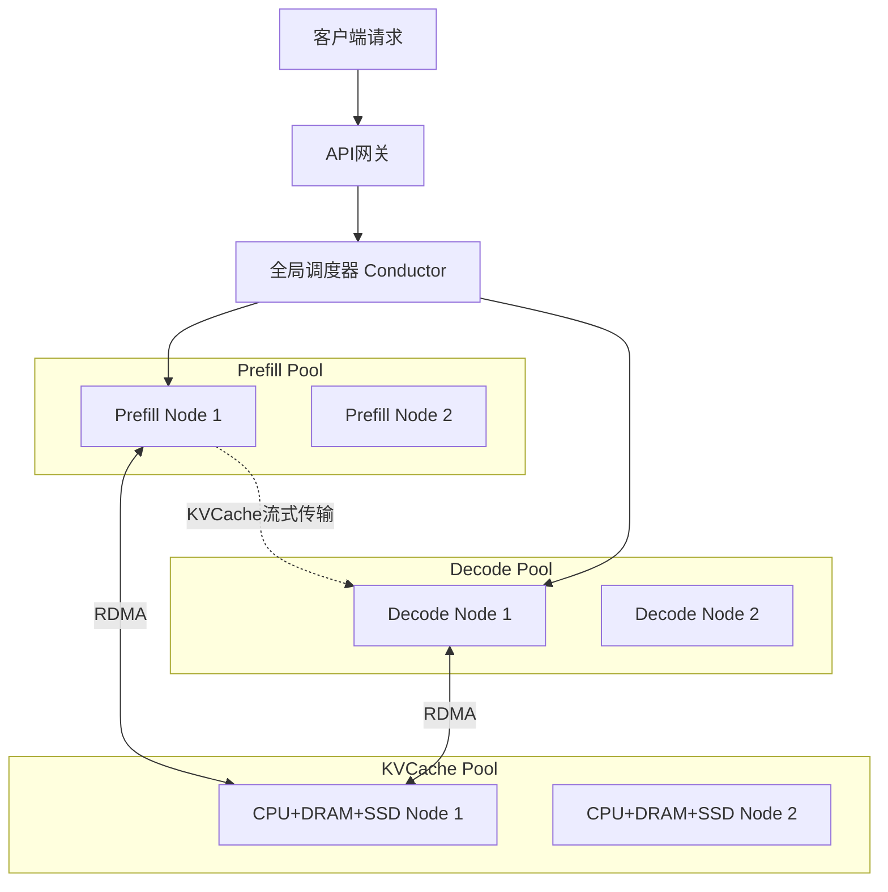

# Mooncake：以 KV Cache 为中心的分离式 LLM 服务架构

> **论文信息**：Mooncake: A KVCache-centric Disaggregated Architecture for LLM Serving
> **作者**：Ruoyu Qin, Zheming Li, Weiran He, Mingxing Zhang, Yongwei Wu, Weimin Zheng, Xinran Xu
> **机构**：Moonshot AI & 清华大学
> **arXiv**：2407.00079 (2024-07)
> **开源**：https://github.com/kvcache-ai/Mooncake

---

## 一、核心问题：KV Cache 瓶颈与 LLM 服务挑战

### 1.1 问题背景

Kimi 作为 Model as a Service (MaaS) 平台，需要在多项约束下进行优化：

**优化目标**：最大化整体有效吞吐量
**约束条件**：
- **TTFT** (Time To First Token)：$\text{TTFT}_{P90} = 10\times$
- **TBT** (Time Between Tokens)：$\text{TBT}_{P90} = 5\times$

### 1.2 Prefill 与 Decoding 的计算特征差异

| 阶段 | 计算特征 | 资源瓶颈 | 优化目标 |
|------|---------|---------|---------|
| **Prefill** | 所有输入 token 并行 | 计算密集型 | 减少 TTFT |
| **Decoding** | 自回归逐 token 生成 | 内存密集型 | 减少 TBT |

**关键洞察**：KV Cache 调度是 LLM 服务调度的核心。提升吞吐量有两条路径：
1. 复用 KV Cache 以减少计算
2. 增大 batch size 以提高 MFU

但两者都与延迟SLO冲突。

### 1.3 过载场景

- GPU 供给受限，用户请求呈指数增长
- 需要**预测未来负载并提前拒绝**，避免浪费计算

---

## 二、架构设计：三池分离



| 组件 | 功能 |
|------|------|
| **Conductor** | 全局调度、KV Cache 分布管理、热点块复制 |
| **Prefill Pool** | 独立预填充节点池，弹性扩展 |
| **Decode Pool** | 独立解码节点池，连续批处理 |
| **KVCache Pool** | CPU+DRAM+SSD 分布式缓存 |
| **Messenger** | 基于 GPUDirect RDMA 的高速 KV Cache 传输 |

---

## 三、关键技术创新

### 3.1 Chunked Pipeline Parallelism (CPP)

**问题**：长上下文（128K–1M token）的 prefill 需要跨节点并行，传统 TP 在跨节点场景中每层需要执行 2 次 RDMA all-reduce，导致 MFU 大幅下降。

**CPP 方案**：利用 decoder-only Transformer 的自回归特性

```
输入: [Chunk 1] [Chunk 2] [Chunk 3] [Chunk 4]
Node 1: ████████░░░░░░░░░░░░░░░░░░░░
Node 2: ░░░░░░░░████████░░░░░░░░░░░░
Node 3: ░░░░░░░░░░░░░░░░████████░░░░
Node 4: ░░░░░░░░░░░░░░░░░░░░░░░░████
```

**优势**：
- 仅在 pipeline 边界通信，可与计算重叠
- 自适应短/长上下文，无需动态调整分区

### 3.2 Layer-wise Prefill

逐层执行预填充，使 KV Cache 传输与计算重叠：

```
传统:     Layer 1: [Load]→[Compute]→[Store]→Layer 2: [Load]→...
Layer-wise: Layer 1: [Load]→[Compute]→[Store]
            Layer 2:          [Load]→[Compute]→[Store]
            Layer 3:                   [Load]→[Compute]→[Store]
```

**效果**：执行时间 ≈ `max(KVCache加载时间, 标准prefill时间)`

### 3.3 缓存感知的全局调度

```
Algorithm: KVCache-centric Scheduling
1. block_keys ← PrefixHash(R.prompt_tokens, B)
2. FindBestPrefixMatch(P, block_keys)
3. for instance ∈ P:
     if best_prefix_len/prefix_len < threshold:
       // 使用本地cache
       TTFT ← T_queue + T_prefill
     else:
       // 考虑传输远程cache
       TTFT ← T_transfer + T_queue + T_prefill
4. if TTFT > SLO or TBT > SLO: reject R
5. if best_prefix_len/p.prefix_len > threshold:
     TransferKVCache()  // 热点迁移
```

**前缀链式哈希**：
$$
\text{Hash}(block_i) = \text{Hash}(block_i \parallel \text{Hash}(block_{i-1}))
$$

### 3.4 面向过载的调度

#### Early Rejection

将 decode 负载评估提前到 prefill 之前，避免请求在 prefill 完成后才被拒绝，造成计算浪费。

#### 预测性早期拒绝

**问题**：Early Rejection 会导致 prefill 与 decode 的负载反向波动

```
Prefill: 高 ──── 低 ──── 高 ──── 低
Decode:  低 ──── 高 ──── 低 ──── 高
```

**方案**：系统级预测
- 假设 decode 耗时均匀为 $t_d$
- 预测时刻 $t$ 的 decode 负载
- 通过平均 TBT 比率预测负载

---

## 四、性能评估

| 场景 | 结果 |
|------|------|
| 模拟场景吞吐量 | 提升高达 **525%** |
| 真实工作负载 | Kimi 可处理的请求数增加 **75%** |
| 缓存命中率(50K blocks) | ~50% |
| 平均输入/输出比 | ~720:1 |

**调度策略对比**（8 prefill + 8 decode实例，23K真实请求）：

| 策略 | 平均TTFT | SLO达成率 |
|------|---------|----------|
| 随机 | 最高 | 最低 |
| 负载均衡 | 中等 | 中等 |
| 缓存感知 | 较低 | 较高 |
| **KVCache中心（本文）** | **最低** | **最高** |

---

## 五、在 Moonshot AI 技术路线中的地位

```
Mooncake (2407) → Kimi推理服务底座
    │
    ├── 支撑长上下文 → K2/K2.5 256K+ context
    ├── 分布式KVCache → 多轮对话/文档处理优化
    ├── 过载调度 → 大规模用户支撑
    └── 开源 → https://github.com/kvcache-ai/Mooncake
```

Mooncake 是 Kimi 系列的**推理服务基础设施**，可与后续模型能力协同演进：

| Kimi模型能力 | Mooncake支撑 |
|-------------|-------------|
| 更大参数规模 | 分布式KVCache管理 |
| 更长上下文 | CPP多节点prefill |
| 多模态 | 架构可扩展性 |
| 更多用户 | 预测性过载调度 |

---

## 六、关键技术公式

### 调度决策

$$
\text{TTFT} = T_{\mathrm{queue}} + T_{\mathrm{prefill}} + T_{\mathrm{transfer}}
$$

### 负载均衡阈值

$$
\frac{\text{best\_prefix\_len}}{\text{prefix\_len}} < \text{kvcache\_balancing\_threshold}
$$

### KV Cache 占用成本

$$
\text{Occupation Cost} = S \times T
$$

---

## Related Pages

- [[01_theory/index]]
- [[02_engineering/02_train_frameworks/megatron-lm/index]]
- [[02_engineering/01_pytorch/index]]
