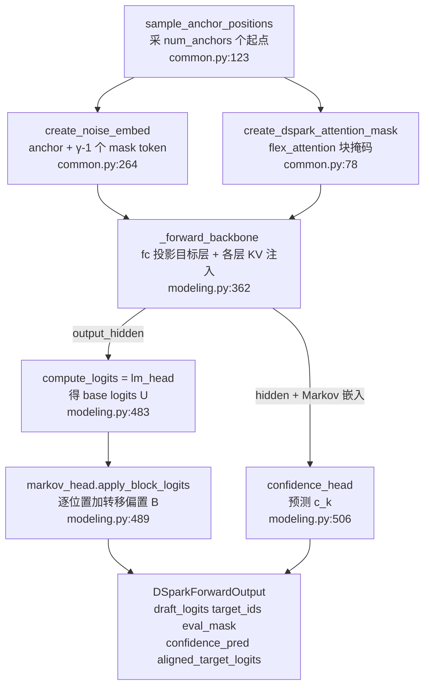
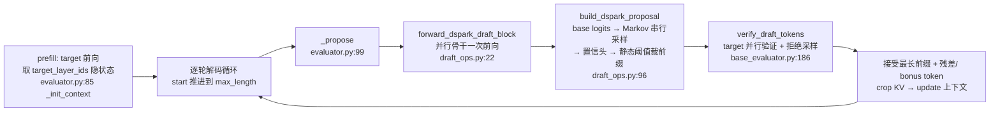

# DeepSpec 源码级分析 —— 一套训练框架同时产 Eagle3 / DFlash / DSpark 三种草稿模型

> **代码基准（Source baseline）**：`github.com/deepseek-ai/DeepSpec` @ `dd854392`（main, 2026-06-28，提交信息 "minor"）· MIT License · 本地 checkout `E:\97-codes\torch_parallel\DeepSpec`
> **分析维度**：Overview → Quick Start → Deep Dive（源码级，密集 `file:line`）
> **最后更新**：2026-06-29
>
> 本页回答：DeepSpec 这套「数据准备 → 草稿模型训练 → 投机解码评测」全栈代码**如何组织**，以及 **DSpark 论文里的公式（半自回归 / Markov 头 / 置信度头 / 三项损失）逐行落在哪**。论文机制与「为什么」见 [[dspark_analysis]]；本页只讲「代码里到底怎么写的」。

---

## 一、Overview（总览）

### 1.1 定位：算法驱动的草稿模型训练仓，不是推理引擎

DeepSpec 是 DSpark 论文随附的**开源训练/评测代码库**（README:3「a full-stack codebase for training and evaluating draft models for speculative decoding」）。它**不是** vLLM/SGLang 那样的推理服务引擎（投机解码在生产引擎里如何排程见 [[20_vllm_speculative_decoding_analysis]]），而是回答「**怎么把一个草稿模型训出来、并在标准 benchmark 上量它的接受长度**」。当前内置三种草稿算法（README:69）：

| 算法 | 草稿生成方式 | 代码位置 | 与 DSpark 模型的关系 |
|---|---|---|---|
| **Eagle3** | 自回归（TTT，1 层） | `deepspec/modeling/eagle3/` + `Qwen3Eagle3Trainer` | 独立实现，改编自 SpecForge（NOTICE） |
| **DFlash** | 并行（一次出整块） | **无独立 modeling**，靠 `config/dflash/*` | **= DSpark 模型关掉串行/置信头的消融**（见 §3.1） |
| **DSpark** | 半自回归（并行骨干 + 串行头） | `deepspec/modeling/dspark/` + `Qwen3DSparkTrainer` | 本仓主角 |

> [!important] 开源边界（源 > 期待）
> 仓库的**评测路径只实现到「置信度头 + 静态阈值裁剪 + `bsz=1` 标准拒绝采样」**。论文 §3.2.2 的**硬件感知多请求前缀调度器（Algorithm 1）、异步 ZOS、变长内核**都是 DeepSeek 内部生产系统（HAI-LLM / V4 serving）专属，**不在本仓**。下文 §3.5 标出这条边界的代码证据。

### 1.2 目录骨架

```text
DeepSpec/  @ dd854392
├── DSpark_paper.pdf            # 论文本体（arXiv 上的 2606.19348 是底座模型 V4，非本论文）
├── train.py / eval.py          # 两个入口：按 config 选 trainer / evaluator
├── config/                     # 算法 × 目标模型 的配置（纯 Python dict）
│   ├── dspark/   dspark_qwen3_{4b,8b,14b}.py, dspark_gemma4_12b.py
│   ├── dflash/   dflash_qwen3_{4b,8b,14b}.py, ...   # markov_rank=0 的 DSpark
│   └── eagle3/   eagle3_qwen3_{4b,8b,14b}.py, ...
├── deepspec/
│   ├── data/        jsonl_dataset / target_cache_dataset / parser / cuda_prefetcher
│   ├── modeling/
│   │   ├── dspark/  qwen3/ gemma4/ + markov_head.py + loss.py + common.py
│   │   └── eagle3/  qwen3/ gemma4/ + loss.py + common.py
│   ├── trainer/     base_trainer / dspark_trainer / eagle3_trainer / ckpt_manager
│   ├── eval/        base_evaluator + dspark/{evaluator,draft_ops,confidence_head} + eagle3/
│   └── utils/       sampling / distributed / optim / metrics / io / config
├── scripts/         data/（下载/再生成/建 target cache）, train/train.sh, eval/eval.sh
└── eval_datasets/   gsm8k math500 aime25 humaneval mbpp livecodebench mt-bench alpaca arena-hard
```

### 1.3 关键概念

| 概念 | 含义 | 代码锚点 |
|---|---|---|
| **target cache** | 预先把目标模型对每条 prompt 的回答 + 隐状态缓存到磁盘（Qwen3-4B 默认约 **38 TB**），训练时不再实时跑 target | `scripts/data/prepare_target_cache.py`、README:29 |
| **anchor** | 从训练序列随机采的「草稿起点」位置；每个 anchor 展开一个 $\gamma$-token 块 | `common.py:123 sample_anchor_positions` |
| **block_size `γ`** | 一个草稿块的位置数（默认 7；生产 V4 用 5） | `config/dspark/dspark_qwen3_4b.py:11` |
| **target_layer_ids** | 注入草稿器的目标层集合（默认 `[1,9,17,25,33]`，**不含最后一层**） | 同上 `:13`；校验 `base_evaluator.py:100` |
| **accepted length `τ`** | 每轮被接受 token 数（含 bonus），评测主指标 | `base_evaluator.py:482` |

---

## 二、Quick Start（快速上手）

三阶段顺序跑（README:15-49），每阶段产物喂下一阶段：

```bash
# 1. 数据准备：下载 prompt → 用目标模型再生成答案（需起 SGLang server）→ 建 target cache
bash scripts/data/prepare_data.sh        # 见 scripts/data/README.md；target cache 可达 ~38TB

# 2. 训练：config_path 选算法+目标模型；每张可见 GPU spawn 一个 worker
bash scripts/train/train.sh              # → train.py，config 默认 config/dspark/dspark_qwen3_4b.py
#    checkpoints 落到 ~/checkpoints/<project>/<exp>/step_*

# 3. 评测：在 9 个 benchmark 上量接受长度
bash scripts/eval/eval.sh                # → eval.py
#    target_name_or_path=Qwen/Qwen3-4B  draft_name_or_path=<ckpt 或 HF repo id>
```

**入口怎么分发**（`train.py`）：`parse_args` 读 `--config` 得到一个普通 Python 配置对象，`main` 直接 `args.train.trainer_cls(local_rank, args).train()`——**trainer 类写死在 config 里**（DSpark/DFlash 都用 `Qwen3DSparkTrainer`，Eagle3 用 `Qwen3Eagle3Trainer`），`torch.multiprocessing.spawn` 按 `cuda.device_count()` 起进程（`train.py:48-53`）。

**已发布 checkpoint**（README:58-62，对应论文 Table 1）：`deepseek-ai/{eagle3,dflash,dspark}_qwen3_{4b,8b,14b}_*` 与 `*_gemma4_12b_*`，均在 Open-PerfectBlend 上非思考模式训练。

---

## 三、Deep Dive（源码级深挖）

### 3.1 三种草稿模型在代码里的真实关系 —— DFlash 是 DSpark 的消融

最值得抓住的一点：**DFlash 没有独立 modeling 目录**。它复用 DSpark 的 `Qwen3DSparkModel` 与 `Qwen3DSparkTrainer`，只在 config 里**把串行头和置信头关掉**。对照三个 4B config：

| 字段 | DSpark | DFlash | Eagle3 |
|---|---|---|---|
| trainer | `Qwen3DSparkTrainer` | `Qwen3DSparkTrainer` | `Qwen3Eagle3Trainer` |
| 草稿层数 | `num_draft_layers=5` | `num_draft_layers=5` | `draft_num_hidden_layers=1` |
| 串行头 | `markov_rank=256, markov_head_type='vanilla'` | **`markov_rank=0`**（禁用） | — |
| 置信头 | `confidence_head_alpha=1.0` | **`confidence_head_alpha=0.0`**（禁用） | — |
| 损失 | `ce=0.1, l1(tv)=0.9` | **`ce=1.0, l1=0.0`**（CE-only） | `step_loss_decay=0.8`, TTT |
| 出处 | `config/dspark/dspark_qwen3_4b.py:9-29` | `config/dflash/dflash_qwen3_4b.py:9-27` | `config/eagle3/eagle3_qwen3_4b.py:10-16` |

这正是论文 §3.1「并行骨干（in our instantiation, DFlash）」的代码学注脚：**DSpark = DFlash 骨干 + Markov 串行头 + 置信度头**。`build_markov_head` 在 `markov_rank==0` 时直接返回 `None`（`markov_head.py:290`），于是同一个 `Qwen3DSparkModel` 退化成纯并行 DFlash。

### 3.2 DSpark 模型前向（训练路径）：`Qwen3DSparkModel.forward`

中心类 `Qwen3DSparkModel`（`modeling/dspark/qwen3/modeling.py:202`）。`__init__` 装配的关键子模块：

- `self.fc = nn.Linear(len(target_layer_ids)*hidden, hidden, bias=False)`（`:241`）—— 即论文 Eq.2 的**上下文投影 $W_c$**；`_forward_backbone` 里 `target_hidden_states = self.hidden_norm(self.fc(target_hidden_states))`（`:374`）= $\mathrm{RMSNorm}(W_c[\cdots])$。
- `self.markov_head = build_markov_head(config)`（`:253`）—— 串行头（见 §3.3）。
- `self.confidence_head = AcceptRatePredictor(input_dim = hidden + markov_rank)`（`:268`）—— 置信度头，输入维度因 `confidence_head_with_markov=True` 而**加上 markov_rank**（拼接 Markov 嵌入），正是 Eq.7 的 $[h_k;W_1[x_{k-1}]]$。
- `initialize_embeddings_and_head(freeze=True)`（`:271`）—— 拷贝并**冻结** target 的 embedding 与 lm_head（§3.3 训练设定）。

`forward`（`:389`）的训练前向链（一次并行算所有 anchor 块）：



两处 KV 注入细节（论文 Eq.3，`Qwen3DSparkAttention.forward`，`modeling.py:88`）：K/V 各自把**目标上下文**与**草稿块**沿序列维拼接——`k = cat([k_ctx, k_noise])`、`v = cat([v_ctx, v_noise])`（`:104-113`），且 `is_causal=False`（`:59`）→ 块内**双向**注意。这与 vLLM 里 EAGLE「shift-by-one + 自回归 k 步」的串行时序完全不同（对照 [[20_vllm_speculative_decoding_analysis]] §3.3）。

### 3.3 串行头：`markov_head.py` 的三个变体

`build_markov_head`（`markov_head.py:287`）按 `markov_head_type` 造头，全部继承 `VanillaMarkov`：

- **`VanillaMarkov`（默认, `:8`）**：`markov_w1 = nn.Embedding(vocab, markov_rank)` 即 $W_1$，`markov_w2 = nn.Linear(markov_rank, vocab, bias=False)` 即 $W_2$。`compute_step_bias = W2(W1[token])`（`:26-32`）逐字对应 Eq.5 的低秩转移 $B(x_{k-1},\cdot)=W_1[x_{k-1}]W_2$。`sample_block_tokens`（`:55`）是**推理时的串行采样循环**：逐位置 `apply_step_logits` 加偏置 → `sample_tokens` → 把采样结果当下一步 `prev_token_ids`。
- **`RNNHead`（`:125`）**：维护 `state`，`_rnn_step`（`:149`）把 `[state, prev_emb, h_k]` 经一个 `joint_proj`（`2r+d → 3r`，拆成 gate/candidate/output）做门控更新，对应 Eq.6。`apply_block_logits`（`:191`）训练时沿块展开。
- **`GatedMarkovHead`（`:93`）**：介于两者之间，用 `gate_proj` 对 `[hidden, prev_emb]` 算门控再缩放 Markov 嵌入。**论文正文未单列此变体**（论文只描述 Vanilla Markov + RNN），属代码里多出来的中间档；默认 config 用 `'vanilla'`。

> 训练（`apply_block_logits`）与推理（`sample_block_tokens`）的区别：训练 teacher-forcing 用真实 `prev_token_ids`、一次性给全块加偏置；推理是**真串行**，第 $k$ 步用第 $k{-}1$ 步**刚采出**的 token。这就是「半自回归」里那一点不可并行的串行成本（论文 Fig.4 测得仅 +0.2%~1.3% 整轮延迟）。

### 3.4 损失：`loss.py` 与论文 Eq.8-12 的逐行对应

`compute_dspark_loss`（`loss.py:255`）→ `_collect_local_terms`（`:90`）。三项：

- **接受率软标签**（Eq.8）：`accept_rate_3d = 1.0 - 0.5*(draft_probs - target_probs).abs().sum(-1)`（`:60-70`），即 $1-\tfrac12\lVert p^d-p^t\rVert_1$，clamp 到 `[0,1]`。这是置信头的监督目标，也是 TV 损失的核心量。
- **$\mathcal L_{ce}$**（Eq.9）：`F.cross_entropy(flat_logits, flat_targets)` 乘位置权重（`:112-114`）。
- **$\mathcal L_{tv}$**（Eq.10，代码叫 `l1_loss`）：`(draft_probs - target_probs).abs().sum(-1)` 乘权重（`:84-86`）。
- **$\mathcal L_{conf}$**（Eq.11）：`F.binary_cross_entropy_with_logits(confidence_pred, accept_rate_3d.detach())`（`:157`）—— 注意 target 是 `detach` 的软标签。
- **位置权重**（$w_k=\exp(-(k-1)/\gamma)$）：`_build_loss_weight_mask`（`:25-37`）`exp(-positions/loss_decay_gamma)`，`loss_decay_gamma=4.0`（config:26）。
- **合成**（Eq.12）：`_build_loss`（`:227`）`ce_alpha*ce + l1_alpha*tv + conf_alpha*conf`，默认 `0.1/0.9/1.0`。分布式下分母先 all-reduce 再相除（`:11-22`，保证跨 worker 加权一致）。

模型 `forward` 里 `aligned_target_logits`（`modeling.py:448-466`）把目标缓存的 `target_last_hidden_states` 对齐到每个草稿位、过本地 lm_head 得到 $p^t_k$——这正是 §5.1「隐状态通信 + 本地 LM head 投影」省带宽优化的训练实现。

### 3.5 推理与验证：标准拒绝采样 + **静态阈值裁剪**（非生产调度器）

评测入口 `Qwen3DSparkEvaluator`（`eval/dspark/evaluator.py:32`），核心循环在 `generate_decoding_sample`（`base_evaluator.py:307`，`@torch.inference_mode`，断言 **`bsz==1`**，`:331`）：



- **草稿提议**`build_dspark_proposal`（`draft_ops.py:96`）：`compute_logits` 得 base logits → `sample_draft_tokens`（走 Markov 头串行采样）→ 若有置信头，`_predict_confidence_logits`（`:57`，拼 `[hidden, prev_emb]`）→ **`_confident_prefix_length`（`:82`）按静态 `confidence_threshold` 砍掉首个低于阈值之后的所有位置**。这就是开源版的「verify smarter」——一个 per-request 静态阈值，**不是** Algorithm 1 的多请求负载感知调度。
- **验证**`verify_draft_tokens`（`base_evaluator.py:186`）：target 一次前向 $\gamma{+}1$ 个位置 → `accept_prob = clamp(p_target/p_draft, max=1)`（`:252`）→ `accept_mask.cumprod` 取最长合法前缀（`:257`）→ 若有拒绝，`sample_residual`（`:280`，残差分布重采样）；全接受则 `sample_from_probs` 出 bonus（`:285`）。即标准 speculative sampling（数学同 [[20_vllm_speculative_decoding_analysis]] §3.5），保证无偏。
- **指标**`build_metrics_row`（`base_evaluator.py:469`）：`acceptance_length`（含 bonus）、`verify_rate`、逐位置 `accept_rate@k`。

> [!note] 为什么开源版没有调度器
> `generate_decoding_sample` 强制 `bsz=1`，而 Algorithm 1 的 `SPS(B)` 吞吐曲线、全局贪心 admit 本质是**跨请求的 batch 级调度**——单序列下无从谈起。论文 §5.2-5.3 的异步 ZOS / 变长内核也依赖内部推理引擎。**复现生产数字必须以论文 §5 为准，开源代码只能复现 Table 1 的离线接受长度与置信度校准。**

### 3.6 置信度头校准评测：`eval/dspark/confidence_head.py`

注意此文件**不是置信度头本体**（头本体是 `common.py:43 AcceptRatePredictor`），而是**校准可靠性评测器** `ConfidenceHeadRecorder`（`:313`），仅在 `confidence_threshold == 0`（即不裁剪、纯诊断）时启用（`evaluator.py:47`）。`PerPositionConfidenceMetrics`（`:30`）逐位置累计 **ECE / AUROC / Brier**，对**累积积** `cumprod(sigmoid(confidence_logits))` 与真实前缀接受标签比对（`:363-375`），并画可靠性图（`plot_reliability_diagram:232`）——正是论文 Figure 6 的来源，量化 STS 校准前后 ECE 从 3%–8% 降到约 1%。

### 3.7 数据准备与目标缓存

`scripts/data/`（README + `prepare_target_cache.py`）：① `download_and_split.py` 取 prompt；② `generate_train_data.py` 起 `launch_sglang_server.sh` 用目标模型按推荐采样参数**再生成回答**（草稿必须学目标自己的分布，不是学原始语料）；③ `prepare_target_cache.py` 把目标隐状态/分布缓存到磁盘。训练时 `data/target_cache_dataset.py` + `cuda_prefetcher.py` 喂数据。缓存极大（Qwen3-4B 约 38 TB，README:29），是「冻结目标 + 蒸馏式训练草稿」范式的工程代价。

---

## Related Pages
- [[dspark_analysis]] —— DSpark 论文机制深挖（公式与「为什么」；本页是其代码对照）
- [[index]] —— 投机推理演进总览（MTP → Eagle3 → DFlash → DSpark）
- [[20_vllm_speculative_decoding_analysis]] —— 投机解码在推理引擎里的验收/拒绝采样实现

## Cross-Domain Links
- [[13_deepseek_v4_analysis]] —— DSpark 部署的底座模型 DeepSeek-V4
- [[12_deepseek_v3_analysis]] —— MTP 模型侧原理（DFlash/DSpark 对比的 MTP-1 基线之源）
