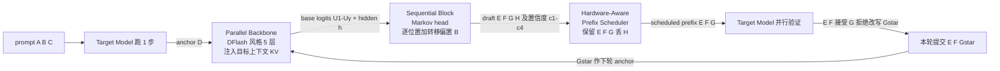

# DSpark —— 半自回归生成 + 置信度调度验证：把「画大草稿块」真正变成生产加速

> **核对基线（Source baseline）**：`DSpark_paper.pdf`（标题 *DSpark: Confidence-Scheduled Speculative Decoding with Semi-Autoregressive Generation*，Cheng et al.，北京大学 + DeepSeek-AI）＝ `github.com/deepseek-ai/DeepSpec` @ `dd854392`（main, 2026-06-28）仓库根目录的论文 PDF。代码交叉核对见 [[deepspec_codebase_analysis]]。
> **分析维度（路径）**：**Overview 总览（§1）→ Theory 理论基础（§2）→ Deep Dive 机制级深挖（§3–§7，逐贡献四拍：动机 → 机制 → 证据 → 为什么不选替代）**
> **最后更新**：2026-06-29
>
> 本页回答：DSpark 用「**并行骨干 + 轻量串行头**」的半自回归结构把并行草稿器的后缀崩塌（suffix decay）补回来，又用「**置信度头 + 硬件感知前缀调度器**」按系统负载动态裁剪验证长度，从而在 DeepSeek-V4 生产服务里相对 MTP-1 基线把单用户生成速度提升 60%–85%（V4-Flash）/ 57%–78%（V4-Pro）。投机推理三代（MTP / Eagle3 / DFlash / DSpark）的横向演进见 [[index]]。

> [!warning] 关于 arXiv 编号的订正（源 > 转述）
> 用户给出的 **arXiv:2606.19348** 经核对是 **DeepSeek-V4 模型论文**（*Towards Highly Efficient Million-Token Context Intelligence*，本库已审计，见 [[deepseek_v4_analysis]]），**不是** DSpark 论文。DSpark 是挂在 V4 checkpoint 上的**投机解码草稿模块**，其论文以 `DSpark_paper.pdf` 形式随开源仓 DeepSpec 发布（HF 模型卡 `DeepSeek-V4-Pro-DSpark` 里引用的 2606.19348 指的是**底座模型**论文）。本页一切定位符指向该 PDF 的页码（`===== PAGE N =====`），与 V4 模型论文无关。

> [!info] 阅读路径
> **§1 总览**给「是什么 + 一张图」；**§2 理论基础**补齐读懂 DSpark 必需的前置原理（投机解码的延迟公式与无偏性、自回归 vs 并行草稿器的权衡、DSpark 直接继承的 DFlash 骨干）；**§3 起进入机制级深挖**，逐贡献讲动机/机制/证据/为什么不选。只想要结论看 §1；想懂「为什么这么设计」必读 §2 再读 §3。

---

## 一、Overview（总览）

### 1.1 主张（thesis）与两大部件

DSpark 的一句话主张：**自回归草稿器与并行草稿器的优点可以同时拿到** —— 用一个深的**并行骨干**吃住「画得快 + 首 token 强」，加一个轻量**串行头**补回「块内依赖」，再用**置信度调度**把「验得聪明」做成随负载自适应。它对应论文 §3 的两个互补部件（p4）：

| 部件 | 解决延迟公式里的哪个杆 | 机制一句话 | 出处 |
|---|---|---|---|
| **半自回归生成**（论文 §3.1） | 升 $\tau$（接受更长），几乎不动 $T_{\text{draft}}$ | 并行骨干（= DFlash）出 base logits + 轻量串行头（Markov/RNN）逐位置加**前缀转移偏置** $B_k$ | p4-7, Eq.4-6 |
| **置信度调度验证**（论文 §3.2） | 降**有效** $T_{\text{verify}}$（不白验） | 置信度头估每位置**前缀存活概率** + 硬件感知调度器按 `SPS(B)` 吞吐曲线全局贪心选验证长度 | p7-9, Eq.7-8, Alg.1 |

> 「延迟公式」「三个杆」「$T_{\text{draft}}$ / $\tau$」这些记号在 §2.1 给出定义；「DFlash 骨干 / KV 注入」在 §2.3。本节只先建立「两个部件解决两件事」的整体认知。

### 1.2 解码循环（Figure 1 重绘）

> 注：图中 anchor token（D）与上一轮目标模型采出的 bonus token 是同一个（p4 脚注 1，"anchor token" 与 "bonus token" 在文中通用）。**离线基准里调度器被关闭、固定验证全块**（p11, §4.2），调度器只在生产上线（§6）。

---

## 二、Theory（理论基础）

> 本层不含 DSpark 的创新，只把读懂 §3 起所需的三块前置知识讲清：投机解码的延迟与无偏性（2.1）、两类既有草稿器的权衡（2.2）、DSpark 直接拿来当骨干的 DFlash（2.3）。

### 2.1 投机解码的延迟公式与无偏性 —— 三个可拨的杆

投机解码用便宜的**草稿模型 $M_d$** 提 $\gamma$ 个候选 token，**目标模型 $M_t$** 一次前向**并行验证**全部候选，按拒绝采样接受**最长合法前缀**并追加一个 bonus token（p2-3, §2.1）。逐位置接受判据：草稿在位置 $k$ 给出 $x_k$（草稿概率 $p^d_k$、目标概率 $p^t_k$），以 $\min(1,\,p^t_k(x_k)/p^d_k(x_k))$ 接受；首个拒绝位之后全部丢弃。可证复合分布**恰为目标分布**，故投机解码**与目标逐 token 采样严格同分布（无偏）**（验收侧内核与数学详见 [[vllm_speculative_decoding_analysis]] §3.5）。

论文把每生成 token 的平均延迟写成（p3, Eq.1）：

$$L=\frac{T_{\text{draft}}+T_{\text{verify}}}{\tau}$$

其中 $\tau$＝每轮被接受 token 数（含 bonus），$T_{\text{draft}}/T_{\text{verify}}$＝草稿/验证一次前向的墙钟时间。于是**提速只有三个杆**（p3）：① 降 $T_{\text{draft}}$（画得快）；② 升 $\tau$（画得准，平均接受长度大）；③ 降**有效** $T_{\text{verify}}$（验得聪明，别在必拒 token 上浪费目标算力）。后文每个贡献都对应某个杆。

### 2.2 草稿器架构谱系 —— 自回归 vs 并行的根本权衡

草稿器设计决定 $T_{\text{draft}}$ 与 $\tau$ 如何取舍，既有方法分两类（p3-4, §2.2）：

| 类别 | 代表 | 一次产出 | $T_{\text{draft}}$ | 块内依赖 | 软肋 |
|---|---|---|---|---|---|
| **自回归草稿器** | Eagle/Eagle3、**MTP** | 逐 token（条件于已采） | $\propto\gamma$（线性增长） | 有 | 被迫**短块 + 浅网络**以压住延迟 |
| **并行草稿器** | Medusa、**DFlash** | 一次前向出全部 $\gamma$ 个 | $\approx O(1)$（与块长几乎无关） | **无**（各位置独立预测） | **后缀接受率急剧衰减** + 无脑验证全块在高并发下降吞吐 |

- **自回归**靠显式依赖拿到强建模能力（高 $\tau$），但 $T_{\text{draft}}\propto\gamma$ 逼着它用小 $\gamma$ + 浅架构；为补短块，树验证（tree verification, Miao et al. 2024）把候选展成树、用 tree attention 验多条路径，但验证 token 暴涨又压低服务吞吐。
- **并行**一次出全块、$T_{\text{draft}}$ 与块长解耦，于是**能上深网络 + 大块**（如 $\gamma{=}16$）。代价是每位置**边缘化所有可能前驱**而非条件于实际采样的前缀，产生「多模态碰撞」、后缀崩塌；且「产得多」不等于「该验这么多」——高并发下盲验尾 token 挤占目标 batch 容量（p1-2, §1）。

> 这张权衡表就是 DSpark 的出发点：**§3 用半自回归同时吃下「并行的 $O(1)$ 草稿延迟 + 首 token 深网络容量」与「自回归的块内依赖」**；**§4 用置信度调度解决「并行大块该验多长」**。投机推理四代（MTP/Eagle3/DFlash/DSpark）沿这两轴的完整演进见 [[index]]。

### 2.3 DSpark 继承的并行骨干 —— DFlash 的 KV 注入与 anchor/mask

DSpark 的并行骨干**直接实例化为 DFlash**（p5, §3.1；DFlash = Chen et al. 2026, arXiv:2602.06036），所以读 §3 前需先懂 DFlash 这三点（p4, §2.2）：

1. **目标上下文 KV 注入**：prefill 时取目标若干层 $\{l_1,\dots,l_m\}$ 隐状态，拼接投影成上下文特征（Eq.2）

$$H_{\text{ctx}}=\mathrm{RMSNorm}\!\big(W_c[H^{(l_1)};\dots;H^{(l_m)}]\big),\qquad W_c\in\mathbb R^{d\times md}$$

   再沿序列维拼进**每个**草稿层的 K/V（Eq.3）：$K_i=[W_i^K H_{\text{ctx}};\,W_i^K H_d]$，$V_i=[W_i^V H_{\text{ctx}};\,W_i^V H_d]$。块内所有位置**双向**互注意 + 注意注入的目标上下文。代码对应 `common.py:52 extract_context_feature`（拼接）+ `modeling.py:241 self.fc`（即 $W_c$）+ `modeling.py:104-113`（K/V 拼接，`is_causal=False`），核对见 [[deepspec_codebase_analysis]] §3.2。
2. **anchor + mask 输入**：草稿模型共享并**冻结**目标的 embedding 与 LM head，输入＝一个 anchor token 的嵌入 + $\gamma$ 个 mask token 嵌入，一次前向产出所有 mask 位的 logits。
3. **单次前向、与块长无关**：正因如此 DFlash 才能在同等延迟预算下用比自回归更深的架构、更大的块。

> 一句话：DFlash 把「画得快 + 首 token 容量」做到了位，但**没有块内依赖**——这正是 §3 半自回归要补的那块。

---

## 三、Deep Dive ①：半自回归生成（升 τ，几乎不动 T_draft）

### 3.1 动机 —— 并行草稿器为何后缀崩塌

并行草稿器一次出 $\gamma$ 个 logits，每个位置**无法条件于块内其它已采 token**。当上下文存在多个合理续写（如 "of course" 与 "no problem"），并行器因为每个位置都在**边缘化所有可能前驱**而拼出 "of problem" / "no course" 这种跨模态碰撞（multi-modal collision），接受率沿块迅速衰减（p5, §3.1；Gu et al. 2018）。这同时浪费草稿与验证算力——而由 §2.1 知首 token 杠杆最大，尾部崩塌直接拖累整块 $\tau$。

### 3.2 机制 —— 在并行 base logits 上叠一个轻量串行修正

**并行段（沿用 §2.3 的 DFlash 骨干）**：一次前向产出隐状态 $h_1{\dots}h_\gamma$ 与 base logits $U_1{\dots}U_\gamma$。DSpark 对原始 DFlash 只做一处小改：**把 anchor 本身当作第一个预测位**，于是 $\gamma$ 个输入 token 直接产出 $\gamma$ 个草稿 logits（原始 DFlash 是 anchor + $\gamma$ masks 只预测 mask 位），省一份计算而草稿质量相当（p6）。

**串行段（DSpark 的新增）**：给 base logits 补一个**前缀相关的转移偏置** $B_k(x_0,x_{<k},x_k)$。不做全局归一化能量模型，而是用自回归因式分解诱导一个**因果块分布**（p6, Eq.4）：

$$P(X\mid x_0)=\prod_{k=1}^{\gamma}p_k(x_k\mid x_0,x_{<k}),\quad p_k(v\mid x_0,x_{<k})=\frac{\exp\!\big(U_k(v)+B_k(x_0,x_{<k},v)\big)}{\sum_{u\in\mathcal V}\exp\!\big(U_k(u)+B_k(x_0,x_{<k},u)\big)}$$

推理时串行块按 $p_k(\cdot\mid x_0,x_{<k})$ 从左到右采样。因为这一步天然串行，模块**必须极轻**（$T_{\text{sequential}}\ll T_{\text{parallel}}$），整体草稿延迟仍由并行段主导。两种串行头：

- **Markov head（默认）**：把 $B_k$ 限制为**只依赖前一个 token** 的一阶转移 $B(x_{k-1},x_k)$。原则上是 $V{\times}V$ 矩阵，用**低秩分解** $B=W_1W_2$（$W_1\in\mathbb R^{V\times r}$ 当查表、$W_2\in\mathbb R^{r\times V}$ 当投影）近似（p6, Eq.5）：

$$B(x_{k-1},\cdot)=W_1[x_{k-1}]\,W_2\in\mathbb R^{V}$$

  默认 $r{=}256$，存储与每步算力都小。回到前例：位置 1 采了 "of"，Markov head 在位置 2 提升 "course"、压低 "problem"，化解跨模态碰撞。代码对应 `markov_head.py:8 VanillaMarkov`（`markov_w1`=Embedding，`markov_w2`=Linear），交叉核对见 [[deepspec_codebase_analysis]] §3.3。
- **RNN head**：Markov 头只记一步；RNN 头维护贯穿整块的循环状态 $s_k$，把 $[s_{k-1};W_1[x_{k-1}];h_k]$ 经一次门控更新（p6, Eq.6），可看全前缀历史。代码 `markov_head.py:125 RNNHead`。

### 3.3 证据 —— 为什么并行/半自回归反而比全自回归接受更长

Table 1（p11，接受长度 $\tau$/轮，含 bonus token，越大越好；离线关调度器、固定全块）逐域显示 DSpark 全面胜出。Qwen3-4B 行节选：

| Target | Drafter | GSM8K | MATH | AIME25 | MBPP | HumanEval | LCB | MT-Bench | Alpaca | Arena-Hard |
|---|---|---|---|---|---|---|---|---|---|---|
| Qwen3-4B | Eagle3（自回归 1 层 TTT-7） | 5.14 | 4.62 | 3.92 | 3.69 | 4.16 | 3.77 | 2.39 | 2.26 | 2.55 |
| Qwen3-4B | DFlash（并行 5 层） | 5.40 | 4.85 | 4.15 | 4.40 | 4.74 | 4.18 | 3.07 | 2.96 | 2.83 |
| Qwen3-4B | **DSpark（半自回归 5 层）** | **6.11** | **5.70** | **4.89** | **5.13** | **5.38** | **4.86** | **3.64** | **3.54** | **3.29** |

宏平均（p2-3, p11）：DSpark 相对 **Eagle3** 提升接受长度 **30.9% / 26.7% / 30.0%**（Qwen3-4B/8B/14B），相对 **DFlash** 提升 **16.3% / 18.4% / 18.3%**，且跨模型族（Gemma4-12B）一致成立。

机制证据在 **Figure 2（position-wise conditional acceptance，p12）**：剥离前缀拒绝惩罚后，逐位置看「条件接受率」——

- **位置 1**：并行/半自回归因为能上深网络（$O(1)$ 延迟），首 token 容量显著高于浅层自回归 Eagle3（如 Math 上 DFlash 0.88 vs Eagle3 0.81，Chat 0.72 vs 0.53）。而投机解码是**严格前缀存活**过程，**首 token 杠杆最大**（首位拒绝直接作废整块），这份首位优势被放大到最终接受长度——这解释了「并行为何能全局赢过自回归」这一反直觉现象（p11-12, §4.3.1）。
- **位置 2–7**：纯并行 DFlash **后缀衰减**（Code 0.87→0.78，Chat 0.72→0.63）；自回归 Eagle3 反而随前缀确定性上升而**保持或走高**（Chat 0.53→0.74）。DSpark 用串行头把两者拼起来：**首位继承并行高容量（Math 起点 0.93）、尾部用一点自回归压住衰减**，全块维持高且稳的条件接受率（p12-13）。

补充消融：
- **深度（Figure 3, p13）**：固定块长，DSpark 随层数单调变好，1→2 层边际增益最陡；**2 层 DSpark 在所有域上胜过 5 层 DFlash** —— 注入局部自回归比单纯堆深并行层的「精度/参数」性价比高得多。
- **块长 + 延迟（Figure 4, p13-14）**：DSpark 在各块长都超 DFlash，且**差距随 $\gamma$ 增大而拉大**（$\gamma{=}7$：math/code/chat +16%/15%/18%；$\gamma{=}15$：+30%/26%/22%）；串行循环开销极小，块长从 4→16 只给整轮延迟加 **0.2%–1.3%**（batch=128），却换来最多 30% 的接受长度。

### 3.4 为什么不选显而易见的替代

- **不堆更深的并行层**：Figure 3 表明同等参数下「一点串行」比「更深并行」更划算。
- **不退回全自回归**：会重新背上 $T_{\text{draft}}\propto\gamma$，被迫短块浅网络，丢掉首 token 容量优势。
- **不用全局归一化的串行修正（CRF/CTC）**：CRF-NAT 也在并行隐状态上叠串行模块，但其**全局归一化配分函数**使得无法算出**精确的逐 token 概率**，而投机解码的拒绝采样**必须**要精确 $p_k$；CTC-drafter 因对齐路径的隐变量边缘化只能退化到 greedy 验证（p20-21, §6）。DSpark 把串行修正**保持在局部**（softmax 仍逐位置精确求值），所以拒绝采样仍严格无偏。

---

## 四、Deep Dive ②：置信度调度验证（降有效 T_verify）

### 4.1 动机 —— 「该验多长」同时取决于数据与系统负载

半自回归让 DSpark 能高效产大草稿块，但**产得多 ≠ 端到端更快**（p6-7, §3.2）。最优验证长度沿两轴变化：① **数据侧**——code 这类结构化文本接受率天然高，开放式 chat 低；② **系统侧**——轻载时多验一个 token 几乎免费，**高并发时**每个被拒 token 都在挤占本可服务其它请求的目标 batch 容量。固定长度验证因此要么在 chat 上浪费、要么在高负载下拖垮吞吐。

### 4.2 机制 —— 置信度头 + STS 校准 + 硬件感知前缀调度器

**置信度头（§3.2.1, p7, Eq.7）**：对每个草稿位 $k$ 输出标量 $c_k\in(0,1)$，建模「**在前缀全部被接受的条件下**，位置 $k$ 的草稿能通过目标验证」的**条件**概率：

$$c_k=\sigma\!\big(w^\top[h_k;\,W_1[x_{k-1}]]\big)$$

输入是骨干隐状态 $h_k$ 拼上 Markov 嵌入 $W_1[x_{k-1}]$（代码 `modeling.py:293 predict_confidence_step` 正是这个 concat；头本体 `common.py:43 AcceptRatePredictor`）。监督信号用**解析接受率**（p7, Eq.8）：

$$c^*_k=1-\tfrac12\,\lVert p^d_k-p^t_k\rVert_1$$

即草稿/目标分布的总变差距离（TV）——这正是该位置的逐步接受概率（Leviathan et al. 2023）。代码 `loss.py:69 accept_rate_3d = 1 - 0.5*(draft_probs-target_probs).abs().sum(-1)` 逐字对应。

**后验校准 STS（Sequential Temperature Scaling, p7, §3.2.1）**：调度器要的是**累积存活概率的绝对量级**（用于估期望接受长度 $\tau$），而非仅排序。神经置信度往往**过自信**，直接用会扭曲吞吐估计。STS 用留出验证集，**从左到右**对累积积 $\prod_{i\le k}c_i$ 逐位置做 1D 网格搜索找最优温度、最小化 ECE，且温度缩放**保序**（不破坏置信度头学到的相对排序）。Figure 6（p15）：原始头判别力强（ROC-AUC 0.81–0.90）但过自信（ECE 3%–8%），STS 后平均 ECE 降到约 1%。

**硬件感知前缀调度器（§3.2.2, Algorithm 1, p8）**：把「验多长」化为**全局吞吐最大化**。一批 $R$ 个请求，位置 $j$ 的存活概率是累积积 $a_{r,j}=\prod_{i\le j}c_{r,i}$；一步验证总 batch（token 计）$B=\sum_r(1+\ell_r)$，期望接受 $\tau=\sum_r(1+\sum_{j\le\ell_r}a_{r,j})$；设 `SPS(B)` 为引擎在 batch $B$ 下的步/秒吞吐曲线（**引擎初始化时离线 profile 一次**存成轻量代价表）。目标：

$$\max_{\{\ell_r\}}\ \Theta=\tau\cdot\mathrm{SPS}(B)$$

关键洞察：$a_{r,j}$ 关于 $j$ **单调非增**，把请求 $r$ 验证长度从 $j{-}1$ 扩到 $j$ 的边际接受增益恰为 $a_{r,j}$。于是**全局按 $a_{r,j}$ 降序贪心admit**即可，并用 $O(1)$ 查 `SPS` 表增量更新 $\Theta$（p8-9）。

**无偏性（non-anticipating 性质，p9）**：投机解码要求 admit 决策**不得依赖未来候选 token**。因置信度头用了「前一个已采 token」的 Markov 特征，回溯式全局搜索会把 $x_{r,k}$ 泄漏进第 $k$ 步的 admit 决策（Appendix A 给了反例）。Algorithm 1 用**早停 break**（吞吐一旦下降 `Θ ≤ Θ_best` 就停）把截断决策**只依赖到该步为止的前缀**，从而严格保因果、精确恢复目标分布。

### 4.3 证据

- **Figure 5（静态阈值扫描，p14-15）**：阈值升高→整体接受率稳升（头有效剔除了会被拒的尾 token）。**chat 上最明显**（接受率 45.7%→95.7%），math/code 较温和（76.9%→92.5% / 67.6%→92.0%）—— 印证「该裁多少」的强数据依赖。
- **Figure 8（生产负载自适应，p18-19）**：随并发上升，调度器把每请求验证预算从 MTP-1 的**静态 2 token** 动态扩到 **4–6 token**（轻载吃满空闲算力），高并发时再平滑收缩、在低置信尾 token 吃掉关键 batch 容量前就剪掉它们。

### 4.4 为什么不选静态阈值

静态阈值（Huang et al. 2024；Li et al. 2024b）在**单请求孤立**假设下有效，但**忽略系统负载**：低并发下验低置信 token 机会成本极小、高并发下却是灾难。DSpark 把它升级为**负载感知的全局吞吐优化**，这正是 MTP-3/5 这类静态多 token 草稿器**在高并发下严格降吞吐、因而生产上长期只敢用 MTP-1** 的根因所在（p18, §5.4）。

---

## 五、训练目标与系统优化

### 5.1 三项损失（p9, Eq.9-12）

目标模型全程冻结；草稿模型**共享并冻结** target 的 embedding 与 LM head，只更新骨干、串行块、置信度头（p9, §3.3）。三项损失都按 $w_k=\exp(-(k-1)/\gamma)$ 位置加权（强调对接受长度贡献更大的前部位置）：

| 损失 | 形式 | 作用 | 出处 / 代码 |
|---|---|---|---|
| $\mathcal L_{ce}$ | $-\sum_k w_k\log p^d_k(x^*_k)$ | 让草稿预测正确 next token | Eq.9 / `loss.py:112` |
| $\mathcal L_{tv}$ | $\sum_k w_k\lVert p^d_k-p^t_k\rVert_1$ | 拉近草稿/目标分布（TV 是接受率的直接代理） | Eq.10 / `loss.py:84`（代码名 `l1_loss`） |
| $\mathcal L_{conf}$ | $-\sum_k w_k[c^*_k\log c_k+(1{-}c^*_k)\log(1{-}c_k)]$ | BCE 训练置信度头逼近软接受标签 $c^*_k$ | Eq.11 / `loss.py:157` |

$$\mathcal L=\alpha_{ce}\mathcal L_{ce}+\alpha_{tv}\mathcal L_{tv}+\alpha_{conf}\mathcal L_{conf}\quad(\alpha_{ce}{=}0.1,\ \alpha_{tv}{=}0.9,\ \alpha_{conf}{=}1.0)$$

默认权重逐字对应 `config/dspark/dspark_qwen3_4b.py:22-28`（`ce_loss_alpha=0.1, l1_loss_alpha=0.9, confidence_head_alpha=1.0`）。训练数据从每条目标序列**随机采多个 anchor 位**组成 $\gamma$-token 块（p9；代码 `common.py:123 sample_anchor_positions`）。

### 5.2 生产侧系统优化（HAI-LLM, §5.1, p16）

- **隐状态通信**：不跨 worker 传目标全词表 logits（$V\approx10^5$ 带宽瓶颈），而是缓存 LM head 之前的隐状态、只对采样位置在草稿 worker 本地做 LM head 投影，把每 token 通信复杂度降到 $O(d)$。
- **anchor 受限序列打包**：从训练序列采固定数量 anchor，把这些孤立预测块用 **token 级注意力索引**（而非 2D mask）打包成稠密 batch，既保精确因果掩码、又把草稿算力与目标上下文长度解耦。

### 5.3 把 Algorithm 1 落到真实引擎（§5.2-5.3, p16-17）

Algorithm 1 假设平滑单峰的 `SPS(B)`，而真实硬件容量是**锯齿台阶**式跌落；且按步动态调度与 **CUDA Graph 重放 / 零开销调度 ZOS** 冲突。工程化适配：

- **异步调度**：ZOS 要求下一步 batch 在当前步完成前就确定，同步调度会拖停 GPU。改用**两步前**的置信度输出近似下一步验证容量、确定动态截断长度 $K$（转成动态 top-$K$ 选择）；当前步候选仍按**最新**累积置信度严格排序。因 admit 只看两步前的历史预测、与当前 token $x_{r,k}$ 的实现隔离，**异步反而天然形成因果屏障**——于是可以**去掉早停 break、做无约束全局搜索**翻过锯齿 cliff，同时保无偏（p16-17）。
- **变长 query 内核**：动态路由要求一个 batch 内支持变长验证前缀。把所有请求 token 摊平为独立元素、用**标记张量**经稀疏注意力实现传递块内依赖；DeepSeek-V4 架构上**只需改 index-attention 与 compress 两个内核**即可支持变长路由（p17）。

---

## 六、生产部署结果（§5.4, Figure 7-8）

DSpark 草稿模型与 DeepSeek-V4-Flash/Pro（preview）**协同部署**：并行骨干为 **3 个 MoE 层 + mHC（[[mHC]]）+ 滑窗注意力 128**，最大块长 $\gamma{=}5$，用 Markov 头（p16, §5.1）。基线 **MTP-1**（DeepSeek-V3 的单 token 自回归草稿）是 V4-preview 发布时的生产配置，**DSpark 上线后两周即取代之**；MTP-1 之所以长期只用单 token，正因静态多 token（MTP-3/5）在高并发下因过度验证严格降吞吐（p18, §5.4）。

| 引擎 | 对比基线 | 匹配吞吐下单用户提速 | 严格 SLA 下的「解锁」 | 出处 |
|---|---|---|---|---|
| DeepSeek-V4-Flash | MTP-1 | **+60% ~ +85%** TPS | 80 TPS SLA 下 +51% 吞吐；120 TPS（基线近崩溃）名义 +661% | Fig.7, p18 |
| DeepSeek-V4-Pro | MTP-1 | **+57% ~ +78%** TPS | 35 TPS SLA 下 +52% 吞吐；50 TPS 名义 +406% | Fig.7, p19 |

论文明确**不把高 SLA 点（+661%/+406%）当作可乘性加速**，而是当作「DSpark 把基线根本撑不住的严格交互档位变得可行、外推了服务 Pareto 前沿」的证据（p18-19）。Figure 8 给出机理：负载自适应的验证预算（MTP-1 静态 2 → DSpark 动态 4–6 token，高并发再收缩）。

**局限（p20）**：前缀调度器只能省**目标侧**验证浪费，**草稿侧**用并行骨干生成初始 $\gamma$-token 块的固定开销不可回收；对接受率本就很低的难 query，这份前置算力是沉没成本。未来方向：草稿内部按难度早退（difficulty-aware early exiting）。

---

## 七、与既有方法的关系（§6, p20-21）

- **并行草稿谱系**：P-EAGLE 并行化 EAGLE 式草稿；PARD/DART/**DFlash** 用扩散启发的预测一次出整块；DDTree 把它扩成可验证草稿树。改进 DFlash 的并发工作里，**Domino 的 CausalEncoder 在概念上与 DSpark 的 RNN 头相近**，DFlare 用层级融合解条件瓶颈。
- **系统感知调度谱系**：从置信启发式、学习型接受预测器到 bandit 策略，再到把投机解码当系统级调度问题、按实时负载与请求优先级优化 goodput（Hu et al. 2026 等）。
- **DSpark 的差异化定位**：既不是「又一个并行草稿器」，也不是「又一个静态置信阈值」——它把**半自回归草稿质量**与**负载感知的无偏调度**统一在一个框架里，且**保持串行修正局部化**以满足拒绝采样对精确逐 token 概率的硬约束。

> [!note] 开源 vs 生产的边界（重要，源 > 期待）
> **开源仓 DeepSpec 评测路径只跑到「置信度头 + 静态阈值裁剪」**（`draft_ops.py:82 _confident_prefix_length`，且评测强制 `bsz=1`，`base_evaluator.py:331`），**Algorithm 1 的硬件感知多请求调度器、异步 ZOS、变长内核都是生产（HAI-LLM / V4 serving）专属**，不在开源代码里。本页 §4.2（论文 §3.2.2）/ §5.3（论文 §5.2-5.3）/ §6（论文 §5）描述的是论文里的生产系统；要复现请以论文 §5 为准。代码层证据见 [[deepspec_codebase_analysis]]。

---

## Related Pages
- [[index]] —— 投机推理演进总览（MTP → Eagle3 → DFlash → DSpark 的横向对比）
- [[deepspec_codebase_analysis]] —— 开源仓 DeepSpec 源码级分析（论文公式 ↔ 代码逐行核对）
- [[vllm_speculative_decoding_analysis]] —— 投机解码在 vLLM 引擎里的验收/拒绝采样实现（含 mtp/dflash proposer）

## Cross-Domain Links
- [[deepseek_v4_analysis]] —— DSpark 的底座模型 DeepSeek-V4（arXiv:2606.19348）
- [[deepseek_v3_analysis]] —— MTP（多 token 预测）模型侧原理，即 DSpark 对比的 MTP-1 基线之源
- [[mHC]] —— 生产骨干用到的 Manifold-Constrained Hyper-Connections
